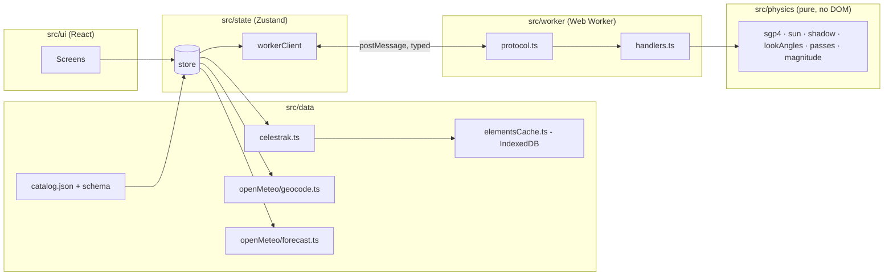

# What Is In Your Sky Right Now — Technical Plan

| Field | Value |
|---|---|
| Status | Draft v0.2 — for review (adds the sky-chart component design for spec decision UX-1) |
| Date | 2026-09-01 |
| Input | `SPEC.md` v0.4 (Decision Log §12 treated as fixed: OQ-1, OQ-3, OQ-4, OQ-11, UX-1 are not reopened here) |
| Scope | Architecture, project structure, module boundaries, data model, worker contract, testing strategy, and the Task Zero physics spike. **No task breakdown** — that is the next step. |

---

## 1. Fixed Inputs

These come from the spec's Decision Log and are not up for debate in this plan:

- **No backend in MVP.** Static site; browser talks to CelesTrak and Open-Meteo directly. Elements cached in IndexedDB, refreshed at most every 2 h.
- **Catalog** is a hand-maintained JSON of ~30 objects with intrinsic magnitudes and provenance.
- **Twilight rule:** list passes when the sun is below −6°; label passes with the sun between −6° and −12° as "sky still bright".
- **CelesTrak CORS** is verified; fallback order is the community TLE API, then pulling the v1 proxy forward.
- **Stack:** React + TypeScript + Vite, static deploy.
- **Sky chart (UX-1):** a 3D ASCII sky dome the user can rotate and tilt, plus a 2D polar fallback over the same data; both DOM-only, no WebGL, no canvas. Monospace / terminal aesthetic across the whole UI.

Everything in spec §5 ("Technical Architecture", marked *proposal*) was reviewed. Where this plan agrees, it is simply adopted below. Where it disagrees, the disagreement and rationale are in §2.

---

## 2. Decisions (challenges to the spec's architecture proposal)

| ID | Spec proposal (§5) | Decision | Why |
|---|---|---|---|
| **D-1** | Magnitude formula: `m = m_std − 15.75 + 5·log10(range_km) − 2.5·log10(sin β + (π−β)·cos β)` | **Corrected to** `m = m_std + 5·log10(range_km / 1000) − 2.5·log10( p(β) / p(90°) )` with `p(β) = sin β + (π−β)·cos β`. | The spec's constant is inconsistent with its phase term. The `−15.75` constant belongs to the *fraction-illuminated* form (`+2.5·log10(r²/f)`, where `f = 0.5` at half phase contributes the 0.75). Combining it with a Lambert phase function that also encodes half-phase double-counts 0.75 mag, making every object appear ~0.75 mag brighter than intended. The corrected form returns exactly `m_std` at 1 000 km and 90° phase, which is the definition of standard magnitude. Unit test pins this anchor point. **Spec §5.4 should be amended at the next revision.** |
| **D-2** | Sun position from `astronomy-engine` *or* `suncalc` | **`astronomy-engine`**, wrapped behind a local `sun.ts` module exposing exactly two functions: sun altitude at an observer (geometric, no refraction) and sun unit vector in the true-equator-of-date frame. | `suncalc` is ~1° class accuracy and has no vector output; the shadow test needs a sun vector. astronomy-engine's equator-of-date (EQD) frame is within arcseconds of the TEME frame satellite.js uses, which is far below what the shadow and twilight tests need. Wrapping it keeps the physics module swappable and keeps the rest of the code free of the library's API. Refraction is off because twilight definitions (−6°, −12°) are geometric. |
| **D-3** | `date-fns`/`date-fns-tz` or a Temporal polyfill; `tz-lookup` as optional | **No date library and no `tz-lookup`.** All times are epoch milliseconds (`number`); display formatting uses `Intl.DateTimeFormat` with the observer's IANA zone from Open-Meteo. | Every formatting need in the spec (HH:MM:SS in a named zone, zone abbreviation, countdowns) is covered by `Intl`. A date library adds bundle weight and a second notion of time. Pure-coordinate input has no zone until the forecast response arrives; until then the UI shows UTC with an explicit "UTC" label — a few hundred milliseconds of latency, not worth a 100 KB timezone database. |
| **D-4** | Zustand *or* React context + `useReducer` | **Zustand** (vanilla store + React bindings). | Worker messages, the 10 s "now" tick, and IndexedDB events all arrive outside the React tree. A vanilla store that can be written from a plain module (the worker client) is simpler than threading dispatch functions into non-React code. Slices stay small and typed. |
| **D-5** | Tailwind *or* CSS Modules | **CSS Modules + CSS custom properties.** No Tailwind. | The UI has a handful of screens and a strong single theme (dark, high contrast, later red night mode). Design tokens as custom properties make the night mode a one-selector swap and carry the monospace/terminal identity (FR-X-6): one `--font-mono` stack, a `--cell` unit equal to one character advance so layout aligns to the same grid the sky dome is drawn on. Avoids a build-time framework and keeps the CSP free of `unsafe-inline` styles. |
| **D-6** | "Web Worker" with an AbortController-style cancel; no protocol defined | **Hand-written typed `postMessage` protocol** (discriminated unions, §6), job IDs, and **cooperative cancellation** by yielding between objects. No Comlink. | Comlink hides the message boundary, which makes streaming partial results and cancellation awkward. A 12-message protocol is small enough to type by hand and test as a pure function in Node. The worker yields to its event loop between objects so a `cancel` message can be observed. |
| **D-7** | Refine peak by golden-section search; sample visibility "every 1–5 s" | **Sample every 1 s inside each above-horizon segment; bisection only for the two 10° crossings.** Peak taken from the 1 s samples with a parabolic refinement across the three samples around the maximum. | With ~30 objects and passes of ≤ 12 min, 1 s sampling is ≈ 20 k propagations per night — trivial. It yields ≤ 1 s precision (FR-VIS-2) for shadow and twilight crossings for free, removes one algorithm (golden section) and its failure modes, and gives the sky-chart track as a by-product. |
| **D-8** | Cylindrical umbra, Earth radius 6371 km, "optional atmosphere fudge" | **Cylindrical umbra, radius 6371.0 km, no fudge, no penumbra in MVP.** The "fading" flag is dropped from MVP. | Keep the model simple until the Task Zero comparison shows a systematic shadow-entry offset versus Heavens-Above. A fudge factor without evidence is a guess. Penumbral fading lasts seconds for LEO and the 1 min acceptance criterion does not resolve it. |
| **D-9** | Fetch `visual` + `stations`, filter client-side | Adopted, plus: **store the raw group payloads unfiltered in IndexedDB**, keyed by group, and filter to the catalog at load time. | Lets v1 widen the catalog to the full `visual` group with no cache schema change and no re-fetch. Costs ~100 KB of storage. |
| **D-10** | "Enforced against the stored timestamp, across tabs and reloads" | **Web Locks API (`navigator.locks`) single-flight around the refresh check**, with fallback to timestamp-only when Web Locks is unavailable. | Two tabs opened together would otherwise both see a stale timestamp and both fetch. A named lock makes the check-then-fetch atomic across tabs. Web Locks is available in all evergreen browsers and Safari ≥ 15.4. |
| **D-11** | Clock-skew warning using a server `Date` header | **Dropped from MVP.** Moves to v1 behind the proxy. | With no backend, the only servers are cross-origin, and `Date` is not a CORS-safelisted response header, so the browser cannot read it. Open-Meteo's `current.time` is a model slot, not a clock. No honest way to implement it in MVP. |
| **D-12** | Hosting: any of Cloudflare Pages / Netlify / Vercel / GitHub Pages | **Cloudflare Pages.** | It supports a `_headers` file for a strict CSP, sits on the same platform as the v1 edge worker, and its free tier is sufficient. GitHub Pages remains a zero-config fallback for previews. |
| **D-13** | Not addressed | **No client-side router in MVP.** Single screen; pass detail is a full-screen sheet. The selected pass ID is mirrored to the URL hash so v1 share links have somewhere to land. | One screen does not justify a router. The hash keeps the door open. |
| **D-14** | "Now" state "using the cached propagation" | **"Now" is computed in the worker on request** (30 propagations at `t = now`), not from cached tracks. | Cached tracks only cover passes; the "Now" panel must also explain *why* nothing is visible (daylight / in shadow / below horizon), which needs live sun altitude and per-object state. Thirty propagations every 10 s is negligible. |
| **D-15** | Not addressed | **Every physics function takes time as an explicit parameter; nothing in `src/physics` or `src/worker` reads `Date.now()`.** | Determinism for golden tests and for Playwright with a fixed clock. |
| **D-16** | UX-1: 3D ASCII sky dome, DOM-only (library-neutral in the spec) | **Render the dome with `@glyphcss/react` (v0.1.x, MIT), confined to one component behind the `SkyChartProps` interface (§8).** Triggers for replacing it: (a) it cannot meet FR-GUIDE-6 (≥ 30 updates/s while dragging on a mid-range phone) at a grid of ~60×30 cells after the §8.5 spike; (b) a needed capability is missing and unfixable from outside (interior camera or backface control if the observer-centred view is later required, hotspot precision, clamped orbit limits); (c) the package stops being maintained — no release or response for 6 months while we carry a blocking bug; (d) a licence or security problem. Replacement path is a hand-written rasteriser behind the same props, and the 2D polar sibling is the interim fallback. | It is the only DOM-text 3D mesh renderer with a React binding that we found; it satisfies FR-GUIDE-5 by construction (one `<pre>`, no canvas, no WebGL, no per-polygon elements). Writing an equivalent rasteriser is a real project. The pre-1.0 API, single-maintainer fork lineage (forked from polycss) and small user base are accepted **only because** the boundary in §8 makes it swappable. |
| **D-17** | UX-1: "rotate/tilt the view toward the horizon they'll face" | **Default camera is an external "over-the-shoulder" orthographic view of the dome** (`GlyphOrthographicCamera` + `GlyphOrbitControls` with `clampPitch`), yaw set to the pass's rise azimuth so the user sees the dome from behind the observer, looking toward that horizon. The strictly observer-centred view (camera at the dome centre looking outward, perspective) is **not** the MVP default; recorded as open question P-OQ-1 in §8.6. | The external view uses only documented camera behaviour (`rotX`/`rotY`/`zoom`) and keeps left/right correct relative to the real horizon (facing south, east appears on the left, as in life). An interior camera needs the perspective camera inside a mesh with inward-facing polygons visible; glyphcss documents neither interior placement nor backface culling. We will test it in the spike, but the plan cannot depend on it. |

---

## 3. Architecture Overview



**Dependency rules** (enforced with `eslint-plugin-import` `no-restricted-paths`):

| Module | May import from | Must not import |
|---|---|---|
| `src/physics` | `satellite.js`, `astronomy-engine`, `src/physics/*` | React, DOM APIs, `src/data`, `src/state`, `src/ui` |
| `src/worker` | `src/physics`, `src/worker/*`, shared types | React, DOM (other than the worker global), `src/data`, `src/state` |
| `src/data` | `idb`, `zod`, shared types | React, `src/state`, `src/ui`, `src/worker` |
| `src/state` | `src/data`, `src/worker/protocol` (types only), `src/lib` | `src/ui`, physics internals |
| `src/lib` | shared types, `src/physics` **types only** | React, `src/state`, `src/data` |
| `src/ui` | `src/state`, `src/lib`, shared types | `src/data`, `src/worker`, `src/physics` directly |
| `src/ui/components/guide/skychart/dome/**` | everything `src/ui` may, plus `@glyphcss/react` | — |
| everything else | — | **`@glyphcss/react`** (the only place it may be imported is the `dome/` directory above) |

Shared types live in `src/model/` and import nothing.

---

## 4. Project Structure

```
what-is-in-your-sky-right-now/
├── SPEC.md
├── PLAN.md
├── package.json
├── vite.config.ts
├── tsconfig.json  tsconfig.app.json  tsconfig.node.json
├── eslint.config.js
├── public/
│   ├── _headers                    # Cloudflare Pages: CSP and cache headers
│   └── favicon.svg
├── src/
│   ├── main.tsx
│   ├── model/                      # shared types only, zero imports
│   │   ├── catalog.ts  elements.ts  observer.ts  pass.ts  weather.ts  thresholds.ts
│   │   └── index.ts
│   ├── physics/                    # pure functions; the thing Task Zero validates
│   │   ├── constants.ts            # MIN_ELEVATION, SUN_ALT_MAX, TWILIGHT_LABEL, MAG_LIMIT, EARTH_RADIUS_KM, steps
│   │   ├── time.ts                 # epoch ms <-> Date/JD helpers used by satellite.js and astronomy-engine
│   │   ├── sgp4.ts                 # wraps satellite.js: omm -> satrec, propagate -> ECI
│   │   ├── frames.ts               # ECI(TEME) -> ECF, observer geodetic -> look angles
│   │   ├── sun.ts                  # wraps astronomy-engine: sunAltitudeDeg(obs, t), sunVectorEqd(t)
│   │   ├── shadow.ts               # inUmbra(posEci, sunVec)
│   │   ├── magnitude.ts            # phaseAngle, apparentMagnitude (D-1)
│   │   ├── visibility.ts           # isVisibleAt(...) predicate and reasons
│   │   ├── passes.ts               # findPasses(satrec, observer, window, thresholds) -> Pass[]
│   │   ├── now.ts                  # nowState(satrecs, observer, t, thresholds)
│   │   └── index.ts
│   ├── worker/
│   │   ├── protocol.ts             # WorkerRequest / WorkerResponse unions (§6)
│   │   ├── handlers.ts             # pure: (state, request, emit) -> void; testable in Node
│   │   └── passes.worker.ts        # thin: onmessage -> handlers, yields between objects
│   ├── data/
│   │   ├── catalog/
│   │   │   ├── catalog.json        # the ~30 objects (FR-SAT-1/5)
│   │   │   └── schema.ts           # zod schema; also used by scripts/check-catalog.ts
│   │   ├── celestrak.ts            # fetchGroup('visual'|'stations') -> OmmRecord[] (zod-validated)
│   │   ├── elementsCache.ts        # idb store, fetchedAt per group, Web Locks single-flight (D-9, D-10)
│   │   ├── elementsLoader.ts       # orchestrates cache -> network -> filter to catalog -> SatelliteRecord[]
│   │   ├── openMeteo/
│   │   │   ├── geocode.ts          # search(q) -> Place[]
│   │   │   ├── forecast.ts         # cloudForecast(lat, lon) -> WeatherSnapshot
│   │   │   └── schemas.ts
│   │   ├── weatherCache.ts         # 30 min per 0.1° cell, in-memory + localStorage
│   │   └── localPrefs.ts           # last observer, chart orientation, etc.
│   ├── state/
│   │   ├── store.ts                # Zustand store composed of slices
│   │   ├── slices/ location.ts  elements.ts  passes.ts  weather.ts  now.ts  prefs.ts
│   │   ├── workerClient.ts         # owns the Worker instance; request/response correlation; cancel
│   │   └── effects.ts              # wiring: on observer change -> recompute; 10 s now tick; refresh timers
│   ├── lib/                        # presentation helpers, pure
│   │   ├── compass.ts              # azimuth -> 16-point name
│   │   ├── phrases.ts              # elevation words, brightness phrases, guide sentence (FR-GUIDE-1/3)
│   │   ├── timeFormat.ts           # Intl-based formatting in observer zone (D-3)
│   │   ├── cloudVerdict.ts         # FR-WX-2/4 weighting and interpolation
│   │   └── skyGeometry.ts          # az/el -> unit vector on the dome; az/el -> polar x,y (equidistant azimuthal); arc resampling. Shared by both chart views
│   ├── ui/
│   │   ├── App.tsx
│   │   ├── screens/ Home.tsx  PassDetail.tsx
│   │   ├── components/
│   │   │   ├── location/ LocationInput.tsx  PlacePicker.tsx  CoordsInput.tsx  UseMyLocation.tsx
│   │   │   ├── now/ NowPanel.tsx
│   │   │   ├── passes/ PassList.tsx  PassCard.tsx  IssHeroCard.tsx  SortToggle.tsx
│   │   │   ├── guide/ GuideText.tsx  PassNumbers.tsx
│   │   │   ├── guide/skychart/          # §8 — the isolation boundary
│   │   │   │   ├── SkyChart.types.ts     # SkyChartProps (the contract both views implement)
│   │   │   │   ├── SkyChart.tsx          # chooses dome or polar view; the only import the rest of the app uses
│   │   │   │   ├── dome/                 # the ONLY directory allowed to import @glyphcss/react
│   │   │   │   │   ├── SkyDome.tsx       # implements SkyChartProps with GlyphScene/GlyphMesh/GlyphHotspot
│   │   │   │   │   ├── domeGeometry.ts   # pure: passes -> Polygon[] strips, ring/meridian polygons, hotspot anchors
│   │   │   │   │   └── camera.ts         # pure: rise azimuth -> initial rotX/rotY/zoom; pitch clamp constants
│   │   │   │   └── polar/
│   │   │   │       └── SkyPolar.tsx      # implements SkyChartProps as an SVG all-sky chart (FR-GUIDE-2b/4)
│   │   │   ├── weather/ CloudBadge.tsx
│   │   │   └── common/ Countdown.tsx  Banner.tsx  Footer.tsx (attributions)
│   │   └── styles/ tokens.css  global.css
│   └── vite-env.d.ts
├── scripts/
│   ├── validate-iss.ts             # Task Zero (§10) — runs the physics module in Node
│   └── check-catalog.ts            # live: every catalog NORAD id present in visual|stations groups
├── tests/
│   ├── fixtures/
│   │   ├── omm/                    # recorded CelesTrak JSON, dated
│   │   ├── heavens-above/          # hand-transcribed pass tables, dated, with capture metadata
│   │   └── open-meteo/             # recorded geocode + forecast responses
│   ├── e2e/                        # Playwright
│   └── setup/                      # fake-indexeddb, MSW handlers
└── .github/workflows/ ci.yml  live-contract.yml (scheduled, non-blocking)
```

Unit tests are co-located (`*.test.ts` beside the source). `tests/` holds fixtures, e2e, and shared setup.

---

## 5. Data Model

All times are `EpochMs = number` (UTC). All angles in the model are **degrees**; conversion to radians happens inside `src/physics` only. Distances are kilometres.

```ts
// src/model/catalog.ts
export type NoradId = number;
export type SatCategory = 'station' | 'payload' | 'rocket-body';
export interface CatalogEntry {
  noradId: NoradId;
  name: string;                       // display name, e.g. "ISS (Zarya)"
  category: SatCategory;
  stdMag: number;                     // standard magnitude at 1000 km, 90° phase (D-1)
  stdMagSource: { source: string; date: string; note?: string }; // FR-SAT-5 provenance
  description?: string;               // one sentence for the card
  featured?: boolean;                 // ISS hero card (spec §8 rank 1)
}

// src/model/elements.ts — CelesTrak OMM JSON field names, verbatim
export interface OmmRecord {
  OBJECT_NAME: string; OBJECT_ID: string; NORAD_CAT_ID: number;
  EPOCH: string;                      // ISO 8601, UTC
  MEAN_MOTION: number; ECCENTRICITY: number; INCLINATION: number;
  RA_OF_ASC_NODE: number; ARG_OF_PERICENTER: number; MEAN_ANOMALY: number;
  EPHEMERIS_TYPE: number; CLASSIFICATION_TYPE: string; ELEMENT_SET_NO: number;
  REV_AT_EPOCH: number; BSTAR: number; MEAN_MOTION_DOT: number; MEAN_MOTION_DDOT: number;
}
export type ElementGroup = 'visual' | 'stations';
export interface CachedGroup { group: ElementGroup; fetchedAt: EpochMs; records: OmmRecord[] }
export interface SatelliteRecord {          // what the UI and worker share; satrec stays in the worker
  catalog: CatalogEntry;
  omm: OmmRecord;
  epochMs: EpochMs;                         // parsed from omm.EPOCH, for the age warning (FR-SAT-4)
}

// src/model/observer.ts
export type ObserverSource = 'geocode' | 'coords' | 'device';
export interface Observer {
  lat: number; lon: number; altM: number;
  label: string;                            // "Neuquén, Neuquén, Argentina" or "−38.93, −67.99"
  source: ObserverSource;
  timeZone: string | null;                  // IANA; null until known (D-3)
  accuracyM?: number;                       // Geolocation only
}

// src/model/thresholds.ts
export interface VisibilityThresholds {
  minElevationDeg: number;                  // 10
  sunAltMaxDeg: number;                     // −6
  twilightLabelSunAltDeg: number;           // −12
  magLimit: number;                         // 4.5
}
export interface TimeWindow { startMs: EpochMs; endMs: EpochMs }

// src/model/pass.ts
export interface PassPoint { t: EpochMs; azDeg: number; elDeg: number; rangeKm: number }
export type PassBoundaryReason = 'horizon' | 'shadow' | 'twilight';
export interface Pass {
  id: string;                               // `${noradId}-${start.t}`
  noradId: NoradId; name: string;
  start: PassPoint; peak: PassPoint; end: PassPoint;
  startReason: PassBoundaryReason;          // rose above 10° | exited shadow | sky got dark enough
  endReason: PassBoundaryReason;
  durationS: number;
  peakMagnitude: number;
  sunAltAtPeakDeg: number;
  twilight: boolean;                        // FR-VIS-7: sun in (−12°, −6°] at peak
  track: PassPoint[];                       // 10 s samples over [start, end] for the sky chart
  elementsEpochMs: EpochMs;                 // provenance
}

export interface NowItem {
  noradId: NoradId; name: string;
  azDeg: number; elDeg: number; rangeKm: number;
  magnitude: number | null;                 // null when below horizon or in shadow
  lit: boolean; aboveMinElevation: boolean; visible: boolean;
  visibleUntil?: EpochMs; endReason?: PassBoundaryReason;
}
export type SkyState = 'day' | 'bright-twilight' | 'dark';   // sun > −6°, (−12°, −6°], ≤ −12°
export interface NowState { t: EpochMs; sunAltDeg: number; sky: SkyState; items: NowItem[] }

// src/model/weather.ts
export interface HourlyCloud { t: EpochMs; totalPct: number; lowPct?: number; midPct?: number; highPct?: number }
export interface WeatherSnapshot {
  provider: 'open-meteo';
  lat: number; lon: number; cellKey: string;   // "-38.9,-68.0"
  fetchedAt: EpochMs; timeZone: string;
  hourly: HourlyCloud[];                        // covers at least the prediction window
}
export type CloudState = 'clear' | 'partly' | 'obscured' | 'unknown';
export interface CloudVerdict { state: CloudState; effectivePct: number | null; at: EpochMs }
```

Persistence:

| Store | Mechanism | Key | Content |
|---|---|---|---|
| Elements | IndexedDB (`idb`), DB `wiys`, store `elementGroups` | `group` | `CachedGroup` (raw, unfiltered — D-9) |
| Last observer, chart orientation, sort order | `localStorage` | `wiys:prefs:v1` | JSON |
| Weather | in-memory `Map` + `localStorage` `wiys:wx:v1` | `cellKey` | `WeatherSnapshot`, evicted after 30 min |
| Geocode results | in-memory `Map` | normalised query | `Place[]`, session only |

---

## 6. Web Worker: Computation and Message Contract

### 6.1 What runs where

| Concern | Main thread | Worker |
|---|---|---|
| Fetch + cache elements, catalog filtering | ✔ | |
| `omm → satrec` conversion, holding satrecs | | ✔ |
| Pass search over the window (SGP4, frames, sun, shadow, magnitude) | | ✔ |
| "Now" state every 10 s | | ✔ (on request) |
| Weather fetch, cloud verdict per pass | ✔ | |
| Guide text, compass names, formatting, sky projection | ✔ | |

The worker is a single module worker (`new Worker(new URL('./passes.worker.ts', import.meta.url), { type: 'module' })`), instantiated once by `workerClient.ts`. It holds `Map<NoradId, { satrec, catalog }>` in memory. Reloading elements replaces the map.

### 6.2 Protocol (`src/worker/protocol.ts`)

```ts
export type WorkerRequest =
  | { type: 'loadElements'; requestId: string; records: SatelliteRecord[] }
  | { type: 'computePasses'; jobId: string; observer: Observer; window: TimeWindow; thresholds: VisibilityThresholds }
  | { type: 'computeNow'; requestId: string; observer: Observer; t: EpochMs; thresholds: VisibilityThresholds }
  | { type: 'cancel'; jobId: string };

export type WorkerResponse =
  | { type: 'elementsLoaded'; requestId: string; loaded: NoradId[]; rejected: { noradId: NoradId; reason: string }[] }
  | { type: 'passes'; jobId: string; noradId: NoradId; passes: Pass[] }          // streamed, one per object
  | { type: 'progress'; jobId: string; done: number; total: number }
  | { type: 'jobDone'; jobId: string; cancelled: boolean; elapsedMs: number }
  | { type: 'nowState'; requestId: string; state: NowState }
  | { type: 'error'; ref: { jobId?: string; requestId?: string }; code: WorkerErrorCode; message: string };

export type WorkerErrorCode = 'NO_ELEMENTS' | 'BAD_OMM' | 'PROPAGATION_FAILED' | 'INTERNAL';
```

Rules:

- **Correlation.** Every request carries a `jobId` (long-running) or `requestId` (one-shot). Responses echo it. The client ignores responses for IDs it no longer tracks (stale jobs after cancel).
- **Streaming.** `computePasses` emits one `passes` message per object as soon as that object is finished, then `jobDone`. The UI renders progressively; the ISS is processed first (catalog `featured` objects go first in the loop).
- **Cancellation (D-6).** The handler loop `await`s a zero-delay yield (`MessageChannel` ping) between objects so queued `cancel` messages are processed. A cancelled job still emits `jobDone { cancelled: true }`. The client auto-cancels the previous `computePasses` job when issuing a new one.
- **Errors.** `BAD_OMM` is per-object and reported inside `elementsLoaded.rejected`, never fatal. `PROPAGATION_FAILED` for one object skips that object and continues. `INTERNAL` aborts the job.
- **Serialisation.** All payloads are plain JSON-compatible objects (structured clone, no class instances, no `Date`). `satrec` never crosses the boundary.
- **Testability.** `handlers.ts` exports `createHandler(state) => (req, emit) => Promise<void>` with no reference to `self`/`postMessage`. `passes.worker.ts` is four lines binding it. Node tests drive the handler directly.

### 6.3 Pass search algorithm (as implemented in `physics/passes.ts`)

Inputs: one `satrec`, `Observer`, `TimeWindow`, `VisibilityThresholds`, `stdMag`. Output: `Pass[]`.

1. **Coarse scan** at 30 s from `window.startMs` to `window.endMs`: propagate, convert to look angles, record `elDeg`. Group consecutive samples with `elDeg > 0` into candidate segments. Extend each segment by one coarse step on each side. (Any LEO pass reaching 10° spends well over 60 s above 0°, so a 30 s grid cannot skip one.)
2. **Refine horizon crossings**: within each candidate segment, bisect `elDeg − minElevationDeg = 0` on the entering and leaving flanks to ≤ 0.5 s. If the segment never reaches `minElevationDeg`, drop it.
3. **Dense sampling** at 1 s from rise(10°) to set(10°): for each sample compute `elDeg`, `azDeg`, `rangeKm`, `sunAltDeg` (observer), `lit` (shadow test), `phaseAngle`, `magnitude`. The visibility predicate is `el ≥ min && sunAlt ≤ sunAltMax && lit`.
4. **Visible interval** = longest contiguous run where the predicate holds. Drop the pass if none. `startReason`/`endReason` = whichever of the three conditions changed at the boundary (`horizon` if the run touches the 10° crossing). Boundary times are the 1 s sample edges (meets FR-VIS-2).
5. **Peak** = sample with max `elDeg` inside the visible interval, refined by a parabola through its neighbours (D-7).
6. **Magnitude** = value at peak (D-1). Drop the pass if `> magLimit`.
7. `twilight = sunAltAtPeak > twilightLabelSunAltDeg`. `track` = every 10th dense sample plus the exact start/peak/end points.

Shadow test (`physics/shadow.ts`): with `r` the satellite ECI position and `ŝ` the sun unit vector, `d = r·ŝ`; in umbra iff `d < 0` and `|r − d·ŝ| < 6371.0`.

Frame note: satellite.js propagates in TEME; `astronomy-engine`'s equator-of-date vector is used directly as the sun direction (D-2). The ~arcsecond difference is irrelevant at this precision.

---

## 7. Data Layer

### 7.1 Elements (`data/elementsLoader.ts`)

```
loadElements():
  lock = navigator.locks?.request('wiys:elements', async () => {      # D-10
    for group in ['stations', 'visual']:
      cached = idb.get(group)
      if cached && now - cached.fetchedAt < 2h: continue
      try: records = celestrak.fetchGroup(group)   # GET https://celestrak.org/NORAD/elements/gp.php?GROUP=<g>&FORMAT=json
           idb.put({group, fetchedAt: now, records})
      catch: if !cached: rethrow; else mark 'stale' (UI banner)
  })
  merged = dedupe by NORAD_CAT_ID (stations wins) over both groups
  return catalog.map(entry => find(merged, entry.noradId)) — missing entries logged + reported to UI as "unavailable"
```

- Response validated with a zod schema; individual bad records are dropped, not fatal.
- `fetchedAt` is the *client* clock at fetch time; epoch age (FR-SAT-4) uses `omm.EPOCH`.
- Background refresh: `effects.ts` schedules a re-check every 15 min while the tab is visible; the 2 h rule is enforced in the loader, not the timer.
- Offline: if IndexedDB throws (Safari private mode), fall back to an in-memory cache for the session and show the "not cached" banner.

### 7.2 Geocoding (`data/openMeteo/geocode.ts`)

`GET https://geocoding-api.open-meteo.com/v1/search?name=<q>&count=8&language=en&format=json`. Debounced 500 ms in the input component; results memoised per normalised query. Each result maps to `Place { name, admin1, country, lat, lon, elevationM, timeZone }`. Selecting a place produces an `Observer { source: 'geocode', label: "name, admin1, country", timeZone }`.

### 7.3 Weather (`data/openMeteo/forecast.ts`)

`GET https://api.open-meteo.com/v1/forecast?latitude=&longitude=&hourly=cloud_cover,cloud_cover_low,cloud_cover_mid,cloud_cover_high&forecast_days=3&timezone=auto&timeformat=unixtime`. Four variables, three days → one API call per fetch. Cached 30 min per 0.1° cell (FR-WX-5). The response's `timezone` fills `Observer.timeZone` when the observer came from coordinates or the device (D-3).

`lib/cloudVerdict.ts`: linear interpolation of each layer to the pass peak time between the two bracketing hours; `effective = 0.6·low + 0.3·mid + 0.1·high` when layers are present, else `total`; states at < 30 / 30–70 / > 70 %. Missing snapshot → `unknown`.

### 7.4 Catalog (`data/catalog/catalog.json`)

Validated at build time by `schema.ts` (zod) in a Vitest test, so a malformed entry fails CI. `scripts/check-catalog.ts` (manual / scheduled, live network) confirms every `noradId` is present in `visual` or `stations` and prints the ones that are not, so decayed objects get removed. Initial membership is OQ-2 and is produced during Task Zero.

---

## 8. Sky Chart Component (spec UX-1)

### 8.1 Isolation boundary

The rest of the app knows one component, `SkyChart`, and one props interface. Nothing outside `src/ui/components/guide/skychart/` imports `@glyphcss/react` (enforced by the lint rule in §3).

```ts
// src/ui/components/guide/skychart/SkyChart.types.ts
export interface SkyChartProps {
  passes: Pass[];                       // what to draw; usually one, may be several for a "tonight" overview
  observer: Observer;                   // for labels/time zone; geometry is already observer-relative
  highlightedPassId: string | null;     // emphasised arc + peak; others drawn dim
  onSelectPass?: (passId: string) => void;
  now?: EpochMs;                        // optional: marks the satellite's current position on its arc
  initialFacingAzDeg?: number;          // default: highlighted pass's start.azDeg (D-17)
  className?: string;
}

export interface SkyChartView {         // both implementations export this shape
  Component: React.ComponentType<SkyChartProps>;
  id: 'dome' | 'polar';
  label: string;
}
```

- `SkyChart.tsx` renders the dome view by default and the polar view when the user toggles (preference persisted in `localPrefs`). It is the *only* file that knows two implementations exist.
- `SkyDome.tsx` (glyphcss) and `SkyPolar.tsx` (SVG) both implement `SkyChartProps` exactly; a contract test (§9.1) mounts each with the same fixture and asserts the same accessible text and the same set of labelled anchors (N, E, S, W, pass names, peak).
- All geometry that is *not* glyphcss-specific — az/el → unit vector, arc resampling, polar projection — lives in `lib/skyGeometry.ts` and is shared, so the two views cannot drift.
- Text alternative (FR-GUIDE-7): `SkyChart.tsx` wraps either view in a `<figure>` whose `<figcaption>` holds the FR-GUIDE-1 sentence; the view's own grid is `aria-hidden`.

### 8.2 Coordinate mapping (dome frame)

Right-handed, **Y up**, unit radius, observer at the origin:

```
x =  cos(el) · sin(az)      # east
y =  sin(el)                # up
z = -cos(el) · cos(az)      # north is −z, so azimuth increases clockwise when seen from above
```

This is a *provisional* convention: glyphcss does not document its handedness or up axis. `domeGeometry.ts` builds everything through one `toDome(azDeg, elDeg): Vec3` function so a sign flip found in the spike is a one-line change. The spike (§8.5) fixes the convention by rendering the four cardinal hotspots and checking they land where expected.

### 8.3 Scene composition

| Element | glyphcss construct | Built from |
|---|---|---|
| Scene | `GlyphScene mode="wireframe" useColors={false} autoSize cellAspect≈2` | Grid sized by the container; a monochrome palette (`ascii` or `lines`) keeps the CSP strict (see risk below) and matches FR-X-6. |
| Horizon ring | `GlyphMesh polygons={…}` — a thin closed strip of quads at `el = 0°`, 72 segments | `domeGeometry.horizonRing()` |
| Altitude rings 30°/60° | Same, thinner and sparser (every other segment) so they read as dashed | `domeGeometry.altitudeRing(elDeg)` |
| Meridians to the 8 compass points | Thin strips from horizon to zenith at az = 0, 45, …, 315; the four cardinal ones full, the four intercardinal ones dashed | `domeGeometry.meridian(azDeg)` |
| Pass arc | One `GlyphMesh` per pass: a thin polygon strip (quads) through `pass.track` resampled to ~2° steps along the arc, width ≈ 1.5° so it rasterises as a continuous line; radius 1.0 | `domeGeometry.passStrip(pass)` |
| Direction of travel | Every Nth quad of the strip omitted near the end, plus the label `→` in the end hotspot | `domeGeometry.passStrip` options |
| Peak marker | A small diamond (two triangles) on the arc at `pass.peak`, slightly outside the dome (radius 1.02) so it wins the raster | `domeGeometry.peakMarker(pass)` |
| Shadow-entry marker | Same shape, different glyph via a distinct hotspot label | `domeGeometry.pointMarker(point)` |
| Current position (`now`) | Marker interpolated along `track` | `domeGeometry.pointMarker` |
| Cardinal labels | `GlyphHotspot at={toDome(az, 0)}` with a `<span>` child `N`/`NE`/… positioned just outside the ring (radius 1.08) | `domeGeometry.compassAnchors()` |
| Pass labels | `GlyphHotspot` at the rise point (satellite name + rise time) and at the peak (`max 62°`) | `domeGeometry.passAnchors(pass)` |
| Highlight | Highlighted pass drawn as a wider strip; others narrower. With colours off, weight is the only channel — acceptable, verified in the spike | props → geometry options |
| Camera | `GlyphOrthographicCamera rotX={pitch} rotY={yaw} zoom={z}`; initial `yaw = initialFacingAzDeg` mapped through the frame convention, `pitch ≈ 25°` (horizon and peak both visible) | `camera.initialFor(pass)` |
| Controls | `GlyphOrbitControls drag wheel={false} clampPitch` | Pitch clamped to roughly 5°–80° so the user can neither go under the horizon nor to a pure top-down view (which is what the polar chart is for). Keyboard: arrow keys adjust yaw/pitch in 15°/5° steps via component state, satisfying FR-GUIDE-2's keyboard requirement independently of glyphcss's own key handling. |

Why our own strips rather than a built-in `sphere`: the built-in sphere in wireframe mode draws its own tessellation, which would compete with the arcs and rings, and it cannot be dashed or labelled. A few hundred quads of our own is a smaller scene, reads like a chart, and mirrors the 2D view's features one-to-one.

Rendering cadence: glyphcss re-rasterises only on camera/scene change. Our scene changes only when `passes`, `highlightedPassId`, or `now` change; `now` updates at the 10 s tick, so a static dome costs nothing between interactions.

### 8.4 Facing readout and orientation

FR-GUIDE-4 requires the dome to display its facing direction as text. `SkyDome.tsx` derives `facingAzDeg` from the current yaw (inverse of the camera mapping) and renders `facing SSW · tilt 25°` under the grid. There is no mirror toggle for the dome (the camera *is* the orientation). The polar view keeps the looking-up / map toggle.

### 8.5 Spike (part of the MVP phase, before any other UI work on the guide)

A half-day, throwaway page that renders one fixture pass with the composition above and answers, with screenshots committed to `docs/spike-glyphcss/`:

1. Frame convention — do N/E/S/W hotspots land at the expected positions for `rotY = 0`? Fix `toDome` accordingly.
2. Legibility — is a 1.5°-wide strip continuous at 60×30 and 100×50 cells on a 390 px-wide viewport? Adjust strip width / resampling.
3. Performance — FR-GUIDE-6: drag for 5 s on a mid-range Android phone with Chrome's performance panel; ≥ 30 rasterisations/s at the chosen grid, main-thread frame under 33 ms.
4. Interior camera — can `GlyphPerspectiveCamera` sit at the origin and see the inside of the strips? Informs P-OQ-1.
5. `useColors` — does the coloured mode emit inline `style` attributes (breaks the strict CSP) or class names? Decides whether colour is available at all under our CSP.
6. Bundle cost of `@glyphcss/react` + `@glyphcss/core` after tree-shaking (loaders for OBJ/glTF/VOX must not be pulled in).

Failing 3 with no configuration fix triggers D-16's replacement path before the guide UI is built.

### 8.6 Open questions specific to this plan

| ID | Question | Default until answered |
|---|---|---|
| P-OQ-1 | Camera model: external over-the-shoulder view (D-17) vs. observer-centred interior view. The interior view is closest to the spec's wording ("the horizon they'll face") but depends on undocumented library behaviour and gives a fish-eye feel on an orthographic grid. | External view. Revisit after spike item 4; if the interior view works and reads better in a five-person hallway test, it becomes a *third* mode behind the same props, not a replacement. |
| P-OQ-2 | Cell aspect and grid size on phones: 60×30 keeps text legible but quantises angles to ~5°; 100×50 is finer but characters become tiny. | Autosize with a minimum cell width of 7 px; readout of exact angles is the numeric table's job, not the dome's. |
| P-OQ-3 | Colour under a strict CSP (spike item 5). | Monochrome; highlight by line weight and label. If glyphcss uses class names, allow one colour for the highlighted pass. |

## 9. Testing Strategy

### 9.1 Layers

| Layer | Tool | Runs where | What it proves |
|---|---|---|---|
| Physics unit tests | Vitest (Node) | CI, every push | Each function against analytic or published reference values (below). |
| **Golden pass tests** | Vitest (Node), fixtures | CI, every push | Whole pipeline reproduces Heavens-Above passes within tolerance (§10). Offline, deterministic. |
| Worker handler tests | Vitest (Node) | CI | Protocol behaviour: streaming order, cancel, error isolation, featured-first. Drives `createHandler` directly. |
| Worker integration | Vitest browser mode (Chromium) | CI | The real `Worker` boots, loads elements, returns passes — catches bundling and structured-clone issues. |
| Data layer | Vitest + MSW + `fake-indexeddb` | CI | Cache TTL, single-flight, stale fallback, schema rejection, 0.1° weather cells, debounced geocode. |
| Presentation helpers | Vitest | CI | Compass names at boundaries, elevation words, brightness phrases, guide sentence golden strings, cloud verdict interpolation, `skyGeometry` (unit vectors for the cardinal points and zenith, polar projection for both orientations, arc resampling preserves start/peak/end). |
| Sky chart geometry | Vitest | CI | `domeGeometry` is pure: strip quad count for a fixture pass, every vertex on the unit sphere (±1e−9), peak marker at radius 1.02, hotspot anchors at the eight compass azimuths; `camera.initialFor` yields yaw = rise azimuth and pitch within the clamp. |
| Sky chart contract | Vitest + React Testing Library | CI | Both `SkyDome` and `SkyPolar` mounted with the same `SkyChartProps` fixture expose the same accessible text (caption sentence), the same labelled anchors (N/E/S/W, pass name, peak), fire `onSelectPass` with the same id, and the grid is `aria-hidden`. |
| Sky dome raster snapshot | Vitest + RTL (jsdom) | CI | The `<pre>` text for one fixture pass at a fixed camera is snapshotted; glyphcss rasterises deterministically, so a diff means either an intentional geometry change or a library upgrade changed output. Snapshot is regenerated deliberately, never auto-updated. |
| Sky dome interaction | Playwright | CI | Drag changes the facing readout; arrow keys change it in fixed steps; pitch cannot leave the clamp; toggle to polar view keeps the same pass highlighted. |
| Sky dome performance (FR-GUIDE-6) | Manual + Playwright trace | Spike, then release checklist | Rasterisations per second during a scripted drag on a mid-range phone; threshold ≥ 30/s. Not a CI gate (device-dependent). |
| Components | Vitest + React Testing Library | CI | Location inputs (validation, denial path), Now panel states, pass card content, twilight and cloud badges, attributions present. |
| E2E | Playwright, `page.clock` fixed, routes mocked to fixtures | CI | Coordinates → pass list → detail; geocode pick list; offline reload shows cached passes. |
| Performance budget | Vitest | CI | 30 objects × 24 h in < 1.5 s in CI Node (proxy for < 1 s on a desktop and ≈ 3 s on a phone). |
| Live contract | Vitest, `LIVE=1` | Scheduled daily, non-blocking | CelesTrak and Open-Meteo responses still parse; catalog membership check; CORS header still `*`. |

### 9.2 Physics unit references

- `time.ts`: known Julian date pairs (J2000 epoch; 2026-09-01T00:00Z).
- `frames.ts`: GMST against a published value; a satellite placed directly over the observer must yield `el = 90°`; one at the observer's horizon distance yields `el ≈ 0°`.
- `sun.ts`: sun altitude at a known sunset (NOAA solar calculator value for a fixed date/place) within 0.1°; sun vector norm = 1; declination for a solstice date.
- `shadow.ts`: constructed geometry — satellite on the anti-sun axis at 400 km is in umbra; the same radius perpendicular to the axis is lit; a sun-side point is lit.
- `magnitude.ts`: anchor `m(1000 km, 90°) = stdMag`; `m(2000 km, 90°) = stdMag + 1.505`; full phase brighter than half phase (D-1).
- `passes.ts`: a synthetic circular polar orbit with a fabricated OMM produces passes with symmetric rise/set elevations, correct duration ordering, and no pass when the observer is in daylight for the whole window.

### 9.3 Determinism rules

- No `Date.now()` in `physics/`, `worker/`, or `lib/` (lint rule `no-restricted-globals` scoped to those directories). Time always enters as a parameter.
- Fixtures are dated and immutable; a fixture is never regenerated in place — a new dated file is added.
- Tests never call the network except the `LIVE=1` suite.

---

## 10. Task Zero — Physics Validation Spike

**Purpose.** Prove that the pure `src/physics` module reproduces a trusted predictor before any UI exists. This is the highest-risk part of the project; everything else is ordinary web work.

**Deliverable.** `scripts/validate-iss.ts` (runs with `tsx`), a committed fixture pair, a committed Vitest golden test that re-runs the comparison offline, and a short `tests/fixtures/heavens-above/README.md` describing the capture procedure.

**Observer.** lat **−38.93**, lon **−67.99**, altitude 0 m (Neuquén / Alto Valle, Argentina). Time zone for the comparison: **UTC** on both sides, to eliminate zone errors as a variable.

**Pass criterion (given).** Every predicted ISS pass in the comparison window must match the corresponding Heavens-Above pass within **1 minute** in time and **5°** in azimuth and elevation, at each of the three reported points (start, maximum, end).

### 10.1 Procedure

1. **Capture Heavens-Above.** On Heavens-Above, set the observer to the coordinates above and the time zone to UTC; open the ISS *visible passes* table for the next 10 days. **Transcribe by hand** (Heavens-Above prohibits scraping) into `tests/fixtures/heavens-above/<YYYY-MM-DD>-neuquen-iss.json`: for each pass, date, start/max/end time, altitude and azimuth at each, and the listed brightness. Record the capture timestamp (UTC).
2. **Capture elements within the same hour.** `GET https://celestrak.org/NORAD/elements/gp.php?GROUP=stations&FORMAT=json` → `tests/fixtures/omm/<YYYY-MM-DD>-stations.json`, with the fetch timestamp. Both captures must use elements of essentially the same epoch; a stale set on either side is the most likely cause of a > 1 min discrepancy, so the README records both epochs.
3. **Run the pipeline** with `findPasses` for NORAD 25544 over the same window, `minElevationDeg = 10`, `sunAltMaxDeg = −6`, no magnitude cut (Heavens-Above's brightness filter is undocumented; brightness is compared separately).
4. **Pair passes** by maximum time (nearest within ± 15 min). Unpaired passes on either side are reported.
5. **Compare** each pair: |Δt| at start/max/end; |Δaz| (wrapped) and |Δel| at each. Print a table and a PASS/FAIL line per pass and overall.
6. **Brightness** (informational, not part of the criterion): our peak magnitude vs. Heavens-Above's listed magnitude, to sanity-check D-1 and the ISS `stdMag` value in the catalog.

### 10.2 Exit criteria

- All paired passes satisfy the 1 min / 5° criterion at all three points.
- No unpaired Heavens-Above pass (we found everything they list).
- Any pass we list that Heavens-Above omits must be explainable (documented per pass): e.g. it is `twilight = true` and Heavens-Above applies a stricter sun-altitude rule, or its peak magnitude is fainter than their cut. Unexplained extras are a FAIL.
- The comparison is committed as `physics/passes.golden.test.ts` and runs in CI in under 2 s.
- Start/end reasons (`horizon` / `shadow` / `twilight`) match Heavens-Above's implied ones (they mark shadow entry with a distinct end condition) for every pass.

### 10.3 If it fails — debugging order

1. **Time base.** Compare a single propagated ECI position at a fixed instant against `satellite.js`'s own test vector; check ms↔JD conversion and that `EPOCH` is parsed as UTC.
2. **Frames.** Check GMST and the sign convention of longitude in the observer (satellite.js expects radians, east-positive).
3. **Sun vector frame.** Verify the sun vector is equator-of-date, not J2000/ecliptic, by checking its declination against a known value for the date.
4. **Shadow.** Compare shadow-entry times only; if systematically early/late by ~10–20 s, revisit D-8 (radius / penumbra) with evidence in hand.
5. **Elements epoch mismatch.** Re-capture both sides together.

### 10.4 Secondary outputs of Task Zero

- The initial `catalog.json` membership (OQ-2): the ~30 objects, with `stdMag` and provenance.
- Confirmation that `satellite.js` `json2satrec` accepts CelesTrak's JSON field names as-is (else a mapping layer goes in `sgp4.ts`).
- A measured Node runtime for 30 objects × 24 h, to set the performance-budget threshold in §9.1.

Two further observer locations (one northern mid-latitude, one near the equator) are recorded as golden fixtures in the MVP phase, not in Task Zero.

---

## 11. Build, Deploy, Tooling

- **Vite** with `@vitejs/plugin-react`; worker bundled by Vite's native worker support; `build.target = 'es2022'`.
- **TypeScript** `strict`, `noUncheckedIndexedAccess`, `exactOptionalPropertyTypes`.
- **ESLint** flat config: `typescript-eslint` strict, `react-hooks`, `import` with the boundary rules from §3, `no-restricted-globals` for `Date` in the deterministic directories.
- **Cloudflare Pages** (D-12). `public/_headers`:

  ```
  /*
    Content-Security-Policy: default-src 'self'; connect-src 'self' https://celestrak.org https://api.open-meteo.com https://geocoding-api.open-meteo.com; img-src 'self' data:; worker-src 'self'; style-src 'self'; script-src 'self'; frame-ancestors 'none'
    Referrer-Policy: strict-origin-when-cross-origin
    Permissions-Policy: geolocation=(self)
  /assets/*
    Cache-Control: public, max-age=31536000, immutable
  ```

- **CI** (`ci.yml`): typecheck → lint → unit + golden + component → build → Playwright. **`live-contract.yml`**: daily, `LIVE=1`, never blocks merges; opens an issue on failure.
- **Bundle budget:** main chunk ≤ 150 KB gzipped **excluding the sky-chart chunk**; the sky-chart chunk (`@glyphcss/react` + `@glyphcss/core` + `dome/`) is code-split behind `React.lazy` in `SkyChart.tsx` and budgeted at ≤ 60 KB gzipped (to be confirmed by spike item 6); worker chunk (satellite.js + astronomy-engine) ≤ 120 KB gzipped, loaded once. Checked with `rollup-plugin-visualizer` in CI as a warning.

### 11.1 Runtime dependencies

| Package | Version | Licence | Purpose | Boundary | Risks |
|---|---|---|---|---|---|
| `react`, `react-dom` | 19.x | MIT | UI | `src/ui`, `src/state` bindings | — |
| `zustand` | 5.x | MIT | Store (D-4) | `src/state` | Low. |
| `satellite.js` | 7.x | MIT | SGP4/SDP4, frames (spec §6.5) | `src/physics` only | OMM field-name compatibility checked in Task Zero. |
| `astronomy-engine` | 2.x | MIT | Sun altitude and vector (D-2) | `src/physics/sun.ts` only | Bundle size in the worker chunk; not tree-shakeable. |
| `idb` | 8.x | ISC | IndexedDB wrapper (FR-SAT-6) | `src/data/elementsCache.ts` | Low. |
| `zod` | 3.x/4.x | MIT | Response and catalog schemas | `src/data` | Low. |
| **`@glyphcss/react`** (+ `@glyphcss/core`) | **0.1.x** (0.1.6 at time of writing) | MIT | ASCII 3D dome rasteriser (D-16, §8) | **`src/ui/components/guide/skychart/dome/` only** | **Pre-1.0 API** — minor releases may break props; pin exact version, upgrade deliberately with the raster snapshot as the tripwire. **Single-maintainer fork** (of polycss) — bus factor 1; vendor-fork plan: the package is small and MIT, so forking into `vendor/` is the fallback if it goes dormant. **Small user base** — few battle-tested edge cases (mobile touch, RTL text, high-DPI), so the spike (§8.5) and the interaction e2e carry more weight than usual. Undocumented handedness/up-axis and interior-camera behaviour (D-17). Coloured mode may use inline styles incompatible with the strict CSP (P-OQ-3). |
| `vitest`, `@testing-library/react`, `@playwright/test`, `msw`, `fake-indexeddb`, `jest-axe` | current | MIT | Tests (dev only) | — | — |

---

## 12. Requirement Traceability

| Requirement | Module(s) |
|---|---|
| FR-LOC-1/2/6 | `ui/components/location`, `data/openMeteo/geocode.ts` |
| FR-LOC-3 | `lib/timeFormat.ts`, `Observer.timeZone` from geocode/forecast (D-3) |
| FR-LOC-5 | `data/localPrefs.ts` |
| FR-SAT-1/5 | `data/catalog/catalog.json`, `schema.ts`, `scripts/check-catalog.ts` |
| FR-SAT-2/3/6 | `data/celestrak.ts`, `data/elementsCache.ts`, `data/elementsLoader.ts` (D-9, D-10) |
| FR-SAT-4 | `SatelliteRecord.epochMs`, `ui/components/common/Banner.tsx` |
| §4.3 rules, FR-VIS-1/2/3/6/7 | `physics/*`, `physics/constants.ts` (D-1, D-7, D-8) |
| FR-VIS-4 | `worker/*`, perf budget test |
| FR-VIS-5 | `state/effects.ts`, `workerClient.ts` (`computeNow` every 10 s; recompute on change) (D-14) |
| FR-GUIDE-1/3 | `lib/phrases.ts`, `lib/compass.ts`, `ui/components/guide/GuideText.tsx` |
| FR-GUIDE-2 (3D dome, rotate/tilt, default facing) | `ui/components/guide/skychart/dome/*` (glyphcss), `lib/skyGeometry.ts`, `Pass.track` (D-16, D-17, §8) |
| FR-GUIDE-2b (2D polar fallback, same data) | `ui/components/guide/skychart/polar/SkyPolar.tsx`, `SkyChart.tsx` toggle, `lib/skyGeometry.ts` |
| FR-GUIDE-4 (polar orientation toggle; dome facing readout) | `SkyPolar.tsx`, `SkyDome.tsx` facing text (§8.4) |
| FR-GUIDE-5 (DOM only, no WebGL/canvas) | glyphcss renders one `<pre>`; polar view is SVG; lint rule forbids `canvas`/`webgl` imports; e2e asserts no `<canvas>` in the document |
| FR-GUIDE-6 (interactive performance) | §8.5 spike item 3; release checklist (§9.1) |
| FR-GUIDE-7 (text alternative, grid hidden from AT) | `SkyChart.tsx` `<figure>`/`<figcaption>`, `aria-hidden` grid; `jest-axe` in the contract test |
| FR-WX-1/5 | `data/openMeteo/forecast.ts`, `data/weatherCache.ts` |
| FR-WX-2/3/4 | `lib/cloudVerdict.ts`, `ui/components/weather/CloudBadge.tsx`, `NowPanel.tsx` |
| FR-X-1 | `ui/styles/tokens.css` (D-5) |
| FR-X-6 (monospace / terminal identity) | `ui/styles/tokens.css` `--font-mono`, `--cell` grid unit (D-5); global styles; visual review in the spike |
| FR-X-2 | `ui/components/common/Footer.tsx` |
| FR-X-4 | IndexedDB cache + in-memory fallback; e2e offline test |
| FR-X-5 | component tests with `jest-axe`; chart text duplication in `PassNumbers.tsx` |
| Spec §5.6 clock skew | **Not in MVP** (D-11) |

---

## 13. Risks and Mitigations

| Risk | Likelihood | Impact | Mitigation |
|---|---|---|---|
| `satellite.js` `json2satrec` field-name mismatch with CelesTrak JSON | Low | Blocks Task Zero for hours | Checked first thing in Task Zero; mapping layer in `sgp4.ts` if needed. |
| Heavens-Above and our twilight/brightness rules differ, producing "extra" passes | Medium | Criterion ambiguity | Extras must be explained per pass (§10.2); the 1 min/5° criterion applies to paired passes. |
| CelesTrak changes CORS or blocks | Low | App shows stale/no elements | Cached set keeps working for days; fallback order fixed in spec §12; banner explains staleness. |
| IndexedDB unavailable (Safari private mode) | Medium | No cross-reload cache | In-memory fallback; still one fetch per session. |
| Open-Meteo daily budget exhausted by a traffic spike | Low | Weather "unknown", geocode fails | Weather never blocks passes (FR-WX-5); coordinates input still works; budget is shared, so a v1 proxy cache is the real fix. |
| Worker bundle size (astronomy-engine) | Medium | Slower first load on 3G | Worker chunk loads in parallel with the UI; budget in §11; astronomy-engine could be replaced by a compact sun algorithm later if needed. |
| ISS reboost between element fetch and pass | Medium | Minutes of error | Epoch-age banner (FR-SAT-4); 2 h refresh cadence. |
| `@glyphcss/react` cannot hit FR-GUIDE-6 on phones, or a needed capability is missing | Medium | Guide UI blocked or dome dropped | Spike before guide UI (§8.5); D-16 replacement triggers; polar view is a complete fallback behind the same props. |
| `@glyphcss/react` pre-1.0 breaking change or abandonment | Medium | Upgrade cost / stuck on old version | Exact version pin; raster snapshot as tripwire; MIT fork into `vendor/` if dormant (D-16). |
| Dome frame convention wrong (mirrored compass) | Medium (undocumented axes) | Users face the wrong way — worst possible bug for this product | Single `toDome` function; spike item 1; contract test asserts N/E/S/W anchor positions; e2e checks "facing" readout against the pass's rise azimuth. |

---

## 14. What This Plan Does Not Cover

- Task breakdown, estimates, and sequencing — next step, on request.
- The exact ~30-object catalog contents (produced during Task Zero, OQ-2).
- v1 items: proxy, Nominatim, compass mode, share links, thresholds UI, full `visual` group.
- Visual design beyond the token/theme approach in D-5 and the dome composition in §8.3 (glyph palette choice, exact strip widths and grid sizes come out of the spike).

---

## 15. Spec Amendments Suggested by This Plan

For the next `SPEC.md` revision (not applied here, since they touch the architecture proposal this plan supersedes):

1. §5.4 magnitude formula → the D-1 form.
2. §5.4 "sample every 1–5 s" and golden-section peak → 1 s sampling + parabolic peak (D-7); drop the "fading" flag from MVP (D-8).
3. §5.6 clock-skew warning → move to v1 (D-11).
4. §6.5 libraries → remove `date-fns`/Temporal polyfill and `tz-lookup`; add `zod` (D-3).
5. §5.1 hosting → Cloudflare Pages (D-12); styling → CSS Modules (D-5); state → Zustand (D-4).
