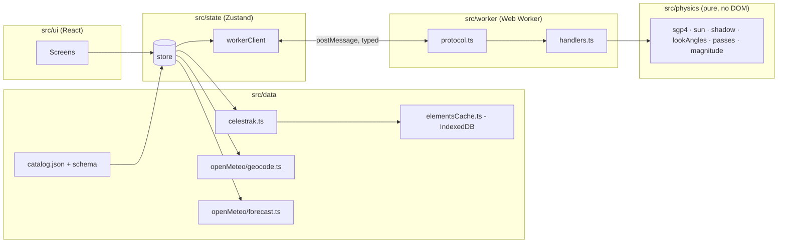

# What Is In Your Sky Right Now — Technical Plan

| Field | Value |
|---|---|
| Status | Draft v0.3 — for review. Plans the v1 phase: §2.17 records decisions D-69..D-87; §3–§9, §11–§13 extended for language, desktop layout, the dome's second pass, the live page, offline, the Moon, share links and the night theme; §16 Delivery added (V1-11), then sharpened in §16.3 and §16.4 when `scripts/sdd-run.ts` was built (D-87). The MVP text (v0.2) is otherwise unchanged. |
| Date | 2026-09-03 (v0.3); 2026-09-01 (v0.2) |
| Input | `SPEC.md` v1.0 (Decision Log §12 treated as fixed: OQ-1, OQ-3, OQ-4, OQ-11, UX-1 and V1-1..V1-11 are not reopened here) |
| Scope | Architecture, project structure, module boundaries, data model, worker contract, testing strategy, the Task Zero physics spike, and how the v1 tasks are delivered (§16). **No task breakdown** — that is `sdd-breakdown`'s job. |

---

## 1. Fixed Inputs

These come from the spec's Decision Log and are not up for debate in this plan:

- **No backend in MVP.** Static site; browser talks to CelesTrak and Open-Meteo directly. Elements cached in IndexedDB, refreshed at most every 2 h.
- **Catalog** is a hand-maintained JSON of ~30 objects with intrinsic magnitudes and provenance.
- **Twilight rule:** list passes when the sun is below −6°; label passes with the sun between −6° and −12° as "sky still bright".
- **CelesTrak CORS** is verified; fallback order is the community TLE API, then pulling the v1 proxy forward.
- **Stack:** React + TypeScript + Vite, static deploy.
- **Sky chart (UX-1):** a 3D ASCII sky dome the user can rotate and tilt, plus a 2D polar fallback over the same data; both DOM-only, no WebGL, no canvas. Monospace / terminal aesthetic across the whole UI.

From SPEC v1.0's Decision Log (V1-1..V1-11), fixed for the v1 phase:

- **Still no backend.** v1 stays browser-direct against CelesTrak and Open-Meteo; the caching proxy, Nominatim and the full `visual` group move to Phase 3.
- **Two languages**, English and Spanish, as a preference rather than a route.
- **The dome is the default view again**, in colour, under a CSP relaxed by exactly one directive; its composition is fixed by a spike before the implementation task.
- **72 hours** of passes and forecast, stored automatically, with the app shell served by a service worker.
- **Tasks are delivered in lanes and waves** by a driver script, one model per task, auto-merge with an owner gate on anything visual (§16).

Everything in spec §5 ("Technical Architecture", marked *proposal*) was reviewed. Where this plan agrees, it is simply adopted below. Where it disagrees, the disagreement and rationale are in §2.

---

## 2. Decisions (challenges to the spec's architecture proposal)

| ID | Spec proposal (§5) | Decision | Why |
|---|---|---|---|
| **D-1** | Magnitude formula: `m = m_std − 15.75 + 5·log10(range_km) − 2.5·log10(sin β + (π−β)·cos β)` | **Corrected to** `m = m_std + 5·log10(range_km / 1000) − 2.5·log10( p(β) / p(90°) )` with `p(β) = sin β + (π−β)·cos β`. | The spec's constant is inconsistent with its phase term. The `−15.75` constant belongs to the *fraction-illuminated* form (`+2.5·log10(r²/f)`, where `f = 0.5` at half phase contributes the 0.75). Combining it with a Lambert phase function that also encodes half-phase double-counts 0.75 mag, making every object appear ~0.75 mag brighter than intended. The corrected form returns exactly `m_std` at 1 000 km and 90° phase, which is the definition of standard magnitude. Unit test pins this anchor point. **Spec §5.4 should be amended at the next revision.** |
| **D-2** | Sun position from `astronomy-engine` *or* `suncalc` | **`astronomy-engine`**, wrapped behind a local `sun.ts` module exposing exactly two functions: sun altitude at an observer (geometric, no refraction) and sun unit vector in the true-equator-of-date frame. | `suncalc` is ~1° class accuracy and has no vector output; the shadow test needs a sun vector. astronomy-engine's equator-of-date (EQD) frame is within arcseconds of the TEME frame satellite.js uses, which is far below what the shadow and twilight tests need. Wrapping it keeps the physics module swappable and keeps the rest of the code free of the library's API. Refraction is off because twilight definitions (−6°, −12°) are geometric. |
| **D-3** | `date-fns`/`date-fns-tz` or a Temporal polyfill; `tz-lookup` as optional | **No date library and no `tz-lookup`.** All times are epoch milliseconds (`number`); display formatting uses `Intl.DateTimeFormat` with the observer's IANA zone from Open-Meteo. | Every formatting need in the spec (HH:MM:SS in a named zone, zone abbreviation, countdowns) is covered by `Intl`. A date library adds bundle weight and a second notion of time. Pure-coordinate input has no zone until the forecast response arrives; until then the UI shows UTC with an explicit "UTC" label — a few hundred milliseconds of latency, not worth a 100 KB timezone database. |
| **D-4** | Zustand *or* React context + `useReducer` | **Zustand** (vanilla store + React bindings). | Worker messages, the 10 s "now" tick, and IndexedDB events all arrive outside the React tree. A vanilla store that can be written from a plain module (the worker client) is simpler than threading dispatch functions into non-React code. Slices stay small and typed. |
| **D-5** | Tailwind *or* CSS Modules | **CSS Modules + CSS custom properties.** No Tailwind. | The UI has a handful of screens and a strong single theme (dark, high contrast, later red night mode). Design tokens as custom properties make the night mode a one-selector swap and carry the monospace/terminal identity (FR-X-6): one `--font-mono` stack, a `--cell` unit equal to one character advance so layout aligns to the same grid the sky dome is drawn on. Avoids a build-time framework and keeps the CSP free of `unsafe-inline` styles. |
| **D-6** | "Web Worker" with an AbortController-style cancel; no protocol defined | **Hand-written typed `postMessage` protocol** (discriminated unions, §6), job IDs, and **cooperative cancellation** by yielding between objects. No Comlink. | Comlink hides the message boundary, which makes streaming partial results and cancellation awkward. A 12-message protocol is small enough to type by hand and test as a pure function in Node. The worker yields to its event loop between objects so a `cancel` message can be observed. |
| **D-7** | Refine peak by golden-section search; sample visibility "every 1–5 s" | **Sample every 1 s inside each above-horizon segment; bisection only for the two 10° crossings.** Peak taken from the 1 s samples with a parabolic refinement across the three samples around the maximum. | With ~30 objects and passes of ≤ 12 min, 1 s sampling is ≈ 20 k propagations per night — trivial. It yields ≤ 1 s precision (FR-VIS-2) for shadow and twilight crossings for free, removes one algorithm (golden section) and its failure modes, and gives the sky-chart track as a by-product. |
| **D-8** | Cylindrical umbra, Earth radius 6371 km, "optional atmosphere fudge" | **Cylindrical umbra, radius 6371.0 km, no fudge, no penumbra in MVP.** The "fading" flag is dropped from MVP. | Keep the model simple until the Task Zero comparison shows a systematic shadow-entry offset versus Heavens-Above. A fudge factor without evidence is a guess. Penumbral fading lasts seconds for LEO and the 1 min acceptance criterion does not resolve it. |
| **D-9** | Fetch `visual` + `stations`, filter client-side | Adopted, plus: **store the raw group payloads unfiltered in IndexedDB**, keyed by group, and filter to the catalog at load time. | Lets v1 widen the catalog to the full `visual` group with no cache schema change and no re-fetch. Costs ~100 KB of storage. |
| **D-10** | "Enforced against the stored timestamp, across tabs and reloads" | **Web Locks API (`navigator.locks`) single-flight around the refresh check**, with fallback to timestamp-only when Web Locks is unavailable. | Two tabs opened together would otherwise both see a stale timestamp and both fetch. A named lock makes the check-then-fetch atomic across tabs. Web Locks is available in all evergreen browsers and Safari ≥ 15.4. |
| **D-11** | Clock-skew warning using a server `Date` header | **Dropped from MVP.** Moves to v1 behind the proxy. | With no backend, the only servers are cross-origin, and `Date` is not a CORS-safelisted response header, so the browser cannot read it. Open-Meteo's `current.time` is a model slot, not a clock. No honest way to implement it in MVP. |
| **D-12** | Hosting: any of Cloudflare Pages / Netlify / Vercel / GitHub Pages | **Cloudflare Pages** — amended 2026-09-02 to **Cloudflare Workers static assets**, same `_headers` file (§2.5). | It supports a `_headers` file for a strict CSP, sits on the same platform as the v1 edge worker, and its free tier is sufficient. GitHub Pages remains a zero-config fallback for previews. |
| **D-13** | Not addressed | **No client-side router in MVP.** Single screen; pass detail is a full-screen sheet. The selected pass ID is mirrored to the URL hash so v1 share links have somewhere to land. | One screen does not justify a router. The hash keeps the door open. |
| **D-14** | "Now" state "using the cached propagation" | **"Now" is computed in the worker on request** (30 propagations at `t = now`), not from cached tracks. | Cached tracks only cover passes; the "Now" panel must also explain *why* nothing is visible (daylight / in shadow / below horizon), which needs live sun altitude and per-object state. Thirty propagations every 10 s is negligible. |
| **D-15** | Not addressed | **Every physics function takes time as an explicit parameter; nothing in `src/physics` or `src/worker` reads `Date.now()`.** | Determinism for golden tests and for Playwright with a fixed clock. |
| **D-16** | UX-1: 3D ASCII sky dome, DOM-only (library-neutral in the spec) | **Render the dome with `@glyphcss/react` (v0.1.x, MIT), confined to one component behind the `SkyChartProps` interface (§8).** Triggers for replacing it: (a) it cannot meet FR-GUIDE-6 (≥ 30 updates/s while dragging on a mid-range phone) at a grid of ~60×30 cells after the §8.5 spike; (b) a needed capability is missing and unfixable from outside (interior camera or backface control if the observer-centred view is later required, hotspot precision, clamped orbit limits); (c) the package stops being maintained — no release or response for 6 months while we carry a blocking bug; (d) a licence or security problem. Replacement path is a hand-written rasteriser behind the same props, and the 2D polar sibling is the interim fallback. | It is the only DOM-text 3D mesh renderer with a React binding that we found; it satisfies FR-GUIDE-5 by construction (one `<pre>`, no canvas, no WebGL, no per-polygon elements). Writing an equivalent rasteriser is a real project. The pre-1.0 API, single-maintainer fork lineage (forked from polycss) and small user base are accepted **only because** the boundary in §8 makes it swappable. |
| **D-17** | UX-1: "rotate/tilt the view toward the horizon they'll face" | **Default camera is an external "over-the-shoulder" orthographic view of the dome** (`GlyphOrthographicCamera` + `GlyphOrbitControls` with `clampPitch`), yaw set to the pass's rise azimuth so the user sees the dome from behind the observer, looking toward that horizon. The strictly observer-centred view (camera at the dome centre looking outward, perspective) is **not** the MVP default; recorded as open question P-OQ-1 in §8.6. | The external view uses only documented camera behaviour (`rotX`/`rotY`/`zoom`) and keeps left/right correct relative to the real horizon (facing south, east appears on the left, as in life). An interior camera needs the perspective camera inside a mesh with inward-facing polygons visible; glyphcss documents neither interior placement nor backface culling. We will test it in the spike, but the plan cannot depend on it. |

### 2.1 Task Zero findings (R1, 2026-09-02)

Recorded by the R1 implementation. **Comparison result (fixture `2026-09-02-neuquen-iss.json`): OVERALL PASS** — the one visible ISS pass in the window matches Heavens-Above within 4 s / 1.0° / 0.2° at start, peak and end, end reason `horizon` on both sides, no unpaired or extra passes. Details in `tests/fixtures/heavens-above/README.md`.

- **`json2satrec` accepts CelesTrak's OMM field names as-is.** No mapping layer is needed. `sgp4.ts` only narrows two fields for satellite.js's types (`EPHEMERIS_TYPE` must be `0`, `CLASSIFICATION_TYPE` is dropped unless `U`/`C`) and rejects other ephemeris types. `json2satrec` and `twoline2satrec` give identical satrecs and positions for the Vallado verification case (satellite 00005, t = 0 and 360 min, positions reproduced to 1e-8 km). satellite.js 7.1.0, astronomy-engine 2.1.19.
- **CelesTrak `EPOCH` has no zone suffix** (`2026-09-01T19:42:22.677120`); `time.ts` appends `Z` and truncates to milliseconds, otherwise `Date.parse` would read it as local time.
- **Runtime:** ISS × 10 days (coarse scan at 30 s plus dense sampling of every candidate) takes ≈ 120 ms in Node 24 on the development machine. Extrapolated, 30 objects × 24 h is well under the 1.5 s CI budget in §9.1; measure it properly once the worker exists (R4).
- **Shadow model vs an independent conical model:** over 10 days at 1 s, `inUmbra` (cylinder, 6371 km, D-8) and satellite.js's own `shadowFraction ≥ 0.5` (conical, penumbra) disagree on 0.19 % of samples, all at transitions; entry/exit instants differ by 0.05 s on average, 7 s at most, with no systematic sign. Our sun vector and satellite.js's low-precision sun differ by ≤ 0.006°. **Not checked against Heavens-Above:** the only pass in the window is horizon-bounded at both ends, so no shadow-entry offset could be measured. D-8 stands; re-examine when a fixture contains a shadow-bounded pass (the next northern-mid-latitude fixture in the MVP phase is the natural place).
- **Sun altitude:** two independent paths (astronomy-engine topocentric `Equator` + `Horizon`, and satellite.js `sunPos` pushed through `frames.ts`) agree within 0.002°; the −6° and −12° instants from sunrise-sunset.org agree within 0.15°. astronomy-engine's `Horizon` takes no refraction when the argument is omitted; the string `'none'` is rejected.
- **Window content:** with the 2026-09-02 elements, every ISS culmination above 10° at Neuquén in the ten days from 2026-09-02T03:51Z falls in daylight except one marginal twilight pass on 2026-09-11 09:48Z (peak 10.2°). Heavens-Above lists exactly the same single pass. A ten-day window with one pass is a thin validation; the two further golden fixtures planned for the MVP phase (§10.4) should be captured when several dark passes fall inside the window.
- **Brightness (informational, D-1 + `stdMag` seed −1.8):** we predict +1.2 at the pass peak where Heavens-Above prints −0.1 to −0.3 (range 1 505 km, phase angle back-lit in morning twilight). The 1.3–1.5 mag gap is outside the acceptance criterion but large enough that R3 should settle the ISS `stdMag` (and its provenance) against more than one pass before the magnitude cut goes live.
- **Heavens-Above quirks worth knowing:** the summary table and the detail page differ by up to 5 s for the same event, and the detail page prints altitudes as whole degrees. The detail page is the reference.
- **Package manager:** `npm` (CLAUDE.md left the choice open; `pnpm` is not installed and TASKS.md already uses `npm test` / `npx`).

### 2.2 R2 decisions (2026-09-02)

- **D-18 — Worker chunks are ES modules** (`worker.format = 'es'` in `vite.config.ts`). satellite.js 7 ships an optional WASM/pthreads build behind `#wasm-multi-thread`, whose worker entry uses top-level await; Vite's default IIFE worker format refuses it and the production build fails. We never call `createWasmModule`, so the chunk is emitted (~300 KB, uncompressed) but never fetched. Module workers are supported by every evergreen browser and Safari ≥ 15, so the R5 worker is a module worker too. R11's bundle-budget check should exclude or drop that dead chunk.
- **D-19 — Vite 7.x with Vitest 3.2**, upgraded together. Vitest 3.2's peer range stops at Vite 7 while the current `@vitejs/plugin-react` needs Vite 8; the pair is pinned (`vite@7`, `@vitejs/plugin-react@5`) until Vitest 4 is adopted deliberately. Vitest's `projects` splits `src/ui` (jsdom, Testing Library, MSW) from everything else (Node, MSW); both projects start the MSW server with `onUnhandledRequest: 'error'` so no unit test can reach the network (§9.3).
- **ESLint** uses `typescript-eslint` `strict` + `stylistic` (non-type-checked) and `react-hooks` flat recommended; `no-unused-vars` ignores `_`-prefixed names and rest siblings. The type-checked variants and the §3 boundary rules are R5's.
- **R2 crosses the §3 boundaries on purpose:** `src/ui/components/passes/nextPass.ts` imports `src/physics` and `App.tsx` imports `src/data` directly, running `findPasses` on the main thread with the ISS `stdMag` seed (−1.8) hard-coded. The catalog (R3), store and worker (R5) replace this; the lint boundary rules land only then.
- **`lib/timeFormat.ts`** builds strings from `Intl.DateTimeFormat.formatToParts` (locale `en-GB`, `hourCycle: 'h23'`) so output is `HH:MM:SS` regardless of locale punctuation; with `timeZone === null` the label is the literal `UTC` (D-3). Zone abbreviations come from Intl's `short` name and may read `GMT-3` rather than `ART`; revisit in R8 if the spec's "zone abbreviation" needs more.
- **E2E runs against the production build** (`vite preview` on port 4173); `npm run e2e` builds first, CI builds in the previous step. Cross-origin CelesTrak calls are fulfilled with `access-control-allow-origin: *` by the Playwright route.

### 2.3 R3 decisions (2026-09-02)

- **D-20 — The pass list window is 24 h from "now"** (`SEARCH_WINDOW_HOURS` in `ui/components/passes/passSearch.ts`), FR-VIS-1's MVP minimum and the window the §9.1 performance budget is written for. R2's 10-day ISS-only search is gone: 31 objects × 10 days on the main thread measured ≈ 3.6 s per recompute, and R2 recomputes on every valid keystroke. 31 objects × 24 h takes ≈ 350 ms in Node; the worker (R5) removes the freeze, the multi-night window is v1 (spec §8 rank 6). Tests that need the R1 golden pass (nine days after `capturedAt`) start the 24 h window at `capturedAt + 9 d`: an offset that is a multiple of the 30 s coarse step keeps the scan grid in phase with R1's, so start/peak/end reproduce exactly rather than to within one sample. `tests/support/catalogFixtures.ts` holds this. *(Amended v1, R24: `state/passWindow.ts` — where the constant has lived since R5 — makes it 72 h in three 24 h nights, FR-VIS-1 amended and FR-OFF-2. The worker cuts it into nights and searches them night-outer, so the first night still arrives inside the MVP's budget, D-77 and D-95. The golden-fixture offset above is unchanged: the first night of a 72 h window at `capturedAt + 9 d` is the same 24 h search on the same grid.)*
- **D-21 — `src/data` imports `parseOmmEpoch` from `src/physics/time`.** `SatelliteRecord.epochMs` (FR-SAT-4) has to be parsed somewhere on the main thread, and §3 allows `src/data` neither `src/physics` nor `src/lib`. `physics/time.ts` is a dependency-free leaf (no satellite.js, no DOM), so the R5 boundary rules should whitelist `src/physics/time` for `src/data` rather than duplicate the parser. Revisit if a second physics leaf is ever needed there.
- **D-22 — Intrinsic magnitudes come from Mike McCants' Quicksat `qs.mag` (2020-09-14, mmccants.org/programs/qsmag.zip)**, the source spec §6.1 (OQ-3) names. Its definition — magnitude at 1 000 km range and half phase — is exactly the D-1 standard magnitude, so values are used unconverted; each entry's `stdMagSource.note` cites the `qs.mag` row and any comment (flares, "sometimes very bright"). The **ISS is −2.5** there, 0.7 mag brighter than the R1 seed (−1.8): on the R1 golden pass we now predict +0.5 against Heavens-Above's −0.1 to −0.3, closing half the gap noted in §2.1. The remaining ~0.7 mag is consistent with the station having grown since 2020 (iROSA arrays) and with the back-lit geometry of that pass; a fixture with a well-lit ISS pass (§10.4's northern mid-latitude capture, task H) is the place to settle it, not a hand-tuned constant. **Tiangong (48274) post-dates the file** and carries a project estimate (−1.0, back-solved through D-1 from reported overhead brightness of about −2.5 to −3) marked as such in its provenance. Docked modules and visiting vehicles (Wentian, Mengtian, Nauka, Progress, Dragon, Soyuz…) are deliberately absent so each station appears once. Membership is 31 objects: 2 stations, 11 payloads, 18 rocket bodies (eight of them SL-16 Zenit stages at magnitude 2.0), all present in the R1 fixtures and, per `scripts/check-catalog.ts` on 2026-09-02, in the live `visual`/`stations` groups. **The magnitude cut (MAG_LIMIT 4.5) is live from R3** for every object; R2 already applied it to the ISS.
- **Loader without cache** (`data/elementsLoader.ts`): both groups are fetched in parallel; if either request fails the load fails, because §7.1's "use the cached set" branch does not exist until R11. `unavailable` carries catalog ids absent from both groups; the UI does not show them yet (R11's banners).
- `tests/e2e/next-pass.spec.ts` is replaced by `pass-list.spec.ts`; `ui/components/passes/nextPass.ts` and `NextPassLine.tsx` are deleted, `ISS_STD_MAG_SEED` survives only in `tests/support/heavensAbove.ts` for the R1 comparison script.
### 2.4 H decisions and findings (2026-09-02)

Recorded by the H implementation (physics hardening). Fixtures: `2026-09-02-paris-iss` (48.86° N) and `2026-09-02-singapore-iss` (1.35° N), captured 13:27–13:28 UTC with a CelesTrak capture at 13:27:43 UTC whose ISS element set is the very one Heavens-Above was using (epoch 2026-09-02T03:26:53 on both sides). **Both OVERALL: PASS** — 12/12 and 7/7 passes paired within 6 s / 3.3° / 4.2° at every point, no unpaired passes, no extras, all start and end reasons matching. Details in `tests/fixtures/heavens-above/README.md`.

- **D-23 — Golden fixtures are named by place and carry their own pairing metadata.** `tests/fixtures/heavens-above/<date>-<place>-iss.json`; the fixture's `ommFixture` names its OMM capture (a second capture on the same date is `<date>T<HH>`), `searchPeriod` is Heavens-Above's own search window and clips the comparison window, `location` is the observer label. The R1 fixture keeps working through defaults (`neuquen`, same-date OMM, no clipping). `validate-iss.ts --fixture <name>` / `--all`; `passes.golden.test.ts` runs every fixture and asserts that the set covers ≤ −30°, 45–52° N and |lat| ≤ 5°.
- **D-24 — A Heavens-Above pass without a "Maximum altitude" row is compared at the higher of its start / end rows** (end on a tie). Heavens-Above omits the row when the highest point is a shadow boundary above 10°; its summary table repeats that row in the Highest column. Seven of the nineteen new passes are of this kind. `summary.highest` in the fixture overrides the rule.
- **D-8 evidence — shadow boundaries are systematically offset by 4–6 s.** Across all 19 shadow-bounded boundaries in the two new fixtures we exit the umbra 3–5 s earlier and enter it 4–6 s later than Heavens-Above, never the other way round: our cylindrical umbra of 6371.0 km with no atmosphere is slightly narrower than theirs. That is ≈ 30–45 km along track, well inside the 60 s criterion, and the visible pass we report is a few seconds *longer* than theirs at the shadow end (safe side for a user). D-8 stands for MVP; the evidence is now on record for a v1 decision (candidates: a larger effective radius of ≈ 6371 + 20–40 km, or a conical penumbra midpoint — both to be checked against these fixtures, which are the tripwire).
- **Brightness (informational, seed `stdMag = −1.8`, D-1 form):** with 19 more passes the pattern is clear: relative to Heavens-Above we are 0.3–0.6 mag too bright at high elevation and 0.8–1.3 mag too faint on low, distant passes — Heavens-Above's magnitude varies less with range and phase than the diffuse-sphere law does. The catalog value of −2.5 (R3, McCants) would fix the low passes and worsen the high ones. Not an acceptance criterion; the magnitude cut at +4.5 is unaffected for the ISS. Left for the v1 brightness work with these fixtures as the data set.
- **Passes of 1–2 s** (Paris 7 Sep and 11 Sep: reaches 10° and enters shadow within two seconds) are found by the 1 s dense grid (D-7) without special handling and pair within 6 s. No sub-resolution rule was needed.
- **Unit references.** Every `src/physics/*.test.ts` now asserts its module's slice of `reference-values.json` (which gained `inUmbra` and names the fixture in full; all pinned numbers unchanged). Sunset reference: NOAA's published spreadsheet algorithm is embedded in `sun.test.ts` (sunrise-sunset.org's sunset instant is ~2 min later than the geometric −0.833° and is not used). Coverage gate: `npm run test:coverage:physics` (`@vitest/coverage-v8`, 90 % lines per file; measured 100 % lines on every file).
- **Runtime:** ISS × 10 days takes 54–122 ms per fixture in Node 24; the whole golden suite runs in ≈ 0.6 s.

### 2.5 R4 decisions (2026-09-02)

- **D-12 amended — hosting is Cloudflare Workers static assets, not Cloudflare Pages.** The dashboard's *import a repository* flow now creates a Worker with static assets built by Workers Builds; Cloudflare steers new projects there and documents a Pages → Workers migration. D-12's reasons hold: the `_headers` file has the same format and semantics (parsed at upload, never served, `/*` and `/assets/*` rules stack), the free tier is the same, and the v1 edge worker lives on the same platform. `wrangler.jsonc` is committed so Workers Builds skips wrangler's autoconfig, which otherwise installs `@cloudflare/vite-plugin` and rewrites `vite.config.ts` inside the build sandbox on every build: assets-only Worker, `not_found_handling: "404-page"` (hash routing, D-13, needs no SPA fallback), `preview_urls` on, observability off (FR-X-3). Production is `https://in-your-sky.ezequiel-baruf.workers.dev`, built from `main`; a preview per branch comes from Workers Builds' *non-production branch builds* (`npx wrangler versions upload`, aliased by branch name as `https://<branch>-in-your-sky.ezequiel-baruf.workers.dev`), enabled per project under *Settings → Builds*. Verified 2026-09-02 on the `r4-deploy` preview: all three §11 headers on `/`, the immutable `Cache-Control` on `/assets/*`, and 404 for `/_headers` and unknown paths. The first production build ran from `main` before this branch merged and served no headers, as expected: `public/_headers` does not exist on `main` yet.
- **Worker renamed to `in-your-sky` (2026-09-03).** The public URL is `<worker>.<account subdomain>.workers.dev`, and only the worker half is ours to choose: the account subdomain (`ezequiel-baruf`) is a one-time change per account, already spent, and Cloudflare answers a second attempt with *Account already has an associated subdomain*. Renaming the worker is therefore the whole of the free URL improvement, from `what-is-in-your-sky.ezequiel-baruf.workers.dev` to `in-your-sky.ezequiel-baruf.workers.dev`. A rename in `wrangler.jsonc` creates a **new** worker rather than moving the old one, so the Workers Builds connection must be re-pointed at it and the old worker deleted by hand; steps in `README.md`. Branch previews follow the same shape, `https://<branch>-in-your-sky.ezequiel-baruf.workers.dev`. A custom domain stays open as a later step: it needs a zone in this Cloudflare account, which means either a registered domain or a free one from a registry on the Public Suffix List (`eu.org`, `is-a.dev`), and then a `routes` entry with `custom_domain: true`.
- **D-25 — `vite preview` serves `public/_headers` the way Cloudflare does.** A small plugin in `vite.config.ts` parses the Pages format (unindented path pattern, indented `Name: value` lines, `*` matching across `/`, matching rules stacked) and sets the headers on every preview response. The Playwright suite therefore runs the production build under the strict CSP: `tests/e2e/deploy-headers.spec.ts` asserts the §11 values on `/`, the immutable `Cache-Control` on `/assets/*`, zero `securitypolicyviolation` events during the R3 flow, and requests only to the site origin and CelesTrak. It is the offline twin of R4's `curl -sI` and DevTools checks, and it fails CI before a violation reaches the site. The dev server is untouched: React Fast Refresh injects inline scripts the CSP forbids. `tests/deploy/headers.test.ts` (Node project, typechecked through `tsconfig.node.json`) pins the file to the §11 block verbatim, so a change to either the doc or the file without the other fails a test, and checks that every `https://` host referenced in `src/**/*.ts(x)` is in `connect-src` (FR-X-3).
- **D-26 — zod runs jitless.** zod 4.5 compiles object parsers with `new Function` and probes for it once with a caught call; under `script-src 'self'` the caught probe is still reported as a CSP violation (the D-25 e2e caught it on its first run). `src/data/zod.ts` calls `z.config({ jitless: true })` and re-exports `z`; it is the only module that may import `zod` (enforced by `src/data/zod.test.ts`), because the flag is read when a schema is *built*, so the configuring module has to evaluate before any schema module. Cost: the interpreted parser on a few hundred records per group, not measurable next to the pass search. `unsafe-eval` is not an option (§11).
- **Workers Builds project:** Git integration (production on `main`, a preview version per non-production branch), worker name `in-your-sky`, build command `npm run build`, deploy command `npx wrangler deploy`, Node from `.node-version` (24, same as `ci.yml`). There is no framework preset and no output-directory field: `wrangler.jsonc` names `dist/` as the assets directory, which is why it is committed. Created once in the dashboard; steps in `README.md`. The GitHub Actions alternative (`wrangler deploy` from `ci.yml`, gated on the tests) was not taken: the task asks for the repo wiring, and Workers Builds' own build keeps a single source of truth for what is deployed. Revisit in R15 if deploys should wait for CI.

### 2.6 R5 decisions (2026-09-02)

Recorded by the R5 implementation (worker, store, streaming list).

- **`jobDone.hasDarkness: boolean`** is added to the §6.2 protocol: whether the observer's sun altitude reaches `sunAltMaxDeg` anywhere in the window, computed by `physics/darkness.ts` (sampled every 10 min plus the window end; the sun moves ≤ 0.25°/min, so the grid resolves twilight to ~2.5° and the end check catches a window that ends just after dusk). The list shows spec §5.6's "no darkness tonight at this latitude" when a finished job has no passes and `hasDarkness` is false; R7's Now panel reuses the flag.
- **Error semantics (§6.2 rules, made precise):** `PROPAGATION_FAILED` carries the job id, the object is skipped and the job goes on; `NO_ELEMENTS` and `INTERNAL` carry the job id and end the job **without** a `jobDone`. The client treats those two as terminal, drops the job's handlers and reports the error; the passes slice shows "Could not compute passes: CODE: message". A `cancel` for a job the worker does not know is ignored; a cancelled job's `jobDone` is dropped by the client because the job was forgotten the moment `cancel` was posted.
- **`computeNow` answers `INTERNAL`** ("not implemented until R7"); the protocol type is complete so R7 only adds the handler and `physics/now.ts`.
- **D-27 — `src/state` may import `src/physics/constants`.** The `computePasses` request carries the thresholds, and their defaults are a value (`DEFAULT_THRESHOLDS`), which `src/model` (types only) cannot hold. Same pattern as D-21: a dependency-free leaf whitelisted in the boundary rule (`except: ['./constants.ts']`) rather than a duplicated constant. `src/state` may also import `src/worker/protocol` (types) and references `passes.worker.ts` by URL only.
- **D-28 — `eslint-plugin-import-x` instead of `eslint-plugin-import`.** The original plugin's peer range stops at ESLint 9; import-x supports ESLint 10, ships the same `no-restricted-paths` rule and a built-in node resolver. §3 is enforced as one zone per table row, plus `@typescript-eslint/no-restricted-imports` for the rows a path zone cannot express: React banned in `physics`, `worker`, `data`, `lib`, `model`; physics **types only** in `lib` (`allowTypeImports`); `@glyphcss/react` allowed only under `ui/components/guide/skychart/dome/`; `*canvas*` / `*webgl*` banned everywhere (FR-GUIDE-5). `no-restricted-globals` bans `Date` in `physics`, `worker` and `lib` (D-15); the one exception is `physics/time.ts`, the epoch-ms ↔ `Date` converter itself, and `lib/timeFormat.ts` now hands `Intl` the number. Test files are exempt from the boundary rules. Verified with the four probe files the task asks for (React in physics, `Date.now()` in lib, `src/data` from `src/ui`, a `*canvas*` import) — each fails `npm run lint`; none is committed.
- **D-29 — Progressive rendering is proven from a DOM log, not a slow worker.** 31 objects × 24 h take ≈ 375 ms in the worker, too fast to watch cards land. The Playwright test installs a `MutationObserver` before the app boots that records every distinct set of card ids the DOM went through; "one at a time, ISS first" is asserted on that log (first non-empty entry is exactly one ISS card; the second location goes through more than one set before its final one; no set after the switch contains a first-location id). The "throttled worker route" delays the worker script by 1.5 s, which is what shows the page responsive and `aria-busy` with zero cards before the first one lands. The store test with the scripted fake worker covers the cancel-and-ignore-late-messages path exactly (`cancel` for job 1 posted, job 1's late `passes` and `jobDone` never reach the slice).
- **Vitest browser project** (`--project browser`, `@vitest/browser` + Playwright Chromium, headless) runs `src/**/*.integration.test.ts` as part of `npm test`; CI therefore installs Chromium before the unit tests. Fixtures are imported as modules there (no `node:fs`). satellite.js and astronomy-engine are listed in `optimizeDeps.include` so Vite does not reload the test mid-run.
- **Store shape** (`state/store.ts`, D-4): one vanilla store with `location` (observer + the `nowMs` read from an injected clock when it was set), `elements` (`idle | loading | error | ready`, the latter also carrying the worker's `rejected` list) and `passes` (job id, status `idle | computing | done | error`, the observer and window the results belong to, passes kept sorted by start as they stream, `done/total`, `hasDarkness`, `elapsedMs`, skipped objects). Every passes action carries the job id and is ignored for any other job. `createAppStore({ now })` for tests, `appStore` for the app; `startApp()` in `main.tsx` creates the worker and wires `state/effects.ts`. Elements are still prefetched on start, as in R3; the effect loads them once, hands them to the worker once, and starts a job per observer change with a generation counter so a stale chain never writes.
- **Runtime:** 31 objects × 24 h in `findPasses` (Node 24, development machine): 378, 373, 377 ms in three consecutive runs of `passes.perf.test.ts` against a 1 500 ms budget; the worker integration test reports the same order in Chromium (≈ 520 ms including boot). The main-thread freeze noted in D-20 is gone.
- `PassCard` carries `data-pass-id` (the pass id) for the e2e; R6's detail screen can use it as its hook.

### 2.7 R7 decisions (2026-09-02)

Recorded by the R7 implementation ("Now" panel).

- **D-30 — `visibleUntil` is found by a look-ahead on the pass search's own 1 s grid.** `physics/now.ts` steps forward from `t` in 10 s coarse steps until the visibility predicate fails, then refines the last coarse step at `DENSE_STEP_MS`; `visibleUntil` is the last visible sample and `endReason` is `failingReason` of the first invisible one. Because the grid is `t + k·1 s`, a request made on a pass's grid returns exactly that pass's `end` (asserted on the R1 golden pass). The look-ahead is capped at 30 min (`MAX_LOOKAHEAD_MS`, longer than any LEO pass above 10°); an item still visible at the cap carries no `visibleUntil` and the panel says "visible for a while yet". Cost: ≈ 70 + 10 samples per visible object per tick, for at most a handful of visible objects. `magnitude` is `null` below the horizon (`elDeg < 0`) or in shadow, as the §5 comment says; between 0° and 10° it is still reported.
- **D-31 — The 10 s tick lives in `state/effects.ts` with an injected clock and an injected `VisibilitySource`.** `startEffects` gains `now: () => EpochMs` and `visibility: { hidden, subscribe }` (`documentVisibility(document)` in the app, a flag in tests), so the effects never read `Date.now()` or `document` themselves and the Node test drives both with fake timers. The first `computeNow` goes out the moment the worker holds the elements for the current observer (right after `computePasses` is issued); `setInterval(NOW_TICK_MS)` runs from then, is cleared while `document.hidden`, and a tab becoming visible refreshes at once and re-anchors the interval. Only the latest request's reply is written (a sequence number), and an observer change bumps both the sequence and the generation so a previous location's in-flight answer is dropped; the slice records the observer each state belongs to and the panel ignores a state for another observer. Errors are recorded without dropping the last good state.
- **`computeNow` semantics (§6.2):** `NO_ELEMENTS` (with the request id) when nothing is loaded; otherwise one `nowState` with every loaded object in `computeOrder` (featured first). It is one-shot and cannot be cancelled; because the handler yields between objects (D-6) a `computeNow` posted during a `computePasses` job is answered between two objects, which the handler test checks. In the client, one-shot requests share a typed `request()` helper keyed by request id; a reply of the wrong type rejects.
- **`src/state` re-exports `DEFAULT_THRESHOLDS`** (extends D-27): the panel quotes the elevation floor ("no catalog satellite is above 10°") from the thresholds the state actually sent, and `src/ui` still never imports `src/physics`.
- **Empty-state precedence in `NowPanel`:** visible items win; then `hasDarkness === false` from the finished job (spec §5.6, R5 flag) regardless of `sky`; then `sky === 'day'` (sun altitude quoted); then "nothing above 10°" when no item is `aboveMinElevation`; else "N up but all in Earth's shadow". `bright-twilight` is not an empty state: the observer is dark enough for visibility under the −6° rule (§1), so its items are judged like `dark` ones. Cloud cover joins the panel in R8 (FR-WX-3).
- **`jest-axe`** (`jest-axe` + `@types/jest-axe`) is installed; `tests/setup/vitest.jsdom.ts` extends `expect` and augments vitest's `Matchers<T = any>` (the parameter must match vitest's own declaration). Component tests for the panel run `axe` on the no-observer, visible and daylight states.
- **Playwright and the tick:** `page.clock.install` + `pauseAt` + `runFor(10_000)` fires the app's interval with the page clock 10 s later, so the countdown moves by 10 s without a reload — US-4 AC2 proven end to end. The older specs now scope `getByRole('status')` to the "Upcoming passes" region, since the panel adds a second live status line.
- **`lib/timeFormat.formatCountdown(ms)`** ("3:12", clamped at "0:00") is the one countdown formatter; R6's `Countdown` can reuse it.

### 2.8 R6 decisions (2026-09-02)

Recorded by the R6 implementation (pass detail sheet, guide text, countdown).

- **D-32 — Band boundaries.** FR-GUIDE-1 lists the elevation bands as 10–25 / 25–50 / 50–75 / > 75, which leaves 25, 50 and 75 in two bands; a value on a boundary belongs to the **higher** band (25° is mid-sky, 50° is high, 75° is almost overhead). FR-GUIDE-3's magnitude bands are read the same way in the direction magnitudes grow: a boundary belongs to the **brighter** band (−4 is "brighter than Venus", −1.4 "brighter than any star", +1 "like a bright star", +3 "like an average star"). Pinned in `lib/phrases.test.ts`.
- **Sentence template (US-6 AC1).** `guideSentence(pass, timeZone)` = `<Start> <elevation word> in the <compass name> at <time>, climbs to <peak °> (<elevation phrase>) in the <compass name> at <time>, <end phrase> in the <compass name> at <time>. <Brightness phrase> (magnitude <±n.n>).` plus ` The sky will still be bright, so it may be hard to spot.` when `twilight` (FR-VIS-7). Start phrases by reason: `Appears` (horizon), `Emerges from Earth's shadow` (shadow), `Becomes visible as the sky darkens,` (twilight); end phrases: `drops below the horizon`, `disappears into Earth's shadow`, `fades into the brightening sky` (US-6 AC4). Compass points are spelled out in prose (`west-southwest`) and abbreviated in the card and table. Times carry the zone label `formatClock` gives (`UTC` until the zone is known, D-3). The magnitude number is in the sentence so it stands alone as the chart caption (R13, FR-GUIDE-7).
- **D-33 — Hash ids match with a 2 min tolerance.** Pass ids are `${noradId}-${start.t}`; a recompute from a new "now" moves the 30 s coarse grid and can shift a refined boundary by a second, so `#pass=<id>` with no exact match opens the same object's pass whose start is within `SAME_PASS_TOLERANCE_MS` (120 000). Opening assigns `location.hash` (a history entry, so the browser's Back closes the sheet); closing clears the hash with `replaceState`. The hash is the only selection state (D-13: no router, no store slice).
- **D-34 — Golden guide strings use the catalog's `stdMag`.** `reference-values.json` pins the golden pass's `peakMagnitude` as computed with the R1 seed (−1.8); the app computes it with the catalog's −2.5 (D-22). D-1 is linear in `stdMag`, so `tests/support/catalogFixtures.ts#goldenPassFixture` shifts the reference magnitude by `stdMag − ISS_STD_MAG_SEED` and the golden strings say "+0.5, like a bright star", which is what the screen shows and what the Playwright test compares against. A change to the ISS `stdMag` therefore changes the golden strings deliberately; the reference file stays untouched.
- **Detail sheet accessibility (FR-X-5).** `PassDetail` is `role="dialog" aria-modal="true"` labelled by its heading; the heading takes focus on open (`tabIndex={-1}`), the element focused before opening gets focus back on close, Escape and the "Back to the list" control both close, and `<main>` is `inert` while the sheet is up so the list leaves the tab order. `jest-axe` (`toHaveNoViolations`, wired in `tests/setup/vitest.jsdom.ts` with a `vitest` module augmentation) runs on the sheet alone and on `App` with the sheet open.
- **Countdown.** `Countdown` is pure display: `countdownState(pass, now)` walks rise → peak → set → ended with the label after the boundary reason ("Appears in", "Peak in", "Sets in" / "Enters shadow in" / "Fades in", "Ended … ago"); `PassDetail` owns the 1 s tick through `useNow` (UI code may read the clock; `src/lib` may not, D-15). `lib/format.ts` is new (the §4 tree's number formatting: degrees, duration, magnitude, range, clock durations), moved out of `PassCard.tsx` so the card, the table and the countdown share it.
- The sky chart mounts in the labelled `data-slot="sky-chart"` block of the sheet from R13 on; until then it shows a dashed placeholder. `GuideText` carries `data-testid="guide-sentence"` so R13's `<figcaption>` can reuse the same golden assertion.
- R7 (`r7-now-panel`) merged first; the overlap on `package.json` (jest-axe), `App.tsx` (NowPanel between the input and the list) and `tests/setup/vitest.jsdom.ts` (R7's `Matchers` augmentation kept) was resolved on this branch.

### 2.9 R8 decisions (2026-09-02)

Recorded by the R8 implementation (cloud verdict, local time).

- **D-35 — The forecast fills `Observer.timeZone` by replacing the observer object, and that is not a location change.** `weather.fillTimeZone` builds `{ ...observer, timeZone }` only when the zone was null (a geocoded observer keeps its own) and re-points `passes.observer`, `now.observer` and `weather.observer` to the new object in the same `set`, so the identity checks the panel and the list rely on keep holding. The effects subscribe on `nowMs` and on `sameLocation` (everything but the zone) rather than on observer identity, so the fill triggers no recompute, no cancel and no second forecast; the `computeNow` reply is written against the store's observer at reply time for the same reason. Alternative considered: leaving the observer alone and deriving the display zone from the weather slice in a selector — rejected because §7.3 and D-3 say the forecast fills the observer, and R9/R10 read `Observer.timeZone` as the one source of the zone.
- **D-36 — The zone abbreviation is Intl's `short` zone name in `en-GB`.** `GMT-3` for `America/Argentina/Salta` (CLDR has no English abbreviation for Argentina), `BST` / `CEST` for London / Paris, `GMT+9` for Tokyo; pinned in `timeFormat.test.ts`. Open-Meteo's `timezone_abbreviation` field is parsed but not used: it varies between the offset form and letters across releases, and the IANA `timezone` is what `Intl` needs. This closes the D-3 note left by R2. Every time on screen — cards, Now panel, tooltip, detail sheet — switches to the zone the moment the forecast arrives; until then it is `UTC`, labelled.
- **D-37 — The forecast is requested for the 0.1° cell, not the exact coordinates.** `forecastUrl` sends the cell centre with one decimal (`latitude=-38.9&longitude=-68.0`), so the cache key (`cellKey`, `"-38.9,-68.0"`) and the request agree and two observers in one cell get the same bytes. The cell is ≈ 11 km, the resolution of the best Open-Meteo models. Concurrent loads for one cell share the in-flight promise; the 30 min TTL (FR-WX-5) counts from the client clock at fetch time and is enforced on read (memory, then `localStorage` `wiys:wx:v1`) and on write (stale entries pruned). Storage is optional and its failures are swallowed: private mode and quota errors never fail a load.
- **Verdict (`lib/cloudVerdict.ts`):** each layer is interpolated linearly between the two bracketing hourly samples, then weighted `0.6·low + 0.3·mid + 0.1·high`; layers are used only when both neighbours carry all three, else the total (FR-WX-4 "where the provider supplies"). Boundaries: 29.9 % clear, 30 and 70 % partly, 70.1 % obscured. `unknown` without a snapshot and outside the covered hours (a pass beyond the three forecast days, or a stale fixture). The Now panel uses the same function at `state.t`; a separate "latest hourly value" path was not worth a second rule.
- **Weather is requested the moment the observer changes**, before the elements load, in parallel with the CelesTrak fetch, and never blocks the pass job; a rejection sets `weather.status = 'error'` and leaves the passes and the zone alone (US-7 AC4, FR-X-4). A late snapshot for a previous observer is dropped by the generation check.
- **Open-Meteo failure modes seen live on 2026-09-02, 19:20–19:40 UTC** (the fixture capture ran into an outage): HTTP 200 with a plain-text body (`Unexpected error while streaming data: allEndpointsUnavailable` / `timeoutReached`), HTTP 200 with `{"error":true,"reason":"The service is overloaded"}`, and 30 s connection timeouts. `fetchCloudForecast` therefore treats a non-JSON body and a body matching `{ error: true, reason }` as failures whatever the status; both are tested with MSW.
- **`CloudBadge`:** a focusable `[Clear, 12 % cloud]` span with the tooltip as its `aria-describedby` target (`role="tooltip"`), shown on hover and on keyboard focus (FR-X-5); the tooltip states the thresholds, the effective figure, the provider name and the fetch time in the display zone (US-7 AC2/AC3). It is laid out in flow under the badge, not absolutely positioned, so it can never overflow a 390 px screen; the wrapper sits above the card's "Open guide" overlay so hover reaches it.
- **Fixture:** `tests/fixtures/open-meteo/2026-09-02-neuquen-forecast.json` is the verbatim response to the PLAN §7.3 URL for cell `-38.9,-68.0`, captured at 2026-09-02T19:51:17Z with `access-control-allow-origin: *` confirmed on the response; `.meta.json` records the URL, the time and the cell. MSW serves it for every forecast request whose query is exactly the §7.3 one and answers 400 otherwise.
- **Playwright:** `weather.spec.ts` fixes the page clock at the fixture's fetch time so the 24 h window lies inside the three forecast days, and checks every card and the Now panel against the badge states, the `GMT-3` times and the tooltip; its second test aborts the route. The older specs abort the Open-Meteo route explicitly and keep asserting `UTC` (a fulfilled route would switch their times to the Salta zone). `deploy-headers.spec.ts` fulfils it and now expects three hosts.

### 2.10 R9 decisions (2026-09-02)

Recorded by the R9 implementation (place-name search).

- **D-38 — Place search reaches the UI as a function, not a store slice.** `src/data/openMeteo/geocode.ts` owns the client and the session cache (`searchPlaces`, created on first use like `loadCloudForecast`); `src/state/index.ts` re-exports it so `src/ui` keeps to the §3 rule, and `App` passes it to `PlacePicker` as a prop (tests pass a stub). The 500 ms debounce, the in-flight `AbortController` and the list state are component-local, as §7.2 says; only the chosen observer goes to the store through `setObserver`. A slice was considered and rejected: the query and the pick list are transient UI state that no other component reads. `Place.admin1` and `country` are optional (a country-level result such as "Singapore" carries no `admin1`, verified live) and `placeLabel` joins whatever is present; `elevation` defaults to 0 when absent, and the geocoded observer stands at the place's elevation (`altM`), which the pass search is insensitive to at this scale.
- **D-39 — Cache and request rules.** The key is the normalised query: NFC, trimmed, inner whitespace collapsed, lower-cased; the same text is also what is sent, so identical keys mean identical URLs. Queries shorter than two characters never reach the network (Open-Meteo answers nothing for one character, verified live). Concurrent searches for one key share the in-flight request; a rejection is not cached, so the next keystroke retries. A caller's signal only detaches that caller — the shared request runs to completion so its answer is cached for the next keystroke. Failure handling mirrors the forecast client (D-37's outage shapes): non-JSON bodies and `{ error: true, reason }` bodies are errors whatever the status; the error schema is now `openMeteoErrorSchema`, shared by both clients. The no-match response has no `results` key (verified live), which the schema accepts as an empty list.
- **D-40 — Picker behaviour.** The field is a `combobox` over a `listbox` (`aria-activedescendant`, `aria-expanded`); ArrowDown / ArrowUp walk and wrap, Escape closes, Enter picks the highlighted row, else the first, and with the list closed searches at once instead of waiting for the debounce. Picking writes the label into the field, closes the list and sets the observer; the confirmation line ("Using the centre of <label> (<lat>, <lon>)", also the FR-LOC-6 note) is driven by the store's observer and shows only while `source === 'geocode'`, so typing coordinates afterwards hides it. Editing the text after a pick does not clear the observer: clearing is R10's action, and a keystroke must not cancel the running pass job. The empty and error states carry an `enter coordinates instead` link to the coordinates input (`id="coords"`, a new `CoordsInput` prop) that moves focus on click. Rows are two text rows (48 px at the 16 px base) and the list flows under the field, never positioned, so nothing can overflow 390 px. The empty-state prompts of the pass list and the Now panel now read "Enter a place name or coordinates …".
- **Testing note:** testing-library's async wrapper waits on a real `setTimeout` and advances only Jest's fake timers, so `user-event` hangs under Vitest fake timers. The timing tests (debounce, superseded search) fake `setTimeout` / `clearTimeout` only and drive the input with `fireEvent` inside `act`; the interaction tests use `user-event` with real timers and press Enter, which searches at once.
- **Fixtures:** two verbatim responses to the §7.2 URL, both captured 2026-09-02 with `access-control-allow-origin: *` confirmed. `2026-09-02-cipolletti-geocode.json` (`name=cipolletti`, 20:18:49Z) is the example place: one result, "Cipolletti, Rio Negro, Argentina" at −38.93392, −67.99032 in `America/Argentina/Salta` — the R1 golden observer to two decimals, so the pass list for the picked place contains the golden ISS pass. `2026-09-02-rosario-geocode.json` (`name=rosario`, 20:03:55Z) is the ambiguous pick list: eight results across five countries. MSW serves each for its name, the provider's no-match shape for any other, and 400 for a request that is not the §7.2 one.
- **Playwright:** `place-search.spec.ts` runs at 390 px with the forecast route aborted. The main flow types "Cipolletti" key by key and expects one request, picks the row, and expects "Using the centre of Cipolletti, Rio Negro, Argentina (−38.93, −67.99)" and a pass list with the golden ISS pass whose start time is already `GMT-3` — the zone came from the geocoding result (FR-LOC-3). The second test types "Rosario" and checks every row of the eight-row list (name, region, height ≥ 44 px, inside the viewport, font ≥ 16 px) and the keyboard pick. Screenshot in `docs/screenshots/r9-place-picker-390.png`.

### 2.11 R10 decisions (2026-09-02)

Recorded by the R10 implementation (device geolocation, saved location, coordinate forms).

- **D-41 — The saved location is the store's observer, written through.** `src/data/localPrefs.ts` owns `wiys:prefs:v1` (a zod-checked `{ observer? }` object; more preferences join it later, and a body that fails the schema reads as empty rather than repaired) over the `StorageLike` that `weatherCache` already used, now in `src/data/storage.ts`. `createAppStore` subscribes to the observer object and rewrites the prefs on every change, so a zone the forecast fills in (D-35) is remembered and a reload shows local times before any forecast arrives. The `prefs` slice therefore holds no state: `restoreSavedObserver` reads the prefs and goes through `setObserver`, and `startApp` calls it *after* `startEffects`, so the restored location is computed exactly like a typed one; `clearSavedObserver` is `setObserver(null)`, which the write-through turns into removing the key, and which also empties the screen: a clear action that left the list on screen would look like nothing happened. A `savedObserver` mirror in the store was considered and dropped: whatever observer the store has is what storage has.
- **D-42 — Coordinate forms and altitude.** `parseCoords` accepts a comma or whitespace between the values, an optional sign, an optional `°`, and an `N/S/E/W` suffix (either order when suffixed). A suffix on one value only, a sign together with a suffix, or two suffixes on one axis are errors with their own messages; the range messages are unchanged. Altitude is a separate text field (`inputMode="decimal"`, default "0"; blank means 0) limited to −500..9000 m so a typo cannot put the observer in the stratosphere; an invalid altitude blocks the observer like an invalid coordinate. A restored `coords` observer pre-fills both fields with its full-precision values without emitting; a restored `geocode` observer pre-fills the picker with its label.
- **D-43 — Device location.** `UseMyLocation` renders nothing unless `navigator.geolocation` exists and `isSecureContext` is true (the environment is a prop; the app passes the browser's). A press asks `getCurrentPosition` for a fresh fix (`maximumAge: 0`, `timeout: 20 s`, low accuracy; a cached fix would keep a stale accuracy on screen), shows "Finding your location…" on the disabled button meanwhile, and on success sets a `device` observer with the rounded `accuracyM` and the device altitude rounded (0 when it reports none). Failures are an alert next to the button with a message per code (denied / unavailable / timeout), each ending in the manual alternatives; nothing is disabled. The accuracy is shown only above 1 km, as "about 2 km" / "about 1.5 km" (`accuracyText`).
- **D-44 — The location section.** `LocationInput` is a `region` named "Location" holding the picker, the coordinates, the device button, the active-observer line, the clear action and the precision note. The line "Using <lat>, <lon> [from your device] [at <alt> m] [(accurate to about N km)]." appears for `coords` and `device` observers; a `geocode` observer keeps the picker's "Using the centre of …" line (D-40), which already carries the rounded coordinates, so nothing is said twice. "Saved in this browser only. Clear saved location" appears whenever there is an observer; clearing remounts the inputs empty (keyed children) and moves focus to the new place field, since the button that had it is gone. The precision note is always present: "Precision is city-level: a pass looks the same from anywhere within a few kilometres, so no street address is resolved." (FR-LOC-6).
- **Playwright:** `location.spec.ts` at 390 px, geocoding and forecast routes aborted. The main flow types the space-separated Neuquén coordinates and 270 m, checks the list and the golden ISS pass, reads `wiys:prefs:v1`, reloads, and expects the same status text and pass id with both fields pre-filled; then clears and expects the empty prompt, an empty storage, focus on the place field and an empty page after another reload. The device test grants geolocation at 2 km accuracy (line with "accurate to about 2 km", list computed, `accuracyM` stored), then at 300 m (no accuracy text); the third test denies the permission. Screenshot in `docs/screenshots/r10-location-390.png`.

### 2.12 R11 decisions (2026-09-02)

Recorded by the R11 implementation (elements cache, re-check, banners, live contract).

- **D-45 — The cache is a `GroupStore` behind `createElementsCache`, and the loader takes the cache as an option.** `src/data/elementsCache.ts` holds the IndexedDB store (`idb`, database `wiys`, object store `elementGroups`, key `group`, value `CachedGroup` raw and unfiltered per D-9), a memory store with the same two-method interface, and the cache itself: per group, read → fresh under 2 h (`isFresh`, which also rejects a `fetchedAt` in the future) → else fetch and write, or on failure return the copy flagged `stale`, or reject when there is no copy. A stored entry is zod-checked on read (`ommRecordSchema` per record) and reads as absent when it fails, so a schema change re-fetches rather than crashes. `loadElements(catalog, { cache })` goes through the cache and reports `fetchedAt` (the older of the two groups: when the set in use was last confirmed), `stale` and `persistent`; the app's cache (`appElementsCache`) is created on first use over the global `indexedDB` and `navigator.locks`, and every test passes its own (`tests/support/elementsCache.ts`: memory, or `fake-indexeddb` under a unique database name, with a serial lock stand-in). `fake-indexeddb/auto` is installed by the Node setup file, so the app path also runs in tests.
- **D-46 — Single-flight is two layers.** Across tabs, `navigator.locks.request('wiys:elements', { signal }, …)` wraps the whole check-then-fetch (D-10); a second tab arriving under the lock sees the first tab's fresh timestamp and fetches nothing. Within a tab, concurrent `load()` calls share the in-flight promise, which is what the timestamp-only fallback (no Web Locks) relies on. An abort while a stale copy exists rejects instead of answering stale, so a cancelled load never writes.
- **D-47 — IndexedDB failure switches the session to memory, once.** The first `get` or `put` that throws (Safari private mode, quota) replaces the store with a memory store for the rest of the session, warns, and the load goes on; the result carries `persistent: false`, which the UI shows as the "not cached" note (§7.1). A host with no `indexedDB` at all starts in that state. The memory copy still enforces the 2 h rule for the session, so a private-mode user still fetches at most every 2 h.
- **D-48 — The re-check lives in `effects.ts`, and a newer set recomputes.** Every `ELEMENTS_RECHECK_MS` (15 min) while the tab is visible the effects call the loader again; a hidden tab stops the timer and a tab shown again after longer than the cadence checks at once. The loader's 2 h rule means most checks answer from the cache and change nothing (the slice is not rewritten, so nothing re-renders). When the answer carries a newer `fetchedAt`, the worker is handed the records again (`loadElements` replaces its satrec map), the current observer's passes are recomputed over a 24 h window from *now* (not from the observer's `nowMs`, which may be hours old by then) and the previous job is cancelled; when only `stale` or `persistent` changed, the slice is updated so the banner follows. A failed re-check keeps the loaded set and warns on the console; a re-check while the first load failed (no cache, no network) retries it, computing for the observer if there is one.
- **Banners (`ui/components/common/Banner.tsx`, `ui/components/elements/ElementsBanners.tsx`).** `info` is `role="status"`, `warning` is `role="alert"`, both with a spelled-out `[Note]` / `[Warning]` prefix so the meaning does not rest on colour (FR-X-5); a bracketed tag on a dim rule is the terminal treatment (FR-X-6). `ElementsBanners` shows, once the elements are loaded: always the age line "Orbital elements: newest epoch 3 h 12 min old (date time), confirmed with CelesTrak date time." (FR-SAT-4's "display the epoch age", with the date since the set can be days old); the stale warning quoting the fetch time (FR-SAT-6); the epoch warning when the newest epoch is strictly older than 5 days (`lib/elementsAge.ts`: 5 d + 1 s warns, 5 d − 1 s does not — the newest epoch, because the stations group is refreshed several times a day, so an old newest epoch means the whole fetch is old); the not-cached note; and the note listing catalog objects with no elements by name (the store carries ids; `state/index.ts` exports `catalogName`). Times are in the observer's zone when known, else UTC (D-3). The clock is `useNow(60 s)`, moved from `PassDetail` to `ui/hooks/useNow.ts` and shared.
- **Live contract (`tests/live`, `live-contract.yml`).** A fourth Vitest project, `live`, includes only `tests/live/**` with no setup file (no MSW), and the Node project excludes that directory, so `LIVE=1 npx vitest run --project live` is the one command that reaches the network and `npm test` never does (§9.3). The suite requests both CelesTrak groups and both Open-Meteo endpoints with an `Origin` header and asserts `access-control-allow-origin: *`, parses each body with the app's own parsers, treats Open-Meteo's 200-with-error-body outage shape (D-37) as a failure, and checks every catalog id against the merged groups. The workflow runs daily at 06:17 UTC and on dispatch with `issues: write`; on failure it opens an issue titled "Live contract failed: CelesTrak / Open-Meteo" with the last 60 log lines, or comments on the open one, then fails the run. Passed manually on 2026-09-02 (5 tests, ≈ 3 s). GitHub registers a workflow only once it exists on the default branch (`gh workflow run` from the PR branch answers 404), so the first scheduled or dispatched run happens after the merge; the acceptance item "one green run" is closed then.
- **Playwright (`offline.spec.ts`).** After one online visit (CelesTrak fulfilled from the fixtures, Open-Meteo aborted), every external route is aborted and the page reloaded 30 min later: the saved location (R10) brings the observer back, the elements come from IndexedDB with no CelesTrak request, the same pass ids appear, every badge reads unknown and no warning shows. A reload 3 h later with CelesTrak aborted makes exactly one failed attempt per group and shows the stale warning; a first visit five days after the capture shows the epoch warning and the age line reads "5 d … old".

---

### 2.13 R12 decisions (2026-09-02)

Recorded by the R12 implementation (visual identity, accessibility pass, sort toggle, ISS hero card).

- **D-49 — The terminal identity is three treatments, not a box-drawing font.** Boxes (cards, inputs, banners) are 1 px lines in `--rule` (decorative) or `--edge` (controls), which is a box-drawing line at the grid's own weight; section titles are `── Title ─────` character rules (`common/SectionHeading.tsx`: the `──` and the trailing run of `─` are CSS `content`, clipped by `overflow: hidden`, so the accessible name is the title alone and the rule sits on the character grid at any width; the footer's top rule is the same device); controls are bracketed text, `[ Use my location ]`, `[ ← Back to the list ]`, `[ Clear saved location ]`, and the sort toggle reads `[x] Soonest first  [ ] Best first`, so a pressed state never rests on colour alone (FR-X-5). Real box-drawing borders around cards (`┌─┐│└┘`) were rejected: they need the box width in characters, which means measuring or a fixed width, and they break the moment a card wraps. The header is `> Title` with a dim tagline; `header`, `main` and `footer` share the 80-cell frame in `global.css`.
- **D-50 — Contrast is documented in `tokens.css` and pinned by a test.** Two tokens were added: `--bg-raised` (#161c24) for a highlighted row (the picker's active option used `--rule` as its background, where `--fg-dim` reads at 3.55 : 1; on `--bg-raised` it is 4.70 : 1) and `--edge` (#606c7a, 3.59 : 1 on `--bg`) for input and button borders, since `--rule` at 1.48 : 1 is below the 3 : 1 that WCAG 1.4.11 asks of a control's boundary; `--rule` stays for dividers and card frames. The header comment of `tokens.css` carries the table of every text token on both grounds (all ≥ 4.70 : 1); `scripts/contrast.ts` computes it (`npx tsx scripts/contrast.ts`) and `tests/styles/tokens.test.ts` (Node project) recomputes every pair from the file and fails when a colour changes without the table, or a pair drops below 4.5 : 1.
- **D-51 — One focus ring, one tap size.** `global.css` sets `:focus-visible { outline: 2px solid var(--accent); outline-offset: 2px }` for everything and no component removes it without a replacement (a card's open control hands its ring to the card, since the control's `::after` is the whole card). `--tap` is two rows (48 px, above the 44 px floor); `input` and `button` get `min-height: var(--tap)`. Inline controls that live inside a sentence (links, `[ Clear saved location ]`, the cloud badge) use the `inline-control` treatment: `display: inline-block` with block padding that grows the box to `--tap` and a matching negative block margin that leaves the line box where it was, so the bounding box (what a finger and the e2e measure) is 48 px without moving the prose. `a` is `inline-block` globally; link texts are short so the loss of mid-text wrapping does not matter. **The cloud badge tooltip is a box, overlaid, not in flow** (revised during R12 review): R8 laid it out in flow under the badge, which made the badge jump up a line on hover (an inline-block's baseline is its *last* line, so the opened tooltip's last line was what aligned with "Clouds now:") and looked like a paragraph, not a tooltip. Now `.tip` is `position: absolute; top: auto; left/right: var(--cell)` inside an unpositioned wrapper: `top: auto` keeps its static position (right under the badge) while `left`/`right` span the containing block, the card or the Now panel (both `position: relative`), so it overlays what follows, never widens the page, and the badge's line box is untouched. Bordered in `--edge` on `--bg-raised`, `[Clouds]` prefix, `z-index: 2`. It opens on hover and on `:focus` (a tap on a phone focuses the span, which `:focus-visible` would not match in Chromium), while the ring stays keyboard-only. The badge, not the wrapper, is the positioned element above the card's open-guide overlay.
- **D-52 — The hero pass is the earliest pass of a featured object that has not ended, and it leaves the list.** `lib/passSort.nextFeaturedPass(passes, isFeatured, now)`; `isFeatured` comes from `src/state` (the catalog's `featured` flag; the UI never reads the catalog, PLAN §3). A pass in progress still counts, so the card counts down to the peak or the end (US-5 AC4 for the pass that matters most); once it ends the next featured pass takes over, or the card goes. It is *not* repeated in the list: one `article` per pass keeps the e2e locators unambiguous and the status line's count honest. `PassList` re-checks the choice every 30 s (`useNow(HERO_CHECK_MS)`), the card itself ticks every second (`useNow(HERO_TICK_MS)`), and the countdown text is `Countdown`'s `countdownState` ("Appears in 12:34", "Peak in", "Sets in" / "Enters shadow in", "Ended … ago"). `PassCard` exports `PassFields` and `OpenGuide` so the hero lays out the same fields under its kicker (`[Next ISS pass]`) and larger name.
- **D-53 — "Best first" is `10^(−0.4·m) × peak elevation`, and the order is the one preference the store holds as state.** The brightness term is flux relative to magnitude 0 (one magnitude brighter counts 2.5×; the ISS at −2 outweighs a +0.5 pass at the same elevation 10 to 1, which is what a casual observer calls best); the reference magnitude cancels in the comparison, so `src/lib` needs no threshold constant. Ties fall back to start time; sorting never mutates the store's array. The `sort` preference lives in `wiys:prefs:v1` beside the observer (`PassSort` in `src/model/prefs.ts`; `localPrefs` reads each preference independently through `.catch(undefined)`, so an unknown order value drops only itself, and a bad observer only itself); the prefs slice reads it when the store is created and `setSort` writes it through, while the observer write-through preserves it (`{ ...read(), observer }`). The toggle is pure (`SortToggle`, `aria-pressed`, a click on the pressed order reports nothing) and `PassList` wires it to the store.
- **Footer links and the CSP test.** `tests/deploy/headers.test.ts` scans `src/**/*.ts(x)` for `https://` hosts and requires each in `connect-src`; `Footer.tsx` is now skipped by name, since its three attribution links (`celestrak.org`, `open-meteo.com`, `www.geonames.org`) are navigation targets the user follows, which CSP does not govern, not connections the page makes (FR-X-3 still holds: `deploy-headers.spec.ts` asserts the requests go to the site, CelesTrak and Open-Meteo only).
- **Playwright (`identity.spec.ts`, 390 px).** `expectIdentity` runs on Home empty, Home with passes and the detail sheet: body background is `rgb(11, 15, 20)`, no visible element with text has a computed `font-family` without `monospace`, `scrollWidth ≤ innerWidth`, and every visible `a[href]`, `button`, `input` and `[tabindex="0"]` outside an `inert` subtree measures ≥ 44 px both ways. The tab-order test lists the focusable controls in DOM order (≥ 15: the three inputs, the device button, the clear action, the Now-panel badge, the hero's open control and badge, the two sort buttons, every card's open control and badge, the three footer links), presses Tab that many times from the title and expects the same sequence with a ring on each (the card's ring for an open control), then body, then the first control again. Two Chromium facts the test works around: a blur does not reset the sequential-focus starting point (a click on the title does), and Playwright empties `test-results/` at every run, so the screenshots are copied to `docs/screenshots/r12-*.png` once green. The detail sheet is captured at viewport size: it is `position: fixed`, and a full-page capture shows the list behind it.

### 2.14 R13 decisions (2026-09-02)

Recorded by the R13 implementation (sky geometry library, `SkyChart` boundary, SVG polar view).

- **D-54 — One geometry module for both views, per-leg resampling.** `lib/skyGeometry.ts` holds `toDome` (the §8.2 frame, pinned by the cardinal and zenith unit vectors), its inverse `fromDome`, `toPolar` (equidistant azimuthal on the unit disc, screen convention with north up; `looking-up` negates x so east is on the left), `interpolatePoint` / `interpolateTrack` (great-circle in the sky, linear in time and range; a sample's own time returns the sample object, so the peak time returns the peak) and `resampleArc`. Resampling divides each of the two legs, start → highest sample and highest sample → end, into equal angular steps along the sampled polyline, so start, peak and end survive as the same objects and the spacing is the step to within one rounding per leg. The first golden pass (a 48 s grazing pass, 13° of sky) resamples to seven points 2.2° apart; the test says so rather than assuming a long arc.
- **D-55 — `SkyChart` chooses among registered views, and a toggle between identical views is not shown.** `SKY_CHART_VIEWS` is the ordered list of `SkyChartView`s (`{ Component, id, label }`, each exported by its own file: `POLAR_VIEW` now, the dome in R15). The `chartView` preference defaults to `dome` (US-6 AC3), and `viewFor` falls back to the first registered view when no view claims the preference, so until R15 the polar view renders under either value and the view toggle (an `OptionToggle`, `[x] Dome [ ] Polar`) is rendered only when more than one view is registered. `SkyChart.contract.test.tsx` is `describe.each(SKY_CHART_VIEWS)`: R15 registers the dome and the contract covers it without a change to the test. The caption is the FR-GUIDE-1 sentence of the highlighted pass (or the first), rendered by `GuideText` inside the `<figcaption>`, so `PassDetail` shows the sentence once and the `guide-sentence` test id keeps its meaning.
- **D-56 — The polar view's anchors are data attributes; selection is a click on the pass group.** The drawing is `aria-hidden` (FR-GUIDE-7), so the contract's "labelled anchors" cannot be accessible names: the cardinals are `<text data-anchor="N|E|S|W">`, the pass label `data-anchor="pass"` inside `<g data-pass-id>`, the peak label `data-anchor="peak"` (`max 46°`), and markers are `data-marker="rise|peak|end|shadow|now|arrow"` positioned by `transform="translate(x y)"` so the tests read `toPolar` back off the DOM. `onSelectPass` fires on a click on the pass group; there is no keyboard path inside the hidden drawing, and none is owed: the facts are in the caption and the numbers table, and the detail screen draws one pass. Labels sit beside the track along the normal to the direction of travel (the name inward at the rise, the peak label outward), never along it; a label whose estimated width (0.6 em per character) would leave the viewBox is anchored the other way.
- **D-57 — Chart preferences are store state like the sort order, and the orientation toggle lives inside the polar view.** `chartView` and `chartOrientation` join `sort` in the prefs slice (read at creation, written through by their setters, preserved by the other write-throughs) and in `wiys:prefs:v1` through `localPrefs` (`.catch(undefined)` each, so an unknown value drops only itself). `SkyPolar` implements `SkyChartProps` exactly (PLAN §8.1), so its orientation is not a prop: it reads and writes the store. The toggle has no visible prefix (`Orientation:` wrapped the group at 390 px); the convention is labelled under the drawing instead, as a full sentence (`Looking up: east on the left, as when lying on your back.`), which is what FR-GUIDE-4's "labelled on the chart" is satisfied by for assistive technology too, the drawing being hidden.
- **`PassDetail` takes the observer.** Its `timeZone` prop became `observer: Observer` (the chart wants the observer, PLAN §8.1; the zone is `observer.timeZone`), and `App` mounts it only with an observer in the store, which is always the case when a pass is selected.
- **Review fixes.** The page scroll is locked (`html { overflow: hidden }` from an effect in `PassDetail`, restored on close) while the sheet is up: the sheet is `position: fixed` and scrolls itself, so on desktop the list's scrollbar behind it was a second, dead scrollbar. The performance gate (`passes.perf.test.ts`) judges the best of three runs: Vitest runs it beside the other files and one run on a shared CI core measured the contention (1547 ms on this branch's first CI run against 975–1433 ms on `main`), not the algorithm (362 ms locally).
- **Playwright (`pass-detail.spec.ts`, 390 px).** After the R6 checks: no `<canvas>` in the document, the figure holds the sentence, the SVG drawing is `aria-hidden` with the four cardinals, the pass and peak labels and one each of the rise / peak / end / arrow markers, and its box is inside the viewport; `E` sits in the left half by default and in the right half after the map toggle, the convention line changes, `wiys:prefs:v1` carries `chartOrientation`, and the choice survives a reload. The sheet is scrolled to the figure before each screenshot (it is `position: fixed`). The spec also opens the highest pass of the night for a second screenshot, since the golden pass grazes the horizon. `identity.spec.ts` asserts no `<canvas>` on every screen it visits.

### 2.15 R14 decisions (2026-09-03)

Recorded by the R14 spike (`docs/spike-glyphcss/FINDINGS.md` has the evidence; `spike/` is the throwaway page, typechecked and linted but never bundled).

- **D-58 — The dome frame is glyphcss's: Z up.** `lib/skyGeometry.toDome` is x south, y east, z up (§8.2 rewritten); the R13 unit-vector tests pin it. glyphcss's camera orbits its Z axis, so at `rotY = 0` it stands south of the observer facing north with east on the right (the D-17 view), `rotY = (360 − facingAz) mod 360` faces any azimuth and `rotX` is the tilt from top-down (0) to horizontal (90). `fromDome` follows; nothing else in the app depended on the old frame.
- **D-59 — Composition and grid (P-OQ-2 resolved).** Wireframe mode strokes every polygon edge, so strips render as ladders and no ASCII palette resolves the dome at 60×30. The dome is drawn in `charMode="braille"` (2 × 4 dots per cell): rings and meridians as 0.05°-wide strips (one stroke), the pass as a 1.5° strip (a double dotted line, the highlight channel), dashes by omitting every other 5° quad, markers as diamonds at radius 1.02, labels as hotspots outside the grid at 11 px. Default grid 60×30 at 390 px (6.5 px cells; the drawing carries no text, so cells may shrink to 100×50 without a legibility cost); `autoSize` with cols from the measured cell on wider screens. A grazing pass (the golden pass: 13° of sky at 10°) is three cells on the dome and unreadable in any mode; the numbers table and the panorama carry it.
- **D-60 — Camera model (P-OQ-1 resolved) and the primary view.** glyphcss 0.1.6 has no observer-centred camera: the perspective camera's `distance` is a pull-back from the target, the pinhole legacy mode collapses at the origin, and the first-person controls render nothing. The dome keeps the external camera (D-17); the interior mode is closed. The horizon panorama prototype (§8.5 item 7: SVG, equirectangular, facing the arc, live marker with trail, no dependency) is the observer-centred view and, on the spike's screenshots, reads the grazing pass the dome cannot show. The choice of primary view is the owner's (spec UX-1); R15 is re-scoped after that pick: panorama as primary and dome as a second view, or dome as primary as written. The polar chart is the fallback either way.
- **D-61 — Colour (P-OQ-3 resolved) and the CSP.** `useColors` emits `<span style="color:…">` through `innerHTML`, which `style-src 'self'` blocks; the dome is monochrome, highlight by line weight. `GlyphScene` also injects a `<style id="glyph-styles">` at mount, which the CSP blocks and without which the hotspot layer loses its containing block: R15 ships those base rules (glyphcss 0.1.6's `injectGlyphBaseStyles` text) in `dome/SkyDome.module.css`, pinned with the version, instead of hashing the injected sheet. Hotspot positions and the host's `cursor` / `touch-action` are set through the CSSOM and survive the CSP.
- **D-62 — FR-GUIDE-6 measured by proxy; D-16 trigger (a) not fired.** A 5 s real-pointer drag in Playwright's Chromium (Pixel 5 profile, 390 px) under Chrome DevTools CPU throttling: ≥ 64 rasterisations/s at 4× and ≥ 43/s at 6× at every grid (60×30 and 100×50, braille and ASCII, autosize), longest frame 27 ms; glyphcss re-rasterises on every animation frame while dragging. `interactiveDownscale={2}` is the configuration fix if a phone falls short. The on-device check (≥ 30/s on a mid-range 2022 Android phone) stays in R15's release checklist as the real gate.
- **D-63 — Chart chunk budget is 100 KB gzipped.** The dome behind `React.lazy` measures 97.3 KB gzipped (`@glyphcss/core` 48 KB, `glyphcss` 48 KB, the React binding 5 KB, our geometry 4 KB); the React package re-exports all of core, so the loaders and colour maths cannot be shaken from outside. The OBJ/glTF/VOX/PNG/JPEG loaders and the colour-font atlases are emitted as lazy chunks (pngjs 62 KB, atlases 33 + 29 KB, jpeg-js 9 KB, buffer 9 KB) and are never fetched by the dome. §11 carries the measured figure, as TASKS R15 provides.
- **Housekeeping.** `@glyphcss/react` is pinned to 0.1.6 in `dependencies` (imported only by `spike/` until R15; the lint override for `spike/**` mirrors the dome's) and `rollup-plugin-visualizer` is a dev dependency. `tsconfig.app.json` includes `spike`, `tsconfig.node.json` the capture script and the bundle probe config. `vite build` bundles only the root `index.html`, so `dist/` never contains the spike page (verified by listing `dist/`).

### 2.16 R15 decisions (2026-09-03)

Recorded by the R15 implementation (the ASCII dome as the default view, bundle budgets, release checklist). The primary view is the dome, as spec UX-1 and TASKS R15 are written: the owner asked for R15 without changing the Decision Log, so the panorama prototype from R14 stays in `spike/` as a candidate second view and nothing in the app depends on it.

- **D-64 — The camera is component state, not `GlyphOrbitControls`.** `SkyDome` holds `{ facingAzDeg, tiltDeg }` (`dome/camera.ts`) and hands `GlyphOrthographicCamera` `rotY = (360 − facing) mod 360`, `rotX = tilt` and the zoom as props; the binding writes them to the camera and re-rasterises. glyphcss's orbit controls were not used: their pitch clamp is fixed at ±90° where PLAN §8.3 wants 5°–80°, and the React binding exposes neither the controls handle nor its `change` events, so the facing readout would have needed the spike's per-frame polling. The pointer drag is ours (pointer events on the stage, `setPointerCapture`, `touch-action: none`): the dome follows the finger, dragging right turns the view left and dragging down lowers the tilt, at glyphcss's own 4 px per degree, with the moves folded into one state update per animation frame. The arrow keys turn by 15° and tilt by 5° through the same state, so drag, keys and readout cannot disagree. The wrapper is a focusable `group` named "Sky dome" and described by the readout; the drawing inside it is `aria-hidden` (FR-GUIDE-7).
- **D-65 — The grid is always 60 × 30; the cell follows the host width.** `layoutFor(width)`: cell = width / 60 (6.5 × 13 px at 390 px, D-59; clamped to 4–12 px), set on the stage as custom properties through the CSSOM, and zoom = 140 × cell / 6.5 so the dome fills the same share of the grid whatever its size. The width comes from our own `ResizeObserver` (glyphcss's `autoSize` needs a sized host and jsdom lays nothing out); without one the default stands. *Amended in the R15 review:* the first cut kept the cell fixed and added columns on wider hosts, which made the 390 px grid overflow the sheet's narrower content box and clip the E and S labels; a fixed grid with a scaled cell fills the shared box exactly and keeps the raster identical everywhere. Two more facts from that review, both about fonts: (1) the page's monospace fonts (SF Mono, Roboto Mono, Consolas) have no braille, so the browser drew the cells from a fallback face with a wider advance than the space and the letter M, rows overflowed the box and the labels drifted off the ring; the raster therefore has its own font, `wiys-braille.otf` (generated by `scripts/build-braille-font.ts` with opentype.js: the 256 braille patterns, the space and the letter M at one 0.6 em advance, 4 KB gzipped, fetched with the chart chunk; `SkyDome` measures the braille and space advances once and sizes the font and `word-spacing` from them as a safety net). (2) glyphcss measures its cell once, at mount, from twenty lines of `M` in the `<pre>`'s font, so the scene mounts only after the font is loaded (`document.fonts.load`) and the width is measured, and it is remounted (`key`) if the cell changes; before that ordering the raster kept a stale 6.5 px cell and drew the dome 8 % small against the labels. `SkyDome.module.css` also ships glyphcss 0.1.6's base rules verbatim under `:global` (D-61), pinned by version. The raster snapshot test answers glyphcss's cell probe with those metrics, so the committed raster is the one a 390 px phone draws, not jsdom's unmeasured fallback. glyphcss skips its `<style>` injection when an element with id `glyph-styles` already exists, so `SkyDome` renders a hidden sentinel with that id before the scene: without it every dome mount reported a `style-src-elem` violation (the injected element is blocked either way), which the e2e now asserts does not happen.
- **D-66 — The dome is lazy in `SkyChart.tsx`.** `DOME_VIEW` wraps `React.lazy(() => import('./dome/SkyDome'))` in a `Suspense` whose fallback keeps the drawing's height; `SkyChart.tsx` imports nothing from `dome/` statically, so the chart chunk (`SkyDome-*.js`: `@glyphcss/react`, `@glyphcss/core`, `glyphcss`, `dome/`) is fetched only when a detail sheet opens on the dome view. The R13 contract test gained one `beforeAll` per view that mounts it once and waits for the drawing, after which its assertions run synchronously as before; `PassDetail.test.tsx` waits for the dome the same way. Measured: main 109.2 KB, chart 92.9 KB, worker 34.2 KB gzipped, all inside the §11 budgets; the spike's 97.3 KB figure included its own page code.
- **D-67 — Budgets are a script, not the visualizer.** `scripts/bundle-budget.ts` gzips every `dist/assets/*.js`, classifies the main chunk (the script `index.html` references), the chart chunk (`SkyDome-*.js`) and the worker chunk (`passes.worker-*.js`), prints the table and a `::warning::` annotation for an overrun, and always exits 0 (§11: a warning). The unbudgeted lazy chunks (satellite.js's WASM entry, D-18; glyphcss's loaders and font atlases, D-63) are listed for the record. `rollup-plugin-visualizer` stays for humans: `BUNDLE_STATS=1 npm run build` writes its treemap to `bundle-stats/` (git-ignored, outside `dist/`).
- **Labels.** Hotspot labels carry the polar view's data attributes (`data-anchor`, `data-pass-id`, D-56) so the contract test reads both views alike; each label is aligned away from the drawing's edge by the side of the screen its anchor projects to (`domeGeometry.screenSide`, the yaw rotation alone), the rise label sits at radius 1.18 so it clears the compass names at 1.08, and a click on the rise label selects the pass. The readout is `Facing SSW (203°) · tilt 25°`: the degrees are there so a 15° key step is checkable by eye and by test.
- **D-68 — The polar chart is the default view for now, and both views share one frame.** The owner's call in the R15 review (2026-09-03): the dome reads as confusing, so `DEFAULT_CHART_VIEW` is `polar`, `POLAR_VIEW` is first in `SKY_CHART_VIEWS` and the dome stays registered one toggle away. This departs from spec US-6 AC3 / UX-1 ("dome as the primary view") without a Decision Log entry yet: the entry belongs with the decision on the dome's future (improve it or remove it), which is its own task after R15 merges, since the dome sits behind `SkyChartProps` and either outcome touches nothing else. Both views render inside `skychart/ChartFrame.tsx`: a controls row at least one tap target tall (the polar orientation toggle; the dome's hint), a square drawing box capped at 44 cells for both, and a status row at least one text row tall (the polar convention; the dome readout), so switching views moves neither the caption above nor the numbers below (asserted in `sky-dome.spec.ts`).
- **Open, for the owner:** the on-device FR-GUIDE-6 check (`docs/RELEASE.md` §3, with the console snippet that counts rasterisations) and the deploy-day comparison against Heavens-Above (§4) were not run here: no phone and no deploy in this task. The proxy measurement stands (D-62).

### 2.17 v1 decisions (2026-09-03)

These plan SPEC v1.0 (V1-1..V1-11). Nothing here is implemented yet; each decision names the requirements it serves so a task can be cut from it.

- **D-69 — Language is two typed catalogs and a hook, no i18n library.** `src/i18n/en.ts` is the source of truth; `type Messages = typeof en` and `es.ts` is declared `const es: Messages`, so a missing or misspelled key fails `tsc` (FR-I18N-2) with no runtime fallback path to write or test. Parameterised messages are **functions** (`passRise: (p: {name: string; dir: string; time: string}) => string`), not template strings with placeholders: a function lets Spanish put the words in a different order, agree in gender and number, and use its own `Intl` calls, and it makes the parameter list part of the type. Plain strings stay plain strings. Rejected: `i18next` (a runtime catalog, a bundle cost, and its missing-key behaviour is a fallback, which FR-I18N-2 forbids) and ICU message syntax (a parser at runtime for what the type system can do at build time).
- **D-70 — Locale and theme are applied in `main.tsx` before the first render, not by an inline script.** `script-src 'self'` (§11) forbids the usual inline bootstrap, and the app is client-rendered anyway: `main.tsx` reads the prefs, sets `documentElement.lang` and `data-theme`, and only then calls `createRoot().render()`. Nothing paints before that, so FR-THEME-1's "before first paint" holds without relaxing the CSP. The initial `<html lang>` in `index.html` is `en` and is corrected in the same tick.
- **D-71 — Breakpoints are literal pixels, pinned to the cell token by a test.** FR-DESK-1 states breakpoints in cells, but a media query cannot read `var(--cell)`. `global.css` uses `@media (min-width: 960px)`; a test in `tests/styles/` recomputes `100 × --cell` from `tokens.css` and asserts it equals the literal in the media query, so the two cannot drift. Column and panel widths inside the layout *are* written in cells (`calc(40 * var(--cell))`), as FR-DESK-2 and FR-DESK-3 require.
- **D-72 — One guide component, two shells.** The compact sheet and the wide side panel (FR-DESK-3) render the same `PassDetail` content; only the wrapper differs. `lib/layout.ts` exposes `useLayoutMode(): 'compact' | 'wide'` over `matchMedia` (a listener, not a resize handler), and `PassDetail.tsx` picks the shell. The selection hash (D-13) and the guide's own state are identical in both, so switching width mid-session keeps the open pass.
- **D-73 — Shortcuts live in one hook with one guard.** `lib/shortcuts.ts` installs a single `keydown` listener on `document` at the `App` level. It ignores the event when any modifier is held, when `event.isComposing`, or when the target is an `input`, `textarea`, `select` or `[contenteditable]` — that is FR-DESK-4's "no input focused" rule, in one place rather than per component. The overlay (`?`) is generated from the same table that registers the handlers, so a shortcut cannot exist undocumented.
- **D-74 — The dome is two stacked glyphcss scenes sharing one camera.** FR-DOME-8's base layer is solid mode and its line layer is braille wireframe; `GlyphScene` takes `mode` as a scene prop, so one scene cannot be both. `SkyDome.tsx` renders two `GlyphScene`s in the same CSS grid cell (`grid-area: 1/1`), same grid dimensions and same cell metrics so the glyphs align, base behind lines, `pointer-events: none` on the base. Both receive the camera state that already lives in the component (D-64), so they cannot drift by construction. The finer pass layer (FR-DOME-8c) is a per-mesh density option inside the line scene, not a third `<pre>`; a third scene is the fallback if per-mesh density turns out not to exist in 0.1.6, and the spike answers that. Cost is the open question OQ-15 and is what the spike measures.
- **D-75 — Colour comes from the tokens through a probe element, and the CSP gains exactly one directive.** `_headers` adds `style-src-attr 'unsafe-inline'` (V1-4) and nothing else, **in the layered-dome task, not before** — the deploy test pins `_headers` to PLAN §11's block verbatim, so the header and the plan move together and the site never advertises a relaxation nothing uses yet; `style-src-elem`, `script-src` and the rest stay `'self'`, and the deploy test (D-25) is extended to assert that, so a later "just add unsafe-inline" cannot pass review. `dome/palette.ts` reads the FR-DOME-2 colours with `getComputedStyle` on a hidden probe element that carries the token classes, at mount and again when `data-theme` changes (a `MutationObserver` on the root's attributes), so both themes work with one code path and the palette is never duplicated in TypeScript.
- **D-76 — No new worker request: `computeNow` already takes an instant.** SPEC §5.7 proposes a `computeAt(t)` request for FR-LIVE-6, but `computeNow` has carried `t: EpochMs` since §6.2 was written — it is already "the Now pipeline at an arbitrary instant". Adding a second name for it would give the client two ways to do one thing. Instead `computeNow` gains `includeHidden?: boolean` (FR-LIVE-6's dimmed objects with reasons) and `NowState` gains `moon`. Recorded in §15 as a spec amendment.
- **D-77 — The 72 h search runs night-outer, object-inner, so tonight arrives at MVP speed.** FR-VIS-1 as amended triples the window, and FR-VIS-4's budget is unchanged. The handler loops the three 24 h nights on the outside and the objects on the inside, emitting `passes` per (night, object) pair, `featured` objects first within each night. The first night is therefore complete in the MVP's time and the list renders while the other two compute; FR-OFF-2's grouping falls out of the same order. `progress` counts object×night pairs. No protocol change beyond the wider `window`.
- **D-78 — Passes are stored per observer cell, two runs at most.** IndexedDB gains a `passRuns` store keyed by the observer rounded to 0.01° (about 1 km — the same pass from anywhere inside it, matching the geocoding non-goal). A run holds the observer, the window, `computedAt`, the oldest elements epoch used and the passes. Writing happens on every `jobDone { cancelled: false }` (FR-OFF-5, no "prepare" action). Only the active run and the previous one are kept and the rest are pruned on write: FR-OFF-7 gives favourites offline data for the active observer only, and three 72 h runs of 30 objects would be the largest thing the app stores.
- **D-79 — The service worker is `vite-plugin-pwa` in `generateSW` mode with runtime caching switched off.** Workbox's precache manifest is generated from the build, which is the part that is tedious and error-prone to hand-write, and its weight lands in the worker file, not the main chunk. `runtimeCaching: []` and a `navigateFallback` to `index.html` are the whole configuration: FR-OFF-1 forbids caching CelesTrak and Open-Meteo, which already live in IndexedDB. `registerType: 'prompt'` implements OQ-14 — the new worker waits, `UpdateBanner.tsx` offers the reload, and `skipWaiting` is called only from that button, so an update cannot swap the shell under the live page. Dev builds do not register a worker.
- **D-80 — The Moon is physics, the lore is data.** `physics/moon.ts` wraps `astronomy-engine` the way `sun.ts` does (D-2) and exports `moonAt(t, observer): MoonState` and `moonGlare(moon, peak, thresholds): MoonGlare`, both pure and both tested against published values. It runs in the worker, so `NowState.moon` and `Pass.moonAtPeak` arrive with everything else and the main thread does no astronomy — except the live page's once-per-second re-evaluation (FR-LIVE-5), which imports the same pure module (`src/lib` may import physics types only, so the live page's Sun and Moon evaluation lives in `lib/skyBodies.ts`, which is the one exception, listed in §3). The tradition text is `data/moon/lore.json` with a zod schema and both languages in one file, reviewed by hand like the catalog (FR-MOON-4); phase-name boundaries are constants in `physics/constants.ts` with the usual rationale comment.
- **D-81 — The live page owns its instant; playback is a rAF loop over wall time.** `LivePage` holds `t` and `speed`. Playing advances `t` by `(wallDelta × speed)` on each `requestAnimationFrame`, so a dropped frame loses no simulated time and the 3600× target (FR-LIVE-5) is a rendering question, not a scheduling one. Satellite positions come from `Pass.track` by interpolation (FR-DOME-5) — the worker is never called per frame; hidden objects (FR-LIVE-6) are a `computeNow` request throttled to one per 250 ms of wall time, with the in-flight request's result discarded if `t` has moved past it.
- **D-82 — The time stripe is SVG, not glyphcss.** FR-LIVE-4 wants hour ticks, night bands, per-pass segments and a draggable cursor. That is the polar chart's problem again (R13 solved it in SVG, FR-GUIDE-5 permits SVG), and it is not a 3D scene. Reusing `SkyPolar`'s approach keeps the stripe cheap during playback, which is where the frame budget is.
- **D-83 — Share links are built and parsed in one module.** `lib/shareLinks.ts` owns `#pass?…` and `#live?…` in both directions (FR-SHARE-1, FR-LIVE-9), and `screens/passSelection.ts` (D-13/D-33) delegates to it. Round-trip tests are the whole test surface for FR-SHARE-1 and FR-SHARE-3's fallback ("nearest pass of that satellite, else a message naming it").
- **D-84 — Night theme is a third token block, not a second stylesheet.** `tokens.css` gains `[data-theme="night"]` beside the existing values; no component learns about themes, and `scripts/contrast.ts` and its test iterate both themes over the same pair table (FR-THEME-2). FR-THEME-3's dome colours come free from D-75's probe.
- **D-85 — Favourites live in prefs with LRU eviction at 8.** `localPrefs` gains `favourites: Favourite[]` with `lastUsedAt`; adding a ninth evicts the least recently used (FR-OFF-7). They are observers, not places: a favourite carries the full `Observer` including `timeZone`, so selecting one works offline with no geocode call.
- **D-86 — The task driver is repo tooling, not a task.** `scripts/sdd-run.ts` (§16) is what runs the v1 tasks, so it cannot be one of them: it is written and reviewed before the first wave, like `scripts/bundle-budget.ts` and `scripts/contrast.ts`, and it is proved by a dry run against the existing R1–R15 entries before it is given a real task. TASKS.md stays a list of product slices.
- **D-87 — The driver's pure half is a library, its IO is injected.** `scripts/sdd-run.ts` is the CLI; the parts are `scripts/sdd/{tasks,waves,session,git,report}.ts`. Parsing TASKS.md and choosing a wave are pure functions over text and over what git and `gh` said, so `tests/sdd/` proves the §16.2 and §16.3 rules — one per lane, two at once, refuse a task with no `Lane:` or `Gate:` — without a network, a worktree or a session. The session and the driver exchange three files in the worktree's `sdd-run/` directory (§16.4); it is per-run scratch and is never committed.
- **D-88 — Every v1 task runs on Opus; `fable` is dropped from the model policy.** R16, the dome composition spike, was the first task the driver ran. Its session reached the account's Fable limit after 138 turns and 17 minutes, with the spike page written but no findings file and nothing committed; the driver marked the task failed and kept the worktree (§16.5). The six tasks §16.6 put on Fable — R16, R21, R22 and the three live-page tasks — are the whole dome and live-page line, so a quota that stops one stops all of them, at the point in the phase where the most work depends on them. The owner's call (2026-09-03) is to run the phase on one model rather than schedule around a second account limit: §16.6 becomes Opus for every implementation session, and TASKS.md's six `Model: fable` fields become `opus`. The driver still parses and accepts `fable`, so this is a policy change, not a code change. What it costs is the argument §16.6 made for Fable on captures-and-drag-rate work; what it buys is that no task in the phase is blocked by a limit that is not the phase's own.
- **D-89 — The turn cap is 250, and a headless session commits as it goes.** R17, the language task, ended at turn 121 of 120 with the `src/i18n` catalogs written, some thirty files rewired through them, the co-located tests not yet migrated to the new signatures, and **nothing committed** — so the driver's step-4 check (has the branch any commits?) found an empty branch and scored the whole run lost. Two things were wrong. The cap was the binding constraint at 40 % of the wall clock: 121 turns took 18.6 minutes, about 9 s a turn, so 120 turns could never use the 45 minutes §16.4 allows; 250 turns is roughly 38 minutes, which puts the two limits at the same place and leaves the clock as the backstop it was meant to be. And a session that commits once at the end converts *any* limit into total loss, which is the opposite of what §16.5 intends by keeping the branch and the worktree. `sdd-implement` already said to commit in small steps; the driver's prompt now says it too, and the skill says why: on a branch nobody has pushed, a red typecheck between steps costs nothing and an uncommitted working tree costs the whole session. What this does not fix is a task that is simply too large for one session; that is a breakdown question, and R17's retry is the measurement.
- **D-90 — Per-mesh `density` exists in glyphcss 0.1.6 and FR-DOME-8c does not use it.** The R16 spike confirms the prop: `density={2}` on a `GlyphMesh` pops it into its own `<pre>` at half the cell (four `<pre>`s in the line layer instead of one, cell 6.5 → 3.25 px). But that finer `<pre>` does not follow the `GlyphOrthographicCamera`'s `zoom`, so the mesh is drawn at another scale and origin: the highlighted arc breaks up and a strand of it runs off the drawing (`docs/dome-composition/probe-density-2-390.png` beside `probe-density-1-390.png`). The highlighted pass therefore stays in the shared line grid in R21 and is separated by weight (0.75° against 0.05°) and colour, which is what FR-X-5 wants anyway. D-74's fallback — a third scene with its own camera — is not taken now; if a sharper arc is ever wanted it is its own task with its own measurement.
- **D-91 — `zoom` belongs to the box, not to the cell, and the desktop grid is capped.** glyphcss's `zoom` is CSS pixels per world unit against the cell the scene measures at mount, so two stacked layers of different coarseness take the *same* zoom; scaling it with the cell (R15's `layoutFor`, where the 60-column grid is fixed) makes the coarser layer twice as large. The layered dome uses `zoom = 140 × width / 390` for both layers. FR-DOME-1's "the column count grows with the width" is kept but capped: at 1280 px the literal 6.5 px cell is 197 columns and measures 18.8 rasterisations/s under the D-62 method against 26.2/s at 120 columns (the three §8.7 fallbacks together reach 25.8/s and even 100 columns only 28.5/s — nothing clears 30/s at that width while the CPU is throttled 6×, which is a phone's budget applied to a desktop panel, so it is a warning and not a gate; unthrottled both grids run at ≈ 54/s, and the gate stays the phone at the phone's width). The cap costs nothing on a desktop and halves the longest frame under load, 74 ms → 43 ms. R21 grows the columns with the width to a ceiling of 120, which is still twice the phone's detail. The two layers are aligned to the top-left of the shared box, not centred: centring leaves a measured 2 px seam because each `<pre>` rounds in its own box.
- **D-92 — The v1 dome's composition (FR-DOME-8, closes P-OQ-4 / OQ-15).** From `docs/dome-composition/findings.md`: tilt **45°**; **eight** meridians, cardinals solid and intercardinals dashed; weights horizon/rings/meridians **0.05°**, highlighted pass **0.75°**, other passes **0.05°**; base layer on, `blocks` ramp at **half** the line layer's columns, ground disc to 1.1 radii, sky bowl at 0.985, ambient 0.35 with the key light on the Sun; the Sun glow kept; the live-marker pulse kept, driven by `requestAnimationFrame` and capped at **30 updates/s** (it measures 35/s at 6× CPU throttle on its own); the `cool` colour map, one value per FR-DOME-2 meaning in both themes, every meaning ≥ 3 : 1 against its ground. The second scene costs 5 to 8 rasterisations/s of 39 (13–20 %) and every candidate holds ≈ 33/s or better at 390 px, so **no fallback is applied at the phone width**; at desktop widths the column cap (D-91) comes first, then `colorTolerance`. `interactiveDownscale` is last: it is inert unless the component calls `sceneHandle.setInteracting()` itself (D-64 removed the controls that would), and it rescales by writing `pre.style.fontSize`, which our `line-height` does not follow, so it pulls stacked layers apart mid-drag. `colorEncoding="atlas"` empties the solid layer of `<span>`s but not the braille one, whose glyphs the shipped atlas does not carry.
- **D-93 — Every path the driver hands to `gh` is absolute.** R16's first successful session ended with `gh pr create failed: open logs/sdd/R16-pr-….md: no such file or directory`, after the branch had been rebased and pushed: seven commits and 122 files on `origin`, and no PR. PR and comment bodies are written to a file because they carry newlines, backticks and markdown (§16.4), and `bodyFile` returned `LOG_DIR` joined as a *relative* path — `logs/sdd/…` — while every `gh` call that reads one runs with `cwd` set to the task's worktree, where that directory does not exist. The driver's own logging is relative to its checkout and the sessions run somewhere else, so the two only meet when the path is resolved. `bodyFile` now returns an absolute path; `createPullRequest` and `commentOnPullRequest` both go through it, so the review comment had the same bug and is fixed by the same line. The failure mode is worth naming: the task was *done* — the session had committed and the driver had pushed — and it was scored `failed` for a publishing step that never touched the work.
- **D-94 — The language switch is on the guide sheet as well as the header.** FR-I18N-6 puts one switch in the header, and R17's scope named `LanguageToggle.tsx` there only. The sheet is a fixed overlay that locks the page's scroll and makes everything behind it inert (R13 review), so on the one screen a share link opens straight onto (R31) the header's switch cannot be reached: the language could not be changed there at all. The sheet therefore carries the same component beside its back control. It is the same control and the same preference, not a second setting — `tests/e2e/language.spec.ts` switches from the sheet and asserts the list behind it changed too.
- **D-95 — The nights are cut from the request window in the worker, and each one searches 30 min past its own edges.** D-77 says the handler loops three 24 h nights, but the request still carries one `window` (§6.2), so `worker/nights.ts` derives them: `ceil(span / 24 h)` nights, always at least one. An MVP caller's 24 h window is therefore one night and one `passes` message per object, unchanged. Cutting on the hour would split any pass that straddles a boundary into two truncated halves, one in each night, so a night searches `MAX_PASS_SPAN_MS` (30 min, the same "no LEO pass lasts this long above 10°" bound as `now.ts`'s look-ahead) either side of itself and keeps only the passes whose *start* it claims — `[startMs, endMs)`, the last night keeping everything from its start on. Each night is then exactly one pass-search boundary problem fewer, and because 24 h and 30 min are both whole numbers of 30 s coarse steps the widened searches sample the same grid a single whole-window search would: the three nights together emit exactly the passes one search over the 72 h window finds, none split, doubled or lost. That equality is a test, not an argument (`handlers.test.ts`), and a second case puts a night boundary on a known pass's peak. Measured on the development machine: 31 objects × 72 h in 1922 ms, night 1 in 623 ms against the MVP's own 1.5 s budget. An object whose search throws is reported once and skipped for the remaining nights, rather than raising `PROPAGATION_FAILED` three times for one broken satrec.
- **D-96 — `NowState.hidden` is the FR-LIVE-6 set, and the performance budgets run alone.** Two findings from R18. (1) §6.2's "`computeNow { includeHidden: true }` returns every object above the horizon" cannot mean `items`: `items` has always held *every* loaded object, below the horizon included (the Now panel's "everything is in shadow" states are counted from it), so widening it would change what MVP callers see and narrowing it would break the panel. The flag adds `NowState.hidden`, absent without it, which is also the shape `SkyChartProps.hidden` (§8.1) wants. Its rule is "above the horizon and *not worth looking for*": not visible, **or** visible but fainter than `magLimit`. The magnitude cut belongs here and not in `visibilityAt` because the live page draws its visible objects from `Pass.track` and passes *are* magnitude-filtered (§6.3 step 6), so without it a too-faint object would be drawn by neither layer. The reason is read off the item's own fields (`aboveMinElevation`, `lit`, `magnitude`, `NowState.sky`); no new field. (2) The §9.1 budgets are wall-clock gates and were measuring each other — the 72 h one pushed the 24 h one from ~1.0 s to 1.73 s against its 1.5 s limit, the contention `passes.perf.test.ts` had already warned about (R13 saw 1547 ms once). They now run in a `perf` Vitest project at `sequence.groupOrder: 1`, after every other project and one file at a time (`singleFork`), which took the 24 h figure to 580 ms. A budget that shares the machine measures the machine.
- **D-97 — The lore is validated by a test, and its provenance date is a review date.** R29's scope asks for `data/moon/schema.ts` "validated in CI the way `check-catalog.ts` validates the catalog". `check-catalog.ts` is the *live* half of that pair and has no counterpart here — a tradition has no upstream feed to check membership against — so the CI half is what R29 builds: `data/moon/lore.test.ts` in the `node` project, structure and wording both. Three consequences of the file being tradition rather than measurement. (1) `source.date` is the day a person last read the named source and agreed with the text, not the source's publication date: MUL.APIN and the Old Farmer's Almanac have no `2020-09-14` to record, and what is auditable is the review. (2) The wording gates are the real content of the test — a list of banned words in each language, run over every line, and run again over planted horoscope and advice copy so a gate that has stopped being able to fail is itself a failure (FR-MOON-5, FR-I18N-3). The Spanish list is the one `i18n/messages.test.ts` uses, plus the fortune vocabulary and a simple-future check; `\b` is ASCII-only in JavaScript, so both languages match whole words with `[^\p{L}]` boundaries or `Aldebarán` reads as a future tense. (3) The types stay in `src/data`, not `src/model`: nothing computes with the lore, it is read, and `model/moon.ts` belongs to the physics of D-80. `signAtLongitude` lives beside the file that defines the 30° bands so R19's `moonAt` and R30's phrases share one definition of where a sign starts.
- **D-98 — The driver waits for the checks to exist before it watches them.** R29's session finished, committed, rebased and pushed, the PR opened — and the task was scored `failed: CI is red` seconds later, because `gh pr checks --watch --fail-fast`, run immediately after `gh pr create`, exits **1** with `no checks reported on the 'r29-…' branch` while GitHub has not registered the workflow yet. That is the same exit code a genuinely red check gets, and `--watch` does not wait it out: there is nothing yet to watch. `watchChecks` now polls `gh pr checks` every 10 s until the checks exist, for at most 5 min, and only then watches them. What "exist" means is `checksExist`, and it is read off the exit code where the exit code says it — **0** finished, **8** pending — while **1** is read further, because it covers three different things: a failed check, a PR with no checks, and a `gh` that could not answer at all (a 404 from an API still catching up with `gh pr create`, a rate limit, no network). The message settles the second, and stdout the third: a red check prints its table there, a failed call prints only to stderr. Anything that is not an answer counts as "not yet" and is polled again; a PR that never gets a workflow is still red, which is what a missing or misconfigured CI file should look like. The retry loop is `waitForChecks`, a function over a probe, so `tests/sdd/git.test.ts` can exercise it on a fake clock without the network. This is D-93's failure mode again — the work was done and the publishing step condemned it — and the general rule it leaves behind is that the driver must not read a race as a verdict. Numbered D-98: R18 took D-95 and D-96 and R29 D-97.
- **D-99 — The page ground hangs off `html[data-theme]`, and the theme switch joins the language switch on the sheet.** FR-THEME-1 says the theme is applied *before first paint*, and D-70 argues that a client-rendered app paints nothing until `main.tsx` runs. That is true of the content and false of the canvas: the built `index.html` loads `tokens.css` and `global.css` as a blocking `<link>` and the module script deferred, so the ground colour is available to the compositor a frame before the saved theme is. Moving `background: var(--bg)` from `html`/`body` to `html[data-theme]` closes it without the inline script `script-src 'self'` forbids: until the attribute lands the canvas is the UA's own dark one (`<meta name="color-scheme" content="dark">`), which is nearer to both palettes than either is to the other. `body` must then carry no background of its own, or CSS propagation puts it back on the canvas. `tests/e2e/theme.spec.ts` samples the first three rendering opportunities after a reload and fails if any of them is the dark ground. The switch itself goes on the guide sheet as well as the header, for D-94's reason and a stronger one: the sheet is the screen someone is reading while standing outside in the dark (US-19).
- **D-100 — The night palette is the R16 map read as a whole, and only the page ground is a pinned ratio.** Every night UI token takes a colour the R16 spike already measured against `#0a0202` (`--fg` the compass red, `--fg-dim` the shadow red, `--accent` the highlighted-pass red, `--edge` the ring red), so the chart and the page around it are one set of reds and every documented figure in `tokens.css` is a machine-computed one rather than a hand-kept one. The header table therefore pins three columns — both grounds in dark, the page ground in night — and not a fourth: `--bg-raised` sits 1.06 : 1 above `--bg`, so its column is the same numbers scaled by 0.95 and carries nothing the test's 4.5 : 1 floor does not already check. FR-THEME-3's "no non-red hue" is made testable as `r ≥ g ≥ b` and a hue within 30° of red; the consequence is that `--danger`, `--warn` and `--ok` separate by lightness only, which FR-X-5 already covers because each of their uses carries a word or a bracketed marker as well.
- **D-101 — The implementation session's allowlist covers the commands the tasks are written in.** R20 was published without a single check having run: its session was refused `npm test` (the project's own script is `npm test`, which `Bash(npm run:*)` does not match), `npx tsx scripts/contrast.ts` — the script R20's own acceptance names — `node`, `awk`, and every compound command containing an `echo` or a `cat`. It wrote a theme, could not execute it, said so in its summary, and CI found the failure that a local `npm run e2e` would have. The list now covers the project's commands and the read-only shell tools that inspect their output. Breadth there is not the fence: a session that may run `npx vitest` already executes whatever the repository's own tests execute. What keeps it inside the task is the denied list — `git push`, `git add -A`, `gh`, `rm`, the network, `prettier` — which is unchanged, and §16.4's rule that publishing is the driver's job.
- **D-102 — `NowState.hidden` is an instant, `Pass` is an arc, and the live page owns the overlap they leave.** D-96 says the dimmed set is "above the horizon and not worth looking for"; its docblock went further and called it the *complement* of what the live page draws from `Pass.track`, which it is not. `isHidden` reads the magnitude at `t`; `findPasses` keeps or drops a whole pass on its **peak** magnitude (§6.3 step 6). An object therefore appears in both sets while it dims past `magLimit` on the way down — measured over the R1 golden day at Neuquén with the shipped catalog: 2 of 49 visible object-minutes, both in the closing seconds of a pass (`SL-16 R/B (Cosmos 2369)` at 10.9° and magnitude 4.64, 593 s into a 605 s pass; `SL-16 R/B (Cosmos 2406)` at 12.8° and 4.73, 206 s of 237 s). Both facts are true at that instant — the pass was worth watching, and the object is too dim to see right now — and a peak-based `isHidden` would suppress the second one, which is the one FR-LIVE-6 exists to say, at the cost of a second window scan per candidate on every live tick. So the rule stands and the claim is corrected. **R32/R33: the live page draws its passes first and dims only what it has not already drawn** — `hidden` minus the drawn set, not `hidden` on its own — or an object gets two marks for a few seconds at the end of its pass.
- **D-103 — The Moon has one set of eight phase names, and it is the lore file's.** §5 wrote `MoonPhaseName` hyphenated (`'waxing-crescent'`) before R29 shipped `data/moon/schema.ts`, whose `MoonPhaseKey` is camelCase (`'waxingCrescent'`) and is already validated in CI against `lore.json`. Two spellings of the same eight names would put a translation table between `moonAt`'s answer and the line the file keys by it — a table with nothing to decide and one way to be wrong — so `model/moon.ts` takes the file's spelling and `phaseLore(moon.phase)` type-checks as it stands. The union is still declared in `src/model` rather than imported, because §3 says the shared types import nothing; what keeps the two in step is a test, not a type: `moon.test.ts` walks the whole cycle in quarter-degree steps and asserts the set of names `phaseName` produces is exactly `MOON_PHASES`, so adding a ninth band or renaming one fails there. The bands themselves are the four cardinal names ±7.5° of phase angle with crescent and gibbous filling the 75° between, which makes "gibbous" always mean more than half lit; 7.5° is about 15 h of the Moon's motion, over which the disc is 99.6 % lit at full and 0.4 % at new.
- **D-104 — The Moon's reference values are two published worked examples and the conversion between them.** PLAN §9.2 asks for `moonAt` "against a published value within 0.1°", and the published almanac tables an app would normally be checked against are not in the repository and cannot be fetched offline. `moon.test.ts` therefore does what `sun.test.ts` does with the NOAA solar calculator: it reimplements the reference. Meeus's worked example 47.a fixes the Moon on 1992 April 12 at 0h TD — apparent λ 133.167265°, β −3.229126°, Δ 368409.7 km, true obliquity 23.440636°, Δψ +16.595″ — and the test pushes those published numbers through Meeus 11 (the observer on the ellipsoid), 12.4 (apparent sidereal time), 13 (ecliptic to equatorial to horizontal) and 40.6 (the Moon's degree of parallax, which cannot be skipped as it can for the sun) to a topocentric altitude and azimuth at three latitudes. Agreement with `astronomy-engine` is 0.002°. Example 48.a pins the illuminated fraction (0.6786) at the same instant, and the chapter-49 phase series — transcribed without its fourteen planetary corrections and validated against the published example 49.a, the new Moon of 1977 February 18 at 3h37m40s TD, to within 1.5 min — supplies a new and a full Moon to read the fraction and the phase name at. Two things the exercise cost, both worth recording: Meeus works in TD and the app in UTC, 58 s apart in 1992 and 0.009° of the Moon's motion, so the test solves for the UTC instant whose TT is the published one rather than assuming they are the same; and Meeus 12.4 takes the Julian day of the **UT** instant, not the TD one — using the TD value puts the sidereal time out by exactly ΔT and the azimuth out by up to 0.6°, which is how the first run of this test failed.
- **D-105 — A stored run is handed back whatever its age, and stands in for the list until the recompute has something of its own.** §7.5's pseudocode returned `null` for a run whose window had passed, on the same line as a comment saying expired runs are shown as stored with their age; the comment is the intent and the code was the slip. Offline, an expired run is all the app has, and how to word its age is FR-OFF-4's line, not the store's decision, so `loadForObserver` returns whatever is there and the caller decides. Two consequences follow. The stored list enters the slice as a *finished* list with `storedAt` set, not as a new status: the pass list already renders `done`, so nothing in `src/ui` had to learn a fourth state to show three stored nights (R27 reads `storedAt` for the readiness line). And `startJob` keeps those passes on screen for the same location instead of resetting to an empty list — the recompute takes seconds, and blanking a list that is about to come back is the one thing an offline-first app must not do — until the job's first `passes` message replaces them, or its `jobDone` clears them because it found nothing. The two caches also stop opening the `wiys` database separately: `data/db.ts` owns the name, the version (2, adding `passRuns` without touching `elementGroups`) and one shared connection, so the app cannot block its own upgrade, and `data/schemas.ts` holds the observer schema that the prefs and every `PassRun` both parse.
- **D-106 — A stored forecast is evicted after the span it covers, not after its TTL.** FR-OFF-3 asks the snapshot to stay in use offline past the 30 min TTL, which cannot work if the TTL is also what decides when it is thrown away — the MVP evicted on write anything older than 30 min. Eviction and freshness are now two rules: fresh is still 30 min and still decides whether the network is asked, and *usable* is `FORECAST_DAYS × 24 h` (four days, the span the response itself covers), past which every hour in the snapshot is behind us and every verdict from it would read `unknown` anyway. The stale copy is returned only when the fetch fails, and it is not re-remembered as current, so the next load tries the network again: online behaviour and the TTL are unchanged, exactly as FR-WX-5 requires.
- **D-107 — Every e2e that waits for a finished list waits three times as long, and "the ISS article" is no longer one article.** The window tripling is not only a physics change: `playwright.config.ts` gains a 90 s test timeout and the list assertions 30 s (measured: a full 72 h recompute in Chromium runs 2–5 s on the development machine, but CI is a loaded box and the old 30 s default left no room for a test that loads twice). And six specs located the golden pass as `getByRole('article', { name: 'ISS (Zarya)' })`, which was unique only because 24 h holds one ISS pass; over 72 h there are several, so they address the hero card (`iss-hero`) — the next ISS pass, which is the golden one — and identity's "not repeated below" assertion becomes the hero's `data-pass-id` being absent from the list.
- **D-108 — What the review found in the offline path, and the five rules that came out of it.** The stored run reached the screen correctly and then five things went wrong around it, each worth stating as a rule rather than a patch. **An empty batch is not an answer.** The worker emits a `passes` message per (night, object) pair, empty ones included, so `addPasses` taking over the slice on the first message blanked the stored list about 100 ms into a 2–5 s recompute — the blanking D-105 exists to forbid, arriving through the door D-105 did not watch. The stored list now stands in until a batch actually carries a pass. **An empty run is worth storing; an empty run with skipped objects is not.** `storeRun` wrote back whatever the slice held on every uncancelled `jobDone`, so one recompute in which every object failed to propagate destroyed the good run that was the only thing the app could show offline. A window with no darkness, or with nothing bright enough, is a real answer and is still stored; a window whose objects never computed is not an answer at all. **A set of elements is as old as its newest epoch.** `lib/elementsAge.ts` settled this in the MVP with the argument that an old oldest epoch is normal for a quiet rocket body while an old newest epoch means the whole fetch is old; `PassRun` then stored the minimum, which would have had R27's banner reporting weeks-old elements on a fresh set and tripping the five-day warning on it. The field is `newestElementsEpochMs` and the plan's §5 and §7.5 say so. **`hasDarkness` belongs in the stored run.** An empty list means two different things — nothing was visible, or the sun never set far enough — and offline there is no recompute to tell them apart, so the flag is stored and comes back with the run. **A blocked upgrade must fail, not wait.** The v1→v2 bump had no `blocked` handler, so a second tab holding the old version made `openDB` pend for as long as that tab lived; because the stored run is read before anything is fetched, the elements, the weather and the pass job all waited behind it, and one forgotten tab meant the app never started. A blocked open now rejects and is not remembered, both caches read that as "nothing stored", and a connection that is itself blocking someone else's upgrade closes and reopens on the next call. What is *not* fixed here: an expired stored run still renders under "N visible passes in the next 72 h" with passes that have already happened. Saying how old it is is FR-OFF-4's line and R27 owns it; this task's job was to make sure the run is there to describe.
- **D-109 — The Moon at the peak is always there; only the warning is conditional.** R19 shipped `Pass.moonAtPeak` as `MoonState | null`, null whenever the Moon was below the horizon at the peak, and its own task note claimed the separation was measured anyway — it was not, because `findPasses` passed the null. Both were the same mistake: reading FR-MOON-2's "Moon altitude > 0° at the pass peak" as a rule about *whether the Moon exists on a pass*, when it is a rule about *whether the pass has a glare problem*. US-18 AC1 settles it — the card and the guide show the Moon's phase and illumination at the peak unconditionally, and a Moon that has just set has both — so `moonAtPeak` is a `MoonState`, `MoonGlare.separationDeg` a `number`, and `moonGlare` takes a Moon rather than a Moon-or-nothing. The altitude is then compared in exactly one place, `moonGlare`'s own `minAltDeg`, instead of twice: `findPasses` had a hardcoded `> 0` beside it, so an OQ-12 answer that moved the threshold off zero — to −0.5° for a Moon whose upper limb still lights the sky, say — would have been silently ignored, and the comparison inside `moonGlare` was unreachable below the horizon. The wiring itself had no test, which is how all of this passed CI: inverting the horizon rule, measuring the separation from the start of the pass instead of the peak, or dropping `NowState.moon` altogether each left the suite green. `passes.test.ts` and `now.test.ts` now pin the instant, the observer and the point the separation is measured from, and assert that a pass raises glare exactly where `moonGlare` does. R30, which renders all of this, therefore gets a Moon it never has to null-check.
- **D-110 — A wave reserves a block of decision numbers per task before it starts.** R19 and R24 ran as a wave on 2026-09-04 and both recorded a D-103 and a D-104: one pair about the Moon's phase names and reference values, the other about stored runs and forecast eviction. Each session had read the same `origin/main`, found D-102 last, and numbered from there — neither did anything wrong, and nothing in the process could have told them apart. R19 merged first, R24's rebase then conflicted in this file, and its whole run was scored `failed` at the last step with everything else about it green. The cost was not the renumbering, which took minutes; it was that a task can pass CI, pass review and still be thrown away by a clash it had no way to see. So the numbers are handed out in advance: each task in a wave gets a block of five, recorded here as the last entry before the wave starts, and a session numbers only inside its block. Unused numbers stay unused — a gap in the log is cheaper than a collision, and this log has never been dense anyway. **Reserved for the wave starting now: R21 takes D-111 to D-115, R23 takes D-116 to D-120.** A later wave appends its own reservation the same way. What this does not solve is two tasks changing the same *prose* in this file, which stays a real conflict and a real rebase; §16.1 says why the decision log is the one shared file where "trivial, resolved by rebasing" was never true.
- **D-116 — The breakpoint lives in `src/lib`; the hook that reads it lives in `src/ui/hooks`.** §5's tree put `useLayoutMode` in `lib/layout.ts`, and §3's dependency table forbids `src/lib` from importing React at all — a rule the lint config enforces, so the file as drawn could not have been written. The table wins, for the reason it exists: `src/lib` is the pure layer the worker and the physics tests may share, and one React import would make all of it unimportable there. So `lib/layout.ts` keeps what is not React — `WIDE_CELLS`, `WIDE_MIN_PX`, `WIDE_QUERY` and `layoutMode(matches)`, which is also what `tests/styles/breakpoint.test.ts` imports in Node — and `ui/hooks/useLayoutMode.ts` is the subscription, beside `useNow.ts`, which R11 moved there for exactly this reason. The hook is `useSyncExternalStore` over the media query rather than an effect writing state: an effect would mount every desktop load in the compact layout and reflow the whole page one frame later, and React's own lint rule rejects the synchronous `setState` that would be needed to avoid it.
- **D-117 — The compact sheet is portaled to the body, so that one component can pick both shells.** D-72 asks for one guide component with two wrappers, and FR-DESK-3 puts the wide one *inside* the right column — but the compact sheet needs the page around it to be `inert`, and a sheet rendered inside `main` would be inert with it. `PassDetail` is therefore rendered once, in the right column, and `createPortal`s its sheet to `document.body` when the layout is compact; the panel renders in place when it is wide. Nothing about the sheet changes — it was already `position: fixed`, so its box never depended on where it sat in the DOM — and `App` goes on marking header, main and footer inert around it. One consequence for tests: RTL's `container` no longer holds the sheet, so the three `axe` runs that cover it take `document.body` instead, which is strictly more of the page than they saw before.
- **D-118 — The wide guide is a labelled region, not a dialog.** The compact sheet is `role="dialog" aria-modal="true"` because it covers the page: nothing behind it can be reached, and that is what the role promises. The wide panel promises the opposite — FR-DESK-3's whole point is that the list stays beside it, scrollable and clickable — so calling it a dialog would tell a screen-reader user the page was blocked when it is not, and a non-modal `dialog` is a distinction almost nothing conveys. It is a `<section>` with a label, like the three regions already on the screen; `<aside>` would be the better tag but axe's own best-practice rule rejects a complementary landmark nested in `main`. The label is "Guide: <name>" rather than the name alone, because the card for the same pass is still on screen one column to the left and two regions with one name is a worse answer than a longer one. Focus still moves to the heading on open and `Esc` still closes: those belong to the guide, not to the shell, and `PassDetail` owns them for both.
- **D-119 — With a pass open the wide page is one viewport high, and each pane scrolls itself.** FR-DESK-3 says the list stays scrollable beside the guide, and the first implementation gave the list a `max-height` of 34 rows and the guide none at all. That is two scrollbars that do not agree: the list's, fixed at 816 px, and the page's, driven by whichever of the three columns is longest — usually the guide, which carries the countdown, the chart and the numbers. The reader scrolls the page to reach the bottom of the guide and the list scrolls out from under them; the left column, packed to the top by `align-items: start`, leaves a screen of dead space behind. A cap written in rows is also right at exactly one viewport height and wrong at every other: 816 px overshoots a 768 px laptop, so the page scrolled *underneath* a list that was already scrolling, and wastes the bottom of a tall screen. So the height comes from the viewport instead. `#root` becomes a `100dvh` grid of header, main and footer whenever a pass is open, `main` stretches both columns to its middle row, and the three panes that can outgrow it — the left column, the list, and the guide's body under a head that stays — each carry their own `overflow-y`. Three consequences worth naming. The shell is scoped to `:has([data-guide='open'])`, because with no pass open the page is an ordinary long document and should scroll like one; nothing about compact changes, and the sheet is still `position: fixed` over a page whose scroll it locks (D-117). `100dvh` and not `100vh`: on a phone in landscape past the breakpoint the dynamic unit is the one that does not hide the footer behind the browser chrome. And the guide's head is pinned rather than scrolled away, because the close control is what someone reaches for after reading to the bottom of a long guide.

---

## 3. Architecture Overview



**Dependency rules** (enforced with `eslint-plugin-import-x` `no-restricted-paths`, one zone per row, D-28; test files are exempt):

| Module | May import from | Must not import |
|---|---|---|
| `src/physics` | `satellite.js`, `astronomy-engine`, `src/physics/*` | React, DOM APIs, `src/data`, `src/state`, `src/ui` |
| `src/worker` | `src/physics`, `src/worker/*`, shared types | React, DOM (other than the worker global), `src/data`, `src/state` |
| `src/data` | `idb`, `zod`, shared types | React, `src/state`, `src/ui`, `src/worker` |
| `src/state` | `src/data`, `src/worker/protocol` (types only), `src/lib` | `src/ui`, physics internals |
| `src/lib` | shared types, `src/physics` **types only** — plus, in `lib/skyBodies.ts` alone, `src/physics/sun.ts` and `src/physics/moon.ts` at runtime (D-80) | React, `src/state`, `src/data` |
| `src/i18n` | shared types | everything else (catalogs import nothing) |
| `src/ui` | `src/state`, `src/lib`, `src/i18n`, shared types | `src/data`, `src/worker`, `src/physics` directly |
| `src/ui/components/guide/skychart/dome/**` | everything `src/ui` may, plus `@glyphcss/react` | — |
| everything else | — | **`@glyphcss/react`** (the only place it may be imported is the `dome/` directory above) |

Shared types live in `src/model/` and import nothing.

v1 additions to the rules: `src/i18n` is imported by `src/ui` only — `lib/` returns message *keys and parameters*, never rendered sentences, so a phrase helper cannot hard-code one language (FR-I18N-2). The service worker (`src/sw/`) is generated by the build (D-79) and imports nothing of ours.

---

## 4. Project Structure

```
what-is-in-your-sky-right-now/
├── SPEC.md
├── PLAN.md
├── package.json
├── vite.config.ts
├── tsconfig.json  tsconfig.app.json  tsconfig.node.json
├── eslint.config.js
├── public/
│   ├── _headers                    # Cloudflare static assets: CSP and cache headers (§11)
│   ├── manifest.webmanifest        # PWA install, not localised (FR-OFF-6)
│   ├── icon-192.png  icon-512.png  # terminal identity
├── wrangler.jsonc                  # Cloudflare Workers static-assets config (D-12 amended, §2.5)
│   └── favicon.svg
├── src/
│   ├── main.tsx
│   ├── model/                      # shared types only, zero imports
│   │   ├── catalog.ts  elements.ts  observer.ts  pass.ts  weather.ts  thresholds.ts  prefs.ts (PassSort, ChartView, ChartOrientation, Locale, Theme)
│   │   ├── moon.ts  offline.ts   # MoonState/MoonGlare (FR-MOON-1/2); PassRun, Favourite, Readiness (FR-OFF-2/4/7)
│   │   └── index.ts
│   ├── physics/                    # pure functions; the thing Task Zero validates
│   │   ├── constants.ts            # MIN_ELEVATION, SUN_ALT_MAX, TWILIGHT_LABEL, MAG_LIMIT, EARTH_RADIUS_KM, steps
│   │   ├── time.ts                 # epoch ms <-> Date/JD helpers used by satellite.js and astronomy-engine
│   │   ├── sgp4.ts                 # wraps satellite.js: omm -> satrec, propagate -> ECI
│   │   ├── frames.ts               # ECI(TEME) -> ECF, observer geodetic -> look angles
│   │   ├── sun.ts                  # wraps astronomy-engine: sunAltitudeDeg(obs, t), sunVectorEqd(t)
│   │   ├── shadow.ts               # inUmbra(posEci, sunVec)
│   │   ├── magnitude.ts            # phaseAngle, apparentMagnitude (D-1)
│   │   ├── moon.ts                 # wraps astronomy-engine: moonAt(t, obs), moonGlare(...) (D-80)
│   │   ├── visibility.ts           # isVisibleAt(...) predicate and reasons
│   │   ├── passes.ts               # findPasses(satrec, observer, window, thresholds) -> Pass[]
│   │   ├── darkness.ts             # hasDarkness(observer, window, thresholds) for jobDone (spec §5.6)
│   │   ├── now.ts                  # nowState(satrecs, observer, t, thresholds)
│   │   └── index.ts
│   ├── worker/
│   │   ├── protocol.ts             # WorkerRequest / WorkerResponse unions (§6)
│   │   ├── handlers.ts             # pure: (state, request, emit) -> void; testable in Node
│   │   ├── nights.ts               # v1: the window cut into 24 h nights, and which one claims a pass (D-77, D-95)
│   │   └── passes.worker.ts        # thin: onmessage -> handlers, yields between objects
│   ├── i18n/                       # FR-I18N-1..6 (D-69); imported by src/ui only
│   │   ├── en.ts                   # the source of truth; `type Messages = typeof en`
│   │   ├── es.ts                   # `const es: Messages` — a missing key is a tsc error
│   │   ├── messages.ts             # the Messages type and the parameter types
│   │   ├── locale.ts               # resolveLocale(navigator.languages, saved) (FR-I18N-1)
│   │   └── useT.ts                 # context + hook; also sets documentElement.lang (FR-I18N-5)
│   ├── data/
│   │   ├── catalog/
│   │   │   ├── catalog.json        # the ~30 objects (FR-SAT-1/5)
│   │   │   └── schema.ts           # zod schema; also used by scripts/check-catalog.ts
│   │   ├── zod.ts                  # configures zod (jitless, D-26) and re-exports `z`; the only importer of 'zod'
│   │   ├── schemas.ts              # shapes shared by more than one store, starting with the observer (D-105)
│   │   ├── db.ts                   # the one `wiys` database: version, store names, the shared connection (D-105)
│   │   ├── celestrak.ts            # fetchGroup('visual'|'stations') -> OmmRecord[] (zod-validated)
│   │   ├── elementsCache.ts        # idb store, fetchedAt per group, Web Locks single-flight (D-9, D-10)
│   │   ├── elementsLoader.ts       # orchestrates cache -> network -> filter to catalog -> SatelliteRecord[]
│   │   ├── openMeteo/
│   │   │   ├── geocode.ts          # search(q) -> Place[]
│   │   │   ├── forecast.ts         # cloudForecast(lat, lon) -> WeatherSnapshot
│   │   │   └── schemas.ts
│   │   ├── moon/
│   │   │   ├── lore.json           # zodiac lines, full-moon names, per-phase one-liners, both languages (FR-MOON-4)
│   │   │   ├── schema.ts           # zod schema, validated in CI like the catalog (D-97)
│   │   │   └── index.ts            # MOON_LORE, signAtLongitude, fullMoonName, phaseLore — lookups, no computation
│   │   ├── passesCache.ts          # idb `passRuns` store, keyed by 0.01° observer cell (D-78, FR-OFF-2)
│   │   ├── weatherCache.ts         # 30 min per 0.1° cell, in-memory + localStorage; survives its TTL offline (FR-OFF-3)
│   │   ├── storage.ts              # StorageLike + browserStorage, shared by weatherCache and localPrefs (R10)
│   │   └── localPrefs.ts           # last observer, chart orientation, etc.
│   ├── state/
│   │   ├── store.ts                # Zustand store composed of slices
│   │   ├── slices/ location.ts  elements.ts  passes.ts  weather.ts  now.ts  prefs.ts  live.ts (t, speed, hidden objects)
│   │   ├── passWindow.ts           # the search window: 72 h in three nights (D-20 amended, D-77)
│   │   ├── workerClient.ts         # owns the Worker instance; request/response correlation; cancel
│   │   └── effects.ts              # wiring: on observer change -> recompute; 10 s now tick; refresh timers
│   ├── lib/                        # presentation helpers, pure
│   │   ├── compass.ts              # azimuth -> 16-point name
│   │   ├── phrases.ts              # elevation words, brightness phrases, guide sentence (FR-GUIDE-1/3)
│   │   ├── timeFormat.ts           # Intl-based formatting in observer zone (D-3)
│   │   ├── passSort.ts             # chronological / best-first order, hero pass choice (D-52, D-53)
│   │   ├── format.ts               # degrees, duration, magnitude, range, clock durations (R6)
│   │   ├── cloudVerdict.ts         # FR-WX-2/4 weighting and interpolation
│   │   ├── skyGeometry.ts          # az/el -> unit vector on the dome; az/el -> polar x,y (equidistant azimuthal); arc resampling. Shared by both chart views
│   │   ├── skyBodies.ts            # Sun and Moon at an instant for the live page (the one lib file that imports physics at runtime, D-80)
│   │   ├── shareLinks.ts           # builds and parses #pass?… and #live?… (D-83, FR-SHARE-1, FR-LIVE-9)
│   │   ├── layout.ts               # the wide breakpoint in cells and in px, and what a match means (D-71); the hook itself is ui/hooks/useLayoutMode.ts (D-116)
│   │   ├── shortcuts.ts            # the shortcut table, the one keydown listener and the guard (D-73)
│   │   ├── moonPhrases.ts          # phase name, illumination, glare and lore -> message keys (FR-MOON-3/4/5)
│   │   └── readiness.ts            # stored passes + forecast -> Readiness (FR-OFF-4)
│   ├── ui/
│   │   ├── App.tsx
│   │   ├── screens/ Home.tsx  PassDetail.tsx  Live.tsx (FR-LIVE-1)  passSelection.ts (hash ↔ selected pass, D-13/D-33)
│   │   ├── components/
│   │   │   ├── location/ LocationInput.tsx  PlacePicker.tsx  CoordsInput.tsx  UseMyLocation.tsx
│   │   │   ├── now/ NowPanel.tsx
│   │   │   ├── passes/ PassList.tsx  PassCard.tsx  IssHeroCard.tsx  SortToggle.tsx
│   │   │   ├── guide/ GuideText.tsx  PassNumbers.tsx  GuidePanel.tsx (the wide shell, D-72)
│   │   │   ├── live/ StatusStrip.tsx  TimeStripe.tsx (SVG, D-82)  PlaybackControls.tsx  FollowPhone.tsx (FR-LIVE-8)
│   │   │   ├── moon/ MoonLine.tsx  MoonLore.tsx (labelled as tradition, FR-MOON-5)
│   │   │   ├── guide/skychart/          # §8 — the isolation boundary
│   │   │   │   ├── SkyChart.types.ts     # SkyChartProps (the contract both views implement)
│   │   │   │   ├── SkyChart.tsx          # chooses dome or polar view from the registered SKY_CHART_VIEWS (D-55); the only import the rest of the app uses
│   │   │   │   ├── dome/                 # the ONLY directory allowed to import @glyphcss/react; lazy in SkyChart.tsx (D-66)
│   │   │   │   │   ├── SkyDome.tsx       # implements SkyChartProps with GlyphScene/GlyphMesh/GlyphHotspot; drag, keys, readout (D-64)
│   │   │   │   │   ├── SkyDome.module.css  # glyphcss 0.1.6 base rules (D-61) and the 6.5 × 13 px cell
│   │   │   │   │   ├── domeGeometry.ts   # pure: passes -> Polygon[] strips, ring/meridian polygons, hotspot anchors
│   │   │   │   │   ├── camera.ts         # pure: facing/tilt state, rise azimuth -> initial camera, clamp, drag and key steps, grid from width (D-65)
│   │   │   │   │   ├── domeLayers.ts     # pure: which meshes belong to the base scene and which to the line scene (D-74, FR-DOME-8)
│   │   │   │   │   ├── palette.ts        # FR-DOME-2 colours read from the tokens through a probe element, re-read on theme change (D-75)
│   │   │   │   │   └── __snapshots__/SkyDome.golden.txt  # the golden pass raster, reviewed in PRs (§9.1)
│   │   │   │   └── polar/
│   │   │   │       └── SkyPolar.tsx      # implements SkyChartProps as an SVG all-sky chart (FR-GUIDE-2b/4); exports POLAR_VIEW
│   │   │   ├── weather/ CloudBadge.tsx
│   │   │   └── common/ Countdown.tsx  Banner.tsx  SectionHeading.tsx (character-rule titles, D-49)  Footer.tsx (attributions)
│   │   │       LanguageToggle.tsx  ThemeToggle.tsx  ShortcutsOverlay.tsx (D-73)  ShareButton.tsx
│   │   │       ReadinessLine.tsx (FR-OFF-4)  UpdateBanner.tsx (FR-OFF-1)  InstallHint.tsx (FR-OFF-6)
│   │   ├── hooks/ useNow.ts (the wall clock, shared from R11)  useLayoutMode.ts (compact | wide over matchMedia, D-72/D-116)
│   │   └── styles/ tokens.css  global.css  theme.ts (the one writer of `data-theme`, D-99)
│   └── vite-env.d.ts
├── scripts/
│   ├── validate-iss.ts             # Task Zero (§10) — runs the physics module in Node
│   ├── check-catalog.ts            # live: every catalog NORAD id present in visual|stations groups
│   ├── bundle-budget.ts            # gzipped chunk sizes against the §11 budgets, after `vite build` (D-67)
│   ├── contrast.ts                 # WCAG ratios of the tokens.css text pairs, both themes (D-50, D-84)
│   ├── sdd-run.ts                  # the v1 task driver's CLI: --status, --dry-run, --wave, --task (§16, D-86)
│   └── sdd/
│       ├── tasks.ts             # parses TASKS.md: id, checkbox, Lane, Model, Gate, Depends on (§16.3)
│       ├── waves.ts             # merged / in-review / failed / blocked / ready; the wave's caps (§16.2)
│       ├── session.ts           # one `claude -p` session: model, allowlist, turn cap, wall clock (§16.4)
│       ├── git.ts               # every git and `gh` call the driver makes; sessions make none
│       └── report.ts            # the per-task log and the run summary (§16.4)
├── spike/
│   ├── horizon-panorama/           # R14 candidate second view, kept
│   └── dome-composition/           # FR-DOME-8: every knob as a URL parameter (the first v1 task)
├── logs/sdd/                       # driver logs, one per task session (§16); git-ignored
├── docs/
│   ├── RELEASE.md                  # release checklist: headers, phone performance (FR-GUIDE-6), deploy-day Heavens-Above comparison
│   ├── screenshots/                # per-task captures at 390 px and 1280 px, both languages, both themes
│   ├── mockups/                    # the owner-approved desktop reference (FR-DESK-5)
│   ├── dome-composition/           # the FR-DOME-8 spike's captures, drag rates and findings
│   └── spike-glyphcss/             # R14 findings, rasters and screenshots
├── tests/
│   ├── fixtures/
│   │   ├── omm/                    # recorded CelesTrak JSON, dated
│   │   ├── heavens-above/          # hand-transcribed pass tables, dated, with capture metadata
│   │   └── open-meteo/             # recorded geocode + forecast responses
│   ├── e2e/                        # Playwright
│   ├── deploy/                     # `_headers` pinned to §11; CSP covers every referenced host (D-25)
│   ├── styles/                     # tokens.css contrast table recomputed and pinned (D-50)
│   └── setup/                      # fake-indexeddb, MSW handlers
└── .github/workflows/ ci.yml  live-contract.yml (scheduled, non-blocking)
```

Unit tests are co-located (`*.test.ts` beside the source). `tests/` holds fixtures, e2e, and shared setup.

---

## 5. Data Model

All times are `EpochMs = number` (UTC). All angles in the model are **degrees**; conversion to radians happens inside `src/physics` only. Distances are kilometres.

```ts
// src/model/catalog.ts
export type NoradId = number;
export type SatCategory = 'station' | 'payload' | 'rocket-body';
export interface CatalogEntry {
  noradId: NoradId;
  name: string;                       // display name, e.g. "ISS (Zarya)"
  category: SatCategory;
  stdMag: number;                     // standard magnitude at 1000 km, 90° phase (D-1)
  stdMagSource: { source: string; date: string; note?: string }; // FR-SAT-5 provenance
  description?: string;               // one sentence for the card
  featured?: boolean;                 // ISS hero card (spec §8 rank 1)
}

// src/model/elements.ts — CelesTrak OMM JSON field names, verbatim
export interface OmmRecord {
  OBJECT_NAME: string; OBJECT_ID: string; NORAD_CAT_ID: number;
  EPOCH: string;                      // ISO 8601, UTC
  MEAN_MOTION: number; ECCENTRICITY: number; INCLINATION: number;
  RA_OF_ASC_NODE: number; ARG_OF_PERICENTER: number; MEAN_ANOMALY: number;
  EPHEMERIS_TYPE: number; CLASSIFICATION_TYPE: string; ELEMENT_SET_NO: number;
  REV_AT_EPOCH: number; BSTAR: number; MEAN_MOTION_DOT: number; MEAN_MOTION_DDOT: number;
}
export type ElementGroup = 'visual' | 'stations';
export interface CachedGroup { group: ElementGroup; fetchedAt: EpochMs; records: OmmRecord[] }
export interface SatelliteRecord {          // what the UI and worker share; satrec stays in the worker
  catalog: CatalogEntry;
  omm: OmmRecord;
  epochMs: EpochMs;                         // parsed from omm.EPOCH, for the age warning (FR-SAT-4)
}

// src/model/observer.ts
export type ObserverSource = 'geocode' | 'coords' | 'device';
export interface Observer {
  lat: number; lon: number; altM: number;
  label: string;                            // "Neuquén, Neuquén, Argentina" or "−38.93, −67.99"
  source: ObserverSource;
  timeZone: string | null;                  // IANA; null until known (D-3)
  accuracyM?: number;                       // Geolocation only
}

// src/model/thresholds.ts
export interface VisibilityThresholds {
  minElevationDeg: number;                  // 10
  sunAltMaxDeg: number;                     // −6
  twilightLabelSunAltDeg: number;           // −12
  magLimit: number;                         // 4.5
}
export interface TimeWindow { startMs: EpochMs; endMs: EpochMs }

// src/model/pass.ts
export interface PassPoint { t: EpochMs; azDeg: number; elDeg: number; rangeKm: number }
export type PassBoundaryReason = 'horizon' | 'shadow' | 'twilight';
export interface Pass {
  id: string;                               // `${noradId}-${start.t}`
  noradId: NoradId; name: string;
  start: PassPoint; peak: PassPoint; end: PassPoint;
  startReason: PassBoundaryReason;          // rose above 10° | exited shadow | sky got dark enough
  endReason: PassBoundaryReason;
  durationS: number;
  peakMagnitude: number;
  sunAltAtPeakDeg: number;
  twilight: boolean;                        // FR-VIS-7: sun in (−12°, −6°] at peak
  track: PassPoint[];                       // 10 s samples over [start, end] for the sky chart
  elementsEpochMs: EpochMs;                 // provenance
  moonAtPeak: MoonState;                    // v1: always there — US-18 AC1 shows the phase whether or not it is up (D-109)
  moonGlare: MoonGlare;                     // v1, FR-MOON-2
}

export interface NowItem {
  noradId: NoradId; name: string;
  azDeg: number; elDeg: number; rangeKm: number;
  magnitude: number | null;                 // null when below horizon or in shadow
  lit: boolean; aboveMinElevation: boolean; visible: boolean;
  visibleUntil?: EpochMs; endReason?: PassBoundaryReason;
}
export type SkyState = 'day' | 'bright-twilight' | 'dark';   // sun > −6°, (−12°, −6°], ≤ −12°
export interface NowState {
  t: EpochMs; sunAltDeg: number; sunAzDeg: number; sky: SkyState;
  items: NowItem[];                         // every loaded object, below the horizon included
  hidden?: NowItem[];                       // v1, FR-LIVE-6: above the horizon and not worth looking for *now*; only when asked (D-96); overlaps the drawn passes at a pass's end (D-102)
  moon: MoonState;
}  // sunAzDeg and moon added in v1 (FR-DOME-6, FR-MOON-3)

// src/model/weather.ts
export interface HourlyCloud { t: EpochMs; totalPct: number; lowPct?: number; midPct?: number; highPct?: number }
export interface WeatherSnapshot {
  provider: 'open-meteo';
  lat: number; lon: number; cellKey: string;   // "-38.9,-68.0"
  fetchedAt: EpochMs; timeZone: string;
  hourly: HourlyCloud[];                        // covers at least the prediction window
}
export type CloudState = 'clear' | 'partly' | 'obscured' | 'unknown';
export interface CloudVerdict { state: CloudState; effectivePct: number | null; at: EpochMs }

// ---- v1 ----

// src/model/prefs.ts (additions)
export type Locale = 'en' | 'es';                 // FR-I18N-1
export type Theme = 'dark' | 'night';             // FR-THEME-1

// src/model/moon.ts
export type MoonPhaseName =                 // spelled as data/moon's MoonPhaseKey (D-103)
  | 'new' | 'waxingCrescent' | 'firstQuarter' | 'waxingGibbous'
  | 'full' | 'waningGibbous' | 'lastQuarter' | 'waningCrescent';
export interface MoonState {
  t: EpochMs;
  phaseAngleDeg: number;                    // elongation: 0 = new, 90 = first quarter, 180 = full; always [0, 360)
  illuminatedFraction: number;              // 0..1
  phase: MoonPhaseName;                     // band boundaries are constants (FR-MOON-1)
  azDeg: number; elDeg: number;             // topocentric, geometric like the Sun (D-2)
  eclipticLonDeg: number;                   // tropical, for the zodiac sign (FR-MOON-4)
}
export interface MoonGlare { glare: boolean; separationDeg: number | null }  // FR-MOON-2
export interface MoonGlareThresholds {      // FR-MOON-2's three numbers; defaults in physics/constants.ts, not carried by the protocol
  minAltDeg: number; minIlluminatedFraction: number; maxSeparationDeg: number;
}

// src/model/offline.ts
export interface PassRun {                  // FR-OFF-2, D-78
  cellKey: string;                          // observer rounded to 0.01°, "-38.93,-67.99"
  observer: Observer;
  window: TimeWindow;                       // 72 h from computedAt
  computedAt: EpochMs;
  newestElementsEpochMs: EpochMs;           // provenance for the FR-SAT-4 banner offline: newest, as the age is defined (D-108)
  hasDarkness: boolean;                     // an empty run means "nothing visible" or "no darkness"; offline nothing can retell them apart (D-108)
  passes: Pass[];
}
export interface Favourite {                // FR-OFF-7, D-85
  id: string; observer: Observer; addedAt: EpochMs; lastUsedAt: EpochMs;
}
export interface Readiness {                // FR-OFF-4
  offlineUntil: EpochMs | null;             // min(last pass end, forecast end)
  storedAt: EpochMs | null;
  missing: ('elements' | 'forecast' | 'passes')[];
}
```

Persistence:

| Store | Mechanism | Key | Content |
|---|---|---|---|
| Elements | IndexedDB (`idb`), DB `wiys` v2, store `elementGroups` | `group` | `CachedGroup` (raw, unfiltered — D-9) |
| Passes *(v1)* | IndexedDB, DB `wiys` v2, store `passRuns` | `cellKey` | `PassRun`; at most two kept, pruned on write (D-78) |
| Last observer, sort order, chart view, chart orientation; *(v1)* locale, theme, favourites, hidden-objects toggle, install-hint dismissal | `localStorage` | `wiys:prefs:v1` | JSON; v1 fields are optional, so an existing prefs object stays readable (no key bump) |
| Weather | in-memory `Map` + `localStorage` `wiys:wx:v1` | `cellKey` | `WeatherSnapshot`; fresh for 30 min, evicted after `FORECAST_DAYS × 24 h` (D-106) |
| Geocode results | in-memory `Map` | normalised query | `Place[]`, session only |
| App shell *(v1)* | Cache Storage via the service worker | Workbox precache manifest | HTML, JS, CSS, the braille font, manifest, icons (FR-OFF-1); never data responses |

---

## 6. Web Worker: Computation and Message Contract

### 6.1 What runs where

| Concern | Main thread | Worker |
|---|---|---|
| Fetch + cache elements, catalog filtering | ✔ | |
| `omm → satrec` conversion, holding satrecs | | ✔ |
| Pass search over the window (SGP4, frames, sun, shadow, magnitude) | | ✔ |
| "Now" state every 10 s | | ✔ (on request) |
| Weather fetch, cloud verdict per pass | ✔ | |
| Guide text, compass names, formatting, sky projection | ✔ | |

The worker is a single module worker (`new Worker(new URL('./passes.worker.ts', import.meta.url), { type: 'module' })`), instantiated once by `workerClient.ts`. It holds `Map<NoradId, { satrec, catalog }>` in memory. Reloading elements replaces the map.

### 6.2 Protocol (`src/worker/protocol.ts`)

```ts
export type WorkerRequest =
  | { type: 'loadElements'; requestId: string; records: SatelliteRecord[] }
  | { type: 'computePasses'; jobId: string; observer: Observer; window: TimeWindow; thresholds: VisibilityThresholds }
  | { type: 'computeNow'; requestId: string; observer: Observer; t: EpochMs; thresholds: VisibilityThresholds; includeHidden?: boolean }  // includeHidden added in v1 (D-76, FR-LIVE-6)
  | { type: 'cancel'; jobId: string };

export type WorkerResponse =
  | { type: 'elementsLoaded'; requestId: string; loaded: NoradId[]; rejected: { noradId: NoradId; reason: string }[] }
  | { type: 'passes'; jobId: string; noradId: NoradId; nightIndex: number; passes: Pass[] }   // streamed, one per (night, object) in v1 (D-77)
  | { type: 'progress'; jobId: string; done: number; total: number }
  | { type: 'jobDone'; jobId: string; cancelled: boolean; elapsedMs: number; hasDarkness: boolean } // hasDarkness added in R5 (§2.6)
  | { type: 'nowState'; requestId: string; state: NowState }
  | { type: 'error'; ref: { jobId?: string; requestId?: string }; code: WorkerErrorCode; message: string };

export type WorkerErrorCode = 'NO_ELEMENTS' | 'BAD_OMM' | 'PROPAGATION_FAILED' | 'INTERNAL';
```

Rules:

- **Correlation.** Every request carries a `jobId` (long-running) or `requestId` (one-shot). Responses echo it. The client ignores responses for IDs it no longer tracks (stale jobs after cancel).
- **Streaming.** `computePasses` emits one `passes` message per object as soon as that object is finished, then `jobDone`. The UI renders progressively; the ISS is processed first (catalog `featured` objects go first in the loop). *(v1, D-77)* With the 72 h window the loop is night-outer, object-inner: all of night 1 is emitted (featured first) before night 2 begins, so tonight's list is complete in the MVP's time and `progress` counts object × night pairs. `nightIndex` is 0, 1 or 2 and is what FR-OFF-2's grouping uses.
- **Hidden objects (v1, FR-LIVE-6).** `computeNow { includeHidden: true }` adds `NowState.hidden`: every object above the horizon at `t` that is not worth looking for — not visible, or visible but fainter than `magLimit` — each with its `NowItem.visible` flag and the reason fields already in the model. `items` is untouched and the key is absent without the flag, so the response is unchanged from MVP (D-96). There is no `computeAt` request: `computeNow` has always taken an arbitrary `t` (D-76). **The set is not the complement of the drawn passes**: it reads the magnitude at `t` while a pass is kept on its peak, so an object is in both for the few seconds it takes to dim past the limit on the way down (D-102). The live page draws its passes first and dims `hidden` minus what it has already drawn.
- **Cancellation (D-6).** The handler loop `await`s a zero-delay yield (`MessageChannel` ping) between objects so queued `cancel` messages are processed. A cancelled job still emits `jobDone { cancelled: true }`. The client auto-cancels the previous `computePasses` job when issuing a new one.
- **Errors.** `BAD_OMM` is per-object and reported inside `elementsLoaded.rejected`, never fatal. `PROPAGATION_FAILED` for one object skips that object and continues. `INTERNAL` aborts the job.
- **Serialisation.** All payloads are plain JSON-compatible objects (structured clone, no class instances, no `Date`). `satrec` never crosses the boundary.
- **Testability.** `handlers.ts` exports `createHandler(state) => (req, emit) => Promise<void>` with no reference to `self`/`postMessage`. `passes.worker.ts` is four lines binding it. Node tests drive the handler directly.

### 6.3 Pass search algorithm (as implemented in `physics/passes.ts`)

Inputs: one `satrec`, `Observer`, `TimeWindow`, `VisibilityThresholds`, `stdMag`. Output: `Pass[]`.

1. **Coarse scan** at 30 s from `window.startMs` to `window.endMs`: propagate, convert to look angles, record `elDeg`. Group consecutive samples with `elDeg > 0` into candidate segments. Extend each segment by one coarse step on each side. (Any LEO pass reaching 10° spends well over 60 s above 0°, so a 30 s grid cannot skip one.)
2. **Refine horizon crossings**: within each candidate segment, bisect `elDeg − minElevationDeg = 0` on the entering and leaving flanks to ≤ 0.5 s. If the segment never reaches `minElevationDeg`, drop it.
3. **Dense sampling** at 1 s from rise(10°) to set(10°): for each sample compute `elDeg`, `azDeg`, `rangeKm`, `sunAltDeg` (observer), `lit` (shadow test), `phaseAngle`, `magnitude`. The visibility predicate is `el ≥ min && sunAlt ≤ sunAltMax && lit`.
4. **Visible interval** = longest contiguous run where the predicate holds. Drop the pass if none. `startReason`/`endReason` = whichever of the three conditions changed at the boundary (`horizon` if the run touches the 10° crossing). Boundary times are the 1 s sample edges (meets FR-VIS-2).
5. **Peak** = sample with max `elDeg` inside the visible interval, refined by a parabola through its neighbours (D-7).
6. **Magnitude** = value at peak (D-1). Drop the pass if `> magLimit`.
7. `twilight = sunAltAtPeak > twilightLabelSunAltDeg`. `track` = every 10th dense sample plus the exact start/peak/end points.
8. *(v1)* `moonAtPeak = moonAt(peak.t, observer)`, up or down (D-109); `moonGlare` from FR-MOON-2's three conditions with the constants from `physics/constants.ts` (D-80), which is the one place the altitude is tested. One Moon evaluation per pass, not per sample — the Moon moves ~0.5° in the length of a pass, far below the 30° separation threshold.

Shadow test (`physics/shadow.ts`): with `r` the satellite ECI position and `ŝ` the sun unit vector, `d = r·ŝ`; in umbra iff `d < 0` and `|r − d·ŝ| < 6371.0`.

Frame note: satellite.js propagates in TEME; `astronomy-engine`'s equator-of-date vector is used directly as the sun direction (D-2). The ~arcsecond difference is irrelevant at this precision.

---

## 7. Data Layer

### 7.1 Elements (`data/elementsLoader.ts`)

```
loadElements():
  lock = navigator.locks?.request('wiys:elements', async () => {      # D-10
    for group in ['stations', 'visual']:
      cached = idb.get(group)
      if cached && now - cached.fetchedAt < 2h: continue
      try: records = celestrak.fetchGroup(group)   # GET https://celestrak.org/NORAD/elements/gp.php?GROUP=<g>&FORMAT=json
           idb.put({group, fetchedAt: now, records})
      catch: if !cached: rethrow; else mark 'stale' (UI banner)
  })
  merged = dedupe by NORAD_CAT_ID (stations wins) over both groups
  return catalog.map(entry => find(merged, entry.noradId)) — missing entries logged + reported to UI as "unavailable"
```

- Response validated with a zod schema; individual bad records are dropped, not fatal.
- `fetchedAt` is the *client* clock at fetch time; epoch age (FR-SAT-4) uses `omm.EPOCH`.
- Background refresh: `effects.ts` schedules a re-check every 15 min while the tab is visible; the 2 h rule is enforced in the loader, not the timer.
- Offline: if IndexedDB throws (Safari private mode), fall back to an in-memory cache for the session and show the "not cached" banner.

### 7.2 Geocoding (`data/openMeteo/geocode.ts`)

`GET https://geocoding-api.open-meteo.com/v1/search?name=<q>&count=8&language=en&format=json`. Debounced 500 ms in the input component; results memoised per normalised query. Each result maps to `Place { name, admin1, country, lat, lon, elevationM, timeZone }`. Selecting a place produces an `Observer { source: 'geocode', label: "name, admin1, country", timeZone }`.

### 7.3 Weather (`data/openMeteo/forecast.ts`)

`GET https://api.open-meteo.com/v1/forecast?latitude=&longitude=&hourly=cloud_cover,cloud_cover_low,cloud_cover_mid,cloud_cover_high&forecast_days=4&timezone=auto&timeformat=unixtime`. Four variables and, since v1, four days → one API call per fetch (it was three days in the MVP; §7.6). Cached 30 min per 0.1° cell (FR-WX-5). The response's `timezone` fills `Observer.timeZone` when the observer came from coordinates or the device (D-3).

`lib/cloudVerdict.ts`: linear interpolation of each layer to the pass peak time between the two bracketing hours; `effective = 0.6·low + 0.3·mid + 0.1·high` when layers are present, else `total`; states at < 30 / 30–70 / > 70 %. Missing snapshot → `unknown`.

### 7.4 Catalog (`data/catalog/catalog.json`)

Validated at build time by `schema.ts` (zod) in a Vitest test, so a malformed entry fails CI. `scripts/check-catalog.ts` (manual / scheduled, live network) confirms every `noradId` is present in `visual` or `stations` and prints the ones that are not, so decayed objects get removed. Initial membership is OQ-2 and is produced during Task Zero.

### 7.5 Stored passes *(v1, FR-OFF-2/4/5, D-78)*

`data/passesCache.ts` owns the `passRuns` IndexedDB store.

```
onJobDone(job):                                   # every successful compute, no user action (FR-OFF-5)
  put({ cellKey: cell(observer), observer, window, computedAt: now,
        newestElementsEpochMs, hasDarkness, passes })
  prune to the two most recent runs

loadForObserver(observer):
  return get(cell(observer)) or null                 # expired or not: expired runs are shown as stored, with their age (D-105)
```

- `cell(observer)` rounds latitude and longitude to 0.01°. A pass looks the same anywhere inside that cell, which is the same argument §2.2 of the spec makes about city-level geocoding.
- Offline start-up order: prefs → stored run for the last observer → render the list from it → try the network. `startApp` restores the saved observer *before* wiring the effects, and the effects run the same chain for it as for a typed one, which is what puts the stored run in front of the first request. With no network the list is what was stored, and `ReadinessLine.tsx` says how old it is.
- The stored list is a finished list with `storedAt` set (`state/slices/passes.ts`). A job for the same location keeps it on screen instead of blanking, until its first `passes` message replaces it; a job that ends having emitted nothing clears it (D-105).
- `lib/readiness.ts` computes `Readiness` from the run and the stored forecast: `offlineUntil = min(last pass end, forecast end)`, `missing` naming whichever of elements, forecast or passes is absent (FR-OFF-4).
- The store holds passes, not satrecs; a recompute for a *new* observer still needs the elements from the `elementGroups` store, which is what FR-X-4 has always required.

### 7.6 Forecast, offline behaviour *(v1, FR-OFF-3)*

`forecast_days` goes from 3 to 4 so the response covers the 72 h window with a margin; the query is otherwise unchanged, still one call per fetch. The snapshot is persisted (it already was, in `localStorage` under `wiys:wx:v1`) and, when the network fails, is used past its 30 min TTL with `fetchedAt` shown on the badge as "as of <time>". Hours past the response's end are `unknown`, exactly as a missing snapshot is. Online behaviour and the 30 min TTL are unchanged (FR-WX-5): a snapshot past the TTL is refetched every time, and the stored one is handed back only on the failure branch. Eviction moves from the TTL to `FORECAST_DAYS × 24 h`, the span a response covers (D-106).

### 7.7 Service worker and manifest *(v1, FR-OFF-1/6, D-79)*

`vite-plugin-pwa`, `generateSW`, `registerType: 'prompt'`, `runtimeCaching: []`, `navigateFallback: 'index.html'`. The precache list is the build output plus the braille font, the manifest and the icons. Registration happens in `main.tsx` after the first render, and only in production builds.

- **Update (OQ-14).** A waiting worker sets a store flag; `UpdateBanner.tsx` offers "new version ready — reload"; the button posts `SKIP_WAITING` and reloads. Nothing swaps under a running live page.
- **Data requests are never intercepted.** With `runtimeCaching: []` Workbox generates no fetch handler for cross-origin requests, so CelesTrak and Open-Meteo responses reach the network or fail, and their caching stays in IndexedDB where FR-SAT-6 and FR-WX-5 put it. A test asserts the generated `sw.js` contains no `registerRoute` for those hosts.
- **Manifest.** One name in one language (FR-OFF-6 says it is not localised), `display: standalone`, the dark theme colour, icons at 192 and 512 px. `InstallHint.tsx` shows once on `beforeinstallprompt`, and on iOS — where that event never fires — shows the "Add to Home Screen" note instead, keyed off `navigator.standalone` being defined and false. Dismissal is remembered in prefs.

### 7.8 Moon lore *(v1, FR-MOON-4/5, D-80, D-97)*

`data/moon/lore.json`, one hand-reviewed file in the catalog's style: the twelve tropical signs (key, `startLonDeg`, name, one line), the twelve folk full-moon names by calendar month under a Northern-hemisphere note, and one line per phase of FR-MOON-1 — every one of them in both languages, every one with a `{ source, date, note }` provenance. `data/moon/schema.ts` (zod) fixes the order and the bands of the signs, the month numbers and the phase keys; `lore.test.ts` validates the file in CI the way `catalog.test.ts` validates the catalog and gates the wording (FR-MOON-5, FR-I18N-3). `data/moon/index.ts` exposes `MOON_LORE`, `signAtLongitude`, `signByKey`, `fullMoonName` and `phaseLore` — lookups over the file, never a computation. The lore reaches the UI through `src/state`, as the catalog does (§3 keeps `src/lib` and `src/ui` out of `src/data`).

---

## 8. Sky Chart Component (spec UX-1)

### 8.1 Isolation boundary

The rest of the app knows one component, `SkyChart`, and one props interface. Nothing outside `src/ui/components/guide/skychart/` imports `@glyphcss/react` (enforced by the lint rule in §3).

```ts
// src/ui/components/guide/skychart/SkyChart.types.ts
export interface SkyChartProps {
  passes: Pass[];                       // what to draw; usually one, may be several for a "tonight" overview
  observer: Observer;                   // for labels/time zone; geometry is already observer-relative
  highlightedPassId: string | null;     // emphasised arc + peak; others drawn dim
  onSelectPass?: (passId: string) => void;
  now?: EpochMs;                        // optional: marks the satellite's current position on its arc
  initialFacingAzDeg?: number;          // default: highlighted pass's start.azDeg (D-17)
  className?: string;
  // ---- v1 ----
  sun?: { azDeg: number; altDeg: number };   // FR-DOME-6 glow; drawn while altDeg is in [−18, 0]
  moon?: MoonState | null;                   // FR-DOME-6 marker with a phase glyph
  hidden?: NowItem[];                        // FR-LIVE-6 dimmed objects with reasons; empty by default
  fill?: boolean;                            // FR-DOME-1 / FR-LIVE-1: no frame, fill the box
}

export interface SkyChartView {         // both implementations export this shape
  Component: React.ComponentType<SkyChartProps>;
  id: 'dome' | 'polar';
  label: string;
}
```

- `SkyChart.tsx` renders the dome view by default and the polar view when the user toggles (preference persisted in `localPrefs`). It is the *only* file that knows two implementations exist.
- `SkyDome.tsx` (glyphcss) and `SkyPolar.tsx` (SVG) both implement `SkyChartProps` exactly; a contract test (§9.1) mounts each with the same fixture and asserts the same accessible text and the same set of labelled anchors (N, E, S, W, pass names, peak).
- All geometry that is *not* glyphcss-specific — az/el → unit vector, arc resampling, polar projection — lives in `lib/skyGeometry.ts` and is shared, so the two views cannot drift.
- Text alternative (FR-GUIDE-7): `SkyChart.tsx` wraps either view in a `<figure>` whose `<figcaption>` holds the FR-GUIDE-1 sentence; the view's own grid is `aria-hidden`.

### 8.2 Coordinate mapping (dome frame)

Right-handed, **Z up** (glyphcss's frame, fixed by the R14 spike, D-58), unit radius, observer at the origin:

```
x = -cos(el) · cos(az)      # south (north is −x)
y =  cos(el) · sin(az)      # east
z =  sin(el)                # up; azimuth increases clockwise when seen from above
```

glyphcss's turntable camera orbits its Z axis: at `rotY = 0`, `rotX = 90` it stands on +x looking toward −x with +y on the screen's right, so in this frame it stands south of the observer facing north with east on the right, and `rotY = (360 − facingAz) mod 360` faces any azimuth (positive `rotY` turns the world clockwise on screen). `rotX` is the tilt from top-down (0) to horizontal (90). `domeGeometry.ts` builds everything through the one `toDome(azDeg, elDeg): Vec3` function in `lib/skyGeometry.ts`, which the R13 tests pin on the cardinals and the zenith.

### 8.3 Scene composition

| Element | glyphcss construct | Built from |
|---|---|---|
| Scene | `GlyphScene mode="wireframe" useColors={false} autoSize cellAspect≈2` | Grid sized by the container; a monochrome palette (`ascii` or `lines`) keeps the CSP strict (see risk below) and matches FR-X-6. |
| Horizon ring | `GlyphMesh polygons={…}` — a thin closed strip of quads at `el = 0°`, 72 segments | `domeGeometry.horizonRing()` |
| Altitude rings 30°/60° | Same, thinner and sparser (every other segment) so they read as dashed | `domeGeometry.altitudeRing(elDeg)` |
| Meridians to the 8 compass points | Thin strips from horizon to zenith at az = 0, 45, …, 315; the four cardinal ones full, the four intercardinal ones dashed | `domeGeometry.meridian(azDeg)` |
| Pass arc | One `GlyphMesh` per pass: a thin polygon strip (quads) through `pass.track` resampled to ~2° steps along the arc, width ≈ 1.5° so it rasterises as a continuous line; radius 1.0 | `domeGeometry.passStrip(pass)` |
| Direction of travel | Every Nth quad of the strip omitted near the end, plus the label `→` in the end hotspot | `domeGeometry.passStrip` options |
| Peak marker | A small diamond (two triangles) on the arc at `pass.peak`, slightly outside the dome (radius 1.02) so it wins the raster | `domeGeometry.peakMarker(pass)` |
| Shadow-entry marker | Same shape, different glyph via a distinct hotspot label | `domeGeometry.pointMarker(point)` |
| Current position (`now`) | Marker interpolated along `track` | `domeGeometry.pointMarker` |
| Cardinal labels | `GlyphHotspot at={toDome(az, 0)}` with a `<span>` child `N`/`NE`/… positioned just outside the ring (radius 1.08) | `domeGeometry.compassAnchors()` |
| Pass labels | `GlyphHotspot` at the rise point (satellite name + rise time) and at the peak (`max 62°`) | `domeGeometry.passAnchors(pass)` |
| Highlight | Highlighted pass drawn as a wider strip; others narrower. With colours off, weight is the only channel — acceptable, verified in the spike | props → geometry options |
| Camera | `GlyphOrthographicCamera rotX={pitch} rotY={yaw} zoom={z}`; initial `yaw = initialFacingAzDeg` mapped through the frame convention, `pitch ≈ 25°` (horizon and peak both visible) | `camera.initialFor(pass)` |
| Controls | Our own pointer drag on the stage and arrow keys, both writing the camera state that `GlyphOrthographicCamera` receives as props (D-64; `GlyphOrbitControls` was not used: fixed ±90° clamp, no handle or change events in the React binding) | Tilt clamped to 5°–80° so the user can neither go under the horizon nor to a pure top-down view (which is what the polar chart is for). Keyboard: arrow keys adjust yaw/pitch in 15°/5° steps via component state, satisfying FR-GUIDE-2's keyboard requirement independently of glyphcss's own key handling. |

R14 (D-59) fixes the rendering knobs: `charMode="braille"`, rings and meridians as 0.05°-wide strips (wireframe strokes every quad edge, so a wider strip is a ladder), the pass strip 1.5° wide, labels as hotspots outside the grid, glyphcss's base stylesheet shipped in our CSS (D-61), and no interior camera (D-60). R15 (D-64..D-67) built it: the camera as component state, the grid from the host width, the dome lazy in `SkyChart.tsx`, the budgets as a script.

Why our own strips rather than a built-in `sphere`: the built-in sphere in wireframe mode draws its own tessellation, which would compete with the arcs and rings, and it cannot be dashed or labelled. A few hundred quads of our own is a smaller scene, reads like a chart, and mirrors the 2D view's features one-to-one.

Rendering cadence: glyphcss re-rasterises only on camera/scene change. Our scene changes only when `passes`, `highlightedPassId`, or `now` change; `now` updates at the 10 s tick, so a static dome costs nothing between interactions.

### 8.4 Facing readout and orientation

FR-GUIDE-4 requires the dome to display its facing direction as text. `SkyDome.tsx` holds `facingAzDeg` itself (D-64; the camera mapping goes the other way, `toRotY`) and renders `Facing SSW (203°) · tilt 25°` under the grid, which also describes the focusable wrapper for assistive technology. There is no mirror toggle for the dome (the camera *is* the orientation). The polar view keeps the looking-up / map toggle.

### 8.5 Spike (part of the MVP phase, before any other UI work on the guide)

A half-day, throwaway page that renders one fixture pass with the composition above and answers, with screenshots committed to `docs/spike-glyphcss/`:

1. Frame convention — do N/E/S/W hotspots land at the expected positions for `rotY = 0`? Fix `toDome` accordingly.
2. Legibility — is a 1.5°-wide strip continuous at 60×30 and 100×50 cells on a 390 px-wide viewport? Adjust strip width / resampling.
3. Performance — FR-GUIDE-6: drag for 5 s on a mid-range Android phone with Chrome's performance panel; ≥ 30 rasterisations/s at the chosen grid, main-thread frame under 33 ms.
4. Interior camera — can `GlyphPerspectiveCamera` sit at the origin and see the inside of the strips? Informs P-OQ-1.
5. `useColors` — does the coloured mode emit inline `style` attributes (breaks the strict CSP) or class names? Decides whether colour is available at all under our CSP.
6. Bundle cost of `@glyphcss/react` + `@glyphcss/core` after tree-shaking (loaders for OBJ/glTF/VOX must not be pulled in).

7. Horizon panorama (added at the start of R14, agreed in the R13 review) — beside the dome, prototype a first-person strip facing the rise azimuth: the horizon as a baseline with the compass names along it, the arc climbing over it, the satellite marker moving live along the arc with a trail. Same geometry (`lib/skyGeometry`), same `SkyChartProps`, screenshots of both candidates at 390 px. The primary view is chosen from these screenshots; the polar chart stays the fallback either way (spec UX-1), and a switch away from the dome is a Decision Log change the owner makes explicitly, never a silent one.

Failing 3 with no configuration fix triggers D-16's replacement path before the guide UI is built.

### 8.6 Open questions specific to this plan

| ID | Question | Default until answered |
|---|---|---|
| P-OQ-1 | Camera model: external over-the-shoulder view (D-17) vs. observer-centred interior view, and (since the R13 review) whether a first-person horizon panorama reads better than either dome camera as the primary view. The interior view is closest to the spec's wording ("the horizon they'll face") but depends on undocumented library behaviour and gives a fish-eye feel on an orthographic grid. | **Resolved (D-60):** external view; no interior camera exists in glyphcss 0.1.6. The horizon panorama is the observer-centred view; the owner picks the primary view from the R14 screenshots and R15 is re-scoped accordingly. |
| P-OQ-2 | Cell aspect and grid size on phones: 60×30 keeps text legible but quantises angles to ~5°; 100×50 is finer but characters become tiny. | **Resolved (D-59):** braille char mode, 60×30 at 390 px (6.5 px cells), autosize on wider screens; the grid carries no text, so cells may shrink; exact angles are the numeric table's job. |
| P-OQ-3 | Colour under a strict CSP (spike item 5). | **Resolved (D-61), reopened and re-resolved by V1-4 / D-75:** the CSP gains `style-src-attr 'unsafe-inline'` and nothing else, so `useColors` works; the injected base stylesheet stays shipped in our CSS either way. |
| P-OQ-4 *(v1)* | Cost of the two-scene dome (OQ-15): a second rasterisation for the base layer, one `<span>` per colour run in the line layer, and a finer density on the highlighted pass. | **Resolved (D-90, D-91, D-92) by the R16 spike** (`docs/dome-composition/findings.md`): the second scene costs ~13 % of the drag rate and every candidate holds ≥ 32/s at 390 px, so no fallback is needed there; per-mesh density exists but misplaces its `<pre>` and is dropped; the desktop grid is capped at 120 columns instead of being rescued by the fallbacks, whose order becomes column cap → `colorTolerance` → `interactiveDownscale` (which needs `setInteracting` and distorts stacked layers) → dropping the base while dragging. |

### 8.7 Second pass: the layered dome *(v1, FR-DOME-1..8)*

The MVP dome (§8.3) is one wireframe scene in one colour. The v1 dome is two scenes stacked in one grid cell, sharing the camera state that `SkyDome.tsx` already holds (D-64, D-74):

| Layer | Scene | Contents | Notes |
|---|---|---|---|
| Base | `GlyphScene mode="solid"`, `pointer-events: none` | Ground disc below the horizon (FR-DOME-3), sky bowl shaded from horizon to zenith, Sun glow (FR-DOME-6) | Directional light set to the Sun's real direction, so twilight brightens the correct side of the sky (FR-DOME-8a). Coarser density than the line layer. |
| Lines | `GlyphScene mode="wireframe" charMode="braille"` | Horizon ring with 10° ticks and 30° numbers, 30°/60° rings labelled, meridians, pass arcs, markers, arrowhead, the Moon marker (FR-DOME-4, FR-DOME-6) | The highlighted pass and the live marker get a finer per-mesh density (FR-DOME-8c) so the arc is the sharpest thing on screen. |
| Effect | inside the line scene | At most one: a soft pulse on the live marker (FR-DOME-8d) | Dropped automatically while a drag is in progress if the measured rate is under the FR-GUIDE-6 target. |

- **Alignment.** Both scenes get identical grid dimensions and identical cell metrics from `camera.layoutFor(width)` (D-65). A mismatch of one cell is visible immediately, so the raster snapshot test (§9.1) snapshots *both* layers.
- **No frame, fills the box (FR-DOME-1).** `layoutFor` takes the container's width and height; the column count grows with the width instead of staying at 60, so the desktop panel gets a finer drawing rather than a scaled-up phone one. The 60-column phone layout and its 6.5 × 13 px cell stay the small end of the same function, and the R15 fit search (half-pixel tolerance) is unchanged.
- **Colour (FR-DOME-2).** `palette.ts` (D-75) returns one colour per meaning; every mesh takes its colour from that map and its weight from the same options object, so the monochrome reading survives (FR-X-5) and the night theme is a token swap.
- **Labels (FR-DOME-3).** Compass names keep their hotspots; a label whose box would overlap another moves along its ring in the fixed order compass, peak, rise, end. That resolution is pure and lives in `domeGeometry.ts`, so it is unit-tested rather than eyeballed.
- **Live marker (FR-DOME-5).** Interpolated from `Pass.track`; the flown part of the arc is a second strip in the "flown" colour. No worker call — on the detail sheet it moves at the 10 s tick, on the live page at the playback rate.
- **Default view (FR-DOME-7).** `DEFAULT_CHART_VIEW` goes back to `dome` (D-68 closed by V1-4). The polar view gains the same Sun, Moon, live marker and palette, so both views keep telling one story; its SVG makes that cheap.
- **The composition is not decided here.** FR-DOME-8 requires the spike in `spike/dome-composition/` — every knob as a URL parameter, captures at 390 px and 1280 px of the golden grazing pass and the synthetic high pass, a D-62 drag rate per candidate, and a findings file the owner picks from. Tilt default (35°–55°), which meridians are drawn, weights, exact colours and whether the pulse survives are its outputs. **The dome implementation task cannot be cut until that file exists.**

### 8.8 The live page *(v1, FR-LIVE-1..10)*

```
Live.tsx
 ├── owns t (EpochMs) and speed (1 | 60 | 600 | 3600) and playing (D-81)
 ├── SkyChart { passes: window(now, +24h), now: t, sun, moon, hidden, fill: true }   # FR-LIVE-10
 ├── StatusStrip   { t, sky, cloud verdict at t, count visible, moon, speed }
 └── TimeStripe    { now, now+24h, passes, t, onScrub }                              # SVG, D-82
```

- **One geometry.** The page draws satellites only through `SkyChartProps` (FR-LIVE-10), the same rule FR-GUIDE-2b set for the polar view. It passes `now = t`; nothing in the chart knows the difference between the detail sheet and the live page.
- **Playback (D-81).** `requestAnimationFrame`, `t += wallDelta × speed`, clamped to the span, stopping at the end. At 3600× the whole 24 h takes 24 s and the chart re-rasterises on every frame — that, not the arithmetic, is the FR-LIVE-5 target, and it is the second thing the FR-DOME-8 spike's numbers have to survive.
- **Hidden objects (FR-LIVE-6).** Off by default, remembered in prefs. On, they are a `computeNow { includeHidden: true }` throttled to one request per 250 ms of wall time, with a stale response dropped if `t` moved past it. Every other marker comes from the tracks.
- **Sun and Moon.** `lib/skyBodies.ts` evaluates them at most once per second of wall time regardless of speed (FR-LIVE-5); at 3600× that is one evaluation per simulated hour, which is finer than either body needs.
- **Layout and wake lock (FR-LIVE-7).** Portrait stacks; landscape on a phone puts the dome left, strip and stripe right — a `useLayoutMode`-style media query, not a device sniff. The wake lock is requested on visible and released on hidden through `document.visibilitychange`, and absent APIs render nothing rather than a disabled control.
- **Compass follow (FR-LIVE-8).** `FollowPhone.tsx` owns the permission request (iOS `requestPermission()` must be called from the click, so it is in the handler), maps `absolute` / `webkitCompassHeading` to `facingAzDeg`, and turns itself off on the first drag. Hidden entirely when `DeviceOrientationEvent` is absent.
- **URL state (FR-LIVE-9).** `lib/shareLinks.ts` both ways (D-83); the hash is written at most twice a second while scrubbing and never while playing.
- **Inert states (FR-LIVE-1).** No observer or no elements renders one line and the return control, not an empty dome.

---

## 9. Testing Strategy

### 9.1 Layers

| Layer | Tool | Runs where | What it proves |
|---|---|---|---|
| Physics unit tests | Vitest (Node) | CI, every push | Each function against analytic or published reference values (below). |
| **Golden pass tests** | Vitest (Node), fixtures | CI, every push | Whole pipeline reproduces Heavens-Above passes within tolerance (§10). Offline, deterministic. |
| Worker handler tests | Vitest (Node) | CI | Protocol behaviour: streaming order, cancel, error isolation, featured-first. Drives `createHandler` directly. |
| Worker integration | Vitest browser mode (Chromium) | CI | The real `Worker` boots, loads elements, returns passes — catches bundling and structured-clone issues. |
| Data layer | Vitest + MSW + `fake-indexeddb` | CI | Cache TTL, single-flight, stale fallback, schema rejection, 0.1° weather cells, debounced geocode. |
| Presentation helpers | Vitest | CI | Compass names at boundaries, elevation words, brightness phrases, guide sentence golden strings, cloud verdict interpolation, `skyGeometry` (unit vectors for the cardinal points and zenith, polar projection for both orientations, arc resampling preserves start/peak/end). |
| Sky chart geometry | Vitest | CI | `domeGeometry` is pure: strip quad count for a fixture pass, every vertex on the unit sphere (±1e−9), peak marker at radius 1.02, hotspot anchors at the eight compass azimuths; `camera.initialFor` yields yaw = rise azimuth and pitch within the clamp. |
| Sky chart contract | Vitest + React Testing Library | CI | Both `SkyDome` and `SkyPolar` mounted with the same `SkyChartProps` fixture expose the same accessible text (caption sentence), the same labelled anchors (N/E/S/W, pass name, peak), fire `onSelectPass` with the same id, and the grid is `aria-hidden`. |
| Sky dome raster snapshot | Vitest + RTL (jsdom) | CI | The `<pre>` text for one fixture pass at a fixed camera is snapshotted; glyphcss rasterises deterministically, so a diff means either an intentional geometry change or a library upgrade changed output. Snapshot is regenerated deliberately, never auto-updated. |
| Sky dome interaction | Playwright | CI | Drag changes the facing readout; arrow keys change it in fixed steps; pitch cannot leave the clamp; toggle to polar view keeps the same pass highlighted. |
| Sky dome performance (FR-GUIDE-6) | Manual + Playwright trace | Spike, then release checklist | Rasterisations per second during a scripted drag on a mid-range phone; threshold ≥ 30/s. Not a CI gate (device-dependent). |
| Components | Vitest + React Testing Library | CI | Location inputs (validation, denial path), Now panel states, pass card content, twilight and cloud badges, attributions present. |
| E2E | Playwright, `page.clock` fixed, routes mocked to fixtures | CI | Coordinates → pass list → detail; geocode pick list; offline reload shows cached passes. |
| Performance budget | Vitest, `perf` project | CI | 30 objects × 24 h in < 1.5 s in CI Node (proxy for < 1 s on a desktop and ≈ 3 s on a phone). *(v1)* The same objects × 72 h in < 4.5 s, with night 1 inside the 24 h budget — that is what the night-outer loop is for (D-77). The budgets run last and one at a time, so they measure the algorithm and not each other (D-96). |
| Live contract | Vitest, `LIVE=1` | Scheduled daily, non-blocking | CelesTrak and Open-Meteo responses still parse; catalog membership check; CORS header still `*`. |
| **v1** — Messages | Vitest + `tsc` | CI | `es` is typed as `Messages`, so a missing key is a build failure, not a test (FR-I18N-2). The test covers what types cannot: every parameterised message renders with a fixture parameter set in both languages, no message is the empty string, and no Spanish string contains `tú`, `vos`, `usted`, `tu ` or an imperative from a small banned list (FR-I18N-3). |
| Locale resolution | Vitest | CI | `resolveLocale` over `['es-AR','en']`, `['en-GB']`, `['pt-BR']`, and a saved preference beating all of them (FR-I18N-1). |
| Formatting | Vitest | CI | `Intl` output for both locales in a fixed zone: dates, times, numbers, lists; compass abbreviations identical in both, spelled-out names translated (FR-I18N-4). |
| Layout | Vitest + RTL, `matchMedia` stubbed | CI | Wide renders two columns, the guide as a panel, the list at ≥ 44 cells; compact keeps the sheet; the open pass survives a mode switch (FR-DESK-1/2/3, D-71/D-72). The breakpoint literal is checked against the cell token in `tests/styles/`. |
| Shortcuts | Vitest + RTL | CI | Each key does its thing; none fires while an input, textarea or `[contenteditable]` has focus, while a modifier is held, or during IME composition; the overlay lists exactly the registered table (FR-DESK-4, D-73). |
| Dome layers | Vitest + RTL (jsdom) | CI | Both scenes get identical grid dimensions and cell metrics; `domeLayers` assigns each mesh to exactly one layer; the label-collision resolution moves the expected label in the expected order (FR-DOME-3/8, D-74). Raster snapshots cover both layers. |
| Palette | Vitest + RTL | CI | `palette.ts` returns a value for every FR-DOME-2 meaning in both themes and re-reads on a `data-theme` change; no colour is hard-coded in TypeScript (D-75). |
| Moon | Vitest | CI | `moonAt` against published phase, illumination, altitude and azimuth for fixed instants; phase-name boundaries at each band edge; `moonGlare` over a truth table of the three conditions; `lore.json` validates and has an entry for every phase and every sign in both languages (FR-MOON-1/2/4). |
| Live page | Vitest + RTL, then Playwright | CI | Scrub sets `t` and the strip follows; arrow keys move 1 min and 10 min; playback advances `t` by wall time × speed with a stubbed rAF clock and stops at the span's end; the hidden-objects request is throttled to one per 250 ms; the URL hash round-trips (FR-LIVE-3/4/5/6/9, D-81). |
| Share links | Vitest | CI | Build → parse round-trip for both forms; a pass no longer in the window falls back to the nearest pass of that satellite, then to the message (FR-SHARE-1/3). |
| Offline | Vitest + `fake-indexeddb`, Playwright offline | CI | A finished job writes a `PassRun` and prunes to two; a stored run renders with its age when the network is down; the forecast survives its TTL offline with "as of"; `Readiness` names what is missing (FR-OFF-2/3/4/5, D-78). |
| Service worker | Vitest over the build output | CI | The generated `sw.js` precaches the shell and contains no route for `celestrak.org` or `open-meteo.com`; the manifest parses and lists both icons (FR-OFF-1/6, D-79). |
| Themes | Vitest | CI | The contrast table is recomputed for **both** themes: text ≥ 4.5 : 1, non-text ≥ 3 : 1; every token defined in `dark` has a `night` value (FR-THEME-1/2/3, D-84). |
| Captures | Playwright (`visual-review`) | Per task | 390 px and 1280 px, both languages, both themes, filed under `docs/screenshots/` (FR-DESK-5). |

### 9.2 Physics unit references

- `time.ts`: known Julian date pairs (J2000 epoch; 2026-09-01T00:00Z).
- `frames.ts`: GMST against a published value; a satellite placed directly over the observer must yield `el = 90°`; one at the observer's horizon distance yields `el ≈ 0°`.
- `sun.ts`: sun altitude at a known sunset (NOAA solar calculator value for a fixed date/place) within 0.1°; sun vector norm = 1; declination for a solstice date.
- `shadow.ts`: constructed geometry — satellite on the anti-sun axis at 400 km is in umbra; the same radius perpendicular to the axis is lit; a sun-side point is lit.
- `magnitude.ts`: anchor `m(1000 km, 90°) = stdMag`; `m(2000 km, 90°) = stdMag + 1.505`; full phase brighter than half phase (D-1).
- `passes.ts`: a synthetic circular polar orbit with a fabricated OMM produces passes with symmetric rise/set elevations, correct duration ordering, and no pass when the observer is in daylight for the whole window.
- `moon.ts` *(v1)*: illuminated fraction and phase angle at a known new and a known full moon; altitude and azimuth at a fixed instant and place against a published value within 0.1°; ecliptic longitude → zodiac sign at two band edges.

The golden fixtures from R1 are unchanged and must still pass: the 72 h window (D-77) and the Moon fields are additions to the pipeline, not changes to it, and `passes.golden.test.ts` keeps its 24 h windows.

### 9.3 Determinism rules

- No `Date.now()` in `physics/`, `worker/`, or `lib/` (lint rule `no-restricted-globals` scoped to those directories). Time always enters as a parameter.
- Fixtures are dated and immutable; a fixture is never regenerated in place — a new dated file is added.
- Tests never call the network except the `LIVE=1` suite.

---

## 10. Task Zero — Physics Validation Spike

**Purpose.** Prove that the pure `src/physics` module reproduces a trusted predictor before any UI exists. This is the highest-risk part of the project; everything else is ordinary web work.

**Deliverable.** `scripts/validate-iss.ts` (runs with `tsx`), a committed fixture pair, a committed Vitest golden test that re-runs the comparison offline, and a short `tests/fixtures/heavens-above/README.md` describing the capture procedure.

**Observer.** lat **−38.93**, lon **−67.99**, altitude 0 m (Neuquén / Alto Valle, Argentina). Time zone for the comparison: **UTC** on both sides, to eliminate zone errors as a variable.

**Pass criterion (given).** Every predicted ISS pass in the comparison window must match the corresponding Heavens-Above pass within **1 minute** in time and **5°** in azimuth and elevation, at each of the three reported points (start, maximum, end).

### 10.1 Procedure

1. **Capture Heavens-Above.** On Heavens-Above, set the observer to the coordinates above and the time zone to UTC; open the ISS *visible passes* table for the next 10 days. **Transcribe by hand** (Heavens-Above prohibits scraping) into `tests/fixtures/heavens-above/<YYYY-MM-DD>-neuquen-iss.json`: for each pass, date, start/max/end time, altitude and azimuth at each, and the listed brightness. Record the capture timestamp (UTC).
2. **Capture elements within the same hour.** `GET https://celestrak.org/NORAD/elements/gp.php?GROUP=stations&FORMAT=json` → `tests/fixtures/omm/<YYYY-MM-DD>-stations.json`, with the fetch timestamp. Both captures must use elements of essentially the same epoch; a stale set on either side is the most likely cause of a > 1 min discrepancy, so the README records both epochs.
3. **Run the pipeline** with `findPasses` for NORAD 25544 over the same window, `minElevationDeg = 10`, `sunAltMaxDeg = −6`, no magnitude cut (Heavens-Above's brightness filter is undocumented; brightness is compared separately).
4. **Pair passes** by maximum time (nearest within ± 15 min). Unpaired passes on either side are reported.
5. **Compare** each pair: |Δt| at start/max/end; |Δaz| (wrapped) and |Δel| at each. Print a table and a PASS/FAIL line per pass and overall.
6. **Brightness** (informational, not part of the criterion): our peak magnitude vs. Heavens-Above's listed magnitude, to sanity-check D-1 and the ISS `stdMag` value in the catalog.

### 10.2 Exit criteria

- All paired passes satisfy the 1 min / 5° criterion at all three points.
- No unpaired Heavens-Above pass (we found everything they list).
- Any pass we list that Heavens-Above omits must be explainable (documented per pass): e.g. it is `twilight = true` and Heavens-Above applies a stricter sun-altitude rule, or its peak magnitude is fainter than their cut. Unexplained extras are a FAIL.
- The comparison is committed as `physics/passes.golden.test.ts` and runs in CI in under 2 s.
- Start/end reasons (`horizon` / `shadow` / `twilight`) match Heavens-Above's implied ones (they mark shadow entry with a distinct end condition) for every pass.

### 10.3 If it fails — debugging order

1. **Time base.** Compare a single propagated ECI position at a fixed instant against `satellite.js`'s own test vector; check ms↔JD conversion and that `EPOCH` is parsed as UTC.
2. **Frames.** Check GMST and the sign convention of longitude in the observer (satellite.js expects radians, east-positive).
3. **Sun vector frame.** Verify the sun vector is equator-of-date, not J2000/ecliptic, by checking its declination against a known value for the date.
4. **Shadow.** Compare shadow-entry times only; if systematically early/late by ~10–20 s, revisit D-8 (radius / penumbra) with evidence in hand.
5. **Elements epoch mismatch.** Re-capture both sides together.

### 10.4 Secondary outputs of Task Zero

- The initial `catalog.json` membership (OQ-2): the ~30 objects, with `stdMag` and provenance.
- Confirmation that `satellite.js` `json2satrec` accepts CelesTrak's JSON field names as-is (else a mapping layer goes in `sgp4.ts`).
- A measured Node runtime for 30 objects × 24 h, to set the performance-budget threshold in §9.1.

Two further observer locations (one northern mid-latitude, one near the equator) are recorded as golden fixtures in the MVP phase, not in Task Zero.

---

## 11. Build, Deploy, Tooling

- **Vite** with `@vitejs/plugin-react`; worker bundled by Vite's native worker support; `build.target = 'es2022'`.
- **TypeScript** `strict`, `noUncheckedIndexedAccess`, `exactOptionalPropertyTypes`.
- **ESLint** flat config: `typescript-eslint` strict, `react-hooks`, `import` with the boundary rules from §3, `no-restricted-globals` for `Date` in the deterministic directories.
- **Cloudflare Workers static assets** (D-12 as amended in §2.5; `wrangler.jsonc` at the root, no Worker script). `public/_headers`:

  ```
  /*
    Content-Security-Policy: default-src 'self'; connect-src 'self' https://celestrak.org https://api.open-meteo.com https://geocoding-api.open-meteo.com; img-src 'self' data:; worker-src 'self'; style-src 'self'; script-src 'self'; frame-ancestors 'none'
    Referrer-Policy: strict-origin-when-cross-origin
    Permissions-Policy: geolocation=(self)
  /assets/*
    Cache-Control: public, max-age=31536000, immutable
  ```

  The block above is what production serves today, and the deploy test (D-25) pins `public/_headers` to it verbatim — so the block and the file always change in the same commit, and this plan can never promise a header the site is not sending.

  *(v1, D-75)* Two directives are added, each by the task that needs it, each editing the block and `public/_headers` together:

  | Directive | Added by | Why |
  |---|---|---|
  | `style-src-attr 'unsafe-inline'` | the layered-dome task | glyphcss writes inline `style` attributes to colour glyphs (V1-4, FR-DOME-2). This is the **only** relaxation of the MVP policy. |
  | `manifest-src 'self'` | the PWA task | the web manifest (FR-OFF-6). Not a relaxation — it names our own origin. |

  `style-src-elem` and `script-src` stay `'self'`, and the deploy test gains an assertion on those two directives specifically, so a later "just add unsafe-inline" cannot ride in on an unrelated PR. The service worker needs no directive of its own: `worker-src 'self'` already covers it.

- **CI** (`ci.yml`): typecheck → lint → unit + golden + component → build → Playwright. **`live-contract.yml`**: daily, `LIVE=1`, never blocks merges; opens an issue on failure.
- **Bundle budget:** main chunk ≤ 150 KB gzipped **excluding the sky-chart chunk**; the sky-chart chunk (`@glyphcss/react` + `@glyphcss/core` + `dome/`) is code-split behind `React.lazy` in `SkyChart.tsx` and budgeted at ≤ 100 KB gzipped (R14 measured 97 KB; the 60 KB planned before the spike is not reachable from outside the library, D-63); worker chunk (satellite.js + astronomy-engine) ≤ 120 KB gzipped, loaded once. Checked by `npm run bundle:budget` (`scripts/bundle-budget.ts`, D-67) after the build in CI, as a warning; `BUNDLE_STATS=1 npm run build` adds `rollup-plugin-visualizer`'s treemap under `bundle-stats/`. Measured by R15: main 109.2 KB, chart 92.9 KB, worker 34.2 KB.

  *(v1)* The budgets are re-set for the new chunks, as the SPEC §9 definition of done requires: **main ≤ 170 KB** gzipped (the second language catalog, the live page's shell, the offline and share code — the live page itself is a lazy route, so only its entry lands here), **chart ≤ 110 KB** (colour and the second scene are configuration, not new dependencies), **live route ≤ 40 KB** as its own lazy chunk, **worker ≤ 130 KB** (the Moon adds no dependency; `astronomy-engine` is already there), **service worker ≤ 15 KB** (Workbox's runtime, outside the main budget by construction). Both catalogs ship in the main chunk: one language is a few kilobytes of strings, and lazy-loading a language would make the switch flash.

### 11.1 Runtime dependencies

| Package | Version | Licence | Purpose | Boundary | Risks |
|---|---|---|---|---|---|
| `react`, `react-dom` | 19.x | MIT | UI | `src/ui`, `src/state` bindings | — |
| `zustand` | 5.x | MIT | Store (D-4) | `src/state` | Low. |
| `satellite.js` | 7.x | MIT | SGP4/SDP4, frames (spec §6.5) | `src/physics` only | OMM field-name compatibility checked in Task Zero. |
| `astronomy-engine` | 2.x | MIT | Sun altitude and vector (D-2) | `src/physics/sun.ts` only | Bundle size in the worker chunk; not tree-shakeable. |
| `idb` | 8.x | ISC | IndexedDB wrapper (FR-SAT-6, FR-OFF-2) | `src/data/db.ts`, `elementsCache.ts`, `passesCache.ts` | Low. |
| `zod` | 3.x/4.x | MIT | Response and catalog schemas | `src/data` | Low. |
| **`@glyphcss/react`** (+ `@glyphcss/core`) | **0.1.x** (0.1.6 at time of writing) | MIT | ASCII 3D dome rasteriser (D-16, §8) | **`src/ui/components/guide/skychart/dome/` only** | **Pre-1.0 API** — minor releases may break props; pin exact version, upgrade deliberately with the raster snapshot as the tripwire. **Single-maintainer fork** (of polycss) — bus factor 1; vendor-fork plan: the package is small and MIT, so forking into `vendor/` is the fallback if it goes dormant. **Small user base** — few battle-tested edge cases (mobile touch, RTL text, high-DPI), so the spike (§8.5) and the interaction e2e carry more weight than usual. Handedness fixed by R14 (Z up, D-58); no interior camera (D-60); coloured mode writes inline styles and the base stylesheet is injected, both blocked by the strict CSP (D-61); the chart chunk is 97 KB gzipped (D-63). |
| **`vite-plugin-pwa`** *(v1)* | 0.20.x / 1.x | MIT | Service worker and precache manifest (D-79, FR-OFF-1/6) | build config only; the generated `sw.js` imports nothing of ours | Workbox's weight lands in the service worker, not the main chunk. `runtimeCaching: []` keeps it out of the data path; a test asserts that. Build-time only — no runtime API surface for us to depend on. |
| `vitest`, `@testing-library/react`, `@playwright/test`, `msw`, `fake-indexeddb`, `jest-axe` | current | MIT | Tests (dev only) | — | — |

No i18n, routing, date or state dependency is added for v1: language is two typed objects (D-69), routes stay in the hash (D-13), dates stay `Intl` (D-3), and the Moon reuses `astronomy-engine` (D-80).

---

## 12. Requirement Traceability

| Requirement | Module(s) |
|---|---|
| FR-LOC-1/2/6 | `ui/components/location`, `data/openMeteo/geocode.ts` |
| FR-LOC-3 | `lib/timeFormat.ts`, `Observer.timeZone` from geocode/forecast (D-3) |
| FR-LOC-5 | `data/localPrefs.ts` |
| FR-SAT-1/5 | `data/catalog/catalog.json`, `schema.ts`, `scripts/check-catalog.ts` |
| FR-SAT-2/3/6 | `data/celestrak.ts`, `data/elementsCache.ts`, `data/elementsLoader.ts` (D-9, D-10) |
| FR-SAT-4 | `SatelliteRecord.epochMs`, `ui/components/common/Banner.tsx` |
| §4.3 rules, FR-VIS-1/2/3/6/7 | `physics/*`, `physics/constants.ts` (D-1, D-7, D-8) |
| FR-VIS-4 | `worker/*`, perf budget test |
| FR-VIS-5 | `state/effects.ts`, `workerClient.ts` (`computeNow` every 10 s; recompute on change) (D-14) |
| FR-GUIDE-1/3 | `lib/phrases.ts`, `lib/compass.ts`, `ui/components/guide/GuideText.tsx` |
| FR-GUIDE-2 (3D dome, rotate/tilt, default facing) | `ui/components/guide/skychart/dome/*` (glyphcss), `lib/skyGeometry.ts`, `Pass.track` (D-16, D-17, §8) |
| FR-GUIDE-2b (2D polar fallback, same data) | `ui/components/guide/skychart/polar/SkyPolar.tsx`, `SkyChart.tsx` toggle, `lib/skyGeometry.ts` (R13) |
| FR-GUIDE-4 (polar orientation toggle; dome facing readout) | `SkyPolar.tsx`, `SkyDome.tsx` facing text (§8.4) |
| FR-GUIDE-5 (DOM only, no WebGL/canvas) | glyphcss renders one `<pre>`; polar view is SVG; lint rule forbids `canvas`/`webgl` imports; e2e asserts no `<canvas>` in the document |
| FR-GUIDE-6 (interactive performance) | §8.5 spike item 3; release checklist (§9.1) |
| FR-GUIDE-7 (text alternative, grid hidden from AT) | `SkyChart.tsx` `<figure>`/`<figcaption>`, `aria-hidden` grid; `jest-axe` in the contract test (R13) |
| FR-WX-1/5 | `data/openMeteo/forecast.ts`, `data/weatherCache.ts` |
| FR-WX-2/3/4 | `lib/cloudVerdict.ts`, `ui/components/weather/CloudBadge.tsx`, `NowPanel.tsx` |
| FR-X-1 | `ui/styles/tokens.css` (D-5) |
| FR-X-6 (monospace / terminal identity) | `ui/styles/tokens.css` `--font-mono`, `--cell` grid unit (D-5); global styles; visual review in the spike |
| FR-X-2 | `ui/components/common/Footer.tsx` |
| FR-X-4 | IndexedDB cache + in-memory fallback; e2e offline test |
| FR-X-5 | component tests with `jest-axe`; chart text duplication in `PassNumbers.tsx` |
| Spec §5.6 clock skew | **Not in MVP** (D-11) |
| **v1** — FR-I18N-1..6 | `src/i18n/*` (D-69), `lib/timeFormat.ts`, `lib/phrases.ts` (returns keys, not sentences), `ui/components/common/LanguageToggle.tsx`, `main.tsx` (D-70) |
| FR-DESK-1..4 | `ui/styles/global.css` + `ui/App.module.css` + `tests/styles` (D-71), `lib/layout.ts` + `ui/hooks/useLayoutMode.ts` (D-116), `ui/App.tsx`, `ui/components/guide/GuidePanel.tsx` (D-72, D-117, D-118, D-119), `lib/shortcuts.ts`, `ui/components/common/ShortcutsOverlay.tsx` (D-73) |
| FR-DESK-5 | `docs/mockups/` (the owner-approved reference), `visual-review` captures at 1280 px |
| FR-DOME-1..7 | `dome/camera.ts` (`layoutFor` from width and height), `dome/palette.ts`, `dome/domeGeometry.ts`, `dome/SkyDome.tsx`, `polar/SkyPolar.tsx` (same markers and palette) — §8.7 |
| FR-DOME-8 | `spike/dome-composition/` and `docs/dome-composition/` first; then `dome/domeLayers.ts` + the two scenes in `SkyDome.tsx` (D-74) |
| FR-LIVE-1..10 | `ui/screens/Live.tsx`, `ui/components/live/*`, `state/slices/live.ts`, `lib/skyBodies.ts`, `lib/shareLinks.ts`, `worker` `computeNow { includeHidden }` (D-76, D-81, D-82) |
| FR-OFF-1, FR-OFF-6 | `vite.config.ts` (`vite-plugin-pwa`, D-79), `public/manifest.webmanifest`, `ui/components/common/UpdateBanner.tsx`, `InstallHint.tsx` |
| FR-OFF-2, FR-OFF-5 | `data/passesCache.ts` (D-78), `state/slices/passes.ts`, `state/passWindow.ts` (72 h, D-77) |
| FR-OFF-3 | `data/openMeteo/forecast.ts` (`forecast_days=4`), `data/weatherCache.ts` |
| FR-OFF-4 | `lib/readiness.ts`, `ui/components/common/ReadinessLine.tsx` |
| FR-OFF-7 | `data/localPrefs.ts` (D-85), `ui/components/location/*` |
| FR-OFF-8 | `state/effects.ts` failure paths, `data/*` catch branches, existing banners |
| FR-MOON-1..3 | `physics/moon.ts` (D-80), `physics/constants.ts`, `NowState.moon`, `Pass.moonAtPeak`, `ui/components/moon/MoonLine.tsx` |
| FR-MOON-4/5 | `data/moon/lore.json` + `schema.ts`, `lib/moonPhrases.ts`, `ui/components/moon/MoonLore.tsx` |
| FR-SHARE-1..3 | `lib/shareLinks.ts` (D-83), `ui/components/common/ShareButton.tsx`, `screens/passSelection.ts` |
| FR-THEME-1..3 | `ui/styles/tokens.css` `[data-theme="night"]` (D-84, D-100), `ui/styles/theme.ts` + `global.css` `html[data-theme]` (D-99), `main.tsx` (D-70), `ui/components/common/ThemeToggle.tsx`, `model/prefs.ts`, `scripts/contrast.ts`, `dome/palette.ts` |
| FR-VIS-1 / FR-WX-1 amended (72 h) | `state/passWindow.ts`, `worker/handlers.ts` (D-77), `data/openMeteo/forecast.ts` |
| FR-GUIDE-5 amended (CSP) | `public/_headers`, `tests/deploy` (D-75) |
| FR-X-4 amended (shell offline) | `vite-plugin-pwa` (D-79), `data/passesCache.ts` (D-78) |
| Spec §5.7 `computeAt` | **Not needed** — `computeNow` already takes an instant (D-76); see §15 |

---

## 13. Risks and Mitigations

| Risk | Likelihood | Impact | Mitigation |
|---|---|---|---|
| `satellite.js` `json2satrec` field-name mismatch with CelesTrak JSON | Low | Blocks Task Zero for hours | Checked first thing in Task Zero; mapping layer in `sgp4.ts` if needed. |
| Heavens-Above and our twilight/brightness rules differ, producing "extra" passes | Medium | Criterion ambiguity | Extras must be explained per pass (§10.2); the 1 min/5° criterion applies to paired passes. |
| CelesTrak changes CORS or blocks | Low | App shows stale/no elements | Cached set keeps working for days; fallback order fixed in spec §12; banner explains staleness. |
| IndexedDB unavailable (Safari private mode) | Medium | No cross-reload cache | In-memory fallback; still one fetch per session. |
| Open-Meteo daily budget exhausted by a traffic spike | Low | Weather "unknown", geocode fails | Weather never blocks passes (FR-WX-5); coordinates input still works; budget is shared, so a v1 proxy cache is the real fix. |
| Worker bundle size (astronomy-engine) | Medium | Slower first load on 3G | Worker chunk loads in parallel with the UI; budget in §11; astronomy-engine could be replaced by a compact sun algorithm later if needed. |
| ISS reboost between element fetch and pass | Medium | Minutes of error | Epoch-age banner (FR-SAT-4); 2 h refresh cadence. |
| `@glyphcss/react` cannot hit FR-GUIDE-6 on phones, or a needed capability is missing | Medium | Guide UI blocked or dome dropped | Spike before guide UI (§8.5); D-16 replacement triggers; polar view is a complete fallback behind the same props. |
| `@glyphcss/react` pre-1.0 breaking change or abandonment | Medium | Upgrade cost / stuck on old version | Exact version pin; raster snapshot as tripwire; MIT fork into `vendor/` if dormant (D-16). |
| Dome frame convention wrong (mirrored compass) | Medium (undocumented axes) | Users face the wrong way — worst possible bug for this product | Single `toDome` function; spike item 1; contract test asserts N/E/S/W anchor positions; e2e checks "facing" readout against the pass's rise azimuth. |
| **v1** — The layered dome cannot hold the FR-GUIDE-6 drag rate or FR-LIVE-5's 3600× target | Medium | The signature view gets slower than the MVP's, or the live page stutters | The FR-DOME-8 spike measures every candidate before the task is cut (OQ-15, P-OQ-4); fallbacks are fixed in order — `colorTolerance`, `interactiveDownscale`, dropping the base layer while dragging. If none holds, the composition is chosen from what does, not from what looks best. |
| glyphcss 0.1.6 has no per-mesh density or no usable solid mode | Medium (undocumented, untried) | FR-DOME-8's layering is not buildable as planned | The spike is the first task precisely so this is known before anything depends on it; the fallback is a third scene for the fine layer, and failing that a single wireframe scene with weight as the only channel — the MVP dome plus colour. |
| The 72 h window pushes the phone past FR-VIS-4 | Medium | First useful answer gets slower for everyone, not just offline users | Night-outer ordering (D-77): tonight is complete in the MVP's time and the rest streams. The perf budget test covers both the first night and the full 72 h. |
| Spanish copy drifts from English, or reads as translated | Medium | G7 is missed in the language that most of the first users read | Both catalogs sit in one directory with one type; every parameterised message has a fixture render in both languages; FR-I18N-3's banned-form test catches the commonest slip; Spanish screens are an owner gate, not a CI gate (§16). |
| The service worker serves a stale shell after a deploy | Low | A fix appears not to ship | `registerType: 'prompt'` with a visible banner (OQ-14, D-79); the release checklist loads the deployed URL twice and confirms the banner and the reload. |
| Two sessions run tasks that touch the same file | Medium | Merge conflicts that a one-shot session cannot resolve | Lanes own disjoint directories (§16); a wave never contains two tasks in one lane; the driver runs at most two at once and each in its own worktree. |

---

## 14. What This Plan Does Not Cover

- Task breakdown, estimates, and sequencing — `sdd-breakdown`, next step. §16 says how the resulting tasks are *run*, not what they are.
- The exact ~30-object catalog contents (produced during Task Zero, OQ-2).
- Phase 3 items: the caching proxy, Nominatim, Space-Track, thresholds UI (US-9), add-to-calendar, push, the full `visual` group, Starlink trains.
- The v1 dome's composition — tilt, meridians, weights, exact colours, whether the pulse survives. That is the FR-DOME-8 spike's output (§8.7), by design.
- The desktop mockup itself (FR-DESK-5). It is an owner-approved artefact under `docs/mockups/`, and it gates the desktop tasks in TASKS.md, not this plan.
- The wording of any message, in either language. Copy is written in the tasks, against FR-I18N-3's rules.

---

## 15. Spec Amendments Suggested by This Plan

For the next `SPEC.md` revision (not applied here, since they touch the architecture proposal this plan supersedes):

1. §5.4 magnitude formula → the D-1 form.
2. §5.4 "sample every 1–5 s" and golden-section peak → 1 s sampling + parabolic peak (D-7); drop the "fading" flag from MVP (D-8).
3. §5.6 clock-skew warning → move to v1 (D-11).
4. §6.5 libraries → remove `date-fns`/Temporal polyfill and `tz-lookup`; add `zod` (D-3).
5. §5.1 hosting → Cloudflare Workers static assets (D-12 as amended in §2.5, not Pages); styling → CSS Modules (D-5); state → Zustand (D-4).
6. *(v1)* §5.7 "the worker gains `computeAt`" → **no new request**: `computeNow` already takes an arbitrary `t`, and gains `includeHidden` instead (D-76).
7. *(v1)* §5.7 "hand-written or `vite-plugin-pwa`, the plan's call" → `vite-plugin-pwa`, `generateSW`, `runtimeCaching: []`, `registerType: 'prompt'` (D-79).

---

## 16. Delivery of the v1 Tasks *(V1-11)*

The MVP was built one task at a time, by hand, on one branch after another. v1 is larger and most of it is independent, so the tasks are cut into lanes, run in waves, and driven by a script. This section is the contract `sdd-breakdown` writes TASKS.md against and `scripts/sdd-run.ts` implements.

### 16.1 Lanes

A lane is a set of directories one task at a time may touch. Two tasks in different lanes cannot conflict, because no file belongs to two lanes.

| Lane | Owns | Typical tasks |
|---|---|---|
| `ui` | `src/ui/**` except `guide/skychart/**`, `src/i18n/**`, `src/lib/{layout,shortcuts,shareLinks,moonPhrases,readiness}.ts`, `src/ui/styles/**` | language, desktop layout, shortcuts, theme, share button, Moon line, readiness line, banners |
| `chart` | `src/ui/components/guide/skychart/**`, `src/lib/skyGeometry.ts`, `src/lib/skyBodies.ts`, `spike/**` | the dome spike, the layered dome, the polar view's v1 markers, the live page's chart wiring |
| `data` | `src/data/**`, `src/state/**`, `vite.config.ts`, `public/**` | offline store, service worker, manifest, favourites, forecast window, prefs |
| `physics` | `src/physics/**`, `src/worker/**`, `src/model/**` | the Moon module, the 72 h night-outer search, `includeHidden` |

Rules the breakdown must respect:

- A task declares exactly one lane and touches only that lane's directories. A task that genuinely needs two lanes is two tasks with a dependency, or it is cut differently.
- `src/model/**` is owned by `physics` because every type change starts there. A UI task that needs a new field waits for the physics task that adds it — that dependency is what puts them in different waves.
- Shared files that no lane owns (`package.json`, `README.md`, `TASKS.md`, `docs/**`) are touched by every task in small, additive ways: a dependency line, a checkbox, a screenshot directory. Those conflicts are trivial and are resolved by rebasing, which the driver does before it opens the PR. **This decision log is the exception** — two tasks appending to the end of it write different text at the same numbers, which is a content conflict no rebase can settle and, worse, one that does not conflict at all when the two land far enough apart to renumber silently. §16.2's decision blocks are the answer.

### 16.2 Waves

A **wave** is the set of tasks whose dependencies are all merged to `main`. It is computed, not written down: the driver reads the checkboxes on `origin/main` and the `Depends on:` fields, and everything unblocked is in the current wave. `sdd-breakdown` prints the expected waves in TASKS.md as a reading aid, but the driver never trusts that list over the graph.

A lane with an unmerged PR open counts as busy, so a task waiting on review holds its lane until it merges or closes. Within a wave the driver runs **at most one task per lane** and **at most two tasks at once**. One per lane removes file conflicts; two at once keeps the review load and the API spend legible, and means a bad run is noticed before four branches have gone wrong.

**Decision blocks.** Every task in a wave is given a block of decision numbers before it starts, and records its decisions only inside that block, leaving any it does not use unspent. Without this, each session reads the same `origin/main`, sees the same last decision, and numbers its first one after it — so a wave of two produces two D-*n*s with different text, and the second to merge either conflicts in this file or, if the hunks sit far enough apart, merges clean and leaves the log with a number that means two things. The block is written into this log as the last entry before the wave starts, so the reservation is the first thing a session sees at the place it is about to write.

### 16.3 What TASKS.md must carry

Each task keeps its MVP shape (scope, done-when, acceptance criteria) and gains three fields:

```
- [ ] **R17 — The layered dome**
  - **Lane:** chart
  - **Model:** fable
  - **Gate:** owner
  - **Depends on:** R16
```

The checkbox is the shape TASKS.md already uses and the driver reads it as the merged signal (§16.2), so a v1 task is an MVP task with three more sub-bullets — nothing about the file's structure changes.

- **`Lane:`** one of `ui`, `chart`, `data`, `physics`.
- **`Model:`** `opus` or `fable` (§16.6).
- **`Gate:`** `auto` or `owner`. `owner` is required whenever the acceptance criteria include captures to compare, Spanish copy to read, or a composition to choose — anything a test cannot check. Everything else is `auto`.
- **`Depends on:`** task ids, or `—`.

A task with no `Model:` runs on Opus, the stated default of §16.6.

A task with no `Lane:` or no `Gate:` is a breakdown bug and the driver refuses to run it.

### 16.4 `scripts/sdd-run.ts`

```
npm run sdd -- --status          # merged / in review / ready / blocked / failed, from origin/main and the graph
npm run sdd -- --dry-run         # print exactly what would run, and stop
npm run sdd -- --wave            # run the current wave (≤ 1 per lane, ≤ 2 at once)
npm run sdd -- --task R17        # run one task, dependencies checked
```

Per task, in order:

1. `git fetch origin`; refuse if the task's dependencies are not checked off on `origin/main`.
2. `git worktree add ../wiys-tasks/<id> -b <id>-<slug> origin/main` — a fresh worktree from `origin/main`, never from the current checkout. Node modules are installed in it with `npm ci` and `npm_config_cache` pointed at a project-local cache directory, because the user's `~/.npm` is not writable.
3. One `claude -p` session in that worktree: `--model <task model>`, `--permission-mode acceptEdits`, `--max-turns 250`, a 45-minute wall clock, and the allowlist below. The prompt is one line: use the `sdd-implement` skill on `<id>`, headless — decide and record rather than ask, and commit each coherent step as it is finished (D-89).
   The session and the driver exchange three files in the worktree's `sdd-run/` directory: `<id>.blocked.md` (written instead of a PR when the task cannot be done as written), `<id>.summary.md` (the session's summary, which becomes the PR body), and `<id>.review.json` (`{ "findings": [...] }`, written by the review session in step 6). The directory is scratch and is never committed.
4. On a clean exit the driver checks the branch actually has commits and the task's checkbox is ticked; then it rebases onto `origin/main`, pushes, and opens the PR with `gh`, titled `<id>: <goal>` with `Gate: <gate>` as the body's first line and the session's `<id>.summary.md` under it. **The session never pushes and never calls `gh`** — that is the driver's job, so a confused session cannot publish anything, and `sdd-implement`'s push-and-open-a-PR step is interactive-only for exactly this reason.
5. CI is watched to completion. Red CI ends the task as failed.
6. A second one-shot session (`--max-turns 40`, 15 minutes, Opus) runs the `code-review` skill over the branch diff and writes its verdict to `sdd-run/<id>.review.json`. Findings are posted as a PR comment and the task stops there for a human. A session that ends without a verdict counts as findings: nothing merges on a review that did not finish.
7. Green CI, no findings, `Gate: auto` → `gh pr merge --squash`. `Gate: owner` → the PR is labelled `needs-owner`, the captures are linked in the body, and it waits.
8. The worktree is removed after a merge and **kept** after a failure, alongside its log.

Allowed tools in an implementation session: file reads and writes, `Grep`/`Glob`, the project's commands — `npm run *`, `npm test *`, `npm ci *`, `npx vitest *`, `npx playwright *`, `npx tsc *`, `npx eslint *`, `npx tsx *`, `node *` — the shell tools that look at what those produced (`cat`, `ls`, `head`, `tail`, `wc`, `sed`, `awk`, `find`, `echo`, `mkdir`, `cp`, `mv`), and `git add <paths>` / `git commit` / `git status` / `git diff` / `git log` / `git show`. The list has to cover the commands the tasks are written in or a session ships code it could not run (D-101); breadth is not the fence here, the denied list is. Denied: `git push`, `git add -A` (this repository has parallel sessions sharing a checkout), `gh`, `rm -rf`, anything that reaches the network other than the package installs the setup step already did, and `prettier` (this repository is not formatted with it).

Logging: `logs/sdd/<id>-<ISO8601>.log` holds the full session transcript and every command the driver ran; `logs/sdd/run-<ISO8601>.json` holds the run summary — per task, the branch, the PR number, the exit reason, the durations and the review verdict. `logs/` is git-ignored.

### 16.5 Merge policy

| Condition | Result |
|---|---|
| CI green, review clean, `Gate: auto` | squash-merged by the driver |
| CI green, review clean, `Gate: owner` | PR labelled `needs-owner`, left open |
| Review has findings | PR left open with the findings as a comment; the task is not retried automatically |
| CI red, session error, timeout, turn cap, or rebase conflict | task marked failed; branch, worktree and log kept |
| The session wrote `sdd-run/<id>.blocked.md` | task marked blocked; no PR, worktree and log kept for the owner |

The branch left on `origin` is how a later `--status` reads the task back as failed; deleting it is what clears the state, and `--task` refuses to retry until it is gone. A failed task blocks its dependents — they simply never become ready — and the run continues with everything else. The driver never merges to `main` outside `gh pr merge`, never force-pushes, and never rewrites a branch it did not create in this run.

### 16.6 Model policy

| Task kind | Model | Why |
|---|---|---|
| Every implementation session | `opus` | *(amended 2026-09-03, D-88)* The default, and now the only one. Physics, protocol, offline semantics and copy are where a wrong-but-plausible answer costs the most, and the visual work is not an exception the account can afford. |
| Every review session | `opus` | The review is the only automated gate between a session and `main`. |

`fable` stays a value the driver accepts (`scripts/sdd/tasks.ts`), so a later phase can put a task back on it without a code change; no v1 task uses it.

### 16.7 What the driver is not

It is not a scheduler, a queue, or a service: it is a script the owner runs, in the foreground, when there is a wave to run. It has no state of its own — `origin/main`, the branches and the PRs are the state, so a run can be interrupted at any point and started again with nothing to reconcile. It is written and reviewed before the first wave (D-86), proved by `--dry-run` against the existing R1–R15 entries, and it is not itself a task in TASKS.md.
