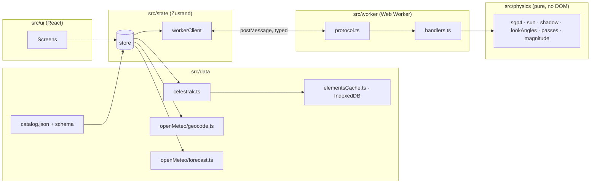

# What Is In Your Sky Right Now — Technical Plan

| Field | Value |
|---|---|
| Status | Draft v0.2 — for review (adds the sky-chart component design for spec decision UX-1); §2.1–2.3 record R1–R3 findings |
| Date | 2026-09-01 |
| Input | `SPEC.md` v0.4 (Decision Log §12 treated as fixed: OQ-1, OQ-3, OQ-4, OQ-11, UX-1 are not reopened here) |
| Scope | Architecture, project structure, module boundaries, data model, worker contract, testing strategy, and the Task Zero physics spike. **No task breakdown** — that is the next step. |

---

## 1. Fixed Inputs

These come from the spec's Decision Log and are not up for debate in this plan:

- **No backend in MVP.** Static site; browser talks to CelesTrak and Open-Meteo directly. Elements cached in IndexedDB, refreshed at most every 2 h.
- **Catalog** is a hand-maintained JSON of ~30 objects with intrinsic magnitudes and provenance.
- **Twilight rule:** list passes when the sun is below −6°; label passes with the sun between −6° and −12° as "sky still bright".
- **CelesTrak CORS** is verified; fallback order is the community TLE API, then pulling the v1 proxy forward.
- **Stack:** React + TypeScript + Vite, static deploy.
- **Sky chart (UX-1):** a 3D ASCII sky dome the user can rotate and tilt, plus a 2D polar fallback over the same data; both DOM-only, no WebGL, no canvas. Monospace / terminal aesthetic across the whole UI.

Everything in spec §5 ("Technical Architecture", marked *proposal*) was reviewed. Where this plan agrees, it is simply adopted below. Where it disagrees, the disagreement and rationale are in §2.

---

## 2. Decisions (challenges to the spec's architecture proposal)

| ID | Spec proposal (§5) | Decision | Why |
|---|---|---|---|
| **D-1** | Magnitude formula: `m = m_std − 15.75 + 5·log10(range_km) − 2.5·log10(sin β + (π−β)·cos β)` | **Corrected to** `m = m_std + 5·log10(range_km / 1000) − 2.5·log10( p(β) / p(90°) )` with `p(β) = sin β + (π−β)·cos β`. | The spec's constant is inconsistent with its phase term. The `−15.75` constant belongs to the *fraction-illuminated* form (`+2.5·log10(r²/f)`, where `f = 0.5` at half phase contributes the 0.75). Combining it with a Lambert phase function that also encodes half-phase double-counts 0.75 mag, making every object appear ~0.75 mag brighter than intended. The corrected form returns exactly `m_std` at 1 000 km and 90° phase, which is the definition of standard magnitude. Unit test pins this anchor point. **Spec §5.4 should be amended at the next revision.** |
| **D-2** | Sun position from `astronomy-engine` *or* `suncalc` | **`astronomy-engine`**, wrapped behind a local `sun.ts` module exposing exactly two functions: sun altitude at an observer (geometric, no refraction) and sun unit vector in the true-equator-of-date frame. | `suncalc` is ~1° class accuracy and has no vector output; the shadow test needs a sun vector. astronomy-engine's equator-of-date (EQD) frame is within arcseconds of the TEME frame satellite.js uses, which is far below what the shadow and twilight tests need. Wrapping it keeps the physics module swappable and keeps the rest of the code free of the library's API. Refraction is off because twilight definitions (−6°, −12°) are geometric. |
| **D-3** | `date-fns`/`date-fns-tz` or a Temporal polyfill; `tz-lookup` as optional | **No date library and no `tz-lookup`.** All times are epoch milliseconds (`number`); display formatting uses `Intl.DateTimeFormat` with the observer's IANA zone from Open-Meteo. | Every formatting need in the spec (HH:MM:SS in a named zone, zone abbreviation, countdowns) is covered by `Intl`. A date library adds bundle weight and a second notion of time. Pure-coordinate input has no zone until the forecast response arrives; until then the UI shows UTC with an explicit "UTC" label — a few hundred milliseconds of latency, not worth a 100 KB timezone database. |
| **D-4** | Zustand *or* React context + `useReducer` | **Zustand** (vanilla store + React bindings). | Worker messages, the 10 s "now" tick, and IndexedDB events all arrive outside the React tree. A vanilla store that can be written from a plain module (the worker client) is simpler than threading dispatch functions into non-React code. Slices stay small and typed. |
| **D-5** | Tailwind *or* CSS Modules | **CSS Modules + CSS custom properties.** No Tailwind. | The UI has a handful of screens and a strong single theme (dark, high contrast, later red night mode). Design tokens as custom properties make the night mode a one-selector swap and carry the monospace/terminal identity (FR-X-6): one `--font-mono` stack, a `--cell` unit equal to one character advance so layout aligns to the same grid the sky dome is drawn on. Avoids a build-time framework and keeps the CSP free of `unsafe-inline` styles. |
| **D-6** | "Web Worker" with an AbortController-style cancel; no protocol defined | **Hand-written typed `postMessage` protocol** (discriminated unions, §6), job IDs, and **cooperative cancellation** by yielding between objects. No Comlink. | Comlink hides the message boundary, which makes streaming partial results and cancellation awkward. A 12-message protocol is small enough to type by hand and test as a pure function in Node. The worker yields to its event loop between objects so a `cancel` message can be observed. |
| **D-7** | Refine peak by golden-section search; sample visibility "every 1–5 s" | **Sample every 1 s inside each above-horizon segment; bisection only for the two 10° crossings.** Peak taken from the 1 s samples with a parabolic refinement across the three samples around the maximum. | With ~30 objects and passes of ≤ 12 min, 1 s sampling is ≈ 20 k propagations per night — trivial. It yields ≤ 1 s precision (FR-VIS-2) for shadow and twilight crossings for free, removes one algorithm (golden section) and its failure modes, and gives the sky-chart track as a by-product. |
| **D-8** | Cylindrical umbra, Earth radius 6371 km, "optional atmosphere fudge" | **Cylindrical umbra, radius 6371.0 km, no fudge, no penumbra in MVP.** The "fading" flag is dropped from MVP. | Keep the model simple until the Task Zero comparison shows a systematic shadow-entry offset versus Heavens-Above. A fudge factor without evidence is a guess. Penumbral fading lasts seconds for LEO and the 1 min acceptance criterion does not resolve it. |
| **D-9** | Fetch `visual` + `stations`, filter client-side | Adopted, plus: **store the raw group payloads unfiltered in IndexedDB**, keyed by group, and filter to the catalog at load time. | Lets v1 widen the catalog to the full `visual` group with no cache schema change and no re-fetch. Costs ~100 KB of storage. |
| **D-10** | "Enforced against the stored timestamp, across tabs and reloads" | **Web Locks API (`navigator.locks`) single-flight around the refresh check**, with fallback to timestamp-only when Web Locks is unavailable. | Two tabs opened together would otherwise both see a stale timestamp and both fetch. A named lock makes the check-then-fetch atomic across tabs. Web Locks is available in all evergreen browsers and Safari ≥ 15.4. |
| **D-11** | Clock-skew warning using a server `Date` header | **Dropped from MVP.** Moves to v1 behind the proxy. | With no backend, the only servers are cross-origin, and `Date` is not a CORS-safelisted response header, so the browser cannot read it. Open-Meteo's `current.time` is a model slot, not a clock. No honest way to implement it in MVP. |
| **D-12** | Hosting: any of Cloudflare Pages / Netlify / Vercel / GitHub Pages | **Cloudflare Pages** — amended 2026-09-02 to **Cloudflare Workers static assets**, same `_headers` file (§2.5). | It supports a `_headers` file for a strict CSP, sits on the same platform as the v1 edge worker, and its free tier is sufficient. GitHub Pages remains a zero-config fallback for previews. |
| **D-13** | Not addressed | **No client-side router in MVP.** Single screen; pass detail is a full-screen sheet. The selected pass ID is mirrored to the URL hash so v1 share links have somewhere to land. | One screen does not justify a router. The hash keeps the door open. |
| **D-14** | "Now" state "using the cached propagation" | **"Now" is computed in the worker on request** (30 propagations at `t = now`), not from cached tracks. | Cached tracks only cover passes; the "Now" panel must also explain *why* nothing is visible (daylight / in shadow / below horizon), which needs live sun altitude and per-object state. Thirty propagations every 10 s is negligible. |
| **D-15** | Not addressed | **Every physics function takes time as an explicit parameter; nothing in `src/physics` or `src/worker` reads `Date.now()`.** | Determinism for golden tests and for Playwright with a fixed clock. |
| **D-16** | UX-1: 3D ASCII sky dome, DOM-only (library-neutral in the spec) | **Render the dome with `@glyphcss/react` (v0.1.x, MIT), confined to one component behind the `SkyChartProps` interface (§8).** Triggers for replacing it: (a) it cannot meet FR-GUIDE-6 (≥ 30 updates/s while dragging on a mid-range phone) at a grid of ~60×30 cells after the §8.5 spike; (b) a needed capability is missing and unfixable from outside (interior camera or backface control if the observer-centred view is later required, hotspot precision, clamped orbit limits); (c) the package stops being maintained — no release or response for 6 months while we carry a blocking bug; (d) a licence or security problem. Replacement path is a hand-written rasteriser behind the same props, and the 2D polar sibling is the interim fallback. | It is the only DOM-text 3D mesh renderer with a React binding that we found; it satisfies FR-GUIDE-5 by construction (one `<pre>`, no canvas, no WebGL, no per-polygon elements). Writing an equivalent rasteriser is a real project. The pre-1.0 API, single-maintainer fork lineage (forked from polycss) and small user base are accepted **only because** the boundary in §8 makes it swappable. |
| **D-17** | UX-1: "rotate/tilt the view toward the horizon they'll face" | **Default camera is an external "over-the-shoulder" orthographic view of the dome** (`GlyphOrthographicCamera` + `GlyphOrbitControls` with `clampPitch`), yaw set to the pass's rise azimuth so the user sees the dome from behind the observer, looking toward that horizon. The strictly observer-centred view (camera at the dome centre looking outward, perspective) is **not** the MVP default; recorded as open question P-OQ-1 in §8.6. | The external view uses only documented camera behaviour (`rotX`/`rotY`/`zoom`) and keeps left/right correct relative to the real horizon (facing south, east appears on the left, as in life). An interior camera needs the perspective camera inside a mesh with inward-facing polygons visible; glyphcss documents neither interior placement nor backface culling. We will test it in the spike, but the plan cannot depend on it. |

### 2.1 Task Zero findings (R1, 2026-09-02)

Recorded by the R1 implementation. **Comparison result (fixture `2026-09-02-neuquen-iss.json`): OVERALL PASS** — the one visible ISS pass in the window matches Heavens-Above within 4 s / 1.0° / 0.2° at start, peak and end, end reason `horizon` on both sides, no unpaired or extra passes. Details in `tests/fixtures/heavens-above/README.md`.

- **`json2satrec` accepts CelesTrak's OMM field names as-is.** No mapping layer is needed. `sgp4.ts` only narrows two fields for satellite.js's types (`EPHEMERIS_TYPE` must be `0`, `CLASSIFICATION_TYPE` is dropped unless `U`/`C`) and rejects other ephemeris types. `json2satrec` and `twoline2satrec` give identical satrecs and positions for the Vallado verification case (satellite 00005, t = 0 and 360 min, positions reproduced to 1e-8 km). satellite.js 7.1.0, astronomy-engine 2.1.19.
- **CelesTrak `EPOCH` has no zone suffix** (`2026-09-01T19:42:22.677120`); `time.ts` appends `Z` and truncates to milliseconds, otherwise `Date.parse` would read it as local time.
- **Runtime:** ISS × 10 days (coarse scan at 30 s plus dense sampling of every candidate) takes ≈ 120 ms in Node 24 on the development machine. Extrapolated, 30 objects × 24 h is well under the 1.5 s CI budget in §9.1; measure it properly once the worker exists (R4).
- **Shadow model vs an independent conical model:** over 10 days at 1 s, `inUmbra` (cylinder, 6371 km, D-8) and satellite.js's own `shadowFraction ≥ 0.5` (conical, penumbra) disagree on 0.19 % of samples, all at transitions; entry/exit instants differ by 0.05 s on average, 7 s at most, with no systematic sign. Our sun vector and satellite.js's low-precision sun differ by ≤ 0.006°. **Not checked against Heavens-Above:** the only pass in the window is horizon-bounded at both ends, so no shadow-entry offset could be measured. D-8 stands; re-examine when a fixture contains a shadow-bounded pass (the next northern-mid-latitude fixture in the MVP phase is the natural place).
- **Sun altitude:** two independent paths (astronomy-engine topocentric `Equator` + `Horizon`, and satellite.js `sunPos` pushed through `frames.ts`) agree within 0.002°; the −6° and −12° instants from sunrise-sunset.org agree within 0.15°. astronomy-engine's `Horizon` takes no refraction when the argument is omitted; the string `'none'` is rejected.
- **Window content:** with the 2026-09-02 elements, every ISS culmination above 10° at Neuquén in the ten days from 2026-09-02T03:51Z falls in daylight except one marginal twilight pass on 2026-09-11 09:48Z (peak 10.2°). Heavens-Above lists exactly the same single pass. A ten-day window with one pass is a thin validation; the two further golden fixtures planned for the MVP phase (§10.4) should be captured when several dark passes fall inside the window.
- **Brightness (informational, D-1 + `stdMag` seed −1.8):** we predict +1.2 at the pass peak where Heavens-Above prints −0.1 to −0.3 (range 1 505 km, phase angle back-lit in morning twilight). The 1.3–1.5 mag gap is outside the acceptance criterion but large enough that R3 should settle the ISS `stdMag` (and its provenance) against more than one pass before the magnitude cut goes live.
- **Heavens-Above quirks worth knowing:** the summary table and the detail page differ by up to 5 s for the same event, and the detail page prints altitudes as whole degrees. The detail page is the reference.
- **Package manager:** `npm` (CLAUDE.md left the choice open; `pnpm` is not installed and TASKS.md already uses `npm test` / `npx`).

### 2.2 R2 decisions (2026-09-02)

- **D-18 — Worker chunks are ES modules** (`worker.format = 'es'` in `vite.config.ts`). satellite.js 7 ships an optional WASM/pthreads build behind `#wasm-multi-thread`, whose worker entry uses top-level await; Vite's default IIFE worker format refuses it and the production build fails. We never call `createWasmModule`, so the chunk is emitted (~300 KB, uncompressed) but never fetched. Module workers are supported by every evergreen browser and Safari ≥ 15, so the R5 worker is a module worker too. R11's bundle-budget check should exclude or drop that dead chunk.
- **D-19 — Vite 7.x with Vitest 3.2**, upgraded together. Vitest 3.2's peer range stops at Vite 7 while the current `@vitejs/plugin-react` needs Vite 8; the pair is pinned (`vite@7`, `@vitejs/plugin-react@5`) until Vitest 4 is adopted deliberately. Vitest's `projects` splits `src/ui` (jsdom, Testing Library, MSW) from everything else (Node, MSW); both projects start the MSW server with `onUnhandledRequest: 'error'` so no unit test can reach the network (§9.3).
- **ESLint** uses `typescript-eslint` `strict` + `stylistic` (non-type-checked) and `react-hooks` flat recommended; `no-unused-vars` ignores `_`-prefixed names and rest siblings. The type-checked variants and the §3 boundary rules are R5's.
- **R2 crosses the §3 boundaries on purpose:** `src/ui/components/passes/nextPass.ts` imports `src/physics` and `App.tsx` imports `src/data` directly, running `findPasses` on the main thread with the ISS `stdMag` seed (−1.8) hard-coded. The catalog (R3), store and worker (R5) replace this; the lint boundary rules land only then.
- **`lib/timeFormat.ts`** builds strings from `Intl.DateTimeFormat.formatToParts` (locale `en-GB`, `hourCycle: 'h23'`) so output is `HH:MM:SS` regardless of locale punctuation; with `timeZone === null` the label is the literal `UTC` (D-3). Zone abbreviations come from Intl's `short` name and may read `GMT-3` rather than `ART`; revisit in R8 if the spec's "zone abbreviation" needs more.
- **E2E runs against the production build** (`vite preview` on port 4173); `npm run e2e` builds first, CI builds in the previous step. Cross-origin CelesTrak calls are fulfilled with `access-control-allow-origin: *` by the Playwright route.

### 2.3 R3 decisions (2026-09-02)

- **D-20 — The pass list window is 24 h from "now"** (`SEARCH_WINDOW_HOURS` in `ui/components/passes/passSearch.ts`), FR-VIS-1's MVP minimum and the window the §9.1 performance budget is written for. R2's 10-day ISS-only search is gone: 31 objects × 10 days on the main thread measured ≈ 3.6 s per recompute, and R2 recomputes on every valid keystroke. 31 objects × 24 h takes ≈ 350 ms in Node; the worker (R5) removes the freeze, the multi-night window is v1 (spec §8 rank 6). Tests that need the R1 golden pass (nine days after `capturedAt`) start the 24 h window at `capturedAt + 9 d`: an offset that is a multiple of the 30 s coarse step keeps the scan grid in phase with R1's, so start/peak/end reproduce exactly rather than to within one sample. `tests/support/catalogFixtures.ts` holds this.
- **D-21 — `src/data` imports `parseOmmEpoch` from `src/physics/time`.** `SatelliteRecord.epochMs` (FR-SAT-4) has to be parsed somewhere on the main thread, and §3 allows `src/data` neither `src/physics` nor `src/lib`. `physics/time.ts` is a dependency-free leaf (no satellite.js, no DOM), so the R5 boundary rules should whitelist `src/physics/time` for `src/data` rather than duplicate the parser. Revisit if a second physics leaf is ever needed there.
- **D-22 — Intrinsic magnitudes come from Mike McCants' Quicksat `qs.mag` (2020-09-14, mmccants.org/programs/qsmag.zip)**, the source spec §6.1 (OQ-3) names. Its definition — magnitude at 1 000 km range and half phase — is exactly the D-1 standard magnitude, so values are used unconverted; each entry's `stdMagSource.note` cites the `qs.mag` row and any comment (flares, "sometimes very bright"). The **ISS is −2.5** there, 0.7 mag brighter than the R1 seed (−1.8): on the R1 golden pass we now predict +0.5 against Heavens-Above's −0.1 to −0.3, closing half the gap noted in §2.1. The remaining ~0.7 mag is consistent with the station having grown since 2020 (iROSA arrays) and with the back-lit geometry of that pass; a fixture with a well-lit ISS pass (§10.4's northern mid-latitude capture, task H) is the place to settle it, not a hand-tuned constant. **Tiangong (48274) post-dates the file** and carries a project estimate (−1.0, back-solved through D-1 from reported overhead brightness of about −2.5 to −3) marked as such in its provenance. Docked modules and visiting vehicles (Wentian, Mengtian, Nauka, Progress, Dragon, Soyuz…) are deliberately absent so each station appears once. Membership is 31 objects: 2 stations, 11 payloads, 18 rocket bodies (eight of them SL-16 Zenit stages at magnitude 2.0), all present in the R1 fixtures and, per `scripts/check-catalog.ts` on 2026-09-02, in the live `visual`/`stations` groups. **The magnitude cut (MAG_LIMIT 4.5) is live from R3** for every object; R2 already applied it to the ISS.
- **Loader without cache** (`data/elementsLoader.ts`): both groups are fetched in parallel; if either request fails the load fails, because §7.1's "use the cached set" branch does not exist until R11. `unavailable` carries catalog ids absent from both groups; the UI does not show them yet (R11's banners).
- `tests/e2e/next-pass.spec.ts` is replaced by `pass-list.spec.ts`; `ui/components/passes/nextPass.ts` and `NextPassLine.tsx` are deleted, `ISS_STD_MAG_SEED` survives only in `tests/support/heavensAbove.ts` for the R1 comparison script.
### 2.4 H decisions and findings (2026-09-02)

Recorded by the H implementation (physics hardening). Fixtures: `2026-09-02-paris-iss` (48.86° N) and `2026-09-02-singapore-iss` (1.35° N), captured 13:27–13:28 UTC with a CelesTrak capture at 13:27:43 UTC whose ISS element set is the very one Heavens-Above was using (epoch 2026-09-02T03:26:53 on both sides). **Both OVERALL: PASS** — 12/12 and 7/7 passes paired within 6 s / 3.3° / 4.2° at every point, no unpaired passes, no extras, all start and end reasons matching. Details in `tests/fixtures/heavens-above/README.md`.

- **D-23 — Golden fixtures are named by place and carry their own pairing metadata.** `tests/fixtures/heavens-above/<date>-<place>-iss.json`; the fixture's `ommFixture` names its OMM capture (a second capture on the same date is `<date>T<HH>`), `searchPeriod` is Heavens-Above's own search window and clips the comparison window, `location` is the observer label. The R1 fixture keeps working through defaults (`neuquen`, same-date OMM, no clipping). `validate-iss.ts --fixture <name>` / `--all`; `passes.golden.test.ts` runs every fixture and asserts that the set covers ≤ −30°, 45–52° N and |lat| ≤ 5°.
- **D-24 — A Heavens-Above pass without a "Maximum altitude" row is compared at the higher of its start / end rows** (end on a tie). Heavens-Above omits the row when the highest point is a shadow boundary above 10°; its summary table repeats that row in the Highest column. Seven of the nineteen new passes are of this kind. `summary.highest` in the fixture overrides the rule.
- **D-8 evidence — shadow boundaries are systematically offset by 4–6 s.** Across all 19 shadow-bounded boundaries in the two new fixtures we exit the umbra 3–5 s earlier and enter it 4–6 s later than Heavens-Above, never the other way round: our cylindrical umbra of 6371.0 km with no atmosphere is slightly narrower than theirs. That is ≈ 30–45 km along track, well inside the 60 s criterion, and the visible pass we report is a few seconds *longer* than theirs at the shadow end (safe side for a user). D-8 stands for MVP; the evidence is now on record for a v1 decision (candidates: a larger effective radius of ≈ 6371 + 20–40 km, or a conical penumbra midpoint — both to be checked against these fixtures, which are the tripwire).
- **Brightness (informational, seed `stdMag = −1.8`, D-1 form):** with 19 more passes the pattern is clear: relative to Heavens-Above we are 0.3–0.6 mag too bright at high elevation and 0.8–1.3 mag too faint on low, distant passes — Heavens-Above's magnitude varies less with range and phase than the diffuse-sphere law does. The catalog value of −2.5 (R3, McCants) would fix the low passes and worsen the high ones. Not an acceptance criterion; the magnitude cut at +4.5 is unaffected for the ISS. Left for the v1 brightness work with these fixtures as the data set.
- **Passes of 1–2 s** (Paris 7 Sep and 11 Sep: reaches 10° and enters shadow within two seconds) are found by the 1 s dense grid (D-7) without special handling and pair within 6 s. No sub-resolution rule was needed.
- **Unit references.** Every `src/physics/*.test.ts` now asserts its module's slice of `reference-values.json` (which gained `inUmbra` and names the fixture in full; all pinned numbers unchanged). Sunset reference: NOAA's published spreadsheet algorithm is embedded in `sun.test.ts` (sunrise-sunset.org's sunset instant is ~2 min later than the geometric −0.833° and is not used). Coverage gate: `npm run test:coverage:physics` (`@vitest/coverage-v8`, 90 % lines per file; measured 100 % lines on every file).
- **Runtime:** ISS × 10 days takes 54–122 ms per fixture in Node 24; the whole golden suite runs in ≈ 0.6 s.

### 2.5 R4 decisions (2026-09-02)

- **D-12 amended — hosting is Cloudflare Workers static assets, not Cloudflare Pages.** The dashboard's *import a repository* flow now creates a Worker with static assets built by Workers Builds; Cloudflare steers new projects there and documents a Pages → Workers migration. D-12's reasons hold: the `_headers` file has the same format and semantics (parsed at upload, never served, `/*` and `/assets/*` rules stack), the free tier is the same, and the v1 edge worker lives on the same platform. `wrangler.jsonc` is committed so Workers Builds skips wrangler's autoconfig, which otherwise installs `@cloudflare/vite-plugin` and rewrites `vite.config.ts` inside the build sandbox on every build: assets-only Worker, `not_found_handling: "404-page"` (hash routing, D-13, needs no SPA fallback), `preview_urls` on, observability off (FR-X-3). Production is `https://what-is-in-your-sky.ezequiel-baruf.workers.dev`, built from `main`; a preview per branch comes from Workers Builds' *non-production branch builds* (`npx wrangler versions upload`, aliased by branch name as `https://<branch>-what-is-in-your-sky.ezequiel-baruf.workers.dev`), enabled per project under *Settings → Builds*. Verified 2026-09-02 on the `r4-deploy` preview: all three §11 headers on `/`, the immutable `Cache-Control` on `/assets/*`, and 404 for `/_headers` and unknown paths. The first production build ran from `main` before this branch merged and served no headers, as expected: `public/_headers` does not exist on `main` yet.
- **D-25 — `vite preview` serves `public/_headers` the way Cloudflare does.** A small plugin in `vite.config.ts` parses the Pages format (unindented path pattern, indented `Name: value` lines, `*` matching across `/`, matching rules stacked) and sets the headers on every preview response. The Playwright suite therefore runs the production build under the strict CSP: `tests/e2e/deploy-headers.spec.ts` asserts the §11 values on `/`, the immutable `Cache-Control` on `/assets/*`, zero `securitypolicyviolation` events during the R3 flow, and requests only to the site origin and CelesTrak. It is the offline twin of R4's `curl -sI` and DevTools checks, and it fails CI before a violation reaches the site. The dev server is untouched: React Fast Refresh injects inline scripts the CSP forbids. `tests/deploy/headers.test.ts` (Node project, typechecked through `tsconfig.node.json`) pins the file to the §11 block verbatim, so a change to either the doc or the file without the other fails a test, and checks that every `https://` host referenced in `src/**/*.ts(x)` is in `connect-src` (FR-X-3).
- **D-26 — zod runs jitless.** zod 4.5 compiles object parsers with `new Function` and probes for it once with a caught call; under `script-src 'self'` the caught probe is still reported as a CSP violation (the D-25 e2e caught it on its first run). `src/data/zod.ts` calls `z.config({ jitless: true })` and re-exports `z`; it is the only module that may import `zod` (enforced by `src/data/zod.test.ts`), because the flag is read when a schema is *built*, so the configuring module has to evaluate before any schema module. Cost: the interpreted parser on a few hundred records per group, not measurable next to the pass search. `unsafe-eval` is not an option (§11).
- **Pages project:** Git integration (preview per PR, production on `main`), project name `what-is-in-your-sky`, framework preset Vite, build `npm run build`, output `dist`, Node from `.node-version` (24, same as `ci.yml`). Created once in the dashboard; steps in `README.md`. The GitHub Actions alternative (`wrangler pages deploy` from `ci.yml`, gated on the tests) was not taken: the task asks for the repo wiring, and Pages' own build keeps a single source of truth for what is deployed. Revisit in R15 if deploys should wait for CI.

### 2.6 R5 decisions (2026-09-02)

Recorded by the R5 implementation (worker, store, streaming list).

- **`jobDone.hasDarkness: boolean`** is added to the §6.2 protocol: whether the observer's sun altitude reaches `sunAltMaxDeg` anywhere in the window, computed by `physics/darkness.ts` (sampled every 10 min plus the window end; the sun moves ≤ 0.25°/min, so the grid resolves twilight to ~2.5° and the end check catches a window that ends just after dusk). The list shows spec §5.6's "no darkness tonight at this latitude" when a finished job has no passes and `hasDarkness` is false; R7's Now panel reuses the flag.
- **Error semantics (§6.2 rules, made precise):** `PROPAGATION_FAILED` carries the job id, the object is skipped and the job goes on; `NO_ELEMENTS` and `INTERNAL` carry the job id and end the job **without** a `jobDone`. The client treats those two as terminal, drops the job's handlers and reports the error; the passes slice shows "Could not compute passes: CODE: message". A `cancel` for a job the worker does not know is ignored; a cancelled job's `jobDone` is dropped by the client because the job was forgotten the moment `cancel` was posted.
- **`computeNow` answers `INTERNAL`** ("not implemented until R7"); the protocol type is complete so R7 only adds the handler and `physics/now.ts`.
- **D-27 — `src/state` may import `src/physics/constants`.** The `computePasses` request carries the thresholds, and their defaults are a value (`DEFAULT_THRESHOLDS`), which `src/model` (types only) cannot hold. Same pattern as D-21: a dependency-free leaf whitelisted in the boundary rule (`except: ['./constants.ts']`) rather than a duplicated constant. `src/state` may also import `src/worker/protocol` (types) and references `passes.worker.ts` by URL only.
- **D-28 — `eslint-plugin-import-x` instead of `eslint-plugin-import`.** The original plugin's peer range stops at ESLint 9; import-x supports ESLint 10, ships the same `no-restricted-paths` rule and a built-in node resolver. §3 is enforced as one zone per table row, plus `@typescript-eslint/no-restricted-imports` for the rows a path zone cannot express: React banned in `physics`, `worker`, `data`, `lib`, `model`; physics **types only** in `lib` (`allowTypeImports`); `@glyphcss/react` allowed only under `ui/components/guide/skychart/dome/`; `*canvas*` / `*webgl*` banned everywhere (FR-GUIDE-5). `no-restricted-globals` bans `Date` in `physics`, `worker` and `lib` (D-15); the one exception is `physics/time.ts`, the epoch-ms ↔ `Date` converter itself, and `lib/timeFormat.ts` now hands `Intl` the number. Test files are exempt from the boundary rules. Verified with the four probe files the task asks for (React in physics, `Date.now()` in lib, `src/data` from `src/ui`, a `*canvas*` import) — each fails `npm run lint`; none is committed.
- **D-29 — Progressive rendering is proven from a DOM log, not a slow worker.** 31 objects × 24 h take ≈ 375 ms in the worker, too fast to watch cards land. The Playwright test installs a `MutationObserver` before the app boots that records every distinct set of card ids the DOM went through; "one at a time, ISS first" is asserted on that log (first non-empty entry is exactly one ISS card; the second location goes through more than one set before its final one; no set after the switch contains a first-location id). The "throttled worker route" delays the worker script by 1.5 s, which is what shows the page responsive and `aria-busy` with zero cards before the first one lands. The store test with the scripted fake worker covers the cancel-and-ignore-late-messages path exactly (`cancel` for job 1 posted, job 1's late `passes` and `jobDone` never reach the slice).
- **Vitest browser project** (`--project browser`, `@vitest/browser` + Playwright Chromium, headless) runs `src/**/*.integration.test.ts` as part of `npm test`; CI therefore installs Chromium before the unit tests. Fixtures are imported as modules there (no `node:fs`). satellite.js and astronomy-engine are listed in `optimizeDeps.include` so Vite does not reload the test mid-run.
- **Store shape** (`state/store.ts`, D-4): one vanilla store with `location` (observer + the `nowMs` read from an injected clock when it was set), `elements` (`idle | loading | error | ready`, the latter also carrying the worker's `rejected` list) and `passes` (job id, status `idle | computing | done | error`, the observer and window the results belong to, passes kept sorted by start as they stream, `done/total`, `hasDarkness`, `elapsedMs`, skipped objects). Every passes action carries the job id and is ignored for any other job. `createAppStore({ now })` for tests, `appStore` for the app; `startApp()` in `main.tsx` creates the worker and wires `state/effects.ts`. Elements are still prefetched on start, as in R3; the effect loads them once, hands them to the worker once, and starts a job per observer change with a generation counter so a stale chain never writes.
- **Runtime:** 31 objects × 24 h in `findPasses` (Node 24, development machine): 378, 373, 377 ms in three consecutive runs of `passes.perf.test.ts` against a 1 500 ms budget; the worker integration test reports the same order in Chromium (≈ 520 ms including boot). The main-thread freeze noted in D-20 is gone.
- `PassCard` carries `data-pass-id` (the pass id) for the e2e; R6's detail screen can use it as its hook.

### 2.7 R7 decisions (2026-09-02)

Recorded by the R7 implementation ("Now" panel).

- **D-30 — `visibleUntil` is found by a look-ahead on the pass search's own 1 s grid.** `physics/now.ts` steps forward from `t` in 10 s coarse steps until the visibility predicate fails, then refines the last coarse step at `DENSE_STEP_MS`; `visibleUntil` is the last visible sample and `endReason` is `failingReason` of the first invisible one. Because the grid is `t + k·1 s`, a request made on a pass's grid returns exactly that pass's `end` (asserted on the R1 golden pass). The look-ahead is capped at 30 min (`MAX_LOOKAHEAD_MS`, longer than any LEO pass above 10°); an item still visible at the cap carries no `visibleUntil` and the panel says "visible for a while yet". Cost: ≈ 70 + 10 samples per visible object per tick, for at most a handful of visible objects. `magnitude` is `null` below the horizon (`elDeg < 0`) or in shadow, as the §5 comment says; between 0° and 10° it is still reported.
- **D-31 — The 10 s tick lives in `state/effects.ts` with an injected clock and an injected `VisibilitySource`.** `startEffects` gains `now: () => EpochMs` and `visibility: { hidden, subscribe }` (`documentVisibility(document)` in the app, a flag in tests), so the effects never read `Date.now()` or `document` themselves and the Node test drives both with fake timers. The first `computeNow` goes out the moment the worker holds the elements for the current observer (right after `computePasses` is issued); `setInterval(NOW_TICK_MS)` runs from then, is cleared while `document.hidden`, and a tab becoming visible refreshes at once and re-anchors the interval. Only the latest request's reply is written (a sequence number), and an observer change bumps both the sequence and the generation so a previous location's in-flight answer is dropped; the slice records the observer each state belongs to and the panel ignores a state for another observer. Errors are recorded without dropping the last good state.
- **`computeNow` semantics (§6.2):** `NO_ELEMENTS` (with the request id) when nothing is loaded; otherwise one `nowState` with every loaded object in `computeOrder` (featured first). It is one-shot and cannot be cancelled; because the handler yields between objects (D-6) a `computeNow` posted during a `computePasses` job is answered between two objects, which the handler test checks. In the client, one-shot requests share a typed `request()` helper keyed by request id; a reply of the wrong type rejects.
- **`src/state` re-exports `DEFAULT_THRESHOLDS`** (extends D-27): the panel quotes the elevation floor ("no catalog satellite is above 10°") from the thresholds the state actually sent, and `src/ui` still never imports `src/physics`.
- **Empty-state precedence in `NowPanel`:** visible items win; then `hasDarkness === false` from the finished job (spec §5.6, R5 flag) regardless of `sky`; then `sky === 'day'` (sun altitude quoted); then "nothing above 10°" when no item is `aboveMinElevation`; else "N up but all in Earth's shadow". `bright-twilight` is not an empty state: the observer is dark enough for visibility under the −6° rule (§1), so its items are judged like `dark` ones. Cloud cover joins the panel in R8 (FR-WX-3).
- **`jest-axe`** (`jest-axe` + `@types/jest-axe`) is installed; `tests/setup/vitest.jsdom.ts` extends `expect` and augments vitest's `Matchers<T = any>` (the parameter must match vitest's own declaration). Component tests for the panel run `axe` on the no-observer, visible and daylight states.
- **Playwright and the tick:** `page.clock.install` + `pauseAt` + `runFor(10_000)` fires the app's interval with the page clock 10 s later, so the countdown moves by 10 s without a reload — US-4 AC2 proven end to end. The older specs now scope `getByRole('status')` to the "Upcoming passes" region, since the panel adds a second live status line.
- **`lib/timeFormat.formatCountdown(ms)`** ("3:12", clamped at "0:00") is the one countdown formatter; R6's `Countdown` can reuse it.

### 2.8 R6 decisions (2026-09-02)

Recorded by the R6 implementation (pass detail sheet, guide text, countdown).

- **D-32 — Band boundaries.** FR-GUIDE-1 lists the elevation bands as 10–25 / 25–50 / 50–75 / > 75, which leaves 25, 50 and 75 in two bands; a value on a boundary belongs to the **higher** band (25° is mid-sky, 50° is high, 75° is almost overhead). FR-GUIDE-3's magnitude bands are read the same way in the direction magnitudes grow: a boundary belongs to the **brighter** band (−4 is "brighter than Venus", −1.4 "brighter than any star", +1 "like a bright star", +3 "like an average star"). Pinned in `lib/phrases.test.ts`.
- **Sentence template (US-6 AC1).** `guideSentence(pass, timeZone)` = `<Start> <elevation word> in the <compass name> at <time>, climbs to <peak °> (<elevation phrase>) in the <compass name> at <time>, <end phrase> in the <compass name> at <time>. <Brightness phrase> (magnitude <±n.n>).` plus ` The sky will still be bright, so it may be hard to spot.` when `twilight` (FR-VIS-7). Start phrases by reason: `Appears` (horizon), `Emerges from Earth's shadow` (shadow), `Becomes visible as the sky darkens,` (twilight); end phrases: `drops below the horizon`, `disappears into Earth's shadow`, `fades into the brightening sky` (US-6 AC4). Compass points are spelled out in prose (`west-southwest`) and abbreviated in the card and table. Times carry the zone label `formatClock` gives (`UTC` until the zone is known, D-3). The magnitude number is in the sentence so it stands alone as the chart caption (R13, FR-GUIDE-7).
- **D-33 — Hash ids match with a 2 min tolerance.** Pass ids are `${noradId}-${start.t}`; a recompute from a new "now" moves the 30 s coarse grid and can shift a refined boundary by a second, so `#pass=<id>` with no exact match opens the same object's pass whose start is within `SAME_PASS_TOLERANCE_MS` (120 000). Opening assigns `location.hash` (a history entry, so the browser's Back closes the sheet); closing clears the hash with `replaceState`. The hash is the only selection state (D-13: no router, no store slice).
- **D-34 — Golden guide strings use the catalog's `stdMag`.** `reference-values.json` pins the golden pass's `peakMagnitude` as computed with the R1 seed (−1.8); the app computes it with the catalog's −2.5 (D-22). D-1 is linear in `stdMag`, so `tests/support/catalogFixtures.ts#goldenPassFixture` shifts the reference magnitude by `stdMag − ISS_STD_MAG_SEED` and the golden strings say "+0.5, like a bright star", which is what the screen shows and what the Playwright test compares against. A change to the ISS `stdMag` therefore changes the golden strings deliberately; the reference file stays untouched.
- **Detail sheet accessibility (FR-X-5).** `PassDetail` is `role="dialog" aria-modal="true"` labelled by its heading; the heading takes focus on open (`tabIndex={-1}`), the element focused before opening gets focus back on close, Escape and the "Back to the list" control both close, and `<main>` is `inert` while the sheet is up so the list leaves the tab order. `jest-axe` (`toHaveNoViolations`, wired in `tests/setup/vitest.jsdom.ts` with a `vitest` module augmentation) runs on the sheet alone and on `App` with the sheet open.
- **Countdown.** `Countdown` is pure display: `countdownState(pass, now)` walks rise → peak → set → ended with the label after the boundary reason ("Appears in", "Peak in", "Sets in" / "Enters shadow in" / "Fades in", "Ended … ago"); `PassDetail` owns the 1 s tick through `useNow` (UI code may read the clock; `src/lib` may not, D-15). `lib/format.ts` is new (the §4 tree's number formatting: degrees, duration, magnitude, range, clock durations), moved out of `PassCard.tsx` so the card, the table and the countdown share it.
- The sky chart mounts in the labelled `data-slot="sky-chart"` block of the sheet from R13 on; until then it shows a dashed placeholder. `GuideText` carries `data-testid="guide-sentence"` so R13's `<figcaption>` can reuse the same golden assertion.
- R7 (`r7-now-panel`) merged first; the overlap on `package.json` (jest-axe), `App.tsx` (NowPanel between the input and the list) and `tests/setup/vitest.jsdom.ts` (R7's `Matchers` augmentation kept) was resolved on this branch.

### 2.9 R8 decisions (2026-09-02)

Recorded by the R8 implementation (cloud verdict, local time).

- **D-35 — The forecast fills `Observer.timeZone` by replacing the observer object, and that is not a location change.** `weather.fillTimeZone` builds `{ ...observer, timeZone }` only when the zone was null (a geocoded observer keeps its own) and re-points `passes.observer`, `now.observer` and `weather.observer` to the new object in the same `set`, so the identity checks the panel and the list rely on keep holding. The effects subscribe on `nowMs` and on `sameLocation` (everything but the zone) rather than on observer identity, so the fill triggers no recompute, no cancel and no second forecast; the `computeNow` reply is written against the store's observer at reply time for the same reason. Alternative considered: leaving the observer alone and deriving the display zone from the weather slice in a selector — rejected because §7.3 and D-3 say the forecast fills the observer, and R9/R10 read `Observer.timeZone` as the one source of the zone.
- **D-36 — The zone abbreviation is Intl's `short` zone name in `en-GB`.** `GMT-3` for `America/Argentina/Salta` (CLDR has no English abbreviation for Argentina), `BST` / `CEST` for London / Paris, `GMT+9` for Tokyo; pinned in `timeFormat.test.ts`. Open-Meteo's `timezone_abbreviation` field is parsed but not used: it varies between the offset form and letters across releases, and the IANA `timezone` is what `Intl` needs. This closes the D-3 note left by R2. Every time on screen — cards, Now panel, tooltip, detail sheet — switches to the zone the moment the forecast arrives; until then it is `UTC`, labelled.
- **D-37 — The forecast is requested for the 0.1° cell, not the exact coordinates.** `forecastUrl` sends the cell centre with one decimal (`latitude=-38.9&longitude=-68.0`), so the cache key (`cellKey`, `"-38.9,-68.0"`) and the request agree and two observers in one cell get the same bytes. The cell is ≈ 11 km, the resolution of the best Open-Meteo models. Concurrent loads for one cell share the in-flight promise; the 30 min TTL (FR-WX-5) counts from the client clock at fetch time and is enforced on read (memory, then `localStorage` `wiys:wx:v1`) and on write (stale entries pruned). Storage is optional and its failures are swallowed: private mode and quota errors never fail a load.
- **Verdict (`lib/cloudVerdict.ts`):** each layer is interpolated linearly between the two bracketing hourly samples, then weighted `0.6·low + 0.3·mid + 0.1·high`; layers are used only when both neighbours carry all three, else the total (FR-WX-4 "where the provider supplies"). Boundaries: 29.9 % clear, 30 and 70 % partly, 70.1 % obscured. `unknown` without a snapshot and outside the covered hours (a pass beyond the three forecast days, or a stale fixture). The Now panel uses the same function at `state.t`; a separate "latest hourly value" path was not worth a second rule.
- **Weather is requested the moment the observer changes**, before the elements load, in parallel with the CelesTrak fetch, and never blocks the pass job; a rejection sets `weather.status = 'error'` and leaves the passes and the zone alone (US-7 AC4, FR-X-4). A late snapshot for a previous observer is dropped by the generation check.
- **Open-Meteo failure modes seen live on 2026-09-02, 19:20–19:40 UTC** (the fixture capture ran into an outage): HTTP 200 with a plain-text body (`Unexpected error while streaming data: allEndpointsUnavailable` / `timeoutReached`), HTTP 200 with `{"error":true,"reason":"The service is overloaded"}`, and 30 s connection timeouts. `fetchCloudForecast` therefore treats a non-JSON body and a body matching `{ error: true, reason }` as failures whatever the status; both are tested with MSW.
- **`CloudBadge`:** a focusable `[Clear, 12 % cloud]` span with the tooltip as its `aria-describedby` target (`role="tooltip"`), shown on hover and on keyboard focus (FR-X-5); the tooltip states the thresholds, the effective figure, the provider name and the fetch time in the display zone (US-7 AC2/AC3). It is laid out in flow under the badge, not absolutely positioned, so it can never overflow a 390 px screen; the wrapper sits above the card's "Open guide" overlay so hover reaches it.
- **Fixture:** `tests/fixtures/open-meteo/2026-09-02-neuquen-forecast.json` is the verbatim response to the PLAN §7.3 URL for cell `-38.9,-68.0`, captured at 2026-09-02T19:51:17Z with `access-control-allow-origin: *` confirmed on the response; `.meta.json` records the URL, the time and the cell. MSW serves it for every forecast request whose query is exactly the §7.3 one and answers 400 otherwise.
- **Playwright:** `weather.spec.ts` fixes the page clock at the fixture's fetch time so the 24 h window lies inside the three forecast days, and checks every card and the Now panel against the badge states, the `GMT-3` times and the tooltip; its second test aborts the route. The older specs abort the Open-Meteo route explicitly and keep asserting `UTC` (a fulfilled route would switch their times to the Salta zone). `deploy-headers.spec.ts` fulfils it and now expects three hosts.

### 2.10 R9 decisions (2026-09-02)

Recorded by the R9 implementation (place-name search).

- **D-38 — Place search reaches the UI as a function, not a store slice.** `src/data/openMeteo/geocode.ts` owns the client and the session cache (`searchPlaces`, created on first use like `loadCloudForecast`); `src/state/index.ts` re-exports it so `src/ui` keeps to the §3 rule, and `App` passes it to `PlacePicker` as a prop (tests pass a stub). The 500 ms debounce, the in-flight `AbortController` and the list state are component-local, as §7.2 says; only the chosen observer goes to the store through `setObserver`. A slice was considered and rejected: the query and the pick list are transient UI state that no other component reads. `Place.admin1` and `country` are optional (a country-level result such as "Singapore" carries no `admin1`, verified live) and `placeLabel` joins whatever is present; `elevation` defaults to 0 when absent, and the geocoded observer stands at the place's elevation (`altM`), which the pass search is insensitive to at this scale.
- **D-39 — Cache and request rules.** The key is the normalised query: NFC, trimmed, inner whitespace collapsed, lower-cased; the same text is also what is sent, so identical keys mean identical URLs. Queries shorter than two characters never reach the network (Open-Meteo answers nothing for one character, verified live). Concurrent searches for one key share the in-flight request; a rejection is not cached, so the next keystroke retries. A caller's signal only detaches that caller — the shared request runs to completion so its answer is cached for the next keystroke. Failure handling mirrors the forecast client (D-37's outage shapes): non-JSON bodies and `{ error: true, reason }` bodies are errors whatever the status; the error schema is now `openMeteoErrorSchema`, shared by both clients. The no-match response has no `results` key (verified live), which the schema accepts as an empty list.
- **D-40 — Picker behaviour.** The field is a `combobox` over a `listbox` (`aria-activedescendant`, `aria-expanded`); ArrowDown / ArrowUp walk and wrap, Escape closes, Enter picks the highlighted row, else the first, and with the list closed searches at once instead of waiting for the debounce. Picking writes the label into the field, closes the list and sets the observer; the confirmation line ("Using the centre of <label> (<lat>, <lon>)", also the FR-LOC-6 note) is driven by the store's observer and shows only while `source === 'geocode'`, so typing coordinates afterwards hides it. Editing the text after a pick does not clear the observer: clearing is R10's action, and a keystroke must not cancel the running pass job. The empty and error states carry an `enter coordinates instead` link to the coordinates input (`id="coords"`, a new `CoordsInput` prop) that moves focus on click. Rows are two text rows (48 px at the 16 px base) and the list flows under the field, never positioned, so nothing can overflow 390 px. The empty-state prompts of the pass list and the Now panel now read "Enter a place name or coordinates …".
- **Testing note:** testing-library's async wrapper waits on a real `setTimeout` and advances only Jest's fake timers, so `user-event` hangs under Vitest fake timers. The timing tests (debounce, superseded search) fake `setTimeout` / `clearTimeout` only and drive the input with `fireEvent` inside `act`; the interaction tests use `user-event` with real timers and press Enter, which searches at once.
- **Fixtures:** two verbatim responses to the §7.2 URL, both captured 2026-09-02 with `access-control-allow-origin: *` confirmed. `2026-09-02-cipolletti-geocode.json` (`name=cipolletti`, 20:18:49Z) is the example place: one result, "Cipolletti, Rio Negro, Argentina" at −38.93392, −67.99032 in `America/Argentina/Salta` — the R1 golden observer to two decimals, so the pass list for the picked place contains the golden ISS pass. `2026-09-02-rosario-geocode.json` (`name=rosario`, 20:03:55Z) is the ambiguous pick list: eight results across five countries. MSW serves each for its name, the provider's no-match shape for any other, and 400 for a request that is not the §7.2 one.
- **Playwright:** `place-search.spec.ts` runs at 390 px with the forecast route aborted. The main flow types "Cipolletti" key by key and expects one request, picks the row, and expects "Using the centre of Cipolletti, Rio Negro, Argentina (−38.93, −67.99)" and a pass list with the golden ISS pass whose start time is already `GMT-3` — the zone came from the geocoding result (FR-LOC-3). The second test types "Rosario" and checks every row of the eight-row list (name, region, height ≥ 44 px, inside the viewport, font ≥ 16 px) and the keyboard pick. Screenshot in `docs/screenshots/r9-place-picker-390.png`.

### 2.11 R10 decisions (2026-09-02)

Recorded by the R10 implementation (device geolocation, saved location, coordinate forms).

- **D-41 — The saved location is the store's observer, written through.** `src/data/localPrefs.ts` owns `wiys:prefs:v1` (a zod-checked `{ observer? }` object; more preferences join it later, and a body that fails the schema reads as empty rather than repaired) over the `StorageLike` that `weatherCache` already used, now in `src/data/storage.ts`. `createAppStore` subscribes to the observer object and rewrites the prefs on every change, so a zone the forecast fills in (D-35) is remembered and a reload shows local times before any forecast arrives. The `prefs` slice therefore holds no state: `restoreSavedObserver` reads the prefs and goes through `setObserver`, and `startApp` calls it *after* `startEffects`, so the restored location is computed exactly like a typed one; `clearSavedObserver` is `setObserver(null)`, which the write-through turns into removing the key, and which also empties the screen: a clear action that left the list on screen would look like nothing happened. A `savedObserver` mirror in the store was considered and dropped: whatever observer the store has is what storage has.
- **D-42 — Coordinate forms and altitude.** `parseCoords` accepts a comma or whitespace between the values, an optional sign, an optional `°`, and an `N/S/E/W` suffix (either order when suffixed). A suffix on one value only, a sign together with a suffix, or two suffixes on one axis are errors with their own messages; the range messages are unchanged. Altitude is a separate text field (`inputMode="decimal"`, default "0"; blank means 0) limited to −500..9000 m so a typo cannot put the observer in the stratosphere; an invalid altitude blocks the observer like an invalid coordinate. A restored `coords` observer pre-fills both fields with its full-precision values without emitting; a restored `geocode` observer pre-fills the picker with its label.
- **D-43 — Device location.** `UseMyLocation` renders nothing unless `navigator.geolocation` exists and `isSecureContext` is true (the environment is a prop; the app passes the browser's). A press asks `getCurrentPosition` for a fresh fix (`maximumAge: 0`, `timeout: 20 s`, low accuracy; a cached fix would keep a stale accuracy on screen), shows "Finding your location…" on the disabled button meanwhile, and on success sets a `device` observer with the rounded `accuracyM` and the device altitude rounded (0 when it reports none). Failures are an alert next to the button with a message per code (denied / unavailable / timeout), each ending in the manual alternatives; nothing is disabled. The accuracy is shown only above 1 km, as "about 2 km" / "about 1.5 km" (`accuracyText`).
- **D-44 — The location section.** `LocationInput` is a `region` named "Location" holding the picker, the coordinates, the device button, the active-observer line, the clear action and the precision note. The line "Using <lat>, <lon> [from your device] [at <alt> m] [(accurate to about N km)]." appears for `coords` and `device` observers; a `geocode` observer keeps the picker's "Using the centre of …" line (D-40), which already carries the rounded coordinates, so nothing is said twice. "Saved in this browser only. Clear saved location" appears whenever there is an observer; clearing remounts the inputs empty (keyed children) and moves focus to the new place field, since the button that had it is gone. The precision note is always present: "Precision is city-level: a pass looks the same from anywhere within a few kilometres, so no street address is resolved." (FR-LOC-6).
- **Playwright:** `location.spec.ts` at 390 px, geocoding and forecast routes aborted. The main flow types the space-separated Neuquén coordinates and 270 m, checks the list and the golden ISS pass, reads `wiys:prefs:v1`, reloads, and expects the same status text and pass id with both fields pre-filled; then clears and expects the empty prompt, an empty storage, focus on the place field and an empty page after another reload. The device test grants geolocation at 2 km accuracy (line with "accurate to about 2 km", list computed, `accuracyM` stored), then at 300 m (no accuracy text); the third test denies the permission. Screenshot in `docs/screenshots/r10-location-390.png`.

### 2.12 R11 decisions (2026-09-02)

Recorded by the R11 implementation (elements cache, re-check, banners, live contract).

- **D-45 — The cache is a `GroupStore` behind `createElementsCache`, and the loader takes the cache as an option.** `src/data/elementsCache.ts` holds the IndexedDB store (`idb`, database `wiys`, object store `elementGroups`, key `group`, value `CachedGroup` raw and unfiltered per D-9), a memory store with the same two-method interface, and the cache itself: per group, read → fresh under 2 h (`isFresh`, which also rejects a `fetchedAt` in the future) → else fetch and write, or on failure return the copy flagged `stale`, or reject when there is no copy. A stored entry is zod-checked on read (`ommRecordSchema` per record) and reads as absent when it fails, so a schema change re-fetches rather than crashes. `loadElements(catalog, { cache })` goes through the cache and reports `fetchedAt` (the older of the two groups: when the set in use was last confirmed), `stale` and `persistent`; the app's cache (`appElementsCache`) is created on first use over the global `indexedDB` and `navigator.locks`, and every test passes its own (`tests/support/elementsCache.ts`: memory, or `fake-indexeddb` under a unique database name, with a serial lock stand-in). `fake-indexeddb/auto` is installed by the Node setup file, so the app path also runs in tests.
- **D-46 — Single-flight is two layers.** Across tabs, `navigator.locks.request('wiys:elements', { signal }, …)` wraps the whole check-then-fetch (D-10); a second tab arriving under the lock sees the first tab's fresh timestamp and fetches nothing. Within a tab, concurrent `load()` calls share the in-flight promise, which is what the timestamp-only fallback (no Web Locks) relies on. An abort while a stale copy exists rejects instead of answering stale, so a cancelled load never writes.
- **D-47 — IndexedDB failure switches the session to memory, once.** The first `get` or `put` that throws (Safari private mode, quota) replaces the store with a memory store for the rest of the session, warns, and the load goes on; the result carries `persistent: false`, which the UI shows as the "not cached" note (§7.1). A host with no `indexedDB` at all starts in that state. The memory copy still enforces the 2 h rule for the session, so a private-mode user still fetches at most every 2 h.
- **D-48 — The re-check lives in `effects.ts`, and a newer set recomputes.** Every `ELEMENTS_RECHECK_MS` (15 min) while the tab is visible the effects call the loader again; a hidden tab stops the timer and a tab shown again after longer than the cadence checks at once. The loader's 2 h rule means most checks answer from the cache and change nothing (the slice is not rewritten, so nothing re-renders). When the answer carries a newer `fetchedAt`, the worker is handed the records again (`loadElements` replaces its satrec map), the current observer's passes are recomputed over a 24 h window from *now* (not from the observer's `nowMs`, which may be hours old by then) and the previous job is cancelled; when only `stale` or `persistent` changed, the slice is updated so the banner follows. A failed re-check keeps the loaded set and warns on the console; a re-check while the first load failed (no cache, no network) retries it, computing for the observer if there is one.
- **Banners (`ui/components/common/Banner.tsx`, `ui/components/elements/ElementsBanners.tsx`).** `info` is `role="status"`, `warning` is `role="alert"`, both with a spelled-out `[Note]` / `[Warning]` prefix so the meaning does not rest on colour (FR-X-5); a bracketed tag on a dim rule is the terminal treatment (FR-X-6). `ElementsBanners` shows, once the elements are loaded: always the age line "Orbital elements: newest epoch 3 h 12 min old (date time), confirmed with CelesTrak date time." (FR-SAT-4's "display the epoch age", with the date since the set can be days old); the stale warning quoting the fetch time (FR-SAT-6); the epoch warning when the newest epoch is strictly older than 5 days (`lib/elementsAge.ts`: 5 d + 1 s warns, 5 d − 1 s does not — the newest epoch, because the stations group is refreshed several times a day, so an old newest epoch means the whole fetch is old); the not-cached note; and the note listing catalog objects with no elements by name (the store carries ids; `state/index.ts` exports `catalogName`). Times are in the observer's zone when known, else UTC (D-3). The clock is `useNow(60 s)`, moved from `PassDetail` to `ui/hooks/useNow.ts` and shared.
- **Live contract (`tests/live`, `live-contract.yml`).** A fourth Vitest project, `live`, includes only `tests/live/**` with no setup file (no MSW), and the Node project excludes that directory, so `LIVE=1 npx vitest run --project live` is the one command that reaches the network and `npm test` never does (§9.3). The suite requests both CelesTrak groups and both Open-Meteo endpoints with an `Origin` header and asserts `access-control-allow-origin: *`, parses each body with the app's own parsers, treats Open-Meteo's 200-with-error-body outage shape (D-37) as a failure, and checks every catalog id against the merged groups. The workflow runs daily at 06:17 UTC and on dispatch with `issues: write`; on failure it opens an issue titled "Live contract failed: CelesTrak / Open-Meteo" with the last 60 log lines, or comments on the open one, then fails the run. Passed manually on 2026-09-02 (5 tests, ≈ 3 s). GitHub registers a workflow only once it exists on the default branch (`gh workflow run` from the PR branch answers 404), so the first scheduled or dispatched run happens after the merge; the acceptance item "one green run" is closed then.
- **Playwright (`offline.spec.ts`).** After one online visit (CelesTrak fulfilled from the fixtures, Open-Meteo aborted), every external route is aborted and the page reloaded 30 min later: the saved location (R10) brings the observer back, the elements come from IndexedDB with no CelesTrak request, the same pass ids appear, every badge reads unknown and no warning shows. A reload 3 h later with CelesTrak aborted makes exactly one failed attempt per group and shows the stale warning; a first visit five days after the capture shows the epoch warning and the age line reads "5 d … old".

---

### 2.13 R12 decisions (2026-09-02)

Recorded by the R12 implementation (visual identity, accessibility pass, sort toggle, ISS hero card).

- **D-49 — The terminal identity is three treatments, not a box-drawing font.** Boxes (cards, inputs, banners) are 1 px lines in `--rule` (decorative) or `--edge` (controls), which is a box-drawing line at the grid's own weight; section titles are `── Title ─────` character rules (`common/SectionHeading.tsx`: the `──` and the trailing run of `─` are CSS `content`, clipped by `overflow: hidden`, so the accessible name is the title alone and the rule sits on the character grid at any width; the footer's top rule is the same device); controls are bracketed text, `[ Use my location ]`, `[ ← Back to the list ]`, `[ Clear saved location ]`, and the sort toggle reads `[x] Soonest first  [ ] Best first`, so a pressed state never rests on colour alone (FR-X-5). Real box-drawing borders around cards (`┌─┐│└┘`) were rejected: they need the box width in characters, which means measuring or a fixed width, and they break the moment a card wraps. The header is `> Title` with a dim tagline; `header`, `main` and `footer` share the 80-cell frame in `global.css`.
- **D-50 — Contrast is documented in `tokens.css` and pinned by a test.** Two tokens were added: `--bg-raised` (#161c24) for a highlighted row (the picker's active option used `--rule` as its background, where `--fg-dim` reads at 3.55 : 1; on `--bg-raised` it is 4.70 : 1) and `--edge` (#606c7a, 3.59 : 1 on `--bg`) for input and button borders, since `--rule` at 1.48 : 1 is below the 3 : 1 that WCAG 1.4.11 asks of a control's boundary; `--rule` stays for dividers and card frames. The header comment of `tokens.css` carries the table of every text token on both grounds (all ≥ 4.70 : 1); `scripts/contrast.ts` computes it (`npx tsx scripts/contrast.ts`) and `tests/styles/tokens.test.ts` (Node project) recomputes every pair from the file and fails when a colour changes without the table, or a pair drops below 4.5 : 1.
- **D-51 — One focus ring, one tap size.** `global.css` sets `:focus-visible { outline: 2px solid var(--accent); outline-offset: 2px }` for everything and no component removes it without a replacement (a card's open control hands its ring to the card, since the control's `::after` is the whole card). `--tap` is two rows (48 px, above the 44 px floor); `input` and `button` get `min-height: var(--tap)`. Inline controls that live inside a sentence (links, `[ Clear saved location ]`, the cloud badge) use the `inline-control` treatment: `display: inline-block` with block padding that grows the box to `--tap` and a matching negative block margin that leaves the line box where it was, so the bounding box (what a finger and the e2e measure) is 48 px without moving the prose. `a` is `inline-block` globally; link texts are short so the loss of mid-text wrapping does not matter.
- **D-52 — The hero pass is the earliest pass of a featured object that has not ended, and it leaves the list.** `lib/passSort.nextFeaturedPass(passes, isFeatured, now)`; `isFeatured` comes from `src/state` (the catalog's `featured` flag; the UI never reads the catalog, PLAN §3). A pass in progress still counts, so the card counts down to the peak or the end (US-5 AC4 for the pass that matters most); once it ends the next featured pass takes over, or the card goes. It is *not* repeated in the list: one `article` per pass keeps the e2e locators unambiguous and the status line's count honest. `PassList` re-checks the choice every 30 s (`useNow(HERO_CHECK_MS)`), the card itself ticks every second (`useNow(HERO_TICK_MS)`), and the countdown text is `Countdown`'s `countdownState` ("Appears in 12:34", "Peak in", "Sets in" / "Enters shadow in", "Ended … ago"). `PassCard` exports `PassFields` and `OpenGuide` so the hero lays out the same fields under its kicker (`[Next ISS pass]`) and larger name.
- **D-53 — "Best first" is `10^(−0.4·m) × peak elevation`, and the order is the one preference the store holds as state.** The brightness term is flux relative to magnitude 0 (one magnitude brighter counts 2.5×; the ISS at −2 outweighs a +0.5 pass at the same elevation 10 to 1, which is what a casual observer calls best); the reference magnitude cancels in the comparison, so `src/lib` needs no threshold constant. Ties fall back to start time; sorting never mutates the store's array. The `sort` preference lives in `wiys:prefs:v1` beside the observer (`PassSort` in `src/model/prefs.ts`; `localPrefs` reads each preference independently through `.catch(undefined)`, so an unknown order value drops only itself, and a bad observer only itself); the prefs slice reads it when the store is created and `setSort` writes it through, while the observer write-through preserves it (`{ ...read(), observer }`). The toggle is pure (`SortToggle`, `aria-pressed`, a click on the pressed order reports nothing) and `PassList` wires it to the store.
- **Footer links and the CSP test.** `tests/deploy/headers.test.ts` scans `src/**/*.ts(x)` for `https://` hosts and requires each in `connect-src`; `Footer.tsx` is now skipped by name, since its three attribution links (`celestrak.org`, `open-meteo.com`, `www.geonames.org`) are navigation targets the user follows, which CSP does not govern, not connections the page makes (FR-X-3 still holds: `deploy-headers.spec.ts` asserts the requests go to the site, CelesTrak and Open-Meteo only).
- **Playwright (`identity.spec.ts`, 390 px).** `expectIdentity` runs on Home empty, Home with passes and the detail sheet: body background is `rgb(11, 15, 20)`, no visible element with text has a computed `font-family` without `monospace`, `scrollWidth ≤ innerWidth`, and every visible `a[href]`, `button`, `input` and `[tabindex="0"]` outside an `inert` subtree measures ≥ 44 px both ways. The tab-order test lists the focusable controls in DOM order (≥ 15: the three inputs, the device button, the clear action, the Now-panel badge, the hero's open control and badge, the two sort buttons, every card's open control and badge, the three footer links), presses Tab that many times from the title and expects the same sequence with a ring on each (the card's ring for an open control), then body, then the first control again. Two Chromium facts the test works around: a blur does not reset the sequential-focus starting point (a click on the title does), and Playwright empties `test-results/` at every run, so the screenshots are copied to `docs/screenshots/r12-*.png` once green. The detail sheet is captured at viewport size: it is `position: fixed`, and a full-page capture shows the list behind it.

## 3. Architecture Overview



**Dependency rules** (enforced with `eslint-plugin-import-x` `no-restricted-paths`, one zone per row, D-28; test files are exempt):

| Module | May import from | Must not import |
|---|---|---|
| `src/physics` | `satellite.js`, `astronomy-engine`, `src/physics/*` | React, DOM APIs, `src/data`, `src/state`, `src/ui` |
| `src/worker` | `src/physics`, `src/worker/*`, shared types | React, DOM (other than the worker global), `src/data`, `src/state` |
| `src/data` | `idb`, `zod`, shared types | React, `src/state`, `src/ui`, `src/worker` |
| `src/state` | `src/data`, `src/worker/protocol` (types only), `src/lib` | `src/ui`, physics internals |
| `src/lib` | shared types, `src/physics` **types only** | React, `src/state`, `src/data` |
| `src/ui` | `src/state`, `src/lib`, shared types | `src/data`, `src/worker`, `src/physics` directly |
| `src/ui/components/guide/skychart/dome/**` | everything `src/ui` may, plus `@glyphcss/react` | — |
| everything else | — | **`@glyphcss/react`** (the only place it may be imported is the `dome/` directory above) |

Shared types live in `src/model/` and import nothing.

---

## 4. Project Structure

```
what-is-in-your-sky-right-now/
├── SPEC.md
├── PLAN.md
├── package.json
├── vite.config.ts
├── tsconfig.json  tsconfig.app.json  tsconfig.node.json
├── eslint.config.js
├── public/
│   ├── _headers                    # Cloudflare static assets: CSP and cache headers (§11)
├── wrangler.jsonc                  # Cloudflare Workers static-assets config (D-12 amended, §2.5)
│   └── favicon.svg
├── src/
│   ├── main.tsx
│   ├── model/                      # shared types only, zero imports
│   │   ├── catalog.ts  elements.ts  observer.ts  pass.ts  weather.ts  thresholds.ts  prefs.ts (PassSort)
│   │   └── index.ts
│   ├── physics/                    # pure functions; the thing Task Zero validates
│   │   ├── constants.ts            # MIN_ELEVATION, SUN_ALT_MAX, TWILIGHT_LABEL, MAG_LIMIT, EARTH_RADIUS_KM, steps
│   │   ├── time.ts                 # epoch ms <-> Date/JD helpers used by satellite.js and astronomy-engine
│   │   ├── sgp4.ts                 # wraps satellite.js: omm -> satrec, propagate -> ECI
│   │   ├── frames.ts               # ECI(TEME) -> ECF, observer geodetic -> look angles
│   │   ├── sun.ts                  # wraps astronomy-engine: sunAltitudeDeg(obs, t), sunVectorEqd(t)
│   │   ├── shadow.ts               # inUmbra(posEci, sunVec)
│   │   ├── magnitude.ts            # phaseAngle, apparentMagnitude (D-1)
│   │   ├── visibility.ts           # isVisibleAt(...) predicate and reasons
│   │   ├── passes.ts               # findPasses(satrec, observer, window, thresholds) -> Pass[]
│   │   ├── darkness.ts             # hasDarkness(observer, window, thresholds) for jobDone (spec §5.6)
│   │   ├── now.ts                  # nowState(satrecs, observer, t, thresholds)
│   │   └── index.ts
│   ├── worker/
│   │   ├── protocol.ts             # WorkerRequest / WorkerResponse unions (§6)
│   │   ├── handlers.ts             # pure: (state, request, emit) -> void; testable in Node
│   │   └── passes.worker.ts        # thin: onmessage -> handlers, yields between objects
│   ├── data/
│   │   ├── catalog/
│   │   │   ├── catalog.json        # the ~30 objects (FR-SAT-1/5)
│   │   │   └── schema.ts           # zod schema; also used by scripts/check-catalog.ts
│   │   ├── zod.ts                  # configures zod (jitless, D-26) and re-exports `z`; the only importer of 'zod'
│   │   ├── celestrak.ts            # fetchGroup('visual'|'stations') -> OmmRecord[] (zod-validated)
│   │   ├── elementsCache.ts        # idb store, fetchedAt per group, Web Locks single-flight (D-9, D-10)
│   │   ├── elementsLoader.ts       # orchestrates cache -> network -> filter to catalog -> SatelliteRecord[]
│   │   ├── openMeteo/
│   │   │   ├── geocode.ts          # search(q) -> Place[]
│   │   │   ├── forecast.ts         # cloudForecast(lat, lon) -> WeatherSnapshot
│   │   │   └── schemas.ts
│   │   ├── weatherCache.ts         # 30 min per 0.1° cell, in-memory + localStorage
│   │   ├── storage.ts              # StorageLike + browserStorage, shared by weatherCache and localPrefs (R10)
│   │   └── localPrefs.ts           # last observer, chart orientation, etc.
│   ├── state/
│   │   ├── store.ts                # Zustand store composed of slices
│   │   ├── slices/ location.ts  elements.ts  passes.ts  weather.ts  now.ts  prefs.ts
│   │   ├── passWindow.ts           # the 24 h search window (D-20)
│   │   ├── workerClient.ts         # owns the Worker instance; request/response correlation; cancel
│   │   └── effects.ts              # wiring: on observer change -> recompute; 10 s now tick; refresh timers
│   ├── lib/                        # presentation helpers, pure
│   │   ├── compass.ts              # azimuth -> 16-point name
│   │   ├── phrases.ts              # elevation words, brightness phrases, guide sentence (FR-GUIDE-1/3)
│   │   ├── timeFormat.ts           # Intl-based formatting in observer zone (D-3)
│   │   ├── passSort.ts             # chronological / best-first order, hero pass choice (D-52, D-53)
│   │   ├── format.ts               # degrees, duration, magnitude, range, clock durations (R6)
│   │   ├── cloudVerdict.ts         # FR-WX-2/4 weighting and interpolation
│   │   └── skyGeometry.ts          # az/el -> unit vector on the dome; az/el -> polar x,y (equidistant azimuthal); arc resampling. Shared by both chart views
│   ├── ui/
│   │   ├── App.tsx
│   │   ├── screens/ Home.tsx  PassDetail.tsx  passSelection.ts (hash ↔ selected pass, D-13/D-33)
│   │   ├── components/
│   │   │   ├── location/ LocationInput.tsx  PlacePicker.tsx  CoordsInput.tsx  UseMyLocation.tsx
│   │   │   ├── now/ NowPanel.tsx
│   │   │   ├── passes/ PassList.tsx  PassCard.tsx  IssHeroCard.tsx  SortToggle.tsx
│   │   │   ├── guide/ GuideText.tsx  PassNumbers.tsx
│   │   │   ├── guide/skychart/          # §8 — the isolation boundary
│   │   │   │   ├── SkyChart.types.ts     # SkyChartProps (the contract both views implement)
│   │   │   │   ├── SkyChart.tsx          # chooses dome or polar view; the only import the rest of the app uses
│   │   │   │   ├── dome/                 # the ONLY directory allowed to import @glyphcss/react
│   │   │   │   │   ├── SkyDome.tsx       # implements SkyChartProps with GlyphScene/GlyphMesh/GlyphHotspot
│   │   │   │   │   ├── domeGeometry.ts   # pure: passes -> Polygon[] strips, ring/meridian polygons, hotspot anchors
│   │   │   │   │   └── camera.ts         # pure: rise azimuth -> initial rotX/rotY/zoom; pitch clamp constants
│   │   │   │   └── polar/
│   │   │   │       └── SkyPolar.tsx      # implements SkyChartProps as an SVG all-sky chart (FR-GUIDE-2b/4)
│   │   │   ├── weather/ CloudBadge.tsx
│   │   │   └── common/ Countdown.tsx  Banner.tsx  SectionHeading.tsx (character-rule titles, D-49)  Footer.tsx (attributions)
│   │   └── styles/ tokens.css  global.css
│   └── vite-env.d.ts
├── scripts/
│   ├── validate-iss.ts             # Task Zero (§10) — runs the physics module in Node
│   ├── check-catalog.ts            # live: every catalog NORAD id present in visual|stations groups
│   └── contrast.ts                 # WCAG ratios of the tokens.css text pairs (D-50)
├── tests/
│   ├── fixtures/
│   │   ├── omm/                    # recorded CelesTrak JSON, dated
│   │   ├── heavens-above/          # hand-transcribed pass tables, dated, with capture metadata
│   │   └── open-meteo/             # recorded geocode + forecast responses
│   ├── e2e/                        # Playwright
│   ├── deploy/                     # `_headers` pinned to §11; CSP covers every referenced host (D-25)
│   ├── styles/                     # tokens.css contrast table recomputed and pinned (D-50)
│   └── setup/                      # fake-indexeddb, MSW handlers
└── .github/workflows/ ci.yml  live-contract.yml (scheduled, non-blocking)
```

Unit tests are co-located (`*.test.ts` beside the source). `tests/` holds fixtures, e2e, and shared setup.

---

## 5. Data Model

All times are `EpochMs = number` (UTC). All angles in the model are **degrees**; conversion to radians happens inside `src/physics` only. Distances are kilometres.

```ts
// src/model/catalog.ts
export type NoradId = number;
export type SatCategory = 'station' | 'payload' | 'rocket-body';
export interface CatalogEntry {
  noradId: NoradId;
  name: string;                       // display name, e.g. "ISS (Zarya)"
  category: SatCategory;
  stdMag: number;                     // standard magnitude at 1000 km, 90° phase (D-1)
  stdMagSource: { source: string; date: string; note?: string }; // FR-SAT-5 provenance
  description?: string;               // one sentence for the card
  featured?: boolean;                 // ISS hero card (spec §8 rank 1)
}

// src/model/elements.ts — CelesTrak OMM JSON field names, verbatim
export interface OmmRecord {
  OBJECT_NAME: string; OBJECT_ID: string; NORAD_CAT_ID: number;
  EPOCH: string;                      // ISO 8601, UTC
  MEAN_MOTION: number; ECCENTRICITY: number; INCLINATION: number;
  RA_OF_ASC_NODE: number; ARG_OF_PERICENTER: number; MEAN_ANOMALY: number;
  EPHEMERIS_TYPE: number; CLASSIFICATION_TYPE: string; ELEMENT_SET_NO: number;
  REV_AT_EPOCH: number; BSTAR: number; MEAN_MOTION_DOT: number; MEAN_MOTION_DDOT: number;
}
export type ElementGroup = 'visual' | 'stations';
export interface CachedGroup { group: ElementGroup; fetchedAt: EpochMs; records: OmmRecord[] }
export interface SatelliteRecord {          // what the UI and worker share; satrec stays in the worker
  catalog: CatalogEntry;
  omm: OmmRecord;
  epochMs: EpochMs;                         // parsed from omm.EPOCH, for the age warning (FR-SAT-4)
}

// src/model/observer.ts
export type ObserverSource = 'geocode' | 'coords' | 'device';
export interface Observer {
  lat: number; lon: number; altM: number;
  label: string;                            // "Neuquén, Neuquén, Argentina" or "−38.93, −67.99"
  source: ObserverSource;
  timeZone: string | null;                  // IANA; null until known (D-3)
  accuracyM?: number;                       // Geolocation only
}

// src/model/thresholds.ts
export interface VisibilityThresholds {
  minElevationDeg: number;                  // 10
  sunAltMaxDeg: number;                     // −6
  twilightLabelSunAltDeg: number;           // −12
  magLimit: number;                         // 4.5
}
export interface TimeWindow { startMs: EpochMs; endMs: EpochMs }

// src/model/pass.ts
export interface PassPoint { t: EpochMs; azDeg: number; elDeg: number; rangeKm: number }
export type PassBoundaryReason = 'horizon' | 'shadow' | 'twilight';
export interface Pass {
  id: string;                               // `${noradId}-${start.t}`
  noradId: NoradId; name: string;
  start: PassPoint; peak: PassPoint; end: PassPoint;
  startReason: PassBoundaryReason;          // rose above 10° | exited shadow | sky got dark enough
  endReason: PassBoundaryReason;
  durationS: number;
  peakMagnitude: number;
  sunAltAtPeakDeg: number;
  twilight: boolean;                        // FR-VIS-7: sun in (−12°, −6°] at peak
  track: PassPoint[];                       // 10 s samples over [start, end] for the sky chart
  elementsEpochMs: EpochMs;                 // provenance
}

export interface NowItem {
  noradId: NoradId; name: string;
  azDeg: number; elDeg: number; rangeKm: number;
  magnitude: number | null;                 // null when below horizon or in shadow
  lit: boolean; aboveMinElevation: boolean; visible: boolean;
  visibleUntil?: EpochMs; endReason?: PassBoundaryReason;
}
export type SkyState = 'day' | 'bright-twilight' | 'dark';   // sun > −6°, (−12°, −6°], ≤ −12°
export interface NowState { t: EpochMs; sunAltDeg: number; sky: SkyState; items: NowItem[] }

// src/model/weather.ts
export interface HourlyCloud { t: EpochMs; totalPct: number; lowPct?: number; midPct?: number; highPct?: number }
export interface WeatherSnapshot {
  provider: 'open-meteo';
  lat: number; lon: number; cellKey: string;   // "-38.9,-68.0"
  fetchedAt: EpochMs; timeZone: string;
  hourly: HourlyCloud[];                        // covers at least the prediction window
}
export type CloudState = 'clear' | 'partly' | 'obscured' | 'unknown';
export interface CloudVerdict { state: CloudState; effectivePct: number | null; at: EpochMs }
```

Persistence:

| Store | Mechanism | Key | Content |
|---|---|---|---|
| Elements | IndexedDB (`idb`), DB `wiys`, store `elementGroups` | `group` | `CachedGroup` (raw, unfiltered — D-9) |
| Last observer, chart orientation, sort order | `localStorage` | `wiys:prefs:v1` | JSON |
| Weather | in-memory `Map` + `localStorage` `wiys:wx:v1` | `cellKey` | `WeatherSnapshot`, evicted after 30 min |
| Geocode results | in-memory `Map` | normalised query | `Place[]`, session only |

---

## 6. Web Worker: Computation and Message Contract

### 6.1 What runs where

| Concern | Main thread | Worker |
|---|---|---|
| Fetch + cache elements, catalog filtering | ✔ | |
| `omm → satrec` conversion, holding satrecs | | ✔ |
| Pass search over the window (SGP4, frames, sun, shadow, magnitude) | | ✔ |
| "Now" state every 10 s | | ✔ (on request) |
| Weather fetch, cloud verdict per pass | ✔ | |
| Guide text, compass names, formatting, sky projection | ✔ | |

The worker is a single module worker (`new Worker(new URL('./passes.worker.ts', import.meta.url), { type: 'module' })`), instantiated once by `workerClient.ts`. It holds `Map<NoradId, { satrec, catalog }>` in memory. Reloading elements replaces the map.

### 6.2 Protocol (`src/worker/protocol.ts`)

```ts
export type WorkerRequest =
  | { type: 'loadElements'; requestId: string; records: SatelliteRecord[] }
  | { type: 'computePasses'; jobId: string; observer: Observer; window: TimeWindow; thresholds: VisibilityThresholds }
  | { type: 'computeNow'; requestId: string; observer: Observer; t: EpochMs; thresholds: VisibilityThresholds }
  | { type: 'cancel'; jobId: string };

export type WorkerResponse =
  | { type: 'elementsLoaded'; requestId: string; loaded: NoradId[]; rejected: { noradId: NoradId; reason: string }[] }
  | { type: 'passes'; jobId: string; noradId: NoradId; passes: Pass[] }          // streamed, one per object
  | { type: 'progress'; jobId: string; done: number; total: number }
  | { type: 'jobDone'; jobId: string; cancelled: boolean; elapsedMs: number; hasDarkness: boolean } // hasDarkness added in R5 (§2.6)
  | { type: 'nowState'; requestId: string; state: NowState }
  | { type: 'error'; ref: { jobId?: string; requestId?: string }; code: WorkerErrorCode; message: string };

export type WorkerErrorCode = 'NO_ELEMENTS' | 'BAD_OMM' | 'PROPAGATION_FAILED' | 'INTERNAL';
```

Rules:

- **Correlation.** Every request carries a `jobId` (long-running) or `requestId` (one-shot). Responses echo it. The client ignores responses for IDs it no longer tracks (stale jobs after cancel).
- **Streaming.** `computePasses` emits one `passes` message per object as soon as that object is finished, then `jobDone`. The UI renders progressively; the ISS is processed first (catalog `featured` objects go first in the loop).
- **Cancellation (D-6).** The handler loop `await`s a zero-delay yield (`MessageChannel` ping) between objects so queued `cancel` messages are processed. A cancelled job still emits `jobDone { cancelled: true }`. The client auto-cancels the previous `computePasses` job when issuing a new one.
- **Errors.** `BAD_OMM` is per-object and reported inside `elementsLoaded.rejected`, never fatal. `PROPAGATION_FAILED` for one object skips that object and continues. `INTERNAL` aborts the job.
- **Serialisation.** All payloads are plain JSON-compatible objects (structured clone, no class instances, no `Date`). `satrec` never crosses the boundary.
- **Testability.** `handlers.ts` exports `createHandler(state) => (req, emit) => Promise<void>` with no reference to `self`/`postMessage`. `passes.worker.ts` is four lines binding it. Node tests drive the handler directly.

### 6.3 Pass search algorithm (as implemented in `physics/passes.ts`)

Inputs: one `satrec`, `Observer`, `TimeWindow`, `VisibilityThresholds`, `stdMag`. Output: `Pass[]`.

1. **Coarse scan** at 30 s from `window.startMs` to `window.endMs`: propagate, convert to look angles, record `elDeg`. Group consecutive samples with `elDeg > 0` into candidate segments. Extend each segment by one coarse step on each side. (Any LEO pass reaching 10° spends well over 60 s above 0°, so a 30 s grid cannot skip one.)
2. **Refine horizon crossings**: within each candidate segment, bisect `elDeg − minElevationDeg = 0` on the entering and leaving flanks to ≤ 0.5 s. If the segment never reaches `minElevationDeg`, drop it.
3. **Dense sampling** at 1 s from rise(10°) to set(10°): for each sample compute `elDeg`, `azDeg`, `rangeKm`, `sunAltDeg` (observer), `lit` (shadow test), `phaseAngle`, `magnitude`. The visibility predicate is `el ≥ min && sunAlt ≤ sunAltMax && lit`.
4. **Visible interval** = longest contiguous run where the predicate holds. Drop the pass if none. `startReason`/`endReason` = whichever of the three conditions changed at the boundary (`horizon` if the run touches the 10° crossing). Boundary times are the 1 s sample edges (meets FR-VIS-2).
5. **Peak** = sample with max `elDeg` inside the visible interval, refined by a parabola through its neighbours (D-7).
6. **Magnitude** = value at peak (D-1). Drop the pass if `> magLimit`.
7. `twilight = sunAltAtPeak > twilightLabelSunAltDeg`. `track` = every 10th dense sample plus the exact start/peak/end points.

Shadow test (`physics/shadow.ts`): with `r` the satellite ECI position and `ŝ` the sun unit vector, `d = r·ŝ`; in umbra iff `d < 0` and `|r − d·ŝ| < 6371.0`.

Frame note: satellite.js propagates in TEME; `astronomy-engine`'s equator-of-date vector is used directly as the sun direction (D-2). The ~arcsecond difference is irrelevant at this precision.

---

## 7. Data Layer

### 7.1 Elements (`data/elementsLoader.ts`)

```
loadElements():
  lock = navigator.locks?.request('wiys:elements', async () => {      # D-10
    for group in ['stations', 'visual']:
      cached = idb.get(group)
      if cached && now - cached.fetchedAt < 2h: continue
      try: records = celestrak.fetchGroup(group)   # GET https://celestrak.org/NORAD/elements/gp.php?GROUP=<g>&FORMAT=json
           idb.put({group, fetchedAt: now, records})
      catch: if !cached: rethrow; else mark 'stale' (UI banner)
  })
  merged = dedupe by NORAD_CAT_ID (stations wins) over both groups
  return catalog.map(entry => find(merged, entry.noradId)) — missing entries logged + reported to UI as "unavailable"
```

- Response validated with a zod schema; individual bad records are dropped, not fatal.
- `fetchedAt` is the *client* clock at fetch time; epoch age (FR-SAT-4) uses `omm.EPOCH`.
- Background refresh: `effects.ts` schedules a re-check every 15 min while the tab is visible; the 2 h rule is enforced in the loader, not the timer.
- Offline: if IndexedDB throws (Safari private mode), fall back to an in-memory cache for the session and show the "not cached" banner.

### 7.2 Geocoding (`data/openMeteo/geocode.ts`)

`GET https://geocoding-api.open-meteo.com/v1/search?name=<q>&count=8&language=en&format=json`. Debounced 500 ms in the input component; results memoised per normalised query. Each result maps to `Place { name, admin1, country, lat, lon, elevationM, timeZone }`. Selecting a place produces an `Observer { source: 'geocode', label: "name, admin1, country", timeZone }`.

### 7.3 Weather (`data/openMeteo/forecast.ts`)

`GET https://api.open-meteo.com/v1/forecast?latitude=&longitude=&hourly=cloud_cover,cloud_cover_low,cloud_cover_mid,cloud_cover_high&forecast_days=3&timezone=auto&timeformat=unixtime`. Four variables, three days → one API call per fetch. Cached 30 min per 0.1° cell (FR-WX-5). The response's `timezone` fills `Observer.timeZone` when the observer came from coordinates or the device (D-3).

`lib/cloudVerdict.ts`: linear interpolation of each layer to the pass peak time between the two bracketing hours; `effective = 0.6·low + 0.3·mid + 0.1·high` when layers are present, else `total`; states at < 30 / 30–70 / > 70 %. Missing snapshot → `unknown`.

### 7.4 Catalog (`data/catalog/catalog.json`)

Validated at build time by `schema.ts` (zod) in a Vitest test, so a malformed entry fails CI. `scripts/check-catalog.ts` (manual / scheduled, live network) confirms every `noradId` is present in `visual` or `stations` and prints the ones that are not, so decayed objects get removed. Initial membership is OQ-2 and is produced during Task Zero.

---

## 8. Sky Chart Component (spec UX-1)

### 8.1 Isolation boundary

The rest of the app knows one component, `SkyChart`, and one props interface. Nothing outside `src/ui/components/guide/skychart/` imports `@glyphcss/react` (enforced by the lint rule in §3).

```ts
// src/ui/components/guide/skychart/SkyChart.types.ts
export interface SkyChartProps {
  passes: Pass[];                       // what to draw; usually one, may be several for a "tonight" overview
  observer: Observer;                   // for labels/time zone; geometry is already observer-relative
  highlightedPassId: string | null;     // emphasised arc + peak; others drawn dim
  onSelectPass?: (passId: string) => void;
  now?: EpochMs;                        // optional: marks the satellite's current position on its arc
  initialFacingAzDeg?: number;          // default: highlighted pass's start.azDeg (D-17)
  className?: string;
}

export interface SkyChartView {         // both implementations export this shape
  Component: React.ComponentType<SkyChartProps>;
  id: 'dome' | 'polar';
  label: string;
}
```

- `SkyChart.tsx` renders the dome view by default and the polar view when the user toggles (preference persisted in `localPrefs`). It is the *only* file that knows two implementations exist.
- `SkyDome.tsx` (glyphcss) and `SkyPolar.tsx` (SVG) both implement `SkyChartProps` exactly; a contract test (§9.1) mounts each with the same fixture and asserts the same accessible text and the same set of labelled anchors (N, E, S, W, pass names, peak).
- All geometry that is *not* glyphcss-specific — az/el → unit vector, arc resampling, polar projection — lives in `lib/skyGeometry.ts` and is shared, so the two views cannot drift.
- Text alternative (FR-GUIDE-7): `SkyChart.tsx` wraps either view in a `<figure>` whose `<figcaption>` holds the FR-GUIDE-1 sentence; the view's own grid is `aria-hidden`.

### 8.2 Coordinate mapping (dome frame)

Right-handed, **Y up**, unit radius, observer at the origin:

```
x =  cos(el) · sin(az)      # east
y =  sin(el)                # up
z = -cos(el) · cos(az)      # north is −z, so azimuth increases clockwise when seen from above
```

This is a *provisional* convention: glyphcss does not document its handedness or up axis. `domeGeometry.ts` builds everything through one `toDome(azDeg, elDeg): Vec3` function so a sign flip found in the spike is a one-line change. The spike (§8.5) fixes the convention by rendering the four cardinal hotspots and checking they land where expected.

### 8.3 Scene composition

| Element | glyphcss construct | Built from |
|---|---|---|
| Scene | `GlyphScene mode="wireframe" useColors={false} autoSize cellAspect≈2` | Grid sized by the container; a monochrome palette (`ascii` or `lines`) keeps the CSP strict (see risk below) and matches FR-X-6. |
| Horizon ring | `GlyphMesh polygons={…}` — a thin closed strip of quads at `el = 0°`, 72 segments | `domeGeometry.horizonRing()` |
| Altitude rings 30°/60° | Same, thinner and sparser (every other segment) so they read as dashed | `domeGeometry.altitudeRing(elDeg)` |
| Meridians to the 8 compass points | Thin strips from horizon to zenith at az = 0, 45, …, 315; the four cardinal ones full, the four intercardinal ones dashed | `domeGeometry.meridian(azDeg)` |
| Pass arc | One `GlyphMesh` per pass: a thin polygon strip (quads) through `pass.track` resampled to ~2° steps along the arc, width ≈ 1.5° so it rasterises as a continuous line; radius 1.0 | `domeGeometry.passStrip(pass)` |
| Direction of travel | Every Nth quad of the strip omitted near the end, plus the label `→` in the end hotspot | `domeGeometry.passStrip` options |
| Peak marker | A small diamond (two triangles) on the arc at `pass.peak`, slightly outside the dome (radius 1.02) so it wins the raster | `domeGeometry.peakMarker(pass)` |
| Shadow-entry marker | Same shape, different glyph via a distinct hotspot label | `domeGeometry.pointMarker(point)` |
| Current position (`now`) | Marker interpolated along `track` | `domeGeometry.pointMarker` |
| Cardinal labels | `GlyphHotspot at={toDome(az, 0)}` with a `<span>` child `N`/`NE`/… positioned just outside the ring (radius 1.08) | `domeGeometry.compassAnchors()` |
| Pass labels | `GlyphHotspot` at the rise point (satellite name + rise time) and at the peak (`max 62°`) | `domeGeometry.passAnchors(pass)` |
| Highlight | Highlighted pass drawn as a wider strip; others narrower. With colours off, weight is the only channel — acceptable, verified in the spike | props → geometry options |
| Camera | `GlyphOrthographicCamera rotX={pitch} rotY={yaw} zoom={z}`; initial `yaw = initialFacingAzDeg` mapped through the frame convention, `pitch ≈ 25°` (horizon and peak both visible) | `camera.initialFor(pass)` |
| Controls | `GlyphOrbitControls drag wheel={false} clampPitch` | Pitch clamped to roughly 5°–80° so the user can neither go under the horizon nor to a pure top-down view (which is what the polar chart is for). Keyboard: arrow keys adjust yaw/pitch in 15°/5° steps via component state, satisfying FR-GUIDE-2's keyboard requirement independently of glyphcss's own key handling. |

Why our own strips rather than a built-in `sphere`: the built-in sphere in wireframe mode draws its own tessellation, which would compete with the arcs and rings, and it cannot be dashed or labelled. A few hundred quads of our own is a smaller scene, reads like a chart, and mirrors the 2D view's features one-to-one.

Rendering cadence: glyphcss re-rasterises only on camera/scene change. Our scene changes only when `passes`, `highlightedPassId`, or `now` change; `now` updates at the 10 s tick, so a static dome costs nothing between interactions.

### 8.4 Facing readout and orientation

FR-GUIDE-4 requires the dome to display its facing direction as text. `SkyDome.tsx` derives `facingAzDeg` from the current yaw (inverse of the camera mapping) and renders `facing SSW · tilt 25°` under the grid. There is no mirror toggle for the dome (the camera *is* the orientation). The polar view keeps the looking-up / map toggle.

### 8.5 Spike (part of the MVP phase, before any other UI work on the guide)

A half-day, throwaway page that renders one fixture pass with the composition above and answers, with screenshots committed to `docs/spike-glyphcss/`:

1. Frame convention — do N/E/S/W hotspots land at the expected positions for `rotY = 0`? Fix `toDome` accordingly.
2. Legibility — is a 1.5°-wide strip continuous at 60×30 and 100×50 cells on a 390 px-wide viewport? Adjust strip width / resampling.
3. Performance — FR-GUIDE-6: drag for 5 s on a mid-range Android phone with Chrome's performance panel; ≥ 30 rasterisations/s at the chosen grid, main-thread frame under 33 ms.
4. Interior camera — can `GlyphPerspectiveCamera` sit at the origin and see the inside of the strips? Informs P-OQ-1.
5. `useColors` — does the coloured mode emit inline `style` attributes (breaks the strict CSP) or class names? Decides whether colour is available at all under our CSP.
6. Bundle cost of `@glyphcss/react` + `@glyphcss/core` after tree-shaking (loaders for OBJ/glTF/VOX must not be pulled in).

Failing 3 with no configuration fix triggers D-16's replacement path before the guide UI is built.

### 8.6 Open questions specific to this plan

| ID | Question | Default until answered |
|---|---|---|
| P-OQ-1 | Camera model: external over-the-shoulder view (D-17) vs. observer-centred interior view. The interior view is closest to the spec's wording ("the horizon they'll face") but depends on undocumented library behaviour and gives a fish-eye feel on an orthographic grid. | External view. Revisit after spike item 4; if the interior view works and reads better in a five-person hallway test, it becomes a *third* mode behind the same props, not a replacement. |
| P-OQ-2 | Cell aspect and grid size on phones: 60×30 keeps text legible but quantises angles to ~5°; 100×50 is finer but characters become tiny. | Autosize with a minimum cell width of 7 px; readout of exact angles is the numeric table's job, not the dome's. |
| P-OQ-3 | Colour under a strict CSP (spike item 5). | Monochrome; highlight by line weight and label. If glyphcss uses class names, allow one colour for the highlighted pass. |

## 9. Testing Strategy

### 9.1 Layers

| Layer | Tool | Runs where | What it proves |
|---|---|---|---|
| Physics unit tests | Vitest (Node) | CI, every push | Each function against analytic or published reference values (below). |
| **Golden pass tests** | Vitest (Node), fixtures | CI, every push | Whole pipeline reproduces Heavens-Above passes within tolerance (§10). Offline, deterministic. |
| Worker handler tests | Vitest (Node) | CI | Protocol behaviour: streaming order, cancel, error isolation, featured-first. Drives `createHandler` directly. |
| Worker integration | Vitest browser mode (Chromium) | CI | The real `Worker` boots, loads elements, returns passes — catches bundling and structured-clone issues. |
| Data layer | Vitest + MSW + `fake-indexeddb` | CI | Cache TTL, single-flight, stale fallback, schema rejection, 0.1° weather cells, debounced geocode. |
| Presentation helpers | Vitest | CI | Compass names at boundaries, elevation words, brightness phrases, guide sentence golden strings, cloud verdict interpolation, `skyGeometry` (unit vectors for the cardinal points and zenith, polar projection for both orientations, arc resampling preserves start/peak/end). |
| Sky chart geometry | Vitest | CI | `domeGeometry` is pure: strip quad count for a fixture pass, every vertex on the unit sphere (±1e−9), peak marker at radius 1.02, hotspot anchors at the eight compass azimuths; `camera.initialFor` yields yaw = rise azimuth and pitch within the clamp. |
| Sky chart contract | Vitest + React Testing Library | CI | Both `SkyDome` and `SkyPolar` mounted with the same `SkyChartProps` fixture expose the same accessible text (caption sentence), the same labelled anchors (N/E/S/W, pass name, peak), fire `onSelectPass` with the same id, and the grid is `aria-hidden`. |
| Sky dome raster snapshot | Vitest + RTL (jsdom) | CI | The `<pre>` text for one fixture pass at a fixed camera is snapshotted; glyphcss rasterises deterministically, so a diff means either an intentional geometry change or a library upgrade changed output. Snapshot is regenerated deliberately, never auto-updated. |
| Sky dome interaction | Playwright | CI | Drag changes the facing readout; arrow keys change it in fixed steps; pitch cannot leave the clamp; toggle to polar view keeps the same pass highlighted. |
| Sky dome performance (FR-GUIDE-6) | Manual + Playwright trace | Spike, then release checklist | Rasterisations per second during a scripted drag on a mid-range phone; threshold ≥ 30/s. Not a CI gate (device-dependent). |
| Components | Vitest + React Testing Library | CI | Location inputs (validation, denial path), Now panel states, pass card content, twilight and cloud badges, attributions present. |
| E2E | Playwright, `page.clock` fixed, routes mocked to fixtures | CI | Coordinates → pass list → detail; geocode pick list; offline reload shows cached passes. |
| Performance budget | Vitest | CI | 30 objects × 24 h in < 1.5 s in CI Node (proxy for < 1 s on a desktop and ≈ 3 s on a phone). |
| Live contract | Vitest, `LIVE=1` | Scheduled daily, non-blocking | CelesTrak and Open-Meteo responses still parse; catalog membership check; CORS header still `*`. |

### 9.2 Physics unit references

- `time.ts`: known Julian date pairs (J2000 epoch; 2026-09-01T00:00Z).
- `frames.ts`: GMST against a published value; a satellite placed directly over the observer must yield `el = 90°`; one at the observer's horizon distance yields `el ≈ 0°`.
- `sun.ts`: sun altitude at a known sunset (NOAA solar calculator value for a fixed date/place) within 0.1°; sun vector norm = 1; declination for a solstice date.
- `shadow.ts`: constructed geometry — satellite on the anti-sun axis at 400 km is in umbra; the same radius perpendicular to the axis is lit; a sun-side point is lit.
- `magnitude.ts`: anchor `m(1000 km, 90°) = stdMag`; `m(2000 km, 90°) = stdMag + 1.505`; full phase brighter than half phase (D-1).
- `passes.ts`: a synthetic circular polar orbit with a fabricated OMM produces passes with symmetric rise/set elevations, correct duration ordering, and no pass when the observer is in daylight for the whole window.

### 9.3 Determinism rules

- No `Date.now()` in `physics/`, `worker/`, or `lib/` (lint rule `no-restricted-globals` scoped to those directories). Time always enters as a parameter.
- Fixtures are dated and immutable; a fixture is never regenerated in place — a new dated file is added.
- Tests never call the network except the `LIVE=1` suite.

---

## 10. Task Zero — Physics Validation Spike

**Purpose.** Prove that the pure `src/physics` module reproduces a trusted predictor before any UI exists. This is the highest-risk part of the project; everything else is ordinary web work.

**Deliverable.** `scripts/validate-iss.ts` (runs with `tsx`), a committed fixture pair, a committed Vitest golden test that re-runs the comparison offline, and a short `tests/fixtures/heavens-above/README.md` describing the capture procedure.

**Observer.** lat **−38.93**, lon **−67.99**, altitude 0 m (Neuquén / Alto Valle, Argentina). Time zone for the comparison: **UTC** on both sides, to eliminate zone errors as a variable.

**Pass criterion (given).** Every predicted ISS pass in the comparison window must match the corresponding Heavens-Above pass within **1 minute** in time and **5°** in azimuth and elevation, at each of the three reported points (start, maximum, end).

### 10.1 Procedure

1. **Capture Heavens-Above.** On Heavens-Above, set the observer to the coordinates above and the time zone to UTC; open the ISS *visible passes* table for the next 10 days. **Transcribe by hand** (Heavens-Above prohibits scraping) into `tests/fixtures/heavens-above/<YYYY-MM-DD>-neuquen-iss.json`: for each pass, date, start/max/end time, altitude and azimuth at each, and the listed brightness. Record the capture timestamp (UTC).
2. **Capture elements within the same hour.** `GET https://celestrak.org/NORAD/elements/gp.php?GROUP=stations&FORMAT=json` → `tests/fixtures/omm/<YYYY-MM-DD>-stations.json`, with the fetch timestamp. Both captures must use elements of essentially the same epoch; a stale set on either side is the most likely cause of a > 1 min discrepancy, so the README records both epochs.
3. **Run the pipeline** with `findPasses` for NORAD 25544 over the same window, `minElevationDeg = 10`, `sunAltMaxDeg = −6`, no magnitude cut (Heavens-Above's brightness filter is undocumented; brightness is compared separately).
4. **Pair passes** by maximum time (nearest within ± 15 min). Unpaired passes on either side are reported.
5. **Compare** each pair: |Δt| at start/max/end; |Δaz| (wrapped) and |Δel| at each. Print a table and a PASS/FAIL line per pass and overall.
6. **Brightness** (informational, not part of the criterion): our peak magnitude vs. Heavens-Above's listed magnitude, to sanity-check D-1 and the ISS `stdMag` value in the catalog.

### 10.2 Exit criteria

- All paired passes satisfy the 1 min / 5° criterion at all three points.
- No unpaired Heavens-Above pass (we found everything they list).
- Any pass we list that Heavens-Above omits must be explainable (documented per pass): e.g. it is `twilight = true` and Heavens-Above applies a stricter sun-altitude rule, or its peak magnitude is fainter than their cut. Unexplained extras are a FAIL.
- The comparison is committed as `physics/passes.golden.test.ts` and runs in CI in under 2 s.
- Start/end reasons (`horizon` / `shadow` / `twilight`) match Heavens-Above's implied ones (they mark shadow entry with a distinct end condition) for every pass.

### 10.3 If it fails — debugging order

1. **Time base.** Compare a single propagated ECI position at a fixed instant against `satellite.js`'s own test vector; check ms↔JD conversion and that `EPOCH` is parsed as UTC.
2. **Frames.** Check GMST and the sign convention of longitude in the observer (satellite.js expects radians, east-positive).
3. **Sun vector frame.** Verify the sun vector is equator-of-date, not J2000/ecliptic, by checking its declination against a known value for the date.
4. **Shadow.** Compare shadow-entry times only; if systematically early/late by ~10–20 s, revisit D-8 (radius / penumbra) with evidence in hand.
5. **Elements epoch mismatch.** Re-capture both sides together.

### 10.4 Secondary outputs of Task Zero

- The initial `catalog.json` membership (OQ-2): the ~30 objects, with `stdMag` and provenance.
- Confirmation that `satellite.js` `json2satrec` accepts CelesTrak's JSON field names as-is (else a mapping layer goes in `sgp4.ts`).
- A measured Node runtime for 30 objects × 24 h, to set the performance-budget threshold in §9.1.

Two further observer locations (one northern mid-latitude, one near the equator) are recorded as golden fixtures in the MVP phase, not in Task Zero.

---

## 11. Build, Deploy, Tooling

- **Vite** with `@vitejs/plugin-react`; worker bundled by Vite's native worker support; `build.target = 'es2022'`.
- **TypeScript** `strict`, `noUncheckedIndexedAccess`, `exactOptionalPropertyTypes`.
- **ESLint** flat config: `typescript-eslint` strict, `react-hooks`, `import` with the boundary rules from §3, `no-restricted-globals` for `Date` in the deterministic directories.
- **Cloudflare Workers static assets** (D-12 as amended in §2.5; `wrangler.jsonc` at the root, no Worker script). `public/_headers`:

  ```
  /*
    Content-Security-Policy: default-src 'self'; connect-src 'self' https://celestrak.org https://api.open-meteo.com https://geocoding-api.open-meteo.com; img-src 'self' data:; worker-src 'self'; style-src 'self'; script-src 'self'; frame-ancestors 'none'
    Referrer-Policy: strict-origin-when-cross-origin
    Permissions-Policy: geolocation=(self)
  /assets/*
    Cache-Control: public, max-age=31536000, immutable
  ```

- **CI** (`ci.yml`): typecheck → lint → unit + golden + component → build → Playwright. **`live-contract.yml`**: daily, `LIVE=1`, never blocks merges; opens an issue on failure.
- **Bundle budget:** main chunk ≤ 150 KB gzipped **excluding the sky-chart chunk**; the sky-chart chunk (`@glyphcss/react` + `@glyphcss/core` + `dome/`) is code-split behind `React.lazy` in `SkyChart.tsx` and budgeted at ≤ 60 KB gzipped (to be confirmed by spike item 6); worker chunk (satellite.js + astronomy-engine) ≤ 120 KB gzipped, loaded once. Checked with `rollup-plugin-visualizer` in CI as a warning.

### 11.1 Runtime dependencies

| Package | Version | Licence | Purpose | Boundary | Risks |
|---|---|---|---|---|---|
| `react`, `react-dom` | 19.x | MIT | UI | `src/ui`, `src/state` bindings | — |
| `zustand` | 5.x | MIT | Store (D-4) | `src/state` | Low. |
| `satellite.js` | 7.x | MIT | SGP4/SDP4, frames (spec §6.5) | `src/physics` only | OMM field-name compatibility checked in Task Zero. |
| `astronomy-engine` | 2.x | MIT | Sun altitude and vector (D-2) | `src/physics/sun.ts` only | Bundle size in the worker chunk; not tree-shakeable. |
| `idb` | 8.x | ISC | IndexedDB wrapper (FR-SAT-6) | `src/data/elementsCache.ts` | Low. |
| `zod` | 3.x/4.x | MIT | Response and catalog schemas | `src/data` | Low. |
| **`@glyphcss/react`** (+ `@glyphcss/core`) | **0.1.x** (0.1.6 at time of writing) | MIT | ASCII 3D dome rasteriser (D-16, §8) | **`src/ui/components/guide/skychart/dome/` only** | **Pre-1.0 API** — minor releases may break props; pin exact version, upgrade deliberately with the raster snapshot as the tripwire. **Single-maintainer fork** (of polycss) — bus factor 1; vendor-fork plan: the package is small and MIT, so forking into `vendor/` is the fallback if it goes dormant. **Small user base** — few battle-tested edge cases (mobile touch, RTL text, high-DPI), so the spike (§8.5) and the interaction e2e carry more weight than usual. Undocumented handedness/up-axis and interior-camera behaviour (D-17). Coloured mode may use inline styles incompatible with the strict CSP (P-OQ-3). |
| `vitest`, `@testing-library/react`, `@playwright/test`, `msw`, `fake-indexeddb`, `jest-axe` | current | MIT | Tests (dev only) | — | — |

---

## 12. Requirement Traceability

| Requirement | Module(s) |
|---|---|
| FR-LOC-1/2/6 | `ui/components/location`, `data/openMeteo/geocode.ts` |
| FR-LOC-3 | `lib/timeFormat.ts`, `Observer.timeZone` from geocode/forecast (D-3) |
| FR-LOC-5 | `data/localPrefs.ts` |
| FR-SAT-1/5 | `data/catalog/catalog.json`, `schema.ts`, `scripts/check-catalog.ts` |
| FR-SAT-2/3/6 | `data/celestrak.ts`, `data/elementsCache.ts`, `data/elementsLoader.ts` (D-9, D-10) |
| FR-SAT-4 | `SatelliteRecord.epochMs`, `ui/components/common/Banner.tsx` |
| §4.3 rules, FR-VIS-1/2/3/6/7 | `physics/*`, `physics/constants.ts` (D-1, D-7, D-8) |
| FR-VIS-4 | `worker/*`, perf budget test |
| FR-VIS-5 | `state/effects.ts`, `workerClient.ts` (`computeNow` every 10 s; recompute on change) (D-14) |
| FR-GUIDE-1/3 | `lib/phrases.ts`, `lib/compass.ts`, `ui/components/guide/GuideText.tsx` |
| FR-GUIDE-2 (3D dome, rotate/tilt, default facing) | `ui/components/guide/skychart/dome/*` (glyphcss), `lib/skyGeometry.ts`, `Pass.track` (D-16, D-17, §8) |
| FR-GUIDE-2b (2D polar fallback, same data) | `ui/components/guide/skychart/polar/SkyPolar.tsx`, `SkyChart.tsx` toggle, `lib/skyGeometry.ts` |
| FR-GUIDE-4 (polar orientation toggle; dome facing readout) | `SkyPolar.tsx`, `SkyDome.tsx` facing text (§8.4) |
| FR-GUIDE-5 (DOM only, no WebGL/canvas) | glyphcss renders one `<pre>`; polar view is SVG; lint rule forbids `canvas`/`webgl` imports; e2e asserts no `<canvas>` in the document |
| FR-GUIDE-6 (interactive performance) | §8.5 spike item 3; release checklist (§9.1) |
| FR-GUIDE-7 (text alternative, grid hidden from AT) | `SkyChart.tsx` `<figure>`/`<figcaption>`, `aria-hidden` grid; `jest-axe` in the contract test |
| FR-WX-1/5 | `data/openMeteo/forecast.ts`, `data/weatherCache.ts` |
| FR-WX-2/3/4 | `lib/cloudVerdict.ts`, `ui/components/weather/CloudBadge.tsx`, `NowPanel.tsx` |
| FR-X-1 | `ui/styles/tokens.css` (D-5) |
| FR-X-6 (monospace / terminal identity) | `ui/styles/tokens.css` `--font-mono`, `--cell` grid unit (D-5); global styles; visual review in the spike |
| FR-X-2 | `ui/components/common/Footer.tsx` |
| FR-X-4 | IndexedDB cache + in-memory fallback; e2e offline test |
| FR-X-5 | component tests with `jest-axe`; chart text duplication in `PassNumbers.tsx` |
| Spec §5.6 clock skew | **Not in MVP** (D-11) |

---

## 13. Risks and Mitigations

| Risk | Likelihood | Impact | Mitigation |
|---|---|---|---|
| `satellite.js` `json2satrec` field-name mismatch with CelesTrak JSON | Low | Blocks Task Zero for hours | Checked first thing in Task Zero; mapping layer in `sgp4.ts` if needed. |
| Heavens-Above and our twilight/brightness rules differ, producing "extra" passes | Medium | Criterion ambiguity | Extras must be explained per pass (§10.2); the 1 min/5° criterion applies to paired passes. |
| CelesTrak changes CORS or blocks | Low | App shows stale/no elements | Cached set keeps working for days; fallback order fixed in spec §12; banner explains staleness. |
| IndexedDB unavailable (Safari private mode) | Medium | No cross-reload cache | In-memory fallback; still one fetch per session. |
| Open-Meteo daily budget exhausted by a traffic spike | Low | Weather "unknown", geocode fails | Weather never blocks passes (FR-WX-5); coordinates input still works; budget is shared, so a v1 proxy cache is the real fix. |
| Worker bundle size (astronomy-engine) | Medium | Slower first load on 3G | Worker chunk loads in parallel with the UI; budget in §11; astronomy-engine could be replaced by a compact sun algorithm later if needed. |
| ISS reboost between element fetch and pass | Medium | Minutes of error | Epoch-age banner (FR-SAT-4); 2 h refresh cadence. |
| `@glyphcss/react` cannot hit FR-GUIDE-6 on phones, or a needed capability is missing | Medium | Guide UI blocked or dome dropped | Spike before guide UI (§8.5); D-16 replacement triggers; polar view is a complete fallback behind the same props. |
| `@glyphcss/react` pre-1.0 breaking change or abandonment | Medium | Upgrade cost / stuck on old version | Exact version pin; raster snapshot as tripwire; MIT fork into `vendor/` if dormant (D-16). |
| Dome frame convention wrong (mirrored compass) | Medium (undocumented axes) | Users face the wrong way — worst possible bug for this product | Single `toDome` function; spike item 1; contract test asserts N/E/S/W anchor positions; e2e checks "facing" readout against the pass's rise azimuth. |

---

## 14. What This Plan Does Not Cover

- Task breakdown, estimates, and sequencing — next step, on request.
- The exact ~30-object catalog contents (produced during Task Zero, OQ-2).
- v1 items: proxy, Nominatim, compass mode, share links, thresholds UI, full `visual` group.
- Visual design beyond the token/theme approach in D-5 and the dome composition in §8.3 (glyph palette choice, exact strip widths and grid sizes come out of the spike).

---

## 15. Spec Amendments Suggested by This Plan

For the next `SPEC.md` revision (not applied here, since they touch the architecture proposal this plan supersedes):

1. §5.4 magnitude formula → the D-1 form.
2. §5.4 "sample every 1–5 s" and golden-section peak → 1 s sampling + parabolic peak (D-7); drop the "fading" flag from MVP (D-8).
3. §5.6 clock-skew warning → move to v1 (D-11).
4. §6.5 libraries → remove `date-fns`/Temporal polyfill and `tz-lookup`; add `zod` (D-3).
5. §5.1 hosting → Cloudflare Pages (D-12); styling → CSS Modules (D-5); state → Zustand (D-4).
