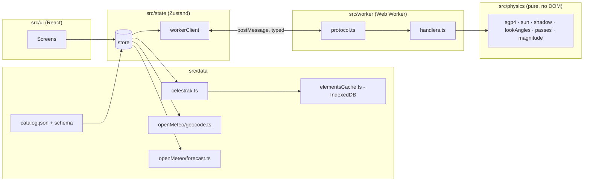

# What Is In Your Sky Right Now — Technical Plan

| Field | Value |
|---|---|
| Status | **Draft v0.9 — for review.** v0.9 (2026-09-25) plans SPEC v2.2 (V22-1..V22-11, "the showcase"): §2.36 records D-647..D-659 and D-681 — the two-line footer's row taken from the shell's padding per language (D-681, between waves); no economy for the phase: `fable` implements, `opus` reviews, 500 turns, no fallback, as three new task fields the driver reads (D-659); the custom domain as a `routes` entry the deploy binds, P6 first (D-658); the footer's fourth credit as a two-link `Attribution` (R102, the phase's one product change); knip as the dead-code tool, installed by the owner on `main` before the phase's last task and run by a `dead-code` CI job beside `trailers`; the rule for an export nothing imports (the keyword goes, the symbol stays if the file reads it, else the symbol and its test go with it); `tests/docs/accuracy.test.ts` reading the reader-facing documents against the tree and never the network; the recording run as a `promo` project of the one Playwright config, writing into a `promo/` the tree ignores, on the capture set's seeds under the paused clock; and the §16.18 delivery — four `P` tasks and R102 over three waves, the address first, the dead-code task alone and last. One development dependency, none at run time. The v0.8 text is otherwise unchanged. v0.8 (2026-09-21) plans SPEC v2.1 (V21-1..V21-22, "the audit and the flow"; V21-19..V21-22 and D-622..D-626 added the same day — the axe run, faint passes, the jump, the compact cap — making §16.17 eighteen tasks over eleven waves): §2.35 records D-529..D-550 — one shell every route renders in, heading ranks as a prop, `lib/nights.ts` cut on local noon with no time-zone library, the shown list pruned off the existing ten-second tick, `visiting` beside `observer` with only `observer` written through, one `openLink()`, failures stored as kinds with a retry action per slice, the worker's listeners and stall timer, a root boundary in the main chunk, `navigation.ts` with a depth marker in `history.state`, the settings page as a lazy chunk, `HOME_MAX_CELLS` and the header's per-language literals pinned by test, and the `-view` captures; §4, §5, §7, §9, §11 and §12 extended where those need it; §16.17 is the phase's delivery — fourteen tasks proposed over eight waves, the `ui` lane the long pole. No new dependency. The v0.7.3 text is otherwise unchanged. v0.7.3 (2026-09-19) plans SPEC v2.0.3 (V20-24, "the budget is the wait"): §2.33 records D-526 — the e2e stage as a two-shard matrix with `CI_E2E_SHARDS` beside the budget, each shard keeping the ten-minute timeout, the earlier stages duplicated rather than split into a third job, and the stage-times table naming its shard — and the workflow change ships with the amendment rather than as a task, since every pull request was by then being cancelled on the cap after passing its tests. §16.16's task list is unchanged. No module changes: nothing under `src/`, §4 and §12 untouched. The v0.7.2 text is otherwise unchanged. v0.7.2 (2026-09-18) plans SPEC v2.0.2 (V20-15..V20-23, "the first run as drawn"): §2.29 records D-505..D-514 — the populated home as two tasks before R77 (D-505), tonight's stripe as a pure module over the bands the live stripe already has (D-506), the pass's path as one formatter (D-507), the next-event block re-cut to the board's three lines with a card form (D-508, amending D-442), the conditions table in place of the Now panel (D-509), the one-line card and the hero card's tag (D-510), the Where reading's own components and the dome at real time (D-511, D-512), the phone's steps as page state that never moves on a keystroke (D-513), and the tests, the captures and the CI budget (D-514) — §4, §8.16 and §12 name the modules, and §16.16 gives R81 and R82 their rows, waves and blocks. D-502..D-504, taken at R76's gate, stand in §2.27. The v0.7.1 text is otherwise unchanged. v0.7.1 (2026-09-14) plans SPEC v2.0.1 (V20-14, "the favicon"): §2.25 gains D-460 — the icons and the favicons drawn from the scene on a dot grid at an integer pitch by a renderer with no font and no browser in it, the ring cleared around the bead, the favicon an SVG first with the swap in its own stylesheet, and the pin back to bytes — which amends D-440, D-458 and D-459; §12's mark row and the tree in §3 follow. The v0.7 text is otherwise unchanged. v0.7 (2026-09-09) plans SPEC v2.0 (V20-1..V20-13, "the redesign"): §2.25 records D-438..D-453 — the mark rasterised by a page under `spike/` and committed as data, so no glyphcss reaches the app (D-438), the tiers as data and the bead as frames (D-439), the icons and the favicon as photographs of that same text (D-440, superseding D-127's drawing), the header mark as three cells of the row (D-441), the next event as one pure module with two hosts (D-442), the three readings as a composition and the three panes as a third breakpoint literal (D-443), an open pass spanning two panes as a grid change and not a third shell (D-444), the settings page re-ordered with the coordinates behind a disclosure (D-445), the live page's state derived from the instant with no second flag (D-446), the row inventory as a table the page and its tests share (D-447), the scrub block's placement as a pure function beside `fitBox` (D-448), the short-wide overlay as the frame's screen surface used a third time (D-449), the gutter as a pure module in the strip's slot (D-450), portrait read from the measured box (D-451), the seven tasks with their crossings and the two things that may not be split (D-452), and the brief's budget raised to 48 000 characters, the cost four merged tasks already had (D-453) — §4 names the new modules, §8.16 draws the seams, §9.1 and §12 carry the tests and the traceability, §11 the mark's build step and the budgets, and §16.16 gives the phase its lanes, waves, models, gates and decision blocks from D-454. The v0.6.5 text is otherwise unchanged. v0.6.5 (2026-09-09) plans SPEC v1.4.1 (V14-9..V14-11, "the screen does not wait"): §2.24 records D-424..D-430 — the quarter turn as a pure function of the rotation the window already smooths (D-424), the effective screen angle composed into the projection so the picture is upright to the eye (D-425), the layer turned by the difference with its sides swapped (D-426), the portrait veil deleted and the ground states computed in every orientation again (D-427), the advice as a note beside the ground ones with their precedence (D-428), the turn reported up through one context rather than a second listener (D-429), and the tests, the captures and the renames (D-430) — §4 names the new module, §8.15 draws the seam, §9.1 and §12 carry the tests and the traceability, and §16.15 gives R73 its lane, its model, its gate and D-431..D-437. The v0.6.4 text is otherwise unchanged. v0.6.4 (2026-09-08) plans SPEC v1.4 (V14-1..V14-8, "the shape, the chunk and the list"): §2.23 records D-379..D-390 — the mode named in every shape rule with a stylesheet test to hold it (D-379), the shape matrix walked by resizing one page (D-380), the box floor and the fold order beside `fitBox` (D-381), the stripe's chunk as a pure function of the instant with no state anywhere (D-382), the overview as its own component (D-383), the stepping row re-cut inside its 36 cells (D-384), the speed fallback as one predicate (D-385), the rail as a deletion of `data-columns` and a threshold (D-386), the list control across three lanes as the sky screen was (D-387, D-388), the fold order arriving in two pieces (D-389) and the six tasks over five waves with findings first (D-390) — §4 names the new modules, §8.14 draws the three seams, §9.1 and §12 carry the tests and the traceability, and §16.14 gives the phase its lanes, waves, models and decision blocks. The v0.6.3 text is otherwise unchanged. v0.6.3 (2026-09-08) plans SPEC v1.3.3 (V13-15): §2.22 gains D-376 and D-377, the block P1 left unspent — the trailer check anchored at the `d7514ec` baseline and run in its own full-history CI job, since a depth-1 checkout has no range to walk and a check that passes where it cannot see is worse than none; and "deletable" defined as GitHub's merged-pull-request record rather than `git branch --merged`, which squash merges make meaningless here. §16.13 gives P2 its row and D-378, taken mid-task when the owner reopened the README's deploy section (V13-16). No module changes: nothing under `src/`. The v0.6.2 text is otherwise unchanged. v0.6.2 (2026-09-08) plans SPEC v1.3.2 (V13-11..V13-14, "public readiness"): §2.22 records D-368..D-375 — the repository's claims as a unit test rather than a checklist (D-368), the prologue's computable definition and the one badge shape allowed (D-369), the hero and social preview composed from existing captures with no run of the app (D-370), the notices file generated from the production dependency tree and checked against it (D-371), the hygiene assertions as shapes over `git ls-files` with the history only ever reported (D-372), the two absolute paths in the R14 measurements rewritten (D-373), the lane and the gate (D-374, D-375) — and §16.12 gives P1 its block from D-368. No module changes: nothing under `src/`, `§4` and `§12` untouched. The v0.6.1 text is otherwise unchanged. v0.6.1 (2026-09-08) plans SPEC v1.3.1 (V13-6..V13-10, "the sky screen"): §2.21 records D-350..D-357 — the view control as the one way in with the entry rule moved to it (D-350), the screen as a shared component each page renders (D-351, superseding D-321 and D-277), the window as a mode the preference never holds (D-352), the page's instant kept as the screen's (D-353), the pass detail's sheet held still (D-354), full-bleed measured from the pane with `--page-pad-x: 0` on the landscape live page for F-63 (D-355), the rename table (D-356) and the cut of one task on Opus (D-357) — §4, §8.13, §9.1 and §12 name the modules and §16.11 gives R66 its block from D-358. The v0.6 text is otherwise unchanged. v0.6 (2026-09-08) plans SPEC v1.3 (V13-1..V13-5, "the follow screen"): §2.20 records D-321..D-327 — the follow screen as a fixed layer the live page renders in place of its grid with the v1.2 override as its switch (D-321), the chart's `screen` mode with the readout and the legend as overlay slots (D-322), the window's portrait state beside the ground ones (D-323), the `views` prop that takes the window off the live page's view control (D-324), hidden objects held off the screen at the hook (D-325), the tests and the 844 × 390 captures (D-326) and the cut of four tasks over three waves on Opus (D-327) — §4, §8.13 and §12 name the modules, and §16.10 gives R62..R65 their blocks from D-328. The v0.5.1 text is otherwise unchanged. v0.5.1 (2026-09-07) plans SPEC v1.2.1 (V12-7..V12-15): §2.19 records D-312..D-320 — the wide live page's rail, its cap, the box cut to the dome's shape from what the frame measures, the stripe under the box on every wide page, the resize remount, the fit rule that counts the bowl's silhouette and centres the drawing (D-317, which lifts D-294's freeze), the time row (D-318), the one-column page under 1660 px (D-319) and its full-width stripe and legend with the strip at the left (D-320) — and §16.9 gives R61 the block D-312..D-320. The v1.2 text is otherwise unchanged. v0.5 (2026-09-07) plans SPEC v1.2 ("follow and the fixes", V12-1..V12-6): §2.19 records D-276..D-284, §8.12 the window's ground state and the follow switch, §12 the new rows, §16.9 the phase's lanes, waves, decision blocks and models. The v1.1 text (v0.4.2) is otherwise unchanged. v0.4.2 (2026-09-06): D-272 for SPEC v1.1.2's snoozed install offer (V11-15), which supersedes D-153's latch, and D-260 for the settings page's install action (V11-16). v0.4.1 (2026-09-06): D-268 and three §12 rows for SPEC v1.1.1's wide live-page findings F-51..F-53 (V11-14). v0.4 plans the v1.1 phase ("phone pass", SPEC v1.1): §2.18 records decisions D-183..D-199; §4, §5, §7, §8.9–§8.11, §9, §11, §12 extended for the feature flag, the compact layout and settings page, the chart legend, the sky window, the live trajectories and stripe, the v1 findings, true north and CI time; §16 recut for the phase (lanes, a per-task model policy across four models, token and delivery-time rules, §16.8). The v1 text (v0.3) is otherwise unchanged. |
| Date | 2026-09-25 (v0.9); 2026-09-21 (v0.8); 2026-09-19 (v0.7.3); 2026-09-18 (v0.7.2); 2026-09-14 (v0.7.1); 2026-09-09 (v0.7); 2026-09-09 (v0.6.5); 2026-09-08 (v0.6.4); 2026-09-08 (v0.6.3); 2026-09-08 (v0.6.2); 2026-09-08 (v0.6.1); 2026-09-08 (v0.6); 2026-09-07 (v0.5); 2026-09-06 (v0.4.2); 2026-09-06 (v0.4.1); 2026-09-05 (v0.4); 2026-09-03 (v0.3); 2026-09-01 (v0.2) |
| Input | `SPEC.md` v2.2 (*(v0.9)* V21-23, V21-24 and V22-1..V22-9 are fixed like the rows before them; §4.43 changes nothing the app does, so no decision below touches §5, §6 or §7. Earlier: `SPEC.md` v2.1; *(v0.8)* V20-24..V20-30 and V21-1..V21-22 are fixed like the rows before them; V21-7 supersedes D-135's store-on-load and widens D-280 — this plan follows both. Earlier: `SPEC.md` v2.0.2; Decision Log §12 treated as fixed: OQ-1, OQ-3, OQ-4, OQ-11, UX-1, V1-1..V1-11, V11-1..V11-16, V12-1..V12-15, V13-1..V13-16, V14-1..V14-11 and V20-1..V20-23 are not reopened here; V20-5 reverses D-184's first-run role and this plan follows the reversal, as V20-3 does for D-127's icons; V14-9 withdraws the gate V13-2 wrote, and this plan follows the withdrawal; V13-6..V13-9 withdraw parts of V13-1 and V13-4, and this plan follows the withdrawal) |
| Scope | Architecture, project structure, module boundaries, data model, worker contract, testing strategy, the Task Zero physics spike, and how the v1 tasks are delivered (§16). **No task breakdown** — that is `sdd-breakdown`'s job. |

---

## 1. Fixed Inputs

These come from the spec's Decision Log and are not up for debate in this plan:

- **No backend in MVP.** Static site; browser talks to CelesTrak and Open-Meteo directly. Elements cached in IndexedDB, refreshed at most every 2 h.
- **Catalog** is a hand-maintained JSON of ~30 objects with intrinsic magnitudes and provenance.
- **Twilight rule:** list passes when the sun is below −6°; label passes with the sun between −6° and −12° as "sky still bright".
- **CelesTrak CORS** is verified; fallback order is the community TLE API, then pulling the v1 proxy forward.
- **Stack:** React + TypeScript + Vite, static deploy.
- **Sky chart (UX-1):** a 3D ASCII sky dome the user can rotate and tilt, plus a 2D polar fallback over the same data; both DOM-only, no WebGL, no canvas. Monospace / terminal aesthetic across the whole UI.

From SPEC v1.0's Decision Log (V1-1..V1-11), fixed for the v1 phase:

- **Still no backend.** v1 stays browser-direct against CelesTrak and Open-Meteo; the caching proxy, Nominatim and the full `visual` group move to Phase 3.

From SPEC v1.1's Decision Log (V11-1..V11-13), fixed for the v1.1 phase:

- **v1.1 comes after the v1.0.0 tag** (V11-1); the Moon lore line sits behind a build flag, off by default (V11-2).
- **Compact gets a settings page and a one-row header; every control row fits 36 cells; the chart is full-bleed and at least square and fills 90 % of its box at every width** (V11-3, V11-4). A 390 px mockup set gates the home, settings and detail tasks.
- **The sky window is a third view, SVG, touch devices only, fixed by a spike the owner runs on a phone** (V11-5); **the legend replaces every name, time and caption on the drawings** (V11-6); **live-page arcs appear, grow and fade** (V11-7); **the live link moves beside the title** (V11-8).
- **All fifty open review findings are in scope, one findings task per lane in the first wave** (V11-11); **CI has a 10 min budget on pull requests and the capture set runs on `main`** (V11-10); **headings are true north** (V11-12); **desktop mid widths are fixed by rule with a 1024 px profile** (V11-13).
- **Delivery reuses the driver with lanes recut** (V11-9): `ui`, `chart`, `window`, `live` (and `data` for its three findings).
- **Two languages**, English and Spanish, as a preference rather than a route.
- **The dome is the default view again**, in colour, under a CSP relaxed by exactly one directive; its composition is fixed by a spike before the implementation task.
- **72 hours** of passes and forecast, stored automatically, with the app shell served by a service worker.
- **Tasks are delivered in lanes and waves** by a driver script, one model per task, auto-merge with an owner gate on anything visual (§16).

Everything in spec §5 ("Technical Architecture", marked *proposal*) was reviewed. Where this plan agrees, it is simply adopted below. Where it disagrees, the disagreement and rationale are in §2.

---

## 2. Decisions (challenges to the spec's architecture proposal)

| ID | Spec proposal (§5) | Decision | Why |
|---|---|---|---|
| **D-1** | Magnitude formula: `m = m_std − 15.75 + 5·log10(range_km) − 2.5·log10(sin β + (π−β)·cos β)` | **Corrected to** `m = m_std + 5·log10(range_km / 1000) − 2.5·log10( p(β) / p(90°) )` with `p(β) = sin β + (π−β)·cos β`. | The spec's constant is inconsistent with its phase term. The `−15.75` constant belongs to the *fraction-illuminated* form (`+2.5·log10(r²/f)`, where `f = 0.5` at half phase contributes the 0.75). Combining it with a Lambert phase function that also encodes half-phase double-counts 0.75 mag, making every object appear ~0.75 mag brighter than intended. The corrected form returns exactly `m_std` at 1 000 km and 90° phase, which is the definition of standard magnitude. Unit test pins this anchor point. **Spec §5.4 should be amended at the next revision.** |
| **D-2** | Sun position from `astronomy-engine` *or* `suncalc` | **`astronomy-engine`**, wrapped behind a local `sun.ts` module exposing exactly two functions: sun altitude at an observer (geometric, no refraction) and sun unit vector in the true-equator-of-date frame. | `suncalc` is ~1° class accuracy and has no vector output; the shadow test needs a sun vector. astronomy-engine's equator-of-date (EQD) frame is within arcseconds of the TEME frame satellite.js uses, which is far below what the shadow and twilight tests need. Wrapping it keeps the physics module swappable and keeps the rest of the code free of the library's API. Refraction is off because twilight definitions (−6°, −12°) are geometric. |
| **D-3** | `date-fns`/`date-fns-tz` or a Temporal polyfill; `tz-lookup` as optional | **No date library and no `tz-lookup`.** All times are epoch milliseconds (`number`); display formatting uses `Intl.DateTimeFormat` with the observer's IANA zone from Open-Meteo. | Every formatting need in the spec (HH:MM:SS in a named zone, zone abbreviation, countdowns) is covered by `Intl`. A date library adds bundle weight and a second notion of time. Pure-coordinate input has no zone until the forecast response arrives; until then the UI shows UTC with an explicit "UTC" label — a few hundred milliseconds of latency, not worth a 100 KB timezone database. |
| **D-4** | Zustand *or* React context + `useReducer` | **Zustand** (vanilla store + React bindings). | Worker messages, the 10 s "now" tick, and IndexedDB events all arrive outside the React tree. A vanilla store that can be written from a plain module (the worker client) is simpler than threading dispatch functions into non-React code. Slices stay small and typed. |
| **D-5** | Tailwind *or* CSS Modules | **CSS Modules + CSS custom properties.** No Tailwind. | The UI has a handful of screens and a strong single theme (dark, high contrast, later red night mode). Design tokens as custom properties make the night mode a one-selector swap and carry the monospace/terminal identity (FR-X-6): one `--font-mono` stack, a `--cell` unit equal to one character advance so layout aligns to the same grid the sky dome is drawn on. Avoids a build-time framework and keeps the CSP free of `unsafe-inline` styles. |
| **D-6** | "Web Worker" with an AbortController-style cancel; no protocol defined | **Hand-written typed `postMessage` protocol** (discriminated unions, §6), job IDs, and **cooperative cancellation** by yielding between objects. No Comlink. | Comlink hides the message boundary, which makes streaming partial results and cancellation awkward. A 12-message protocol is small enough to type by hand and test as a pure function in Node. The worker yields to its event loop between objects so a `cancel` message can be observed. |
| **D-7** | Refine peak by golden-section search; sample visibility "every 1–5 s" | **Sample every 1 s inside each above-horizon segment; bisection only for the two 10° crossings.** Peak taken from the 1 s samples with a parabolic refinement across the three samples around the maximum. | With ~30 objects and passes of ≤ 12 min, 1 s sampling is ≈ 20 k propagations per night — trivial. It yields ≤ 1 s precision (FR-VIS-2) for shadow and twilight crossings for free, removes one algorithm (golden section) and its failure modes, and gives the sky-chart track as a by-product. |
| **D-8** | Cylindrical umbra, Earth radius 6371 km, "optional atmosphere fudge" | **Cylindrical umbra, radius 6371.0 km, no fudge, no penumbra in MVP.** The "fading" flag is dropped from MVP. | Keep the model simple until the Task Zero comparison shows a systematic shadow-entry offset versus Heavens-Above. A fudge factor without evidence is a guess. Penumbral fading lasts seconds for LEO and the 1 min acceptance criterion does not resolve it. |
| **D-9** | Fetch `visual` + `stations`, filter client-side | Adopted, plus: **store the raw group payloads unfiltered in IndexedDB**, keyed by group, and filter to the catalog at load time. | Lets v1 widen the catalog to the full `visual` group with no cache schema change and no re-fetch. Costs ~100 KB of storage. |
| **D-10** | "Enforced against the stored timestamp, across tabs and reloads" | **Web Locks API (`navigator.locks`) single-flight around the refresh check**, with fallback to timestamp-only when Web Locks is unavailable. | Two tabs opened together would otherwise both see a stale timestamp and both fetch. A named lock makes the check-then-fetch atomic across tabs. Web Locks is available in all evergreen browsers and Safari ≥ 15.4. |
| **D-11** | Clock-skew warning using a server `Date` header | **Dropped from MVP.** Moves to v1 behind the proxy. | With no backend, the only servers are cross-origin, and `Date` is not a CORS-safelisted response header, so the browser cannot read it. Open-Meteo's `current.time` is a model slot, not a clock. No honest way to implement it in MVP. |
| **D-12** | Hosting: any of Cloudflare Pages / Netlify / Vercel / GitHub Pages | **Cloudflare Pages** — amended 2026-09-02 to **Cloudflare Workers static assets**, same `_headers` file (§2.5). | It supports a `_headers` file for a strict CSP, sits on the same platform as the v1 edge worker, and its free tier is sufficient. GitHub Pages remains a zero-config fallback for previews. |
| **D-13** | Not addressed | **No client-side router in MVP.** Single screen; pass detail is a full-screen sheet. The selected pass ID is mirrored to the URL hash so v1 share links have somewhere to land. | One screen does not justify a router. The hash keeps the door open. |
| **D-14** | "Now" state "using the cached propagation" | **"Now" is computed in the worker on request** (30 propagations at `t = now`), not from cached tracks. | Cached tracks only cover passes; the "Now" panel must also explain *why* nothing is visible (daylight / in shadow / below horizon), which needs live sun altitude and per-object state. Thirty propagations every 10 s is negligible. |
| **D-15** | Not addressed | **Every physics function takes time as an explicit parameter; nothing in `src/physics` or `src/worker` reads `Date.now()`.** | Determinism for golden tests and for Playwright with a fixed clock. |
| **D-16** | UX-1: 3D ASCII sky dome, DOM-only (library-neutral in the spec) | **Render the dome with `@glyphcss/react` (v0.1.x, MIT), confined to one component behind the `SkyChartProps` interface (§8).** Triggers for replacing it: (a) it cannot meet FR-GUIDE-6 (≥ 30 updates/s while dragging on a mid-range phone) at a grid of ~60×30 cells after the §8.5 spike; (b) a needed capability is missing and unfixable from outside (interior camera or backface control if the observer-centred view is later required, hotspot precision, clamped orbit limits); (c) the package stops being maintained — no release or response for 6 months while we carry a blocking bug; (d) a licence or security problem. Replacement path is a hand-written rasteriser behind the same props, and the 2D polar sibling is the interim fallback. | It is the only DOM-text 3D mesh renderer with a React binding that we found; it satisfies FR-GUIDE-5 by construction (one `<pre>`, no canvas, no WebGL, no per-polygon elements). Writing an equivalent rasteriser is a real project. The pre-1.0 API, single-maintainer fork lineage (forked from polycss) and small user base are accepted **only because** the boundary in §8 makes it swappable. |
| **D-17** | UX-1: "rotate/tilt the view toward the horizon they'll face" | **Default camera is an external "over-the-shoulder" orthographic view of the dome** (`GlyphOrthographicCamera` + `GlyphOrbitControls` with `clampPitch`), yaw set to the pass's rise azimuth so the user sees the dome from behind the observer, looking toward that horizon. The strictly observer-centred view (camera at the dome centre looking outward, perspective) is **not** the MVP default; recorded as open question P-OQ-1 in §8.6. | The external view uses only documented camera behaviour (`rotX`/`rotY`/`zoom`) and keeps left/right correct relative to the real horizon (facing south, east appears on the left, as in life). An interior camera needs the perspective camera inside a mesh with inward-facing polygons visible; glyphcss documents neither interior placement nor backface culling. We will test it in the spike, but the plan cannot depend on it. |

### 2.1 Task Zero findings (R1, 2026-09-02)

Recorded by the R1 implementation. **Comparison result (fixture `2026-09-02-neuquen-iss.json`): OVERALL PASS** — the one visible ISS pass in the window matches Heavens-Above within 4 s / 1.0° / 0.2° at start, peak and end, end reason `horizon` on both sides, no unpaired or extra passes. Details in `tests/fixtures/heavens-above/README.md`.

- **`json2satrec` accepts CelesTrak's OMM field names as-is.** No mapping layer is needed. `sgp4.ts` only narrows two fields for satellite.js's types (`EPHEMERIS_TYPE` must be `0`, `CLASSIFICATION_TYPE` is dropped unless `U`/`C`) and rejects other ephemeris types. `json2satrec` and `twoline2satrec` give identical satrecs and positions for the Vallado verification case (satellite 00005, t = 0 and 360 min, positions reproduced to 1e-8 km). satellite.js 7.1.0, astronomy-engine 2.1.19.
- **CelesTrak `EPOCH` has no zone suffix** (`2026-09-01T19:42:22.677120`); `time.ts` appends `Z` and truncates to milliseconds, otherwise `Date.parse` would read it as local time.
- **Runtime:** ISS × 10 days (coarse scan at 30 s plus dense sampling of every candidate) takes ≈ 120 ms in Node 24 on the development machine. Extrapolated, 30 objects × 24 h is well under the 1.5 s CI budget in §9.1; measure it properly once the worker exists (R4).
- **Shadow model vs an independent conical model:** over 10 days at 1 s, `inUmbra` (cylinder, 6371 km, D-8) and satellite.js's own `shadowFraction ≥ 0.5` (conical, penumbra) disagree on 0.19 % of samples, all at transitions; entry/exit instants differ by 0.05 s on average, 7 s at most, with no systematic sign. Our sun vector and satellite.js's low-precision sun differ by ≤ 0.006°. **Not checked against Heavens-Above:** the only pass in the window is horizon-bounded at both ends, so no shadow-entry offset could be measured. D-8 stands; re-examine when a fixture contains a shadow-bounded pass (the next northern-mid-latitude fixture in the MVP phase is the natural place).
- **Sun altitude:** two independent paths (astronomy-engine topocentric `Equator` + `Horizon`, and satellite.js `sunPos` pushed through `frames.ts`) agree within 0.002°; the −6° and −12° instants from sunrise-sunset.org agree within 0.15°. astronomy-engine's `Horizon` takes no refraction when the argument is omitted; the string `'none'` is rejected.
- **Window content:** with the 2026-09-02 elements, every ISS culmination above 10° at Neuquén in the ten days from 2026-09-02T03:51Z falls in daylight except one marginal twilight pass on 2026-09-11 09:48Z (peak 10.2°). Heavens-Above lists exactly the same single pass. A ten-day window with one pass is a thin validation; the two further golden fixtures planned for the MVP phase (§10.4) should be captured when several dark passes fall inside the window.
- **Brightness (informational, D-1 + `stdMag` seed −1.8):** we predict +1.2 at the pass peak where Heavens-Above prints −0.1 to −0.3 (range 1 505 km, phase angle back-lit in morning twilight). The 1.3–1.5 mag gap is outside the acceptance criterion but large enough that R3 should settle the ISS `stdMag` (and its provenance) against more than one pass before the magnitude cut goes live.
- **Heavens-Above quirks worth knowing:** the summary table and the detail page differ by up to 5 s for the same event, and the detail page prints altitudes as whole degrees. The detail page is the reference.
- **Package manager:** `npm` (CLAUDE.md left the choice open; `pnpm` is not installed and TASKS.md already uses `npm test` / `npx`).

### 2.2 R2 decisions (2026-09-02)

- **D-18 — Worker chunks are ES modules** (`worker.format = 'es'` in `vite.config.ts`). satellite.js 7 ships an optional WASM/pthreads build behind `#wasm-multi-thread`, whose worker entry uses top-level await; Vite's default IIFE worker format refuses it and the production build fails. We never call `createWasmModule`, so the chunk is emitted (~300 KB, uncompressed) but never fetched. Module workers are supported by every evergreen browser and Safari ≥ 15, so the R5 worker is a module worker too. R11's bundle-budget check should exclude or drop that dead chunk.
- **D-19 — Vite 7.x with Vitest 3.2**, upgraded together. Vitest 3.2's peer range stops at Vite 7 while the current `@vitejs/plugin-react` needs Vite 8; the pair is pinned (`vite@7`, `@vitejs/plugin-react@5`) until Vitest 4 is adopted deliberately. Vitest's `projects` splits `src/ui` (jsdom, Testing Library, MSW) from everything else (Node, MSW); both projects start the MSW server with `onUnhandledRequest: 'error'` so no unit test can reach the network (§9.3).
- **ESLint** uses `typescript-eslint` `strict` + `stylistic` (non-type-checked) and `react-hooks` flat recommended; `no-unused-vars` ignores `_`-prefixed names and rest siblings. The type-checked variants and the §3 boundary rules are R5's.
- **R2 crosses the §3 boundaries on purpose:** `src/ui/components/passes/nextPass.ts` imports `src/physics` and `App.tsx` imports `src/data` directly, running `findPasses` on the main thread with the ISS `stdMag` seed (−1.8) hard-coded. The catalog (R3), store and worker (R5) replace this; the lint boundary rules land only then.
- **`lib/timeFormat.ts`** builds strings from `Intl.DateTimeFormat.formatToParts` (locale `en-GB`, `hourCycle: 'h23'`) so output is `HH:MM:SS` regardless of locale punctuation; with `timeZone === null` the label is the literal `UTC` (D-3). Zone abbreviations come from Intl's `short` name and may read `GMT-3` rather than `ART`; revisit in R8 if the spec's "zone abbreviation" needs more.
- **E2E runs against the production build** (`vite preview` on port 4173, or `E2E_PORT` when the driver sets one — D-132); `npm run e2e` builds first, CI builds in the previous step. Cross-origin CelesTrak calls are fulfilled with `access-control-allow-origin: *` by the Playwright route.

### 2.3 R3 decisions (2026-09-02)

- **D-20 — The pass list window is 24 h from "now"** (`SEARCH_WINDOW_HOURS` in `ui/components/passes/passSearch.ts`), FR-VIS-1's MVP minimum and the window the §9.1 performance budget is written for. R2's 10-day ISS-only search is gone: 31 objects × 10 days on the main thread measured ≈ 3.6 s per recompute, and R2 recomputes on every valid keystroke. 31 objects × 24 h takes ≈ 350 ms in Node; the worker (R5) removes the freeze, the multi-night window is v1 (spec §8 rank 6). Tests that need the R1 golden pass (nine days after `capturedAt`) start the 24 h window at `capturedAt + 9 d`: an offset that is a multiple of the 30 s coarse step keeps the scan grid in phase with R1's, so start/peak/end reproduce exactly rather than to within one sample. `tests/support/catalogFixtures.ts` holds this. *(Amended v1, R24: `state/passWindow.ts` — where the constant has lived since R5 — makes it 72 h in three 24 h nights, FR-VIS-1 amended and FR-OFF-2. The worker cuts it into nights and searches them night-outer, so the first night still arrives inside the MVP's budget, D-77 and D-95. The golden-fixture offset above is unchanged: the first night of a 72 h window at `capturedAt + 9 d` is the same 24 h search on the same grid.)*
- **D-21 — `src/data` imports `parseOmmEpoch` from `src/physics/time`.** `SatelliteRecord.epochMs` (FR-SAT-4) has to be parsed somewhere on the main thread, and §3 allows `src/data` neither `src/physics` nor `src/lib`. `physics/time.ts` is a dependency-free leaf (no satellite.js, no DOM), so the R5 boundary rules should whitelist `src/physics/time` for `src/data` rather than duplicate the parser. Revisit if a second physics leaf is ever needed there.
- **D-22 — Intrinsic magnitudes come from Mike McCants' Quicksat `qs.mag` (2020-09-14, mmccants.org/programs/qsmag.zip)**, the source spec §6.1 (OQ-3) names. Its definition — magnitude at 1 000 km range and half phase — is exactly the D-1 standard magnitude, so values are used unconverted; each entry's `stdMagSource.note` cites the `qs.mag` row and any comment (flares, "sometimes very bright"). The **ISS is −2.5** there, 0.7 mag brighter than the R1 seed (−1.8): on the R1 golden pass we now predict +0.5 against Heavens-Above's −0.1 to −0.3, closing half the gap noted in §2.1. The remaining ~0.7 mag is consistent with the station having grown since 2020 (iROSA arrays) and with the back-lit geometry of that pass; a fixture with a well-lit ISS pass (§10.4's northern mid-latitude capture, task H) is the place to settle it, not a hand-tuned constant. **Tiangong (48274) post-dates the file** and carries a project estimate (−1.0, back-solved through D-1 from reported overhead brightness of about −2.5 to −3) marked as such in its provenance. Docked modules and visiting vehicles (Wentian, Mengtian, Nauka, Progress, Dragon, Soyuz…) are deliberately absent so each station appears once. Membership is 31 objects: 2 stations, 11 payloads, 18 rocket bodies (eight of them SL-16 Zenit stages at magnitude 2.0), all present in the R1 fixtures and, per `scripts/check-catalog.ts` on 2026-09-02, in the live `visual`/`stations` groups. **The magnitude cut (MAG_LIMIT 4.5) is live from R3** for every object; R2 already applied it to the ISS.
- **Loader without cache** (`data/elementsLoader.ts`): both groups are fetched in parallel; if either request fails the load fails, because §7.1's "use the cached set" branch does not exist until R11. `unavailable` carries catalog ids absent from both groups; the UI does not show them yet (R11's banners).
- `tests/e2e/next-pass.spec.ts` is replaced by `pass-list.spec.ts`; `ui/components/passes/nextPass.ts` and `NextPassLine.tsx` are deleted, `ISS_STD_MAG_SEED` survives only in `tests/support/heavensAbove.ts` for the R1 comparison script.

### 2.4 H decisions and findings (2026-09-02)

Recorded by the H implementation (physics hardening). Fixtures: `2026-09-02-paris-iss` (48.86° N) and `2026-09-02-singapore-iss` (1.35° N), captured 13:27–13:28 UTC with a CelesTrak capture at 13:27:43 UTC whose ISS element set is the very one Heavens-Above was using (epoch 2026-09-02T03:26:53 on both sides). **Both OVERALL: PASS** — 12/12 and 7/7 passes paired within 6 s / 3.3° / 4.2° at every point, no unpaired passes, no extras, all start and end reasons matching. Details in `tests/fixtures/heavens-above/README.md`.

- **D-23 — Golden fixtures are named by place and carry their own pairing metadata.** `tests/fixtures/heavens-above/<date>-<place>-iss.json`; the fixture's `ommFixture` names its OMM capture (a second capture on the same date is `<date>T<HH>`), `searchPeriod` is Heavens-Above's own search window and clips the comparison window, `location` is the observer label. The R1 fixture keeps working through defaults (`neuquen`, same-date OMM, no clipping). `validate-iss.ts --fixture <name>` / `--all`; `passes.golden.test.ts` runs every fixture and asserts that the set covers ≤ −30°, 45–52° N and |lat| ≤ 5°.
- **D-24 — A Heavens-Above pass without a "Maximum altitude" row is compared at the higher of its start / end rows** (end on a tie). Heavens-Above omits the row when the highest point is a shadow boundary above 10°; its summary table repeats that row in the Highest column. Seven of the nineteen new passes are of this kind. `summary.highest` in the fixture overrides the rule.
- **D-8 evidence — shadow boundaries are systematically offset by 4–6 s.** Across all 19 shadow-bounded boundaries in the two new fixtures we exit the umbra 3–5 s earlier and enter it 4–6 s later than Heavens-Above, never the other way round: our cylindrical umbra of 6371.0 km with no atmosphere is slightly narrower than theirs. That is ≈ 30–45 km along track, well inside the 60 s criterion, and the visible pass we report is a few seconds *longer* than theirs at the shadow end (safe side for a user). D-8 stands for MVP; the evidence is now on record for a v1 decision (candidates: a larger effective radius of ≈ 6371 + 20–40 km, or a conical penumbra midpoint — both to be checked against these fixtures, which are the tripwire).
- **Brightness (informational, seed `stdMag = −1.8`, D-1 form):** with 19 more passes the pattern is clear: relative to Heavens-Above we are 0.3–0.6 mag too bright at high elevation and 0.8–1.3 mag too faint on low, distant passes — Heavens-Above's magnitude varies less with range and phase than the diffuse-sphere law does. The catalog value of −2.5 (R3, McCants) would fix the low passes and worsen the high ones. Not an acceptance criterion; the magnitude cut at +4.5 is unaffected for the ISS. Left for the v1 brightness work with these fixtures as the data set.
- **Passes of 1–2 s** (Paris 7 Sep and 11 Sep: reaches 10° and enters shadow within two seconds) are found by the 1 s dense grid (D-7) without special handling and pair within 6 s. No sub-resolution rule was needed.
- **Unit references.** Every `src/physics/*.test.ts` now asserts its module's slice of `reference-values.json` (which gained `inUmbra` and names the fixture in full; all pinned numbers unchanged). Sunset reference: NOAA's published spreadsheet algorithm is embedded in `sun.test.ts` (sunrise-sunset.org's sunset instant is ~2 min later than the geometric −0.833° and is not used). Coverage gate: `npm run test:coverage:physics` (`@vitest/coverage-v8`, 90 % lines per file; measured 100 % lines on every file).
- **Runtime:** ISS × 10 days takes 54–122 ms per fixture in Node 24; the whole golden suite runs in ≈ 0.6 s.

### 2.5 R4 decisions (2026-09-02)

- **D-12 amended — hosting is Cloudflare Workers static assets, not Cloudflare Pages.** The dashboard's *import a repository* flow now creates a Worker with static assets built by Workers Builds; Cloudflare steers new projects there and documents a Pages → Workers migration. D-12's reasons hold: the `_headers` file has the same format and semantics (parsed at upload, never served, `/*` and `/assets/*` rules stack), the free tier is the same, and the v1 edge worker lives on the same platform. `wrangler.jsonc` is committed so Workers Builds skips wrangler's autoconfig, which otherwise installs `@cloudflare/vite-plugin` and rewrites `vite.config.ts` inside the build sandbox on every build: assets-only Worker, `not_found_handling: "404-page"` (hash routing, D-13, needs no SPA fallback), `preview_urls` on, observability off (FR-X-3). Production is `https://in-your-sky.ezequiel-baruf.workers.dev`, built from `main`; a preview per branch comes from Workers Builds' *non-production branch builds* (`npx wrangler versions upload`, aliased by branch name as `https://<branch>-in-your-sky.ezequiel-baruf.workers.dev`), enabled per project under *Settings → Builds*. Verified 2026-09-02 on the `r4-deploy` preview: all three §11 headers on `/`, the immutable `Cache-Control` on `/assets/*`, and 404 for `/_headers` and unknown paths. The first production build ran from `main` before this branch merged and served no headers, as expected: `public/_headers` does not exist on `main` yet.
- **Worker renamed to `in-your-sky` (2026-09-03).** The public URL is `<worker>.<account subdomain>.workers.dev`, and only the worker half is ours to choose: the account subdomain (`ezequiel-baruf`) is a one-time change per account, already spent, and Cloudflare answers a second attempt with *Account already has an associated subdomain*. Renaming the worker is therefore the whole of the free URL improvement, from `what-is-in-your-sky.ezequiel-baruf.workers.dev` to `in-your-sky.ezequiel-baruf.workers.dev`. A rename in `wrangler.jsonc` creates a **new** worker rather than moving the old one, so the Workers Builds connection must be re-pointed at it and the old worker deleted by hand; steps in `README.md`. Branch previews follow the same shape, `https://<branch>-in-your-sky.ezequiel-baruf.workers.dev`. A custom domain stays open as a later step: it needs a zone in this Cloudflare account, which means either a registered domain or a free one from a registry on the Public Suffix List (`eu.org`, `is-a.dev`), and then a `routes` entry with `custom_domain: true`.
- **D-25 — `vite preview` serves `public/_headers` the way Cloudflare does.** A small plugin in `vite.config.ts` parses the Pages format (unindented path pattern, indented `Name: value` lines, `*` matching across `/`, matching rules stacked) and sets the headers on every preview response. The Playwright suite therefore runs the production build under the strict CSP: `tests/e2e/deploy-headers.spec.ts` asserts the §11 values on `/`, the immutable `Cache-Control` on `/assets/*`, zero `securitypolicyviolation` events during the R3 flow, and requests only to the site origin and CelesTrak. It is the offline twin of R4's `curl -sI` and DevTools checks, and it fails CI before a violation reaches the site. The dev server is untouched: React Fast Refresh injects inline scripts the CSP forbids. `tests/deploy/headers.test.ts` (Node project, typechecked through `tsconfig.node.json`) pins the file to the §11 block verbatim, so a change to either the doc or the file without the other fails a test, and checks that every `https://` host referenced in `src/**/*.ts(x)` is in `connect-src` (FR-X-3).
- **D-26 — zod runs jitless.** zod 4.5 compiles object parsers with `new Function` and probes for it once with a caught call; under `script-src 'self'` the caught probe is still reported as a CSP violation (the D-25 e2e caught it on its first run). `src/data/zod.ts` calls `z.config({ jitless: true })` and re-exports `z`; it is the only module that may import `zod` (enforced by `src/data/zod.test.ts`), because the flag is read when a schema is *built*, so the configuring module has to evaluate before any schema module. Cost: the interpreted parser on a few hundred records per group, not measurable next to the pass search. `unsafe-eval` is not an option (§11).
- **Workers Builds project:** Git integration (production on `main`, a preview version per non-production branch), worker name `in-your-sky`, build command `npm run build`, deploy command `npx wrangler deploy`, Node from `.node-version` (24, same as `ci.yml`). There is no framework preset and no output-directory field: `wrangler.jsonc` names `dist/` as the assets directory, which is why it is committed. Created once in the dashboard; steps in `README.md`. The GitHub Actions alternative (`wrangler deploy` from `ci.yml`, gated on the tests) was not taken: the task asks for the repo wiring, and Workers Builds' own build keeps a single source of truth for what is deployed. Revisit in R15 if deploys should wait for CI.

### 2.6 R5 decisions (2026-09-02)

Recorded by the R5 implementation (worker, store, streaming list).

- **`jobDone.hasDarkness: boolean`** is added to the §6.2 protocol: whether the observer's sun altitude reaches `sunAltMaxDeg` anywhere in the window, computed by `physics/darkness.ts` (sampled every 10 min plus the window end; the sun moves ≤ 0.25°/min, so the grid resolves twilight to ~2.5° and the end check catches a window that ends just after dusk). The list shows spec §5.6's "no darkness tonight at this latitude" when a finished job has no passes and `hasDarkness` is false; R7's Now panel reuses the flag.
- **Error semantics (§6.2 rules, made precise):** `PROPAGATION_FAILED` carries the job id, the object is skipped and the job goes on; `NO_ELEMENTS` and `INTERNAL` carry the job id and end the job **without** a `jobDone`. The client treats those two as terminal, drops the job's handlers and reports the error; the passes slice shows "Could not compute passes: CODE: message". A `cancel` for a job the worker does not know is ignored; a cancelled job's `jobDone` is dropped by the client because the job was forgotten the moment `cancel` was posted.
- **`computeNow` answers `INTERNAL`** ("not implemented until R7"); the protocol type is complete so R7 only adds the handler and `physics/now.ts`.
- **D-27 — `src/state` may import `src/physics/constants`.** The `computePasses` request carries the thresholds, and their defaults are a value (`DEFAULT_THRESHOLDS`), which `src/model` (types only) cannot hold. Same pattern as D-21: a dependency-free leaf whitelisted in the boundary rule (`except: ['./constants.ts']`) rather than a duplicated constant. `src/state` may also import `src/worker/protocol` (types) and references `passes.worker.ts` by URL only.
- **D-28 — `eslint-plugin-import-x` instead of `eslint-plugin-import`.** The original plugin's peer range stops at ESLint 9; import-x supports ESLint 10, ships the same `no-restricted-paths` rule and a built-in node resolver. §3 is enforced as one zone per table row, plus `@typescript-eslint/no-restricted-imports` for the rows a path zone cannot express: React banned in `physics`, `worker`, `data`, `lib`, `model`; physics **types only** in `lib` (`allowTypeImports`); `@glyphcss/react` allowed only under `ui/components/guide/skychart/dome/`; `*canvas*` / `*webgl*` banned everywhere (FR-GUIDE-5). `no-restricted-globals` bans `Date` in `physics`, `worker` and `lib` (D-15); the one exception is `physics/time.ts`, the epoch-ms ↔ `Date` converter itself, and `lib/timeFormat.ts` now hands `Intl` the number. Test files are exempt from the boundary rules. Verified with the four probe files the task asks for (React in physics, `Date.now()` in lib, `src/data` from `src/ui`, a `*canvas*` import) — each fails `npm run lint`; none is committed.
- **D-29 — Progressive rendering is proven from a DOM log, not a slow worker.** 31 objects × 24 h take ≈ 375 ms in the worker, too fast to watch cards land. The Playwright test installs a `MutationObserver` before the app boots that records every distinct set of card ids the DOM went through; "one at a time, ISS first" is asserted on that log (first non-empty entry is exactly one ISS card; the second location goes through more than one set before its final one; no set after the switch contains a first-location id). The "throttled worker route" delays the worker script by 1.5 s, which is what shows the page responsive and `aria-busy` with zero cards before the first one lands. The store test with the scripted fake worker covers the cancel-and-ignore-late-messages path exactly (`cancel` for job 1 posted, job 1's late `passes` and `jobDone` never reach the slice).
- **Vitest browser project** (`--project browser`, `@vitest/browser` + Playwright Chromium, headless) runs `src/**/*.integration.test.ts` as part of `npm test`; CI therefore installs Chromium before the unit tests. Fixtures are imported as modules there (no `node:fs`). satellite.js and astronomy-engine are listed in `optimizeDeps.include` so Vite does not reload the test mid-run.
- **Store shape** (`state/store.ts`, D-4): one vanilla store with `location` (observer + the `nowMs` read from an injected clock when it was set), `elements` (`idle | loading | error | ready`, the latter also carrying the worker's `rejected` list) and `passes` (job id, status `idle | computing | done | error`, the observer and window the results belong to, passes kept sorted by start as they stream, `done/total`, `hasDarkness`, `elapsedMs`, skipped objects). Every passes action carries the job id and is ignored for any other job. `createAppStore({ now })` for tests, `appStore` for the app; `startApp()` in `main.tsx` creates the worker and wires `state/effects.ts`. Elements are still prefetched on start, as in R3; the effect loads them once, hands them to the worker once, and starts a job per observer change with a generation counter so a stale chain never writes.
- **Runtime:** 31 objects × 24 h in `findPasses` (Node 24, development machine): 378, 373, 377 ms in three consecutive runs of `passes.perf.test.ts` against a 1 500 ms budget; the worker integration test reports the same order in Chromium (≈ 520 ms including boot). The main-thread freeze noted in D-20 is gone.
- `PassCard` carries `data-pass-id` (the pass id) for the e2e; R6's detail screen can use it as its hook.

### 2.7 R7 decisions (2026-09-02)

Recorded by the R7 implementation ("Now" panel).

- **D-30 — `visibleUntil` is found by a look-ahead on the pass search's own 1 s grid.** `physics/now.ts` steps forward from `t` in 10 s coarse steps until the visibility predicate fails, then refines the last coarse step at `DENSE_STEP_MS`; `visibleUntil` is the last visible sample and `endReason` is `failingReason` of the first invisible one. Because the grid is `t + k·1 s`, a request made on a pass's grid returns exactly that pass's `end` (asserted on the R1 golden pass). The look-ahead is capped at 30 min (`MAX_LOOKAHEAD_MS`, longer than any LEO pass above 10°); an item still visible at the cap carries no `visibleUntil` and the panel says "visible for a while yet". Cost: ≈ 70 + 10 samples per visible object per tick, for at most a handful of visible objects. `magnitude` is `null` below the horizon (`elDeg < 0`) or in shadow, as the §5 comment says; between 0° and 10° it is still reported.
- **D-31 — The 10 s tick lives in `state/effects.ts` with an injected clock and an injected `VisibilitySource`.** `startEffects` gains `now: () => EpochMs` and `visibility: { hidden, subscribe }` (`documentVisibility(document)` in the app, a flag in tests), so the effects never read `Date.now()` or `document` themselves and the Node test drives both with fake timers. The first `computeNow` goes out the moment the worker holds the elements for the current observer (right after `computePasses` is issued); `setInterval(NOW_TICK_MS)` runs from then, is cleared while `document.hidden`, and a tab becoming visible refreshes at once and re-anchors the interval. Only the latest request's reply is written (a sequence number), and an observer change bumps both the sequence and the generation so a previous location's in-flight answer is dropped; the slice records the observer each state belongs to and the panel ignores a state for another observer. Errors are recorded without dropping the last good state.
- **`computeNow` semantics (§6.2):** `NO_ELEMENTS` (with the request id) when nothing is loaded; otherwise one `nowState` with every loaded object in `computeOrder` (featured first). It is one-shot and cannot be cancelled; because the handler yields between objects (D-6) a `computeNow` posted during a `computePasses` job is answered between two objects, which the handler test checks. In the client, one-shot requests share a typed `request()` helper keyed by request id; a reply of the wrong type rejects.
- **`src/state` re-exports `DEFAULT_THRESHOLDS`** (extends D-27): the panel quotes the elevation floor ("no catalog satellite is above 10°") from the thresholds the state actually sent, and `src/ui` still never imports `src/physics`.
- **Empty-state precedence in `NowPanel`:** visible items win; then `hasDarkness === false` from the finished job (spec §5.6, R5 flag) regardless of `sky`; then `sky === 'day'` (sun altitude quoted); then "nothing above 10°" when no item is `aboveMinElevation`; else "N up but all in Earth's shadow". `bright-twilight` is not an empty state: the observer is dark enough for visibility under the −6° rule (§1), so its items are judged like `dark` ones. Cloud cover joins the panel in R8 (FR-WX-3).
- **`jest-axe`** (`jest-axe` + `@types/jest-axe`) is installed; `tests/setup/vitest.jsdom.ts` extends `expect` and augments vitest's `Matchers<T = any>` (the parameter must match vitest's own declaration). Component tests for the panel run `axe` on the no-observer, visible and daylight states.
- **Playwright and the tick:** `page.clock.install` + `pauseAt` + `runFor(10_000)` fires the app's interval with the page clock 10 s later, so the countdown moves by 10 s without a reload — US-4 AC2 proven end to end. The older specs now scope `getByRole('status')` to the "Upcoming passes" region, since the panel adds a second live status line.
- **`lib/timeFormat.formatCountdown(ms)`** ("3:12", clamped at "0:00") is the one countdown formatter; R6's `Countdown` can reuse it.

### 2.8 R6 decisions (2026-09-02)

Recorded by the R6 implementation (pass detail sheet, guide text, countdown).

- **D-32 — Band boundaries.** FR-GUIDE-1 lists the elevation bands as 10–25 / 25–50 / 50–75 / > 75, which leaves 25, 50 and 75 in two bands; a value on a boundary belongs to the **higher** band (25° is mid-sky, 50° is high, 75° is almost overhead). FR-GUIDE-3's magnitude bands are read the same way in the direction magnitudes grow: a boundary belongs to the **brighter** band (−4 is "brighter than Venus", −1.4 "brighter than any star", +1 "like a bright star", +3 "like an average star"). Pinned in `lib/phrases.test.ts`.
- **Sentence template (US-6 AC1).** `guideSentence(pass, timeZone)` = `<Start> <elevation word> in the <compass name> at <time>, climbs to <peak °> (<elevation phrase>) in the <compass name> at <time>, <end phrase> in the <compass name> at <time>. <Brightness phrase> (magnitude <±n.n>).` plus ` The sky will still be bright, so it may be hard to spot.` when `twilight` (FR-VIS-7). Start phrases by reason: `Appears` (horizon), `Emerges from Earth's shadow` (shadow), `Becomes visible as the sky darkens,` (twilight); end phrases: `drops below the horizon`, `disappears into Earth's shadow`, `fades into the brightening sky` (US-6 AC4). Compass points are spelled out in prose (`west-southwest`) and abbreviated in the card and table. Times carry the zone label `formatClock` gives (`UTC` until the zone is known, D-3). The magnitude number is in the sentence so it stands alone as the chart caption (R13, FR-GUIDE-7).
- **D-33 — Hash ids match with a 2 min tolerance.** Pass ids are `${noradId}-${start.t}`; a recompute from a new "now" moves the 30 s coarse grid and can shift a refined boundary by a second, so `#pass=<id>` with no exact match opens the same object's pass whose start is within `SAME_PASS_TOLERANCE_MS` (120 000). Opening assigns `location.hash` (a history entry, so the browser's Back closes the sheet); closing clears the hash with `replaceState`. The hash is the only selection state (D-13: no router, no store slice).
- **D-34 — Golden guide strings use the catalog's `stdMag`.** `reference-values.json` pins the golden pass's `peakMagnitude` as computed with the R1 seed (−1.8); the app computes it with the catalog's −2.5 (D-22). D-1 is linear in `stdMag`, so `tests/support/catalogFixtures.ts#goldenPassFixture` shifts the reference magnitude by `stdMag − ISS_STD_MAG_SEED` and the golden strings say "+0.5, like a bright star", which is what the screen shows and what the Playwright test compares against. A change to the ISS `stdMag` therefore changes the golden strings deliberately; the reference file stays untouched.
- **Detail sheet accessibility (FR-X-5).** `PassDetail` is `role="dialog" aria-modal="true"` labelled by its heading; the heading takes focus on open (`tabIndex={-1}`), the element focused before opening gets focus back on close, Escape and the "Back to the list" control both close, and `<main>` is `inert` while the sheet is up so the list leaves the tab order. `jest-axe` (`toHaveNoViolations`, wired in `tests/setup/vitest.jsdom.ts` with a `vitest` module augmentation) runs on the sheet alone and on `App` with the sheet open.
- **Countdown.** `Countdown` is pure display: `countdownState(pass, now)` walks rise → peak → set → ended with the label after the boundary reason ("Appears in", "Peak in", "Sets in" / "Enters shadow in" / "Fades in", "Ended … ago"); `PassDetail` owns the 1 s tick through `useNow` (UI code may read the clock; `src/lib` may not, D-15). `lib/format.ts` is new (the §4 tree's number formatting: degrees, duration, magnitude, range, clock durations), moved out of `PassCard.tsx` so the card, the table and the countdown share it.
- The sky chart mounts in the labelled `data-slot="sky-chart"` block of the sheet from R13 on; until then it shows a dashed placeholder. `GuideText` carries `data-testid="guide-sentence"` so R13's `<figcaption>` can reuse the same golden assertion.
- R7 (`r7-now-panel`) merged first; the overlap on `package.json` (jest-axe), `App.tsx` (NowPanel between the input and the list) and `tests/setup/vitest.jsdom.ts` (R7's `Matchers` augmentation kept) was resolved on this branch.

### 2.9 R8 decisions (2026-09-02)

Recorded by the R8 implementation (cloud verdict, local time).

- **D-35 — The forecast fills `Observer.timeZone` by replacing the observer object, and that is not a location change.** `weather.fillTimeZone` builds `{ ...observer, timeZone }` only when the zone was null (a geocoded observer keeps its own) and re-points `passes.observer`, `now.observer` and `weather.observer` to the new object in the same `set`, so the identity checks the panel and the list rely on keep holding. The effects subscribe on `nowMs` and on `sameLocation` (everything but the zone) rather than on observer identity, so the fill triggers no recompute, no cancel and no second forecast; the `computeNow` reply is written against the store's observer at reply time for the same reason. Alternative considered: leaving the observer alone and deriving the display zone from the weather slice in a selector — rejected because §7.3 and D-3 say the forecast fills the observer, and R9/R10 read `Observer.timeZone` as the one source of the zone.
- **D-36 — The zone abbreviation is Intl's `short` zone name in `en-GB`.** `GMT-3` for `America/Argentina/Salta` (CLDR has no English abbreviation for Argentina), `BST` / `CEST` for London / Paris, `GMT+9` for Tokyo; pinned in `timeFormat.test.ts`. Open-Meteo's `timezone_abbreviation` field is parsed but not used: it varies between the offset form and letters across releases, and the IANA `timezone` is what `Intl` needs. This closes the D-3 note left by R2. Every time on screen — cards, Now panel, tooltip, detail sheet — switches to the zone the moment the forecast arrives; until then it is `UTC`, labelled.
- **D-37 — The forecast is requested for the 0.1° cell, not the exact coordinates.** `forecastUrl` sends the cell centre with one decimal (`latitude=-38.9&longitude=-68.0`), so the cache key (`cellKey`, `"-38.9,-68.0"`) and the request agree and two observers in one cell get the same bytes. The cell is ≈ 11 km, the resolution of the best Open-Meteo models. Concurrent loads for one cell share the in-flight promise; the 30 min TTL (FR-WX-5) counts from the client clock at fetch time and is enforced on read (memory, then `localStorage` `wiys:wx:v1`) and on write (stale entries pruned). Storage is optional and its failures are swallowed: private mode and quota errors never fail a load.
- **Verdict (`lib/cloudVerdict.ts`):** each layer is interpolated linearly between the two bracketing hourly samples, then weighted `0.6·low + 0.3·mid + 0.1·high`; layers are used only when both neighbours carry all three, else the total (FR-WX-4 "where the provider supplies"). Boundaries: 29.9 % clear, 30 and 70 % partly, 70.1 % obscured. `unknown` without a snapshot and outside the covered hours (a pass beyond the three forecast days, or a stale fixture). The Now panel uses the same function at `state.t`; a separate "latest hourly value" path was not worth a second rule.
- **Weather is requested the moment the observer changes**, before the elements load, in parallel with the CelesTrak fetch, and never blocks the pass job; a rejection sets `weather.status = 'error'` and leaves the passes and the zone alone (US-7 AC4, FR-X-4). A late snapshot for a previous observer is dropped by the generation check.
- **Open-Meteo failure modes seen live on 2026-09-02, 19:20–19:40 UTC** (the fixture capture ran into an outage): HTTP 200 with a plain-text body (`Unexpected error while streaming data: allEndpointsUnavailable` / `timeoutReached`), HTTP 200 with `{"error":true,"reason":"The service is overloaded"}`, and 30 s connection timeouts. `fetchCloudForecast` therefore treats a non-JSON body and a body matching `{ error: true, reason }` as failures whatever the status; both are tested with MSW.
- **`CloudBadge`:** a focusable `[Clear, 12 % cloud]` span with the tooltip as its `aria-describedby` target (`role="tooltip"`), shown on hover and on keyboard focus (FR-X-5); the tooltip states the thresholds, the effective figure, the provider name and the fetch time in the display zone (US-7 AC2/AC3). It is laid out in flow under the badge, not absolutely positioned, so it can never overflow a 390 px screen; the wrapper sits above the card's "Open guide" overlay so hover reaches it.
- **Fixture:** `tests/fixtures/open-meteo/2026-09-02-neuquen-forecast.json` is the verbatim response to the PLAN §7.3 URL for cell `-38.9,-68.0`, captured at 2026-09-02T19:51:17Z with `access-control-allow-origin: *` confirmed on the response; `.meta.json` records the URL, the time and the cell. MSW serves it for every forecast request whose query is exactly the §7.3 one and answers 400 otherwise.
- **Playwright:** `weather.spec.ts` fixes the page clock at the fixture's fetch time so the 24 h window lies inside the three forecast days, and checks every card and the Now panel against the badge states, the `GMT-3` times and the tooltip; its second test aborts the route. The older specs abort the Open-Meteo route explicitly and keep asserting `UTC` (a fulfilled route would switch their times to the Salta zone). `deploy-headers.spec.ts` fulfils it and now expects three hosts.

### 2.10 R9 decisions (2026-09-02)

Recorded by the R9 implementation (place-name search).

- **D-38 — Place search reaches the UI as a function, not a store slice.** `src/data/openMeteo/geocode.ts` owns the client and the session cache (`searchPlaces`, created on first use like `loadCloudForecast`); `src/state/index.ts` re-exports it so `src/ui` keeps to the §3 rule, and `App` passes it to `PlacePicker` as a prop (tests pass a stub). The 500 ms debounce, the in-flight `AbortController` and the list state are component-local, as §7.2 says; only the chosen observer goes to the store through `setObserver`. A slice was considered and rejected: the query and the pick list are transient UI state that no other component reads. `Place.admin1` and `country` are optional (a country-level result such as "Singapore" carries no `admin1`, verified live) and `placeLabel` joins whatever is present; `elevation` defaults to 0 when absent, and the geocoded observer stands at the place's elevation (`altM`), which the pass search is insensitive to at this scale.
- **D-39 — Cache and request rules.** The key is the normalised query: NFC, trimmed, inner whitespace collapsed, lower-cased; the same text is also what is sent, so identical keys mean identical URLs. Queries shorter than two characters never reach the network (Open-Meteo answers nothing for one character, verified live). Concurrent searches for one key share the in-flight request; a rejection is not cached, so the next keystroke retries. A caller's signal only detaches that caller — the shared request runs to completion so its answer is cached for the next keystroke. Failure handling mirrors the forecast client (D-37's outage shapes): non-JSON bodies and `{ error: true, reason }` bodies are errors whatever the status; the error schema is now `openMeteoErrorSchema`, shared by both clients. The no-match response has no `results` key (verified live), which the schema accepts as an empty list.
- **D-40 — Picker behaviour.** The field is a `combobox` over a `listbox` (`aria-activedescendant`, `aria-expanded`); ArrowDown / ArrowUp walk and wrap, Escape closes, Enter picks the highlighted row, else the first, and with the list closed searches at once instead of waiting for the debounce. Picking writes the label into the field, closes the list and sets the observer; the confirmation line ("Using the centre of <label> (<lat>, <lon>)", also the FR-LOC-6 note) is driven by the store's observer and shows only while `source === 'geocode'`, so typing coordinates afterwards hides it. Editing the text after a pick does not clear the observer: clearing is R10's action, and a keystroke must not cancel the running pass job. The empty and error states carry an `enter coordinates instead` link to the coordinates input (`id="coords"`, a new `CoordsInput` prop) that moves focus on click. Rows are two text rows (48 px at the 16 px base) and the list flows under the field, never positioned, so nothing can overflow 390 px. The empty-state prompts of the pass list and the Now panel now read "Enter a place name or coordinates …".
- **Testing note:** testing-library's async wrapper waits on a real `setTimeout` and advances only Jest's fake timers, so `user-event` hangs under Vitest fake timers. The timing tests (debounce, superseded search) fake `setTimeout` / `clearTimeout` only and drive the input with `fireEvent` inside `act`; the interaction tests use `user-event` with real timers and press Enter, which searches at once.
- **Fixtures:** two verbatim responses to the §7.2 URL, both captured 2026-09-02 with `access-control-allow-origin: *` confirmed. `2026-09-02-cipolletti-geocode.json` (`name=cipolletti`, 20:18:49Z) is the example place: one result, "Cipolletti, Rio Negro, Argentina" at −38.93392, −67.99032 in `America/Argentina/Salta` — the R1 golden observer to two decimals, so the pass list for the picked place contains the golden ISS pass. `2026-09-02-rosario-geocode.json` (`name=rosario`, 20:03:55Z) is the ambiguous pick list: eight results across five countries. MSW serves each for its name, the provider's no-match shape for any other, and 400 for a request that is not the §7.2 one.
- **Playwright:** `place-search.spec.ts` runs at 390 px with the forecast route aborted. The main flow types "Cipolletti" key by key and expects one request, picks the row, and expects "Using the centre of Cipolletti, Rio Negro, Argentina (−38.93, −67.99)" and a pass list with the golden ISS pass whose start time is already `GMT-3` — the zone came from the geocoding result (FR-LOC-3). The second test types "Rosario" and checks every row of the eight-row list (name, region, height ≥ 44 px, inside the viewport, font ≥ 16 px) and the keyboard pick. Screenshot in `docs/screenshots/r9-place-picker-390.png`.

### 2.11 R10 decisions (2026-09-02)

Recorded by the R10 implementation (device geolocation, saved location, coordinate forms).

- **D-41 — The saved location is the store's observer, written through.** `src/data/localPrefs.ts` owns `wiys:prefs:v1` (a zod-checked `{ observer? }` object; more preferences join it later, and a body that fails the schema reads as empty rather than repaired) over the `StorageLike` that `weatherCache` already used, now in `src/data/storage.ts`. `createAppStore` subscribes to the observer object and rewrites the prefs on every change, so a zone the forecast fills in (D-35) is remembered and a reload shows local times before any forecast arrives. The `prefs` slice therefore holds no state: `restoreSavedObserver` reads the prefs and goes through `setObserver`, and `startApp` calls it *after* `startEffects`, so the restored location is computed exactly like a typed one; `clearSavedObserver` is `setObserver(null)`, which the write-through turns into removing the key, and which also empties the screen: a clear action that left the list on screen would look like nothing happened. A `savedObserver` mirror in the store was considered and dropped: whatever observer the store has is what storage has.
- **D-42 — Coordinate forms and altitude.** `parseCoords` accepts a comma or whitespace between the values, an optional sign, an optional `°`, and an `N/S/E/W` suffix (either order when suffixed). A suffix on one value only, a sign together with a suffix, or two suffixes on one axis are errors with their own messages; the range messages are unchanged. Altitude is a separate text field (`inputMode="decimal"`, default "0"; blank means 0) limited to −500..9000 m so a typo cannot put the observer in the stratosphere; an invalid altitude blocks the observer like an invalid coordinate. A restored `coords` observer pre-fills both fields with its full-precision values without emitting; a restored `geocode` observer pre-fills the picker with its label.
- **D-43 — Device location.** `UseMyLocation` renders nothing unless `navigator.geolocation` exists and `isSecureContext` is true (the environment is a prop; the app passes the browser's). A press asks `getCurrentPosition` for a fresh fix (`maximumAge: 0`, `timeout: 20 s`, low accuracy; a cached fix would keep a stale accuracy on screen), shows "Finding your location…" on the disabled button meanwhile, and on success sets a `device` observer with the rounded `accuracyM` and the device altitude rounded (0 when it reports none). Failures are an alert next to the button with a message per code (denied / unavailable / timeout), each ending in the manual alternatives; nothing is disabled. The accuracy is shown only above 1 km, as "about 2 km" / "about 1.5 km" (`accuracyText`).
- **D-44 — The location section.** `LocationInput` is a `region` named "Location" holding the picker, the coordinates, the device button, the active-observer line, the clear action and the precision note. The line "Using <lat>, <lon> [from your device] [at <alt> m] [(accurate to about N km)]." appears for `coords` and `device` observers; a `geocode` observer keeps the picker's "Using the centre of …" line (D-40), which already carries the rounded coordinates, so nothing is said twice. "Saved in this browser only. Clear saved location" appears whenever there is an observer; clearing remounts the inputs empty (keyed children) and moves focus to the new place field, since the button that had it is gone. The precision note is always present: "Precision is city-level: a pass looks the same from anywhere within a few kilometres, so no street address is resolved." (FR-LOC-6).
- **Playwright:** `location.spec.ts` at 390 px, geocoding and forecast routes aborted. The main flow types the space-separated Neuquén coordinates and 270 m, checks the list and the golden ISS pass, reads `wiys:prefs:v1`, reloads, and expects the same status text and pass id with both fields pre-filled; then clears and expects the empty prompt, an empty storage, focus on the place field and an empty page after another reload. The device test grants geolocation at 2 km accuracy (line with "accurate to about 2 km", list computed, `accuracyM` stored), then at 300 m (no accuracy text); the third test denies the permission. Screenshot in `docs/screenshots/r10-location-390.png`.

### 2.12 R11 decisions (2026-09-02)

Recorded by the R11 implementation (elements cache, re-check, banners, live contract).

- **D-45 — The cache is a `GroupStore` behind `createElementsCache`, and the loader takes the cache as an option.** `src/data/elementsCache.ts` holds the IndexedDB store (`idb`, database `wiys`, object store `elementGroups`, key `group`, value `CachedGroup` raw and unfiltered per D-9), a memory store with the same two-method interface, and the cache itself: per group, read → fresh under 2 h (`isFresh`, which also rejects a `fetchedAt` in the future) → else fetch and write, or on failure return the copy flagged `stale`, or reject when there is no copy. A stored entry is zod-checked on read (`ommRecordSchema` per record) and reads as absent when it fails, so a schema change re-fetches rather than crashes. `loadElements(catalog, { cache })` goes through the cache and reports `fetchedAt` (the older of the two groups: when the set in use was last confirmed), `stale` and `persistent`; the app's cache (`appElementsCache`) is created on first use over the global `indexedDB` and `navigator.locks`, and every test passes its own (`tests/support/elementsCache.ts`: memory, or `fake-indexeddb` under a unique database name, with a serial lock stand-in). `fake-indexeddb/auto` is installed by the Node setup file, so the app path also runs in tests.
- **D-46 — Single-flight is two layers.** Across tabs, `navigator.locks.request('wiys:elements', { signal }, …)` wraps the whole check-then-fetch (D-10); a second tab arriving under the lock sees the first tab's fresh timestamp and fetches nothing. Within a tab, concurrent `load()` calls share the in-flight promise, which is what the timestamp-only fallback (no Web Locks) relies on. An abort while a stale copy exists rejects instead of answering stale, so a cancelled load never writes.
- **D-47 — IndexedDB failure switches the session to memory, once.** The first `get` or `put` that throws (Safari private mode, quota) replaces the store with a memory store for the rest of the session, warns, and the load goes on; the result carries `persistent: false`, which the UI shows as the "not cached" note (§7.1). A host with no `indexedDB` at all starts in that state. The memory copy still enforces the 2 h rule for the session, so a private-mode user still fetches at most every 2 h.
- **D-48 — The re-check lives in `effects.ts`, and a newer set recomputes.** Every `ELEMENTS_RECHECK_MS` (15 min) while the tab is visible the effects call the loader again; a hidden tab stops the timer and a tab shown again after longer than the cadence checks at once. The loader's 2 h rule means most checks answer from the cache and change nothing (the slice is not rewritten, so nothing re-renders). When the answer carries a newer `fetchedAt`, the worker is handed the records again (`loadElements` replaces its satrec map), the current observer's passes are recomputed over a 24 h window from *now* (not from the observer's `nowMs`, which may be hours old by then) and the previous job is cancelled; when only `stale` or `persistent` changed, the slice is updated so the banner follows. A failed re-check keeps the loaded set and warns on the console; a re-check while the first load failed (no cache, no network) retries it, computing for the observer if there is one.
- **Banners (`ui/components/common/Banner.tsx`, `ui/components/elements/ElementsBanners.tsx`).** `info` is `role="status"`, `warning` is `role="alert"`, both with a spelled-out `[Note]` / `[Warning]` prefix so the meaning does not rest on colour (FR-X-5); a bracketed tag on a dim rule is the terminal treatment (FR-X-6). `ElementsBanners` shows, once the elements are loaded: always the age line "Orbital elements: newest epoch 3 h 12 min old (date time), confirmed with CelesTrak date time." (FR-SAT-4's "display the epoch age", with the date since the set can be days old); the stale warning quoting the fetch time (FR-SAT-6); the epoch warning when the newest epoch is strictly older than 5 days (`lib/elementsAge.ts`: 5 d + 1 s warns, 5 d − 1 s does not — the newest epoch, because the stations group is refreshed several times a day, so an old newest epoch means the whole fetch is old); the not-cached note; and the note listing catalog objects with no elements by name (the store carries ids; `state/index.ts` exports `catalogName`). Times are in the observer's zone when known, else UTC (D-3). The clock is `useNow(60 s)`, moved from `PassDetail` to `ui/hooks/useNow.ts` and shared.
- **Live contract (`tests/live`, `live-contract.yml`).** A fourth Vitest project, `live`, includes only `tests/live/**` with no setup file (no MSW), and the Node project excludes that directory, so `LIVE=1 npx vitest run --project live` is the one command that reaches the network and `npm test` never does (§9.3). The suite requests both CelesTrak groups and both Open-Meteo endpoints with an `Origin` header and asserts `access-control-allow-origin: *`, parses each body with the app's own parsers, treats Open-Meteo's 200-with-error-body outage shape (D-37) as a failure, and checks every catalog id against the merged groups. The workflow runs daily at 06:17 UTC and on dispatch with `issues: write`; on failure it opens an issue titled "Live contract failed: CelesTrak / Open-Meteo" with the last 60 log lines, or comments on the open one, then fails the run. Passed manually on 2026-09-02 (5 tests, ≈ 3 s). GitHub registers a workflow only once it exists on the default branch (`gh workflow run` from the PR branch answers 404), so the first scheduled or dispatched run happens after the merge; the acceptance item "one green run" is closed then.
- **Playwright (`offline.spec.ts`).** After one online visit (CelesTrak fulfilled from the fixtures, Open-Meteo aborted), every external route is aborted and the page reloaded 30 min later: the saved location (R10) brings the observer back, the elements come from IndexedDB with no CelesTrak request, the same pass ids appear, every badge reads unknown and no warning shows. A reload 3 h later with CelesTrak aborted makes exactly one failed attempt per group and shows the stale warning; a first visit five days after the capture shows the epoch warning and the age line reads "5 d … old".

---

### 2.13 R12 decisions (2026-09-02)

Recorded by the R12 implementation (visual identity, accessibility pass, sort toggle, ISS hero card).

- **D-49 — The terminal identity is three treatments, not a box-drawing font.** Boxes (cards, inputs, banners) are 1 px lines in `--rule` (decorative) or `--edge` (controls), which is a box-drawing line at the grid's own weight; section titles are `── Title ─────` character rules (`common/SectionHeading.tsx`: the `──` and the trailing run of `─` are CSS `content`, clipped by `overflow: hidden`, so the accessible name is the title alone and the rule sits on the character grid at any width; the footer's top rule is the same device); controls are bracketed text, `[ Use my location ]`, `[ ← Back to the list ]`, `[ Clear saved location ]`, and the sort toggle reads `[x] Soonest first  [ ] Best first`, so a pressed state never rests on colour alone (FR-X-5). Real box-drawing borders around cards (`┌─┐│└┘`) were rejected: they need the box width in characters, which means measuring or a fixed width, and they break the moment a card wraps. The header is `> Title` with a dim tagline; `header`, `main` and `footer` share the 80-cell frame in `global.css`.
- **D-50 — Contrast is documented in `tokens.css` and pinned by a test.** Two tokens were added: `--bg-raised` (#161c24) for a highlighted row (the picker's active option used `--rule` as its background, where `--fg-dim` reads at 3.55 : 1; on `--bg-raised` it is 4.70 : 1) and `--edge` (#606c7a, 3.59 : 1 on `--bg`) for input and button borders, since `--rule` at 1.48 : 1 is below the 3 : 1 that WCAG 1.4.11 asks of a control's boundary; `--rule` stays for dividers and card frames. The header comment of `tokens.css` carries the table of every text token on both grounds (all ≥ 4.70 : 1); `scripts/contrast.ts` computes it (`npx tsx scripts/contrast.ts`) and `tests/styles/tokens.test.ts` (Node project) recomputes every pair from the file and fails when a colour changes without the table, or a pair drops below 4.5 : 1.
- **D-51 — One focus ring, one tap size.** `global.css` sets `:focus-visible { outline: 2px solid var(--accent); outline-offset: 2px }` for everything and no component removes it without a replacement (a card's open control hands its ring to the card, since the control's `::after` is the whole card). `--tap` is two rows (48 px, above the 44 px floor); `input` and `button` get `min-height: var(--tap)`. Inline controls that live inside a sentence (links, `[ Clear saved location ]`, the cloud badge) use the `inline-control` treatment: `display: inline-block` with block padding that grows the box to `--tap` and a matching negative block margin that leaves the line box where it was, so the bounding box (what a finger and the e2e measure) is 48 px without moving the prose. `a` is `inline-block` globally; link texts are short so the loss of mid-text wrapping does not matter. **The cloud badge tooltip is a box, overlaid, not in flow** (revised during R12 review): R8 laid it out in flow under the badge, which made the badge jump up a line on hover (an inline-block's baseline is its *last* line, so the opened tooltip's last line was what aligned with "Clouds now:") and looked like a paragraph, not a tooltip. Now `.tip` is `position: absolute; top: auto; left/right: var(--cell)` inside an unpositioned wrapper: `top: auto` keeps its static position (right under the badge) while `left`/`right` span the containing block, the card or the Now panel (both `position: relative`), so it overlays what follows, never widens the page, and the badge's line box is untouched. Bordered in `--edge` on `--bg-raised`, `[Clouds]` prefix, `z-index: 2`. It opens on hover and on `:focus` (a tap on a phone focuses the span, which `:focus-visible` would not match in Chromium), while the ring stays keyboard-only. The badge, not the wrapper, is the positioned element above the card's open-guide overlay.
- **D-52 — The hero pass is the earliest pass of a featured object that has not ended, and it leaves the list.** `lib/passSort.nextFeaturedPass(passes, isFeatured, now)`; `isFeatured` comes from `src/state` (the catalog's `featured` flag; the UI never reads the catalog, PLAN §3). A pass in progress still counts, so the card counts down to the peak or the end (US-5 AC4 for the pass that matters most); once it ends the next featured pass takes over, or the card goes. It is *not* repeated in the list: one `article` per pass keeps the e2e locators unambiguous and the status line's count honest. `PassList` re-checks the choice every 30 s (`useNow(HERO_CHECK_MS)`), the card itself ticks every second (`useNow(HERO_TICK_MS)`), and the countdown text is `Countdown`'s `countdownState` ("Appears in 12:34", "Peak in", "Sets in" / "Enters shadow in", "Ended … ago"). `PassCard` exports `PassFields` and `OpenGuide` so the hero lays out the same fields under its kicker (`[Next ISS pass]`) and larger name.
- **D-53 — "Best first" is `10^(−0.4·m) × peak elevation`, and the order is the one preference the store holds as state.** The brightness term is flux relative to magnitude 0 (one magnitude brighter counts 2.5×; the ISS at −2 outweighs a +0.5 pass at the same elevation 10 to 1, which is what a casual observer calls best); the reference magnitude cancels in the comparison, so `src/lib` needs no threshold constant. Ties fall back to start time; sorting never mutates the store's array. The `sort` preference lives in `wiys:prefs:v1` beside the observer (`PassSort` in `src/model/prefs.ts`; `localPrefs` reads each preference independently through `.catch(undefined)`, so an unknown order value drops only itself, and a bad observer only itself); the prefs slice reads it when the store is created and `setSort` writes it through, while the observer write-through preserves it (`{ ...read(), observer }`). The toggle is pure (`SortToggle`, `aria-pressed`, a click on the pressed order reports nothing) and `PassList` wires it to the store.
- **Footer links and the CSP test.** `tests/deploy/headers.test.ts` scans `src/**/*.ts(x)` for `https://` hosts and requires each in `connect-src`; `Footer.tsx` is now skipped by name, since its three attribution links (`celestrak.org`, `open-meteo.com`, `www.geonames.org`) are navigation targets the user follows, which CSP does not govern, not connections the page makes (FR-X-3 still holds: `deploy-headers.spec.ts` asserts the requests go to the site, CelesTrak and Open-Meteo only).
- **Playwright (`identity.spec.ts`, 390 px).** `expectIdentity` runs on Home empty, Home with passes and the detail sheet: body background is `rgb(11, 15, 20)`, no visible element with text has a computed `font-family` without `monospace`, `scrollWidth ≤ innerWidth`, and every visible `a[href]`, `button`, `input` and `[tabindex="0"]` outside an `inert` subtree measures ≥ 44 px both ways. The tab-order test lists the focusable controls in DOM order (≥ 15: the three inputs, the device button, the clear action, the Now-panel badge, the hero's open control and badge, the two sort buttons, every card's open control and badge, the three footer links), presses Tab that many times from the title and expects the same sequence with a ring on each (the card's ring for an open control), then body, then the first control again. Two Chromium facts the test works around: a blur does not reset the sequential-focus starting point (a click on the title does), and Playwright empties `test-results/` at every run, so the screenshots are copied to `docs/screenshots/r12-*.png` once green. The detail sheet is captured at viewport size: it is `position: fixed`, and a full-page capture shows the list behind it.

### 2.14 R13 decisions (2026-09-02)

Recorded by the R13 implementation (sky geometry library, `SkyChart` boundary, SVG polar view).

- **D-54 — One geometry module for both views, per-leg resampling.** `lib/skyGeometry.ts` holds `toDome` (the §8.2 frame, pinned by the cardinal and zenith unit vectors), its inverse `fromDome`, `toPolar` (equidistant azimuthal on the unit disc, screen convention with north up; `looking-up` negates x so east is on the left), `interpolatePoint` / `interpolateTrack` (great-circle in the sky, linear in time and range; a sample's own time returns the sample object, so the peak time returns the peak) and `resampleArc`. Resampling divides each of the two legs, start → highest sample and highest sample → end, into equal angular steps along the sampled polyline, so start, peak and end survive as the same objects and the spacing is the step to within one rounding per leg. The first golden pass (a 48 s grazing pass, 13° of sky) resamples to seven points 2.2° apart; the test says so rather than assuming a long arc.
- **D-55 — `SkyChart` chooses among registered views, and a toggle between identical views is not shown.** `SKY_CHART_VIEWS` is the ordered list of `SkyChartView`s (`{ Component, id, label }`, each exported by its own file: `POLAR_VIEW` now, the dome in R15). The `chartView` preference defaults to `dome` (US-6 AC3), and `viewFor` falls back to the first registered view when no view claims the preference, so until R15 the polar view renders under either value and the view toggle (an `OptionToggle`, `[x] Dome [ ] Polar`) is rendered only when more than one view is registered. `SkyChart.contract.test.tsx` is `describe.each(SKY_CHART_VIEWS)`: R15 registers the dome and the contract covers it without a change to the test. The caption is the FR-GUIDE-1 sentence of the highlighted pass (or the first), rendered by `GuideText` inside the `<figcaption>`, so `PassDetail` shows the sentence once and the `guide-sentence` test id keeps its meaning.
- **D-56 — The polar view's anchors are data attributes; selection is a click on the pass group.** The drawing is `aria-hidden` (FR-GUIDE-7), so the contract's "labelled anchors" cannot be accessible names: the cardinals are `<text data-anchor="N|E|S|W">`, the pass label `data-anchor="pass"` inside `<g data-pass-id>`, the peak label `data-anchor="peak"` (`max 46°`), and markers are `data-marker="rise|peak|end|shadow|now|arrow"` positioned by `transform="translate(x y)"` so the tests read `toPolar` back off the DOM. `onSelectPass` fires on a click on the pass group; there is no keyboard path inside the hidden drawing, and none is owed: the facts are in the caption and the numbers table, and the detail screen draws one pass. Labels sit beside the track along the normal to the direction of travel (the name inward at the rise, the peak label outward), never along it; a label whose estimated width (0.6 em per character) would leave the viewBox is anchored the other way.
- **D-57 — Chart preferences are store state like the sort order, and the orientation toggle lives inside the polar view.** `chartView` and `chartOrientation` join `sort` in the prefs slice (read at creation, written through by their setters, preserved by the other write-throughs) and in `wiys:prefs:v1` through `localPrefs` (`.catch(undefined)` each, so an unknown value drops only itself). `SkyPolar` implements `SkyChartProps` exactly (PLAN §8.1), so its orientation is not a prop: it reads and writes the store. The toggle has no visible prefix (`Orientation:` wrapped the group at 390 px); the convention is labelled under the drawing instead, as a full sentence (`Looking up: east on the left, as when lying on your back.`), which is what FR-GUIDE-4's "labelled on the chart" is satisfied by for assistive technology too, the drawing being hidden.
- **`PassDetail` takes the observer.** Its `timeZone` prop became `observer: Observer` (the chart wants the observer, PLAN §8.1; the zone is `observer.timeZone`), and `App` mounts it only with an observer in the store, which is always the case when a pass is selected.
- **Review fixes.** The page scroll is locked (`html { overflow: hidden }` from an effect in `PassDetail`, restored on close) while the sheet is up: the sheet is `position: fixed` and scrolls itself, so on desktop the list's scrollbar behind it was a second, dead scrollbar. The performance gate (`passes.perf.test.ts`) judges the best of three runs: Vitest runs it beside the other files and one run on a shared CI core measured the contention (1547 ms on this branch's first CI run against 975–1433 ms on `main`), not the algorithm (362 ms locally).
- **Playwright (`pass-detail.spec.ts`, 390 px).** After the R6 checks: no `<canvas>` in the document, the figure holds the sentence, the SVG drawing is `aria-hidden` with the four cardinals, the pass and peak labels and one each of the rise / peak / end / arrow markers, and its box is inside the viewport; `E` sits in the left half by default and in the right half after the map toggle, the convention line changes, `wiys:prefs:v1` carries `chartOrientation`, and the choice survives a reload. The sheet is scrolled to the figure before each screenshot (it is `position: fixed`). The spec also opens the highest pass of the night for a second screenshot, since the golden pass grazes the horizon. `identity.spec.ts` asserts no `<canvas>` on every screen it visits.

### 2.15 R14 decisions (2026-09-03)

Recorded by the R14 spike (`docs/spike-glyphcss/FINDINGS.md` has the evidence; `spike/` is the throwaway page, typechecked and linted but never bundled).

- **D-58 — The dome frame is glyphcss's: Z up.** `lib/skyGeometry.toDome` is x south, y east, z up (§8.2 rewritten); the R13 unit-vector tests pin it. glyphcss's camera orbits its Z axis, so at `rotY = 0` it stands south of the observer facing north with east on the right (the D-17 view), `rotY = (360 − facingAz) mod 360` faces any azimuth and `rotX` is the tilt from top-down (0) to horizontal (90). `fromDome` follows; nothing else in the app depended on the old frame.
- **D-59 — Composition and grid (P-OQ-2 resolved).** Wireframe mode strokes every polygon edge, so strips render as ladders and no ASCII palette resolves the dome at 60×30. The dome is drawn in `charMode="braille"` (2 × 4 dots per cell): rings and meridians as 0.05°-wide strips (one stroke), the pass as a 1.5° strip (a double dotted line, the highlight channel), dashes by omitting every other 5° quad, markers as diamonds at radius 1.02, labels as hotspots outside the grid at 11 px. Default grid 60×30 at 390 px (6.5 px cells; the drawing carries no text, so cells may shrink to 100×50 without a legibility cost); `autoSize` with cols from the measured cell on wider screens. A grazing pass (the golden pass: 13° of sky at 10°) is three cells on the dome and unreadable in any mode; the numbers table and the panorama carry it.
- **D-60 — Camera model (P-OQ-1 resolved) and the primary view.** glyphcss 0.1.6 has no observer-centred camera: the perspective camera's `distance` is a pull-back from the target, the pinhole legacy mode collapses at the origin, and the first-person controls render nothing. The dome keeps the external camera (D-17); the interior mode is closed. The horizon panorama prototype (§8.5 item 7: SVG, equirectangular, facing the arc, live marker with trail, no dependency) is the observer-centred view and, on the spike's screenshots, reads the grazing pass the dome cannot show. The choice of primary view is the owner's (spec UX-1); R15 is re-scoped after that pick: panorama as primary and dome as a second view, or dome as primary as written. The polar chart is the fallback either way.
- **D-61 — Colour (P-OQ-3 resolved) and the CSP.** `useColors` emits `<span style="color:…">` through `innerHTML`, which `style-src 'self'` blocks; the dome is monochrome, highlight by line weight. `GlyphScene` also injects a `<style id="glyph-styles">` at mount, which the CSP blocks and without which the hotspot layer loses its containing block: R15 ships those base rules (glyphcss 0.1.6's `injectGlyphBaseStyles` text) in `dome/SkyDome.module.css`, pinned with the version, instead of hashing the injected sheet. Hotspot positions and the host's `cursor` / `touch-action` are set through the CSSOM and survive the CSP.
- **D-62 — FR-GUIDE-6 measured by proxy; D-16 trigger (a) not fired.** A 5 s real-pointer drag in Playwright's Chromium (Pixel 5 profile, 390 px) under Chrome DevTools CPU throttling: ≥ 64 rasterisations/s at 4× and ≥ 43/s at 6× at every grid (60×30 and 100×50, braille and ASCII, autosize), longest frame 27 ms; glyphcss re-rasterises on every animation frame while dragging. `interactiveDownscale={2}` is the configuration fix if a phone falls short. The on-device check (≥ 30/s on a mid-range 2022 Android phone) stays in R15's release checklist as the real gate.
- **D-63 — Chart chunk budget is 100 KB gzipped.** The dome behind `React.lazy` measures 97.3 KB gzipped (`@glyphcss/core` 48 KB, `glyphcss` 48 KB, the React binding 5 KB, our geometry 4 KB); the React package re-exports all of core, so the loaders and colour maths cannot be shaken from outside. The OBJ/glTF/VOX/PNG/JPEG loaders and the colour-font atlases are emitted as lazy chunks (pngjs 62 KB, atlases 33 + 29 KB, jpeg-js 9 KB, buffer 9 KB) and are never fetched by the dome. §11 carries the measured figure, as TASKS R15 provides.
- **Housekeeping.** `@glyphcss/react` is pinned to 0.1.6 in `dependencies` (imported only by `spike/` until R15; the lint override for `spike/**` mirrors the dome's) and `rollup-plugin-visualizer` is a dev dependency. `tsconfig.app.json` includes `spike`, `tsconfig.node.json` the capture script and the bundle probe config. `vite build` bundles only the root `index.html`, so `dist/` never contains the spike page (verified by listing `dist/`).

### 2.16 R15 decisions (2026-09-03)

Recorded by the R15 implementation (the ASCII dome as the default view, bundle budgets, release checklist). The primary view is the dome, as spec UX-1 and TASKS R15 are written: the owner asked for R15 without changing the Decision Log, so the panorama prototype from R14 stays in `spike/` as a candidate second view and nothing in the app depends on it.

- **D-64 — The camera is component state, not `GlyphOrbitControls`.** `SkyDome` holds `{ facingAzDeg, tiltDeg }` (`dome/camera.ts`) and hands `GlyphOrthographicCamera` `rotY = (360 − facing) mod 360`, `rotX = tilt` and the zoom as props; the binding writes them to the camera and re-rasterises. glyphcss's orbit controls were not used: their pitch clamp is fixed at ±90° where PLAN §8.3 wants 5°–80°, and the React binding exposes neither the controls handle nor its `change` events, so the facing readout would have needed the spike's per-frame polling. The pointer drag is ours (pointer events on the stage, `setPointerCapture`, `touch-action: none`): the dome follows the finger, dragging right turns the view left and dragging down lowers the tilt, at glyphcss's own 4 px per degree, with the moves folded into one state update per animation frame. The arrow keys turn by 15° and tilt by 5° through the same state, so drag, keys and readout cannot disagree. The wrapper is a focusable `group` named "Sky dome" and described by the readout; the drawing inside it is `aria-hidden` (FR-GUIDE-7).
- **D-65 — The grid is always 60 × 30; the cell follows the host width.** `layoutFor(width)`: cell = width / 60 (6.5 × 13 px at 390 px, D-59; clamped to 4–12 px), set on the stage as custom properties through the CSSOM, and zoom = 140 × cell / 6.5 so the dome fills the same share of the grid whatever its size. The width comes from our own `ResizeObserver` (glyphcss's `autoSize` needs a sized host and jsdom lays nothing out); without one the default stands. *Amended in the R15 review:* the first cut kept the cell fixed and added columns on wider hosts, which made the 390 px grid overflow the sheet's narrower content box and clip the E and S labels; a fixed grid with a scaled cell fills the shared box exactly and keeps the raster identical everywhere. Two more facts from that review, both about fonts: (1) the page's monospace fonts (SF Mono, Roboto Mono, Consolas) have no braille, so the browser drew the cells from a fallback face with a wider advance than the space and the letter M, rows overflowed the box and the labels drifted off the ring; the raster therefore has its own font, `wiys-braille.otf` (generated by `scripts/build-braille-font.ts` with opentype.js: the 256 braille patterns, the space and the letter M at one 0.6 em advance, 4 KB gzipped, fetched with the chart chunk; `SkyDome` measures the braille and space advances once and sizes the font and `word-spacing` from them as a safety net). (2) glyphcss measures its cell once, at mount, from twenty lines of `M` in the `<pre>`'s font, so the scene mounts only after the font is loaded (`document.fonts.load`) and the width is measured, and it is remounted (`key`) if the cell changes; before that ordering the raster kept a stale 6.5 px cell and drew the dome 8 % small against the labels. `SkyDome.module.css` also ships glyphcss 0.1.6's base rules verbatim under `:global` (D-61), pinned by version. The raster snapshot test answers glyphcss's cell probe with those metrics, so the committed raster is the one a 390 px phone draws, not jsdom's unmeasured fallback. glyphcss skips its `<style>` injection when an element with id `glyph-styles` already exists, so `SkyDome` renders a hidden sentinel with that id before the scene: without it every dome mount reported a `style-src-elem` violation (the injected element is blocked either way), which the e2e now asserts does not happen.
- **D-66 — The dome is lazy in `SkyChart.tsx`.** `DOME_VIEW` wraps `React.lazy(() => import('./dome/SkyDome'))` in a `Suspense` whose fallback keeps the drawing's height; `SkyChart.tsx` imports nothing from `dome/` statically, so the chart chunk (`SkyDome-*.js`: `@glyphcss/react`, `@glyphcss/core`, `glyphcss`, `dome/`) is fetched only when a detail sheet opens on the dome view. The R13 contract test gained one `beforeAll` per view that mounts it once and waits for the drawing, after which its assertions run synchronously as before; `PassDetail.test.tsx` waits for the dome the same way. Measured: main 109.2 KB, chart 92.9 KB, worker 34.2 KB gzipped, all inside the §11 budgets; the spike's 97.3 KB figure included its own page code.
- **D-67 — Budgets are a script, not the visualizer.** `scripts/bundle-budget.ts` gzips every `dist/assets/*.js`, classifies the main chunk (the script `index.html` references), the chart chunk (`SkyDome-*.js`) and the worker chunk (`passes.worker-*.js`), prints the table and a `::warning::` annotation for an overrun, and always exits 0 (§11: a warning). The unbudgeted lazy chunks (satellite.js's WASM entry, D-18; glyphcss's loaders and font atlases, D-63) are listed for the record. `rollup-plugin-visualizer` stays for humans: `BUNDLE_STATS=1 npm run build` writes its treemap to `bundle-stats/` (git-ignored, outside `dist/`).
- **Labels.** Hotspot labels carry the polar view's data attributes (`data-anchor`, `data-pass-id`, D-56) so the contract test reads both views alike; each label is aligned away from the drawing's edge by the side of the screen its anchor projects to (`domeGeometry.screenSide`, the yaw rotation alone), the rise label sits at radius 1.18 so it clears the compass names at 1.08, and a click on the rise label selects the pass. The readout is `Facing SSW (203°) · tilt 25°`: the degrees are there so a 15° key step is checkable by eye and by test.
- **D-68 — The polar chart is the default view for now, and both views share one frame.** The owner's call in the R15 review (2026-09-03): the dome reads as confusing, so `DEFAULT_CHART_VIEW` is `polar`, `POLAR_VIEW` is first in `SKY_CHART_VIEWS` and the dome stays registered one toggle away. This departs from spec US-6 AC3 / UX-1 ("dome as the primary view") without a Decision Log entry yet: the entry belongs with the decision on the dome's future (improve it or remove it), which is its own task after R15 merges, since the dome sits behind `SkyChartProps` and either outcome touches nothing else. Both views render inside `skychart/ChartFrame.tsx`: a controls row at least one tap target tall (the polar orientation toggle; the dome's hint), a square drawing box capped at 44 cells for both, and a status row at least one text row tall (the polar convention; the dome readout), so switching views moves neither the caption above nor the numbers below (asserted in `sky-dome.spec.ts`).
- **Open, for the owner:** the on-device FR-GUIDE-6 check (`docs/RELEASE.md` §3, with the console snippet that counts rasterisations) and the deploy-day comparison against Heavens-Above (§4) were not run here: no phone and no deploy in this task. The proxy measurement stands (D-62).

### 2.17 v1 decisions (2026-09-03)

These plan SPEC v1.0 (V1-1..V1-11). Nothing here is implemented yet; each decision names the requirements it serves so a task can be cut from it.

- **D-69 — Language is two typed catalogs and a hook, no i18n library.** `src/i18n/en.ts` is the source of truth; `type Messages = typeof en` and `es.ts` is declared `const es: Messages`, so a missing or misspelled key fails `tsc` (FR-I18N-2) with no runtime fallback path to write or test. Parameterised messages are **functions** (`passRise: (p: {name: string; dir: string; time: string}) => string`), not template strings with placeholders: a function lets Spanish put the words in a different order, agree in gender and number, and use its own `Intl` calls, and it makes the parameter list part of the type. Plain strings stay plain strings. Rejected: `i18next` (a runtime catalog, a bundle cost, and its missing-key behaviour is a fallback, which FR-I18N-2 forbids) and ICU message syntax (a parser at runtime for what the type system can do at build time).
- **D-70 — Locale and theme are applied in `main.tsx` before the first render, not by an inline script.** `script-src 'self'` (§11) forbids the usual inline bootstrap, and the app is client-rendered anyway: `main.tsx` reads the prefs, sets `documentElement.lang` and `data-theme`, and only then calls `createRoot().render()`. Nothing paints before that, so FR-THEME-1's "before first paint" holds without relaxing the CSP. The initial `<html lang>` in `index.html` is `en` and is corrected in the same tick.
- **D-71 — Breakpoints are literal pixels, pinned to the cell token by a test.** FR-DESK-1 states breakpoints in cells, but a media query cannot read `var(--cell)`. `global.css` uses `@media (min-width: 960px)`; a test in `tests/styles/` recomputes `100 × --cell` from `tokens.css` and asserts it equals the literal in the media query, so the two cannot drift. Column and panel widths inside the layout *are* written in cells (`calc(40 * var(--cell))`), as FR-DESK-2 and FR-DESK-3 require.
- **D-72 — One guide component, two shells.** The compact sheet and the wide side panel (FR-DESK-3) render the same `PassDetail` content; only the wrapper differs. `lib/layout.ts` exposes `useLayoutMode(): 'compact' | 'wide'` over `matchMedia` (a listener, not a resize handler), and `PassDetail.tsx` picks the shell. The selection hash (D-13) and the guide's own state are identical in both, so switching width mid-session keeps the open pass.
- **D-73 — Shortcuts live in one hook with one guard.** `lib/shortcuts.ts` installs a single `keydown` listener on `document` at the `App` level. It ignores the event when any modifier is held, when `event.isComposing`, or when the target is an `input`, `textarea`, `select` or `[contenteditable]` — that is FR-DESK-4's "no input focused" rule, in one place rather than per component. The overlay (`?`) is generated from the same table that registers the handlers, so a shortcut cannot exist undocumented.
- **D-74 — The dome is two stacked glyphcss scenes sharing one camera.** FR-DOME-8's base layer is solid mode and its line layer is braille wireframe; `GlyphScene` takes `mode` as a scene prop, so one scene cannot be both. `SkyDome.tsx` renders two `GlyphScene`s in the same CSS grid cell (`grid-area: 1/1`), same grid dimensions and same cell metrics so the glyphs align, base behind lines, `pointer-events: none` on the base. Both receive the camera state that already lives in the component (D-64), so they cannot drift by construction. The finer pass layer (FR-DOME-8c) is a per-mesh density option inside the line scene, not a third `<pre>`; a third scene is the fallback if per-mesh density turns out not to exist in 0.1.6, and the spike answers that. Cost is the open question OQ-15 and is what the spike measures.
- **D-75 — Colour comes from the tokens through a probe element, and the CSP gains exactly one directive.** `_headers` adds `style-src-attr 'unsafe-inline'` (V1-4) and nothing else, **in the layered-dome task, not before** — the deploy test pins `_headers` to PLAN §11's block verbatim, so the header and the plan move together and the site never advertises a relaxation nothing uses yet; `style-src-elem`, `script-src` and the rest stay `'self'`, and the deploy test (D-25) is extended to assert that, so a later "just add unsafe-inline" cannot pass review. `dome/palette.ts` reads the FR-DOME-2 colours with `getComputedStyle` on a hidden probe element that carries the token classes, at mount and again when `data-theme` changes (a `MutationObserver` on the root's attributes), so both themes work with one code path and the palette is never duplicated in TypeScript.
- **D-76 — No new worker request: `computeNow` already takes an instant.** SPEC §5.7 proposes a `computeAt(t)` request for FR-LIVE-6, but `computeNow` has carried `t: EpochMs` since §6.2 was written — it is already "the Now pipeline at an arbitrary instant". Adding a second name for it would give the client two ways to do one thing. Instead `computeNow` gains `includeHidden?: boolean` (FR-LIVE-6's dimmed objects with reasons) and `NowState` gains `moon`. Recorded in §15 as a spec amendment.
- **D-77 — The 72 h search runs night-outer, object-inner, so tonight arrives at MVP speed.** FR-VIS-1 as amended triples the window, and FR-VIS-4's budget is unchanged. The handler loops the three 24 h nights on the outside and the objects on the inside, emitting `passes` per (night, object) pair, `featured` objects first within each night. The first night is therefore complete in the MVP's time and the list renders while the other two compute; FR-OFF-2's grouping falls out of the same order. `progress` counts object×night pairs. No protocol change beyond the wider `window`.
- **D-78 — Passes are stored per observer cell, two runs at most.** IndexedDB gains a `passRuns` store keyed by the observer rounded to 0.01° (about 1 km — the same pass from anywhere inside it, matching the geocoding non-goal). A run holds the observer, the window, `computedAt`, the oldest elements epoch used and the passes. Writing happens on every `jobDone { cancelled: false }` (FR-OFF-5, no "prepare" action). Only the active run and the previous one are kept and the rest are pruned on write: FR-OFF-7 gives favourites offline data for the active observer only, and three 72 h runs of 30 objects would be the largest thing the app stores.
- **D-79 — The service worker is `vite-plugin-pwa` in `generateSW` mode with runtime caching switched off.** Workbox's precache manifest is generated from the build, which is the part that is tedious and error-prone to hand-write, and its weight lands in the worker file, not the main chunk. `runtimeCaching: []` and a `navigateFallback` to `index.html` are the whole configuration: FR-OFF-1 forbids caching CelesTrak and Open-Meteo, which already live in IndexedDB. `registerType: 'prompt'` implements OQ-14 — the new worker waits, `UpdateBanner.tsx` offers the reload, and `skipWaiting` is called only from that button, so an update cannot swap the shell under the live page. Dev builds do not register a worker.
- **D-80 — The Moon is physics, the lore is data.** `physics/moon.ts` wraps `astronomy-engine` the way `sun.ts` does (D-2) and exports `moonAt(t, observer): MoonState` and `moonGlare(moon, peak, thresholds): MoonGlare`, both pure and both tested against published values. It runs in the worker, so `NowState.moon` and `Pass.moonAtPeak` arrive with everything else and the main thread does no astronomy — except the live page's once-per-second re-evaluation (FR-LIVE-5), which imports the same pure module (`src/lib` may import physics types only, so the live page's Sun and Moon evaluation lives in `lib/skyBodies.ts`, which is the one exception, listed in §3). The tradition text is `data/moon/lore.json` with a zod schema and both languages in one file, reviewed by hand like the catalog (FR-MOON-4); phase-name boundaries are constants in `physics/constants.ts` with the usual rationale comment.
- **D-81 — The live page owns its instant; playback is a rAF loop over wall time.** `LivePage` holds `t` and `speed`. Playing advances `t` by `(wallDelta × speed)` on each `requestAnimationFrame`, so a dropped frame loses no simulated time and the 3600× target (FR-LIVE-5) is a rendering question, not a scheduling one. Satellite positions come from `Pass.track` by interpolation (FR-DOME-5) — the worker is never called per frame; hidden objects (FR-LIVE-6) are a `computeNow` request throttled to one per 250 ms of wall time, with the in-flight request's result discarded if `t` has moved past it.
- **D-82 — The time stripe is SVG, not glyphcss.** FR-LIVE-4 wants hour ticks, night bands, per-pass segments and a draggable cursor. That is the polar chart's problem again (R13 solved it in SVG, FR-GUIDE-5 permits SVG), and it is not a 3D scene. Reusing `SkyPolar`'s approach keeps the stripe cheap during playback, which is where the frame budget is.
- **D-83 — Share links are built and parsed in one module.** `lib/shareLinks.ts` owns `#pass?…` and `#live?…` in both directions (FR-SHARE-1, FR-LIVE-9), and `screens/passSelection.ts` (D-13/D-33) delegates to it. Round-trip tests are the whole test surface for FR-SHARE-1 and FR-SHARE-3's fallback ("nearest pass of that satellite, else a message naming it").
- **D-84 — Night theme is a third token block, not a second stylesheet.** `tokens.css` gains `[data-theme="night"]` beside the existing values; no component learns about themes, and `scripts/contrast.ts` and its test iterate both themes over the same pair table (FR-THEME-2). FR-THEME-3's dome colours come free from D-75's probe.
- **D-85 — Favourites live in prefs with LRU eviction at 8.** `localPrefs` gains `favourites: Favourite[]` with `lastUsedAt`; adding a ninth evicts the least recently used (FR-OFF-7). They are observers, not places: a favourite carries the full `Observer` including `timeZone`, so selecting one works offline with no geocode call.
- **D-86 — The task driver is repo tooling, not a task.** `scripts/sdd-run.ts` (§16) is what runs the v1 tasks, so it cannot be one of them: it is written and reviewed before the first wave, like `scripts/bundle-budget.ts` and `scripts/contrast.ts`, and it is proved by a dry run against the existing R1–R15 entries before it is given a real task. TASKS.md stays a list of product slices.
- **D-87 — The driver's pure half is a library, its IO is injected.** `scripts/sdd-run.ts` is the CLI; the parts are `scripts/sdd/{tasks,waves,session,git,report}.ts`. Parsing TASKS.md and choosing a wave are pure functions over text and over what git and `gh` said, so `tests/sdd/` proves the §16.2 and §16.3 rules — one per lane, two at once, refuse a task with no `Lane:` or `Gate:` — without a network, a worktree or a session. The session and the driver exchange three files in the worktree's `sdd-run/` directory (§16.4); it is per-run scratch and is never committed.
- **D-88 — Every v1 task runs on Opus; `fable` is dropped from the model policy.** R16, the dome composition spike, was the first task the driver ran. Its session reached the account's Fable limit after 138 turns and 17 minutes, with the spike page written but no findings file and nothing committed; the driver marked the task failed and kept the worktree (§16.5). The six tasks §16.6 put on Fable — R16, R21, R22 and the three live-page tasks — are the whole dome and live-page line, so a quota that stops one stops all of them, at the point in the phase where the most work depends on them. The owner's call (2026-09-03) is to run the phase on one model rather than schedule around a second account limit: §16.6 becomes Opus for every implementation session, and TASKS.md's six `Model: fable` fields become `opus`. The driver still parses and accepts `fable`, so this is a policy change, not a code change. What it costs is the argument §16.6 made for Fable on captures-and-drag-rate work; what it buys is that no task in the phase is blocked by a limit that is not the phase's own.
- **D-89 — The turn cap is 250, and a headless session commits as it goes.** R17, the language task, ended at turn 121 of 120 with the `src/i18n` catalogs written, some thirty files rewired through them, the co-located tests not yet migrated to the new signatures, and **nothing committed** — so the driver's step-4 check (has the branch any commits?) found an empty branch and scored the whole run lost. Two things were wrong. The cap was the binding constraint at 40 % of the wall clock: 121 turns took 18.6 minutes, about 9 s a turn, so 120 turns could never use the 45 minutes §16.4 allows; 250 turns is roughly 38 minutes, which puts the two limits at the same place and leaves the clock as the backstop it was meant to be. And a session that commits once at the end converts *any* limit into total loss, which is the opposite of what §16.5 intends by keeping the branch and the worktree. `sdd-implement` already said to commit in small steps; the driver's prompt now says it too, and the skill says why: on a branch nobody has pushed, a red typecheck between steps costs nothing and an uncommitted working tree costs the whole session. What this does not fix is a task that is simply too large for one session; that is a breakdown question, and R17's retry is the measurement.
- **D-90 — Per-mesh `density` exists in glyphcss 0.1.6 and FR-DOME-8c does not use it.** The R16 spike confirms the prop: `density={2}` on a `GlyphMesh` pops it into its own `<pre>` at half the cell (four `<pre>`s in the line layer instead of one, cell 6.5 → 3.25 px). But that finer `<pre>` does not follow the `GlyphOrthographicCamera`'s `zoom`, so the mesh is drawn at another scale and origin: the highlighted arc breaks up and a strand of it runs off the drawing (`docs/dome-composition/probe-density-2-390.png` beside `probe-density-1-390.png`). The highlighted pass therefore stays in the shared line grid in R21 and is separated by weight (0.75° against 0.05°) and colour, which is what FR-X-5 wants anyway. D-74's fallback — a third scene with its own camera — is not taken now; if a sharper arc is ever wanted it is its own task with its own measurement.
- **D-91 — `zoom` belongs to the box, not to the cell, and the desktop grid is capped.** glyphcss's `zoom` is CSS pixels per world unit against the cell the scene measures at mount, so two stacked layers of different coarseness take the *same* zoom; scaling it with the cell (R15's `layoutFor`, where the 60-column grid is fixed) makes the coarser layer twice as large. The layered dome uses `zoom = 140 × width / 390` for both layers. FR-DOME-1's "the column count grows with the width" is kept but capped: at 1280 px the literal 6.5 px cell is 197 columns and measures 18.8 rasterisations/s under the D-62 method against 26.2/s at 120 columns (the three §8.7 fallbacks together reach 25.8/s and even 100 columns only 28.5/s — nothing clears 30/s at that width while the CPU is throttled 6×, which is a phone's budget applied to a desktop panel, so it is a warning and not a gate; unthrottled both grids run at ≈ 54/s, and the gate stays the phone at the phone's width). The cap costs nothing on a desktop and halves the longest frame under load, 74 ms → 43 ms. R21 grows the columns with the width to a ceiling of 120, which is still twice the phone's detail. The two layers are aligned to the top-left of the shared box, not centred: centring leaves a measured 2 px seam because each `<pre>` rounds in its own box.
- **D-92 — The v1 dome's composition (FR-DOME-8, closes P-OQ-4 / OQ-15).** From `docs/dome-composition/findings.md`: tilt **45°**; **eight** meridians, cardinals solid and intercardinals dashed; weights horizon/rings/meridians **0.05°**, highlighted pass **0.75°**, other passes **0.05°**; base layer on, `blocks` ramp at **half** the line layer's columns, ground disc to 1.1 radii, sky bowl at 0.985, ambient 0.35 with the key light on the Sun; the Sun glow kept; the live-marker pulse kept, driven by `requestAnimationFrame` and capped at **30 updates/s** (it measures 35/s at 6× CPU throttle on its own); the `cool` colour map, one value per FR-DOME-2 meaning in both themes, every meaning ≥ 3 : 1 against its ground. The second scene costs 5 to 8 rasterisations/s of 39 (13–20 %) and every candidate holds ≈ 33/s or better at 390 px, so **no fallback is applied at the phone width**; at desktop widths the column cap (D-91) comes first, then `colorTolerance`. `interactiveDownscale` is last: it is inert unless the component calls `sceneHandle.setInteracting()` itself (D-64 removed the controls that would), and it rescales by writing `pre.style.fontSize`, which our `line-height` does not follow, so it pulls stacked layers apart mid-drag. `colorEncoding="atlas"` empties the solid layer of `<span>`s but not the braille one, whose glyphs the shipped atlas does not carry.
- **D-93 — Every path the driver hands to `gh` is absolute.** R16's first successful session ended with `gh pr create failed: open logs/sdd/R16-pr-….md: no such file or directory`, after the branch had been rebased and pushed: seven commits and 122 files on `origin`, and no PR. PR and comment bodies are written to a file because they carry newlines, backticks and markdown (§16.4), and `bodyFile` returned `LOG_DIR` joined as a *relative* path — `logs/sdd/…` — while every `gh` call that reads one runs with `cwd` set to the task's worktree, where that directory does not exist. The driver's own logging is relative to its checkout and the sessions run somewhere else, so the two only meet when the path is resolved. `bodyFile` now returns an absolute path; `createPullRequest` and `commentOnPullRequest` both go through it, so the review comment had the same bug and is fixed by the same line. The failure mode is worth naming: the task was *done* — the session had committed and the driver had pushed — and it was scored `failed` for a publishing step that never touched the work.
- **D-94 — The language switch is on the guide sheet as well as the header.** FR-I18N-6 puts one switch in the header, and R17's scope named `LanguageToggle.tsx` there only. The sheet is a fixed overlay that locks the page's scroll and makes everything behind it inert (R13 review), so on the one screen a share link opens straight onto (R31) the header's switch cannot be reached: the language could not be changed there at all. The sheet therefore carries the same component beside its back control. It is the same control and the same preference, not a second setting — `tests/e2e/language.spec.ts` switches from the sheet and asserts the list behind it changed too.
- **D-95 — The nights are cut from the request window in the worker, and each one searches 30 min past its own edges.** D-77 says the handler loops three 24 h nights, but the request still carries one `window` (§6.2), so `worker/nights.ts` derives them: `ceil(span / 24 h)` nights, always at least one. An MVP caller's 24 h window is therefore one night and one `passes` message per object, unchanged. Cutting on the hour would split any pass that straddles a boundary into two truncated halves, one in each night, so a night searches `MAX_PASS_SPAN_MS` (30 min, the same "no LEO pass lasts this long above 10°" bound as `now.ts`'s look-ahead) either side of itself and keeps only the passes whose *start* it claims — `[startMs, endMs)`, the last night keeping everything from its start on. Each night is then exactly one pass-search boundary problem fewer, and because 24 h and 30 min are both whole numbers of 30 s coarse steps the widened searches sample the same grid a single whole-window search would: the three nights together emit exactly the passes one search over the 72 h window finds, none split, doubled or lost. That equality is a test, not an argument (`handlers.test.ts`), and a second case puts a night boundary on a known pass's peak. Measured on the development machine: 31 objects × 72 h in 1922 ms, night 1 in 623 ms against the MVP's own 1.5 s budget. An object whose search throws is reported once and skipped for the remaining nights, rather than raising `PROPAGATION_FAILED` three times for one broken satrec.
- **D-96 — `NowState.hidden` is the FR-LIVE-6 set, and the performance budgets run alone.** Two findings from R18. (1) §6.2's "`computeNow { includeHidden: true }` returns every object above the horizon" cannot mean `items`: `items` has always held *every* loaded object, below the horizon included (the Now panel's "everything is in shadow" states are counted from it), so widening it would change what MVP callers see and narrowing it would break the panel. The flag adds `NowState.hidden`, absent without it, which is also the shape `SkyChartProps.hidden` (§8.1) wants. Its rule is "above the horizon and *not worth looking for*": not visible, **or** visible but fainter than `magLimit`. The magnitude cut belongs here and not in `visibilityAt` because the live page draws its visible objects from `Pass.track` and passes *are* magnitude-filtered (§6.3 step 6), so without it a too-faint object would be drawn by neither layer. The reason is read off the item's own fields (`aboveMinElevation`, `lit`, `magnitude`, `NowState.sky`); no new field. (2) The §9.1 budgets are wall-clock gates and were measuring each other — the 72 h one pushed the 24 h one from ~1.0 s to 1.73 s against its 1.5 s limit, the contention `passes.perf.test.ts` had already warned about (R13 saw 1547 ms once). They now run in a `perf` Vitest project at `sequence.groupOrder: 1`, after every other project and one file at a time (`singleFork`), which took the 24 h figure to 580 ms. A budget that shares the machine measures the machine.
- **D-97 — The lore is validated by a test, and its provenance date is a review date.** R29's scope asks for `data/moon/schema.ts` "validated in CI the way `check-catalog.ts` validates the catalog". `check-catalog.ts` is the *live* half of that pair and has no counterpart here — a tradition has no upstream feed to check membership against — so the CI half is what R29 builds: `data/moon/lore.test.ts` in the `node` project, structure and wording both. Three consequences of the file being tradition rather than measurement. (1) `source.date` is the day a person last read the named source and agreed with the text, not the source's publication date: MUL.APIN and the Old Farmer's Almanac have no `2020-09-14` to record, and what is auditable is the review. (2) The wording gates are the real content of the test — a list of banned words in each language, run over every line, and run again over planted horoscope and advice copy so a gate that has stopped being able to fail is itself a failure (FR-MOON-5, FR-I18N-3). The Spanish list is the one `i18n/messages.test.ts` uses, plus the fortune vocabulary and a simple-future check; `\b` is ASCII-only in JavaScript, so both languages match whole words with `[^\p{L}]` boundaries or `Aldebarán` reads as a future tense. (3) The types stay in `src/data`, not `src/model`: nothing computes with the lore, it is read, and `model/moon.ts` belongs to the physics of D-80. `signAtLongitude` lives beside the file that defines the 30° bands so R19's `moonAt` and R30's phrases share one definition of where a sign starts.
- **D-98 — The driver waits for the checks to exist before it watches them.** R29's session finished, committed, rebased and pushed, the PR opened — and the task was scored `failed: CI is red` seconds later, because `gh pr checks --watch --fail-fast`, run immediately after `gh pr create`, exits **1** with `no checks reported on the 'r29-…' branch` while GitHub has not registered the workflow yet. That is the same exit code a genuinely red check gets, and `--watch` does not wait it out: there is nothing yet to watch. `watchChecks` now polls `gh pr checks` every 10 s until the checks exist, for at most 5 min, and only then watches them. What "exist" means is `checksExist`, and it is read off the exit code where the exit code says it — **0** finished, **8** pending — while **1** is read further, because it covers three different things: a failed check, a PR with no checks, and a `gh` that could not answer at all (a 404 from an API still catching up with `gh pr create`, a rate limit, no network). The message settles the second, and stdout the third: a red check prints its table there, a failed call prints only to stderr. Anything that is not an answer counts as "not yet" and is polled again; a PR that never gets a workflow is still red, which is what a missing or misconfigured CI file should look like. The retry loop is `waitForChecks`, a function over a probe, so `tests/sdd/git.test.ts` can exercise it on a fake clock without the network. This is D-93's failure mode again — the work was done and the publishing step condemned it — and the general rule it leaves behind is that the driver must not read a race as a verdict. Numbered D-98: R18 took D-95 and D-96 and R29 D-97.
- **D-99 — The page ground hangs off `html[data-theme]`, and the theme switch joins the language switch on the sheet.** FR-THEME-1 says the theme is applied *before first paint*, and D-70 argues that a client-rendered app paints nothing until `main.tsx` runs. That is true of the content and false of the canvas: the built `index.html` loads `tokens.css` and `global.css` as a blocking `<link>` and the module script deferred, so the ground colour is available to the compositor a frame before the saved theme is. Moving `background: var(--bg)` from `html`/`body` to `html[data-theme]` closes it without the inline script `script-src 'self'` forbids: until the attribute lands the canvas is the UA's own dark one (`<meta name="color-scheme" content="dark">`), which is nearer to both palettes than either is to the other. `body` must then carry no background of its own, or CSS propagation puts it back on the canvas. `tests/e2e/theme.spec.ts` samples the first three rendering opportunities after a reload and fails if any of them is the dark ground. The switch itself goes on the guide sheet as well as the header, for D-94's reason and a stronger one: the sheet is the screen someone is reading while standing outside in the dark (US-19).
- **D-100 — The night palette is the R16 map read as a whole, and only the page ground is a pinned ratio.** Every night UI token takes a colour the R16 spike already measured against `#0a0202` (`--fg` the compass red, `--fg-dim` the shadow red, `--accent` the highlighted-pass red, `--edge` the ring red), so the chart and the page around it are one set of reds and every documented figure in `tokens.css` is a machine-computed one rather than a hand-kept one. The header table therefore pins three columns — both grounds in dark, the page ground in night — and not a fourth: `--bg-raised` sits 1.06 : 1 above `--bg`, so its column is the same numbers scaled by 0.95 and carries nothing the test's 4.5 : 1 floor does not already check. FR-THEME-3's "no non-red hue" is made testable as `r ≥ g ≥ b` and a hue within 30° of red; the consequence is that `--danger`, `--warn` and `--ok` separate by lightness only, which FR-X-5 already covers because each of their uses carries a word or a bracketed marker as well.
- **D-101 — The implementation session's allowlist covers the commands the tasks are written in.** R20 was published without a single check having run: its session was refused `npm test` (the project's own script is `npm test`, which `Bash(npm run:*)` does not match), `npx tsx scripts/contrast.ts` — the script R20's own acceptance names — `node`, `awk`, and every compound command containing an `echo` or a `cat`. It wrote a theme, could not execute it, said so in its summary, and CI found the failure that a local `npm run e2e` would have. The list now covers the project's commands and the read-only shell tools that inspect their output. Breadth there is not the fence: a session that may run `npx vitest` already executes whatever the repository's own tests execute. What keeps it inside the task is the denied list — `git push`, `git add -A`, `gh`, `rm`, the network, `prettier` — which is unchanged, and §16.4's rule that publishing is the driver's job.
- **D-102 — `NowState.hidden` is an instant, `Pass` is an arc, and the live page owns the overlap they leave.** D-96 says the dimmed set is "above the horizon and not worth looking for"; its docblock went further and called it the *complement* of what the live page draws from `Pass.track`, which it is not. `isHidden` reads the magnitude at `t`; `findPasses` keeps or drops a whole pass on its **peak** magnitude (§6.3 step 6). An object therefore appears in both sets while it dims past `magLimit` on the way down — measured over the R1 golden day at Neuquén with the shipped catalog: 2 of 49 visible object-minutes, both in the closing seconds of a pass (`SL-16 R/B (Cosmos 2369)` at 10.9° and magnitude 4.64, 593 s into a 605 s pass; `SL-16 R/B (Cosmos 2406)` at 12.8° and 4.73, 206 s of 237 s). Both facts are true at that instant — the pass was worth watching, and the object is too dim to see right now — and a peak-based `isHidden` would suppress the second one, which is the one FR-LIVE-6 exists to say, at the cost of a second window scan per candidate on every live tick. So the rule stands and the claim is corrected. **R32/R33: the live page draws its passes first and dims only what it has not already drawn** — `hidden` minus the drawn set, not `hidden` on its own — or an object gets two marks for a few seconds at the end of its pass.
- **D-103 — The Moon has one set of eight phase names, and it is the lore file's.** §5 wrote `MoonPhaseName` hyphenated (`'waxing-crescent'`) before R29 shipped `data/moon/schema.ts`, whose `MoonPhaseKey` is camelCase (`'waxingCrescent'`) and is already validated in CI against `lore.json`. Two spellings of the same eight names would put a translation table between `moonAt`'s answer and the line the file keys by it — a table with nothing to decide and one way to be wrong — so `model/moon.ts` takes the file's spelling and `phaseLore(moon.phase)` type-checks as it stands. The union is still declared in `src/model` rather than imported, because §3 says the shared types import nothing; what keeps the two in step is a test, not a type: `moon.test.ts` walks the whole cycle in quarter-degree steps and asserts the set of names `phaseName` produces is exactly `MOON_PHASES`, so adding a ninth band or renaming one fails there. The bands themselves are the four cardinal names ±7.5° of phase angle with crescent and gibbous filling the 75° between, which makes "gibbous" always mean more than half lit; 7.5° is about 15 h of the Moon's motion, over which the disc is 99.6 % lit at full and 0.4 % at new.
- **D-104 — The Moon's reference values are two published worked examples and the conversion between them.** PLAN §9.2 asks for `moonAt` "against a published value within 0.1°", and the published almanac tables an app would normally be checked against are not in the repository and cannot be fetched offline. `moon.test.ts` therefore does what `sun.test.ts` does with the NOAA solar calculator: it reimplements the reference. Meeus's worked example 47.a fixes the Moon on 1992 April 12 at 0h TD — apparent λ 133.167265°, β −3.229126°, Δ 368409.7 km, true obliquity 23.440636°, Δψ +16.595″ — and the test pushes those published numbers through Meeus 11 (the observer on the ellipsoid), 12.4 (apparent sidereal time), 13 (ecliptic to equatorial to horizontal) and 40.6 (the Moon's degree of parallax, which cannot be skipped as it can for the sun) to a topocentric altitude and azimuth at three latitudes. Agreement with `astronomy-engine` is 0.002°. Example 48.a pins the illuminated fraction (0.6786) at the same instant, and the chapter-49 phase series — transcribed without its fourteen planetary corrections and validated against the published example 49.a, the new Moon of 1977 February 18 at 3h37m40s TD, to within 1.5 min — supplies a new and a full Moon to read the fraction and the phase name at. Two things the exercise cost, both worth recording: Meeus works in TD and the app in UTC, 58 s apart in 1992 and 0.009° of the Moon's motion, so the test solves for the UTC instant whose TT is the published one rather than assuming they are the same; and Meeus 12.4 takes the Julian day of the **UT** instant, not the TD one — using the TD value puts the sidereal time out by exactly ΔT and the azimuth out by up to 0.6°, which is how the first run of this test failed.
- **D-105 — A stored run is handed back whatever its age, and stands in for the list until the recompute has something of its own.** §7.5's pseudocode returned `null` for a run whose window had passed, on the same line as a comment saying expired runs are shown as stored with their age; the comment is the intent and the code was the slip. Offline, an expired run is all the app has, and how to word its age is FR-OFF-4's line, not the store's decision, so `loadForObserver` returns whatever is there and the caller decides. Two consequences follow. The stored list enters the slice as a *finished* list with `storedAt` set, not as a new status: the pass list already renders `done`, so nothing in `src/ui` had to learn a fourth state to show three stored nights (R27 reads `storedAt` for the readiness line). And `startJob` keeps those passes on screen for the same location instead of resetting to an empty list — the recompute takes seconds, and blanking a list that is about to come back is the one thing an offline-first app must not do — until the job's first `passes` message replaces them, or its `jobDone` clears them because it found nothing. The two caches also stop opening the `wiys` database separately: `data/db.ts` owns the name, the version (2, adding `passRuns` without touching `elementGroups`) and one shared connection, so the app cannot block its own upgrade, and `data/schemas.ts` holds the observer schema that the prefs and every `PassRun` both parse.
- **D-106 — A stored forecast is evicted after the span it covers, not after its TTL.** FR-OFF-3 asks the snapshot to stay in use offline past the 30 min TTL, which cannot work if the TTL is also what decides when it is thrown away — the MVP evicted on write anything older than 30 min. Eviction and freshness are now two rules: fresh is still 30 min and still decides whether the network is asked, and *usable* is `FORECAST_DAYS × 24 h` (four days, the span the response itself covers), past which every hour in the snapshot is behind us and every verdict from it would read `unknown` anyway. The stale copy is returned only when the fetch fails, and it is not re-remembered as current, so the next load tries the network again: online behaviour and the TTL are unchanged, exactly as FR-WX-5 requires.
- **D-107 — Every e2e that waits for a finished list waits three times as long, and "the ISS article" is no longer one article.** The window tripling is not only a physics change: `playwright.config.ts` gains a 90 s test timeout and the list assertions 30 s (measured: a full 72 h recompute in Chromium runs 2–5 s on the development machine, but CI is a loaded box and the old 30 s default left no room for a test that loads twice). And six specs located the golden pass as `getByRole('article', { name: 'ISS (Zarya)' })`, which was unique only because 24 h holds one ISS pass; over 72 h there are several, so they address the hero card (`iss-hero`) — the next ISS pass, which is the golden one — and identity's "not repeated below" assertion becomes the hero's `data-pass-id` being absent from the list.
- **D-108 — What the review found in the offline path, and the five rules that came out of it.** The stored run reached the screen correctly and then five things went wrong around it, each worth stating as a rule rather than a patch. **An empty batch is not an answer.** The worker emits a `passes` message per (night, object) pair, empty ones included, so `addPasses` taking over the slice on the first message blanked the stored list about 100 ms into a 2–5 s recompute — the blanking D-105 exists to forbid, arriving through the door D-105 did not watch. The stored list now stands in until a batch actually carries a pass. **An empty run is worth storing; an empty run with skipped objects is not.** `storeRun` wrote back whatever the slice held on every uncancelled `jobDone`, so one recompute in which every object failed to propagate destroyed the good run that was the only thing the app could show offline. A window with no darkness, or with nothing bright enough, is a real answer and is still stored; a window whose objects never computed is not an answer at all. **A set of elements is as old as its newest epoch.** `lib/elementsAge.ts` settled this in the MVP with the argument that an old oldest epoch is normal for a quiet rocket body while an old newest epoch means the whole fetch is old; `PassRun` then stored the minimum, which would have had R27's banner reporting weeks-old elements on a fresh set and tripping the five-day warning on it. The field is `newestElementsEpochMs` and the plan's §5 and §7.5 say so. **`hasDarkness` belongs in the stored run.** An empty list means two different things — nothing was visible, or the sun never set far enough — and offline there is no recompute to tell them apart, so the flag is stored and comes back with the run. **A blocked upgrade must fail, not wait.** The v1→v2 bump had no `blocked` handler, so a second tab holding the old version made `openDB` pend for as long as that tab lived; because the stored run is read before anything is fetched, the elements, the weather and the pass job all waited behind it, and one forgotten tab meant the app never started. A blocked open now rejects and is not remembered, both caches read that as "nothing stored", and a connection that is itself blocking someone else's upgrade closes and reopens on the next call. What is *not* fixed here: an expired stored run still renders under "N visible passes in the next 72 h" with passes that have already happened. Saying how old it is is FR-OFF-4's line and R27 owns it; this task's job was to make sure the run is there to describe.
- **D-109 — The Moon at the peak is always there; only the warning is conditional.** R19 shipped `Pass.moonAtPeak` as `MoonState | null`, null whenever the Moon was below the horizon at the peak, and its own task note claimed the separation was measured anyway — it was not, because `findPasses` passed the null. Both were the same mistake: reading FR-MOON-2's "Moon altitude > 0° at the pass peak" as a rule about *whether the Moon exists on a pass*, when it is a rule about *whether the pass has a glare problem*. US-18 AC1 settles it — the card and the guide show the Moon's phase and illumination at the peak unconditionally, and a Moon that has just set has both — so `moonAtPeak` is a `MoonState`, `MoonGlare.separationDeg` a `number`, and `moonGlare` takes a Moon rather than a Moon-or-nothing. The altitude is then compared in exactly one place, `moonGlare`'s own `minAltDeg`, instead of twice: `findPasses` had a hardcoded `> 0` beside it, so an OQ-12 answer that moved the threshold off zero — to −0.5° for a Moon whose upper limb still lights the sky, say — would have been silently ignored, and the comparison inside `moonGlare` was unreachable below the horizon. The wiring itself had no test, which is how all of this passed CI: inverting the horizon rule, measuring the separation from the start of the pass instead of the peak, or dropping `NowState.moon` altogether each left the suite green. `passes.test.ts` and `now.test.ts` now pin the instant, the observer and the point the separation is measured from, and assert that a pass raises glare exactly where `moonGlare` does. R30, which renders all of this, therefore gets a Moon it never has to null-check.
- **D-110 — A wave reserves a block of decision numbers per task before it starts.** R19 and R24 ran as a wave on 2026-09-04 and both recorded a D-103 and a D-104: one pair about the Moon's phase names and reference values, the other about stored runs and forecast eviction. Each session had read the same `origin/main`, found D-102 last, and numbered from there — neither did anything wrong, and nothing in the process could have told them apart. R19 merged first, R24's rebase then conflicted in this file, and its whole run was scored `failed` at the last step with everything else about it green. The cost was not the renumbering, which took minutes; it was that a task can pass CI, pass review and still be thrown away by a clash it had no way to see. So the numbers are handed out in advance: each task in a wave gets a block of five, recorded here as the last entry before the wave starts, and a session numbers only inside its block. Unused numbers stay unused — a gap in the log is cheaper than a collision, and this log has never been dense anyway. **Reserved for the wave starting now: R21 takes D-111 to D-115, R23 takes D-116 to D-120.** A later wave appends its own reservation the same way. What this does not solve is two tasks changing the same *prose* in this file, which stays a real conflict and a real rebase; §16.1 says why the decision log is the one shared file where "trivial, resolved by rebasing" was never true.
- **D-116 — The breakpoint lives in `src/lib`; the hook that reads it lives in `src/ui/hooks`.** §5's tree put `useLayoutMode` in `lib/layout.ts`, and §3's dependency table forbids `src/lib` from importing React at all — a rule the lint config enforces, so the file as drawn could not have been written. The table wins, for the reason it exists: `src/lib` is the pure layer the worker and the physics tests may share, and one React import would make all of it unimportable there. So `lib/layout.ts` keeps what is not React — `WIDE_CELLS`, `WIDE_MIN_PX`, `WIDE_QUERY` and `layoutMode(matches)`, which is also what `tests/styles/breakpoint.test.ts` imports in Node — and `ui/hooks/useLayoutMode.ts` is the subscription, beside `useNow.ts`, which R11 moved there for exactly this reason. The hook is `useSyncExternalStore` over the media query rather than an effect writing state: an effect would mount every desktop load in the compact layout and reflow the whole page one frame later, and React's own lint rule rejects the synchronous `setState` that would be needed to avoid it.
- **D-117 — The compact sheet is portaled to the body, so that one component can pick both shells.** D-72 asks for one guide component with two wrappers, and FR-DESK-3 puts the wide one *inside* the right column — but the compact sheet needs the page around it to be `inert`, and a sheet rendered inside `main` would be inert with it. `PassDetail` is therefore rendered once, in the right column, and `createPortal`s its sheet to `document.body` when the layout is compact; the panel renders in place when it is wide. Nothing about the sheet changes — it was already `position: fixed`, so its box never depended on where it sat in the DOM — and `App` goes on marking header, main and footer inert around it. One consequence for tests: RTL's `container` no longer holds the sheet, so the three `axe` runs that cover it take `document.body` instead, which is strictly more of the page than they saw before.
- **D-118 — The wide guide is a labelled region, not a dialog.** The compact sheet is `role="dialog" aria-modal="true"` because it covers the page: nothing behind it can be reached, and that is what the role promises. The wide panel promises the opposite — FR-DESK-3's whole point is that the list stays beside it, scrollable and clickable — so calling it a dialog would tell a screen-reader user the page was blocked when it is not, and a non-modal `dialog` is a distinction almost nothing conveys. It is a `<section>` with a label, like the three regions already on the screen; `<aside>` would be the better tag but axe's own best-practice rule rejects a complementary landmark nested in `main`. The label is "Guide: <name>" rather than the name alone, because the card for the same pass is still on screen one column to the left and two regions with one name is a worse answer than a longer one. Focus still moves to the heading on open and `Esc` still closes: those belong to the guide, not to the shell, and `PassDetail` owns them for both.
- **D-119 — With a pass open the wide page is one viewport high, and each pane scrolls itself.** FR-DESK-3 says the list stays scrollable beside the guide, and the first implementation gave the list a `max-height` of 34 rows and the guide none at all. That is two scrollbars that do not agree: the list's, fixed at 816 px, and the page's, driven by whichever of the three columns is longest — usually the guide, which carries the countdown, the chart and the numbers. The reader scrolls the page to reach the bottom of the guide and the list scrolls out from under them; the left column, packed to the top by `align-items: start`, leaves a screen of dead space behind. A cap written in rows is also right at exactly one viewport height and wrong at every other: 816 px overshoots a 768 px laptop, so the page scrolled *underneath* a list that was already scrolling, and wastes the bottom of a tall screen. So the height comes from the viewport instead, and not only when a pass is open. **The wide page is a shell exactly `100dvh` high at every width above the breakpoint** — header, main and footer, with `main` a single `minmax(0, 1fr)` row — and the page itself never scrolls. What scrolls is whichever pane has outgrown its share, which in the ordinary state of the page means the pass list and nothing else: 72 h of passes is the only thing on the screen long enough to need it, and it is the thing being read. Scoping the shell to an open pass, as the first version of this did, fixed one case and left two others wrong. With a list and no pass the whole page scrolled, taking the header's language and theme switches off the top and the location out from beside the list it describes — the reader loses sight of what the list is *of* in order to read it. And with nothing entered at all there is no list and no Now panel, and the footer sat under three short paragraphs with the ground showing below it for the rest of the screen. One shell answers all three, and the layout no longer changes how it scrolls depending on what happens to be open. `minmax(0, 1fr)` and not `1fr`: the row has to be allowed to shrink below its content, or the panes have no height to be bounded by and the whole thing scrolls as one again. `main` stretches both columns to that row, and the three panes that can outgrow it — the left column, the list, and the guide's body under a head that stays — each carry their own `overflow-y`. Three consequences worth naming. The shell is scoped to `:has([data-guide='open'])`, because with no pass open the page is an ordinary long document and should scroll like one; nothing about compact changes, and the sheet is still `position: fixed` over a page whose scroll it locks (D-117). `100dvh` and not `100vh`: on a phone in landscape past the breakpoint the dynamic unit is the one that does not hide the footer behind the browser chrome. And the guide's head is pinned rather than scrolled away, because the close control is what someone reaches for after reading to the bottom of a long guide.
- **D-120 — The wide footer is one row, and it says who made the page.** D-119's shell holds the footer on screen for as long as a pass is open, and four rows of provenance is not what that space is for — on a 900 px viewport they were most of what the three columns lost. So the footer has two forms, chosen by the layout the way `PassDetail` chooses its two shells (D-72): compact keeps the four sentences at the bottom of a page that scrolls, and wide says the same thing in one row. What the short form may not drop is the attribution itself. Every provider is still named and still linked, and CC BY 4.0 is still called by name: that is the condition the geocoding data is used under, not decoration, and a footer that credits nobody to save a row would be the one change here that is not ours to make. The row also carries the author's credit, linked to the profile — new in FR-X-2, which until now named only the data. Two smaller things came with it. `margin: 0 auto` centres the 80-cell frame in compact and is a no-op at wide in normal flow, but inside D-119's grid an auto margin turns off the stretch a grid item gets by default: the footer shrank to its own text and sat in the middle of the page, which is how this was noticed. And the character rule above the credits is a fixed 92-character string — the 80-cell frame's width — which stops short of a viewport that no longer has a frame; at wide it is the 1 px line in the rule colour that every card on the page is already drawn with, which FR-X-6 allows in as many words and which is as wide as whatever contains it.

- **D-111 — The base layer's key light waits for R22's Sun.** FR-DOME-8a wants the directional light along the Sun's real direction, but the prop that carries the Sun is FR-DOME-6's and belongs to R22, which puts the Sun and Moon on *both* views. Adding it to `SkyChartProps` in R21 would be R22's design decided a task early, so `camera.DEFAULT_SUN` (az 270°, alt −8°, inside FR-DOME-6's −18°..0° band) lights the bowl from one side in the meantime and `domeLayers` already takes a `sun` for R22 to fill in — the glow mesh and `sunDirection` are built and unit-tested here, and R22 supplies the number. The dome is therefore lit but its twilight does not yet point anywhere real. *(Closed by R22: `SkyChartProps.sun` carries the real Sun, and `DEFAULT_SUN` is now only the fallback for a chart with no instant or with the astronomy chunk still in flight.)*

- **D-112 — FR-DOME-1's finer desktop drawing is capped by the shared chart box, and the 1280 px drag rate misses 30/s for a reason outside the dome.** `ChartFrame` sizes every view with `--chart-size: calc(44 * var(--cell))` ≈ 422 px (R13/R15, so the dome and the polar chart are the same size and the view toggle moves nothing), and R23's wide shell puts the guide in a column narrower still. At 1280 px the dome therefore draws on the *same 60-column grid as the phone*, not the 120 D-91 allows: the drawing fills its container, but the container is the thing that stays phone-sized. Widening it changes the shared frame and so the polar view, which R21 must leave alone, so it is a follow-up for the task that owns the guide's desktop layout.

  The measurement that follows from this is the uncomfortable one. Under the D-62 method the dome runs at **43–44.5 rasterisations/s at 390 px** (longest frame 32–42 ms) and **27.2–27.5/s at 1280 px** (longest frame 52–58 ms), three runs each, so the desktop figure misses R21's 30/s line by about 9 % — reproducibly, not as noise. The grid is identical at both widths, so the dome's own rasterisation cost is identical too; what differs is the rest of the wide page, which renders the whole pass list beside the guide on every frame. None of R16's fallbacks addresses that: the column cap has nothing to cap at 60 columns, and `colorTolerance` would trim spans the dome is not spending its time on. D-91 already settled the policy — at desktop widths a 6× throttle is a phone's budget applied to a desktop panel, so the figure is a warning and the gate stays the phone at the phone's width, which clears it comfortably. Left for the owner: either accept the warning, or treat the wide shell's per-frame cost as its own task.

- **D-113 — The dome's rise label keeps the polar view's nesting.** `domeLabels` knows the pass id of the peak and end labels too, but only the rise label renders `data-pass-id`, with the name in an inner `<span data-anchor="pass">` — exactly the polar chart's shape. D-56 wants one selector to read both views, and the contract test and two e2e specs do; putting the attributes on one element made `[data-pass-id] [data-anchor="pass"]` match nothing, and putting `data-pass-id` on all three made "one element per pass" false.

- **D-121 — The lore reaches `lib/moonPhrases.ts` as parameters, because §3 will not let it be imported.** The task asks `moonPhrases.ts` to map "the Moon state and the lore file to message keys and parameters", and D-97 already settled that the lore reaches the UI through `src/state`, as the catalog does: `src/lib` may not import `src/data`, types included — `import-x/no-restricted-paths` has no type exemption, so even `import type { LocalizedText }` fails the lint. So the file declares the shape it needs (`LocalizedLine = Record<Locale, string>`, and a `MoonLoreEntries` of the three entries a line is built from), and `MoonLore.tsx` looks the entries up through `src/state` and hands them in. The structural type is the real one — `data/moon`'s `localizedSchema` is declared `satisfies z.ZodType<Record<Locale, string>>` — and `moonPhrases.test.ts` passes the actual `lore.json` entries through the function, so a change to the file's shape fails there rather than at a type boundary that does not exist. What stays in `src/lib` is every decision: which sign, whether the folk name shows, which one-liner, and which language's string. What stays in `src/data` is the lookup. `signAtLongitude` is still the single definition of where a sign starts (D-97), and R30 calls it rather than recomputing the 30° bands.

- **D-122 — The Moon's facts are the Now panel's last line; its tradition is a section of its own.** FR-MOON-3 puts the phase, the illumination and the direction "in the Now panel", and FR-DESK-2 lists "the Now panel and the Moon line" as two items of the left column. Both are satisfied by one arrangement: `MoonLine` renders inside `NowPanel`, above the "as of" stamp that dates every fact in the panel, and `MoonLore` is a separate `<section>` below it on the page. The split is FR-MOON-5's, not the layout's — an observing fact and a tradition must not share a block, and the requirement that "the observing facts are separate lines that never depend on the tradition text" is only checkable if they are separate elements. `NowPanel.test.tsx` asserts the panel carries no tradition text, and the e2e asserts the lore line appears in neither the panel nor the pass list.

- **D-123 — The tradition line carries the phase's one-liner at the four cardinal phases and the sign's on the nights between.** FR-MOON-4 puts a curated one-liner in the file for every phase *and* every sign, and US-18 AC3 asks the line to carry one of them, so something has to choose. The rule is the phase: at new, first quarter, full and last quarter — the moments the old calendars turn on, which is what those entries are about — the line is the phase's; on the nights in between the phase is unremarkable and the line is the sign's, which is also the thing the sentence has just named. Every phase and every sign comes round within a month, so both halves of the hand-reviewed file are actually read, and the choice is a pure function of the Moon, so the line is stable through a night and pinned by a test. The alternative considered and dropped was showing both lines: two sentences of tradition beside three of fact reads as the page's subject, which FR-MOON-5 and §2.2's non-goal are both about.

- **D-124 — "Within a day of full" is measured in phase angle, and the folk name's month is the observer's.** FR-MOON-4 shows the folk name "within one day of full". The Moon has no `t` to compare against without solving for the instant of full, and the phase angle it already carries is the same fact in another unit: full is 180°, and a day is 360°/29.530589 ≈ 12.19° of it. `showsFullMoonName` is therefore `|phaseAngle − 180| ≤ 12.19°`, one comparison on a number the worker already computed, with no second astronomical solve and no clock. The month is a separate matter: the names are a calendar-month list, so the month is the one the reader is standing in, `calendarMonth(t, timeZone)` in `lib/timeFormat.ts` (Intl, no `Date`, D-15) — a full Moon at 02:00 UTC on the 1st is still December's for an observer three hours west, and the test pins exactly that case.

- **D-125 — The label and the guide's sentence are one component, and the thresholds come from the state.** FR-MOON-2 puts a `[moon glare]` label on the card and a sentence in the guide, both "with the thresholds in the tooltip", so `MoonGlare.tsx` exports the two and shares one trigger-and-tooltip between them, drawn the way `CloudBadge` draws its own (R12): a focusable element, the tooltip as its accessible description, opened by hover, focus or a tap. Neither re-tests a condition — both render exactly when `Pass.moonGlare.glare` is true, which is the worker's single evaluation at the peak (D-109) — and neither writes a threshold into its copy: `DEFAULT_MOON_GLARE_THRESHOLDS` is re-exported from `src/state` beside `DEFAULT_THRESHOLDS` (D-27) and formatted by `moonGlareFacts`, so the OQ-12 answer that moves 50 % or 30° moves the tooltip with it in both languages.

- **Reserved for the wave starting on 2026-09-04, after R21 and R23 merged: R30 takes D-121 to D-125, R25 takes D-126 to D-130.** D-110 hands the numbers out in advance and asks each wave to append its own reservation as the last entry before it runs, so this is that entry and nothing more — it decides nothing and consumes no number of its own. The two tasks are the ones the driver selects: `ui` goes to R30 rather than R27 because R30 is ready and stands earlier in TASKS.md, and `data` goes to R25. A session numbers only inside its block, and the numbers it does not use stay unused.

- **D-126 — The service worker is registered by `state/serviceWorker.ts`, not by `virtual:pwa-register`.** D-79 chose `vite-plugin-pwa` for the precache manifest, which is the part that is tedious to hand-write. Its registration helper is a separate offer, and taking it would put "an update is waiting" in two places: the helper's own closure and the store the banner reads. Instead the module registers `/sw.js` itself — thirty lines against the plain `navigator.serviceWorker` API — and reports a waiting worker through the `appUpdate` slice, which is what R28's `UpdateBanner.tsx` reads. `applyUpdate` is a *function* in the store rather than a flag, so the banner posts nothing and knows nothing about workers: the registration hands it whatever "let the waiting version through" means for the worker actually waiting, and is the only place `SKIP_WAITING` is spelled. The lifecycle is then testable without a browser (`serviceWorker.test.ts` scripts `updatefound` → `statechange` → `controllerchange` over a fake container), including the two cases that decide whether a banner is a bug: a worker installing with no controller is the *first* install and offers nothing, and a `controllerchange` nobody asked for does not reload the page. Production-only is a default argument (`import.meta.env.PROD`) rather than a caller's `if`, so "a dev build registers nothing" is a test and not a convention.

- **D-127 — The manifest is hand-written and the icons are drawn from the tokens by a script.** `vite-plugin-pwa` can generate the manifest from its config, but FR-OFF-6 fixes what it must say and the file is then a fifteen-line constant: keeping it at `public/manifest.webmanifest` means the deployed bytes are in the repository, reviewable and pinned by `tests/deploy/manifest.test.ts` the way `public/_headers` is (D-25), rather than assembled at build time. The icons come from `scripts/build-icons.ts`, which writes 8-bit RGB PNGs with `node:zlib` and no image dependency: a 16 × 16 cell grid — the grid the whole app is laid out on — carrying a pass arcing over a horizon rule, in `--chart-pass`, `--chart-peak` and `--chart-horizon` on `--bg`, so the identity is the tokens and a theme change is a one-line edit and a rerun. 16 divides both 192 and 512 exactly, so the two files are one drawing at two resolutions with no resampling, and the drawing stays inside the central 80 % a maskable icon is cropped to, which is why two `any` icons are enough and there is no third file.

- **D-131 — The four open dome and live-page tasks go back on Fable, with a per-run override for the retry.** D-88 moved every v1 task to Opus because R16's Fable session hit the account's limit, and the six tasks on Fable were one dependency line — the argument was never that Fable was the wrong model for them, only that the phase could not afford a second limit. On 2026-09-04 the owner made Fable the account's default model, and the question came back with the queue at ten tasks. The §16.6 criterion is applied as written: R22, R32, R33 and R34 — the live marker in both views, the live page, the time stripe and playback, landscape and compass follow — are captures, snapshots and a ≥ 30 updates/s drag rate the session can produce and check itself, so their `Model:` is `fable` again; R16 and R21 are merged, so nothing is re-run. R31, R26, R27, R28, R35 and R36 stay on Opus for D-88's reason: a hash a stranger's device must parse, an LRU over stored observers, one line of offline copy in two languages, `SKIP_WAITING` and "nothing swaps under an open pass", a single `keydown` guard and the release table are where a plausible wrong answer is the expensive kind. What D-88 feared is answered by a flag rather than a policy: `--task <id> --model opus` reruns a task stopped by a limit on the other model, for that run only, so a Fable stop costs one deleted branch and not an edit to `main`. The wave still runs every task on the model TASKS.md prints — `--model` is refused on `--wave` — and the four are consecutive on the `ui` and `chart` lanes, so at most two of them are ever running at once, which is the exposure the phase accepts.

- **D-132 — A wave runs concurrently, capped at three, and the live page is its own lane.** The driver's loop was `for … await runTask`: §16.2's "at most two at once" was only a selection cap, and the two tasks of every wave so far ran one after the other — about seventy minutes for work that overlaps to forty. Of the ten tasks open on 2026-09-04, eight are `ui`, and one per lane makes them a chain of eight waves whatever the cap says; `data` and `chart` are done after the first two. The live-page tasks R32, R33 and R34 sit in `ui` by the lane's definition, not by the files they touch — `screens/Live*`, their own components, the stripe and playback geometry — so they become the `live` lane (§16.1), and the chain is five waves: R31 · R26 · R22, then R27 · R32, R28 · R33, R35 · R34, and R36. Three at once is the ceiling one machine with ten cores and 16 GB carries while each session builds, runs vitest and drives Chromium; four would be the memory, not the cores. Running two sessions on one machine needed two fixes before the loop could change: Playwright pinned port 4173 with `reuseExistingServer` on outside CI, so the second session's e2e would have adopted the first session's preview — silently, against the wrong build — and now takes `E2E_PORT` from the driver and never reuses a server under `SDD_HEADLESS`; and `git worktree add` / `remove` write the shared `.git`, so they are queued while everything else overlaps. Two things are accepted rather than solved. R22 and R33 measure a drag rate under 6× throttle, and a build beside them lowers it — the D-62 method already treats the number as one to re-measure alone if it falls short, and the PR carries it either way. And with two models in a wave (D-131), the Opus tasks and the Fable task draw on two limits at once rather than one, which is a reason to mix the wave, not to avoid it. §16.7 stands: the driver is still a script the owner runs in the foreground, and it ends when the wave does.

- **Reserved for the rest of the phase, on 2026-09-04, so that no wave needs a reservation of its own: R31 takes D-133 to D-137, R26 D-138 to D-142, R27 D-143 to D-147, R22 D-148 to D-152, R28 D-153 to D-157, R32 D-158 to D-162, R35 D-163 to D-167, R33 D-168 to D-172, R34 D-173 to D-177, R36 D-178 to D-182.** D-110 hands out a block per task before it runs and asked each wave to append its own entry; with the queue at ten tasks and the waves now concurrent (D-132), one entry for all of them costs the same numbers and removes an owner PR from the front of every wave. A session numbers only inside its block, and the numbers it does not use stay unused. A task added to the phase later takes the next block after D-182.

- **D-133 — The ISO-8601 instant of a share link is converted by arithmetic, inside `lib/shareLinks.ts`.** FR-SHARE-1 and FR-LIVE-9 write the instant as ISO-8601, and §3 puts `shareLinks.ts` in `src/lib`, where D-15 bans the `Date` global outright — `no-restricted-globals`, with `physics/time.ts` (the epoch-ms ↔ `Date` converter) as the single exemption. The two ways out were a runtime exception to §3 for `physics/time.ts`, the way D-80 gave `lib/skyBodies.ts` one, or twenty lines of civil-date arithmetic here. The arithmetic wins on both counts that matter: `src/lib` stays the pure layer with no exception to remember, and the task stays inside the `ui` lane, which owns `src/lib/shareLinks.ts` but not `src/physics` (§16.1) — a lane-crossing edit to add a parser to `physics/time.ts` would have been the larger change. `daysFromCivil` / `civilFromDays` are Howard Hinnant's, exact in doubles over any date a URL can carry; the parser requires a zone designator (a link without one names no instant) and rejects an impossible date by round-tripping it, so `2026-02-30` is not silently the 2nd of March. The test file is exempt from the ban, so `Date` is the independent implementation both directions are checked against, over 500 instants spanning fifteen years either side of the fixture.

- **D-134 — `coordsLabel` and `observerFromCoords` moved from `CoordsInput.tsx` to `lib/place.ts`.** A link arrives as bare coordinates and has to become an `Observer` before the first render (D-135), which happens in `src/state` — and §3 forbids `src/state` to import `src/ui`. Rather than a second definition of "the observer you get from a pair of coordinates", the pair moved down beside `observerFromPlace`, which is the same function for the other input, and `CoordsInput.tsx` re-exports both so every existing importer keeps its name for them. Nothing else changed: the label is still `−38.93, −67.99` with the real minus sign, and the source is still `coords`.

- **D-135 — A link's observer wins over the saved one, is set before the effects, and is saved like any other.** `startApp` reads the hash before wiring the effects and calls `setObserver` with the link's observer instead of `restoreSavedObserver`, for the reason R24 moved the restore in front of the effects: the chain then runs once, for the place the link names, instead of computing the saved location's passes and dropping them a tick later. Someone who opens a link asked to look from there, so the link wins; and it goes through `setObserver` like every other way of setting a location, which means the store's write-through saves it. That the recipient's saved location is replaced is the intended consequence and not a side effect: the app has one observer, the one you are looking from, and the next visit opens where the link left them. `#pass=<id>`, the local selection hash, carries no observer and changes nothing here.

- **D-136 — One `ShareButton`, three strings, and the link is never left unreachable.** The button takes `url`, `title` and `text` and nothing about passes, so R32's live share hands it the same three props with `#live?…` in them; `PassDetail` builds the link, because the observer and the pass are what identify it (D-83) and the page's own URL is what it is relative to. It sits at the end of the guide, below the numbers, in both of D-72's shells. A dismissed share sheet (`AbortError`) says nothing and copies nothing — the person changed their mind; any other refusal falls through to the clipboard, and a refused clipboard shows the link in the confirmation line to copy by hand. The confirmation is a `role="status"` present from the first render, so the copy is announced when it happens rather than when the region appears, and it clears after four seconds. The e2e deletes `navigator.share` before the page loads: the clipboard branch is the one a headless browser can assert, and a share sheet is the operating system's.

- **D-137 — FR-SHARE-3's message is one info banner above the list, and `alt` is the only optional coordinate.** The recipient's device recomputes from its own "now", so `resolvePassLink` answers *same* (within D-33's two minutes), *nearest* (that object's closest pass in the window, which then opens) or *none*. Both of the last two say so in a banner above the pass list, naming the object and the instant the link was made for; the name comes from the pass when there is one and from the catalog when there is not, which is the only way the *none* branch can name anything. The banner waits for `passes.status === 'done'`: before that, "no pass" only means "not yet". In the hash itself `lat` and `lon` are required and `alt` is not — a missing altitude is sea level, the same default the coordinate form uses, while a missing latitude is a broken link — and every malformed or partial hash parses to `null`, which is the home screen with no error anywhere (a stranger's URL is arbitrary text).

- **D-138 — A favourite is its 0.01° cell, and the field says so.** §5 declared `Favourite.id: string` without saying what makes two saved places the same place, and something has to: without an answer, "save this place" twice puts two entries in a list of eight, and the second one evicts a real place to say what the first already said. The answer is already in the codebase — `PassRun` is keyed by the observer rounded to 0.01° (D-78), about a kilometre, inside which the same pass looks the same — so a favourite is identified by that same cell, and the field is called `cellKey` rather than `id` so it cannot be read as an opaque handle. Saving a place in a cell already on the list refreshes that entry, taking the new label and the new `lastUsedAt` while keeping the original `addedAt`. What this buys beyond the deduplication is that a favourite maps to at most one stored run, which is the only reading under which FR-OFF-7's "offline data for the active place only" is a countable promise: three saved places and two kept runs (D-78) means the active one and the one before it, and R28's list can say which of its entries will still answer with no signal. The eviction is `data/favourites.ts` — four pure functions over an immutable array, the list held newest use first so the eviction is the tail of the sort — and both `localPrefs` (on read, so a hand-edited store is still eight at most) and the prefs slice call them rather than each holding the rule.

- **D-139 — Selecting a favourite is a `setObserver`, and nothing downstream learns that favourites exist.** The recompute FR-OFF-7 asks for is FR-VIS-5's, which the store already starts on every observer change, so `selectFavourite` stamps `lastUsedAt`, writes the list back and calls `setObserver` with the observer the favourite carries. No effect, no worker message and no cache gains a branch: the stored run, the forecast and the job all run exactly as they do for a typed location, which is also why a selection works offline — the favourite holds the whole `Observer`, `timeZone` included (D-85), so there is nothing to look up. The two write-throughs sharing one key stay out of each other's way for the reason R12 already relied on: each re-reads the stored object and replaces one field of it, so the selection's `lastUsedAt` and the observer it sets both survive, whichever runs first. The prune then needs no notion of an active place either — it keeps the two most recent runs and the run just written is the active one's, so the active place's offline data is the last thing to go, which `effects.test.ts` proves over three places and the real cache rather than by reading the prune's code.

- **D-143 — Readiness is a statement about the data, not about the clock, and `offlineUntil` is both bounds or neither.** `readiness()` takes the passes on screen, their `storedAt`, the forecast in use and whether an element set is loaded, and never reads `now` — how old something is, is the caller's sentence, and a pure function of the data is what a test can pin. Two rules follow. The forecast's end is its **last hourly sample**, because that is the last instant `interpolateCloud` answers for and past it every badge already reads "unknown" (FR-OFF-3): the end of the app's ability to say anything about the sky, not the end of the response's array. And "ready offline until" is a promise about the whole answer, so it is `min(last pass end, forecast end)` when both exist and `null` when either does not — a date covering the passes while the weather has already run out would be the wrong promise, and the gap is named instead. `missing` and `offlineUntil` are computed independently and can both be true at once (a stored run standing in while this session's elements load failed): the line reads `missing` first, because what to go and fetch is more use than a date that will not survive the fetch.

- **D-144 — The line waits for a settled answer, and the storage row is its own row and only for a stored run.** A first visit spends seconds loading elements and computing, and "not ready offline" during those seconds is a verdict on a job in progress rather than on the device, so `ReadinessLine` renders nothing until one of three things is true: a finished run, a stored run standing in for one (D-105), or an elements load that failed — which is the cold start with no signal the line exists for. `storedAt` is null for a list this session computed, and the storage time then has no row at all; FR-OFF-4's "and the storage time" is about the run that came out of the store, which is the only one with an age. It is a second row rather than a clause, because one row is what the sentence has (D-145).

- **D-145 — The stamp is a date and a clock to the minute, which is what makes the sentence fit one row at 390 px.** A 390 px phone inside the page's two cells of padding is (390 − 4 × 9.6) / 9.6 = 36.6 characters (D-71), and `t.passes.stamp` — the page's usual stamp, with seconds and the zone abbreviation — spends 26 of them. Seconds are noise in a statement about the next three days and the zone is named by every other time on the page, so `lib/timeFormat.ts` gains `formatShortClock` and the line reads `Ready offline until 2026-09-14 21:14` (36) / `Sin conexión hasta 2026-09-14 21:14` (35). Both catalogs are held to 36 characters by `messages.test.ts`, at the point where a translator would grow the copy, and the e2e measures the rendered box against its own line height at 390 px in both languages. The "not ready" wording is *not* held to one row: it names up to three missing things, it is the state the reader is meant to stop and read, and FR-OFF-4 quotes only the ready sentence.

- **D-146 — The list's nights are the worker's nights, named from the reader's own clock, and one night is no grouping.** `ui/components/passes/nightGroups.ts` restates D-95's rule — a night owns the passes whose *start* falls in its 24 h slice of the run's window, the last night keeping everything from its start on — because §3 forbids `src/ui` to import `src/worker`; a test asserts the two agree pass by pass, so the groups on screen are the groups that were computed. Every night of the window is returned, empty ones included: a heading that says "no visible passes" is a truthful answer about that night, and a group that vanishes leaves the reader counting. The heading is a `<details>`/`<summary>`, so the open state, the keyboard and the accessibility tree come from the element and no ARIA is written by hand — which also means a closed night's cards leave the accessibility tree, and two e2e locators that counted cards by role now read the DOM instead. The label is "Tonight" only while the night begins on today's date in the observer's zone and "Tomorrow night" only on the next, so a stored run computed yesterday names its first night by date instead of calling a night that has passed tonight; the night open by default is the first still holding a pass that has not ended, which is tonight for a fresh run and the first night still worth reading for an old one. A window of one night — every list before R24, and the MVP shape — renders the plain `<ol>` with no disclosure at all: there is nothing to tell it apart from.

- **D-147 — With no connection the place search is not made, and it does not retry when the connection returns.** FR-OFF-8 asks place search to fail soft, and the soft failure is not a timeout: `ui/hooks/useOnline.ts` (a `useSyncExternalStore` over the `online`/`offline` events, beside `useLayoutMode` for D-116's reason) tells `PlacePicker` there is nothing to ask, and the line under the field says so and names the two inputs that still work — the device button and the coordinates. `navigator.onLine` is used only in that direction: it is a floor, true on a wifi that goes nowhere, so it can say "certainly do not ask" and never "this will succeed", and the existing failure branch still handles everything else. Nothing is retried on reconnect; the message is derived from the text and the flag, so it clears itself, and the next keystroke or Enter searches. An automatic retry would fire a request for text the reader may have abandoned minutes ago.

- **D-148 — The astronomy is a chunk of its own, reached by a dynamic import, and budgeted.** D-80 makes `lib/skyBodies.ts` the one file in `src/lib` that runs `src/physics` rather than only naming its types, and R22 is where it is first called. Imported statically it would drag `astronomy-engine` into the *main* chunk — 22 KB gzipped of the app's first paint, for two markers on a drawing the reader has not opened yet — and importing it from `dome/` instead would leave the polar view, which is in the main chunk, without a Sun. So `useSkyBodies` loads it with `import()`, once per session, shared by every chart on the page: `skyBodies-*.js` is its own chunk, and the drawing before it lands is the drawing of an instant nobody has named, which is complete without a Sun or a Moon. It gets a **30 KB budget** in `scripts/bundle-budget.ts` (22.0 KB measured), for the reason the service worker has one and the other lazy rows do not (§11): the app actually fetches it. The lint rule that enforces §3 gains this file, and only this file, as an exception. The eslint `ignores` is a *replacement* of the rule for that path, so the "no React in `src/lib`" block above it still covers it, as does the D-15 "no `Date`" block.

- **D-149 — The Sun and the Moon are `SkyChartProps`, and `SkyChart` evaluates them when the caller does not.** PLAN §8.8 already has the live page passing `sun` and `moon` in, because FR-LIVE-5 caps it at one evaluation per second of wall time while `t` runs at 3600×. The detail sheet has no such caller, and putting the evaluation inside each view would run it twice on a page that shows both, and would have to be written twice. So the two are optional props resolved by `useSkyBodies` in `SkyChart.tsx`, the one file that already knows two views exist: given either prop — including as an explicit `null` — the caller owns both and no import is made at all; given neither, the hook evaluates at `now` and hands the result to whichever view is mounted, so the view toggle cannot move the Sun. A chart with no `now` draws neither body: FR-DOME-6 is "at the shown instant", and no instant is no answer rather than a wrong one.

- **D-150 — The flown part is a second strip over the arc, cut at the marker.** FR-DOME-5 asks for the flown part in the flown colour, which could have been one strip whose quads change colour at `now`. It is two: `lib/skyGeometry.splitArcAt` cuts the resampled arc at the instant and both halves keep the cut point, so the flown strip ends exactly under the live marker with no gap and no overlap, and the dome draws it as its own mesh at radius 1.004 — a hair outside the arc, the trick the markers already use, so it wins the raster in the cells the two share. Splitting in `lib` rather than in either view is what makes "the same geometry" true of a requirement that is about time: the polar view's flown path and the dome's flown strip are the same list of points, and the cut is unit-tested at a sample, between two samples and at both ends rather than eyeballed. The colour is the only channel that separates the two halves, which FR-X-5 would normally object to; what stands in for the second channel is the live marker itself, which sits on the boundary, and the arrowhead at the far end. If the owner wants more, a dash on the flown half is one line in each view.

- **D-151 — One module holds the two bodies' reading, and it holds no astronomy.** `skychart/bodies.ts` is where both views get the glow's ramp, its width and height, whether each body is drawn at all, and the Moon's phase glyph — so FR-DOME-7's "both views tell the same story" is a shared function rather than two agreeing implementations, and so the module stays in the main chunk while `astronomy-engine` does not (D-148). Two readings are decided here. **Above the horizon the glow stays at full strength** rather than switching off: FR-DOME-6's −18°…0° band is where the glow *grows*, and a live page at midday drawing no Sun at all would be a worse answer than one drawing it at its brightest. And **the phase glyph is geometric, not emoji**: 🌑–🌘 map one-to-one onto our eight phase names, but a colour emoji keeps its own hue in the night theme, which FR-THEME-3 allows no element to do, and reads against FR-X-5's monochrome requirement. The geometric set covers seven of the eight — lit on the right waxing, on the left waning — and the two gibbous phases share one glyph, Unicode having no mirrored three-quarter circle; both read as "nearly full", and the phase's name is written out on the Moon line and in the Now panel anyway (R30).

- **D-152 — The polar view takes the chart colours from CSS, with no palette probe.** D-75 reads the `--chart-*` tokens through a hidden element because glyphcss needs a concrete colour string per polygon. SVG needs nothing of the sort: `SkyPolar.module.css` names the tokens directly, so FR-DOME-2 and FR-THEME-3 cost the polar view a stylesheet edit and no code, and a test over the file holds every mark to a `--chart-*` token and forbids the general `--fg`, `--fg-dim`, `--accent` and `--warn` it used to reach for. One thing went with the colours: `.passDim` lost its `opacity: 0.55`. `--chart-pass-dim` is already the dim end of the scale and R16 measured its contrast there; multiplying it by an opacity would put it under the 3 : 1 the token was chosen to clear. The dim pass keeps its second channel in the thinner stroke it already had (FR-X-5).

- **D-158 — The live page colours through the chart: `colorBy="pass"`, `fill`, and six series tokens.** FR-LIVE-2 wants every arc of the coming 24 h in its own hue and FR-LIVE-10 forbids the page from drawing a satellite by any path but `SkyChartProps`, so the colouring has to be the chart's — and `SkyChartProps` had no way to ask for it, while §8.1's `fill` was planned and never built. Both are one optional prop each, with the guide's reading as the default so nothing the detail sheet renders changes: `colorBy: 'pass'` draws every arc at full weight in `--chart-series-1..6` by its place in `passes`, cycling after six, with the rise label only (twenty arcs do not want twenty peak and end labels); `fill` drops the caption and the square box, names the figure instead (the strip is its text alternative, FR-GUIDE-7) and lets the drawing take the box it is given. The dome maps the tokens through the D-75 probe like every other meaning; the polar view maps a `data-series` number to the token in CSS, so D-152 still holds and no inline colour is written. The night set is six *reds* spaced by lightness inside FR-THEME-3's 30° band, because that theme has no other hue to give; the second channel (FR-X-5) is the satellite's name on every arc. These files are the `chart` lane's and this is a `live` task: the crossing is recorded rather than hidden, and it is safe because no chart task exists that would add them, none runs in this wave, and the change is additive under the existing contract test.

- **D-159 — The sky state is restated in `lib/skyBodies.ts`, and held to the worker's function by a test.** FR-LIVE-3's "sky state in words" is `skyState(sunAltDeg)` in `physics/now.ts`, which the page cannot import (§3) and which the astronomy chunk must not reach either: `now.ts` is the whole Now pipeline, satellite.js included, and the chunk is budgeted at 30 KB (D-148). Three lines are restated over the same two thresholds from `physics/constants.ts`, `skyBodiesAt` returns `sky` beside `sun` and `moon`, `useSkyBodies` passes it through, and `skyBodies.test.ts` sweeps −90°…90° and both edges against `physics/now.ts`'s own answer, so the two cannot drift. Measured: the chunk stayed at 22.1 KB.

- **D-160 — The strip's count is the number of markers on the dome: the passes whose interval contains `t`.** FR-LIVE-3 asks for "the count of satellites visible at `t`". The Now pipeline's answer is per object at an instant (`NowState.items`), and the page cannot ask it per tick without the worker call FR-LIVE-5 forbids, nor for a `t` the link named. The passes are what the page has and what it draws, so the count is `visibleCount(passes, t)`: exactly the arcs carrying a live marker, which is also what the reader sees. The two can differ where D-102 says they can — an object visible but too faint at its peak for a pass, or in the last seconds of a pass while it dims — and the e2e holds them equal at the golden instant, where the Now panel's one satellite is the one pass under way. R33's hidden objects are the place a second count would belong, not this field.

- **D-161 — The dome's zoom follows the shorter side of its box.** D-91 took the zoom from the box's width, which is its height on the guide's square. The live page's box is what the viewport leaves after the controls and the strip: 1240 × 450 px on a desktop, where a width-based zoom put north and every label near it outside the box. `layoutFor` now uses `min(width, height)`, with the height falling back to the width where none is measured, so the square is unchanged to the pixel and the wide box draws the whole dome. The base layer takes the line layer's zoom as before (D-92).

- **D-162 — The live route replaces the shell; a link with an unreadable `t` still opens the page; the count of things around the dome is what the phone can afford.** Three readings of the task text. (1) FR-LIVE-1's "fills the viewport" is taken as *instead of* the home page, not over it: `App` returns the lazy `LivePage` alone under `#live`, so there is no header behind it — which is why the page carries the language and theme switches itself (D-94's reason) and the return control, and why `Esc` is its own listener until R35's app-wide one. Leaving is `replaceState` to a bare URL plus a synthetic `hashchange`, so the pass selection and the route, which both read the hash, agree at once and the Back button never returns to the page. (2) FR-LIVE-9's "a bad `t` falls back to real time": `parseHash` keeps the observer of a `#live?…` whose `t` it cannot read and answers `t: null`, so the place in the link is still looked from; the bare `#live` and a link that does not parse at all still *open* the page (`isLiveRoute`), which then says it has no observer. The window of passes is always real time's coming 24 h, whatever instant inside it the link shows, and the share action writes `t` only when the page is showing one. (3) At 390 px the top row wraps to three lines and the dome's controls and status rows stay, which leaves the dome about 330 px tall in portrait; R33's stripe will want that space and R34 lays the page sideways, so the portrait tightening is left to them rather than pre-empted here.

- **D-153 — "Shown once" is a latch, and the two browsers get two different hints.** FR-OFF-6 asks for an install hint "shown once… dismissible and remembered", which leaves open what counts as having shown it. The answer taken is the strictest one: `installHintDismissed` in `wiys:prefs:v1` is written `true` and never written back, and *everything* the reader can do with the hint writes it — Install, Not now, and the `appinstalled` event, which covers an install that happened by some route of the browser's own. The reason to prefer this over, say, remembering only an explicit dismissal is that the other branch has no answer for the reader who taps Install and then closes the browser's dialog: `beforeinstallprompt` cannot be replayed, so a hint that survived that would come back on the next visit offering a button that no longer works. Only `true` is stored and only `true` is read (a stored `false` reads as absent), so the key exists on exactly the devices that have answered. The two browsers then get two shapes, because they have two mechanisms: Chromium fires `beforeinstallprompt`, which the component cancels — the offer moves into the app's own language and away from the mini-infobar — and holds, so its button opens the real dialog; iOS never fires it, and the hint there is a note naming the two taps of the share sheet, with no Install button, since a button that cannot install would be a lie. What tells them apart is `navigator.standalone`, which only Safari defines: `false` is an installable iOS tab, `true` is the app already installed and nothing is said at all. It is read through an `InstallEnv` prop, the shape `UseMyLocation` already uses, so both branches are unit-tested without a browser.

- **D-272 — "Not now" writes an expiry and a count; only the third decline writes D-153's latch.** (SPEC v1.1.2, V11-15.) D-153 read FR-OFF-6's "shown once" as strictly as it could be, and the owner found the consequence: one *Not now* and the offer was gone for the life of the browser's storage. What that reading was really protecting is still true and is kept — a reader who taps Install and then closes the browser's own dialog must not be offered a button that cannot work, because `beforeinstallprompt` cannot be replayed within the page — so Install, and `appinstalled` by any route, still write `installHintDismissed` and end the offer. "Not now" instead writes `installHintDeclines` (a count) and `installHintSnoozedUntil` (an epoch), both optional in the `wiys:prefs:v1` zod schema and both absent on a device that has never declined, so no migration is needed and an old device reads as a device with no declines. `lib/installSnooze.ts` holds `INSTALL_SNOOZE_DAYS = [7, 30]` (FR-VIS-6, with the rationale beside it) and one pure function from `{ dismissed, declines, snoozedUntil }` and an instant to `shown | snoozed | answered`, so the rule is unit-tested without a component and `InstallHint` only asks. The decline after the last entry — the third, by default — writes the latch instead of an expiry, which is how "declined three times" ends up being the same stored fact as "installed". The clock is read once per mount (`Date.now()`), not ticked: the hint is a banner on the home screen, and a snooze that expires while the reader is looking at the page can wait for the next load. The browser's own offer is still what gates the Chromium shape — an expired snooze shows nothing unless `beforeinstallprompt` has fired again on this load, which is exactly the condition under which the button works.

- **D-260 — The settings page's install action is the same offer without the banner, and it reads the browser rather than the answer.** (SPEC v1.1.2, V11-16; R52's block.) `InstallHint` decides three things at once — is there anything to install, has the reader answered, and which browser is this. The settings row wants the first and the third and not the second, so the pair is split rather than duplicated: `installOffer.ts` already holds what the browser said, `browserInstallEnv()` already says which shape applies, and a small `InstallAction` in `components/common/` renders whichever of the two the environment calls for — Chromium's button over the held event, or the iOS note's two taps — with no decline beside it. `InstallHint` keeps the snooze (D-272) and wraps that same action; the settings row does not ask `installOfferVisibility` at all, which is what makes it survive the third decline. Taking it calls the same `dismissInstallHint`, so a reader who installs from settings is not offered the banner afterwards. Nothing new is stored, and the row simply does not render when the browser has nothing to offer — which is also what "already installed" looks like from here.

- **D-261 — The compact header gets a short title, and the page you are on keeps its control rather than losing it.** (R52; FR-COMP-1, FR-COMP-4.) The header's row has 36 cells and "What is in your sky right now" is 29 of them, before `[ live ]` and `[ settings ]` have said anything — so compact gets `app.shortTitle`, "Your sky" / "Tu cielo", which US-5 AC2 allows (a label may differ between the widths; the meaning may not) and FR-COMP-4 makes necessary. The full name is still the document's title (FR-I18N-5), which is where a reader who wants it looks. The second half: on the settings page `[ settings ]` becomes a dim `span` with `aria-current="page"` rather than disappearing. Removing it would move `[ live ]` sideways between the app's two compact screens, and a header whose contents shift is one the reader has to read again each time; the approved mockup draws it the same way.

- **D-262 — The clear action is lifted out of the location section by a prop, and the language switch's alignment stops being the switch's own.** (R52; FR-COMP-2, FR-DESK-2.) FR-COMP-2 orders the settings page saved places, *install*, clear saved location, and the approved 390 px mockup draws the clear as a control on a line of its own at the end. `LocationInput` had it inside the "saved in this browser only" sentence, above the saved places — which is where the approved desktop mockup has it, so this is two placements of one operation and not a change of mind. So `showClear` (default `true`) keeps the wide panel exactly as it was, and `ClearSavedLocation` — reading the store directly, as `Favourites` does, since every location operation is the store's (D-139) — is rendered by `Settings.tsx` last. The reseed that follows a clear now carries the focus in both cases (F-29's effect sets `focus` when the new observer is `null`), because the settings page's control is removed by the very change it makes. `LanguageToggle`'s `justify-content: flex-end` moved out to its callers for the same reason: it was written for the header's right-hand group, and on a page read top to bottom it pushed the one row of the Language section away from every other row's left edge.

- **D-263 — The control-row fit test reads the brackets out of the stylesheets, and applies a state's decoration only to the element in that state.** (R52; FR-COMP-4, D-193.) A row's width is its text plus two things that are not in its `textContent`: the square brackets `::before` and `::after` paint, and the gaps between controls. `tests/styles/cells.ts` parses the `content` of every `::before`/`::after` rule in the row's own CSS modules and matches them back to the rendered elements by the local class name Vite's `_local_hash` carries, so a control that gains or loses its brackets changes the count with nobody remembering to update a table. The subtlety is a decoration that belongs to a state: `.option::before` is `[ ] ` and `.option[aria-pressed='true']::before` is `[x] `, which the cascade means as "four cells either way", while `.speed` has no unqualified rule at all and only the pressed one is bracketed — "two cells, on exactly one of the four" (D-245). So a rule keeps its qualifier and the most specific match wins, as in a browser; modelled any other way the live page's playback row measures 39 cells instead of its real 33. Gaps count one cell each, which is what every control row declares and what the mockups draw. The one thing it still cannot see is CSS wrapping, which is what FR-COMP-6's 390 px captures are for.

- **D-154 — "Nothing swaps under an open pass or the live page" is where the two offers are rendered, not a rule they enforce.** The task asks that no update take the shell out from under an open pass or a running live page. Two mechanisms were available: a guard inside `UpdateBanner` that reads the pass selection and the route and refuses to offer, or a placement that makes the question moot. The placement is chosen. `UpdateBanner` and `InstallHint` sit at the head of the left column inside `main`, which the compact layout already marks `inert` while the pass sheet is open (R6) and which `App` does not render at all under `#live` (D-162) — so on both screens the button cannot be reached, and it returns by itself when the reader closes the sheet or leaves the live page. What this buys over a guard is that the banner keeps knowing nothing: it reads two fields of the `appUpdate` slice and calls the function it finds there, with no notion of routes, sheets or layout modes, and the placement is held by one assertion in `App.test.tsx` plus one e2e that opens the live page with a version waiting. The wide layout does not make the page inert when a pass opens (FR-DESK-3 keeps it live), and there the offer stays reachable — which is correct: on a desktop the guide sits beside the list rather than over it, and a reader who chooses to reload has not lost a screen.

- **D-155 — The saved places are a panel that owns no rules: three readings and no dialog.** R26 put every operation in the store (D-139), so R28's panel is only a set of readings about when to draw what. (1) It is drawn whenever there is something to say — a place to save, or a place already saved — so a first visit with no observer carries no dead control, and clearing the location leaves the list on screen, since a saved place is then the quickest way back. (2) The save button stays enabled for a place already on the list rather than going disabled, because saving it again is a real operation: D-138 refreshes the label and `lastUsedAt`, which is what keeps it out of the eviction's way. The feedback is on the entry instead, marked `aria-current` and "(in use)", which is also the panel's answer to "which of these will still work with no signal" — the active place is the one whose run is certainly stored (D-78). (3) Removing is one click with nothing in front of it, which US-17 AC2 asks for by name; the cost of a mistake is re-saving a place that is one tap away. The limit is stated with its consequence — "Up to 8 places. Saving another forgets the one you have not used for longest." — because the eviction is silent and "up to 8" alone would not warn anyone that a ninth costs them one. Two smaller things: `favouriteCellKey` reaches the panel re-exported from `src/state`, so `src/ui` still never imports `src/data` (PLAN §3) and there is no second answer to "which saved place is this"; and the list does not use the `inline-control` trick — a 48 px box hung off a line of prose with negative margins — because stacked rows of those overlap and swallow each other's clicks, which the e2e caught. The rows carry the height instead.

- **D-168 — Hidden objects reach the chart as markers the page has already worded, and the crossing into `skychart/**` is recorded.** §8.1 planned `hidden?: NowItem[]`; drawn that way the chart would have to word the reason — text that belongs to the `live` catalog section, the only one R33 may extend — from a `NowState.sky` it does not hold. So `SkyChartProps.hidden` is `HiddenMarker[]` (an id, azimuth, elevation and a worded label), the split `labelsFor` already makes for the pass labels (FR-I18N-2): `components/live/hiddenObjects.ts` reads the reason off the item in D-96's order (too low, in shadow, daylight, too faint), subtracts the passes containing `t` (D-102), and words it as `live.hiddenLabel`. Both views draw them dimmed: the polar view as a hollow point in `--chart-pass-dim` with the label beside it (`data-marker="hidden"`, `data-anchor="hidden"`), the dome as a marker-sized diamond in `palette.dim` and a `hidden` label kind appended to `LABEL_ORDER`, so a reason gives way to everything else the drawing says. `HiddenReason` lives in `i18n/messages.ts` beside `CountdownPhase`, where message parameter shapes go. **Lane crossing** (the R32 precedent, D-158): `skychart/**` is the `chart` lane's, and no chart task was open to carry the prop — `SkyChart.types.ts`, `SkyPolar.tsx` and its stylesheet, `domeGeometry.ts`, `domeLayers.ts`, `SkyDome.tsx` and its stylesheet, `ChartFrame.module.css` (D-172), and `lib/skyBodies.ts` (`skyStateAt`, D-170), every one additive.

- **D-169 — The live page reaches the worker through `computeNowAt`, a handle `startApp` sets, and `computeNow` gains an options argument; the toggle is a preference.** The effects own the Now panel's 10 s request and write its answer to `now` in the store; the page's request is for the *shown* instant, with the dimmed set, throttled and dropped when stale (D-81), and its answer must not reach the panel or it would show the sky of an instant nobody is standing in. `state/liveNow.ts` holds the client `startApp` hands it and exposes `computeNowAt(observer, t)` = `computeNow(observer, t, DEFAULT_THRESHOLDS, { includeHidden: true })`; `WorkerClient.computeNow` takes `{ includeHidden }` and puts the flag on the wire only when true, so the MVP request is byte-identical (the R18 test's expectation stands). "Off by default and remembered" (FR-LIVE-6) is `liveHidden?: boolean` in `wiys:prefs:v1` and `setLiveHidden` in the prefs slice, absent until the toggle is used, like the theme. **Lane crossing:** `src/state/**` and `src/data/localPrefs.ts` are the `data` lane's; additive, and R28 (the `ui` task of the same wave) touches neither.

- **D-170 — The stripe's night bands come from the astronomy chunk, sampled every five minutes and recomputed once an hour; its ticks are whole hours of the observer's clock, with no `Date`.** `lib/timeStripe.skyBands` is pure over a sampler; `components/live/useSkyBands` dynamic-imports `lib/skyBodies.skyStateAt` — the Sun alone, not the Moon — from the chunk `useSkyBodies` already loads, so the stripe adds nothing to the first paint and D-148's budget holds (22.1 KB gzipped). The span's start is real time and moves every 10 s; the bands run from the whole hour before it to an hour past its end, memoised on that hour, and `nightBands` clips them at draw time; twilight lasts twenty to forty minutes, so a five-minute sample places a band's edge within a sixth of its length. The hour ticks need the zone offset, which `zoneOffsetMs` takes from `Intl.DateTimeFormat.formatToParts(t)` and `daysFromCivil` (D-133's arithmetic, restated), because `src/lib` may not touch `Date` (D-15); the offset is read once at the span's start, so a DST change inside the 24 h moves the later labels by an hour on the clock and the ticks not at all. Labels are every 1, 2, 3 or 6 hours, the finest that keeps them 40 px apart, counted from midnight.

- **D-171 — The hash follows a held instant with `replaceState`, at most twice a second and never while playing; real time is the bare `#live`.** §8.8 set the two rates; the form is the choice. A scrub or a pause writes `#live?lat=…&lon=…&alt=…&t=…` (FR-LIVE-9's link), so a reload or a copied URL lands on the instant; `now` writes `#live`, not the observer link, because `startApp` reads a `#live?lat=…` on arrival and would rename the saved observer to its rounded coordinates (D-135, D-162) — a reload from `#live` restores the saved observer with its own label, and the share action is where the observer goes into a URL. `replaceState` dispatches no `hashchange`, so the pass selection and the route see nothing; the App re-reads the hash on its next render and `LivePage`'s `link` prop changes, which is harmless because `usePlayback` takes its initial instant once. While playing nothing is written — at 3600× it would be a write per frame of a URL nobody can copy in time — and the pause writes the instant it stopped at. The page test spies on `replaceState` and holds both rates; the e2e counts writes over twenty key steps.

- **D-172 — The playback rate, measured, and the portrait budget at 390 px.** By the D-62 method (Chromium, Pixel 5 profile, a 6× CPU throttle, rasterisations counted from the `<pre>` mutations once per frame) over five seconds of playback at 3600×: **57.6/s at 390 px** (60 columns, longest frame 42 ms) and **46.9/s at 1280 px** (120 columns, longest frame 38 ms) — both above FR-LIVE-5's 30/s, so none of the FR-DOME-8 fallbacks (`colorTolerance`, `interactiveDownscale`, dropping the base layer) was engaged. `tests/e2e/live-perf.spec.ts` under `DOME_PERF=1`, a measurement and not a gate, like `dome-perf.spec.ts`. The Sun and the Moon are evaluated from a wall-throttled instant once a second (`useWallThrottle`, FR-LIVE-5) and the hidden request every 250 ms (FR-LIVE-6), both one `due()` rule with a trailing update so the instant a scrub stops at is always evaluated. Portrait at 390 px (D-162's loose end): every button is a 48 px tap target, so the controls' lines are what the dome pays for. Play, `Now` and the toggle are 35 cells and go first, on one 36-cell line; the four speeds are 34 cells with no gap between the options and take a line of their own; the share action a third. The stripe is 48 px (two rows, the tap target), the chart's hint row drops its tap-target minimum in fill mode, and the page's padding and gaps are a quarter row. The dome keeps about 300 px, and the R32 e2e's 400 px floor moves to 300; R34's landscape is the phone's real answer. Also decided here: the strip's sixth field is the speed while playing (FR-LIVE-3), and `play` from the end of the span is a no-op rather than a restart.

- **D-163 — The shortcut table is data, and the description of each row is a message keyed by its id.** D-73 asked that the overlay be generated from the table that registers the handlers. The shape that delivers it: `lib/shortcuts.ts` exports `SHORTCUTS`, a list of `{ id, keys, label }` with no functions in it, and `ShortcutActions = Record<ShortcutId, () => boolean>` — the handlers are supplied by `App`, which is the only component with the selection, the guide, the route and the preferences in scope at once. `t.shortcuts.does` is `satisfies Record<ShortcutId, string>`, so a row added without a description fails `tsc -b` in *both* catalogs (FR-I18N-2), and `ShortcutsOverlay.tsx` maps `SHORTCUTS` and contains no literal key. That closes the loop in both directions and a unit test asserts both anyway. The listener itself is `installShortcuts(document, () => actions)` in `lib/shortcuts.ts`, a plain function, with `ui/hooks/useShortcuts.ts` as the four-line React wrapper — the split `lib/layout.ts` and `useLayoutMode` already use, because `src/lib` may not import React (D-116). The actions are read through a ref on every press rather than captured, so handlers closing over fresh state do not reinstall the listener each render.

- **D-164 — An action says whether it acted, and only then is the default prevented.** FR-DESK-4's prose says the shortcuts are active "when no input or button has focus"; D-73 narrowed the guard to the typing targets, and that narrowing has a consequence the guard alone cannot handle: `Enter` reaches the listener while a button has focus, and `preventDefault()` there would swallow the browser's click — every "Open guide" button in the list would stop working from the keyboard. So each action returns a boolean and `installShortcuts` prevents the default only for a `true`. The `open` action returns `false` unless the focused element *is* a pass card, which nothing activates on its own, so native activation keeps every case it already had. The alternative — keeping FR-DESK-4's "or button" in the guard — was rejected because `j` lands the cursor on a card and the reader would then have to leave the list to press `k`.

- **D-165 — The `j`/`k` cursor is DOM focus on a pass card, not a second selection in state.** `PassList` decides which cards exist and in what order: the hero pass is pulled out above the list, the sort orders each night, and a folded night's cards are in the DOM but not on offer. A cursor in `App` state would have to reproduce all three, and the night disclosures are `PassList`'s own `useState`. Instead the cards carry `data-pass-card` and `tabindex="-1"`, and `components/passes/passCursor.ts` reads the order off the page — `[data-pass-card]` in document order, minus anything inside a `details:not([open])`. Focus is also what a private cursor could not buy: the screen reader announces the card, the browser scrolls it into view, and the app's one `:focus-visible` ring draws it (FR-X-5). `data-pass-card` and not the existing `data-pass-id`, because the open guide — both shells — carries the pass id too and the cursor must not land on it. With focus outside the list the cursor falls back to the open pass's card (`[data-selected]`), so `j` after opening a pass moves to the one after it rather than back to the top. Both ends stop rather than wrap: over three nights, jumping from the last pass to the hero card reads as nothing having happened.

- **D-166 — `Esc` left `PassDetail` for the table, and the overlay closes before the guide.** The guide had its own `document` keydown listener since R6. Two listeners for one key cannot order themselves — with the overlay open over a guide, both would fire and one press would close two things — so the guide's listener is deleted and `Esc` is one row of the table, with the precedence written in the handler: the overlay first, then the guide, then nothing. `PassDetail` keeps the focus moves and the close control; the assertion for `Esc` moved from `PassDetail.test.tsx` up to `App.shortcuts.test.tsx`, which is where the precedence is visible at all.

- **D-167 — The shortcuts are not installed on the live page.** `useShortcuts` takes an `enabled` flag and `App` passes `!live.active`, because a hook cannot sit behind the early return that chooses the page. The live page is a screen with its own keys — its own `Esc`, the time stripe's arrows (R33) — and `n` or `v` firing there would change a preference under a dome the reader is watching. `l` closes the overlay on its way out, so returning home does not find it still up.

- **D-173 — The landscape layout is a media query on the live page's own grid, with the top row across both columns.** FR-LIVE-7 wants the dome on the left and the strip and the stripe on the right on a landscape phone, and §8.8 wants it by a media query rather than a device sniff. The query is `(orientation: landscape) and (max-height: 500px)`: a desktop is landscape too and keeps the stack (its dome has the height to spare, D-161), and `max-height` rather than a width is what separates the two, since `tests/styles/breakpoint.test.ts` holds every `min-width` in `src/ui` to the one 960 px breakpoint. Nothing in React changes between the two layouts, so there is no `useLayoutMode`-style hook: `Live.module.css` names three grid areas — `top`, `dome`, `side` — and the stripe, the playback row and the strip now sit in one `side` wrapper (`data-testid="live-side"`) that stacks under the dome in portrait, exactly as before, and beside it in landscape. The first cut put the top row inside the side column, and the captures showed the strip below the fold: every button is a 48 px row (G6), so the top row's three lines at 41 cells, the stripe and the three controls lines were 336 of the 378 px. So the top row spans both columns — one line at 82 cells — and the side column takes three fifths of the width (49 cells at 844 px), where the controls are three lines and the strip four, and the whole column fits the 324 px under the top row in English. The dome takes the other two fifths and every row under the top one, 324 px against portrait's 300; its zoom follows the shorter side of its box (D-161), so width past the height would buy only label margin. Where the column wraps past the viewport — Spanish, whose strip is five lines; a smaller phone — the side column scrolls itself and the page never does (D-119). Captures: `docs/screenshots/r34-live-844-landscape-{dark,night}-en.png`, `r34-live-844-landscape-dark-es.png`.

- **D-174 — The wake lock is silent.** FR-LIVE-7 says nothing is shown where the API is absent; nothing is shown where it is present either. `useWakeLock` (`components/live/`) requests a `screen` lock while the document is visible and releases it on `visibilitychange` to hidden — the browser drops the lock on its own when the tab hides, but does not hand it back, so the visible half is the one that matters — and again on unmount. A request the browser refuses (a battery saver, an insecure context, a headless browser) is `refused` and asked again on the next visibility change, never in a loop. The page asks only with a sky to draw: an inert page (FR-LIVE-1) holds nothing. The state (`absent | held | released | refused`) is on the page as `data-wake-lock` for the tests and for nothing else: an indicator that could only be read as "the screen might sleep" is noise on a page held up at the sky.

- **D-175 — A phone to follow is the constructor on a touch screen, and the heading is mapped in one pure module.** FR-LIVE-8 hides the control "where the API is absent (desktop)", but `DeviceOrientationEvent` alone is not that test: desktop Chromium and Firefox define the constructor and never fire it, so the constructor alone hides nothing on a desktop, and a control that turns nothing is worse than none. `orientationApiPresent()` is the constructor *and* `navigator.maxTouchPoints > 0`, the cheapest sign that the browser is on something held in the hand; Playwright's `hasTouch` is what puts the control in the e2e, and the untouched profiles of `live.spec.ts` assert it absent at both widths. `compassHeading.ts` is pure and unit-tested: iOS's `webkitCompassHeading` is the heading as it is; an `absolute` reading's `alpha` is `360 − alpha` (W3C alpha grows as the device turns left); anything else is relative-only and gives `null`, which the hook shows as the note rather than turning the dome to a direction it made up, and recovers from when a heading arrives. The heading is the device's top, so it is turned by the screen's angle (`screen.orientation.angle`, the older `window.orientation` as the fallback) and a phone held sideways in the FR-LIVE-7 layout faces where the viewer looks — an assumption about `webkitCompassHeading` being uncorrected for interface orientation that only a device can confirm, listed for the on-device run. `useFollowPhone` listens to `deviceorientationabsolute` where the window has it (Chrome) and `deviceorientation` elsewhere (iOS, which puts the heading on it), hands out whole degrees at most once per animation frame — the drag's pace, and a fraction of a degree is FR-LIVE-5's budget spent on nothing visible — and makes the iOS `requestPermission()` call inside the click and nowhere else, treating a rejection (an insecure context) as denied with the note; a denial is asked again on the next click, which iOS answers from memory.

- **D-176 — The dome takes a facing from outside and reports a drag: two additive props, and the crossing into `skychart/**` is recorded.** The dome holds its camera as component state, and nothing outside could turn it short of a remount, which re-measures the box and reloads the font. `SkyChartProps.facingAzDeg` turns the camera to each new value, derived during render rather than in an effect so the frame that carries the heading is the frame that draws it, and leaves the tilt the viewer's; `undefined` leaves the camera where it is, so a drag after following stops keeps what the drag did. `onDrag` fires once per pointer drag, on its first movement, and not for a tap that moved nothing — a tap on the dome is not the viewer taking it by hand. The arrow keys do not end following: the spec names the drag, and the phone that follows has no keys. The polar view ignores both. **Lane crossing** (the D-158, D-168 precedent): `SkyChart.types.ts`, `SkyDome.tsx` and its test, both additive, with no chart task open to carry them.

- **D-177 — The control's portrait cost, and the dome's size in landscape, both left as they are.** On a touch phone in portrait the toggle (16 cells) and the boxed share action (20) are 38 cells with their gap, two more than the 36 a 390 px phone has, so the share action takes a fourth controls line and the dome pays a row: 291 px against the 300 the untouched profile keeps (D-172; `r34-live-390-follow-dark-en.png`). A shorter label — `Compass` would fit — was not taken: the spec writes the control as `[ follow phone ]`, and landscape is the phone's answer. In landscape the dome's *drawing* is about 120 px across in a 314 × 324 px column: the frame's rows (the view toggle, the two-line hint, the readout) leave a stage about 180 px tall, and D-161's zoom — the shorter side of the box — sizes the dome by that. A fit rule in the chart lane (the dome's screen extent at 45° is about 2.4 units wide and 1.6 tall with its labels, so `zoom = min(width / 2.4, height / 1.6)`) would nearly double it in every fill box, portrait and desktop included, without changing the grid the rasterisation cost follows, so the D-172 numbers would hold; it changes every dome capture, so it is proposed here and not done. Measured after this task: main 133.4 KB, chart 97.1 KB, live 6.3 KB, astronomy 22.1 KB gzipped, all inside §11.

- **D-178 — The bundle budgets are re-set to the measured build plus a tenth, not left at the phase's ceilings.** SPEC §9 Phase 2 asks for "the budgets in PLAN §11 re-set for the new chunks", and §11's v1 numbers were written before the chunks existed: they are the room the phase was allowed to take, and as a regression check they are close to useless — the worker sat at 36.1 KB under a 120 KB budget, so a change that tripled it would still have printed `ok`. Each budget is now `measured × 1.1`, rounded up to the next 5 KB, floored at 10 KB (below that the rounding is noise), and capped at the §11 ceiling: main 150, chart 110, worker 40, astronomy 25, live 10, service worker 10. Chart is the one that lands on its ceiling, at 97.1 KB against 110 — D-63 already says the 60 KB planned before the R14 spike is not reachable from outside glyphcss. The two numbers keep different jobs: §11's ceiling is what a feature may claim without an amendment, and the budget in the script is what the build log complains about, so a stray dependency shows up as a `::warning::` on the PR that added it rather than a year later. The script still never fails the build (§11), so a legitimate overrun costs an annotation and a line in the PR, and the fix is to re-measure and re-set — not to widen the number and move on.

- **D-179 — The v1 capture set is a named matrix with a test over it, shot in one run, beside the per-task captures rather than instead of them.** SPEC §9 Phase 2 wants "captures for every screen in both languages and both themes", and the hundred-odd `r16-…`–`r35-…` files cannot answer it: each task shot the widths and variants it had changed, so the set has `r22-dome-1280-night-en` and no `-es`, `r28-favourites` in dark only, `r35-shortcuts` at 1280 only — and no way to tell a gap from a screen that does not exist. So `tests/e2e/captureSet.ts` names the screens (location, home, guide, polar, favourites, shortcuts, live), `tests/e2e/v1-captures.spec.ts` produces `v1-<screen>-<width>-<theme>-<locale>.png` for the whole 2 × 2 at 390 and 1280 px — sixty files, the live page also at 844 × 390 for FR-LIVE-7 — and `tests/docs/captures.test.ts` fails `npm test` when one is missing, empty, or present without being named. The old captures stay: they are what each PR was reviewed against, and re-shooting them would throw away the only record of what a change looked like when it landed. **The set is seeded, not driven**: the locale and the theme go into `wiys:prefs:v1` in an init script and `main.tsx` writes `lang` and `data-theme` from them before the first paint (D-70), so the run never clicks a toggle whose label is in the language under test, and every wait is on a `data-testid` or an ARIA state. **One place and one night**: Paris, 2026-09-02 03:00 UTC, with the chart and live screens three minutes into the 03:52 ISS pass — the elements are seven hours old there, where the rest of the suite's Neuquén clock is nine days on from the fixture and would put FR-SAT-4's staleness warning across every home capture (no earlier Neuquén clock has an ISS pass for the hero card: the visible season starts on the 11th). It costs the weather — the only recorded forecast is over Neuquén, so every cloud badge in the set reads "weather unknown" and the readiness line reads "no cloud forecast stored yet", which is the FR-WX-1 fallback doing its job and a smaller lie than an apology banner on the front page; `r27-*.png` is the set with a forecast in it. The home capture closes the night groups before shooting the whole document: Paris in September has fifty visible passes a night, and the open default made the phone capture 20 000 px tall.

---

### 2.18 v1.1 decisions (2026-09-05)

These plan SPEC v1.1 (V11-1..V11-13). D-180..D-182 are the unspent tail of R36's reserved block (D-178..D-182) and stay unused; v1.1 starts at D-183.

- **D-183 — The flag is a Vite `define`d constant, and the lore is a lazy import behind it.** `lib/flags.ts` exports `MOON_LORE: boolean` from `import.meta.env.VITE_MOON_LORE === 'on'`; `vite.config.ts` declares the variable in `envPrefix` and the build prints it. `App.tsx` renders `<MoonLore>` through `React.lazy` inside `if (MOON_LORE)`, so with the flag off Rollup drops the chunk and `data/moon/lore.json` with it (FR-FLAG-1); `tests/build/flags.test.ts` builds with the flag off and asserts no chunk contains a lore key, and the existing `MoonLore.test.tsx` runs with `VITE_MOON_LORE=on` set in `vitest.config.ts` (FR-FLAG-2). No other module reads `import.meta.env`; an ESLint `no-restricted-syntax` rule pins that.
- **D-184 — `#settings` is a screen in the hash router, not a state; the compact header is a variant of one `Header` component.** `screens/Settings.tsx` composes the existing `LocationInput`, `PlacePicker`, `CoordsInput`, `UseMyLocation`, the favourites list, `LanguageToggle` and `ThemeToggle` unchanged; nothing about how they write the store moves. The route joins `passSelection.ts`'s parser as a third form beside `#pass` and `#live` (D-13), and `Esc` closes it through the D-73 listener with the same guard as the guide. `Header.tsx` renders the wide row (title, `[ Live sky ]`, prefs at the right on one grid row) or the compact row (title, `[ live ]`, `[ settings ]`) from `useLayoutMode`; the compact home's location summary is `LocationSummary.tsx`, one line from the observer and the accuracy (FR-COMP-1..3). The wide layout never links to `#settings` but renders it if navigated to (FR-COMP-2).
- **D-185 — True north is `geomagnetism` 0.2.0, whole, evaluated once per observer in `lib/declination.ts`.** Measured 2026-09-05 with esbuild: the whole package bundles to 6.2 KB gzipped (WMM2015–2025 coefficients included), 4.3 KB importing `lib/model.js` with `data/wmm-2025.json` alone. The whole package is used: 2 KB is not worth a deep import into an unexported path that a patch release can move. It is CommonJS with `require`d JSON, which Vite pre-bundles; the boundary rule is `lib/declination.ts` only (Apache-2.0, §11.1). `declinationDeg(observer, date)` returns the WMM value; `compassHeading.ts` adds it to the magnetic heading and the strip prints "true north, declination +1.1°" (Neuquén, 2026-09-05: +1.12°). The value is computed when the observer changes, on the main thread, and cached on the live slice; the worker is untouched (FR-WIN-3, F-41).
- **D-186 — Legend rows are derived in one pure module from `SkyChartProps`, and every view draws the key instead of the text.** `lib/legend.ts`: `legendRows(props): LegendRow[]` — `{ key, passId, name, colorToken, riseMs, peakMs, endMs, state }` with `state` from the FR-TRAJ-1 arc state or the FR-LIVE-6 reason; the explained pass first on the detail, the pass nearest the zenith first on the live page (FR-LEG-4). `SkyChartProps` gains `legendKeys: Record<passId, string>` so the three views draw the same letter at the peak (FR-LEG-1); the dome's label hotspots and the polar's `<text>` labels for names and times are removed, the compass and ring labels stay. `Legend.tsx` (in `skychart/`, inside the boundary so the chart's palette is the swatch's) renders the list as buttons; `ChartFrame` places it under the chart on compact and in a 24-cell column at the right on wide (FR-LEG-2). On the pass detail `PassNumbers.tsx` becomes the legend's first block (FR-LEG-3): it moves under the chart and takes the key and swatch; no second table.
- **D-187 — The chart box is sized by `ChartFrame`, the drawing by the D-177 fit rule.** `ChartFrame` owns the box: on compact it breaks out of the page padding with negative margins and sets `aspect-ratio: 1 / 1` on the detail; on the live page in portrait its height is `100dvh` minus the measured header, strip, stripe and control rows (a `ResizeObserver` on those, not arithmetic in CSS), floored at the width (FR-COMP-5). Inside, `camera.ts` takes `zoom = min(width / 2.4, height / 1.6)` (D-177's proposal, now adopted) so the drawing's extent with labels is ≥ 90 % of the shorter side; the raster grid keeps D-65's rule. Every dome capture changes; the raster snapshot is re-baked once by the chart findings task and the D-172 rate is re-measured in the same task.
- **D-188 — The sky window is a third registered view with its own pure projection and an orientation hook that extends compass follow.** `skychart/window/`: `projection.ts` (pure: a device rotation as a quaternion from `alpha`/`beta`/`gamma` plus the screen angle, azimuth/altitude → unit vector → view coordinates under the projection the spike picks, `WINDOW_FOV` clipping); `useDeviceOrientation.ts` (the D-175 permission and event path, now three angles, smoothed by `WINDOW_SMOOTHING`, at most one update per frame); `SkyWindow.tsx` (SVG; arcs from `Pass.track` clipped to the field, markers, keys, the horizon and altitude lines, Sun and Moon). It registers in `SKY_CHART_VIEWS` (D-55) with an `available()` predicate — D-175's presence test — so the toggle offers it only on touch devices (FR-WIN-4). The saved `chartView` (D-57) gains `'window'`; when it is saved and orientation needs a gesture, `SkyChart` renders `[ point at the sky ]` in the window's place (FR-WIN-5). The window ignores `facingAzDeg` and `onDrag`. In `Live.tsx`, choosing the window dispatches `now()` and sets `windowMode`, which hides the stripe and playback (FR-WIN-6).
- **D-189 — Arc state is computed by a pure module and carried per pass in the props; the pass detail passes `'full'`.** `lib/arcReveal.ts`: `arcState(pass, t): 'hidden' | 'ahead' | 'live' | 'linger' | 'full'` with `ARC_LOOKAHEAD_MS` and `ARC_LINGER_MS` in `physics/constants.ts` beside the other thresholds (FR-TRAJ-2), and `cutTrack(pass, t)` returning the samples up to `t` with the interpolated position appended. `SkyChartProps.passes[i].arc` is that state; the dome's `domeGeometry`, the polar and the window draw `'live'` as the cut track solid, `'ahead'` dotted faint, `'linger'` faint, `'hidden'` not at all and `'full'` as today (FR-TRAJ-1, FR-TRAJ-3). `Live.tsx` sets it from `t`; `PassDetail` sets `'full'`. The legend's `state` is the same value (D-186), so the two cannot disagree.
- **D-190 — The stripe is three SVG rows with memoised geometry; the readout is a heading above it; stepping is added by the spike's choice.** `TimeStripe.tsx` renders labels, band and segments as three `<g>` rows in body-cell units, the date at each midnight from `Intl` in the observer's zone; `hourTicks`, `nightBands` and `passSegments` are `useMemo`d on `(span, passes, zone)` (F-38); pointer-down no longer calls `preventDefault`, and the stripe is `tabIndex=0` and focuses itself on pointer-down (F-39). `TimeReadout.tsx` prints `t` at the heading size with the weekday when not today (FR-TRAJ-4). `usePlayback` clamps the held instant on resume (F-36). The stepping control is a second component added after the spike names it (FR-TRAJ-5); its contract is one function, `stepTo(ms)`, on the playback hook.
- **D-191 — The compact mockups are pages on the app's own stylesheets, like the desktop one.** `docs/mockups/compact-390.html` follows `desktop-1280.html` (D-119's precedent): it links `tokens.css` and `global.css`, has one `<style>` block for the compact rules, and shows home, settings and the pass detail with its legend in both themes; `npm run mockup:compact` regenerates the PNGs through `scripts/mockup-capture.ts`. It is the FR-COMP-6 artefact and the `Precondition:` of the settings, header and detail-legend tasks, checked the way R23 checked for the desktop one.
- **D-192 — Mid widths: one constant, one CSS rule, one profile.** `lib/layout.ts` gains `WIDE_SPLIT_MIN_CELLS = 124` (40 left + 44 list + 40 guide) and the breakpoint test pins its pixel twin; below it `App.module.css` gives an open guide the whole right column and `GuidePanel` shows `[ list ]`, which sets `data-guide="list"` and swaps back (FR-DESK-3). `playwright.config.ts` gains a `desktop-1024` project used by `wide.spec.ts` and the capture set (FR-DESK-5, F-6).
- **D-193 — The control-row fit test measures strings, not pixels.** `tests/styles/controlRows.test.ts` renders each control row named in FR-COMP-4 with RTL at compact, joins its visible text with the cell counts of its brackets and gaps, and asserts ≤ 36 for both locales. It cannot see CSS wrapping, but every control here is monospace text whose width is its length, which is the FR-X-6 invariant the test relies on; a capture at 390 px in the task confirms it once.
- **D-194 — Findings close in their lane's task, each by its number, with the test first.** `F-<n>` is the commit subject's prefix and the acceptance line; a finding the session verifies as already fixed on `main` is recorded in the task's summary with the commit that fixed it and not touched (FR-FIX-1). The three `data` findings (F-11..F-13) are one small `data` task; F-41 (declination) and F-6 (mid widths) are closed by the true-north and mid-widths work, not by the findings tasks. F-46..F-50 are the CI task's.
- **D-195 — CI is two workflows: a budgeted PR job and a main-branch capture job.** `ci.yml` keeps its stages, sets `timeout-minutes: 10` (FR-CI-1's budget, by name in a comment), and adds a `time` step that wraps each stage with `date +%s` and writes the table to `$GITHUB_STEP_SUMMARY`. `v1-captures.spec.ts` gains `test.skip(process.env['CAPTURES'] !== '1')` like `dome-perf`, and `captures.yml` (on `push` to `main` and `workflow_dispatch`) runs `CAPTURES=1 npx playwright test v1-captures`, uploads `docs/screenshots/v1-*.png` as an artefact and fails on a missing file; it commits nothing, and `tests/docs/captures.test.ts` keeps checking the committed set (FR-CI-2). Playwright on CI runs `workers: '100%'` with `reuseExistingServer` off, and `e2e/liveHelpers.ts` gains `seedStoredRun()` so page specs load a stored run instead of waiting on the 72 h search; a `--reporter=list` timing line over 60 s is a finding by FR-CI-3.
- **D-196 — Lanes for the phase: `window` is new, `chart` gains the legend, `ui` keeps everything else.** §16.1's table is amended. `window` owns `skychart/window/**`, `spike/window/**` and `docs/window/**`; `chart` keeps `skychart/**` minus `window/` and gains `lib/{legend,arcReveal}.ts`; `live` gains `lib/declination.ts` and `components/live/**` as before; `data` is unchanged; `physics` has no task this phase. A sixth lane, `docs` (`docs/mockups/**`, `scripts/mockup-capture.ts`), exists for the one task that touches no source, the compact mockups (D-191), so it never holds the `ui` slot. The catalogs stay in `ui` with the D-132 positional rule: a `chart` or `live` task appends keys only to its own section of `en.ts` / `es.ts`.
- **D-197 — Model policy is per task kind across four models, with a limit fallback.** §16.6 is rewritten (V11-9, the owner's ask on 2026-09-05 for a per-task check). Fable takes the visual and interactive work whose acceptance the session can verify itself (the window, the legend and fit rule in the views, the trajectory drawing, the stripe); Opus takes semantics, copy in two languages and anything a plausible wrong answer makes expensive (settings and routing, the findings in `ui` and `live`, true north, CI); Sonnet takes tasks that are fully specified by a test or a table and mechanical to execute (the `data` and `chart` findings, the flag, the catalog split, the mid-width rule, the mockup capture script); Haiku takes nothing that ships code. Reviews: Opus where the review is the gate (`Gate: auto`), Sonnet where the owner reads the PR anyway (`Gate: owner`). The driver gains `--fallback`: a session that ends on a model limit is retried once on the next model of `fable → opus → sonnet`, with the worktree kept, so a limit costs a retry and not a wave.
- **D-198 — Sessions read a brief, not the three documents.** The largest fixed cost of a task session is the ~40 k tokens of SPEC, PLAN and TASKS read at the start, twice (implementation and review). The driver writes `sdd-run/<id>.brief.md` before the session: the task's TASKS.md entry in full; every SPEC requirement and user story it names (extracted by ID); every PLAN decision it cites and the lane's row of §16.1; the D-89 commit rule; the allowlist. `sdd-implement` under `SDD_HEADLESS` reads the brief and opens the three documents only by `rg -n` for an ID it does not have. The review session gets the same brief and the diff. Measured target: under 12 k tokens of context before the first edit.
- **D-199 — Delivery time: smaller tasks, a split catalog, narrow test runs, and the wave as the unit of review.** (1) A v1.1 task is sized to 25 turns of implementation or less where the cut allows; the findings tasks are the exception and are capped at ten findings each. (2) The message catalogs are split per lane before the feature wave (`i18n/en/{ui,chart,live,window}.ts` merged by `en.ts`), so the one file every lane touched in v1 no longer conflicts (a Sonnet task, first wave). (3) A session runs `npx vitest run <its directories>` and its own e2e spec while iterating and the full `npm test` once before its last commit; CI runs everything. (4) Captures are shot only by `Gate: owner` tasks and only for the screens the task changed. (5) The wave cap stays three (D-132, the machine's memory); the lanes are now five, so a wave is usually full.
- **D-232 — The legend goes beside the drawing only where the frame has the room, and a container query asks.** FR-LEG-2 read literally — beside on wide — put a 24-cell column next to the dome inside the 40-cell guide column of the three-column layout and left the drawing 14 cells (R45's first 1280 px capture). `ChartFrame` wraps its grid in a shell with `container-type: inline-size` (a container query answers for descendants, never for the container itself), and `@container (min-width: 62ch)` — 36 cells for the drawing, the compact chart's own width, a 2-cell gap and the 24-cell column; font-relative units in a container condition resolve against the container, so `62ch` is 62 cells — puts the legend at the right on wide; a narrower wide frame keeps it under, as compact does. Compact never goes beside, even where a tablet frame would have the room, so FR-LEG-2's text holds there. On this branch the live page at 1280 px is the wide frame with the room; the detail's goes beside at D-192's 1024 px mid width once R43's mid-width rule is in. Proposed SPEC wording, for the owner: FR-LEG-2 "at the right of the chart on wide (24 cells minimum) where the box leaves the drawing at least 36 cells, under it otherwise".
- **D-233 — The portrait floor is the frame's, behind a page switch the live page holds off until R48.** `ChartFrame`'s `ResizeObserver` writes the frame's measured width to `--chart-floor`; the drawing's `min-height` is `calc(var(--chart-floor) * var(--chart-floor-on, 1))`, in portrait only (FR-COMP-5 says portrait; landscape gives the dome the whole height beside the strip, FR-LIVE-7, where a floor at the pane's width would be taller than the page). The live page's grid is one viewport high with a bounded dome row (D-119's lesson), so with the rows it has today the floor spilled the raster over the stripe and the controls — the Play button under a `<pre>`, every live e2e click intercepted. `Live.module.css` sets `--chart-floor-on: 0` with a note; R48, which re-cuts the portrait rows per FR-LIVE-7 as amended and has "the legend on the page" in its scope, removes the line. Meanwhile a legend under a live drawing is bounded to four rows and scrolls inside, and beside one it is the column's height and scrolls too, so the legend never costs the page its budget or overlaps the rows under the box.
- **D-234 — The D-172 rate after the fit rule: 45.3/s at 390 px, 34.0/s at 1280 px.** Measured by the D-62 method on 2026-09-06 (`DOME_PERF=1 npx playwright test live-perf`): 45.3/s at 390 px (60 columns, longest frame 45 ms) and 34.0/s at 1280 px (120 columns, longest frame 50 ms), against 57.6 and 46.9 before — the same grids, a larger drawing in them (the D-177 fit rule lights more cells) and the keys. Both above FR-LIVE-5's 30/s, so no FR-DOME-8 fallback was engaged; the 1280 px margin is now four per second and the next chart task re-measures.
- **D-244 — The compact live page's top row is the return control and the place; the language and theme switches are wide-only.** R32 put `LanguageToggle` and `ThemeToggle` on the live page's top row because the page has no header. On a 36-cell phone that row was three lines of 48 px tap targets — `[ ← Back ]`, the place, and the two switches wrapping under — and FR-LIVE-7 as amended asks for one. FR-COMP-2 puts both switches on the settings page on a phone (R52), so the compact live page drops them: its top row is `[ ← Back ]` and the place, which ellipsises, and `data-compact` on the page is what the stylesheet and the tests read. Wide keeps R32's row. The e2e captures that used to click the theme on the live page set it on the home page's header and come back (`reenterLiveWithTheme`), which is what a reader on a phone does today and what the settings page will replace.
- **D-245 — The two compact control rows, counted in characters, with nothing boxed.** FR-COMP-4 gives each row 36 cells. The playback row is `[ ▶ ] [ Now ] 1× [60×] 600× 3600×`: play and pause are glyphs (`▶`, `‖`) under their spoken names, and the speeds bracket the chosen one instead of carrying `[x]` marks — 19 cells for the four where the toggle form was 33 — so the row is 34 cells in both languages. The actions row is `[ ] Hidden [ ] Follow [ Share ]` (31 cells; Spanish `[ ] Ocultos [ ] Seguir [ Compartir ]`, 36), the hidden-objects toggle having moved here from the playback row. The unit test counts the catalogs' characters with one cell between controls; for that count to be the truth, every control on the two compact rows is text — the share action loses the global button's box and its cell of padding each side, and its confirmation row keeps no flex gap before an empty confirmation: those were the 37th and 38th cells that wrapped the Spanish row and cost the dome 48 px. Labels differ between the shells (`Share` for `Share this sky`, under the full accessible name); meaning does not.
- **D-246 — The portrait rows at 390 × 844: a 24 px top row, the drawing track floored, the legend what is left, the strip in two lines.** The budget is 844 px less 12 of page padding, and with R48's rows it did not close: top row 48, view control 48, drawing ≥ 351 (D-233's floor, the frame's width inside the page padding), three half-row gaps, the dome readout 24, the legend up to 96, the strip at five lines 133, the readout 24, the stripe 72, three 48 px control rows and the page's quarter-row gaps came to about 970, and the floored drawing spilled over the readout, the legend and the strip's first line (R45's first capture with the switch on; this task's first capture with it off). Four cuts close it. (1) The top row is one text row: the return control keeps its 48 px hit box by the inline-control rule (vertical padding, the matching negative margin), as links in prose do. (2) The frame's gaps are a quarter row, and its drawing track is `minmax(floor, 1fr)` in portrait compact rather than `minmax(0, 1fr)` with the floor on the item: a track whose minimum is 0 sizes to what the other rows leave and the item overflows it, whereas a floored track makes the grid hand the drawing its width first and the legend — `minmax(0, auto)`, scrolling inside, down to nothing — what remains; with one legend row the drawing is 351 px and the legend 24. (3) The strip on compact is two lines of at most 36 cells, `09:48:24 GMT-3  bright twilight` over `Clouds 12 %  Visible 3  Moon 72 %`: the first line's labels are spoken (`sr-only`) and not shown, the clouds and the Moon are their percentages (`n/a` / `s/d` without a forecast) and the count its number, because the wide words ("Clear, 12 % cloud", "waning gibbous, 72 % lit") are 50 cells; the date is the readout's weekday and the stripe's midnight labels. The `dl` stays flat — its content model and the definition-list a11y rule allow groups and nothing around them — so the lines are an inline formatting context's, the fields inline two cells apart with a newline after the field that ends a line; each line is then its own, and a wide zone abbreviation on the first (`GMT+12:45`) moves nothing on the second, which a shared grid column would. The speed while playing and the heading while following take a line each under the two, so the dome gives up a row while either is on. (4) The strip's rule keeps a quarter row of air, not a half. The floor stays D-233's — the frame's measured width, 351 px, not the full-bleed box's 390 — since the rows cannot give the box 39 more pixels without losing the legend altogether; FR-COMP-5's "never shorter than it is wide" is read as the frame's width here, and the summary says so. Landscape (844 × 390) gets the same strip, and its side column now fits the 348 px under the top row in both languages where R34's scrolled.
- **D-247 — The D-172 rate after the trajectories: 59.1/s at 390 px and at 1280 px; the arc states memoised on a key.** Measured by the D-62 method on 2026-09-06 (`DOME_PERF=1 npx playwright test live-perf`, one worker): 59.1/s at 390 px (60 columns, longest frame 33 ms) and 59.1/s at 1280 px (120 columns, longest frame 38 ms), against D-234's 45.3 and 34.0 — the same grids, and far fewer cells lit: FR-TRAJ-1 draws the arc under way up to `t` and the few within `ARC_LOOKAHEAD` or `ARC_LINGER`, where FR-LIVE-2 drew every arc of the day. The states are `arcKey(passes, t)` — the five-word key of one frame, cheap — and `withArcStates(passes, key)` is memoised on the passes and the key, so a frame that changes no state remakes neither the props array nor the chart's geometry nor the legend's rows; the first cut kept the previous array in a ref written during render, which React's lint forbids. Window mode's e2e goes with R47: the preference schema (`localPrefs.ts`) rejects a chart view it does not know, so `window` cannot be seeded before the view is registered, and FR-WIN-6 is asserted in `Live.test.tsx` by setting the preference by name.
- **Reserved for the v1.1 tasks, on 2026-09-05 (the D-133 precedent): R37 takes D-200 to D-203, R38 D-204 to D-207, R39 D-208 to D-211, R40 D-212 to D-215, R41 D-216 to D-219, R42 D-220 to D-223, R43 D-224 to D-227, R44 D-228 to D-231, R45 D-232 to D-235, R46 D-236 to D-239, R47 D-240 to D-243, R48 D-244 to D-247, R49 D-248 to D-251, R50 D-252 to D-255, R51 D-256 to D-259, R52 D-260 to D-263, R53 D-264 to D-267.** Four per task rather than five: the v1 tasks used two to five each, and a task that needs a fifth records it as a sub-point of its fourth. A session numbers only inside its block; unused numbers stay unused.
- **D-204 — The sky window's constants, from the R38 spike on a phone.** Stereographic at `WINDOW_FOV = 60°` across the shorter side (OQ-16's start, kept: the bent horizon read as the sky in front and the arc near the zenith kept its shape); `WINDOW_SMOOTHING = 0.6` applied to the rotation's axes and re-orthonormalised, never to the three angles, so the picture is continuous across north and past the zenith; the screen angle applied as `+angle` to the projected plane (level in landscape on the phone); the stripe steps by six buttons — previous rise, −10 min, −1 min, +1 min, +10 min, next rise — since `next rise` met US-22 AC6 in one tap and neither tap-to-jump (a 1.6 px segment) nor slow drag is a countable tap (OQ-18 closed as expected). `docs/window/FINDINGS.md` carries the captures and the numbers; R47 and R48 take the constants from there.
- **D-205 — The heading on iOS is alpha calibrated by the compass while upright, drawn at the display rate.** Measured on the iPhone (OQ-17): `deviceorientation` only, `absolute` undefined, `webkitCompassHeading` with usable beta and gamma in the same event, `alpha` relative and drifting, the first event's accuracy `−1`. Taking the heading from the compass field on every reading reset the picture at the zenith, because that field is the direction of the phone's top along the ground and has none overhead; the event's own alpha is continuous there. So the window follows alpha and learns the offset `(360 − heading) − alpha` as a circular running mean while the phone is upright (beta 45–135°) with compass accuracy in `[0, 30°]`; on the phone it settled at 31° from 1145 samples and the sweep over the head stayed continuous. Safari delivers 60 readings a second, Chrome on iOS about 10: the window keeps drawing at the display rate, easing toward the latest reading, so FR-WIN-3's ≥ 30/s holds on either. D-175's `compassHeading.ts` is unchanged for the dome's follow; R47's hook adds the calibration, the display-rate loop and the `−1` guard.

- **D-240 — The window's permission is asked in the tap that chooses the view, by a module outside React, and a view that cannot stay mounted says why.** iOS grants `DeviceOrientationEvent` only inside a user gesture, and the tap that picks "Window" happens in `SkyChart`'s toggle, before `SkyWindow` exists to ask. So `window/orientationAccess.ts` owns the one request: `SkyChartView` gains `choose()`, called inside the toggle's tap before the view mounts, and `available()`, D-175's presence test, so `offeredViews()` lists the window only on a touch screen with the constructor and a saved `'window'` on a desktop is the dome (FR-WIN-4). The answer is remembered for the page session (iOS answers a second request from memory anyway): a window mounted after the grant arms at once, a request in flight from the tap is awaited, a refusal is asked again only on the next tap. Where no request exists (Android, and the desktop browsers that carry the constructor) listening is not a prompt, so the hook arms on mount; FR-WIN-4's "never on load" is about the prompt. `useDeviceOrientation` keeps five states — `idle`, `waiting`, `on`, `relative`, `denied` — and `SkyChart` gets `onUnavailable(reason)` from the view: `denied` shows the one-line note and puts the dome back; `relative` (a reading with no north, FR-LIVE-8's case) does the same and drops the option for the rest of the session, since a phone that gave no heading once will not grow one. The hook computes in the animation frame, never in the event: the latest reading is kept, the frame fuses the heading (D-205, corrected by the observer's declination through R44's `useDeclination`), builds the W3C rotation and eases the previous one toward it by `WINDOW_SMOOTHING` on the axes, at most one state update per frame and frames kept coming until `converged` — so the picture draws at the display rate whatever the sensor's (FR-WIN-3). The e2e (`sky-window.spec.ts`, `hasTouch`) pins it under the installed clock: thirty readings three degrees apart, one frame each, and at least twenty-eight frames moved the look.
- **D-241 — Before the first reading the window looks at the peak azimuth, 20° up or as high as the peak needs.** The placeholder is the picture behind `[ point at the sky ]` and the frame the e2e captures aim from, so it should show the explained pass's key at its peak (FR-LEG-1). Twenty degrees up puts the horizon in the lower third of the box and the arc's lower part above it, but the box on the phone is square (D-233's floor) and 60° across (D-204), so the top edge is 30° above the centre and a 61° peak — R45's glare pass, the captures' pass — sat above it. `placeholderAltDeg(peakEl, view)` returns `max(20, peakEl − top + 8)`, where `top` is the vertical half-field of the *measured* box (`2·atan(h/2 ÷ scale)`, 30° on the square, 56° on the live page's tall box), so the peak keeps 8° inside the top with its key nine pixels above it; the glare pass asks for 39°. Where the horizon and the peak cannot both fit, the peak wins: the horizon comes into view the moment the phone lowers, and the sensor replaces the placeholder within a frame on a working phone.
- **D-242 — The window and the declination are chunks of their own, budgeted at the floor.** `SkyWindow.tsx` is the second `React.lazy` in `SkyChart.tsx` and lands as `SkyWindow-*.js`: SVG and arithmetic, no library, 5.3 KB gzipped on the R47 build, budgeted at D-178's 10 KB floor. Because the window reaches `useDeclination` too, Vite splits it and the World Magnetic Model out of the live chunk into `useDeclination-*.js` (6.1 KB), shared by both pages; the live chunk falls to 6.3 KB and keeps its 15 KB budget, and the new chunk gets the 10 KB floor so an addition to the model shows up where it lands. The chart chunk did not move: the window shares nothing with glyphcss. `scripts/bundle-budget.ts` carries both rows.
- **D-224 — The compact title is the manifest's `short_name`, "Your sky".** FR-COMP-1 puts the title, `[ live ]` and `[ settings ]` in one row of 36 cells. The two controls are 21 cells with the space between them, and the full title is 31 with `h1`'s `> ` prefix, so the row cannot hold both: compact needs a shorter title. It takes the one the app already has — `short_name` in `public/manifest.webmanifest`, which is what a phone launcher prints under the icon, and which `tests/deploy/manifest.test.ts` already holds to 12 characters. `> Your sky [ live ] [ settings ]` is 32 cells. The wide header keeps the full title and the tagline (FR-DESK-2). The string is a catalog message like every other, so Spanish is free to be shorter still; 36 cells is the test's bar in both locales (R52).
- **D-225 — One compact header on every screen; the current page is dim and inert, and `#settings` is left by its own `[ ← Back ]`.** FR-COMP-1 describes one header, so R52 renders one: the same row on home, on the detail and on `#settings`, with no per-screen variant to keep in step. On the page it points at, the control stays in place but is rendered dim and not as a link — it is where the reader already is, and a link to here is a control that does nothing. Getting back is FR-COMP-2's `[ ← Back ]` at the top of the settings page, beside `Esc` and the browser's back button; the header's `[ settings ]` is not overloaded into a toggle.
- **D-226 — The mockups' capture script takes the mockup's name, and the compact frames are shot one screen at a time.** `scripts/mockup-capture.ts <name>` (no name: both) keeps one browser launch and one themed-page helper for `desktop-1280.html` and `compact-390.html`. The desktop page stays a full-page shot per theme — its frames are two states of one layout and are read side by side. The compact page is three screens, and a phone screen is read on its own, so each frame is shot as an element at a 390 px viewport: `compact-390-{home,settings,detail}-{dark,night}.png`, the names R52 and R51 carry as their `Precondition:`. The viewport matters as much as the crop — the app's own 960 px breakpoint has to *not* match while these are taken, or `global.css` would lay the frames out wide.
- **D-268 — The wide live page: the fit rule gets a ceiling, the rows around the dome fold, and the legend scrolls.** (v1.1.1, V11-14; the number follows the D-227..D-267 reservation.) The fit rule in `dome/camera.ts` (D-187) is bounded above as it is below: the drawing's extent, labels included, is at most the shorter side of its box, and the test that pins the 90 % floor pins the 100 % ceiling too — at 1920 × 1080 the raster was 722 px in a 719 px box, which is the north and south rows clipped (F-51). `screens/Live.module.css` gets a wide branch beside D-173's landscape one, a media query at FR-DESK-1's 100 cells, with the areas `top`, `dome`, `bottom`, `strip`: the top row is the view control, the facing readout and the hint on one line; the bottom row is the playback controls at the left, the stripe block with its readout filling the rest and the share action at the right; the strip is one line. The dome row is `minmax(0, 1fr)` as now, so the two rows given back go to the box (F-52). `skychart/Legend.module.css` makes the column beside the chart scroll within the box's height (`overflow-y: auto`, `min-height: 0` up the grid), and `Legend.tsx` scrolls the activated row into view, so every pass the chart draws is reachable by pointer and keyboard (F-53). One `live`-lane task carries the three, since that lane is idle while the `ui` chain runs, and names the legend files as its touch outside the lane (FR-FIX-1). Tests: the fit test's upper bound at 1280 × 800 and 1920 × 1080; an e2e at 1920 × 1080 that counts one row above the dome and two under it and reads the box's height; a legend test that reaches the last pass by keyboard.
- **D-269 — The live page's view toggle lives in the chart frame's controls slot, so the row above the drawing is the frame's one row.** (R54, F-52.) D-268 put "the view control, the facing readout and the hint on one line" in `Live.module.css`, but none of the three is the page's: the toggle is `SkyChart`'s figure header, the readout is the frame's `status` slot under the drawing, and the hint is not shown on this page (R48). Two nested grids cannot share a row, so the toggle moves rather than the rule: `SkyChartProps.controls` carries the toggle and its note, `SkyChart` renders them into that prop on `fill` and in the figure otherwise, and each view puts them first in `ChartFrame`'s controls before its own control (the polar orientation toggle, the window hint). `ChartFrame.module.css` then lays `controls` and `status` side by side on one baseline for `.fill[data-compact='false']`, with the 24-cell legend column kept where D-232 puts it, and `SkyChart.module.css`'s `.fill` figure is one row. Compact keeps the stack — the toggle is still 48 px above the drawing, one gap closer — which is what R48's portrait rows count on. Touched outside the `live` lane for it: `SkyChart.tsx`, `SkyChart.types.ts`, `SkyChart.module.css`, `ChartFrame.module.css`, `dome/SkyDome.tsx`, `polar/SkyPolar.tsx`, `window/SkyWindow.tsx` — the `chart` and `window` lanes, none of them touched by the `ui` chain running beside this task.
- **D-270 — The stripe joins the bottom row from 164 cells; the stepping row is drawn only with touch.** (R54, F-52.) One row for the playback controls, the stripe and the share action needs the width: the playback row is 50 cells, the hidden-objects toggle 18, the clock readout 5, the boxed share action 22 and the gaps 9 — 104 cells before the stripe — and FR-TRAJ-4's stripe wants 60 for twelve two-character hour labels with their space. So `STRIPE_ROW_MIN_CELLS = 164`, a `@container (min-width: 164ch)` rule on the page (the side column's size container; a container never answers for itself), pinned by `Live.test.tsx`: 1920 px is 200 cells and folds to two rows under the dome (the box is 833 px of 1080, 77 %); 1280 and 1440 are 133 and 150 and keep the stripe on a row of its own, the readout at its left — three rows where R48 had five, and the box 553 px of 800 at 1280 against 325 before. The hidden-objects toggle joins the playback row on wide (`Live.tsx`, `!compact`) and stays on the actions row on compact, where FR-COMP-4's 36 cells set the rows. FR-TRAJ-5's stepping row is for fingers: `pageHasTouch()` (`components/live/touch.ts`, `navigator.maxTouchPoints > 0`, which Playwright's `hasTouch` sets) gates it, so a desktop has the arrow keys and no third stripe row. The DOM order stays the compact one — the wide rows are grid areas — so the reading order is the same on every width.
- **D-271 — F-53 in two halves: the pointer's was already fixed on `main` by R45's D-232 rule; the keyboard's was real, and focus now highlights a row without promoting it.** (R54.) The finding measured the legend *list* (`chart-legend`, 6492 px on the pre-R48 build with every arc drawn) and read it as the column: the *slot* (`chart-legend-slot`) has had `overflow-y: auto` inside the box's height since R45 (`499242a`, `.fill[data-compact='false'][data-legend='true'] .legend`), and at 1280 × 800 it is 361 px tall over a 576 px list and scrolls, so every row is one wheel away — recorded as already fixed per FR-FIX-1. The keyboard half stood: a focused row fired the same `onActivate` a click does, which pins the row *and promotes it to the top* (FR-LEG-4, `promoteRow`), so Tab from row B reached A again, then B, then A — the rows past the fold could not be reached by key at all, a loop the test found. FR-LEG-4 asks focus to *highlight* the row's arc and dim the others, not to reorder the list under the reader's hands: `Legend` now has `onFocusRow` beside `onActivate`, and `SkyChart` keeps two memories where it kept one — `pinned`, the highlight, which a click, a tap or focus moves, and `promoted`, the row at the top, which only a click or a tap moves — so the list holds still while the keyboard walks it, the highlight travels with the focus, and the browser's focus scrolling keeps the row in view. Which also settles the #70 review's second finding (focus and click both activating): they do different things now. `r54-legend.spec.ts` (on the four-pass instant, `parisLive.ts`) checks both halves at 1280 × 720; the task's three captures sit in `r54-captures.spec.ts` behind `CAPTURES=1`, off the pull-request path, since #75's run was already 9 min 37 s of FR-CI-1's 10: the column scrolls to its end and the last row is inside the slot's box, where a click pins it; and n − 1 tabs from the first row reach every pass in order, the last inside the slot's box. Touched: `skychart/Legend.tsx`, `skychart/SkyChart.tsx` (the `chart` lane, named by the task).

- **D-252 — A breakpoint literal is derived from the widest advance in the font stack, not from an assumed 0.6 em.** (R50, F-10.) `--cell` is `1ch`, one character advance of whichever family of `--font-mono` the device actually has, and a media query cannot read it — font-relative units in a media query resolve against the browser's initial font, not the app's — so each threshold the requirements state in cells is carried into the CSS as a pixel literal. The old derivation multiplied cells by 0.6 em; that is right for SF Mono and Liberation Mono, 0.602 for Menlo and DejaVu Sans Mono, and 0.55 for Consolas, so 960 px was 100 cells on a Mac and 109 on Windows (F-10). One literal cannot be one cell count everywhere; what it can be is never *fewer* cells than the threshold names. `lib/layout.ts` records the advance of every family in the stack from that font's own metrics and `thresholdPx(cells)` rounds `cells × CELL_ADVANCE_EM_MAX × BASE_FONT_PX` up, so a layout never engages before the cells it needs exist — FR-DESK-1's wide breakpoint is 964 px now, up from D-71's 960. Being wrong the other way, Consolas reaching a threshold a few cells late, costs a reader nothing but the wider layout arriving slightly later. `tests/styles/breakpoint.test.ts` holds every `min-width` in `src/ui` to one of the two literals, holds each literal to at least its cells on every font and to no more than one cell over on the widest, and holds the advance table itself to the stack in `tokens.css`, since a family added there without its advance would make the derivation a guess again. `tests/e2e/wide.spec.ts` measures a `100ch` probe in the real browser and asks that what it resolved is one of the advances in the table.

- **D-253 — Mid widths: one constant, one CSS rule, one profile; the constant's pixel twin counts the gutters and one padding.** (R50, F-6, FR-DESK-3 as amended, FR-DESK-5.) `WIDE_SPLIT_MIN_CELLS = 124` is the three columns — 40 left + 44 list + 40 guide — as D-192 asked. Its pixel twin counts what the screen also has to find for them to be three columns: the two 3-cell gutters, and one of the shell's two 2-cell side paddings, which makes it 1272 px. One padding and not both because both floors are real minima, so just above the threshold the pair of tracks is a padding wider than the column that holds them and leans into the right margin — costing the guide's border a few pixels of air and nothing else — while counting both would put the split at 1291 px and take it away from 1280, the width of the approved desktop mockup (FR-DESK-5), where the two columns have been since R23. What the lean may never do is make the page scroll sideways, and `WIDE_SPLIT_MIN_CELLS` + the gutters + one padding is exactly the width at which it does not: `breakpoint.test.ts` pins the padding to `global.css` and `wide.spec.ts` sets the viewport to the literal itself and asks for the guide's 40 cells, the list's 44 and no horizontal scrollbar. Below the literal `App.module.css` gives an open guide the whole right column and `GuidePanel` shows `[ list ]`, which sets `data-guide="list"` and swaps back without touching the selection — the pass stays open and stays in the hash (D-13), which is what makes `[ list ]` different from closing — and focus follows the swap to the selected card, where the compact sheet's `← Back` also leaves the reader. `playwright.config.ts` gains a `desktop-1024` project; `wide.spec.ts` reads its own viewport and asserts the layout that width is meant to have, so the pair is one file and not two, and the D-179 capture set gains the 1024 × 768 profile for the home and the guide.

- **D-256 — The pass detail's numeric table reaches the legend as a block the caller renders and the chart places, called with the row it stands for.** (R51, FR-LEG-3, US-23 AC3.) The table is `PassNumbers`, which belongs to the guide and knows the pass; the key and the swatch belong to `lib/legend.ts`, which derives them from the same props the drawing draws (D-186). Neither side can build the other's half: `PassDetail` cannot work out that the explained pass is `A` in the pass colour without duplicating `legendRows`, and `SkyChart` cannot import `PassNumbers` without a cycle, since the table now takes its swatch from `skychart/`. So `SkyChartProps.legendLead` is a function of the row — `SkyChart` finds the row of the *caller's* `highlightedPassId`, calls it, and hands `Legend` the result as the block that replaces that row. Pinning a dim row still moves that row to the top of the list (FR-LEG-4) but never moves the table, which is what the guide is about. `Legend` reads one prop for two behaviours, both of them the pass detail's reading: the lead at the head of the list, and the rows under it timed at rise and end only, since the explained pass's peak is a line of the table. The swatch itself is now `LegendSwatch`, one component owning the `data-color` → `--chart-*` map (FR-LEG-5, FR-THEME-3) for the list and the table alike.

- **D-257 — A boundary the satellite crosses in Earth's shadow renames its row in the table; it does not add a fourth.** (R51, FR-LEG-3.) FR-LEG-3 asks the detail's table to add "the shadow-entry row where one applies", but a `Pass` has three points — start, peak, end — and the drawing does not add a marker for the shadow either: it *swaps* the rise or end marker for the half-filled shadow one (`SkyPolar`, `startReason`/`endReason`). A fourth table row would therefore carry the end row's time, azimuth, elevation and range again under a second name, and the legend would list one more thing than the drawing draws, which is the one thing FR-LEG-2 forbids. So the row that is the shadow boundary is named for it — "Enters shadow" / "Leaves shadow", `data-point="shadow"` — and the reasons in words stay in the `<dl>` under the table where they have been since R6. The owner chose this reading over the fourth row in the R51 session.

- **D-258 — A share link is authoritative once: it is consumed and cleared from the hash as soon as the observer is not the one it named.** (R51, F-17, and F-18, F-19 beside it.) The link's observer wins over the saved one on arrival, before the first render (D-135) — but it kept winning for as long as it sat in the hash, so a recipient who typed their own coordinates had the guide torn down by the recompute and put straight back from the link, on a pass belonging to somebody else's sky, with no way out but editing the URL (F-17). `App` compares the store's observer with `observerFromLink` on the link's coordinates alone, as R39's `#live` effect already does — the label and the zone arrive later from the forecast and do not identify a place — and calls the selection's `close()`, which replaces the hash in place: the guide closes and the reader is on their own list. F-18 is the same screen's other half: the FR-SHARE-3 substitute pass now waits for `passes.status === 'done'`, because the cards stream in and "the nearest pass of that object" is provisional until then, so the pass used to open a second before the sentence explaining why it is not the one the link named; the link's own pass (`same`, inside the D-33 tolerance) still opens as soon as it is computed. F-19 is the same class of thing one level down: `LATITUDE_RANGE`, `LONGITUDE_RANGE` and `ALTITUDE_RANGE` move to `lib/place.ts`, which both `CoordsInput` and `shareLinks.ts` may import (`src/state` may not reach `src/ui`, PLAN §3), so the form and the parser cannot come to disagree about what a valid observer is. The two copies held the same numbers, so nothing was wrong yet: the test that fails on the old code is the identity of the ranges, and the agreement across the boundary is what it buys.

- **D-259 — The legend goes beside the drawing only while it is a list; the pass detail's table stays under it at every width.** (R51, the owner's review of the wide guide.) D-232 moves the legend into a 24-cell column once the chart frame has 62 cells, which is right for what the legend was when that rule was written — a row per pass, a name and three times. R51 made the detail's legend the FR-GUIDE-1 numeric table, five columns of figures, and the guide column grows with the screen (D-253's `1.05fr`), so on a large desktop the frame passed the threshold and the table folded itself into 24 cells while the drawing was squeezed beside it. `Legend` marks its own list `data-lead` when it was handed the table, so the frame needs to learn nothing about what it was given, and the `@container` block takes the beside rule back for such a frame — as an *override at the end of the block*, not as a `:not(:has(…))` exception on the rule itself. That distinction is the decision: written as an exception it adds a specificity step to a rule the wide live page's own three-column grid (D-269) and legend scroll (D-271) sit *under*, so the guide's two-column grid won them both and the live page broke — which is what CI caught on #80, and what `r54-legend.spec.ts` and `live.spec.ts` are for. As an override the step is what the rule wants: nothing above it changes weight, and the one rule that outweighs the live page's is the one no live frame can match, since the live legend is never a table. Checked where it broke — `desktop.spec.ts` at 1920 × 1080 measures the frame past 62 cells, the table under the box and as wide as the frame, and fails on the old rule; jsdom resolves no container query, so the unit test can only pin the selector.

- **D-273 — The release capture set gains three screens and keeps its name; the re-shoot is what says whether a picture is still true.** (R53; SPEC §9 Phase 2b, D-179.) v1.1 added three places a reader can be that the set had no file for, so `captureSet.ts` gains `settings` (FR-COMP-2), `window` (FR-WIN-1) and `legend` (FR-LEG-3's states), 92 files where v1 had 60. Three things the additions fix in the machinery rather than in the list: the window is offered on a *touch device*, not at a width (FR-WIN-4), so its four-per-width tests are wrapped in a `test.describe` with a `hasTouch` context of their own and every other capture stays a picture of the device that width really is; the legend screen is shot two minutes past the instant the search ran, because at the search instant every drawn arc has just been clipped to `now` and every row reads `soon`, and two minutes on the same rows read `up`, one has run out, and the FR-LIVE-6 rows underneath say why they are not drawn — and the row is activated *after* the instant is set, since a new `shown` rebuilds the rows and drops the pin (F-53's promotion rule, D-271); the files keep the `v1-` prefix, because the set is the app's screens and not a phase's, and renaming 92 files would throw away the only thing a reviewer can diff against. The set is also *cleared before the run*, locally as `captures.yml` already does on `main`: that is what caught `v1-favourites-390-*`, four files still showing the saved places on a home screen R52 moved to `#settings` a task ago. A capture set that is only ever added to is a set that lies quietly; re-shooting the whole of it every release is the point of D-179 and the reason it is a single spec.

- **D-274 — The live chunk's budget goes back to the 10 KB floor.** (R53; D-178, SPEC §9 Phase 2b.) The release re-set is `measured × 1.1`, rounded up to the next 5 KB, floored at 10 and capped at the §11 ceiling, and on the 1.1.0 build it moves exactly one row: `Live-*.js` measures 7.6 KB against a budget of 15. That 15 is R44's, for the World Magnetic Model, which R47 then split into `useDeclination-*.js`; R47 left the budget alone on the ground that the next addition was the number to watch, and v1.1 has since made those additions — the trajectories, the stripe's three rows, the stepping control, the wide fold — for 1.3 KB. So the headroom goes back: at the floor the chunk has the same tenth of room as every other row, and the next six kilobytes are a `::warning::` on the PR that adds them instead of silence. Every other budget re-measures to the number it already carries (main 135.3 → 150, chart 97.1 → 110, worker 36.1 → 40, astronomy 22.1 → 25, declination 6.1 → 10, window 5.3 → 10, service worker 5.0 → 10), which is the more useful half of the result: a phase that added a settings page, a legend, a third view and live trajectories cost the main chunk 0.6 KB.

- **D-275 — The findings register is the release PR's table, and R53 is where it is written once.** (R53; FR-FIX-1, D-194.) SPEC §9 Phase 2b asks that no finding be silently open, and D-194 already says a finding is recorded in its task's summary with the commit that closed it. Those summaries are seventeen PR bodies, which answers "was F-23 fixed?" and not "is anything still open?", so the release task states all of it at once: one row per finding F-1..F-53 with the lane, the task, the merge commit on `main`, and the Decision Log row where the fix produced one. It is a table and not a new document because it has exactly one reader on exactly one day — the owner, deciding whether to tag — and a file listing closed findings would be stale from the first commit after it. F-51..F-53 are in it too, although the task entry says F-1..F-50: they were written after that entry, and a register that stops three rows short of the register it is checking would be the one thing it exists to prevent.

### 2.19 v1.2 decisions (2026-09-07)

These plan SPEC v1.2 (V12-1..V12-6). v1.1 spent D-183..D-275; v1.2 starts at D-276, and §16.9 reserves the per-task blocks from D-285.

- **D-276 — Follow becomes a view switch, and one sensor stack serves it.** (FR-FOL-1..3, FR-LIVE-8 as amended.) `useFollowPhone` keeps what the control needs — the presence test, the permission request, the `relative` and `denied` notes — and loses the part that produced a heading: nothing consumes it once the dome stops turning. While the window is showing, `window/useDeviceOrientation` is the only listener on the sensor, as it already is when the window is chosen from the view control, so there is never a second `deviceorientation` subscription and never two smoothing states to disagree. `Live.tsx` stops passing `facingAzDeg`; `SkyChartProps.facingAzDeg` stays exactly as it is, because the pass detail and the dome's own drag still use it — this is what keeps the whole change inside the `live` lane, with no file of the `chart` lane touched. `compassHeading.ts` keeps `orientationApiPresent`, `orientationEventName`, `screenAngle` and `quantise` (the window imports them) and loses only the dome's heading path and its tests. The strip's declination line (D-185) now follows the window being shown rather than `follow.state === 'on'`, which is what FR-WIN-3 asked for in the first place and what makes the line correct when the window is entered from the view control.
- **D-277 — The view the control opens is an override in the store, not a written preference.** (FR-FOL-1, FR-WIN-5 as amended.) `SkyChart` reads `chartView` from the store and the view toggle writes it through `setChartView`, which persists to `localPrefs` (`state/slices/prefs.ts`). Following must change the view without changing what the reader chose, so the slice gains `viewOverride: ChartView | null` and `setViewOverride`, and the selector every consumer already reads — `chartView` — becomes the *effective* view, `viewOverride ?? saved`. The saved value is exposed as `savedChartView` for the toggle and for `localPrefs`; `setChartView` clears the override and writes prefs, so a reader who picks a view by hand while following simply stops following. The override is never written to storage (§7.9 is unchanged) and is cleared when the live page unmounts. Two consequences the cut depends on: no `chart`-lane file changes, since `SkyChart` keeps reading the same selector; and the `data` lane owns this change, so the `live` task that presses the control depends on it.
- **D-278 — The ground state is a pure function of the view plus a veil over the drawing.** (FR-FOL-5.) `window/projection.ts` gains `groundState(view, box): 'sky' | 'ground' | 'buried'`, derived and not configured: `WINDOW_FOV` spans the shorter side (FR-WIN-1), so the vertical half-field is `FOV / 2` in portrait and `FOV / 2 × height / width` in landscape, and the three states are the centre altitude above the horizon, below it with the top edge still above, and the top edge at or below it. `SkyWindow` renders a hatched `<rect>` — an SVG `<pattern>`, not a colour, so FR-X-5 holds without colour — clipped to the horizon line it already computes, plus one `role="status"` note; at `buried` it renders the veil and the note over the whole box and skips the arcs, markers and bodies, which is also the cheapest frame the view can draw. The note's keys go in `i18n/{en,es}/window.ts` (D-283). Unit tests are on `groundState` at the three boundaries in portrait and landscape; `SkyWindow.test.tsx` asserts the veil, the note and, at `buried`, that no arc is in the tree.
- **D-279 — The dome's zoom follows the painted raster, and the raster is allowed to follow the box.** (FR-DOME-1 as amended v1.2, F-54.) Measured cause: `colsFor` caps the grid at `MAX_GRID_COLS = 120` and `layoutFor` caps the cell at `MAX_CELL_WIDTH_PX = 12`, so the raster is at most 1440 CSS px wide however wide the box is, while `zoomFor` takes the box — `min(width / 2.4, height / 1.6)`. The two agree until the box is both wider than 1440 px and taller than 960 px, where `1.6 × zoom` is set by the height and `2.4 × zoom` passes 1440: the drawing is sized for a box the raster does not cover and its east and west columns fall off the grid. At 1920 × 1080 the live box is about 800 px tall (D-268's fold), the drawing 1200 px wide inside a 1440 px raster, which is why R54's ceiling test passes there and the owner still sees clipping at 2560 × 1440, where the box is past 1100 px tall and the drawing wants 1650 px. The fix is both halves of the disagreement: `layoutFor` lets the cell keep growing once the column cap binds, so `cols × cellWidth` covers the box at every width (the *grid* is unchanged, so the rasterisation cost and D-234's drag rate are unchanged; the drawing above 1440 px gets larger and coarser rather than finer, which is what a fixed column count means), and `zoomFor` is given `min(box, cols × cellWidth)` by `min(box, rows × cellHeight)` so the ceiling holds by construction even if a cell cap is ever reintroduced. `MIN_CELL_WIDTH_PX` is untouched.
- **D-280 — A `#live` link for the place the store already holds is not a new observer.** (FR-LIVE-11, F-56.) Measured cause: `startApp` sets the observer from the hash on every `#live?lat=…` load (D-135), and `observerFromLink` builds `{ label: '−38.93, −67.99', source: 'coords', timeZone: null }`, which differs from the saved geocoded observer, so the observer-change chain drops the stored run and starts a 72 h search — and FR-LIVE-9 puts the coordinates into the hash on the first scrub, which is how an ordinary session becomes a "shared link" on its next reload. The guard is in `src/state/` and nowhere else (the `data` lane): before `setObserver`, compare the link's coordinates with the saved observer at the precision the hash carries (the five decimals `shareLinks.ts` writes, D-295) and, when they match, restore the saved observer instead — its label, its zone and its stored run survive, which is the whole of FR-LIVE-11's first sentence. A hash for a different place stays what it is today: a new observer and a search, with the page saying so. The click-without-reload half of F-56 is reproduced first and, if it is a second defect, closed under the same finding.
- **D-281 — One spacing token under the drawing on compact, and the invariant is an e2e measurement.** (FR-LIVE-7 as amended v1.2, F-55.) `Live.module.css`'s compact branch gives the rows under the box a single `--live-row-gap` instead of the per-block margins that add up today, and the readout, the strip, the stripe and the stepping row take it from one place. jsdom resolves no layout, so the test that matters is an e2e at 390 × 667 and 390 × 844 that reads the bounding boxes of the facing readout, the status strip, the clock readout, the stripe and the stepping row and asserts no two of them intersect and that the page does not scroll; `controlRows.test.ts` keeps pinning the widths (FR-COMP-4). The order when the arithmetic runs out is the gaps first and the box only after them, so `--chart-floor` (D-187) is applied as a floor that yields rather than a minimum that overflows.
- **D-282 — The v1.2 cut is five tasks over three waves.** (V12-6.) `window` takes the ground state, `chart` the fit ceiling, `data` the store guard and the view override, `live` the follow switch and the compact rows in one task, `ui` the release. Wave 1 is `window` + `chart` + `data`, which fills the three concurrent slots (§16.2) with three lanes that share no file; wave 2 is the `live` task, which waits for the `data` task's override (D-277); wave 3 is the release. Two tasks in the `live` lane would not have run any faster — one lane, one task at a time — so the follow switch and the compact rows are one task, one capture set and one owner gate. §16.9 has the table.
- **D-283 — The per-lane message catalogs belong to their lane.** (Clarifies §16.1 after D-199's split.) `i18n/{en,es}/window.ts` is the `window` lane's file, `live.ts` the `live` lane's, `chart.ts` the `chart` lane's and `ui.ts` the `ui` lane's; the `en.ts` / `es.ts` barrels stay with `ui` and are touched only when a lane adds a whole section, which no v1.2 task does. This is what lets the ground state's Spanish copy ship inside the `window` task rather than waiting for a `ui` slot.
- **D-284 — What v1.2 spends.** (§16.8 continued.) Every task takes the D-198 brief, and each brief names the sections it needs — the follow task gets SPEC §4.22, §4.10 and PLAN §8.8/§8.12, the fit task §4.9 and §8.7, the store task §4.10 and §7.5 — instead of the three documents. Models: Opus for the two tasks that carry judgement (the ground state's composition and copy, the follow switch's states), Sonnet for the three that are a measured fix with the answer written down here (the fit ceiling, the store guard, the release). Test runs stay narrow while iterating and the whole suite runs once before the last commit (D-199); captures only from the owner-gated tasks and only the screens they change (D-195).
- **D-312 — The wide live page's rows are a rail beside the box, and the chart's side column is where they go.** (FR-LIVE-7, FR-LEG-2 and FR-TRAJ-4 as amended v1.2.1; F-59.) Measured cause, and it is geometry rather than a defect in the fit rule: the drawing's extent is 2.16 world units across and 1.53 down at the default 45° tilt — about 1.41 : 1 — and D-187 sizes it from the shorter side of its box, which on a wide page is the height. R54's box was the page's whole width, 1.96 : 1 at 1920 × 1080 and wider above, so the drawing covered 66 % of it across and the rest stayed blank at every desktop size (65 % at 1280 × 800, 68 % at 2560, 69 % at 3840). The two levers were measured before one was chosen. A steeper tilt flattens the ellipse but the zenith rises to meet it — the extent's aspect is `2 / (cos θ + max(cos θ, sin θ))`, so 1.41 at 45°, 1.46 at 60°, 1.56 at 70° and only 1.73 at the 80° clamp — so no tilt anyone would look at fills a 1.9 : 1 box, and it changes the picture everywhere including the phone. Moving the rows beside the box does both things at once: the box gets the drawing's own shape *and* the height the rows were taking. So `Live.tsx` keeps building one side column and places it twice — the page's own row on compact (unchanged, D-244/D-281), and on wide the chart's `aside` — and `screens/Live.module.css` drops D-268's fold, its `@container` rule and the page's third row with it, since the rail stacks like a phone's and `STRIPE_ROW_MIN_CELLS` no longer means anything.

  The column is the chart's because the legend is already in it: a rail beside the frame would have put the box, the legend and the rail in three columns and left the box *narrower* than it is today (1078 px at 1920 × 1080, against 1373 with the rail). `SkyChartProps` gains `aside`, passed through the three views to `ChartFrame` the way `legend` is (D-186); the frame places it under the legend and widens that column to `max(44 cells, 26 %)` — 44 because that is what the stripe and the playback row need to be read, 26 % because it leaves the box at about 1.41 : 1 at every 16 : 9 viewport. The legend keeps `flex: 0 1 auto` above it and scrolls inside what is left, so a long list never pushes the page's controls off the column. Nothing else in the chart lane changes: the frame is where the box's geometry already lives (D-187), and no view learns what it is drawing beside.

  Measured after: the box goes from 1631 × 833 to 1373 × 960 at 1920 × 1080 and the drawing from 1072 px to 1258, 66 % of the box's width to 92 %; at 2560 × 1440 from 1552 to 1693 in a 1847 px box; at 1280 × 800 from 644 to 732 in 798. FR-DOME-1 is untouched — the drawing still covers ≥ 90 % of the shorter side and is still inside the box, which `dome-fit.spec.ts` keeps checking — and the new e2e (`live-rail.spec.ts`) measures the painted ink against the box's *width*, which is what F-59 was about and what no test asserted. One consequence outside the layout: the stripe is 44 to 68 cells in the rail instead of the page's full width, so `labelEveryHours` reads the stripe's own measured width rather than the shell (60 cells buys twelve labels, under that eight), and `keepLabels` drops a label that would be drawn over its neighbour, the date winning where two collide.
- **D-313 — The rail stops growing at 60 cells, so its share of the page falls as the page grows.** (FR-LIVE-7 as amended v1.2.1; the owner on the deployed R61 branch at 2560 px.) D-312 gave the rail `max(44 cells, 26 %)`, which holds a quarter of the page at every width: 656 px at 2560 and 988 at 3840, most of it empty under the share action. The width is `clamp(44 cells, 26 %, 60 cells)` now — 424 px at 1280, 489 at 1920, 578 from about 2222 px up, which is 33 %, 25 %, 23 % and 15 % of those pages. Both ends measure the rail's *contents* and not the box: under 44 cells the playback row and the strip wrap past what is readable, and 60 is what FR-TRAJ-4's twelve hour labels want, past which nothing in the rail reads better. What the cap costs is nothing the drawing had: above the cap the box's height is what sizes the drawing (`zoom = min(w / 2.4, h / 1.7)` with the height binding), so the width the rail gives back becomes margin around the dome — measured, the drawing is 1702 px at 2560 × 1440 against 1693 with the uncapped rail, and 2629 at 3840 × 2160 against 2561. The coverage rule follows: `live-rail.spec.ts` expects 90 % of the box's width where the rail is still a share of the page and 85 % where the cap binds, both far above the 65–69 % the old layout gave. *(D-314)* With the box cut to its shape, the middle of the clamp is what the box leaves the column and not 26 % of the page; the two ends stand.
- **D-314 — The wide dome box is the largest rectangle of the drawing's own shape the frame leaves, measured.** (FR-LIVE-7 as amended v1.2.1, V12-8, V12-10; F-59.) D-312's box was still the page's leftover, so it was a different shape at every viewport and the drawing filled a different share of it — 92 % at 1920 × 1080, 82 % at 3840 × 2160. `zoomFor` is `min(w / 2.4, h / 2.0)` (D-317), so a box at exactly 2.4 : 2.0 (`camera.ts` `DOME_BOX_ASPECT`) is the one shape where the width and the height bind together and the drawing fills both. The first cut of this was a table of four fixed boxes chosen by `matchMedia` on width and height (V12-8) — withdrawn the same day (V12-10): a browser window is never its screen, and a 2560 × 1440 monitor's 1235 px viewport took the 1920 step and left the rest of the page blank, which is what the owner saw as the layout broken. So the box is continuous. `ChartFrame` is the one thing that knows what the drawing can have — it is as tall as the page's dome row, and the rows around the drawing are its own — so with `boxAspect` it measures on a `ResizeObserver` of itself, its controls row and its stripe row: its height less the controls row and the stripe row with their gaps, its width less the rail's minimum (44 cells, read off a probe span, since `--cell` is `1ch` and no script turns that into px) and the column gap. `lib/layout.ts` `fitBox` is the rule, pure and unit-tested: the taller box of the aspect that fits both, whole pixels, never negative. The answer is written inline as `--chart-box-w` / `--chart-box-h` — inline and not in the stylesheet, because a wide-layout block may hold no px (`tests/styles/breakpoint.test.ts`) — and only when it changes, so the observer never feeds itself. `ChartFrame.module.css` then sizes the drawing from the two properties, makes the two columns it spans `auto` and packs the grid at the start, so the rail stands beside the box and takes what is left up to D-313's cap; whatever a wide page has past that is blank at the right, the owner's choice over a stretched rail or a box the drawing cannot fill. Measured, at D-317's 2.4 : 2.0 with the stripe under the box everywhere (V12-12): at 1920 × 1080 the box is 1022 × 852 (height-bound, through the stripe under it); at 1280 × 800 it is 686 × 572 (height-bound too, the stripe under it); at 2560 × 1235 — the owner's real window — 1208 × 1007, where V12-8's table gave 1176 × 833. The drawing is 92 % of the box's width and of its height at every one of them. `SkyChart.contract.test.tsx` holds the frame to the arithmetic with the measurement stubbed both ways round, and `live-rail.spec.ts` measures the page.
- **D-315 — The stripe block is under the box on every wide page, and it is a slot of the frame.** (FR-LIVE-7 and FR-TRAJ-4 as amended v1.2.1, V12-8, V12-10, V12-12.) The owner wants the time stripe under the dome. The draft put it there from a width — `STRIPE_UNDER_MIN_PX = 1666`, the first width at which a box of the height a 1080 p window leaves stood beside a full rail, so that a 1280 px page kept the height the stripe would cost — and in the rail below it; the owner took that back (V12-12), so there is no threshold and no `useMediaQuery`: on wide the stripe is the frame's, on compact the page's, and `useLayoutMode` is the only switch. `SkyChartProps` gains `stripe` beside `aside`; `ChartFrame` places it in a `stripe` grid area under the drawing, the box's width, when the page hands it one, and counts its row in D-314's height; `Live.tsx` hands the block to `stripe` on wide and puts it in the side column between the status strip and the playback row on compact — one element, one test id, two places, the way the side column already is placed twice. Under the box the stripe is the box's width (62 cells at 1280 × 800, 106 at 1920 × 1080), so `labelEveryHours` gives every 2 h on every wide page. What it costs: at 1280 × 800 the box is 686 × 572 rather than 798 × 665, the stripe's row taken off the height, which binds there now; the drawing still fills it at 92 %. And the stripe row is the box's width by rule (`ChartFrame.module.css`), not by content: the stripe keeps the width it last measured, and after a window shrank it held the `auto` track open and pushed the box off the page's left edge (the resize spec caught it).
- **D-316 — The scene remounts on the cell, not on the column count.** (FR-DOME-1 as amended v1.2.1, V12-9; F-60.) glyphcss measures its cell once, at mount, so `SkyDome` remounts each layer's `GlyphOrthographicCamera` through a React `key` when the layout changes — and the key was the layer and its column count. `colsFor` is capped at `MAX_GRID_COLS = 120`, which every desktop box reaches, so on a desktop the key never changed and a resize left the scene drawing the new font size through the cell it had measured at mount: 107 % of the box across at 1280 × 800 after 3840 × 2160, clipped at 100 % at 3840 after 1920, the compass labels (DOM elements placed from the layout, not from the scene) off the dome. The key carries `fontSizePx` as well now, and `tests/e2e/dome-resize.spec.ts` drives one page through 1920 → 3840 → 1280 → 2560, asserts each extent inside its box at FR-DOME-1's floor, and at 1280 × 800 against a fresh load's within a cell — two page loads, since a run that loaded a fresh reference for every size took 53 s on CI's two cores and put the job over FR-CI-1's ten minutes. Measured with the change: the chain gives the fresh-load numbers exactly.
- **D-317 — The fit rule counts the bowl's silhouette, and the scene is centred on the drawing's extent.** (FR-DOME-1 as amended v1.2.1, V12-11; F-61; lifts D-294 for the height divisor.) `drawingExtent` (D-177) took the compass ring and the zenith, 1.08 cos 45° above and below the observer at the default tilt — 1.53 units — and `ZOOM_HEIGHT_DIVISOR = 1.7` was that with the label margin. But `gridPolygons` draws the meridians from the horizon to the zenith and the 30° and 60° rings all the way round, and a hemisphere seen from 45° has a *silhouette*: the point at 45° of altitude on the far side projects a full `DOME_RADIUS` (1.0) above the observer — the outline of the bowl above the far horizon, with the far tops of both rings just inside it at 0.97. Below the observer the lowest thing is the ground disc's near edge, `GROUND_RADIUS` cos 45° = 0.78. So the drawing is 1.78 units tall, not 1.53, and its middle is 0.11 above the observer. On a height-bound box the raster is the box and the observer was at its middle, so the top half held 0.85 units of a drawing that needed 1.0: the top 0.24 — the outline, the tops of the rings — was cut, drawn as flat fragments against the box's edge. Every desktop live page since R45 is height-bound; the phone is width-bound and never lost it, which is why no golden raster caught it, and the pre-R61 wide box was so wide that the cut read as the picture's own edge. Measured on the third R61 preview by projecting `gridPolygons` (`y` from −0.71 to +1.00 at radius 1) against `drawingExtent`, and proved with a square budget for one screenshot. Three changes: `drawingExtent` samples the bowl at `DOME_RADIUS` every 5° in azimuth and altitude, the ring at the names' radius and the ground disc, so the silhouette is in what FR-DOME-1 measures; `ZOOM_HEIGHT_DIVISOR` is 2.0, `DRAWING_HEIGHT_UNITS` (1.78) with the width's own 10 % margin, and `INK_HEIGHT_UNITS` is the same 1.78 for the raster clamp (D-290); and `SkyDome` hands each layer's `GlyphOrthographicCamera` a `center` — glyphcss's origin in normalized grid coordinates — of `[0.5, 0.5 + shift × zoom / rasterHeight]`, `centerShiftUnits(tilt) = (DOME_RADIUS − GROUND_RADIUS cos tilt) / 2`, so the drawing's middle and not the observer sits at the grid's middle, both layers by the same screen offset through their own grids, and the labels' hotspots with them. The divisors were frozen by D-294 to keep the captures still; a drawing with its top cut off is not something a capture set should keep still for, so the freeze is lifted for the height and every desktop dome capture moves (R60's set is re-shot in full, as its scope already says). The box's shape follows: `DOME_BOX_ASPECT` is 2.4 / 2.0, and the wide live page's box (D-314) is cut to it. Measured, with the drawing centred to within a cell above and below: 2560 × 1235 → 1208 × 1007, the drawing 92 % across and 92 % down; 1920 × 1080 → 1022 × 852, 92 % and 92 %; 1280 × 800 → 686 × 572 with the stripe under it (V12-12), 92 % and 92 %; 2560 × 1440 → 1454 × 1212 and 3840 × 2160 → 2318 × 1932, 92 % both ways; the phone's 390 × 355 box is width-bound as before, 92 % across. `camera.test.ts` holds the extent, the divisor's derivation, the shift and the two layers' agreement; `live-rail.spec.ts` measures the blank above and below the drawing on the page.
- **D-318 — The playback controls are the stripe block's, on the clock's row, on wide.** (FR-LIVE-7 and FR-TRAJ-4 as amended v1.2.1, V12-13.) `Live.tsx` builds the playback controls once and places them twice, as it does the side column: on compact the page's own playback row under the stripe block (R48, unchanged); on wide inside the stripe block's first child, a `timeRow` flex row that holds the clock readout and the `playback-row` beside it on the readout's baseline, wrapping under it in a box too narrow for both. The hidden-objects toggle is with the actions on both shells now (D-268 had it on the wide playback row), so the rail is `status-strip`, `live-actions` and nothing about time. The frame's stripe slot (D-315) needs no change: it takes the block whatever its first row is, and its height is measured for D-314's box. `Live.test.tsx` pins the order on both shells; `live.spec.ts` and `live-rail.spec.ts` measure the row on the page (the playback row left of the rail, on the clock's baseline, above the stripe's rows).
- **D-319 — Under 1660 px the wide live page is one centred column, and the frame stacks.** (FR-LIVE-7 and FR-LEG-2 as amended v1.2.1, V12-14.) `lib/layout.ts` `LIVE_TWO_COLUMN_MIN_PX = 1660` and its query, read by `hooks/useMediaQuery.ts` (the shape of `useLayoutMode`; a px literal never written in a stylesheet, so `breakpoint.test.ts` is untouched). `Live.tsx` sets `data-columns` (`compact` / `one` / `two`) on the page and the dome wrapper: on `two` the side column is the chart's `aside`; on `one` and on compact it is the page's own row, and on `one` the chart is handed `stacked`. `ChartFrame` with `stacked` and no aside (an aside wins — the rail is what it is for) sets `data-stacked` and takes the one-column grid in `ChartFrame.module.css`: `'controls status' / 'drawing drawing' / 'stripe stripe' / 'legend legend'`, rows `auto` packed at the top; the drawing is cut by `fitBox` from the frame's whole width (no rail probe) and the height its controls row, its stripe row *and its legend* leave — the legend is measured and observed as the stripe is — and stands centred (`margin: 0 auto`); the stripe and the legend are `clamp(60 cells, the box's width, 100 %)` centred, the floor because a box a short window cut small would wrap the time row into a column and the taller row would cut the box smaller still, down to nothing (seen at 1280 × 540); the legend is the compact one, four rows and scrolling. `Live.module.css` gives the one-column page its third row back and lays the side column out as a centred wrapping row. Measured at 1280 × 800: the box 548 × 457, the dome 92 % of it both ways, the stripe 576 px over it. `r54-legend.spec.ts`'s short viewport moves to 1660 × 540, the first two-column width, since the one-column legend is the compact one whose last pass row stands above the Sun and Moon lines in a four-row window. The e2e capture at 1280 (`live.spec.ts`) and `r61-captures.spec.ts` read the one-column page; `live-rail.spec.ts` measures both pages by width.
- **D-320 — The one-column stripe and legend are the page's whole width, and the strip reads from the left.** (FR-LIVE-7, FR-LEG-2 and FR-TRAJ-4 as amended v1.2.1, V12-15.) Three rules, all in the stylesheets D-319 wrote. `ChartFrame.module.css`: the stacked frame's stripe slot and legend slot are `width: 100 %` instead of `clamp(60 cells, --chart-box-w, 100 %)` centred — each slot spans both columns of the one-column grid, so 100 % is the frame's own width, which is the page's; the clamp's 60-cell floor goes with them, since the frame is never narrower than FR-DESK-1's 100 cells and the label cadence (`labelEveryHours`) reads the width it measures. The legend keeps its four rows and its own scroll: the width only decides how many of its lines wrap. `Live.module.css`: the one-column `side` row is `justify-content: flex-start`, so the status strip starts at the page's content edge — the stripe's first hour label — and the actions follow it on the same line. Only the drawing is centred now, and everything under it shares one left margin. The fit rule and the two-column page are untouched: `fitBox` reads the stripe and legend rows' *height*, and a wider legend wraps fewer lines, so the box grows a little rather than moving. `live-rail.spec.ts`'s one-column branch measures the stripe block and the legend against the frame's box (same left edge, same width) and the strip against its row's, beside the centring check the box keeps.
- **D-285 — The vertical half-field is read from the box, and D-278's parenthetical has its two orientations the wrong way round.** (FR-FOL-5, R56.) `WINDOW_FOV` spans the *shorter* side (FR-WIN-1, `scaleFor`), so the vertical half-field is `FOV / 2` exactly in a square box **and in every box wider than it is tall**, and *more* than `FOV / 2` in a tall one, growing with `height / width`. D-278 says the reverse — "`FOV / 2` in portrait and `FOV / 2 × height / width` in landscape" — which agrees with the code only for the square box the guide draws; taken literally on the live page's tall box it would call the field `buried` with ten degrees of sky still drawn at the top of it. FR-FOL-5's own threshold is the one implemented, "the top edge of the field at or below the horizon": `projection.ts` exports `verticalHalfFieldDeg(view) = 2·atan((height / 2) / scaleFor(view))` — which `placeholderAltDeg` was already computing inline for the same reason (D-233) and now shares — and `groundState` reads it. `projection.test.ts` pins `FOV / 2` for the square and the landscape box, 56.4° for a box twice as tall as it is wide, and both state boundaries in each. Nothing else in D-278 changes.
- **D-286 — The ground is the inside of the horizon's own closed curve.** (FR-FOL-5, R56.) D-278 asks for the hatch "clipped to the horizon it already computes", and the projection makes that cheap: it is stereographic, so the horizon — a great circle — draws a *circle* on the plane, and the point at infinity is the antipode of where the phone points. In both ground states the centre of the field is below the horizon, so the antipode is above it: the sky is the part that runs off to infinity and the ground is exactly the inside of the closed curve. The clip is therefore the same 181 horizon samples the grid draws, taken whole instead of cut to the drawable field and closed with `Z` — no half-plane, no side test, no second geometry. The curve grows without bound as the centre approaches the horizon, so samples within half a degree of the antipode (where the projection has no answer at all) are dropped; they lie hundreds of box-widths away and only exist in the last fraction of a degree before the state is `sky` again. The unit test casts a ray at the top and the bottom of the box to prove the clipped region is the ground and not the sky.
- **D-290 — The raster's clamp is about the ink, not about the labels.** (FR-DOME-1 as amended v1.2, F-54; amends D-279.) D-279 clamped the zoom with `zoomFor(min(box, cols × cellWidth), min(box, rows × cellHeight))` — the *box's* divisors, 2.4 and 1.7, applied to the raster. Those two numbers are 2.16 and 1.53 (the compass ring at 1.08 radii, at the default tilt) plus a 10 % margin for the label names, and a label is a DOM element positioned over the grid, not a cell of it: it may overhang the raster as long as it stays inside the box. Charging the raster for it a second time cost the drawing a tenth of its size wherever the clamp bound. `zoomWithinRaster(box, raster)` is the rule instead: the box through `zoomFor` as before, the raster through `INK_WIDTH_UNITS = 2 × GROUND_RADIUS = 2.2` (the ground disc is the widest thing painted into a cell, on the base layer) less `INK_MARGIN_CELLS = 1` column either side, and `INK_HEIGHT_UNITS = 2.2 cos 45°` with no margin — `rowsFor` floors the row count, so one cell is a large share of the drawing's height and a dome that tapers smoothly lights its top and bottom row legitimately, which is why `dome-fit.spec.ts` asserts the columns and not the rows. The blank column is that spec's own rule made structural. The clamp now binds only where the raster is more than a tenth short of its box, which is F-54's case and nothing else: at 1240 × 450 and on the live page's 991 × 325 box the zoom is the box's again, as it was before R57.

- **D-291 — The floor cannot be met from the clamp alone: the drawing is never wider than the raster it is painted on.** (FR-DOME-1 as amended v1.2, F-54.) Measured on the pass detail at 1280 × 800 with a device pixel ratio of 2: a 354.4 px **square** box, where the dome is width-bound (`min(w / 2.4, h / 1.7)` is 147.7 against 208.5), the ink 2.2 world units across and so 0.917 of the box at the very most — 6 px of headroom over FR-DOME-1's 0.9, which this machine measures as 0.915 and CI's Linux does not have. Linux Chromium lays glyphs out without subpixel positioning, so the fit loop (`fitLayout`) steps the font down until a row of whole-pixel advances fits: a 5.9 px cell becomes 5 px and 60 of them are a 300 px raster in a 354.4 px box. The drawing is painted *on* that raster, so it can be no wider than 300 px however the zoom is chosen — 0.85 of the box — and a clamp cannot recover what the raster no longer has. Either the divisors shrink (which resizes the dome at every viewport and invalidates every committed capture — not done, see D-294) or the raster stops losing the width, which is D-293.

- **D-292 — One zoom for both layers, computed where it can be tested: `fitLayers`.** (D-91, FR-DOME-1.) glyphcss measures zoom against the cell it probes at mount, so the two stacked layers must draw at one number or the coarser one is drawn at a different size from the finer one over it. Before R57 both took `zoomFor(width, height)` and were equal by construction; D-279's clamp is per layer, from that layer's own floored `rows × cellHeightPx` and its own settled cell, and the two diverged — 690.2 and 667.9, 3.2 % apart, on the live page at 2560 × 1440, because `SkyDome` builds the base layer at half the columns (D-92) and the two grids floor differently. The composition moves out of the component into `camera.fitLayers(width, height, lineFont, baseFont)`, which fits both layers to the box and gives them `min(lines.zoom, base.zoom)` — the one zoom that fits *both* rasters, so D-279's guarantee holds for each. It is in `camera.ts` rather than `SkyDome.tsx` so the rule is a unit test over a table of boxes and glyph roundings rather than a render test.

- **D-293 — The column count stays exact on every platform; the drawing goes short instead.** (FR-DOME-1 as amended v1.2, D-291; the owner's call, 2026-09-07.) D-291 leaves two ways to meet the floor where whole-pixel advances shrink the cell, and both cost something. Letting the settled cell set the column count — `max(cols, floor((hostWidth + FIT_SLACK_PX) / cellWidth))`, 69 cells of 5 px instead of 60 — recovers the fill, and was implemented and measured: the raster covers its box again and the drawing is sized by the box, as on a machine with exact advances. Its cost is that the count stops being platform-independent. `GRID_COLS` is an integer rule and `sky-dome.spec.ts` pins it — "the phone's 60 at this width (an integer rule, so exact everywhere)" — and CI's Linux returned 65 against that 60. The grid is the picture's texture, so the same box would be a 60-column picture on one reader's machine and a 69-column one on another's, and the cap `MAX_GRID_COLS` states would be advisory. **Reverted.** What ships: the count is `colsFor`'s on every platform, and where the platform rounds the advance the raster is short of the box (60 cells of 5 px, 300 px in a 354.4 px box) and the drawing follows it — 0.818 of the box at a device pixel ratio of 1, and 0.9001 at a ratio of 2, where the rounding costs a cell in six rather than one in five and the floor still holds. `camera.test.ts` pins both regimes and the 0.81 lower bound, so a regression that shrank the drawing further would fail; `dome-fit.spec.ts` asks the floor of the raster the drawing actually has rather than of the box, and asks everywhere that the drawing fill that raster with a blank column either side, which is the half of F-54 that regressed. The shortfall is a finding for a later phase, not a defect this task leaves open. D-290 and D-292 are unaffected and are what recover the 5 % shrink R57 itself had introduced.

- **D-294 — What R57 does not change: the two divisors.** (FR-DOME-1, D-187, D-268.) `ZOOM_WIDTH_DIVISOR = 2.4` and `ZOOM_HEIGHT_DIVISOR = 1.7` set the dome's size at *every* viewport, so moving them would resize every capture in `docs/screenshots` and turn R60's top-up into a re-shoot; D-291's floor is met from the clamp and the fit loop instead. Two captures' worth of drawing does move, and both follow from D-290 undoing a shrink D-279 had introduced within R57 itself: the live page at 2560 × 1440 (the two layers now agree at 701.8 rather than 690.2 and 667.9, a 5 % larger dome, re-shot here) and the live page's box at 1280 × 800 with a device pixel ratio of 2 (293.5 rather than 291.4, 0.7 %). The 1280 × 800 pass-detail captures are unchanged: that box is square and was never clamped.

- **D-295 — "The precision the hash carries" is five decimals, and one helper decides it.** (FR-LIVE-11, F-56; corrects D-280 and R58's entry.) Both said "the two decimals `shareLinks.ts` writes". `shareLinks.ts` writes **five** (`coord`, "about a metre"); two decimals is `coordsLabel`'s, the label a coordinates-only observer is *named* by, and the guard shipped with a second hand-written literal at that precision — so a link for a genuinely different place, up to about 1.1 km away, was answered with the saved observer's stored run. FR-LIVE-11 is the authority and says the hash's precision, so the comparison moves into `lib/shareLinks.ts` beside the rounding it has to agree with: `hashCoord` is the one rounding, `coord` formats with it, and `sameHashPlace(place, link)` compares latitude and longitude through it and altitude at the whole metres `observerQuery` writes. There is no second literal left to drift. Two places call it, and they are the same arrival a render apart: `startApp`'s guard (D-280) and `App.tsx`'s R39 effect, which had its own exact-equality test — never true for a phone's own fix, since `observerFromPosition` keeps the whole reading and the hash rounds it — and so undid the guard on every `#live` link a phone wrote for itself. SPEC needs no change; this corrects the two documents that misread it.
- **D-296 — A failed chart view ends through `dropChartView`, which writes nothing.** (FR-WIN-5 as amended, D-277.) D-277 makes `setChartView` both the view control's setter and the thing that clears the override, and `SkyChart`'s `unavailable()` — a refused orientation permission, a phone with no compass heading — was still calling it, so a view the *follow control* opened could save itself over the view the reader picked, which is what the amendment forbids. `slices/prefs.ts` gains `dropChartView(view)`: it clears the override when the failed view was the override (back to what the reader chose) and overrides with the default when the failed view was the saved choice (the dome is shown, the preference waits for the phone it was saved on), and in neither case does it touch `localPrefs`. §7.9 is still unchanged. The slice now has exactly three ways the view moves — the view control writes, the follow control overrides, a failure drops — and one of them writes.
- **D-300 — The compact live page turns the chart floor off, because it cannot be met without overflowing the frame.** (FR-LIVE-7 as amended v1.2, FR-COMP-5, F-55, D-281; R59.) D-281 asks for `--chart-floor` to be "a floor that yields rather than a minimum that overflows". It is applied in `ChartFrame.module.css` twice — as `min-height` on the drawing and as the minimum of its track — and both are hard: where the rows leave less than the frame's width, the frame's grid grows past its own box and every row of the frame under the drawing lands on the page's rows beneath it. That is what F-55 saw, and measuring it is what shows how far off the arithmetic is: on a 390 px touch phone the frame spends **96 px on the view control** (three views since FR-WIN-1, two rows of tap targets) and **96 px on the legend** (D-187's four rows) before the page's own rows — 24 top, 55 strip, 152 stripe block, 48 playback, 48 actions, 24 readout — are counted, some 550 px above and below a box whose floor is 374. So the box cannot have its width at 390 × 667, and at 390 × 844 it can only have it by overflowing. The live page therefore sets `--chart-floor-on: 0` on compact, which is exactly what D-233 put that switch there for ("a page whose rows do not yet leave the box its width sets it to 0 rather than have the drawing spill over the rows under it"), and the floor becomes the page's own `minmax(0, 1fr)` dome row: every pixel the rows leave, more than the frame's width where there is room and everything left where there is not. `SkyChart.contract.test.tsx` pins the switch being *used* in place of R48's assertion that it was not; `live-compact.spec.ts` measures the result at both phone heights. What this does not do is give the box back its width — that needs a row cut in the `chart` lane (the view control on compact, D-187's legend budget on a short phone), which is a finding for the register and not this task's to make.
- **D-301 — The follow control waits for one reading before it opens anything.** (FR-FOL-1, FR-FOL-2, D-276; R59.) D-276 leaves `useFollowPhone` "the presence test, the permission request, the `relative` and `denied` notes" while `window/useDeviceOrientation` is the only listener on the sensor. The two meet at a question the permission cannot answer: a phone can grant motion access and still send readings with no north in them, and FR-FOL-2 says such a device "shows its note and the view does not change". So the press arms a listener of the hook's own, and the *first reading* decides — a heading opens the window and the listener goes with the same commit that mounts the window's, so the two are never subscribed at once; no heading is the note, with the view untouched. This is F-42's rule kept ("the click arms; the first reading is what names the state"), and it is what makes "the view does not change" literally true rather than a flicker through the window and back out of it. The permission goes through `window/orientationAccess.ts` rather than `compassHeading.permissionRequest` directly, so the grant this tap wins is remembered for the session and the window it opens arms at once instead of showing `[ point at the sky ]`. And `state` is derived from the store (`viewOverride === 'window'`) rather than mirrored beside it: following *is* the override, so a view picked by hand and a window that reports it cannot run here (D-296) end it with no listener of the hook's own watching for either.
- **D-307 — The chart chunk's budget follows R57 and R61 down to 105 KB; the main chunk crosses a rounding line up to 155.** (R60; D-178, SPEC §9 Phase 2c.) The release re-set is `measured × 1.1`, rounded up to the next 5 KB, floored at 10 and capped at the §11 ceiling, measured on the 1.2.0 build with `VITE_MOON_LORE=on` as CI's bundle stage builds it (R42) — a plain `npm run build` is a few tenths of a KB smaller and is not what the script's number is enforced against. Two rows move. `SkyDome-*.js` measures 94.2 KB against a budget of 110 — R57's raster fix (D-279) stopped the grid running coarser past its column cap and R61's centring (D-317) samples the silhouette rather than the wider ring, together shedding the 2.9 KB the fit fixes cost the phase — so its budget follows down to 105. `index-*.js` measures 136.6 KB against 150, 1.3 KB over the 1.1.0 build's 135.3; ×1.1 is 150.3, one rounding step past the 148.8 the 1.1.0 figure gave, so the budget follows up to 155 — the two new window states' Spanish and English copy (D-283) landing in the `ui` catalog, which ships in main by design (§11). `Live-*.js` (8.0 KB, up from 7.6 with the follow control) and `SkyWindow-*.js` (5.9 KB, up from 5.3 with the ground state) both grew and both still floor at 10, so neither budget moves. Every other budget re-measures to the number it already carries (worker 36.1 → 40, astronomy 22.1 → 25, declination 6.1 → 10, service worker 5.0 → 10).

---

### 2.20 v1.3 decisions (2026-09-08)

These plan SPEC v1.3 (V13-1..V13-5). v1.2 spent D-276..D-320 (its per-task blocks included); v1.3 starts at D-321, and §16.10 reserves the per-task blocks from D-328.

- **D-321 — The follow screen is a fixed layer the live page renders in place of its grid, and the v1.2 override is its switch.** (FR-FSC-1, FR-FSC-2; D-277.) `useFollowPhone`'s `state === 'on'` is `viewOverride === 'window'` already, so nothing new is stored: while it holds, `Live.tsx` renders `components/live/FollowScreen.tsx` instead of the `.page` grid — the header included is covered, not unmounted — as a `position: fixed; inset: 0; height: 100dvh` layer on the theme's page background, above everything (one z-index token, `--z-follow`). The page's hooks are the page's and not the grid's, so they stay mounted: the passes and the stored set (FR-LIVE-11), playback and R48's `now` effect (FR-FOL-3), the wake lock (D-174, so the screen stays awake), `useHiddenObjects` (D-325). Closing is the call the second press makes today, `follow.toggle()` — `setViewOverride(null)` — from the `×`, from `Esc`, and from the page's unmount (FR-FOL-1's "leaving the live page"). `Esc` is the page's existing listener (`Live.tsx`, R35) with one branch added before the one that leaves the page: while following it closes the screen and stops. The layer is `role="dialog"` with `aria-modal="true"` and its accessible name is the readout's line; focus moves to the `×` on open and back to the follow control on close, and `Tab` wraps inside the layer — the header under it is covered for the eye and inert for the keyboard. Not a route: nothing in the hash (D-13) and no history entry (OQ-22). The `×` is a `<button>` whose text is the character `×`, 44 × 44 CSS px, `aria-label` `t.live.followClose`; the two-language copy (the label, the portrait note) is the `live` lane's catalog (D-283) except the note, which is the window's own state and lives in `window.ts` (D-323).
- **D-322 — The chart gains a `screen` mode: no caption, no controls, no toggle, the box is the host, and the status and the legend are overlays.** (FR-FSC-1, FR-FSC-3, FR-LEG-2 as amended; lane `chart`.) `SkyChartProps.screen?: boolean`. In `SkyChart` with `screen`: the view is `WINDOW_VIEW` and `viewFor` is not consulted; no `OptionToggle`, no `figcaption`, no `chartControls`, `fill` implied; `aside` and `stripe` are not rendered. In `ChartFrame` with `screen`: the box is the host's whole size — no `aspect-ratio`, no `--chart-floor`, no full-bleed margins, no measurement of a column — the `status` slot is absolutely placed at the top-left over the drawing, the `legend` slot along the bottom edge over it (`max-height: calc(2 * var(--legend-row))`, `overflow-y: auto`), and a new `overlay` slot renders the page's own children (the `×`) over everything. Both overlays sit on `--follow-overlay`, `color-mix(in srgb, var(--surface) 85%, transparent)` — `FOLLOW_OVERLAY_ALPHA` is that 85 %, one token in `styles/tokens.css`, chosen so the text keeps FR-THEME-2's contrast over the darkest sky token and the horizon line under the strip still reads. `Legend` with `screen` draws the compact rows (FR-LEG-3's short form) so two rows are two lines at 844 px. The dome and the polar chart never see `screen`; the type allows it and `SkyChart` ignores it for them, so the contract test's three implementations are unchanged.
- **D-323 — The window's portrait state is a fourth veil beside the ground ones, read from a media query, and only in `screen` mode.** (FR-FSC-4; lane `window`.) `SkyWindow` reads `props.screen`: with it, the frame gets no `controls` (no toggle, no hint — that row is what the page has and the screen has not), the readout is the `status` slot as today, and `useMediaQuery('(orientation: landscape)')` (`hooks/useMediaQuery.ts`, D-319's hook) decides a state `portrait` that is drawn like `buried`: no SVG content painted, the `role="status"` note `t.window.portrait` ("Turn the phone sideways to follow the sky." / "Gira el teléfono de lado para seguir el cielo.") as the whole box, `data-orientation="portrait"` on the root, and `status={null}` and `legend={null}` handed to the frame so neither overlay is drawn (FR-FSC-4: the note and the `×` and nothing else). `useDeviceOrientation` stays mounted across the state, which is what keeps the sensor running and the permission asked once (FR-FOL-2). The ground states (D-278, D-285, D-286) are computed only when landscape, so `portrait` wins over them. Without `screen` nothing changes: the pass detail's window is a square box and draws in both orientations as R47 built it. `groundState` is untouched; the new state is the component's, not the projection's.
- **D-324 — The view control offers what the page allows: `SkyChartProps.views`.** (FR-FSC-6, FR-WIN-4 and FR-WIN-5 as amended; lane `chart`.) `views?: readonly ChartView[]` — the ids a page offers, of the registered ones; `offeredViews(lost, views)` keeps the registered order and drops what is not listed, and a page that passes nothing offers all three, so the pass detail is unchanged by construction. `Live.tsx` passes `['dome', 'polar']` (the `live` task, after the `chart` one). `viewFor` already falls back to the dome when the saved view is not offered, and `setChartView` is not called on the way, so a saved `window` is drawn as the dome on the live page and stays `window` in `localPrefs` for the pass detail (D-277's `savedChartView` is what the detail reads). The `[ point at the sky ]` gate is rendered by `SkyWindow` alone, so it can never appear on a page where the window view does not mount. `FollowPhone` keeps its own presence test (D-175): the control is offered where the window would be, whatever `views` says, because the screen is not one of the page's views.
- **D-325 — Hidden objects are held off the follow screen at the hook, not at the drawing.** (FR-FSC-5, FR-LIVE-6 as amended.) `Live.tsx` calls `useHiddenObjects(observer, shown, liveHidden && !following)`, so while following the worker gets no `computeAt` request and `hidden` is empty; `FollowScreen` passes no `hidden` prop at all, so the screen cannot draw a dimmed mark even if the hook's cache still holds one. The toggle is not rendered on the screen (D-321 renders none of the actions) and its saved state is untouched. A test asserts no `computeAt` message leaves the page while following with the toggle on.
- **D-326 — What is tested, and what is captured.** (FR-FSC-7, §9.1.) jsdom, with `matchMedia` mocked for the orientation query and the synthetic orientation events of `SkyWindow.test.tsx`: `FollowScreen.test.tsx` — open shows the drawing, the `×`, the readout and the legend and none of the page's testids (`live-side`, `stripe-block`, `playback-row`, `live-actions`, the header); `×`, `Esc` and unmount close and restore the previous view and the rows at real time; focus lands on the `×` and returns to the control; portrait shows the note and the `×` only and the sensor hook stays mounted; `hidden` is never passed (D-325). `SkyChart.test.tsx` — `views` filters the toggle and a saved `window` draws the dome without writing; `screen` renders no toggle, caption or controls. `SkyWindow.test.tsx` — the `portrait` state, and that without `screen` portrait draws. `App.live.test.tsx`'s follow states are rewritten for the screen: pressing the control no longer switches the page's `data-view`; it mounts the layer. End to end, `tests/e2e/follow-screen.spec.ts` at 844 × 390 with `hasTouch` and the orientation helpers of `sky-window.spec.ts`: the layer covers the viewport (its box is `innerWidth × innerHeight`), the header is not hit-testable under it, the `×` restores the page, and a `setViewportSize(390, 844)` shows the note. Captures, in `v1-captures.spec.ts` and the D-179 list `captures.test.ts` checks: `follow-screen-844-{sky,ground,buried}-{dark,night}-{en,es}` and `follow-screen-390-portrait-{dark,night}-{en,es}`, in place of the v1.2 `following` captures, which are removed from the set and from `docs/screenshots/`.
- **D-327 — The v1.3 cut is four tasks over three waves, on Opus.** (V13-5.) `chart` takes the `screen` mode and the `views` prop (R62); `window` takes the portrait state and the chromeless rendering (R63); the two share no file, so wave 1 runs both. `live` takes the screen itself, the switch, `Esc`, the hook guard, the e2e and the captures (R64) and waits for both, wave 2. `ui` takes the release (R65), wave 3. Every task runs on `opus` — the owner's instruction for the phase; §16.6's table is not rewritten, the phase's rows in §16.10 say so — and the review models stay §16.6's. Gates: R62 owner (the compact live page's view control becomes one row, so its captures move), R63 owner (Spanish copy), R64 owner (the phone run, V11-9), R65 owner.
- **D-328 — The overlay surface is `--bg-raised` at one alpha token, and the screen frame is a class of its own.** (FR-FSC-3, FR-THEME-2; R62, refining D-322.) D-322 writes the overlay as `color-mix(in srgb, var(--surface) 85 %, transparent)`, and there is no `--surface` token: the app's surfaces are `--bg` (the page ground) and `--bg-raised` (a panel over it), with `--chart-ground` and `--chart-sky` the *drawing's* base layers. The overlay is a panel over the drawing, so it takes `--bg-raised`, which each theme already sets — the composite over the darkest sky token is 4.70 : 1 for `--fg-dim` dark and 5.10 : 1 night, every text token clear of FR-THEME-2's 4.5. What goes in `tokens.css` is the alpha alone, `--follow-overlay-alpha: 85%`: it is one number for both themes, and `readTokens` matches `#rrggbb` declarations only, so the pair table, the red-hue rule and the "no dark value showing through" rule of `tests/styles/tokens.test.ts` neither see it nor have to make an exception for it. `--follow-overlay` itself is derived in `ChartFrame.module.css`, where it is used. `tests/styles/followOverlay.test.ts` composes the mix from the token values and holds it to 4.5 : 1 in both themes — a new file rather than a case in the tokens test, so the one shared stylesheet is the only shared file the task touches. The frame in `screen` mode carries `.screen` and neither `.frame` nor `.fill`: the framed chart's rules are eleven blocks of grid, container query, floor and full-bleed margin at up to three attributes of specificity, and a screen that had to unpick them one by one would be a second F-52 waiting. Nothing above the block can reach `.screen`, and the block itself is nine declarations.
- **D-329 — `overlay` is on `SkyChartProps` too, and the live page's `views` is R62's with an exception for the v1.2 override.** (FR-FSC-1, FR-FSC-6; R62, refining D-322 and D-324.) D-322 puts the `×` in `ChartFrame`'s overlay slot and D-321 has `FollowScreen` — a page — hand it over; the page's only route to the frame is through `SkyChart` and the view, so `SkyChartProps` carries `overlay?: ReactNode` beside `screen`, and `SkyChart` forwards it. The last link is `SkyWindow`'s `<ChartFrame>` call, which is the `window` lane's: R62 cannot write it, and R63 is the task that rewrites that call anyway (it hands the frame `screen`, `status` and `legend`), so `overlay` goes through with them there. Until it does, `screen` reaches `SkyChart` and stops at `SkyWindow`: R62's own frame tests mount `ChartFrame` directly, and `SkyChart.test.tsx` asserts only what the boundary owns. The live page's `views` is R62's rather than R64's, because R62's own "done when" captures the two-option control and D-327 makes that the reason for R62's owner gate. It cannot be the plain `['dome', 'polar']` yet: until R64 the follow control opens the window *as the page's view* (D-277's override), and a page that stopped offering the window would draw the dome under its own follow control. So `Live.tsx` offers the two views except while `follow.state === 'on'`, and R64 deletes the exception with the override it belongs to.

- **D-333 — The window passes the frame's screen mode on, because the window is what renders the frame.** (FR-FSC-1, FR-FSC-3; D-322, D-323.) D-322 gives `ChartFrame` a `screen` mode and `SkyChart` one, but the two are not adjacent: `SkyChart` renders the *view*, and each view renders its own `ChartFrame` (`SkyChart.tsx`'s `DomeView` and `PolarView` do it inline; the window does it in `SkyWindow.tsx`). So the prop travels `SkyChart` → `SkyWindow` → `ChartFrame`, and the middle step is the `window` lane's — R63's, not R62's, which owns neither end of it. `SkyWindow` reads `screen` off its props through a cast and spreads it into the frame through another, so the file compiles both before R62 adds the two prop declarations and after; once it has, both casts are widenings of the real type and whoever next edits the lines can drop them. Without this the follow screen would hold a chromeless window inside a frame still laying out a page's rows, and no test in either task would have seen it, since R62 tests the frame directly and R63 tests the window against the frame it has today.

- **D-334 — The `matchMedia` stub understands `(orientation: …)`.** (D-326; `tests/support/matchMedia.ts`.) The stub answered `min-width` and `min-height` and *threw* on anything else, which is the right default — a query it cannot evaluate is a silently wrong answer otherwise — but it made the follow screen's own query a crash in any jsdom test that renders the window in screen mode, R62's `SkyChart.test.tsx` included. It now reads the orientation off the width and height it already tracks, the way CSS does: landscape unless the viewport is taller than it is wide, so `stubMatchMedia(844, 390)` is the phone on its side and `stubMatchMedia(390, 844)` the same phone upright, and `setSize` is what turns it. One shared file, named here as R63's one crossing out of its lane.

- **D-335 — The portrait state is captured from a harness page, not from the app.** (FR-FSC-4, D-326.) The state needs `screen`, and in wave 1 no page passes it: `SkyChart` learns the prop in R62 and the follow screen that sets it is R64. Rather than ship the phase's first owner gate — the Spanish copy — with no picture of the copy, `spike/window/screen.tsx` mounts the *production* `SkyWindow` with the prop, in `tokens.css` and `global.css`, inside a `position: fixed; inset: 0` layer with `--page-pad-x` at zero, and `spike/window/screen-capture.ts` drives it over the Vite dev server the way `spike/window/capture.ts` has driven the R38 spike since then: `npx tsx spike/window/screen-capture.ts`, four shots at 390 × 844 across both themes and both languages plus one at 844 × 390, each asserting the state it is named after. What the shots therefore do *not* show is D-322's frame — the rows the frame still keeps for the controls and the status push the note above the middle of the viewport — and that is exactly the part R62 owns. `docs/screenshots/r63-window-*` are superseded by D-326's `follow-screen-390-portrait-*` when R64 shoots them through the real page, and the harness page stays as the way to photograph the window's own states with no page around it.

- **D-338 — The layer replaces `LiveSky`'s grid, not `LivePage`'s, and the header it covers is made inert where it stands.** (FR-FSC-1, D-321.) D-321 says the layer is rendered "instead of the `.page` grid" *and* that the page's hooks stay mounted, and those two are only compatible one way: every hook D-321 names — the passes, playback and the `now` effect, the wake lock, `useHiddenObjects`, the hash — lives in `LiveSky`, the component inside the grid, so it is `LiveSky` that returns `<FollowScreen>` in place of the dome and the side column. `LivePage`'s one-row header stays where it is and is covered, which is what D-321 asks for. Covered is not enough on its own, though: `inert` keeps it off the keyboard and out of a tap that lands past the layer, and `aria-hidden` is what takes it out of the accessible tree — `inert` is a browser behaviour that jsdom does not implement, so without the second attribute "the header is not on the screen" would be a claim no unit test could make. `LivePage` reads the flag with `useFollowing()`, a one-line selector on the override beside `useFollowPhone` (D-277: the override *is* following), rather than calling the hook a second time and arming a second sensor.

- **D-339 — The `×` reaches the frame through the window, and the Suspense fallback is a screen too.** (FR-FSC-1, FR-FSC-2; D-321, D-329, D-333.) D-329 left the last link of the overlay chain — `SkyWindow`'s `<ChartFrame>` call — to R63, and R63 rewrote that call for `screen`, `status` and `legend` without it. R64 adds it: two lines in `SkyWindow.tsx`, the `window` lane's file and this task's one crossing into it, without which the `overlay` prop `SkyChartProps` has carried since R62 reaches the window and stops. The second half is `WindowView`'s Suspense fallback in `SkyChart.tsx`, which built its holding frame without `screen` and without `overlay`: the window is a lazy chunk (PLAN §11), so for the first frames of every follow screen the layer would have held a *page's* frame with no way out of it — the one control FR-FSC-2 says is always there, missing exactly when the reader has nothing else to look at. The fallback now forwards both, and the `×` is in the document from the first commit.

- **D-340 — The `×` takes focus with a callback ref, and the dialog is named by the readout where there is one.** (FR-FSC-2, D-321.) A mount effect would have focused the `×` once, in the Suspense fallback, and then lost it: React replaces the fallback's button rather than moving it when the chunk lands, and focus falls to the body. So the ref is a callback that focuses the node it is given *only when nothing else holds focus* — the body, which is where focus is on the mount (the follow control has just been removed) and again after the swap, and which a legend row the reader has tabbed to is not. On the way out, `Live.tsx` focuses the follow control through a ref of its own: the control is a different element by then, so `useOpenerFocus`'s remembered node (`isConnected`, R50) would have declined to focus it. D-321's "the accessible name is the readout's line" is `aria-labelledby` to `SCREEN_STATUS_ID`, an id `ChartFrame` puts on the screen's status slot — one screen frame exists at a time, so a constant is unique — and in the portrait state, where FR-FSC-4 hands the frame `status={null}` and there is no such element, the layer falls back to `aria-label` with the name of the control that opened it. A dangling `aria-labelledby` is an `aria-valid-attr-value` failure, so which of the two is set follows the same `(orientation: landscape)` query the window's own state does.

- **D-341 — The strip's true-north line has no caller left, and the page's `views` is unconditional.** (FR-WIN-6 as amended v1.3, FR-FSC-6; D-185, D-329.) R44 hung the declination on the status strip because the window was a view of the live page and the strip was beside it (US-21 AC6). It is not any more: the screen carries no strip, and FR-FSC-4 makes the declination the readout's second line, which is where the capture set now shows it. So `Live.tsx` stops passing `declinationDeg` and stops calling `useDeclination` — the hook is the window's own, and `StatusStrip` keeps the optional prop and its unit test, since the strip is not what changed. With the same edit D-329's exception goes: the page hands the chart `views={['dome', 'polar']}` whatever the control is doing, because what the control opens is no longer drawn by that chart.

- **D-342 — The follow screen is four screens in the capture set, and the one with no wide picture.** (FR-FSC-7, D-179, D-326.) D-326 names the files as `follow-screen-844-{sky,ground,buried}-…` and `follow-screen-390-portrait-…`; D-179's naming puts the state before the width (`captureName` is `v1-<screen>-<width>-<theme>-<locale>`, and `window-ground` is already a screen in that shape), so the set gains four *screens* — `follow-screen-sky`, `-ground`, `-buried` at 844 and `-portrait` at 390 — and the sixteen files are `v1-follow-screen-<state>-<width>-<theme>-<locale>.png`. The count, the states, the themes and the languages are D-326's exactly; only the order of two words in the name is the list's own. It is also the first screen in the set that is not shot at 1280: the control that opens it is absent on desktop (FR-FOL-1) and the drawing needs the phone sideways (FR-FSC-4), so a wide file would be a picture of a place no reader can be. `captures.test.ts`'s "every screen at 390 and 1280" carries the exception by name rather than being weakened for everything.

### 2.21 v1.3.1 decisions (2026-09-08)

These plan SPEC v1.3.1 (V13-6..V13-10). v1.3 spent D-321..D-349 (§16.10's per-task blocks included, R65's D-345..D-349 still unspent); v1.3.1 starts at D-350, and §16.11 reserves R66's block from D-358.

- **D-350 — The way in is the view control, and the entry rule moves there with the control's other duties.** (FR-FSC-6, FR-WIN-4 as amended; V13-6; supersedes D-276 and D-301.) `useFollowPhone` becomes `components/screen/useSkyScreen.ts` and keeps everything the control had that was never about the control: the presence test (`orientationApiPresent`), the permission asked *inside the tap* through `window/orientationAccess.ts`, F-42's one-reading test — arm a listener, and open only on a reading that carries a heading — and the `relative` and `denied` notes. What calls it is `SkyChart`'s view control: choosing `window` calls `open()` instead of `setChartView`, choosing `dome` or `polar` writes the preference as it does today. `FollowPhone.tsx`, `FollowPhone.module.css`, `useFollowPhone.ts` and the `live.follow*` copy keys are deleted; the notes render beside the view control, from `chart` copy. `compassHeading.ts` stays where it is (`components/live/`) — it is a pure module and moving it would touch a lane for nothing.
- **D-351 — The screen is a shared component and each page renders it.** (FR-FSC-1, FR-FSC-9; V13-6, V13-9; supersedes D-321's "the live page renders the layer" and D-277 entirely.) `components/live/FollowScreen.tsx` moves to `components/screen/SkyScreen.tsx` + module, unchanged in what it draws: the fixed layer at `--z-follow` (renamed `--z-screen`), the chart with `screen`, the `×` in the overlay slot, focus on open, `Tab` wrapping, `Esc` handled by the page that renders it. `Live.tsx` renders it in place of `LiveSky`'s grid with every hook still mounted (D-338's rule, unchanged); `PassDetail.tsx` renders it over the sheet, in a portal to the body as the sheet itself is (D-243's pattern), with the sheet `inert` under it. The open flag is one boolean in the prefs slice (`skyScreen`), set by `useSkyScreen`'s `open()` and cleared by the `×`, by `Esc`, by leaving the page and by a window that reports it cannot run here (`dropChartView`'s successor). Focus returns to the view control's `window` option, which is on the page again — where R64 needed a ref to the follow control, the option's own id is enough.
- **D-352 — The window is never a saved view: `savedChartView` narrows to `'dome' | 'polar'`.** (FR-WIN-5 as amended, FR-FSC-6; V13-8; supersedes D-277 and D-296's window path.) The prefs slice loses `viewOverride`; the stored value is read through a narrowing that maps a stored `'window'` — every device that ever chose it before v1.3.1 has one — to `'dome'` on load and rewrites it, so nothing downstream has to know the old shape. `SkyChart` drops the `[ point at the sky ]` gate and the `views` prop's live-page exception (D-324, D-329): both pages pass no `views` and the registered set is what is offered, less what FR-WIN-4's presence test denies. `dropChartView` keeps its job for a window that fails at runtime — it now closes the screen instead of rewriting a preference.
- **D-353 — The page's instant is the screen's, so the `now` effect goes.** (FR-FSC-8, FR-WIN-6 and FR-FOL-3 as amended; V13-7.) `Live.tsx`'s R48 effect — `if (following) toNow()` — is deleted, and `SkyScreen` is handed `now={shown}` and the same `passes` the page has already built for the instant. Nothing else is needed: the layer replaces the grid with every hook mounted, so `usePlayback` keeps its interval and the screen re-renders at the page's speed. Closing gives back the page at whatever instant playback has reached, which is `shown` and needs no restore. The unit test is the one that used to assert the reset: enter at a scrubbed instant and at 60×, and the screen's chart carries that instant and it advances.
- **D-354 — The pass detail holds its sheet still and gives the scroll position back.** (FR-FSC-9; V13-9.) The sheet is the app's one scrolling container (`PassDetail.module.css`); while the screen is up the sheet is `inert` and its `overflow` is `hidden`, and its `scrollTop` is read on open and written back on close. `overscroll-behavior: contain` on the layer keeps a drag at the edge of the drawing off whatever is behind it. The live page needs none of this: it never scrolls (FR-LIVE-1).
- **D-355 — Full-bleed is measured from the pane, and the landscape live page says so with `--page-pad-x: 0`.** (FR-COMP-5 and FR-LIVE-7 as amended, F-63; V13-10.) D-187's rule stands — on compact the box breaks out of the page's side padding with negative margins — and the escape hatch it already has is the answer: `ChartFrame.module.css` reads `var(--page-pad-x, calc(2 * var(--cell)))`, so `Live.module.css` sets `--page-pad-x: 0` on `.dome` inside the `(orientation: landscape) and (max-height: 500px)` block, where the pane is a grid column and there is no page padding under it to escape. Portrait, the pass detail and the wide page are untouched. The test is an e2e that measures the drawing, not the panes — `chart-box`'s right edge against `live-side`'s left edge and its left edge against the page's — at 740 × 360, 844 × 390 and 932 × 430, and it fails on the old CSS (FR-FIX-1).
- **D-356 — The rename, in one table.** (V13-6; FR-FSC-1..9, FR-FSC-7's capture names.) `FollowScreen.tsx` → `screen/SkyScreen.tsx`; `useFollowPhone.ts` → `screen/useSkyScreen.ts` (`useFollowing` goes with the store flag); test ids `follow-screen` → `sky-screen`, `follow-close` → `sky-screen-close`, `follow-phone` / `follow-toggle` / `follow-note` → the view control's own (`chart-view`, `chart-view-note`); copy `live.followClose` → `chart.screenClose`, `live.follow*` deleted, `chart.windowDenied` / `chart.windowRelative` for the notes; tokens `--follow-overlay*` → `--screen-overlay*`, `--z-follow` → `--z-screen`, `FOLLOW_OVERLAY_ALPHA` → `SCREEN_OVERLAY_ALPHA`; e2e `follow-screen.spec.ts` → `sky-screen.spec.ts`; captures `follow-screen-*` → `sky-screen-*` with the pass detail's pair added (D-342's list re-cut). The FR-FSC ids do not move (V13-6), so §12's rows are re-pointed, not renumbered.
- **D-357 — v1.3.1 is one task, R66, on Opus, before R65.** (V13-6..V13-10; §16.11.) The four changes are one screen, one view control and one phone run, and three of them touch `Live.tsx` and the chart together, so splitting them by lane would cost three merges and three phone runs to save nothing. R66 takes lanes `live`, `chart`, `window` and the new `screen` directory at once — it is the only task in flight — and R65 (release preparation, D-345..D-349 unspent) follows it and re-shoots the capture set on top. The gate is the owner's, on a phone: the sky screen from both pages, sideways and upright, and a pass in the future watched through it.

**R66's block** (§16.11 reserves D-358..D-367; what it spent):

- **D-358 — The view control drops its visible `View:` on compact.** (FR-COMP-4, US-5 AC2; V13-6.) With the window back in the control the three options plus the prefix are 38 cells at 390 px — one cell of trailing padding per option is what the 35-cell count in `OptionToggle`'s test does not see — and the row wrapped to two, which is exactly what V13-4 had taken away and what the owner did not want back. The prefix is the one part that carries nothing: it is `aria-hidden`, and the group is named "Chart view" for anything that reads the page. Dropping it on compact leaves 33 cells and one row, with the same meaning; wide keeps it.
- **D-359 — The store carries the note, the lost option and a one-shot focus flag, not `SkyChart`.** (FR-FOL-2, FR-WIN-4, FR-FSC-2; D-350, D-351.) The window that fails is the one *on the screen* and the control that has to answer for it is on the page underneath, so `windowNote` and `windowLost` cannot be the page chart's own state. `refocusWindow` is the same problem for focus: the page's chart is unmounted while the layer is up and is a new element when it returns, so it has no memory of having opened anything — the flag says "the screen just closed", the chart focuses its `window` option (`data-option`, added to `OptionToggle`) and clears it, and where the phone has just lost the window the first option takes focus instead so it never falls to the body.
- **D-360 — The screen takes its initial facing from the page that opens it.** (FR-WIN-1, D-188, D-241.) R64 hard-coded `initialFacingAzDeg={0}`, which is right for the live page — its sky has no one pass to aim at — and wrong for the pass detail, where R47's placeholder points the box at the pass the guide is about so its key is in view from the first frame. `SkyScreen` passes the prop through only when it is given one; the live page gives 0 and the pass detail gives none.
- **D-361 — `[ point at the sky ]` is deleted rather than left unreachable.** (FR-WIN-5 as amended v1.3.1, V13-8.) R64 had already suppressed the gate on a screen, and a screen is now the only place a window is mounted, so the branch could not render. It goes with `window.pointAtSky` in both catalogs and the `.gate` rules; `useDeviceOrientation.start` stays, since the hook's state machine is the `window` lane's and nothing else in it changed.
- **D-362 — The pass detail's `Esc` is a capture listener that stops the press.** (FR-FSC-2, D-354.) The live page owns its own `keydown` and can branch (D-321), but the guide is closed by the app's one listener (`lib/shortcuts.ts`), a bubble listener on the document. So while the screen is up the page installs a *capture* listener on the same document and calls `stopPropagation`: the press closes the screen and never reaches the shortcut table. `PassDetail.test.tsx` asserts it with a stand-in bubble listener, which is what makes "and only then closes the guide" a claim rather than a hope.
- **D-363 — The capture set's `window` is the screen from a pass, and its two ground states leave.** (FR-FSC-7 as amended, D-179.) `window`, `window-ground` and `window-buried` were the pass detail's window laid out in the sheet at 390 and 1280 — three screens no reader can be on any more. `window` becomes the same screen opened from a pass, at 844 (the exception `captures.test.ts` already carries for the sky screen now covers it), and the two ground states go: they are `sky-screen-ground` and `sky-screen-buried`, shot from the live page, and a second picture of each from a pass shows nothing the first does not. `r59-captures.spec.ts` and `r62-captures.spec.ts` are deleted with the states they asserted; their PNGs stay in `docs/screenshots/` as the record of those PRs, as R64 left R59's.
- **D-345 — The window's budget follows the World Magnetic Model back into its chunk, and the declination row is deleted.** (R65; D-178, D-179, D-242, D-341, SPEC §9 Phase 2d.) The release re-set is `measured × 1.1`, rounded up to the next 5 KB, floored at 10 and capped at the §11 ceiling, measured on the 1.3.0 build with `VITE_MOON_LORE=on` as CI's bundle stage builds it. One row moves: `SkyWindow-*.js` measures 12.0 KB against a budget of 10, and ×1.1 is 13.2, so the budget follows to 15. Nothing in the window grew — R47 split `useDeclination` and the model out of the live chunk because both pages reached them (D-242), and R66 took the live page's last call away with the strip's true-north line (D-341), so Vite has one caller again and folds 6.1 KB back into the window's 5.9. The declination budget goes with the chunk: `scripts/bundle-budget.ts` prints a `::warning::` for a budget that matches no file, which is right for a chunk that vanished by accident and wrong for one deleted on purpose, and a row kept for sentiment would warn on every build. `main` measures 137.9 against 136.6 — the sky screen's copy in the `ui` catalog, which ships in main by design (§11) — and stays inside 155; `Live-*.js` falls to 7.4 with the follow control deleted; every other chunk measures what it did.
- **D-346 — The capture set is re-shot whole on the release build, not topped up, and stays 116 files.** (R65; D-179, D-273, FR-FSC-7 as amended.) The set is the app's screens, so the release re-shoot is what says whether each picture is still true — the discipline D-273 set when the clear-before-the-run caught four files showing a form that had moved to `#settings`. v1.3 and v1.3.1 changed the list rather than lengthening it: R64 put the sky screen's four screens in, R66 renamed them and made `window` the same screen opened from a pass at 844 while its two ground states left (D-363), so 128 files became 116 with three screens more than v1.2 had. Every file in the set is re-shot from the 1.3.0 build; `docs/screenshots/r*.png` stay untouched, being the record each PR was reviewed against.
- **D-347 — `docs/RELEASE.md` §9 replaces §8.1's follow checks rather than adding to them.** (R65; SPEC §9 Phase 2d, FR-FSC-1..9, V11-9.) The checklist is cumulative — every earlier section still applies — but §8.1 asks the owner to press a control that no longer exists (D-350), and a checklist with a step that cannot be performed teaches the reader to skip steps. §9.1 says so in a line and carries the phone run the phase's definition of done needs: the door on both pages, the portrait note across a turn with no second prompt, a future pass scrubbed and played *before* the screen opens (FR-FSC-8, US-21 AC14), nothing scrolling, and F-63's landscape live page checked by eye where `live-landscape.spec.ts` measures it. §9.2 is the owner's release steps, with the tag pinned to the release commit's SHA rather than `main`'s head, which is what a peer session's merge would otherwise put inside the tag.

---

### 2.22 v1.3.2 decisions (2026-09-08)

These plan SPEC v1.3.2 (V13-11..V13-14). v1.3.1 spent D-350..D-367 (§16.11's block for R66 included); v1.3.2 starts at **D-368**, and §16.12 reserves P1's block from there.

- **D-368 — The claims about the repository are a unit test, not a checklist.** (FR-PUB-1..11; V13-11.) `tests/docs/public.test.ts` joins `hygiene.test.ts` and `ci.test.ts` in `tests/docs/`: it reads `README.md`, `LICENSE`, `CONTRIBUTING.md`, `docs/HOW-THIS-WAS-BUILT.md`, `docs/RELEASE.md`, `package.json`, `public/third-party-notices.txt` and `git ls-files`, and asserts what §4.24 states about each. It runs in the `node` project, so `npm test` on any branch catches a README that lost its live URL or a `LICENSE` that stopped matching `package.json` — the failure mode these files actually have is silent drift, months later, and a checklist in `RELEASE.md` is read once. What it cannot assert — is the prologue *good*, is the hero legible — is the owner's gate, and is named as such in the task rather than approximated by a test.
- **D-369 — The prologue is delimited by the first `##`, and that is what the test measures.** (FR-PUB-1.) The test needs a definition of "the first screen" it can compute: everything from the title to the first `##` heading. Twenty-five lines is the budget — the title, one sentence, the live line, the image, the build paragraph and the three links, with room to breathe — and it is a maximum, not a target. The emoji check is a codepoint scan over the whole file (the ranges `U+1F300..U+1FAFF`, `U+2600..U+27BF`, `U+FE0F`), not a blocklist, and the badge check allows exactly one shape: `https://github.com/<owner>/<repo>/actions/workflows/<file>/badge.svg`, with `<file>` required to exist in `.github/workflows/`. A deploy badge has no such shape — Cloudflare Workers Builds publishes none — so the deploy is a link, not a badge, and the test allows no second badge host.
- **D-370 — `scripts/readme-hero.ts` composes, and never runs the app.** (FR-PUB-2, FR-PUB-11; V13-13.) The script writes one HTML page with three `` tags pointing at files already in `docs/screenshots/`, opens it with Playwright's Chromium — the dependency the mockup script already uses (`scripts/mockup-capture.ts`), so nothing is installed — and screenshots it twice: `docs/readme/hero.png` at 1200 px wide, and `docs/readme/social-preview.png` at exactly 1280 × 640. Both are deterministic given the inputs, and the inputs are named in one exported constant the test reads, so a capture renamed by a later phase fails the test instead of leaving a broken image in the README. `docs/readme/` is a new directory; `captures.test.ts` scans `docs/screenshots/` only and is untouched.
- **D-371 — The notices file is generated from `npm ls --omit=dev --all`, and checked against it.** (FR-PUB-5; V13-12.) `scripts/third-party-notices.ts` reads the production dependency tree as JSON, walks `node_modules/<name>/` for each entry, takes `license` from its `package.json` and the body from the first of `LICENSE`, `LICENSE.md`, `LICENCE`, `LICENSE.txt`, and writes `public/third-party-notices.txt` sorted by name with a stable header. A package with no licence file and no `license` field fails the script rather than being skipped silently — that is the case that would quietly drop an obligation. The test regenerates nothing (a build step in a unit test is a slow test); it asserts that every name in the tree appears in the committed file with a body of at least 100 characters, and that no name in the file is absent from the tree. `.txt` is outside `globPatterns` in `vite.config.ts`, so the precache manifest does not change.
- **D-372 — The hygiene assertions are shapes over `git ls-files`, and the history is only ever reported.** (FR-PUB-7; V13-14.) The test walks the tracked tree — the same `git ls-files -z` `hygiene.test.ts` already uses — and asserts three things over the text files in it: no path matching the secret shapes, no RFC-5322-shaped email address, and no absolute path beginning `/Users/`, `/home/` or `/Volumes/`. Binary files are skipped by extension. Nothing in the test touches `git log`: a test that fails on history is a test that can only be made green by a rewrite, which is exactly the decision the owner reserved. The trailer count is a command in the task's done-when list with its output stated, so the number is checked when a human runs it and is not pretended to be a gate.
- **D-373 — The two `/Volumes/` strings in the R14 measurements are rewritten, and the measurements are not.** (FR-PUB-7 (b).) `docs/spike-glyphcss/measurements.json` holds two captured `data-vite-dev-id` attribute values carrying the absolute path of the spike's stylesheet. They are DOM noise inside a dated evidence file: the two strings become `spike/spike.css`, a note is added at the head of `docs/spike-glyphcss/FINDINGS.md` saying so and why, and no measured number is touched. This is what makes D-372's third assertion green without an exemption, and an exemption is the wrong shape here — the next absolute path to arrive would inherit it.
- **D-374 — P1 is a `ui` task that also touches what no lane owns.** (§16.12; V13-11.) The lane table (§16.1) puts `README.md`, `TASKS.md` and `docs/**` in the shared set every task touches additively, and `scripts/` and `tests/docs/` belong to no lane at all. P1 touches only those, plus `package.json` (one field) and `public/` (one generated file) — it changes nothing under `src/`, which is what every lane is drawn around. It is declared `ui` because that lane already owns the repository's own furniture (`.github/workflows/**`, the mockups) and because a task must declare one; it runs alone, so the declaration costs nothing.
- **D-375 — `Gate: owner`.** (§16.5.) Four of the acceptance items are judgement a test cannot reach: whether the first screen reads well to someone with no context, whether the hero is legible at GitHub's width, which of the 93 remote branches may be deleted, and what the repository's description and topics should say. The gate is what stops the driver merging a README nobody read.

### 2.23 v1.4 decisions (2026-09-08)

These plan SPEC v1.4 (V14-1..V14-8). P1's block was D-368..D-377 and P2 spent the last of it plus D-378 (§2.22); v1.4 starts at **D-379**, and §16.14 reserves each task's block from D-391.

- **D-379 — The mode is a selector, the shape is a media query, and no rule has one without the other.** (FR-SHP-1, FR-SHP-2; F-65; V14-2.) `Live.module.css`'s `(orientation: landscape) and (max-height: 500px)` block becomes `.page[data-compact='true']` throughout — the grid, the column gap, `.dome { --page-pad-x: 0 }` and `.side { overflow-y: auto }` alike — so the landscape-phone layout is what its comment always said it was. The check is a stylesheet test rather than a reviewer's eye: `tests/styles/liveShape.test.ts` reads `Live.module.css` as text, as `breakpoint.test.ts` already reads px literals out of the stylesheets (D-253), and asserts two things — every `@media` block in the file carries `[data-compact=` in each of its selectors, and no block that sets `grid-template-areas` or `grid-template-columns` on `.page` sets only one of them. It fails on the old file for the first reason and passes for the second, which is the honest state: the collision came from two rules at different specificity, not from one incomplete block, and the test's second half is there to stop the next one.
- **D-380 — The matrix is one page resized, not twenty loads.** (FR-SHP-4; D-316's lesson.) `tests/e2e/shapes.spec.ts` loads the live page once against the R1 fixtures and walks FR-SHP-4's sizes with `page.setViewportSize`, measuring the invariants at each: the panes' rectangles against each other, `document.documentElement.scrollHeight` against `innerHeight`, `scrollWidth` against `clientWidth`, and `chart-box` against `LIVE_BOX_MIN_PX` and FR-DOME-1's fit. Twenty fresh loads cost about 2.6 s each on CI's two cores and would put the e2e stage near FR-CI-1's ten minutes; one page resized is under 15 s, and the resize path is also the one F-60 was about, so the walk is doing double duty. Where the assertion is specifically about a fresh load (1280 × 800 after a large size) `dome-resize.spec.ts` keeps its own control. The home page and the pass detail take the compact-portrait and desktop rows from one load each, in the same spec.
- **D-381 — `LIVE_BOX_MIN_PX` and the fold order go in `lib/layout.ts`, a recorded crossing.** (FR-SHP-3; V14-2.) `LIVE_BOX_MIN_PX = 192` and `foldRows(heightPx)` — pure, from the height the page has to which rows under the box it drops — join `fitBox`, `WIDE_MIN_PX` and the rest in `src/lib/layout.ts`, which the `ui` lane owns, and `LIVE_TWO_COLUMN_MIN_PX` is deleted from the same file. `Live.tsx` reads them. Recorded here so the breakdown does not cut a second task for two constants in a file the `live` task must edit anyway (§16.13 names the crossing).
- **D-382 — The chunk is derived from the instant, never stored.** (FR-SPAN-1; V14-3.) `lib/timeStripe.ts` gains `chunkFor(t, span, timeZone)` → `Span`, pure: the boundaries are multiples of `STRIPE_CHUNK_H` hours from the observer's local midnight, found through the same `Intl.DateTimeFormat` path `hourTicks` already uses and memoised on the zone as that is, then clipped to the span. `TimeStripe` keeps taking the 24 h span and computes the drawn window from `t` itself. Nothing new is stored: no slice field, no prop from the page, nothing in the `#live` hash (FR-LIVE-9 unchanged). This is what makes FR-SPAN-1's "not a state the reader manages" true in the code rather than only in the copy — there is no second thing that could disagree with `t`. The geometry memos (`hourTicks`, `nightBands`, `passSegments`) key on the chunk instead of the span, so playback pays one recompute per boundary crossing and nothing per frame (FR-SPAN-5, D-190's rule kept).
- **D-383 — The overview is its own component, not a mode of the stripe.** (FR-SPAN-2.) `components/live/StripeOverview.tsx`: the whole span in one row of body-size cells, the night bands and one mark per pass from the same `lib/timeStripe.ts` functions at its own width, a bracket from `chunkFor`, and its own `role="slider"` with the 15 min and one-chunk key steps. Threading a `rows` prop through `TimeStripe` would put two pictures with different jobs behind one set of props and one memo set; the two components share the pure module and nothing else.
- **D-384 — `StepControls` keeps its file, its contract and its six buttons; two of them change.** (FR-SPAN-3, FR-SPAN-4, FR-TRAJ-5 as amended; V14-3, V14-6.) `previousRise` and `nextRise` are already in `lib/timeStripe.ts` and already exact; the ±10 min buttons are deleted and two chunk buttons take their place, stepping `t` by `STRIPE_CHUNK_H` hours and clamping to the span through the same `onStep` the row has always had. `Live.tsx` drops the `touch &&` guard so the row is rendered wherever the stripe is (V14-6). The labels are message ids in both catalogs and their cell count is `tests/styles/controlRows.test.ts`'s to assert — 35 cells against FR-COMP-4's 36, which is the tightest row in the app and the reason the ±10 min pair could not simply stay.
- **D-385 — The speed fallback is a pure predicate on the speed the slice already holds.** (FR-SPAN-6; V14-8.) `drawnSpan(t, span, timeZone, speed)` in `lib/timeStripe.ts` returns `chunkFor(...)` while `STRIPE_CHUNK_H × 3600 / speed ≥ CHUNK_MIN_WALL_S` (10) and the whole span otherwise — true for 1× and 60×, false for 600× and 3600×, with the arithmetic in one place instead of a speed list to keep in step with `usePlayback`. Nothing is stored and nothing is animated: the stripe re-renders at the new span on the tick that changes the speed.
- **D-386 — The rail is the wide layout; `data-columns` and the one-column rules go.** (FR-LEG-6; V14-4; supersedes D-319 and D-320.) `Live.tsx` loses its `columns` state, its `oneColumn` flag and the `stacked` prop it passed the frame; it hands `aside` to `SkyChart` at every wide width, with `boxAspect` and `stripe` as now. `Live.module.css` loses `.page[data-compact='false'][data-columns='one']` and the `.side` row rules under it. That block is also the other party to F-65's specificity collision, so this deletion removes the collision — but it does not *fix* F-65, and the two tasks are deliberately independent: R69's guard is what makes the landscape rule the phone's, and it holds whether or not the one-column block still exists. The matrix test (D-380) is what proves both, and it runs in each of the two tasks.
- **D-387 — The control is the page's, the panel is the frame's, the preference is the store's.** (FR-LEG-7; V14-5.) Three seams, one per lane: `Live.tsx` renders `[ list (n) ]` in the actions row and passes `legendOpen` down (`live`); `ChartFrame` renders its legend slot only while open and gives it exactly `calc(2 * var(--tap))` with `overflow-y: auto` — the rule the sky screen's strip already uses at `--legend-row` (FR-FSC-3), so this is a second use of an existing mechanism and not a new one — and `Legend.tsx` gains the empty line (`chart`); `prefs.liveLegendOpen`, a boolean beside `savedChartView` in `src/model/prefs.ts` and `src/state/slices/prefs.ts`, default `false` (`data`). The `chart` and `data` parts are recorded crossings of the one task that owns the change (§16.14); cutting three tasks for one control would put a page that renders a control at a panel that does not exist yet on `main`.
- **D-388 — `n` is the drawn passes.** (FR-LEG-7; OQ-26.) `lib/legend.ts` already returns the pass rows and the body lines separately; `n` is the length of the first. A count that included the Sun and the Moon would read `list (2)` on an empty sky, which is the one number the control must not show.
- **D-389 — The fold order arrives in two pieces.** (FR-SHP-3, FR-SPAN-2.) R69 implements FR-SHP-3's fold with the rows that exist on its branch — the actions row joining the status strip's line — and R70 puts the overview row at the head of the order in the task that creates it, extending the matrix test in the same branch. The alternative is a branch whose stylesheet names a row nothing renders.
- **D-390 — v1.4 is six tasks over five waves, findings first.** (§16.14; V14-1, V14-7.) F-64 is a red test on `origin/main`, so it is in wave 1 and every later task inherits a green baseline; the two `window` cleanups run beside it in their own lane. The three layout changes then run one per wave, because all three are the `live` lane and each changes what the frame measures — the shape rules, then the stripe's rows, then the box's width — and a rebase of any two of them onto one another is a merge in the one file the phase is about (`Live.module.css`). The release task is last, as every phase's has been.
- **D-391 — F-64 was the `e2e` script, not the catalogue or the fixture.** (R67; FR-FIX-1, FR-FLAG-1, FR-FLAG-2.) With `VITE_MOON_LORE=on` set, `moon.spec.ts` passed unchanged, its "Taurus" assertion included, so neither the lore catalogue nor the fixture's date was at fault. `playwright.config.ts` only ever previews whatever `dist/` already holds — CI's `ci.yml` builds that `dist/` with the flag on before its Playwright stage, but `package.json`'s `"e2e"` script (`vite build && playwright test`, the one `README.md` and `PLAN.md` §5 document as the local equivalent) built with the flag at its unset default (off), so a bare `npm run e2e`, or `npx playwright test moon.spec.ts` against the dist it left behind, showed the Now panel with no lore line — exactly the row's report. The fix sets the flag in that one script (`"VITE_MOON_LORE=on vite build && playwright test"`), matching CI; `tests/build/flags.test.ts` (which builds its own throwaway `dist` with the flag deliberately unset) and `v1-captures.spec.ts` (skipped unless `CAPTURES=1`, and shot by `captures.yml`'s own separate `npm run build` with the flag left off) are both untouched by it.
- **D-411 — The compact live page's share action loses its brackets.** (R71; FR-COMP-4 as amended v1.4, FR-LEG-7.) With `[ list (n) ]` on it the actions row is `[ ] Ocultos [ lista (3) ] [ Compartir ]` — **39 cells** in Spanish against FR-COMP-4's 36, so it wraps at 390 px and the compact page has three rows of controls where FR-LIVE-7 allows two. The arithmetic has one degree of freedom: the hidden-objects toggle is 11 cells and the share action 13, which leaves 10 for a control whose shortest honest Spanish label (`lista (3)`, plus the brackets every action carries) is 13. No label change saves three cells without changing meaning, which FR-COMP-4 forbids; D-245 had already spent the cheap two by making this action bracketed text rather than a boxed button. So the brackets themselves go, on this row only: `ShareButton` gains `plain`, a class of its own rather than an override, so `tests/styles/cells.ts` still reads the row's width off the stylesheet. The row is 35, the word keeps the accent colour and the 48 px hit box, and every other share action in the app is unchanged. The alternative the owner may prefer is a shorter Spanish label, and it is one string away.
- **D-412 — The cut box stands at the left of its area.** (R71; FR-LIVE-7, FR-LEG-6.) `.drawing`'s `margin: 0 auto` centres the box in the two `auto` columns it spans. While the box was the widest thing in them — every width the rail had before R71 — that was the same as the left edge. At the narrow wide widths it is not: at 1280 × 720 the stripe's 44-cell floor and the row above the box make the area wider than the box, and the centred box stood 13 px right of the stripe under it (19 px at 964 × 700). FR-LIVE-7 says the box stands at the left of the page, so the boxed rail layout sets `margin: 0` and the box, the stripe and the page's own margin share an edge. `live-rail.spec.ts` asserts that edge at all ten sizes.
- **D-413 — `ChartFrame`'s `stacked` mode stays, unused.** (R71; D-386, D-319.) D-386's deletion is `Live.tsx`, `Live.module.css` and `lib/layout.ts` — the page's three files. No page passes `stacked` now, but removing the frame's mode is a `chart`-lane change to four files and their contract tests, which D-386 did not ask for and which would make this task's diff harder to read against the one thing it is about. It is dead API with a comment saying so; a `chart`-lane cleanup can take it.
- **D-414 — The fold table is not re-derived here.** (R71; FR-SHP-3, D-389.) `lib/layout.ts`'s `LIVE_KEPT_ROWS_PX` counts the status strip's line and the actions row as rows *under* the box, which they no longer are: they are the rail's. The table therefore over-counts by about 93 px, so a short wide window folds a little **earlier** than the floor asks and never later, which costs no window its box. What it also means is that folding `actions` — moving the actions onto the strip's line — now buys the box almost nothing vertically, since both are beside the box: at 964 × 420 the box is 142 px where R70 measured 155. Re-deriving the table is a measurement across heights on the new layout and is a task of its own; `tests/e2e/shapes.spec.ts` holds that row to what it measures today, as it has held every row since R69.
- **D-415 — F-62 is closed at 390 × 844 and open at 390 × 667.** (R71; FR-LEG-8, FR-COMP-5.) Measured on the branch with the list closed, on the box: 375 px at 390 × 844 against the floor of 374 (the frame's own measured width, `--chart-floor`), where F-62 reported 259; and 198 px at 390 × 667, where it reported 82. The 667 px phone cannot reach its floor and no legend is left to cut — the rows the page must draw under the box take more than the 293 px that height leaves over a 374 px box — so FR-LEG-8's "MUST hold … at 390 × 667" is not met and is written up in SPEC §4.20 rather than asserted around. The owner's call: drop the floor at that height, or take a row off the page there.
- **D-419 — The 1.4.0 budgets: the rule ran and nothing moved.** (R72; D-178, SPEC §9 Phase 2f; re-measured on the shipping build after R73, V14-11.) Measured on the flag-on build CI's bundle stage builds (D-307): main 140.1, chart 94.2, worker 36.1, astronomy 22.1, window 11.1, live 8.5, service worker 5.0. The figures before R73 were main 138.4 and window 12.1; the release is taken on the code that ships, so these are the ones the rule ran on. R73 moves two rows without moving a budget: main gains 1.7 KB — the layer's turn, the context and the advice in both catalogs, all of it in `components/screen/` and the copy — and the window chunk *sheds* 1.0 KB, because deleting the portrait veil took its media-query path with it and the quarter is arithmetic on a rotation the chunk already had. Every `measured × 1.1` rounded up to the next 5 KB and floored at 10 lands on the number the budget already carries, so §11's table is re-stated rather than changed and `scripts/bundle-budget.ts` keeps its seven rows. Recorded as a decision because "nothing moved" is a result and not a skipped step — the alternative reading of D-178 would be to move `chart` down to 100 or `window` down to 15 → 10 on measured figures that have not fallen, which would spend a release on rounding noise. The rule's floor is what the phase actually bought: `live` at 8.5 against 7.4 is the largest single-chunk growth of any release re-set so far, and it is still inside the 10 KB floor.
- **D-420 — The capture set gains two widths for one screen, and no second height.** (R72; D-179, FR-SHP-5, FR-LEG-9.) The set is topped up with `live` at 1024 × 768 and 1200 × 450 — eight files, both themes and both languages, no new screen — and re-shot whole off one build, which is what D-179 means by the set. 1024 is the desktop width FR-SHP-5 names as never covered: the home and the guide have been shot there since D-192 and the live page never, which left the page the phase spent its work on with no picture between the wide breakpoint and 1280. 1200 × 450 is F-65's own size, and it is in the set for the reason F-65 survived four phases: every test of the landscape rules ran at a compact width, and a set with no short-and-wide picture is the same blind spot in the record that CI had in the suite. What is **not** added is FR-LEG-9's 390 × 667: the files are named `v1-<screen>-<width>-…`, so a second height at 390 either collides with the phone already in the set or is filed under a number that is not its width, and F-62's 667 half is unsettled (D-415), so the picture would be of a layout the spec has not decided. R71's `r71-*` captures hold that evidence until it is. The set is 124 files and `captures.yml`'s note says so.
- **D-421 — F-66 is written down, not chased.** (R72; SPEC §4.20, F-48.) The release re-shoot changed one file no v1.4 task touched: `v1-polar-390-night-es.png` alternates between two states 142 px apart inside the drawing (bounding box x 137–318, y 269–385), while the other three variants of that screen are byte-identical across three runs off one build. It is not F-48's run-dependent instant — that would move every variant of every screen — and it is `chart`-lane code, which this task may not touch (§16.1). So it goes in the register with its measurement, the way F-57 and F-62 went in, and the re-shot file is committed as it came out: a set re-shot off one build is the point of D-179, and the one capture that cannot answer twice the same way is worth a row rather than a rerun until it agrees.
- **D-422 — OQ-26 closes here, OQ-24 and OQ-25 stay open, and the difference is what a headless run can see.** (R72; SPEC §7, V14-12.) All three of v1.4's open questions shipped their proposed default, and only one of them is answerable without a night outdoors. OQ-26 is a rule about what a number means — `[ list (n) ]` counts the drawn passes and the two body rows sit in the panel uncounted — and the argument for it is on the page: a count including the bodies could never read zero, and `list (0)` with a one-line panel is exactly what an empty sky has to be able to say. So it is closed by V14-9. OQ-24 (four hours) and OQ-25 (the whole-span fallback at 600× and 3600×) are questions about how something feels to use at speed, in the dark, on a phone; the phase measured what it could — 40 s per pixel against four minutes, 24 s and 4 s of wall time per chunk — and neither figure decides them. They are left open with the reason stated in §7 and put on the owner's release run (`docs/RELEASE.md` §11.1, §11.3) rather than answered by a task that cannot see the thing being judged.
- **D-423 — The release section is `RELEASE.md` §11, appended after the metadata section rather than before it.** (R72; FR-PUB-11.) §10 is the repository-metadata checklist, which is not a phase and was appended last by P1; the phase sections run §6 to §9. Inserting v1.4 as a new §10 would renumber it, and SPEC §4.24's v1.3.3 note points at "`docs/RELEASE.md` §10" by number. So the phase sections are §6–§9 and §11, with §10 between them, and the ordering rule for this file is now "append": a section number, once printed in another document, is a name.

### 2.24 v1.4.1 decisions (2026-09-09)

These plan SPEC v1.4.1 (V14-9..V14-11). §16.14 reserved v1.4's task blocks up to D-423 (R72's); v1.4.1 starts at **D-424**, and §16.15 reserves R73's block from D-431.

- **D-424 — The quarter turn is a pure function of the rotation the window already smooths.** (FR-FSC-10; lane `window`.) `skychart/window/screenTurn.ts`, one exported function: `quarterTurnFor(m: Mat3 | null, held: Quarter): Quarter`, `Quarter = 0 | 90 | 180 | 270`. The pose costs no new API, no second permission and no second listener, because `useDeviceOrientation` already hands out the smoothed device -> earth rotation the drawing is aimed by: up in the room, taken through that rotation into the phone's own frame, is the vector the function reads, and it reads it through `projection.ts`'s existing frame helpers rather than restating the convention (D-188, D-285's lesson: a frame written twice is a frame written wrong once). Its component in the plane of the screen gives the direction; the quarter returned is the one whose screen-up is nearest it, expressed the way `screen.orientation.angle` expresses it, so the number means the same thing the browser's does. Two guards, both in the function: `held` comes back unchanged while `hypot(x, y) < sin(SCREEN_TURN_FLAT_DEG)` — the phone within 25 degrees of flat, which is the zenith pose the app exists for — and while the nearest quarter is not more than `SCREEN_TURN_HYSTERESIS_DEG` (20 degrees) past the diagonal from `held`. `m === null`, before the first reading, returns `0`. Pure, so the pose table is a unit test and not a device (D-429).
- **D-425 — The projection is composed with the quarter, not with the browser's angle.** (FR-FSC-10, FR-WIN-1.) `View.screenAngleDeg` (`window/projection.ts`) is what turns the projected plane, and today it is `screen.orientation.angle` verbatim. On a screen it becomes the quarter D-424 returns, which on an unlocked phone *is* the browser's angle and on a locked one is what the browser's angle would have been. Nothing in `projection.ts` changes: the plane is turned by the number it is handed, `scaleFor` still spans the shorter side of the measured box, and `groundState`, `verticalHalfFieldDeg` and `drawableDeg` all read that box, so the wide field arrives with the box and not with a special case. Off a screen — the spike's harness, and any window not mounted in the layer — the value stays the browser's angle and nothing moves.
- **D-426 — The layer is turned by the difference, with its sides swapped.** (FR-FSC-10, FR-FSC-9; lane `screen`.) `SkyScreen` holds the reported quarter and turns itself by `quarter - screen.orientation.angle`, so an unlocked phone turns by nothing. `SkyScreen.module.css` keeps `position: fixed` and gains, for a non-zero turn, `width: 100dvh; height: 100dvw; top: 50%; left: 50%; transform: translate(-50%, -50%) rotate(var(--screen-turn))` with `transform-origin: center`: the layer covers the viewport exactly in either pose, and the drawing, the readout, the legend and the `×` turn as one thing because they are one thing. The box the window measures is the layer's *layout* box — `ResizeObserver` reports the border box before transforms — so a turned layer measures 844 x 390 inside a 390 x 844 viewport and the picture is landscape by construction, not by a media query. `data-turn` on the layer is what the tests and the captures read. FR-FSC-9 is unaffected: a fixed layer the size of the viewport still cannot scroll, and `overscroll-behavior` stays where R66 put it.
- **D-427 — The portrait veil is deleted, and the ground states are computed in every orientation again.** (FR-FSC-4 as rewritten; supersedes D-323.) `SkyWindow`'s `portrait` state, its `useMediaQuery('(orientation: landscape)')` and the `status={null}` / `legend={null}` it handed the frame all go: the SVG is painted in both orientations, the readout and the legend are the frame's overlays in both, and `ground` is `groundState(m, view)` unconditionally — D-323 had made the ground states landscape-only so the veil could win, and with no veil that guard is what would hide the ground note on an upright phone. `data-orientation` stays on the window root but is now read from the measured box (wider than tall, or not), which is what the reader is looking at, rather than from the viewport's media query, which under a rotation lock is not. `SkyScreen`'s `aria-labelledby` branch goes with the veil: there is always a readout to name the dialog now, and `chart.screenLabel` goes too if nothing else names it.
- **D-428 — The advice is a note beside the ground ones and loses to them.** (FR-FSC-11; lane `window`.) One more `role="status"` line in the same place in `SkyWindow`'s box, rendered when the measured box is taller than it is wide and `ground === 'sky'`; the ground notes (D-278) keep the position and the precedence, so at most one line ever stands over the picture. Copy in `i18n/{en,es}/window.ts`: the key `portrait` is replaced by `turnAdvice` — "Turn the phone sideways to see more sky." / "Gira el teléfono de lado para ver más cielo." — because the old key's text was an instruction to obey and the new one is a sentence about what a wider box buys; a rewritten string under the old key would leave every reader of the code believing the gate is still there. Test id `window-portrait-note` -> `window-turn-note`.
- **D-429 — The quarter is reported up through one context, not measured twice.** (FR-FSC-10; F-57 and F-58's lesson.) The rotation lives in `SkyWindow` (the hook is its) and the transform lives in `SkyScreen` (the layer is its), with `SkyChart` in between and no business in either. A second `deviceorientation` listener in the layer would answer it and would be exactly the duplicated work R68 has just removed, so instead `components/screen/screenTurn.tsx` holds a context: `SkyScreen` provides `{ quarter, report }`, `SkyWindow` calls `report(quarter)` in an effect when the quarter it computed changes, and with no provider — the spike, any window not in a layer — `report` is a no-op and the quarter is `0`. The window uses the quarter it computed for its own projection, so the two never disagree about geometry; the layer's transform lands one commit later, which the ResizeObserver settles in the frame after, and a quarter flip is a thing that happens once when a hand turns, not per frame.
- **D-430 — The tests, the captures and what must fail first.** (FR-FSC-4 as rewritten, FR-FSC-10, FR-FSC-11, FR-FSC-7; FR-FIX-1's shape.) Unit: `screenTurn.test.ts` walks a table of poses — upright, both sideways, upside down, each diagonal inside and outside `SCREEN_TURN_HYSTERESIS_DEG`, flat face-up and face-down holding `held`, and `null` — and `projection.test.ts` gains the composed angle at one pose per quarter, pinning that a locked-portrait phone held sideways projects the horizon exactly where an unlocked one does. Component: `SkyWindow.test.tsx` asserts, in `screen` mode in a portrait box, that the arcs, the readout and the legend are in the tree with the advice line, and that pointed at the ground the ground note is the only line; `SkyScreen.test.tsx` asserts the layer's `data-turn` and its swapped box from a reported quarter, and the dialog named by the readout in both orientations. E2E: `sky-screen.spec.ts` at 390 x 844 with `stubCompass` and a sideways pose (`liveHelpers.ts` gains `pose(page, {beta, gamma})` beside `heading`) asserts the turned layer, a drawing box wider than tall and no scroll; upright, the drawing and the advice together. The assertions that must fail on the old code are those two e2e cases and the component one: on `main` today the portrait box is a note with no drawing in it. Captures (FR-FSC-7): the `sky-screen-390-portrait-*` pair is re-shot with the picture in it, and one `sky-screen-390-turned` is added at one theme and one language; `tests/e2e/captureSet.ts`, `tests/docs/captures.test.ts` and `docs/screenshots/` follow, and `spike/window/screen-capture.ts`'s "the harness is not in the portrait state" guard becomes a check that the drawing is there.

- **D-431 — The quarter is folded where the rotation is folded.** (FR-FSC-10; refines D-424 and D-429, taken during R73.) `quarterTurnFor` is pure and takes the quarter it is holding, so *something* has to keep the previous answer between readings — the hysteresis is exactly that dependence. D-429 put it in `SkyWindow`, which cannot hold it: `react-hooks/set-state-in-effect` forbids the state update from an effect and `react-hooks/refs` forbids a ref read during a render, and both rules are on. So the fold is `useDeviceOrientation`'s, one step per animation frame beside the `smoothRotation` step it already folds there, handed out as `quarter` on the handle; `setQuarter((current) => quarterTurnFor(next, current))` bails out on the same value, so a phone held still costs no render and a turn of the hand costs one. Everything else of D-424 and D-429 stands: the function is untouched, the window still decides — the quarter on a screen once there is a reading, `nearestQuarter(screen.orientation.angle)` before it and off a screen, which is FR-FSC-10's "it starts at none" — and the context is still how the layer hears about it. `nearestQuarter`, the rounding both ends share, is exported beside `quarterTurnFor` rather than written twice.
- **D-432 — A half turn covers the viewport as it is.** (FR-FSC-10, FR-FSC-9; refines D-426, taken during R73.) D-426's `width: 100dvh; height: 100dvw` is right for a quarter turn and wrong for a half one: a layer turned 180° needs the viewport's own two sides, and swapping them would leave it 390 x 844 inside an 844 x 390 screen — the opposite of what FR-FSC-10 asks the swap for ("so it still covers the screen exactly"). So the turned rule sets `100dvw` by `100dvh` and the swap is a second rule for every turn that is not the half one: `.screen[data-turn]:not([data-turn='0']):not([data-turn='180'])`. The `:not` chain is not decoration — `[data-turn='90']` alone loses on specificity to the rule above it, which is a mistake that costs nothing to make and is invisible until a phone is in a hand, so `SkyScreen.test.tsx` pins both selectors as text.


### 2.25 v2.0 decisions (2026-09-09)

These plan SPEC v2.0 (V20-1..V20-13). §16.15 reserved R73's block to D-437; v2.0 starts at **D-438**, D-453 is the phase's one delivery decision, and §16.16 reserves each task's block from D-454. D-460, the last of R74's block, is v2.0.1's (V20-14, 2026-09-14) and amends three of the block's own.

- **D-438 — The mark is rasterised by a page, not by a script that imports glyphcss, and the output is committed.** (FR-MARK-1, FR-MARK-6; lane `ui`.) `@glyphcss/react` may be imported only under `skychart/dome/` and, by `eslint.config.js`'s own exception, under `spike/**` (D-16, D-28). A generator that imported it in `scripts/` would either break that boundary or move the mark's meshes into the dome's directory, where they have no business. So the generator is the shape `scripts/mockup-capture.ts` already has: a throwaway page under `spike/mark/` builds the scene with `GlyphScene` at each tier's grid, and `scripts/build-mark.ts` drives it with Playwright, reads the rasterised text out of the two `<pre>` elements, and writes `src/ui/components/mark/rasters.json`. Nothing of glyphcss reaches the app: the mark at runtime is that JSON and two `<pre>`s. The asset is committed and a unit test re-runs the generator in CI and asserts the file is byte-identical, so the drawing cannot drift from the scene that produced it. The braille font is read from where it already is (`skychart/dome/wiys-braille.otf`, FR-MARK-1); no second copy is added, and the mark's `<pre>` uses the same `@font-face` the dome's stylesheet declares — which is why `Mark`'s stylesheet imports that rule rather than restating it.
- **D-439 — The tiers are data and the bead is frames; the component holds no geometry.** (FR-MARK-2, FR-MARK-5.) `rasters.json` is `{ [tier]: { cols, rows, body: string, frames: [[row, col, glyph], ...][] } }` — the body as the text it is, each of the 60 bead frames as the one or two cells that differ from empty, since a bead is a cell and a dense 32 × 16 string per frame would be 30 KB of spaces per tier. `Mark.tsx` renders two absolutely positioned `<pre>`s in one grid — the body once, the bead frame at the index a timer holds — and knows nothing about rings, radii or cameras. This is what keeps FR-MARK-5's "the body raster never re-rasterises" true in the code: the body's text node is never written after mount, so a bead step is one small text update and no layout.
- **D-440 — The icons and the favicon are photographs of the same text.** (FR-MARK-4, FR-MARK-6; supersedes D-127's drawing, not its reasoning.) D-127 drew the icon cell by cell into a PNG because the identity was a grid and a horizon; the identity is now a mark that already exists as text, so drawing it twice would be two drawings that can disagree. The same Playwright run renders the tier's text at the pixel size on `--bg` and screenshots it, which is exactly how `docs/mockups` and `docs/readme/hero.png` are made (D-370's rule: compose from what exists, never run the app to make a picture). `scripts/build-icons.ts` is deleted and `npm run build:icons` points at `scripts/build-mark.ts`; `tests/deploy/manifest.test.ts` keeps pinning the manifest's bytes, and gains the favicon's presence and its 16 × 16 size. *(amended v0.7.1, D-460)* The photograph was the wrong half of this: one script and one scene stand, but the files are drawn as dots, not screenshotted as text.
- **D-441 — The header's mark is a cell-grid citizen, so the row's arithmetic is unchanged.** (FR-MARK-4, FR-COMP-1, FR-COMP-4.) The mark in a header is 24 px — one `--row` — and occupies three cells of the row's 36 by `tests/styles/cells.ts`'s counting, because at the 16 px base three cells are 28.8 px and two are 19.2, so three is the first count that holds a 24 px box without the row's other controls moving. The compact row is `mark + 'Your sky' + [ live ] + [ settings ]` = 33 cells. On wide the tagline's `padding-left` goes from `calc(2 * var(--cell))` to `calc(24px + var(--cell))` expressed in the same token arithmetic, so the tagline still starts under the wordmark's first letter and `Header.module.css` keeps one rule for it.
- **D-442 — The next event is one pure module and one component with two hosts.** (FR-FIRST-3, FR-WATCH-2.) `lib/nextEvent.ts`: `nextEvent(passes, t)` → `{ pass, kind: 'rise' | 'peak' | 'end', at, azimuth }` or a reason (`no-passes`, `no-darkness`, `no-elements`), pure and taking `t` as a parameter (D-15). `ui/components/passes/NextEventBlock.tsx` renders it with a `useNow` tick at `NEXT_EVENT_TICK_MS`; the home page and the live page's watching headline are the same component with different hosts, so the two can never word the same fact differently. The countdown reuses `lib/format.formatClockDuration` (D-502 amends this: D-442 first wrote `lib/timeFormat.formatCountdown`). No worker request and no store field: the block reads the passes the page already holds (FR-LIVE-11's set on the live page, the run's on the home page). *(amended v0.7.2, D-508: the block is the board's three lines — the label with the countdown, the clock time, the path — and a card form for the phone's third step; the one-sentence headline and the peak line are retired with their catalog keys)*
- **D-443 — The three readings are a composition, and the three panes are a third breakpoint literal.** (FR-FIRST-4, FR-FIRST-5.) `Home.tsx` composes three region elements — `where`, `when`, `what`, each with a `SectionHeading` (D-49) — from the components that exist; nothing about how any of them writes the store changes, which is what makes the task a re-composition and not a rewrite. The layout is CSS: compact stacks the three, and `App.module.css` gains one media query at `HOME_THREE_PANE_MIN_PX` for the three equal columns. `lib/layout.ts` gains `HOME_THREE_PANE_MIN_CELLS = 108` and its pixel twin by D-253's counting (the two 3-cell gutters and one 2-cell shell padding: 116 cells, 1114 px at the 16 px base), and `tests/styles/breakpoint.test.ts` pins the literal to the stylesheet as it pins `WIDE_SPLIT_MIN_PX`. Three literals now live in that test — 960, 1114 and 1272 — and the test asserts they are in ascending order and that each is a real rule in `App.module.css`, so a fourth cannot be added by accident.
- **D-444 — An open pass at three-pane widths is a grid change, not a third shell.** (FR-FIRST-5, FR-DESK-3.) D-72's rule is one guide component and two shells (the compact sheet, the wide panel), and this phase does not add a third: at three-pane widths an open pass sets `data-guide="pane"` on the page grid and the existing wide panel is placed in the `where` and `when` columns' span, while the `what` column keeps the list. The panel's own floor (40 cells) is met with room, since two panes are at least 72 cells. Under the three-pane width nothing changes at all — D-253's `[ list ]` swap and the full-column guide stand — so `wide.spec.ts` at 1024 px passes untouched and the new assertion is at 1280 px.
- **D-445 — Settings is re-ordered and the coordinates become a disclosure; no store change.** (FR-SET-1, FR-SET-2.) `Settings.tsx` moves its three blocks and wraps `CoordsInput` in a disclosure whose default open state is `observer.source === 'coords'`; `LocationInput`'s `showClear` and `savedPlacesFooter` slots (D-262) already let the page decide where the clear action sits, so the group re-arrangement is the page's and the components are untouched. What buys the viewport is the grouping rather than any cut: language, theme and install become three label-and-control rows under one heading instead of three headings with a control under each, which is six rows saved at 24 px, and the coordinate fields are two rows behind a disclosure instead of four rows always open. Measured on the artboard's own composition, that is the difference between about 1020 px and about 800 at 390 × 844 in English; `settings.spec.ts` is what actually decides it, in Spanish, and the fit is FR-SET-2's assertion rather than an argument from these numbers.
- **D-446 — The live page's state is derived from the instant, and there is no second flag.** (FR-WATCH-1; D-382's rule applied to the page.) `Live.tsx` reads `scrubbing` from the live slice: the slice already holds whether `t` is pinned (the `now` action clears it, a scrub or a `#live?t=` sets it), so the state is that predicate and no more. `[ scrub ]` calls the same action the pause path calls with `t = now`; `[ back to live ]` is the existing `now` action renamed in the catalogs only. Nothing is added to the store, nothing new goes in the hash (FR-LIVE-9 unchanged), and a URL with `t` therefore opens scrubbing with no code that knows about states.
- **D-447 — The inventory is a table in one module, so the page and its tests cannot disagree.** (FR-WATCH-4.) `screens/liveRows.ts`, pure: `rowsFor(state, mode, shape)` → the ordered list of row ids the page renders. `Live.tsx` renders from it and the component test asserts against it, and FR-WATCH-4's "absent, not hidden" is checkable in one place instead of thirty assertions that drift. It is also what `foldRows` (D-381) and the placement rule (D-448) consume, so the fold order cannot name a row the state does not render — the mistake D-389 had to split a task to avoid.
- **D-448 — Where the scrub block goes is a pure function beside `fitBox`.** (FR-WATCH-5, FR-WATCH-6.) `lib/layout.ts` gains `scrubPlacement({ mode, shape, boxHeightPx })` → `'under' | 'rail' | 'overlay'`: the rail on the landscape phone, the overlay on a wide page where placing the block under the box would take it below `LIVE_BOX_MIN_PX`, under the box otherwise. The decision is made from the height the frame has measured, not from a viewport literal, for the reason D-314 gives about ladders — a browser window is never its screen — so an inspector docked at the bottom crosses the threshold at exactly the height where the box would otherwise break its floor. `LIVE_KEPT_ROWS_PX`'s over-count (D-414) is re-derived in the same task, since the rows under the box are now a state's and not the page's, and the table is what the fold reads.
- **D-449 — The overlay is the frame's screen surface used a third time.** (FR-WATCH-6, FR-FSC-3.) `ChartFrame` already has overlay slots on `--screen-overlay` for the sky screen's readout and legend (D-322), and FR-LEG-7's fixed-height panel is the second use of the same mechanism (D-387). The scrub bar is the third: the frame takes a `bottomOverlay` slot rendered inside the box's own box, so the drawing does not resize when it appears — which is exactly what FR-WATCH-6 buys and what the e2e measures. `Live.tsx` decides *whether* (D-448) and passes the block in; the frame decides *how*. The `chart` crossing is recorded here so the breakdown does not cut a task for one slot (§16.16).
- **D-450 — The gutter is a pure module and one component, and it takes the strip's slot.** (FR-GUT-1..6; lane `window`.) `skychart/window/gutter.ts`, pure: `gutterX(bearing, facing, widthPx)`, `bracketFor(view)` from the projection's own field functions (FR-GUT-3's "no new constant"), and `gutterMarks(passes, facing, view)` → one entry per pass with its branch (`in-bracket` | `on-band` | `off-left` | `off-right`), its `x` or its angle, its key and its colour token. `CompassGutter.tsx` renders it into the slot `Legend`'s strip occupies on the screen today, so `ChartFrame`'s screen mode changes which component fills the bottom overlay and not how the overlay works. The bearing a pass is at — its position while up, its rise otherwise — comes from the same `SkyChartProps` the drawing uses (FR-LIVE-10's rule), so the tick and the arc can never disagree.
- **D-451 — Portrait reads the measured box, never the viewport.** (FR-GUT-7; FR-FSC-10's lesson, D-427.) The screen's upright layout is chosen from the box `ResizeObserver` reports — taller than wide — as `data-orientation` already is since R73, and not from `(orientation: portrait)`: under a rotation lock with the layer turned, the viewport's orientation is not the reader's. The band's square cap, the two legend rows and the gutter are therefore laid out from the same number the projection scales from, and a turned layer gets the sideways layout by construction. FR-FSC-11's `role="status"` line and its `turnAdvice` key are not deleted but re-placed: the string moves to the peak line's secondary copy (FR-GUT-7) and the `role="status"` wrapper goes, so the copy and its Spanish survive the change and only the note's shape moves.
- **D-452 — Seven tasks over six waves, two frame crossings, and what may not be split.** (§16.16.) The order is the phase's risk and the prompt's: the mark first, because it is the only new build step and every later task uses it; the settings inversion second, because it is the smallest and the compact first run depends on the page being right before the home stops linking to it; then the home screen; then the live states; then the gutter; then the short shapes; then the release. Four of the seven are the `ui` lane and run one per wave, which is what serialises the phase — the alternative is two sessions in `Header.tsx`, `Settings.tsx` and `src/i18n/en/ui.ts` at once, which §16.1 exists to prevent. Two crossings into `chart`'s `ChartFrame` are recorded rather than cut into tasks of their own (D-449, D-450), and they are put in **different waves** so no two branches edit that file at once. Two things may not be split: the settings page's order and its one-viewport fit (the fit is what the order is for), and the mark's generator and its placements (a committed raster with nothing rendering it is not a mergeable state). One thing is deliberately split: FR-SET-3's withdrawal of the home screen's `#settings` links belongs to the home task and not to the settings task, because withdrawing the link before the home carries the form would leave a compact reader with no way to set a place at all.
- **D-453 — The brief's budget is 48 000 characters, and the number was always the cost.** (§16.8, D-198; TASKS v2.0.) `BRIEF_BUDGET_CHARS` said 36 000 and `brief.test.ts` asserts it for **open** tasks alone, so four merged tasks passed it unnoticed: R61 at 44 509 characters, R64 at 43 024, R66 at 42 165 and R73 at 37 614. This phase's briefs measure R74 32 721, R75 22 902, R76 37 623, R77 44 950, R78 37 492, R79 46 817 and R80 14 939 — the same shape as those four, for the same reason: FR-WATCH-1..9 is 30 KB of requirement text and FR-GUT-1..8 with FR-FSC-1..11 is 25 KB, and a task that amends a requirement must carry it. The alternative was to cite fewer ids and let the session `rg` for the rest, which trades a measured cost for an unmeasured one and puts §16.16's reading list at odds with the entries. So the constant becomes 48 000 — the observed ceiling plus a little — and D-198's rule is unchanged: a brief replaces the three documents, and 12 k tokens is what it may cost.**

### 2.26 R74 decisions (2026-09-09)

- **D-454 — The mark's scene, in numbers.** (FR-MARK-1, which asks for them here.) The frame is the dome's (§8.2): **z is up**, and the orthographic camera sits at `MARK_TILT_DEG` = **30°** above the horizontal with `rotY = 0`, so world *y* runs across the screen. Two planes carry everything. The **screen plane** — spanned by `right = (0, 1, 0)` and `up = (−sin tilt, 0, cos tilt)` — faces the camera exactly, so a circle drawn in it reads as a circle: the bezel, its four cardinal ticks, the globe's limb and the bead live there, because a bezel is a rim seen face on and a sphere's silhouette is round whatever the camera does. The **world horizontal plane** `z = 0` is squashed by the tilt to an ellipse half as tall as it is wide: that is the orbit, and it is what makes the drawing read as three dimensions rather than three circles. In bezel radii: `BEZEL_R` 1, `TICK_LEN` 0.18 (inward from the rim, at 0°, 90°, 180°, 270° of the screen plane), `ORBIT_R` 0.62, `GLOBE_R` 0.40, `MERIDIAN_LON_DEG` 60 (a great circle through the poles, turned out of the camera-facing plane — at 0° it would project to a bare line), `STROKE` 0.004 (half a ribbon's width; every ring is 120 quads and glyphcss's wireframe strokes their edges, so a ribbon this thin draws as one line and its rungs are shorter than a braille dot), `BEAD_R` 0.07 with `BEAD_RINGS` 5 and `BEAD_PHASE_DEG` 45, and `BEAD_INNER_R` 0.6 — the circle in the screen plane the bead rides once the orbit is shed (`header32`, `favicon16`), inside the bezel and not on it (v2.0.1, D-460: on the rim a bead with a blank dot around it cannot fit at 16 dots). `FILL` is 1: the bezel's diameter is the raster's width. The bead is **five nested squares** rather than one, because a wireframe fills nothing and a single square two cells across draws as a hollow box — which is the one shape the mark already has three of. Every number is `spike/mark/scene.ts`'s, and changing one is a re-run of `npm run build:icons` and a re-baked snapshot, never an edit to `rasters.json`.

- **D-455 — The rasters are re-baked from this generator, not reproduced cell for cell.** (FR-MARK-1, FR-MARK-2's own escape clause; `Gate: owner`.) FR-MARK-2 embeds the design handoff's rasters as the golden set and requires the generator to reproduce them, but the handoff's own radii, tick length, stroke width and bead size were never written down — V20-11 left `redesign/` out of the tree — so what the spec fixes is a *picture*, and the constants that produce it are exactly what this task had to choose. The construction is reproduced (bezel with four cardinal ticks, orbit ring, globe with limb and one meridian, one bead; the shedding ladder; the grids), the weight is within a few cells at every tier (the hero inks 225 cells against the spec's 230; the favicon 8 against 8), and the cells themselves differ: 701 of the 1 950 in the twelve blocks, the counts per tier in the PR. The committed snapshots are therefore this generator's output, offered for the owner's acceptance rather than slipped in — which is what FR-MARK-2's "never silently" asks for. From here on the rule is the strict one: a snapshot changes only with a change to `scene.ts` and a re-run.

- **D-456 — The mark declares the braille `@font-face`; it does not `@import` the dome's.** (FR-MARK-1, FR-MARK-6.) The brief asks the mark's stylesheet to import the dome's rule rather than restate it, and in CSS modules that means `@import`ing `SkyDome.module.css` — which copies *all* of it, glyphcss's base styles included, into the main chunk's CSS. The mark is on every page and the dome is behind `React.lazy` (D-66), so that trade is backwards: five lines of `@font-face` are restated in `Mark.module.css`, pointing at the same `wiys-braille.otf` the dome points at, and the one thing that must not be duplicated — the font file — is not: both rules resolve to one emitted asset, and the browser fetches it once.

- **D-457 — The mark stands where the `>` prompt was, and the compact row is 34 cells.** (FR-COMP-1 as amended, FR-COMP-4, D-441.) `global.css` puts `content: '> '` before every `h1`, which no control-row count has ever included: the compact header measured 30 cells and drew 32. With a three-cell mark in front of it the row came to 37 and the browser ellipsised "Your sky" at 390 px. So `.brand h1::before` is `none`: the mark is the prompt now, which is what a mark is for, and two marks of the same thing before one title is one too many. The row is then `mark + 'Your sky' + [ live ] + [ settings ]` with a cell of gap between each pair — **34** cells, not FR-COMP-1's 33, which counted the mark's three cells but not the gap after it; both numbers are inside FR-COMP-4's 36, and `controlRows.test.ts` pins the 34. On wide the same deletion makes D-441's indent literally true: `calc(var(--row) + var(--cell))` puts the tagline under the title's first letter, which with a prompt in between it would not have done.

- **D-458 — The favicon's bead does not move, and the regeneration test lives in `tests/build/`.** (FR-MARK-5, FR-MARK-6, FR-MARK-8 b.) Two consequences of the smallest grid and the slowest test. The `favicon16` tier is a file the browser draws, never a `<pre>` a page steps, and FR-MARK-8 (b) asks frame 0 and frame 30 to be the *same* cell there — so the generator holds that tier's bead fixed and its sixty frames are sixty copies of one cell, which is what makes that check meaningful rather than accidental. *(amended v0.7.1, D-460)* Doubly so now: the favicon files are drawn from the scene at frame 0 and never step. And the test that re-runs the generator and compares bytes is `tests/build/mark-rasters.test.ts`, not `src/ui/components/mark/rasters.test.ts` as §4 sketched: everything under `src/ui` runs in the **jsdom** project, and a test that starts a Vite dev server and a Chromium has no business in a fake DOM. It sits beside `flags.test.ts`, the other test that runs a real build, and costs about a second.
- **D-459 — The icons are pinned to the rasters by what they draw, not by their bytes.** (FR-MARK-6 as amended, FR-MARK-4 d/e; corrects D-440, which did not notice what it removed.) Until v2.0 `tests/deploy/manifest.test.ts` asserted `public/icon-192.png` and `icon-512.png` were byte-identical to `scripts/build-icons.ts`'s output, and that assertion held because the encoder was `deflateSync` over filter-0 scanlines — the same bytes on every machine. D-440 replaced the encoder with a Playwright screenshot of braille text and kept the sentence in FR-MARK-6 that says the icons are pinned "as today", which is no longer possible: the committed PNGs are rendered by whichever machine ran `npm run build:icons` and CI is `ubuntu-latest`, with a different Chromium and a different text rasteriser, so a byte check would fail for the one reason we do not care about. R74 shipped with the check simply deleted and the review caught it. The pin moves down a level instead: `tests/build/mark-icons.test.ts` decodes each shipped PNG, lays the tier's grid over it, and asserts that the cells carrying ink are exactly the raster's body plus its frame-0 bead, and that the cells drawn in `--accent` are exactly that bead. Both questions survive a change of rasteriser because they are about which cells were drawn in, not about what the antialiasing did inside them, and the margins are wide — measured on the committed files an inked cell holds at least 8 non-background pixels against a blank cell's 0, and the body's blue-minus-red reaches 20 where the bead's is 87. A stale icon moves dozens of cells and fails. `tests/build/mark-rasters.test.ts` pins the rasters to the generator; this pins the pictures to the rasters, and the two together are what FR-MARK-6 asked for. It sits in `tests/build/` for D-458's reason, though it is fast — it starts no browser. *(superseded v0.7.1, D-460)* The cell pin was a symptom of the photograph: with no font in the path the files are byte-stable on every machine, and `mark-icons.test.ts` pins them by bytes again.
- **D-460 — The icons and the favicons are the scene on a dot grid at an integer pitch; the pin returns to bytes.** (FR-OFF-6, FR-MARK-4 d/e, FR-MARK-6, FR-MARK-8 e/f as amended v2.0.1, V20-14; amends D-440, D-458 and D-459; `Gate: owner`.) The owner rejected R74's favicon at the gate and named D-440 as the cause. Two faults in one decision. A 16 px file made from `favicon16`'s 4 × 2 cells is 8 × 8 dots at 2 px a dot arriving through `wiys-braille.otf`, and at that scale the text engine's hinting and antialiasing are bigger than the artwork: a dot on a half pixel is two 50 % greys, and the ring a smudge with a hole. And a PNG has no braille cell — the cell is a constraint of `<pre>` rendering — so drawing the file from the text tier threw three quarters of its pixels away. **The renderer.** `spike/mark/dots.ts` (no glyphcss, no font, no browser; it imports `scene.ts` and nothing from the DOM) projects the scene's polygons through the same orthographic basis the page uses (`screenBasis`, D-454) onto an `N × N` dot grid whose bezel radius is `(N − 1) / 2` dots, samples every polygon edge at a tenth of a dot and inks the dot each sample falls in — the same wireframe glyphcss strokes, at a pitch the file can carry. The bead is a filled square of `max(2, round(2 · BEAD_R · R))` dots snapped to whole dots at frame 0, and every body dot within one dot of that square is cleared first: R74's own table had the favicon inking 8 of 8 body cells with the bead on top of ring ink, indistinguishable at any quality, and the owner's guide had asked for the cleared dot. **The grids.** One per file so the pitch is a whole number of pixels and nothing is resampled anywhere: `favicon.png` 16 dots at 1 px and `favicon.svg` the same grid; `favicon-32.png` 32 dots at 1 px (the `header32` construction, the smallest with ticks); `icon-192.png` 48 dots at 4 px; `icon-512.png` 64 dots at 8 px — the 48-dot construction with the same five elements at a coarser step, which the owner offered against the other integer answer (48 dots at 10 px on a 512 canvas with a 16 px margin, legitimate in a maskable icon) and which is taken because both icons then fill their square the way every tier fills its grid (`FILL`), and the renderer is parametric in `N` so the fourth grid costs a table row. Which construction a grid draws follows the ladder by size: 16 the favicon's, 32 the compact header's, 48 and 64 the icon's. **The ground.** The PNGs stay opaque on `--bg`, and `favicon.svg` goes first in `index.html` with a `<style>` of its own: the dark theme's three literals, and under `@media (prefers-color-scheme: light)` the ground and the body swapped, so the bezel keeps its containing job on either tab strip (the owner's option b; a transparent ground would have lost the bezel's edge). An icon has no page stylesheet, so `ICON_TONES` in `scripts/build-mark.ts` duplicates `--bg`, `--fg-dim` and `--accent` as literals, and `tests/styles/tokens.test.ts` gains the assertion that they equal what `tokens.css` declares, so the duplication cannot drift. **The pin.** `tests/build/mark-icons.test.ts` re-draws all five files through `dots.ts` and asserts byte identity with `public/` — possible again because nothing in the path varies by machine, which is what D-459's cell pin had given up — and adds the three structural checks FR-MARK-8 (f) names: every PNG pixel is one of the three tones and no fourth; the bead is one contiguous block holding a 2 × 2 of pixels; every bead pixel has only ground or bead in its eight neighbours; the bezel has body ink in each of the eight octants of its band. The PNG encoder is the one `scripts/build-icons.ts` had (filter 0, one `deflateSync`), brought back inside `build-mark.ts` rather than as a second script. **What does not move.** The six committed bodies, `Mark.tsx`, `useBead`, both headers and the 34-cell row (D-455, D-457): the dot files are a second rasterisation of the same scene. *(amended the same day, on the SVG read dot by dot)* **The bead moves inside the bezel at the two smallest tiers.** A 2 × 2 bead with one blank dot around it on a 16-dot ring removes the ring's dots at `(11,1) (12,2) (13,3) (14,4)` — the whole upper-right arc — so the ring reads as bitten. No constant fixes that; the bead leaves the rim: `beadOn: 'inner'` rides a circle of `BEAD_INNER_R` 0.6 in the screen plane at `header32` and `favicon16` (D-454), where at 16 dots it lands on `x 10..11, y 3..4` with two blank dots to the ring and needs no clearance. The `header32` and `favicon16` frame-0 snapshots are re-baked deliberately for it (FR-MARK-2's rule) and the header captures re-shot; every body is unchanged. **The ring is symmetric by construction.** Sampling a circle row by row breaks rounding ties differently in its two halves — at 16 dots the top run sat on column 8 and the bottom on 7. `dots.ts` now recognises a centred circle in the screen plane (the bezel, the limb) and rasterises one octant on half-integer offsets from the centre, then reflects it eight ways; the ticks are two dots wide on the axis, because on an even grid a one-dot line has no symmetric place there. The test asserts the bezel with its ticks invariant under both mirrors and a quarter turn at every size, and the whole drawing minus the bead at 16 and 32 (the orbit and the meridian at 48 and 64 are not symmetric, by design). **The ground is (a), not (b).** The PNG fallback cannot carry two polarities, so a swapping stylesheet leaves it wrong on one strip; and an opaque `--bg` square reads as a hole on a dark strip. The three favicons have no ground (RGBA, alpha 0) and the bezel with its ticks is one ramp step brighter — `--chart-horizon`, `#a7b1bf`, in the files only — so the ring holds on a light strip; the manifest icons keep the full-bleed `--bg` tile, because a launcher icon is a tile and the maskable case wants a bleed. `ICON_TONES` carries four literals and `tokens.test.ts` pins all four.

### 2.27 R75 decisions (2026-09-17)

- **D-461 — The settings page arranges `LocationInput` through seams, and the components gain only placements.** (FR-SET-1; amends D-445's "the components are untouched".) `showClear` and `savedPlacesFooter` could move the clear action, but not the rest of FR-SET-1: the device button and the coordinate fields were `LocationInput`'s own children in a fixed order, and the saved places were its tail. Lifting the fields out of `LocationInput` would lose the seed and remount key F-29 depends on, so the component gains three optional props whose defaults are the wide panel exactly as it was: `arrangeInputs` (a render prop that is handed the fields and the device button and places them — the page puts the button and a `[ coordinates ]` disclosure on one row and the fields under it), `showSavedHere`, and `showFavourites`. The page renders `Favourites` itself with `titled` (an `h2` block of its own) and `limit="empty-or-full"`; `Favourites`' `footer` now sits on the save row, `[ Save this place ] [ Clear saved ]`; `ClearSavedLocation` takes `short` (the visible `settings.clearSaved`, with the full `location.clearSaved` as the accessible name, which it starts with — WCAG 2.5.3); and `InstallAction` takes `bare` (the button without the sentence offering it, since the Install row is a label and its control on one line). No store field changes, and nothing any of them writes moves. The disclosure's fields stay mounted while it is closed, `hidden`, so what was typed survives closing it, and a capture-phase listener on the page opens it when the place picker's "enter coordinates instead" link is clicked — otherwise the link would find nothing to focus and fall through to a `#coords` hash the router reads as leaving the page.
- **D-462 — The settings page's foot is its privacy line, not the shell's footer.** (FR-SET-1, FR-SET-2.) The compact footer — three attributions, the privacy sentence and the credit, under a character rule — is about 300 px on a 390 px phone, a third of the budget by itself, and FR-SET-1 names the privacy line as the page's foot. So `App` renders `SettingsPage` alone on `#settings`, and the page ends in a `<footer>` holding `settings.privacy` ("No tracking. Your location is saved in this browser only."). `location.savedHere` keeps its key and its wide-panel sentence; the page does not say it as well. The attributions stay on the home screen, where the data they credit is shown. What the settings page does show from a credited source is the place picker's GeoNames results, and whether that page needs a credit line of its own is a follow-up for the owner, not something this task decides.
- **D-463 — The page is spaced by its structure, and the limit sentence is said where it is news.** (FR-SET-2.) Measured at 390 × 844 with the rows FR-SET-1 lists, the page was 943 px in English and 967 px in Spanish with the coordinate fields open and two places saved, even after the grouping D-445 counted on. What brought it inside: no gap between blocks and no margin under a heading (each block opens on a character-rule heading, which is the separation), the field labels sitting directly on their inputs, half a row above the back row and nothing below the privacy line, the device button drawn as a bracketed text control rather than a padded box (whose padding also wrapped `[ coordinates ]` onto a second line), and the coordinate field 22 cells wide rather than 24, so it and the altitude field share one line. The `Up to 8 places…` sentence is shown on this page while the list is empty and once it is full, which is when the limit is news; between those it would be three lines under every list. The "Using …" line and every other string an existing test asserts stay. The largest state, Spanish with a coordinates observer (fields open) and two saved places, measures **835 px**; with no observer it is 571 px in Spanish. `settings.spec.ts` asserts the coordinates-observer state, which is the larger of the two readings of FR-SET-2's second state.
- **D-464 — Two short labels where the row would not fit in Spanish.** (FR-COMP-4, FR-SET-1.) `[ Usar mi ubicación ] [ coordenadas ]` is 37 cells and `[ Guardar este lugar ] [ Borrar la ubicación guardada ]` far more, against a budget of 36. The disclosure is `lat, lon` in Spanish (the field's own label already reads "Coordenadas (lat, lon)"), making the row 34; the clear is `Borrar` on the save row, making it 33. English keeps `coordinates` (35) and `Clear saved` (35). `tests/styles/controlRows.test.ts` measures both rows, the saved-place row and the three label-and-control rows (the longest label in the language, one cell, the control) on the rendered page in both languages.

- **D-500 — The focus ring is drawn round the text line, not round the tap box.** (FR-X-5.) `global.css` gives every inline control a 48 px tap box out of vertical padding and a matching negative margin, so the box stands a quarter row into the line above and the line below while the layout reserves only the text line. The ring is drawn on that box, so on the settings page it crossed the header above and the Location heading below, and in the wide header the `[ Live sky ]` link's ring landed on the tagline. `a:focus-visible, .inline-control:focus-visible` now sets both to zero: the two cancelled each other, so the line box does not move, nothing reflows and no line breaks differently — only the ring's own geometry changes. The pointer target is the full box except while the control holds a keyboard focus ring, which is the state where a pointer is not being used. Nothing is painted on the box that the reader would see shrink: each inline control draws its own text and brackets, and the raised grounds in the app belong to tooltips rather than to the controls that open them. The wide header's tagline also takes a quarter row above it (`Header.module.css`), because that row and the title row were flush and the ring needs its 2 px offset and its 2 px line; the compact header has no tagline. Taken after R75's gate, on the owner's reading of the captures, and numbered past the phase's reserved blocks.

- **D-502 — The next event counts down on a clock, not in minutes.** (FR-FIRST-3, D-442, at the owner's gate.) D-442 said the block reuses `formatCountdown`, which rolls hours into minutes: a pass 3 h 45 min away read "in 225:07" while the hero card on the same page read "5:57:14" for its own. The block now uses `lib/format.formatClockDuration` — "m:ss" under an hour, "h:mm:ss" above — so the two readings agree, and the live page's headline (R77) inherits it from the same component. `formatCountdown` is unchanged and still the Now panel's, whose countdown is the minutes a pass has left. `nextEvent.test.ts` pins an instant hours out, and `home.spec.ts`'s headline pattern takes the optional hour field.

- **D-503 — The home screens are aligned to board 1B's drawing where the spec leaves the drawing open.** (FR-FIRST-1, FR-FIRST-2, FR-FIRST-4, FR-FIRST-5, D-471, at the owner's gate.) The owner compared the R76 captures with the redesign's board 1B and found the screens unaligned; everything below is layout and none of it changes a requirement, a string or how a component writes the store. **The primary action is one button**: label and note inside one full-width box with the accent's border, where a box had been drawn round a smaller bracketed button; the accessible name stays the label (`aria-label`) and the note stays its description. **The alternatives are boxes**: the place field and the coordinates each in a ruled box with the label dim inside, the fields their box's full width, and the altitude beside the coordinates with a visible `m` and its label read rather than shown (`PlacePicker` and `CoordsInput` gain a placement-only `boxed`, D-461's rule). **The three are one grid** of 30-cell columns, so on a desk the cold open stands them in one row with their tops and bottoms aligned — FR-FIRST-2's "beside it on wide" — and in a phone or a 36-cell pane they stack at one width. **The wide cold open is 108 cells wide, centred, with its head and foot centred**: at 80 cells the pair stacked beside the button and the column was 104 px taller than 1280 × 800 leaves, so the two foot notes FR-FIRST-1 requires were under the footer. **The question is one row a line**, the sentence half a row under it, and the next-event headline one row a line. **The inner headings are read, not drawn** (D-471 kept them for their names): `Right now`, `Moon tonight` and `Upcoming passes` are visually hidden inside a reading, which is `position: relative` so the hidden heading cannot stand outside a column that scrolls itself. A fade on a pane with more below it, as a scroll-driven mask, was tried and withdrawn: in CI's software compositor it slowed the e2e stage from 4 min 42 s to past the ten-minute cap on two runs, and `theme.spec.ts`'s frame sampling at 1280 × 720 hung to its 90 s timeout; a pane that overflows is left to the lighter pane contents of SPEC v2.0.2. **The saved places lose their top margin** in the Where pane and in the group, where the grid's gap already is that row. **The wide header** puts the title, `[ Live sky ]` and the preferences on one baseline and gives the tagline its own row across the header, so it is one line at 1280 and 1024 px in English (it was two). Out of this decision and left to the owner: the cold open's height on a phone (the hero mark and the tagline are FR-FIRST-1's; the page is 1386 px at 390 × 844), the precision note repeating the question's sentence, and the order and weight of the readings' contents, which FR-FIRST-3..6 fix.

- **D-504 — Board 1B's cold open and inputs, measured from the design canvas.** (FR-FIRST-1, FR-FIRST-2 as amended v2.0.2, V20-22, V20-23.) The owner asked for the home's inputs to be the design's. The canvas's two cold-open artboards were measured element by element (position, size, type, colour, border) and the app measured the same way until the two agree to a pixel or two. **A second text size**, `--small` 14 px on `--small-row` 20 px, in `tokens.css`: labels, notes, the step line and the sentences under headings; `--cell` stays the body's advance, so widths in cells do not move, and `controlRows.test.ts` counts a row set at `--small` in its own characters (36 cells hold 41 of them). **The inputs' two looks** are placement props, D-461's rule: `CoordsInput` and `PlacePicker` take `look: 'panel' | 'boxed' | 'plain'` (the settings page is `panel`, unchanged), and `LocationInput`'s group takes `look: 'boxed' | 'plain'` from the layout mode and says which foot note it carries. The altitude's unit sits inside its box after the value — an absolutely placed `m`, a cell after the value's last character (`--value-cells`), pointer-transparent so the whole box is the field; the box carries the border and the focus ring (`:has(input:focus-visible)`), its field none. **The cold open is one screen tall on a phone** (`min-height: calc(100svh - 3 * var(--row) - 1.2rem)`), so the group's ruled foot stands at the bottom as the board draws it; the step line sits 1.2 rem under the header, not the main's row. **On a desk the cold open is the Where pane of the populated page's own grid** — `data-home='cold'` joins `'readings'` in the three-pane rules — with the two dimmed panes as `GhostWhen` and `GhostWhat` (`aria-hidden`, no control), so there is no second layout for the page with no place. `SectionHeading` gains `tone: 'active' | 'muted'` for the panes' headings. The wide header's preferences keep their 48 px tap boxes but reserve one line (negative block margins, as `inline-control` does), so the title row is 24 px and the panes start where the board puts them. `MARK_HERO_COMPACT_PX` and `MARK_HERO_WIDE_PX` are deleted with FR-MARK-4 (c).

- **D-501 — The header row aligns on the title's baseline, not the mark's.** (FR-COMP-1, FR-DESK-2 as amended, FR-MARK-4.) `.brand` is the mark and the title as one flex group, and the row aligns on that group's baseline. The mark's two layers are absolutely positioned, so its box holds no line of its own and its baseline is its bottom edge — seven pixels below the title's. Both headers drew their controls against that: `[ live ] [ settings ]` at 390 px and `[ Live sky ]` at 1280 px sat seven pixels under the words they read beside. `.brand` now aligns on the baseline itself, which makes the title the one item in it carrying one, and the mark takes `align-self: center` to stand where D-441 puts it. `settings.spec.ts` measures the drawn text at both widths — the ranges, not the boxes, since a bracketed control's 48 px tap box never agrees with a heading's line.

### 2.28 R76 decisions (2026-09-18)

- **D-465 — The three-pane literal is 1118 px, not 1114.** (FR-FIRST-5, D-443, F-10.) FR-FIRST-5 and D-443 give the pixel twin of `HOME_THREE_PANE_MIN_CELLS` + two gutters + one padding (116 cells) as "about 1114 px" — 116 × 0.6 em × 16 px. Since R50 every literal is derived by `thresholdPx` on the *widest* advance in the font stack (Menlo and DejaVu, 0.602 em), so a layout never engages before its cells exist on any font; 116 cells there is 1117.4 px, so the literal is **1118**, as the wide breakpoint is 964 and not 960. What the requirement asks of the number holds either way: 1024 × 768 is under it and 1280 × 800 over it. `breakpoint.test.ts` pins 964, 1118 and 1272, ascending, each a real rule in `App.module.css`.
- **D-466 — `nextEvent` takes the reasons as a third argument, and a pass that starts at its peak has no peak to count to.** (FR-FIRST-3, D-442.) D-442 writes the signature as `nextEvent(passes, t)`, but two of its three reasons are facts the passes cannot carry — whether the run found darkness, whether there were elements to compute from — so the module takes an optional `{ hasDarkness, elementCount }` and answers `no-elements`, then `no-darkness`, then `no-passes`, in that order; left out, the answer is `no-passes`. The event is the soonest of every pass's next boundary (rise, then peak, then end), ties to the pass that rose first. A pass that leaves Earth's shadow already at its highest (`start.t === peak.t`, a third of the stored Neuquén run) goes from its rise straight to its end. The verbs are the catalog's (`nextEvent.headline`), by the boundary reason of the event counted to — `appears` / `emerges from shadow` / `becomes visible`, `peaks 62° S`, `sets` / `enters shadow` / `fades` — so the live page's headline (R77) words them by the same function. While the passes are still arriving the block says it is looking rather than that there is nothing, so a first run never reads "no pass" for the second before the first card lands.
- **D-467 — The home page's input group is one mounted instance across the cold open and the readings.** (FR-FIRST-1, FR-FIRST-2, FR-FIRST-4.) A coordinate pair becomes an observer at its first valid keystroke (`CoordsInput` emits as it parses), and an invalid one drops it. With the cold open and the location line each owning a copy of the form, typing `-38.93, -67.99` into the cold open unmounted it at `-38.93, -6` — the field gone under the reader's fingers, and the focus with it — and clearing the field under `[ change ]` did the same in reverse. So `screens/Home.tsx`'s `WhereReading` renders the group in one place in the tree in both states and only hides it; the cold open's head and the line are what change around it. When the place arrives while a field of the group has the focus, the group stays open under the line; when it arrives any other way — the device button, a saved place — it folds, and the countdown is what follows the line (FR-FIRST-3). The group is `LocationInput`'s new `variant: 'group'` (the primary action first with its note as the button's description, the place field and the coordinates as the alternatives in an `auto-fit` grid of 36-cell columns — beside the button where the group has room for both, under it where it does not — and the two notes at its foot, the clear action beside the second once there is a place to clear). The settings page's `panel` is unchanged, and so is everything any of them writes.
- **D-468 — What the cold open holds besides FR-FIRST-1's inventory, and what the in-place group leaves out.** (FR-FIRST-1, FR-FIRST-6.) Two page-level offers head it when they are there: the update offer and the install hint (FR-OFF-1, FR-OFF-6) are statements about the app, not about a place, and appear only while a new version waits or the browser offers the install; FR-FIRST-6 removes nothing the page had, and `update-banner.spec.ts` asks for the offer on an empty page. The saved places appear in it only when there are some — a reader who cleared their place keeps the way back to the others — which is `Favourites`' own rule (it renders nothing with no observer and no places), so a first run is the inventory exactly. The group drops the "Using …" active line the old wide panel had: the location line above it names the place already, and the settings page keeps the line where the form is the page.
- **D-469 — Above the three-pane literal the split is dormant on the home page, and the 1280 px assertions follow the panes.** (FR-FIRST-5, FR-DESK-3 as amended, D-253, D-444.) At three-pane widths an open pass is `data-guide="pane"`, which `App` reads from `useMediaQuery(HOME_THREE_PANE_QUERY)` — the same literal the stylesheet's query carries — so D-253's `open` and `list` states occur only under 1118 px and the 1272 px rule, though still a real rule, never applies to the home page. `[ list ]` is hidden from 1118 px (`GuidePanel.module.css`): the list is in the third pane. What the move costs is D-253's 44-cell list floor at 1280 px — a pane there is about 41 cells, and FR-FIRST-5's floor is 36 — so `desktop.spec.ts` measures FR-DESK-2's two columns at 1024 px, where they now live, and the guide beside the list at 1280 px as panes (the guide at least 72 cells from Where's edge to When's, the list at least 36); `wide.spec.ts`'s test at the split literal becomes one at each of 1118 and 1272 px asking for the panes and no sideways scroll. The 1024 px project runs every branch it ran before, unchanged.
- **D-470 — The dark window is read from the stripe's own bands.** (FR-FIRST-4, FR-LIVE-4.) "Dark 20:14 → 05:31" is the first `dark` band still open or next to open, from `useSkyBands` — the hook the live page's stripe shades with, imported and not changed — over a span from twelve hours back to a day ahead, so a window that is already open is named by the dusk it opened at and not by the span's first sample. It loads the same astronomy chunk the stripe does (D-148) and says nothing until it has.
- **D-471 — The readings' headings are numbered as the spec writes them, and the components keep theirs.** (FR-FIRST-4, FR-FIRST-5, D-49.) Each reading is a `section` headed by a `SectionHeading` — `[01] Where`, `02 When`, `03 What`, the first bracketed on every page as FR-FIRST-5 prints them — and the Now panel and the pass list keep their own titled regions inside, so every locator that named "Right now" or "Upcoming passes" still finds it. On wide the saved places are the Where pane's own, under the line (FR-FIRST-5 lists them there); on compact they are inside the group `[ change ]` opens, so nothing stands between the line and the countdown. The step line's dashes are CSS, so its three items are read as a list.

### 2.29 v2.0.2 decisions (2026-09-18)

SPEC v2.0.2 rewrote the home to board 1B after R76 had shipped the cold open, the inputs and the three-pane grid (D-502..D-504). What is left is the populated page: what each pane holds, and the phone's first visit. Nothing below changes the worker, the store's shape or how any component writes the store.

- **D-505 — The populated home is two tasks, and R77 waits for the first.** (FR-FIRST-3..11, FR-WATCH-2 as amended.) **R81** is the panes' contents in both layouts — the stripe, the table, the next-event block's new layout, the one-line cards, the Where reading and its dome — because they are one composition and one set of captures, and the stacked phone page is the same components in a column. **R82** is the phone's first visit as three steps, which reuses every component R81 builds and adds only the step state and the two step screens. One task would be R76's size again plus half, and R76 filled its session. R77 depends on R81, since its watching headline is the block R81 re-cuts; R79 does not, and runs beside R81.
- **D-506 — Tonight's stripe is a pure module over the bands the live stripe already computes.** (FR-FIRST-8, FR-LIVE-4, D-470.) `lib/tonightStripe.ts`: `tonightSpan(bands, observer, now)` → the 12 h span (`TONIGHT_STRIPE_HOURS`), centred on the middle of the dark band still open or next to open and rounded to the hour, or on local solar midnight (UTC midnight less the longitude at 4 min a degree, the one nearest ahead of `now`) where there is none (OQ-33); `tonightStripe(bands, passes, span, zone)` → the label line (every `TONIGHT_STRIPE_LABEL_STEP_H`, zero-padded hours, five characters apart), 30 cells of `{ char, sky }` (a cell is 24 min, its sky the band holding the cell's middle), and the tick cells (the cell holding each pass's peak inside the span). The bands come from `useSkyBands` over the span, the hook the live stripe and D-470's dark window use, so the three never disagree. `ui/components/now/TonightStripe.tsx` draws it as text in one `pre`, `aria-hidden`, the characters coloured by class (`--warn`, `--chart-pass-flown`, `--chart-sky`, the accent).
- **D-507 — The path is one formatter.** (FR-FIRST-3, FR-FIRST-10.) `lib/passPath.ts`: `passPath(pass)` → `{ start, peak, end }`, each a compass point and an altitude or `low`, by the pass's own boundary reasons (FR-VIS-3): a start at the elevation threshold is `low`, a start out of Earth's shadow carries its altitude, an end into shadow above the threshold carries its altitude; the catalog words it (`nextEvent.path`, `NW low → 68° N → SE`). The block, the phone's first card and nothing else use it.
- **D-508 — The next-event block is the board's three lines, with a card form.** (FR-FIRST-3, FR-WATCH-2, amends D-442.) `NextEventBlock` keeps `nextEvent` and the tick and renders: the label line from `nextEvent.label({ kind, reason, countdown })` (`Next up · in 3:45:07`, `Up now · peaks in 1:10`, `Up now · sets in 2:05`); the event's clock time (`formatShortClock` in the observer's zone); the path line (D-507); and, in the block form, `[ Open the live sky ]` under it. `form: 'card'` is the phone's third-step card — `First up · …`, the time and the name, the path with the duration, the brightness phrase in `--warn`. The sentence headline (`nextEvent.headline`) and the peak line (`nextEvent.peakLine`) are deleted with their keys; `nextEvent.test.ts` pins the label and the path in their place. The tick stays in the block, so a host never re-renders every second.
- **D-509 — The conditions table replaces the Now panel on the home.** (FR-FIRST-9, US-4 AC1 and AC3 as amended, FR-WX-3, FR-MOON-3.) `ui/components/now/ConditionsTable.tsx` is a `dl` reading what `NowPanel` read — the store's `now` for this observer (the visible items and the Moon), the weather slice for the cover — and the stripe's bands for `Dark` (D-470's `tonightsDark`, moved here from `DarkWindow`). `Up now` is rendered only while `now.state.items` is non-empty. `NowPanel`, `DarkWindow` and their tests go: nothing else renders them, and FR-FIRST-6's table moves each assertion to the row that now carries its fact (the nothing-visible statement's cases become the row's absence). The Moon tradition line (FR-MOON-4) renders under the table.
- **D-510 — The card is two lines, and the hero card becomes a tag.** (FR-FIRST-10, US-5 AC1, §8 rank 1 as amended.) `PassCard` is re-cut to the board's card and keeps its control and its selected state; the phone's brightness-phrase line is a `detail: 'magnitude' | 'phrase'` prop. `IssHeroCard` is deleted; the `Next ISS` tag is drawn on the card `nextFeaturedPass` chooses, which reads the page's instant and not the wall clock (F-68 holds). `PassList`'s status line and `SortToggle` share one line (`passes.countLine`), and the night groups' toggles move under the cards on one row, each group's cards staying in document order under their night (US-16 AC5).
- **D-511 — The Where reading is its own components.** (FR-FIRST-11, FR-SAT-4, FR-OFF-4 as amended.) `ui/components/location/WherePlace.tsx` — the place line, the sentence by source and `[ change ]` with `aria-expanded` over the D-467 group — replaces `LocationSummary`, which nothing else renders. `ReadinessLine` keeps its logic and loses the storage time on the home (`form: 'line'`). `ElementsLine.tsx` is the epoch age as one line and `[ details ]`, a disclosure that holds what `ElementsBanners` renders today, so every banner's text and its test survive behind it. `Favourites` gains `form: 'line'` (`Saved places · [ Save this place ]`, the places a line each), a placement prop by D-461's rule; the settings page is unchanged.
- **D-512 — The Where dome is the live page's dome at real time, loaded after the page.** (FR-FIRST-11, OQ-32.) `ui/components/location/WhereDome.tsx` lazy-loads the chart chunk the live page loads (D-148), draws the dome at `now` with the stored run's drawn passes, no controls and no legend, square at the pane's width, wrapped in one link to `#live`; wide only (`useLayoutMode`), so a phone never fetches the chunk for it. The main chunk does not grow; the chart chunk is fetched on the wide home after the first paint, which the release measures by the D-178 rule.
- **D-513 — The phone's steps are page state, and they never move on a keystroke.** (FR-FIRST-4 as amended, D-467.) `Home` holds `step: 'where' | 'when' | 'what' | null`, initialised once at mount: `'where'` with no observer, `null` (stacked) with one; it is not stored and not in the hash. A place from the device button, a picked place name or a saved place moves `where` to `when`; a typed coordinate pair moves it when the field loses focus or on `Enter`, never on the keystroke that made it parse — D-467's reason, the field under the reader's fingers. `[ See what crosses ]` moves to `what`; `[ edit ]` and a finished step's item move back. `ui/screens/home/WhenStep.tsx` and `WhatStep.tsx` compose R81's components; the count in words is the catalog's (`home.count(n)`, one to twelve in both languages, figures after); `MOON_BRIGHT_PCT` (50) lives in `lib/moonNote.ts` with the one-line rule that picks the sentence.
- **D-514 — Tests, captures and the CI budget.** (FR-FIRST-7, FR-CI-1.) Each new module has the test its FR names; the existing home, now-panel, pass-list, moon and location specs are re-pointed to where their facts went, no assertion dropped. The e2e stage ran 5 min 8 s on the last green run against a ten-minute job, so each task adds its e2e as assertions inside existing page loads where it can, and at most three new page loads; R82's step walk is one test. Captures are FR-FIRST-7's, R81 the panes and the stacked page, R82 the three steps; `r76-captures.spec.ts` keeps its name and gains their states.
- **D-515 — The card opens from its first two lines, not from its flags line.** (FR-FIRST-10, FR-DESK-3, R81.) The card's button lies over the time and name line, the duration line and the padding around them (`.hit`), and the flags line under them — the cloud word, `[moon glare]`, `[sky still bright]`, the Moon at the peak — stays outside it. Those words are tooltip triggers and stand above the button; with the button over the whole card, one of them sat under the button's middle, which is where a pointer aims and where Playwright clicks, and the click opened a tooltip instead of the pass.
- **D-516 — Small controls keep the 44 px tap box.** (FR-FIRST-10, R81.) At `--small` the sort's `Best` is 34 px wide, so each sort option has `min-inline-size: 44px` with its word at the start (`min-width` would read as a breakpoint to `breakpoint.test.ts`). The nights' toggles are `inline-control`s, whose tap box reaches half a tap past the line; where their row wraps, a wrapped toggle's box covered the middle of the one above and took its taps, so the wrapped rows stand `--tap − --row` apart.
- **D-517 — The count and the sort break at the separator wherever the pane cannot hold both.** (FR-FIRST-10, R81.) `7 visible passes in 72 h · Sort: [ Soonest ] Best` is 49 to 51 small characters. A phone's 36 cells hold 41 of them and the 1280 px What pane's 41 cells about 47, so the line wraps after `·` on both, and `controlRows.test.ts` measures the two halves as rows of their own. For the owner's gate against board 1B.
- **D-518 — What FR-FIRST-6 moved, where the amended spec itself took a fact off the home.** (FR-FIRST-6, FR-FIRST-9, US-4 AC3 and FR-MOON-3 as amended v2.0.2, R81.) The Now panel's `as of` time, a visible satellite's azimuth and elevation, the Moon's elevation, the percentage beside the cloud word and the place in the pass count are not drawn on the home any more. Their assertions moved to what now carries the fact: the `Up now` row's time left moving 10 s with the clock (US-4 AC2), the next-event label counting from real time after the live page closes, the cloud word's tooltip (the percentage and the local fetch stamp), the `Dark` row's zone, and the Where reading's place line. The nothing-visible sentences are the `Up now` row's absence (D-509). The live page keeps US-4 AC3 in full.
- **D-519 — The Where dome's drawing is inert inside its link.** (FR-FIRST-11, D-512, R81.) The dome's own drag and keys would be a control inside a control, so its box is `inert` and the link names where it goes (`Open the live sky`). The specs that assert that an open guide makes nothing inert (`desktop.spec.ts`) leave the dome's link out of the count.
- **D-520 — The Spanish Where lines.** (FR-FIRST-11, FR-I18N-2, R81.) The sentence under the place is impersonal (`Con el centro de …`, `Con estas coordenadas.`), and the saved places line is headed `Guardados`: `Lugares guardados · [ Guardar este lugar ]` is 42 of a phone line's 41 small characters.

### 2.30 R79 decisions (2026-09-19)

- **D-487 — The gutter's sign, its ties and its bracket.** (FR-GUT-2, FR-GUT-3, FR-GUT-5; D-450.) A bearing clockwise of the facing is right of centre, because `projection.ts` puts east on the reader's right in every pose (FR-FSC-10), so a tick and its arc are on the same side. `wrapDeg` resolves a point exactly behind to `+180`, never `−180`, so a pass 180° away is `off-right` and cannot swap ends from one frame to the next. Both branch boundaries count as the inner branch: a pass on the bracket's edge is `in-bracket` because it is being drawn, and a pass at ±90° is `on-band`. The bracket's half width is `horizontalHalfFieldDeg(view)`, the twin of `verticalHalfFieldDeg` computed from the same `scaleFor`, so it is `WINDOW_FOV / 2` upright and wider sideways, with no constant of its own.
- **D-488 — Edge markers stack nearest first, with legend order breaking ties.** (FR-GUT-5.) FR-GUT-5 says both "in legend order" and "the nearest angle is first". Those can only both hold if one of them decides ties, so `edgeMarkers` sorts by the angle to turn and falls back to legend order when two angles are equal. The angle to turn is the angle the reader acts on, so it sorts first.
- **D-489 — What makes the field empty, and which verb the chip uses.** (FR-GUT-6.) The field is empty when no drawn pass's mark is `in-bracket` (this covers a rise point inside the bracket, since a pass that is not up has its rise azimuth as its bearing) and no drawn arc has any point in the box (`arcInBox`). The pass the chip names is `nextEvent`'s pick over the drawn passes (FR-FIRST-3's rule), and the turn is to `passBearing`: the satellite's azimuth while the pass is up, its rise azimuth otherwise. `nextEvent` may pick a peak or an end, not only a rise, so the verb follows the event: "up in" / "sale en", "peaks in" / "culmina en", "sets in" / "se pone en". The spec's example, "up in 4:12", is the rise form.
- **D-490 — The gutter has a text alternative.** (FR-GUT-4, FR-X-5.) The ticks and the bracket are graphics, so the gutter is a group named "Which way to turn" ("Hacia dónde girar") holding a visually hidden list with one item per mark: "A ISS: in view" or "A ISS: 110° to the right". A screen reader gets from the list what a sighted reader gets from the band. The list's items are what the e2e test counts one-for-one against the marks.
- **D-491 — Upright, the band sits on the legend rows, and the × keeps the readout's row.** (FR-GUT-7, D-451.) The portrait screen is a five-row grid with its own named areas (`status`, `headline`, `drawing`, `legend`, `gutter`). The drawing row takes the leftover height as `minmax(0, 1fr)`, and the band inside it is `min(100%, 100cqw)` tall and aligned to the end of the row. So the square cap leaves its spare height between the next-event block and the band, and the band always sits directly on the two legend rows. The `×` is a full-grid overlay pinned to the top-right corner, on the readout's row, which is FR-FSC-2's corner.
- **D-492 — Where FR-GUT-1's 68 px is measured.** (FR-GUT-1, US-28 AC6.) The 68 px is the strip's cap (two `--tap` rows, 96 px) minus `GUTTER_PX` (28), measured as the clear drawing above the bottom overlay. The SVG's own box is the whole screen before and after. On `origin/main` (e9120c0), with `sky-screen.spec.ts`'s fixture: at 844 × 390 the SVG was 844 × 390 with an 84 px strip (two rows of 42 px), and at 390 × 844 it was 390 × 844 with an 84 px strip. At 844 × 390 the clear drawing is now 362 px, against 294 at the strip's cap. At 390 × 844 the 68 px is asserted on the turned layer, which is the sideways layout inside a portrait viewport (FR-FSC-10). Held upright, FR-GUT-7 caps the band at 390 × 390 on purpose, so that number is reported, not compared with main's 760.

### 2.31 R82 decisions (2026-09-19)

- **D-521 — What the phone's steps count as tonight.** (FR-FIRST-4 as amended v2.0.2, D-513.) One rule for both steps (`ui/screens/home/tonight.ts`), so the when step's `5 tonight, 7 in 72 h` and the what step's "Five things cross tonight" cannot disagree: tonight is the night the list opens on (`defaultOpenNight`, US-16 AC5) less the passes already over, since a first visit is about what is still to come; the later nights are every pass after it; the total is the two together. The first card is the next event's pass (FR-FIRST-3), and "tonight's other cards" are tonight less that one.
- **D-522 — The stretch of night the Moon's sentence and the cloud word are about.** (FR-FIRST-4, D-513.) The rest of tonight's dark band, from now when it is already open, or the stripe's twelve hours where there is no dark band (OQ-33). The Moon is sampled across it every quarter hour (`MOON_NOTE_STEP_MS`) from the astronomy chunk the stripe's bands already load (D-148), and the sentence is left out until the chunk lands rather than guessed; "lit" is the whole percent the row beside it shows, so "50 %" never stands beside "it will not". The cloud word is the forecast at the stretch's middle, the same word in `Clouds tonight` and in the what step's foot line; its tooltip says so (`in the middle of the dark band`).
- **D-523 — The what step's cards and its two controls.** (FR-FIRST-4, FR-FIRST-10.) Board 1B draws the first card and two more before `[ 2 more tonight ]   [ 2 more nights ]`, so `WHAT_STEP_CARDS` is 3. Each control opens the cards it counts in place and goes away; the later nights' cards stand under their night's name (`nightLabel`), because a card gives only a time. The cards are FR-FIRST-10's with the brightness phrase and, where a forecast covers the pass, the cloud word (FR-FIRST-10 says so; the board draws none); they carry no `Next ISS` tag, which is the list's, and each opens its pass in the sheet, which stands over whichever step is showing — a `#pass=` link that resolves on a first visit included.
- **D-524 — How the steps move.** (FR-FIRST-4, D-513, D-467.) The where step keeps the cold open's look while a typed pair is already the observer and when `[ edit ]` brings the reader back with a place set. A typed pair waits for the focus to leave the step or for `Enter` in a field; any other new place on the where step — the device, a picked name, a saved place — moves on at once. After `[ edit ]` the steps already reached are finished items too (`02 when ✓`), the way forward without choosing the place again. Every move puts the focus on the new step's heading, and a first mount does not. The step exists only on compact: a desk shows its own page whatever the step is, and a place set from the stacked page never starts the steps.
- **D-525 — The steps' rows at 36 cells.** (FR-COMP-4, FR-FIRST-4.) Three Spanish labels are shorter than their English: `Pasan` (`Pases en ella` with `5 esta noche, 7 en 72 h` is 37 cells), `Nubes` (`Nubes esta noche` with `Probablemente cubierto` is 39) and the Moon's value `… % de luz` (`gibosa menguante, 99 % iluminada` is 38). The more controls and the foot line break between their pieces where a phone cannot hold them all, as the count and sort line does (D-517), so `controlRows.test.ts` measures each piece as a row, `[ edit ]` with the cloud word on the foot's last line; the place is a name of any length and wraps. The rows are measured at their longest (the longest phase at 100 %, the longest cloud word, two-digit counts, a clock that says UTC), and the step line with two finished steps by its items and the stylesheet's rules, since `cells.ts` counts a rule only on a leaf.
### 2.32 R77 decisions (2026-09-19)

- **D-473 — `[ scrub ]` holds what is on screen, and the clamp stands.** (FR-WATCH-1, D-446, D-81.) `scrubbing` is `!playback.realTime` and nothing else. `[ scrub ]` calls `pause()` then `scrub(shown)`, where `shown` is the instant the page is showing. Watching, that is the last 10 s tick, so the first frame held is the last frame watched. `[ back to live ]` is `toNow`, and it keeps the old control's test id (`live-now`). D-81's clamp is unchanged: a held instant that real time has passed reads as the span's start. So an instant held at now moves with the tick until the reader moves it. That is the rule FR-LIVE-4 already had for a paused instant; it is not a second flag.
- **D-474 — The inventory's ids and its shapes.** (FR-WATCH-4, D-447.) `rowsFor(state, mode, shape)` returns ids that name *what* is rendered, not where. The frame's own rows (the view control, the facing readout, the legend) are one id, `box`. The actions row's controls are ids too, because FR-WATCH-4 lists them. `LIVE_ROW_TEST_ID` maps every id to one test id, and the component test walks all of them for presence and absence. On compact, `time-row` is the held headline in the headline's place, above the box (as the artboard draws it). On wide, it is the row under the box with the playback controls. The overview's end labels are watching's alone: while scrubbing, the stripe's own label row is directly under the overview. `shape` is `'tall' | 'short'`. R77 cuts the tall shapes, and `short` returns its mode's tall inventory until R78 re-cuts it (D-448).
- **D-475 — The wide rail's order is the page's stylesheet, not the frame.** (FR-WATCH-5, FR-LEG-6.) The rail is the indicator line, the headline, the conditions, the legend, then the overview and the actions at its foot. The legend is the frame's, and `ChartFrame` is R78's crossing (D-449). So on an unfolded wide page, `Live.module.css` sets the frame's aside wrapper and the page's `.side` to `display: contents`. The rail's head and foot then become items of the legend slot's own flex column: the head takes `order: -1`, and the foot takes `margin-top: auto`. On a folded page (short wide, FR-SHP-3), R69's one wrapped line stays until R78's overlay replaces it, and the fold's overview rule is scoped to the scrub block's overview only.
- **D-476 — The compact conditions line's words.** (FR-WATCH-3, FR-COMP-4.) The compact line is `21:14:32 dark clear 3 up`. Its words come from three new catalog keys: `skyShort`, `cloudWord` and `upCount`. The labels are spoken, not shown, and so is the zone: the artboard draws the line without it, and a zone abbreviation (`GMT+12:45` at its widest) is what would take the line past 36 cells. In Spanish the longest line is `21:14:32 crepúsculo limpio 12 arriba`, 36 cells, so the cloud words are `limpio / nuboso / tapado / s/d`; `despejado` and `cubierto` were three cells too many beside `crepúsculo`. The wide line keeps the Moon's phase with its illumination (`Moon waxing crescent, 18 % lit`), because FR-MOON-3 as amended says the wide page is unchanged. FR-WATCH-3's `Moon 18 %` example is read as the line's shape, not as a narrower field.
- **D-477 — The list panel's Moon line carries the phase, on the compact live page alone.** (FR-WATCH-3, FR-MOON-3 as amended; a `chart` crossing.) The catalog holds two lines: `chart.legend.moon` is the plain one every legend has drawn, and `chart.legend.moonLit` adds the phase name and the illumination (`☽ Moon waxing crescent, 18 % · az 291° · alt +12°`), which `Legend.tsx` fills from `moonFacts`. `Legend` chooses between them on a `moonPhase` prop that `SkyChart` forwards, and the compact live page is its one caller — FR-MOON-3 leaves the Now panel and the wide live page unchanged, and R79's sky screen draws the legend too. The prop stops at `SkyChart`: the legend is built there and handed to `ChartFrame` as an element, so R78's file (D-449) is untouched. *(The first cut of this task set the phase in the shared line and took the leak as a trade; the review named it and the owner asked for the fix.)*
- **D-478 — Compact scrubbing keeps an open list.** (FR-WATCH-4, V20-8.) The compact scrubbing row is `[ back to live ] [ hidden ] Share`, with no `[ list (n) ]`, but FR-WATCH-4 says scrubbing renders everything watching renders except the next-event block. So the panel follows `prefs.liveLegendOpen` in both states. A list opened while watching stays open through the scrub, with the arcs' states in it, and is closed from the watching row. The hidden-objects toggle's saved state applies in both states (FR-LIVE-6).
- **D-479 — The headline is the home's block, without its link, set smaller on a phone.** (FR-WATCH-2, V20-18; a `ui` crossing.) `NextEventBlock` gains `liveLink` (default `true`). The live page passes `false`, because the block's `[ Open the live sky ]` would point at the page it stands on. It is fed the live page's passes (the stored run, the coming 24 h, so its "no pass" line says 24 h). On compact, `Live.module.css` takes off the block's rule and top padding and sets its clock time at the readout's heading size on one text row. The block is three lines, 68 px. On wide it is the home's block unchanged. The Spanish state words are `en vivo / fijado`, and the actions are `fijar` (compact), `recorrer la noche` (wide) and `ir al vivo`: `[ ir al vivo ] [ ] Ocultos Compartir` is 36 cells, where `volver al vivo` was 40. Where the overview moves from the rail into the scrub block (wide), it takes back the keyboard focus it had, so a key that enters scrubbing is not the last key it hears.
- **D-480 — The 390 × 667 watching box is held as measured: 330 px.** (FR-WATCH-5, FR-WATCH-9 d, V20-13, OQ-27.) With the list closed and the view control's row where FR-LIVE-7 has it, the rows under the box are 169 px (FR-WATCH-5 counts 168). The rows above it are the top row (24), the headline (68) and the view control (48), which leaves the box 330 px against FR-COMP-5's floor of 374. OQ-27's 367 did not count the headline's three lines. Without the view row the box would be about 378. The task's "over 374" cannot hold with the row where V20-13 leaves it. OQ-27's resolution is to assert the measurement, so `live-compact.spec.ts` holds 330, and the choice (the view row, or a shorter headline on a phone) is the owner's. Scrubbing at 667 is held to R71's 198.

**R78's block** (§16.16 reserves D-481..D-486; what it spent):

- **D-481 — The number `scrubPlacement` reads is the frame's space for the box with nothing under it, with the fold taken back out.** (FR-WATCH-6, D-448.) D-448 says "the height the frame has measured". The box's own height cannot be it: it is smaller while scrubbing (the block is under it), so the answer would differ between the states, and at 964 × 700 it is width-bound and says nothing about height. So `ChartFrame` reports `onBoxSpace`: its height less its controls row and the gap, which is `fitBox`'s height input before the stripe row and is the same in both states. The fold changes that number too — the control rows at one text row give the box 46 px — so a rule that read it raw would fold, measure the taller box, unfold and fold again. `Live.tsx` stores it through `unfoldedBoxHeightPx` with the fold the measured layout was drawn with (`LIVE_FOLD_GIVES_PX`), so the decision does not move on the fold. `shapes.spec.ts` drags a 1200 px window a pixel at a time through the threshold in both states and both languages: the answer turns once, at the table's own pixel (602 px), and the page settles at every height.
- **D-482 — The table counts the time row as it stands at the block's 44-cell floor, in Spanish.** (FR-SHP-3, D-448, re-deriving D-414.) `LIVE_KEPT_ROWS_PX` is per state: watching `[48, 48]` (the top row and the controls row; nothing is under the box), scrubbing those and the block's four rows. The first cut counted the time row as one row of tap targets, 48 px, and the sweep failed it: a box near its floor is some 230 px wide, so wherever the table decides anything the block is at its 44-cell minimum, where the held instant and the six playback controls wrap — 74 px in English, 122 px in Spanish (measured at 1200 × 560). The table takes 122 (`LIVE_TIME_ROW_FLOOR_PX`), so the block costs 290 px and the overlay starts at a 602 px viewport: a little earlier than English needs and exactly where Spanish does. The strip's line and the actions row, which D-414 over-counted, are in neither state's list.
- **D-483 — The fold is one decision with the overlay, and its order is `controls`, then `actions`.** (FR-SHP-3 as amended v2.0, FR-WATCH-6.) The box must be one height in both states on a short wide window, and folding the control rows changes the box, so the fold cannot read the state: `controls` folds exactly where `scrubPlacement` answers `overlay`, watching or scrubbing. `actions` folds a row of tap targets under that (a 554 px viewport), which is every short-wide row of the matrix. `overview` is out of the order — it is the rail's at these heights and FR-WATCH-6 says it does not fold. `foldRows(boxHeightPx, rows)` takes the state's inventory and names a fold only where every row it re-cuts is rendered (`LIVE_FOLD_NEEDS`, D-447); `lib` may not import `ui`, so the rows are an argument and `liveRows.test.ts` holds the two together. In the folded rail the overview is ordered last, so the actions still ride on the conditions line.
- **D-484 — The bar and the measurement reach the frame by a context, not through the views.** (D-449.) `ChartFrame` has the `bottomOverlay` and `onBoxSpace` props D-449 asks for. `Live.tsx` cannot pass them: the frame is rendered by the view (`SkyDome`, `SkyPolar`, `SkyWindow`) or by `SkyChart`'s two fallbacks, and threading two props through five `chart` files is a larger crossing than the one slot D-449 records. So `ChartFrame.tsx` also exports `ChartFrameSlots`, a context carrying the same two values, and the frame reads the prop first and the context second. The crossing stays inside the one named file. The bar is a child of `chart-box`, absolutely placed on its bottom edge, at most half its height and scrolling inside past that, with half a row of padding so the one-row controls keep their 48 px hit boxes (D-246).
- **D-485 — The landscape phone has a hook, and its rail has a head.** (FR-WATCH-5, D-173.) D-173 had no hook because nothing in React changed between portrait and landscape. Now something does: FR-WATCH-5 puts the indicator and the clock in the rail, so `usePageShape` asks `LANDSCAPE_PHONE_QUERY` (`lib/layout.ts`), and `tests/styles/liveShape.test.ts` holds the stylesheet's media query to the same string. At this shape the page renders the top row without the indicator, the dome, and a rail whose head is the indicator with the clock — or with `[ back to live ]` while scrubbing, so the way out never scrolls away — then the headline, the conditions, the overview, the scrub rows and the actions. The grid is two areas under the top row (`dome side`), so the dome's column is one track in both states. The rail's rows do not shrink (`flex-shrink: 0`): a squeezed conditions line lost its clock's descenders at 844 × 390 with touch, and the rail scrolls instead (D-119).
- **D-486 — Wrapped actions under the fold stand a row apart.** (FR-X-5, D-246.) A folded control is one text row with a 48 px hit box. On two wrapped lines a row apart the lower control's hit box lay over the upper one's text and took its taps: at 1200 × 450 in Spanish, `[ Compartir este cielo ]` over `[ recorrer la noche ]`, found when the capture run could not press `[ scrub ]`. The folded actions get `row-gap: var(--row)`; on one line, as in English, it costs nothing.

---

### 2.33 v2.0.3 decisions (2026-09-19)

- **D-526 — The e2e stage is two shards, and the budget is read off the slowest one.** (FR-CI-1 as amended v2.0.3, V20-24; D-195.) `ci.yml`'s `ci` job gains `strategy.matrix.shard: [1, 2]` and runs `npx playwright test --shard=${{ matrix.shard }}/${{ strategy.job-total }}`; `CI_E2E_SHARDS` sits beside `CI_PR_BUDGET_MIN` in the workflow's `env` as the number a PR has to raise visibly, and each shard keeps `timeout-minutes: 10`, so one shard over the budget still fails the run. Playwright's own `--shard` splits by spec file after sorting, so the two halves are stable between runs and no spec is dropped or shot twice; `workers: '100%'` (D-195) is unchanged and applies inside a shard. The stage-times step runs in each shard and names it in the summary's heading, so the table still says where the minutes went. The install, typecheck, lint and unit stages run in both shards — about 130 s of duplicated machine time against roughly 3 min 30 s of wall time saved, and V20-24 is the decision to spend it; splitting them into a third job would put the unit stage's verdict behind a second runner's queue for no gain to the reader. The capture workflow (FR-CI-2) is untouched: it is not on the reader's path and has its own 40 min. The change ships with this amendment rather than as a task of its own, because by the evening it was written every pull request — including this one — was being cancelled on the cap after passing its tests, and a task to fix that could not have gone green to land. It is nine lines of `ci.yml` and an assertion in `tests/docs/ci.test.ts`, and no file under `src/` moves; §16.16's task list is unchanged.

### 2.34 R80 decisions (2026-09-20)

- **D-495 — The main chunk's overrun is a finding with the mark's share measured, not a budget raised.** (R80; FR-MARK-6, D-178, §11; SPEC §4.20 F-69.) The 2.0.0 build measures 158.0 KB gzipped in `main` against the 155 KB budget. D-178's rule would put it at 175, the §11 ceiling would cap that at 170, and §11's own v2.0 paragraph forbids the move in advance — *"a mark that does not fit inside main's 155 KB is a finding for the owner, not a budget raised by the task that spent it"*. So the budget is untouched, `npm run bundle:budget` prints its `::warning::` on every build from here, and F-69 carries the numbers. FR-MARK-6 asks the release task to **measure** the mark, which an attribution guess is not, so it is measured by ablation: the same tree with `Mark.tsx` replaced by a stub that renders an empty box and imports neither `rasters.json` nor `useBead` nor `denseFrame` builds `main` at 152.8 KB (488.6 raw) against 158.0 (506.6 raw), so the component, the six body rasters and the 60 sparse bead frames per tier are **5.2 KB gzipped, 18.0 KB raw**. Two facts fall out of that and both belong in the row: without the mark the chunk is inside 155 with 2.2 KB to spare, and the mark is only 5.2 of the 17.9 KB `main` grew over the 1.4.0 build — the rest is board 1B's home screen, the inverted settings page and the phase's copy in both catalogs, whose source alone grew 8.0 KB gzipped over the same span. A row that named only the mark would send the owner to cut the cheapest 5 KB in the chunk instead of the largest. Every other budget is the D-178 rule agreeing with the number already there, so **no budget moves at all**.
- **D-496 — "The cold open and the settings page added" is a re-shoot, and the only screen the set gains is the live page's second state.** (R80; D-179, FR-WATCH-9 f, FR-FIRST-7, FR-SET-4, FR-GUT-8.) The task entry and SPEC §9 both list the re-shoot as "`live-watching`, `live-scrubbing`, the sky screen's gutter, the cold open and the settings page", and `settings` has been a screen of the set since R53 while `location` — "home before a location is known" — *is* the cold open. The four requirements that actually say what the set holds all say "re-shot on `main` by the release task" and none of them names a new screen, so the list is read as what the re-shoot must **cover** and not as names to add: only `live` splits. It becomes `live-watching` and `live-scrubbing` at the eight widths it already had (1200 × 450 among them since R72), by the rule this file has used since `window` and `legend` — a state is a screen when a reader can be looking at nothing else — and 1200 × 450 is where the pair earns its keep, because FR-WATCH-7 says the box may not move between the two pictures. The 32 committed `v1-live-*.png` are **renamed** in the same commit that splits the set, before the shoot, so `captures.test.ts`'s "no capture the set does not name" never has 32 orphans to report. `scripts/readme-hero.ts` follows the rename; `tests/docs/public.test.ts` is what caught that it had to.
- **D-497 — F-66 did not reproduce, and it is still open; F-70 is the same defect one screen over.** (R80; SPEC §4.20 F-66, F-70; D-421.) R72's method run again on the 2.0.0 build — shoot `polar at 390 px` three times off one build, hash the four files after each run — comes out byte-identical in all four variants, where 1.4.0 alternated in the `dark`/`es` one. That is not a closure: nobody changed the code that would have to change, three runs that agree are weaker evidence than one run that disagrees, and the row keeps both measurements. What the same probe did find is a second one. `v1-sky-screen-chip-844-*.png` alternates in two of its four variants across three runs; decoded and differenced, it is 47 pixels in `night`/`en` and 52 in `dark`/`es`, both inside a box of x 481–562, y 221–289 of 844 × 390 — a glyph or two inside the drawing, not the chip and not the gutter, and not the capture route's azimuth sweep landing elsewhere, which would redraw the whole picture. It goes in the register as F-70 with its measurement and the committed file is the one the single run of record produced, exactly as D-421 decided for F-66. The probe's own files are put back to that run afterwards, so the set stays one build and one run.
- **D-498 — Every v2.0 question closes as its proposed default, except the one whose condition never arose.** (R80; SPEC §7, §12 V20-25..V20-30.) OQ-27..OQ-32 were each answered by the shipped build taking the default the question proposed, so each gets a Decision Log row that says what shipped and why the alternative was not needed — R72's shape for OQ-26, which appends the resolution to the §7 row rather than deleting it, so the question and its answer stay next to each other. Two of them have an owner's confirmation attached (OQ-28's phone check on the band, OQ-30's night with the indicator); those are release-checklist items and not reasons to leave a question open, because what ships is decided and only the confirmation is outstanding — a confirmation that went the other way would open a new question. **OQ-33 stays open with its reason**: it says "revisit if the stripe looks empty on a summer capture", every fixture in the repository is Neuquén or Paris in September, and no capture or test in this phase has a night without a dark band in it. Closing it on a picture that does not exist is the closure the register exists to prevent.
- **D-499 — The release section's owner run is ordered by what a second run would spoil.** (R80; `docs/RELEASE.md` §12, SPEC §9 Phase 2g.) §12.1 is the first visit from a clean browser and is first because it is the only item in the list that cannot be run twice on one profile: a second visit is not a first one, and the Spanish walk needs a second clean profile of its own. After it the order is the phone in the hand — the live page's two states, the sky screen sideways and upright, the settings page in Spanish — and then the desk, because the three panes and the window dragged short are the two things a laptop can do and a phone cannot. §12.6 carries the three sentences that are the owner's rather than a task's (F-69's budget, F-62's 45 px at 390 × 667, and the two nondeterministic captures), each with the choices named so the answer is a Decision Log row and not a conversation. §12.7's tag item spells out the SHA rule the last two releases needed: a squash merge rewrites the commit, so the tag goes on the release commit and not on whatever `main` has reached by then.

### 2.35 v2.1 decisions (2026-09-21)

The phase adds no feature and no dependency. Most of it is state that existed and was never modelled: which route the document is on, how old a run is, whose place this is, and what kind of failure happened.

- **D-529 — One shell, and the live page renders inside it.** (FR-A11Y-1; F-71.) `ui/Shell.tsx` renders `banner`, `main`, an optional `contentinfo`, the route announcer and the title effect, and takes `chrome: 'home' | 'settings' | 'live'`. `App.tsx` stops returning `<LivePage>` in place of the shell: the lazy live chunk renders as the shell's `main`, its top row as the shell's `banner` slot. The live page's CSS grid is unchanged — the landmarks are `display: contents` wrappers where a box of their own would re-cut it (FR-SHP-2's rule about both halves of a grid). The wide header wraps its links in `nav` as the compact one does.
- **D-530 — Rank is a prop.** (FR-A11Y-2; F-72.) `SectionHeading` takes `level` (default 2); `PassCard` takes `headingLevel` and the list passes 4 under a night and 3 on the phone's third step; `PassList`'s night row becomes an `h3` whose content is the toggle button, which keeps `aria-expanded` and the group's label. Nothing is restyled: the classes carry the size, the element the rank. `A11Y_MAX_H2` lives in `tests/e2e/structure.ts`, the one helper the structure assertions share (landmark counts, the ordered outline, no skipped level) — DOM queries, no axe (V21-2).
- **D-531 — The title is the shell's effect.** (FR-A11Y-3.) `lib/routeTitle.ts`, pure: `(route, t, pass?) → string`. The effect in `useT.ts` that sets `document.title` on a locale change moves into the shell and depends on the route too; `lang` stays where it is.
- **D-532 — Focus returns to the opener through `navigation.ts`.** (FR-A11Y-4, FR-ROUTE-1.) `open(route, opener?)` records the opener element; `close()` focuses it if it is still connected, else the `h1` (`tabIndex=-1`). The announcer is one `role="status"` `aria-live="polite"` node in the shell, written on route change only.
- **D-533 — The app marks the entries it pushes.** (FR-ROUTE-1..3; F-91.) `navigation.ts` pushes with `history.state = { wiys: depth }`. `close()` calls `history.back()` when `history.state?.wiys > 0` and `replaceState` otherwise — a bookmark's or a link's entry has no marker. One `popstate` + `hashchange` listener in the shell renders what the URL names; `passSelection.ts`, `LiveRoute.ts` and the settings route lose their own `pushState`/`replaceState` calls. The sky screen closes first on `popstate` when open (OQ-22 unchanged).
- **D-534 — Nights are cut on local noon with `Intl`, no library.** (FR-NIGHT-1; F-90.) `lib/nights.ts`, pure: `nightOf(instant, zone)` reads the local hour through one cached `Intl.DateTimeFormat(…, { timeZone, hourCycle: 'h23' })` and returns the night's key (the local date of its noon). `nightGroups.ts` groups by that key instead of by 24 h from `computedAt`. `zone` is the observer's or, when null, `Intl.DateTimeFormat().resolvedOptions().timeZone` — never `'UTC'` by default; `timeFormat.ts`'s UTC label for times is unchanged (FR-LOC-3), only the grouping changes.
- **D-535 — The shown list is pruned off the tick that already exists.** (FR-NIGHT-2, FR-NIGHT-5.) `useShownPasses` (`screens/home/shownPasses.ts`) filters on the `now` slice's instant, which FR-VIS-5 already advances every 10 s; no new timer. The count line, the night counts and `tonightStripe`'s ticks read the same selector. `ENDED_LINGER_S` is a constant beside `ARC_LINGER`.
- **D-536 — A stored run carries its window, and the slice reads it.** (FR-NIGHT-3.) `showStoredPasses` compares the stored `windowEnd` with the clock: behind it, the status stays `idle` and the recompute shows as a first load. The count line's span is `windowEnd − max(now, windowStart)`, rounded down to the hour.
- **D-537 — Staleness is checked where the elements are.** (FR-NIGHT-4, FR-VIS-5 amended.) The visibility handler and the 15-minute recheck in `state/effects.ts` call `recomputeIfStale()`: `now − windowStart > RECOMPUTE_STALE_H` and no job running. The old list stays on screen under the progress line, as it does for a recompute on new elements.
- **D-538 — `visiting` beside `observer`.** (FR-VISIT-1; F-89; supersedes D-135's store-on-load, widens D-280.) The observer slice gains `visiting: Observer | null`. Every reader uses one selector, `useActiveObserver()` = `visiting ?? observer`; the write-through in `store.ts` persists `observer` only; `passesCache` and the weather cache are not written while `visiting` is set, and FR-OFF-4's readiness reads `observer`. `keepVisit()` moves `visiting` into `observer`; `endVisit()` nulls it and clears the hash. The equality that makes a link "my own place" is on the link's rounding (D-280's), now for pass links too.
- **D-539 — One `openLink()`, and it returns what happened.** (FR-VISIT-1..4, FR-SHARE-3; F-93.) `state/openLink.ts`: `(hash, saved) → { kind: 'own' | 'visit' | 'adopt' | 'unreadable' | 'unknown', note?: 'past' | 'far' }`. Boot (`state/index.ts`) and the running tab's `hashchange` path both call it, which ends the split where a pasted pass link was dropped and a pasted live link adopted. The result is session state in the ui slice and drives `VisitNotice` and the one-line notes; nothing of it is persisted.
- **D-540 — A failure is a kind.** (FR-FAIL-1, FR-FAIL-2; F-96.) `state/failure.ts`: `Failure = { kind: 'offline' | 'rate-limited' | 'server' | 'bad-data' | 'timeout' | 'unknown', detail: string }` and `toFailure(error)`: a `TypeError` from `fetch` with `navigator.onLine === false` → `offline`; 429 → `rate-limited`; 5xx → `server`; a zod error or a 200 with a `text/` error body (the Open-Meteo overload case) → `bad-data`; `AbortError` from a timeout → `timeout`. Slices store the `Failure`, never a sentence. `ui/components/common/FailureLine.tsx` renders `t.failure[kind](what)` + `[ retry ]` + a `Disclosure` with `detail`.
- **D-541 — A retry action per slice.** (FR-FAIL-1.) `retryElements`, `retryWeather`, `retryPasses` re-enter the same effect the first attempt used; the place search retries its last query; the live page's `[ retry ]` is `retryElements`. No automatic backoff is added — the 15-minute recheck is the automatic path and stays.
- **D-542 — The forecast refreshes on the same two triggers.** (FR-FAIL-3; F-87.) `requestWeather` is also called from the visibility handler when the snapshot is older than `WEATHER_MAX_AGE_MIN`, and from the recheck when the last attempt failed. The snapshot's age is shown by the existing cloud row's `title`/accessible description, not a new line.
- **D-543 — The worker client listens, and times a stall.** (FR-FAIL-4; F-88.) `workerClient.ts` adds `error` and `messageerror` listeners and a timer reset on every progress message; at `JOB_STALL_S` it terminates the worker and rejects the job with `{ kind: 'timeout' }`. `retryPasses` spawns a new worker. The worker's message contract (§6) is unchanged.
- **D-544 — The root boundary is a class in the main chunk.** (FR-FAIL-5.) `ui/RootBoundary.tsx`: plain elements, the two catalogs' four strings imported directly with English as the fallback, no store, no lazy component; `[ reload ]` is `location.reload()`.
- **D-545 — The settings page is a lazy chunk.** (F-69, V21-13.) `lazy(() => import('./screens/Settings'))` under the shell's `Suspense`, whose fallback is the shell with the mark's bead moving; the chunk is prefetched on `requestIdleCallback` after first paint, and on the header link's `pointerenter`/`focus`, so a tap on a phone does not wait on the network twice. `scripts/bundle-budget` gains the `settings` chunk with a budget by D-178's rule; `main` returns under 155 KB and the `::warning::` goes.
- **D-546 — The desk literals.** (FR-HOME-1..4; F-76, F-79.) `HOME_MAX_CELLS = 160` as a `max-width` on the shell's content in `App.module.css`, pinned in `breakpoint.test.ts` with 964 and 1118. The header's fold is not measured at run time: the title row's width in cells is known from the catalog per language, so `controlRows.test.ts` computes it and pins one literal per language at which the tagline is hidden and one at which the title shortens, under `:root[lang="es"]` and `:root[lang="en"]`. On the two-column layout `WhenStep` orders the next event before the table through one class. Where's dome takes the height the pane has left (`ChartFrame` already measures), and is not rendered under `LIVE_BOX_MIN_PX`.
- **D-547 — `-view` captures, and the frame the dome waits for.** (FR-CAP-1..5; F-80, F-66, F-70.) `captureSet.ts` entries gain `view?: true`; the filename is `v1-<screen>-<width>-view-<theme>-<locale>.png` and `tests/docs/captures.test.ts`'s pattern accepts it. The home's full-page capture keeps its closed nights and says so in `what`; its `-view` twin opens tonight and is clipped to the viewport. Under the paused `page.clock` the spec calls `runFor` long enough for `WhereDome`'s `requestAnimationFrame` and the fonts gate before shooting — the R32 lesson, applied. The 360 px column and the home at 1920 take the set from 161 files to about 225; `captures.yml`'s 40 minutes is re-measured by the task and raised in the workflow if needed (it is not PR CI, FR-CI-1 is untouched). F-66 and F-70: a settled-frame wait (two `runFor` ticks with identical DOM text) before the shot; a variant that still alternates leaves the set with its reason in `captureSet.ts`.
- **D-548 — The first run's controls.** (FR-FIRST-1..4, FR-FIRST-10; F-73, F-74, F-84..F-86.) `CoordsInput` keeps altitude as `''` and parses `''` as 0; `[ continue ]` is rendered by `WhereReading` when `step.held` is true and calls `step.onSettle` — the state D-513 already has. `NextEventBlock`'s card form takes `onOpen` and renders the same stretched button a `PassCard` does. The card's button is stretched with `::after { position: absolute; inset: 0 }` on a `position: relative` article, so the tags stay text and the whole box is one target. `Footer` takes `form: 'full' | 'line'`; the steps pass `line`. The count line's separator moves from `::after` to a rendered node that a `ResizeObserver`-free rule hides: both items in one `inline` run with a non-breaking ` · ` attached to `Sort:`'s side, so a wrap takes the dot with it to nowhere visible (`white-space` trick pinned by the e2e).
- **D-549 — The compact live rows.** (FR-COMP-7; F-82, F-81; amends D-244, D-411.) Back renders `←` with `aria-label` on compact; `controlRows.test.ts` gains the two-cell margin. The short wide inventory clips with `max-height` a multiple of the row height and a `+n` row computed by `liveRows.ts`, which already knows the row count.
- **D-550 — The sky screen's wait and the install event.** (FR-FAIL-7, FR-FAIL-8; F-94, F-95.) `useSkyScreen` starts a `SENSOR_WAIT_S` timer on arming and falls to the `relative` note when it fires with no event. `InstallAction` calls `forgetInstallOffer()` after `prompt()` resolves and latches nothing on `dismissed` from the settings row.

- **D-556 — The stretched control is the button's own box.** (R84; FR-FIRST-10 as amended, F-85; amends D-548's mechanism, not its outcome.) `passes/OpenGuide.tsx` is the one "Open guide → <name>" control, shared by `PassCard` and `NextEventBlock`'s card form, and its button is `position: absolute; inset: 0; z-index: 1` over the `position: relative` host, last in the host so it lies over everything before it. D-548 wrote a zero-size button with a stretched `::after`; built that way the button's own box is 0 × 0, and Playwright (and some assistive technology) treat it as invisible — every spec that clicks `Open guide` timed out. The hit area, the one tab stop and the pointer are the same either way. The host wears the focus ring through `:has(> button:focus-visible)`.
- **D-557 — Tags inside a card are text.** (R84; FR-FIRST-10 as amended, D-548's "the tags stay text".) `CloudBadge` and `MoonGlareLabel` take `asText`: no `tabIndex`, not positioned above the card's control, the card's pointer. The tooltip stays in the DOM as the tag's `aria-describedby`, so the cloud percentage and source (US-7 AC3) and the glare facts are still announced; the hover tooltip is not reachable on a card, and the guide carries the same figures. Everywhere else (the conditions table, the guide) the two stay focusable triggers.
- **D-558 — The where step's copy and `[ continue ]`.** (R84; FR-FIRST-2 as amended, F-73, F-86.) `location.coordsLabel` is "Coordinates · e.g. -38.93, -67.99" / "Coordenadas · p. ej. -38.93, -67.99" and `location.coordsPlaceholder` is `lat, lon` in both languages — one catalog entry each, so the settings panel's field reads the same, its label wrapping inside the field's 22 cells so the altitude keeps its line (`Settings.module.css`, FR-SET-2's fit); the altitude's placeholder is the literal `0` (`ALTITUDE_PLACEHOLDER`, a number in every language) and a stored altitude of 0 is shown empty. `location.continue` is "continue" / "continuar". `LocationInput`'s group takes an `afterCoords` slot drawn after the coordinate fields; `WhereReading` fills it exactly while `step.onSettle` is given (D-513's held pair), which is only on a phone's steps, so the wide cold open never shows it.
- **D-559 — The count line's separator is clipped, not measured.** (R84; FR-FIRST-10 as amended, F-78; D-548's "white-space trick" made concrete.) `PassList`'s count line is a row that starts `3ch` left of the line, inside a wrapper whose `clip-path: inset(-100vh -100vw -100vh 0)` clips its left edge only; the count carries a `3ch` left margin, and the sort's side starts with an `aria-hidden` ` · ` node `3ch` wide. On one line the dot follows the count; when the sort wraps it stands at the head of the second line inside the clipped margin, so no line ends in `·` and none starts with it. The controls' tap boxes above and below are not clipped. `first-run-controls.spec.ts` reads each drawn line's last character at 375 and 1280 px in both languages.
- **D-622 — axe is a dev dependency on `main`, and one spec file.** (FR-A11Y-7, V21-19.) `@axe-core/playwright` (MPL-2.0; test-only; §11.1 lists it under dev tooling, not the runtime table). `tests/e2e/axe.spec.ts` builds one `AxeBuilder` per route × width × theme with `withTags(['wcag2a','wcag2aa','wcag21a','wcag21aa'])`, under the strict CSP the e2e already runs with — axe injects a script, so the spec uses Playwright's `bypassCSP` for this file only and says so. Disabled rules live in one exported array with a reason each. **Precondition for the breakdown:** the package is in `package.json` and the lockfile on `origin/main`; on 2026-09-21 the working tree on `main` held an uncommitted `playwright` ^1.63.0 instead, which is not it.
- **D-623 — Faint is a filter after the night filter.** (FR-FAINT-1..3.) `lib/faint.ts`, pure; `useShownPasses` composes `notEnded → notFaint(showFaint)`; the count line reads both lengths from the same selector so its two numbers cannot disagree. `showFaint` joins `wiys:prefs:v1` with a zod `.catch(false)`. `FAINT_MAG` and `FAINT_MAG_MOON` sit in the constants module beside FR-VIS-6's.
- **D-624 — The jump dispatches the hold that exists.** (FR-JUMP-1..3.) `NextEventBlock`'s watching form takes `onSee?`; `Live.tsx` passes the live slice's `hold(riseInstant)`. Placement at the four shapes is `liveRows.ts`'s, which already owns the row arithmetic; the task measures it against FR-SHP-4's matrix and records the choice.
- **D-625 — The cap is one literal on the compact column.** (FR-TAB-1..3.) `max-width: calc(60 * var(--cell)); margin-inline: auto` on the shell's compact column and the sheet, not applied under the landscape-phone shape; `ChartFrame` measures its pane as it does today, so the box follows with no change. `breakpoint.test.ts` pins 60 beside 964, 1118 and 160.
- **D-626 — The capture set's arithmetic after V21-22.** 161 files + the 360 column (48) + home at 1920 (4) + the `-view` twins (12) + a 768 column for four screens (16) ≈ 241. `captures.yml`'s timeout is re-measured by R94.
- **D-551 — R83: the saved place is restored first, and the link read against it.** (FR-VISIT-1, D-538, D-539.) `startApp` always calls `restoreSavedObserver`, then `applyLink(openLink(hash, saved, now))`: `own` changes nothing, `visit` calls the location slice's new `visit(observer)`, `adopt` goes through `setObserver` and is stored, `unreadable` and `unknown` only record the result. A link for the place already on screen (`sameHashPlace` against `visiting ?? observer`) is a no-op, which keeps R39's "the same link again does not restart the chain" and the scrub's own hash writes harmless. `setObserver` ends a visit (the reader chose a place); an `own` link pasted over a visit brings the saved place back without clearing the hash, since it may select a pass. `#live`, `#settings`, `#pass=<id>` and no hash answer `null` from `openLink` — they carry no place — and leave the last result in the ui slice (`slices/ui.ts`, `linkResult`).
- **D-552 — R83: the running tab's path is `followHash`, called from `App`'s one `hashchange` listener.** `App.tsx`'s R39 effect (which applied a `#live` link through `setObserver`, and so stored it) is replaced by a `hashchange` listener calling `state`'s `followHash(window.location.hash)`. It lives in `App` rather than `startApp` so the component tests, which render `App` without booting, drive the same path. F-17's consumption effect stays and now compares against the active observer, which is why a pasted pass link is no longer cleared (F-93's first clause).
- **D-553 — R83: what "nothing written through" covers.** The prefs write-through watches `observer` only and now also skips a write when the stored observer is already the new one (JSON-equal): the boot's own `restoreSavedObserver` used to rewrite the key with its fields reordered, which made "byte-identical" false on every load. `fillTimeZone` fills the active observer's zone; while visiting it replaces `visiting` in memory and skips `refreshFavouriteTimeZone`. The effects pass `{ persist: false }` to `loadWeather` while visiting — `weatherCache.load` then keeps the answer in memory only — and `storeRun` returns early, so neither `wiys:wx:v1` nor the passes store is written for a visited place. FR-OFF-4's `ReadinessLine` keeps reading `observer`; during a visit its forecast check (`weather.observer === observer`) fails and the line is not drawn until R87 decides what it says.
- **D-554 — R83: `openLink`'s clock and the span.** `openLink(hash, saved, now)` takes the clock as a third argument so it stays pure; `note` is computed for live links only (`t < now` → `past`, `t > now + LINK_SPAN_MS` → `far`, `LINK_SPAN_MS` = 24 h, the live page's `LIVE_WINDOW_MS`, which `src/state` cannot import). A `#pass=` hash that does not decode, and a `#pass?`/`#live?` hash that does not parse, are `unreadable`; anything else unparsed is `unknown`. Clearing the hash for those two is FR-VISIT-4's and is left to R87/R89 with the line that says so.
- **D-562 — The compact actions rows' labels once Share has its brackets.** (R85; FR-COMP-7, FR-COMP-4; amends D-411.) `[ Compartir ]` is 13 cells and the rows must stop at 34, so both rows lost cells elsewhere, and English lost some too: `[ back to live ] [ ] Hidden [ Share ]` is 37. Watching in Spanish is `[ fijar ] [ ver 3 ] [ Compartir ]`, 33 (34 at a two-digit count) — `lista (3)` made it 37 and `lista 3` still 35. Scrubbing is `[ vivo ] [ ] Ocultos [ Compartir ]`, 34, and `[ live ] [ ] Hidden [ Share ]`, 29: `backToLiveShort` is drawn on the compact portrait actions row only, and the control keeps `backToLive` as its accessible name, which contains the drawn word (the label-in-name rule). The landscape rail and wide keep the whole phrase. English `[ list (3) ]` is unchanged (32). `ShareButton`'s `plain` has no caller left.
- **D-563 — The compact top row is one cell between items.** (R85; FR-COMP-7.) `[ ← ]`, the mark, `en vivo` and a 14-cell coordinate pair are 34 cells with the row's old two-cell gaps, and a 360 px phone has 33.5 inside the page padding; with one cell, the gap `cells.ts` already assumes, it is 32 and the pair is drawn whole (`live-states.spec.ts`). Back is `aria-label` "Back" / "Volver" on compact only; wide keeps `← Back` as its text and name.
- **D-564 — How the short wide inventory is measured.** (R85; F-81, FR-CAP-5; D-549.) On the overlay placement the frame's legend scroll box is `flex: 1 1 0` (`Live.module.css`), so its height is what the rail's head and foot leave whatever the list holds; `Live.tsx` reads it on a `ResizeObserver` in whole rows and hands `inventoryClip` (`liveRows.ts`) to the legend through `LegendInventoryContext`, which `Legend.tsx` exports. The times header takes one of those rows where it is drawn, and only the legend knows that — it draws no header when no listed row has times, as a list of hidden objects alone has none — so `clip` takes the header's rows as its second argument and the page subtracts them. Every entry is a whole number of rows there — a row button 48 px, the name over the times, neither wrapping; a body line 24 — and the folded page's inline-control margin is undone for those buttons, which it would otherwise shrink to one row. The list is block flow, not grid, and still scrolls to what the clip leaves out. It applies in both states at that placement. `Legend.tsx`, `Legend.module.css` and the chart catalogs are the `chart` lane's files, touched for this alone.
- **D-565 — The legend's times are named everywhere.** (R85; F-81.) Each time carries a `sr-only` `rise ` / `peak ` / `end ` (`sale`, `culmina`, `termina`) before it wherever the legend is drawn, so a row's accessible name says what its times are; the drawn header row is the inventory's alone (`aria-hidden`), each word as wide as the first timed row's clock string. The `+n` line is `+4 more` / `+4 más`.
- **D-566 — R86: a fetcher error carries its status, and `toFailure` reads it.** (FR-FAIL-2, D-540.) `CelestrakError`, `OpenMeteoError` and `OpenMeteoGeocodeError` gain `status` (the HTTP status when there was a response) and `badData` (the body was not JSON, not the schema, or the provider's own `{ error: true }` object), set at every throw site; their messages are unchanged. `toFailure` checks in this order: `AbortError`/`TimeoutError` → `timeout`; `TypeError` with `navigator.onLine === false` → `offline`; `ZodError` → `bad-data`; 429 → `rate-limited`; 5xx → `server`; `badData` → `bad-data`; else `unknown`. Status before `badData`, so Open-Meteo's overload body is `server` at 503 and `bad-data` at 200 (the D-540 case). A `TypeError` while the device says it is online is `unknown`: D-540 names the offline case only. A `Failure` passes through (copied), which is how the worker client's `WorkerFailure` keeps its kind through the effects.
- **D-567 — R86: the place search's failure lives in the picker, not the location slice.** (D-540, D-541.) The location slice holds no failure today — the search state is `PlacePicker`'s own — so "the location slice stores a `Failure`" is met where the failure is: the picker's error state is `{ query, failure }`, `failure` from `toFailure`, and the query is the one a retry re-runs. The slice was not given a copy of state it does not own.
- **D-568 — R86: the worker client takes a factory, and a death moves its generation.** (FR-FAIL-4, D-543.) `createWorkerClient(spawn)` spawns once at creation; `error` (kind `unknown`), `messageerror` (kind `bad-data`) or `JOB_STALL_S` without a `progress` or `passes` message for the active job (kind `timeout`) terminate the worker, reject every pending request with a `WorkerFailure` (an `Error` that is a `Failure`), end the job through the new `onFailure` handler, and bump `generation()`. The next message posted spawns a new worker. The effects keep the generation their elements were sent to and send them again when it has moved, so `retryPasses` is `computeFor(observer, now())` and nothing more. A `passes` message also resets the stall clock: it is progress of the same job, and the worker sends one per (night, object) pair. The stall clock runs while the page is hidden; a device that sleeps mid-job wakes to a failed job, which the stale recompute or `[ retry ]` restarts.
- **D-569 — R86: the retry actions are a store slice the effects fill.** (D-541.) `slices/retry.ts` holds `retryElements`, `retryWeather`, `retryPasses` as no-ops; `startEffects` replaces them with its own closures and puts the no-ops back when it stops. `retryElements` is the re-check's first-load retry (the observer chain when there is a place, the prefetch otherwise), so it also re-reads the stored run and asks for the forecast, as the first attempt did.
- **D-570 — R86: a refresh keeps the snapshot, and `weather.error` is "the last attempt failed".** (FR-FAIL-3, D-542.) `startWeather` for the place whose snapshot is on screen leaves the slice `ready`; `setWeatherError` for it records the `Failure` beside the snapshot, still `ready`, so every reader that shows a snapshot only when `ready` keeps showing it. A place change still resets to `loading`. The re-check requests the forecast when `weather.error` is set and nothing is loading. Only the latest weather request's answer is written.
- **D-571 — R86: a finished list stands in for any recompute of the same place.** (FR-NIGHT-3, FR-NIGHT-4, D-536, D-537.) The passes slice gains `standIn` (the list on screen is an earlier run's) and `spanHours` (D-536's `windowEnd − max(now, windowStart)`, floored; 72 for a job, what is left for a stored run). `startJob` keeps a finished list — stored or this session's — for the same place, which is what lets D-537's "old list under the progress line" hold for a session's own run; before, only a stored run was kept, and a recompute on new elements blanked the list. `showStoredPasses(run, now)` leaves the slice idle for a run whose window has ended. `PassList` reads `spanHours` for the count line and its two empty-state sentences. FR-NIGHT-3's "50 h shows computing" is met through FR-NIGHT-4: a 50 h run has 22 h left and is shown (D-536), and its window start is 50 h behind, so the recompute starts at once and the list reads `computing` over it; the store test asserts both steps.
- **D-573 — The visit notice has a phone form.** (R87; FR-VISIT-2, FR-COMP-4.) FR-VISIT-2's sentence with its controls is 91 characters in English at the longest place — more than two rows of 41 `--small` characters — so the notice is drawn two ways by the layout. Wide: "Showing the sky from <coordinates>, from a link · `[ back to my place ]` `[ keep this place ]`" on one line, word for word. Compact: the sentence's short form on one row, "Showing a link’s sky: <coordinates>" / "Cielo de un enlace: <coordinates>", and the two controls on the second; Spanish keep is `[ guardar este ]` so the row is 38 (English 40). `<coordinates>` is `coordsLabel` of the visited place, whatever label the observer later carries. `controlRows.test.ts` counts both rows at `--small` in both languages, the place at `−38.93, −167.99`. The owner reviews the Spanish at the gate.
- **D-574 — "One screen" on a short phone.** (R87; FR-FIRST-1 as amended v2.1, F-74; V20-23.) While the phone's steps are up `#root` is a flex column at least `100svh` tall (`:has(> main[data-step])`), the main takes what the header, the notices and the footer's `line` form leave, and the steps' viewport floor is dropped (`--screen-min`); the when and what steps stretch to the main, the where step does not, so its foot note follows its last field with no empty block. That fits 390 × 844 in both languages with room. At 360 × 640 the board's 1.2 rem spacing leaves the Spanish step 56 px below the fold (the question wraps, the sentence is four lines), so under `max-height: 700px` the where step's blocks are 0.75 rem apart — the populated panes' spacing, the board's other one — and its two boxed fields 0.5 rem inside (`--box-pad`). The Spanish step then ends 3 px above the fold, English 43. The e2e asserts `scrollHeight <= innerHeight` at 390 × 844 and `scrollHeight <= innerHeight + footer height` at 360 × 640, the spec's "at most the footer is below the fold".
- **D-575 — Unreadable and unknown hashes leave the URL in `App`.** (R87; FR-VISIT-4, D-554.) `App` clears the hash in a layout effect when `linkResult` is `unreadable` or `unknown`, with `leaveLive` (in place, then `hashchange`), so the page never paints on it and Back is not spent on it. `#live?lat=999` is the live route with no link; `App` tells it from a bare `#live` and does not render the live page for it, so the lazy chunk is not the first thing drawn. `LinkNote` takes the `kinds` its page can show: home shows `unreadable`; `past` and `far` are about a live link on the live page and are R89's to mount. Dismissing a note takes it off `linkResult` (`null`, or the same result without `note`), so a visit survives it.
- **D-576 — `[ set a place ]`'s intent is a module flag.** (R87; FR-FIRST-1 as amended v2.1, F-75.) `screens/home/placeRequest.ts`: `requestPlace()` sets a flag and goes home in place (as `leaveLive` does); `Home` reads it on every render and `WhereReading` spends it — the group that takes the focus clears the flag, after the step's own heading focus — so it is one group's focus and not the page's: held for `Home`'s life it would take the focus again on every later mount of the group, stepping back to `where` or changing layout. It is not store state and not in the URL: it is one navigation's intent. R89 draws the button and calls `requestPlace()`; what Back does after it is R92's.
- **D-577 — `App` holds the steps.** (R87; D-548, D-513.) `useSteps` moves from `Home`'s body to `App`, which passes it down, because the footer is `App`'s and takes `form="line"` exactly while `mode === 'compact' && steps.step !== null`; `main` carries `data-step` then. `Footer`'s `line` form is the wide row less its privacy word, at every width.
- **D-578 — A night's key is the local date of its noon, and only nights holding a pass are drawn.** (R88; FR-NIGHT-1, FR-NIGHT-2, D-534, F-90.) `lib/nights.ts`: `nightAt(instant, zone)` reads year, month, day and hour through one cached `Intl.DateTimeFormat('en-US', { timeZone, hourCycle: 'h23', … })` a zone and answers `{ key, date, beforeNoon }` — the key is the instant's local date from noon on and the previous calendar date before it (no `Date`, D-15); `nightOf` is the key alone; `nextNight` is `nextCalendarDate`, so F-26's DST day keeps one night. A null zone resolves to `Intl.DateTimeFormat().resolvedOptions().timeZone`; an unknown IANA name falls back the same way, then to UTC. `NightGroup` is `{ index, key, passes }` — no bounds, since the key is the heading's date and the groups' order is the keys' — and `groupByNight(passes, zone)` returns only the nights that hold a pass, in key order, each night's passes as given (the list sorts them). "Every night of the window, empty ones included" (R27) is gone with it: the spec says a night with no pass left is not drawn, and a 72 h run cut on noon is two to four nights with a daytime tail that never holds one, so an empty heading would be noise more often than an answer; `passes.nights.empty` stays in the catalogs, unused, for `messages.test`'s row check. One night is still no grouping at all (D-146). `tonightKey(groups, now, zone)` is FR-NIGHT-1's rule: the instant's night from noon on; before noon, last evening's night while a shown pass of it is still to come or under way, else the coming one. `nightLabel(group, tonight, t)` names the key equal to it "Tonight", `nextNight` of it "Tomorrow night", the rest by their date; `defaultOpenNight` opens tonight where it holds a pass and the first drawn night otherwise, and `splitTonight` carries `tonightKey` so the what step names its later nights against the same night. The disclosures' overrides are keyed by night key, not index, since the first night leaves the list when its last pass does.
- **D-579 — The list reads the store's clock.** (R88; FR-NIGHT-2, FR-NIGHT-5, D-535; F-67, F-68.) `useShownClock()` is `now.state?.t ?? nowMs`: the `now` slice's instant once the worker has answered, which FR-VIS-5's effect advances every 10 s while the tab is visible, and the instant the observer was set — the load, for a stored run — until then; no new timer, and no `Date.now()` in `PassList`, `WhatStep` or `WhenStep`'s split. `useShownPasses(keep)` filters the D-108 selection on it: a pass whose end is more than `ENDED_LINGER_MS` behind the clock is out unless its id is `keep`, the open pass (`selectedPassId`, which `PassList` and `WhatStep` pass; `Home`'s stripe and next-event readers pass nothing, since the next event skips ended passes anyway and a tick for an open pass a minute over is not worth threading a prop for). The array is memoised on the ids that left, so a tick that drops nothing regroups nothing and redraws no stripe. `hasEnded(pass, clock)` is `end.t <= clock`, and `PassCard` takes `ended`, which draws `passes.ended` (`ended` / `terminado`) in `--fg-dim` where the cloud word goes; the flags line is drawn for it even with no forecast. `statusText` takes the shown count, so the count line, `computingProgress`'s found count and the two empty sentences agree with the cards. The headings turn over at local noon on the same tick with no recompute of passes (the tests assert the store's passes are the same object across the crossing). F-68's open clause — whether the hero's choice should read the store's clock — lapses: the hero card is gone (R81) and its tag's choice now reads this clock; the countdown that reads the wall clock is `NextEventBlock`'s own, by design, and `App.*.test`'s `Date.now()` pins for it stay. The "fake clock" of FR-NIGHT-2's verification is the store's `now` slice, set by the test: there is no timer to fake.
- **D-580 — `ENDED_LINGER_S` lives in `lib/nights.ts`.** (R88; D-535.) D-535 put it "beside `ARC_LINGER`", which is `physics/constants.ts`, outside the `ui` lane, and the task says it touches nothing outside it; the lane rule is the one that keeps concurrent waves from colliding, so the constant went with the night rule it belongs to, and `ENDED_LINGER_MS` beside it. `offline.spec` asserts the nights that hold a pass (two to four, the first "Tonight", the second "Tomorrow night", a third dated) instead of exactly three; it is `tests/e2e/`, outside the lane's file list, but a test that asserts the old rule cannot stay green under the new one.
- **D-583 — The failure line's words and its disclosure.** (R89; FR-FAIL-1, FR-FAIL-2, D-540.) `src/i18n/{en,es}/failure.ts` holds one function per kind taking `what`, a verb phrase ("load the orbital elements" / "cargar los elementos orbitales"), so the sentence is "Could not <what>: <why>." / "No se pudo <what>: <por qué>." and the Spanish impersonal agrees with any object; `failure.what.*` holds the phrases (R89 adds `elements`, R91 the rest). `FailureLine` takes an optional `instead` sentence for what the page is using meanwhile. There is no shared `Disclosure` component, so `[ details ]` is `FailureLine`'s own `aria-expanded` toggle over a `hidden` `<pre>`, as `ElementsLine` does it; `[ retry ]` is a full button, so `--tap` tall.
- **D-584 — The live page's state is a function of three slices.** (R89; FR-LIVE-1 and FR-OFF-8 as amended v2.1, F-92.) `liveState(observer, elements, passes)`: no observer → `no-place`; elements ready, or passes on screen for this place (`sameLocation`, not object identity, since a stored run carries the observer it was stored with) → `sky`; elements `error` → `failed`; anything else, `idle` included → `loading`, so a cold `#live` never shows the failed text. The stored run therefore opens the page while the elements are still loading as well as when they failed; with no elements the next-event block gets `elementCount: null` rather than 0.
- **D-585 — What "a held instant real time overtakes" is.** (R89; FR-VISIT-3, FR-WATCH-1 a.) `usePlayback` releases a paused held instant to real time when the tick reaches it, but only one that was ahead of real time when it was set — a link's moment, a scrub into the coming hours. `[ scrub ]` holds the instant real time is showing, and releasing it on the next 10 s tick would undo the button, so it stays held. The link's own instant is `lib/playback.ts`'s `linkInstant(t, now, LIVE_WINDOW_MS)`: behind the clock → `null` (watching), beyond the span → the span's end. A consequence: a reload of a `#live?…&t=` the page wrote while scrubbing at now opens watching with the past note once the clock has moved.
- **D-586 — The notice strip shares the top row's grid area.** (R89; FR-VISIT-2, FR-VISIT-3.) `TopRow` renders a `.topArea` column holding the row and R87's `PageNotices` (kinds `past`, `far`), which takes `grid-area: top`; the strip is `display: none` while empty, so no grid template and no measured box changes when there is nothing to say. It is left out while the sky screen is up.
- **D-588 — One relative note for no north and no reading.** (R90; FR-FAIL-7, FR-WIN-4; F-94.) The spec quotes "This device is not reporting which way it faces." as FR-FOL-5's relative note, and D-550 falls to the store's existing `relative` reason, so that string replaces the old no-north wording in `window.relative` for both cases rather than adding a third `windowNote` reason in the `state` slice. A silent device therefore also loses the option for the session (`windowLost`), as a no-north phone does: nothing on the next tap would answer differently.
- **D-589 — Where the wait lives.** (R90; D-550.) `SENSOR_WAIT_S = 3` is exported from `useSkyScreen.ts`, the only reader. The timer runs only while armed: it starts with the listener and is cleared with it, so a reading before it cancels it and an iOS denial, which never arms, never starts it. The denial's note gains the reload sentence in `window.denied` in both catalogs; the option stays after it, as before.
- **D-591 — Where each failure line stands.** (R91; FR-FAIL-1, FR-FAIL-4.) The elements and the pass job share one place, the pass list's status line: `ListFailure` draws the elements' line when the load failed and the job's when it failed, died or stalled, with `failure.instead.storedList` when a list stands below. The same component stands under the compact What step's sentence. `statusText` still answers a string for those states — the sentence alone, from the kind — and the component draws the line in its place. The forecast's line is a second `<dd>` in the `Clouds now` row, full width, at `--small`, saying what the row shows instead (the last forecast, or unknown). The place search's line replaces its `role="alert"` paragraph and keeps the coordinates link as its `instead` (`location.searchFailed` is now that `LinkedText` alone). `ElementsLine` and `ElementsBanners` still draw nothing on a failed load: the task's "elements banner" is read as the elements' failure sentence R86 left in the status line, and a second line in the Where reading would say the same thing twice on the wide home. `FailureLine` takes a `ReactNode` for `instead` and a `site` attribute for tests and captures.
- **D-592 — The cloud row's retry hides its line until the slice moves.** (R91; FR-FAIL-1, FR-FAIL-3.) A refresh over a kept snapshot leaves the slice `ready` with its `error` until the forecast answers, so `[ retry ]` would show no loading state. `ConditionsTable` keeps the slice object the retry was pressed on and hides the line while the slice is still that object; any write — loading, the answer, a new failure — ends it. The slice is not changed (it is the `data` lane's).
- **D-593 — The root boundary sits outside the language provider.** (R91; FR-FAIL-5, D-544.) `AppRoot` renders `RootBoundary` around `I18nProvider`, so an error in the provider is caught too. The boundary's language is `<html lang>`, which `applyLocale` keeps on the active one, and English for anything else; its words are `app.title` and `boundary.{sentence,reload,details}` in `failure.ts`, imported from both catalogs directly. `[ details ]` is a native `<details>` holding the error's name, message and component stack, since the boundary holds no state beyond the error. The sentence is the page's `h1`.
- **D-594 — The used install event is let go; the button stands only while one is held.** (R91; FR-FAIL-8, D-550, F-95.) `forgetInstallOffer(used)` clears the held event only if it is still the one prompted, so an event Chromium offers again while the dialog is open is kept, and it leaves `installed` alone; with no argument it is the tests' reset, as before. The button is drawn only while an event is held — a button with no event is the dead control F-95 is about — so after a cancelled dialog it returns with the browser's next `beforeinstallprompt`. The settings row (`bare`) writes no latch; the home page's hint still does (FR-OFF-6's snooze is unchanged). The row's label is `settings.installLabel`, "App" in both catalogs (F-83).
- **D-595 — A job whose worker died stays failed until `[ retry ]`.** (R91; FR-FAIL-4, D-541, D-543.) `die()` rejects the Now tick's in-flight request after the job's `onFailure` has stopped the tick, and the tick's rejection handler read a changed worker generation as "died between jobs" and recomputed at once — so a worker that fails every job looped for ever and the failure line flickered with "Computing…". The handler now recomputes only while `tickReady`, which the job's `onFailure` has cleared. One condition in `state/effects.ts`, outside the `ui` lane, taken because FR-FAIL-4 is this task's and its e2e cannot hold without it.
- **D-596 — The live page draws its own landmarks, inside its grid.** (R92; FR-A11Y-1, D-529; F-71.) The live page's grid is one element (`Live.tsx`'s `Page`) whose cells are the top row and everything under it, so a `banner` and a `main` of the shell's own around the lazy chunk would have to be the grid's parent or its children, and either re-cuts it. `Page` renders `<header>` round the top row and `<main>` round the rest, both `display: contents` (`.landmark-contents` in `global.css`), and the shell on `chrome: 'live'` renders its children as they are. The `h1` is "Live sky" (`t.live.open`), `sr-only` and absolutely positioned, so it takes no cell; `h1.sr-only::before` drops the `> ` prompt, which would be part of its name. The wide header's `nav` is the same kind of box. `App` still renders one `Shell` on every route, so the announcer and the focus that follows the route live across the change; the settings page reaches it through `settingsShell(t, props)`, its slots.
- **D-597 — A night's heading is a hidden `h3` at the head of its group, not the toggle.** (R92; FR-A11Y-2, D-530; F-72.) D-530 reads "the night row becomes an `h3` whose content is the toggle". Since R81 the toggles are one row *under* the cards, so an `h3` round each toggle comes after the `h4` cards it would head: the outline would run `h2 → h4`, which FR-A11Y-2's own verification fails. Each night group now opens with an `sr-only` `h3` naming the night — the toggle's words — and the group is labelled by it (`aria-labelledby`); the toggles stay buttons with `aria-expanded`. Nothing is drawn differently. A list of one night has no night heading, so its cards are `h3`, one under the list's `h2`; the phone's third step passes `headingLevel={3}`.
- **D-598 — A pass opened over an open pass takes its entry.** (R92; FR-ROUTE-1, D-533.) A card in the list beside the wide guide, or `j` and `Enter`, opens a second pass while one is open. Pushed, closing the guide went back to the first pass and then the one before; `navigation.open` replaces the current entry when both hashes are passes, keeps its marker, and records the new opener for that depth (F-8's focus still returns to the card that opened the guide on screen).
- **D-599 — Route links are taken from the browser by one delegated listener.** (R92; FR-ROUTE-1, D-533.) `<a href="#live">` is in the header, the Where dome and the next-event block, and a plain anchor pushes an unmarked entry that `close` would then replace, leaving it behind. `Shell` listens for `click` on the document and hands a plain left click on a same-document link to `#live…`, `#settings` or a pass to `navigation.open`, with the anchor as the opener. A click with a modifier, or on any other hash (the coordinates link), is the browser's.
- **D-600 — "The control that opened it" survives its own unmount; the `h1` is focusable only while it holds the focus.** (R92; FR-A11Y-4, D-532.) Entering `#live` or `#settings` unmounts the home header with the link the reader pressed, so on the way back `takeFocusTarget` falls back from the element to the one control carrying the same `data-testid` (or `id`) — found only if exactly one does — before it falls back to the `h1`. The `h1` has no `tabindex` in the markup: a click on the title would otherwise take the focus (the shortcuts spec starts from one); the shell sets `tabindex="-1"` when it sends the focus there and removes it on blur. Leaving a route that was the load's entry has no opener and goes to the `h1`.
- **D-601 — The live page's Back control takes the focus on entry; the sky screen's `×` takes it from anywhere outside the layer.** (R92; FR-A11Y-4, FR-FSC-2.) `LivePage` focuses `[data-testid="live-back"]` on mount and again when the inert page gives way to the sky, if that swap dropped the focus to the body. The sky screen's callback ref used to take the focus only from the body; with the Back control focused, a click that does not focus its target (WebKit's) left the focus on a control the layer had just made inert. It now takes it whenever the focus is outside the layer; a legend row the reader tabbed to inside it keeps it, as before.
- **D-602 — The title's pass time and the announcer's words.** (R92; FR-A11Y-3, FR-A11Y-4, D-531.) An open pass's route name is `a11y.pass`: the satellite, then `formatDate` and `formatShortClock` of its start in the observer's zone, `UTC` after the clock while the zone is unknown (F-27). The announcer says the new route's title, set in the shell's effect once per route change: not on the load, which a screen reader reads itself, and not on a language switch, which renames the route without changing it (the tab title does follow the language). A pass is a route once it resolves to a pass of the run, so its key is `pass:<id>`.
- **D-603 — A reloaded `#pass=<id>` the run no longer has is FR-SHARE-3's "missing" sentence.** (R92; FR-ROUTE-3.) Once `passes.status` is `done` and the id finds no pass (D-33's tolerance included), `App` builds `share.missing` from the id itself — `catalogName(norad)` and its start instant — and the home shows it where a stale share link's sentence stands. The hash stays: the address still names that pass, and a later run that has it opens it. The `#live` route keeps its `t` through the reload as before (D-171); `#settings` needs nothing.
- **D-604 — The cap is on `#root`'s rows, each `width: 100%`.** (R93; FR-HOME-4, D-546.) `HOME_MAX_CELLS` (160, `lib/layout.ts`) is a `max-width` in cells with `margin-inline: auto` on the home main, and on the header, the page notices and the footer where they are `#root`'s direct children — which they are on home and settings and not on the live page, whose landmarks are `display: contents` inside its own grid (D-596), so the live page is not capped without a rule naming it. `width: 100%` because inside D-119's grid an auto margin turns off a grid item's stretch and a row left to size itself shrinks to its text (`global.css`'s note on the footer). The cap has no pixel twin: it is not a media query, so `breakpoint.test.ts` pins the literal and the rule rather than a derivation. At 1920 the content measures 1541 px, at 2560 the same, centred; the three panes are 482 px each.
- **D-605 — The header's fold is four range queries under `:root[lang]`, and the short title is generated content.** (R93; FR-HOME-1, D-546; F-76.) The title row is `flex-wrap: nowrap` and the title `white-space: nowrap`, so `[ Live sky ]` can never take a line of its own; what gives is decided by width. Each line's cells are known from the catalog and the stylesheets' gaps — the title row is the paddings, the mark and its cell, the title, two cells, the live link, the header's gap and the two preference groups (each option `[x] ` and its label, a cell of padding and a cell of gap): 101 cells in English, 113 in Spanish; the tagline is the paddings, its indent and its words: 88 and 109 — and each literal is `thresholdPx` of them, as the breakpoints are (F-10): the title shortens under 973 px in English and 1089 in Spanish, the tagline hides under 848 and 1050. `@media (width < N px)` range queries, so the literal is the threshold itself; the English tagline's is under the wide breakpoint and never engages, and is pinned all the same. The two lines fold independently — FR-HOME-1's sentence reads as a ladder, but hiding the tagline cannot keep the title row from wrapping, since the tagline is a row of its own — so the header is one of two heights (73 or 103 px) at every wide width. The short title is the `data-short` attribute drawn by `.title::after` under the fold, with the full title's span hidden, so the `h1`'s text is the full title at every width and Playwright's text assertions read it; the accessible name follows what is drawn. `controlRows.test.ts` recomputes the four literals from the catalogs, the mark's declared cells and the gaps read out of the stylesheets, and `home-desk.spec.ts` reads `::after`'s content at each width.
- **D-606 — The next event's one class is `grid-row: 3`, on the two columns only, and it is `WhenReading`'s.** (R93; FR-HOME-2, D-546; F-76.) `NextEventBlock` takes a `className`, and the When reading passes `App.module.css`'s `.nextEvent`; between the wide and three-pane breakpoints the rule places the block at the reading's third row, under the heading and the stripe, and the table and the Moon line auto-place after it (sparse placement skips the occupied row). The DOM keeps board 1B's order — the phone stacks it and the screen reader reads it — and the three panes reset the row to `auto`. PLAN's FR-HOME table named `screens/home/WhenStep.tsx`, which is the phone's second step and is never on a two-column layout; the reorder is the wide reading's in `screens/Home.tsx`. Measured at 1024 × 768 with the flag on: the block ends at 652 px (English) and 622 (Spanish) against the column's 671, where before it began at 699.
- **D-607 — The dome's room is measured on its scroll pane's content extent, and the slot takes no row while it is empty.** (R93; FR-HOME-3, D-546; F-79.) `whereDomeSize` (`lib/layout.ts`, a unit test) takes the pane's `clientHeight`, its content's extent — the top of its first block to the bottom of its last, because `scrollHeight` is floored at the pane's own height and says nothing of the room — the dome's own row as it stands, the reading's gap and the reading's width, and answers the side of the square or `null` under `LIVE_BOX_MIN_PX`; one pixel is kept for the rounding of the measured heights. The pane is the nearest ancestor that scrolls itself: the Where reading from three panes up, the left column with When under it on the two columns, where the dome is therefore never drawn at 768 px tall (F-79's other half). `WhereDome` writes the side inline as `--dome-px`, observes the pane, its rows and the reading's other blocks on one `ResizeObserver`, re-attached on each render since the reading's lines come and go, and renders nothing but its slot until the observer has reported; the slot is `display: none` while empty, so no gap is spent on a dome that is not there. jsdom has no `ResizeObserver` and draws no dome, which is what the Home tests expect on a phone anyway. Measured: 243 px at 1118 × 700, 319 at 1280 × 800, 482 (the pane's width) at 1920 × 1080, Where fitting its pane at all three.
- **D-608 — The short wide window halves the main's padding, and the Moon lore's flag-on line is discounted in the desk e2e.** (R93; FR-HOME-3, FR-HOME-2, FR-FLAG-1, D-183.) At 1118 × 700 the pane at the three-pane literal is 35 cells (D-443's lean) and one Spanish table row wraps, which put When 15 px over its pane; under 720 px tall the main's row of padding above and below the panes is half a row each — the live page's folds do the same with their air (FR-SHP-3) — and When holds at 491 in 500. The tradition line is another matter: CI builds and runs the e2e with `VITE_MOON_LORE=on` (D-183), and that line is 96 to 144 px in the When pane, which no fold of air can hold at 1280 × 800, let alone 1118 × 700 — and it is not on the shipped page, whose build is the flag off. `home-desk.spec.ts` measures FR-HOME-2 and FR-HOME-3 without it: the pane's overflow less the line and its gap, and the block's rect less the same. On the flag-off build the allowance is zero and the checks are the requirement's own words. Where the tradition line stands at three-pane heights if the flag is ever turned on for a release is the owner's question, not this task's.
- **D-609 — The settings chunk is 1.0 KB, main is 166.0 KB, and the budget stays at 155.** (R93; D-545, D-178; F-69.) The split is made as D-545 asks — `settingsChunk.ts`'s one import behind `React.lazy` in `SettingsRoute.tsx`, the header's bead running while it arrives through a flag `App` holds, the chunk prefetched on `requestIdleCallback` (a two-second timer where the browser has none) and on the link's `pointerenter` and `focus` — and measured on CI's flag-on build: `Settings-*.js` is 1.0 KB gzipped, and main goes from 166.2 to 166.0. The page is a composition of the home page's own controls, every one of which stays in main because the home page renders it; and main is not F-69's 158.0 any more but 166.2 before the split, up 8.2 KB across v2.1's shell tasks. So the budget is not returned to by this split, the `::warning::` stays, and the number is not raised (PLAN §11's rule, D-495). The settings row is kept at the 10 KB floor so a page that grows shows up. What main is carrying, measured once by building it in named chunks (gzipped, each alone so a little over their sum in one file): React 59, zod 24, the store and the data layer 20, `lib` 16, the screens 16, the guide 10, the two catalogs 16, the rest of `ui` 13, the location group 7, the common components 5, the mark 5. The two rows worth the owner's look are zod — a fifth of the budget for parsing stored data and fixtures — and the guide, which is opened by a click; either is a Decision Log row, not a task's own call.
- **D-632 — R98: only `true` is a stored `showFaint`.** (FR-FAINT-3, D-623.) The schema field is `z.boolean().catch(false)`, as D-623 says, so absent, malformed and `false` all parse to `false`; but `localPrefs.read()` copies the field into `Prefs` only when it is `true`, the way `installHintDismissed` is read. The reason is the write-through's emptiness rule: `write({})` removes the key and several tests pin `stored(storage)` as null after the last preference is cleared, which a `showFaint: false` in every read record would break. The store reads `showFaint ?? DEFAULT_SHOW_FAINT`; the constant lives in `src/model/prefs.ts` beside `DEFAULT_LIVE_LEGEND_OPEN` and is exported through the model barrel. `setShowFaint(false)` still writes `false` through, which the next read drops; nothing migrates.
- **D-643 — R101: "the live slice's hold" is `usePlayback`'s `stepTo`.** (FR-JUMP-1, FR-JUMP-2, D-624.) There is no store slice for the instant — `usePlayback` owns it (D-81, D-446) — and its `stepTo` is the write `pass ▶|` already makes (D-190), so the jump is the same call with the rise the headline names, and lands on the same second: `nextEvent`'s rise is `pass.start.t`, which is what `nextRise` returns from real time for any rise more than `RISE_SLACK_MS` ahead. Holding is scrubbing, so the chunk, the hash (D-171) and `[ back to live ]` follow with no code of their own. `JUMP_MIN_AHEAD_S` (120) and `jumpInstant` live in `NextEventBlock.tsx`, which decides the control's presence on its own one-second tick; "inside the stripe's 24 h" is the block's `hours` prop, which the live page already passes as 24.
- **D-644 — R101: where the jump stands — measured, not tabled.** (FR-JUMP-1, FR-SHP-4, D-624.) `liveRows.ts`'s `jumpPlacement(mode, fitsOnPath)`: on compact the path line, always; on wide the path line where the control fits after the path's last line and beside `[ scrub the night ]` otherwise. The path is the pass's own words and the rail is what the box leaves, so no table by shape can say where 17 cells fit; `Live.tsx` measures it (`useJumpFitsOnPath`: a range over the path's words, whose lines do not move wherever the control goes, so the answer cannot feed itself). Compact never takes the actions row, because it is full (`[ scrub ] [ list (n) ] [ Share ]`, 34 of 36 cells) and a tap row there is 48 px taken from the box, where a text line under the path is 24. The control itself is one text row with D-246's 48 px hit box. Measured on the seed's pass (a 47-cell path), control shown against control taken out, every row of FR-SHP-4's matrix in both languages: the chart box never changes, and no row changes except the landscape phone at 844 and 932 px (the headline's one text line inside the rail, which has the room) and the short wide window from 1200 px in English (a line of the folded rail's flow). `shapes.spec.ts` holds those in `JUMP_ALLOWANCE` and every other row at zero.
- **D-645 — R101: the jump is in the DOM only while watching, and only where the headline is.** (FR-JUMP-1, FR-WATCH-4.) It is not a `LiveRow`: it rides on `next-event` or `actions`, so `rowsFor`'s inventory is unchanged and scrubbing — which has no next-event row — has no jump. The home page's block and the first card never receive `onSee` (FR-JUMP-3).
- **D-617 — R96: a disabled rule may name the nodes it is disabled on.** (FR-A11Y-7, D-622, F-98.) The one violation `ui` cannot fix is the dome's degree labels (`chart`'s `SkyDome.module.css`: `--chart-rings`, a non-text token, at 0.8 opacity). Turning `color-contrast` off for the whole run would unmeasure FR-X-5 on `#live` and the guide — the two screens the dome is on — so an `AXE_DISABLED_RULES` entry may carry `nodes`, a selector: axe runs the rule everywhere and the spec drops only the violation nodes that match it. An entry without `nodes` goes to `disableRules`. The entry still has its reason and its finding; when `chart` fixes F-98 the entry goes and the array is empty.
- **D-618 — R96: the two `ui` fixes.** (FR-A11Y-7, FR-X-5.) The wide cold open's ghost stripe was one `pre` in `--rule` (1.48 : 1): its hours now take the ghost pane's `--fg-dim` and only the bar is `--rule`, which axe does not read as text (block elements). The guide's numbers table scrolls sideways in a `div` a keyboard could not reach (`scrollable-region-focusable`): the box is now `role="region"`, named by the table's caption, with `tabIndex={0}`, and takes the global focus ring. No new message: the name is the caption's.
- **D-619 — R96: the e2e stage is three shards.** (FR-CI-1, D-526, §16.17.) The axe run adds about 200 s of test time, and PR #148's shard 1 was cancelled at the 10-minute budget twice, once with no failing test. `CI_E2E_SHARDS` goes from 2 to 3 and the matrix from `[1, 2]` to `[1, 2, 3]`, the one-line step §16.17 named for the slower shard passing nine minutes. The budget stays 10 minutes per shard.
- **D-627 — R97: `FAINT_MAG` and `FAINT_MAG_MOON` live in `lib/faint.ts`, not `physics/constants.ts`.** (FR-FAINT-1, FR-VIS-6, D-623.) D-623 puts them "in the constants module beside FR-VIS-6's", but that module is outside the `ui` lane and nothing in `src/physics` reads them — the worker still searches down to `MAG_LIMIT`. They sit at the head of `lib/faint.ts` with their rationale, the precedent R88 set for `ENDED_LINGER_S` in `lib/nights.ts`. A later `physics` task may move them beside `MAG_LIMIT` unchanged.
- **D-628 — R97: the ISS is `isFeatured`, and the next-event pass is `nextEvent` over the window before the faint filter.** (FR-FAINT-1.) `lib/faint.ts` takes the ISS test as a predicate, as `nextFeaturedPass` does, and the selector passes `isFeatured` (the catalog's one featured object is the ISS). The next-event block's pass cannot be computed from the filtered list without a cycle, so `useListedPasses` runs `nextEvent` over the not-ended window on the shown clock and exempts that pass; the block, reading the filtered list, then names the same one. So the next pass is named even when it is faint — FR-FAINT-1's exemption, read literally.
- **D-629 — R97: `useListedPasses` returns `{ shown, faint, listed, showFaint }`; `useShownPasses` is its `shown`.** (FR-FAINT-2, D-535, D-623.) `faint` counts every faint pass still in the window in both states, so the control reads the same number shown or hidden. The nights are cut from `listed`, so a night with only faint passes keeps its toggle (`0 passes · 3 faint`); a night with some faint passes hidden reads its shown count alone. With no pass shown but some faint, the count line still reads `0 visible passes in 72 h` so the control has a line to stand on. An exempt pass is not faint, so the open pass is an ordinary card with no `[faint]` tag and is not in the control's count. `WhereReading` and `WhenReading` now take the open pass too, so the stripe's ticks agree with the list.
- **D-630 — R97: the control is a third piece of the count line, and follows `[<n> more tonight]` on the phone.** (FR-FAINT-2, FR-COMP-4.) `FaintToggle` is a bracketed text button, its words `show 12 faint` / `hide 12 faint`, `ver 12 tenues` / `ocultar 12 tenues`. On the count line it has its own ` · ` separator and wraps like the sort, so `controlRows.test.ts` pins it as its own `--small` row; on the what step it stands between `[<n> more tonight]` and `[<n> more nights]` and carries the same count as the list's.
- **D-631 — R97: a link's nearest pass skips hidden faint passes; its own pass never does.** (FR-FAINT-3, FR-SHARE-3.) `App` resolves the link against the whole run; only when the result is `nearest` and faint passes are hidden is it resolved again among the non-faint passes (exempting the ISS). The next-event exemption is not applied there, since `App` holds no shown clock. `j`/`k` walk the cards on the page, so they reach a faint pass only while it is drawn, with no change.
- **D-634 — R99: the cap is `global.css`'s one rule on the shell's rows, the notices and the compact live page's grid; the sheet's frame carries the literal too, and the landscape phone lifts it from the live page alone.** (FR-TAB-1, FR-TAB-2, D-625.) The 80-cell frame on `header, main, footer` becomes `max-width: calc(60 * var(--cell)); margin-inline: auto` on those three, on `[data-page-notices]` (whose own 80-cell rule in `VisitNotice.module.css` goes) and on `#root > [data-compact='true']` — the live page's grid, the one child of `#root` that carries its mode, since its landmarks are `display: contents` (D-529) and a `max-width` on them is nothing. The selector carries an id's specificity, so the rule declares only what `Live.module.css` does not (no padding); the wide live page never matches it and the wide block has nothing to undo. `PassDetail.module.css`'s `.frame` takes the same literal with `box-sizing: border-box`, so the sheet's column is 60 cells outside to outside like `main`'s (no change at 390, where the cap does not bind). D-625's "not applied under the landscape-phone shape" is read as the live page's: FR-TAB-2 names that page (its two panes divide the width), and FR-SHP-4 says the home and the pass detail carry no shape rule — so the lift is one `max-width: none` under D-173's query on the live page's selector, and the home, the settings page and the sheet keep the column at every compact size. `breakpoint.test.ts` pins the literal beside 964, 1118 and 160, the selectors, the sheet's, the lift's query and selector, and that no stylesheet in `src/ui` still carries `80 * var(--cell)`. `Live.module.css`'s head comment still says "no 80-cell cap" of the live page; it is `Live*` and is left to a live-lane task.
- **D-635 — R99: the tablet rows are where D-624's "depends on the pass" case lands on a portrait stack, and the box pays; 844 × 501 is re-measured under the column.** (FR-TAB-3, FR-JUMP-1, FR-SHP-4, D-624.) At 768 × 1024 and 820 × 1180 the column is 56 cells of content: the fixture's 47-cell path is one line with nine cells to spare, `[ see this pass ]`'s 17 take a text line under it, and on the portrait stack that line is the box's — 663 px against 687 without the control, in both languages, above the box's own width and every floor. `shapes.spec.ts`'s `JUMP_ALLOWANCE` carries the entries by name, with a `chart box` allowance the table did not need before, rather than a looser assertion — the two tablets, and the two boundary rows that are the same column now: 963 × 700, the compact side of the mode boundary, and 844 × 501; the walk's other rows are unchanged. The question it leaves the owner: on a compact column this wide the actions row (`[ scrub ] [ list (n) ] [ Share ]`, 34 of 56 cells) has the room the phone's lacks, so `jumpPlacement` could measure the fit on compact as it does on wide — R101's rule, not this task's. And 844 × 501, the boundary row FR-SHP-3 leaves to the compact page's own rules, is a 60-cell column now: the strip's fields wrap once more in it and the watching box measures 140 px where it measured 164, held at five and a half rows in `FLOOR_ALLOWANCE`, and the drawing overhangs that box in both states rather than scrubbing alone (`OVERHANGS`, held to R70's half row).
- **D-610 — R94: the set is 254 files, the `-view` twin follows its screen everywhere, and the dome is asserted where the rule draws one.** (FR-CAP-1..5, FR-TAB-3; F-80; D-547, D-626, D-607.) D-626 counted ≈ 241 with the `-view` twins at the home's three widths and one live screen at 768; the rule read literally gives more, and the rule is kept over the count. `view: true` is a property of the screen, so the home's twin is shot at every width the home has — six since this task, 24 files — because what the flag says is "this screen's capture differs from what the reader opens" and that is as true at 360 as at 1280. "The live page" at 768 is `live-watching` and `live-scrubbing` both, since R80 made them two screens and the pair is how the state split is read (D-496); the settings page, the guide and the home make the 768 column 20 files. The 360 column is 45, not 48: `sky-screen-turned` is one variant (D-420's rule), and the two upright sky screens are in it because they are compact screens with a 390 px capture (FR-CAP-2). 161 + 45 + 4 + 20 + 24 = 254; `captures.test.ts` pins the number, the pattern with its optional `-view`, the 768 list and the home's 1920 files. **The `-view` home route** leaves the nights as `PassList` opens them (tonight open, FR-NIGHT-1's default), runs the paused clock through `WhereDome`'s animation frame, its `ResizeObserver` measurement, the chunk and the fonts gate in 200 ms ticks until the dome's `<pre>` has text, then pins the clock back on `CLOCK` (F-48) — so the countdown and the dome's instant do not depend on how many ticks the wait took. The dome is asserted from 1280 up and not at 1024: at 1024 × 768 the left column holds Where and When together and D-607's room rule returns null, so the slot is what the frame proves there and the picture rightly shows no dome. That is a fact about the layout the task does not own, recorded in OQ-32's evidence sentence rather than worked around. **Two things found on the way:** R93 made the settings page a lazy chunk, and the paused clock held its Suspense reveal, so every `settings` capture would have failed on R100's re-shoot — the route now ticks the clock a second as the guide and the live page already did (R32); and the whole set runs in about 3 min on a ten-core machine at 2.5 s a capture, which is the number `captures.yml` is re-measured against below.
- **D-611 — R94: the settled frame is a fixed two ticks, the sky screens are re-pinned, and what two runs said.** (FR-CAP-5; F-66, F-70; D-547.) Every capture, after its route and before its file, ticks the paused clock two frames and fails if `document.documentElement.textContent` differs between them — a frame that has not settled fails the capture rather than write a file that is right half the time. Document text and not pixels, because both findings are a glyph or two inside a glyphcss drawing and glyphcss draws in text. **Exactly two ticks, not "until it settles"**: the first cut returned as soon as two readings agreed, so the number of frames was a property of the run, the shown instant drifted by a frame between runs, and everything that moves with it — a marker, an arc's end, the stripe's cursor — anti-aliased a level or two differently; ten files differed that way. A fixed count is F-48's rule again. The same defect was found in the sky-screen routes: the poll that opens the layer ticks 100 ms an iteration for as many iterations as the reading takes, so the sweep started from a run-dependent instant — F-70's shape — and the routes now pin the instant again after the sweep and assert the found state after the pin. **The measurement** (two whole runs of 254 off one commit on a ten-core Mac, 140 s each, the `cmp` in `sdd-run/R94.summary.md`): 249 files byte-identical, 5 not — `legend` at 1280 and `live-scrubbing` at 1024, 1200 and 1280, all `night` — by 6 to 524 pixels of at most 116 levels, at the corners of a rounded box, along a curve, on the stripe's hour labels: the same picture to the eye, anti-aliased a fraction of a pixel apart. `main`'s own spec shot twice on the same machine differs the same way on 11 of 25 such files, and software compositing (`--disable-gpu --disable-gpu-compositing`) does not change it, so it is not the settle's, not the instant's and not the compositor's; the cause is in the page and is not found. F-66 and F-70 are **neither closed nor promoted**: F-66's box moved variant between pairs of runs (`night`/`en` in one pair, `night`/`es` in the next) and F-70's the same, so no variant "still alternates" in the sense D-547 gives leave to drop one — the whole screen does, a tenth of the time, a level or two — and dropping the polar and the live page from the set would be the wrong trade. Both rows keep their measurement; FR-CAP-5 is stated over `captures.yml`, and R100's two runs there are the measurement of record.
- **D-615 — R95: the short phone's floor is 304 px, watching only (V21-23).** (FR-COMP-5; F-62.) The first cut asserted 320 in both states and was blocked (`sdd-run/R95.blocked.md`): on `seedStoredRun`'s stored run the next pass's path (`SL-16 R/B (Cosmos 2369) · S low → 32° ESE → ENE`, 47 cells) wraps to two lines in the 351 px column, the headline is 92 px rather than 68, and the box is 306 watching and 220 scrubbing, the same in Spanish. `live-compact.spec.ts`'s `homeAt` seed has a one-line path and measures 329, which is where the amendment's number came from. The owner chose to restate the constant rather than cap the path: `COMPACT_BOX_MIN_SHORT_PX` is 304, two pixels under the two-line figure, and `shapes.spec.ts` asserts it only while watching. While scrubbing, the 844 rule (never shorter than wide) is still asserted where the box spans the viewport, and the 667 row is not. R99's tablets (768 × 1024, 820 × 1180) came after FR-COMP-5 was written: at 768 × 1024 the capped column's box is 578 × 577 while scrubbing, a pixel short. The owner chose to assert the square rule on the tablets while watching only, as R99's own column test already does, rather than change the layout. In the spec, `capped` is `box.width < viewport width`. R101's control is not the cause: it rides on the path's second line and the headline is 92 px without it.
- **D-638 — R100: the budgets re-set on 2.1.0, `live` to 15, and main left over at 155.** (D-178, §11, V21-13; F-69.) Measured on a flag-on build (`VITE_MOON_LORE=on`, as CI's bundle stage builds): main **166.6**, chart 94.2, worker 36.1, astronomy 22.1, window 12.8, live 9.7, service worker 5.0 (+ `sw.js` 1.1), settings 1.0 KB gzipped. D-178's rule moves one row: `live` at 9.7 × 1.1 = 10.7 goes to 15. The entry asks for "main under 155 KB", and the build is 11.6 KB over it. The release may make no product change, and V21-13 fixed the budget, so the task neither shrinks main nor raises the number: F-69 stays open with the measurement. The table is in `scripts/bundle-budget.ts` and §11. `npm run bundle:budget` exits 0 with its `::warning::`, as it always has (§11: the script never fails the build).
- **D-639 — R100: the set re-shot, 120 of 254 files changed, and two runs that differ in 38.** (FR-CAP-1..5, D-179, D-611; F-66, F-70, F-99, F-100.) Shot with `v1-captures.spec.ts` unchanged against `npm run build` (flag off, as `captures.yml` does), on a ten-core Mac, 254 passed in 2.3 min. **What changed against the committed set, and why:** several committed files were older than the merges they should show. `location-390` was still the pre-R84 first step (value-like placeholders, the long footer; F-73, F-74 — 1204 px tall, now 844). `settings-*` lacked R84's coordinate hint and R91's `App` row label (F-83). `home-*` had three nights and no faint control (R88, R97) and no dome at 1280, and `home-390` is 162 px taller (by the same merges, not measured row by row). `guide-1024-*-es` and `home-1024-*-es` show R93's Spanish header (F-76). `favourites-*`, `polar-1280-*` and `guide-1280-*` changed inside the panes the home changed (their boxes; not opened one by one). `live-*-1200` show F-81's fix (the `rise`/`peak`/`end` header and `+4 more`). Every `live-watching` file carries F-100's focus ring. The Spanish compact live rows are R85's (FR-COMP-7). `sky-screen-chip-844-*` has a pass six seconds further on (`113°`, `1:55` against `114°`, `1:49`), which is R94's re-pin after the sweep (D-611). The rest (`legend-1280-night-en`, `live-scrubbing-1280`/`-1920` at 2 levels) are R94's sub-pixel edges. **Two runs:** the second run, on the same build, differed from the first in 38 files: sub-pixel edges; F-70's box on `sky-screen-chip-844-night-es`; F-66's shape on `polar-360-night-es`; and the live page's instant a second apart, which is new and is F-99. The first run is the committed set. The home and the live page now show R91's failure line under "Clouds now" ("Could not load the cloud forecast…" with `[ retry ]`), because the set stubs Paris's forecast as a failure (D-179's "weather unknown"). That is the product telling the truth about the stub, so it is recorded here and not changed.
- **D-640 — R100: the release run's order, and what it adds to OQ-35.** (`docs/RELEASE.md` §13; SPEC §9 Phase 2h, FR-A11Y-6, OQ-35.) §13.1 comes first for D-499's reason: the first run from a clean browser cannot be repeated on one profile. F-97's scroll check goes at its end, on a second clean profile. §13.4, the screen-reader pass, also carries the rest of OQ-35 — the Tab walk and 200 % text — because the row says they "are the release run's" and nothing else would ever run them. F-100's check goes in §13.4 too, because it is a question about what the phone draws. The tag line has the release SHA as an argument (`git tag -a v2.1.0 <sha>`), not only as a warning in the prose.
- **D-641 — The owner's calls at the v2.1 release gate: main's budget is 170, and CI runs four shards.** (V21-24; D-178, §11, D-526, D-619; F-69.) Main is raised from 155 to 170: D-178's rule (166.6 × 1.1, the next 5 KB line, 185) capped at the §11 ceiling, which is not moved. It leaves 3.4 KB, so the next phase that adds to main meets the ceiling, and D-609's remedies (zod out of the shell's path, the guide behind `React.lazy`) are how it gets room. F-69 is closed by the raise. `CI_E2E_SHARDS` goes from 3 to 4 and the matrix to `[1, 2, 3, 4]`. #153 and #154 ran shard 1 at 9m59s and 9m58s with nothing retried (185 tests, 6.6 min of e2e behind about 3 min of install, unit and build that every shard repeats), so the next spec would have cancelled it.
- **D-642 — F-99 and F-100 fixed in the release.** (V21-24; FR-CAP-5, FR-A11Y-4, FR-X-5; F-48, D-611.) **F-99:** `pinnedAt` in `v1-captures.spec.ts` set the time a tick short and then ran the tick with `runFor`, which fires each interval on its own phase. A 1 s interval (the next-event countdown, the instant `[ scrub ]` holds) had its phase set by how many ticks the dome's wait took, so it last fired anywhere in the second before the pin, and two runs showed the instant a second apart. The tick is now a `fastForward`, which fires every due timer once at the pinned instant, and the check after it reads the whole `hh:mm:ss`. Two whole runs of the final 254 then differ in 7 files. Four are on the live and legend pages, at 3 to 6 pixels of at most 2 levels. Three are `sky-screen-chip-844`, at 3 to 19 pixels of at most 7, in F-70's own screen. None is a clock: this is D-611's anti-aliasing. The committed set is the second of the two runs. **F-100:** entering `#live` focuses Back (FR-A11Y-4), and with no pointer or key yet the browser draws that as `:focus-visible`. The ring went round the 48 px tap box, which stands 12 px into the line under it. `.page[data-compact] .back:focus-visible` drops the `min-height`, the padding and the matching negative margin while the ring shows, and sets the offset to 0, which is R75's rule for inline controls. The margin box is the text line either way. A first cut dropped only the padding and the margin, so the buttons' `min-height` kept the box at 48 and the header row grew 24 px. `[ scrub ]` then moved between a pointer's down and up, and 30 captures failed on a click that never landed. The selector outranks the short wide window's `[data-fold] button` rule, which also gives Back the tap box. `structure.spec.ts` asserts at 390 × 844, 844 × 390 and 1200 × 450 that the ring's box is one row tall and that blurring Back moves no other button. The test failed on the unfixed stylesheet.

### 2.36 v2.2 decisions (2026-09-25)

The phase changes nothing the app does. Its decisions are about how a claim about the repository becomes a test, how dead code is found and kept out, and how a video of the app is made from the same seeds as a capture.

- **D-647 — knip is the dead-code tool, and the owner installs it.** (FR-SHOW-4; V22-4.) `knip` (MIT, ~5.x, a development dependency) reads `package.json`, the Vite and Vitest configs and every import, and reports unused files, exports, types and dependencies in one run; the 2026-09-25 audit in SPEC §4.43 was made with it and no configuration. A task session cannot add a dependency (no network under `npm ci`, D-622's precedent), so `npm install --save-dev knip` is the owner's commit on `main`, and that commit also adds an empty `knip.json` (`{}`) because the driver's `Precondition:` checks a file on `origin/main` (§16.3) and a lockfile line is not one — `knip.json` is `P5`'s precondition and `P5` fills it. `knip.json` at the root: `entry` is what Vite and Vitest already know plus `scripts/*.ts` and `spike/**/main.tsx`; `ignore` is `spike/**` (its pages are HTML entry points knip does not read, and SPEC §4.43 keeps the spike as cited evidence) and `docs/**`; `ignoreDependencies` is empty and stays so — a dependency knip calls unused is removed or the reason is written beside the rule. `npm run check:dead` is `knip`; `ci.yml` gains a `dead-code` job parallel to `trailers`, so it spends none of FR-CI-1's budget and a new unused export fails the pull request that adds it.
- **D-648 — The rule for an unused export.** (FR-SHOW-4.) An exported symbol nothing outside its file imports **loses the `export` keyword** when the file itself reads it, and is **deleted** when nothing does; a test that exists only to import a deleted symbol is deleted with it, and a test that imports a symbol only to pin a constant a requirement names keeps it exported — the requirement is the reason, and the test is the import knip sees. A duplicate export (`TAP_PX` beside `LIVE_FOLD_ACTIONS_UNDER_PX`, the two `camera.ts` pairs, `timeStripe.ts`'s minute) keeps the name the requirement uses and drops the alias. The barrels `src/state/index.ts` and `src/model/index.ts` re-export only what a file outside their directory imports. No signature changes, no rename, no moved file: the diff is `export` keywords, deleted declarations and deleted tests, so a reviewer can read every hunk as one of three shapes.
- **D-649 — The app unchanged is a measurement, not a promise.** (FR-SHOW-5.) Before `P5` touches a file it builds `main` and records `npm run bundle:budget`'s table in `sdd-run/P5.summary.md`; after, the same table. No row may be larger — dead exports are tree-shaken, so a larger chunk means a symbol that was not dead. `npm run e2e`, the golden suite and `captures.test.ts` are the rest of the measurement; no capture is re-shot because no screen changes, and a screen that did change is a finding, not a re-shoot.
- **D-650 — A claim about a document is a test that reads the document.** (FR-SHOW-1; D-368's rule, extended.) `tests/docs/accuracy.test.ts`: for `README.md`, `CONTRIBUTING.md`, `CLAUDE.md`, `docs/HOW-THIS-WAS-BUILT.md`, `docs/DEPLOY.md`, `docs/RELEASE.md` and the four `SKILL.md` files, every backticked token that looks like a repository path (`docs/…`, `scripts/…`, `src/…`, `tests/…`, `.claude/…`, `.github/…`, a root file with an extension) exists in `git ls-files`; every `npm run <x>` and `npx tsx scripts/<x>` names a script in `package.json` or a file in `scripts/`; the skills the reading order lists are the directories under `.claude/skills/`; the version the README or the release checklist calls current is `package.json`'s. Counts are not pinned to the number — the figures live in one *By the numbers* table whose columns are the figure, its value, the command that produces it and the commit it was read at, and the test asserts the table's shape and that the strings the 2026-09-25 audit found stale never return (SPEC FR-SHOW-1's list); it does not do the arithmetic, because a test that recounts the tree on every run would make the document wrong the moment a task merged. Off line, like every `tests/docs` test: it reads the tree and `git ls-files`, never `gh`.
- **D-651 — The public and the local halves of the tree are named in one place.** (FR-SHOW-3.) `.gitignore` gains `/promo` beside `/redesign` (P6 writes the line, first in the phase) and `hygiene.test.ts` asserts it (P3); `docs/HOW-THIS-WAS-BUILT.md` gains a short section, *What is deliberately public*, naming `.claude/settings.json` (one allow rule, `gh pr merge`, for the driver's merge step), the four skills, `CLAUDE.md` and `scripts/sdd/`, and a sentence on what is not tracked and why (`sdd-run/`, `logs/`, `.sdd-cache/`, `handoff/`, `redesign/`, `promo/`). `public.test.ts`'s path and address scans already cover the rest; they gain `.claude/**` explicitly, which `git ls-files` includes but the test's reader should be seen to include.
- **D-652 — The recording run is a project of the one config.** (FR-SHOW-6; `hygiene.test.ts`'s "exactly one Playwright config".) `playwright.config.ts` gains a `promo` project: `testMatch: /promo-record\.spec\.ts/`, `use: { video: { mode: 'on', size } }` with the viewport set per flow in the spec, and the existing projects gain `testIgnore` for that file so `npm run e2e` never records. `size` matters: Playwright scales a recording to fit 800 × 800 unless told otherwise, so the phone flows ask for 1170 × 2532 (390 × 844 at 3×, a reel's shape) and the desktop ones for 1440 × 900; Chromium's screencast may cap the phone frame below that, and the task records the frame size it got in its `Done` note rather than promising one. `npm run promo:record` is `vite build && playwright test --project=promo`, the build with `VITE_MOON_LORE=on` as `e2e` does. Videos land where Playwright puts them, and the spec's `afterAll` moves each to `promo/media/<flow>-<device>.webm`, then runs `ffmpeg -i … -c:v libx264 -pix_fmt yuv420p` to `.mp4` when `ffmpeg` is on `PATH` and prints one line saying which it did — LinkedIn and Instagram take `.mp4`, and a `.webm` alone is still the record. No new dependency: `ffmpeg` is an optional external binary, the way `openssl` is for the window spike.
- **D-653 — The flows are seeded like captures and moved by the clock.** (FR-SHOW-6, FR-SHOW-7.) `tests/e2e/promo-record.spec.ts` imports the observers, the prefs seed and the helpers `v1-captures.spec.ts` uses (`PARIS`, `NEUQUEN`, `seedPrefs`, `domeDrawn`, `enterScrubbing`), so the two never disagree about what the fixtures show; `page.clock.install` at the fixture instant, and `page.clock.runFor` between actions so the countdown ticks and the bead moves in the file. Each flow is one test; `PROMO_FLOWS` in the spec is exported and names the flow, its device (`phone` 390 × 844 at DPR 3, `desktop` 1440 × 900), its language and the seconds it runs, and `tests/docs/promo.test.ts` asserts the list against the files a run leaves (when `promo/media/` exists — the run is the owner's).
- **D-654 — Screenshots are frames, not a second spec.** (FR-SHOW-6.) The same flows call `page.screenshot` at the moments the flow names (`stills: ['after-place', 'pass-open', …]`), into `promo/media/<flow>-<device>-<still>.png`. `scripts/readme-hero.ts` and the D-179 set are untouched: those are evidence and this is material.
- **D-655 — `P5` runs alone and last.** (§16.18.) It touches every lane's directories at once, so it cannot share a wave (§16.1's rule is about ownership, not size); it runs after `P3` so the counts `P3` states are read at a commit `P5` does not move; and it is the one task with a `Precondition:` (knip on `origin/main`).
- **D-657 — The chart's credit is a fourth `Attribution`.** (FR-SHOW-8, FR-X-2 as amended; V22-10, **amended V22-15**.) `ATTRIBUTION_URLS` gains `glyphcss` (`https://glyphcss.com`). The catalogs gain `footer.chart`, an ordinary one-link `LinkedText` — `{ before: 'Sky chart: ', link: 'glyphcss', after: '.' }` / `{ before: 'Carta del cielo: ', link: 'glyphcss', after: '.' }` — and `footer.short.chart` is `'Chart:'` / `'Carta:'` for the wide row (D-120), where the library's name stands as a link beside the three sources. *(V22-15)* As first written this row carried two links and the author's name; the second anchor `Linked` had learned for it goes with the name, so no `LinkedText` field is left that only one entry used. The line form (D-548) carries the same text after the credit. `Footer.test.tsx` asserts the four credits' hrefs in both languages and forms; `tests/e2e/identity.spec.ts`'s count of the home's controls (its comment says "3 footer links") moves up by two. The one-row forms may wrap once where the fourth item does not fit (FR-SHOW-8); the task measures the narrowest wide width at which the Spanish row holds one line and writes it in the `Done` note — no literal is pinned for it. The captures: the task runs `CAPTURES=1 npx playwright test v1-captures -g home` and the same for any other `captureSet.ts` entry whose screen renders `<Footer>` (the settings page has its own foot, FR-SET-1, and is not one), and commits those files only, naming them in its `Done` note; `captures.test.ts` is unchanged because no file is added or removed. The README's glyphcss paragraph gains the author's profile link, written by P3 in wave 2 (the README is `docs`'s; R102 touches no document), and FR-PUB-4's test keeps passing because it checks the six names and licence strings, which do not change.
- **D-681 — The two-line footer's row is the shell's, per language.** (FR-HOME-3 as amended, FR-SHOW-8; V22-14; extends D-608.) `FOOTER_ONE_LINE_MIN_PX = { en, es }` in `src/lib/layout.ts`, the widths R102 measures on the built app (1330/1349 with the author's name in the row; smaller without it, V22-15 — the task re-measures and the literals are whatever the build says), pinned by `tests/styles/breakpoint.test.ts` beside D-546's header literals. In `App.module.css`, under `:root[lang="en"]` from `WIDE_MIN_PX` to 1329 px and under `:root[lang="es"]` to 1348 px, the main's padding above and below the panes is half a row and the footer's `padding-top` is half; the D-608 rule (under 720 px tall) composes with it — both true, the padding is what the smaller of the two rules leaves, which under 720 px and below the literal is none. No JavaScript measures the footer: the width decides, as it decides the wrap. `home-desk.spec.ts` is unchanged and is the proof; a one-line comment in it names this decision. Numbered outside the phase's reserved blocks (D-660..D-680) because it is the plan's own, made between waves; R102 records what it does with it in D-666, the one number left in its block.
- **D-659 — No economy for the showcase: `fable` implements, `opus` reviews, 500 turns, no fallback.** (V22-13; §16.3, §16.6.) The owner's instruction on reviewing the draft: this phase is how the app and the process are shown, so no token or model saving applies to it. The driver gains three optional task fields — `Review:`, `Turns:`, `Fallback:` — read by `scripts/sdd/tasks.ts` and honoured by `sdd-run.ts` (`reviewModelFor`, `limitsFor`, `fallbackFor`), with `tests/sdd/tasks.test.ts` pinning each and a bad value reported as a breakdown problem like any other field. Fields on the task rather than flags on the run, so the decision survives a `--wave` typed from memory; scaling the wall clock and the review's cap with `Turns:` so a doubled cap is not a session timing out with turns to spare. Made as repo tooling on the spec branch before the first wave (D-86's precedent), the one code change of the spec pull request.
- **D-658 — The custom domain is a route in `wrangler.jsonc`, and the deploy binds it.** (FR-ADDR-1..4; V22-11; D-12 unchanged.) `"routes": [{ "pattern": "inyoursky.app", "custom_domain": true }]` beside `"workers_dev": true` and `"preview_urls": true`. `wrangler deploy` — the command Workers Builds runs after `npm run build` — creates the DNS record and provisions the certificate for a custom domain whose zone is in the account, which is why the task's `Precondition:` is the zone and not a dashboard step; the first deploy after the merge is the binding, and the task cannot see it succeed (a session has no `curl` to the internet), so the owner's `curl -sI` on both origins is the gate. No `main` entry, no script: assets only, D-12 as amended in §2.5. The eight `workers.dev` strings in the documents become the new origin except `docs/DEPLOY.md`'s branch-preview line and its one "still serves" sentence; `tests/docs/public.test.ts`'s `LIVE` and `scripts/readme-hero.ts`'s wordmark change with them, and the script is re-run so `docs/readme/hero.png` and `social-preview.png` print the new line from the unchanged captures (FR-PUB-2's test holds; FR-SHOW-5 is untouched because `docs/screenshots/` is). The deploy test gains a `wrangler.jsonc` assertion so a later edit cannot drop the route or the `workers_dev` flag silently. `docs/DEPLOY.md` gains a *Domain* section (registrar, auto-renew, the renewal date, the GitHub *Website* field, the two `curl` checks) and `docs/RELEASE.md`'s metadata item points at the new homepage. The old origin's IndexedDB and prefs stay where they are (FR-ADDR-3): no code reads `location.hostname`, and none starts to.
- **D-660 — The `workers.dev` scan is a fixed-string scan.** (P6; FR-ADDR-1, FR-SHOW-1.) `wrangler.jsonc` must keep `"workers_dev": true` and `tests/deploy/wrangler.test.ts` asserts it, and `git grep 'workers.dev'` without `-F` matches that key through the unescaped dot — so the task's `Done when` line, read literally, could never print `docs/DEPLOY.md` alone. The check that means what FR-ADDR-1 says is `git grep -nF 'workers.dev' -- ':!SPEC.md' ':!PLAN.md' ':!TASKS.md' ':!package-lock.json'`, which prints `docs/DEPLOY.md` only; `accuracy.test.ts` (P3) uses the fixed string. Two lines were reworded rather than carried: `docs/RELEASE.md` §1's branch-preview item now points at `docs/DEPLOY.md`'s *Domain* section instead of naming the preview URL, and `wrangler.jsonc`'s comment says "per-branch URL", so the address is written in the two places FR-ADDR-1 allows and nowhere else.
- **D-661 — The hero carries no wordmark; the social preview does.** (P6; FR-ADDR-4, D-370.) `scripts/readme-hero.ts` composes `hero.png` with `title: false` — the README's prose above the image already names the app and the address, and every pixel of the hero goes to the screens — and `social-preview.png` with the lockup and the wordmark line. Only the preview prints `inyoursky.app`; the hero was regenerated in the same run because FR-ADDR-4 says both are, and its bytes differ from `main`'s through the renderer (Chromium's text rasterisation on the machine that ran the script), not through its content. The pair stays the output of one run so the two never disagree (FR-PUB-11).
- **D-662 — `docs/RELEASE.md` §14 is written by the phase's first task as a skeleton.** (P6; V22-12.) The section carries the checks only the owner can run after the merge deploys — both origins' header blocks, the app at the new address, the old origin's state left in place, the *Website* field — plus the hero, the footer captures R102 re-shoots, the knip and bundle items P5 proves, and the `v2.2.0` tag with the SHA written in. Later tasks of the phase append items under §14.1–§14.3 rather than restructure it, so the checklist exists before the second wave needs a place to write.
- **D-656 — No `src/` behaviour, no `Done` note about behaviour.** The three tasks' `Done` notes record what was deleted, what was corrected and what was recorded, with the commands; a task that finds a behaviour worth changing writes a finding under §4.20 and leaves it.
- **D-663 — The chart's credit is the last item of every footer form.** (R102; FR-SHOW-8, D-657, D-548; **amended V22-15**.) D-657 places the line form's chart item "after the credit" and says the wide row has the library "beside the three sources", which read apart could put the item in two places. D-548 defines the line form as the wide row without its privacy word, so the two rows keep one order: `Data: … (CC BY 4.0) · No tracking · Built by Ezequiel Baruf. · Chart: glyphcss`, the line form the same less `No tracking`. In the row the library's name stands as a link after `Chart:`, the way the sources stand after `Data:`. The full form follows: the three sources, the privacy sentence, the maker, then "Sky chart: glyphcss." as its sixth line, so the sources and the page's own lines keep the order every earlier capture shows and the fourth credit is what was added, in each form, at the end. *(V22-15)* As first built the item carried a second name after a comma and the sentence a second link; the third session took both out, and the order above is the one that stayed.
- **D-664 — The one-row footer wraps under 1118 px (en) and 1137 px (es); the 1280 px captures hold one line.** (R102; FR-SHOW-8, D-657; **amended V22-15**.) Measured on the built app by a one-off Playwright script (`sdd-run/`, not kept), with the library alone in the row: the wide row holds one line from 1118 px of viewport in English and 1137 px in Spanish, and is two lines from `WIDE_MIN_PX` (964) up to those widths, the 1024 px capture width among them and the 1280 one not. With the author's name in the row the same script had found 1330/1349, so the wrap that reached every desk capture width then reaches only the mid width now, and the 1280 × 800 desk keeps the shell height every earlier requirement was measured against. FR-SHOW-8 allows the one wrap and D-657 pins no literal for the gate; the pair is `FOOTER_ONE_LINE_MIN_PX` because D-681 needs it (D-666). At 1920 the content is capped at `HOME_MAX_CELLS` (FR-HOME-4) and the row holds one line. What the wrap costs under the fold is one row of the D-119 shell's height — paid from the shell's air, not the panes, by D-681's rule (D-666); `desktop.spec.ts`'s bottom-of-screen and one-`<p>` assertions hold as written. The English fold equals `HOME_THREE_PANE_MIN_PX` (1118) by measurement, not by construction: FR-HOME-3's 1118 × 700 check therefore runs with a one-line footer in English and a two-line one in Spanish, and is green in both.
- **D-665 — `LinkedText` stays a one-link sentence; the catalog test reads the short row and the library's name.** (R102; D-657; **amended V22-15**.) The first two sessions gave the interface optional `middle` and `link2` fields for a second link, rendered only together; V22-15 took the second link out and with it the fields, so `LinkedText` is the shape it was and `Linked` renders one anchor. What stays from that work: `messages.test.ts` renders `footer.chart` with the other linked sentences and the short row's four strings (`footer.short` was not rendered before), so the Spanish and never-address-the-reader checks cover them; `glyphcss` and `(CC BY 4.0)` join the shared set as names (FR-I18N-6). `git grep -i fortunatti src tests` finds one line on the branch, `tests/docs/public.test.ts`'s README pin, which is `main`'s and P3's to remove with the README paragraph (FR-PUB-4 as amended).
- **D-666 — The shell's air is one calculation, and the two rules that take from it are shares of a row.** (R102 resumed; FR-HOME-3 as amended, FR-SHOW-8; D-681, D-608, D-664; **amended V22-15**.) D-681 asks for two rules that compose — the short window's (D-608) and the two-line footer's — with both true leaving no padding above or below the panes. Two media blocks each writing `calc(var(--row) / 2)` would not compose: whichever wins the cascade leaves half. So the wide `.main` rule (`App.module.css`) owns the padding once, `calc(var(--row) * (1 - var(--short-window) - var(--two-line-footer)))`, and each rule sets its own custom property to `0.5` — a number, the share of the row it takes, so the wide blocks keep to cells and rows (FR-DESK-1's test) — and under 720 px tall below the literal the two shares are the whole row. `FOOTER_ONE_LINE_MIN_PX = { en: 1118, es: 1137 }` in `lib/layout.ts` is D-664's measurement and nothing derives it; the stylesheet writes it as `(min-width: 964px) and (width < 1118px)` under `:root[lang='en']` and `(width < 1137px)` under `es`, the header's fold syntax (D-546), so the literal appears verbatim and the block still counts as a wide one. The footer's half is on `#root > footer[data-form='short']` from the same block: the settings page's own foot (FR-SET-1) is not that element and keeps its padding, and the line form (D-548) is compact-only and never under the query. `breakpoint.test.ts` holds the pair, its order (Spanish the longer), its place between the 1024 and 1280 px capture widths and under the split literal, and each block's two rules and nothing else. `home-desk.spec.ts` is unchanged but for a comment naming D-681: FR-HOME-2 at 1024 × 768 and FR-HOME-3 at 1118 × 700 are green in both languages with no number moved. The captures: the row's text changes in every file whose footer is in the picture, so the five footer screens were re-shot whole (V22-15); against `main` the 1024 px files show the fourth credit on a second line with half a row less air above and below the panes, and every other width shows the fourth credit on the one line and the shell as it was. The one-off measurement script and the `CAPTURES=1` wrapper config live under `sdd-run/` (ignored) and are not committed.

## 3. Architecture Overview



**Dependency rules** (enforced with `eslint-plugin-import-x` `no-restricted-paths`, one zone per row, D-28; test files are exempt):

| Module | May import from | Must not import |
|---|---|---|
| `src/physics` | `satellite.js`, `astronomy-engine`, `src/physics/*` | React, DOM APIs, `src/data`, `src/state`, `src/ui` |
| `src/worker` | `src/physics`, `src/worker/*`, shared types | React, DOM (other than the worker global), `src/data`, `src/state` |
| `src/data` | `idb`, `zod`, shared types | React, `src/state`, `src/ui`, `src/worker` |
| `src/state` | `src/data`, `src/worker/protocol` (types only), `src/lib` | `src/ui`, physics internals |
| `src/lib` | shared types, `src/physics` **types only** — plus, in `lib/skyBodies.ts` alone, `src/physics/sun.ts` and `src/physics/moon.ts` at runtime (D-80) | React, `src/state`, `src/data` |
| `src/i18n` | shared types | everything else (catalogs import nothing) |
| `src/ui` | `src/state`, `src/lib`, `src/i18n`, shared types | `src/data`, `src/worker`, `src/physics` directly |
| `src/ui/components/guide/skychart/dome/**` | everything `src/ui` may, plus `@glyphcss/react` | — |
| everything else | — | **`@glyphcss/react`** (the only place it may be imported is the `dome/` directory above) |

Shared types live in `src/model/` and import nothing.

v1 additions to the rules: `src/i18n` is imported by `src/ui` only — `lib/` returns message *keys and parameters*, never rendered sentences, so a phrase helper cannot hard-code one language (FR-I18N-2). The service worker (`src/sw/`) is generated by the build (D-79) and imports nothing of ours.

---

## 4. Project Structure

```
what-is-in-your-sky-right-now/          # redrawn from `git ls-files` at 2b6ff66 (2026-09-25, P3, FR-SHOW-1); a number in brackets is that directory's tracked files, tests included
├── SPEC.md  PLAN.md  TASKS.md          # the three documents (§16); beside them README.md, CONTRIBUTING.md, CLAUDE.md, LICENSE
├── package.json  package-lock.json  .node-version   # Node 24, the version CI and the Cloudflare build use
├── vite.config.ts  vitest.config.ts  playwright.config.ts  eslint.config.js
├── tsconfig.json  tsconfig.base.json  tsconfig.app.json  tsconfig.node.json
├── index.html  wrangler.jsonc  .gitignore   # wrangler.jsonc: Cloudflare Workers static assets, the `routes` entry that binds inyoursky.app (D-12 amended, D-658)
├── .claude/                            # public on purpose (FR-SHOW-3, D-651)
│   ├── settings.json                   # one allow rule, `gh pr merge`, for the driver's merge step
│   └── skills/                         # sdd-spec, sdd-breakdown, sdd-implement, visual-review — one SKILL.md each
├── .github/workflows/  (4)             # ci.yml (four e2e shards, the trailers job), captures.yml (the v1-* set), live-contract.yml (scheduled, non-blocking), stage.sh
├── public/  (8)                        # _headers (CSP and cache headers, §11), manifest.webmanifest, favicon.svg / favicon.png / favicon-32.png, icon-192.png / icon-512.png, third-party-notices.txt (FR-PUB-5)
├── src/
│   ├── main.tsx  vite-env.d.ts
│   ├── model/  (12)                    # shared types only, zero imports: catalog, elements, observer, pass, place, weather, thresholds, prefs, moon, offline
│   ├── physics/  (27)                  # pure functions, the thing Task Zero validates (§10), a test beside each: constants, time, sgp4, frames, sun, shadow, magnitude, moon, visibility, passes, darkness, now
│   ├── worker/  (8)                    # protocol.ts (§6), handlers.ts (pure, testable in Node), nights.ts (D-77, D-95), passes.worker.ts
│   ├── i18n/  (18)                     # en.ts / es.ts and their en/, es/ parts (chart, failure, live, ui, window); messages.ts, locale.ts, useT.ts (FR-I18N-1..6, D-69); a missing Spanish key is a tsc error
│   ├── data/  (32)                     # catalog/ (catalog.json, schema.ts), moon/ (lore.json, schema.ts), openMeteo/ (geocode, forecast, schemas); zod.ts (the only importer of zod, D-26), schemas.ts, db.ts (D-105), celestrak.ts, elementsCache.ts, elementsLoader.ts, passesCache.ts, weatherCache.ts, storage.ts, favourites.ts, localPrefs.ts
│   ├── state/  (27)                    # store.ts and slices/ (appUpdate, elements, location, now, passes, prefs, retry, ui, weather); effects.ts, failure.ts, hash.ts, liveNow.ts, moonLore.ts, openLink.ts, passWindow.ts, serviceWorker.ts, workerClient.ts
│   ├── lib/  (60)                      # presentation helpers, pure, one module per question with its test beside it: compass, phrases, format, passSort, cloudVerdict, skyGeometry, skyBodies (its own chunk, D-148), shareLinks, layout, shortcuts, moonPhrases, readiness, flags, legend, timeStripe, arcReveal, installSnooze, declination, nextEvent, tonightStripe, passPath, moonNote, faint, nights, playback, routeTitle, …
│   └── ui/
│       ├── App.tsx  Shell.tsx  RootBoundary.tsx  navigation.ts   # and their .module.css
│       ├── screens/  (30)              # Home.tsx and home/ (the three steps of the first run, FR-FIRST-1..11), PassDetail.tsx, Live.tsx + LiveRoute.ts + liveRows.ts, Settings.tsx + SettingsRoute.tsx + settingsChunk.ts, passSelection.ts (hash ↔ selected pass, D-13/D-33)
│       ├── components/
│       │   ├── common/  (45)           # Header, Footer (the four attributions, FR-X-2), Banner, Countdown, FailureLine (FR-FAIL), InstallAction + InstallHint + installEnv + installOffer, LanguageToggle, ThemeToggle, OptionToggle, ReadinessLine, SectionHeading, ShareButton, ShortcutsOverlay, UpdateBanner, VisitNotice
│       │   ├── elements/  (6)          # ElementsBanners, ElementsLine
│       │   ├── location/  (21)         # LocationInput, PlacePicker, CoordsInput, UseMyLocation, Favourites, ClearSavedLocation, WherePlace, WhereDome
│       │   ├── now/  (7)               # ConditionsTable, TonightStripe, useTonight (FR-FIRST-8, FR-FIRST-9)
│       │   ├── passes/  (22)           # PassList, PassCard, NextEventBlock, OpenGuide, SortToggle, FaintToggle, ListFailure, nightGroups.ts (D-146), passCursor.ts (D-165)
│       │   ├── guide/  (8)             # GuideText, PassNumbers, GuidePanel (the wide shell, D-72)
│       │   ├── guide/skychart/  (18)   # §8 — the isolation boundary: SkyChart.tsx (chooses a view from SKY_CHART_VIEWS, D-55), SkyChart.types.ts, bodies.ts, useSkyBodies.ts, ChartFrame (the box, D-187), Legend, LegendSwatch
│       │   │   ├── dome/  (17)         # the ONLY directory that imports @glyphcss/react, lazy in SkyChart.tsx (D-66): SkyDome, camera, domeGeometry, domeLayers, palette, wiys-braille.otf, __snapshots__/SkyDome.golden.txt (§9.1)
│       │   │   ├── polar/  (4)         # SkyPolar.tsx, the SVG all-sky chart (FR-GUIDE-2b/4)
│       │   │   └── window/  (15)       # lane `window`: SkyWindow, projection, useDeviceOrientation, orientationAccess, screenTurn (FR-FSC-10), gutter + CompassGutter (FR-GUT)
│       │   ├── live/  (39)             # StatusStrip, StateIndicator, TimeStripe, StripeOverview, StepControls, PlaybackControls, TimeReadout; the hooks usePlayback, usePageShape, useSkyBands, useWakeLock, useDeclination, useHiddenObjects, useWallThrottle; compassHeading, liveArcs, hiddenObjects, touch
│       │   ├── screen/  (6)            # SkyScreen (the layer both pages render, FR-FSC-1..11, D-351), useSkyScreen, screenTurn.tsx (D-426)
│       │   ├── mark/  (19)             # Mark.tsx, tiers.ts, useBead.ts, rasters.json and the tier snapshots (FR-MARK-1..8, D-438..D-441)
│       │   ├── moon/  (9)              # MoonAtPeak, MoonGlare, MoonLore (FR-MOON)
│       │   └── weather/  (3)           # CloudBadge
│       ├── hooks/  (9)                 # useNow, useLayoutMode (D-72/D-116), useMediaQuery, useOnline (D-147), useShortcuts (D-163/D-167), useOpenerFocus
│       └── styles/  (3)                # tokens.css, global.css, theme.ts (the one writer of `data-theme`, D-99)
├── scripts/  (13)
│   ├── sdd-run.ts  sdd/  (7)           # the driver's CLI and its parts: cli, tasks, waves, brief, session, git, report (§16.4)
│   ├── validate-iss.ts                 # Task Zero (§10) — the physics module against the Heavens-Above fixtures, in Node
│   ├── bundle-budget.ts                # gzipped chunk sizes against the §11 budgets, after `vite build` (D-67, D-178)
│   ├── check-catalog.ts  contrast.ts  build-stored-run.ts
│   ├── build-mark.ts  build-braille-font.ts   # the mark's rasters and icons (D-438); the braille font the dome renders with
│   ├── mockup-capture.ts               # docs/mockups/*.png
│   ├── readme-hero.ts                  # docs/readme/hero.png and social-preview.png, composed from committed captures (FR-PUB-2, FR-PUB-11, FR-ADDR-4)
│   ├── third-party-notices.ts          # public/third-party-notices.txt from the installed tree (FR-PUB-5)
│   ├── check-trailers.ts               # FR-PUB-12, run by ci.yml's trailers job on a full-history checkout
│   └── prune-merged-branches.ts        # FR-PUB-13
├── spike/  (42)                        # dev-only Vite pages, kept as the record of what was tried: the R14 glyphcss spike at the root, bundle/, dome-composition/ (FR-DOME-8, the first v1 task), mark/ (D-438), window/ (FR-WIN-7, the first v1.1 task)
├── tests/
│   ├── fixtures/  (19)                 # omm/ (recorded CelesTrak JSON, dated), heavens-above/ (hand-transcribed pass tables, dated, with its README), open-meteo/ (recorded geocode and forecast responses), reference-values.json, stored-run-neuquen.json, guide-sentences.json
│   ├── e2e/  (89)                      # Playwright: 83 specs and 6 helpers; captureSet.ts names the v1-* release set, v1-captures.spec.ts shoots it (D-179)
│   ├── docs/  (5)                      # claims about the repository as tests: ci, hygiene, captures, public, trailers; P3 adds accuracy (D-368, D-650)
│   ├── deploy/  (3)                    # `_headers` pinned to §11 (D-25), the manifest, wrangler.jsonc
│   ├── build/  (3)                     # the built output: the flag, the mark's icons and rasters
│   ├── styles/  (7)                    # the tokens.css contrast table (D-50), the breakpoint, control rows counted in cells
│   ├── live/  (3)                      # the scheduled contract run against CelesTrak and Open-Meteo (live-contract.yml), never part of `npm test`
│   ├── sdd/  (7)                       # the driver's own tests, with a sample TASKS.md under fixtures/
│   ├── setup/  (3)  support/  (9)      # fake-indexeddb, MSW, the two Vitest setups; shared fixtures and helpers
│   └── spike/  (1)
└── docs/  (972)
    ├── HOW-THIS-WAS-BUILT.md  RELEASE.md  DEPLOY.md   # the reading order (FR-PUB-3), the release checklist, the owner's deploy runbook (V13-16)
    ├── readme/  (2)                    # hero.png, social-preview.png
    ├── screenshots/  (756)             # the v1-* release set (254) and the per-task captures (FR-COMP-6, D-179)
    ├── mockups/  (11)                  # the two owner-approved references (FR-DESK-5, FR-COMP-6)
    └── dome-composition/  (107)  spike-glyphcss/  (80)  window/  (13)   # the three spikes' findings, rasters, measurements and captures
```

Ignored and never tracked (D-651): `node_modules/`, `dist/`, `coverage/`, `test-results/`, `playwright-report/`, `logs/`, `.sdd-cache/`, `sdd-run/`, `redesign/`, `promo/`.

Unit tests are co-located (`*.test.ts` beside the source). `tests/` holds fixtures, e2e, and shared setup.

---

## 5. Data Model

*(v1.1)* Three additions, all UI-side; the worker protocol and `Pass` are unchanged. `ArcState = 'hidden' | 'ahead' | 'live' | 'linger' | 'full'` (D-189) travels on `SkyChartProps.passes[i].arc`. `LegendRow` (D-186) is derived, never stored. `Prefs.chartView` widens to `'dome' | 'polar' | 'window'` (D-57, D-188). The live slice gains `declinationDeg: number | null` (D-185) and `windowMode: boolean` (FR-WIN-6).

All times are `EpochMs = number` (UTC). All angles in the model are **degrees**; conversion to radians happens inside `src/physics` only. Distances are kilometres.

```ts
// src/model/catalog.ts
export type NoradId = number;
export type SatCategory = 'station' | 'payload' | 'rocket-body';
export interface CatalogEntry {
  noradId: NoradId;
  name: string;                       // display name, e.g. "ISS (Zarya)"
  category: SatCategory;
  stdMag: number;                     // standard magnitude at 1000 km, 90° phase (D-1)
  stdMagSource: { source: string; date: string; note?: string }; // FR-SAT-5 provenance
  description?: string;               // one sentence for the card
  featured?: boolean;                 // ISS hero card (spec §8 rank 1)
}

// src/model/elements.ts — CelesTrak OMM JSON field names, verbatim
export interface OmmRecord {
  OBJECT_NAME: string; OBJECT_ID: string; NORAD_CAT_ID: number;
  EPOCH: string;                      // ISO 8601, UTC
  MEAN_MOTION: number; ECCENTRICITY: number; INCLINATION: number;
  RA_OF_ASC_NODE: number; ARG_OF_PERICENTER: number; MEAN_ANOMALY: number;
  EPHEMERIS_TYPE: number; CLASSIFICATION_TYPE: string; ELEMENT_SET_NO: number;
  REV_AT_EPOCH: number; BSTAR: number; MEAN_MOTION_DOT: number; MEAN_MOTION_DDOT: number;
}
export type ElementGroup = 'visual' | 'stations';
export interface CachedGroup { group: ElementGroup; fetchedAt: EpochMs; records: OmmRecord[] }
export interface SatelliteRecord {          // what the UI and worker share; satrec stays in the worker
  catalog: CatalogEntry;
  omm: OmmRecord;
  epochMs: EpochMs;                         // parsed from omm.EPOCH, for the age warning (FR-SAT-4)
}

// src/model/observer.ts
export type ObserverSource = 'geocode' | 'coords' | 'device';
export interface Observer {
  lat: number; lon: number; altM: number;
  label: string;                            // "Neuquén, Neuquén, Argentina" or "−38.93, −67.99"
  source: ObserverSource;
  timeZone: string | null;                  // IANA; null until known (D-3)
  accuracyM?: number;                       // Geolocation only
}

// src/model/thresholds.ts
export interface VisibilityThresholds {
  minElevationDeg: number;                  // 10
  sunAltMaxDeg: number;                     // −6
  twilightLabelSunAltDeg: number;           // −12
  magLimit: number;                         // 4.5
}
export interface TimeWindow { startMs: EpochMs; endMs: EpochMs }

// src/model/pass.ts
export interface PassPoint { t: EpochMs; azDeg: number; elDeg: number; rangeKm: number }
export type PassBoundaryReason = 'horizon' | 'shadow' | 'twilight';
export interface Pass {
  id: string;                               // `${noradId}-${start.t}`
  noradId: NoradId; name: string;
  start: PassPoint; peak: PassPoint; end: PassPoint;
  startReason: PassBoundaryReason;          // rose above 10° | exited shadow | sky got dark enough
  endReason: PassBoundaryReason;
  durationS: number;
  peakMagnitude: number;
  sunAltAtPeakDeg: number;
  twilight: boolean;                        // FR-VIS-7: sun in (−12°, −6°] at peak
  track: PassPoint[];                       // 10 s samples over [start, end] for the sky chart
  elementsEpochMs: EpochMs;                 // provenance
  moonAtPeak: MoonState;                    // v1: always there — US-18 AC1 shows the phase whether or not it is up (D-109)
  moonGlare: MoonGlare;                     // v1, FR-MOON-2
}

export interface NowItem {
  noradId: NoradId; name: string;
  azDeg: number; elDeg: number; rangeKm: number;
  magnitude: number | null;                 // null when below horizon or in shadow
  lit: boolean; aboveMinElevation: boolean; visible: boolean;
  visibleUntil?: EpochMs; endReason?: PassBoundaryReason;
}
export type SkyState = 'day' | 'bright-twilight' | 'dark';   // sun > −6°, (−12°, −6°], ≤ −12°
export interface NowState {
  t: EpochMs; sunAltDeg: number; sunAzDeg: number; sky: SkyState;
  items: NowItem[];                         // every loaded object, below the horizon included
  hidden?: NowItem[];                       // v1, FR-LIVE-6: above the horizon and not worth looking for *now*; only when asked (D-96); overlaps the drawn passes at a pass's end (D-102)
  moon: MoonState;
}  // sunAzDeg and moon added in v1 (FR-DOME-6, FR-MOON-3)

// src/model/weather.ts
export interface HourlyCloud { t: EpochMs; totalPct: number; lowPct?: number; midPct?: number; highPct?: number }
export interface WeatherSnapshot {
  provider: 'open-meteo';
  lat: number; lon: number; cellKey: string;   // "-38.9,-68.0"
  fetchedAt: EpochMs; timeZone: string;
  hourly: HourlyCloud[];                        // covers at least the prediction window
}
export type CloudState = 'clear' | 'partly' | 'obscured' | 'unknown';
export interface CloudVerdict { state: CloudState; effectivePct: number | null; at: EpochMs }

// ---- v1 ----

// src/model/prefs.ts (additions)
export type Locale = 'en' | 'es';                 // FR-I18N-1
export type Theme = 'dark' | 'night';             // FR-THEME-1

// src/model/moon.ts
export type MoonPhaseName =                 // spelled as data/moon's MoonPhaseKey (D-103)
  | 'new' | 'waxingCrescent' | 'firstQuarter' | 'waxingGibbous'
  | 'full' | 'waningGibbous' | 'lastQuarter' | 'waningCrescent';
export interface MoonState {
  t: EpochMs;
  phaseAngleDeg: number;                    // elongation: 0 = new, 90 = first quarter, 180 = full; always [0, 360)
  illuminatedFraction: number;              // 0..1
  phase: MoonPhaseName;                     // band boundaries are constants (FR-MOON-1)
  azDeg: number; elDeg: number;             // topocentric, geometric like the Sun (D-2)
  eclipticLonDeg: number;                   // tropical, for the zodiac sign (FR-MOON-4)
}
export interface MoonGlare { glare: boolean; separationDeg: number | null }  // FR-MOON-2
export interface MoonGlareThresholds {      // FR-MOON-2's three numbers; defaults in physics/constants.ts, not carried by the protocol
  minAltDeg: number; minIlluminatedFraction: number; maxSeparationDeg: number;
}

// src/model/offline.ts
export interface PassRun {                  // FR-OFF-2, D-78
  cellKey: string;                          // observer rounded to 0.01°, "-38.93,-67.99"
  observer: Observer;
  window: TimeWindow;                       // 72 h from computedAt
  computedAt: EpochMs;
  newestElementsEpochMs: EpochMs;           // provenance for the FR-SAT-4 banner offline: newest, as the age is defined (D-108)
  hasDarkness: boolean;                     // an empty run means "nothing visible" or "no darkness"; offline nothing can retell them apart (D-108)
  passes: Pass[];
}
export interface Favourite {                // FR-OFF-7, D-85
  cellKey: string;                          // the observer's 0.01° cell, the key its stored run uses (D-138)
  observer: Observer; addedAt: EpochMs; lastUsedAt: EpochMs;
}
export const MAX_FAVOURITES = 8;            // FR-OFF-7; the eviction is `data/favourites.ts`, the limit is stated by R28's panel
export interface Readiness {                // FR-OFF-4
  offlineUntil: EpochMs | null;             // min(last pass end, forecast end)
  storedAt: EpochMs | null;
  missing: ('elements' | 'forecast' | 'passes')[];
}
```

Persistence:

| Store | Mechanism | Key | Content |
|---|---|---|---|
| Elements | IndexedDB (`idb`), DB `wiys` v2, store `elementGroups` | `group` | `CachedGroup` (raw, unfiltered — D-9) |
| Passes *(v1)* | IndexedDB, DB `wiys` v2, store `passRuns` | `cellKey` | `PassRun`; at most two kept, pruned on write (D-78) |
| Last observer, sort order, chart view, chart orientation; *(v1)* locale, theme, favourites, hidden-objects toggle, install-hint dismissal | `localStorage` | `wiys:prefs:v1` | JSON; v1 fields are optional, so an existing prefs object stays readable (no key bump) |
| Weather | in-memory `Map` + `localStorage` `wiys:wx:v1` | `cellKey` | `WeatherSnapshot`; fresh for 30 min, evicted after `FORECAST_DAYS × 24 h` (D-106) |
| Geocode results | in-memory `Map` | normalised query | `Place[]`, session only |
| App shell *(v1)* | Cache Storage via the service worker | Workbox precache manifest | HTML, JS, CSS, the braille font, manifest, icons (FR-OFF-1); never data responses |

---

## 6. Web Worker: Computation and Message Contract

### 6.1 What runs where

| Concern | Main thread | Worker |
|---|---|---|
| Fetch + cache elements, catalog filtering | ✔ | |
| `omm → satrec` conversion, holding satrecs | | ✔ |
| Pass search over the window (SGP4, frames, sun, shadow, magnitude) | | ✔ |
| "Now" state every 10 s | | ✔ (on request) |
| Weather fetch, cloud verdict per pass | ✔ | |
| Guide text, compass names, formatting, sky projection | ✔ | |

The worker is a single module worker (`new Worker(new URL('./passes.worker.ts', import.meta.url), { type: 'module' })`), instantiated once by `workerClient.ts`. It holds `Map<NoradId, { satrec, catalog }>` in memory. Reloading elements replaces the map.

### 6.2 Protocol (`src/worker/protocol.ts`)

```ts
export type WorkerRequest =
  | { type: 'loadElements'; requestId: string; records: SatelliteRecord[] }
  | { type: 'computePasses'; jobId: string; observer: Observer; window: TimeWindow; thresholds: VisibilityThresholds }
  | { type: 'computeNow'; requestId: string; observer: Observer; t: EpochMs; thresholds: VisibilityThresholds; includeHidden?: boolean }  // includeHidden added in v1 (D-76, FR-LIVE-6)
  | { type: 'cancel'; jobId: string };

export type WorkerResponse =
  | { type: 'elementsLoaded'; requestId: string; loaded: NoradId[]; rejected: { noradId: NoradId; reason: string }[] }
  | { type: 'passes'; jobId: string; noradId: NoradId; nightIndex: number; passes: Pass[] }   // streamed, one per (night, object) in v1 (D-77)
  | { type: 'progress'; jobId: string; done: number; total: number }
  | { type: 'jobDone'; jobId: string; cancelled: boolean; elapsedMs: number; hasDarkness: boolean } // hasDarkness added in R5 (§2.6)
  | { type: 'nowState'; requestId: string; state: NowState }
  | { type: 'error'; ref: { jobId?: string; requestId?: string }; code: WorkerErrorCode; message: string };

export type WorkerErrorCode = 'NO_ELEMENTS' | 'BAD_OMM' | 'PROPAGATION_FAILED' | 'INTERNAL';
```

Rules:

- **Correlation.** Every request carries a `jobId` (long-running) or `requestId` (one-shot). Responses echo it. The client ignores responses for IDs it no longer tracks (stale jobs after cancel).
- **Streaming.** `computePasses` emits one `passes` message per object as soon as that object is finished, then `jobDone`. The UI renders progressively; the ISS is processed first (catalog `featured` objects go first in the loop). *(v1, D-77)* With the 72 h window the loop is night-outer, object-inner: all of night 1 is emitted (featured first) before night 2 begins, so tonight's list is complete in the MVP's time and `progress` counts object × night pairs. `nightIndex` is 0, 1 or 2 and is what FR-OFF-2's grouping uses.
- **Hidden objects (v1, FR-LIVE-6).** `computeNow { includeHidden: true }` adds `NowState.hidden`: every object above the horizon at `t` that is not worth looking for — not visible, or visible but fainter than `magLimit` — each with its `NowItem.visible` flag and the reason fields already in the model. `items` is untouched and the key is absent without the flag, so the response is unchanged from MVP (D-96). There is no `computeAt` request: `computeNow` has always taken an arbitrary `t` (D-76). **The set is not the complement of the drawn passes**: it reads the magnitude at `t` while a pass is kept on its peak, so an object is in both for the few seconds it takes to dim past the limit on the way down (D-102). The live page draws its passes first and dims `hidden` minus what it has already drawn.
- **Cancellation (D-6).** The handler loop `await`s a zero-delay yield (`MessageChannel` ping) between objects so queued `cancel` messages are processed. A cancelled job still emits `jobDone { cancelled: true }`. The client auto-cancels the previous `computePasses` job when issuing a new one.
- **Errors.** `BAD_OMM` is per-object and reported inside `elementsLoaded.rejected`, never fatal. `PROPAGATION_FAILED` for one object skips that object and continues. `INTERNAL` aborts the job.
- **Serialisation.** All payloads are plain JSON-compatible objects (structured clone, no class instances, no `Date`). `satrec` never crosses the boundary.
- **Testability.** `handlers.ts` exports `createHandler(state) => (req, emit) => Promise<void>` with no reference to `self`/`postMessage`. `passes.worker.ts` is four lines binding it. Node tests drive the handler directly.

### 6.3 Pass search algorithm (as implemented in `physics/passes.ts`)

Inputs: one `satrec`, `Observer`, `TimeWindow`, `VisibilityThresholds`, `stdMag`. Output: `Pass[]`.

1. **Coarse scan** at 30 s from `window.startMs` to `window.endMs`: propagate, convert to look angles, record `elDeg`. Group consecutive samples with `elDeg > 0` into candidate segments. Extend each segment by one coarse step on each side. (Any LEO pass reaching 10° spends well over 60 s above 0°, so a 30 s grid cannot skip one.)
2. **Refine horizon crossings**: within each candidate segment, bisect `elDeg − minElevationDeg = 0` on the entering and leaving flanks to ≤ 0.5 s. If the segment never reaches `minElevationDeg`, drop it.
3. **Dense sampling** at 1 s from rise(10°) to set(10°): for each sample compute `elDeg`, `azDeg`, `rangeKm`, `sunAltDeg` (observer), `lit` (shadow test), `phaseAngle`, `magnitude`. The visibility predicate is `el ≥ min && sunAlt ≤ sunAltMax && lit`.
4. **Visible interval** = longest contiguous run where the predicate holds. Drop the pass if none. `startReason`/`endReason` = whichever of the three conditions changed at the boundary (`horizon` if the run touches the 10° crossing). Boundary times are the 1 s sample edges (meets FR-VIS-2).
5. **Peak** = sample with max `elDeg` inside the visible interval, refined by a parabola through its neighbours (D-7).
6. **Magnitude** = value at peak (D-1). Drop the pass if `> magLimit`.
7. `twilight = sunAltAtPeak > twilightLabelSunAltDeg`. `track` = every 10th dense sample plus the exact start/peak/end points.
8. *(v1)* `moonAtPeak = moonAt(peak.t, observer)`, up or down (D-109); `moonGlare` from FR-MOON-2's three conditions with the constants from `physics/constants.ts` (D-80), which is the one place the altitude is tested. One Moon evaluation per pass, not per sample — the Moon moves ~0.5° in the length of a pass, far below the 30° separation threshold.

Shadow test (`physics/shadow.ts`): with `r` the satellite ECI position and `ŝ` the sun unit vector, `d = r·ŝ`; in umbra iff `d < 0` and `|r − d·ŝ| < 6371.0`.

Frame note: satellite.js propagates in TEME; `astronomy-engine`'s equator-of-date vector is used directly as the sun direction (D-2). The ~arcsecond difference is irrelevant at this precision.

---

## 7. Data Layer

### 7.1 Elements (`data/elementsLoader.ts`)

```
loadElements():
  lock = navigator.locks?.request('wiys:elements', async () => {      # D-10
    for group in ['stations', 'visual']:
      cached = idb.get(group)
      if cached && now - cached.fetchedAt < 2h: continue
      try: records = celestrak.fetchGroup(group)   # GET https://celestrak.org/NORAD/elements/gp.php?GROUP=<g>&FORMAT=json
           idb.put({group, fetchedAt: now, records})
      catch: if !cached: rethrow; else mark 'stale' (UI banner)
  })
  merged = dedupe by NORAD_CAT_ID (stations wins) over both groups
  return catalog.map(entry => find(merged, entry.noradId)) — missing entries logged + reported to UI as "unavailable"
```

- Response validated with a zod schema; individual bad records are dropped, not fatal.
- `fetchedAt` is the *client* clock at fetch time; epoch age (FR-SAT-4) uses `omm.EPOCH`.
- Background refresh: `effects.ts` schedules a re-check every 15 min while the tab is visible; the 2 h rule is enforced in the loader, not the timer.
- Offline: if IndexedDB throws (Safari private mode), fall back to an in-memory cache for the session and show the "not cached" banner.

### 7.2 Geocoding (`data/openMeteo/geocode.ts`)

`GET https://geocoding-api.open-meteo.com/v1/search?name=<q>&count=8&language=en&format=json`. Debounced 500 ms in the input component; results memoised per normalised query. Each result maps to `Place { name, admin1, country, lat, lon, elevationM, timeZone }`. Selecting a place produces an `Observer { source: 'geocode', label: "name, admin1, country", timeZone }`.

### 7.3 Weather (`data/openMeteo/forecast.ts`)

`GET https://api.open-meteo.com/v1/forecast?latitude=&longitude=&hourly=cloud_cover,cloud_cover_low,cloud_cover_mid,cloud_cover_high&forecast_days=4&timezone=auto&timeformat=unixtime`. Four variables and, since v1, four days → one API call per fetch (it was three days in the MVP; §7.6). Cached 30 min per 0.1° cell (FR-WX-5). The response's `timezone` fills `Observer.timeZone` when the observer came from coordinates or the device (D-3).

`lib/cloudVerdict.ts`: linear interpolation of each layer to the pass peak time between the two bracketing hours; `effective = 0.6·low + 0.3·mid + 0.1·high` when layers are present, else `total`; states at < 30 / 30–70 / > 70 %. Missing snapshot → `unknown`.

### 7.4 Catalog (`data/catalog/catalog.json`)

Validated at build time by `schema.ts` (zod) in a Vitest test, so a malformed entry fails CI. `scripts/check-catalog.ts` (manual / scheduled, live network) confirms every `noradId` is present in `visual` or `stations` and prints the ones that are not, so decayed objects get removed. Initial membership is OQ-2 and is produced during Task Zero.

### 7.5 Stored passes *(v1, FR-OFF-2/4/5, D-78)*

`data/passesCache.ts` owns the `passRuns` IndexedDB store.

```
onJobDone(job):                                   # every successful compute, no user action (FR-OFF-5)
  put({ cellKey: cell(observer), observer, window, computedAt: now,
        newestElementsEpochMs, hasDarkness, passes })
  prune to the two most recent runs

loadForObserver(observer):
  return get(cell(observer)) or null                 # expired or not: expired runs are shown as stored, with their age (D-105)
```

- `cell(observer)` rounds latitude and longitude to 0.01°. A pass looks the same anywhere inside that cell, which is the same argument §2.2 of the spec makes about city-level geocoding.
- Offline start-up order: prefs → stored run for the last observer → render the list from it → try the network. `startApp` restores the saved observer *before* wiring the effects, and the effects run the same chain for it as for a typed one, which is what puts the stored run in front of the first request. With no network the list is what was stored, and `ReadinessLine.tsx` says how old it is.
- The stored list is a finished list with `storedAt` set (`state/slices/passes.ts`). A job for the same location keeps it on screen instead of blanking, until its first `passes` message replaces it; a job that ends having emitted nothing clears it (D-105).
- `lib/readiness.ts` computes `Readiness` from the run and the stored forecast: `offlineUntil = min(last pass end, forecast end)`, `missing` naming whichever of elements, forecast or passes is absent (FR-OFF-4).
- The store holds passes, not satrecs; a recompute for a *new* observer still needs the elements from the `elementGroups` store, which is what FR-X-4 has always required.

### 7.6 Forecast, offline behaviour *(v1, FR-OFF-3)*

`forecast_days` goes from 3 to 4 so the response covers the 72 h window with a margin; the query is otherwise unchanged, still one call per fetch. The snapshot is persisted (it already was, in `localStorage` under `wiys:wx:v1`) and, when the network fails, is used past its 30 min TTL with `fetchedAt` shown on the badge as "as of <time>". Hours past the response's end are `unknown`, exactly as a missing snapshot is. Online behaviour and the 30 min TTL are unchanged (FR-WX-5): a snapshot past the TTL is refetched every time, and the stored one is handed back only on the failure branch. Eviction moves from the TTL to `FORECAST_DAYS × 24 h`, the span a response covers (D-106).

### 7.7 Service worker and manifest *(v1, FR-OFF-1/6, D-79)*

`vite-plugin-pwa`, `generateSW`, `registerType: 'prompt'`, `runtimeCaching: []`, `navigateFallback: 'index.html'`. The precache list is the build output plus the braille font, the manifest and the icons. Registration happens in `main.tsx` after the first render, and only in production builds.

*(R25)* "Registration" is `state/serviceWorker.ts` over the plain `navigator.serviceWorker` API, not the plugin's `virtual:pwa-register` (D-126); `main.tsx` calls it on `load`, so the precache never competes with the first paint. The generated worker is `dist/sw.js` at the site root, on its own 15 KB budget (§11).

- **Update (OQ-14).** A waiting worker sets a store flag; `UpdateBanner.tsx` offers "new version ready — reload"; the button posts `SKIP_WAITING` and reloads. Nothing swaps under a running live page. *(R25)* The flag is the `appUpdate` slice: `updateReady`, and `applyUpdate`, the function the registration puts there and the banner is the only caller of (D-126).
- **Data requests are never intercepted.** With `runtimeCaching: []` Workbox generates no fetch handler for cross-origin requests, so CelesTrak and Open-Meteo responses reach the network or fail, and their caching stays in IndexedDB where FR-SAT-6 and FR-WX-5 put it. A test asserts the generated `sw.js` contains no `registerRoute` for those hosts.
- **Manifest.** One name in one language (FR-OFF-6 says it is not localised), `display: standalone`, the dark theme colour, icons at 192 and 512 px. `InstallHint.tsx` shows on `beforeinstallprompt`, and on iOS — where that event never fires — shows the "Add to Home Screen" note instead, keyed off `navigator.standalone` being defined and false. The answer is remembered in prefs: installing ends the offer, "Not now" snoozes it for `INSTALL_SNOOZE_DAYS` and the decline past the last entry ends it (D-272, FR-OFF-6 as amended v1.1.2). The settings page carries the same action with no decline, unaffected by either (D-260, V11-16).

### 7.8 Moon lore *(v1, FR-MOON-4/5, D-80, D-97)*

*(v1.1)* Loaded only when `MOON_LORE` is on (D-183); the file and its schema are unchanged.

### 7.9 Prefs additions *(v1.1)*

`chartView` accepts `'window'` (D-188) and is validated by the existing prefs schema so an old value falls back to the default. Nothing else is stored: the settings page (D-184) writes through the slices the components already use.

`data/moon/lore.json`, one hand-reviewed file in the catalog's style: the twelve tropical signs (key, `startLonDeg`, name, one line), the twelve folk full-moon names by calendar month under a Northern-hemisphere note, and one line per phase of FR-MOON-1 — every one of them in both languages, every one with a `{ source, date, note }` provenance. `data/moon/schema.ts` (zod) fixes the order and the bands of the signs, the month numbers and the phase keys; `lore.test.ts` validates the file in CI the way `catalog.test.ts` validates the catalog and gates the wording (FR-MOON-5, FR-I18N-3). `data/moon/index.ts` exposes `MOON_LORE`, `signAtLongitude`, `signByKey`, `fullMoonName` and `phaseLore` — lookups over the file, never a computation. The lore reaches the UI through `src/state`, as the catalog does (§3 keeps `src/lib` and `src/ui` out of `src/data`).

---

## 8. Sky Chart Component (spec UX-1)

### 8.1 Isolation boundary

The rest of the app knows one component, `SkyChart`, and one props interface. Nothing outside `src/ui/components/guide/skychart/` imports `@glyphcss/react` (enforced by the lint rule in §3).

```ts
// src/ui/components/guide/skychart/SkyChart.types.ts
export interface SkyChartProps {
  passes: Pass[];                       // what to draw; usually one, may be several for a "tonight" overview
  observer: Observer;                   // for labels/time zone; geometry is already observer-relative
  highlightedPassId: string | null;     // emphasised arc + peak; others drawn dim
  onSelectPass?: (passId: string) => void;
  now?: EpochMs;                        // optional: marks the satellite's current position on its arc
  initialFacingAzDeg?: number;          // default: highlighted pass's start.azDeg (D-17)
  className?: string;
  // ---- v1 ----
  sun?: SunState | null;                     // FR-DOME-6 glow; grows from −18° to the horizon (R22, D-149, D-151)
  moon?: MoonState | null;                   // FR-DOME-6 marker with a phase glyph, while it is up
  // Either one given (a `null` counts) means the caller owns both; neither
  // means `SkyChart` evaluates them at `now` through `useSkyBodies` (D-149).
  hidden?: NowItem[];                        // FR-LIVE-6 dimmed objects with reasons; empty by default
  fill?: boolean;                            // FR-DOME-1 / FR-LIVE-1: no frame, fill the box
}

export interface SkyChartView {         // both implementations export this shape
  Component: React.ComponentType<SkyChartProps>;
  id: 'dome' | 'polar';
  label: string;
}
```

- `SkyChart.tsx` renders the dome view by default and the polar view when the user toggles (preference persisted in `localPrefs`). It is the *only* file that knows two implementations exist.
- `SkyDome.tsx` (glyphcss) and `SkyPolar.tsx` (SVG) both implement `SkyChartProps` exactly; a contract test (§9.1) mounts each with the same fixture and asserts the same accessible text and the same set of labelled anchors (N, E, S, W, pass names, peak).
- All geometry that is *not* glyphcss-specific — az/el → unit vector, arc resampling, polar projection — lives in `lib/skyGeometry.ts` and is shared, so the two views cannot drift.
- Text alternative (FR-GUIDE-7): `SkyChart.tsx` wraps either view in a `<figure>` whose `<figcaption>` holds the FR-GUIDE-1 sentence; the view's own grid is `aria-hidden`.

### 8.2 Coordinate mapping (dome frame)

Right-handed, **Z up** (glyphcss's frame, fixed by the R14 spike, D-58), unit radius, observer at the origin:

```
x = -cos(el) · cos(az)      # south (north is −x)
y =  cos(el) · sin(az)      # east
z =  sin(el)                # up; azimuth increases clockwise when seen from above
```

glyphcss's turntable camera orbits its Z axis: at `rotY = 0`, `rotX = 90` it stands on +x looking toward −x with +y on the screen's right, so in this frame it stands south of the observer facing north with east on the right, and `rotY = (360 − facingAz) mod 360` faces any azimuth (positive `rotY` turns the world clockwise on screen). `rotX` is the tilt from top-down (0) to horizontal (90). `domeGeometry.ts` builds everything through the one `toDome(azDeg, elDeg): Vec3` function in `lib/skyGeometry.ts`, which the R13 tests pin on the cardinals and the zenith.

### 8.3 Scene composition

| Element | glyphcss construct | Built from |
|---|---|---|
| Scene | `GlyphScene mode="wireframe" useColors={false} autoSize cellAspect≈2` | Grid sized by the container; a monochrome palette (`ascii` or `lines`) keeps the CSP strict (see risk below) and matches FR-X-6. |
| Horizon ring | `GlyphMesh polygons={…}` — a thin closed strip of quads at `el = 0°`, 72 segments | `domeGeometry.horizonRing()` |
| Altitude rings 30°/60° | Same, thinner and sparser (every other segment) so they read as dashed | `domeGeometry.altitudeRing(elDeg)` |
| Meridians to the 8 compass points | Thin strips from horizon to zenith at az = 0, 45, …, 315; the four cardinal ones full, the four intercardinal ones dashed | `domeGeometry.meridian(azDeg)` |
| Pass arc | One `GlyphMesh` per pass: a thin polygon strip (quads) through `pass.track` resampled to ~2° steps along the arc, width ≈ 1.5° so it rasterises as a continuous line; radius 1.0 | `domeGeometry.passStrip(pass)` |
| Direction of travel | Every Nth quad of the strip omitted near the end, plus the label `→` in the end hotspot | `domeGeometry.passStrip` options |
| Peak marker | A small diamond (two triangles) on the arc at `pass.peak`, slightly outside the dome (radius 1.02) so it wins the raster | `domeGeometry.peakMarker(pass)` |
| Shadow-entry marker | Same shape, different glyph via a distinct hotspot label | `domeGeometry.pointMarker(point)` |
| Current position (`now`) | Marker interpolated along `track` | `domeGeometry.pointMarker` |
| Cardinal labels | `GlyphHotspot at={toDome(az, 0)}` with a `<span>` child `N`/`NE`/… positioned just outside the ring (radius 1.08) | `domeGeometry.compassAnchors()` |
| Pass labels | `GlyphHotspot` at the rise point (satellite name + rise time) and at the peak (`max 62°`) | `domeGeometry.passAnchors(pass)` |
| Highlight | Highlighted pass drawn as a wider strip; others narrower. With colours off, weight is the only channel — acceptable, verified in the spike | props → geometry options |
| Camera | `GlyphOrthographicCamera rotX={pitch} rotY={yaw} zoom={z}`; initial `yaw = initialFacingAzDeg` mapped through the frame convention, `pitch ≈ 25°` (horizon and peak both visible) | `camera.initialFor(pass)` |
| Controls | Our own pointer drag on the stage and arrow keys, both writing the camera state that `GlyphOrthographicCamera` receives as props (D-64; `GlyphOrbitControls` was not used: fixed ±90° clamp, no handle or change events in the React binding) | Tilt clamped to 5°–80° so the user can neither go under the horizon nor to a pure top-down view (which is what the polar chart is for). Keyboard: arrow keys adjust yaw/pitch in 15°/5° steps via component state, satisfying FR-GUIDE-2's keyboard requirement independently of glyphcss's own key handling. |

R14 (D-59) fixes the rendering knobs: `charMode="braille"`, rings and meridians as 0.05°-wide strips (wireframe strokes every quad edge, so a wider strip is a ladder), the pass strip 1.5° wide, labels as hotspots outside the grid, glyphcss's base stylesheet shipped in our CSS (D-61), and no interior camera (D-60). R15 (D-64..D-67) built it: the camera as component state, the grid from the host width, the dome lazy in `SkyChart.tsx`, the budgets as a script.

Why our own strips rather than a built-in `sphere`: the built-in sphere in wireframe mode draws its own tessellation, which would compete with the arcs and rings, and it cannot be dashed or labelled. A few hundred quads of our own is a smaller scene, reads like a chart, and mirrors the 2D view's features one-to-one.

Rendering cadence: glyphcss re-rasterises only on camera/scene change. Our scene changes only when `passes`, `highlightedPassId`, or `now` change; `now` updates at the 10 s tick, so a static dome costs nothing between interactions.

### 8.4 Facing readout and orientation

FR-GUIDE-4 requires the dome to display its facing direction as text. `SkyDome.tsx` holds `facingAzDeg` itself (D-64; the camera mapping goes the other way, `toRotY`) and renders `Facing SSW (203°) · tilt 25°` under the grid, which also describes the focusable wrapper for assistive technology. There is no mirror toggle for the dome (the camera *is* the orientation). The polar view keeps the looking-up / map toggle.

### 8.5 Spike (part of the MVP phase, before any other UI work on the guide)

A half-day, throwaway page that renders one fixture pass with the composition above and answers, with screenshots committed to `docs/spike-glyphcss/`:

1. Frame convention — do N/E/S/W hotspots land at the expected positions for `rotY = 0`? Fix `toDome` accordingly.
2. Legibility — is a 1.5°-wide strip continuous at 60×30 and 100×50 cells on a 390 px-wide viewport? Adjust strip width / resampling.
3. Performance — FR-GUIDE-6: drag for 5 s on a mid-range Android phone with Chrome's performance panel; ≥ 30 rasterisations/s at the chosen grid, main-thread frame under 33 ms.
4. Interior camera — can `GlyphPerspectiveCamera` sit at the origin and see the inside of the strips? Informs P-OQ-1.
5. `useColors` — does the coloured mode emit inline `style` attributes (breaks the strict CSP) or class names? Decides whether colour is available at all under our CSP.
6. Bundle cost of `@glyphcss/react` + `@glyphcss/core` after tree-shaking (loaders for OBJ/glTF/VOX must not be pulled in).

7. Horizon panorama (added at the start of R14, agreed in the R13 review) — beside the dome, prototype a first-person strip facing the rise azimuth: the horizon as a baseline with the compass names along it, the arc climbing over it, the satellite marker moving live along the arc with a trail. Same geometry (`lib/skyGeometry`), same `SkyChartProps`, screenshots of both candidates at 390 px. The primary view is chosen from these screenshots; the polar chart stays the fallback either way (spec UX-1), and a switch away from the dome is a Decision Log change the owner makes explicitly, never a silent one.

Failing 3 with no configuration fix triggers D-16's replacement path before the guide UI is built.

### 8.6 Open questions specific to this plan

| ID | Question | Default until answered |
|---|---|---|
| P-OQ-1 | Camera model: external over-the-shoulder view (D-17) vs. observer-centred interior view, and (since the R13 review) whether a first-person horizon panorama reads better than either dome camera as the primary view. The interior view is closest to the spec's wording ("the horizon they'll face") but depends on undocumented library behaviour and gives a fish-eye feel on an orthographic grid. | **Resolved (D-60):** external view; no interior camera exists in glyphcss 0.1.6. The horizon panorama is the observer-centred view; the owner picks the primary view from the R14 screenshots and R15 is re-scoped accordingly. |
| P-OQ-2 | Cell aspect and grid size on phones: 60×30 keeps text legible but quantises angles to ~5°; 100×50 is finer but characters become tiny. | **Resolved (D-59):** braille char mode, 60×30 at 390 px (6.5 px cells), autosize on wider screens; the grid carries no text, so cells may shrink; exact angles are the numeric table's job. |
| P-OQ-3 | Colour under a strict CSP (spike item 5). | **Resolved (D-61), reopened and re-resolved by V1-4 / D-75:** the CSP gains `style-src-attr 'unsafe-inline'` and nothing else, so `useColors` works; the injected base stylesheet stays shipped in our CSS either way. |
| P-OQ-4 *(v1)* | Cost of the two-scene dome (OQ-15): a second rasterisation for the base layer, one `<span>` per colour run in the line layer, and a finer density on the highlighted pass. | **Resolved (D-90, D-91, D-92) by the R16 spike** (`docs/dome-composition/findings.md`): the second scene costs ~13 % of the drag rate and every candidate holds ≥ 32/s at 390 px, so no fallback is needed there; per-mesh density exists but misplaces its `<pre>` and is dropped; the desktop grid is capped at 120 columns instead of being rescued by the fallbacks, whose order becomes column cap → `colorTolerance` → `interactiveDownscale` (which needs `setInteracting` and distorts stacked layers) → dropping the base while dragging. |

### 8.7 Second pass: the layered dome *(v1, FR-DOME-1..8)*

The MVP dome (§8.3) is one wireframe scene in one colour. The v1 dome is two scenes stacked in one grid cell, sharing the camera state that `SkyDome.tsx` already holds (D-64, D-74):

| Layer | Scene | Contents | Notes |
|---|---|---|---|
| Base | `GlyphScene mode="solid"`, `pointer-events: none` | Ground disc below the horizon (FR-DOME-3), sky bowl shaded from horizon to zenith, Sun glow (FR-DOME-6) | Directional light set to the Sun's real direction, so twilight brightens the correct side of the sky (FR-DOME-8a). Coarser density than the line layer. |
| Lines | `GlyphScene mode="wireframe" charMode="braille"` | Horizon ring with 10° ticks and 30° numbers, 30°/60° rings labelled, meridians, pass arcs, markers, arrowhead, the Moon marker (FR-DOME-4, FR-DOME-6) | The highlighted pass and the live marker get a finer per-mesh density (FR-DOME-8c) so the arc is the sharpest thing on screen. |
| Effect | inside the line scene | At most one: a soft pulse on the live marker (FR-DOME-8d) | Dropped automatically while a drag is in progress if the measured rate is under the FR-GUIDE-6 target. |

- **Alignment.** Both scenes get identical grid dimensions and identical cell metrics from `camera.layoutFor(width)` (D-65). A mismatch of one cell is visible immediately, so the raster snapshot test (§9.1) snapshots *both* layers.
- **No frame, fills the box (FR-DOME-1).** `layoutFor` takes the container's width and height; the column count grows with the width instead of staying at 60, so the desktop panel gets a finer drawing rather than a scaled-up phone one. The 60-column phone layout and its 6.5 × 13 px cell stay the small end of the same function, and the R15 fit search (half-pixel tolerance) is unchanged.
- **Colour (FR-DOME-2).** `palette.ts` (D-75) returns one colour per meaning; every mesh takes its colour from that map and its weight from the same options object, so the monochrome reading survives (FR-X-5) and the night theme is a token swap.
- **Labels (FR-DOME-3).** Compass names keep their hotspots; a label whose box would overlap another moves along its ring in the fixed order compass, peak, rise, end. That resolution is pure and lives in `domeGeometry.ts`, so it is unit-tested rather than eyeballed.
- **Live marker (FR-DOME-5).** Interpolated from `Pass.track`; the flown part of the arc is a second strip in the "flown" colour. No worker call — on the detail sheet it moves at the 10 s tick, on the live page at the playback rate. *(R22)* The cut is `lib/skyGeometry.splitArcAt`, shared by both views (D-150), and the strip sits at radius 1.004 so it wins the raster over the arc it covers.
- **Default view (FR-DOME-7).** `DEFAULT_CHART_VIEW` goes back to `dome` (D-68 closed by V1-4). The polar view gains the same Sun, Moon, live marker and palette, so both views keep telling one story; its SVG makes that cheap. *(R22)* "The same" is literal: the glow's ramp, its width and height, whether each body is drawn and the Moon's phase glyph are `skychart/bodies.ts`, which both views import (D-151), and the polar view's colours are the same `--chart-*` tokens read straight from CSS (D-152).
- **Where the two bodies come from (FR-DOME-6).** `lib/skyBodies.ts` (D-80), reached through a dynamic import so `astronomy-engine` is its own budgeted chunk rather than part of the first paint (D-148), and resolved once in `SkyChart.tsx` for whichever view is mounted (D-149).
- **The composition is not decided here.** FR-DOME-8 requires the spike in `spike/dome-composition/` — every knob as a URL parameter, captures at 390 px and 1280 px of the golden grazing pass and the synthetic high pass, a D-62 drag rate per candidate, and a findings file the owner picks from. Tilt default (35°–55°), which meridians are drawn, weights, exact colours and whether the pulse survives are its outputs. **The dome implementation task cannot be cut until that file exists.**

### 8.8 The live page *(v1, FR-LIVE-1..10)*

```
Live.tsx
 ├── owns t (EpochMs) and speed (1 | 60 | 600 | 3600) and playing (D-81)            # usePlayback (R33)
 ├── SkyChart { passes: window(now, +24h), now: t, sun, moon, hidden, fill: true }   # FR-LIVE-10; hidden are pre-worded markers (D-168)
 ├── TimeStripe    { span, passes, bands, t, timeZone, onScrub }                     # SVG, D-82; bands from useSkyBands (D-170)
 ├── PlaybackControls { playing, speed, realTime, hidden, … }                        # FR-LIVE-5, the FR-LIVE-6 toggle
 └── StatusStrip   { t, sky, cloud verdict at t, count visible, moon, speed }
```

- **One geometry.** The page draws satellites only through `SkyChartProps` (FR-LIVE-10), the same rule FR-GUIDE-2b set for the polar view. It passes `now = t`; nothing in the chart knows the difference between the detail sheet and the live page.
- **Playback (D-81).** `requestAnimationFrame`, `t += wallDelta × speed`, clamped to the span, stopping at the end. At 3600× the whole 24 h takes 24 s and the chart re-rasterises on every frame — that, not the arithmetic, is the FR-LIVE-5 target, and it is the second thing the FR-DOME-8 spike's numbers have to survive.
- **Hidden objects (FR-LIVE-6).** Off by default, remembered in prefs. On, they are a `computeNow { includeHidden: true }` throttled to one request per 250 ms of wall time, with a stale response dropped if `t` moved past it. Every other marker comes from the tracks.
- **Sun and Moon.** `lib/skyBodies.ts` evaluates them at most once per second of wall time regardless of speed (FR-LIVE-5); at 3600× that is one evaluation per simulated hour, which is finer than either body needs.
- **Layout and wake lock (FR-LIVE-7).** Portrait stacks; landscape on a phone puts the dome left, strip and stripe right — a `useLayoutMode`-style media query, not a device sniff. The wake lock is requested on visible and released on hidden through `document.visibilitychange`, and absent APIs render nothing rather than a disabled control.
- **Compass follow (FR-LIVE-8).** `FollowPhone.tsx` owns the permission request (iOS `requestPermission()` must be called from the click, so it is in the handler), maps `absolute` / `webkitCompassHeading` to `facingAzDeg`, and turns itself off on the first drag. Hidden entirely when `DeviceOrientationEvent` is absent.
- **URL state (FR-LIVE-9).** `lib/shareLinks.ts` both ways (D-83); the hash is written at most twice a second while scrubbing and never while playing.
- **Inert states (FR-LIVE-1).** No observer or no elements renders one line and the return control, not an empty dome.

---

### 8.9 The legend and the fit rule *(v1.1, FR-LEG-1..5, FR-COMP-5, D-186, D-187)*

The chart contract test (§9.1) gains a third implementation and a fourth assertion: every view draws each pass's `legendKeys` letter once, at the peak, and draws no other text than compass and ring labels. `Legend.tsx` is tested once against a fixture `SkyChartProps` for order, states, colours in both themes and the highlight round-trip; `PassNumbers` is tested as the detail's first legend block. `ChartFrame` is tested with a stubbed `ResizeObserver` for the compact box (full-bleed, square; the live height floor) and `camera.ts` for the fit rule (`zoom` from the shorter side, ≥ 90 % extent on the fixture pass at 390 × 390 and 1240 × 450).

### 8.10 The sky window *(v1.1, FR-WIN-1..7, D-188)*

Not designed here beyond the boundary: `projection.ts` is pure and unit-tested against hand-computed points (north on the horizon at heading 0°, the zenith at pitch 90°, a roll of 90° swapping the axes); `useDeviceOrientation` is tested with synthetic events for the permission path, the smoothing and the once-per-frame rate; `SkyWindow` is tested through the contract test. The spike (`spike/window/`, FR-WIN-7) fixes the projection, `WINDOW_FOV`, `WINDOW_SMOOTHING`, the sensor facts of OQ-17 and the stripe stepping of FR-TRAJ-5, and writes `docs/window/FINDINGS.md`; the owner drives it on a phone in an interactive session (§16.6), so its acceptance is the findings file, not a driver run.

### 8.11 Live trajectories *(v1.1, FR-TRAJ-1..5, D-189, D-190)*

`arcReveal.ts` is tested at the five states' boundaries (`t` at rise − lookahead − 1 ms, at rise, inside, at end, at end + linger, past) and `cutTrack` for the interpolated last point; each view's geometry module is tested once per state on the fixture pass; the live e2e scrubs across one pass and asserts the legend's `state` and the drawn segment count follow. The stripe's three rows, the midnight date and the readout are RTL tests in a fixed zone; the stepping control's test is written with it, after the spike.

`installSnooze.ts` is tested at its own boundaries (FR-OFF-6 as amended, D-272): no answer shows the offer; a decline at `t` hides it at `t + 7 d − 1 ms` and shows it at `t + 7 d`; the second decline hides it for 30 days; the third answers it for good, as an install does at any point. `InstallHint.test.tsx` then covers only what the component adds — which button writes which answer, and that a snoozed hint is not rendered — and `localPrefs.test.ts` that the two new keys round-trip and that a blob written before v1.1.2 reads as a device with no declines.

### 8.12 Follow, the ground state and the fit ceiling *(v1.2, FR-FOL-1..5, FR-DOME-1 as amended, D-276..D-281)*

Nothing new is designed here beyond the boundaries the decisions above draw. The three pieces sit in three lanes and meet only through the store: the `live` page presses the control and sets the override (D-276, D-277); `SkyWindow` mounts, takes the sensor and draws the ground state (D-278); `dome/camera.ts` is arithmetic with a table test (D-279). The window's existing contract test (`SkyChart.contract.test.tsx`) keeps covering that the three views draw the same geometry, and it is the test that fails if the ground state ever hides an arc that should be in frame.

The follow states worth a test each, all in `Live.test.tsx` and `App.live.test.tsx` with synthetic orientation events: pressing the control from the dome and from the polar chart switches the view and starts real time (FR-FOL-3); pressing it again returns to the view it came from; a denial and a relative-only device leave the view alone, show the note and leave the control unpressed (FR-FOL-2); picking a view by hand while following clears the override and stops following (D-277); the saved preference is what the view control wrote and never what following opened (FR-WIN-5).

### 8.13 The sky screen *(v1.3, FR-FSC-1..7, D-321..D-327; recut v1.3.1, FR-FSC-1..9, D-350..D-357)*

*(v1.3.1)* The seams move one step out. The screen is no longer the live page's: `components/screen/` owns the layer and the way in, `Live.tsx` and `PassDetail.tsx` each render it over their own chrome, and the chart's view control is the only trigger — so the `live` lane keeps the page's decisions (what is under the layer, what the hidden-objects hook is asked) and loses the screen itself. What follows describes the v1.3 arrangement; D-350..D-356 say what each part becomes.

Nothing new is designed beyond the seams the decisions draw, and the seams are the lanes: the `live` page decides *when* the screen shows and renders the layer (D-321) and starves the hidden objects (D-325); the `chart` frame knows *how* to be a screen — no chrome, overlays instead of slots — and which views a page offers (D-322, D-324); the `window` view knows it is on a screen and what to draw when the phone is upright (D-323). The three meet through two props on `SkyChartProps`, `screen` and `views`, and the store's existing override. The pass detail passes neither and is untouched by every test it already has.

### 8.14 The shape, the chunk and the list *(v1.4, FR-SHP-1..5, FR-SPAN-1..7, FR-LEG-6..9, D-379..D-390)*

Nothing new is designed here either; the three changes are three seams that already exist, used once more.

The **shape** is a CSS question and stays one: the mode is on the page element as `data-compact` (D-72) and every media query names it (D-379). What is new is not a mechanism but a check — a stylesheet test and a viewport walk (D-380) — and one constant with a pure rule beside `fitBox`, where the layout arithmetic already lives (D-381). No component learns anything.

The **chunk** is a pure function of the instant (D-382). `lib/timeStripe.ts` is where the stripe's geometry has always been, `TimeStripe` keeps its props, the overview is a second small component over the same module (D-383), and the stepping row keeps its one contract (D-384). The store is untouched, which is the point: a chunk that lived in a slice could disagree with `t`, and then the reader would have two things to steer.

The **list** is the only one that crosses lanes, and it crosses them the way the sky screen did: the page decides *whether* (a control and a flag), the frame decides *how* (a slot at a fixed height), the store remembers (a boolean), and the legend itself only gains one line of copy (D-387). The rail's return is a deletion rather than an addition — `data-columns`, the one-column block and a threshold constant all go (D-386) — which is why it is the last of the three: it removes the CSS the other two are measured against.

The order of the overlays is the order of reading: the readout at the top-left is what the phone is doing, the legend at the bottom is what the letters on the arcs mean, the `×` at the top-right is the way out; none of the three moves with the layout mode, since the screen is the viewport at every size the control is offered. The dome's fit rule and the wide page's rail (D-312..D-320) are not involved: the window is SVG and scales to its host (D-188), and the host is the screen.

### 8.15 The screen that does not wait *(v1.4.1, FR-FSC-4 as rewritten, FR-FSC-10, FR-FSC-11, D-424..D-430)*

One seam, and it is the seam D-333 already drew. The rotation is the window's, the layer is the screen's, and the chart between them learns nothing: the window computes the quarter from the rotation it is already smoothing and uses it for its own projection (D-424, D-425); the screen reads the quarter through a context and turns itself by the part the browser did not do (D-426, D-429). Delete the veil and the window is the view it always was, drawn in whatever box it is given (D-427) — which is why this is a small change and not a second window: every rule that made the picture right in a landscape box reads the measured box already (`scaleFor`, `verticalHalfFieldDeg`, `groundState`, `drawableDeg`, `fitBox`), and a turned layer is a landscape box.

What the phase must not do is add a second sensor path. F-57 and F-58 were the window doing the same work twice per render and R68 has just taken that out; a `deviceorientation` listener in the layer would put it back for the sake of one number a frame. The number travels instead.

### 8.16 The redesign *(v2.0, FR-FIRST-*, FR-MARK-*, FR-WATCH-*, FR-GUT-*, FR-SET-*, D-438..D-452)*

Five changes, and only one of them is a new kind of thing.

The **mark** is the new one, and it is the dome's own machinery pointed at a different mesh: the same braille cell, the same font, the same orthographic camera, rasterised at build time instead of at mount time because a header is not a chart and must not carry glyphcss (D-438). What ships is text and a JSON of text; what runs is a timer swapping one small text node (D-439). The files the browser and the OS require are that same scene drawn as dots at a whole number of pixels a dot, by a renderer with no font and no browser in it, so the icon can never be a different drawing from the header's and its bytes are the same on every machine (D-460; D-440 had them as photographs of the text, which at 16 px cannot survive the font). *(R74: the scene's numbers — the two planes, the radii, the tick, the stroke and the bead — are D-454; what was re-baked rather than reproduced, and by how many cells, is D-455.)*

The **first run** is a composition, not a mechanism: the three readings are three regions built from the components the home page already has, and the three panes are one media query at one new literal (D-443). The only genuinely new module is `lib/nextEvent.ts`, and it exists because two pages must say the same sentence about the same fact (D-442).

*(v0.7.2)* SPEC v2.0.2 makes the panes board 1B's, which is where the composition stops being only a re-cut: three small pure modules (`tonightStripe`, `passPath`, `moonNote`) and five components (`TonightStripe`, `ConditionsTable`, `WherePlace`, `ElementsLine`, `WhereDome`, D-506..D-512) replace `NowPanel`, `DarkWindow`, `IssHeroCard` and `LocationSummary` on the one page that rendered them. The phone's steps are a `useState` in `Home` and two screens that compose the same components (D-513).

The **live page's two states** are a predicate over the instant, not a flag (D-446), an inventory table the page and its tests share (D-447), and a placement function beside `fitBox` (D-448). The overlay on a short wide window is `ChartFrame`'s screen surface used a third time (D-449) — the same mechanism as the sky screen's overlays and the list panel, which is why the box can stop resizing between the states without anything learning a new trick.

The **gutter** replaces the sky screen's legend strip in the slot the strip already occupies (D-450), and portrait's layout is chosen from the measured box rather than the viewport, which is the rule R73 had to learn for the turn (D-451).

The **settings page** moves three blocks and hides two rows behind a disclosure (D-445). No store field changes anywhere in the phase; the one preference this phase might have added — which state the live page opens in — is deliberately not added, because FR-WATCH-1 reads the state from the instant and the instant is already in the URL.

---

## 9. Testing Strategy

### 9.1 Layers

| Layer | Tool | Runs where | What it proves |
|---|---|---|---|
| Physics unit tests | Vitest (Node) | CI, every push | Each function against analytic or published reference values (below). |
| **Golden pass tests** | Vitest (Node), fixtures | CI, every push | Whole pipeline reproduces Heavens-Above passes within tolerance (§10). Offline, deterministic. |
| Worker handler tests | Vitest (Node) | CI | Protocol behaviour: streaming order, cancel, error isolation, featured-first. Drives `createHandler` directly. |
| Worker integration | Vitest browser mode (Chromium) | CI | The real `Worker` boots, loads elements, returns passes — catches bundling and structured-clone issues. |
| Data layer | Vitest + MSW + `fake-indexeddb` | CI | Cache TTL, single-flight, stale fallback, schema rejection, 0.1° weather cells, debounced geocode. |
| Presentation helpers | Vitest | CI | Compass names at boundaries, elevation words, brightness phrases, guide sentence golden strings, cloud verdict interpolation, `skyGeometry` (unit vectors for the cardinal points and zenith, polar projection for both orientations, arc resampling preserves start/peak/end). |
| Sky chart geometry | Vitest | CI | `domeGeometry` is pure: strip quad count for a fixture pass, every vertex on the unit sphere (±1e−9), peak marker at radius 1.02, hotspot anchors at the eight compass azimuths; `camera.initialFor` yields yaw = rise azimuth and pitch within the clamp. |
| Sky chart contract | Vitest + React Testing Library | CI | Both `SkyDome` and `SkyPolar` mounted with the same `SkyChartProps` fixture expose the same accessible text (caption sentence), the same labelled anchors (N/E/S/W, pass name, peak), fire `onSelectPass` with the same id, and the grid is `aria-hidden`. |
| Sky dome raster snapshot | Vitest + RTL (jsdom) | CI | The `<pre>` text for one fixture pass at a fixed camera is snapshotted; glyphcss rasterises deterministically, so a diff means either an intentional geometry change or a library upgrade changed output. Snapshot is regenerated deliberately, never auto-updated. |
| Sky dome interaction | Playwright | CI | Drag changes the facing readout; arrow keys change it in fixed steps; pitch cannot leave the clamp; toggle to polar view keeps the same pass highlighted. |
| Sky dome performance (FR-GUIDE-6) | Manual + Playwright trace | Spike, then release checklist | Rasterisations per second during a scripted drag on a mid-range phone; threshold ≥ 30/s. Not a CI gate (device-dependent). |
| Components | Vitest + React Testing Library | CI | Location inputs (validation, denial path), Now panel states, pass card content, twilight and cloud badges, attributions present. |
| E2E | Playwright, `page.clock` fixed, routes mocked to fixtures | CI | Coordinates → pass list → detail; geocode pick list; offline reload shows cached passes. |
| Performance budget | Vitest, `perf` project | CI | 30 objects × 24 h in < 1.5 s in CI Node (proxy for < 1 s on a desktop and ≈ 3 s on a phone). *(v1)* The same objects × 72 h in < 4.5 s, with night 1 inside the 24 h budget — that is what the night-outer loop is for (D-77). The budgets run last and one at a time, so they measure the algorithm and not each other (D-96). |
| Live contract | Vitest, `LIVE=1` | Scheduled daily, non-blocking | CelesTrak and Open-Meteo responses still parse; catalog membership check; CORS header still `*`. |
| **v1** — Messages | Vitest + `tsc` | CI | `es` is typed as `Messages`, so a missing key is a build failure, not a test (FR-I18N-2). The test covers what types cannot: every parameterised message renders with a fixture parameter set in both languages, no message is the empty string, and no Spanish string contains `tú`, `vos`, `usted`, `tu ` or an imperative from a small banned list (FR-I18N-3). |
| Locale resolution | Vitest | CI | `resolveLocale` over `['es-AR','en']`, `['en-GB']`, `['pt-BR']`, and a saved preference beating all of them (FR-I18N-1). |
| Formatting | Vitest | CI | `Intl` output for both locales in a fixed zone: dates, times, numbers, lists; compass abbreviations identical in both, spelled-out names translated (FR-I18N-4). |
| Layout | Vitest + RTL, `matchMedia` stubbed | CI | Wide renders two columns, the guide as a panel, the list at ≥ 44 cells; compact keeps the sheet; the open pass survives a mode switch (FR-DESK-1/2/3, D-71/D-72). The breakpoint literal is checked against the cell token in `tests/styles/`. |
| Shortcuts | Vitest + RTL, Playwright | CI | Each key does its thing; none fires while an input, textarea or `[contenteditable]` has focus, while a modifier is held, or during IME composition; a declined press keeps its default, so `Enter` on a button is still a click (D-164); the overlay lists exactly the registered table, both directions; the cursor walks the cards on offer and skips a folded night (D-165); e2e at 1280 px drives the list, the live page, the view, the theme and the overlay, and types a place name to prove nothing fires (FR-DESK-4, D-73). |
| Dome layers | Vitest + RTL (jsdom) | CI | Both scenes get identical grid dimensions and cell metrics; `domeLayers` assigns each mesh to exactly one layer; the label-collision resolution moves the expected label in the expected order (FR-DOME-3/8, D-74). Raster snapshots cover both layers. |
| Palette | Vitest + RTL | CI | `palette.ts` returns a value for every FR-DOME-2 meaning in both themes and re-reads on a `data-theme` change; no colour is hard-coded in TypeScript (D-75). |
| Moon | Vitest | CI | `moonAt` against published phase, illumination, altitude and azimuth for fixed instants; phase-name boundaries at each band edge; `moonGlare` over a truth table of the three conditions; `lore.json` validates and has an entry for every phase and every sign in both languages (FR-MOON-1/2/4). |
| Live page | Vitest + RTL, then Playwright | CI | Scrub sets `t` and the strip follows; arrow keys move 1 min and 10 min; playback advances `t` by wall time × speed with a stubbed rAF clock and stops at the span's end; the hidden-objects request is throttled to one per 250 ms; the URL hash round-trips (FR-LIVE-3/4/5/6/9, D-81). |
| Share links | Vitest | CI | Build → parse round-trip for both forms; a pass no longer in the window falls back to the nearest pass of that satellite, then to the message (FR-SHARE-1/3). |
| Offline | Vitest + `fake-indexeddb`, Playwright offline | CI | A finished job writes a `PassRun` and prunes to two; a stored run renders with its age when the network is down; the forecast survives its TTL offline with "as of"; `Readiness` names what is missing (FR-OFF-2/3/4/5, D-78). |
| Service worker | Vitest over the build output | CI | The generated `sw.js` precaches the shell and contains no route for `celestrak.org` or `open-meteo.com`; the manifest parses and lists both icons (FR-OFF-1/6, D-79). |
| Themes | Vitest | CI | The contrast table is recomputed for **both** themes: text ≥ 4.5 : 1, non-text ≥ 3 : 1; every token defined in `dark` has a `night` value (FR-THEME-1/2/3, D-84). |
| Captures | Playwright (`visual-review`) | Per task | 390 px and 1280 px, both languages, both themes, filed under `docs/screenshots/` (FR-DESK-5). |
| Capture set (v1) | Playwright + Vitest | Per release | `tests/e2e/v1-captures.spec.ts` shoots `v1-<screen>-<width>-<theme>-<locale>.png` for every screen in `tests/e2e/captureSet.ts`; `tests/docs/captures.test.ts` fails `npm test` when the directory does not match the list (SPEC §9 Phase 2, D-179). |
| **v1.1** — Flags | Vitest over the build output | CI | With `VITE_MOON_LORE=off` no chunk holds a lore key; with `on` the component renders (FR-FLAG-2, D-183). |
| Control rows | Vitest + RTL | CI | Every FR-COMP-4 row ≤ 36 cells in both locales (D-193). |
| Settings route | Vitest + RTL, Playwright | CI | `#settings` renders the page; each control writes the same store field it wrote on the home screen; `Esc`, back and the hash round-trip (D-184). |
| Legend | Vitest + RTL | CI | Rows, order, states and colours in both themes; highlight round-trip; keys drawn once per pass in every view (D-186, §8.9). |
| Chart box and fit | Vitest + RTL, Playwright at 390 px | CI | Full-bleed square on compact; live height floor; `zoom` from the shorter side; ≥ 90 % extent (D-187). |
| The wide live page's rail and the cut box | Vitest + RTL (the placement, the frame's measurement stubbed, `fitBox`, the query hook, the stylesheet), Playwright at 1280 × 800, 1280 × 720, 1920 × 1080, 1920 × 940, 2560 × 1440, 2560 × 1235 and 3840 × 2160 | CI | The rows stand beside the box; the box is 2.4 : 1.7 and bound by the height or by the width beside the rail; the stripe is under the box at every wide width with the playback controls on its clock's row (D-318); under 1660 px the page is one column with the legend under the stripe, both the page's whole width and the strip at their left edge (D-319, D-320); the painted drawing covers ≥ 90 % of the box's *width*; no stripe label over another (D-312, D-314, D-315, F-59). |
| The dome after a resize | Playwright | CI | One page resized through four sizes keeps the drawing inside its box at the floor at each, and at 1280 × 800 draws what a fresh load there gives, within a cell (D-316, F-60). |
| The bowl's silhouette in the fit | Vitest (`camera.test.ts`), Playwright (`live-rail.spec.ts`, `dome-fit.spec.ts`) | CI | The extent counts the silhouette and the ground disc; the divisor is derived from it; the scene is centred on it, both layers alike; on the wide page the blank above and below the drawing are within a cell of each other and the drawing covers ≥ 90 % of the box down as well as across (D-317, F-61). |
| Sky window | Vitest, Playwright with `hasTouch` and stubbed orientation | CI | Projection points; permission path; the option absent without touch; `[ point at the sky ]` when saved (D-188, §8.10). |
| Arc reveal | Vitest, Playwright | CI | State boundaries; cut track; scrub across a pass follows in legend and drawing (D-189, §8.11). |
| Stripe | Vitest + RTL, Playwright | CI | Three rows, midnight date, readout; memoised geometry; focus after pointer-down; stepping lands within 1 min in ≤ 3 taps (D-190). |
| Declination | Vitest | CI | `declinationDeg` at three observers against NOAA calculator values (±0.2°); the heading sum; the strip line (D-185). |
| Mid widths | Playwright `desktop-1024` | CI | Open guide takes the column; `[ list ]` swaps back; no element narrower than 40 cells (D-192). |
| Findings | Vitest, Playwright | CI | One test per closed F-number, named by it (D-194). |
| CI time | GitHub Actions | Every PR | The job fails past 10 min; the step summary lists stage times (D-195). |
| Sky screen *(v1.3.1)* | Vitest + RTL, Playwright with `hasTouch` and stubbed orientation | CI | The view control's `window` option opens the layer from the live page and from a pass detail and neither page's chrome is on it; the `×`, `Esc` and unmount each restore the page with the view it had; the instant is the page's and advances at its speed (D-353); nothing scrolls and the sheet's scroll position comes back (D-354); the drawing stays inside the dome pane at 740 × 360, 844 × 390 and 932 × 430 (D-355, F-63). |
| Window shapes | Vitest (`tests/styles/liveShape.test.ts`), Playwright (`tests/e2e/shapes.spec.ts`) | CI | Every media query in the live stylesheet names its mode and no block sets half a grid (D-379, F-65); one page walked through FR-SHP-4's matrix keeps the invariants at each size — no pane over another, no sideways scroll, the live page not scrolling, the box at `LIVE_BOX_MIN_PX` or more with a drawing in it (D-380). Fails on the old CSS at 1200 × 450. |
| The stripe's chunk | Vitest (`timeStripe.test.ts`, `TimeStripe.test.tsx`, `StripeOverview.test.tsx`, `StepControls.test.tsx`, `controlRows.test.ts`), Playwright (`live-playback.spec.ts`) | CI | `chunkFor` cuts on the observer's clock and clips to the span; `drawnSpan` returns the chunk up to 60× and the span above it (D-385); the drawn window follows `t` and nothing else; one tap on `pass ▶|` lands within a second of a rise (FR-SPAN-4); the row is 35 cells in both languages; playback across a boundary re-labels without a remount and holds FR-LIVE-5's rate. |
| The legend's place | Vitest + RTL (`Live.test.tsx`, `ChartFrame.test.tsx`, `Legend.test.tsx`), Playwright (`live.spec.ts`, `live-rail.spec.ts`) | CI | Wide: the rail beside the box at 964, 1024, 1280 and 1660 px with the drawing at 90 % of the box across (FR-LEG-6). Compact: the panel absent while closed, exactly two `--tap` rows while open whatever it holds, the empty line with nothing up, and the box's height unchanged by a pass rising, ending or being hidden — the invariant V14-5 asks for — with FR-COMP-5's floor met at 390 × 844 and 390 × 667 with the list closed (FR-LEG-8, F-62). |
| The screen's turn *(v1.4.1)* | Vitest (`screenTurn.test.ts`, `projection.test.ts`, `SkyWindow.test.tsx`, `SkyScreen.test.tsx`), Playwright (`sky-screen.spec.ts`) | CI | `quarterTurnFor` over the pose table — the four quarters, each diagonal inside and outside the hysteresis, flat face-up and face-down holding what was held, and `null` before the first reading; the composed angle projecting the horizon where an unlocked phone projects it; the drawing, the readout and the legend all present in a portrait box with the advice line, and the ground note taking precedence over it; and, at 390 x 844 with a sideways pose, a turned layer whose drawing box is wider than tall with no scroll (D-424..D-426, D-430). |
| The mark *(v2.0)* | Vitest (`Mark.raster.test.ts`, `Mark.test.tsx`, `tests/build/mark-rasters.test.ts`, `tests/build/mark-icons.test.ts`), Playwright (`r74-captures.spec.ts`) | CI | The six tiers' body and frame-0 rasters against committed snapshots seeded from FR-MARK-2, updated only deliberately; the structural checks that do not depend on the exact raster (`favicon16` carries a ring and a bead, each tier has fewer non-space cells than the one above, the bead is inside the grid in every frame, frames 0 and 30 differ); the bead advances on the timer, stops at `done`, and holds still under `prefers-reduced-motion: reduce`; the generator re-run in CI writes a byte-identical `rasters.json` (D-438); the compact header at ≤ 36 cells in both languages with the mark on it (D-441); the two icons and the three favicons re-drawn from the scene and byte-identical to `public/`, three tones and no fourth, a contiguous 2 × 2 bead, the cleared dot around it and the bezel in every octant (D-460). |
| The first run *(v2.0)* | Vitest (`nextEvent.test.ts`, `NextEventBlock.test.tsx`, `Home.test.tsx`), `tests/styles/breakpoint.test.ts`, Playwright (`first-run.spec.ts`, `wide.spec.ts`) | CI | `nextEvent` over a fixture run before, during and after a pass, and its three empty reasons; the block's wording and its one-second tick; the cold open renders exactly FR-FIRST-1's list and no Now panel, list or hero card; the countdown block precedes the list in document order; the three readings' order on compact and the `[ change ]` disclosure opening in place with no navigation; `HOME_THREE_PANE_MIN_PX` pinned to the stylesheet beside the other two literals and the three in ascending order (D-443); two columns at 964 and 1024 px, three panes at 1280, and an open pass spanning the first two panes with the list still in the third (D-444). |
| The live page's two states *(v2.0)* | Vitest (`liveRows.test.ts`, `Live.test.tsx`, `layout.test.ts`), Playwright (`live-states.spec.ts`, `shapes.spec.ts`, `live-compact.spec.ts`) | CI | `rowsFor` over the two states at the four shapes, and `Live.tsx` rendering exactly what it returns — presence *and* absence, since FR-WATCH-4's rule is that an unrendered control is not in the DOM (D-447); `[ scrub ]` holds `t` and `[ back to live ]` returns it to real time, with the indicator's word following; `scrubPlacement` over the three placements from a measured height (D-448); the e2e enters scrubbing, steps a pass with `pass ▶|`, plays at 60× and returns to live at 390 × 844, 844 × 390, 1280 × 800 and 1200 × 450; at 1200 × 450 `chart-box`'s height is identical in both states and the bar is inside the box (FR-WATCH-6), at 844 × 390 the dome column is identical in both; the shape matrix walked in both states; the compact box measured at 390 × 667 in watching with the list closed. |
| The compass gutter *(v2.0)* | Vitest (`gutter.test.ts`, `CompassGutter.test.tsx`, `SkyWindow.test.tsx`), Playwright (`sky-screen.spec.ts`) | CI | The pure module over a table of facings and bearings — inside the bracket, on the band, off each end, exactly 180° behind — for the branch and for `x`, in `lib/timeStripe.ts`'s style and never through the DOM (D-450); a name per compass point in the band, a tick per drawn pass with the key only outside the bracket, an edge marker per off-band pass, and the chip only with an empty field and never over a ground note; the drawing 68 px taller than on `main` at 844 × 390 and 390 × 844; portrait's five rows in order from the measured box (D-451). |
| The settings page *(v2.0)* | Vitest (`Settings.test.tsx`), Playwright (`settings.spec.ts`) | CI | The three blocks in FR-SET-1's order, the coordinate disclosure open only for a `coords` observer, and every control still writing the store field it wrote before; at 390 × 844 in both languages, with no observer and with an observer and two saved places, `document.documentElement.scrollHeight <= innerHeight` with the privacy line's box inside the viewport (FR-SET-2). |

### 9.2 Physics unit references

- `time.ts`: known Julian date pairs (J2000 epoch; 2026-09-01T00:00Z).
- `frames.ts`: GMST against a published value; a satellite placed directly over the observer must yield `el = 90°`; one at the observer's horizon distance yields `el ≈ 0°`.
- `sun.ts`: sun altitude at a known sunset (NOAA solar calculator value for a fixed date/place) within 0.1°; sun vector norm = 1; declination for a solstice date.
- `shadow.ts`: constructed geometry — satellite on the anti-sun axis at 400 km is in umbra; the same radius perpendicular to the axis is lit; a sun-side point is lit.
- `magnitude.ts`: anchor `m(1000 km, 90°) = stdMag`; `m(2000 km, 90°) = stdMag + 1.505`; full phase brighter than half phase (D-1).
- `passes.ts`: a synthetic circular polar orbit with a fabricated OMM produces passes with symmetric rise/set elevations, correct duration ordering, and no pass when the observer is in daylight for the whole window.
- `moon.ts` *(v1)*: illuminated fraction and phase angle at a known new and a known full moon; altitude and azimuth at a fixed instant and place against a published value within 0.1°; ecliptic longitude → zodiac sign at two band edges.

The golden fixtures from R1 are unchanged and must still pass: the 72 h window (D-77) and the Moon fields are additions to the pipeline, not changes to it, and `passes.golden.test.ts` keeps its 24 h windows.

### 9.3 Determinism rules

- No `Date.now()` in `physics/`, `worker/`, or `lib/` (lint rule `no-restricted-globals` scoped to those directories). Time always enters as a parameter.
- Fixtures are dated and immutable; a fixture is never regenerated in place — a new dated file is added.
- Tests never call the network except the `LIVE=1` suite.

### 9.4 v2.1 additions *(FR-A11Y, FR-NIGHT, FR-VISIT, FR-FAIL, FR-ROUTE, FR-HOME, FR-CAP)*

- **Structure** is asserted by DOM queries through `tests/e2e/structure.ts` on every route at 390 and 1280 px, in the existing e2e shards; no axe (D-530, V21-2).
- **Clocks.** Every FR-NIGHT test runs under a fake clock in a named zone east and west of UTC and with a null zone; component tests with timers use `fireEvent` inside `act`, not user-event (the fake-timer hang).
- **Storage is evidence.** The visit e2e snapshots `localStorage` and the IndexedDB run before and after a link and asserts them byte-identical (FR-VISIT-2).
- **Failures are injected at the boundary the app owns:** `page.route` for the providers (including Open-Meteo's 200 with a `text/` error body), a worker stub that goes silent for FR-FAIL-4, a component that throws for FR-FAIL-5.
- **History.** One e2e asserts net-zero history growth and that a single `goBack()` leaves the origin (FR-ROUTE-1).
- **The CI budget** (FR-CI-1) is re-measured by R92 and R94, the two tasks that add the most e2e; a third shard is `CI_E2E_SHARDS: 3`, a visible one-line change, if the slower shard passes nine minutes.

### 9.5 v2.2 additions *(FR-SHOW)*

- **Documents are read, not remembered.** `tests/docs/accuracy.test.ts` (D-650) resolves every path, script, skill and version the reader-facing documents name against `git ls-files` and `package.json`; a count is allowed only beside its command and commit. It joins the `tests/docs` project, off line.
- **Dead code is a CI job.** `npm run check:dead` (knip, D-647) runs in `ci.yml`'s `dead-code` job, parallel to `trailers`, outside the ten minutes.
- **Unchanged is measured.** The bundle table before and after `P5`, the golden suite, `captures.test.ts` and `npm run e2e` (D-649).
- **The recording run is not a test.** The `promo` project is excluded from every other project and from CI; `tests/docs/promo.test.ts` checks the flow list and, when a run has left files, that every flow has its video and stills (D-653). Nothing in it asserts what a frame looks like: the file is the owner's to watch.

---

## 10. Task Zero — Physics Validation Spike

**Purpose.** Prove that the pure `src/physics` module reproduces a trusted predictor before any UI exists. This is the highest-risk part of the project; everything else is ordinary web work.

**Deliverable.** `scripts/validate-iss.ts` (runs with `tsx`), a committed fixture pair, a committed Vitest golden test that re-runs the comparison offline, and a short `tests/fixtures/heavens-above/README.md` describing the capture procedure.

**Observer.** lat **−38.93**, lon **−67.99**, altitude 0 m (Neuquén / Alto Valle, Argentina). Time zone for the comparison: **UTC** on both sides, to eliminate zone errors as a variable.

**Pass criterion (given).** Every predicted ISS pass in the comparison window must match the corresponding Heavens-Above pass within **1 minute** in time and **5°** in azimuth and elevation, at each of the three reported points (start, maximum, end).

### 10.1 Procedure

1. **Capture Heavens-Above.** On Heavens-Above, set the observer to the coordinates above and the time zone to UTC; open the ISS *visible passes* table for the next 10 days. **Transcribe by hand** (Heavens-Above prohibits scraping) into `tests/fixtures/heavens-above/<YYYY-MM-DD>-neuquen-iss.json`: for each pass, date, start/max/end time, altitude and azimuth at each, and the listed brightness. Record the capture timestamp (UTC).
2. **Capture elements within the same hour.** `GET https://celestrak.org/NORAD/elements/gp.php?GROUP=stations&FORMAT=json` → `tests/fixtures/omm/<YYYY-MM-DD>-stations.json`, with the fetch timestamp. Both captures must use elements of essentially the same epoch; a stale set on either side is the most likely cause of a > 1 min discrepancy, so the README records both epochs.
3. **Run the pipeline** with `findPasses` for NORAD 25544 over the same window, `minElevationDeg = 10`, `sunAltMaxDeg = −6`, no magnitude cut (Heavens-Above's brightness filter is undocumented; brightness is compared separately).
4. **Pair passes** by maximum time (nearest within ± 15 min). Unpaired passes on either side are reported.
5. **Compare** each pair: |Δt| at start/max/end; |Δaz| (wrapped) and |Δel| at each. Print a table and a PASS/FAIL line per pass and overall.
6. **Brightness** (informational, not part of the criterion): our peak magnitude vs. Heavens-Above's listed magnitude, to sanity-check D-1 and the ISS `stdMag` value in the catalog.

### 10.2 Exit criteria

- All paired passes satisfy the 1 min / 5° criterion at all three points.
- No unpaired Heavens-Above pass (we found everything they list).
- Any pass we list that Heavens-Above omits must be explainable (documented per pass): e.g. it is `twilight = true` and Heavens-Above applies a stricter sun-altitude rule, or its peak magnitude is fainter than their cut. Unexplained extras are a FAIL.
- The comparison is committed as `physics/passes.golden.test.ts` and runs in CI in under 2 s.
- Start/end reasons (`horizon` / `shadow` / `twilight`) match Heavens-Above's implied ones (they mark shadow entry with a distinct end condition) for every pass.

### 10.3 If it fails — debugging order

1. **Time base.** Compare a single propagated ECI position at a fixed instant against `satellite.js`'s own test vector; check ms↔JD conversion and that `EPOCH` is parsed as UTC.
2. **Frames.** Check GMST and the sign convention of longitude in the observer (satellite.js expects radians, east-positive).
3. **Sun vector frame.** Verify the sun vector is equator-of-date, not J2000/ecliptic, by checking its declination against a known value for the date.
4. **Shadow.** Compare shadow-entry times only; if systematically early/late by ~10–20 s, revisit D-8 (radius / penumbra) with evidence in hand.
5. **Elements epoch mismatch.** Re-capture both sides together.

### 10.4 Secondary outputs of Task Zero

- The initial `catalog.json` membership (OQ-2): the ~30 objects, with `stdMag` and provenance.
- Confirmation that `satellite.js` `json2satrec` accepts CelesTrak's JSON field names as-is (else a mapping layer goes in `sgp4.ts`).
- A measured Node runtime for 30 objects × 24 h, to set the performance-budget threshold in §9.1.

Two further observer locations (one northern mid-latitude, one near the equator) are recorded as golden fixtures in the MVP phase, not in Task Zero.

---

## 11. Build, Deploy, Tooling

- **Vite** with `@vitejs/plugin-react`; worker bundled by Vite's native worker support; `build.target = 'es2022'`.
- **TypeScript** `strict`, `noUncheckedIndexedAccess`, `exactOptionalPropertyTypes`.
- **ESLint** flat config: `typescript-eslint` strict, `react-hooks`, `import` with the boundary rules from §3, `no-restricted-globals` for `Date` in the deterministic directories.
- **Cloudflare Workers static assets** (D-12 as amended in §2.5; `wrangler.jsonc` at the root, no Worker script). *(v2.2, D-658)* The public origin is `https://inyoursky.app`, a custom domain bound by a `routes` entry the deploy applies; `in-your-sky.ezequiel-baruf.workers.dev` serves the same build and carries the branch previews. `public/_headers`:

  ```
  /*
    Content-Security-Policy: default-src 'self'; connect-src 'self' https://celestrak.org https://api.open-meteo.com https://geocoding-api.open-meteo.com; img-src 'self' data:; manifest-src 'self'; worker-src 'self'; style-src 'self'; style-src-attr 'unsafe-inline'; script-src 'self'; frame-ancestors 'none'
    Referrer-Policy: strict-origin-when-cross-origin
    Permissions-Policy: geolocation=(self)
  /assets/*
    Cache-Control: public, max-age=31536000, immutable
  ```

  The block above is what production serves today, and the deploy test (D-25) pins `public/_headers` to it verbatim — so the block and the file always change in the same commit, and this plan can never promise a header the site is not sending.

  *(v1, D-75)* Two directives are added, each by the task that needs it, each editing the block and `public/_headers` together:

  | Directive | Added by | Why |
  |---|---|---|
  | `style-src-attr 'unsafe-inline'` | the layered-dome task | glyphcss writes inline `style` attributes to colour glyphs (V1-4, FR-DOME-2). This is the **only** relaxation of the MVP policy. |
  | `manifest-src 'self'` | the PWA task | the web manifest (FR-OFF-6). Not a relaxation — it names our own origin. |

  `style-src-elem` and `script-src` stay `'self'`, and the deploy test gains an assertion on those two directives specifically, so a later "just add unsafe-inline" cannot ride in on an unrelated PR. The service worker needs no directive of its own: `worker-src 'self'` already covers it.

- **CI** (`ci.yml`): typecheck → lint → unit + golden + component → build → Playwright. **`live-contract.yml`**: daily, `LIVE=1`, never blocks merges; opens an issue on failure. *(v1.1, D-195)* `ci.yml` runs under a 10 min `timeout-minutes` with a stage-time table in the step summary (FR-CI-1); **`captures.yml`** runs the D-179 capture set with `CAPTURES=1` on pushes to `main` and on dispatch, uploads the PNGs as an artefact and never commits (FR-CI-2). Build-time env: `VITE_MOON_LORE` (`on` | `off`, default `off`, D-183), printed by the build.
- *(v2.0, D-438, D-440)* **The mark's build step.** `npm run build:icons` runs `scripts/build-mark.ts`, which drives the page under `spike/mark/` with Playwright, writes `src/ui/components/mark/rasters.json` and renders `public/icon-192.png`, `public/icon-512.png` and `public/favicon.png` from the same text. It runs on demand, not in `npm run build`: its output is committed, and `tests/build/mark-rasters.test.ts` (D-458) re-runs the generator in CI and fails when the committed file differs, which is the check that keeps the asset and the scene together. `scripts/build-icons.ts` is deleted with D-127's drawing.
- **Bundle budget:** main chunk ≤ 150 KB gzipped **excluding the sky-chart chunk**; the sky-chart chunk (`@glyphcss/react` + `@glyphcss/core` + `dome/`) is code-split behind `React.lazy` in `SkyChart.tsx` and budgeted at ≤ 100 KB gzipped (R14 measured 97 KB; the 60 KB planned before the spike is not reachable from outside the library, D-63); worker chunk (satellite.js + astronomy-engine) ≤ 120 KB gzipped, loaded once. Checked by `npm run bundle:budget` (`scripts/bundle-budget.ts`, D-67) after the build in CI, as a warning; `BUNDLE_STATS=1 npm run build` adds `rollup-plugin-visualizer`'s treemap under `bundle-stats/`. Measured by R15: main 109.2 KB, chart 92.9 KB, worker 34.2 KB.

  *(v1)* The budgets are re-set for the new chunks, as the SPEC §9 definition of done requires: **main ≤ 170 KB** gzipped (the second language catalog, the live page's shell, the offline and share code — the live page itself is a lazy route, so only its entry lands here), **chart ≤ 110 KB** (colour and the second scene are configuration, not new dependencies), **live route ≤ 40 KB** as its own lazy chunk, **worker ≤ 130 KB** (the Moon adds no dependency; `astronomy-engine` is already there), **service worker ≤ 15 KB** (Workbox's runtime, outside the main budget by construction) and, from R22, **astronomy ≤ 30 KB** (`lib/skyBodies.ts` and the part of `astronomy-engine` it reaches, split out of the main chunk by the dynamic import of D-148 and fetched once a chart is on screen). Both catalogs ship in the main chunk: one language is a few kilobytes of strings, and lazy-loading a language would make the switch flash.

  *(v1, R36, D-178)* Those numbers are the **ceilings** the phase was planned against. What `scripts/bundle-budget.ts` now enforces is the 1.0.0 build re-measured and rounded up — main 150 KB, chart 110, worker 40, astronomy 25, live 10, service worker 10 — every one of them inside its ceiling. Measured: main 134.7 KB, chart 97.1, worker 36.1, astronomy 22.1, live 6.3, service worker 5.0 (`workbox-*.js`; `sw.js` is 1.0). Raise a ceiling here when a feature needs it, then re-measure and re-set the enforced budget the same way. *(v1.1, R53, D-274)* Re-set on the 1.1.0 build: main 150 KB, chart 110, worker 40, astronomy 25, live 10, declination 10, window 10, service worker 10, measured main 135.3, chart 97.1, worker 36.1, astronomy 22.1, live 7.6, declination 6.1, window 5.3, service worker 5.0. Only the live row moves, from 15 back to the floor. *(v1.2, R60, D-307)* Re-set on the 1.2.0 build (built with `VITE_MOON_LORE=on`, as CI's bundle stage does): main 155 KB, chart 105, worker 40, astronomy 25, live 10, declination 10, window 10, service worker 10, measured main 136.6, chart 94.2, worker 36.1, astronomy 22.1, live 8.0, declination 6.1, window 5.9, service worker 5.0. Two rows move: chart down to 105 as R57's raster fix and R61's centring together shed 2.9 KB the fit fixes had cost it, and main up to 155 as its measured figure crossed the next rounding line. *(v1.3, R65, D-345)* Re-set on the 1.3.0 build, built the same way: main 155 KB, chart 105, worker 40, astronomy 25, window 15, live 10, service worker 10, measured main 137.9, chart 94.2, worker 36.1, astronomy 22.1, window 12.0, live 7.4, service worker 5.0. One row moves and one row goes: the window's budget follows its chunk to 15 because v1.3.1 left it as the only caller of `useDeclination` (D-341), so Vite folds the World Magnetic Model back in — 5.9 + 6.1 = 12.0, neither half grown — and the declination row is deleted with the chunk it matched. Main's 137.9 is 1.3 KB above the 1.2.0 build, the sky screen's copy and the third option in the view control, and stays inside 155. *(v1.4, R72, D-419)* Re-set on the 1.4.0 build, built the same way: main 155 KB, chart 105, worker 40, astronomy 25, window 15, live 10, service worker 10, measured main 140.1, chart 94.2, worker 36.1, astronomy 22.1, window 11.1, live 8.5, service worker 5.0. **No row moves** — the first release re-set where that is true. The three chunks the phase touched are the three the task names: `live` grew 1.1 KB (the stripe's chunk and overview, the stepping row, the `[ list (n) ]` control and its panel) and ×1.1 is 9.35, so it holds the 10 KB floor with 1.5 KB left where it had 2.6; `window` measures 11.1 against 12.0 — it was 12.1 before R73, which took the portrait veil and its media query out of the chunk and put the quarter's arithmetic in for less (R68 had taken work out of the render, not code out of the chunk); `chart` is 94.2 for the third phase running, because the legend's move and the shape rules are CSS and live-page code and nothing crossed the `React.lazy` in `SkyChart.tsx`. Main's 2.2 KB over 1.3.0 is the phase's strings in both catalogs and the sky screen's layer and turn (R73, v1.4.1). `live` is the row to watch in the next phase. *(v2.0)* The ceilings are unchanged and no budget is raised: the mark is text and a JSON of text in the **main** chunk — six bodies and 60 sparse bead frames per tier, of the order of a few kilobytes — and glyphcss never reaches it (D-438); the gutter replaces the legend strip in the `window` chunk; the live page's two states are the same components rendered conditionally. Main is the row to watch, and the release task re-measures every chunk by the D-178 rule on the 2.0.0 build; a mark that does not fit inside main's 155 KB is a finding for the owner, not a budget raised by the task that spent it. *(v2.0, R80, D-495)* Re-measured on the 2.0.0 build, built the same way: main 155 KB, chart 105, worker 40, astronomy 25, window 15, live 10, service worker 10, measured main **158.0**, chart 94.2, worker 36.1, astronomy 22.1, window 12.8, live 8.3, service worker 5.0. **No row moves and one row is over.** Six rows are the D-178 rule agreeing with the number already there (94.2 × 1.1 = 103.6 under 105; 36.1 × 1.1 = 39.7 under 40; 22.1 × 1.1 = 24.3 under 25; 12.8 × 1.1 = 14.1 under 15; `live` and the service worker under the 10 KB floor); `window` is up 0.7 KB for the gutter that replaced the legend strip inside it, `live` down 0.2 for two states that are the same components rendered conditionally, and `chart` is 94.2 for the fourth phase running. `main` is 3.0 KB over its budget, so the sentence above applies as written: the budget stays at 155, the `::warning::` stays in every build log, and the measurement is SPEC §4.20 **F-69**. The mark's own cost was measured by building the same tree with `Mark.tsx` stubbed to an empty box: 152.8 KB against 158.0, so the component, the six body rasters and the sparse bead frames are **5.2 KB gzipped (18.0 KB raw)** — 3.0 KB more than main had left for them, and 5.2 of the 17.9 KB the chunk grew over the 1.4.0 build. The other 12.7 is board 1B's home screen, the inverted settings page and the phase's copy in both catalogs, whose source alone grew 8.0 KB gzipped over the same span. *(v2.1, R100, D-638)* Re-measured on the 2.1.0 build, built the same way: main 155 KB, chart 105, worker 40, astronomy 25, window 15, **live 15**, service worker 10, settings 10, measured main **166.6**, chart 94.2, worker 36.1, astronomy 22.1, window 12.8, live 9.7, service worker 5.0, settings 1.0. **One row moves and one row is still over.** `live` crosses its floor — 9.7 × 1.1 is 10.7 — for the live page's three states, its landmarks, the Spanish rows, the inventory's clip and `[ see this pass ]`, 1.4 KB over 2.0.0. `main` is 8.6 KB over 2.0.0's 158.0: R93's settings chunk took 0.2 KB out of it (D-609) and the phase's shell work put 8.8 in. V21-13 decided the 155 KB budget stays, so the number is not raised and F-69 stays open for the owner with R93's breakdown of what main carries (D-609). *(v2.1, the owner at the release gate, V21-24, D-641)* Main raised to **170**, the ceiling; F-69 closed.

### 11.1 Runtime dependencies

| Package | Version | Licence | Purpose | Boundary | Risks |
|---|---|---|---|---|---|
| `react`, `react-dom` | 19.x | MIT | UI | `src/ui`, `src/state` bindings | — |
| `zustand` | 5.x | MIT | Store (D-4) | `src/state` | Low. |
| `satellite.js` | 7.x | MIT | SGP4/SDP4, frames (spec §6.5) | `src/physics` only | OMM field-name compatibility checked in Task Zero. |
| `astronomy-engine` | 2.x | MIT | Sun altitude and vector (D-2) | `src/physics/sun.ts` only | Bundle size in the worker chunk; not tree-shakeable. |
| `geomagnetism` *(v1.1)* | 0.2.0 | Apache-2.0 | Magnetic declination for true-north headings (FR-WIN-3, D-185) | `src/lib/declination.ts` only | CommonJS with `require`d JSON (Vite pre-bundles it); 6.2 KB gzipped in the live chunk; WMM2025 valid to 2029-11, after which the package must be updated. |
| `idb` | 8.x | ISC | IndexedDB wrapper (FR-SAT-6, FR-OFF-2) | `src/data/db.ts`, `elementsCache.ts`, `passesCache.ts` | Low. |
| `zod` | 3.x/4.x | MIT | Response and catalog schemas | `src/data` | Low. |
| **`@glyphcss/react`** (+ `@glyphcss/core`) | **0.1.x** (0.1.6 at time of writing) | MIT | ASCII 3D dome rasteriser (D-16, §8) | **`src/ui/components/guide/skychart/dome/` only** | **Pre-1.0 API** — minor releases may break props; pin exact version, upgrade deliberately with the raster snapshot as the tripwire. **Single-maintainer fork** (of polycss) — bus factor 1; vendor-fork plan: the package is small and MIT, so forking into `vendor/` is the fallback if it goes dormant. **Small user base** — few battle-tested edge cases (mobile touch, RTL text, high-DPI), so the spike (§8.5) and the interaction e2e carry more weight than usual. Handedness fixed by R14 (Z up, D-58); no interior camera (D-60); coloured mode writes inline styles and the base stylesheet is injected, both blocked by the strict CSP (D-61); the chart chunk is 97 KB gzipped (D-63). |
| **`vite-plugin-pwa`** *(v1)* | 0.20.x / 1.x | MIT | Service worker and precache manifest (D-79, FR-OFF-1/6) | build config only; the generated `sw.js` imports nothing of ours | Workbox's weight lands in the service worker, not the main chunk. `runtimeCaching: []` keeps it out of the data path; a test asserts that. Build-time only — no runtime API surface for us to depend on. |
| `vitest`, `@testing-library/react`, `@playwright/test`, `msw`, `fake-indexeddb`, `jest-axe` | current | MIT | Tests (dev only) | — | — |
| `knip` *(v2.2, D-647)* | 5.x | ISC | Unused files, exports, types and dependencies (FR-SHOW-4); dev only, CI's `dead-code` job | `knip.json` at the root; never imported | Installed by the owner on `main` (a task session cannot add it). A false positive is a symbol only a dynamic path reaches — the fix is a `knip.json` entry with the reason beside it, never `ignoreExportsUsedInFile` for the whole tree. `ffmpeg` (D-652) is not a dependency: an optional binary on `PATH`, like `openssl` for the window spike. |

No i18n, routing, date or state dependency is added for v1: language is two typed objects (D-69), routes stay in the hash (D-13), dates stay `Intl` (D-3), and the Moon reuses `astronomy-engine` (D-80).

---

## 12. Requirement Traceability

| Requirement | Module(s) |
|---|---|
| FR-LOC-1/2/6 | `ui/components/location`, `data/openMeteo/geocode.ts` |
| FR-LOC-3 | `lib/timeFormat.ts`, `Observer.timeZone` from geocode/forecast (D-3) |
| FR-LOC-5 | `data/localPrefs.ts` |
| FR-SAT-1/5 | `data/catalog/catalog.json`, `schema.ts`, `scripts/check-catalog.ts` |
| FR-SAT-2/3/6 | `data/celestrak.ts`, `data/elementsCache.ts`, `data/elementsLoader.ts` (D-9, D-10) |
| FR-SAT-4 | `SatelliteRecord.epochMs`, `ui/components/common/Banner.tsx` |
| §4.3 rules, FR-VIS-1/2/3/6/7 | `physics/*`, `physics/constants.ts` (D-1, D-7, D-8) |
| FR-VIS-4 | `worker/*`, perf budget test |
| FR-VIS-5 | `state/effects.ts`, `workerClient.ts` (`computeNow` every 10 s; recompute on change) (D-14) |
| FR-GUIDE-1/3 | `lib/phrases.ts`, `lib/compass.ts`, `ui/components/guide/GuideText.tsx` |
| FR-GUIDE-2 (3D dome, rotate/tilt, default facing) | `ui/components/guide/skychart/dome/*` (glyphcss), `lib/skyGeometry.ts`, `Pass.track` (D-16, D-17, §8) |
| FR-GUIDE-2b (2D polar fallback, same data) | `ui/components/guide/skychart/polar/SkyPolar.tsx`, `SkyChart.tsx` toggle, `lib/skyGeometry.ts` (R13) |
| FR-GUIDE-4 (polar orientation toggle; dome facing readout) | `SkyPolar.tsx`, `SkyDome.tsx` facing text (§8.4) |
| FR-GUIDE-5 (DOM only, no WebGL/canvas) | glyphcss renders one `<pre>`; polar view is SVG; lint rule forbids `canvas`/`webgl` imports; e2e asserts no `<canvas>` in the document |
| FR-GUIDE-6 (interactive performance) | §8.5 spike item 3; release checklist (§9.1) |
| FR-GUIDE-7 (text alternative, grid hidden from AT) | `SkyChart.tsx` `<figure>`/`<figcaption>`, `aria-hidden` grid; `jest-axe` in the contract test (R13) |
| FR-WX-1/5 | `data/openMeteo/forecast.ts`, `data/weatherCache.ts` |
| FR-WX-2/3/4 | `lib/cloudVerdict.ts`, `ui/components/weather/CloudBadge.tsx`, `NowPanel.tsx` |
| FR-X-1 | `ui/styles/tokens.css` (D-5) |
| FR-X-6 (monospace / terminal identity) | `ui/styles/tokens.css` `--font-mono`, `--cell` grid unit (D-5); global styles; visual review in the spike |
| FR-X-2 | `ui/components/common/Footer.tsx` |
| FR-X-4 | IndexedDB cache + in-memory fallback; e2e offline test |
| FR-X-5 | component tests with `jest-axe`; chart text duplication in `PassNumbers.tsx` |
| Spec §5.6 clock skew | **Not in MVP** (D-11) |
| **v1** — FR-I18N-1..6 | `src/i18n/*` (D-69), `lib/timeFormat.ts`, `lib/phrases.ts` (returns keys, not sentences), `ui/components/common/LanguageToggle.tsx`, `main.tsx` (D-70) |
| FR-DESK-1..4 | `ui/styles/global.css` + `ui/App.module.css` + `tests/styles` (D-71), `lib/layout.ts` + `ui/hooks/useLayoutMode.ts` (D-116), `ui/App.tsx`, `ui/components/guide/GuidePanel.tsx` (D-72, D-117, D-118, D-119), `ui/components/common/Footer.tsx` (D-120), `lib/shortcuts.ts` + `ui/hooks/useShortcuts.ts` + `ui/components/common/ShortcutsOverlay.tsx` + `ui/components/passes/passCursor.ts` (D-73, D-163..167) |
| FR-DESK-5 | `docs/mockups/` (the owner-approved reference), `visual-review` captures at 1280 px |
| FR-DOME-1..7 | `dome/camera.ts` (`layoutFor` from width and height), `dome/palette.ts`, `dome/domeGeometry.ts`, `dome/domeLayers.ts`, `dome/SkyDome.tsx`, `skychart/bodies.ts` + `skychart/useSkyBodies.ts` + `lib/skyBodies.ts` (FR-DOME-5/6, D-148..D-151), `lib/skyGeometry.ts` (`splitArcAt`, D-150), `polar/SkyPolar.tsx` + `SkyPolar.module.css` (same markers and palette, D-152) — §8.7 |
| FR-DOME-8 | `spike/dome-composition/` and `docs/dome-composition/` first; then `dome/domeLayers.ts` + the two scenes in `SkyDome.tsx` (D-74) |
| FR-LIVE-1..10 | `ui/screens/Live.tsx`, `ui/components/live/*`, `state/slices/live.ts`, `lib/skyBodies.ts`, `lib/shareLinks.ts`, `worker` `computeNow { includeHidden }` (D-76, D-81, D-82) |
| FR-OFF-1, FR-OFF-6 | `vite.config.ts` (`vite-plugin-pwa`, D-79), `state/serviceWorker.ts` + `state/slices/appUpdate.ts` (D-126), `public/manifest.webmanifest` + `scripts/build-icons.ts` (D-127), `ui/components/common/UpdateBanner.tsx`, `InstallHint.tsx`, `lib/installSnooze.ts` + `data/localPrefs.ts` (D-272), `common/InstallAction.tsx` + `screens/Settings.tsx` (D-260) |
| FR-OFF-2, FR-OFF-5 | `data/passesCache.ts` (D-78), `state/slices/passes.ts`, `state/passWindow.ts` (72 h, D-77) |
| FR-OFF-3 | `data/openMeteo/forecast.ts` (`forecast_days=4`), `data/weatherCache.ts` |
| FR-OFF-4 | `lib/readiness.ts`, `ui/components/common/ReadinessLine.tsx` |
| FR-OFF-7 | `data/favourites.ts` + `data/localPrefs.ts` (D-85, D-138), `state/slices/prefs.ts` (D-139), `ui/components/location/*` |
| FR-OFF-8 | `state/effects.ts` failure paths, `data/*` catch branches, existing banners |
| FR-MOON-1..3 | `physics/moon.ts` (D-80), `physics/constants.ts`, `NowState.moon`, `Pass.moonAtPeak`, `lib/moonPhrases.ts`, `ui/components/moon/MoonLine.tsx` (D-122), `ui/components/moon/MoonGlare.tsx` (D-125) |
| FR-MOON-4/5 | `data/moon/lore.json` + `schema.ts`, `lib/moonPhrases.ts` (D-121, D-123, D-124), `state/index.ts` (the lookups the UI reads, D-97), `ui/components/moon/MoonLore.tsx` |
| FR-SHARE-1..3 | `lib/shareLinks.ts` (D-83), `ui/components/common/ShareButton.tsx`, `screens/passSelection.ts` |
| FR-THEME-1..3 | `ui/styles/tokens.css` `[data-theme="night"]` (D-84, D-100), `ui/styles/theme.ts` + `global.css` `html[data-theme]` (D-99), `main.tsx` (D-70), `ui/components/common/ThemeToggle.tsx`, `model/prefs.ts`, `scripts/contrast.ts`, `dome/palette.ts` |
| FR-VIS-1 / FR-WX-1 amended (72 h) | `state/passWindow.ts`, `worker/handlers.ts` (D-77), `data/openMeteo/forecast.ts` |
| FR-GUIDE-5 amended (CSP) | `public/_headers`, `tests/deploy` (D-75) |
| FR-X-4 amended (shell offline) | `vite-plugin-pwa` (D-79), `data/passesCache.ts` (D-78) |
| Spec §5.7 `computeAt` | **Not needed** — `computeNow` already takes an instant (D-76); see §15 |
| **v1.1** — FR-FLAG-1..2 | `lib/flags.ts`, `vite.config.ts`, `ui/App.tsx` lazy branch, `tests/build/flags.test.ts` (D-183) |
| FR-COMP-1..3 | `ui/components/common/Header.tsx`, `LocationSummary.tsx`, `ui/screens/Settings.tsx`, `screens/passSelection.ts` (D-184) |
| FR-COMP-4 | `tests/styles/controlRows.test.ts`, `SortToggle.tsx` short labels (D-193) |
| FR-COMP-5 | `skychart/ChartFrame.tsx`, `dome/camera.ts` fit rule (D-187) |
| FR-COMP-6 | `docs/mockups/compact-390.html` + PNGs, `scripts/mockup-capture.ts` (D-191) |
| FR-LEG-1..5 | `lib/legend.ts`, `skychart/Legend.tsx`, `SkyChart.types.ts` `legendKeys`, the three views' label code, `guide/PassNumbers.tsx` (D-186) |
| FR-WIN-1..6 | `skychart/window/*`, `SkyChart.tsx` registration, `state/slices/prefs.ts` `chartView`, `ui/screens/Live.tsx` `windowMode` (D-188) |
| FR-WIN-7 | `spike/window/`, `docs/window/FINDINGS.md` (§8.10) |
| FR-TRAJ-1..3 | `lib/arcReveal.ts`, `physics/constants.ts`, `SkyChartProps.passes[].arc`, the three views (D-189) |
| FR-TRAJ-4..5 | `components/live/TimeStripe.tsx`, `TimeReadout.tsx`, the stepping control, `usePlayback.ts` (D-190) |
| FR-FIX-1..2 | one findings task per lane; `F-<n>` commit prefixes and test names (D-194) |
| FR-CI-1..3 | `.github/workflows/ci.yml`, `captures.yml`, `tests/e2e/v1-captures.spec.ts` gate, `playwright.config.ts` workers, `e2e/liveHelpers.ts` `seedStoredRun` (D-195) |
| FR-DESK-2 amended | `Header.tsx` wide row (D-184) |
| FR-DESK-3 / FR-DESK-5 amended | `lib/layout.ts` `WIDE_SPLIT_MIN_CELLS`, `App.module.css`, `GuidePanel.tsx` `[ list ]`, `playwright.config.ts` `desktop-1024` (D-192) |
| FR-WIN-3 / FR-LIVE-8 amended (true north) | `lib/declination.ts`, `components/live/compassHeading.ts`, `StatusStrip.tsx` (D-185) |
| FR-DOME-1 amended (fill) | `dome/camera.ts` (D-187) |
| FR-LIVE-7 / FR-LEG-2 / FR-TRAJ-4 amended (the rail and the cut box, v1.2.1) | `screens/Live.tsx` and `Live.module.css` (the rail, the time row), `skychart/ChartFrame.tsx` + module (the measurement), `SkyChart.types.ts` `aside`, `stripe`, `boxAspect` and `stacked`, `dome/camera.ts` `DOME_BOX_ASPECT`, `lib/layout.ts` `fitBox` and `LIVE_TWO_COLUMN_MIN_PX`, `hooks/useMediaQuery.ts`, `lib/timeStripe.ts` (`labelEveryHours`, `keepLabels`); `tests/e2e/live-rail.spec.ts` (D-312..D-315, D-318, D-319, D-320); F-59 |
| FR-DOME-1 amended (after a resize, v1.2.1) | `dome/SkyDome.tsx` layer keys, `tests/e2e/dome-resize.spec.ts` (D-316); F-60 |
| FR-DOME-1 amended (the silhouette and the centring, v1.2.1) | `dome/camera.ts` `drawingExtent`, `ZOOM_HEIGHT_DIVISOR`, `DRAWING_HEIGHT_UNITS`, `centerShiftUnits`, `layerCenter`; `dome/SkyDome.tsx` `center`; `camera.test.ts` (D-317); F-61 |
| FR-DOME-1 amended (ceiling, v1.1.1) | `dome/camera.ts` upper bound and its test (D-268); F-51 |
| FR-LIVE-7 amended (wide, v1.1.1) | `screens/Live.module.css` wide grid, `screens/Live.tsx` row order (D-268); F-52 |
| F-53 (v1.1.1) | `skychart/Legend.module.css`, `skychart/Legend.tsx` scroll-into-view (D-268) |
| FR-DOME-4 / FR-DOME-6 / FR-LIVE-6 amended (labels to the legend) | `dome/domeGeometry.ts` hotspots, `polar/SkyPolar.tsx` labels, `lib/legend.ts` (D-186) |
| FR-LIVE-2 / FR-LIVE-4 / FR-LIVE-7 amended | `Live.tsx`, `Live.module.css`, `arcReveal.ts`, `TimeStripe.tsx` (D-189, D-190, D-187) |
| FR-MOON-4 amended | `App.tsx` behind `MOON_LORE` (D-183) |
| FR-FOL-1..3 (v1.2) | `screens/Live.tsx`, `components/live/FollowPhone.tsx`, `useFollowPhone.ts`, `state/slices/prefs.ts` `viewOverride` (D-276, D-277) |
| FR-FOL-4/5 (v1.2) | `skychart/window/projection.ts` `groundState`, `SkyWindow.tsx`, `SkyWindow.module.css`, `i18n/{en,es}/window.ts` (D-278) |
| FR-LIVE-8 amended (v1.2) | `useFollowPhone.ts` (heading path removed), `StatusStrip.tsx` declination on window mode (D-276) |
| FR-WIN-4 / FR-WIN-5 amended (v1.2) | `window/orientationAccess.ts` request from the control, `state/slices/prefs.ts` `savedChartView` (D-277) |
| FR-DOME-1 amended (ceiling at every size, v1.2) | `dome/camera.ts` `layoutFor` cell growth, `zoomWithinRaster`, `fitLayout`'s column count and `fitLayers`' one zoom, `camera.test.ts` size table, `tests/e2e/dome-fit.spec.ts` (D-279, D-290..D-294); F-54 |
| FR-LIVE-7 amended (compact spacing, v1.2) | `screens/Live.module.css` `--live-row-gap`, `tests/e2e/live-compact.spec.ts` (D-281); F-55 |
| FR-LIVE-11 (v1.2) | `state/index.ts` observer guard, `state/slices/*` stored run, `tests/e2e/live-reload.spec.ts` (D-280); F-56 |
| FR-FSC-1/2 (v1.3) | `components/live/FollowScreen.tsx` + module, `screens/Live.tsx` (the switch, `Esc`, the inert header, focus back to the control), `components/live/useFollowPhone.ts` `useFollowing`, `components/live/FollowPhone.tsx` `buttonRef`, `skychart/ChartFrame.tsx` `SCREEN_STATUS_ID`, `skychart/SkyChart.tsx` (the window fallback forwards `screen` and `overlay`), `skychart/window/SkyWindow.tsx` (`overlay` to the frame), `styles/tokens.css` `--z-follow`, `i18n/{en,es}/live.ts` `followClose` (D-321, D-338, D-339, D-340) |
| FR-FSC-3 / FR-LEG-2 amended (v1.3) | `skychart/SkyChart.tsx` `screen`, `skychart/ChartFrame.tsx` + module (overlay slots, `--follow-overlay`), `skychart/Legend.tsx` compact rows on screen, `styles/tokens.css` `FOLLOW_OVERLAY_ALPHA` (D-322) |
| FR-FSC-4 (v1.3) | `skychart/window/SkyWindow.tsx` + module (the `portrait` state, and `screen` passed on to the frame), `hooks/useMediaQuery.ts`, `i18n/{en,es}/window.ts` `portrait`, `tests/support/matchMedia.ts` (the orientation query), `spike/window/screen.tsx` + `screen-capture.ts` (the captures) (D-323, D-333, D-334, D-335) |
| FR-FSC-5 / FR-LIVE-6 amended (v1.3) | `screens/Live.tsx` `useHiddenObjects` guard (D-325) |
| FR-FSC-6 / FR-WIN-4, FR-WIN-5 amended (v1.3) | `skychart/SkyChart.tsx` `views` and `offeredViews`, `screens/Live.tsx` passes `['dome', 'polar']` (D-324) |
| FR-FSC-7 (v1.3) | `tests/e2e/follow-screen.spec.ts`, `tests/e2e/captureSet.ts` (four screens), `tests/e2e/v1-captures.spec.ts`, `tests/docs/captures.test.ts` (the no-1280 exception), `docs/screenshots/v1-follow-screen-*` (D-326, D-342) |
| FR-FOL-1 / FR-FOL-3 / FR-LIVE-7 / FR-LIVE-8 / FR-WIN-6 amended (v1.3) | `screens/Live.tsx` (the grid replaced by the layer while following), `FollowScreen.tsx` (D-321) |
| FR-FSC-1/2 re-pointed, FR-FSC-6 rewritten (v1.3.1) | `components/screen/SkyScreen.tsx` + module, `components/screen/useSkyScreen.ts`, `skychart/SkyChart.tsx` (the three-option control and its notes), `screens/Live.tsx`, `screens/PassDetail.tsx`, `state/slices/prefs.ts` `skyScreen` (D-350, D-351) |
| FR-WIN-5 amended, FR-FOL-1/2 withdrawn (v1.3.1) | `state/slices/prefs.ts` `savedChartView` narrowed and migrated, `skychart/SkyChart.tsx` (the gate removed), deleted `components/live/FollowPhone.tsx` + `useFollowPhone.ts` + `live.follow*` copy (D-350, D-352) |
| FR-FSC-8 / FR-WIN-6, FR-FOL-3 amended (v1.3.1) | `screens/Live.tsx` (the `now` effect deleted, `now={shown}` to the screen), `components/live/usePlayback.ts` unchanged (D-353) |
| FR-FSC-9 (v1.3.1) | `components/screen/SkyScreen.module.css` (`100dvh`, `overscroll-behavior`), `screens/PassDetail.tsx` + module (the sheet held still, the scroll restored) (D-354) |
| FR-COMP-5 / FR-LIVE-7 amended (v1.3.1) | `screens/Live.module.css` `--page-pad-x: 0` in the landscape block, `skychart/ChartFrame.module.css` (the rule it reads), `tests/e2e/live-landscape.spec.ts` (D-355); F-63 |
| FR-FSC-7 re-pointed (v1.3.1) | `tests/e2e/sky-screen.spec.ts`, `tests/e2e/captureSet.ts`, `tests/e2e/v1-captures.spec.ts`, `tests/docs/captures.test.ts`, `docs/screenshots/sky-screen-*` (D-356) |
| FR-PUB-1, FR-PUB-4 (v1.3.2) | `README.md` (D-369) |
| FR-PUB-2, FR-PUB-11 (v1.3.2) | `scripts/readme-hero.ts`, `docs/readme/hero.png`, `docs/readme/social-preview.png`, `docs/RELEASE.md` (D-370) |
| FR-PUB-3, FR-PUB-10 (v1.3.2) | `docs/HOW-THIS-WAS-BUILT.md`, `CONTRIBUTING.md` |
| FR-PUB-5 (v1.3.2) | `scripts/third-party-notices.ts`, `public/third-party-notices.txt` (D-371) |
| FR-PUB-6 (v1.3.2) | `LICENSE`, `package.json` |
| FR-PUB-7 (v1.3.2) | `docs/spike-glyphcss/measurements.json`, `docs/spike-glyphcss/FINDINGS.md` (D-372, D-373) |
| FR-PUB-1..11 verification (v1.3.2) | `tests/docs/public.test.ts` (D-368) |
| FR-PUB-12, FR-PUB-13 (v1.3.3) | `scripts/check-trailers.ts`, `scripts/prune-merged-branches.ts`, `tests/docs/trailers.test.ts`, `.github/workflows/ci.yml` (D-376, D-377) |
| FR-PUB-1 amended (v1.3.3) | `README.md`, `docs/DEPLOY.md` (D-378) |
| FR-SHOW-1, FR-SHOW-2 (v2.2) | `README.md`, `CONTRIBUTING.md`, `CLAUDE.md`, `docs/HOW-THIS-WAS-BUILT.md`, `docs/DEPLOY.md`, `docs/RELEASE.md`, `.claude/skills/*/SKILL.md`, this plan's §4 tree; `tests/docs/accuracy.test.ts` (D-650) |
| FR-SHOW-3 (v2.2) | `.gitignore`, `docs/HOW-THIS-WAS-BUILT.md`, `tests/docs/hygiene.test.ts`, `tests/docs/public.test.ts` (D-651) |
| FR-SHOW-4, FR-SHOW-5 (v2.2) | `knip.json`, `package.json` (`check:dead`), `.github/workflows/ci.yml` (`dead-code`), every file the audit names under `src/`, `scripts/`, `tests/` (D-647..D-649) |
| FR-ADDR-1..4 (v2.2) | `wrangler.jsonc`, `README.md`, `docs/DEPLOY.md`, `docs/RELEASE.md`, `tests/docs/public.test.ts`, `tests/deploy/`, `scripts/readme-hero.ts`, `docs/readme/*.png` (D-658) |
| FR-SHOW-8 / FR-X-2 amended (v2.2) | `ui/components/common/Footer.tsx`, `i18n/en/ui.ts`, `i18n/es/ui.ts`, `Footer.test.tsx`, `tests/styles/controlRows.test.ts`, the footer's `v1-*` captures, `README.md` (D-657) |
| FR-SHOW-6, FR-SHOW-7 (v2.2) | `playwright.config.ts` (`promo` project), `tests/e2e/promo-record.spec.ts`, `package.json` (`promo:record`), `tests/docs/promo.test.ts` (D-652..D-654) |
| FR-SHP-1, FR-SHP-2 *(v1.4)* | `screens/Live.module.css` (the landscape block, mode-scoped), `tests/styles/liveShape.test.ts` (D-379); F-65 |
| FR-SHP-3 *(v1.4)* | `lib/layout.ts` `LIVE_BOX_MIN_PX`, `foldRows`; `screens/Live.tsx`, `screens/Live.module.css` (D-381, D-389) |
| FR-SHP-4, FR-SHP-5 *(v1.4)* | `tests/e2e/shapes.spec.ts`, `docs/screenshots/` (D-380) |
| FR-SPAN-1, FR-SPAN-5 *(v1.4)* | `lib/timeStripe.ts` `chunkFor`, `STRIPE_CHUNK_H`; `components/live/TimeStripe.tsx` (D-382) |
| FR-SPAN-2 *(v1.4)* | `components/live/StripeOverview.tsx` + `.module.css`, `lib/timeStripe.ts` (D-383) |
| FR-SPAN-3, FR-SPAN-4 *(v1.4)* | `components/live/StepControls.tsx`, `screens/Live.tsx` (the `touch` guard removed), `i18n/{en,es}/live.ts`, `tests/styles/controlRows.test.ts` (D-384) |
| FR-SPAN-6 *(v1.4)* | `lib/timeStripe.ts` `drawnSpan`, `CHUNK_MIN_WALL_S` (D-385) |
| FR-SPAN-7 *(v1.4)* | `components/live/TimeStripe.tsx` (the cadence on the chunk's width), `lib/timeStripe.ts` `keepLabels` |
| FR-LEG-6 *(v1.4)* | `screens/Live.tsx` (`columns` deleted), `screens/Live.module.css`, `lib/layout.ts` (`LIVE_TWO_COLUMN_MIN_PX` deleted) (D-386) |
| FR-LEG-7, FR-LEG-8, FR-LEG-9 *(v1.4)* | `screens/Live.tsx` (`[ list (n) ]`), `skychart/ChartFrame.tsx` + `.module.css` (the slot at two `--tap` rows), `skychart/Legend.tsx` (the empty line), `model/prefs.ts` and `state/slices/prefs.ts` (`liveLegendOpen`), `lib/legend.ts` (the count) (D-387, D-388) |
| FR-FSC-4 rewritten, FR-FSC-11 *(v1.4.1)* | `skychart/window/SkyWindow.tsx` + module (the `portrait` veil deleted, the ground states unguarded, the advice line, `data-orientation` from the measured box), `i18n/{en,es}/window.ts` `turnAdvice` (`portrait` deleted), `components/screen/SkyScreen.tsx` (the `aria-labelledby` branch deleted) (D-427, D-428) |
| FR-FSC-10 *(v1.4.1)* | `skychart/window/screenTurn.ts` `quarterTurnFor`, `SCREEN_TURN_FLAT_DEG`, `SCREEN_TURN_HYSTERESIS_DEG`; `skychart/window/projection.ts` (`View.screenAngleDeg` composed); `components/screen/screenTurn.tsx` (the context), `components/screen/SkyScreen.tsx` + module (the transform, the swapped box, `data-turn`) (D-424, D-425, D-426, D-429) |
| FR-FSC-7 re-pointed *(v1.4.1)* | `tests/e2e/sky-screen.spec.ts`, `tests/e2e/liveHelpers.ts` (`pose`), `tests/e2e/captureSet.ts`, `tests/docs/captures.test.ts`, `docs/screenshots/`, `spike/window/screen-capture.ts` (D-430) |
| **v2.0** — FR-FIRST-1, FR-FIRST-2 | `ui/screens/Home.tsx`, `ui/components/location/*` (unchanged, re-composed), `ui/components/mark/Mark.tsx`, `i18n/{en,es}/ui.ts` (D-443) |
| FR-FIRST-3 | `lib/nextEvent.ts`, `ui/components/passes/NextEventBlock.tsx`, `lib/format.ts` `formatClockDuration` `lib/passPath.ts` (D-442, D-502, D-507, D-508) |
| FR-FIRST-4, FR-FIRST-6 | `ui/screens/Home.tsx`, `ui/screens/home/WhenStep.tsx`, `ui/screens/home/WhatStep.tsx`, `lib/moonNote.ts`, `ui/App.module.css` (D-443, D-513) |
| FR-FIRST-5 | `lib/layout.ts` `HOME_THREE_PANE_MIN_CELLS` + its pixel twin, `ui/App.module.css`, `ui/components/guide/GuidePanel.tsx` (`data-guide="pane"`), `tests/styles/breakpoint.test.ts` (D-443, D-444) |
| FR-FIRST-8 | `lib/tonightStripe.ts`, `ui/components/now/TonightStripe.tsx`, `ui/components/live/useSkyBands.ts` (D-506) |
| FR-FIRST-9 | `ui/components/now/ConditionsTable.tsx` (D-509) |
| FR-FIRST-10 | `ui/components/passes/PassCard.tsx`, `ui/components/passes/PassList.tsx`, `ui/components/passes/nightGroups.ts` (D-510) |
| FR-FIRST-11 | `ui/components/location/WherePlace.tsx`, `ui/components/elements/ElementsLine.tsx`, `ui/components/common/ReadinessLine.tsx`, `ui/components/location/Favourites.tsx`, `ui/components/location/WhereDome.tsx` (D-511, D-512) |
| FR-FIRST-7, FR-MARK-8, FR-WATCH-9, FR-GUT-8, FR-SET-4 | `docs/screenshots/`, `tests/e2e/captureSet.ts`, `tests/docs/captures.test.ts` |
| FR-MARK-1, FR-MARK-2, FR-MARK-6 | `spike/mark/` (the scene), `scripts/build-mark.ts`, `src/ui/components/mark/rasters.json`, `tests/build/mark-rasters.test.ts`, `tests/build/mark-icons.test.ts` (D-438, D-458, D-459) |
| FR-MARK-3, FR-MARK-5 | `ui/components/mark/Mark.tsx` + `Mark.module.css`, `ui/components/mark/useBead.ts`, `ui/styles/tokens.css` (read, unchanged) (D-439) |
| FR-MARK-4 | `ui/components/common/Header.tsx` + `Header.module.css` (both rows, the tagline's padding), `ui/screens/Home.tsx` (the hero), `public/icon-192.png`, `public/icon-512.png`, `public/favicon.png`, `index.html`, `scripts/readme-hero.ts` (the lockup) (D-440, D-441) |
| FR-MARK-7 / FR-X-6, FR-OFF-6 amended | `public/manifest.webmanifest` (unchanged bytes), `tests/deploy/manifest.test.ts`, `scripts/build-icons.ts` deleted (D-440) |
| FR-WATCH-1, FR-WATCH-2 | `ui/screens/Live.tsx`, `state/slices/live.ts` (read, unchanged), `ui/components/passes/NextEventBlock.tsx`, `ui/components/mark/Mark.tsx`, `i18n/{en,es}/live.ts` (D-446) |
| FR-WATCH-3 | `ui/components/live/StatusStrip.tsx` + module, `tests/styles/controlRows.test.ts` (FR-MOON-3 amended) |
| FR-WATCH-4, FR-WATCH-7 | `ui/screens/liveRows.ts`, `ui/screens/Live.tsx`, `ui/screens/Live.module.css` (D-447) |
| FR-WATCH-5, FR-WATCH-6 | `lib/layout.ts` `scrubPlacement`, `LIVE_KEPT_ROWS_PX` re-derived, `ui/screens/Live.module.css`, `skychart/ChartFrame.tsx` + module (the `bottomOverlay` slot) (D-448, D-449) |
| FR-WATCH-8 | `i18n/{en,es}/live.ts`, `i18n/{en,es}/ui.ts` |
| FR-GUT-1..FR-GUT-6 | `skychart/window/gutter.ts`, `skychart/window/CompassGutter.tsx` + module, `skychart/ChartFrame.tsx` (the screen's bottom slot), `skychart/Legend.tsx` (the strip withdrawn on the screen), `i18n/{en,es}/window.ts` (D-450) |
| FR-GUT-7 / FR-FSC-11 amended | `skychart/window/SkyWindow.tsx` + module (the upright layout from the measured box), `ui/components/passes/NextEventBlock.tsx`, `i18n/{en,es}/window.ts` `turnAdvice` re-placed (D-451) |
| FR-SET-1, FR-SET-2 | `ui/screens/Settings.tsx` + `Settings.module.css`, `ui/components/location/CoordsInput.tsx` (wrapped, unchanged), `tests/e2e/settings.spec.ts` (D-445) |
| FR-SET-3 / FR-COMP-3 amended | `ui/components/common/LocationSummary.tsx`, `ui/screens/Home.tsx` (D-445, D-443) |
| FR-A11Y-1, FR-A11Y-3..5 *(v2.1)* | `ui/Shell.tsx`, `ui/App.tsx`, `ui/components/common/Header.tsx`, `ui/screens/Live.tsx` (crossing, §16.17), `lib/routeTitle.ts`, `i18n/useT.ts`, `tests/e2e/structure.ts` + `structure.spec.ts` (D-529, D-531, D-532) |
| FR-A11Y-2 | `ui/components/common/SectionHeading.tsx`, `passes/PassCard.tsx`, `passes/PassList.tsx`, `guide/GuidePanel.tsx` (D-530) |
| FR-ROUTE-1..3 | `ui/navigation.ts`, `screens/passSelection.ts`, `screens/LiveRoute.ts`, `ui/App.tsx` (D-533) |
| FR-NIGHT-1, FR-NIGHT-2, FR-NIGHT-5 / US-16 AC5 amended | `lib/nights.ts`, `passes/nightGroups.ts`, `screens/home/shownPasses.ts`, `lib/tonightStripe.ts`, `passes/PassList.tsx` (D-534, D-535) |
| FR-NIGHT-3, FR-NIGHT-4 / FR-VIS-5 amended | `state/slices/passes.ts`, `state/effects.ts` (D-536, D-537) |
| FR-VISIT-1, FR-VISIT-3, FR-VISIT-4 / FR-LIVE-9, FR-SHARE-3 amended | `state/openLink.ts`, `state/slices/observer` (`visiting`), `state/store.ts`, `state/index.ts`, `lib/shareLinks.ts` (D-538, D-539) |
| FR-VISIT-2 | `ui/components/common/VisitNotice.tsx`, `ui/App.tsx`, `ui/screens/Live.tsx` (crossing), `i18n/{en,es}/ui.ts` |
| FR-FAIL-1, FR-FAIL-2, FR-FAIL-5, FR-FAIL-8 | `state/failure.ts`, `ui/components/common/FailureLine.tsx`, `ui/RootBoundary.tsx`, `common/InstallAction.tsx`, `passes/PassList.tsx`, `location/PlacePicker.tsx`, `location/UseMyLocation.tsx`, `elements/ElementsBanners.tsx` (D-540, D-544, D-550) |
| FR-FAIL-3, FR-FAIL-4 | `state/effects.ts`, `state/workerClient.ts`, `state/slices/{weather,passes,elements}.ts` (D-541..D-543) |
| FR-FAIL-6 / FR-LIVE-1, FR-OFF-8 amended | `ui/screens/Live.tsx`, `i18n/{en,es}/live.ts` |
| FR-FAIL-7 | `ui/components/screen/useSkyScreen.ts`, `skychart/window/orientationAccess.ts`, `i18n/{en,es}/window.ts` (D-550) |
| FR-HOME-1..4 | `ui/App.module.css`, `common/Header.tsx` + module, `screens/home/WhenStep.tsx`, `location/WhereDome.tsx`, `tests/styles/breakpoint.test.ts`, `tests/styles/controlRows.test.ts` (D-546) |
| FR-FIRST-1..4, FR-FIRST-10 amended / US-18 AC1, US-26 AC7 | `location/CoordsInput.tsx`, `screens/Home.tsx` (`WhereReading`), `passes/NextEventBlock.tsx`, `passes/PassCard.tsx` + module, `passes/PassList.module.css`, `common/Footer.tsx`, `i18n/{en,es}/ui.ts` + snapshot (D-548) |
| FR-COMP-7 | `ui/screens/Live.tsx` + module, `ui/screens/liveRows.ts`, `i18n/es/live.ts`, `tests/styles/controlRows.test.ts` (D-549) |
| FR-COMP-5 amended (F-62) | `tests/e2e/shapes.spec.ts`, `lib/layout.ts` (`COMPACT_BOX_MIN_SHORT_PX`) |
| FR-CAP-1..5 / FR-COMP-6 amended | `tests/e2e/captureSet.ts`, `tests/e2e/v1-captures.spec.ts`, `tests/docs/captures.test.ts`, `.github/workflows/captures.yml` (D-547) |
| FR-SET-1 amended, F-69 | `ui/App.tsx` (lazy settings), `scripts/bundle-budget`, `ui/screens/Settings.tsx`, `i18n/{en,es}/ui.ts` (D-545) |
| FR-A11Y-7 | `tests/e2e/axe.spec.ts`, `package.json` (dev dependency, owner-installed) (D-622) |
| FR-FAINT-1..4 | `lib/faint.ts`, `screens/home/shownPasses.ts`, `passes/PassList.tsx` + module, `passes/PassCard.tsx`, `data/localPrefs.ts` + `state/slices/prefs.ts` (`showFaint` — `data`'s, its own task), `i18n/{en,es}/ui.ts` (D-623) |
| FR-JUMP-1..3 | `passes/NextEventBlock.tsx` (`onSee`, a crossing from `live`), `screens/Live.tsx`, `screens/liveRows.ts`, `i18n/{en,es}/live.ts` (D-624) |
| FR-TAB-1..3 | `ui/App.module.css`, `ui/Shell.tsx`, `screens/PassDetail.module.css`, `screens/Settings.module.css`, `screens/Live.module.css` (crossing), `tests/styles/breakpoint.test.ts`, `tests/e2e/shapes.spec.ts` (D-625) |

---

## 13. Risks and Mitigations

| Risk | Likelihood | Impact | Mitigation |
|---|---|---|---|
| `satellite.js` `json2satrec` field-name mismatch with CelesTrak JSON | Low | Blocks Task Zero for hours | Checked first thing in Task Zero; mapping layer in `sgp4.ts` if needed. |
| Heavens-Above and our twilight/brightness rules differ, producing "extra" passes | Medium | Criterion ambiguity | Extras must be explained per pass (§10.2); the 1 min/5° criterion applies to paired passes. |
| CelesTrak changes CORS or blocks | Low | App shows stale/no elements | Cached set keeps working for days; fallback order fixed in spec §12; banner explains staleness. |
| IndexedDB unavailable (Safari private mode) | Medium | No cross-reload cache | In-memory fallback; still one fetch per session. |
| Open-Meteo daily budget exhausted by a traffic spike | Low | Weather "unknown", geocode fails | Weather never blocks passes (FR-WX-5); coordinates input still works; budget is shared, so a v1 proxy cache is the real fix. |
| Worker bundle size (astronomy-engine) | Medium | Slower first load on 3G | Worker chunk loads in parallel with the UI; budget in §11; astronomy-engine could be replaced by a compact sun algorithm later if needed. |
| ISS reboost between element fetch and pass | Medium | Minutes of error | Epoch-age banner (FR-SAT-4); 2 h refresh cadence. |
| `@glyphcss/react` cannot hit FR-GUIDE-6 on phones, or a needed capability is missing | Medium | Guide UI blocked or dome dropped | Spike before guide UI (§8.5); D-16 replacement triggers; polar view is a complete fallback behind the same props. |
| `@glyphcss/react` pre-1.0 breaking change or abandonment | Medium | Upgrade cost / stuck on old version | Exact version pin; raster snapshot as tripwire; MIT fork into `vendor/` if dormant (D-16). |
| Dome frame convention wrong (mirrored compass) | Medium (undocumented axes) | Users face the wrong way — worst possible bug for this product | Single `toDome` function; spike item 1; contract test asserts N/E/S/W anchor positions; e2e checks "facing" readout against the pass's rise azimuth. |
| **v1** — The layered dome cannot hold the FR-GUIDE-6 drag rate or FR-LIVE-5's 3600× target | Medium | The signature view gets slower than the MVP's, or the live page stutters | The FR-DOME-8 spike measures every candidate before the task is cut (OQ-15, P-OQ-4); fallbacks are fixed in order — `colorTolerance`, `interactiveDownscale`, dropping the base layer while dragging. If none holds, the composition is chosen from what does, not from what looks best. |
| glyphcss 0.1.6 has no per-mesh density or no usable solid mode | Medium (undocumented, untried) | FR-DOME-8's layering is not buildable as planned | The spike is the first task precisely so this is known before anything depends on it; the fallback is a third scene for the fine layer, and failing that a single wireframe scene with weight as the only channel — the MVP dome plus colour. |
| The 72 h window pushes the phone past FR-VIS-4 | Medium | First useful answer gets slower for everyone, not just offline users | Night-outer ordering (D-77): tonight is complete in the MVP's time and the rest streams. The perf budget test covers both the first night and the full 72 h. |
| Spanish copy drifts from English, or reads as translated | Medium | G7 is missed in the language that most of the first users read | Both catalogs sit in one directory with one type; every parameterised message has a fixture render in both languages; FR-I18N-3's banned-form test catches the commonest slip; Spanish screens are an owner gate, not a CI gate (§16). |
| The service worker serves a stale shell after a deploy | Low | A fix appears not to ship | `registerType: 'prompt'` with a visible banner (OQ-14, D-79); the release checklist loads the deployed URL twice and confirms the banner and the reload. |
| Two sessions run tasks that touch the same file | Medium | Merge conflicts that a one-shot session cannot resolve | Lanes own disjoint directories (§16); a wave never contains two tasks in one lane; the driver runs at most three at once, each in its own worktree and on its own preview port. |

---

## 14. What This Plan Does Not Cover

- Task breakdown, estimates, and sequencing — `sdd-breakdown`, next step. §16 says how the resulting tasks are *run*, not what they are.
- The exact ~30-object catalog contents (produced during Task Zero, OQ-2).
- Phase 3 items: the caching proxy, Nominatim, Space-Track, thresholds UI (US-9), add-to-calendar, push, the full `visual` group, Starlink trains.
- The v1 dome's composition — tilt, meridians, weights, exact colours, whether the pulse survives. That is the FR-DOME-8 spike's output (§8.7), by design.
- The desktop mockup itself (FR-DESK-5). It is an owner-approved artefact under `docs/mockups/`, and it gates the desktop tasks in TASKS.md, not this plan.
- The wording of any message, in either language. Copy is written in the tasks, against FR-I18N-3's rules.

---

## 15. Spec Amendments Suggested by This Plan

For the next `SPEC.md` revision (not applied here, since they touch the architecture proposal this plan supersedes):

1. §5.4 magnitude formula → the D-1 form.
2. §5.4 "sample every 1–5 s" and golden-section peak → 1 s sampling + parabolic peak (D-7); drop the "fading" flag from MVP (D-8).
3. §5.6 clock-skew warning → move to v1 (D-11).
4. §6.5 libraries → remove `date-fns`/Temporal polyfill and `tz-lookup`; add `zod` (D-3).
5. §5.1 hosting → Cloudflare Workers static assets (D-12 as amended in §2.5, not Pages); styling → CSS Modules (D-5); state → Zustand (D-4).
6. *(v1)* §5.7 "the worker gains `computeAt`" → **no new request**: `computeNow` already takes an arbitrary `t`, and gains `includeHidden` instead (D-76).
7. *(v1)* §5.7 "hand-written or `vite-plugin-pwa`, the plan's call" → `vite-plugin-pwa`, `generateSW`, `runtimeCaching: []`, `registerType: 'prompt'` (D-79).

---

## 16. Delivery of the v1 and v1.1 Tasks *(V1-11, V11-9)*

The MVP was built one task at a time, by hand, on one branch after another. v1 is larger and most of it is independent, so the tasks are cut into lanes, run in waves, and driven by a script. This section is the contract `sdd-breakdown` writes TASKS.md against and `scripts/sdd-run.ts` implements.

### 16.1 Lanes

A lane is a set of directories one task at a time may touch. Two tasks in different lanes cannot conflict, because no file belongs to two lanes.

| Lane | Owns | Typical tasks |
|---|---|---|
| `ui` | `src/ui/**` except `guide/skychart/**`, `screens/Live*` and `components/live/**`; `src/i18n/**`, `src/lib/{layout,shortcuts,shareLinks,moonPhrases,readiness,flags}.ts`, `src/ui/styles/**`, `.github/workflows/**`, `tests/e2e/v1-captures.spec.ts`, `docs/mockups/**` | language, desktop layout, shortcuts, theme, share button, Moon line, readiness line, banners; *(v1.1)* CI time, the flag, the catalog split, the mockups, the settings page and header, the ui findings, mid widths, the detail's legend block, release |
| `live` | `src/ui/screens/Live*`, `src/ui/components/live/**`, `src/lib/{timeStripe,playback}.ts`; *(v1.1)* `src/lib/declination.ts` | *(D-132)* the live page, the status strip, the time stripe and playback, landscape, wake lock and compass follow; *(v1.1)* the live findings, true north, the stripe rework and stepping, the live page's compact layout and window mode |
| `chart` | `src/ui/components/guide/skychart/**` except `window/`, `src/lib/skyGeometry.ts`, `src/lib/skyBodies.ts`, `spike/dome-composition/**`; *(v1.1, D-196)* `src/lib/{legend,arcReveal}.ts`, `skychart/Legend.tsx`, `skychart/ChartFrame.tsx` | the dome spike, the layered dome, the polar view's v1 markers, the live page's chart wiring; *(v1.1)* the legend, the box and fit rule, the arc states in the dome and polar views, the chart findings |
| `window` *(v1.1, D-196)* | `src/ui/components/guide/skychart/window/**`, `spike/window/**`, `docs/window/**` | the sky-window spike and the window view |
| `data` | `src/data/**`, `src/state/**`, `vite.config.ts`, `public/**` | offline store, service worker, manifest, favourites, forecast window, prefs |
| `physics` | `src/physics/**`, `src/worker/**`, `src/model/**` | the Moon module, the 72 h night-outer search, `includeHidden` |
| `docs` *(v1.1, D-196; written in here v2.2, §16.18)* | `docs/**` except the per-task captures a `ui` task files, `README.md`, `CONTRIBUTING.md`, `CLAUDE.md`, `.claude/**`, `tests/docs/**`, `tests/deploy/**`, `wrangler.jsonc`, `scripts/readme-hero.ts`, `scripts/third-party-notices.ts` | the mockups (R43), public readiness, the documents made true, the address |

Rules the breakdown must respect:

- A task declares exactly one lane and touches only that lane's directories. A task that genuinely needs two lanes is two tasks with a dependency, or it is cut differently.
- `src/model/**` is owned by `physics` because every type change starts there. A UI task that needs a new field waits for the physics task that adds it — that dependency is what puts them in different waves.
- Shared files that no lane owns (`package.json`, `README.md`, `TASKS.md`, `docs/**`) are touched by every task in small, additive ways: a dependency line, a checkbox, a screenshot directory. Those conflicts are trivial and are resolved by rebasing, which the driver does before it opens the PR. **This decision log is the exception** — two tasks appending to the end of it write different text at the same numbers, which is a content conflict no rebase can settle and, worse, one that does not conflict at all when the two land far enough apart to renumber silently. §16.2's decision blocks are the answer.

### 16.2 Waves

A **wave** is the set of tasks whose dependencies are all merged to `main`. It is computed, not written down: the driver reads the checkboxes on `origin/main` and the `Depends on:` fields, and everything unblocked is in the current wave. `sdd-breakdown` prints the expected waves in TASKS.md as a reading aid, but the driver never trusts that list over the graph.

A lane with an unmerged PR open counts as busy, so a task waiting on review holds its lane until it merges or closes. Within a wave the driver runs **at most one task per lane** and **at most three tasks at once, concurrently** (D-132). *(v1.1)* The lanes are five (`ui`, `chart`, `window`, `live`, `data`; `physics` has no task this phase), so a wave usually fills its three slots. One per lane removes file conflicts; three is what one machine carries — every session builds, runs the unit suite and drives a browser — and keeps the review load legible. A wave's tasks start together and the run ends when the last of them does; a lane freed early is picked up by the next `--wave`, not by this one.

`live` is the one lane cut from another (D-132). It shares two places with `ui`, and both are handled by position rather than by ownership: `App.tsx` gets the `#live` route from R32 and the keyboard listener from R35, which depends on R32 and so never runs beside it; the message catalogs (`src/i18n/**`, owned by `ui`) get one `live` section, added by R32 directly after `chart` and extended only by later `live` tasks, so a `ui` task's keys and a `live` task's keys are never adjacent hunks.

**Decision blocks.** Every task in a wave is given a block of decision numbers before it starts, and records its decisions only inside that block, leaving any it does not use unspent. Without this, each session reads the same `origin/main`, sees the same last decision, and numbers its first one after it — so a wave of two produces two D-*n*s with different text, and the second to merge either conflicts in this file or, if the hunks sit far enough apart, merges clean and leaves the log with a number that means two things. The block is written into this log as the last entry before the wave starts, so the reservation is the first thing a session sees at the place it is about to write.

### 16.3 What TASKS.md must carry

Each task keeps its MVP shape (scope, done-when, acceptance criteria) and gains three fields:

```
- [ ] **R17 — The layered dome**
  - **Lane:** chart
  - **Model:** fable
  - **Gate:** owner
  - **Depends on:** R16
```

The checkbox is the shape TASKS.md already uses and the driver reads it as the merged signal (§16.2), so a v1 task is an MVP task with three more sub-bullets — nothing about the file's structure changes.

- **`Lane:`** one of `ui`, `chart`, `data`, `physics`, `live`, `window`, `docs` *(the last since v1.1, D-196)*.
- **`Model:`** `fable`, `opus`, `sonnet` or `haiku` (§16.6); *(v1.1)* `interactive` marks a task the owner drives in a session by hand, which the driver lists and never runs.
- **`Gate:`** `auto` or `owner`. `owner` is required whenever the acceptance criteria include captures to compare, Spanish copy to read, or a composition to choose — anything a test cannot check. Everything else is `auto`.
- **`Depends on:`** task ids, or `—`.
- **`Precondition:`** *(v1.1, optional)* a file that must exist on `origin/main` before the task may start (a mockup, a findings file); the driver checks it and skips the task, as R23's session would have blocked, so a lane's slot is not burnt on a task that cannot run.
- **`Findings:`** *(v1.1, optional)* the `F-<n>` ids a task closes (D-194), so `--status` can print which findings are still open.
- **`Review:`** *(v2.2, optional, D-659)* the model the review session runs on — `fable`, `opus`, `sonnet` or `haiku` — in place of §16.6's rule by gate.
- **`Turns:`** *(v2.2, optional, D-659)* the implementation session's turn cap; the driver's default is 250, and its 45-minute wall clock, the review's 40 turns and its 15 minutes all scale by `Turns / 250`.
- **`Fallback:`** *(v2.2, optional, D-659)* `on` or `off`: whether a limit-stopped session is retried once on the next model down (§16.4 step 10). Written on the task it wins over `--fallback` / `--no-fallback`; absent, the flag decides.

A task with no `Model:` runs on Opus, the stated default of §16.6.

A task with no `Lane:` or no `Gate:` is a breakdown bug and the driver refuses to run it.

### 16.4 `scripts/sdd-run.ts`

```
npm run sdd -- --status          # merged / in review / ready / blocked / failed, from origin/main and the graph; open F-numbers (v1.1)
npm run sdd -- --dry-run         # print exactly what would run, and stop
npm run sdd -- --wave            # run the current wave (≤ 1 per lane, ≤ 3 at once, concurrently)
npm run sdd -- --task R17        # run one task, dependencies checked
npm run sdd -- --task R22 --model opus   # the same, on another model than TASKS.md says (§16.6)
npm run sdd -- --wave --no-fallback      # v1.1: do not retry a limit-stopped session on the next model
```

Per task, in order:

1. `git fetch origin`; refuse if the task's dependencies are not checked off on `origin/main`.
2. `git worktree add ../wiys-tasks/<id> -b <id>-<slug> origin/main` — a fresh worktree from `origin/main`, never from the current checkout. Node modules are installed in it with `npm ci` and `npm_config_cache` pointed at a project-local cache directory, because the user's `~/.npm` is not writable. Worktree creation and removal are queued, since both write the shared `.git`; everything else a task does happens in its own worktree, on its own PR, or on the network, and runs beside the other tasks of the wave (D-132).
3. *(v1.1, D-198)* The driver writes `sdd-run/<id>.brief.md`: the task's entry, the SPEC requirements and stories it names (by ID, extracted verbatim), the PLAN decisions it cites, its lane's §16.1 row, the D-89 commit rule and the allowlist. The session reads the brief instead of the three documents; `rg -n` on an ID is how it reaches anything else.
4. One `claude -p` session in that worktree: `--model <task model>`, `--permission-mode acceptEdits`, `--max-turns 250`, a 45-minute wall clock, and the allowlist below. Its environment carries `SDD_HEADLESS=1`, the npm cache, and `E2E_PORT` — 4173 plus the task's slot in the wave, or `E2E_PORT` from the driver's own environment plus the slot, for a `--task` run started beside a wave — which `playwright.config.ts` and the `visual-review` skill read; under `SDD_HEADLESS` Playwright never adopts a preview server it did not start, since with two worktrees it could be another task's build (D-132). The prompt is one line: use the `sdd-implement` skill on `<id>`, headless — decide and record rather than ask, and commit each coherent step as it is finished (D-89).
   The session and the driver exchange three files in the worktree's `sdd-run/` directory: `<id>.blocked.md` (written instead of a PR when the task cannot be done as written), `<id>.summary.md` (the session's summary, which becomes the PR body), and `<id>.review.json` (`{ "findings": [...] }`, written by the review session in step 6). The directory is scratch and is never committed.
5. On a clean exit the driver checks the branch actually has commits and the task's checkbox is ticked; then it rebases onto `origin/main`, pushes, and opens the PR with `gh`, titled `<id>: <goal>` with `Gate: <gate>` as the body's first line and the session's `<id>.summary.md` under it. **The session never pushes and never calls `gh`** — that is the driver's job, so a confused session cannot publish anything, and `sdd-implement`'s push-and-open-a-PR step is interactive-only for exactly this reason.
6. CI is watched to completion. Red CI ends the task as failed.
7. A second one-shot session (`--max-turns 40`, 15 minutes; Opus for `Gate: auto`, Sonnet for `Gate: owner`, D-197) reads the same brief and runs the `code-review` skill over the branch diff and writes its verdict to `sdd-run/<id>.review.json`. Findings are posted as a PR comment and the task stops there for a human. A session that ends without a verdict counts as findings: nothing merges on a review that did not finish.
8. Green CI, no findings, `Gate: auto` → `gh pr merge --squash`. `Gate: owner` → the PR is labelled `needs-owner`, the captures are linked in the body, and it waits.
9. The worktree is removed after a merge and **kept** after a failure, alongside its log.
10. *(v1.1, D-197; amended after wave 2, 2026-09-05)* The limit signature is the stream's `rate_limit_event` with `status: rejected`, which names the window (`five_hour`, `seven_day`) and `resetsAt`, followed by the synthetic "You've hit your session limit · resets …" result; the sentence alone is matched too. Both windows are the account's and every model shares them, so a model change does not escape them: a session that ends on one ends the task `limit`, with the reset time in the log and the run summary, and **keeps the worktree**. The next `--wave` or `--task <id>` finds a worktree already on the task's branch and resumes it — the new session is told to read the branch's commits and its working tree first — instead of creating a fresh one. `--fallback` (on by default; `--no-fallback`) still retries once on the next model of `fable → opus → sonnet` for a limit that is not account-wide. A review session that ends on the limit leaves the PR open with a comment and the task `limit`; a review has to be rerun or done by hand. The log and the run report record every attempt with its model.

Allowed tools in an implementation session: file reads and writes, `Grep`/`Glob`, the project's commands — `npm run *`, `npm test *`, `npm ci *`, `npx vitest *`, `npx playwright *`, `npx tsc *`, `npx eslint *`, `npx tsx *`, `node *` — the shell tools that look at what those produced (`cat`, `ls`, `head`, `tail`, `wc`, `sed`, `awk`, `find`, `echo`, `mkdir`, `cp`, `mv`), and `git add <paths>` / `git commit` / `git status` / `git diff` / `git log` / `git show`. The list has to cover the commands the tasks are written in or a session ships code it could not run (D-101); breadth is not the fence here, the denied list is. Denied: `git push`, `git add -A` (this repository has parallel sessions sharing a checkout), `gh`, `rm -rf`, anything that reaches the network other than the package installs the setup step already did, and `prettier` (this repository is not formatted with it).

Logging: `logs/sdd/<id>-<ISO8601>.log` holds the full session transcript and every command the driver ran; `logs/sdd/run-<ISO8601>.json` holds the run summary — per task, the branch, the PR number, the exit reason, the durations and the review verdict. `logs/` is git-ignored.

### 16.5 Merge policy

| Condition | Result |
|---|---|
| CI green, review clean, `Gate: auto` | squash-merged by the driver |
| CI green, review clean, `Gate: owner` | PR labelled `needs-owner`, left open |
| Review has findings | PR left open with the findings as a comment; the task is not retried automatically |
| CI red, session error, timeout, turn cap, or rebase conflict | task marked failed; branch, worktree and log kept |
| The session wrote `sdd-run/<id>.blocked.md` | task marked blocked; no PR, worktree and log kept for the owner |

The branch left on `origin` is how a later `--status` reads the task back as failed; deleting it is what clears the state, and `--task` refuses to retry until it is gone. A failed task blocks its dependents — they simply never become ready — and the run continues with everything else. The driver never merges to `main` outside `gh pr merge`, never force-pushes, and never rewrites a branch it did not create in this run.

### 16.6 Model policy

*(rewritten for v1.1, D-197; the v1 rows are history in D-88 and D-131.)* Four models are available to `claude -p` on this account: `fable`, `opus`, `sonnet`, `haiku`. The rule is to spend the most capable model where a plausible wrong answer is the expensive kind and the least where the task is fully specified by a test or a table.

| Task kind | Model | Why |
|---|---|---|
| Visual and interactive work the session can verify itself: the sky-window view, the legend and the fit rule inside the three views, the arc states in the views, the stripe rework and the live page's compact layout | `fable` | Acceptance is captures, raster snapshots and a rate the session measures; many short iterations against what it draws. The account's limit is shared with the owner's interactive sessions (D-88), so `--fallback` retries on Opus. |
| The spike (FR-WIN-7) | `interactive` | The owner drives it on a phone (V11-5); the driver never runs it. Fable in that session. |
| Semantics, routing, copy in two languages, and anything that a stranger's device or a test cannot check: the settings page and header, the mid-width rule and `[ list ]`, the detail's legend block, the `ui` and `live` findings, true north, CI time, release | `opus` | D-88's reason stands: a hash, a route guard, an offline sentence, a workflow gate. |
| Mechanical tasks with a complete spec: the flag (D-183), the catalog split (D-199), the `data` findings (F-11..F-13), the `chart` findings (F-1..F-5, F-35), the compact mockup capture script, the 1024 px profile | `sonnet` | Each is a table, a constant or a test written down here; the session executes and checks. |
| Nothing that ships code | `haiku` | Reserved for driver-side summaries if the driver ever needs one. |
| Review of a `Gate: auto` task | `opus` | The review is the only gate between the session and `main`. |
| Review of a `Gate: owner` task | `sonnet` | The owner reads the PR anyway; the review's job is to list what to look at. |

`Model:` in TASKS.md is what a wave runs a task on; `--model` overrides it for one run. A session that ends on a model limit is retried once on the next model of `fable → opus → sonnet` in the same worktree (`--fallback`, §16.4 step 10); a second limit fails the task as §16.5 says.

*(v2.2, V22-13, D-659)* The table above is an economy, and a phase may decline it. v2.2 does: every task runs on `fable`, every review on `opus` (a second model reading the diff, D-197's reason, kept), the caps doubled and the fallback off — written on each task with the three §16.3 fields rather than remembered as a flag, so a `--wave` started without ceremony still runs the phase as decided. The rows above stay the default for any phase that does not say otherwise.

### 16.7 What the driver is not

It is not a scheduler, a queue, or a service: it is a script the owner runs, in the foreground, when there is a wave to run. It has no state of its own — `origin/main`, the branches and the PRs are the state, so a run can be interrupted at any point and started again with nothing to reconcile. It is written and reviewed before the first wave (D-86), proved by `--dry-run` against the existing R1–R15 entries, and it is not itself a task in TASKS.md.

### 16.8 Tokens and delivery time *(v1.1, D-198, D-199)*

What a v1 task cost, from the logs: a session read SPEC, PLAN and TASKS in full at its start (≈ 40 k tokens, twice with the review), ran the whole unit suite and the whole e2e suite several times, and the `ui` lane ran eleven tasks one after another. The rules below are what the driver, the skills and the breakdown do differently in v1.1; the driver and skill changes are repo tooling made before the first wave (D-86's precedent), not tasks.

| Rule | Where | Effect |
|---|---|---|
| The brief replaces the three documents in a session's context (D-198). | `scripts/sdd/brief.ts`, `sdd-implement` under `SDD_HEADLESS` | Under 12 k tokens before the first edit; the review session gets the same brief. |
| Narrow test runs while iterating, the full `npm test` once before the last commit (D-199). | `sdd-implement` | Minutes per iteration instead of the whole suite. |
| No PR spec waits on a 72 h search it does not test (FR-CI-3). | `tests/e2e/liveHelpers.ts` `seedStoredRun` | The e2e suite drops under the 10 min PR budget with room. |
| Captures only from `Gate: owner` tasks and only for the changed screens; the capture set runs on `main` (D-195). | `visual-review`, `captures.yml` | No PR pays the 8.5 min capture job. |
| The catalogs are split per lane before the feature wave (D-199). | `src/i18n/en/*.ts`, `es/*.ts` | The one file every v1 lane touched no longer conflicts on rebase. |
| A task is sized to about 25 implementation turns; findings tasks hold at most ten findings (D-199). | `sdd-breakdown` | A limit or a cap costs a small branch, not a wave. |
| Sonnet for mechanical tasks and owner-gated reviews, Fable only where the session verifies its own output (D-197). | `Model:` fields | Roughly a third of the phase's sessions on the cheapest model that can do them. |
| Five lanes and a wave cap of three (D-132, D-196). | the driver | A wave is usually full; the `ui` chain is shorter because the findings, the flag and the mockups are split off it. |
| `Precondition:` is checked by the driver (§16.3). | `scripts/sdd/tasks.ts` | A gated task never burns a lane's slot on a blocked session. |
| *(v2.0, D-453)* The brief's ceiling is 48 000 characters, asserted for every open task. | `scripts/sdd/brief.ts` `BRIEF_BUDGET_CHARS`, `tests/sdd/brief.test.ts` | The number matches what a brief has actually cost since v1.2 (R61 44 509, R64 43 024, R66 42 165); a task over it is a breakdown that cites more than it amends. |

### 16.9 Delivery of the v1.2 tasks *(V12-6, D-282, D-284)*

The V1-11 rules are unchanged: the same driver, the same waves computed from the checkboxes on `origin/main`, at most one task per lane and at most three at once, auto-merge on a green CI and a clean review except where the owner gates.

| Wave | Task | Lane | Model | Gate | Depends on |
|---|---|---|---|---|---|
| 1 | R56 — the ground state in the sky window | `window` | opus | owner (Spanish copy, captures) | — |
| 1 | R57 — the dome fits its box at every size | `chart` | sonnet | owner (every dome capture moves) | — |
| 1 | R58 — the live link keeps the place; the view override | `data` | sonnet | auto | — |
| 2 | R59 — follow opens the window; the compact rows | `live` | opus | owner (phone run, captures) | R58 |
| — | R61 — the wide live page's rail (a hotfix on the owner's ask, out of wave order) | `live` | opus | owner | — |
| 3 | R60 — v1.2 release preparation | `ui` | sonnet | owner | R56, R57, R58, R59, R61 |

Wave 1 fills the three slots with three lanes that share no file, so the phase's three independent pieces land together. The `live` task waits only for the store override (D-277); it is one task and not two because a second `live` task could not have run beside the first anyway, and because the follow switch and the row spacing are the same screen, the same captures and the same owner gate. The release task is the only one that touches `package.json`, the budgets and the capture set.

**Decision blocks** (§16.2), reserved here before wave 1 so no session has to read this file to number its first decision: **R56 takes D-285 to D-289, R57 D-290 to D-294, R58 D-295 to D-299, R59 D-300 to D-306, R60 D-307 to D-311.** Numbers a task does not use stay unused; a task added to the phase later takes the next block after D-311. *(v1.2.1)* R61, the wide live page's rail, takes **D-312 to D-316** (all five spent: the rail, its cap, the cut box, the stripe's place and the resize remount) and, on the owner's third and fourth reviews, **D-317** — the fit rule that counts the bowl's silhouette (F-61) — **D-318**, the time row, **D-319**, the one-column page under 1660 px, and **D-320**, its full-width stripe and legend with the status strip at the left; a task after it starts at D-321.

What each session is told to read (D-284): R56 — SPEC §4.18, §4.22, PLAN §8.10, §8.12, D-278, D-283; R57 — SPEC §4.9, PLAN §8.7, D-279, and `docs/` D-234 for the rate it must not lose; R58 — SPEC §4.10 (FR-LIVE-9, FR-LIVE-11), §4.18 (FR-WIN-5), PLAN §7.5, D-277, D-280; R59 — SPEC §4.22, §4.10 (FR-LIVE-7, FR-LIVE-8), PLAN §8.8, §8.12, D-276, D-281; R60 — `docs/RELEASE.md`, D-178, D-179. No session reads the three documents in full.

### 16.10 Delivery of the v1.3 tasks *(V13-5, D-327)*

The V1-11 rules are unchanged: the same driver, the same waves computed from the checkboxes on `origin/main`, at most one task per lane and at most three at once, auto-merge on a green CI and a clean review except where the owner gates. One rule is added for the phase: every task runs on `opus` (the owner, 2026-09-08); `--model` still overrides one run, and the review models are §16.6's.

| Wave | Task | Lane | Model | Gate | Depends on |
|---|---|---|---|---|---|
| 1 | R62 — the chart's screen mode and the views a page offers | `chart` | opus | owner (the compact live page's view control becomes one row; captures move) | R60 |
| 1 | R63 — the window on a screen: no chrome, and the portrait state | `window` | opus | owner (Spanish copy, captures) | R60 |
| 2 | R64 — the follow screen: the layer, the `×`, `Esc`, hidden off, the e2e and the captures | `live` | opus | owner (phone run, sideways and upright; captures) | R62, R63 |
| 3 | R65 — v1.3 release preparation | `ui` | opus | owner | R64 |

Wave 1 runs the two lanes that share no file: `chart` adds the two props and the frame's screen mode with tests that render the window through `SkyChart screen` using the registered view as it is; `window` adds the state and the chromeless rendering with tests that pass `screen` straight to `SkyWindow`. Neither needs the other to compile, since `screen` is read from `props` in both and `SkyChartProps` is the `chart` lane's type — R63 reads the prop the type may not yet declare through the same `as` cast R48 used for `chartView` before R47 landed (`Live.tsx`'s "the `string` reading is what lets it compile before then"). The `live` task is one task: the switch, the layer and the captures are one screen and one owner gate.

**Decision blocks** (§16.2), reserved here before wave 1: **R62 takes D-328 to D-332, R63 D-333 to D-337, R64 D-338 to D-344, R65 D-345 to D-349.** Numbers a task does not use stay unused; a task added to the phase later takes the next block after D-349.

What each session is told to read (D-284's rule): R62 — SPEC §4.17 (FR-LEG-2 as amended), §4.18 (FR-WIN-4, FR-WIN-5 as amended), §4.23 (FR-FSC-1, FR-FSC-3, FR-FSC-6), PLAN §8.13, D-322, D-324, D-186, D-187; R63 — SPEC §4.18, §4.22 (FR-FOL-2, FR-FOL-5), §4.23 (FR-FSC-1, FR-FSC-4), PLAN §8.10, §8.13, D-323, D-278, D-283; R64 — SPEC §4.10 (FR-LIVE-6, FR-LIVE-7, FR-LIVE-8), §4.22, §4.23, PLAN §8.8, §8.12, §8.13, D-321, D-325, D-326, D-277, D-301; R65 — `docs/RELEASE.md`, D-178, D-179, D-326. No session reads the three documents whole.

---

### 16.11 Delivery of the v1.3.1 task *(V13-6..V13-10, D-357)*

The V1-11 rules are unchanged. One task, alone in flight, then R65 on top of it.

| Wave | Task | Lane | Model | Gate | Depends on |
|---|---|---|---|---|---|
| 1 | R66 — the window is a view again, the screen is shared, the instant is the page's, and F-63 | `live` (with `chart`, `window` and the new `components/screen/`) | opus | owner (phone run from both pages, sideways and upright, and a future pass watched through it; captures) | — |
| 2 | R65 — v1.3 release preparation | `ui` | opus | owner | R66 |

R66 holds every lane it touches because it is the only task running: the four changes are one screen, one view control and one phone run, and three of them cross `Live.tsx`, `SkyChart.tsx` and the prefs slice together (D-357). R65 is unchanged in scope — the capture set re-shot on `main`, the budgets re-measured, `package.json` at 1.3.0 — and re-shoots the set with the sky screen's names (D-356) rather than R64's.

**Decision blocks** (§16.2): **R66 takes D-358 to D-367**, and R65 keeps D-345 to D-349, unspent.

What the session is told to read (D-284's rule): SPEC §4.16 (FR-COMP-5 as amended), §4.18 (FR-WIN-4, FR-WIN-5, FR-WIN-6 as amended), §4.20 (F-63, FR-FIX-1), §4.22 (what is withdrawn), §4.23 (FR-FSC-1..9), §3.2 US-21 AC1, AC5, AC7, AC8, AC11..AC14, §12 V13-1..V13-10; PLAN §2.20, §2.21, §8.10, §8.12, §8.13, §9.1, §12 and this section.

- **D-376 — The trailer check is anchored at a baseline and runs in its own CI job.** (FR-PUB-12; V13-15.) Two constraints shape it. First, it may never be a test that fails on existing history: the 19 commits are the owner's to decide about, and a check that went red on them would have exactly one green path — the force-push D-372 was written to keep out of a test's reach. So `BASELINE` is `d7514ec`, the merge that added §4.24, and only `BASELINE..HEAD` is walked. Second, it cannot live in `tests/docs/` with the others: the `ci` job checks out at depth 1 and a shallow clone has no range to walk, and a check that silently passes where it cannot see is worse than none. So `ci.yml` gains a small `trailers` job with `fetch-depth: 0` that runs `scripts/check-trailers.ts`, and the script exits 2 with a message rather than 0 when the baseline is missing. The unit test keeps the part that is pure — `offenders()` over written-out messages — which is where the rule's shape actually lives. The job is parallel to `ci` and does not spend its ten-minute budget.
- **D-377 — Deletable means "its pull request is merged", asked of GitHub.** (FR-PUB-13; V13-15.) `git branch -r --merged origin/main` is the obvious test and it is wrong here, which was found by running it: 20 branches called merged, 74 not, against 103 merged pull requests. Every pull request in this project is squash-merged (§16.4 step 8), and a squash writes a new commit with a new tree and no parent link to the branch, so the branch tip is never an ancestor of `main` and reachability cannot see it. The merge record lives in GitHub, so `gh pr list --state merged --json headRefName` is what is asked, with `--state open` subtracted so a reopened branch is never pulled out from under its own pull request. A branch with no pull request at all is left alone: that is work in progress. `deletable()` is pure and takes the three lists, so the rule is tested without a network; the script's own `main()` is what fetches them. Deletion needs `--delete` and batches the refspecs twenty at a time, because one push of ninety is one failure for all ninety.

- **D-378 — `docs/DEPLOY.md`, and the line the README keeps.** (FR-PUB-1 as amended; V13-16.) The split is by who can act on it. The README keeps the three facts that are true of the *repository* — a push to `main` deploys, every branch gets a preview URL, and `public/_headers` carries the CSP the Playwright suite runs the app under — because those are the reader's evidence that this is deployed continuously and tested against the headers it ships. `docs/DEPLOY.md` takes everything that needs the Cloudflare account: the three dashboard steps, the rename procedure, the `curl` checks and the observability note. The moved text is moved verbatim, not rewritten, so nothing about the deployment is restated in two places and can drift; the README's paragraph is new prose and names no dashboard path. The test pins the split from both ends — `## Deploy` is at most 20 lines and links the file, and the strings that identify the runbook are in `docs/DEPLOY.md` and not in `README.md` — because the failure mode is somebody helpfully putting a step back.

### 16.12 Delivery of the v1.3.2 task *(V13-11, D-374, D-375)*

The V1-11 rules are unchanged. One task, alone in flight, on `main` after the `v1.3.0` tag.

| Wave | Task | Lane | Model | Gate | Depends on |
|---|---|---|---|---|---|
| 1 | P1 — public readiness | `ui` (with `scripts/`, `tests/docs/` and `public/`, which no lane owns — D-374) | opus | owner (the first screen, the hero, the branch list, the metadata — D-375) | R65 |

P1 is the first task whose id is not `R<n>`: it delivers no requirement of the product and belongs to no release, so numbering it into the release sequence would put a README beside the physics spike in the same list. `P` is for the repository's own readiness; a second one, if it ever comes, is `P2`.

**Decision block** (§16.2): **P1 takes D-368 to D-377**, of which D-368..D-375 are spent above; D-376 and D-377 are left for the session.

What the session is told to read (D-284's rule): SPEC §4.24 (FR-PUB-1..11), §9 Phase 2e, §12 V13-11..V13-14, §6.5's glyphcss row; PLAN §2.22, §16.1's lane table and this section; and, for the reading order it has to write, PLAN §16.2..§16.6 in full — that section *is* the process the document describes, so it is the one place the session reads more rather than less.

### 16.13 Delivery of the v1.3.3 task *(V13-15, D-376, D-377)*

The V1-11 rules are unchanged. One task, alone in flight, on `main` after P1.

| Wave | Task | Lane | Model | Gate | Depends on |
|---|---|---|---|---|---|
| 1 | P2 — the owner's three, guarded | `ui` (with `scripts/`, `tests/docs/` and `.github/workflows/`) | opus | owner (the deletion, and the two decisions the task does not take) | P1 |

P2 spends the two decisions P1 was given and left unused (D-376, D-377), so the phase's block D-368..D-377 closes exactly full. **D-378 is P2's own**, taken after the owner's question about the README's deploy section reopened FR-PUB-1 mid-task; extending a block rather than opening a wave is safe here for the reason §16.2 gives the rule — P2 is the only task in flight, so there is no second session reading the same last decision number. It touches no lane's directories and nothing under `src/`, as P1 did not.

### 16.14 Delivery of the v1.4 tasks *(V14-1, D-390)*

The V1-11 rules are unchanged. Six tasks over five waves, on `main` after Phase 2e.

| Wave | Task | Lane | Model | Gate | Depends on |
|---|---|---|---|---|---|
| 1 | R67 — F-64: the Moon lore test that fails on `main` | `ui` | sonnet | auto | — |
| 1 | R68 — F-57 and F-58: the window's repeated work per render | `window` | sonnet | auto | — |
| 2 | R69 — Window shapes: the mode in every rule, F-65, and the matrix | `live` (with `lib/layout.ts`, `ui`'s, for `LIVE_BOX_MIN_PX` and `foldRows` — D-381) | fable | owner (a window dragged short, by eye, beside the matrix's numbers) | R67 |
| 3 | R70 — The stripe's span: the chunk, the overview and the re-cut row | `live` | fable | owner (one tap to a pass, and a drag that aims, on a phone) | R69 |
| 4 | R71 — The legend's place: the rail at every width and the list control | `live` (with `skychart/` — `chart`'s — and the prefs slice — `data`'s — D-387) | opus | owner (the list open and closed on a phone; the rail at 1024 and 1280) | R70 |
| 5 | R72 — v1.4 release preparation | `ui` | opus | owner | R71 |

Wave 1 is the two findings tasks, in different lanes, so they run together and neither waits: F-64 first in the order of *reading* as well as of work — a red suite on `main` is what every later task would otherwise inherit (V14-7). R69, R70 and R71 are one per wave because all three are the `live` lane and each changes what `ChartFrame` measures; the order is the shape rules, then the rows under the box, then the box's own width, so no task is measured against CSS a later one deletes (D-390). Two crossings are recorded rather than cut into tasks of their own: two constants in `lib/layout.ts` (R69) and the frame's slot with the prefs boolean (R71).

Models follow §16.6 rather than a phase override: R67 and R68 are mechanical with a stated cause and a test that must fail first, so `sonnet`; R69 and R70 are visual work the session can verify itself, against a matrix of numbers and a capture set, so `fable`; R71 crosses three lanes, changes a stored preference and rewrites two layouts, where a plausible wrong answer is expensive, so `opus`, as is the release task.

**Decision blocks** (§16.2): **R67 takes D-391 to D-393, R68 D-394 to D-396, R69 D-397 to D-403, R70 D-404 to D-410, R71 D-411 to D-418, R72 D-419 to D-423.** Numbers a task does not spend stay unspent. **D-500** and **D-501** are outside the blocks: both were taken at R75's gate, for rules that belong to no one task.

What each session is told to read (D-284's rule): all six read SPEC §4.20 (FR-FIX-1 and their finding's row) and §12 V14-1..V14-8, and PLAN §2.23, §8.14 and this section. Then R67: SPEC §4.12 (FR-MOON-4, FR-MOON-5) and the F-64 row. R68: SPEC §4.18 (FR-WIN-1..3) and PLAN §8.10, §8.12. R69: SPEC §4.25 (FR-SHP-1..5), §4.8 (FR-DESK-1), §4.10 (FR-LIVE-1, FR-LIVE-7 as amended), §4.16 (FR-COMP-5) and §3.2 US-25; PLAN §8.14, §9.1. R70: SPEC §4.26 (FR-SPAN-1..7), §4.10 (FR-LIVE-4), §4.19 (FR-TRAJ-4, FR-TRAJ-5 as amended), §4.16 (FR-COMP-4) and §3.2 US-22, US-24. R71: SPEC §4.27 (FR-LEG-6..9), §4.17 (FR-LEG-1..5), §4.10 (FR-LIVE-7 as amended), §4.16 (FR-COMP-5), §4.18 (FR-WIN-5, for the slice the preference joins) and §3.2 US-23; PLAN §8.9, §8.13. R72: SPEC §9 Phase 2f, §4.16 (FR-COMP-6), `docs/RELEASE.md` and PLAN §11.

### 16.15 Delivery of the v1.4.1 task *(V14-9..V14-11, D-430)*

The V1-11 rules are unchanged. One task, one wave, on `main` after R71.

| Wave | Task | Lane | Model | Gate | Depends on |
|---|---|---|---|---|---|
| 6 | R73 — The screen does not wait: both orientations, the turn and the advice | `window` (with `components/screen/` — the layer's transform and the context, D-426, D-429) | opus | owner (a phone with rotation locked and unlocked: sideways, upright and flat) | R71 |

R72 moves to wave 7 and is re-run rather than merged as it stands: its version bump, its budgets and its capture set are the release's, and all three must be taken on the code that ships (V14-11). Nothing in R72's brief changes except the build it runs against and FR-FSC-7's two capture changes, which R73 makes.

`opus`, by §16.6: the change is a geometry whose sign is not guessable from the code — a quarter turn composed into a projection, with a plausible wrong answer that looks right in a unit test and is upside down in the hand — it rewrites copy in two languages, and its acceptance is the owner's on a device (V11-9). One crossing is recorded rather than cut into a task of its own: the layer and the context in `components/screen/`, which is the `window` lane reaching one directory out, as R63 did for the frame (D-333).

What the session is told to read (D-284's rule): SPEC §4.23 (FR-FSC-1..4 as rewritten, FR-FSC-7, FR-FSC-9, FR-FSC-10, FR-FSC-11), §4.18 (FR-WIN-1..5), §4.22 (FR-FOL-2, FR-FOL-4, FR-FOL-5), §3.2 US-21 (AC3, AC10, AC12, AC15) and §12 V13-2, V14-9..V14-11; PLAN §2.24, §8.10, §8.13, §8.15, §9.1, D-188, D-278, D-285, D-323 (what it supersedes), D-333, D-351. Not the three documents whole.

### 16.16 Delivery of the v2.0 tasks *(V20-1, D-452)*

The V1-11 rules are unchanged: the same driver, the same waves computed from the checkboxes on `origin/main`, at most one task per lane and at most three at once, auto-merge on a green CI and a clean review except where the owner gates. Seven tasks over six waves, on `main` after the `v1.4.0` tag.

| Wave | Task | Lane | Model | Gate | Depends on |
|---|---|---|---|---|---|
| 1 | R74 — Aperture: the generator, the ladder, both headers, the icons and the favicon | `ui` (with `spike/mark/`, `scripts/`, `public/` and `index.html` — `data`'s and no lane's, D-438, D-440) | fable | owner (a new mark in every header, the icons at 1 : 1, captures) | — |
| 2 | R75 — The settings page: the order inverted, one viewport in Spanish | `ui` | opus | owner (Spanish copy, the fit measured on a phone, captures) | R74 |
| 3 | R76 — The first run: the cold open, the countdown, three readings, three panes | `ui` (with `lib/nextEvent.ts`, its own) | opus | owner (Spanish copy, the three panes at a desk, captures) | R74, R75 |
| 4 | R81 — The home's panes as drawn: the stripe, the table, the next event, the cards and the Where reading | `ui` (with `lib/tonightStripe.ts`, `lib/passPath.ts` — its own) | opus | owner (Spanish copy, the panes beside board 1B, captures) | R76 |
| 4 | R79 — The compass gutter, and portrait's band | `window` (with `skychart/ChartFrame.tsx` — `chart`'s, D-450) | opus | owner (a phone held up, sideways and upright; Spanish copy; captures) | R76 |
| 5 | R77 — Watching and scrubbing: the split, the inventory, the headline and the conditions line | `live` | opus | owner (one-handed at night, captures) | R76, R81 |
| 5 | R82 — The phone's first visit: three steps, then stacked | `ui` (with `lib/moonNote.ts`, its own) | opus | owner (a first visit on a phone from a clean browser, Spanish copy, captures) | R81 |
| 6 | R78 — The two short shapes: the landscape phone's rail and the short wide window's overlay | `live` (with `skychart/ChartFrame.tsx` — `chart`'s, D-449, and `lib/layout.ts` — `ui`'s, D-448) | fable | owner (a window dragged short in both states, beside the matrix's numbers) | R77, R79 |
| 7 | R80 — v2.0 release preparation | `ui` | opus | owner | R78, R82 |

Four of the seven are the `ui` lane, and that is what shapes the schedule: R74, R75, R76 and R80 run one per wave because two sessions in `Header.tsx`, `Settings.tsx` and `src/i18n/en/ui.ts` at once is exactly what §16.1 exists to prevent. Wave 4 is the phase's only full one, `live` and `window` on two screens that share no file. R78 depends on R79 as well as on R77 — not for anything it needs, but because both cross into `ChartFrame` (D-449, D-450) and a wave that put them together would put two branches in that file; the dependency is the cheapest way to say so, and it costs one wave in a phase whose `ui` chain is longer anyway.

Models follow §16.6. R74 and R78 are visual work whose acceptance the session can measure itself — a committed raster table, and a matrix of heights that must come out equal — so `fable`. R75, R76, R77 and R79 are copy in two languages and semantics a test cannot fully reach: an inverted page that must fit a Spanish viewport, a first run with new sentences and a new breakpoint that interacts with the guide's, a page split into two states where a plausible wrong answer leaves a control unreachable, and a gutter whose bearing sign looks right in a unit test and is backwards in the hand (R73's argument). The release task is `opus`, as every phase's has been. Every task is `Gate: owner`: each ships captures, Spanish copy, or both.

**Decision blocks** (§16.2), reserved here before wave 1: **R74 takes D-454 to D-460, R75 D-461 to D-464, R76 D-465 to D-472, R77 D-473 to D-480, R78 D-481 to D-486, R79 D-487 to D-494, R80 D-495 to D-499.** Numbers a task does not spend stay unspent. **D-500** and **D-501** are outside the blocks: both were taken at R75's gate, for rules that belong to no one task. *(v0.7.2)* **R81 takes D-515 to D-522 and R82 D-523 to D-528**; D-505..D-514 are this plan's, and D-502..D-504 were R76's gate's. With R81 and R82 the phase is nine tasks over seven waves: wave 4 is R81 and R79, wave 5 R82 and R77, both waves full in the sense §16.16 means — two screens, or two lanes, sharing no file. R81 and R82 are `ui` and so one per wave by §16.1; R82 and R77 share no file (`Home.tsx` and `screens/home/**` against `Live.tsx` and `liveRows.ts`), and R77 reaches the block R81 re-cut only through its props.

**Lane ownership for this phase** (§16.1's table, extended rather than rewritten): `src/ui/components/mark/**` and `src/lib/nextEvent.ts` are `ui`'s; `src/ui/screens/liveRows.ts` is `live`'s, being `screens/Live*`'s neighbour and read by nothing else; `src/ui/components/guide/skychart/window/gutter.ts` and `CompassGutter.tsx` are `window`'s; `spike/mark/**` and `scripts/build-mark.ts` belong to no lane and are R74's alone. `public/**` is `data`'s and R74 crosses into it for the two icons and the favicon; `skychart/ChartFrame.tsx` is `chart`'s and R78 and R79 cross into it in different waves. Every crossing is named in its task's entry, as R71's and R73's were.

What each session is told to read (D-284's rule): all seven read SPEC §12 V20-1..V20-13 and PLAN §2.25, §8.16 and this section. Then R74: SPEC §4.29 (FR-MARK-1..8), §4.6 (FR-X-6 as amended), §4.11 (FR-OFF-6 as amended), §4.16 (FR-COMP-1, FR-COMP-4 as amended), §4.8 (FR-DESK-2 as amended); PLAN §8.1, D-16, D-28, D-127 (what it supersedes), D-370. R75: SPEC §4.32 (FR-SET-1..4), §4.16 (FR-COMP-2 as amended), §3.2 US-20, US-29; PLAN D-184, D-260, D-262. R76: SPEC §4.28 (FR-FIRST-1..7), §4.1 (FR-LOC-1 as amended), §4.8 (FR-DESK-1, FR-DESK-2, FR-DESK-3 as amended), §4.16 (FR-COMP-3 as amended), §3.2 US-1..US-5, US-14, US-26; PLAN §8.16, D-72, D-192, D-253. R77: SPEC §4.30 (FR-WATCH-1..9), §4.10 (FR-LIVE-1..7 as amended), §4.26 (FR-SPAN-2 as amended), §4.27 (FR-LEG-6, FR-LEG-7 as amended), §3.2 US-27; PLAN §8.8, §8.14, D-190, D-386, D-387. R78: SPEC §4.30 (FR-WATCH-5, FR-WATCH-6, FR-WATCH-7), §4.25 (FR-SHP-1..5 as amended); PLAN D-173, D-246, D-314, D-381, D-414, D-449. R79: SPEC §4.31 (FR-GUT-1..8), §4.23 (FR-FSC-1..11 as amended), §4.18 (FR-WIN-1..3), §4.17 (FR-LEG-1..5), §3.2 US-21, US-28; PLAN §8.10, §8.13, §8.15, D-188, D-278, D-322, D-427, D-451. R80: SPEC §9 Phase 2g, §4.16 (FR-COMP-6 as amended), `docs/RELEASE.md` and PLAN §11. No session reads the three documents whole.

### 16.17 Delivery of the v2.1 tasks *(V21-1, D-529..D-550)*

The V1-11 rules are unchanged. This is a proposal for the breakdown, which may re-cut it; what it may not do is put two tasks of one lane in a wave or let a `ui` task write `src/state/**`. The phase is mostly `ui`, so it is long and thin: eighteen tasks over eleven waves *(fourteen over eight before V21-19..V21-22)*, `data` and `live` filling the early waves beside `ui`.

| Wave | Task | Lane | Model | Gate | Depends on |
|---|---|---|---|---|---|
| 1 | R83 — A link is a visit, in the store: `visiting`, `openLink()`, nothing written through | `data` | opus | auto | — |
| 1 | R84 — The first run's controls: placeholders, `[ continue ]`, the first card, the whole card, the Moon sentence off the card, the count line | `ui` | opus | owner (Spanish copy, captures) | — |
| 1 | R85 — The compact live rows in Spanish, and the short wide inventory's clip | `live` | opus | owner (captures at 360 in Spanish) | — |
| 2 | R86 — Failures in the store: kinds, retry actions, the forecast's refresh, the worker's listeners and stall, the stale recompute, the stored run's age | `data` | opus | auto | R83 |
| 2 | R87 — The visit notice and the link notes; one screen with its footer; `[ set a place ]` | `ui` | opus | owner (Spanish copy, captures) | R83, R84 |
| 3 | R88 — Nights on local noon, and the list pruned by the clock | `ui` | fable | auto | R86, R87 |
| 3 | R89 — The live page's three states, the visit notice on it, offline from a stored run | `live` | opus | owner (aeroplane mode on a phone) | R86, R87 |
| 3 | R98 — `showFaint` in the prefs schema and store | `data` | fable | auto | R86 |
| 3 | R90 — The sky screen's wait and the denial note | `window` (with `ui/components/screen/useSkyScreen.ts` — `ui`'s, a crossing) | opus | owner (a phone) | — |
| 4 | R91 — The failure line everywhere, the root boundary, the install button and its row | `ui` | opus | owner (Spanish copy) | R86, R88 |
| 5 | R92 — The shell: landmarks, the outline, titles, focus, the skip link, and Back goes back | `ui` (with `screens/Live.tsx` — `live`'s, a crossing, so after R89) | opus | owner (a screen-reader pass) | R89, R91 |
| 6 | R93 — The home at desk widths, and the settings page as a lazy chunk | `ui` | fable | owner (1024 in Spanish, 1920, captures) | R92 |
| 7 | R96 — The axe run over every route, width and theme | `ui` | opus | auto (precondition: `@axe-core/playwright` on `origin/main`, D-622) | R93 |
| 8 | R97 — Faint passes behind `[ show faint (n) ]` | `ui` | opus | owner (the two thresholds against a real night, Spanish copy) | R88, R98, R96 |
| 9 | R99 — The compact column capped and centred | `ui` | fable | owner (a tablet or a narrow window, captures) | R97 |
| 10 | R94 — What a capture shows: `-view`, 360, 768, the home at 1920, the deterministic set | `ui` | fable | auto | R99, R85 |
| 4 | R101 — `[ see this pass ]` on the watching headline | `live` (with `passes/NextEventBlock.tsx` — `ui`'s, a crossing, so not beside R91) | opus | owner (one-handed, the four shapes) | R89 |
| 7 | R95 — FR-COMP-5's restated floor asserted, and §4.20's register | `live` | fable | auto | R101 |
| 11 | R100 — v2.1 release preparation | `ui` | opus | owner | R94, R95 |

**Decision blocks**, reserved here: R83 D-551..D-555, R84 D-556..D-561, R85 D-562..D-565, R86 D-566..D-572, R87 D-573..D-577, R88 D-578..D-582, R89 D-583..D-587, R90 D-588..D-590, R91 D-591..D-595, R92 D-596..D-603, R93 D-604..D-609, R94 D-610..D-614, R95 D-615..D-616, R96 (the axe run) D-617..D-621; D-622..D-626 are this plan's; R97 D-627..D-631, R98 D-632..D-633, R99 D-634..D-637, R100 (the release) D-638..D-642, R101 D-643..D-646. D-527 and D-528 stay R82's, unspent. *(V21-19..V21-22)* The ids above are in the order the tasks were planned, not delivered; the breakdown may renumber them into wave order, keeping the blocks. R101 sits in wave 4 beside R91 only if the breakdown confirms they share no file — `NextEventBlock.tsx` is the risk; otherwise it takes wave 5's `live` slot.

**Lane ownership for this phase:** `src/lib/nights.ts`, `src/lib/routeTitle.ts`, `src/ui/navigation.ts`, `src/ui/Shell.tsx`, `src/ui/RootBoundary.tsx`, `tests/e2e/structure.ts` and `tests/e2e/captureSet.ts` are `ui`'s; `src/state/openLink.ts` and `src/state/failure.ts` are `data`'s. R92 crosses into `screens/Live.tsx` to put it in the shell and R87 does not — the live page's notice is R89's, in its own lane.

**Preconditions a driver run must check:** no task adds a dependency; R96 needs `@axe-core/playwright` already on `origin/main` (D-622) and must not be picked by `--wave` until it is. R90 and R92 have gates a laptop cannot answer (a phone's sensors, a screen reader); `--wave` should not pick their dependants until the owner has run them.

What each session reads (D-284's rule): all of them SPEC §12 V21-1..V21-18 and PLAN §2.35 and this section. Then R83: SPEC §4.35, §4.13, FR-LIVE-9; PLAN D-135, D-280. R84: SPEC §4.28 (FR-FIRST-1..4, FR-FIRST-10 as amended), US-18, US-26; PLAN D-467, D-513, D-548. R85: SPEC FR-COMP-7, FR-COMP-4, §4.20 F-81, F-82; PLAN D-244, D-246, D-411, D-549. R86: SPEC §4.36 (FR-FAIL-2..4), §4.34 (FR-NIGHT-3, FR-NIGHT-4), FR-VIS-5; PLAN §6, §7, D-536, D-537, D-540..D-543. R87: SPEC FR-VISIT-2..4, FR-FIRST-1 as amended; PLAN D-539, D-548. R88: SPEC §4.34, US-16 AC5, US-31; PLAN D-534, D-535. R89: SPEC FR-LIVE-1, FR-OFF-8, FR-FAIL-6, FR-VISIT-2. R90: SPEC FR-FAIL-7, FR-FOL-5; PLAN D-550. R91: SPEC §4.36 (FR-FAIL-1, FR-FAIL-5, FR-FAIL-8), FR-SET-1; PLAN D-540, D-544. R92: SPEC §4.33, §4.37, FR-X-5, US-30; PLAN D-529..D-533. R93: SPEC §4.38, §5.10; PLAN D-465, D-545, D-546. R94: SPEC §4.39, FR-COMP-6; PLAN D-179, D-420, D-496, D-497, D-547. R95: SPEC FR-COMP-5 as amended, §4.20's register. R96: SPEC FR-A11Y-7, FR-X-5; PLAN D-622. R97: SPEC §4.40, US-34; PLAN D-535, D-623. R98: SPEC FR-FAINT-3; PLAN D-623. R99: SPEC §4.42, FR-COMP-5, FR-SHP-4; PLAN D-625. R101: SPEC §4.41, FR-SPAN-4, FR-WATCH-1..4; PLAN D-624. R100: SPEC §9 Phase 2h, `docs/RELEASE.md`, PLAN §11. No session reads the three documents whole.

### 16.18 Delivery of the v2.2 tasks *(V22-1, D-647..D-656)*

The V1-11 rules are unchanged. Four `P` tasks (§16.12's numbering: the repository's own readiness, not a release) and one `R` (the footer credit, a product change with a requirement), three waves, on `main` after the `v2.1.0` tag.

| Wave | Task | Lane | Model | Gate | Depends on |
|---|---|---|---|---|---|
| 1 | P6 — The address: `inyoursky.app` bound by the deploy, named everywhere, the hero regenerated; `/promo` ignored | `docs` (`wrangler.jsonc`, `README.md`'s live URL, `docs/DEPLOY.md`, `docs/RELEASE.md`, `tests/docs/public.test.ts`, `tests/deploy/`, `scripts/readme-hero.ts`, `docs/readme/*.png`, `.gitignore`) | opus | owner (`curl -sI` on both origins after the deploy — D-658) | R100; **Precondition:** `wrangler.jsonc` (the zone, V22-11, is the owner's check) |
| 1 | R102 — The footer credits glyphcss *(the library alone, V22-15)* | `ui` (`Footer.tsx`, the catalogs, `Footer.test.tsx`, `identity.spec.ts`, the footer captures) | opus | owner (Spanish copy, the re-shot captures) | R100 |
| 2 | P3 — The documents made true, the public half named, the reading order to v2.1; the README's glyphcss paragraph | `docs` (`docs/**`, the root documents, `.claude/skills/**`, `tests/docs/accuracy.test.ts`, `hygiene.test.ts`, `public.test.ts`, this plan's §4) | opus | owner (the reading order and the README read cold) | P6, R102 |
| 2 | P4 — The recording run: phone and desktop flows into `promo/` | `ui` (`playwright.config.ts`, `tests/e2e/promo-record.spec.ts`, `tests/docs/promo.test.ts`, `package.json` scripts) | opus | owner (the run on a Mac, the files watched — FR-SHOW-6) | R102 |
| 3 | P5 — The dead code removed, knip in CI | `ui` (touches every lane's directories, alone — D-655) | opus | owner (the bundle table, the clean clone, the tag) | P3, P4 |

No two tasks of a wave name one file. Wave 1: P6 writes the deploy config, the documents' address, the hero and `.gitignore`; R102 writes the footer, its tests and its captures, and no document. Wave 2: P3 writes documents and tests under `tests/docs/` (including the README's glyphcss paragraph for FR-SHOW-8, which is why it also depends on R102); P4 writes the Playwright config, the recording spec, `tests/docs/promo.test.ts` and `package.json`'s `scripts`. P6 goes first because P3's whole job is to make the documents true, so the address has to be settled before P3 reads them, and because `.gitignore`'s `/promo` line has to exist before P3's `hygiene.test.ts` asserts it and before P4 writes into `promo/`. P4 waits for R102 so the recordings show the credit.

The `docs` lane is in §16.1's table from this plan on (it was used by R43 in v1.1 under D-196 and by the driver's `LANES` since, and never written into the table): it owns `docs/**`, the root documents, `.claude/**`, `tests/docs/**`, `tests/deploy/**`, `wrangler.jsonc` and the README-composing scripts.

**R102 resumed twice** (V22-14, D-681; V22-15): the task's first session built the credit in every form and stopped on FR-HOME-2/3 (`sdd-run/R102.blocked.md` on its branch); its scope is extended with FR-HOME-3 as amended and it is rerun with `--task R102`, which resumes the existing worktree and branch (§16.4 step 2's check) under a fresh brief. The two-line footer rule is `ui`'s, in `App.module.css` and `layout.ts`, so no lane is crossed. The second resume (V22-15) drops the author's name and the second link from the credit, removes the second-anchor field from `LinkedText`, re-measures the one-line width per language, re-shoots the footer captures, and reverts the branch's edits to `README.md`, `docs/RELEASE.md` and `tests/docs/public.test.ts` — those are P3's under the amended FR-PUB-4.

**Sessions** (V22-13, D-659): every row above runs on `fable` and is reviewed on `opus`, with `Turns: 500` and `Fallback: off` on each entry; the `Model` column's `opus` is superseded by the entries, which are what the driver reads.

**Decision block** (§16.2): **P6 takes D-660..D-662, R102 D-663..D-666, P3 D-667..D-670, P4 D-671..D-674, P5 D-675..D-680**. D-647..D-659 are this plan's.

**Preconditions a driver run must check:** P6 needs the `inyoursky.app` zone active in the Cloudflare account (V22-11) — the driver cannot check a zone, so the owner confirms it before the first `--wave` and the task's `Precondition:` line names it as the file-shaped stand-in `wrangler.jsonc` on `origin/main`, which exists; the real check is the owner's. P5's `Precondition:` is `knip.json` on `origin/main`, which the owner's install commit adds empty beside the dependency (D-647); the driver skips P5 until it exists. P4's gate is the owner's Mac; P5 does not wait on it, only on the merge.

What each session reads (D-284's rule): all of them SPEC §4.43, §4.44, §9 Phase 2i, §12 V22-1..V22-11, PLAN §2.36 and this section. P6: SPEC §4.44, FR-PUB-1, FR-PUB-2, FR-PUB-11; PLAN §2.5 (D-12 as amended, the rename), §11's header block, D-370, D-658; `docs/DEPLOY.md` whole. P3: SPEC §4.24 (FR-PUB-1..13), `docs/HOW-THIS-WAS-BUILT.md` whole, PLAN §4 whole and §16.2..§16.6 (the process it documents), D-368, D-650, D-651. R102: SPEC FR-X-2 as amended, FR-SHOW-8, FR-COMP-4; PLAN D-120, D-548, D-657; `tests/e2e/captureSet.ts`, `tests/e2e/identity.spec.ts`. P4: `tests/e2e/v1-captures.spec.ts` and `tests/e2e/captureSet.ts` whole, `playwright.config.ts`, `tests/docs/hygiene.test.ts`, D-652..D-654. P5: the knip report in SPEC §4.43's audit, D-647..D-649, §11's budget table, `tests/docs/captures.test.ts`. No session reads the three documents whole.
