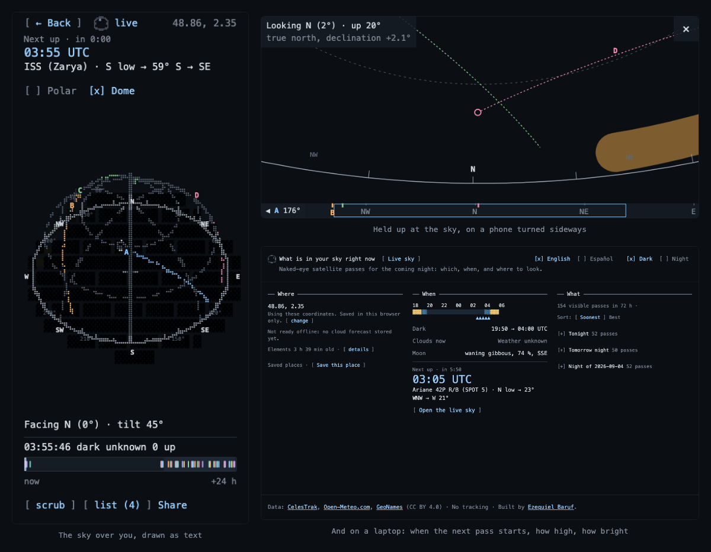

# What is in your sky right now

Type a location and see which of about thirty bright satellites cross the sky over it
tonight: when each one appears, where to look for it, how long it stays and how bright it
gets. It runs in the browser, with no backend and no account.

**Live:** <https://in-your-sky.ezequiel-baruf.workers.dev>



It was built spec-driven, and mostly not by hand. Every line traces to a numbered
requirement in `SPEC.md`; each slice in `TASKS.md` was delivered by one Claude Code
session working alone in its own git worktree, started by `scripts/sdd-run.ts`. The
driver pushed the branch, opened a pull request and waited for CI, then ran a second
session whose only job was to review the diff and post what it found, and only then was
the branch merged.

[How this was built](docs/HOW-THIS-WAS-BUILT.md) -
[Contributing](CONTRIBUTING.md) -
[Licence](LICENSE) (MIT)

## Run

[](https://github.com/CipoBaruf/what-is-in-your-sky/actions/workflows/ci.yml)
says whether the commands below pass on `main`.

Prerequisites: **Node 24** (the version in `.node-version`, which is the one CI uses) and
a Chromium for Playwright, which the second command installs. Both are needed before
`npm test`: the suite boots a real browser for the worker project.

```
npm ci
npx playwright install chromium
npm test             # Vitest (unit, golden, component, worker in Chromium); never touches the network
npm run build        # dist/, including public/_headers and public/third-party-notices.txt
npm run bundle:budget  # after a build: gzipped chunk sizes against the PLAN §11 budgets (CI prints this table)
```

Those five are the whole of it: a clean clone runs them and nothing else (FR-PUB-8). The
rest are for working on it:

```
npm run dev          # http://localhost:5173 (no CSP: Fast Refresh needs inline scripts)
npm run preview      # http://localhost:4173, the production build with the Cloudflare headers
npm run e2e          # production build + Playwright, under the strict CSP
npm run check:catalog  # live: every catalog object present in CelesTrak visual|stations
npx tsx scripts/readme-hero.ts          # the two pictures above, from committed captures
npx tsx scripts/third-party-notices.ts  # public/third-party-notices.txt, from the installed tree
```

The tasks are delivered by a driver script rather than by hand (PLAN §16, and
[docs/HOW-THIS-WAS-BUILT.md](docs/HOW-THIS-WAS-BUILT.md)):

```
npm run sdd -- --status     # what is merged, in review, ready, blocked or failed
npm run sdd -- --dry-run    # exactly what the next wave would run, and stop
npm run sdd -- --wave       # run it: one session per task in its own worktree, then CI, review, merge
npm run sdd -- --task R17   # one task, dependencies checked
```

## Deploy

`docs/RELEASE.md` is the release checklist: what to check on the deployed site, the
on-device dome performance check (FR-GUIDE-6) and the deploy-day comparison against
Heavens-Above. Hosting is Cloudflare Workers static assets wired to this repository through Workers
Builds (PLAN D-12 as amended in §2.5): a push to `main` builds and deploys production;
a push to any other branch, once *non-production branch builds* are enabled, uploads a
preview version with its own URL. `wrangler.jsonc` at the root holds the whole
configuration (assets-only Worker, `dist/` as the assets directory, no Worker script), so
the build never has to guess. The project was created once in the Cloudflare dashboard:

1. *Workers & Pages → Create → Import a repository*, pick `CipoBaruf/what-is-in-your-sky`.
2. Worker name `in-your-sky`, production branch `main`, build command
   `npm run build`, deploy command `npx wrangler deploy` (the defaults). No environment
   variables; the Node version comes from `.node-version` (24, the same as CI).
3. *Settings → Builds → Branch control*: enable non-production branch builds so every
   branch gets a preview version, aliased by branch name:
   `https://<branch>-in-your-sky.ezequiel-baruf.workers.dev`.

The worker name is the first label of the URL and the account subdomain
(`ezequiel-baruf`) the second. The account subdomain can be changed only once per
account and already has been, so the worker name is the only part left to choose.
Renaming it in `wrangler.jsonc` creates a new worker instead of moving the existing one,
so a rename is three steps: change `name`, then in the dashboard point Workers Builds at
the new worker (*Settings → Build → Connected repository*) and delete the old worker once
the new one has served a green production build. Links to the old URL stop working;
Cloudflare does not redirect.

`public/_headers` is copied into `dist/` by Vite and parsed by Cloudflare at upload (it is
never served): the strict Content-Security-Policy, `Referrer-Policy` and `Permissions-Policy`
from PLAN §11 on every path, and a one-year immutable cache on the hashed files under
`/assets/`. `npm run preview` serves the same file the same way, and the Playwright suite
runs the app under it, so a CSP violation fails CI before it reaches the site. To check a
deployment by hand (replace the host with a preview URL to check a branch):

```
SITE=https://in-your-sky.ezequiel-baruf.workers.dev
curl -sI $SITE/ | grep -iE 'content-security-policy|referrer-policy|permissions-policy'
curl -sI $SITE/assets/$(curl -s $SITE/ | grep -oE 'assets/[^"]+\.js' | head -1 | cut -d/ -f2) | grep -i cache-control
```

The app makes requests only to its own origin and to the hosts named in `connect-src`
(CelesTrak now; Open-Meteo from R8/R9). There is no analytics or tracking (spec FR-X-3);
Workers observability is off in `wrangler.jsonc`.

## Data sources and attributions

- **Orbital elements:** [CelesTrak](https://celestrak.org/) — GP element sets (OMM JSON) for the
  `visual` and `stations` groups, fetched by the browser and filtered to the curated catalog.
  CelesTrak data is **free for any use with attribution**; the app fetches at most one set per group
  per session (a 2 h cache follows in R11).
- **Weather and geocoding:** [Open-Meteo](https://open-meteo.com/) — cloud-cover forecast and
  place-name search (from R8 and R9), used under the
  [**CC BY 4.0**](https://creativecommons.org/licenses/by/4.0/) terms of its free non-commercial API.
  Open-Meteo's geocoding data derives from [GeoNames](https://www.geonames.org/) (**CC BY 4.0**).
  Both credits are in the app footer, with CelesTrak's (spec FR-X-2, `src/ui/components/common/Footer.tsx`). A recorded
  forecast response for the Neuquén cell (`tests/fixtures/open-meteo/`, with its capture metadata)
  feeds the weather tests; the app itself never reads it.
- **Intrinsic magnitudes:** the catalog (`src/data/catalog/catalog.json`) seeds each object's
  standard magnitude from **Mike McCants'** Quicksat intrinsic magnitudes file
  (`qs.mag`, 2020-09-14, [mmccants.org/programs/qsmag.zip](https://www.mmccants.org/programs/qsmag.zip)).
  The file carries no licence text: it is a **published data table, used with attribution** to its
  author and its date. Objects launched after it (Tiangong) carry a documented estimate, and every
  entry records its source and date (`stdMagSource`) so values can be audited and updated.
- **Reference predictions (development only):** [Heavens-Above](https://www.heavens-above.com/)
  pass tables, **transcribed by hand into dated fixtures for development use only**, under
  `tests/fixtures/heavens-above/`, for the physics golden tests. Never fetched by the app or the
  tests, and no Heavens-Above content is redistributed beyond those transcribed numbers.
- **The sky chart:** [glyphcss](https://glyphcss.com) by Juan Cruz Fortunatti — **MIT**,
  © 2025 Layoutit. It was chosen because it draws 3D into the same monospace character grid the
  rest of the page is set in, so the dome is text and the app needs no canvas: one type of pixel,
  one set of colour tokens, and a chart that inherits the theme instead of reimplementing it.

Every package whose code reaches the production bundle is listed with its licence in
`public/third-party-notices.txt`, which is generated by `npx tsx scripts/third-party-notices.ts`
and served at `/third-party-notices.txt` beside the bundle it covers.

## Catalog maintenance

`catalog.json` is the single source of per-object metadata (name, category, `stdMag` with
provenance, description, `featured`). It is validated by `src/data/catalog/catalog.test.ts` in CI.
Run `npm run check:catalog` periodically: an object reported as `MISSING` has decayed or left the
CelesTrak groups and should be removed. Docked modules and visiting vehicles of the ISS and
Tiangong are deliberately absent: each station is listed once under its core module's NORAD id.
