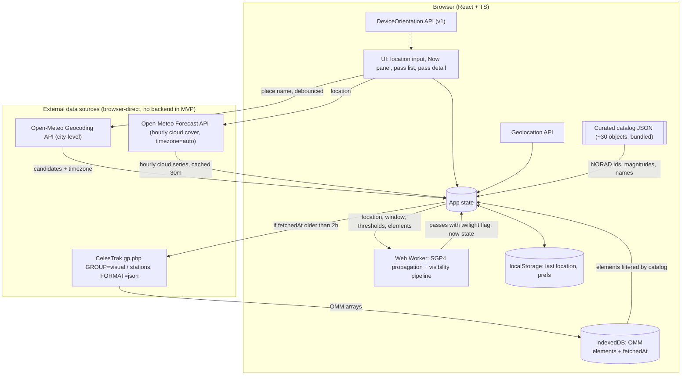

# What Is In Your Sky Right Now — Product Specification

| Field | Value |
|---|---|
| Status | **Draft v2.0 — for review.** v2.0 (2026-09-09, V20-1..V20-13, "the redesign"): the design phase's approved artboards, six areas, become requirements. **§4.28 FR-FIRST-1..7** — the first run is three readings, *where → when → what*: the cold open carries the mark, the tagline and one primary action; once a place is set the next pass is a countdown before anything else; on compact the three readings stack and the location reading collapses to a line whose `[ change ]` opens the form in place; on a wide page from `HOME_THREE_PANE_MIN_CELLS` they are three equal panes and an open pass takes the first two. **§4.29 FR-MARK-1..8** — the app gains a mark, "Aperture": a wireframe rasterised to braille through the dome's own cell and font, two-tone from tokens, a six-tier ladder that sheds a reading at a time (the rasters embedded as the golden seed), placed in both headers at 24 px, the cold open, the manifest icons and a favicon, animated by its bead alone as the loading and live/held indicator, generated by a build step. **§4.30 FR-WATCH-1..9** — the live page is two states, watching and scrubbing, told apart by whether the shown instant is real time and nothing else; each renders its own inventory at all four shapes, and on a short wide window scrubbing is an overlay so the box never resizes. **§4.31 FR-GUT-1..8** — the sky screen's legend strip becomes a 28 px compass gutter — a band, a bracket, a tick per pass, edge markers, an empty-field chip — giving the drawing 68 px back, and portrait stops instructing. **§4.32 FR-SET-1..4** — `#settings` inverts to Location, Saved places, This browser and fits 390 × 844 in Spanish; the compact home carries the form again, which reverses D-184's first-run role (V20-5). FR-LOC-1, FR-X-6, FR-DESK-2, FR-DESK-3, FR-LIVE-3, FR-LIVE-4, FR-LIVE-5, FR-LIVE-7, FR-OFF-6, FR-MOON-3, FR-COMP-1, FR-COMP-2, FR-COMP-3, FR-COMP-4, FR-COMP-6, FR-LEG-2, FR-LEG-7, FR-TRAJ-4, FR-FSC-1, FR-FSC-3, FR-FSC-7, FR-FSC-11, FR-SHP-3, FR-SHP-4, FR-SPAN-2 and FR-SPAN-3 amended; US-4 AC1, US-14 AC1 and AC2, US-16 AC4, US-20 AC2 and AC3, US-21 AC11 and AC12 amended; US-26..US-29 added; §2.8 G22–G26; §5.9; OQ-27..OQ-31; §9 Phase 2g. The v1.4.1 text is otherwise unchanged. v1.4.1 (2026-09-09, V14-9..V14-11, "the screen does not wait"): the owner, on the v1.4 build — the sky screen waits for the phone to be turned, and a phone whose rotation the reader has locked never turns, so the screen is a note with no way past it. **FR-FSC-4 is rewritten:** the drawing is there in both orientations, with the readout, the legend and the `×`, and nothing on the screen is gated on `(orientation: landscape)`. **FR-FSC-10** turns the layer itself — the pose the sensor reports decides which way is up, not the viewport, so a rotation-locked phone held sideways gets the same wide screen an unlocked one gets, with a hysteresis and a hold near flat so it never spins at the zenith. **FR-FSC-11** is the line of advice that replaces the gate, and where it stands among FR-FOL-5's notes. FR-FSC-7 amended (the captures); US-21 AC12 amended and AC15 added; §2.7 G21; §9 Phase 2f gains the item and a seventh task, before the release. The v1.4 text is otherwise unchanged. v1.4 (2026-09-08, V14-1..V14-8, "the shape, the chunk and the list"): three items from the owner's use of the 1.3.0 build, and the four findings no phase carried. **§4.25 FR-SHP-1..5** — a page's layout is a mode (a width) and a shape (portrait, or a landscape phone), the two are independent, and every shape rule must name its mode: F-65 in §4.20 is what happens when one does not, measured at 1200 × 450, where the page is drawn 456 px wide inside a 1200 px window with a drawing of zero height and a scrollbar; with it, the rule that a block re-cutting a grid sets both halves of it, the wide page's behaviour at every height, and the matrix of sizes that is what "every supported size" means. **§4.26 FR-SPAN-1..7** — the stripe draws the four-hour chunk that holds the shown instant (40 s per pixel on a phone against four minutes today), with a 24 h overview above it, and a stepping row re-cut to chunk arrows and pass jumps and shown on every device. **§4.27 FR-LEG-6..9** — the legend is beside the box at every wide width, so `LIVE_TWO_COLUMN_MIN_PX` and the one-column wide page are withdrawn; on the compact live page it is behind a `[ list (n) ]` control that opens a panel of exactly two rows, so nothing the sky does moves the picture. FR-LIVE-1, FR-LIVE-4, FR-LIVE-7, FR-COMP-4, FR-COMP-5, FR-COMP-6, FR-LEG-2, FR-TRAJ-4 and FR-TRAJ-5 amended; US-22 AC6 and US-23 AC2 amended, US-24 and US-25 added; §2.7 G18–G20; OQ-24..OQ-26; §4.20 carries F-65 and gives F-57, F-58, F-62 and F-64 to this phase; §9 Phase 2f. The v1.3.3 text is otherwise unchanged. v1.3.3 (2026-09-08, V13-15, V13-16): the two findings P1 reported and did not fix get a guard and a tool rather than a decision — FR-PUB-12, no commit after the `d7514ec` baseline carrying an agent trailer, checked in CI on a full-history checkout so the existing 19 are untouched and the count cannot grow; and FR-PUB-13, a branch is deletable when its pull request is merged, by GitHub's record and not by `git branch --merged`, which a squash-merging repository makes meaningless. The metadata item keeps its `docs/RELEASE.md` §10 checklist and needs no code. V13-16, on the owner's question about the merged P1: the deploy runbook leaves the README for `docs/DEPLOY.md` — 45 of 144 lines that only the holder of the Cloudflare account can act on — and the README keeps one paragraph on what the deployment is, which is the part that is evidence. FR-PUB-1 amended. One task, P2. The v1.3.2 text is otherwise unchanged. v1.3.2 (2026-09-08, V13-11..V13-14, "public readiness"): the repository is going in front of readers who are not the app's user, so it is specified like anything else. §4.24 FR-PUB-1..11 state what the README's first screen must answer, the reading order (`docs/HOW-THIS-WAS-BUILT.md`), the missing glyphcss credit, the third-party notices the deployed bundle does not carry, the MIT `LICENSE`, the hygiene and clean-clone audits with the commands that produced them, the branch cleanup, `CONTRIBUTING.md`, and the repository metadata the owner sets by hand; §9 Phase 2e is one task, `P1`, and no product change — no `src/` file, no capture, no budget, no version bump and no tag. §6.5 gains the glyphcss row. The v1.3.1 text is otherwise unchanged. v1.3.1 (2026-09-08, V13-6..V13-10, "the sky screen"): the owner on the R64 build, on a phone. The `[ follow phone ]` control is gone and the window is a view again on both pages — choosing it from the view control opens the screen, on the live page and on the pass detail alike — and the screen is renamed the **sky screen**, since no control called follow is left to name it. The screen shows the instant the page is showing rather than returning it to real time, so a pass later tonight can be watched through the phone before it happens; the chart view preference holds the dome or the polar chart only, the window being a mode entered by a tap and never restored on load, so FR-WIN-5's `[ point at the sky ]` gate goes with it. F-63 in §4.20: on a landscape phone the compact full-bleed box breaks out of the dome pane and over the status strip beside it. §4.23 gains FR-FSC-8 (the instant) and FR-FSC-9 (no scroll); FR-COMP-5, FR-LIVE-6, FR-LIVE-7, FR-LIVE-8, FR-WIN-4, FR-WIN-5, FR-WIN-6, FR-FOL-1..3, FR-LEG-2 and FR-FSC-1..7 amended; US-10 and US-21 amended (AC1, AC5, AC7, AC8, AC11, AC13, and AC14 added); §2.6 G17; §9 Phase 2d. The v1.3 text is otherwise unchanged. v1.3 (2026-09-08, V13-1..V13-5, "the follow screen"): the owner on the released v1.2 build — the follow view on a phone is a screen to hold up with both hands, and everything of the page around it is in the way. §4.23 FR-FSC-1..7: the follow control opens a layer over the whole viewport that holds the window drawing, a `×` to close, the facing readout and the legend as overlays, and nothing else; it draws only with the phone held sideways and says so in portrait; hidden objects are never on it; the window leaves the live page's view control, so follow is the only way in there and the pass detail is unchanged. FR-FOL-1, FR-FOL-3, FR-LIVE-6, FR-LIVE-7, FR-LIVE-8, FR-WIN-4, FR-WIN-5, FR-WIN-6 and FR-LEG-2 amended; US-10 and US-21 amended (AC11..AC13); §2.6 goal G17; OQ-22, OQ-23; §9 Phase 2d. The v1.2.1 text is otherwise unchanged. v1.2.1 (2026-09-07, V12-7..V12-15): the owner's finding on the released v1.2 build — the dome is two thirds of the width of its box at every desktop size, because the box is the page's whole width and the drawing cannot be — as F-59 in §4.20, with FR-LIVE-7, FR-LEG-2 and FR-TRAJ-4 amended: the rows beside the box in a rail, the box cut to the drawing's own shape from what the window leaves, the stripe under it on every wide page with the playback controls on its clock's row, and the page one column under 1660 px — the stripe and the legend its whole width and the status strip reading from the left (V12-15); the dome drawn at the wrong scale after a window resize as F-60; and the top of the bowl cut off on every height-bound box since R45 as F-61, the fit rule now counting the bowl's silhouette and centring the drawing on its extent — FR-DOME-1 amended for both; §9 Phase 2c gains a line. The v1.2 text is otherwise unchanged. v1.2 (2026-09-07, V12-1..V12-6): the follow control opens the sky window instead of turning the dome, and pointing the phone at the ground says so — §4.22, FR-FOL-1..5, with US-10 and US-21 amended; three defects from the owner's use of the released build as F-54..F-56 — the dome's fit ceiling above 1920 px, the compact rows under the stripe, and the drawn pass set lost by a click or a reload — with FR-DOME-1, FR-LIVE-7, FR-LIVE-8, FR-WIN-4, FR-WIN-5 amended and FR-LIVE-11 added; §2.5 goals G15–G16, OQ-21, §9 Phase 2c. The v1.1 text is otherwise unchanged. v1.1.2 (2026-09-06, V11-15, V11-16): the install offer is snoozed by "Not now" rather than ended by it — 7 days, then 30, then never — and the settings page carries the offer with no decline beside it, with FR-OFF-6, FR-COMP-2 and US-16 AC4 amended and PLAN D-153 superseded. v1.1.1 (2026-09-06, V11-14): the owner's wide-screen review of the live page after wave 4 — findings F-51..F-53 in §4.20, FR-DOME-1 and FR-LIVE-7 amended for wide. v1.1 (2026-09-05) adds the v1.1 scope "phone pass": goals G12–G14 (§2.4), US-20..US-23, §4.15–§4.21 (feature flags, compact layout and settings, chart legend, sky window, live trajectories and the stripe, the v1 findings, CI time), US-5 AC2 / FR-GUIDE-2b / FR-GUIDE-7 / FR-DESK-2 / FR-DOME-1 / FR-DOME-4 / FR-DOME-6 / FR-LIVE-2 / FR-LIVE-4 / FR-LIVE-6 / FR-LIVE-7 / FR-LIVE-8 / FR-MOON-4 / FR-DESK-3 / FR-DESK-5 amended, §5.8 v1.1 architecture additions, §6.5 WMM row, OQ-16..OQ-20, §8 rows 20–24, §9 Phase 2b, Decision Log V11-1..V11-13. The v1 text (v1.0) is otherwise unchanged. |
| Date | 2026-09-09 (v2.0); 2026-09-08 (v1.4); 2026-09-08 (v1.3.3); 2026-09-08 (v1.3.2); 2026-09-07 (v1.2); 2026-09-06 (v1.1.2); 2026-09-06 (v1.1.1); 2026-09-05 (v1.1); 2026-09-03 (v1.0); 2026-09-01 (v0.4) |
| Owner | Ezequiel Baruf |
| Scope of this document | Product + technical specification only. No implementation plan or task breakdown (requested as a separate step). |

---

## 1. Summary

A web app that tells a person standing outside, with no equipment, **which satellites they can see with the naked eye, when, and where to look** — and whether clouds are likely to spoil the view.

The user supplies a location (city or place name, coordinates, or browser geolocation). The app predicts visible passes for the coming hours, ranks them by how good they will be, and for each pass gives plain-language viewing instructions (rise/peak/set direction, maximum elevation, times, duration, expected brightness) plus a cloud-cover warning drawn from a weather forecast.

---

## 2. Goals & Non-Goals

### 2.1 Goals (MVP)

- **G1. Zero-friction start.** A first-time visitor gets a useful answer in under 30 seconds with no sign-up and no API keys to configure.
- **G2. Correct visibility filtering.** Only show passes that are genuinely naked-eye visible: satellite sunlit, observer in darkness, pass high enough above the horizon, predicted brightness above a threshold.
- **G3. Actionable guidance.** Every pass answers "where do I look, when, and for how long?" in words a non-astronomer understands.
- **G4. Honest about weather.** Warn when clouds are likely to block the pass; never silently present a doomed pass as a good one.
- **G5. Cheap to run.** Free or generous-free-tier data sources; near-zero hosting cost; computation pushed to the client where practical.
- **G6. Works on a phone, outdoors, at night.** Mobile-first, dark UI, large tap targets, readable at arm's length.

### 2.2 Non-Goals (explicitly out of scope for MVP)

- Tracking every object in orbit (full catalog, debris, Starlink shells). MVP covers a hand-maintained catalog of ~30 well-known bright objects; the full CelesTrak `visual` group is v1.
- Street-address-precision geocoding. MVP geocodes to city/place level (Open-Meteo geocoding). A pass looks the same from anywhere within a few kilometres, so this costs nothing in accuracy; street addresses and reverse geocoding arrive with the v1 proxy.
- Any first-party backend. MVP is a static site; the browser talks to CelesTrak and Open-Meteo directly. *(amended v1)* The caching proxy moves to Phase 3 (V1-1): v1 stays browser-direct.
- Telescope / binocular targets (faint satellites, geostationary satellites, flares from specific antenna geometry).
- Astrology as prediction. v1 shows Moon lore (zodiac sign, folk names, one-liners) labelled as tradition (FR-MOON-5); the app never claims it affects what is visible. *(amended v1.1, V11-2)* The lore line ships behind a build flag that is off by default (FR-FLAG-1); the observing facts (phase, illumination, glare) are not affected by the flag.
- Iridium-style flare prediction (the original Iridium constellation is deorbited; flare prediction for other constellations is research-grade).
- Radio tracking, Doppler, amateur radio pass planning.
- Live 3D globe / orbit visualisation (Earth-centred, orbital view). The observer-centred sky dome in §4.4 is in scope; a view of the Earth from outside is not.
- User accounts, cloud sync, social features.
- Native mobile apps. *(amended v1)* The app installs as a PWA in v1 (FR-OFF-6); a store app is still out of scope.
- Historical passes ("what did I just see?") — see Roadmap, later phase.
- Guaranteed accuracy for launches < 48 h old or objects during manoeuvres (orbital elements lag reality).
- Commercial use of the free data tiers. If the project ever monetises, several dependencies (Open-Meteo; Nominatim once added in v1) require moving to paid/self-hosted tiers.

### 2.3 Goals (v1)

- **G7. Speaks the visitor's language.** English and Spanish, chosen from the browser, switchable in one tap.
- **G8. Uses a desktop screen.** On a wide screen the location, the Now panel, the pass list and the guide are on screen together; nothing is a phone column in the middle of a monitor.
- **G9. The dome is the signature.** Coloured, detailed, live, and the first thing a pass opens (UX-1 restored).
- **G10. Watch the night unfold.** A full-screen live sky with a timeline for the coming 24 h, scrubbed by hand or played at speed.
- **G11. Works off-grid.** Three nights of passes and forecast, and the app itself, stay usable with no connection.

### 2.4 Goals (v1.1, "phone pass")

- **G12. Readable on a phone.** Every chart is the largest thing on the screen it is on, and nothing the page needs wraps, hides the chart or pushes it down.
- **G13. Explore by pointing.** Hold the phone up and the sky window shows where the passes run in the direction the phone faces.
- **G14. Controls out of the way.** Preferences and the location form live on one settings page on a phone; the home screen is the answer, not the form.

### 2.5 Goals (v1.2, "follow and the fixes")

- **G15. Following is a picture that can be read.** Holding the phone up shows the sky the phone points at, not a bowl that turns with it; pointing the phone at the ground says so instead of showing nothing.
- **G16. The live page keeps what it drew.** A click on the stripe, a scrub or a reload never empties the sky, and no row of the page sits on top of another at any size the app supports.

### 2.6 Goals (v1.3, "the sky screen")

- **G17. Following is the whole screen.** With the phone held up sideways the picture is all there is — the sky it points at, where it is looking, what the keys mean — and one tap puts the page back. *(amended v1.3.1, V13-6, V13-7, V13-9)* The way in is the view control's "window" option — on the live page and on the pass detail, the same screen from both — and the screen draws the moment the page is showing, so a pass an hour from now can be watched through the phone before it happens.

### 2.7 Goals (v1.4, "the shape, the chunk and the list")

- **G18. The page is right at every window shape.** No width and no height a browser can give makes one row lie over another, empties the drawing, or makes a page scroll that says it never scrolls — the short, wide window included, which is what a dragged responsive frame and an inspector docked at the bottom both give.
- **G19. Time can be aimed.** Landing the shown instant on a pass takes one tap, and a drag on the stripe moves time by seconds per pixel rather than minutes.
- **G20. The list is where it is needed and never moves the picture.** Beside the drawing on a desktop at every width; on a phone one tap away, at a height that does not depend on what is in it, so neither opening it nor a pass coming or going resizes anything else.
- **G21. The screen never waits for the phone.** *(v1.4.1)* Choosing the window gives a picture. Turning the phone is advice about what a wider field buys, never a condition to be met: a phone whose rotation the reader has locked shows the same sideways screen an unlocked one shows, and the app asks nothing of the reader's settings.

### 2.8 Goals (v2.0, "the redesign")

- **G22. The page says which data matters.** A place first, then when it is dark, then what crosses; once a place is set the next pass is a countdown before anything else, on a phone and at a desk alike, and the two layouts organise the same facts in the same order.
- **G23. The app has a mark.** One drawing, made the way the dome is made, that is the icon, the favicon, the header and the cold open, and that moves while the app is loading or live.
- **G24. Watching is not operating.** At night, one-handed, the live page is the drawing and the next event; the stripe, the steps and the speeds come out when asked for and go away when done, and nothing the page could do is gone.
- **G25. The screen says which way to turn.** On the sky screen the bottom edge is a compass: where I face, what I can see of it, where each pass is, and, with nothing in front of me, which pass is off the edge and how far to turn.
- **G26. Settings is what its name says.** The page is for changing a preference, opens on the row anyone returns for, and fits a phone without scrolling; a first visit never lands on it.

---

## 3. Personas & User Stories

### 3.1 Personas

- **Casual Stargazer (primary).** No astronomy background. Heard "you can see the ISS" and wants to try tonight from the back garden. Uses a phone.
- **Curious Parent / Teacher.** Wants a reliable "show the kids something" moment; needs advance notice and confidence it will actually be visible.
- **Hobbyist Observer (secondary).** Knows what azimuth means. Wants a fast, honest list and the ability to tune thresholds; will notice if predictions are wrong.

### 3.2 User Stories (MVP unless tagged)

Each story has acceptance criteria (AC). "Visible pass" is defined in §4.3.

**US-1 — Provide my location by place name**
As a user, I can type a city, town, or place name and have it converted to coordinates.
- AC1: A single free-text field accepts a place name; results appear as a short pick list (name, region, country) when ambiguous.
- AC2: The resolved place name and coordinates are shown so I can confirm they are right.
- AC3: If geocoding fails or returns nothing, I get a clear message and the option to enter coordinates instead.
- AC4: The UI makes clear that resolution is city-level ("Using the centre of Cipolletti, Rio Negro"); street addresses are not resolved to house precision in MVP.

**US-2 — Provide my location by coordinates**
As a user, I can paste or type latitude/longitude.
- AC1: Accepts decimal degrees (`-34.6037, -58.3816`) and common variants (space-separated, with N/S/E/W suffixes).
- AC2: Validates range (lat −90..90, lon −180..180) with inline errors.
- AC3: Optional altitude (metres) field, default 0.

**US-3 — Use my device's location**
As a user, I can press one button to use the browser's Geolocation API.
- AC1: Button is only shown when the API is available and the page is served over HTTPS.
- AC2: Permission denial shows a non-blocking message and leaves the manual inputs usable.
- AC3: Reported accuracy is displayed if worse than ~1 km; otherwise hidden.

**US-4 — See what is visible right now**
As a user, I see at a glance whether any satellite is visible **at this moment** from my location.
- AC1: A "Now" panel lists satellites currently above the elevation threshold, sunlit, with observer in darkness — or states plainly that none are visible and why (daylight / nothing up / all in shadow). *(amended v2.0)* The panel is the When reading's (FR-FIRST-4, FR-FIRST-5), after the next-event block.
- AC2: The panel updates at least every 10 seconds without a page reload.
- AC3: For each currently-visible satellite: current azimuth (compass direction + degrees), current elevation, and time remaining until it sets or enters shadow.

**US-5 — See upcoming visible passes**
As a user, I see a list of upcoming visible passes for the next 24 hours (configurable up to 5 nights).
- AC1: Each list item shows: satellite name, start time (local to the *observer location*, not the browser), max elevation, peak compass direction, duration, predicted brightness, and a weather indicator.
- AC2: Passes are sorted chronologically by default; a toggle sorts by "best first" (brightness × elevation). *(amended v1.1)* On compact the toggle labels are "Soonest" and "Best" so the row fits one line (FR-COMP-4); wide keeps "Soonest first" / "Best first".
- AC3: Passes that fail the visibility criteria are not listed (no "hidden but listed" clutter).
- AC4: Time until the next pass is shown as a countdown.

**US-6 — Get step-by-step viewing guidance for a pass**
As a user, I open a pass and get instructions on where and when to look.
- AC1: Text summary in plain language, e.g. *"Appears low in the west-southwest at 21:14:32, climbs to 62° (two-thirds of the way up the sky) in the south at 21:17:50, disappears into Earth's shadow in the east-northeast at 21:20:05. Brighter than any star."*
- AC2: Numeric details: rise/peak/set azimuth (° and 16-point compass), max elevation, start/peak/end times to the second, duration, magnitude, range at peak.
- AC3: A **3D ASCII-rendered sky dome** centred on the observer, with cardinal points labelled on the horizon, the pass drawn as an arc with its peak marked, and rise/set points and direction of travel indicated. I can rotate and tilt the view so I am looking toward the horizon I will actually face.
- AC4: Distinguishes "sets below horizon" from "enters Earth's shadow" as the end condition.
- AC5: A 2D polar (all-sky) chart of the same pass is available as a fallback view, one tap away, built from the same data.

**US-7 — Know whether clouds will ruin the pass**
As a user, each pass tells me whether the forecast suggests clear or cloudy skies.
- AC1: Cloud cover (total, and low/mid/high where available) is fetched for the observer location for the pass time.
- AC2: A three-state indicator: *Clear* (< 30 % total cloud), *Partly cloudy* (30–70 %), *Likely obscured* (> 70 %). Thresholds are constants and appear in the UI tooltip.
- AC3: Forecast timestamp and provider are shown so the user knows how fresh the data is.
- AC4: If weather data is unavailable, the pass is still shown with a "weather unknown" state — weather never blocks pass display.

**US-8 — Remember my last location** *(MVP, minimal)*
As a returning user, the app pre-fills my last-used location.
- AC1: Stored in `localStorage` only; nothing sent to a server.
- AC2: A "clear" action removes it.

**US-9 — Tune visibility thresholds** *(later; was v1, V1-1)*
As a hobbyist, I can adjust minimum elevation, limiting magnitude, and twilight rule.

**US-10 — Point my phone at the sky** *(v1, on the live page)*
As a user, I can hold my phone up and have the live sky turn with me, so the dome shows the horizon I am facing. *(amended v1: the dome's facing follows the compass heading rather than an arrow; FR-LIVE-8.)* *(amended v1.2, V12-1: the control opens the sky window instead of turning the dome, so US-21 is where this story now lives; FR-FOL-1.)* *(amended v1.3, V13-1: what the control opens is the follow screen, a layer over the whole viewport for a phone held sideways; FR-FSC-1.)* *(amended v1.3.1, V13-6: there is no control — the window is a view again, and choosing it opens what is now called the sky screen; FR-FSC-1, FR-FSC-6.)*

**US-11 — Be notified before a pass** *(v1 / later)*
As a user, I can opt in to a reminder a few minutes before a selected pass.

**US-12 — Share a pass** *(v1)*
As a user, I can copy a link that reproduces this pass view (location + satellite + time) for someone else, or a moment on the live page.
- AC1: A share action on the pass detail and on the live page produces a URL that reproduces the view on the recipient's device by recomputing locally (FR-SHARE-1).
- AC2: On devices with `navigator.share` the system sheet opens; elsewhere the link is copied and the action confirms it.

**US-13 — Read the app in my language** *(v1)*
As a visitor whose browser is in Spanish, I see the app in Spanish without doing anything.
- AC1: On the first visit the language follows the browser: Spanish for `es` and any `es-*` in `navigator.languages`, English otherwise.
- AC2: A `[ EN | ES ]` control in the header switches at once, without a reload; the choice is saved locally and wins over the browser on later visits.
- AC3: Every string the app renders is translated: labels, banners, the guide sentence, compass names, brightness and cloud phrases, the Moon text of US-18, the shortcuts overlay. Satellite names, provider names and place names stay as catalogued.
- AC4: Dates, times and numbers follow the language's conventions through `Intl`, still in the observer's zone (FR-LOC-3).
- AC5: `<html lang>` and the page title follow the active language.

**US-14 — Use the app on a desktop** *(v1)*
As a user at a desk, I see the location, the Now panel and the pass list at once, and a pass opens beside the list instead of covering it.
- AC1: At 100 cells of viewport width and above, the page has two columns: location, favourites, banners, Now panel and Moon line on the left; hero card, sort and pass list on the right. *(amended v2.0, V20-10)* From `HOME_THREE_PANE_MIN_CELLS` the two columns are three panes (FR-FIRST-5).
- AC2: Opening a pass shows the guide in a panel beside the list; the list stays visible and the selected card is highlighted; below the wide breakpoint the full-screen sheet stays. *(amended v2.0, V20-10)* At three-pane widths the guide takes the first two panes and the list stays in the third.
- AC3: The dome fills the width of its panel at desktop sizes and is drawn at the finer grid that width allows (FR-DOME-1).
- AC4: Keyboard shortcuts work when no input has focus: `j` / `k` next and previous pass, `Enter` open, `Esc` close, `l` live page, `v` chart view, `n` night theme, `?` the list of shortcuts.
- AC5: Column widths and breakpoints are in cells; the layout stays on the character grid (FR-X-6).

**US-15 — Watch the sky live and ahead** *(v1)*
As a user, I open a full-screen live sky that shows what is up now and lets me run the coming 24 h forward.
- AC1: A live page, reachable from the header and from the Now panel, fills the viewport with the dome; the passes of the next 24 h are drawn as arcs and every satellite currently above the horizon has a marker on its arc.
- AC2: A status strip shows the observer's time, the sky state (day, bright twilight, dark), cloud cover at that time and the count of satellites visible at the shown instant.
- AC3: A time stripe under the dome spans now to now + 24 h with each pass marked; I can drag it or use the arrow keys to move the shown instant, and the dome, the markers and the status follow.
- AC4: Play runs the shown instant forward at 1×, 60×, 600× or 3600×; pause stops it; a `now` action returns to real time, which then advances on the 10 s tick.
- AC5: The Sun (a glow on the horizon while it is just below it) and the Moon with its phase are drawn at their positions for the shown instant.
- AC6: Objects above the horizon but not visible are hidden by default; a toggle shows them dimmed with the reason (daylight, in shadow, too faint).
- AC7: On a phone the page works in landscape, and the screen stays awake while the page is open.
- AC8: With permission, the dome faces where the phone faces (US-10); dragging still works and turns following off until it is re-enabled.
- AC9: The URL carries the location and the shown instant, so the page can be shared (US-12) and reloaded.

**US-16 — Take the app off-grid for three nights** *(v1)*
As a user driving to a dark site, the app keeps working with no signal.
- AC1: After any successful load, the app itself, the elements, the location, the forecast and the passes for the next 72 h are stored on the device with no action from me.
- AC2: A line near the location says "Ready offline until <date and time>" from the stored data, or says what is missing.
- AC3: Opening the app with no connection loads it and shows the stored passes, the guide and the live page; weather shows the stored forecast with its age, or "unknown" past its end.
- AC4: The app can be installed: a manifest, an icon, and an install hint the browser's offer brings up. *(amended v1.1.2, V11-15; was "shown once")* Installing it answers the hint for good; "Not now" hides it for 7 days, a second "Not now" for 30 days, and a third never shows it again. The settings page keeps an Install action with no decline beside it, so the app can still be installed after the hint is done with (V11-16). *(amended v2.0, V20-3)* The icon is the mark (FR-MARK-4).
- AC5: The pass list can show the three nights grouped under night headings; tonight is the default.

**US-17 — Keep a few places** *(v1)*
As a user, I can save places and switch between them.
- AC1: Save the current location under its label; the list holds up to 8 (a constant).
- AC2: Picking one makes it the observer and recomputes; removing one is one action with no confirmation dialog.
- AC3: Stored locally only (FR-LOC-5). Offline data (US-16) is kept for the active place only.

**US-18 — Know about the Moon** *(v1)*
As a user, I see whether the Moon will wash out a pass, and a little Moon lore.
- AC1: Each pass card and the guide show the Moon's phase and illumination at the pass peak, and a "moon glare" warning when the Moon is up, bright and near the track (FR-MOON-2).
- AC2: The Now panel and the live page show the Moon's phase name, illumination and, when it is up, its direction and elevation.
- AC3: A "Moon tonight" line adds tradition: the zodiac sign the Moon is in, the folk name of the month's full moon when within a day of full, and a curated one-liner for the phase or the sign, in both languages, labelled as tradition (FR-MOON-4, FR-MOON-5).

**US-19 — Use the app in the dark** *(v1)*
As a user outdoors, I switch to a red night theme that keeps my dark adaptation.
- AC1: A `[ night ]` toggle in the header swaps the palette to red on black; the choice is saved locally.
- AC2: Every text pair keeps WCAG AA contrast in the red palette, and the dome and polar colours have night counterparts.

**US-20 — Set things up on a phone without scrolling past the form** *(v1.1)*
As a phone user, I open the app and see what is in my sky; the location form, the language and the theme are one tap away on a settings page.
- AC1: Below the wide breakpoint the header is one row: the title, `[ live ]` and `[ settings ]`. No language or theme control is on the home screen.
- AC2: `#settings` holds, in order: language, theme, the location inputs (place name, coordinates, altitude, use my location, the precision note), saved places with save and remove, and clear saved location. Every change applies at once; there is no save button. *(amended v2.0, V20-5)* The order is Location, Saved places, This browser (FR-SET-1).
- AC3: The home screen shows a one-line location summary ("Using <label> · [ change ]") that opens the settings page, then the readiness line, the banners, the Now panel, the Moon line, the hero card, the sort row and the list. *(amended v2.0, V20-5)* The summary's `[ change ]` opens the form in place, and the home screen is the three readings (FR-FIRST-4).
- AC4: `Esc`, the page's back control and the browser's back button return to the home screen with the observer, the selection and the list state intact.
- AC5: At and above the wide breakpoint nothing changes: the controls stay where US-14 puts them and no link to `#settings` is shown.
- AC6: No control row on the home screen, the settings page, the pass detail or the live page wraps at 390 px (FR-COMP-4).

**US-21 — Point my phone at the sky** *(v1.1; the home of US-10 on a phone)*
As a user outside, I hold my phone up and see, through it, where the passes run in the part of the sky I am pointing at.
- AC1: On a touch device the chart view control offers a third view, "window". Choosing it asks for orientation permission in that tap and then shows the sky in the direction the phone points. *(amended v1.3: on the pass detail; on the live page the follow control is the only way in, FR-FSC-6.)* *(amended v1.3.1, V13-6: on both pages again — the control is gone, and the tap that chooses "window" is the one that asks and the one that opens the sky screen.)*
- AC2: The window shows the horizon with compass names where it is in view, the altitude lines, the arcs of the passes in view with their rise, peak, end and shadow-entry markers, the live marker, the Sun and the Moon, from the same pass geometry as the dome (FR-LIVE-10).
- AC3: Turning, tilting and rolling the phone moves the view smoothly (the FR-GUIDE-6 target), and lifting the phone past the zenith keeps the picture continuous.
- AC4: Where orientation is absent or denied the option is absent or shows a note, and the dome stays the view.
- AC5: On the live page the window shows real time: entering it returns the shown instant to now and hides the time stripe and playback; leaving it brings them back. *(amended v1.3: on the live page the window is the follow screen, AC11..AC13; it hides the whole page, not the stripe alone.)* *(amended v1.3.1, V13-7: the screen shows the instant the page is showing — real time, or wherever the stripe and playback have taken it, still running at its speed — and entering no longer returns it to now.)*
- AC6: The heading is true north: the window and the following dome apply the local magnetic declination, and the strip shows it ("true north, declination +2.1°").
- AC7: The chosen chart view is remembered on the device. When the window is the remembered view and the browser needs a tap before it will give orientation, the chart shows a single `[ point at the sky ]` control in the window's place until tapped. *(amended v1.3.1, V13-8: the dome and the polar chart are what is remembered. The window is a mode: I enter it with a tap and the `×` gives back the view I came from, nothing restores it on a later load, and the `[ point at the sky ]` control has nothing left to gate.)*
- AC8 *(v1.2)*: The `[ follow phone ]` control on the live page opens the window from whatever view is showing, and pressing it again returns me to the view I had; what I picked from the view control myself is what stays remembered. *(amended v1.3: what opens is the follow screen, and its `×` is the second press; FR-FSC-2.)* *(amended v1.3.1, V13-6: the control is gone. The view control's "window" is the way in, its `×` the way out, and what I picked before it is what it gives back.)*
- AC9 *(v1.2)*: I can sweep the phone over the whole sky — round the horizon, past the zenith and behind me — and the picture stays continuous; nothing is clipped to a region I can leave.
- AC10 *(v1.2)*: With the phone pointed down the picture says so: the ground below the horizon is hatched with a one-line note while sky is still in the field, and the whole box becomes "you are pointing at the ground — raise the phone" once no sky is left in it. Raising the phone brings the sky back with no tap.
- AC11 *(v1.3; amended v1.3.1, V13-6)*: Choosing "window" from the view control gives me a screen that is the picture and nothing else: the sky the phone points at filling the screen, a `×` in the top-right corner, where I am looking in the top-left corner and the legend along the bottom. No header, no view control, no hint, no strip, no toggles, no share. The `×` puts the live page back exactly as it was. *(amended v2.0, V20-9)* The legend along the bottom is the compass gutter (FR-GUT-1).
- AC12 *(v1.3)*: The picture is drawn only with the phone held sideways. Held upright, the screen tells me to turn the phone, in my language, and turning it brings the picture with no tap and no second permission prompt. *(amended v1.4.1, V14-9: the picture is always there. Held upright I get it in the portrait box with one line advising me to turn the phone; nothing waits for the turn.)* *(amended v2.0, V20-9)* Upright, the advice is a line under the countdown, not over the picture (FR-GUT-7).
- AC13 *(v1.3; amended v1.3.1, V13-6, V13-9)*: Hidden objects never appear on the sky screen. "Window" is in the view control on both the live page and the pass detail, and choosing it on either opens the same screen.
- AC14 *(v1.3.1)*: On a pass detail, choosing "window" gives me that same screen over the sheet — the whole arc of the pass I opened (FR-DOME-5), the `×`, where I am looking and the legend — and the `×` gives the sheet back with the view it had. Nothing scrolls while the screen is up: not the screen, not the sheet under it.
- AC15 *(v1.4.1)*: With my phone's rotation locked, holding it sideways gives me the same wide screen an unlocked phone gives — the sky, where I am looking, the legend and the `×` all the right way up to my eye — and tipping it flat to look at a pass overhead does not spin the picture.

**US-22 — Watch the trajectories appear** *(v1.1)*
As a user on the live page, I move time forward and see each satellite's track appear, grow and fade, instead of a chart full of every arc of the coming day.
- AC1: At the shown instant `t` a pass under way is drawn from its rise to its position at `t`, solid, in its colour, with the marker; the part of the arc ahead of `t` is not drawn.
- AC2: A pass that rises within the next few minutes of shown time (`ARC_LOOKAHEAD`) is drawn faint and dotted over its whole arc with the rise point marked, so I know where to look next.
- AC3: A pass that ended within the last few minutes of shown time (`ARC_LINGER`) stays as a faint full arc without a marker, then disappears.
- AC4: Playing at 3600× reads as trails appearing, growing and fading, at the FR-LIVE-5 rate.
- AC5: The stripe's hour labels, the date at each midnight and the shown instant are readable at arm's length on a phone; the shown instant is a clock readout above the stripe.
- AC6: I can land the shown instant within a minute of a pass's rise in at most three taps on a phone (the method is chosen by the spike, FR-TRAJ-5). *(amended v1.4)* One tap does it: `[ pass ▶| ]` (FR-SPAN-4). The three-tap ceiling stands as the ceiling.
- AC7: The pass detail is unchanged: it keeps drawing the whole arc of the pass it explains.

**US-23 — Read the chart by its legend** *(v1.1)*
As a user, I read which arc is which from a colour-keyed list beside or under the chart, and the drawing itself carries no names or clock times.
- AC1: No satellite name, clock time, Sun or Moon caption or hidden-object reason is drawn inside the dome, the polar chart or the window. Compass names, ring labels and degree ticks stay.
- AC2: A legend under the chart (compact) or beside it (wide) lists every drawn pass: a one-character key that is also drawn at the arc's peak, a swatch in the arc's colour, the name, the rise, peak and end times, and the state at the shown instant. *(amended v1.4, V14-4, V14-5)* Beside the chart at every wide width (FR-LEG-6); on the compact live page behind a `[ list (n) ]` control that opens it at a fixed height (FR-LEG-7).
- AC3: On the pass detail the existing start/peak/end table is the legend: it sits directly under the chart with the key and the swatch, and the other passes drawn dim get one row each; the Sun and the Moon get one line each.
- AC4: Tapping or focusing a row highlights its arc and dims the others; the highlighted pass is listed first.
- AC5: The legend colours match the arcs in both themes, and the key is the channel that survives without colour (FR-DOME-2).

**US-24 — Aim the shown instant at a pass** *(v1.4)*
As a user planning tonight, I move the shown instant onto a pass without aiming at a pixel.
- AC1: The stripe draws four hours at a time — the four that hold the shown instant — so a drag moves time by seconds per pixel, not minutes (40 s/px on a phone, 12 s/px at 1280 px).
- AC2: A one-row overview above the stripe carries the whole 24 h: the night, a mark for every pass, and a bracket around the four hours drawn below. A click or a drag on it moves the shown instant there.
- AC3: `[ ◀ 4h ]` and `[ 4h ▶ ]` move the shown instant a chunk at a time, and the chunk drawn follows it.
- AC4: `[ pass ▶| ]` puts the shown instant on the next pass's rise in one tap and `[ |◀ pass ]` on the previous one, on a desktop as well as on a phone.
- AC5: `[ −1m ]` and `[ +1m ]` are the fine step; the arrow keys keep one minute and, with Shift, ten, and Page Up / Page Down move a chunk.
- AC6: The chunk is not a mode I manage: the one drawn is always the one holding the shown instant, and playback carries it across a boundary on its own.

**US-25 — Use a window of any shape** *(v1.4)*
As a user whose browser window is neither a phone nor a full screen — dragged short, tiled to half a monitor, or with the inspector docked at the bottom — I still get a page that works.
- AC1: At every size the app claims to support, no element of a page lies over another and no page scrolls sideways.
- AC2: The live page never scrolls at all, and its drawing is never absent or zero-height.
- AC3: A phone's landscape layout appears on a phone only: a wide window that happens to be short keeps the desktop layout, with a smaller box.
- AC4: The supported sizes are a list in this document that a test walks, and they include 1200 × 450 and 1400 × 480.

**US-26 — Set up in three readings** *(v2.0)*
As a first-time visitor, I answer where I am, then read when it is dark and what crosses, in that order, and the answer I came for is the first thing on the page once a place is set.
- AC1: With no place set, the page shows the mark, the tagline, the step line, one primary action `[ Use my location ]` with the place and coordinate fields as alternatives, and the two notes at the foot of the group; no list, no Now panel and no pass banner is rendered (FR-FIRST-1, FR-FIRST-2).
- AC2: Once a place is set, the first block after the location reading is the next pass as a countdown — name, next event, direction and the time to it — with its peak direction, peak altitude and brightness under it; the list follows (FR-FIRST-3).
- AC3: On a phone the three readings stack in the order where, when, what, and the location reading collapses to one line with `[ change ]` that opens the form in place, not on another page (FR-FIRST-4).
- AC4: On a wide page from `HOME_THREE_PANE_MIN_CELLS` the three readings are three equal panes, Where, When and What, and a pass I open takes the place of the first two while the list stays in the third (FR-FIRST-5).
- AC5: The settings page is not where I am sent to set a place (FR-SET-3).

**US-27 — Watch the live sky, then scrub it** *(v2.0)*
As a user on the live page at night, I see the drawing and what happens next, and I bring the time controls out only when I want to move time.
- AC1: At real time the page shows the next event as its headline (`ISS rises NW in 4:12`), the drawing at every row it can take, one line of conditions and the 24 h overview; the stripe, the step row and the speeds are not rendered (FR-WATCH-2, FR-WATCH-3, FR-WATCH-4).
- AC2: `[ scrub ]`, a click or a drag on the overview, or a link that carries an instant, hold the shown instant and reveal the stripe, the step row and the playback row; `[ back to live ]` puts them away and returns to real time (FR-WATCH-1).
- AC3: While scrubbing the headline is the held instant and its offset from now (`21:47 · +33 min`) (FR-WATCH-2).
- AC4: The mark beside the state word runs while the page is real time and stands still while an instant is held, and the word `live` or `held` is beside it (FR-MARK-5).
- AC5: On a window too short for the box's floor the controls come up over the bottom of the drawing, and the drawing's box is the same height in both states (FR-WATCH-6).
- AC6: Nothing the live page could do before is gone: hidden objects, the list, share, every speed, every step, every view (FR-WATCH-4).

**US-28 — Know which way to turn** *(v2.0)*
As a user holding the phone up, the bottom edge tells me where I am facing, which part of it I can see, where each pass is and, when nothing is in front of me, where to turn.
- AC1: A 28 px gutter along the bottom edge carries the 180° of azimuth centred on my facing with the compass names on it, and a bracket showing my field of view (FR-GUT-1, FR-GUT-2, FR-GUT-3).
- AC2: Every drawn pass is a tick on the gutter at its bearing, in its colour, with its key under it when it is on the band but outside my field (FR-GUT-4).
- AC3: A pass off the band is a marker at the nearer end of the gutter with its key and the angle to turn (`A 110° ▶`) (FR-GUT-5).
- AC4: With no pass in the field, one line over the drawing names the next pass, how far to turn and when it rises (FR-GUT-6).
- AC5: Held upright I get the countdown above a band of sky, two legend rows under it and the gutter at the bottom; the advice to turn is a line of secondary copy under the countdown, not a note over the picture (FR-GUT-7).
- AC6: The drawing is 68 px taller than it was, at 390 × 844 and at 844 × 390 (FR-GUT-1).

**US-29 — Change a setting without scrolling** *(v2.0)*
As a phone user, I open settings on the row I came back for and see the whole page.
- AC1: `#settings` opens on Location, then Saved places, then one group, This browser, with language, theme and install (FR-SET-1).
- AC2: At 390 × 844 the page fits the viewport in both languages with the privacy line at its foot — with no observer, and with an observer and two saved places (FR-SET-2).
- AC3: A first visit never lands on `#settings`; the location step is on the home screen (FR-SET-3).

---

## 4. Functional Requirements

Requirements use MUST / SHOULD / MAY (RFC 2119 sense). IDs are stable for traceability into later plan/tasks.

### 4.1 Location

- **FR-LOC-1** The app MUST accept location via (a) free-text city/place name, (b) lat/lon text, (c) browser Geolocation. *(amended v2.0, V20-2)* Of the three, (c) is the primary action on a first run and (a) and (b) are its equal alternatives (FR-FIRST-2); the order they are offered in is FR-FIRST-2's, not this list's.
- **FR-LOC-2** Place-name geocoding MUST use the Open-Meteo Geocoding API directly from the browser (no key, CORS-enabled), MUST be debounced (≥ 500 ms after typing stops), and MUST cache results per query string for the session, to respect the shared 10 000 calls/day non-commercial limit.
- **FR-LOC-3** The app MUST derive the IANA time zone for the chosen location and display all times in that zone, with the zone abbreviation shown. Open-Meteo returns the zone both in geocoding results and in forecast responses (`timezone=auto`), so no separate lookup library is required in MVP.
- **FR-LOC-4** *(v1)* The app SHOULD reverse-geocode coordinates to a human-readable label (city / region) for display. Open-Meteo has no reverse geocoding; this arrives with the v1 proxy (Nominatim). MVP shows rounded coordinates for coordinate/Geolocation inputs.
- **FR-LOC-5** The app MUST persist the last location locally and MUST NOT transmit it to any first-party server for storage. *(amended v1)* Up to 8 saved places (FR-OFF-7) live in the same local store under the same rule.
- **FR-LOC-6** Geocoding precision in MVP is city/place level. The app MUST NOT imply street-level accuracy in the UI.

### 4.2 Satellite Data

- **FR-SAT-1** The MVP catalog is a **hand-maintained list of ~30 well-known bright objects** (ISS, Tiangong, Hubble, large rocket bodies, etc.) stored as a static JSON file in the repo, keyed by NORAD catalog number, with display name, intrinsic magnitude, category, and short description. The full CelesTrak `visual` group is v1.
- **FR-SAT-2** The browser MUST fetch current GP elements **directly from CelesTrak** (OMM JSON) for the `visual` and `stations` groups (two requests) and filter client-side to the curated catalog. Per-object `CATNR` requests MUST NOT be used (30 requests per client would violate CelesTrak's fair-use policy). If a curated object is absent from both groups it MUST be skipped with a console warning, not an error.
- **FR-SAT-6** Fetched elements MUST be cached in IndexedDB with a `fetchedAt` timestamp. The client MUST NOT re-request from CelesTrak more often than once every 2 hours (enforced against the stored timestamp, across tabs and reloads). On network failure the cached set MUST be used with the epoch-age warning of FR-SAT-4.
- **FR-SAT-3** The app MUST prefer the OMM/JSON representation over classic two-line TLE text. Rationale: the public catalog exceeded 5-digit numbers in July 2026; TLE lines now use Alpha-5 encoding for catalog numbers ≥ 100 000, which OMM avoids.
- **FR-SAT-4** The app MUST display the epoch age of the elements in use and MUST warn when elements are older than 5 days (accuracy degrades; ISS reboosts happen frequently).
- **FR-SAT-5** The curated catalog file (FR-SAT-1) MUST be the single source of per-object metadata and MUST record the provenance of each intrinsic magnitude (source + date) so values can be audited and updated.

### 4.3 Visibility Computation

A pass is **visible** when, for a contiguous interval of time, all of the following hold:

1. **Above horizon threshold.** Satellite elevation ≥ `MIN_ELEVATION` (default 10°; 0° is unusable in practice because of buildings, haze, and atmospheric extinction).
2. **Observer in darkness.** Sun altitude at the observer ≤ `SUN_ALT_MAX` = −6° (after end of civil twilight / before start of civil dawn). **Decided:** passes are listed from −6°; passes whose peak occurs with the sun between −6° and −12° carry a **"sky still bright"** label (only the brightest objects will be seen). User-configurable threshold is v1.
3. **Satellite sunlit.** Satellite is not inside Earth's umbra. Penumbra MAY be treated as lit with a "fading" flag.
4. **Bright enough.** Predicted visual magnitude at peak ≤ `MAG_LIMIT` (default +4.5; roughly what an average suburban sky allows). Every MVP catalog object has a known intrinsic magnitude (FR-SAT-1). When the full `visual` group is added in v1, objects with unknown intrinsic magnitude are shown with "brightness unknown" if the other conditions pass.

- **FR-VIS-1** The app MUST compute passes for a window of at least the next 24 h and at most 5 nights. *(amended v1)* The v1 window is 72 h from the time of computation (FR-OFF-2); the list shows tonight by default and the three nights grouped on request (US-16 AC5); a user-selectable window stays later.
- **FR-VIS-2** Pass boundaries (start, peak, end) MUST be refined to ≤ 1 s precision.
- **FR-VIS-3** For each pass the app MUST report: start time, start azimuth, peak time, peak azimuth, peak elevation, end time, end azimuth, end reason (`horizon` | `shadow` | `twilight`), duration, predicted peak magnitude, range at peak.
- **FR-VIS-4** The pipeline MUST run without blocking the UI thread (Web Worker) and SHOULD complete the 24 h computation for the ~30-object MVP catalog in under 1 s, and for ≈ 200 objects (v1) in under 3 s, on a mid-range 2022 phone.
- **FR-VIS-5** The app MUST recompute when location, window, or thresholds change; and MUST re-evaluate "now" state at least every 10 s using the cached propagation.
- **FR-VIS-6** All thresholds MUST be centralised constants with documented defaults and documented rationale.
- **FR-VIS-7** Each pass MUST carry a `twilight` flag set when the sun altitude at peak is between −6° and −12°; the UI MUST render it as a "sky still bright" label on the pass card and in the guide text.

### 4.4 Observation Guide

- **FR-GUIDE-1** For each pass the app MUST render a plain-language sentence (US-6 AC1) generated from a template, using 16-point compass names and an elevation-to-words mapping (e.g. 10–25° "low", 25–50° "mid-sky", 50–75° "high", > 75° "almost overhead").
- **FR-GUIDE-2** The app MUST render a **3D sky dome as ASCII text**, centred on the observer, showing: the horizon ring with cardinal points (at least N/E/S/W, ideally 8 points) labelled on it; each pass in view as an arc across the dome with its peak marked; rise and set points; direction of travel; and the shadow-entry point where applicable. The user MUST be able to rotate (azimuth) and tilt (pitch) the view, by touch drag and by keyboard, so the dome is seen from the direction they will face. The default view MUST face the pass's rise azimuth at a tilt that shows both horizon and peak.
- **FR-GUIDE-2b** The app MUST also provide a **2D polar (all-sky) chart** of the same pass — horizon as the outer circle, zenith at the centre, altitude rings at 30°/60°, cardinal labels, rise/peak/set and shadow-entry markers — as a fallback view reachable from the dome view. Both views MUST be driven by the same computed pass geometry. *(amended v1.1, V11-5)* The view control offers three views where the device allows it: the dome, the polar chart and the sky window (§4.18); all three are driven by the same computed pass geometry.
- **FR-GUIDE-3** Brightness MUST be expressed both as a magnitude number and a comparison phrase: "brighter than Venus" (≤ −4), "brighter than any star" (−4 to −1.4), "like a bright star" (−1.4 to +1), "like an average star" (+1 to +3), "faint, needs dark sky" (> +3).
- **FR-GUIDE-4** The 2D polar chart MUST be orientation-aware: default "looking up" convention (east on the left, as when lying on your back looking up) with an explicit toggle to map convention (east on the right). The chosen convention MUST be labelled on the chart. The 3D dome needs no such toggle: the user's rotation is the orientation, and the current facing direction MUST be shown as text (e.g. "facing WSW, tilt 35°").
- **FR-GUIDE-5** Both chart views MUST be rendered in the DOM only — text nodes and ordinary elements (with SVG permitted for the 2D chart). **No WebGL and no `<canvas>`.** Rationale: the ASCII dome is the product's visual signature and must be selectable, zoomable, and styleable like the rest of the page; DOM rendering also keeps the CSP strict and testing simple. *(amended v1, V1-4)* The CSP MAY allow inline `style` attributes (`style-src-attr 'unsafe-inline'`) so the rasteriser can colour glyphs (FR-DOME-2); `style-src-elem`, `script-src` and every other directive stay `'self'`.
- **FR-GUIDE-6** The dome MUST re-render smoothly enough for interactive rotation on a mid-range 2022 phone (target ≥ 30 updates/s while dragging) at the default grid size; grid size MAY reduce on small screens.
- **FR-GUIDE-7** Chart views MUST carry a text alternative (the FR-GUIDE-1 sentence and the numeric table) and the character grid MUST be hidden from assistive technology so screen readers are not read a wall of symbols. *(amended v1.1, V11-6)* The legend (§4.17) is part of the text alternative and is exposed to assistive technology as a list.

### 4.5 Weather

- **FR-WX-1** The app MUST fetch an hourly cloud-cover forecast for the observer location covering the prediction window. *(amended v1)* The window is 72 h, so the request asks for four forecast days (FR-OFF-3).
- **FR-WX-2** For each pass, cloud cover MUST be interpolated to the pass peak time from the two nearest hourly values.
- **FR-WX-3** The three-state indicator (US-7 AC2) MUST be shown per pass; the "Now" panel MUST show current cloud cover.
- **FR-WX-4** Where the provider supplies low/mid/high layer cloud, the indicator SHOULD weight low + mid cloud more heavily than high cloud (thin cirrus often still permits seeing bright satellites).
- **FR-WX-5** Weather fetch failure MUST degrade gracefully (US-7 AC4). Weather MUST be cached for 30 min per location cell (rounded to 0.1°).

### 4.6 Cross-Cutting

- **FR-X-1** Mobile-first responsive layout; dark theme by default; optional red-tint "night vision" mode (v1, specified in §4.14). *(amended v1)* "Responsive" includes the wide layout of §4.8.
- **FR-X-6** **Visual identity: monospace / terminal aesthetic across the whole UI** — a monospace typeface everywhere, character-grid-aligned layout where practical, box-drawing or plain-character borders, restrained colour on a dark ground, no photographic imagery. The ASCII sky dome must read as a natural part of the interface, not a widget dropped into a conventional web page. *(amended v2.0, V20-3)* The identity gains a mark, "Aperture" (§4.29): braille text on the same grid, the one image-like thing in the interface, from which the icon and the favicon are rendered.
- **FR-X-2** Every external data source MUST be credited in a footer (CelesTrak; Open-Meteo for weather and geocoding, whose geocoding data derives from GeoNames) as their terms require. OpenStreetMap/Nominatim attribution is added in v1 when the proxy introduces it. The footer MUST also name who made the page, linked to their profile. At wide widths it says all of this in one row rather than four (D-120): every source still named, still linked, and still under the licence it is used with.
- **FR-X-3** No analytics or tracking in MVP beyond anonymous, aggregate error logging.
- **FR-X-4** The app MUST function offline for the already-computed pass list, and MUST be able to recompute from IndexedDB-cached elements for a new location without network (weather then shows "unknown"). *(amended v1, V1-6)* The app shell itself MUST load offline through a service worker, and the stored forecast stays usable offline past its TTL with its age shown (§4.11). PWA install is v1 (FR-OFF-6).
- **FR-X-5** Accessibility: WCAG 2.1 AA colour contrast; chart information duplicated in text; keyboard navigable.

### 4.7 Language *(v1)*

- **FR-I18N-1** The app MUST ship English and Spanish. On the first visit the language is chosen from `navigator.languages`: the first entry whose primary subtag is `es` selects Spanish, otherwise English. A saved preference, set through the header control, MUST win over the browser afterwards.
- **FR-I18N-2** All user-visible strings MUST come from one typed message catalog per language. A message missing from either catalog MUST be a type error at build time, never a runtime fallback to the other language. Template sentences (FR-GUIDE-1, FR-GUIDE-3, cloud verdicts, elevation words, compass names, the Moon text) are messages with parameters, so word order and agreement can differ per language.
- **FR-I18N-3** Spanish MUST be neutral and impersonal: no `tú`, no `vos`, no `usted`. Instructions describe the sky ("Aparece bajo en el oeste-suroeste a las 21:14"), never address the reader.
- **FR-I18N-4** Dates, times, numbers and lists MUST be formatted through `Intl` with the active language and the observer's zone (FR-LOC-3). Degrees, magnitudes and compass abbreviations (N, NE, …) are identical in both languages; spelled-out compass names are translated.
- **FR-I18N-5** `document.documentElement.lang` and the document title MUST follow the active language. Switching MUST NOT reload the page or lose the observer, the selection or the live page's instant.
- **FR-I18N-6** The language is a preference, not a route: no path prefix, no URL parameter. Catalogued names (satellites, data providers, places returned by geocoding) are never translated.

### 4.8 Desktop layout *(v1)*

- **FR-DESK-1** Breakpoints are in cells (`--cell`, FR-X-6): *compact* below 100 cells of viewport width, *wide* at 100 cells and above (about 960 px at the 16 px base). Column and panel widths are in cells.
- **FR-DESK-2** Wide: two columns. The left column is fixed at 40 cells and holds, in order, location (inputs, favourites, clear), the elements banners, the Now panel and the Moon line (FR-MOON-3). The right column fills the rest and holds the hero card, the sort control and the pass list. The header spans both columns and carries the title, the tagline and, at the right, the language, night-theme and live-page controls. *(amended v1.1, V11-8)* The live-page control leaves the right-hand group: `[ Live sky ]` sits on the title line beside the title, as navigation; the right of the header holds the language and night-theme controls on one baseline row, aligned in cells. The Now panel keeps its own live link (FR-LIVE-1). *(amended v2.0, V20-2, V20-3, V20-10)* Two things. The title line carries the mark at 24 px before the title, and the tagline's padding-left is the mark's width plus one cell (FR-MARK-4). And from `HOME_THREE_PANE_MIN_CELLS` the two columns become three equal panes — Where, When, What (FR-FIRST-5); between the wide breakpoint and that width the two columns above stand, with the Where and When readings stacked in the 40-cell left column.
- **FR-DESK-3** Wide: a selected pass opens the guide in a panel beside the list. The right column splits into the list (44 cells minimum) and the guide (the rest); the list stays scrollable and the selected card is highlighted; `Esc` or the close control closes the panel. Compact keeps the full-screen sheet of MVP. The selection stays in the URL hash (D-13) in both cases. *(amended v1.1, V11-13)* Between the wide breakpoint and the width at which the 44-cell list and a 40-cell guide both fit (`WIDE_SPLIT_MIN_CELLS`, default 124 cells, a constant pinned by the breakpoint test), an open guide takes the whole right column and the list is one `[ list ]` control away, the way the compact sheet works; the split returns at that width. The guide column MUST never be narrower than 40 cells while open. *(amended v2.0, V20-10)* At three-pane widths (FR-FIRST-5) an open pass takes the place of the Where and When panes — the guide at least 72 cells — and the list stays in the What pane; under that width this requirement stands as written.
- **FR-DESK-4** Keyboard shortcuts, active when no input or button has focus and listed in an overlay opened with `?`: `j` / `k` move the selection down and up the list, `Enter` opens it, `Esc` closes the guide or the overlay, `l` opens the live page, `v` toggles the chart view, `n` toggles the night theme. Shortcuts are single keys with no modifier and MUST NOT collide with browser or screen-reader defaults.
- **FR-DESK-5** A desktop mockup approved by the owner is the visual reference for the wide layout (V1-3). Every desktop task ships 1280 px captures for comparison (the `visual-review` skill), alongside the 390 px ones. *(amended v1.1, V11-13)* Wide captures are shot at 1024 px as well as 1280 px for the home and guide screens; the D-179 capture set gains the 1024 px profile.

### 4.9 Sky dome, second pass *(v1)*

The R15 dome reads as a wire cage: rings, meridians and arc in one colour at nearly one weight, seen from a tilt that flattens the bowl into a disc. FR-DOME-1..7 say what the second pass must show; FR-DOME-8 says how the composition is chosen, because none of the layered settings below has been tried in the real rasteriser yet (V1-10).

- **FR-DOME-1** No frame around the dome. The drawing fills the width of its container up to the container's height, and the raster grid follows the drawing's size (the cell keeps its 390 px proportions, D-65's scaling continues, and the column count grows with the width), so the dome on a desktop panel is a larger and finer drawing, not a scaled-up phone one. *(amended v1.1, V11-4)* "Fills the width" is now a rule with a number: the drawing's extent, labels included, MUST cover at least 90 % of the shorter side of its box at every width (PLAN D-177's fit rule); the compact box itself is set by FR-COMP-5. *(amended v1.1.1, V11-14)* And at most the whole of it: no row or column of the raster, labels included, is cut by the box, so the extent covers between 90 % and 100 % of the shorter side (F-51). *(amended v1.2, V12-3)* The rule holds in every box the app can hand the drawing, not only at the two sizes R54's test pins: every viewport width, above 1920 px included, every viewport height, and every device pixel ratio. It is checked at 1280 × 800, 1920 × 1080 and 2560 × 1440, and at a device pixel ratio of 2, against the raster's own painted extent with its labels (F-54). *(amended v1.2.1, V12-9)* And the rule holds after a resize as it does on a fresh load: when the box changes size the drawing is fitted to it again, and the raster's scene is rebuilt whenever its cell changes — not only when its column count does, which on a desktop it never does. Checked by resizing one page through 1920 × 1080, 3840 × 2160, 1280 × 800 and 2560 × 1440: at each size the extent MUST be inside its box and cover it as this requirement asks, and at 1280 × 800 — the worst case the owner saw — it MUST be what a fresh load at that size gives, within one cell (F-60). *(amended v1.2.1, V12-11)* And "the drawing's extent" is what the scene draws, not the ring: a bowl seen from the default tilt has a silhouette — the meridians and the altitude rings turning over above the far horizon — a full radius above the observer, and the ground disc's near edge 0.78 of one below it, so the drawing is 1.78 units tall against the ring's 1.53 and its middle is 0.11 units above the observer. The fit rule's height budget MUST count the silhouette (PLAN D-317: the height divisor is 2.0, from 1.78 with the width's own margin), and the drawing MUST be centred in the box on its own extent rather than on the observer, so that neither the bowl's outline at the top nor the ground at the bottom is cut on a height-bound box. On the wide live page, which is the height-bound case, the drawing covers between 90 % and 100 % of the box down as well as across, with the blank above and below it within a cell of each other (F-61).
- **FR-DOME-2** Colour by meaning, from tokens in `tokens.css` with a value in each theme: the highlighted pass, the other passes (dim), the peak marker, the shadow-entry marker, the current-position marker, the flown part of an arc, the horizon ring, the altitude rings, the compass labels, the Sun glow and the Moon. Colour is never the only channel: line weight and glyph keep the monochrome reading (FR-X-5).
- **FR-DOME-3** Orientation cues: a mark at the observer's position at the centre of the ground; a ground fill (hatched or dimmed disc) below the horizon so up and down read at a glance; compass names that never overlap pass labels (a label that would collide moves along its ring, in the order compass, peak, rise, end).
- **FR-DOME-4** More detail: horizon ticks every 10° with the degree number every 30°; the 30° and 60° rings labelled; the pass arc labelled with the clock time at rise, peak and end; the direction of travel as an arrowhead at the arc's end. *(amended v1.1, V11-6)* The clock times at rise, peak and end move to the legend (FR-LEG-1); the arc keeps its markers and the arrowhead and gains the legend key at its peak.
- **FR-DOME-5** Live marker: when the instant shown (real time on the detail sheet, the shown instant on the live page) falls inside a pass, the satellite's position is drawn on its arc and the flown part of the arc is drawn in the "flown" colour. The position is interpolated from `Pass.track` (10 s samples); no worker call is made for it.
- **FR-DOME-6** Sun and Moon at the shown instant: the Sun as a glow on the horizon ring at its azimuth while its altitude is between −18° and 0° (wider and brighter the closer to 0°), the Moon as a marker with a phase glyph when above the horizon, both labelled. *(amended v1.1, V11-6)* "Both labelled" means a line each in the legend; the drawing carries the glow and the phase glyph only.
- **FR-DOME-7** The dome is the default chart view again (UX-1 as written; D-68 closed by V1-4); the polar chart stays one toggle away with all its features and gains the Sun and Moon markers, the live marker and the colours of FR-DOME-2 so both views keep telling the same story. FR-GUIDE-2 interaction and FR-GUIDE-6 performance are unchanged: colour MUST NOT drop the drag rate below the FR-GUIDE-6 target.
- **FR-DOME-8** Layers, and the spike that fixes them. The dome is drawn as layers, not as one wireframe: (a) a *base* layer for surfaces (the ground disc, a sky bowl shaded from the horizon to the zenith, the Sun glow), rendered in glyphcss's solid mode with the scene's directional light set to the Sun's real direction so twilight shows on the right side of the sky; (b) the *line* layer for the horizon, rings, meridians, arcs and markers in braille wireframe; (c) the highlighted pass and the live marker at a finer density than the base grid (glyphcss per-mesh density) so the arc is the sharpest thing on screen; (d) at most one effect (a soft pulse on the live marker), and only while the FR-GUIDE-6 rate holds. All layers share one camera state (PLAN D-64) so they cannot drift. The composition (tilt default in 35°–55°, which meridians are drawn, weights, the exact colours, whether the pulse stays) MUST be fixed by a half-day spike in `spike/` before the implementation task is cut: one page with every knob as a URL parameter, captures at 390 px and 1280 px of the same two fixture passes (the golden grazing pass and the synthetic high pass of R14), the D-62 drag-rate measurement for each candidate, and a findings file the owner picks from. The polar chart is not affected.

### 4.10 Live sky page *(v1)*

- **FR-LIVE-1** A page at `#live` fills the viewport with the dome, a status strip and a time stripe. It is reachable from the header control and from the Now panel, and `Esc` or the header returns to the home page. It is inert with a one-line message when there is no observer or no elements. *(amended v1.4, V14-2)* "Fills the viewport" and "never scrolls" are claims about every size of FR-SHP-4's matrix and not only about the sizes a feature test happened to pick: a page that scrolls at 1200 × 450 (F-65) breaks this requirement exactly as one that scrolls at 390 × 667 does.
- **FR-LIVE-2** Content at the shown instant `t`: every pass with `start ≤ now + 24 h` and `end ≥ now` drawn as an arc coloured per satellite (a palette of at least 6 distinguishable hues per theme, assigned in pass order); a marker on each pass whose interval contains `t`; the Sun and the Moon per FR-DOME-6; hidden objects per FR-LIVE-6. *(amended v1.1, V11-7)* Which of those passes are drawn at `t`, and how much of each arc, is set by FR-TRAJ-1; the palette and the per-satellite colour rule are unchanged.
- **FR-LIVE-3** Status strip: `t` in the observer's zone with the zone abbreviation; the sky state in words (day, bright twilight, dark; `SkyState`); cloud cover interpolated to `t` (FR-WX-2) or "unknown"; the count of satellites visible at `t`; the Moon's phase and illumination; while playing, the speed. *(amended v2.0, V20-4)* The strip is one line per state (FR-WATCH-3): on compact the clock, the sky state, the cloud word and the count; on wide and the landscape phone the sky state, the cloud verdict with its percentage, the count and the Moon, with the clock on the indicator's line. The speed is the pressed control on the playback row.
- **FR-LIVE-4** Time stripe: horizontal, `now` at the left edge and `now + 24 h` at the right, hour ticks, night shading from the sun altitude (the three `SkyState` bands), each pass a segment in its arc's colour. Drag, click and arrow keys (1 min; with Shift 10 min) set `t`; `t` clamps to the span; the shown instant is marked with a cursor and its clock time. *(amended v1.1, V11-7)* The stripe's layout and text are re-specified in FR-TRAJ-4 and the touch stepping in FR-TRAJ-5; the span, the shading, the clamp and the keyboard steps stand. *(amended v1.4, V14-3)* The span is unchanged and is what the overview row shows; the stripe itself draws the four-hour chunk that holds `t` (FR-SPAN-1, FR-SPAN-2). The keyboard gains Page Up and Page Down, one chunk each. *(amended v2.0, V20-4)* The stripe is rendered only while scrubbing (FR-WATCH-4); while watching the overview (FR-SPAN-2) is the page's only timeline, and a click, a drag or a key on it enters scrubbing (FR-WATCH-1).
- **FR-LIVE-5** Playback: play and pause; speeds 1×, 60×, 600× and 3600× (24 h in 24 s); a `now` action returns `t` to real time, which then advances with the 10 s tick; playing stops at the end of the span. Target: ≥ 30 updates/s at 3600× on the FR-GUIDE-6 device. The worker is never called per frame: satellite positions come from the tracks (FR-DOME-5); the Sun and Moon are evaluated on the main thread at most once per second of wall time. *(amended v2.0, V20-4, V20-6)* Play, pause and the speeds are on the playback row, which only the scrubbing state renders (FR-WATCH-4); the `now` action is `[ back to live ]` (FR-WATCH-1), and `[ scrub ]` is the pause at now. The rates, the tick and the worker rule are unchanged.
- **FR-LIVE-6** Objects above the horizon at `t` but not visible (daylight, in shadow, too faint) are hidden by default. A toggle draws them dimmed with a reason label. Their positions come from the worker for the instant `t` (a `computeAt` request, the Now pipeline at an arbitrary time), throttled to one request per 250 ms of wall time while scrubbing or playing. *(amended v1.1, V11-6)* The reason label is a legend row (FR-LEG-3); the dimmed position on the drawing carries the legend key only. *(amended v1.3, V13-3)* Reviewed and kept, on the default live view only: the sky screen (§4.23, named the follow screen until v1.3.1) never draws hidden objects and carries no toggle (FR-FSC-5).
- **FR-LIVE-7** Layout: portrait stacks dome, strip and stripe; landscape on a phone puts the dome on the left and the strip and stripe on the right. The page requests a Screen Wake Lock while it is visible and releases it when hidden; where the API is unsupported nothing is shown. *(amended v1.1, V11-4)* Portrait on compact: the one-row header (FR-COMP-1), the dome box (FR-COMP-5), the status strip in two lines, the stripe block (FR-TRAJ-4) and at most two rows of controls, every row within FR-COMP-4. The "drag the dome" hint is not shown on the live page. In window mode (FR-WIN-6) the stripe block and the playback row are absent. *(amended v1.3, V13-1; v1.3.1, V13-6)* On the live page the window is the sky screen (§4.23), a layer over the whole page rather than a view laid out in it; the page's layout is what the screen covers and uncovers. *(amended v1.1.1, V11-14)* Wide (FR-DESK-1): one row above the dome holds the view control, the facing readout (FR-GUIDE-4) and the hint; one row under it holds the playback controls at the left (play, now, hidden objects, the speeds), the stripe block (FR-TRAJ-4) filling the rest with its clock readout at the stripe's left on the same row, and the share action at the right; then the status strip on one line. So the block above the dome is one row and the block under it is two, and the dome box takes the rest of the viewport height (F-52). The stepping row (FR-TRAJ-5) stays under the stripe only where the page has touch. Landscape on a phone and portrait are unchanged. *(amended v1.2.1, V12-7, V12-8, V12-10, V12-14)* Wide is two columns from `LIVE_TWO_COLUMN_MIN_PX` (1660 px of viewport, the owner's number) and one centred column under it, and the box is cut to the drawing's own shape rather than being whatever the page leaves. The row above the box is unchanged in both. **Two columns:** the status strip and the actions (the hidden-objects toggle, the follow control where it is offered, and the share action) MUST stand in a rail at the right of the box — under the legend, which shares that column (FR-LEG-2) — in that order. The stripe block (FR-TRAJ-4) stands under the box, as wide as the box, on every wide page (V12-8, V12-12: the stripe always under the dome; the v1.2.1 draft kept it in the rail under 1666 px, and the owner took that back), and the playback controls (play, now, the speeds) stand on the clock readout's row above the stripe, to the right of the readout — the time row, so the controls are beside the instant they set (V12-13; the draft had them in the rail). So the rail is about the sky and the row under the box is about time. **One column** (from FR-DESK-1's wide breakpoint up to 1660 px): no rail; the box, the stripe block (with the time row) and the legend stand under one another, the box centred, and the legend is the compact one (FR-LEG-2, at most four rows, scrolling inside). *(amended v1.2.1, V12-15)* The stripe block and the legend are the page's whole width, at every one-column width and whatever the height has left the box, and the status strip and the actions are one row under them that reads from the left — the strip first, the actions after it, wrapping where the width asks. So everything under the drawing shares one left margin. The box is cut from the page's whole width and the height the rows leave, so on a short window it is small — the owner's choice over a rail beside a box the height has already cut down. The box is the largest rectangle at 2.4 : 2.0 — the fit rule's own shape (V12-11), at which FR-DOME-1's fit binds across and down at once — that the frame leaves it: as tall as the height under the row above and over the stripe block, unless the width beside a rail of at least 44 cells binds first, in which case as wide as that (PLAN D-314). The box stands at the left of the page; the rail beside it takes what the page leaves up to 60 cells — what FR-TRAJ-4's twelve hour labels want, past which nothing in the rail reads better — and the rest of the width stays blank at the right. So the drawing covers at least 90 % of the box **across** as well as down at every size — the number F-59 reported at 65–69 % (FR-DOME-1 measures the shorter side only) — and the box grows with the window continuously, not by steps: a browser window is never its screen (V12-10). Checked at 1280 × 800, 1280 × 720, 1920 × 1080, 1920 × 940, 2560 × 1440, 2560 × 1235 and 3840 × 2160. Landscape on a phone and portrait are unchanged. *(amended v1.2, V12-4)* Portrait on compact, the rows under the drawing — the facing readout, the status strip, the clock readout, the stripe and the stepping row — share one vertical spacing token, set small enough that all of them fit the shortest phone the app supports (390 × 667 CSS px) beneath a box at FR-COMP-5's floor. The invariant is that no element of the page overlaps another at any supported size; the gaps are what gives first, and only where the gaps are at their minimum and the rows still do not fit does the box yield below its floor. The page still fits one screen: it does not scroll to make room (F-55). *(amended v1.3.1, V13-10, F-63)* That invariant — no element of the page over another — holds in the landscape-phone layout as much as in portrait: the drawing stays inside the dome pane and the status strip, the stripe block and the actions inside theirs, whatever the compact box's full-bleed rule does elsewhere (FR-COMP-5 as amended). Checked at 740 × 360, 844 × 390 and 932 × 430, the sizes a phone gives this layout. *(amended v1.4, V14-2, V14-4, V14-5)* Three changes. **One wide layout:** the two-column rule above holds at every wide width and the one-column page under 1660 px is withdrawn with `LIVE_TWO_COLUMN_MIN_PX` (FR-LEG-6); on a short wide window the box is what gives, down to FR-SHP-3's floor, and the rows under it fold in the order FR-SHP-3 states rather than the page scrolling. **The shape:** the landscape-phone layout is compact's alone, said in the selector and not only in a comment (FR-SHP-1, F-65). **The compact rows:** the legend leaves them for the `[ list (n) ]` control in the actions row (FR-LEG-7), and the stripe block gains the overview row (FR-SPAN-2) while its stepping row is re-cut and no longer touch-only (FR-SPAN-3). *(amended v2.0, V20-4, V20-7, V20-8)* The rows are per state now — FR-WATCH-4's inventory at FR-WATCH-5's four shapes — and the row lists above describe the scrubbing state; while watching the stripe block, the step row and the playback row are absent and the box takes their rows. The rail on wide gains the indicator and the headline at its head and the overview above the actions (FR-WATCH-5); the compact actions rows are V20-8's; on a short wide window the scrub block is FR-WATCH-6's overlay.
- **FR-LIVE-8** Compass follow (US-10): a `[ follow phone ]` control requests `DeviceOrientationEvent` permission where required (iOS `requestPermission()`, HTTPS) and turns the dome's facing to the device heading (`absolute` events or `webkitCompassHeading`; relative-only devices show a note). A drag turns following off; the control turns it on again. The control is hidden where the API is absent (desktop). *(amended v1.1, V11-5)* The control belongs to the dome view. In the sky window (§4.18) following is implicit and the control is not shown. *(amended v1.1, V11-12)* The heading is corrected to true north as FR-WIN-3 says; the control is hidden on the polar view, which does not consume the facing. *(amended v1.2, V12-1)* The control no longer turns the dome. It opens the sky window (§4.22, FR-FOL-1), and the dome's facing is the drag's alone (FR-GUIDE-4); the permission request, the notes for a denial and for a relative-only device, and the true-north correction move with it. *(amended v1.3, V13-1)* What it opens is the follow screen (FR-FSC-1); the control's label, presence test and notes are unchanged. *(amended v1.3.1, V13-6)* There is no control. `[ follow phone ]` is removed from the live page with its label and its notes, and what this requirement still governs moves to the view control's "window" option (FR-WIN-4, FR-FSC-6): the presence test, the permission asked inside the tap, the one-line notes for a denial and for a relative-only device, and the true-north correction of FR-WIN-3.
- **FR-LIVE-9** URL state: `#live?lat=&lon=&alt=&t=`, `t` an ISO-8601 instant or absent for real time. Loading such a URL sets the observer (label from the rounded coordinates until geocoded, source `coords`) and `t`. The hash is updated while scrubbing at most twice per second and never while playing.
- **FR-LIVE-10** The live page reuses `SkyChartProps` with `now = t` and a `passes` array; nothing in the live page draws satellites by any other path (FR-GUIDE-2b's "same geometry" rule).
- **FR-LIVE-11** *(v1.2, V12-5)* The drawn set survives the instant. Setting `t` — a click or a drag on the stripe, a step, an arrow key, playback, or a reload of a `#live` URL that carries `t` — MUST NOT change which passes the page holds: the arcs, the stripe's segments and the strip's count come from the same stored set before and after, and the only thing that changes is what of it is drawn (FR-TRAJ-1). An observer restored from the hash (FR-LIVE-9) that matches the stored observer to the precision the hash carries IS the stored observer, so its passes, its forecast and its cache survive the reload; a hash for a different place is a new observer and starts a search. While a search runs the page says so; where it has no set at all it shows FR-LIVE-1's inert line. An empty sky with a working stripe is a defect, never a state (F-56).

### 4.11 Offline for three nights *(v1)*

- **FR-OFF-1** A service worker precaches the app shell (HTML, JS, CSS, the braille font, the manifest, icons) in a versioned cache and serves it cache-first. A new version activates on the next load and shows a "new version ready, reload" banner. The worker MUST NOT cache CelesTrak or Open-Meteo responses: those live in IndexedDB under FR-SAT-6 and FR-WX-5.
- **FR-OFF-2** The computation window is 72 h from the time of computation (FR-VIS-1 as amended). Passes are stored in IndexedDB with `computedAt`, the observer and the elements epoch; with no network they are shown as stored, with their age in the readiness line.
- **FR-OFF-3** The forecast covers at least 72 h (`forecast_days=4`) and is stored with `fetchedAt`. With no network it stays in use past the 30 min TTL with an "as of <time>" note on the cloud badge; hours past its end show "unknown" (FR-WX-5 still applies online).
- **FR-OFF-4** A readiness line under the location states "Ready offline until <date time>" (the earliest of the stored passes' end and the forecast's end) and the storage time, or names what is missing (no elements, no forecast, no passes).
- **FR-OFF-5** Storage is automatic on every successful load and recompute. There is no "prepare" action.
- **FR-OFF-6** PWA: a web manifest with one name (the manifest is not localised), icons at 192 and 512 px in the terminal identity, `display: standalone`, dark theme colour. An install hint is shown once when `beforeinstallprompt` fires (and an iOS "Add to Home Screen" note where that event never fires), dismissible and remembered. *(amended v1.1.2, V11-15)* "Shown once" becomes "answered once, declined three times". Installing the app answers the offer for good, whether through the hint's own action or by any other route (`appinstalled`); so does pressing that action, whatever the browser's own dialog then returns, since the page is not told. "Not now" instead *snoozes* the hint: `INSTALL_SNOOZE_DAYS` default `[7, 30]`, centralised with the other thresholds (FR-VIS-6) with its rationale — a week is long enough that the offer is not the same week's question twice and short enough to reach a reader who has since made the app a habit; a month is the back-off for one who has now said no twice — after which the hint MAY be shown again if the browser still offers it. The number of declines and the instant the current snooze ends are remembered on the device beside the answered latch, and a reader who declines once more than there are entries in `INSTALL_SNOOZE_DAYS` (three times, by default) is never offered again. The rule is the same for the iOS note, whose only answer is "Not now". *(amended v1.1.2, V11-16)* The offer MUST also be reachable on the settings page (FR-COMP-2), as a plain action with no decline beside it, whenever the browser has something to offer — the held `beforeinstallprompt`, or the iOS note — however the hint itself was answered. It is not shown once the app is installed, which is the same condition that leaves the browser with nothing to offer. Taking it installs the app and ends the hint, as the hint's own action does; leaving the page does nothing. *(amended v2.0, V20-3)* The two icons are the mark's `icon192` tier on `--bg` (FR-MARK-4), and the app gains a 16 px favicon from the `favicon16` tier; the manifest's names, colours and sizes are unchanged.
- **FR-OFF-7** Favourites (US-17): up to 8 observers in the local prefs; the active observer is either one of them or ad hoc. Selecting one triggers the FR-VIS-5 recompute.
- **FR-OFF-8** With no network, everything that needs it fails soft: place search says it is offline, device location still works, the live page and the guide run from the stored passes, and the elements banner says the age of what is in use (FR-SAT-4).

### 4.12 Moon *(v1)*

- **FR-MOON-1** `astronomy-engine` supplies the Moon's phase angle, illuminated fraction, altitude, azimuth and ecliptic longitude at any instant. Phase names (new, waxing crescent, first quarter, waxing gibbous, full, waning gibbous, last quarter, waning crescent) come from the phase angle with band boundaries as constants.
- **FR-MOON-2** Moon glare for a pass: Moon altitude > 0° at the pass peak AND illuminated fraction ≥ 50 % AND angular separation between the Moon and the pass peak < 30°. Thresholds are constants shown in the tooltip. The card shows a `[moon glare]` label; the guide adds one sentence ("The Moon is bright and close to the track.").
- **FR-MOON-3** The Now panel and the live strip show the phase name, the illumination percentage and, when the Moon is up, its compass direction and elevation. *(amended v2.0, V20-4)* On the compact live page the phase and illumination are in the list panel's Moon line (FR-WATCH-3) rather than on the conditions line; the Now panel and the wide live page are unchanged.
- **FR-MOON-4** Tradition ("Moon tonight"): the tropical zodiac sign from the Moon's ecliptic longitude (30° per sign from 0° Aries); the folk name of the full moon by calendar month (the widely used North American list, noted as Northern-hemisphere tradition), shown within one day of full; and a curated one-liner per phase and per sign. All of it lives in a static JSON in both languages with no external source, in the same style as the catalog (FR-SAT-5): one file, reviewed by hand. *(amended v1.1, V11-2)* Rendered only when the build flag of FR-FLAG-1 is on; off by default.
- **FR-MOON-5** Tradition text MUST be labelled as tradition ("lore" / "tradición") and MUST NOT be worded as a prediction or as observing advice. The observing facts (phase, glare) are separate lines that never depend on the tradition text.

### 4.13 Share *(v1)*

- **FR-SHARE-1** A share action on the pass detail builds `#pass?lat=&lon=&alt=&norad=&start=` (start as an ISO-8601 instant); the live page's share builds FR-LIVE-9's form. The recipient's browser recomputes locally: no server, no shortener, no tracking.
- **FR-SHARE-2** `navigator.share` where available (title, text with the guide sentence, URL); elsewhere the URL is copied to the clipboard and the action confirms it inline.
- **FR-SHARE-3** Opening a pass link whose pass is no longer in the window selects the nearest pass of that satellite in the window, or shows a message naming the satellite and the original time.

### 4.14 Night theme *(v1)*

- **FR-THEME-1** A red-on-black palette: every token in `tokens.css` has a night value; the header toggle sets `data-theme="night"` on the root element; the choice is saved in the local prefs and applied before first paint.
- **FR-THEME-2** Contrast: every text pair ≥ 4.5 : 1 and non-text ≥ 3 : 1 in the night palette, pinned by the existing tokens test extended to both themes.
- **FR-THEME-3** The dome and polar colours (FR-DOME-2), the Sun glow, the cloud badge and the live stripe have night counterparts; no element keeps a non-red hue in night mode.

### 4.15 Feature flags *(v1.1)*

- **FR-FLAG-1** A build-time flag `VITE_MOON_LORE` (`on` | `off`, default `off`, read from the environment at build) controls the tradition line (FR-MOON-4, FR-MOON-5). Off: the lore component is not rendered, its data file is in no chunk of the build, and no lore string reaches the DOM. On: v1 behaviour. The flag is read in exactly one module and exposed as a typed constant; no other code reads the environment. The observing facts (FR-MOON-1..3) and the Moon on the charts do not depend on it.
- **FR-FLAG-2** Both states are tested: the component and its copy under `on` (the existing tests, run with the flag set), the default capture set (D-179) under `off`, and a build test that fails when the lore data is present in `dist/` with the flag off. The flag's value is printed in the build log.

### 4.16 Compact layout and settings *(v1.1)*

"Compact" is FR-DESK-1's breakpoint: below 100 cells of viewport width.

- **FR-COMP-1** Compact header: one row of at most 36 cells (a 390 px viewport at the default cell): the title, `[ live ]` and `[ settings ]`. The tagline is not shown on compact. The wide header is FR-DESK-2 as amended. *(amended v2.0, V20-3)* The row is the mark at 24 px, the short title, `[ live ]` and `[ settings ]` — 33 cells (FR-MARK-4).
- **FR-COMP-2** A settings page at `#settings`, in this order: Language (FR-I18N-1's control), Theme (FR-THEME-1's control), Location (the FR-LOC-1 inputs, the device-location button, the precision note of US-1 AC4), Saved places (FR-OFF-7), Install (FR-OFF-6 as amended v1.1.2, V11-16 — the offer with no decline beside it), Clear saved location. Every change applies and is saved at once as it does today; there is no save action. `Esc`, the page's `[ ← Back ]` control and the browser's back return to the home screen; the hash is the only route state (D-13), so a reload on `#settings` reopens it. The route exists at every width; only the compact header links to it. *(amended v2.0, V20-5)* The order is FR-SET-1's: Location, Saved places, then one `This browser` group of language, theme and install; the page fits 390 × 844 (FR-SET-2). The controls, the route and the way back are unchanged.
- **FR-COMP-3** Compact home, after the header and in this order: a one-line location summary ("Using <label> · [ change ]", with the accuracy note of US-3 AC3 when it applies) that opens `#settings`; the readiness line (FR-OFF-4); the elements banners; the Now panel; the Moon line; the hero card; the sort row; the list; the footer. With no observer the summary is the prompt to set one and opens `#settings`. *(amended v2.0, V20-5)* The compact home is the three readings of FR-FIRST-4: the location reading is the cold open with no observer and the one-line summary with one, whose `[ change ]` opens the form in place; nothing on the home screen opens `#settings` to set a place (FR-SET-3). The rest of the order above stands, under the When and What readings.
- **FR-COMP-4** Control-row fit: every row of controls the compact layout renders MUST fit in 36 cells without wrapping: the header, the sort row ("Sort: [x] Soonest [ ] Best"), the chart view control, the live page's playback rows, the share and follow actions. A unit test renders each control row's text at compact and asserts its cell count. Labels MAY differ between compact and wide (US-5 AC2); meaning may not. *(amended v1.4)* The rows this phase adds are counted the same way: FR-SPAN-3's stepping row at 35 cells, and the actions row with `[ list (n) ]` on it (FR-LEG-7). *(amended v2.0, V20-8)* The rows this phase adds are counted the same way: the compact header with the mark (33 cells), the conditions line (FR-WATCH-3), the two actions rows of FR-WATCH-4 (27 and 33), the top row with the indicator, the settings page's rows (FR-SET-1) and the cold open's step line.
- **FR-COMP-5** The chart box on compact: full-bleed (it spans the viewport width and ignores the page padding) and never shorter than it is wide. *(amended v1.3.1, V13-10, F-63)* Full-bleed is the width of the **pane** the box is in, not of the viewport. Where the pane is the page — portrait on either page, and the pass detail's sheet — the box ignores the page's side padding as it always has; where the page has put the box in a column of its own, which is the landscape-phone live layout (FR-LIVE-7), the box is that column's width and breaks out of nothing. No part of the drawing, its labels and its raster included, may cross into another pane at any supported size. On the pass detail the box is a square. On the live page in portrait the box takes the height left by the header row, the two-line strip, the stripe block and the control rows (FR-LIVE-7 as amended), and at least its own width. The drawing fills the box under FR-DOME-1's 90 % rule; the cell keeps D-65's rule, so the grid gains rows and columns rather than the cell growing. *(amended v1.4, V14-5)* On the live page in portrait the height the rows leave the box no longer counts the legend: it is behind a control and rendered only while open (FR-LEG-7). The floor is measured with the list closed, at 390 × 844 and 390 × 667 (FR-LEG-8); with it open the box MAY fall under the floor — the reader's own tap — and the page still does not scroll.
- **FR-COMP-6** A 390 px mockup set approved by the owner is the visual reference for the compact home screen, the settings page and the pass detail with its legend, in both themes, kept in `docs/mockups/`; the tasks that build those screens are gated on it as R23 was on FR-DESK-5. The live page's compact layout is not mocked up: it follows the spike of FR-WIN-7. Every task of this phase ships 390 px captures in both languages and both themes for the screens it changes, and 1280 px captures where the wide layout changed. *(amended v1.4)* This phase's captures are FR-SHP-5, FR-SPAN-7 and FR-LEG-9. *(amended v2.0)* This phase's captures are FR-FIRST-7, FR-MARK-8, FR-WATCH-9, FR-GUT-8 and FR-SET-4; its visual reference is the design phase's artboards under `redesign/captures/`, untracked (V20-11), and where a number in the text and the artboard disagree the text wins.

### 4.17 Chart legend *(v1.1)*

- **FR-LEG-1** The dome, the polar chart and the sky window draw no satellite name, no clock time, no Sun or Moon caption and no hidden-object reason. They keep: compass names, the 30°/60° ring labels and degree ticks, the markers (rise, peak, end, shadow entry, live position), the arrowhead, the Sun glow, the Moon glyph and, new, a one-character *key* at each drawn arc's peak marker (and at a hidden object's dimmed position). Keys are `A`, `B`, `C`… in legend order.
- **FR-LEG-2** Placement: under the chart on compact, at the right of the chart on wide (24 cells minimum), the same in all three views. *(amended v1.3, V13-1; renamed v1.3.1, V13-6)* On the sky screen (§4.23) the legend is a strip over the bottom edge of the drawing, at most two rows high and scrolling inside, on the overlay surface FR-FSC-3 sets. *(amended v1.2.1, V12-14, V12-15)* On the one-column live page (FR-LIVE-7, under 1660 px) the legend is under the stripe as on compact: at most four rows, scrolling inside, the page's whole width. *(amended v1.2.1, V12-7)* That column is the page's to fill under the legend: on the wide live page it carries FR-LIVE-7's rail, and is as wide as the rail needs rather than the legend's 24 cells. The legend keeps the room its rows ask for and scrolls inside what is left, so a long list never pushes the page's own controls out of the column. The legend is rendered from the same props as the chart (FR-LIVE-10's rule) and lists exactly the passes the chart draws, in the states it draws them. *(amended v1.4, V14-4, V14-5)* Wide: beside the chart at every wide width, in the rail (FR-LEG-6), and the one-column clause above is withdrawn with the layout it described. Compact on the live page: behind the `[ list (n) ]` control, two `--tap` rows when open (FR-LEG-7). Compact elsewhere — the pass detail — is unchanged, as is the sky screen's strip. *(amended v2.0, V20-9)* On the sky screen sideways the strip is withdrawn for the compass gutter (FR-GUT-1); upright the legend is two `--tap` rows under the band (FR-GUT-7).
- **FR-LEG-3** A row per drawn pass: the key, a two-cell swatch in the arc's colour, the name, the rise, peak and end clock times in the observer's zone, and the state at the shown instant: `up` (marker on the arc), `soon` (lookahead, FR-TRAJ-1), `gone` (linger), `in shadow`, `daylight`, `too faint` (the FR-LIVE-6 reasons). On the pass detail the FR-GUIDE-1 numeric table is the legend: it moves directly under the chart, its heading carries the key and the swatch, it adds the shadow-entry row where one applies, and the other passes drawn dim get one row each (key, swatch, name, rise and end times). The Sun and the Moon get one line each with azimuth and altitude at the shown instant and, for the Moon, the phase glyph.
- **FR-LEG-4** Interaction: a tap or click on a row, or keyboard focus on it, highlights its arc (full colour and weight) and dims the others until another row or the chart is activated; on the pass detail the explained pass is highlighted by default and listed first; on the live page the first row is the pass whose marker is nearest the zenith. Rows are buttons; the list is the text alternative of FR-GUIDE-7.
- **FR-LEG-5** Colours: the swatches use the arc tokens (FR-DOME-2, FR-LIVE-2's palette) with their night values (FR-THEME-3), and text on the swatch row keeps FR-THEME-2's contrast. The key is the channel that carries the mapping without colour.

### 4.18 Sky window *(v1.1)*

- **FR-WIN-1** A third chart view, "window": a 2D projection of the sky as seen from the observer in the direction the device points, drawn in SVG (FR-GUIDE-5 permits it for 2D) from `SkyChartProps` (FR-LIVE-10). Nothing in the window draws satellites by any other path. The field of view (`WINDOW_FOV`, default 60° across the shorter side) and the projection (gnomonic or stereographic) are constants fixed by the spike (FR-WIN-7).
- **FR-WIN-2** Content: the horizon line with compass names along it where it is in view; the altitude lines at 30° and 60° and a zenith mark; azimuth ticks every 30° on the horizon; the arcs of the passes that cross the view with their rise, peak, end and shadow-entry markers and the arrowhead; the live marker and the flown part (FR-DOME-5); the Sun glow and the Moon glyph (FR-DOME-6); the legend keys at the peaks (FR-LEG-1). Colours per FR-DOME-2 and FR-LIVE-2; the legend of §4.17 applies.
- **FR-WIN-3** Orientation: heading, pitch and roll from `DeviceOrientationEvent` (an `absolute` event or `webkitCompassHeading`, as FR-LIVE-8), taken as one rotation so the view stays continuous past the zenith and when the phone rolls; the screen's orientation is applied. A smoothing constant (`WINDOW_SMOOTHING`, default fixed by the spike) steadies the sensor. Target: ≥ 30 updates/s on the FR-GUIDE-6 device; the worker is never called for the view. Heading is corrected to true north with the local magnetic declination from the World Magnetic Model at the observer's position, computed once per observer on the main thread; the strip names the correction ("true north, declination +2.1°"). The same correction applies to FR-LIVE-8.
- **FR-WIN-4** Availability and permission: the window is offered only where FR-LIVE-8's presence test passes (a touch device with the constructor). Permission is requested in the tap that chooses the view or the `[ point at the sky ]` control, never on load. A denial shows a one-line note and leaves the dome as the view; a relative-only device (no heading) shows FR-LIVE-8's note and does not offer the window. Desktop never sees the option. *(amended v1.2, V12-1)* The tap on the `[ follow phone ]` control (FR-FOL-1) is one of the taps that may ask. *(amended v1.3, V13-4)* On the live page it is the only one: the view control there does not offer the window (FR-FSC-6). *(amended v1.3.1, V13-6)* Withdrawn with the control itself: the tap that chooses "window" from the view control is the only tap that asks, on the live page and on the pass detail alike, and it is the tap that opens the sky screen (FR-FSC-1, FR-FSC-6).
- **FR-WIN-5** The chart view (dome, polar, window) is a saved preference on the device. When the window is the saved view and orientation still needs a tap, the chart area shows one `[ point at the sky ]` control in the window's place until tapped. The window has no manual pan or drag: the dome is the hand-driven view. *(amended v1.2, V12-1)* A view entered by the follow control is not saved: the preference is what the reader picked from the view control, and leaving follow returns to it. *(amended v1.3, V13-4)* The `[ point at the sky ]` control is the pass detail's alone: the live page never shows it, and a saved view of `window` is drawn as the dome there and left as it is (FR-FSC-6). *(amended v1.3.1, V13-8)* The saved preference holds the dome or the polar chart and nothing else. The window is a **mode**, not a view the page can be left in: it is entered by the tap that chooses it, the screen's `×` gives back the view that was showing, and no load, reload or share link ever restores it — so the `[ point at the sky ]` control has nothing left to gate and is removed from both pages, and no page has to draw a saved `window` as something else. What the reader last picked deliberately, dome or polar, is what every page opens on.
- **FR-WIN-6** On the live page, entering the window returns `t` to real time (FR-LIVE-5's `now` action), hides the stripe block and the playback row and keeps the two-line strip; leaving it restores them. The pass detail's window draws the whole arc (FR-DOME-5); the live page's window follows FR-TRAJ-1. *(amended v1.3, V13-1; renamed v1.3.1, V13-6)* On the live page the window is the sky screen (§4.23): the two-line strip is not kept there, the declination is the readout's line (FR-FSC-4), and the whole page is what entering hides and leaving restores. *(amended v1.3.1, V13-7)* The "now" rule is withdrawn. Entering the window does not touch `t` and neither does leaving it: the screen draws the instant its page is showing and keeps running at that page's speed (FR-FSC-8). The stripe block and the playback row are absent because nothing of the page is on the screen, not because time has been reset.
- **FR-WIN-7** The spike. Before the window task or the stripe-stepping task is cut, a half-day spike in `spike/` fixes: the projection and `WINDOW_FOV`; the sensor path on iOS Safari and Android Chrome (permission flow, absolute versus relative readings, screen rotation, roll; the D-175 assumption about `webkitCompassHeading`); the smoothing; the update rate by the D-62 method; and the touch stepping of the stripe (FR-TRAJ-5) among its candidates. One page with every knob as a URL parameter, captures at 390 px, and a findings file the owner picks from. The owner runs the spike with the session, on a phone, not headless (V11-9).

### 4.19 Live trajectories and the stripe *(v1.1)*

- **FR-TRAJ-1** What the live page draws at the shown instant `t`, per pass in FR-LIVE-2's set: with `start ≤ t ≤ end`, the arc from the rise to the position at `t`, solid, in its colour, with the marker; the part beyond `t` is not drawn. With `t < start ≤ t + ARC_LOOKAHEAD`, the whole arc faint and dotted with the rise point marked and no marker. With `t − ARC_LINGER ≤ end < t`, the whole arc faint, no marker. Otherwise not drawn. Hidden objects (FR-LIVE-6) are unchanged: dimmed positions, no arcs.
- **FR-TRAJ-2** `ARC_LOOKAHEAD` default 5 min and `ARC_LINGER` default 10 min, both in shown time, centralised with the other thresholds (FR-VIS-6) with their rationale: long enough to see where to look next and what just passed at 60×, short enough that the chart does not fill at 3600×.
- **FR-TRAJ-3** FR-TRAJ-1 applies to the dome, the polar chart and the window on the live page at every width. The pass detail is not affected: it keeps the whole arc of the explained pass and the dim arcs of the others (FR-DOME-5). The legend lists exactly the drawn passes with their FR-TRAJ-1 states (FR-LEG-3).
- **FR-TRAJ-4** The stripe: three rows in body-size cells. Row 1: hour labels, every 2 h on wide and every 3 h on compact, with the date (day and month, short) at each midnight crossing. Row 2: the band, with FR-LIVE-4's night shading and a tick every hour. Row 3: the pass segments in their arc colours. A cursor crosses all three rows at `t`, and a clock readout in the observer's zone (hours and minutes, and the weekday when `t` is not today) stands above the stripe in the heading size — on a wide page with the playback controls beside it on that row (FR-LIVE-7, V12-13). The stripe is at least 36 cells wide on compact; wider viewports scale it to the box. *(amended v1.2.1, V12-7, V12-8)* The label cadence follows the stripe's own width and not the shell it is drawn in: every 2 h where twelve two-character labels fit — 60 cells — and every 3 h under that. On the wide live page the stripe is under the box (FR-LIVE-7) — the box's width in two columns, the page's whole width in one (V12-15) — which is every 2 h at every wide width; the rail's 3 h is the compact page's and the landscape phone's. Whatever the cadence, no label may be drawn over another: where two would touch, the one that stays is the date, since no other label carries the day (F-59). *(amended v1.4, V14-3)* The three rows draw the chunk and not the span (FR-SPAN-1), with the label cadence recomputed for the chunk's width — every 30 min where twelve labels fit, every hour under that — and the overview row (FR-SPAN-2) stands above them, under the clock readout. Everything else stated here stands (FR-SPAN-7). *(amended v2.0, V20-4)* The clock readout is the scrubbing state's headline with its offset from now (FR-WATCH-2), on the time row on wide; the three rows are rendered only while scrubbing (FR-WATCH-4).
- **FR-TRAJ-5** Touch stepping: the spike (FR-WIN-7) chooses among step buttons (`[ −1 h ] [ −10 min ] [ +10 min ] [ +1 h ]` under the stripe), tapping a pass segment to jump `t` to that pass's rise, and a slow-scrub gesture; the arrow keys keep FR-LIVE-4's 1 min and 10 min steps. Whatever is chosen MUST let the user land `t` within 1 min of a pass's rise in at most three taps (US-22 AC6) and MUST fit FR-COMP-4. *(amended v1.4, V14-3, V14-6)* The row is re-cut to `|◀ pass  ◀ 4h  −1m  +1m  4h ▶  pass ▶|` (FR-SPAN-3) — the ±10 min steps withdrawn and the chunk arrows in their place — and it is shown wherever the stripe is rather than on a touch device alone. The three-tap ceiling stands; one tap now does it (FR-SPAN-4).

### 4.20 The v1 findings *(v1.1)*

Every v1 task PR was merged with its review findings open (V1-11's gate merges on the owner's word, not on a clean review). They are listed here so the phase closes them, with the PR they came from and the lane that owns the code. The wording is the reviewer's, shortened. *(v1.1.1)* F-51..F-53 are the owner's findings on the wide live page after wave 4 (V11-14), measured on the fixtures at 1280 × 800, 1920 × 1080 and 2560 × 1440. *(v1.2)* F-54..F-56 are the owner's findings on the released v1.1 build (V12-3..V12-5); FR-FIX-1 governs them as it governs the rest, and the v1.2 tasks carry them. F-57 and F-58 are R56's review findings, merged open with #87 and written down here for a later phase as V12-6 asks; no v1.2 task carries them. *(v1.2.1)* F-59 is the owner's finding on the released v1.2 build (V12-7), and F-60 and F-61 are what reproducing it found (V12-9, V12-11); R61 carries all three. F-62 is R59's follow-up, merged open with #91 and written down here for a later phase as V12-6 asks; no v1.2 task carries it. *(v1.2 release)* F-54, F-55 and F-56 are closed by R57 (#89), R59 (#91) and R58 (#90) respectively; F-59, F-60 and F-61 are all three closed by R61 (#92); each closure is a change with a test that fails on the old code (FR-FIX-1), recorded in that PR. F-57, F-58 and F-62 stay open, as this section already says: no v1.2 task carries them. *(v1.3.1)* F-63 is the owner's finding on the R64 build, reproduced and measured before it was written down (V13-10); R66 carries it, and FR-FIX-1 governs it as it governs the rest. F-64 is what running the suite for R66 found — an `moon.spec.ts` failure that reproduces on `origin/main` — and no v1.3.1 task carries it. *(v1.4)* F-65 is the owner's finding on the 1.3.0 build, reproduced and measured before it was written down (V14-2); and F-57, F-58, F-62 and F-64 — the four rows no phase carried — are v1.4's, the owner's call when asked (V14-7). FR-FIX-1 governs all five. *(R67)* F-64 is closed: the catalogue and the fixture were already right — with `VITE_MOON_LORE=on` set, `moon.spec.ts` passed unchanged, including its "Taurus" assertion — the cause was the local `e2e` npm script building with the flag off while CI already built the e2e stage with it on (FR-FLAG-1/2), so only a bare `npm run e2e` (or a preview served from that build) ever showed the failure `origin/main` reproduces. Fixed by matching the `e2e` script's build to CI's, with `tests/build/flags.test.ts` holding the two sides together so the flag cannot fall off one of them again (#108). *(R68)* F-57 and F-58 are closed by R68 (#109), a change with a test that fails on the old code (FR-FIX-1): the window projects the horizon once per render where it draws it, and reads `lookDirection` once. *(R69)* F-65 is closed by R69 (#110): every rule of the landscape block names the compact mode, `tests/styles/liveShape.test.ts` fails on the old sheet and `tests/e2e/shapes.spec.ts` walks the FR-SHP-4 matrix. *(R71)* F-62 is closed at 390 × 844 by R71 (#112) — 375 px of box against the floor of 374, measured with the list closed by `live-compact.spec.ts`, which fails on the old layout — and its last sentence is open at 390 × 667, where 198 px is 176 under the floor and no furniture is left to cut. *(v1.4 release, R72)* The phase's five rows and where they stand: F-64 closed by R67 (#108), F-57 and F-58 by R68 (#109), F-65 by R69 (#110), F-62 closed at 390 × 844 by R71 (#112). None of the five is closed silently, and the one thing left open is not a defect to fix but a requirement to restate: FR-LEG-8's "MUST hold at 390 × 667" against FR-COMP-5's own escape, which is the owner's sentence and is on the release checklist (`docs/RELEASE.md` §11.3) rather than assigned to a task. F-66 is what the release re-shoot of the capture set found; no v1.4 task carries it.

- **FR-FIX-1** Each finding below MUST be closed by a change with a test that fails on the old code, or recorded as *already fixed on main* with the commit that fixed it, or moved to Phase 3 by an explicit Decision Log row. A findings task per lane (V11-11) carries them; a finding whose code a v1.1 feature task rewrites MAY be closed by that task instead, named in its acceptance.
- **FR-FIX-2** Findings that are e2e or CI defects (F-33, F-34, F-36, F-37, F-38) are closed in the first wave together with §4.21, before any feature task runs.

| ID | From | Lane | Finding |
|---|---|---|---|
| F-1 | R22 #48 | chart | A failed dynamic import of the astronomy chunk is memoised, so the Sun and Moon stay absent for the session and the dome falls back to the default key light. |
| F-2 | R22 #48 | chart | The flown strip drops the `omit` gap, so the dashed direction-of-travel tail is painted over once `now` passes 80 % of the arc. |
| F-3 | R22 #48 | chart | The polar Sun label is drawn under the grid, so rings, ticks and arcs draw over it. |
| F-4 | R22 #48 | chart | A fixed 4° sampling step leaves the twilight glow up to 2° off the Sun's azimuth on the polar chart. |
| F-5 | R22 #48 | chart | The flown strip ignores `highlighted`, so a dim pass's flown half outshines the highlighted one. |
| F-6 | R23 #39 | ui | Between 960 px and about 1350 px the list pins at its 44-cell floor and the guide collapses to 43–107 px (FR-DESK-3 as amended). |
| F-7 | R23 #39 | ui | The document `Escape` listener has no guard, so an `Escape` meant for the place picker's suggestions also closes the guide and clears the hash. |
| F-8 | R23 #39 | ui | Opening a second pass reuses the `PassDetail` instance, so the new heading is never focused and closing returns focus to the first opener. |
| F-9 | R23 #39 | ui | The list's fixed `max-height` (34 rows) is taller than a 720 px laptop viewport. |
| F-10 | R23 #39 | ui | The "0.6 em advance" the 960 px derivation and the breakpoint test rely on is false for Consolas (0.55 em); the breakpoint is 109 cells on Windows. |
| F-11 | R26 #49 | data | `addFavourite` re-sorts by `lastUsedAt`, so on a full list a stamp newer than `at` pushes the just-saved entry off the end. |
| F-12 | R26 #49 | data | A favourite saved before the forecast resolves keeps `timeZone: null` forever, so offline selections render every time in UTC. |
| F-13 | R26 #49 | data | The `Favourite` doc block still describes `id` as the cell while the field is `cellKey`. |
| F-14 | R30 #44 | ui | US-18 AC1 is half done: the Moon's phase and illumination never appear on a pass card or in the guide unless glare is set. |
| F-15 | R30 #44 | ui | The minimum-altitude glare condition is hard-coded into both catalogs as prose, unlike the other two thresholds. |
| F-16 | R30 #44 | ui | A leftover debug script is untracked in the tree and inside ESLint's glob. |
| F-17 | R31 #50 | ui | A share link stays authoritative while it is in the hash: a recipient typing their own coordinates has the detail unmounted and re-opened from the link. |
| F-18 | R31 #50 | ui | The FR-SHARE-3 substitute pass opens without its explanation while the job is still computing. |
| F-19 | R31 #50 | ui | Altitude bounds are copied from `CoordsInput` instead of shared, so the form can emit links the parser rejects. |
| F-20 | R31 #50 | ui | An uncommitted scratch Playwright config hard-codes a port with `reuseExistingServer: true`. |
| F-21 | R27 #52 | ui | Every warm start flashes "Not ready offline: no orbital elements and cloud forecast" before the requests return. |
| F-22 | R27 #52 | ui | The place picker's offline notice keys off the field's pre-filled text, so opening offline with a saved place shows "No connection". |
| F-23 | R27 #52 | ui | `offlineUntil` is never compared with now, so an expired stored run reads "Ready offline until <a past date>". |
| F-24 | R27 #52 | ui | Night-group overrides are never reset per run, so after a location change tonight can stay closed and no night is open. |
| F-25 | R27 #52 | ui | The night heading counts the pass promoted to the hero card, so "3 passes" lists 2. |
| F-26 | R27 #52 | ui | "Tomorrow night" is now + 24 h, off by a calendar day across a DST transition. |
| F-27 | R27 #52 | ui | The readiness stamp drops the zone, so with no zone it shows an unlabelled UTC time. |
| F-28 | R27 #52 | ui | Spanish "Sin conexión hasta <date>" reads as "no connection until" and opens like the opposite state. |
| F-29 | R28 #54 | ui | Picking a saved place does not reseed `CoordsInput`, so a later altitude edit re-emits the old place or wipes the observer. |
| F-30 | R28 #54 | ui | The update offer stays reachable under an open pass on wide because `inert` is applied only on compact. |
| F-31 | R28 #54 | ui | The `beforeinstallprompt` listener exists only while the shell is mounted, so a session that opens on `#live` never shows the install hint. |
| F-32 | R28 #54 | ui | `prompt()` has no catch, so a rejected prompt is an unhandled rejection. |
| F-33 | R28 #54 | ui | The "no panel on a first visit" e2e assertion runs before hydration and passes without the guard. |
| F-34 | R32 #51 | live | A same-document navigation to a shared `#live?lat=…` URL renders the current observer's sky at the link's instant and re-shares that. |
| F-35 | R32 #51 | chart | The dome's keep guard compares columns, rows, cell and font but not zoom, so a height-only resize keeps a stale zoom. |
| F-36 | R33 #55 | live | Playback resumes from the unclamped held instant, so a link with `t` before the span starts plays from outside the span. |
| F-37 | R33 #55 | live | The `60×` e2e locator also matches `600×` and `3600×`; the `60×` half of the test never runs. |
| F-38 | R33 #55 | live | Hour ticks, night bands and pass segments are recomputed on every frame while playing, with a fresh `Intl.DateTimeFormat` each time. |
| F-39 | R33 #55 | live | `preventDefault()` on pointer-down suppresses focus, so after clicking or dragging the stripe the arrow keys do nothing. |
| F-40 | R34 #57 | live | The follow-phone control is a dead toggle on the polar view (FR-LIVE-8 as amended). |
| F-41 | R34 #57 | live | A magnetic heading is used as a true-north azimuth; no declination is applied (FR-WIN-3, FR-LIVE-8 as amended). |
| F-42 | R34 #57 | live | Where `requestPermission` is absent the state goes to `on` and stays there when no reading ever arrives. |
| F-43 | R35 #56 | ui | The opener is captured after `inert` has blurred the focused card, so `Escape` never restores focus to the pass. |
| F-44 | R35 #56 | ui | `moveCursor` reports handled without confirming focus moved, so `j` / `k` swallow the key under the overlay or the sheet. |
| F-45 | R35 #56 | ui | `inert` misses the compact sheet's body-level portal, so `?` leaves the sheet's controls live under the overlay. |
| F-46 | R36 #58 | ui | The 60 capture tests run unconditionally in CI, about 8.5 min per PR, with no env gate (§4.21). |
| F-47 | R36 #58 | ui | The capture spec duplicates `liveHelpers.ts` helpers and drops the original's visibility check. |
| F-48 | R36 #58 | ui | Captures are shot at a run-dependent instant, so the time field and markers differ between runs. |
| F-49 | R36 #58 | ui | Seeded observers pair `source: 'coords'` with a real zone, a state the app never produces. |
| F-50 | R36 #58 | ui | The expected capture-set size hard-codes `* 4` instead of themes × locales. |
| F-51 | owner, R48 #74 | live | On wide the dome's raster fills its box to the edge: the extent, labels included, reaches the whole of the shorter side plus rounding (722 px in a 719 px box at 1920 × 1080), so the north row with its `N` label and the south row are clipped and the picture reads as larger than its box. |
| F-52 | owner, R48 #74 | live | On wide the rows around the dome stack: the view row and the hint above, the facing readout, the stripe, the playback row and the strip below, six rows plus gaps, so the dome box gets 719 px of a 1080 px viewport. FR-LIVE-7 as amended folds them to one row above and two below. |
| F-53 | R45 #70, measured 2026-09-06 | chart | The legend column beside the chart does not scroll and the box clips it: at 1280 × 800 it ends after the fifth pass and at 1920 × 1080 after the seventh, and the rest of the rows (6492 px of them on the fixtures) cannot be reached by pointer or keyboard. |
| F-54 | owner, v1.1 build | chart | On a desktop wider than 1920 px the dome's drawing is still larger than its box: the raster's extent with its labels exceeds the shorter side, so the outer rows and columns are cut and part of the picture cannot be seen. R54's ceiling is pinned only at 1280 × 800 and 1920 × 1080. |
| F-55 | owner, v1.1 build | live | On a phone the clock readout above the stripe overlaps the facing-and-tilt line under the drawing: the rows under the box ask for more height than portrait leaves them. |
| F-56 | owner, v1.1 build | live | A click on the stripe, or a reload of the live page, empties it: no arcs on the drawing, no segments on the stripe, a count of zero, and it stays empty until the home page searches again. |
| F-57 | R56 #87 | window | `groundClipPath` re-projects all 181 horizon points from scratch instead of reusing the `HORIZON.map(at)` array the horizon grid path already computed, doubling the projection work on every render while the ground state is shown. |
| F-58 | R56 #87 | window | `lookDirection` is computed twice per render, once for the look direction and again inside the ground-state test. |
| F-59 | owner, v1.2 build | live | On every desktop size the dome is about two thirds of the width of its box, with the rest of the width blank: the box is the page's whole width and the drawing, fixed at about 1.41 : 1 by the tilt, is sized from the box's shorter side, which is the height. Measured: 65 % at 1280 × 800, 66 % at 1920 × 1080, 68 % at 2560 × 1440, 69 % at 3840 × 2160. |
| F-60 | owner, R61 preview | chart | After a window resize the dome is drawn at the wrong scale until the page is reloaded — far too small, with its compass labels off the dome, after the window shrinks; zoomed in and clipped after it grows. The scene measures its cell once at mount and is rebuilt only when the column count changes, which is capped at 120 and never changes on a desktop, so the new font size is drawn through the old cell. Reproduced on main as well as on the R61 branch: 107 % of the box across at 1280 × 800 after 3840 × 2160, 100 % and clipped at 3840 after 1920. |
| F-61 | owner, R61 preview | chart | On every desktop the top of the bowl is cut off: above the far horizon only flat fragments of the meridians and the 30° and 60° rings show, against the box's top edge, where the whole outline of the bowl should be. The fit rule sized the drawing from the horizon ring and the zenith — 1.53 units tall at 45° — while the scene draws the bowl's silhouette a full radius above the observer, so on a height-bound box the raster cut 0.24 units off the top; and it centred the observer, not the drawing. Since R45 on every height-bound box, which is every desktop live page; never on a phone, whose box is width-bound. |
| F-62 | R59 #91 | chart | On a touch phone the live frame spends about 190 px above and below the drawing on furniture the page does not own — 96 px on the three-view control, whose tap targets take two rows at 390 px, and 96 px on the legend at D-187's four rows — so once R59's spacing has given all it can the box yields to 259 px at 390 × 844 and 82 px at 390 × 667, under FR-COMP-5's floor of 374. Cutting either one is what gives the floor back, and both are `chart`-lane changes. *Closed at 390 × 844 by R71 (#112; FR-LEG-7, D-386, D-387), and open at 390 × 667.* Both halves of the furniture are gone: the view control's second row went with PLAN D-358, and the legend is behind `[ list (n) ]` and rendered only while it is open. Measured on the branch with the list closed, on the box and not argued from the rows (`live-compact.spec.ts`, which fails on the old layout): **375 px at 390 × 844**, against the floor of 374 — the frame's own measured width, which is what `--chart-floor` is (D-187) — where it was 259; and **198 px at 390 × 667**, where it was 82. The 667 px phone is still 176 px under its floor, and no legend is left to cut: the rows the page must draw under the box — the readout, the strip's two lines, the clock, the overview row (FR-SPAN-2), the stripe's three rows, the stepping row and the actions — take more than the 293 px that height leaves over a 374 px box, so FR-COMP-5's own escape applies ("only where the gaps are at their minimum and the rows still do not fit does the box yield below its floor") and FR-LEG-8's "MUST hold at 390 × 667" does not hold as written. What is left of F-62 is that sentence, and it is the owner's to restate: either the floor is not a rule at 667 px, or a row that is on the page at that height has to go. |
| F-64 | R66 | ui | `moon.spec.ts`'s Now-panel test fails on `origin/main` as well as on this branch: the "Moon tonight" region does not contain the lore line it asserts. Found while running the suite for R66, reproduced on a worktree of `origin/main` at dd126f2, and not caused by anything in v1.3.1 — the lore line is chosen from the Moon's constellation, so a date-dependent fixture is the first place to look. No v1.3.1 task carries it. |
| F-63 | owner, R64 phone run | live | On a landscape phone the live drawing lies over the status strip and the stripe beside it. The compact box is full-bleed by negative side margins of one page padding each (R45, D-187), which assumes the pane it is in is the page's whole width; in the landscape-phone layout (D-173) the dome pane is only the left 2fr column, so the box comes out a whole page padding wider than its pane on each side. Measured on the R64 build at 844 × 390: the dome pane runs x 19 → 340 and the side column starts at 344, while `chart-box` runs 0 → 359 — 19 px off the left edge of the page and 15 px into the strip. The same at 740 × 360 (pane to 298, side from 302, box to 318) and at 932 × 430 (375, 379, 394). Since R45; never seen because the landscape layout's own tests measure the panes, which do not overlap, and not the drawing inside them. |
| F-65 | owner, 1.3.0 build (Chrome device mode, responsive frame) | live | On a wide viewport shorter than 500 px the live page takes the landscape phone's grid **tracks** and keeps the desktop's grid **areas**, so the whole page is drawn inside the left `2fr` column and the drawing collapses. `Live.module.css`'s `(orientation: landscape) and (max-height: 500px)` block sets `grid-template-columns: minmax(0, 2fr) minmax(0, 3fr)` with no mode selector, while `.page[data-compact='false'][data-columns='one']` sets the areas one-column and wins on specificity; the block's own comment states the assumption that fails — "the landscape phone (D-173) is compact and keeps its own two columns". Reproduced and measured on the 1.3.0 build before it was written down (V14-2). At 1200 × 450: the page is 1200 × 450 and every row of it 456 px wide at x 19; `live-top-row`, a one-line row, is 144 px tall; `chart-box` is 243 × **0**; `document.documentElement.scrollHeight` is 624 against an inner height of 450, so the page scrolls, against FR-LIVE-1; and the facing readout is set one character per line. The same at 1400 × 480 (`chart-box` 279 × 0, `scrollHeight` 576). Correct at 1200 × 700 (the desktop layout) and at 900 × 450 (a real compact landscape). Since R34 (PLAN D-173), and invisible to the suite because every test of the landscape layout runs at a compact width, where the rule is right. *Closed by R69 (#110; D-379):* every rule in the landscape block is `.page[data-compact='true']`'s, `tests/styles/liveShape.test.ts` fails on the old sheet, and `tests/e2e/shapes.spec.ts` walks FR-SHP-4. Measured on the branch at 1200 × 450: the page's rows are 1161 px wide, `chart-box` 262 × 219 with the rows folded (FR-SHP-3: the actions on the strip's line, every control's row one text row), the drawing 92 % of the box across, `scrollHeight` 450 against 450. FR-SHP-3's "486 × 405" at that size is not reachable with the time row and the stripe under the box — 450 less the padding, the top row and the frame's row leaves 405 for the box *and* the stripe together — and is a figure for the owner to restate. |
| F-66 | R72, the v1.4 release re-shoot | chart | One capture of the set is not deterministic: `v1-polar-390-night-es.png` comes out in either of two states, 142 pixels apart, inside the polar drawing (bounding box x 137–318, y 269–385 of 390 × 844). Measured on the 1.4.0 build by shooting `polar at 390 px` three times off one build and hashing the four files: the other three variants of that screen are byte-identical across all three runs, and the `dark`/`es` one alternates. So it is not the seeded instant F-48 fixed — that would move every variant — but something inside the drawing that only the Spanish dark picture is on the edge of, and 142 px is a glyph or two. What it costs is small and real: a release re-shoot of an unchanged screen shows one file changed, so the reviewer of the set has to tell that apart from a screen that moved, which is the whole point of the set being re-shot off one build (D-179). No v1.4 task carries it; a `chart`-lane finding for a later phase, like F-57 and F-62 before it. |
| F-67 | v2.0 breakdown, CI on PR #116 | ui | `PassList.test.tsx`'s "names the nights from the reader's own clock" reads the wall clock and is red for a whole calendar day at a time, on any branch: `nightLabel` has three branches (tonight, tomorrow night, the date) and the assertion had two, so on the day before the golden window's date — when the first night is "tomorrow" — it expects `Night of 2026-09-11` and the component correctly says `Tomorrow night`. Reproduced at 00:06 UTC on a branch with no `src/` change; the same test passed at 23:30 UTC. The component is right and the test was wrong. Closed by PR #116: the test pins `Date.now()` to the fixture's instant and asserts the three labels as literals (§9.3's determinism rule, applied to a test that had escaped it). |
The NaN facing loop from R34 (#57) was fixed on main before the merge and is not listed.

### 4.21 CI time *(v1.1)*

- **FR-CI-1** A pull request's CI MUST finish within `CI_PR_BUDGET_MIN` (default 10 min wall time, a constant in the workflow) and the job fails when it does not, so the PR that made CI slower is the one that shows it. The budget is the job's `timeout-minutes`; a separate step prints the wall time of each stage (typecheck, lint, unit, build, e2e) in the job summary.
- **FR-CI-2** The capture set (D-179) does not run on pull requests. It runs behind an env flag, like the perf spec's `DOME_PERF=1`, on every push to `main` and on `workflow_dispatch`; a PR that changes a screen ships its own captures through the `visual-review` skill as before. The main-branch run commits nothing: it uploads the captures as a workflow artefact and fails when the set is incomplete (the `captures.test.ts` check keeps running in unit tests against the committed files).
- **FR-CI-3** The e2e suite on a PR runs in one Playwright worker per available core with the browser reused, and no spec waits on a full 72 h search unless it tests the search: specs that only need a rendered page use the stored-run fixture path. Any spec longer than 60 s on CI is a defect to fix, not a budget to raise.

---

### 4.22 Follow opens the window *(v1.2)*

On a phone the dome answers "which way do I turn?" badly: moving the phone around your head turns a tilted bowl, and the two motions do not map onto each other. The window (§4.18) already draws the sky the phone points at, from the same geometry, so the follow control opens it rather than driving the dome.

*(v1.3.1, V13-6, V13-7)* The control is gone; the picture it opened is not. FR-FOL-1 and FR-FOL-2 are withdrawn as a control and live on as the view control's rules (FR-FSC-6), and FR-FOL-3's "now" mode is withdrawn outright (FR-FSC-8). FR-FOL-4 and FR-FOL-5 — the whole sky reachable, and pointing at the ground saying so — are the window's own behaviour and are unchanged; they are what the sky screen draws.

- **FR-FOL-1** The `[ follow phone ]` control on the live page opens the sky window. Pressing it switches the chart to the window and starts the orientation sensor; pressing it again returns the chart to the view that was showing when it was pressed, as does leaving the live page. The control is shown on the dome and on the polar chart wherever the window is offered (FR-WIN-4's presence test), and not on the window itself, where following is what the view is. It is absent on desktop. The view it opens is not saved (FR-WIN-5 as amended); the dome keeps its drag and stays the default view when nothing is following. *(amended v1.3, V13-1)* What the control opens is the follow screen (§4.23, FR-FSC-1) — the window as a layer over the whole viewport — not a view laid out in the page; the return, the presence test and the rest of this requirement are unchanged, and the screen's `×` (FR-FSC-2) is the second press, since the control itself is not on the screen. *(withdrawn v1.3.1, V13-6)* The control is removed from the live page. The way into the screen is the view control's "window" option (FR-FSC-6) and the way out is the `×`; the presence test, the permission in the tap and the "not saved" rule survive there (FR-WIN-4, FR-WIN-5 as amended v1.3.1).
- **FR-FOL-2** Permission is requested in the tap on the control, never on load (FR-WIN-4). A denial leaves the chart on the view it was on and shows FR-LIVE-8's one-line note; a device that gives a relative heading only shows its note and the view does not change. Neither state leaves the control pressed. *(amended v1.3.1, V13-6)* The tap is the view control's now, and the note stands beside it; neither answer changes the view, and neither opens the screen.
- **FR-FOL-3** Following is a "now" mode. Entering the window by the control does what FR-WIN-6 does by any other route: the shown instant returns to real time, the stripe block and the playback row are absent and the drawing takes the height they leave. Leaving follow brings them back, at real time. *(amended v1.3)* On the follow screen the stripe block and the playback row are not merely absent: nothing of the page is (FR-FSC-1); the instant rule is unchanged. *(withdrawn v1.3.1, V13-7)* Following is not a "now" mode. The screen shows the instant the page is showing and keeps it running at the page's speed, and closing gives the page back at the instant it has reached (FR-FSC-8) — the whole point being to watch a pass that has not happened yet.
- **FR-FOL-4** The whole sky is reachable. The window follows the phone round the horizon, past the zenith and behind the observer with no discontinuity and no reset (FR-WIN-3), and nothing is clipped to a region the reader can leave.
- **FR-FOL-5** Pointing at the ground says so, in two steps read from the altitude at the centre of the field:
  - **some sky still in the field** (centre below the horizon, and the top edge of the field above it): the part of the field below the horizon is hatched in the ground colour and a one-line note stands in the drawing — "pointing at the ground — raise the phone" — while everything above the horizon keeps drawing normally, arcs, markers, Sun and Moon;
  - **no sky left in the field** (the top edge of the field at or below the horizon): the box is the hatched ground panel, the note is its text, and nothing else is drawn.
  Both thresholds are derived from `WINDOW_FOV` and the box's aspect (FR-WIN-1), not new constants. Both notes are a `role="status"` line in both languages (FR-I18N-*), neither is modal, and raising the phone returns the picture with no tap.

### 4.23 The sky screen *(v1.3; renamed and widened v1.3.1)*

The owner, on the released v1.2 build: following is a full-screen act. The reader is outside, holding the phone up with both hands, and everything on the live page that is not the picture — the header, the three-way view control, the hint, the status strip, the toggles — is in the way and cannot be used with the phone held like that. And the picture is wider than it is tall: a phone held sideways gives the 60° field (FR-WIN-1) the most pixels across, where the sky is. So the window opens a screen of its own rather than a view laid out in the page, the screen is the drawing and one way out, and it is for a phone held sideways.

*(v1.3.1, on the R64 build)* V13-4 kept the wrong half of "two ways into one picture". The screen is the thing; `[ follow phone ]` was only a door, and a second door beside the view control's own. So the control goes, the window is a view again — on the live page as well as the pass detail — and the tap that chooses it is the tap that asks for the permission and opens the screen. With no control called follow left, what was the follow screen is the **sky screen**: the same layer, opened from either page, drawing the moment its page is showing.

*(v1.4.1, on the v1.4 build)* V13-2 read "for a phone held sideways" as a condition to be enforced, and wrote a gate. The gate is not enforceable: the reader's rotation lock is theirs, it is common on a phone that is carried in a pocket and looked at outdoors, and under it the screen was a sentence the reader could not get past. What was right in V13-2 was the *preference* — sideways gives the field the most pixels where the sky is — and a preference is said once, over a picture that is already drawn. So FR-FSC-4 draws in both orientations, FR-FSC-11 gives the advice, and FR-FSC-10 makes the preference true even where the browser will not turn: the screen turns itself, from the pose the sensor is already reporting for the drawing.

- **FR-FSC-1** Choosing "window" from the chart view control (FR-WIN-4, FR-WIN-5, FR-FSC-6) opens the **sky screen**: a layer that covers the whole visual viewport — no page padding, no header, nothing of the page beneath it reachable — and holds exactly four things: the sky window drawing (FR-WIN-1..3, FR-FOL-4, FR-FOL-5) filling the viewport; the close control; the facing readout; and the legend. Nothing else of the page it was opened from is on it: on the live page, not the view control, the hint, the status strip, the hidden-objects toggle, the share action, the stripe block, the playback row or the stepping row; on the pass detail, not the sheet's heading, its countdown, its numbers, its moon lines or its share action. The screen is the same at every viewport where the window is offered (FR-WIN-4's presence test); it does not change with FR-DESK-1's breakpoint. *(amended v1.3.1, V13-6, V13-9)* The way in was `[ follow phone ]`, on the live page alone; it is the view control now, and the same screen opens from both pages. *(amended v2.0, V20-9)* The four things are the drawing, the `×`, the readout and the compass gutter sideways (FR-GUT-1); upright the screen is FR-GUT-7's five rows.
- **FR-FSC-2** The close control is the character `×` alone — the one icon in the app, the owner's ask, so it is not bracketed the way the app's text controls are — in the top-right corner of the screen, with a hit area of at least 44 × 44 CSS px (G6) and the accessible name "Close" ("Cerrar"). Activating it, or pressing `Esc` where there is a keyboard, closes the screen. Closing returns the page exactly as it was, with the view that was showing when the window was chosen — the window is never what is saved (FR-WIN-5 as amended v1.3.1) — and the sensor released. Leaving the page by any route closes the screen too. The screen is not a route and not a history entry: the browser's back button leaves the live page, or the pass detail sheet, as it does today (OQ-22). *(amended v1.3.1, V13-6, V13-7)* The `×` was the second press of a control that no longer exists, so it is now the only way out; and what comes back comes back at the instant it was at, not at real time (FR-FSC-8).
- **FR-FSC-3** The facing readout is the window's own (FR-GUIDE-4's window form, "Looking N (1°) · up 20°", with its true-north line under it, US-21 AC6) and stands in the top-left corner over the drawing. The legend (§4.17) is a strip along the bottom edge over the drawing: one FR-LEG-3 row per drawn pass, at most two rows high, scrolling inside past that, FR-LEG-4's highlight on a tap. Both overlays are drawn on the theme's surface colour at 85 % opacity (`SCREEN_OVERLAY_ALPHA`, a token; enough for FR-THEME-2's contrast on the text and for the horizon under it to stay readable) and neither is drawn where the whole box is the ground panel (FR-FOL-5's second step), where the note is all there is. The strip covers the lowest part of the field — with the phone held up 20° that is ground (OQ-23). *(amended v1.3.1, V13-6: the constant was `FOLLOW_OVERLAY_ALPHA`; the rule is unchanged.)* *(amended v2.0, V20-9)* The legend strip along the bottom edge is withdrawn sideways: the gutter stands there (FR-GUT-1..6) on the same surface; upright the legend is two rows under the band (FR-GUT-7). The readout and its surface are unchanged.
- **FR-FSC-4** The sky screen is for a phone held sideways, and it draws whatever the viewport is doing. *(rewritten v1.4.1, V14-9; the v1.3 rule it replaces is at the end of this requirement.)* The window is drawn in both orientations and nothing on the screen is gated on `(orientation: landscape)`: the drawing, the facing readout (FR-FSC-3), the legend and the `×` are there upright and sideways alike. Held sideways the reader gets the wide picture — by the browser's own reflow where the device rotates, and by FR-FSC-10's turn where it does not. Held upright the picture is drawn in the portrait box, `WINDOW_FOV` across its shorter side as FR-WIN-1 has always had it, with FR-FSC-11's line of advice over it. The app does not lock the orientation and does not ask the reader to unlock theirs: the lock needs full screen on Android, does not exist on iOS Safari, and the rotation lock is the reader's setting, not a fault to be corrected. The sensor keeps running across every turn, so no permission is asked twice (FR-FOL-2). The two-line strip that FR-WIN-6 keeps on the live page's window is not on the sky screen; its declination is the readout's line. *(withdrawn v1.4.1, V14-9)* The v1.3 rule was a gate: the window drawn only while the viewport was landscape (`(orientation: landscape)`: wider than tall), and in portrait a one-line `role="status"` note — "Turn the phone sideways to follow the sky." / "Gira el teléfono de lado para seguir el cielo." — with the close control in the drawing's place and no readout and no legend, the same note on the screen opened from a pass detail *(v1.3.1, V13-9)*. A viewport whose rotation is locked never becomes landscape, so on those phones the note was the whole screen and there was nothing behind it: the one thing the reader could do about it was change a system setting the app had no business asking for.
- **FR-FSC-5** Hidden objects (FR-LIVE-6) are never drawn on the sky screen, whatever the toggle's saved state: the screen is for what can be seen now. The toggle and the dimmed marks stay on the default live view as they are.
- **FR-FSC-6** *(rewritten v1.3.1, V13-6, V13-9; this replaces the v1.3 rule below)* The chart view control offers the dome, the polar chart and — where FR-WIN-4's presence test passes — the window, on the live page and on the pass detail alike, three options on one row within FR-COMP-4. The tap that chooses the window is where the permission is asked and is what opens the screen; a denial, or a device that gives a relative heading only, leaves the view as it was and shows FR-LIVE-8's one-line note beside the control (FR-FOL-2). The live page carries no `[ follow phone ]` control: it is removed with its label, its pressed state and its notes, and the actions row is the hidden-objects toggle and the share action. *(withdrawn v1.3.1)* The v1.3 rule was the opposite — the live page's view control offering the dome and the polar chart only, the follow control the one way in there, `[ point at the sky ]` never shown, and a saved `window` drawn as the dome; with the window no longer a saved view at all (FR-WIN-5 as amended) there is nothing left for a page to draw as something else.
- **FR-FSC-7** Captures (FR-COMP-6's rule for the phase): the sky screen at 844 × 390 (a phone held sideways) in both languages and both themes for the sky, ground and buried states, and the portrait note at 390 × 844 in both languages; the same screen opened from a pass detail at 844 × 390, in both themes and both languages, where the drawing is one whole arc (FR-DOME-5) rather than the live page's set; and the compact live page with its three-option view control. The D-179 capture set carries them in place of the v1.2 `following` captures and the v1.3 `follow-screen-*` ones, which showed a screen reached by a control the app no longer has. The pass detail's `window` captures move with the screen: they are that screen at 844 rather than a window laid out in the sheet at 390 and 1280, and its `ground` and `buried` states leave the set, being the two states the live page's screen already carries. *(amended v1.4.1, V14-9, V14-10)* The `portrait` shots are not of a note any more: at 390 × 844 the screen draws, and the shot is the picture with FR-FSC-11's line over it, in both languages and both themes. One shot is added for the turn — a 390 × 844 viewport with the pose of a phone held sideways, where the layer is turned and the picture is landscape inside a portrait viewport (FR-FSC-10) — in one language and one theme, the turn being a geometry and not a piece of copy. *(amended v2.0, V20-9)* The sky screen's captures are re-shot with the gutter and the portrait band (FR-GUT-8).
- **FR-FSC-8** *(v1.3.1, V13-7)* The screen shows its page's instant. Opening the screen does not change the shown instant `t`, and neither does closing it. On the live page the screen draws whatever the page was showing — real time, or the instant the stripe, the step controls or playback have taken it to — and while it is up time keeps running at the page's playback speed, so a pass an hour away is watched through the phone by scrubbing to it and pressing play *before* opening the screen. The stripe block and the playback row are not on the screen (FR-FSC-1) and come back on close at the instant playback has reached. On the pass detail the instant is that page's own, unchanged. This withdraws the "now" mode of FR-FOL-3 and FR-WIN-6: nothing about entering or leaving the window moves `t` any more, and the readiness of the picture is the reader's to choose on the page.
- **FR-FSC-9** *(v1.3.1, V13-9)* Nothing scrolls. The layer is the visual viewport and no taller (`100dvh`), and it never scrolls: what it holds is the drawing and the two overlays, and the only thing that scrolls inside it is the legend strip, inside itself (FR-FSC-3). Nothing behind it scrolls while it is up either — the live page never scrolls anyway (FR-LIVE-1), and the pass detail's sheet, which does, is held still and has its scroll position back when the screen closes. A drag past the edge of the drawing does not move the document under the layer.
- **FR-FSC-10** *(v1.4.1, V14-10)* The screen is upright to the reader, not to the viewport. Which way is up on the sky screen is read from the pose the orientation sensor reports — where the room's vertical lies in the phone's own frame — and not from `(orientation: …)` or from `screen.orientation.angle`. Where the two agree, which is any phone whose rotation is not locked, nothing happens and the screen is laid out as the viewport is. Where they disagree — a rotation-locked phone held sideways, or a phone locked to landscape and held upright — the screen turns its own layer by the quarter turn that puts the room's up at the top of the picture: the drawing, the readout, the legend and the `×` turn together as one layer, the layer takes the viewport's two sides swapped so it still covers the screen exactly and still never scrolls (FR-FSC-9), and the window's projection is composed with the same quarter turn, so the horizon is level to the reader's eye and east is on the reader's right in every pose. The turn changes the frame the picture is drawn in and nothing about the geometry: the field, the arcs, the markers and the smoothness of US-21 AC3 are what they were.
  - **It does not flutter.** The turn is one of four quarters and changes only once the pose is past the diagonal by `SCREEN_TURN_HYSTERESIS_DEG` (default 20°, so 65° from the quarter it is leaving), which is what keeps a phone held at an angle from flipping back and forth.
  - **It does not spin at the zenith.** Within `SCREEN_TURN_FLAT_DEG` (default 25°) of flat, face up or face down, the room's vertical has no direction worth reading in the plane of the screen, so the turn is held rather than recomputed. Holding the phone up at a pass near the zenith is exactly that pose, and the reader keeps the picture they had.
  - **It starts at none.** Before the first reading, and on a device that gives no reading at all, the turn is none and the screen is laid out as the viewport is. A denial never reaches the screen: FR-FOL-2 leaves the view where it was.
  - **It is not a control.** There is no toggle for it, it is not remembered anywhere (FR-WIN-5), and closing the screen leaves nothing behind.
- **FR-FSC-11** *(v1.4.1, V14-9)* The advice, in the place the screen keeps its notes. While the picture the reader is looking at is taller than it is wide — the phone upright, however the viewport and FR-FSC-10 got it there — one `role="status"` line stands over the drawing, in both languages: "Turn the phone sideways to see more sky." / "Gira el teléfono de lado para ver más cielo." It says what a sideways phone buys, which is the 60° field across the wide side of the screen; it is not a condition, and everything the screen does works without it being taken. It is not modal, carries no dismiss control, and goes on the turn with no tap. FR-FOL-5's ground notes take precedence: pointed below the horizon, the ground note is the line that is shown and the advice waits, so the screen never stacks two pieces of advice on one picture. *(amended v2.0, V20-9)* The `role="status"` line is withdrawn: upright, the advice is secondary copy on the countdown's peak line (FR-GUT-7), and the only notes over the drawing are FR-FOL-5's and FR-GUT-6's chip.

### 4.24 The repository as a public artefact *(v1.3.2)*

The repository is published for two readers who are not the app's user. One is an engineer who opens the code and wants to know quickly whether the thing is real and how it is put together. The other is a hiring manager who will spend a minute on the README and judge how the owner works from what is on that screen. Neither of them installs the app; both of them are reading a document, and the document is the repository.

Nothing here changes what the app does. These are requirements about files, and each is checked the way the rest of this spec is checked: by a test that reads the repository, or by a command whose output is stated. `tests/docs/public.test.ts` is that test. It stands beside `tests/docs/hygiene.test.ts` and `tests/docs/ci.test.ts`, which already make claims about this repository and check them against it — a claim about a README is not softer than a claim about a `.gitignore`, it is just usually left unchecked.

- **FR-PUB-1** **The first screen.** Everything in `README.md` above its first `##` heading answers four questions, in this order: what the app does, in one sentence that names what the reader gets; where the live site is; what it looks like, as the one image of FR-PUB-2; and how it was built, in one paragraph that names spec-driven development, one Claude Code session per task in its own git worktree driven by `scripts/sdd-run.ts`, CI on every pull request, a second session reviewing the diff, and the merge. The prologue is at most 25 lines, so it is one screen on a laptop. No marketing language, no emoji anywhere in the file, and no badge but the CI workflow's and the deploy's. Everything the README carries today — `## Run`, `## Deploy`, the data-source attributions, `## Catalog maintenance` — keeps its heading and moves below that screen. *(amended v1.3.3, V13-16)* One exception, and it is a subtraction rather than a move: `## Deploy` keeps only what a reader of the repository can use — that a push to `main` deploys, that every branch gets a preview URL, and that the strict headers are the ones the Playwright suite runs the app under — and links `docs/DEPLOY.md` for the rest. The dashboard steps, the worker-rename procedure and the `curl` checks are a runbook for the one person holding the Cloudflare account: nobody else can follow them, and at 45 of 144 lines they were the largest thing in the file. *Verification:* `tests/docs/public.test.ts` asserts the prologue is ≤ 25 lines, contains the live URL, contains exactly one image reference, and contains the four words that pin the build paragraph (`SPEC.md`, `worktree`, `CI`, `review`); that the file holds no codepoint in the emoji ranges; that every image whose URL is remote is a badge for a workflow file that exists in `.github/workflows/`; and that the four operational headings still exist below the prologue, that `## Deploy` is at most 20 lines and links `docs/DEPLOY.md`, and that the moved runbook is in that file and not in the README.
- **FR-PUB-2** **The image.** One image at `docs/readme/hero.png`, showing the app as it is on a phone, referenced from the prologue with alt text. It is composed by `scripts/readme-hero.ts` from captures that are already in `docs/screenshots/` — three of them side by side: a pass list, the dome, the sky screen — so the picture cannot disagree with the build the capture set was shot from, and the app is never run to make it. It is not under `docs/screenshots/` and is not named `v1-*`, because `tests/docs/captures.test.ts` owns that directory and that prefix and fails on a file the capture set does not name. *Verification:* the test asserts each capture the script names exists, that `docs/readme/hero.png` exists, is non-empty and is 1200 px wide, and that the README's single image reference points at it and carries alt text. `npx tsx scripts/readme-hero.ts` regenerates it. The owner's check is that it is legible at the width GitHub renders a README image.
- **FR-PUB-3** **The reading order.** `docs/HOW-THIS-WAS-BUILT.md`, linked from the prologue, tells a visitor which files to open and in what order to understand the workflow: `SPEC.md`, `PLAN.md`, `TASKS.md`, `scripts/sdd-run.ts`, one example task end to end — its entry in TASKS.md, its pull request, the review session's findings comment on that pull request, and its captures — and the four skills in `.claude/skills/`. Every one is a link. For each it states plainly what was written by hand and what a session produced, and it says why `docs/` is 53 MB: the capture set is the acceptance evidence the phase's definition of done requires (FR-COMP-6, D-179), not decoration. *Verification:* the test asserts every relative link in the file resolves to a path that exists, that all six targets above are linked, and that the example task's pull-request link is an absolute URL to this repository.
- **FR-PUB-4** **Credits.** The README's attribution section names every source with the terms it is used under: CelesTrak (free for any use with attribution), Open-Meteo (CC BY 4.0), GeoNames (CC BY 4.0), Mike McCants' `qs.mag` intrinsic magnitudes, Heavens-Above (transcribed by hand, development only, never fetched), and — missing today, in the README and everywhere else — **glyphcss** by Juan Cruz Fortunatti, <https://glyphcss.com>, MIT, © 2025 Layoutit, with one line on why it was chosen: the app draws the sky into the same monospace cell grid as the rest of the page, so the chart is text and needs no canvas. The app's footer (FR-X-2) is checked against each provider's current terms and left exactly as it is unless one of its three credits is wrong: the UI does not change in this phase, and glyphcss's MIT notice is carried by FR-PUB-5 rather than by a fourth footer line. *Verification:* the test asserts the README names all six sources with their licence strings, and that `ATTRIBUTION_URLS` in `src/ui/components/common/Footer.tsx` and the footer messages in both catalogs are unchanged by this task (a diff check in review, not a snapshot).
- **FR-PUB-5** **Third-party notices.** `public/third-party-notices.txt`, generated by `scripts/third-party-notices.ts` from the installed tree, carries the name, version, licence identifier and verbatim licence text of every package that reaches the production bundle — `dependencies` and their transitive production dependencies, which is what `npm ls --omit=dev --all` lists. Vite copies `public/` into `dist/`, so the notice ships with the code it covers; today the deployed site serves minified MIT and ISC code with the notice stripped, which is the one licence obligation this repository is not meeting. `.txt` is not in the service worker's `globPatterns` (`vite.config.ts`), so nothing about the precache changes, and no page links to it from the UI. *Verification:* the test asserts every package that `npm ls --omit=dev --all --json` reports appears in the file with a licence body of at least 100 characters, and that the file names no package that is not in that list.
- **FR-PUB-6** **Licence.** `LICENSE` at the root: the MIT licence, © 2026 Ezequiel Baruf (the owner's choice, V13-12). `package.json` gains `"license": "MIT"` and keeps `"private": true`, which blocks an accidental `npm publish` and says nothing about the terms the source is offered under. *Verification:* the test asserts `LICENSE` exists, that its first line is `MIT License`, that it names the year and the owner, that it contains the notice-retention sentence verbatim, and that `package.json`'s `license` field is `MIT`. The owner's check after the merge is that `gh repo view --json licenseInfo` reports MIT, since GitHub detects the file on push.
- **FR-PUB-7** **Hygiene.** Nothing personal or secret in the tree, or in the history reachable from `main`. The audit of 2026-09-08 at `8b5395e` found none of the usual kinds: no `.env`, key, token, credential, `.npmrc` or editor configuration is tracked or has ever been added; no email address appears in any tracked text file; no absolute path carries a user name. It found three things that are recorded here rather than fixed, because two of them cannot be fixed without rewriting published history and the third is how git works:
  - **(a)** 19 commits reachable from `main`, across three sessions, carry a `Claude-Session:` trailer holding a session URL — against this project's own rule (`.claude/skills/sdd-spec/SKILL.md`: "No trailers"). Removing them means rewriting history that is already pushed to a public repository, which is the owner's decision and not this task's.
  - **(b)** `docs/spike-glyphcss/measurements.json` records two `/Volumes/Data/Projects/…` strings, captured as `data-vite-dev-id` DOM attributes during the R14 spike. They carry the machine's directory layout and no user name. They are dead information inside a dated measurement file, so this task rewrites the two strings to the repo-relative path and says so in the file's own note; the measurements themselves are untouched.
  - **(c)** the owner's personal email address is the author address on this repository's commits, which is how git records authorship and is the same person the `LICENSE` names.
  *Verification:* the test asserts that no tracked path matches the secret shapes (`.env*`, `*.pem`, `*.key`, `.npmrc`, `.vscode/**`, `.idea/**`, `*.iml`), that no tracked text file contains an email address, and that no tracked text file contains an absolute path beginning `/Users/`, `/home/` or `/Volumes/`. The trailer count is a stated command with its output rather than a memory: `git log --format=%B origin/main | grep -c '^Claude-Session:'` prints `19` at `8b5395e`.
- **FR-PUB-8** **A clean clone works.** From a fresh clone of the public repository, following nothing but the README's own steps, `npm ci`, `npm test`, `npm run build` and `npm run bundle:budget` all succeed. Two prerequisites the README does not state today and must: the Node version (24, which `.node-version` and the CI workflow already pin), and `npx playwright install chromium` as a step of its own before `npm test` rather than a comment at the foot of the block — `npm test` boots a real Chromium for the worker project, so without it the suite does not run. *Verification:* the run itself, from a clone of the branch into an empty directory, with its output pasted into the pull request. It was green at `8b5395e` before this task was written: `npm test` 152 files / 1466 tests / 25.5 s, `npm run build` clean, `npm run bundle:budget` with every chunk inside its budget and no warning.
- **FR-PUB-9** **Signal, not noise.** The audit found the tree clean of the things that read as abandonment: no `TODO`, `FIXME` or `XXX` anywhere; no commented-out code; no leftover debug logging (the six `console.warn` calls in `src/data` and `src/state` are injected, documented fallbacks); no unused dependency, runtime or development; one `eslint-disable` and three `@ts-expect-error`, each with a comment. What is noise is the branch list: 93 branches on `origin`, one per task plus the spec branches. Every branch that is fully merged into `origin/main` is deleted, and no other — a branch that is not merged is how `--status` reads a failed task back (PLAN §16.5) and it stays. The list is printed in the pull request and the deletion runs on the owner's word, because it is the one irreversible thing in this task. *Verification:* `git branch -r --merged origin/main` is printed before and after; the test asserts nothing else, since a branch list is not a file.
- **FR-PUB-10** **Contribution stance.** `CONTRIBUTING.md`, linked from the prologue, says whether issues and pull requests are accepted and what the process is: a change here starts as a task — a SPEC and PLAN change first if it changes what the product does, then an entry in TASKS.md, then a branch — and not as a bare pull request against `main`, which has no requirement to trace to and no acceptance criteria to meet. *Verification:* the test asserts the file exists, that the README links it, and that it names `SPEC.md`, `PLAN.md` and `TASKS.md`.
- **FR-PUB-11** **Repository metadata.** The description, the topics and the social preview image are set in the GitHub UI and cannot be set from the tree, so this task's job is to have the exact text ready to paste and the image ready to upload. `docs/RELEASE.md` gains a section carrying four things: the one-line repository description, at most 12 topics, the homepage URL (the live site), and the path of a 1280 × 640 social preview image, produced by `scripts/readme-hero.ts` from the same captures as the hero so the two never disagree. At the audit all four were empty on GitHub — the repository is already public with no description, no topics, no homepage and no detected licence. *Verification:* the test asserts the section exists with those four items and that the preview image exists at exactly 1280 × 640. The owner's check, after setting them, is `gh repo view --json description,repositoryTopics,homepageUrl,licenseInfo`.
- **FR-PUB-12** *(v1.3.3)* **No commit written from here on carries an agent trailer.** This project's rule is that commit messages carry no trailers (`.claude/skills/sdd-spec/SKILL.md`), and FR-PUB-7 (a) reports 19 commits reachable from `main` that carry a `Claude-Session:` one anyway. Those 19 stay the owner's decision, because removing them rewrites published history. This requirement is about the next one: no commit *after* the recorded baseline — `d7514ec`, the merge that added §4.24, the first commit written after the audit — carries `Claude-Session:`, a `Co-Authored-By:` naming Claude or Anthropic, or a "Generated with Claude" line. The rule is about those signatures and not about trailers in general: `Signed-off-by`, `Refs` and a human co-author are untouched. *Verification:* `scripts/check-trailers.ts` walks `<baseline>..HEAD` and exits non-zero naming each offending commit; `ci.yml`'s `trailers` job runs it on a full-history checkout, since the main job's depth-1 clone cannot see the range. `tests/docs/trailers.test.ts` pins the shape of the rule — the three forbidden forms, the four that are not, the line anchoring so that prose quoting a trailer is not a violation, and that the baseline is reachable.
- **FR-PUB-13** *(v1.3.3)* **A branch is deletable when its pull request is merged, and deletion is a separate word.** FR-PUB-9 leaves the branch list to the owner; this says what the list *is* and gives it a tool. `scripts/prune-merged-branches.ts` prints, for every branch on `origin`, whether a merged pull request has it as its head, and deletes only the ones that do, only with `--delete`, and never `main`. A branch with an open pull request, or with none at all, is left alone — the second is someone's work in progress, not a leftover. The merge test is GitHub's record and not `git branch -r --merged`: every pull request here is squash-merged (PLAN §16.4), and a squash writes a new commit with no link to the branch, so the branch tip is never an ancestor of `main`. Measured on 2026-09-08: reachability called 20 branches merged and 74 not, against 103 merged pull requests and 94 branches, every one of which belongs to a merged pull request. *Verification:* `tests/docs/trailers.test.ts` checks the deletable rule over written-out branch, merged-head and open-head lists, and asserts the script does not reach for `--merged`.

### 4.25 Window shapes *(v1.4)*

A page's layout is decided by two independent things, and the app has been treating them as one. The **mode** is the layout family — compact or wide — and it is a width (FR-DESK-1's 100 cells). The **shape** is what the viewport looks like inside that mode: portrait, or the landscape phone. A rule written for a shape that does not say which mode it belongs to fires wherever the shape occurs, and the shapes overlap: a desktop window dragged short is landscape and under 500 px high, exactly like a phone held sideways, and nothing but the width tells them apart. F-65 (§4.20) is that mistake with a measurement, and its symptom is not a cosmetic one: at 1200 × 450 the live page draws every row 456 px wide in a 1200 px window, gives the drawing a height of zero, and scrolls.

This section is the rule that makes the class of defect impossible to write again, and the list of sizes that "every supported size" means. It changes no picture that is correct today.

- **FR-SHP-1** Two decisions, named separately. The **mode** is FR-DESK-1's: compact below 100 cells of viewport width, wide at and above it, read once by `useLayoutMode` and written on the page as `data-compact` (PLAN D-72). The **shape** is portrait, or the landscape phone — a viewport wider than tall and no more than 500 px high (PLAN D-173). Every shape rule MUST name the mode it belongs to, in the selector, not in a comment: the landscape-phone layout is `data-compact='true'` and nothing else. This is already how FR-COMP-5's portrait floor is written (`.fill[data-compact='true']` inside `(orientation: portrait)`); the landscape block is the one that never got the guard.
- **FR-SHP-2** A rule that re-cuts a grid MUST set both halves of it — the areas and the tracks — in the same block. A block that sets `grid-template-columns` and leaves `grid-template-areas` to a rule of different specificity produces a layout neither rule describes, which is what F-65 is: two columns of tracks holding one column of areas. Checked by a stylesheet test rather than by eye (`tests/styles/`): every media query in the live page's stylesheet carries a mode selector, and every block that sets one of the two grid properties on the page element sets the other.
- **FR-SHP-3** The wide page holds at every height. On a wide viewport the desktop live layout is the layout, whatever the height: the box is what gives (FR-LIVE-7's rule, unchanged), down to `LIVE_BOX_MIN_PX` — 192 px, eight rows, the smallest box in which FR-DOME-1's drawing is still a bowl — and below that the rows under the box fold, in this order, rather than the page scrolling (FR-LIVE-1): first the stripe's overview row (FR-SPAN-2) goes, then the actions row joins the status strip's line. Measured at 1200 × 450 with the rows folded: the box is 486 × 405 at 2.4 : 2.0, the drawing 92 % of it across. The compact page is unchanged — portrait, or the landscape phone, both as they are today. *(amended v2.0, V20-7)* Under the floor the scrub block is not a folded row: it is FR-WATCH-6's overlay over the bottom of the box, and the box's height is the same in both states. The fold order while watching is the rail's control rows to one text row, then the actions onto the conditions line; the overview does not fold, being in the rail. The "486 × 405" figure above is superseded by what `shapes.spec.ts` measures in each state.
- **FR-SHP-4** The shape matrix. This is what "every supported size" means, and each row is one measurement on the live page. The invariants at every row: no element of the page overlaps another; the document does not scroll sideways; the live page does not scroll at all (FR-LIVE-1); the chart box is at least `LIVE_BOX_MIN_PX` tall and has a drawing in it; and the drawing covers 90–100 % of the box's shorter side (FR-DOME-1). *(amended v2.0, V20-7)* Each row is measured in both states of FR-WATCH-1 and the invariants hold in both; at the short-and-wide rows the box's height is the same in the two.
  - **Compact portrait:** 360 × 640, 390 × 667, 390 × 844, 430 × 932.
  - **Landscape phone:** 740 × 360, 844 × 390, 932 × 430.
  - **Short and wide** (a window dragged short, an inspector docked at the bottom, a tiled half screen — the shapes F-65 lives in): 964 × 420, 1024 × 450, 1200 × 450, 1400 × 480, 1920 × 500.
  - **Desktop:** 964 × 700, 1024 × 768, 1280 × 800, 1660 × 900, 1920 × 1080, 2560 × 1440.
  - **The boundaries themselves,** where an off-by-one in a threshold shows: 963 × 700 and 964 × 700 (the mode), 844 × 500 and 844 × 501 (the shape).
  The home page and the pass detail are measured at the compact-portrait and desktop rows only: neither carries a shape rule, and adding them to every row buys nothing but CI time (FR-CI-1).
- **FR-SHP-5** Captures (FR-COMP-6's rule for the phase): the live page at 1200 × 450 in both themes in English — the shape's record, against the picture in F-65 — and the desktop live page at 1024 × 768, the wide width the capture set has never covered.

### 4.26 The stripe's span *(v1.4)*

OQ-18 stated the number in v1.1 and the stripe has carried it since: 24 h across a phone's 360 px is four minutes per pixel, so a five-minute pass is a pixel and a half wide and the stripe is a slider whose smallest step is larger than the thing it selects. FR-TRAJ-5's stepping row was the answer, and it works, but the picture still cannot be read at the scale the reader is working at: the segment they are aiming for is thinner than the cursor.

So the stripe draws part of the span. The reader is never asked to manage which part: the chunk drawn is the one holding the shown instant, and everything that moves the instant moves the chunk with it.

- **FR-SPAN-1** The chunk. The stripe draws a **chunk** of FR-LIVE-4's 24 h span rather than all of it. A chunk is `STRIPE_CHUNK_H` hours long — 4, a constant (OQ-24) — cut at multiples of the chunk from the observer's local midnight, so its boundaries are whole clock hours that do not move as time runs, and clipped to the span at both ends (the first chunk starts at `now`, the last ends at `now + 24 h`). The chunk drawn is the one that holds the shown instant `t`. It is not a state the reader sets, the URL carries or the app remembers. At 360 px of stripe width a chunk is 40 s per pixel; at 1200 px, 12 s.
- **FR-SPAN-2** The overview. One row above the stripe carries the whole span: FR-LIVE-4's night shading, one mark per pass in its arc's colour (FR-LEG-5), a cursor at `t`, and a bracket around the chunk drawn below it. It stands directly above the stripe, under the clock readout's row, and is one row of body-size cells tall. It is a slider of its own — accessible name "Night overview" / "Vista de la noche", value text the clock time under the cursor — whose value is `t`: a click or a drag sets `t` to the instant under the pointer, the arrow keys step 15 min, Page Up and Page Down a chunk. Its own resolution is the old one, two minutes per pixel on a phone, which is what an overview is for: it says *where in the night*, and the stripe below it says *when*. *(amended v2.0, V20-4)* While watching the overview stands on its own — under the conditions line on compact with one row of end labels, in the rail on wide and on the landscape phone — and is the state's only timeline; "directly above the stripe" holds while the stripe is drawn (FR-WATCH-4).
- **FR-SPAN-3** The stepping row, re-cut. Six controls on one row, in this order, replacing FR-TRAJ-5's six: *(amended v2.0, V20-4)* The row is rendered only while scrubbing, wherever the stripe is (FR-WATCH-4).

  ```
  |◀ pass   ◀ 4h   −1m   +1m   4h ▶   pass ▶|
  ```

  All six set `t`, all six clamp to the span, and the chunk follows (FR-SPAN-1). The pass jumps are FR-TRAJ-5's rises under a name that says what they land on. The ±10 min steps are withdrawn: their job was the coarse move in a 24 h stripe and the chunk arrow is that move now, while the fine one is a minute. A control with nowhere to go is disabled rather than absent, so the row never changes width (FR-TRAJ-5's rule, kept). The row is 35 cells with its gaps, inside FR-COMP-4's 36, and the label text is what the unit test counts. It is shown wherever the stripe is — on a pointer device as well as a touch one, which is the point of the arrows: a mouse has no gesture for "the next pass", and the arrow keys keep their own steps either way.
- **FR-SPAN-4** One tap to a pass. From any instant, `pass ▶|` lands `t` on the rise of the next pass in the span, to the second, in one tap; `|◀ pass` on the rise of the previous one. Where there is no pass ahead (or behind) the control is disabled. Where the pass is in another chunk the chunk moves with the instant, so the tap that finds the pass is also the tap that draws it. US-22 AC6's ceiling — within a minute of a rise in at most three taps — stands as the ceiling; this is one.
- **FR-SPAN-5** Playback crosses boundaries by itself. While playback runs, the chunk changes when `t` crosses a boundary: the stripe re-labels and re-draws its band and its segments, with no animation, no scroll and no remount. The geometry is memoised on the chunk as FR-TRAJ-4's is on the span today — only the cursor and the `current` flag follow `t` — so FR-LIVE-5's frame rate holds at every speed.
- **FR-SPAN-6** The whole span at speed. At 600× a chunk lasts 24 s of wall time and at 3600× four seconds, which is a stripe that re-labels faster than it can be read. At any speed where a chunk would last less than `CHUNK_MIN_WALL_S` (10 s) of wall time the stripe draws the whole 24 h span instead — the stripe the app has today — the overview's bracket covers all of it, and the arrows keep stepping a chunk of shown time. Pausing, or any speed at or below 60×, gives the chunk back. Neither change is animated, and neither moves `t`.
- **FR-SPAN-7** Everything else about the stripe stands. FR-TRAJ-4's three rows, its colours, its lane packing and its "no label over another" rule; FR-LIVE-4's clamp, its cursor, its keyboard steps and the stripe's `slider` role, whose value text is still the clock time at `t`; FR-LIVE-11's drawn set, of which the chunk is a view and nothing more. FR-TRAJ-4's label cadence is recomputed for what the chunk shows: every 30 min where twelve two-character labels fit (60 cells), every hour under that, with the date at a midnight crossing in place of the hour as before. The stripe is still at least 36 cells wide on compact. Captures (FR-COMP-6): the compact live page with the overview, the chunk and the new row at 390 × 844 in both themes and both languages; the same at 1280 × 800; and FR-SPAN-6's whole-span state at 1280 × 800, so the two spans are on the record side by side.

### 4.27 The legend's place, second pass *(v1.4)*

Two findings of the owner's on the 1.3.0 build, both about where the list of what is in the sky belongs.

On a desktop narrower than 1660 px the list is under the drawing rather than beside it, which was V12-14's choice and reads wrong at 1280: the space is there, at the right, and the page leaves it blank. On a phone the list is worse than misplaced — it is a hole that changes size. It has no rows when nothing is up, four when the sky is busy, and every change resizes the drawing above it, so the picture moves while the reader is looking at it.

- **FR-LEG-6** Wide: beside the box at every width. The legend and FR-LIVE-7's rail stand at the right of the box at every wide viewport (FR-DESK-1's 100 cells and up). `LIVE_TWO_COLUMN_MIN_PX` (1660 px) and the one-column wide page it gated are **withdrawn**: there is one wide live layout again — the box at the left, cut to the drawing's own shape (2.4 : 2.0) from the width the rail leaves and the height the rows leave; the stripe block under the box at the box's width (V12-12); the legend, then the status strip, then the actions in the rail, in that order. Every other clause of FR-LIVE-7's two-column rule is unchanged, including the rail's 44-cell minimum and its 60-cell cap. Measured at the narrowest wide width, 964 × 700: the rail takes its 44 cells and the box comes out 632 × 527 with the drawing 92 % of it across. The one-column rules of v1.2.1 — the full-width stripe and legend, the status strip reading from the left (V12-15) — go with the layout they belonged to.
- **FR-LEG-7** Compact: behind a control, and a fixed height when open. On the compact live page the legend is not laid out under the drawing. The actions row carries `[ list (n) ]` — a toggle with `aria-expanded`, `n` the number of drawn passes (OQ-26) — and: *(amended v2.0, V20-7)* "That press is the only thing" becomes "the reader's own action is the only thing": entering and leaving scrubbing on compact and on a tall wide page also changes the box's height (FR-WATCH-7); the sky never does.
  - **closed,** the legend is not rendered at all and the box has the height it leaves;
  - **open,** it stands under the drawing at exactly `LEGEND_OPEN_ROWS` (2) rows of `--tap`, 96 px, whatever it holds: one row, five rows scrolling inside itself, or none, in which case the panel carries one line — "nothing up right now" / "nada visible ahora" — as a `role="status"`. The Sun and Moon lines (FR-DOME-6) are in the panel as they are in the legend today, and are not counted by `n`.

  The box gives those 96 px when the control is pressed and takes them back when it is pressed again, and **that press is the only thing that may change the box's height on the live page**: a pass rising, ending, being hidden or being shown MUST NOT change the height of the panel, the box, or any row of the page. The open state is a preference on the device, beside the chart view (FR-WIN-5's slice), default closed, so a reload comes back as the reader left it. The pass detail's legend (FR-LEG-3's lead table, PLAN D-259) and the sky screen's strip (FR-FSC-3) are untouched: this is the compact live page and nothing else.
- **FR-LEG-8** F-62, closed by measurement. With the legend off the compact page's rows, FR-COMP-5's floor — the box never shorter than it is wide — MUST hold **with the list closed** at 390 × 844 and at 390 × 667, the shortest phone the app supports, measured on the box rather than argued from the rows. F-62's other half, the 96 px the three-option view control spent on two rows at 390 px, is already gone (PLAN D-358 dropped the row's `View:` prefix). With the list **open** at 390 × 667 the box MAY fall under its floor — that is the reader's own tap, and FR-COMP-5 already says the box is what gives last — but the page still does not scroll (FR-LIVE-1) and no row overlaps another (FR-SHP-4).
- **FR-LEG-9** Captures (FR-COMP-6): the compact live page with the list closed and with it open, at 390 × 844 and 390 × 667, both themes and both languages; the empty-list line at 390 × 844; and the wide live page at 964 × 700, 1024 × 768 and 1280 × 800 with the rail beside the box, which replaces the one-column captures the D-179 set carries from R61 at 1280.

### 4.28 The first run *(v2.0)*

The design phase's diagnosis of the home screen: the page does not say which data matters, and the two layouts organise it differently for no reason a reader can see. On wide the place field, the coordinate field and the device button sit at equal weight; on compact none of them exists, the home is one line that sends the reader to `#settings` (FR-COMP-3, D-184), and the settings page puts language and theme above the thing they came for (§4.32). Once a place is set, the Now panel's summary and the list's status line both precede anything an observer can act on.

Three directions were drawn (`redesign/captures/turn-1-first-run-directions.png`, boards 1A–1C) and the owner chose **three readings** (V20-2): *where → when → what*, a sequence that on a wide page *becomes* the three panes of the page, so the setup teaches the layout. The artboards are the visual reference the way `docs/mockups/` is for FR-COMP-6; they are not tracked in the tree (V20-11), so every number and string a task needs is in this section.

- **FR-FIRST-1** The cold open. With no observer the home page renders, after the header and before the footer, exactly this and nothing else, in this order: the mark (§4.29) at `MARK_HERO_COMPACT_PX` (120 px) on compact and `MARK_HERO_WIDE_PX` (140 px) on wide, centred, drawn from the 32 × 16 tier (FR-MARK-2); on compact the tagline under it (the wide header already carries the tagline, FR-DESK-2, and does not repeat it); the step line `[01] where — 02 when — 03 what`, the current step bracketed and in `--fg`, the other two in `--fg-dim`; the heading "Where will you be looking from?" with one sentence under it ("A pass looks the same from anywhere within a few kilometres, so city-level is enough. Pick any one."); the input group of FR-FIRST-2; and, at the foot of the group, the precision note (US-1 AC4, `location.precisionNote`) and "Saved in this browser only." (`location.savedHere`) — at the foot of the *group*, not hung off a control. No Now panel, no readiness line, no hero card, no sort row, no list, no elements banner about passes: the elements banners of FR-SAT-4 are shown only once there is an observer to compute for. The two hero sizes are constants with the artboards' rationale: at 120 px the 32-column grid is 3.75 px a column, the smallest at which the hero's meridian still reads on a phone; 140 px is the same drawing with the room a desk has.
- **FR-FIRST-2** One primary action. The input group is, in order: `[ Use my location ]` (US-3, `location.useMyLocation`) as the one primary action, drawn as a boxed control with a one-line note under its label ("Fastest. Your browser asks first; nothing is sent anywhere."); then the place field (US-1) and the coordinate fields with altitude (US-2) as equal alternatives — under it on compact, beside it on wide. Where US-3 AC1 withholds the device button (no API, or not HTTPS), the place field takes the first position and nothing says a button is missing. A denial follows US-3 AC2 and leaves the alternatives usable. *Verification:* the component test asserts the document order of the three controls in both modes, the primary control's accessible name and its note, and the group's two foot notes after the last field; the e2e with a stubbed `geolocation` answers the primary action and asserts the page moves to FR-FIRST-3's state with no navigation.
- **FR-FIRST-3** Countdown first. Once a location is set, the first block after the location reading (FR-FIRST-4's line on compact; the Where pane on wide) is the **next event** of the pass nearest in time in the stored run: a label ("Next up"), a headline of the satellite's name, the event verb and its compass direction, and a countdown to it — `ISS · appears in 12:34` / `ISS rises NW in 4:12` — with one line under it carrying the peak compass direction, the peak altitude and the brightness phrase with the magnitude (FR-GUIDE-3), and the cloud verdict word where a forecast covers the pass (US-7 AC2). The event is the next of rise, peak and end for the pass whose next event is soonest: before its start the rise (`appears` / `emerges from shadow` by FR-VIS-3's start reason); between start and peak the peak (`peaks 62° S in 1:10`); between peak and end the end (`sets ENE in 2:05` / `enters shadow`). The countdown ticks once a second (`NEXT_EVENT_TICK_MS` = 1000, US-5 AC4's countdown at the rate a person reads seconds) from the wall clock against the stored passes; no worker request is made for it (FR-DOME-5's rule). With no pass in the 72 h window the block says so in one line, with FR-LIVE-1's reasons where they apply (no darkness, no elements). The same block is the live page's watching headline (FR-WATCH-2): one pure module, one component, two hosts. The hero card (US-5, §8 rank 1) keeps its place at the head of the list; where the next event is the ISS the two say the same thing and that is fine. *Verification:* a pure-module test over a fixture run at instants before, during and after a pass pins the event, the verb, the direction and the countdown; a component test asserts the block precedes the list in document order.
- **FR-FIRST-4** Three readings on compact. The compact home, after the header (FR-COMP-1 as amended) and in this order: **where** — with no observer, the cold open (FR-FIRST-1); with one, a single line `Using <label> · [ change ]` (FR-COMP-3's summary, `location.summary` and `location.summaryChange`, with US-3 AC3's accuracy note where it applies) whose `[ change ]` opens the FR-FIRST-2 input group *in place*, under the line, with `aria-expanded`, and never navigates to `#settings`; the readiness line (FR-OFF-4) and the elements banners under it; **when** — the next-event block (FR-FIRST-3), then the dark window for tonight (the first `dark` band of the night from the same bands the stripe shades, FR-LIVE-4: "Dark 20:14 → 05:31"), the Now panel (US-4, unchanged in content), the current cloud cover (FR-WX-3) and the Moon line (FR-MOON-3); **what** — the hero card, the sort row and the list (US-5), grouped by night as US-16 AC5 has them; then the footer. Every row keeps FR-COMP-4's 36 cells. This amends FR-COMP-3 and reverses D-184's first-run role for `#settings` (V20-5): the route and the page stay, and the header's `[ settings ]` still opens it, but nothing on the home screen sends a reader there to set a place.
- **FR-FIRST-5** Three panes on wide. From `HOME_THREE_PANE_MIN_CELLS` (108 cells of content: three panes of 36 cells, the compact card's width, which is the least a pane can hold a pass card in; its pixel twin counts the two 3-cell gutters and one 2-cell shell padding by D-253's rule — 116 cells, about 1114 px at the 16 px base, so 1024 × 768 is under it and 1280 × 800 over it) the wide home is **three equal panes** under the header: `Where` (the location reading of FR-FIRST-4, the saved places, the readiness line, the banners), `When` (the next-event block, the dark window, the Now panel, the cloud cover, the Moon line) and `What` (the hero card, the sort row, the list), each with a character-rule heading (D-49) numbered like the step line (`[01] Where`, `02 When`, `03 What`). Between FR-DESK-1's wide breakpoint and that width the page is FR-DESK-2's two columns as they are today, with `Where` above `When` in the 40-cell left column and `What` at the right — the same three readings, two of them stacked. **An open pass** at three-pane widths takes the place of `Where` and `When` together — the guide panel of FR-DESK-3 in the first two panes' width, at least 72 cells, so its 40-cell floor holds everywhere — and `What` keeps the list with the selected card highlighted; `Esc` or the close control brings the two panes back. Under the three-pane width FR-DESK-3's rules stand unchanged (the guide takes the right column and `[ list ]` swaps back). The selection hash (D-13) is the same in every case. This amends FR-DESK-2 and FR-DESK-3. *Verification:* `tests/styles/breakpoint.test.ts` pins the constant and its pixel twin to the stylesheet literal as it pins `WIDE_SPLIT_MIN_PX`; a layout test at three widths (964, 1024 and 1280 px) asserts two columns, two columns and three panes; the e2e at 1280 × 800 opens a pass and asserts the guide's width is the first two panes' and the list is still in the document.
- **FR-FIRST-6** Nothing is removed. Every element the home page has today has a place in the three readings, and the table is the contract: the location inputs, the favourites and clear → Where; the readiness line and the elements banners → Where; the Now panel and the Moon line → When; the hero card, the sort control and the list → What; the footer after all three. The `[ Live sky ]` control stays in the header (FR-DESK-2) and the Now panel keeps its own live link (FR-LIVE-1). *Verification:* the existing component and e2e tests for each of those pieces pass with their locators re-pointed and no assertion loosened.
- **FR-FIRST-7** Captures and the reference. The cold open at 390 × 844 and 1280 × 800, both themes and both languages; the populated home at 390 × 844 (the where line collapsed, and once expanded), 1024 × 768 (two columns) and 1280 × 800 (three panes), both themes and both languages; the three-pane page with a pass open at 1280 × 800 in one theme and both languages. The D-179 set's `home` and `location` screens are re-shot on `main` by the release task. The artboards at `redesign/captures/turn-1-first-run-directions.png` (board 1B) are the visual reference; where a capture and the artboard disagree on a number this section has, this section wins.

### 4.29 The mark — "Aperture" *(v2.0)*

The app's identity has been a character rule and a monospace grid (FR-X-6) and an icon that is a horizon with an arc over it (D-127). The design phase gives it a mark: a wireframe mesh rasterised to braille through glyphcss exactly as the dome is — the same 2 × 4 dot cell, the same orthographic camera, the same font (`src/ui/components/guide/skychart/dome/wiys-braille.otf`) — so the mark is text in the page's own grid and not an image dropped into it. The reference is `redesign/captures/turn-3-aperture-mark.png`; the rasters it is drawn from are embedded in FR-MARK-2, since the reference is not tracked (V20-11) and a task session has nothing else to seed the golden test with. It ships in this phase, first in the order of work (V20-3).

- **FR-MARK-1** Construction. Three concentric readings inside a **bezel with four cardinal ticks**: the bezel, an orbit ring, and a globe with its limb and one meridian, plus one **bead** on the orbit ring — the satellite. The camera is orthographic and tilted `MARK_TILT_DEG` (30°: enough that no ring reads as a flat line, every ring visibly an ellipse; less than the dome's 35°–55° so the globe stays round). The mesh, the camera and the grid are fixed by the rasters of FR-MARK-2, which the generator MUST reproduce; the mesh's radii and the tick length are the generator's constants, recorded in PLAN with the values that reproduce the rasters. Nothing is hand-drawn: a tier is the same scene rasterised at that tier's grid with the meshes FR-MARK-2's ladder says it sheds.
- **FR-MARK-2** The size ladder. A braille grid of `cols × rows` is square when `cols = 2 × rows`, since the cell's advance is 0.6 em and a row is two cell widths. The ladder is six tiers, each shedding one reading from the one above it, never a separate small-size logo:

  | Tier | Placement (FR-MARK-4) | Grid (cols × rows) | Sheds |
  |---|---|---|---|
  | `hero` | the cold open at 120 / 140 px | 32 × 16 | nothing |
  | `icon192` | the manifest icons at 192 and 512 px | 24 × 12 | nothing — full |
  | `lockup80` | the 80 px lockup (the social preview, FR-PUB-11's image) | 14 × 7 | the globe's meridian |
  | `header56` | 56 px (no placement in this phase; OQ-29) | 10 × 5 | the globe's limb |
  | `header32` | the compact and wide headers at 24 px | 6 × 3 | the orbit; the bead moves onto the bezel |
  | `favicon16` | the favicon at 16 px | 4 × 2 | everything but one ring and the bead |

  At the 24 px placements (FR-MARK-4) the bead is a full cell rather than a dot within one, so it stays legible at three cells of width.

  Each tier is two layers, `body` and `mark` (the bead), as the dome has a base and a line layer (D-74). The rasters below are the golden set: the generator's output for each tier MUST equal them cell for cell, and the committed snapshots (FR-MARK-8) are seeded from them. Where the first implementation cannot reproduce a tier cell for cell, the PR shows the two side by side with the count of differing cells, and the owner accepts the re-baked snapshot or not (`Gate: owner`); a snapshot is never updated silently.

  **`hero` — 32 × 16, `body`:**

  ```
          ⢀⣠⠤⠖⠒⠋⠉⢹⠉⠉⠙⠒⠲⠤⣄⡀        
       ⢀⡠⠞⠉      ⠈       ⠉⠳⢄⡀     
     ⢀⡴⠋    ⣀⠤⠖⠒⠋⠉⠉⠓⠒⠦⣄⡀    ⠙⢦⡀   
    ⣠⠎   ⢀⡰⠊⠁          ⠈⠲⣄    ⠱⣄  
   ⣰⠃   ⢠⠎     ⣠⠤⣔⣒⣲⣤⣄   ⠈⠳⡀   ⠘⣆ 
  ⢠⠇   ⢠⠃   ⢀⣴⡫⠚⠉    ⠈⠙⢦   ⠱⡀   ⠸⡄
  ⡼    ⡎   ⢀⣮⠯⠒⠒⠋⠉⠉⠙⠒⠒⠤⣌⣧   ⢣    ⢧
  ⡇    ⡇  ⢠⣿⠃           ⣹⡄  ⢸    ⢸
  ⡏⠉⠁  ⡇  ⠘⣏           ⢠⣿⠃  ⢸  ⠈⠉⢹
  ⢳    ⢣   ⢻⡙⠒⠤⠤⣄⣀⣀⣠⠤⠤⣲⡻⠁   ⡸    ⡞
  ⠘⡆   ⠈⢆   ⠳⣄⡀    ⣀⡤⣪⠟⠁   ⢠⠃   ⢰⠃
   ⠹⡄   ⠈⢦⡀   ⠙⠛⠯⠭⠝⠒⠋     ⡰⠃   ⢠⠏ 
    ⠙⢆    ⠙⠦⡀          ⢀⡠⠎⠁   ⡰⠋  
     ⠈⠳⣄    ⠈⠙⠲⠤⢤⣀⣀⣠⠤⠴⠒⠉    ⣠⠞⠁   
       ⠈⠑⢦⣀       ⡀      ⣀⡴⠊⠁     
          ⠈⠙⠒⠦⠤⣄⣀⣀⣇⣀⣠⠤⠴⠒⠋⠁        
  ```

  **`hero` — 32 × 16, `mark` (frame 0):**

  ```
                                  
                                  
                                  
                                  
                                  
                                  
                                  
                                  
                                  
                                  
                          ⢰⣶⣶     
                          ⠘⠛⠛     
                                  
                                  
                                  
                                  
  ```

  **`icon192` — 24 × 12, `body`:**

  ```
       ⢀⣠⠴⠒⠚⠉⢹⠉⠉⠓⠒⠦⣄⡀     
     ⣠⠖⠋   ⣀⣀⣀⣀⣀⡀   ⠙⠲⣄   
   ⢀⡼⠁  ⣠⠔⠋⠁    ⠉⠑⠦⡀  ⠈⢧⡀ 
  ⢀⡞  ⢀⡜⠁  ⣀⣤⣴⡶⠦⣤⡀ ⠙⢦   ⢳⡀
  ⣸   ⡜  ⢀⣾⣟⣩⠤⠤⣄⣀⡙⣆ ⠈⢇   ⣇
  ⡇   ⡇ ⢠⣾⠉      ⠉⢻⡄ ⢸   ⢸
  ⡏⠉  ⡇ ⠘⣧⣀      ⣀⡿⠃ ⢸  ⠉⢹
  ⢹   ⢱⡀ ⠹⣌⠉⠙⠒⠒⣋⣽⡿⠁  ⡜   ⡏
  ⠈⢧   ⠳⣄ ⠈⠛⠲⠶⠟⠛⠉  ⢀⡜⠁  ⡼⠁
   ⠈⢳⡀  ⠈⠲⢄⣀    ⢀⣠⠔⠋  ⢀⡞⠁ 
     ⠙⠦⣄   ⠈⠉⠉⠉⠉⠉   ⣠⠴⠋   
       ⠈⠙⠲⠤⢤⣀⣀⣇⣀⡤⠤⠖⠋⠁     
  ```

  **`icon192` — 24 × 12, `mark` (frame 0):**

  ```
                          
                          
                          
                          
                          
                          
                          
                    ⣀⡀    
                    ⠛⠃    
                          
                          
                          
  ```

  **`lockup80` — 14 × 7, `body`:**

  ```
    ⣀⡴⠒⠋⠹⠉⠙⠒⢦⣀  
  ⢀⡼⠁⢀⡤⠖⠒⠒⠲⢄ ⠈⢧⡀
  ⡼ ⢀⠎ ⣠⣖⣒⣲⡄⢳⡀ ⢧
  ⡧⠄⢸ ⢾⡁  ⢈⡷ ⡇⠠⢼
  ⢳ ⠈⢧⠘⠯⠭⠽⠋ ⡰⠁ ⡞
  ⠈⢳⡀ ⠑⠦⠤⠤⠴⠚⠁⢀⡞⠁
    ⠉⠳⠤⣄⣀⣆⣠⠤⠞⠉  
  ```

  **`lockup80` — 14 × 7, `mark` (frame 0):**

  ```
                
                
                
                
            ⣶⡆  
                
                
  ```

  **`header56` — 10 × 5, `body`:**

  ```
   ⣠⠖⠋⠙⠉⠙⠲⣄ 
  ⡼⠁⣠⠞⠉⠉⠳⡄⠈⢧
  ⡧ ⡇    ⢸ ⢼
  ⢳⡀⠘⢦⣀⣀⡴⠋⢀⡞
   ⠙⠦⣄⣀⣄⣠⠴⠋ 
  ```

  **`header56` — 10 × 5, `mark` (frame 0):**

  ```
            
            
            
         ⠁  
            
  ```

  **`header32` — 6 × 3, `body`:**

  ```
  ⣠⠞⠙⠉⠳⣄
  ⡧    ⢼
  ⠙⢦⣀⣄⡴⠋
  ```

  **`header32` — 6 × 3, `mark` (frame 0):**

  ```
      ⠂ 
        
        
  ```

  **`favicon16` — 4 × 2, `body`:**

  ```
  ⡴⠋⠙⢦
  ⠳⣄⣠⠞
  ```

  **`favicon16` — 4 × 2, `mark` (frame 0):**

  ```
    ⠐ 
      
  ```


- **FR-MARK-3** Two tones, from tokens. The body is drawn in `--fg-dim` and the bead alone in `--accent`; the bead is the only bright element in the mark, so the eye lands on the moving part. While an instant is held on the live page (FR-MARK-5) the bead is `--warn`. All three are text tokens with a value in both themes and a contrast the tokens test already pins at ≥ 4.5 : 1 on `--bg` (`--fg-dim` 5.28 : 1 dark; `--accent` 11.75 : 1; `--warn` 11.93 : 1), so no token is added and `tests/styles/tokens.test.ts` is untouched (FR-THEME-1..3 hold by construction). On the night theme the mark is red like everything else.
- **FR-MARK-4** Placement. (a) The compact header (FR-COMP-1 as amended): the `header32` tier at `MARK_HEADER_PX` (24 px — one `--row`, so the header stays one row tall) before the short title, then `[ live ]` and `[ settings ]`; the row is 33 cells counting the mark as three, inside FR-COMP-4's 36. (b) The wide header (FR-DESK-2 as amended): the same tier at 24 px on the title line before the title, and the tagline's `padding-left` changes from `calc(2 * var(--cell))` to the mark's width plus one cell, so the tagline aligns under the wordmark. (c) The cold open (FR-FIRST-1): the `hero` tier at 120 / 140 px. (d) The manifest (FR-OFF-6 as amended): `icon-192.png` and `icon-512.png` are the `icon192` tier on `--bg`, replacing D-127's horizon-and-arc icon; `index.html`'s `apple-touch-icon` follows. (e) The favicon: `public/favicon.png`, 16 × 16, the `favicon16` tier, linked from `index.html` (the app has no favicon today). (f) The live page's state indicator (FR-MARK-5, FR-WATCH-2): the `header32` tier at 24 px beside the state word. The 80 px lockup and the social preview are FR-PUB-11's, regenerated by `scripts/readme-hero.ts` from the tier, not a placement in the app. The icons and the favicon are PNG files rendered by the build (FR-MARK-6); everywhere else the mark is text in the DOM.
- **FR-MARK-5** Animated by the bead alone. Only the bead's mesh advances — the body's camera and meshes are fixed (`rotY` constant), so the body raster never re-rasterises and the animation is the bead's layer changing while the body's text is untouched. One orbit per `MARK_ORBIT_PERIOD_S` (60 s: slow enough not to pull the eye from the sky, fast enough to read as motion in a glance). Three uses, all the same animation: (a) **loading** — on the home page the bead runs while the elements load and the run computes, and stops when the list is computed (the passes slice at `done`), in `--accent`; (b) **live** — on the live page the bead runs, in `--accent`, while the shown instant is real time, with the word `live` beside it; (c) **held** — the bead stands still, in `--warn`, while an instant is held (FR-WATCH-1: paused or playing at a speed), with the word `held` beside it. The word is always beside the mark, so the state is never colour alone (FR-X-5). Under `prefers-reduced-motion: reduce` the bead does not move in any of the three; the colour and the word still change. The animation costs no rasterisation at runtime: the bead's positions around the orbit are `MARK_ORBIT_FRAMES` (60, one per second of the orbit) pre-rasterised frames per tier, and the page swaps the bead layer's text on a one-second timer (`setInterval`, not `requestAnimationFrame`: a step a second is what a bead crossing a cell every second or so looks like anyway, and the page pays nothing between steps).
- **FR-MARK-6** The build step. The rasters are generated, not hand-edited: `scripts/build-mark.ts` builds the scene, rasterises every tier's body and its 60 bead frames through glyphcss, and writes them as a committed asset the app imports (`src/ui/components/mark/rasters.json`; the bead frames as sparse `[row, col, glyph]` lists, since a bead is one or two cells); the same script renders the two icons and the favicon by drawing the tier's text in the braille font at the pixel size and screenshotting it, so the PNGs and the DOM mark are one drawing. `npm run build:icons` (D-127) is that script now. A test regenerates the rasters and asserts the committed file is byte-identical, so the asset cannot drift from the generator; the icons are pinned by `tests/deploy/manifest.test.ts` as today. The mark lands in the **main** chunk (the header is on every page); its cost — the component, the six body rasters and the sparse frames — MUST fit inside main's current budget (155 KB, PLAN §11) with no budget raised, and the release task measures it.
- **FR-MARK-7** Identity. FR-X-6 is amended: the app's visual identity is the monospace grid, the character rules *and* the mark, and the mark is text on that grid. FR-GUIDE-5's rule stands in spirit — the mark in the DOM is braille text, not an image, a canvas or an SVG; the only rasters are the icon and favicon files the browser and the OS require.
- **FR-MARK-8** Verification. (a) A golden raster test like `SkyDome.raster.test.tsx`: the six tiers' `body` and frame-0 `mark` layers as committed snapshots seeded from FR-MARK-2, updated only deliberately (FR-MARK-2's rule). (b) Structural checks that do not depend on the exact raster: the `favicon16` tier carries a ring and a bead — at least one non-space cell on each of its two rows in the body and exactly one bead cell; each tier's body has fewer non-space cells than the tier above it; the bead is inside the grid in every frame; frame 0 and frame 30 put the bead in different cells at every tier but `favicon16`. (c) A component test that the bead advances on the timer, stops on `done`, and does not advance under `prefers-reduced-motion: reduce` (`matchMedia` stubbed). (d) `tests/styles/controlRows.test.ts` counts the compact header with the mark at ≤ 36 cells in both languages. (e) Captures: the compact header at 390 px and the wide header at 1280 px, both themes, one language; the cold open per FR-FIRST-7; the live page's `live` and `held` states per FR-WATCH-9; the two icons and the favicon opened at 1 : 1 in the PR.

### 4.30 The live page's two states *(v2.0)*

The diagnosis: about twenty controls surround one drawing — the five-field strip, the clock readout, the overview row, the three-row stripe, the six step buttons, play, `Now`, four speeds, the hidden-objects toggle, the list control, share and the three-way view control — all present at once, at night, one-handed. Every one of them is justified by a requirement in this document, and nothing is removed. It is **sequenced**: the page is either **watching** (real time) or **scrubbing** (an instant held), and each state renders what it is for. The reference is `redesign/captures/turn-4-live-page.png`, `turn-4-live-page-scrubbing.png` and, for the two short shapes, `turn-7-short-screens.png`, `turn-7a-landscape-phone-scrubbing.png` and `turn-7b-short-wide-overlay.png`.

- **FR-WATCH-1** Two states, one fact. The live page is **watching** while the shown instant `t` is real time (FR-LIVE-5's `now` state, advancing on the 10 s tick) and **scrubbing** while `t` is held — paused, or playing at a speed. There is no second flag: the state is read from the live slice's instant, so nothing can disagree with `t` (D-382's rule for the chunk, applied to the page). Scrubbing is entered by (a) `[ scrub ]` — on compact `[ scrub ]`, on wide `[ scrub the night ]` — which holds `t` at the instant of the tap (FR-LIVE-5's pause, at now); (b) a click, a drag or a key on the overview (FR-SPAN-2), which sets `t`; (c) a `#live` URL that carries `t` (FR-LIVE-9). It is left by `[ back to live ]`, which is FR-LIVE-5's `now` action under a name that says where it goes: `t` returns to real time and advances again, and the scrub block goes away. The `[ Now ]` control is not rendered separately — `[ back to live ]` is it. Leaving the page (FR-LIVE-1) leaves the state with it; the URL still carries `t` while scrubbing and nothing while watching (FR-LIVE-9 unchanged), so a reload comes back in the state it left.
- **FR-WATCH-2** The headline. **Watching:** the next-event block of FR-FIRST-3 — the label, `ISS rises NW in 4:12`, the peak line — computed from the same stored run the drawing uses, at real time. **Scrubbing:** the held instant and its offset from real time — `21:47 · +33 min` (`−12 min` behind now; hours and minutes past sixty; the weekday when `t` is not today, FR-TRAJ-4's readout rule) — which is FR-TRAJ-4's clock readout moved to the headline's place and given its offset; the stripe's own time row (FR-LIVE-7, V12-13) carries it on wide with the playback controls beside it. Beside the headline in both states stands the **state indicator**: the mark (FR-MARK-5) and the word `live` or `held`. On compact the indicator stands on the top row beside the place name (`[ ← Back ]` at the left; the mark, the word and the place at the right), so the actions row keeps its cells (FR-WATCH-4, V20-8); on wide and on the landscape phone it stands at the head of the rail with the clock (`21:14:32 GMT−3`) on the same line.
- **FR-WATCH-3** One line of conditions. The five-field strip (FR-LIVE-3) becomes one line per state: **compact** — the clock with its zone, the sky state word, the cloud verdict word, and the count as `n up`, at most 36 cells in both languages (English `21:14:32 dark clear 3 up`, 30 cells with one-cell gaps; the cell count is `tests/styles/controlRows.test.ts`'s to assert, Spanish being the longer); the Moon's phase and illumination leave the compact line for the list panel's Moon line (FR-LEG-7, FR-DOME-6), one tap away, which amends FR-MOON-3 for the compact live page only. **Wide and the landscape phone** — the line stands in the rail and carries the sky state, the cloud verdict with its percentage, the count and the Moon (`Sky dark · Clouds clear, 12 % · Up 3 · Moon 18 %`), wrapping inside the rail where the width asks as the strip does today; the clock is on the indicator's line. The cloud verdict is "unknown" where there is no forecast (FR-WX-5) and carries the "as of" note offline (FR-OFF-3). The speed while playing is shown by the pressed speed control on the playback row (scrubbing only) and not on the line. This amends FR-LIVE-3.
- **FR-WATCH-4** What each state renders. The inventory is the contract; a control listed is rendered, one not listed is not in the DOM (not hidden — absent, so the box gets its rows).

  **Watching** renders: the top row (`[ ← Back ]` and the place; on compact the indicator too); the view control's row as FR-LIVE-7 has it today (the dome, the polar chart, the window — the way into the sky screen, FR-FSC-6; OQ-27 records that the artboards omit it and where it might go); the headline (FR-WATCH-2); the box, which takes every row the state leaves it (FR-COMP-5, FR-LIVE-7); the facing readout (FR-GUIDE-4); the conditions line (FR-WATCH-3); the **24 h overview** (FR-SPAN-2), the only timeline in this state — on compact under the conditions line with one text row of labels under it (`now` at the left, `+24 h` at the right); on wide and on the landscape phone in the rail; the legend where FR-LEG-6 and FR-LEG-7 put it (the rail; `[ list (n) ]`); and the actions row. The actions row is, on compact, `[ scrub ] [ list (n) ] Share` (27 cells; share plain by D-411); on the landscape phone `[ scrub ] [ hidden ] [ list (n) ] [ share ]` in the rail; on wide `[ scrub the night ] [ Hidden ] [ Share this sky ]` at the foot of the rail. **Not rendered** while watching: the time row, the stripe (FR-TRAJ-4's three rows), the step row (FR-SPAN-3) and the playback row (play, the speeds).

  **Scrubbing** renders everything watching renders except the next-event block, plus: the time row (the headline of FR-WATCH-2; on wide with the playback controls at its right, V12-13), the stripe, the step row and the playback row (`[ ▶ ] 1× 60× 600× 3600×`; `Now` is `[ back to live ]`). Where they stand: on compact under the overview, as FR-LIVE-7 has them today; on the landscape phone in the rail under the overview; on wide under the box at the box's width (V12-12), the overview moving from the rail to the head of the block (FR-SPAN-2's "directly above the stripe" holds where the stripe is drawn); on a short wide window, the overlay of FR-WATCH-6. The actions row while scrubbing is, on compact, `[ back to live ] [ hidden ] Share` (33 cells: the hidden-objects toggle joins the scrubbing row, V20-8, its saved state applying in both states as FR-LIVE-6 says — a toggle moved, not a behaviour); on the landscape phone `[ back to live ]` on the playback row's line and `[ hidden ] [ list (n) ] [ share ]` above it; on wide `[ back to live ]` beside the indicator at the head of the rail and `[ Hidden ] [ Share this moment ]` at its foot. **Playback is reachable only while scrubbing** (FR-LIVE-5 as amended): play, pause and the speeds are on the playback row, which watching does not render; the arrow keys and Page Up / Page Down act on the stripe and the overview, which have focus only while rendered, and a key on the overview while watching enters scrubbing (FR-WATCH-1 b). The chart view control, the hidden-objects behaviour (FR-LIVE-6), the list control (FR-LEG-7), share (FR-LIVE-9's link, with `t` while scrubbing), the wake lock and `Esc` (FR-LIVE-1) are unchanged in both states.
- **FR-WATCH-5** The four shapes. Both states exist at every row of FR-SHP-4's matrix, and the matrix is walked in both (FR-SHP-4 as amended). What each shape does with the split:
  - **Compact portrait** (390 × 844, 390 × 667): the rows above. The box is what the rows leave (FR-COMP-5); in watching it is taller than in scrubbing, since the stripe block and two control rows are not there. Measured with the list closed at 390 × 667 in watching, the rows under the box are the facing readout, the conditions line, the overview and its labels and the actions row — 168 px with their gaps — and the box comes out over FR-COMP-5's floor of 374 where R71 measured 198 with every row present; in scrubbing the box yields as it does today, which is the reader's own tap (FR-LEG-8's escape). The number at 390 × 667 in watching is asserted, with the view control's row where FR-WATCH-4 leaves it; OQ-27 records the arithmetic that the floor at that height depends on.
  - **Landscape phone** (D-173: compact, wider than tall, at most 500 px high; 740 × 360, 844 × 390, 932 × 430): the split works unchanged. Watching puts the indicator and the clock, the headline, the conditions line and the overview in the `3fr` rail and gives the dome the whole `2fr` column; scrubbing adds the time row, the stripe, the step row and the playback row to the rail, the one place with rows to spare, and the rail scrolls inside itself where a language or a height overflows it (D-173, D-119). Nothing folds and the drawing does not move between the states: the dome column's width and height are the same in both, asserted at all three sizes.
  - **Wide** above the fold threshold (FR-DESK-1's mode, the box at or over `LIVE_BOX_MIN_PX` with the scrub block under it): watching puts the indicator, the headline, the conditions, the legend, the overview and the actions in the rail (FR-LEG-6's order, with the headline and the overview added) and leaves nothing under the box but the facing readout's row, so the box takes the height down to the page's foot; scrubbing puts the scrub block under the box at the box's width as FR-LIVE-7 has it today, and the box is re-fitted to the height the block leaves (D-314's rule). So on a tall wide page the box *does* change height between the states — on the reader's tap — and the drawing is re-fitted once, not per frame.
  - **Short wide window** (FR-SHP-3's shape; 964 × 420, 1024 × 450, 1200 × 450, 1400 × 480, 1920 × 500): FR-WATCH-6.
- **FR-WATCH-6** Under the floor, scrubbing is an overlay. On a wide viewport where placing the scrub block under the box would take the box under `LIVE_BOX_MIN_PX` (FR-SHP-3's floor, 192 px; the decision is made from the measured height the way `fitBox` sizes the box, not from a viewport literal), the block is not laid out under the box at all: the time row with the playback controls, the three stripe rows and the step row come up as a **bar over the bottom edge of the drawing**, on `--screen-overlay` (the surface the sky screen's overlays already use, `ChartFrame.module.css`'s `color-mix` of `--bg-raised` at `--screen-overlay-alpha`), each control row one text row tall with its 48 px hit box kept by D-246's padding-and-negative-margin. The overview stays in the rail, `[ back to live ]` stays at the head of the rail and dismisses the bar with the state. **The box does not resize between the two states**, so the picture never jumps: `chart-box`'s measured height is identical in watching and in scrubbing at every short-wide row of the matrix, which is what the overlay buys and what the e2e asserts. The bar covers at most half of the box's height (measured at 1200 × 450: the box about 380 px, the bar about 130), so the horizon and the bowl's top stay in view under it. Watching at this height keeps FR-SHP-3's folding — the rail's control rows one text row tall, the actions riding on the conditions line rather than taking a row — and the overview does not fold, since it is in the rail and not under the box. Above the threshold the wide page keeps the under-the-box behaviour of FR-WATCH-5. This amends FR-SHP-3.
- **FR-WATCH-7** The reader's tap is the only thing that resizes the box. FR-LEG-7's rule — "that press is the only thing that may change the box's height on the live page" — becomes: the box's height on the live page changes on the reader's own action and on nothing the sky does. The actions are `[ list (n) ]` (FR-LEG-7), and entering or leaving scrubbing on compact and on the tall wide page (FR-WATCH-5). A pass rising, ending, being hidden or shown, a chunk boundary, a speed change and the 10 s tick MUST NOT change the height of any row, the panel or the box. On the landscape phone and the short wide window not even the state change does.
- **FR-WATCH-8** Copy. New strings in both catalogs (`i18n/{en,es}/live.ts`): the state words `live` / `held`; `scrub` / `scrub the night`; `back to live`; the next-event label and verbs (FR-FIRST-3, shared with the home page's catalog section); the overview's end labels; the wide share action's two names (`Share this sky` while watching, `Share this moment` while scrubbing — the same action, the link the same as today, the name saying what the link carries). FR-COMP-4's rule counts every new compact row: the top row with the indicator (the place name truncated as today), the conditions line, the two actions rows.
- **FR-WATCH-9** Verification. (a) A component test per state on `Live.tsx`: which rows are in the DOM (FR-WATCH-4's inventory, asserted by test id, presence *and* absence), the headline's text, the indicator's word, and that `[ scrub ]` holds `t` and `[ back to live ]` returns it to real time. (b) `tests/e2e/live-states.spec.ts`: enters scrubbing, steps a pass with `pass ▶|`, plays at 60×, returns to live, at all four shapes — 390 × 844, 844 × 390, 1280 × 800 and 1200 × 450 — and at 1200 × 450 asserts `chart-box`'s height is identical in both states and the bar is inside the box; at 844 × 390 that the dome column is identical in both. (c) `tests/e2e/shapes.spec.ts` walks the matrix in both states (FR-SHP-4). (d) `live-compact.spec.ts` measures the box at 390 × 667 in watching with the list closed. (e) The existing playback, stripe, overview, step-row, list and hidden-objects tests pass once they enter scrubbing first; no assertion is loosened. (f) Captures (FR-COMP-6's rule): both states at 390 × 844, 844 × 390, 1280 × 800 and 1200 × 450, both themes and both languages, filed under the task's prefix; the D-179 set's `live` screen becomes two screens, `live-watching` and `live-scrubbing`, at the widths it has today plus 1200 × 450.

### 4.31 The compass gutter *(v2.0)*

Two field problems with the sky screen (§4.23). The legend strip (FR-FSC-3) takes two `--tap` rows — 96 px — off the bottom of the sky and lists passes the reader may be nowhere near pointing at; and with nothing in the field the screen is empty sky with no indication of which way to turn. The strip is replaced by a compass gutter along the bottom edge, and portrait stops instructing. The reference is `redesign/captures/turn-5-window-mode.png` and `turn-5-window-mode-aiming.png`; `redesign/data/window-projections.json` is reference geometry only. Unchanged: the fixed layer at `--z-screen`, `100dvh`, no route, no history entry, no scrolling (FR-FSC-9), `role="dialog"`, `Esc` closes (FR-FSC-2), the FR-FSC-10 turn, hidden objects never drawn (FR-FSC-5), the facing readout at the top-left and the `×` at the top-right (FR-FSC-2, FR-FSC-3).

- **FR-GUT-1** The gutter replaces the strip. Along the bottom edge of the sky screen, over the drawing, a gutter `GUTTER_PX` (28 px: one text row of 24 for the compass names and 4 px of tick above them, the least that holds a name with a mark over it; against the strip's 96 it gives the drawing back 68) tall and the screen's whole width, on `--screen-overlay` (FR-FSC-3's surface). The legend strip is not rendered on the screen in landscape; FR-FSC-3 and FR-LEG-2 are amended. *Verification:* the window's drawing box is 68 px taller than on `main` at 844 × 390 and at 390 × 844, measured on the SVG's box in `sky-screen.spec.ts`, and the gutter's height is `GUTTER_PX` in `tests/styles/` against the token.
- **FR-GUT-2** The band. The gutter maps the azimuth range the reader stands in — the facing ± `GUTTER_HALF_SPAN_DEG` (90°: the half of the horizon a turn of the head reaches; a pass further round is behind the reader and gets FR-GUT-5's marker) — linearly onto its width: `x(bearing) = width × (wrap(bearing − facing) + 90) / 180`, `wrap` into (−180, 180]. On it, the eight 45° compass names (`compass`'s 8-point names, translated) at their bearings where they fall inside the band, each with a tick above it, and the facing read from the same smoothed heading the readout shows (FR-FSC-3, FR-WIN-3), so the band scrolls under the bracket as the reader turns. On a compact turn the names move, never jump: the band is the same function of the facing the projection is.
- **FR-GUT-3** The bracket. A bracket on the band shows the current horizontal field of view: from `facing − h` to `facing + h`, where `h` is half the horizontal field the projection draws in the measured box — derived from `WINDOW_FOV` and the box's aspect through `projection.ts`'s own functions (FR-FOL-5's rule for thresholds: no new constant). Sideways the bracket is wider than upright, which is what "turn sideways for twice the sky" means and what FR-GUT-7 says with words.
- **FR-GUT-4** A tick per pass. Every pass the screen draws (FR-TRAJ-1's set on the live page's screen; the explained pass and the dim others on a pass detail's, FR-DOME-5) is a tick on the band at its **bearing**: the azimuth of the satellite at the shown instant while the pass is under way (`up`), and the rise azimuth otherwise (where to look next), in the pass's series colour (FR-LEG-5) and with its legend key (FR-LEG-1) under the tick when the tick is on the band but outside the bracket. Inside the bracket the key is already at the arc's peak on the drawing and the tick carries no letter. The tick is at least 2 px wide and 8 px tall, so it is visible without colour (FR-X-5); the key is the channel that names it.
- **FR-GUT-5** Edge markers. A pass whose bearing is off the band — more than `GUTTER_HALF_SPAN_DEG` from the facing — becomes a marker at the end of the gutter nearer to it by the shorter turn: `◀ A 110°` at the left end, `A 110° ▶` at the right, the key in the series colour, the angle the whole degrees to turn (the readout's own rounding, no new constant). Where two passes share an end their markers stack in legend order and the nearest angle is first. *Verification:* the pure module is tested over a table of facings and bearings — in the bracket, on the band, off the band left, off the band right, exactly 180° behind — for the branch and for `x`, in the style of `lib/timeStripe.ts`'s tests; nothing about the gutter is tested through the DOM.
- **FR-GUT-6** The empty-field chip. When no drawn pass crosses the field at the shown instant — no arc, no marker, no rise point inside the bracket — one chip stands over the drawing, above the gutter, on `--screen-overlay`: "Nothing in this part of the sky. ISS is 110° right, up in 4:12." — the pass whose next event is soonest (FR-FIRST-3's rule), the turn direction as `left` / `right` by the shorter way, the angle as FR-GUT-5 gives it, and the countdown to its next event. It is a `role="status"` line in both languages, not modal, and goes when a pass enters the field. FR-FOL-5's ground notes take precedence: pointed below the horizon, the ground note is the only line, as it is for FR-FSC-11 today. With no drawn pass at all (nothing in the span) the chip says so in one line and names no direction.
- **FR-GUT-7** Portrait stops instructing. Held upright — the measured box taller than wide, however the viewport and FR-FSC-10 got it there — the screen is, top to bottom: the facing readout and the `×` on the first row (FR-FSC-3); the next-event block of FR-FIRST-3 (label, headline, the peak line) with the advice as secondary copy on the peak line — "turn sideways for twice the sky" / its Spanish — in `--fg-dim`, not a `role="status"` note and not over the picture; a **band** holding the wide-field drawing, at most as tall as it is wide (`WINDOW_FOV` across its shorter side, so a square band gives the field sideways gives across the phone's 390 px, and the 130° sideways is the "twice"; OQ-28 records the cap as the owner's to confirm), as tall as the screen leaves under the cap; two `--tap` rows of legend under the band (FR-LEG-3's rows, the strip's two rows kept here because portrait has the height and sideways does not); and the gutter at the bottom (FR-GUT-1..6, the bracket narrow). FR-FSC-11's `role="status"` advice line is withdrawn: what it said is on the peak line, and the notes over the drawing are FR-FOL-5's ground notes and FR-GUT-6's chip alone. FR-FSC-11 is amended, and FR-FSC-4's "the readout, the legend and the `×` are there upright and sideways alike" holds with the legend as the two rows upright and the gutter sideways.
- **FR-GUT-8** Verification and captures. The pure module (FR-GUT-5); a component test that the gutter renders a name per compass point in the band, a tick per drawn pass with the key only outside the bracket, an edge marker per off-band pass, the chip only with an empty field and never over a ground note; `sky-screen.spec.ts` at 844 × 390 and 390 × 844 with `stubCompass` for the 68 px (FR-GUT-1), the chip with a heading turned away from every pass, and the portrait layout's five rows in order. Captures (FR-FSC-7 as amended): the screen sideways at 844 × 390 with a pass in the field and with the chip, upright at 390 × 844, both themes and both languages; the D-179 set's `sky-screen-*` screens are re-shot with the gutter.

### 4.32 The settings page *(v2.0)*

This is the screen the phone's first run lands on today, and it is the strongest argument in the design phase. FR-COMP-3 gives the compact home no form — one line, `No place set · [ set a place ]`, linking to `#settings` (D-184) — so a first visit on a phone opens the settings page, where FR-COMP-2's order puts Language and Theme above the thing the reader came for. Measured at 390 × 844 with no observer the page is about 1020 px tall, roughly 176 px past the fold, so the install offer at its foot is unreachable without scrolling on exactly the visit most likely to want it. The reference is `redesign/captures/turn-6-settings-page.png`.

- **FR-SET-1** The order inverts. `#settings` holds, after the header and `[ ← Back ]` (FR-COMP-2's controls, unchanged), in this order: **Location** — the place field (US-1), then one row `[ Use my location ] [ coordinates ]` where `[ coordinates ]` is a disclosure (`aria-expanded`) that opens the coordinate and altitude fields (US-2) under it, open by default when the observer's source is `coords`, then the precision note (US-1 AC4); **Saved places** — FR-OFF-7's list, one row per place (`[ <label> ]`, `(in use)` on the active one, `[ × ]` to remove) and one row `[ Save this place ] [ Clear saved ]` (US-17 and US-8 AC2's clear); **This browser** — one group under one heading holding three rows, each a label and its control on one line: `Language` (FR-I18N-1's `[x] English [ ] Español`), `Theme` (FR-THEME-1's `[x] Dark [ ] Night`) and `Install` (FR-OFF-6 as amended v1.1.2's plain action, shown only while the browser has something to offer); and, at the foot, the privacy line "No tracking. Your location is saved in this browser only." (`location.savedHere`'s sentence). Language, theme and install are facts about the device rather than about the sky, which is why they are one group and why they are last. Every change still applies at once with no save action, and `Esc`, `[ ← Back ]` and the browser's back still return to the home screen (FR-COMP-2). Every row keeps FR-COMP-4's 36 cells. This amends FR-COMP-2 (V20-5).
- **FR-SET-2** One viewport. At 390 × 844 the page MUST fit the viewport with no scrolling — `document.documentElement.scrollHeight <= window.innerHeight` — in both languages, Spanish being the longer and the real test, in two states: with no observer (the coordinate fields closed, no saved place, the install offer shown), and with an observer and `SETTINGS_FIT_PLACES` (2: the artboard's state, and the number a reader who keeps a home and one dark site has) saved places, the offer shown. With more saved places than that the page MAY scroll — the reader's own list growing — and the footer's privacy line stays last. *Verification:* `tests/e2e/settings.spec.ts` at 390 × 844 in `en` and `es`, both states, asserting the inequality and the privacy line's box inside the viewport.
- **FR-SET-3** Not the first-run destination. The location step is on the home screen in every layout (FR-FIRST-1, FR-FIRST-4), so nothing on the home screen links to `#settings` to set a place: `LocationSummary`'s `[ set a place ]` and `[ change ]` links to the route are withdrawn and `[ change ]` opens the form in place. The route exists at every width and only the compact header links to it, as FR-COMP-2 says; a reload on `#settings` reopens it; the wide layout renders it if navigated to and never links to it (US-20 AC5). This amends FR-COMP-3 and reverses D-184's first-run role (V20-5); D-184's route rule — a screen in the hash router, not a state — stands.
- **FR-SET-4** Captures. The settings page at 390 × 844 with no observer and with two saved places, both themes and both languages; the D-179 set's `settings` screen re-shot on `main` by the release task. The `docs/mockups/compact-390.html` settings board (FR-COMP-6) is superseded by the artboard for this page and is not re-drawn: the artboard is the reference and this section carries its numbers.

---

## 5. Technical Architecture

> **Status: proposal.** The stack, data flow, and algorithm below reflect the v0.2 decisions (no backend in MVP, curated ~30-object catalog, −6° twilight rule) but are to be validated in the plan phase. The assumption that CelesTrak serves usable CORS headers to browsers has been verified (§12, OQ-11).

### 5.1 Stack Recommendation

| Layer | Choice | Rationale |
|---|---|---|
| Frontend | React 19 + TypeScript, Vite, Tailwind (or CSS modules) | Requested. Vite for fast dev/build, easy Web Worker bundling. |
| State | Small: Zustand or React context + `useReducer` | App state is a handful of slices (location, elements, passes, weather, prefs). No need for heavier tooling. |
| Orbit math | `satellite.js` (v7.x, TypeScript, supports TLE and OMM) | De-facto SGP4/SDP4 in JS; includes ECI→ECF, look angles, GMST. |
| Sun position / twilight | `astronomy-engine` (accurate, TS types) — or `suncalc` for lighter weight | Sun altitude at observer and sun vector for shadow test. |
| Time zone lookup | Open-Meteo's `timezone` field (geocoding results and `timezone=auto` forecasts) | Needed to show times in the observer's zone (FR-LOC-3). `tz-lookup` only if a pure-coordinate input needs a zone before weather loads. |
| Client storage | IndexedDB via `idb` (elements cache, FR-SAT-6); `localStorage` for last location and prefs | IndexedDB handles the ~100 KB element payload and works across tabs; `localStorage` is enough for small prefs. |
| Sky charts | **3D ASCII sky dome rendered as DOM text** (in-house projection: az/el → dome coordinates → character grid) with a **2D polar fallback** (SVG or text). No WebGL, no canvas (FR-GUIDE-5). | The dome is the visual signature; DOM text keeps it styleable, testable, and CSP-friendly. Geometry is simple enough to write without a charting or 3D library. |
| Backend | **None in MVP** (decided). v1: thin caching proxy on an edge runtime — Cloudflare Workers (Hono, TypeScript) or Vercel Edge Functions | See §5.2. Entire pass computation stays in the browser in every phase. |
| Hosting | Static site (Cloudflare Pages / Netlify / Vercel / GitHub Pages) | Free tiers comfortably cover hobby-scale traffic; the v1 worker adds no hosting cost on free tiers. |
| Testing | Vitest + fixtures with known passes; Playwright for smoke | Visibility math needs golden tests against a trusted predictor (see §7 open questions). |

### 5.2 Backend: none in MVP, caching proxy in v1

**Decision (OQ-1, 2026-09-01):** MVP ships with no first-party backend.

- **Orbital data:** the browser fetches CelesTrak OMM JSON for the `visual` + `stations` groups directly, stores it in IndexedDB, and refreshes at most every 2 hours (FR-SAT-2, FR-SAT-6). CelesTrak's fair-use limits are per IP, and one user fetching ~100 KB every 2 hours is far below the ~100 MB/day threshold. CelesTrak serves `access-control-allow-origin: *` on `gp.php` JSON responses (verified 2026-09-01 by curl with an Origin header and by a browser fetch; see §12). It is not a contractual promise, so the fallback order is documented in §12.
- **Geocoding:** Open-Meteo's Geocoding API (city/place level, no key, CORS-enabled, same 10 000 calls/day non-commercial budget as the forecast API). Street-address precision is a stated non-goal.
- **Weather:** Open-Meteo forecast API, browser-direct, as before.

**Why the proxy still arrives in v1:**

1. **Scaling the catalog** to the full `visual` group and adding Space-Track as a redundant source is cleaner behind one cached endpoint, and shields users from any CelesTrak CORS or availability change.
2. **Street-address geocoding and reverse geocoding** need Nominatim (or similar), whose policy caps *the whole application* at 1 request/second and requires an identifying User-Agent/Referer — only enforceable server-side.
3. **Later features** (push notifications, share links with server-rendered previews) need a place to live.

The v1 worker is stateless apart from cache and does no orbital computation.

### 5.3 Data Flow



*v1 change to this diagram:* an edge worker is inserted between the browser and CelesTrak / Nominatim (`/api/gp`, `/api/geocode`), and the catalog grows to the full `visual` group.

### 5.4 Visibility Pipeline (the core algorithm)

Inputs: OMM elements for N objects; observer geodetic position (lat, lon, alt); time window `[t0, t1]`; thresholds.

```
for each object:
  satrec = satellite.json2satrec(omm)            # or twoline2satrec for TLE
  coarse scan t = t0 .. t1 step 30 s:
    posEci = satellite.propagate(satrec, t)
    gmst   = satellite.gstime(t)
    posEcf = satellite.eciToEcf(posEci, gmst)
    look   = satellite.ecfToLookAngles(observerGd, posEcf)   # az, el, range
    if el >= 0: mark as "above horizon" segment
  for each above-horizon segment:
    refine rise/set crossings of el = MIN_ELEVATION by bisection to <= 1 s
    refine peak (max el) by golden-section / parabolic fit on el(t)
    sample every 1–5 s within [rise, set]:
      sunAlt      = sun altitude at observer(t)               # astronomy-engine
      lit         = !inUmbra(posEci, sunVectorEci(t))         # cylindrical shadow test, Earth radius 6371 km (+ optional 6378/atmosphere fudge)
      visibleNow  = el >= MIN_ELEVATION && sunAlt <= SUN_ALT_MAX && lit
    visible interval = longest contiguous visibleNow run
    if none: discard pass
    end reason = horizon | shadow | twilight, whichever cut the run
    phase angle at peak, range at peak -> magnitude estimate:
      m = m_std - 15.75 + 5*log10(range_km) - 2.5*log10( sin(b) + (π - b)*cos(b) )
      (diffuse-sphere phase law; m_std = magnitude at 1000 km, half phase)
    if m > MAG_LIMIT and m_std known: discard
emit passes sorted by start time
```

Notes:
- The shadow test: project the satellite's ECI position onto the anti-sun axis. If the projection is positive (satellite on the night side) **and** the perpendicular distance to the axis is less than Earth's radius, the satellite is in umbra. A conical model adds a few lines and gives a better penumbra edge; MVP uses cylindrical and flags the last ~20 s before shadow entry as "fading".
- The "Now" panel reuses the same functions at `t = now` for every object, no scan needed.
- Twilight label: after the visible interval is found, evaluate sun altitude at peak; if it is in (−12°, −6°] set `twilight = true` (FR-VIS-7).
- Deep-space objects (period > 225 min) trigger SDP4 automatically in `satellite.js`; none are expected in the curated catalog or the `visual` group.
- Performance envelope: MVP ≈ 30 objects × 2 880 coarse steps (24 h @ 30 s) ≈ 86 k propagations — well under a second. v1 ≈ 200 objects ≈ 0.6 M propagations; `satellite.js` handles several hundred thousand per second in a worker, so expect 1–3 s, then sub-second refinement. Extending to 5 nights ×5 cost — still fine in a worker, but the UI should stream results per object.

### 5.5 "Where to Look" UX Patterns

Ranked for MVP inclusion. All patterns must reuse the same computed pass geometry.

| Pattern | Description | Pros | Cons | Phase |
|---|---|---|---|---|
| **Plain-text instructions** | Generated sentence + numeric table (§4.4). | Universally understood; accessible; zero permissions. | Requires user to know roughly where WSW is. | **MVP** |
| **3D ASCII sky dome** (primary) | Observer-centred dome drawn as a character grid in the DOM: horizon ring with cardinal labels, pass arcs with peak markers, rotate/tilt to face the relevant horizon. | Matches how the user will actually stand and look ("turn to face WSW, look about a third of the way up"); no mirror-convention confusion; distinctive, on-brand with the terminal identity (FR-X-6). | Character resolution is coarse (angles read to ~5°); rotation needs a short affordance ("drag to look around"); more engineering than a static chart. | **MVP** |
| **2D polar all-sky chart** (fallback) | Circle = horizon, centre = zenith, track drawn with markers and arrow. Same data as the dome. | Shows the whole pass at once; standard in Heavens-Above and similar apps, so familiar; precise angles. | The "looking up" mirror convention confuses first-timers; needs the orientation toggle (FR-GUIDE-4). | **MVP** (secondary view) |
| **Compass overlay** | Live arrow / ring using `DeviceOrientationEvent` heading; highlights the rise point and, during the pass, the satellite's current position. | Turns "WSW" into "turn a bit more left". Huge usability win outdoors. | iOS requires `requestPermission()` and HTTPS; magnetometer heading errors of 10–20° are common; not available on desktop. Must degrade to static chart. | **v1** |
| **AR camera view** | Camera feed with satellite marker overlaid using full device orientation (alpha/beta/gamma). | Most intuitive: point and see. | Camera permission, sensor fusion drift, battery; night camera feed is mostly black so the value over compass mode is smaller than it looks. | later |
| **Landmark hint** | "Above the tall building to your south-west" using reverse-geocoded POIs. | Charming. | Requires POI data and user context; unreliable. | not planned |
| **Audio countdown** | Spoken "appears in 10 seconds, low in the west". | Hands-free while looking up. | Nice-to-have. | later |

Design principles: monospace / terminal aesthetic throughout (FR-X-6), dark background, high contrast, one pass per screen in detail view, times in large type, and a persistent live countdown to the next event (rise → peak → set).

### 5.6 Error and Edge Handling

- Observer at high latitude in summer (no darkness): show "no darkness tonight at this latitude" instead of an empty list.
- Element set missing an object the metadata table expects: skip silently, log.
- Clock skew: use `Date.now()` but display a warning if the device time differs from the server `Date` header by > 60 s.
- Location changes mid-computation: cancel the worker job (AbortController pattern with a job id).

### 5.7 v1 additions *(proposal; the plan decides)*

- **Language.** No i18n library: two typed catalogs (`en.ts`, `es.ts`) sharing one message type, a `useT()` hook, and `Intl` for everything numeric and temporal. A missing key fails `tsc`.
- **Routes.** Hash routing stays (D-13): `#pass?…` and `#live?…` join the existing selection hash; no history library.
- **Service worker.** Hand-written or `vite-plugin-pwa` with a precache manifest, the plan's call; must stay under the strict CSP (`worker-src 'self'` covers it) and never touch data requests.
- **Worker contract.** One new request, `computeAt(t)`: the Now pipeline at an arbitrary instant, for FR-LIVE-6. The 72 h window changes only the request's `window`.
- **Moon.** `physics/moon.ts` (pure, astronomy-engine) with a `moonAt(t, observer)` result carried on `NowState`, on each `Pass` (`moonAtPeak`, glare flag) and computed in the worker; the tradition text is a static JSON under `data/`.
- **Colour in the dome.** `useColors` in glyphcss with `style-src-attr 'unsafe-inline'`; the palette is read from the CSS tokens at mount so themes work.
- **Offline store.** IndexedDB gains `passes` (keyed by observer cell and `computedAt`) and the forecast record keeps its `fetchedAt`; the readiness line derives from both.

### 5.8 v1.1 additions *(proposal; the plan decides)*

- **Flags.** One module (`lib/flags.ts`) reads `import.meta.env.VITE_MOON_LORE` and exports a typed constant; the lore component is behind a dynamic import in the `on` branch so the data file is tree-shaken when off.
- **Settings route.** `#settings` joins the hash router (D-13); a `Settings` screen composes the existing location, favourites, language and theme components; the header gets a compact variant. No new state.
- **Legend.** A pure module derives legend rows (key, colour token, name, times, state) from `SkyChartProps` plus the FR-TRAJ-1 states; one `Legend` component serves all three views; the dome and polar label drawers drop their text labels and draw the key at the peak.
- **Sky window.** `skychart/window/`: a pure projection module (azimuth/altitude and a device rotation to x/y within the field of view), an orientation hook that extends the compass-follow hook with pitch and roll, and an SVG component. The spike lives under `spike/window/` beside the dome spike.
- **Follow screen** *(v1.3)*. `ui/components/live/FollowScreen.tsx`: a fixed layer the live page renders in place of its grid while following, holding the window in a chromeless frame with the readout and the legend as overlays and the close control; the portrait note is the window's own state beside the ground ones. The store's view override (v1.2) is the switch; nothing new is saved.
- **Trajectories.** A pure module takes a pass and `t` and returns its FR-TRAJ-1 state and the cut track; the chart props carry that state per pass so the three views draw the same thing.
- **Stripe.** The existing stripe component is re-laid out to three rows with the readout above it; the stepping control is added after the spike.
- **True north.** `geomagnetism` 0.2.0 (Apache-2.0), installed 2026-09-05 on the spec branch so it is in the lockfile before the wave that needs it (task sessions have no network, the R25 precedent); declination computed once per observer in `lib/` and applied in `compassHeading.ts`. Measured at 6.2 KB gzipped for the whole package, under OQ-20's 15 KB rule (PLAN D-185).
- **Findings.** One findings task per lane in the first wave (V11-11); each fix names its F-number in the commit and adds the test that fails on the old code.
- **CI.** The workflow gains a wall-time step and the 10 min budget; the capture spec is gated by `CAPTURES=1`, run by a second workflow on pushes to `main` and on dispatch that uploads an artefact.

### 5.9 v2.0 additions *(proposal; the plan decides)*

- **The mark.** `ui/components/mark/`: a `Mark` component that renders two `<pre>` layers of text from a committed rasters asset (body per tier, bead frames per tier as sparse cells) with `size`, `state` (`loading` | `live` | `held` | `still`) and `tier` props, and a timer hook for the bead; `scripts/build-mark.ts` generates the asset and the PNGs through glyphcss in a headless page (the same tool the mockup and hero scripts use), so no glyphcss reaches the main chunk at runtime.
- **The next event.** `lib/nextEvent.ts`, pure: `(passes, t) → { pass, event, at, azimuth }` or the empty reason; one `NextEventBlock` component used by the home page and the live page.
- **The states.** No slice field: `Live.tsx` derives `scrubbing` from the live slice's held instant; the scrub-block placement (under the box, the rail, the overlay) is a pure function of the mode, the shape and the measured height beside `fitBox` in `lib/layout.ts`.
- **The gutter.** `skychart/window/gutter.ts`, pure: bearing → `x`, the bracket's half-width from the projection, and the in-bracket / on-band / off-band branch per pass; `CompassGutter.tsx` renders it as the screen's bottom overlay in `ChartFrame`'s slot where the strip was.
- **The three panes.** `App.module.css` gains a third breakpoint literal, `HOME_THREE_PANE_MIN_PX`, pinned like `WIDE_SPLIT_MIN_PX`; `Home` composes the three readings from the components that exist.
- **Settings.** `Settings.tsx` re-ordered; a `Disclosure` for the coordinate fields; no store change.

---

## 6. External Dependencies

### 6.1 Orbital Data Sources — Comparison

| Source | Data | Coverage | Access / limits | Licence / terms | Browser-direct? | Verdict |
|---|---|---|---|---|---|---|
| **CelesTrak** (`celestrak.org/NORAD/elements/gp.php?GROUP=visual&FORMAT=json`) | GP elements as TLE, 3LE, OMM XML/JSON/CSV; curated groups (`visual`, `stations`, `starlink`, `active`, `last-30-days`…); supplemental operator ephemerides for ISS/Starlink | Full public catalog, refreshed ~every 2 h from Space-Track | No key. Fair-use: keep under ~100 MB/day per IP; repeated hammering gets IPs firewalled. No SLA. | Free for any use with attribution; no formal licence text, governed by usage policy. | Yes — `access-control-allow-origin: *` verified 2026-09-01 (§12). Not a formal commitment. | **Primary source for MVP, fetched browser-direct** with a 2 h IndexedDB cache; v1 adds the caching proxy. Curated groups are exactly the candidate set we need. |
| **Space-Track.org** (18th Space Defense Squadron) | Authoritative GP, GP_History, SATCAT, decay/launch data; JSON/XML/CSV/TLE | Full catalog, origin of CelesTrak's data | Free account required; cookie/session login; ≤ 30 req/min and ≤ 300 req/hour; server-side only. | User agreement permits redistribution with attribution; must not circumvent limits. | No (auth + no CORS). | **v1 fallback / redundancy** behind the v1 proxy. Not usable in MVP (no backend). |
| **N2YO REST API** | Pre-computed *visual passes* (with magnitude), radio passes, positions, TLE | Full catalog; `visualpasses` endpoint does exactly our job | API key; 1 000 transactions/hour; per-endpoint counters in every response. | Free for non-commercial; terms restrict redistribution. | Yes, but exposes key. | **Not for core path**: outsources our differentiator, non-commercial only, and key must be proxied. Useful as a **golden-test oracle** during development. |
| **Heavens-Above** | Best-in-class visible pass predictions | — | No public API; scraping prohibited. | — | — | **Reference only** for manual QA. |
| **Where The ISS At** (`wheretheiss.at`) | ISS position + TLE | ISS only | No key, ~1 req/s | Free | Yes | Not needed; ISS is in CelesTrak `stations`. |
| **Open Notify** | ISS position; pass-prediction endpoint was retired | ISS only | No key | Free | Yes | Not suitable. |
| **TLE API** (`tle.ivanstanojevic.me`) | Community wrapper over CelesTrak with search/pagination | Full catalog | No key, CORS-enabled | Unofficial, no SLA | Yes | **First fallback** if CelesTrak's CORS policy changes (§12); adds a third-party single point of failure. |
| **SatNOGS DB** | Satellite metadata, transmitters, TLEs | Mostly amateur/edu sats | Token required | CC-BY-SA | Via proxy | Not relevant for naked-eye set; maybe metadata later. |

**Intrinsic magnitude data (needed for brightness, FR-SAT-1/5):** GP data carries no brightness. **Decision (OQ-3):** the MVP catalog is a hand-maintained JSON of ~30 objects with intrinsic magnitudes seeded from public community values (e.g. Mike McCants' standard-magnitude list, checking current hosting and terms) and provenance recorded per entry. For v1's full `visual` group, the options are (a) ingest the McCants list wholesale, or (b) estimate from SATCAT radar cross-section, with `unknown` allowed — chosen in the v1 plan.

### 6.2 Geocoding

| Provider | Key | Limits | Notes | Verdict |
|---|---|---|---|---|
| **Open-Meteo Geocoding** (`geocoding-api.open-meteo.com/v1/search`) | No | Shares the 10 000 calls/day non-commercial budget; CORS-enabled | City/town/place level (GeoNames-derived); returns lat/lon, admin region, country, elevation, population, and IANA timezone. No street addresses, no reverse geocoding. | **MVP** (decided). Browser-direct, debounced + session-cached. |
| **OSM Nominatim** (public) | No | 1 req/s for the whole app; identifying UA/Referer required; must cache; no autocomplete-style hammering | ODbL attribution ("© OpenStreetMap contributors"); street-level forward and reverse geocoding | **v1**, via proxy with global rate limit + cache |
| Photon (komoot) | No | Undocumented fair use; supports type-ahead | OSM-based | Alternative if autocomplete is desired |
| OpenCage | Yes | 2 500/day free | Wraps OSM + others | v1 alternative if Nominatim limits bite |
| Mapbox / Google | Yes | Paid beyond free tier; Google forbids caching/displaying without Google map | — | Not aligned with "no-key" preference |

MVP geocodes to the centre of the chosen place. Satellite pass geometry changes negligibly over a few kilometres (a 5 km offset shifts azimuth by well under 1° for a 400 km-altitude pass), so city-level input costs nothing in prediction quality; it only affects the displayed place label.

### 6.3 Weather (Cloud Cover)

| Provider | Key | Cloud fields | Coverage | Limits | Verdict |
|---|---|---|---|---|---|
| **Open-Meteo** | No | `cloud_cover`, `cloud_cover_low`, `cloud_cover_mid`, `cloud_cover_high` hourly (15-minutely for some models); up to 16 days; `timezone=auto` returns the IANA zone | Global, multi-model (ICON, GFS, ECMWF, national models) | 10 000 calls/day non-commercial; requests with > 10 variables or > 2 weeks count as multiple calls; commercial use requires paid plan | **MVP choice.** No key, CORS-enabled, layered cloud, and the timezone echo solves FR-LOC-3. |
| 7Timer! ASTRO | No | Cloud cover bands, seeing, transparency — astronomy-oriented | Global (GFS-based) | Undocumented, hobby infra | Attractive **v1 secondary** for "sky transparency"; not robust enough as primary. |
| MET Norway Locationforecast | No (UA required) | `cloud_area_fraction` + low/medium/high | Global (best in Nordics) | Fair use, identifying UA | Solid fallback. |
| NWS `api.weather.gov` | No | `skyCover` in gridpoints | US only | Fair use | US-only fallback. |
| OpenWeatherMap | Yes | `clouds.all` (total only) | Global | 1 000/day free (One Call 3.0) | Weaker data, needs key. |

**Cloud → verdict rule (initial):** `effective = 0.6·low + 0.3·mid + 0.1·high` if layers present, else `total`. Clear < 30 %, Partly 30–70 %, Likely obscured > 70 %. Tune after real-world use (OQ-5).

### 6.4 Browser APIs

- Geolocation API (HTTPS only).
- Web Workers (propagation off main thread).
- `DeviceOrientationEvent` incl. `webkitCompassHeading` / `absolute` handling (v1).
- Notifications + Service Worker / Push (v1/later; iOS requires installed PWA).
- `navigator.share` for share links (v1).

### 6.5 Libraries

| Library | Purpose | Notes |
|---|---|---|
| `satellite.js` ^7 | SGP4/SDP4, coordinate frames, look angles | MIT. Supports OMM JSON input. |
| `astronomy-engine` | Sun position, twilight, moon (later: moon glare warnings) | MIT. Sub-arcminute accuracy. |
| `geomagnetism` 0.2.0 (v1.1) | Magnetic declination for true-north headings (FR-WIN-3) | Apache-2.0 | Pure JS, WMM2015–WMM2025 coefficients bundled, 6.2 KB gzipped whole (PLAN D-185); installed 2026-09-05. |
| `@glyphcss/react` 0.1.6 (v1) | The sky chart: a 3-D scene rasterised into the page's own monospace cell grid (PLAN §8) | MIT, © 2025 Layoutit, by Juan Cruz Fortunatti — <https://glyphcss.com>. Chosen because the whole app is text in one grid, so the chart is text too and needs no canvas; credited in the README and in `public/third-party-notices.txt` (FR-PUB-4, FR-PUB-5). |
| `idb` | Promise wrapper over IndexedDB for the elements cache (FR-SAT-6) | Tiny, TS types. |
| `tz-lookup` | lat/lon → IANA zone offline | Optional; Open-Meteo supplies the zone in MVP. |
| `date-fns` / `date-fns-tz` or Temporal polyfill | Time formatting in observer zone | |
| `hono` | Edge worker routing | **v1 only** (no backend in MVP). |
| `vitest`, `@playwright/test` | Tests | |

---

## 7. Open Questions

| ID | Question | Why it matters | Proposed default if unanswered |
|---|---|---|---|
| OQ-2 | Exact membership of the ~30-object MVP catalog (which rocket bodies and payloads beyond ISS, Tiangong, Hubble), and who maintains it as objects decay or launch. | Drives the metadata file and whether users see enough passes on an average night. | Seed from the brightest entries of CelesTrak's `visual` group plus `stations`; review quarterly. |
| OQ-5 | Cloud thresholds and layer weighting. | Too strict hides good passes; too lax erodes trust. | Values in §6.3; revisit after 2 weeks of field use. |
| OQ-6 | Golden-test oracle: is it acceptable to compare against N2YO/Heavens-Above outputs during development (manually captured fixtures)? | We need ground truth to validate the pipeline to ±few seconds and ±1° azimuth. | Yes, captured manually as fixtures, not fetched at test time. |
| OQ-7 | Should the "Now" view list objects that are up but not visible (e.g. in shadow), greyed out, for educational value? | Clarity vs. clutter. | No in MVP; add as a toggle in v1. |
| OQ-8 | Elevation-mask / obstruction input (e.g. "trees to my north up to 25°")? | Hobbyists want it; casual users won't use it. | Later. |
| OQ-9 | Analytics/telemetry policy. | Privacy stance and what we can learn about accuracy. | None in MVP beyond error logging. |
| OQ-10 | Product name and domain. | Working title is long. | Keep repo name; decide before public launch. |
| OQ-12 *(v1)* | Moon glare thresholds (FR-MOON-2): 50 % illumination and 30° separation. | Too eager and every full-moon night is "glare"; too lax and faint passes disappoint. | Ship the defaults; revisit with OQ-5 after field use. |
| OQ-13 *(v1)* | Folk full-moon names are Northern-hemisphere tradition; the owner and first users are in Argentina. | A "Harvest Moon" in March reads wrong south of the equator. | Show the name with its origin noted; consider a Southern list later. |
| OQ-14 *(v1)* | Service worker update policy: activate on next load with a banner (FR-OFF-1) or `skipWaiting` at once. | A silent update mid-session can break the live page; a stale shell can hide a fix. | Next load with a banner. |
| OQ-15 *(v1)* | Cost of the layered dome (FR-DOME-8): coloured output is one `<span>` per colour run, a second solid-mode scene is a second rasterisation, and a per-mesh density layer is a third `<pre>`. | Could halve the drag rate on a phone. | Measured by the dome spike (FR-DOME-8) under the D-62 method for each candidate; `colorTolerance` (24–128), `interactiveDownscale` and dropping the base layer while dragging are the fallbacks, in that order. glyphcss's `atlas` colour encoding (no spans) does not cover the braille glyphs, so it is not an option for the line layer. |
| OQ-16 *(v1.1)* | Sky-window projection and field of view (FR-WIN-1): gnomonic keeps arcs straight-ish but stretches at 60°; stereographic keeps shapes but bends the horizon. | The window has to read as "what is in front of me" at a glance. | Fixed by the FR-WIN-7 spike; start from stereographic at 60°. |
| OQ-17 *(v1.1)* | The iOS sensor path (FR-WIN-3): whether `deviceorientation` gives `webkitCompassHeading` together with usable `beta`/`gamma` in one event, and whether the heading needs the interface-orientation correction D-175 assumed. | A wrong assumption turns the window ninety degrees on the phone the owner uses. | Measured on a device in the spike; the dome stays the fallback either way. |
| OQ-18 *(v1.1)* | Touch stepping on the stripe (FR-TRAJ-5): step buttons, tap-to-jump on a segment, or a slow-scrub gesture. | Dragging is 4 min per pixel on a phone; the live page is unusable for planning without a precise step. | Fixed by the FR-WIN-7 spike; buttons if nothing else wins. |
| OQ-19 *(v1.1)* | `ARC_LOOKAHEAD` (5 min) and `ARC_LINGER` (10 min) values (FR-TRAJ-2). | Too short and the chart is empty between passes; too long and it fills at 3600×. | Ship the defaults; revisit after a few nights of field use with OQ-5 and OQ-12. |
| OQ-20 *(v1.1)* | Which World Magnetic Model package, and its bundle cost (FR-WIN-3). | The heading is a few degrees off without it; a heavy package is a phone-page cost paid on every load. | **Resolved 2026-09-05:** `geomagnetism` 0.2.0, Apache-2.0, 6.2 KB gzipped (4.3 KB importing the WMM2025 model alone); PLAN D-185. |
| OQ-21 *(v1.2)* | Whether anything is lost by taking the compass off the dome (V12-1): a reader who liked the turning bowl now gets the window, or a drag. | The dome is still the default view, and the window asks for a permission the dome did not. | Ship the change and revisit after a few nights outdoors, with OQ-5. If the turning dome is missed, its heading path returns as a setting behind the same control, not as a second control. |
| OQ-22 *(v1.3)* | Whether the browser's back button should close the sky screen (FR-FSC-2): on Android, back is how a full-screen thing is left. | A history entry means the screen is route state, and D-13 makes the hash the only route state; a `#live…&follow` hash would reopen the screen on a reload, where the permission needs a tap. | Not in v1.3: the `×` and `Esc` close it and back leaves the live page as it does today. Revisit after nights outdoors; if it is missed, the entry is pushed without a hash change and popped on close, and a reload never restores it. |
| OQ-23 *(v1.3)* | Whether the legend strip over the bottom of the sky screen (FR-FSC-3) hides arcs low in the field. | With the phone held up 20° the bottom of the field is ground; held level it is the horizon, where passes rise and set. | Ship it and look. If the strip gets in the way, it collapses to the keys and swatches alone and a tap on it opens the rows; not a second layout. |
| OQ-24 *(v1.4)* | `STRIPE_CHUNK_H`, the chunk's length: 4 h (FR-SPAN-1). | Two hours is finer but six chunks a night to page through; six hours is one press for most of a night but 60 s per pixel on a phone. | Ship 4 h; revisit after a night's use, with OQ-5. *(v1.4 release, R72)* Still open, and deliberately: 4 h shipped in 1.4.0 (FR-SPAN-1, `STRIPE_CHUNK_H`), and the night's use the answer depends on has not happened — the owner's phone run of `docs/RELEASE.md` §11.1 is the first of it. Nothing measured in the phase argues either way; a headless run can say the chunk is 40 s per pixel on a phone against four minutes and cannot say whether six chunks a night is too many to page through. |
| OQ-25 *(v1.4)* | Whether the whole-span fallback at 600× and 3600× (FR-SPAN-6) is wanted, or whether the stripe should simply jump chunk to chunk at speed. | At 3600× a chunk is four seconds of wall time; the alternative is a stripe that re-labels faster than it reads. | Ship the fallback at `CHUNK_MIN_WALL_S` = 10 s; one Decision Log row takes it out. *(v1.4 release, R72)* Shipped as proposed and recorded as V14-8, which is the decision to *have* the fallback; the question left is whether the owner wants it, and that is the same night's use OQ-24 waits for. Left open rather than answered by a second row: the 1.4.0 build is where 600× and 3600× are watched for the first time. |
| OQ-26 *(v1.4)* | Whether `[ list (n) ]`'s count includes the Sun and Moon lines or only the drawn passes (FR-LEG-7). | "list (2)" with nothing up reads wrong; a count that ignores two rows the panel shows reads wrong too. | Count the passes; the two body lines are in the panel uncounted. **Resolved 2026-09-09 (R72):** as proposed, in the shipped 1.4.0 build — `LegendToggle`'s `count` is the drawn passes and the Sun and Moon rows are in the panel uncounted; V14-12. |
| OQ-27 *(v2.0)* | Where the live page's three-way view control stands in the two states (FR-WATCH-4). The artboards omit it, and it is the way into the sky screen (FR-FSC-6), so it cannot go; but its row is what keeps the compact box under its floor at 390 × 667 even in watching — with the row, the rows under and above the box leave about 367 px against a floor of 374; without it, about 415. | The row costs 48 px on a phone in a state whose point is to give the drawing every row; the control is also where the polar chart and the window are chosen. | Keep the row where FR-LIVE-7 has it and assert the box at 667 as measured. If the owner wants the row back, the candidates are the top row (beside the indicator, the place name giving way) or a `[ view ]` control in the actions row that cycles the three, both one string away; the artboards' readout under the box is the same question. |
| OQ-28 *(v2.0)* | The portrait band's cap on the sky screen (FR-GUT-7): at most as tall as it is wide. | Taller and the band stops being "twice the sky" sideways; shorter and the arcs are a strip. The artboard's band is roughly square. | Square; the owner confirms on a phone with the rest of FR-GUT-7. |
| OQ-29 *(v2.0)* | The header mark's size on wide (FR-MARK-4): the prompt fixes 24 px on the title line, and the lockup artboard shows the 56 px tier beside the two-line title block. | 24 px keeps the header's rows as they are; 56 px is a bigger mark and a tagline that must move under it either way. | 24 px on both headers, the `header32` tier; the `header56` tier stays in the ladder with no placement until the owner asks for the lockup. |
| OQ-30 *(v2.0)* | Whether the state indicator should run while playing at a speed (FR-MARK-5): `held` and still, as specified, or running since time is moving. | A bead that runs once a minute cannot show 3600×, and a still bead under a moving stripe may read as stuck. | Still: the indicator answers "is this real time?", and the pressed speed control answers the rest. Revisit after a night's use. |
| OQ-31 *(v2.0)* | Whether the chart view control should leave the pass detail's sheet for the sky screen the way the live page's states leave the stripe — the detail is unchanged by this phase. | The detail's window is one tap on the same control; the gutter serves it too (FR-GUT-4). | Unchanged; the detail is not in this phase. |

Resolved questions (OQ-1, OQ-3, OQ-4, OQ-11) are recorded in §12.

---

## 8. Additional Feature Ideas — Ranked by Value vs. Effort

Effort: S (≤ 1 day), M (2–4 days), L (1–2 weeks). Value: from casual-user perspective.

| Rank | Feature | Value | Effort | Phase | Notes |
|---|---|---|---|---|---|
| 1 | **ISS-first mode / "Next ISS pass" hero card** | Very high | S | MVP | The ISS is what 90 % of visitors actually want. Pin it at the top when a visible pass exists in the window. |
| 2 | **Compass-guided pointing** (US-10) | Very high | M | v1 (live page, FR-LIVE-8) | Biggest outdoor usability jump. |
| 3 | **Pre-pass notification** (US-11) | High | M–L | v1 (in-page alarm S) → later (push) | In-page audio/visual alarm while tab is open is cheap; true push needs service worker + backend + iOS PWA install. |
| 4 | **Share a pass link** (US-12) | High | S | v1 (§4.13) | URL encodes lat/lon/NORAD id/time; recipient recomputes locally. |
| 5 | **Save favourite locations** | Medium | S | v1 (FR-OFF-7) | `localStorage` list; no accounts. |
| 6 | **Multi-night window (up to 5 nights)** | Medium | S | v1 (3 nights, FR-OFF-2) | Pipeline already supports it; UI grouping by night. |
| 7 | **Moon phase & glare warning** | Medium | S | v1 (§4.12, with lore) | `astronomy-engine` gives it nearly free; a full moon near the track hurts faint passes. |
| 8 | **Starlink trains** (recent launch chains) | High interest, medium value | L | later | Needs `starlink` group (thousands of objects → server-side precompute or very aggressive culling), plus supplemental TLEs; recently launched trains are the only visually interesting case. |
| 9 | **"What did I just see?"** — pick time + rough direction, get candidates | Medium | M | later | Reverse query over cached passes; fun and drives trust. |
| 10 | **Add to calendar (.ics)** | Medium | S | later (was v1, V1-1) | Trivial and useful for the parent/teacher persona. |
| 11 | **Sky transparency / seeing (7Timer)** | Low–medium | S | later | Mostly for hobbyists. |
| 12 | **PWA install + offline** | Medium | M | v1 (§4.11, V1-6) | Prerequisite for iOS push. |
| 13 | **AR camera overlay** | Medium | L | later | See §5.5. |
| 14 | **Elevation mask / horizon obstructions** | Low (casual) / High (hobbyist) | M | later | See OQ-8. |
| 15 | **Historical accuracy feedback ("I saw it / didn't")** | Medium (for us) | M | later | Requires a backend store and a privacy story. |
| 16 | **Live sky page with timeline** (US-15) | Very high | L | v1 (§4.10) | The dome as a living thing; the reason to come back on a clear night. |
| 17 | **English / Spanish** (US-13) | High | M | v1 (§4.7) | Half the first users read Spanish. |
| 18 | **Desktop layout** (US-14) | Medium | M | v1 (§4.8) | Planning at a desk before going out. |
| 19 | **Night theme** (US-19) | Medium | S | v1 (§4.14) | Outdoors, in the dark, is where the app is used. |
| 20 | **Settings page on a phone** (US-20) | High | S | v1.1 (§4.16) | The home screen was a form with the answer at the bottom. |
| 21 | **Sky window / point mode** (US-21) | Very high | M | v1.1 (§4.18) | The outdoor use the dome cannot serve on a phone; supersedes rank 2 as the home of US-10 on phones. |
| 22 | **Trajectories that grow, and a readable stripe** (US-22) | High | M | v1.1 (§4.19) | Turns the live page from a chart of everything into a sky that moves. |
| 23 | **Chart legend** (US-23) | High | S | v1.1 (§4.17) | Labels on the drawing collided and hid the arcs on a phone. |
| 24 | **Moon lore behind a flag** | Low | S | v1.1 (§4.15) | Off by default until the owner decides its place. |

---

## 9. Phased Roadmap

### Phase 0 — Spike (validate the physics)
Not a product release. Goals: prove the pipeline against a trusted oracle.
- Node script: fetch `visual` + `stations` OMM, filter to the curated catalog, run pipeline for 2–3 known locations, compare against manually captured Heavens-Above/N2YO passes for the same nights. Target: start/end within ±10 s, azimuths within ±2°, max elevation within ±1°.
- Draft the ~30-object catalog JSON with magnitudes and provenance (OQ-2).

### Phase 1 — MVP
Everything tagged MVP above. Definition of done:
- US-1..US-8 accepted; FR-LOC-1..3, FR-LOC-5..6, FR-SAT-1..6, FR-VIS-1..7, FR-GUIDE-1..7 (incl. 2b), FR-WX-1..5, FR-X-1..6 met.
- Curated ~30-object catalog; ISS hero card; "sky still bright" label on twilight passes.
- Text guide + 3D ASCII sky dome with rotate/tilt, 2D polar fallback view, both DOM-rendered; monospace/terminal visual identity; three-state weather indicator.
- No backend: browser-direct CelesTrak with 2 h IndexedDB cache; Open-Meteo geocoding (city-level) and forecast; static hosting only. Attributions in place.
- Golden tests from Phase 0 running in CI.
- Deployed at a public URL over HTTPS.

### Phase 2 — v1 ("outdoor-ready", as decided 2026-09-03, V1-1)

Still no backend. Everything below runs in the browser against the same two providers.

- Language: English and Spanish from the browser, switchable (§4.7).
- Desktop layout: two columns and a side guide panel at 100 cells, keyboard shortcuts (§4.8).
- Sky dome, second pass: no frame, fills its box, colour by meaning, orientation cues, more detail, live marker, Sun and Moon, drawn as lit surfaces under braille lines (§4.9); the composition is fixed by a spike that is the **first v1 task**, and the dome is the default view again.
- Live sky page: full-screen dome, status strip, 24 h time stripe with scrub and playback, hidden-objects toggle, landscape and wake lock, compass follow (US-10), shareable URL (§4.10).
- Offline for three nights: service worker, 72 h passes and forecast stored automatically, readiness line, PWA install, favourites, three nights grouped in the list (§4.11).
- Moon: phase, glare warning, and lore (§4.12).
- Share links for a pass and for a live moment (§4.13).
- Night theme (§4.14).

Definition of done:
- US-10, US-12..US-19 accepted; FR-I18N-1..6, FR-DESK-1..5, FR-DOME-1..7, FR-LIVE-1..10, FR-OFF-1..8, FR-MOON-1..5, FR-SHARE-1..3, FR-THEME-1..3 met; the amended FR-LOC-5, FR-VIS-1, FR-WX-1, FR-GUIDE-5, FR-X-1, FR-X-4 met.
- The MVP definition of done still holds (golden tests, headers, budgets, the FR-GUIDE-6 device check) with the budgets in PLAN §11 re-set for the new chunks.
- Desktop and phone captures for every screen in both languages and both themes in `docs/screenshots/`.
- `package.json` version 1.0.0, a `v1.0.0` tag, and the release checklist run on the deploy.

### Phase 2b — v1.1 ("phone pass", as decided 2026-09-05, V11-1)

After the `v1.0.0` tag. Still no backend; the same two providers.

- Feature flag: the Moon lore line off by default (§4.15).
- Compact layout: a one-row header, a settings page for language, theme and location, a one-line location summary on the home screen, control rows that fit, the chart full-bleed and at least square (§4.16); the wide header re-aligned with the live link beside the title (FR-DESK-2).
- Chart legend: names, times and captions leave the drawings for a colour-keyed list; the detail table is the legend there (§4.17).
- Sky window: a third view that shows the sky in the direction the phone points, fixed by a spike that is the **first task of the phase** and also settles the stripe's touch stepping (§4.18).
- Live trajectories: arcs appear, grow and fade with the shown instant; the stripe is re-laid out with readable hours and a clock readout (§4.19).
- The v1 findings: the fifty open review findings closed, one findings task per lane in the first wave (§4.20); true-north headings; the mid-width desktop guide fixed with a 1024 px profile.
- CI time: a 10 min budget on pull requests, the capture set moved to `main` and on-demand runs (§4.21). This lands first, because every task of the phase pays for it.
- The install offer stops being a one-shot latch: "Not now" snoozes it, 7 days then 30, and only the third decline is final (FR-OFF-6 as amended, V11-15), and the settings page carries the offer with no decline beside it (V11-16).

Definition of done:
- US-20..US-23 accepted; FR-FLAG-1..2, FR-COMP-1..6, FR-LEG-1..5, FR-WIN-1..7, FR-TRAJ-1..5, FR-FIX-1..2, FR-CI-1..3 met; the amended US-5 AC2, FR-GUIDE-2b, FR-GUIDE-7, FR-DESK-2, FR-DESK-3, FR-DESK-5, FR-DOME-1, FR-DOME-4, FR-DOME-6, FR-LIVE-2, FR-LIVE-4, FR-LIVE-6, FR-LIVE-7, FR-LIVE-8, FR-MOON-4 met.
- Every finding F-1..F-53 is closed, recorded as already fixed, or moved to Phase 3 by a Decision Log row; none is silently open.
- The amended FR-OFF-6 and US-16 AC4 are met: the snooze survives a reload, expires on its own, the third decline is the latch, and the settings page installs the app after the hint is done.
- The v1 definition of done still holds: golden tests, headers, the FR-GUIDE-6 and FR-LIVE-5 rates on the reference device, the D-179 capture set extended with the settings page, the legend, the window and the 1024 px profile, re-shot in both languages and themes on `main`, and the bundle budgets re-set by the D-178 rule.
- The owner has approved the compact mockups (FR-COMP-6) and the spike findings (FR-WIN-7) before the tasks behind them ran.
- `package.json` version 1.1.0, a `v1.1.0` tag, and the release checklist run on the deploy.

### Phase 2c — v1.2 ("follow and the fixes", as decided 2026-09-07, V12-6)

After the `v1.1.0` tag. Still no backend; the same two providers. Four items and nothing else — what is found on the way is written down as a finding for a later phase.

- Follow opens the sky window, and pointing at the ground says so in two steps (§4.22).
- The dome's fit ceiling holds in every box: above 1920 px and at a device pixel ratio above 1 (FR-DOME-1 as amended, F-54).
- The compact live page's rows under the drawing stop overlapping, by the spacing under the stripe (FR-LIVE-7 as amended, F-55).
- The drawn pass set survives a click, a scrub and a reload (FR-LIVE-11, F-56).
- The dome covers at least 90 % of the width of its box on a wide page — the box cut to the drawing's shape from what the window leaves — with the rows beside it and the stripe under it (FR-LIVE-7 and FR-TRAJ-4 as amended v1.2.1, F-59); it is drawn at the right scale after a window resize (FR-DOME-1 as amended v1.2.1, F-60); and the whole bowl is drawn, its outline included, centred in its box (FR-DOME-1 as amended v1.2.1, F-61).

Definition of done:
- US-21 AC8..AC10 accepted; FR-FOL-1..5 and FR-LIVE-11 met; the amended FR-DOME-1, FR-LIVE-7, FR-LIVE-8, FR-WIN-4 and FR-WIN-5 met.
- F-54..F-56 and F-59..F-61 are each closed by a change with a test that fails on the old code (FR-FIX-1), and no other finding is opened silently.
- The v1 and v1.1 definitions of done still hold: the golden tests, the FR-GUIDE-6 and FR-LIVE-5 rates on the reference device, the D-179 capture set re-shot on `main` with the follow and ground states in it, and the bundle budgets re-set by the D-178 rule.
- The owner has run the follow view on a phone: the sensor path cannot be verified headlessly, so V11-9's rule for the spike governs this change too.
- `package.json` version 1.2.0, a `v1.2.0` tag, and the release checklist run on the deploy.

### Phase 2d — v1.3 ("the sky screen", as decided 2026-09-08, V13-5; widened 2026-09-08, V13-6..V13-10)

After the `v1.2.0` tag. Still no backend; the same two providers. One item and nothing else — what is found on the way is written down as a finding for a later phase.

- The follow control opens a screen of its own: the window drawing over the whole viewport, a `×` to close, the facing readout and the legend as overlays; drawn only with the phone held sideways, with a note in portrait; hidden objects never on it; the window gone from the live page's view control (§4.23).
- *(v1.3.1, after the owner's run of R64 on a phone)* The screen is the **sky screen** and the view control is the way in, on the live page and on the pass detail alike; `[ follow phone ]` is removed; the screen shows the instant its page is showing instead of returning it to real time; the window is a mode and not a saved view, so `[ point at the sky ]` goes; the screen and what is under it never scroll; and F-63 — the drawing over the status strip on a landscape phone — is closed.

Definition of done:
- US-21 AC11..AC14 accepted; FR-FSC-1..9 met; the amended FR-COMP-5, FR-FOL-1..3, FR-LIVE-6, FR-LIVE-7, FR-LIVE-8, FR-WIN-4, FR-WIN-5, FR-WIN-6 and FR-LEG-2 met; F-63 closed by a change with a test that fails on the old code (FR-FIX-1).
- The v1, v1.1 and v1.2 definitions of done still hold: the golden tests, the FR-GUIDE-6 and FR-LIVE-5 rates on the reference device, the D-179 capture set re-shot on `main` with the sky screen's captures in place of the `following` and `follow-screen` ones (FR-FSC-7), and the bundle budgets re-set by the D-178 rule.
- The owner has run the sky screen on a phone, sideways and upright, from the live page and from a pass detail, and has watched a pass in the future through it: the sensor path, the turn and the moving instant cannot be verified headlessly, so V11-9's rule governs this change as it did v1.2's.
- `package.json` version 1.3.0, a `v1.3.0` tag, and the release checklist run on the deploy.

### Phase 2e — v1.3.2 ("public readiness", as decided 2026-09-08, V13-11)

After the `v1.3.0` tag. No product change: not one line of `src/` runs differently, no requirement of the app is amended, and no test is changed to pass. The phase is one task, `P1`, and its subject is the repository rather than the app (§4.24).

- The README's first screen answers what the app does, where it is live, what it looks like on a phone, and how it was built; the operational content it carries today moves below that and keeps its text.
- A reading order for the process (`docs/HOW-THIS-WAS-BUILT.md`), a contribution stance (`CONTRIBUTING.md`), the missing glyphcss credit, a `LICENSE` (MIT), and the third-party notices the deployed bundle does not carry today.
- The hygiene, clean-clone, dead-signal and metadata audits, each recorded with the command that produced it.

Definition of done:
- FR-PUB-1..FR-PUB-11 met, with `tests/docs/public.test.ts` green and the clean-clone run pasted into the pull request.
- The three §4.24 findings the task does not fix — the `Claude-Session:` trailers, the author email in the history, the merged branch list — are decided by the owner rather than left unmentioned.
- No file under `src/` is changed, and the capture set and the bundle budgets are untouched: `npm test`, lint, typecheck and the pull request's e2e path green inside FR-CI-1's ten minutes.
- No version bump and no tag. This phase ships no product, so `package.json` stays at 1.3.0 and the deployed site is the `v1.3.0` build. The repository description, topics and social preview are set by the owner in the GitHub UI.

### Phase 2f — v1.4 ("the shape, the chunk and the list", as decided 2026-09-08, V14-1)

After Phase 2e, on the `v1.3.0` build. Still no backend and the same two providers. Three items from the owner's use of the released build, and the four findings no earlier phase carried.

- The live page's shape rules are scoped to the layout mode, F-65 is closed, and a matrix of sizes is what "every supported size" means (§4.25).
- The stripe draws the four hours that hold the shown instant, with a 24 h overview above it and a stepping row of chunk arrows and pass jumps, on every device (§4.26).
- The legend is beside the box at every wide width, and on a phone it is behind a control that opens a panel of fixed height (§4.27).
- The findings the phase carries under FR-FIX-1: F-57 and F-58 (the window's repeated work), F-62 (the compact box's floor), F-64 (`moon.spec.ts` red on `main`) and F-65.
- *(v1.4.1, V14-9..V14-11)* The sky screen draws in both orientations, turns its own layer where the phone's rotation is locked, and gives advice in place of the gate (§4.23, FR-FSC-4 rewritten, FR-FSC-10, FR-FSC-11). One task, before the release task, which is re-run on the build that carries it.

Definition of done:
- US-24 AC1..AC6 and US-25 AC1..AC4 accepted; FR-SHP-1..5, FR-SPAN-1..7 and FR-LEG-6..9 met; the amended FR-LIVE-1, FR-LIVE-4, FR-LIVE-7, FR-COMP-4, FR-COMP-5, FR-COMP-6, FR-LEG-2, FR-TRAJ-4 and FR-TRAJ-5 met. *(v1.4.1)* US-21 AC12 as amended and AC15 accepted; FR-FSC-4 as rewritten, FR-FSC-10 and FR-FSC-11 met, with FR-FSC-7's capture changes.
- F-57, F-58, F-62, F-64 and F-65 each closed by a change with a test that fails on the old code (FR-FIX-1) or moved by an explicit Decision Log row. F-64 goes first: a red suite on `main` is what the phase starts by fixing, before any layout work lands on top of it.
- The shape matrix (FR-SHP-4) walked by a test in CI, inside FR-CI-1's ten minutes.
- The earlier definitions of done still hold: the golden tests, the FR-GUIDE-6 and FR-LIVE-5 rates on the reference device, the D-179 capture set re-shot where these screens changed (FR-SHP-5, FR-SPAN-7, FR-LEG-9), and the bundle budgets re-set by the D-178 rule.
- The owner has run the live page on a phone — the list opened and closed, the chunk arrows, one tap to a pass — and on a desktop window dragged short: the hand on the glass and the shape of a real window are not headless things (V11-9). *(v1.4.1)* And has run the sky screen on a phone with rotation locked and with it unlocked, held sideways, upright and flat: FR-FSC-10 is a hand-and-sensor thing that no headless run can accept (V11-9).
- `package.json` version 1.4.0, a `v1.4.0` tag, and the release checklist run on the deploy.

### Phase 2g — v2.0 ("the redesign", as decided 2026-09-09, V20-1)

After the `v1.4.0` tag. Still no backend and the same two providers. Six areas from the design phase's approved artboards (`redesign/`, untracked, V20-11), each a section of §4, and nothing else; what is found on the way is written down as a finding for a later phase. The phase keeps the Phase 2 lettering because "Phase 3" is a name earlier rows use for what comes after the UX phases (V1-1, FR-FIX-1), and a number once printed elsewhere is a name (D-423).

- The mark: construction, the ladder, placement in both headers, the cold open, the manifest and the favicon, the bead's animation as the loading and live/held indicator, and the build step that generates it (§4.29). **First in the order of work** (V20-3): it is the only new build step and the headers, the cold open and the live page all lean on it.
- The settings page inverted and fitting one viewport, and the compact home carrying the form again — D-184 reversed (§4.32, V20-5). Second: the smallest change, and what makes the compact first run possible.
- The first run: the cold open, one primary action, the countdown first, three readings on compact and three panes on wide (§4.28).
- The live page's two states at all four shapes, with scrubbing as an overlay on a short wide window (§4.30).
- The compass gutter on the sky screen, and portrait no longer instructing (§4.31).
- The release: `package.json` 2.0.0, the D-179 set re-shot with the new and renamed screens, the budgets by the D-178 rule.

Definition of done:
- US-26 AC1..AC5, US-27 AC1..AC6, US-28 AC1..AC6 and US-29 AC1..AC3 accepted; FR-FIRST-1..7, FR-MARK-1..8, FR-WATCH-1..9, FR-GUT-1..8 and FR-SET-1..4 met; the amended FR-LOC-1, FR-X-6, FR-DESK-2, FR-DESK-3, FR-LIVE-3, FR-LIVE-4, FR-LIVE-5, FR-LIVE-7, FR-OFF-6, FR-MOON-3, FR-COMP-1, FR-COMP-2, FR-COMP-3, FR-COMP-4, FR-COMP-6, FR-LEG-2, FR-LEG-7, FR-TRAJ-4, FR-FSC-1, FR-FSC-3, FR-FSC-7, FR-FSC-11, FR-SHP-3, FR-SHP-4, FR-SPAN-2 and FR-SPAN-3 met; US-4, US-14, US-16, US-20 and US-21 as amended met.
- Physics untouched: no task changes the golden fixtures from R1, and `passes.golden.test.ts` passes unchanged.
- Every slice provable on a laptop with no network: `npm ci`, `npx playwright install chromium`, `npm test`, `npm run build`, `npm run bundle:budget` and `npm run e2e` green, the e2e under the strict CSP inside FR-CI-1's ten minutes, the app still connecting to CelesTrak and Open-Meteo alone (FR-X-3); the mark's font and rasters same-origin assets.
- The earlier definitions of done still hold: the golden tests, the FR-GUIDE-6 and FR-LIVE-5 rates on the reference device, the D-179 capture set re-shot on `main` with `live-watching`, `live-scrubbing`, the sky screen's gutter, the cold open and the settings page, and the bundle budgets re-set by the D-178 rule with the mark inside main's.
- The owner has run, on a phone: the first run from a clean browser to a countdown; the live page in both states, one-handed; the sky screen sideways with the chip and upright with the band; and the settings page without scrolling in Spanish — the hand on the glass is not a headless thing (V11-9). And on a desk: the three panes with a pass open, and a window dragged short in both states.
- `package.json` version 2.0.0, a `v2.0.0` tag, and the release checklist run on the deploy.

### Phase 3 — Later
- Threshold tuning UI (US-9): min elevation, magnitude limit, twilight rule, and a user-selectable window up to 5 nights.
- Add-to-calendar (.ics); in-page pre-pass alarm (audio + vibration) while the tab is open; push notifications (US-11, backend scheduler per subscribed location/pass).
- **Caching proxy** (edge worker) in front of CelesTrak; catalog expands to the full `visual` group with "brightness unknown" handling; street-address and reverse geocoding via Nominatim behind the proxy (FR-LOC-4); Space-Track as redundant elements source.
- Starlink trains (server-side precompute for the `starlink` group; supplemental ephemerides).
- "What did I just see?" reverse lookup.
- AR camera overlay.
- Sky transparency (7Timer) and elevation mask; a Southern-hemisphere folk-name list for the Moon (OQ-13).
- Observation feedback loop for accuracy metrics.

---

## 10. Glossary

- **GP / TLE / OMM** — General Perturbations orbital elements. TLE = classic two-line text format; OMM = Orbit Mean-elements Message, the CCSDS successor available as JSON/XML with no field-width limits.
- **SGP4 / SDP4** — The analytical propagators matched to GP elements (SDP4 for periods > 225 min).
- **ECI / ECF** — Earth-Centred Inertial / Earth-Centred Fixed frames; converted via GMST (Greenwich Mean Sidereal Time).
- **Azimuth / Elevation** — Compass bearing (0° N, 90° E…) and angle above the horizon.
- **Umbra / Penumbra** — Full / partial Earth shadow; a satellite in umbra is invisible.
- **Standard (intrinsic) magnitude** — Brightness normalised to 1 000 km range and 50 % illumination; used to predict apparent magnitude.
- **Civil / Nautical twilight** — Sun altitude −6° / −12°.
- **Alpha-5** — TLE encoding scheme for catalog numbers ≥ 100 000 using a letter in the first digit position.

---

## 11. Sources consulted while drafting

- CelesTrak GP data formats and usage policy — https://celestrak.org/NORAD/documentation/gp-data-formats.php , https://www.celestrak.org/usage-policy.php
- Space-Track API documentation and rate limits — https://www.space-track.org/documentation
- N2YO API (limits, `visualpasses`) — https://apis.io/apis/n2yo/n2yo-api/
- Open-Meteo docs, geocoding API, and pricing — https://open-meteo.com/en/docs , https://open-meteo.com/en/docs/geocoding-api , https://open-meteo.com/en/pricing
- satellite.js — https://github.com/shashwatak/satellite-js , https://www.npmjs.com/package/satellite.js
- Nominatim usage policy — https://operations.osmfoundation.org/policies/nominatim/

---

## 12. Decision Log

| Date | Ref | Decision | Consequences |
|---|---|---|---|
| 2026-09-01 | OQ-1 | **MVP has no backend.** Browser fetches CelesTrak OMM JSON directly, caches in IndexedDB, refreshes at most every 2 h. Geocoding uses Open-Meteo's free geocoding endpoint (city-level). Caching proxy moves to v1. | Street-address precision becomes a non-goal; FR-LOC-2/4/6 and FR-SAT-2/6 updated; Nominatim attribution deferred to v1; raised OQ-11 on CelesTrak CORS (resolved below). |
| 2026-09-01 | OQ-3 | **MVP catalog is a hand-maintained list of ~30 well-known bright objects** with intrinsic magnitudes. Full CelesTrak `visual` group moves to v1. | FR-SAT-1/5 rewritten; FR-VIS-4 performance target relaxed for MVP; OQ-2 narrowed to catalog membership. |
| 2026-09-01 | OQ-4 | **List passes when the sun is below −6°.** Passes with the sun between −6° and −12° get a "sky still bright" label. | §4.3 rule 2 fixed; new FR-VIS-7; pipeline emits a `twilight` flag. |
| 2026-09-01 | OQ-11 | **Browser-direct CelesTrak fetch confirmed for MVP.** CelesTrak serves `access-control-allow-origin: *` on `gp.php` JSON responses; verified 2026-09-01 via curl with an `Origin` header and via a browser fetch (22 objects returned for the `stations` group). | OQ-11 closed. Fallback order if this changes: (1) community TLE API (`tle.ivanstanojevic.me`), (2) pull the caching proxy forward from v1. Phase 0 no longer needs a CORS check. |
| 2026-09-03 | V1-1 | **v1 scope is the UX phase.** Language, desktop layout, dome second pass, live sky page, offline for three nights, Moon, share links, night theme (§9 Phase 2). The caching proxy, the full `visual` group, Nominatim, Space-Track, threshold tuning (US-9), add-to-calendar and the pre-pass alarm move to Phase 3. Still no backend. | §9 rewritten; §8 phases updated; US-9 tagged later; non-goals amended. |
| 2026-09-03 | V1-2 | **Language: English and Spanish.** Chosen from the browser on first visit, overridden by a header switch saved locally; neutral impersonal Spanish; a preference, not a route; typed catalogs, no library. | US-13; FR-I18N-1..6; §5.7. |
| 2026-09-03 | V1-3 | **Desktop: two columns at 100 cells with the guide as a side panel;** the cell grid stays the layout unit; a mockup is approved by the owner before the desktop tasks are cut; keyboard shortcuts. | US-14; FR-DESK-1..5; FR-X-1 amended. |
| 2026-09-03 | V1-4 | **Dome: colour under a relaxed CSP, and the dome is the default view again.** D-61 (PLAN) is revisited: `style-src-attr 'unsafe-inline'` lets glyphcss colour glyphs; every other directive stays `'self'`. D-68 (PLAN, polar by default) is closed: with FR-DOME-1..6 done the dome is the primary view per UX-1. The dome loses its frame, fills its box, gains orientation cues, detail, a live marker, and the Sun and Moon; the polar view gains the same markers and colours. | US-6 AC3 stands as written; FR-GUIDE-5 amended; FR-DOME-1..7; OQ-15 opened. |
| 2026-09-03 | V1-5 | **Live sky page** at `#live`: full-screen dome, status strip, 24 h time stripe with scrub and playback (1×, 60×, 600×, 3600×), hidden objects off by default with a toggle (OQ-7 resolved), landscape and wake lock, compass follow as the home of US-10, URL state. | US-10 amended, US-15; FR-LIVE-1..10; worker gains `computeAt`. |
| 2026-09-03 | V1-6 | **Offline for three nights, automatic; PWA moves from "later" to v1.** A service worker caches the app shell (FR-X-4 amended); the window is 72 h (FR-VIS-1, FR-WX-1 amended); passes and forecast are stored and their readiness shown; install manifest and hint; up to 8 favourites, offline data for the active one only; the list groups three nights, tonight by default. | US-16, US-17; FR-OFF-1..8; FR-LOC-5 amended; §2.2 PWA non-goal amended; OQ-14 opened. |
| 2026-09-03 | V1-7 | **Moon: observing facts and lore.** Phase, illumination, glare warning (50 % / 30° defaults, OQ-12); zodiac sign, folk full-moon names and curated one-liners in both languages, labelled as tradition and never as advice. | US-18; FR-MOON-1..5; §2.2 non-goal on astrology; OQ-13 opened. |
| 2026-09-03 | V1-8 | **Share links and night theme in v1.** URL-only share for a pass and a live moment; red-on-black theme with AA contrast pinned by test. | US-12 ACs, US-19; FR-SHARE-1..3; FR-THEME-1..3. |
| 2026-09-03 | V1-10 | **The dome is layered, and a spike fixes its composition before the implementation task.** The owner's review of the desktop mockup (2026-09-03): the dome should be less minimal, with more colour and layers. glyphcss 0.1.6 offers solid-mode shading with lights, halfblock/quadrant colour cells, per-mesh density layers, effect layers and per-polygon colour, none of which R14 tried. Rather than specify a composition blind, FR-DOME-8 requires a half-day spike (the first v1 task) with captures and drag-rate figures for the owner to pick from; the CSP relaxation of V1-4 stands, since the span-free `atlas` encoding lacks the braille glyphs. | FR-DOME-8 added; OQ-15 rewritten; §9 Phase 2 names the spike as the first task; TASKS R16 will be that spike. |
| 2026-09-03 | V1-11 | **Delivery of the v1 tasks: lanes, waves, a driver script, one model per task, auto-merge with a human gate on visual tasks.** Tasks are cut into four lanes that touch disjoint modules (UI, chart, data, physics) and carry `Lane:` and `Model:` fields; a wave is the set of tasks whose dependencies are checked on `main`. A driver script in the repo (`scripts/sdd-run.ts`, PLAN §16) runs each ready task as a one-shot `claude -p` session in its own git worktree with the task's model, a permission allowlist, turn and time caps and a log, at most two at once. The session opens the PR; CI green plus a one-shot code-review session with no findings merges it, except tasks whose acceptance includes captures or Spanish copy, which wait for the owner. Model policy: Opus by default and for reviews; Fable for the dome spike, the dome implementation and the live page. *(amended 2026-09-03: Opus for every session — the account's Fable limit stopped R16 mid-run and would have stopped the whole dome and live-page line; PLAN D-88.)* A failed session leaves its branch and log, blocks its dependents, and the run continues. | PLAN.md v0.3 gets §16 Delivery; TASKS.md format gains `Lane:`, `Model:` and the wave list; `sdd-implement` becomes headless-safe; `sdd-breakdown` emits lanes and waves. |
| 2026-09-03 | V1-9 | **Documents are amended in place; task IDs continue.** SPEC.md v1.0, PLAN.md v0.3, TASKS.md gains a v1 block after R15 with IDs from R16; the `sdd-spec` and `visual-review` skills are added and `sdd-implement` / `sdd-breakdown` updated for the phase. | This revision; skills under `.claude/skills/`. |
| 2026-09-01 | UX-1 | **MVP sky chart is a 3D ASCII-rendered sky dome** centred on the observer (cardinal points on the horizon, passes as arcs with peaks marked, user can rotate/tilt toward the horizon they will face), with a **2D polar all-sky chart kept as a fallback view** over the same data. **Both rendered in the DOM only — no WebGL, no canvas.** **Visual identity: monospace / terminal aesthetic across the whole UI.** | US-6 AC3/AC5 rewritten; FR-GUIDE-2 rewritten, FR-GUIDE-2b and FR-GUIDE-5..7 added; FR-GUIDE-4 scoped to the 2D fallback; FR-X-6 added; §5.1 chart row and §5.5 patterns table updated; non-goal on 3D globe clarified; Phase 1 definition of done updated. `PLAN.md` v0.1 still describes an SVG chart and must be revised to match. |
| 2026-09-05 | V11-1 | **v1.1 is a phase after the v1.0.0 tag, not a reopening of v1.** R36 merges and tags v1.0.0 first; this revision is SPEC v1.1 "phone pass", §9 Phase 2b, with tasks from R37 and Decision Log rows V11-*. | This revision; §2.4 goals; US-20..US-23; §9 Phase 2b. |
| 2026-09-05 | V11-2 | **The Moon lore line goes behind a build flag, off by default.** The observing facts (phase, illumination, glare, the Moon on the charts) stay; the tradition line, its data and its tests remain in the repo and run under the flag. V1-7 stands: nothing is deleted. | FR-FLAG-1..2; FR-MOON-4 amended; §2.2 non-goal amended. |
| 2026-09-05 | V11-3 | **Compact gets a settings page and a one-row header; control rows must fit 36 cells.** Language, theme, the location form, saved places and clear move to `#settings`; the home screen keeps a one-line location summary; the sort toggle uses short labels on compact; a test pins every control row's width. A 390 px mockup set approved by the owner gates the home, settings and pass-detail tasks, as FR-DESK-5 gated the desktop ones; the live page's compact layout comes from the spike instead. | US-20; FR-COMP-1..4, FR-COMP-6; US-5 AC2 amended. |
| 2026-09-05 | V11-4 | **The chart is full-bleed and at least square on compact, and the drawing fills its box everywhere.** The owner's review on an iPhone 15 Pro: the dome is too small to read or drag. The compact box ignores the page padding and is never shorter than wide; the live page's portrait box takes the height the strip, stripe and controls leave; and FR-DOME-1's "fills the width" becomes a 90 % rule (PLAN D-177's proposed fit rule), which also enlarges the desktop dome. The cell rule (D-65) is unchanged; the grid grows. | FR-COMP-5; FR-DOME-1, FR-LIVE-7 amended. |
| 2026-09-05 | V11-5 | **A sky window is the third chart view, fixed by a spike first.** The owner's idea: hold the phone up and explore the trajectories by moving it. glyphcss has no camera inside the dome (R14), so the window is a 2D SVG projection of the same geometry in the direction the device points, using heading, pitch and roll. Offered only on touch devices with orientation; permission asked in a tap, never on load; the saved view is remembered with a `[ point at the sky ]` control where a tap is needed; no manual pan. On the live page the window shows real time and hides the stripe. Projection, field of view, the iOS sensor path, smoothing, the rate and the stripe's touch stepping are fixed by a half-day spike in `spike/` that the owner runs with the session on a phone. | US-21; FR-WIN-1..7; FR-GUIDE-2b, FR-LIVE-8 amended; OQ-16, OQ-17, OQ-18. |
| 2026-09-05 | V11-6 | **Names, times and captions leave the drawings for a legend; the detail table is the legend there.** The drawings keep compass names, ring labels, ticks, markers and a one-character key at each peak; a colour-keyed list under (compact) or beside (wide) the chart carries the rest and is the text alternative. Tapping a row highlights its arc. | US-23; FR-LEG-1..5; FR-DOME-4, FR-DOME-6, FR-LIVE-6, FR-GUIDE-7 amended. |
| 2026-09-05 | V11-7 | **On the live page arcs appear at the rise, grow to the shown instant and fade after the end; the pass detail keeps whole arcs.** A pass ahead within `ARC_LOOKAHEAD` (5 min) is a faint dotted hint; one ended within `ARC_LINGER` (10 min) lingers faint; everything else is absent. The stripe becomes three rows with readable hours, the date at midnight and a clock readout; touch stepping is chosen by the spike and must land within a minute of a rise in three taps. | US-22; FR-TRAJ-1..5; FR-LIVE-2, FR-LIVE-4 amended; OQ-19. |
| 2026-09-05 | V11-8 | **Desktop header: the live link moves beside the title; language and theme stay at the right on one baseline.** The owner's review: the live control was misaligned with the preference controls and is a feature, not a setting. | FR-DESK-2 amended. |
| 2026-09-05 | V11-9 | **Delivery reuses V1-11 with lanes recut for the phase.** The same driver, waves and merge policy (Opus, auto-merge with the owner's gate on tasks with captures or Spanish copy). Lanes: `ui` (flag, header, settings, sort, fit test), `chart` (legend, dome box and fill rule, trajectory states in the views), `window` (the sky window), `live` (the stripe, stepping, the live page's compact layout). The spike is the first task, runs alone, and is driven interactively with the owner on a device rather than headless; the mockup task is the second and gates the `ui` screens. | PLAN §16 amended; TASKS.md gains the v1.1 block from R37. |
| 2026-09-05 | V11-10 | **CI time is a budget: pull requests finish in 10 min, the capture set runs on `main` and on demand.** The owner: "CI time is an important topic". The 60 capture tests (R36) cost every PR 8.5 min for evidence only a release needs; they move behind an env flag to a main-branch workflow that uploads an artefact, the PR job gets a wall-time step and a hard budget, and no PR spec may wait on a 72 h search it does not test. | FR-CI-1..3; F-46; §9 Phase 2b (lands first). |
| 2026-09-05 | V11-11 | **All fifty open review findings from the v1 PRs are in scope, one findings task per lane in the first wave.** The owner asked to include everything the reviews left open rather than pick. Each is closed with a test, recorded as already fixed, or moved to Phase 3 by a row here; a feature task that rewrites the code may close the finding instead, by name. | FR-FIX-1..2; §4.20 table F-1..F-50. |
| 2026-09-05 | V11-12 | **Headings are true north.** R34's magnetic heading is corrected with the World Magnetic Model at the observer's position; the strip shows the declination. A pure-JS WMM package is installed by the owner before the wave, since task sessions cannot add dependencies; the plan falls back to shipping the coefficient table if the package is heavy. The follow control is hidden on the polar view. | FR-WIN-3, FR-LIVE-8 amended; F-40, F-41; §6.5 row; OQ-20. |
| 2026-09-05 | V11-13 | **Desktop mid widths: an open guide takes the whole right column below `WIDE_SPLIT_MIN_CELLS`, and 1024 px joins the capture and e2e profiles.** R23's finding #1 (the guide column collapses between 960 and about 1350 px) is fixed by rule rather than by raising the breakpoint. | FR-DESK-3, FR-DESK-5 amended; F-6. |
| 2026-09-06 | V11-14 | **The wide live page after wave 4: the raster stays inside its box, and the rows around the dome fold to one above and two below.** The owner's review on a large screen: the dome looked larger than its content, which is the north and south rows clipped by the box (F-51), and the stripe and the controls can share a row to give the dome the height (F-52); the legend's clipped column was measured in the same pass (F-53). The three are closed by one `live`-lane task in the next wave, beside the `ui` chain, since that lane is idle; the legend fix touches the `chart` lane's `Legend` and is named in the task's acceptance (FR-FIX-1). | FR-DOME-1, FR-LIVE-7 amended; F-51..F-53; §9 Phase 2b. |
| 2026-09-06 | V11-15 | **The install offer is snoozed by "Not now", not ended by it: 7 days, then 30, then never.** The owner found the hint gone for good after one "Not now" and asked for it back. V1's "shown once" (FR-OFF-6, US-16 AC4) was read as strictly as it could be — one latch, written by every answer including the softest one — which reads a reader who is not ready today as a reader who will never be ready. Installing still answers it for good, and so does pressing the install action, since the page is never told what the browser's own dialog returned. "Not now" now sets an expiry instead: `INSTALL_SNOOZE_DAYS = [7, 30]` (FR-VIS-6), and the decline after the last entry is the latch, so the offer can be refused three times and no more. | FR-OFF-6, US-16 AC4 amended; §9 Phase 2b; PLAN D-153 superseded. |
| 2026-09-06 | V11-16 | **The settings page carries the install offer, with no decline beside it.** A snoozed or answered hint is still an offer that has gone away, and after the third "Not now" there is no way back to installing the app but the browser's own menu, which most readers never open. The settings page is where a preference is changed on purpose, so the offer belongs there as a plain action: shown whenever the browser has something to offer and the app is not already installed, unaffected by the hint's snooze or its latch, and with no "Not now" — leaving the page is the decline. Taking it installs and ends the hint, as the hint's own action does. | FR-OFF-6, FR-COMP-2, US-16 AC4 amended; §9 Phase 2b; TASKS R52. |
| 2026-09-07 | V12-1 | **Follow opens the sky window; the dome no longer turns with the phone.** The owner on the released build: moving the phone around your head is not an action the dome explains — a bowl seen from a tilt turns in a way the hand and the sky do not agree on. The window (V11-5) already draws what the phone points at, from the same geometry, and its sensor path was measured on the owner's phone in the R38 spike, so the control opens it from whatever view is showing and returns to that view when it is pressed again. The dome keeps drag and stays the default when nothing is following. This supersedes FR-LIVE-8's "turns the dome's facing to the device heading" (V1-5, V11-12); the true-north correction is unchanged and now serves the window alone. | US-10, US-21 (AC8) amended; FR-FOL-1..3; FR-LIVE-8, FR-WIN-4, FR-WIN-5 amended; OQ-21. |
| 2026-09-07 | V12-2 | **Pointing at the ground is a state of the picture, in two steps.** The owner asked that sweeping the phone anywhere be allowed and that pointing it down say "that is not a visible area" rather than show an empty field. One step would flip the whole box the moment the centre crossed the horizon, which is exactly where a low pass is, so the ground is hatched with a note while any sky is still in the field and the box becomes the panel only when none is. Both thresholds are derived from `WINDOW_FOV` and the box, so there is no new constant to tune. | US-21 (AC9, AC10); FR-FOL-4, FR-FOL-5. |
| 2026-09-07 | V12-7 | **The wide live page is two columns, and that is what makes the dome fill it.** The owner, on the released v1.2 build: a third of the box is blank at every desktop width. The cause is geometric, not a bug in the fit rule — the drawing is about 1.41 : 1 at the default tilt and the box was 1.96 : 1 at 1920 × 1080 — and the levers were measured before choosing: a steeper tilt buys 8 % and gives an edge-on bowl (the drawing's aspect is only 1.73 even at the 80° clamp), while moving the rows beside the box makes the box the drawing's own shape and gives it the rows' height as well. So the rows become a rail: the dome goes from 66 % to 92 % of its box's width at 1920 × 1080 and grows 17 % in absolute size. The rail carries the legend, which was already in that column. On the deployed branch the owner asked for the inverse scale — a wider page giving the rail a *smaller* share — so the rail is capped at what its own contents need (60 cells) rather than kept at a quarter of the page; past the cap the box takes the rest as margin, since the drawing is height-bound by then. *(V12-8 replaces the box's sizing and the stripe's place; the rail, its order and its cap stand.)* | FR-LIVE-7, FR-LEG-2, FR-TRAJ-4 amended; F-59; §9 Phase 2c. |
| 2026-09-07 | V12-8 | **The wide dome box is a ladder of fixed sizes, and the stripe goes back under it on a big screen.** The owner on the R61 preview: the rail alone did not fix it — the box was still whatever the page left, so it was a different shape at every viewport and the drawing filled a different share of it (92 % at 1920, 82 % at 3840). So the box takes one of four fixed sizes, the largest that fits the viewport in both directions, each at 2.4 : 1.7 so the drawing fills it across and down; below the first step the box is fluid as before. The owner also wants the time stripe at the bottom on big screens: at step 2 and above (1920 × 1080 is step 2's reference) the stripe block stands under the box at the box's width, and the rail keeps the status strip, the playback row and the share action. This replaces the draft V12-7 layout that put the stripe in the rail at every width and sized the box from the page. *(V12-10 withdraws the steps the same day and keeps the stripe's place, as a width.)* | FR-LIVE-7, FR-TRAJ-4 amended; F-59; §9 Phase 2c. |
| 2026-09-07 | V12-9 | **A resize refits the dome.** Found while reproducing V12-8's report: all four of the owner's screenshots were one tab resized, and after a resize the dome is drawn through the cell measured at mount. The fit rule holds after a resize as on a fresh load, and it is checked by a resize sequence, not by four fresh loads. Fixed in R61 with the ladder, since a fixed box can only be judged on a dome that is drawn right. | FR-DOME-1 amended; F-60; §9 Phase 2c. |
| 2026-09-07 | V12-10 | **The box is continuous and aspect-locked, not a ladder.** The owner on the second preview at 2560 px: the layout broken and the dome still not fitting. It was V12-8's table doing what it said — a browser window on a 2560 × 1440 screen is about 1235 px tall under the menu bar and the tabs, step 3 asked 1418, so the page took step 2 and left the rest blank; a 1080 p monitor would have got step 1 the same way. A table cut for whole screens cannot follow a window whose height is whatever the browser leaves, and any table wastes up to a step between its rows. So the box is the largest 2.4 : 1.7 rectangle the frame measures it can have, at every size, and V12-8's steps are withdrawn; the stripe's threshold becomes a width alone. | FR-LIVE-7, FR-TRAJ-4 amended; F-59. |
| 2026-09-07 | V12-11 | **The fit rule counts the bowl's silhouette, and the drawing is centred on its extent.** The owner on the third preview, at 2560, 1280 and 3840: "it is not fit in the top, always". Measured: the raster held its box everywhere, and the top of the bowl was still missing — the fit rule (R45, D-187) sized the drawing from the horizon ring and the zenith, and a bowl seen from 45° has a silhouette a full radius above the observer that the ring's 0.76 does not reach. It was cut on every height-bound box since R45, that is every desktop live page, and never seen because the phone is width-bound and the wide page's box was too wide to be height-bound in a way anyone measured. The height divisor is derived from the real extent now, and the scene is shifted so the drawing, not the observer, sits in the middle of the box. The box's shape follows (2.4 : 2.0), every desktop dome capture moves, and D-294's freeze on the divisors is lifted for it. | FR-DOME-1 amended; F-61; §9 Phase 2c. |
| 2026-09-08 | V12-12 | **The stripe is under the dome on every wide page.** The owner, after the fit: keep the time strip always under the dome. V12-8 had put it there from a width (1666 px) and in the rail below it, so that on a 1280 px page the box kept the height the stripe would have taken; the owner prefers the stripe's place fixed to the box's size, so the threshold goes and the box on a 1280 × 800 page is 686 × 572 instead of 798 × 665 — still the dome's shape, still 92 % filled. | FR-LIVE-7, FR-TRAJ-4 amended. |
| 2026-09-08 | V12-13 | **The playback controls are on the clock's row above the stripe; the rail is the sky's.** The owner asked for a second look at how the controls, the info and the stripe are organised. With the stripe under the dome the playback controls sat in the rail, some 600 px from the stripe they drive and from the clock readout that shows the instant they set, while the rail's lower half stood empty. Grouped by what each thing is about: the row above the stripe is the time row — the readout, then play, now and the speeds — and the rail is the legend, the status strip and the actions (hidden objects, follow, share). The hidden-objects toggle leaves the playback row for the actions on wide, as it already is on compact. Compact is unchanged. | FR-LIVE-7, FR-TRAJ-4 amended. |
| 2026-09-08 | V12-14 | **One centred column under 1660 px.** The owner: keep one column of content until 1660 px of screen width, centred. Under that width the rail is at its 44-cell minimum beside a box the height has already cut down, and the page reads better as one column: the box, the stripe with its time row, and the legend under one another, centred, the strip and the actions on one centred line under them. The dome is smaller there — on a 1280 × 800 window about 450 px tall — and that is the owner's call. From 1660 px the two-column page with the rail stands as V12-7..V12-13 left it. | FR-LIVE-7, FR-LEG-2 amended. |
| 2026-09-08 | V12-15 | **In one column the stripe is the page's whole width and the strip reads from the left.** The owner, on the first one-column build: the time strip must be full width always, and the status strip's facts must be left aligned when everything is in one column. V12-14 had given the stripe the box's width, centred, like the legend; where the height cuts the box small the stripe was an island under a drawing that is centred anyway, and the centred strip moved sideways under a fixed dome whenever the longest of its five facts changed. The stripe now spans the page, and the legend and the row of the strip and the actions start at its left edge, so everything under the drawing shares one margin. The box and the two-column page are unchanged. | FR-LIVE-7, FR-LEG-2, FR-TRAJ-4 amended. |
| 2026-09-07 | V12-3 | **The dome's fit ceiling is a rule at every size, not at the two sizes the test pins.** The owner on a large desktop: the drawing still exceeds its box and the outer rows are cut. D-268 wrote the ceiling and pinned it at 1280 × 800 and 1920 × 1080; the sizes above that, and a device pixel ratio above 1, were never measured. FR-DOME-1 now states the rule for every box and names the sizes the test must cover. | FR-DOME-1 amended; F-54; §9 Phase 2c. |
| 2026-09-07 | V12-4 | **The compact live page buys its height from the gaps under the stripe, not from the drawing.** The owner picked the mechanism: reduce the spacing between the elements below the stripe. FR-COMP-5's floor and the one-screen page both stand, and the page does not scroll to make room. What the test pins is the invariant rather than the mechanism — no element overlaps another at 390 × 667 or 390 × 844 — with an order for the day the arithmetic runs out: the gaps give first, the box only after them. | FR-LIVE-7 amended; F-55. |
| 2026-09-07 | V12-5 | **The drawn set survives the instant.** The owner: a click on the stripe or a reload empties the page and it stays empty. Setting `t` is a view change and may not touch the stored set, and an observer restored from a `#live` hash that matches the stored one to the precision the hash carries is the same observer, not a new place whose passes and forecast must be searched again. An empty sky under a working stripe is a defect, not a state: where there is nothing to draw the page says why. | FR-LIVE-11; F-56. |
| 2026-09-07 | V12-6 | **v1.2 is a small phase of four items, delivered by the V1-11 rules.** The follow change is a behaviour change and gets requirements; the three defects are findings under FR-FIX-1. No v1.1 leftovers are pulled in — the owner's call — and anything found on the way is written down for a later phase. Lanes: `window` (follow and the ground state), `chart` (the fit ceiling), `live` (the compact rows, the pass set). The follow task's acceptance needs the owner on a phone, as the spike's did (V11-9). | §9 Phase 2c; PLAN v0.5; TASKS from R56. |
| 2026-09-08 | V13-1 | **The follow view is a screen of its own: the drawing, a `×`, the readout and the legend.** The owner on the released v1.2 build: following on a phone kept the header, the three-way view control (two rows at 390 px), the hint, the strip and the actions around the window, and none of it can be used with the phone held up in both hands. The follow control opens a layer over the whole viewport now, holding the window drawing and the two things that explain it — where the phone is looking, and what the keys mean — with one way out. The `×` is a glyph and not a bracketed text control: it is an icon, the app's only one, and the owner asked for one. This also takes most of the furniture F-62 measures off the follow view; F-62 itself stays open for the default live view. | §2.6 G17; §4.23 FR-FSC-1..3, FR-FSC-7; FR-FOL-1, FR-FOL-3, FR-LIVE-7, FR-LIVE-8, FR-WIN-6, FR-LEG-2 amended; US-10, US-21 (AC5, AC8, AC11) amended; OQ-22, OQ-23. |
| 2026-09-08 | V13-2 | **The follow screen is for a phone held sideways, and portrait says so.** The owner: the view is to be used in "wide screen mode" — a landscape phone, not the Fullscreen API. `WINDOW_FOV` spans the shorter side (FR-WIN-1), so sideways gives the field the most pixels across, where the sky is. In portrait the screen shows a one-line note and the `×` and nothing else; the drawing appears on the turn with no tap, and the sensor keeps running across it so no permission is asked twice. No orientation lock: it needs full screen on Android and does not exist on iOS Safari. | FR-FSC-4; US-21 AC12. |
| 2026-09-08 | V13-3 | **The hidden-objects toggle is reviewed and kept, on the default live view only.** The owner asked what the toggle does and whether it earns its place. It draws objects above the horizon at the shown instant that cannot be seen — daylight, in shadow, too faint — dimmed with the reason in the legend, from a worker request per instant (FR-LIVE-6, V1-5). Three options were put: keep it and take it off the follow screen; remove it; keep it everywhere without a control. The owner's pick is the first: the follow screen is for what can be seen now, and the default view keeps the answer to "is it up there even if I can't see it?" at no new cost. | FR-FSC-5; FR-LIVE-6 amended; US-21 AC13. |
| 2026-09-08 | V13-4 | **The window leaves the live page's view control; follow is the only way in there.** Two ways into the same picture on one page — the view control's "Window" with its saved preference and `[ point at the sky ]` gate, and the follow control — cannot both lead to a screen the view control is not on. The live page offers the dome and the polar chart; a saved `window` view is drawn as the dome there and not rewritten; the pass detail keeps its three views, its gate and its window exactly as R47 built them. A side effect the owner wanted anyway: the compact live page's view control is two options on one row. | FR-FSC-6; FR-WIN-4, FR-WIN-5 amended; US-21 AC1 amended. |
| 2026-09-08 | V13-5 | **v1.3 is a phase of one item after v1.2's tag, delivered by the V1-11 rules on Opus alone.** The owner's calls: a new phase rather than a fold into v1.2, so R60 ships v1.2 as it is; and every task of the phase on Opus ("consider to use only opus") — the phase is copy in two languages, a screen the owner accepts on a phone, and a chart seam, which is the judgement column of PLAN §16.6 anyway. Lanes: `window` (the portrait state and the chromeless window), `chart` (the frame's screen mode and the live page's two-view control), `live` (the screen, the close, the captures), `ui` (release). The follow screen's acceptance needs the owner on a phone, sideways and upright, as the spike's did (V11-9). | §9 Phase 2d; PLAN v0.6; TASKS from R62. |
| 2026-09-08 | V13-6 | **The window is a view again on both pages, and the follow control goes; the screen is the sky screen.** The owner on the R64 build, on a phone: the screen is right and the door is wrong. V13-4 had taken the window off the live page's view control because two doors into one picture could not both be right, and kept the door that is a second control on a page that is short of room; the door that belongs to the picture is the view control, which the pass detail has had since R47. So `[ follow phone ]` is removed with its label, its pressed state and its notes, the live page's view control offers three options again, and the tap that chooses the window asks for the permission and opens the screen. With no control called follow, the name goes too: §4.23 is the sky screen, and the FR-FSC ids stay so every traceability row, finding and decision block keeps pointing where it points. | FR-FSC-1, FR-FSC-6 rewritten; FR-FOL-1, FR-FOL-2 withdrawn as a control; FR-LIVE-8, FR-WIN-4, FR-LEG-2, FR-LIVE-6, FR-LIVE-7, FR-FSC-2..5, FR-FSC-7 amended; US-10, US-21 (AC1, AC8, AC11, AC13) amended; §2.6 G17; §9 Phase 2d. |
| 2026-09-08 | V13-7 | **The screen shows the page's instant, not now.** The owner: the point of the stripe and playback is to see what the sky will do, and the window is where that is worth seeing — held up, at the part of the sky the pass will cross. FR-WIN-6's "entering the window returns `t` to real time" (V11-5) and FR-FOL-3's "following is a now mode" (V12-1) both go: the reader picks the moment on the page — leave it at real time, or scrub and press play — and the screen draws that moment and keeps it running at the page's speed. Closing gives the page back at the instant playback has reached. Real time stays the default because the page's default is real time, so nothing changes for a reader who does not touch the stripe. | FR-FSC-8 added; FR-WIN-6, FR-FOL-3 amended; US-21 AC5 amended; §2.6 G17. |
| 2026-09-08 | V13-8 | **The window is a mode, not a saved view.** With the window opening a screen over the page, a saved `window` would mean a load, a reload or a share link dropping the reader into a chrome-less screen they did not just ask for — and on iOS the sensor would not even be running, which is what `[ point at the sky ]` (V11-5) was invented to paper over. So the preference holds the dome or the polar chart only, the window is entered by a tap and left by the `×`, and the gate control is removed from both pages. This also ends the last of V13-4's machinery: no page has to draw a saved `window` as the dome. | FR-WIN-5 amended; FR-FSC-2, FR-FSC-6 amended; US-21 AC7 amended. |
| 2026-09-08 | V13-9 | **The pass detail's window is the same screen, and neither the screen nor what is under it scrolls.** The owner: the window is a phone picture wherever it is opened, and on the pass detail it was still a view laid out in a sheet that scrolls under it — the drawing boxed between the countdown and the numbers, with the sheet's scrollbar beside it. V13-1 had left the pass detail alone deliberately, to keep the change to one page; the phone run says the two are one screen. The same layer, the same `×`, the same portrait note, opened from the sheet's own view control; the sheet is held still while it is up and gets its scroll position back on close. | FR-FSC-1, FR-FSC-4, FR-FSC-6, FR-FSC-7 amended; FR-FSC-9 added; US-21 AC13, AC14. |
| 2026-09-08 | V13-10 | **F-63: the compact box is full-bleed to its pane, not to the viewport.** The owner on the R64 build: on a landscape phone the drawing lies over the status strip. Reproduced and measured on the production build before it was written down — at 844 × 390 the dome pane is x 19 → 340, the side column starts at 344 and the box runs 0 → 359. R45's full-bleed (D-187) breaks the box out of the page's side padding with negative margins, which is right where the box's pane is the page and wrong where the page has put it in a column (D-173's landscape layout). Full-bleed is the pane's width from now on, and the overlap invariant FR-LIVE-7 states for portrait is stated for landscape too and checked at the three phone sizes. | F-63; FR-COMP-5, FR-LIVE-7 amended; §9 Phase 2d. |
| 2026-09-08 | V13-11 | **The repository is published as a document, so it gets requirements.** The owner is putting the repository in front of two readers who are not the app's user: an engineer who opens the code, and a hiring manager who spends a minute on the README. That is a deliverable with an audience and acceptance criteria, and this project's answer to a deliverable is a spec, a task and a test — writing a README by feel while every other claim in the tree is checked would be the one unexamined thing in it. So §4.24 states eleven requirements about files, `tests/docs/public.test.ts` checks the ones a test can reach, and `P1` is a normal task with a lane, a gate and a done-when list. No product change: no `src/` file, no capture, no budget, no test relaxed. | §4.24 FR-PUB-1..11; §9 Phase 2e; PLAN v0.6.2; TASKS P1. |
| 2026-09-08 | V13-12 | **MIT, and the third-party notices ship instead of a fourth footer line.** The repository had no `LICENSE` and no `license` field, so a repository that is already public was all-rights-reserved by default; the owner chose MIT, which is also what every runtime dependency but two carries (`idb` is ISC, `geomagnetism` Apache-2.0). Separately, the deployed bundle strips the MIT and ISC notices the packages ask to be kept — the one licence obligation this project is not meeting — and the fix could have been a credit line in the app's footer. It is not, because this phase changes no UI and because a footer is a poor place for eleven verbatim licences: `public/third-party-notices.txt` is generated from the installed tree and copied into `dist/` by Vite, so the notice travels with the code. The footer's three data credits (FR-X-2) are checked and left alone. glyphcss is credited in the README, with why it was chosen. | FR-PUB-4, FR-PUB-5, FR-PUB-6; FR-X-2 unchanged; §6.5 gains the glyphcss row. |
| 2026-09-08 | V13-13 | **The hero image is composed from captures that already exist, not from a new run of the app.** A README picture shot fresh is a picture of whatever the author's machine was showing that afternoon, and it drifts from the build the moment anything moves. The capture set is already the phase's acceptance evidence, shot on `main` under fixed clock and fixtures (D-179), so `scripts/readme-hero.ts` composes three of those files side by side with Playwright — the same tool the mockups use, no new dependency — and emits the 1280 × 640 social preview from the same sources. The output lives at `docs/readme/`, never under `docs/screenshots/` and never named `v1-*`, because `captures.test.ts` fails on a `v1-` file the set does not name. | FR-PUB-2, FR-PUB-11. |
| 2026-09-08 | V13-14 | **What P1 does not do.** Three things the audit found are recorded and left to the owner: the 19 commits reachable from `main` that carry a `Claude-Session:` trailer, against this project's own "no trailers" rule — removing them rewrites published history; the owner's email as the commit author address, which is how git works; and the 93 branches on `origin`, of which the merged ones are deleted only after the owner has read the printed list, deletion being the one irreversible act in the task. Also out of scope by the owner's instruction: refactors, new features, any change to a test to make it pass, and anything under R5 and later. | FR-PUB-7, FR-PUB-9; §9 Phase 2e. |
| 2026-09-08 | V13-15 | **The two findings P1 left open get a guard and a tool, not a decision.** P1 reported three things and fixed none of them: the `Claude-Session:` trailers on 19 commits, the author email in the history, and the 93 branches on `origin`. Two of the three are still the owner's — a history rewrite and a bulk deletion on a public remote — and this decision does not take either. What it takes is the part that is nobody's judgement call: the trailer count can be stopped from growing without touching a single existing commit (a check anchored at a baseline, so its only green path is never a force-push), and the branch list can be produced correctly by a script instead of by hand. Writing the second one exposed a defect in what P1's own text assumed: `git branch -r --merged origin/main` is meaningless in a repository that squash-merges, and it called 20 branches merged against 103 merged pull requests. The metadata item needs no code at all — `docs/RELEASE.md` §10 already carries the text — so it stays a checklist entry. | FR-PUB-12, FR-PUB-13 added; FR-PUB-7, FR-PUB-9 unchanged; §9 Phase 2e; PLAN v0.6.3; TASKS P2. |
| 2026-09-08 | V13-16 | **The deploy runbook leaves the README; the fact that there is a deployment stays.** The owner, reading the merged P1: why is the deploy information in the README at all. It was there because the P1 brief said to keep the operational content and move it below the first screen, and P1 did exactly that — but the section is 45 of the file's 144 lines, the largest in it, and almost none of it can be acted on by the audience §4.24 names. The Cloudflare dashboard steps, the account-subdomain rename procedure and the header `curl`s need the account they belong to; a reader cannot follow them and a forker does not want the worker's name. What a reader *can* use is the shape of the thing — continuous deployment from `main`, a preview URL per branch, a strict CSP that the Playwright suite runs the app under so a violation fails CI — and that is evidence of how the project is built, so it stays as one paragraph. The rest moves to `docs/DEPLOY.md`, one click away. This reverses one line of the original brief, on the owner's own question. | FR-PUB-1 amended; `docs/DEPLOY.md` added; §9 Phase 2e; PLAN D-378; TASKS P2. |

| 2026-09-08 | V14-1 | **v1.4 is a phase of three items and four carried findings.** The owner, on the 1.3.0 build: the render is wrong in Chrome's responsive frame; the stripe cannot be aimed; and the list of what is in the sky is in the wrong place on a small desktop and a moving hole on a phone. Each of the three gets requirements rather than a finding, because each changes what the product does: §4.25 the shape rules, §4.26 the stripe's span, §4.27 the legend's place. The findings no phase carried come with it — F-57, F-58, F-62 and F-64, the owner's call when asked which to pick up — and F-65, the render defect, is written down as a finding as well as answered by §4.25, because it is a defect with a measurement and FR-FIX-1 wants a test that fails on the old code. Delivered by the V1-11 rules, after Phase 2e. |
| 2026-09-08 | V14-2 | **F-65: the landscape rule is the phone's, and it was never told so.** Reproduced before it was written down, on the 1.3.0 build, at four sizes. A wide viewport under 500 px tall — a dragged responsive frame, an inspector docked at the bottom, a tiled half screen — is landscape and short exactly like a phone held sideways, and the landscape block's media query says nothing about the mode, so it fires. It sets the two-column tracks; the areas come from `.page[data-compact='false'][data-columns='one']`, which has an attribute selector and wins; the result is one column of areas inside two columns of tracks, and the page is drawn in the left `2fr` of the window with a drawing of zero height and a scrollbar. Measured at 1200 × 450 and 1400 × 480, correct at 1200 × 700 and 900 × 450. The fix is not a width guard bolted on: the rule is that a shape rule names its mode (FR-SHP-1) and that a block re-cutting a grid sets both halves of it (FR-SHP-2), both checked by a stylesheet test, plus the matrix of sizes that would have caught it (FR-SHP-4). |
| 2026-09-08 | V14-3 | **The stripe draws the chunk that holds the instant.** The owner: more precision when selecting on the strip — chunks with arrows, and an arrow to the next upcoming pass after the current one. Three shapes were put to them: a chunk with paging arrows and a 24 h overview above it; a zoom of 24 h / 6 h / 1 h centred on the cursor; and keeping the 24 h stripe with snapping and the step row on every device. The owner picked the chunk. The design decision inside it is that the chunk is **not** a state: it follows `t`, so there is no view to get out of sync with the instant, nothing to remember, and no second thing for the reader to steer — the arrows move `t` by four hours and the drawing follows (FR-SPAN-1, FR-SPAN-3). The overview keeps the whole night reachable and visible (FR-SPAN-2), and the ±10 min steps are withdrawn to make room for the arrows on one 36-cell row, since the chunk arrow is now the coarse move and a minute is the fine one. |
| 2026-09-08 | V14-4 | **The rail is beside the box at every desktop width, and the one-column page is withdrawn.** The owner, asked from which width the list should sit beside the dome: every desktop width. V12-14 had put the split at 1660 px because under it the rail is at its 44-cell minimum beside a box the height has already cut down; the owner prefers the list beside the drawing there to a centred column with the list under it, and one wide layout to two. So `LIVE_TWO_COLUMN_MIN_PX` goes, with V12-15's full-width stripe and left-reading strip, which were that layout's rules. Measured at the narrowest wide width, 964 × 700: box 632 × 527, drawing 92 % across (FR-LEG-6). |
| 2026-09-08 | V14-5 | **On a phone the list is behind a control, and it has a fixed height when open.** The owner: the list must be one tap away, "and then when the list opened the fixed space must be there". So `[ list (n) ]` in the actions row, and an open panel of exactly two `--tap` rows whatever it holds — five rows scroll inside it, an empty sky gets one line. What this buys is the invariant the finding asks for: the box's height changes on the reader's tap and on nothing else, so a pass rising or ending never moves the picture. The box gives the 96 px on that tap and takes them back (FR-LEG-7), which is the owner's choice between three shapes — the panel overlaying the drawing, the box shrinking, or a full-height sheet. The open state is remembered on the device, default closed. |
| 2026-09-08 | V14-6 | **The stepping row is not touch-only any more.** FR-TRAJ-5 made the six buttons a touch affordance, because a pointer has the arrow keys. But the arrow keys have no "next pass" and no chunk, the row is where those live now, and the owner asked for the arrows without qualifying the device. So the row is shown wherever the stripe is (FR-SPAN-3), and the keyboard keeps its own steps with Page Up and Page Down added for a chunk. |
| 2026-09-08 | V14-7 | **F-57, F-58, F-62 and F-64 are this phase's.** The owner, asked which of the four open findings v1.4 should pick up, took all of them. F-64 is first in the order of work — `moon.spec.ts` fails on `origin/main`, so the suite is red before the phase starts and every later task would inherit a red run. F-62 is the same ground as §4.27 and is closed by its measurement (FR-LEG-8). F-57 and F-58 are the window's repeated work per render, on the sky screen's hot path. |
| 2026-09-08 | V14-8 | **At 600× and 3600× the stripe shows the whole span again.** A consequence of the chunk that had to be decided one way: at those speeds a four-hour chunk lasts 24 s and 4 s of wall time, so the stripe would re-label faster than it can be read. Under a threshold of ten seconds of wall time per chunk the stripe draws all 24 h, as it does today, and the chunk comes back when playback is paused or slowed (FR-SPAN-6). Recorded as a decision rather than left implicit because it is the one place where the reader's speed changes what the stripe means; OQ-25 is the owner's lever if they would rather it jumped. |
| 2026-09-09 | V14-9 | **The sky screen never waits for the phone to be turned.** The owner, on the v1.4 build: advise the reader to turn the phone, but do not ask it of them and do not wait for it — a rotation lock is common and the app cannot see it, so a screen gated on `(orientation: landscape)` is, on a locked phone, a sentence with nothing behind it. V13-2 had made "for a phone held sideways" a condition; it is a preference, and a preference is said once over a picture that is already drawn. The gate goes, the picture is drawn in both orientations with the readout and the legend, and the note becomes one line of advice that the ground notes outrank. | FR-FSC-4 rewritten; FR-FSC-11 added; FR-FSC-7 amended; US-21 AC12 amended; §2.7 G21. |
| 2026-09-09 | V14-10 | **The pose decides which way is up, not the viewport, so the screen turns itself.** The owner's call between drawing in the portrait box and turning the picture: turn it — the reader is to get the same landscape screen whether or not the phone rotates. The sensor that already aims the drawing reports the pose, so no new permission and no new API: the room's vertical in the phone's frame gives the quarter turn, the layer is turned by the difference between that and what the browser did, and the projection is composed with the same quarter so the picture is upright to the eye either way. Two guards make it usable rather than clever: hysteresis past the diagonal, and the turn held near flat, which is the pose of a phone held up at the zenith — the one the app exists for. | FR-FSC-10 added; FR-FSC-4 and FR-FSC-7 amended; US-21 AC15. |
| 2026-09-09 | V14-11 | **The item is v1.4's, and it goes in front of the release.** It was raised while R71 was in review and R72 — the release task — was open as a pull request. Two orders were possible: hold it for a v1.5, or land it before the tag. It ships in v1.4: it is a defect of use rather than a feature, the screen it fixes is the one v1.3 shipped and v1.4 has not touched, and a phase that tags a release it knows waits for a locked phone to rotate ships a known dead end. So the phase becomes seven tasks: the new one lands after R71, and R72 is re-run on the build that carries it — its version bump, its budgets and its captures are the release's and must be taken on the code that ships. | §9 Phase 2f; PLAN §16.15; TASKS gains one task before the release. |
| 2026-09-09 | V14-12 | **`[ list (n) ]` counts the drawn passes, and the Sun and the Moon are in the panel uncounted.** OQ-26's proposed default, shipped by R71 and closed here rather than carried into the next phase, because nothing about it needs a night outdoors: the count is the reason to tap the control (FR-LEG-7), and the reason to tap is "four satellites are up", not "four satellites and the two bodies that are always there". A count that included them could never read zero, which is the one thing the number has to be able to say — the empty sky's `list (0)` and the panel's one line are what the reader is told when nothing is up. The two body rows stay in the panel: they are the legend's key for the colours on the drawing, not entries in a list of passes. |
| 2026-09-09 | V20-1 | **v2.0 is the redesign phase: the six artboard areas become five requirement families, delivered by the V1-11 rules.** The owner, with a completed design phase in hand (`redesign/`): the first run, a brand mark, the live page, window mode on a phone, the compact settings page and the mark's placement across every header. Each is a section of §4 with acceptance a test or a capture can check, every threshold a named constant, and every artboard number carried into the text so no task needs the artboards. A major version, the owner's call: the home screen, the header, the icons, the live page and the sky screen all change shape and the app gains a mark. Nothing in Phase 3 (the proxy, the catalog) is pulled in. | §2.8 G22–G26; US-26..US-29; §4.28–§4.32; §5.9; §9 Phase 2g; PLAN v0.7; TASKS from R74. |
| 2026-09-09 | V20-2 | **The first run is three readings: where, then when, then what.** Three directions were drawn — sky first (one tap, then a countdown), three readings (a sequence that becomes the wide page's three panes), someone else's sky (a worked example with a ribbon) — and the owner chose the second: the setup teaches the layout, and the two layouts stop organising the same facts differently. The cold open keeps the mark, the tagline and the one primary action the first direction argued for. | FR-FIRST-1..7; FR-LOC-1, FR-DESK-2, FR-DESK-3, FR-COMP-3 amended; US-14 AC1, AC2 amended. |
| 2026-09-09 | V20-3 | **The mark ships in this phase, first in the order of work.** It touches `Header.tsx` at both widths, the manifest, the icon build and the favicon, so it is the shared-file task that serialises a wave; put first, everything after it can use it and nothing is re-touched. The alternative — its own phase — would have re-cut the cold open and the live indicator later. | FR-MARK-1..8; FR-X-6, FR-OFF-6, FR-COMP-1, FR-DESK-2 amended; §9 Phase 2g's order. |
| 2026-09-09 | V20-4 | **The live page's two states are in scope, after the first run lands.** One phase, one release, one re-shoot; `Live.tsx` is touched by exactly one task. The order follows risk then value: the mark's pipeline, the settings inversion, the home screen, the live states, the gutter. | FR-WATCH-1..9; §9 Phase 2g. |
| 2026-09-09 | V20-5 | **D-184's first-run role is reversed: the compact home carries the form again, and `#settings` inverts.** The measurement: at 390 × 844 with no observer the settings page is about 1020 px tall, 176 past the fold, with language and theme above the location the reader came for and the install offer unreachable. The location step returns to the home screen in every layout, the page opens on Location, then Saved places, then one `This browser` group, and fits one viewport in Spanish. D-184's route rule — a screen in the hash router, not a state — stands. | FR-SET-1..4; FR-COMP-2, FR-COMP-3 amended; US-20 AC2, AC3 amended; FR-FIRST-4. |
| 2026-09-09 | V20-6 | **Scrubbing is the shown instant off real time, and `[ scrub ]` holds it.** The page's state is read from the live slice's instant and from nothing else, so no flag can disagree with `t` (D-382's rule); `[ scrub ]` is FR-LIVE-5's pause at now under a name that says what it opens, `[ back to live ]` is the `now` action under a name that says where it goes, and a `#live` link with `t` opens in scrubbing. The indicator's two states are the page's two states by construction. | FR-WATCH-1; FR-LIVE-5 amended; FR-MARK-5. |
| 2026-09-09 | V20-7 | **On a short wide window scrubbing is an overlay, and the box does not resize between the states.** At 1200 × 450 the box already misses its floor with the stripe block under it, so revealing the block there is exactly the overflow FR-SHP-3's fold exists to prevent. The block comes up over the bottom of the drawing on the sky screen's overlay surface, `[ back to live ]` dismisses it, the box is measured identical in both states. Above the threshold the wide page keeps the under-the-box behaviour and the box is re-fitted on the reader's tap. | FR-WATCH-6; FR-SHP-3, FR-SHP-4, FR-LEG-7 amended. |
| 2026-09-09 | V20-8 | **The compact actions rows: the state word on the top row, and the hidden-objects toggle joins the scrubbing row.** The artboard's compact watching row — the mark, `live`, `[ scrub ]`, `[ list (3) ]`, `[ more ]` — is 38 cells and wraps in the artboard itself, against FR-COMP-4's 36. Three shapes were put to the owner (hidden into the scrubbing row; a `[ more ]` panel; the state word off the row) and the first was taken, with the state word moved to the top row beside the place name to keep the arithmetic honest in both states: watching `[ scrub ] [ list (n) ] Share` at 27 cells, scrubbing `[ back to live ] [ hidden ] Share` at 33. The toggle's saved state applies in both states; only the control moves. | FR-WATCH-2, FR-WATCH-4; FR-COMP-4 amended. |
| 2026-09-09 | V20-9 | **The sky screen's legend strip becomes a compass gutter, and portrait stops instructing.** Two field problems: the strip spends 96 px on passes the reader may not be facing, and an empty field says nothing about which way to turn. A 28 px gutter gives 68 px back and answers the question with a band, a bracket, a tick per pass, edge markers and one chip; upright, the picture is a band with the countdown above and the legend rows below, and FR-FSC-11's note becomes secondary copy. | FR-GUT-1..8; FR-FSC-1, FR-FSC-3, FR-FSC-7, FR-FSC-11, FR-LEG-2 amended; US-21 AC11, AC12 amended. |
| 2026-09-09 | V20-10 | **Three equal panes from 108 cells of content, two columns under it, and an open pass takes the first two panes.** Three 36-cell panes are the least that hold a pass card, which puts the three-pane page at about 1114 px by D-253's counting; under it FR-DESK-2's two columns stand with Where over When at the left. FR-DESK-3's split cannot live inside one third of the page, so at three-pane widths the guide takes the place of Where and When — at least 72 cells against its 40-cell floor — and the list stays. | FR-FIRST-5; FR-DESK-2, FR-DESK-3 amended; US-14 AC1, AC2. |
| 2026-09-09 | V20-11 | **The handoff stays untracked, and the spec carries what a task needs from it.** The owner's call when asked where `redesign/` should live: leave it out of the tree, pointed at by name. A task session runs in a worktree of `origin/main` and has nothing else, so the six tiers' rasters are embedded in FR-MARK-2 as the golden seed, every artboard number is in the text, and the captures are named as the reference the way `docs/mockups/` is. | FR-MARK-2; §4.28–§4.32's references. |
| 2026-09-09 | V20-12 | **The header mark is 24 px at both widths; a tier is a grid, a placement is a pixel size.** The ladder names tiers by the size they were drawn at (32 px compact header, 56 px wide header) and the placement puts 24 px in both headers — one `--row`, so the header stays one row. The two are reconciled by separating what a tier is (a grid that sheds a reading) from where it is drawn (a pixel size), and the `header56` tier keeps its place in the ladder with no placement (OQ-29). | FR-MARK-2, FR-MARK-4. |
| 2026-09-09 | V20-13 | **The view control stays where FR-LIVE-7 has it, and the 390 × 667 floor is measured in watching.** The artboards draw neither state with the view control and put the facing readout under the box; the control is the way into the sky screen and "nothing is removed" is the phase's rule, so it keeps its row until the owner says where else it goes (OQ-27). The arithmetic is recorded with it: at 390 × 667 in watching the floor holds without that row and misses by about 7 px with it, so FR-LEG-8's open sentence is now the owner's choice about one row rather than about the whole page. | FR-WATCH-4, FR-WATCH-5; OQ-27; FR-LEG-8 unchanged. |
