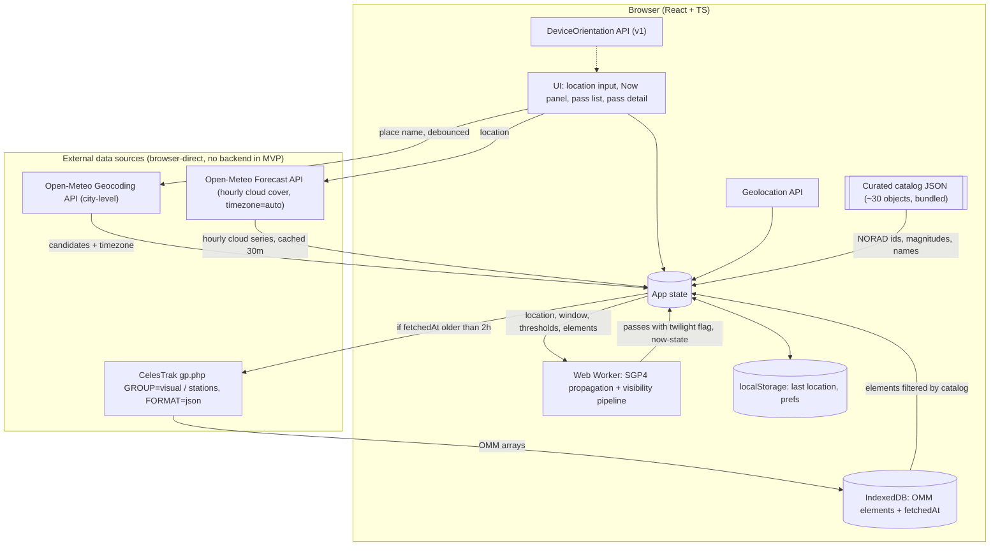

# What Is In Your Sky Right Now — Product Specification

| Field | Value |
|---|---|
| Status | Draft v1.1 — for review. Adds the v1.1 scope "phone pass": goals G12–G14 (§2.4), US-20..US-23, §4.15–§4.21 (feature flags, compact layout and settings, chart legend, sky window, live trajectories and the stripe, the v1 findings, CI time), US-5 AC2 / FR-GUIDE-2b / FR-GUIDE-7 / FR-DESK-2 / FR-DOME-1 / FR-DOME-4 / FR-DOME-6 / FR-LIVE-2 / FR-LIVE-4 / FR-LIVE-6 / FR-LIVE-7 / FR-LIVE-8 / FR-MOON-4 / FR-DESK-3 / FR-DESK-5 amended, §5.8 v1.1 architecture additions, §6.5 WMM row, OQ-16..OQ-20, §8 rows 20–24, §9 Phase 2b, Decision Log V11-1..V11-13. The v1 text (v1.0) is otherwise unchanged. |
| Date | 2026-09-05 (v1.1); 2026-09-03 (v1.0); 2026-09-01 (v0.4) |
| Owner | Ezequiel Baruf |
| Scope of this document | Product + technical specification only. No implementation plan or task breakdown (requested as a separate step). |

---

## 1. Summary

A web app that tells a person standing outside, with no equipment, **which satellites they can see with the naked eye, when, and where to look** — and whether clouds are likely to spoil the view.

The user supplies a location (city or place name, coordinates, or browser geolocation). The app predicts visible passes for the coming hours, ranks them by how good they will be, and for each pass gives plain-language viewing instructions (rise/peak/set direction, maximum elevation, times, duration, expected brightness) plus a cloud-cover warning drawn from a weather forecast.

---

## 2. Goals & Non-Goals

### 2.1 Goals (MVP)

- **G1. Zero-friction start.** A first-time visitor gets a useful answer in under 30 seconds with no sign-up and no API keys to configure.
- **G2. Correct visibility filtering.** Only show passes that are genuinely naked-eye visible: satellite sunlit, observer in darkness, pass high enough above the horizon, predicted brightness above a threshold.
- **G3. Actionable guidance.** Every pass answers "where do I look, when, and for how long?" in words a non-astronomer understands.
- **G4. Honest about weather.** Warn when clouds are likely to block the pass; never silently present a doomed pass as a good one.
- **G5. Cheap to run.** Free or generous-free-tier data sources; near-zero hosting cost; computation pushed to the client where practical.
- **G6. Works on a phone, outdoors, at night.** Mobile-first, dark UI, large tap targets, readable at arm's length.

### 2.2 Non-Goals (explicitly out of scope for MVP)

- Tracking every object in orbit (full catalog, debris, Starlink shells). MVP covers a hand-maintained catalog of ~30 well-known bright objects; the full CelesTrak `visual` group is v1.
- Street-address-precision geocoding. MVP geocodes to city/place level (Open-Meteo geocoding). A pass looks the same from anywhere within a few kilometres, so this costs nothing in accuracy; street addresses and reverse geocoding arrive with the v1 proxy.
- Any first-party backend. MVP is a static site; the browser talks to CelesTrak and Open-Meteo directly. *(amended v1)* The caching proxy moves to Phase 3 (V1-1): v1 stays browser-direct.
- Telescope / binocular targets (faint satellites, geostationary satellites, flares from specific antenna geometry).
- Astrology as prediction. v1 shows Moon lore (zodiac sign, folk names, one-liners) labelled as tradition (FR-MOON-5); the app never claims it affects what is visible. *(amended v1.1, V11-2)* The lore line ships behind a build flag that is off by default (FR-FLAG-1); the observing facts (phase, illumination, glare) are not affected by the flag.
- Iridium-style flare prediction (the original Iridium constellation is deorbited; flare prediction for other constellations is research-grade).
- Radio tracking, Doppler, amateur radio pass planning.
- Live 3D globe / orbit visualisation (Earth-centred, orbital view). The observer-centred sky dome in §4.4 is in scope; a view of the Earth from outside is not.
- User accounts, cloud sync, social features.
- Native mobile apps. *(amended v1)* The app installs as a PWA in v1 (FR-OFF-6); a store app is still out of scope.
- Historical passes ("what did I just see?") — see Roadmap, later phase.
- Guaranteed accuracy for launches < 48 h old or objects during manoeuvres (orbital elements lag reality).
- Commercial use of the free data tiers. If the project ever monetises, several dependencies (Open-Meteo; Nominatim once added in v1) require moving to paid/self-hosted tiers.

### 2.3 Goals (v1)

- **G7. Speaks the visitor's language.** English and Spanish, chosen from the browser, switchable in one tap.
- **G8. Uses a desktop screen.** On a wide screen the location, the Now panel, the pass list and the guide are on screen together; nothing is a phone column in the middle of a monitor.
- **G9. The dome is the signature.** Coloured, detailed, live, and the first thing a pass opens (UX-1 restored).
- **G10. Watch the night unfold.** A full-screen live sky with a timeline for the coming 24 h, scrubbed by hand or played at speed.
- **G11. Works off-grid.** Three nights of passes and forecast, and the app itself, stay usable with no connection.

### 2.4 Goals (v1.1, "phone pass")

- **G12. Readable on a phone.** Every chart is the largest thing on the screen it is on, and nothing the page needs wraps, hides the chart or pushes it down.
- **G13. Explore by pointing.** Hold the phone up and the sky window shows where the passes run in the direction the phone faces.
- **G14. Controls out of the way.** Preferences and the location form live on one settings page on a phone; the home screen is the answer, not the form.

---

## 3. Personas & User Stories

### 3.1 Personas

- **Casual Stargazer (primary).** No astronomy background. Heard "you can see the ISS" and wants to try tonight from the back garden. Uses a phone.
- **Curious Parent / Teacher.** Wants a reliable "show the kids something" moment; needs advance notice and confidence it will actually be visible.
- **Hobbyist Observer (secondary).** Knows what azimuth means. Wants a fast, honest list and the ability to tune thresholds; will notice if predictions are wrong.

### 3.2 User Stories (MVP unless tagged)

Each story has acceptance criteria (AC). "Visible pass" is defined in §4.3.

**US-1 — Provide my location by place name**
As a user, I can type a city, town, or place name and have it converted to coordinates.
- AC1: A single free-text field accepts a place name; results appear as a short pick list (name, region, country) when ambiguous.
- AC2: The resolved place name and coordinates are shown so I can confirm they are right.
- AC3: If geocoding fails or returns nothing, I get a clear message and the option to enter coordinates instead.
- AC4: The UI makes clear that resolution is city-level ("Using the centre of Cipolletti, Rio Negro"); street addresses are not resolved to house precision in MVP.

**US-2 — Provide my location by coordinates**
As a user, I can paste or type latitude/longitude.
- AC1: Accepts decimal degrees (`-34.6037, -58.3816`) and common variants (space-separated, with N/S/E/W suffixes).
- AC2: Validates range (lat −90..90, lon −180..180) with inline errors.
- AC3: Optional altitude (metres) field, default 0.

**US-3 — Use my device's location**
As a user, I can press one button to use the browser's Geolocation API.
- AC1: Button is only shown when the API is available and the page is served over HTTPS.
- AC2: Permission denial shows a non-blocking message and leaves the manual inputs usable.
- AC3: Reported accuracy is displayed if worse than ~1 km; otherwise hidden.

**US-4 — See what is visible right now**
As a user, I see at a glance whether any satellite is visible **at this moment** from my location.
- AC1: A "Now" panel lists satellites currently above the elevation threshold, sunlit, with observer in darkness — or states plainly that none are visible and why (daylight / nothing up / all in shadow).
- AC2: The panel updates at least every 10 seconds without a page reload.
- AC3: For each currently-visible satellite: current azimuth (compass direction + degrees), current elevation, and time remaining until it sets or enters shadow.

**US-5 — See upcoming visible passes**
As a user, I see a list of upcoming visible passes for the next 24 hours (configurable up to 5 nights).
- AC1: Each list item shows: satellite name, start time (local to the *observer location*, not the browser), max elevation, peak compass direction, duration, predicted brightness, and a weather indicator.
- AC2: Passes are sorted chronologically by default; a toggle sorts by "best first" (brightness × elevation). *(amended v1.1)* On compact the toggle labels are "Soonest" and "Best" so the row fits one line (FR-COMP-4); wide keeps "Soonest first" / "Best first".
- AC3: Passes that fail the visibility criteria are not listed (no "hidden but listed" clutter).
- AC4: Time until the next pass is shown as a countdown.

**US-6 — Get step-by-step viewing guidance for a pass**
As a user, I open a pass and get instructions on where and when to look.
- AC1: Text summary in plain language, e.g. *"Appears low in the west-southwest at 21:14:32, climbs to 62° (two-thirds of the way up the sky) in the south at 21:17:50, disappears into Earth's shadow in the east-northeast at 21:20:05. Brighter than any star."*
- AC2: Numeric details: rise/peak/set azimuth (° and 16-point compass), max elevation, start/peak/end times to the second, duration, magnitude, range at peak.
- AC3: A **3D ASCII-rendered sky dome** centred on the observer, with cardinal points labelled on the horizon, the pass drawn as an arc with its peak marked, and rise/set points and direction of travel indicated. I can rotate and tilt the view so I am looking toward the horizon I will actually face.
- AC4: Distinguishes "sets below horizon" from "enters Earth's shadow" as the end condition.
- AC5: A 2D polar (all-sky) chart of the same pass is available as a fallback view, one tap away, built from the same data.

**US-7 — Know whether clouds will ruin the pass**
As a user, each pass tells me whether the forecast suggests clear or cloudy skies.
- AC1: Cloud cover (total, and low/mid/high where available) is fetched for the observer location for the pass time.
- AC2: A three-state indicator: *Clear* (< 30 % total cloud), *Partly cloudy* (30–70 %), *Likely obscured* (> 70 %). Thresholds are constants and appear in the UI tooltip.
- AC3: Forecast timestamp and provider are shown so the user knows how fresh the data is.
- AC4: If weather data is unavailable, the pass is still shown with a "weather unknown" state — weather never blocks pass display.

**US-8 — Remember my last location** *(MVP, minimal)*
As a returning user, the app pre-fills my last-used location.
- AC1: Stored in `localStorage` only; nothing sent to a server.
- AC2: A "clear" action removes it.

**US-9 — Tune visibility thresholds** *(later; was v1, V1-1)*
As a hobbyist, I can adjust minimum elevation, limiting magnitude, and twilight rule.

**US-10 — Point my phone at the sky** *(v1, on the live page)*
As a user, I can hold my phone up and have the live sky turn with me, so the dome shows the horizon I am facing. *(amended v1: the dome's facing follows the compass heading rather than an arrow; FR-LIVE-8.)*

**US-11 — Be notified before a pass** *(v1 / later)*
As a user, I can opt in to a reminder a few minutes before a selected pass.

**US-12 — Share a pass** *(v1)*
As a user, I can copy a link that reproduces this pass view (location + satellite + time) for someone else, or a moment on the live page.
- AC1: A share action on the pass detail and on the live page produces a URL that reproduces the view on the recipient's device by recomputing locally (FR-SHARE-1).
- AC2: On devices with `navigator.share` the system sheet opens; elsewhere the link is copied and the action confirms it.

**US-13 — Read the app in my language** *(v1)*
As a visitor whose browser is in Spanish, I see the app in Spanish without doing anything.
- AC1: On the first visit the language follows the browser: Spanish for `es` and any `es-*` in `navigator.languages`, English otherwise.
- AC2: A `[ EN | ES ]` control in the header switches at once, without a reload; the choice is saved locally and wins over the browser on later visits.
- AC3: Every string the app renders is translated: labels, banners, the guide sentence, compass names, brightness and cloud phrases, the Moon text of US-18, the shortcuts overlay. Satellite names, provider names and place names stay as catalogued.
- AC4: Dates, times and numbers follow the language's conventions through `Intl`, still in the observer's zone (FR-LOC-3).
- AC5: `<html lang>` and the page title follow the active language.

**US-14 — Use the app on a desktop** *(v1)*
As a user at a desk, I see the location, the Now panel and the pass list at once, and a pass opens beside the list instead of covering it.
- AC1: At 100 cells of viewport width and above, the page has two columns: location, favourites, banners, Now panel and Moon line on the left; hero card, sort and pass list on the right.
- AC2: Opening a pass shows the guide in a panel beside the list; the list stays visible and the selected card is highlighted; below the wide breakpoint the full-screen sheet stays.
- AC3: The dome fills the width of its panel at desktop sizes and is drawn at the finer grid that width allows (FR-DOME-1).
- AC4: Keyboard shortcuts work when no input has focus: `j` / `k` next and previous pass, `Enter` open, `Esc` close, `l` live page, `v` chart view, `n` night theme, `?` the list of shortcuts.
- AC5: Column widths and breakpoints are in cells; the layout stays on the character grid (FR-X-6).

**US-15 — Watch the sky live and ahead** *(v1)*
As a user, I open a full-screen live sky that shows what is up now and lets me run the coming 24 h forward.
- AC1: A live page, reachable from the header and from the Now panel, fills the viewport with the dome; the passes of the next 24 h are drawn as arcs and every satellite currently above the horizon has a marker on its arc.
- AC2: A status strip shows the observer's time, the sky state (day, bright twilight, dark), cloud cover at that time and the count of satellites visible at the shown instant.
- AC3: A time stripe under the dome spans now to now + 24 h with each pass marked; I can drag it or use the arrow keys to move the shown instant, and the dome, the markers and the status follow.
- AC4: Play runs the shown instant forward at 1×, 60×, 600× or 3600×; pause stops it; a `now` action returns to real time, which then advances on the 10 s tick.
- AC5: The Sun (a glow on the horizon while it is just below it) and the Moon with its phase are drawn at their positions for the shown instant.
- AC6: Objects above the horizon but not visible are hidden by default; a toggle shows them dimmed with the reason (daylight, in shadow, too faint).
- AC7: On a phone the page works in landscape, and the screen stays awake while the page is open.
- AC8: With permission, the dome faces where the phone faces (US-10); dragging still works and turns following off until it is re-enabled.
- AC9: The URL carries the location and the shown instant, so the page can be shared (US-12) and reloaded.

**US-16 — Take the app off-grid for three nights** *(v1)*
As a user driving to a dark site, the app keeps working with no signal.
- AC1: After any successful load, the app itself, the elements, the location, the forecast and the passes for the next 72 h are stored on the device with no action from me.
- AC2: A line near the location says "Ready offline until <date and time>" from the stored data, or says what is missing.
- AC3: Opening the app with no connection loads it and shows the stored passes, the guide and the live page; weather shows the stored forecast with its age, or "unknown" past its end.
- AC4: The app can be installed: a manifest, an icon, and an install hint shown once when the browser allows it.
- AC5: The pass list can show the three nights grouped under night headings; tonight is the default.

**US-17 — Keep a few places** *(v1)*
As a user, I can save places and switch between them.
- AC1: Save the current location under its label; the list holds up to 8 (a constant).
- AC2: Picking one makes it the observer and recomputes; removing one is one action with no confirmation dialog.
- AC3: Stored locally only (FR-LOC-5). Offline data (US-16) is kept for the active place only.

**US-18 — Know about the Moon** *(v1)*
As a user, I see whether the Moon will wash out a pass, and a little Moon lore.
- AC1: Each pass card and the guide show the Moon's phase and illumination at the pass peak, and a "moon glare" warning when the Moon is up, bright and near the track (FR-MOON-2).
- AC2: The Now panel and the live page show the Moon's phase name, illumination and, when it is up, its direction and elevation.
- AC3: A "Moon tonight" line adds tradition: the zodiac sign the Moon is in, the folk name of the month's full moon when within a day of full, and a curated one-liner for the phase or the sign, in both languages, labelled as tradition (FR-MOON-4, FR-MOON-5).

**US-19 — Use the app in the dark** *(v1)*
As a user outdoors, I switch to a red night theme that keeps my dark adaptation.
- AC1: A `[ night ]` toggle in the header swaps the palette to red on black; the choice is saved locally.
- AC2: Every text pair keeps WCAG AA contrast in the red palette, and the dome and polar colours have night counterparts.

**US-20 — Set things up on a phone without scrolling past the form** *(v1.1)*
As a phone user, I open the app and see what is in my sky; the location form, the language and the theme are one tap away on a settings page.
- AC1: Below the wide breakpoint the header is one row: the title, `[ live ]` and `[ settings ]`. No language or theme control is on the home screen.
- AC2: `#settings` holds, in order: language, theme, the location inputs (place name, coordinates, altitude, use my location, the precision note), saved places with save and remove, and clear saved location. Every change applies at once; there is no save button.
- AC3: The home screen shows a one-line location summary ("Using <label> · [ change ]") that opens the settings page, then the readiness line, the banners, the Now panel, the Moon line, the hero card, the sort row and the list.
- AC4: `Esc`, the page's back control and the browser's back button return to the home screen with the observer, the selection and the list state intact.
- AC5: At and above the wide breakpoint nothing changes: the controls stay where US-14 puts them and no link to `#settings` is shown.
- AC6: No control row on the home screen, the settings page, the pass detail or the live page wraps at 390 px (FR-COMP-4).

**US-21 — Point my phone at the sky** *(v1.1; the home of US-10 on a phone)*
As a user outside, I hold my phone up and see, through it, where the passes run in the part of the sky I am pointing at.
- AC1: On a touch device the chart view control offers a third view, "window". Choosing it asks for orientation permission in that tap and then shows the sky in the direction the phone points.
- AC2: The window shows the horizon with compass names where it is in view, the altitude lines, the arcs of the passes in view with their rise, peak, end and shadow-entry markers, the live marker, the Sun and the Moon, from the same pass geometry as the dome (FR-LIVE-10).
- AC3: Turning, tilting and rolling the phone moves the view smoothly (the FR-GUIDE-6 target), and lifting the phone past the zenith keeps the picture continuous.
- AC4: Where orientation is absent or denied the option is absent or shows a note, and the dome stays the view.
- AC5: On the live page the window shows real time: entering it returns the shown instant to now and hides the time stripe and playback; leaving it brings them back.
- AC6: The heading is true north: the window and the following dome apply the local magnetic declination, and the strip shows it ("true north, declination +2.1°").
- AC7: The chosen chart view is remembered on the device. When the window is the remembered view and the browser needs a tap before it will give orientation, the chart shows a single `[ point at the sky ]` control in the window's place until tapped.

**US-22 — Watch the trajectories appear** *(v1.1)*
As a user on the live page, I move time forward and see each satellite's track appear, grow and fade, instead of a chart full of every arc of the coming day.
- AC1: At the shown instant `t` a pass under way is drawn from its rise to its position at `t`, solid, in its colour, with the marker; the part of the arc ahead of `t` is not drawn.
- AC2: A pass that rises within the next few minutes of shown time (`ARC_LOOKAHEAD`) is drawn faint and dotted over its whole arc with the rise point marked, so I know where to look next.
- AC3: A pass that ended within the last few minutes of shown time (`ARC_LINGER`) stays as a faint full arc without a marker, then disappears.
- AC4: Playing at 3600× reads as trails appearing, growing and fading, at the FR-LIVE-5 rate.
- AC5: The stripe's hour labels, the date at each midnight and the shown instant are readable at arm's length on a phone; the shown instant is a clock readout above the stripe.
- AC6: I can land the shown instant within a minute of a pass's rise in at most three taps on a phone (the method is chosen by the spike, FR-TRAJ-5).
- AC7: The pass detail is unchanged: it keeps drawing the whole arc of the pass it explains.

**US-23 — Read the chart by its legend** *(v1.1)*
As a user, I read which arc is which from a colour-keyed list beside or under the chart, and the drawing itself carries no names or clock times.
- AC1: No satellite name, clock time, Sun or Moon caption or hidden-object reason is drawn inside the dome, the polar chart or the window. Compass names, ring labels and degree ticks stay.
- AC2: A legend under the chart (compact) or beside it (wide) lists every drawn pass: a one-character key that is also drawn at the arc's peak, a swatch in the arc's colour, the name, the rise, peak and end times, and the state at the shown instant.
- AC3: On the pass detail the existing start/peak/end table is the legend: it sits directly under the chart with the key and the swatch, and the other passes drawn dim get one row each; the Sun and the Moon get one line each.
- AC4: Tapping or focusing a row highlights its arc and dims the others; the highlighted pass is listed first.
- AC5: The legend colours match the arcs in both themes, and the key is the channel that survives without colour (FR-DOME-2).

---

## 4. Functional Requirements

Requirements use MUST / SHOULD / MAY (RFC 2119 sense). IDs are stable for traceability into later plan/tasks.

### 4.1 Location

- **FR-LOC-1** The app MUST accept location via (a) free-text city/place name, (b) lat/lon text, (c) browser Geolocation.
- **FR-LOC-2** Place-name geocoding MUST use the Open-Meteo Geocoding API directly from the browser (no key, CORS-enabled), MUST be debounced (≥ 500 ms after typing stops), and MUST cache results per query string for the session, to respect the shared 10 000 calls/day non-commercial limit.
- **FR-LOC-3** The app MUST derive the IANA time zone for the chosen location and display all times in that zone, with the zone abbreviation shown. Open-Meteo returns the zone both in geocoding results and in forecast responses (`timezone=auto`), so no separate lookup library is required in MVP.
- **FR-LOC-4** *(v1)* The app SHOULD reverse-geocode coordinates to a human-readable label (city / region) for display. Open-Meteo has no reverse geocoding; this arrives with the v1 proxy (Nominatim). MVP shows rounded coordinates for coordinate/Geolocation inputs.
- **FR-LOC-5** The app MUST persist the last location locally and MUST NOT transmit it to any first-party server for storage. *(amended v1)* Up to 8 saved places (FR-OFF-7) live in the same local store under the same rule.
- **FR-LOC-6** Geocoding precision in MVP is city/place level. The app MUST NOT imply street-level accuracy in the UI.

### 4.2 Satellite Data

- **FR-SAT-1** The MVP catalog is a **hand-maintained list of ~30 well-known bright objects** (ISS, Tiangong, Hubble, large rocket bodies, etc.) stored as a static JSON file in the repo, keyed by NORAD catalog number, with display name, intrinsic magnitude, category, and short description. The full CelesTrak `visual` group is v1.
- **FR-SAT-2** The browser MUST fetch current GP elements **directly from CelesTrak** (OMM JSON) for the `visual` and `stations` groups (two requests) and filter client-side to the curated catalog. Per-object `CATNR` requests MUST NOT be used (30 requests per client would violate CelesTrak's fair-use policy). If a curated object is absent from both groups it MUST be skipped with a console warning, not an error.
- **FR-SAT-6** Fetched elements MUST be cached in IndexedDB with a `fetchedAt` timestamp. The client MUST NOT re-request from CelesTrak more often than once every 2 hours (enforced against the stored timestamp, across tabs and reloads). On network failure the cached set MUST be used with the epoch-age warning of FR-SAT-4.
- **FR-SAT-3** The app MUST prefer the OMM/JSON representation over classic two-line TLE text. Rationale: the public catalog exceeded 5-digit numbers in July 2026; TLE lines now use Alpha-5 encoding for catalog numbers ≥ 100 000, which OMM avoids.
- **FR-SAT-4** The app MUST display the epoch age of the elements in use and MUST warn when elements are older than 5 days (accuracy degrades; ISS reboosts happen frequently).
- **FR-SAT-5** The curated catalog file (FR-SAT-1) MUST be the single source of per-object metadata and MUST record the provenance of each intrinsic magnitude (source + date) so values can be audited and updated.

### 4.3 Visibility Computation

A pass is **visible** when, for a contiguous interval of time, all of the following hold:

1. **Above horizon threshold.** Satellite elevation ≥ `MIN_ELEVATION` (default 10°; 0° is unusable in practice because of buildings, haze, and atmospheric extinction).
2. **Observer in darkness.** Sun altitude at the observer ≤ `SUN_ALT_MAX` = −6° (after end of civil twilight / before start of civil dawn). **Decided:** passes are listed from −6°; passes whose peak occurs with the sun between −6° and −12° carry a **"sky still bright"** label (only the brightest objects will be seen). User-configurable threshold is v1.
3. **Satellite sunlit.** Satellite is not inside Earth's umbra. Penumbra MAY be treated as lit with a "fading" flag.
4. **Bright enough.** Predicted visual magnitude at peak ≤ `MAG_LIMIT` (default +4.5; roughly what an average suburban sky allows). Every MVP catalog object has a known intrinsic magnitude (FR-SAT-1). When the full `visual` group is added in v1, objects with unknown intrinsic magnitude are shown with "brightness unknown" if the other conditions pass.

- **FR-VIS-1** The app MUST compute passes for a window of at least the next 24 h and at most 5 nights. *(amended v1)* The v1 window is 72 h from the time of computation (FR-OFF-2); the list shows tonight by default and the three nights grouped on request (US-16 AC5); a user-selectable window stays later.
- **FR-VIS-2** Pass boundaries (start, peak, end) MUST be refined to ≤ 1 s precision.
- **FR-VIS-3** For each pass the app MUST report: start time, start azimuth, peak time, peak azimuth, peak elevation, end time, end azimuth, end reason (`horizon` | `shadow` | `twilight`), duration, predicted peak magnitude, range at peak.
- **FR-VIS-4** The pipeline MUST run without blocking the UI thread (Web Worker) and SHOULD complete the 24 h computation for the ~30-object MVP catalog in under 1 s, and for ≈ 200 objects (v1) in under 3 s, on a mid-range 2022 phone.
- **FR-VIS-5** The app MUST recompute when location, window, or thresholds change; and MUST re-evaluate "now" state at least every 10 s using the cached propagation.
- **FR-VIS-6** All thresholds MUST be centralised constants with documented defaults and documented rationale.
- **FR-VIS-7** Each pass MUST carry a `twilight` flag set when the sun altitude at peak is between −6° and −12°; the UI MUST render it as a "sky still bright" label on the pass card and in the guide text.

### 4.4 Observation Guide

- **FR-GUIDE-1** For each pass the app MUST render a plain-language sentence (US-6 AC1) generated from a template, using 16-point compass names and an elevation-to-words mapping (e.g. 10–25° "low", 25–50° "mid-sky", 50–75° "high", > 75° "almost overhead").
- **FR-GUIDE-2** The app MUST render a **3D sky dome as ASCII text**, centred on the observer, showing: the horizon ring with cardinal points (at least N/E/S/W, ideally 8 points) labelled on it; each pass in view as an arc across the dome with its peak marked; rise and set points; direction of travel; and the shadow-entry point where applicable. The user MUST be able to rotate (azimuth) and tilt (pitch) the view, by touch drag and by keyboard, so the dome is seen from the direction they will face. The default view MUST face the pass's rise azimuth at a tilt that shows both horizon and peak.
- **FR-GUIDE-2b** The app MUST also provide a **2D polar (all-sky) chart** of the same pass — horizon as the outer circle, zenith at the centre, altitude rings at 30°/60°, cardinal labels, rise/peak/set and shadow-entry markers — as a fallback view reachable from the dome view. Both views MUST be driven by the same computed pass geometry. *(amended v1.1, V11-5)* The view control offers three views where the device allows it: the dome, the polar chart and the sky window (§4.18); all three are driven by the same computed pass geometry.
- **FR-GUIDE-3** Brightness MUST be expressed both as a magnitude number and a comparison phrase: "brighter than Venus" (≤ −4), "brighter than any star" (−4 to −1.4), "like a bright star" (−1.4 to +1), "like an average star" (+1 to +3), "faint, needs dark sky" (> +3).
- **FR-GUIDE-4** The 2D polar chart MUST be orientation-aware: default "looking up" convention (east on the left, as when lying on your back looking up) with an explicit toggle to map convention (east on the right). The chosen convention MUST be labelled on the chart. The 3D dome needs no such toggle: the user's rotation is the orientation, and the current facing direction MUST be shown as text (e.g. "facing WSW, tilt 35°").
- **FR-GUIDE-5** Both chart views MUST be rendered in the DOM only — text nodes and ordinary elements (with SVG permitted for the 2D chart). **No WebGL and no `<canvas>`.** Rationale: the ASCII dome is the product's visual signature and must be selectable, zoomable, and styleable like the rest of the page; DOM rendering also keeps the CSP strict and testing simple. *(amended v1, V1-4)* The CSP MAY allow inline `style` attributes (`style-src-attr 'unsafe-inline'`) so the rasteriser can colour glyphs (FR-DOME-2); `style-src-elem`, `script-src` and every other directive stay `'self'`.
- **FR-GUIDE-6** The dome MUST re-render smoothly enough for interactive rotation on a mid-range 2022 phone (target ≥ 30 updates/s while dragging) at the default grid size; grid size MAY reduce on small screens.
- **FR-GUIDE-7** Chart views MUST carry a text alternative (the FR-GUIDE-1 sentence and the numeric table) and the character grid MUST be hidden from assistive technology so screen readers are not read a wall of symbols. *(amended v1.1, V11-6)* The legend (§4.17) is part of the text alternative and is exposed to assistive technology as a list.

### 4.5 Weather

- **FR-WX-1** The app MUST fetch an hourly cloud-cover forecast for the observer location covering the prediction window. *(amended v1)* The window is 72 h, so the request asks for four forecast days (FR-OFF-3).
- **FR-WX-2** For each pass, cloud cover MUST be interpolated to the pass peak time from the two nearest hourly values.
- **FR-WX-3** The three-state indicator (US-7 AC2) MUST be shown per pass; the "Now" panel MUST show current cloud cover.
- **FR-WX-4** Where the provider supplies low/mid/high layer cloud, the indicator SHOULD weight low + mid cloud more heavily than high cloud (thin cirrus often still permits seeing bright satellites).
- **FR-WX-5** Weather fetch failure MUST degrade gracefully (US-7 AC4). Weather MUST be cached for 30 min per location cell (rounded to 0.1°).

### 4.6 Cross-Cutting

- **FR-X-1** Mobile-first responsive layout; dark theme by default; optional red-tint "night vision" mode (v1, specified in §4.14). *(amended v1)* "Responsive" includes the wide layout of §4.8.
- **FR-X-6** **Visual identity: monospace / terminal aesthetic across the whole UI** — a monospace typeface everywhere, character-grid-aligned layout where practical, box-drawing or plain-character borders, restrained colour on a dark ground, no photographic imagery. The ASCII sky dome must read as a natural part of the interface, not a widget dropped into a conventional web page.
- **FR-X-2** Every external data source MUST be credited in a footer (CelesTrak; Open-Meteo for weather and geocoding, whose geocoding data derives from GeoNames) as their terms require. OpenStreetMap/Nominatim attribution is added in v1 when the proxy introduces it. The footer MUST also name who made the page, linked to their profile. At wide widths it says all of this in one row rather than four (D-120): every source still named, still linked, and still under the licence it is used with.
- **FR-X-3** No analytics or tracking in MVP beyond anonymous, aggregate error logging.
- **FR-X-4** The app MUST function offline for the already-computed pass list, and MUST be able to recompute from IndexedDB-cached elements for a new location without network (weather then shows "unknown"). *(amended v1, V1-6)* The app shell itself MUST load offline through a service worker, and the stored forecast stays usable offline past its TTL with its age shown (§4.11). PWA install is v1 (FR-OFF-6).
- **FR-X-5** Accessibility: WCAG 2.1 AA colour contrast; chart information duplicated in text; keyboard navigable.

### 4.7 Language *(v1)*

- **FR-I18N-1** The app MUST ship English and Spanish. On the first visit the language is chosen from `navigator.languages`: the first entry whose primary subtag is `es` selects Spanish, otherwise English. A saved preference, set through the header control, MUST win over the browser afterwards.
- **FR-I18N-2** All user-visible strings MUST come from one typed message catalog per language. A message missing from either catalog MUST be a type error at build time, never a runtime fallback to the other language. Template sentences (FR-GUIDE-1, FR-GUIDE-3, cloud verdicts, elevation words, compass names, the Moon text) are messages with parameters, so word order and agreement can differ per language.
- **FR-I18N-3** Spanish MUST be neutral and impersonal: no `tú`, no `vos`, no `usted`. Instructions describe the sky ("Aparece bajo en el oeste-suroeste a las 21:14"), never address the reader.
- **FR-I18N-4** Dates, times, numbers and lists MUST be formatted through `Intl` with the active language and the observer's zone (FR-LOC-3). Degrees, magnitudes and compass abbreviations (N, NE, …) are identical in both languages; spelled-out compass names are translated.
- **FR-I18N-5** `document.documentElement.lang` and the document title MUST follow the active language. Switching MUST NOT reload the page or lose the observer, the selection or the live page's instant.
- **FR-I18N-6** The language is a preference, not a route: no path prefix, no URL parameter. Catalogued names (satellites, data providers, places returned by geocoding) are never translated.

### 4.8 Desktop layout *(v1)*

- **FR-DESK-1** Breakpoints are in cells (`--cell`, FR-X-6): *compact* below 100 cells of viewport width, *wide* at 100 cells and above (about 960 px at the 16 px base). Column and panel widths are in cells.
- **FR-DESK-2** Wide: two columns. The left column is fixed at 40 cells and holds, in order, location (inputs, favourites, clear), the elements banners, the Now panel and the Moon line (FR-MOON-3). The right column fills the rest and holds the hero card, the sort control and the pass list. The header spans both columns and carries the title, the tagline and, at the right, the language, night-theme and live-page controls. *(amended v1.1, V11-8)* The live-page control leaves the right-hand group: `[ Live sky ]` sits on the title line beside the title, as navigation; the right of the header holds the language and night-theme controls on one baseline row, aligned in cells. The Now panel keeps its own live link (FR-LIVE-1).
- **FR-DESK-3** Wide: a selected pass opens the guide in a panel beside the list. The right column splits into the list (44 cells minimum) and the guide (the rest); the list stays scrollable and the selected card is highlighted; `Esc` or the close control closes the panel. Compact keeps the full-screen sheet of MVP. The selection stays in the URL hash (D-13) in both cases. *(amended v1.1, V11-13)* Between the wide breakpoint and the width at which the 44-cell list and a 40-cell guide both fit (`WIDE_SPLIT_MIN_CELLS`, default 124 cells, a constant pinned by the breakpoint test), an open guide takes the whole right column and the list is one `[ list ]` control away, the way the compact sheet works; the split returns at that width. The guide column MUST never be narrower than 40 cells while open.
- **FR-DESK-4** Keyboard shortcuts, active when no input or button has focus and listed in an overlay opened with `?`: `j` / `k` move the selection down and up the list, `Enter` opens it, `Esc` closes the guide or the overlay, `l` opens the live page, `v` toggles the chart view, `n` toggles the night theme. Shortcuts are single keys with no modifier and MUST NOT collide with browser or screen-reader defaults.
- **FR-DESK-5** A desktop mockup approved by the owner is the visual reference for the wide layout (V1-3). Every desktop task ships 1280 px captures for comparison (the `visual-review` skill), alongside the 390 px ones. *(amended v1.1, V11-13)* Wide captures are shot at 1024 px as well as 1280 px for the home and guide screens; the D-179 capture set gains the 1024 px profile.

### 4.9 Sky dome, second pass *(v1)*

The R15 dome reads as a wire cage: rings, meridians and arc in one colour at nearly one weight, seen from a tilt that flattens the bowl into a disc. FR-DOME-1..7 say what the second pass must show; FR-DOME-8 says how the composition is chosen, because none of the layered settings below has been tried in the real rasteriser yet (V1-10).

- **FR-DOME-1** No frame around the dome. The drawing fills the width of its container up to the container's height, and the raster grid follows the drawing's size (the cell keeps its 390 px proportions, D-65's scaling continues, and the column count grows with the width), so the dome on a desktop panel is a larger and finer drawing, not a scaled-up phone one. *(amended v1.1, V11-4)* "Fills the width" is now a rule with a number: the drawing's extent, labels included, MUST cover at least 90 % of the shorter side of its box at every width (PLAN D-177's fit rule); the compact box itself is set by FR-COMP-5.
- **FR-DOME-2** Colour by meaning, from tokens in `tokens.css` with a value in each theme: the highlighted pass, the other passes (dim), the peak marker, the shadow-entry marker, the current-position marker, the flown part of an arc, the horizon ring, the altitude rings, the compass labels, the Sun glow and the Moon. Colour is never the only channel: line weight and glyph keep the monochrome reading (FR-X-5).
- **FR-DOME-3** Orientation cues: a mark at the observer's position at the centre of the ground; a ground fill (hatched or dimmed disc) below the horizon so up and down read at a glance; compass names that never overlap pass labels (a label that would collide moves along its ring, in the order compass, peak, rise, end).
- **FR-DOME-4** More detail: horizon ticks every 10° with the degree number every 30°; the 30° and 60° rings labelled; the pass arc labelled with the clock time at rise, peak and end; the direction of travel as an arrowhead at the arc's end. *(amended v1.1, V11-6)* The clock times at rise, peak and end move to the legend (FR-LEG-1); the arc keeps its markers and the arrowhead and gains the legend key at its peak.
- **FR-DOME-5** Live marker: when the instant shown (real time on the detail sheet, the shown instant on the live page) falls inside a pass, the satellite's position is drawn on its arc and the flown part of the arc is drawn in the "flown" colour. The position is interpolated from `Pass.track` (10 s samples); no worker call is made for it.
- **FR-DOME-6** Sun and Moon at the shown instant: the Sun as a glow on the horizon ring at its azimuth while its altitude is between −18° and 0° (wider and brighter the closer to 0°), the Moon as a marker with a phase glyph when above the horizon, both labelled. *(amended v1.1, V11-6)* "Both labelled" means a line each in the legend; the drawing carries the glow and the phase glyph only.
- **FR-DOME-7** The dome is the default chart view again (UX-1 as written; D-68 closed by V1-4); the polar chart stays one toggle away with all its features and gains the Sun and Moon markers, the live marker and the colours of FR-DOME-2 so both views keep telling the same story. FR-GUIDE-2 interaction and FR-GUIDE-6 performance are unchanged: colour MUST NOT drop the drag rate below the FR-GUIDE-6 target.
- **FR-DOME-8** Layers, and the spike that fixes them. The dome is drawn as layers, not as one wireframe: (a) a *base* layer for surfaces (the ground disc, a sky bowl shaded from the horizon to the zenith, the Sun glow), rendered in glyphcss's solid mode with the scene's directional light set to the Sun's real direction so twilight shows on the right side of the sky; (b) the *line* layer for the horizon, rings, meridians, arcs and markers in braille wireframe; (c) the highlighted pass and the live marker at a finer density than the base grid (glyphcss per-mesh density) so the arc is the sharpest thing on screen; (d) at most one effect (a soft pulse on the live marker), and only while the FR-GUIDE-6 rate holds. All layers share one camera state (PLAN D-64) so they cannot drift. The composition (tilt default in 35°–55°, which meridians are drawn, weights, the exact colours, whether the pulse stays) MUST be fixed by a half-day spike in `spike/` before the implementation task is cut: one page with every knob as a URL parameter, captures at 390 px and 1280 px of the same two fixture passes (the golden grazing pass and the synthetic high pass of R14), the D-62 drag-rate measurement for each candidate, and a findings file the owner picks from. The polar chart is not affected.

### 4.10 Live sky page *(v1)*

- **FR-LIVE-1** A page at `#live` fills the viewport with the dome, a status strip and a time stripe. It is reachable from the header control and from the Now panel, and `Esc` or the header returns to the home page. It is inert with a one-line message when there is no observer or no elements.
- **FR-LIVE-2** Content at the shown instant `t`: every pass with `start ≤ now + 24 h` and `end ≥ now` drawn as an arc coloured per satellite (a palette of at least 6 distinguishable hues per theme, assigned in pass order); a marker on each pass whose interval contains `t`; the Sun and the Moon per FR-DOME-6; hidden objects per FR-LIVE-6. *(amended v1.1, V11-7)* Which of those passes are drawn at `t`, and how much of each arc, is set by FR-TRAJ-1; the palette and the per-satellite colour rule are unchanged.
- **FR-LIVE-3** Status strip: `t` in the observer's zone with the zone abbreviation; the sky state in words (day, bright twilight, dark; `SkyState`); cloud cover interpolated to `t` (FR-WX-2) or "unknown"; the count of satellites visible at `t`; the Moon's phase and illumination; while playing, the speed.
- **FR-LIVE-4** Time stripe: horizontal, `now` at the left edge and `now + 24 h` at the right, hour ticks, night shading from the sun altitude (the three `SkyState` bands), each pass a segment in its arc's colour. Drag, click and arrow keys (1 min; with Shift 10 min) set `t`; `t` clamps to the span; the shown instant is marked with a cursor and its clock time. *(amended v1.1, V11-7)* The stripe's layout and text are re-specified in FR-TRAJ-4 and the touch stepping in FR-TRAJ-5; the span, the shading, the clamp and the keyboard steps stand.
- **FR-LIVE-5** Playback: play and pause; speeds 1×, 60×, 600× and 3600× (24 h in 24 s); a `now` action returns `t` to real time, which then advances with the 10 s tick; playing stops at the end of the span. Target: ≥ 30 updates/s at 3600× on the FR-GUIDE-6 device. The worker is never called per frame: satellite positions come from the tracks (FR-DOME-5); the Sun and Moon are evaluated on the main thread at most once per second of wall time.
- **FR-LIVE-6** Objects above the horizon at `t` but not visible (daylight, in shadow, too faint) are hidden by default. A toggle draws them dimmed with a reason label. Their positions come from the worker for the instant `t` (a `computeAt` request, the Now pipeline at an arbitrary time), throttled to one request per 250 ms of wall time while scrubbing or playing. *(amended v1.1, V11-6)* The reason label is a legend row (FR-LEG-3); the dimmed position on the drawing carries the legend key only.
- **FR-LIVE-7** Layout: portrait stacks dome, strip and stripe; landscape on a phone puts the dome on the left and the strip and stripe on the right. The page requests a Screen Wake Lock while it is visible and releases it when hidden; where the API is unsupported nothing is shown. *(amended v1.1, V11-4)* Portrait on compact: the one-row header (FR-COMP-1), the dome box (FR-COMP-5), the status strip in two lines, the stripe block (FR-TRAJ-4) and at most two rows of controls, every row within FR-COMP-4. The "drag the dome" hint is not shown on the live page. In window mode (FR-WIN-6) the stripe block and the playback row are absent.
- **FR-LIVE-8** Compass follow (US-10): a `[ follow phone ]` control requests `DeviceOrientationEvent` permission where required (iOS `requestPermission()`, HTTPS) and turns the dome's facing to the device heading (`absolute` events or `webkitCompassHeading`; relative-only devices show a note). A drag turns following off; the control turns it on again. The control is hidden where the API is absent (desktop). *(amended v1.1, V11-5)* The control belongs to the dome view. In the sky window (§4.18) following is implicit and the control is not shown. *(amended v1.1, V11-12)* The heading is corrected to true north as FR-WIN-3 says; the control is hidden on the polar view, which does not consume the facing.
- **FR-LIVE-9** URL state: `#live?lat=&lon=&alt=&t=`, `t` an ISO-8601 instant or absent for real time. Loading such a URL sets the observer (label from the rounded coordinates until geocoded, source `coords`) and `t`. The hash is updated while scrubbing at most twice per second and never while playing.
- **FR-LIVE-10** The live page reuses `SkyChartProps` with `now = t` and a `passes` array; nothing in the live page draws satellites by any other path (FR-GUIDE-2b's "same geometry" rule).

### 4.11 Offline for three nights *(v1)*

- **FR-OFF-1** A service worker precaches the app shell (HTML, JS, CSS, the braille font, the manifest, icons) in a versioned cache and serves it cache-first. A new version activates on the next load and shows a "new version ready, reload" banner. The worker MUST NOT cache CelesTrak or Open-Meteo responses: those live in IndexedDB under FR-SAT-6 and FR-WX-5.
- **FR-OFF-2** The computation window is 72 h from the time of computation (FR-VIS-1 as amended). Passes are stored in IndexedDB with `computedAt`, the observer and the elements epoch; with no network they are shown as stored, with their age in the readiness line.
- **FR-OFF-3** The forecast covers at least 72 h (`forecast_days=4`) and is stored with `fetchedAt`. With no network it stays in use past the 30 min TTL with an "as of <time>" note on the cloud badge; hours past its end show "unknown" (FR-WX-5 still applies online).
- **FR-OFF-4** A readiness line under the location states "Ready offline until <date time>" (the earliest of the stored passes' end and the forecast's end) and the storage time, or names what is missing (no elements, no forecast, no passes).
- **FR-OFF-5** Storage is automatic on every successful load and recompute. There is no "prepare" action.
- **FR-OFF-6** PWA: a web manifest with one name (the manifest is not localised), icons at 192 and 512 px in the terminal identity, `display: standalone`, dark theme colour. An install hint is shown once when `beforeinstallprompt` fires (and an iOS "Add to Home Screen" note where that event never fires), dismissible and remembered.
- **FR-OFF-7** Favourites (US-17): up to 8 observers in the local prefs; the active observer is either one of them or ad hoc. Selecting one triggers the FR-VIS-5 recompute.
- **FR-OFF-8** With no network, everything that needs it fails soft: place search says it is offline, device location still works, the live page and the guide run from the stored passes, and the elements banner says the age of what is in use (FR-SAT-4).

### 4.12 Moon *(v1)*

- **FR-MOON-1** `astronomy-engine` supplies the Moon's phase angle, illuminated fraction, altitude, azimuth and ecliptic longitude at any instant. Phase names (new, waxing crescent, first quarter, waxing gibbous, full, waning gibbous, last quarter, waning crescent) come from the phase angle with band boundaries as constants.
- **FR-MOON-2** Moon glare for a pass: Moon altitude > 0° at the pass peak AND illuminated fraction ≥ 50 % AND angular separation between the Moon and the pass peak < 30°. Thresholds are constants shown in the tooltip. The card shows a `[moon glare]` label; the guide adds one sentence ("The Moon is bright and close to the track.").
- **FR-MOON-3** The Now panel and the live strip show the phase name, the illumination percentage and, when the Moon is up, its compass direction and elevation.
- **FR-MOON-4** Tradition ("Moon tonight"): the tropical zodiac sign from the Moon's ecliptic longitude (30° per sign from 0° Aries); the folk name of the full moon by calendar month (the widely used North American list, noted as Northern-hemisphere tradition), shown within one day of full; and a curated one-liner per phase and per sign. All of it lives in a static JSON in both languages with no external source, in the same style as the catalog (FR-SAT-5): one file, reviewed by hand. *(amended v1.1, V11-2)* Rendered only when the build flag of FR-FLAG-1 is on; off by default.
- **FR-MOON-5** Tradition text MUST be labelled as tradition ("lore" / "tradición") and MUST NOT be worded as a prediction or as observing advice. The observing facts (phase, glare) are separate lines that never depend on the tradition text.

### 4.13 Share *(v1)*

- **FR-SHARE-1** A share action on the pass detail builds `#pass?lat=&lon=&alt=&norad=&start=` (start as an ISO-8601 instant); the live page's share builds FR-LIVE-9's form. The recipient's browser recomputes locally: no server, no shortener, no tracking.
- **FR-SHARE-2** `navigator.share` where available (title, text with the guide sentence, URL); elsewhere the URL is copied to the clipboard and the action confirms it inline.
- **FR-SHARE-3** Opening a pass link whose pass is no longer in the window selects the nearest pass of that satellite in the window, or shows a message naming the satellite and the original time.

### 4.14 Night theme *(v1)*

- **FR-THEME-1** A red-on-black palette: every token in `tokens.css` has a night value; the header toggle sets `data-theme="night"` on the root element; the choice is saved in the local prefs and applied before first paint.
- **FR-THEME-2** Contrast: every text pair ≥ 4.5 : 1 and non-text ≥ 3 : 1 in the night palette, pinned by the existing tokens test extended to both themes.
- **FR-THEME-3** The dome and polar colours (FR-DOME-2), the Sun glow, the cloud badge and the live stripe have night counterparts; no element keeps a non-red hue in night mode.

### 4.15 Feature flags *(v1.1)*

- **FR-FLAG-1** A build-time flag `VITE_MOON_LORE` (`on` | `off`, default `off`, read from the environment at build) controls the tradition line (FR-MOON-4, FR-MOON-5). Off: the lore component is not rendered, its data file is in no chunk of the build, and no lore string reaches the DOM. On: v1 behaviour. The flag is read in exactly one module and exposed as a typed constant; no other code reads the environment. The observing facts (FR-MOON-1..3) and the Moon on the charts do not depend on it.
- **FR-FLAG-2** Both states are tested: the component and its copy under `on` (the existing tests, run with the flag set), the default capture set (D-179) under `off`, and a build test that fails when the lore data is present in `dist/` with the flag off. The flag's value is printed in the build log.

### 4.16 Compact layout and settings *(v1.1)*

"Compact" is FR-DESK-1's breakpoint: below 100 cells of viewport width.

- **FR-COMP-1** Compact header: one row of at most 36 cells (a 390 px viewport at the default cell): the title, `[ live ]` and `[ settings ]`. The tagline is not shown on compact. The wide header is FR-DESK-2 as amended.
- **FR-COMP-2** A settings page at `#settings`, in this order: Language (FR-I18N-1's control), Theme (FR-THEME-1's control), Location (the FR-LOC-1 inputs, the device-location button, the precision note of US-1 AC4), Saved places (FR-OFF-7), Clear saved location. Every change applies and is saved at once as it does today; there is no save action. `Esc`, the page's `[ ← Back ]` control and the browser's back return to the home screen; the hash is the only route state (D-13), so a reload on `#settings` reopens it. The route exists at every width; only the compact header links to it.
- **FR-COMP-3** Compact home, after the header and in this order: a one-line location summary ("Using <label> · [ change ]", with the accuracy note of US-3 AC3 when it applies) that opens `#settings`; the readiness line (FR-OFF-4); the elements banners; the Now panel; the Moon line; the hero card; the sort row; the list; the footer. With no observer the summary is the prompt to set one and opens `#settings`.
- **FR-COMP-4** Control-row fit: every row of controls the compact layout renders MUST fit in 36 cells without wrapping: the header, the sort row ("Sort: [x] Soonest [ ] Best"), the chart view control, the live page's playback rows, the share and follow actions. A unit test renders each control row's text at compact and asserts its cell count. Labels MAY differ between compact and wide (US-5 AC2); meaning may not.
- **FR-COMP-5** The chart box on compact: full-bleed (it spans the viewport width and ignores the page padding) and never shorter than it is wide. On the pass detail the box is a square. On the live page in portrait the box takes the height left by the header row, the two-line strip, the stripe block and the control rows (FR-LIVE-7 as amended), and at least its own width. The drawing fills the box under FR-DOME-1's 90 % rule; the cell keeps D-65's rule, so the grid gains rows and columns rather than the cell growing.
- **FR-COMP-6** A 390 px mockup set approved by the owner is the visual reference for the compact home screen, the settings page and the pass detail with its legend, in both themes, kept in `docs/mockups/`; the tasks that build those screens are gated on it as R23 was on FR-DESK-5. The live page's compact layout is not mocked up: it follows the spike of FR-WIN-7. Every task of this phase ships 390 px captures in both languages and both themes for the screens it changes, and 1280 px captures where the wide layout changed.

### 4.17 Chart legend *(v1.1)*

- **FR-LEG-1** The dome, the polar chart and the sky window draw no satellite name, no clock time, no Sun or Moon caption and no hidden-object reason. They keep: compass names, the 30°/60° ring labels and degree ticks, the markers (rise, peak, end, shadow entry, live position), the arrowhead, the Sun glow, the Moon glyph and, new, a one-character *key* at each drawn arc's peak marker (and at a hidden object's dimmed position). Keys are `A`, `B`, `C`… in legend order.
- **FR-LEG-2** Placement: under the chart on compact, at the right of the chart on wide (24 cells minimum), the same in all three views. The legend is rendered from the same props as the chart (FR-LIVE-10's rule) and lists exactly the passes the chart draws, in the states it draws them.
- **FR-LEG-3** A row per drawn pass: the key, a two-cell swatch in the arc's colour, the name, the rise, peak and end clock times in the observer's zone, and the state at the shown instant: `up` (marker on the arc), `soon` (lookahead, FR-TRAJ-1), `gone` (linger), `in shadow`, `daylight`, `too faint` (the FR-LIVE-6 reasons). On the pass detail the FR-GUIDE-1 numeric table is the legend: it moves directly under the chart, its heading carries the key and the swatch, it adds the shadow-entry row where one applies, and the other passes drawn dim get one row each (key, swatch, name, rise and end times). The Sun and the Moon get one line each with azimuth and altitude at the shown instant and, for the Moon, the phase glyph.
- **FR-LEG-4** Interaction: a tap or click on a row, or keyboard focus on it, highlights its arc (full colour and weight) and dims the others until another row or the chart is activated; on the pass detail the explained pass is highlighted by default and listed first; on the live page the first row is the pass whose marker is nearest the zenith. Rows are buttons; the list is the text alternative of FR-GUIDE-7.
- **FR-LEG-5** Colours: the swatches use the arc tokens (FR-DOME-2, FR-LIVE-2's palette) with their night values (FR-THEME-3), and text on the swatch row keeps FR-THEME-2's contrast. The key is the channel that carries the mapping without colour.

### 4.18 Sky window *(v1.1)*

- **FR-WIN-1** A third chart view, "window": a 2D projection of the sky as seen from the observer in the direction the device points, drawn in SVG (FR-GUIDE-5 permits it for 2D) from `SkyChartProps` (FR-LIVE-10). Nothing in the window draws satellites by any other path. The field of view (`WINDOW_FOV`, default 60° across the shorter side) and the projection (gnomonic or stereographic) are constants fixed by the spike (FR-WIN-7).
- **FR-WIN-2** Content: the horizon line with compass names along it where it is in view; the altitude lines at 30° and 60° and a zenith mark; azimuth ticks every 30° on the horizon; the arcs of the passes that cross the view with their rise, peak, end and shadow-entry markers and the arrowhead; the live marker and the flown part (FR-DOME-5); the Sun glow and the Moon glyph (FR-DOME-6); the legend keys at the peaks (FR-LEG-1). Colours per FR-DOME-2 and FR-LIVE-2; the legend of §4.17 applies.
- **FR-WIN-3** Orientation: heading, pitch and roll from `DeviceOrientationEvent` (an `absolute` event or `webkitCompassHeading`, as FR-LIVE-8), taken as one rotation so the view stays continuous past the zenith and when the phone rolls; the screen's orientation is applied. A smoothing constant (`WINDOW_SMOOTHING`, default fixed by the spike) steadies the sensor. Target: ≥ 30 updates/s on the FR-GUIDE-6 device; the worker is never called for the view. Heading is corrected to true north with the local magnetic declination from the World Magnetic Model at the observer's position, computed once per observer on the main thread; the strip names the correction ("true north, declination +2.1°"). The same correction applies to FR-LIVE-8.
- **FR-WIN-4** Availability and permission: the window is offered only where FR-LIVE-8's presence test passes (a touch device with the constructor). Permission is requested in the tap that chooses the view or the `[ point at the sky ]` control, never on load. A denial shows a one-line note and leaves the dome as the view; a relative-only device (no heading) shows FR-LIVE-8's note and does not offer the window. Desktop never sees the option.
- **FR-WIN-5** The chart view (dome, polar, window) is a saved preference on the device. When the window is the saved view and orientation still needs a tap, the chart area shows one `[ point at the sky ]` control in the window's place until tapped. The window has no manual pan or drag: the dome is the hand-driven view.
- **FR-WIN-6** On the live page, entering the window returns `t` to real time (FR-LIVE-5's `now` action), hides the stripe block and the playback row and keeps the two-line strip; leaving it restores them. The pass detail's window draws the whole arc (FR-DOME-5); the live page's window follows FR-TRAJ-1.
- **FR-WIN-7** The spike. Before the window task or the stripe-stepping task is cut, a half-day spike in `spike/` fixes: the projection and `WINDOW_FOV`; the sensor path on iOS Safari and Android Chrome (permission flow, absolute versus relative readings, screen rotation, roll; the D-175 assumption about `webkitCompassHeading`); the smoothing; the update rate by the D-62 method; and the touch stepping of the stripe (FR-TRAJ-5) among its candidates. One page with every knob as a URL parameter, captures at 390 px, and a findings file the owner picks from. The owner runs the spike with the session, on a phone, not headless (V11-9).

### 4.19 Live trajectories and the stripe *(v1.1)*

- **FR-TRAJ-1** What the live page draws at the shown instant `t`, per pass in FR-LIVE-2's set: with `start ≤ t ≤ end`, the arc from the rise to the position at `t`, solid, in its colour, with the marker; the part beyond `t` is not drawn. With `t < start ≤ t + ARC_LOOKAHEAD`, the whole arc faint and dotted with the rise point marked and no marker. With `t − ARC_LINGER ≤ end < t`, the whole arc faint, no marker. Otherwise not drawn. Hidden objects (FR-LIVE-6) are unchanged: dimmed positions, no arcs.
- **FR-TRAJ-2** `ARC_LOOKAHEAD` default 5 min and `ARC_LINGER` default 10 min, both in shown time, centralised with the other thresholds (FR-VIS-6) with their rationale: long enough to see where to look next and what just passed at 60×, short enough that the chart does not fill at 3600×.
- **FR-TRAJ-3** FR-TRAJ-1 applies to the dome, the polar chart and the window on the live page at every width. The pass detail is not affected: it keeps the whole arc of the explained pass and the dim arcs of the others (FR-DOME-5). The legend lists exactly the drawn passes with their FR-TRAJ-1 states (FR-LEG-3).
- **FR-TRAJ-4** The stripe: three rows in body-size cells. Row 1: hour labels, every 2 h on wide and every 3 h on compact, with the date (day and month, short) at each midnight crossing. Row 2: the band, with FR-LIVE-4's night shading and a tick every hour. Row 3: the pass segments in their arc colours. A cursor crosses all three rows at `t`, and a clock readout in the observer's zone (hours and minutes, and the weekday when `t` is not today) stands above the stripe in the heading size. The stripe is at least 36 cells wide on compact; wider viewports scale it to the box.
- **FR-TRAJ-5** Touch stepping: the spike (FR-WIN-7) chooses among step buttons (`[ −1 h ] [ −10 min ] [ +10 min ] [ +1 h ]` under the stripe), tapping a pass segment to jump `t` to that pass's rise, and a slow-scrub gesture; the arrow keys keep FR-LIVE-4's 1 min and 10 min steps. Whatever is chosen MUST let the user land `t` within 1 min of a pass's rise in at most three taps (US-22 AC6) and MUST fit FR-COMP-4.

### 4.20 The v1 findings *(v1.1)*

Every v1 task PR was merged with its review findings open (V1-11's gate merges on the owner's word, not on a clean review). They are listed here so the phase closes them, with the PR they came from and the lane that owns the code. The wording is the reviewer's, shortened.

- **FR-FIX-1** Each finding below MUST be closed by a change with a test that fails on the old code, or recorded as *already fixed on main* with the commit that fixed it, or moved to Phase 3 by an explicit Decision Log row. A findings task per lane (V11-11) carries them; a finding whose code a v1.1 feature task rewrites MAY be closed by that task instead, named in its acceptance.
- **FR-FIX-2** Findings that are e2e or CI defects (F-33, F-34, F-36, F-37, F-38) are closed in the first wave together with §4.21, before any feature task runs.

| ID | From | Lane | Finding |
|---|---|---|---|
| F-1 | R22 #48 | chart | A failed dynamic import of the astronomy chunk is memoised, so the Sun and Moon stay absent for the session and the dome falls back to the default key light. |
| F-2 | R22 #48 | chart | The flown strip drops the `omit` gap, so the dashed direction-of-travel tail is painted over once `now` passes 80 % of the arc. |
| F-3 | R22 #48 | chart | The polar Sun label is drawn under the grid, so rings, ticks and arcs draw over it. |
| F-4 | R22 #48 | chart | A fixed 4° sampling step leaves the twilight glow up to 2° off the Sun's azimuth on the polar chart. |
| F-5 | R22 #48 | chart | The flown strip ignores `highlighted`, so a dim pass's flown half outshines the highlighted one. |
| F-6 | R23 #39 | ui | Between 960 px and about 1350 px the list pins at its 44-cell floor and the guide collapses to 43–107 px (FR-DESK-3 as amended). |
| F-7 | R23 #39 | ui | The document `Escape` listener has no guard, so an `Escape` meant for the place picker's suggestions also closes the guide and clears the hash. |
| F-8 | R23 #39 | ui | Opening a second pass reuses the `PassDetail` instance, so the new heading is never focused and closing returns focus to the first opener. |
| F-9 | R23 #39 | ui | The list's fixed `max-height` (34 rows) is taller than a 720 px laptop viewport. |
| F-10 | R23 #39 | ui | The "0.6 em advance" the 960 px derivation and the breakpoint test rely on is false for Consolas (0.55 em); the breakpoint is 109 cells on Windows. |
| F-11 | R26 #49 | data | `addFavourite` re-sorts by `lastUsedAt`, so on a full list a stamp newer than `at` pushes the just-saved entry off the end. |
| F-12 | R26 #49 | data | A favourite saved before the forecast resolves keeps `timeZone: null` forever, so offline selections render every time in UTC. |
| F-13 | R26 #49 | data | The `Favourite` doc block still describes `id` as the cell while the field is `cellKey`. |
| F-14 | R30 #44 | ui | US-18 AC1 is half done: the Moon's phase and illumination never appear on a pass card or in the guide unless glare is set. |
| F-15 | R30 #44 | ui | The minimum-altitude glare condition is hard-coded into both catalogs as prose, unlike the other two thresholds. |
| F-16 | R30 #44 | ui | A leftover debug script is untracked in the tree and inside ESLint's glob. |
| F-17 | R31 #50 | ui | A share link stays authoritative while it is in the hash: a recipient typing their own coordinates has the detail unmounted and re-opened from the link. |
| F-18 | R31 #50 | ui | The FR-SHARE-3 substitute pass opens without its explanation while the job is still computing. |
| F-19 | R31 #50 | ui | Altitude bounds are copied from `CoordsInput` instead of shared, so the form can emit links the parser rejects. |
| F-20 | R31 #50 | ui | An uncommitted scratch Playwright config hard-codes a port with `reuseExistingServer: true`. |
| F-21 | R27 #52 | ui | Every warm start flashes "Not ready offline: no orbital elements and cloud forecast" before the requests return. |
| F-22 | R27 #52 | ui | The place picker's offline notice keys off the field's pre-filled text, so opening offline with a saved place shows "No connection". |
| F-23 | R27 #52 | ui | `offlineUntil` is never compared with now, so an expired stored run reads "Ready offline until <a past date>". |
| F-24 | R27 #52 | ui | Night-group overrides are never reset per run, so after a location change tonight can stay closed and no night is open. |
| F-25 | R27 #52 | ui | The night heading counts the pass promoted to the hero card, so "3 passes" lists 2. |
| F-26 | R27 #52 | ui | "Tomorrow night" is now + 24 h, off by a calendar day across a DST transition. |
| F-27 | R27 #52 | ui | The readiness stamp drops the zone, so with no zone it shows an unlabelled UTC time. |
| F-28 | R27 #52 | ui | Spanish "Sin conexión hasta <date>" reads as "no connection until" and opens like the opposite state. |
| F-29 | R28 #54 | ui | Picking a saved place does not reseed `CoordsInput`, so a later altitude edit re-emits the old place or wipes the observer. |
| F-30 | R28 #54 | ui | The update offer stays reachable under an open pass on wide because `inert` is applied only on compact. |
| F-31 | R28 #54 | ui | The `beforeinstallprompt` listener exists only while the shell is mounted, so a session that opens on `#live` never shows the install hint. |
| F-32 | R28 #54 | ui | `prompt()` has no catch, so a rejected prompt is an unhandled rejection. |
| F-33 | R28 #54 | ui | The "no panel on a first visit" e2e assertion runs before hydration and passes without the guard. |
| F-34 | R32 #51 | live | A same-document navigation to a shared `#live?lat=…` URL renders the current observer's sky at the link's instant and re-shares that. |
| F-35 | R32 #51 | chart | The dome's keep guard compares columns, rows, cell and font but not zoom, so a height-only resize keeps a stale zoom. |
| F-36 | R33 #55 | live | Playback resumes from the unclamped held instant, so a link with `t` before the span starts plays from outside the span. |
| F-37 | R33 #55 | live | The `60×` e2e locator also matches `600×` and `3600×`; the `60×` half of the test never runs. |
| F-38 | R33 #55 | live | Hour ticks, night bands and pass segments are recomputed on every frame while playing, with a fresh `Intl.DateTimeFormat` each time. |
| F-39 | R33 #55 | live | `preventDefault()` on pointer-down suppresses focus, so after clicking or dragging the stripe the arrow keys do nothing. |
| F-40 | R34 #57 | live | The follow-phone control is a dead toggle on the polar view (FR-LIVE-8 as amended). |
| F-41 | R34 #57 | live | A magnetic heading is used as a true-north azimuth; no declination is applied (FR-WIN-3, FR-LIVE-8 as amended). |
| F-42 | R34 #57 | live | Where `requestPermission` is absent the state goes to `on` and stays there when no reading ever arrives. |
| F-43 | R35 #56 | ui | The opener is captured after `inert` has blurred the focused card, so `Escape` never restores focus to the pass. |
| F-44 | R35 #56 | ui | `moveCursor` reports handled without confirming focus moved, so `j` / `k` swallow the key under the overlay or the sheet. |
| F-45 | R35 #56 | ui | `inert` misses the compact sheet's body-level portal, so `?` leaves the sheet's controls live under the overlay. |
| F-46 | R36 #58 | ui | The 60 capture tests run unconditionally in CI, about 8.5 min per PR, with no env gate (§4.21). |
| F-47 | R36 #58 | ui | The capture spec duplicates `liveHelpers.ts` helpers and drops the original's visibility check. |
| F-48 | R36 #58 | ui | Captures are shot at a run-dependent instant, so the time field and markers differ between runs. |
| F-49 | R36 #58 | ui | Seeded observers pair `source: 'coords'` with a real zone, a state the app never produces. |
| F-50 | R36 #58 | ui | The expected capture-set size hard-codes `* 4` instead of themes × locales. |

The NaN facing loop from R34 (#57) was fixed on main before the merge and is not listed.

### 4.21 CI time *(v1.1)*

- **FR-CI-1** A pull request's CI MUST finish within `CI_PR_BUDGET_MIN` (default 10 min wall time, a constant in the workflow) and the job fails when it does not, so the PR that made CI slower is the one that shows it. The budget is the job's `timeout-minutes`; a separate step prints the wall time of each stage (typecheck, lint, unit, build, e2e) in the job summary.
- **FR-CI-2** The capture set (D-179) does not run on pull requests. It runs behind an env flag, like the perf spec's `DOME_PERF=1`, on every push to `main` and on `workflow_dispatch`; a PR that changes a screen ships its own captures through the `visual-review` skill as before. The main-branch run commits nothing: it uploads the captures as a workflow artefact and fails when the set is incomplete (the `captures.test.ts` check keeps running in unit tests against the committed files).
- **FR-CI-3** The e2e suite on a PR runs in one Playwright worker per available core with the browser reused, and no spec waits on a full 72 h search unless it tests the search: specs that only need a rendered page use the stored-run fixture path. Any spec longer than 60 s on CI is a defect to fix, not a budget to raise.

---

## 5. Technical Architecture

> **Status: proposal.** The stack, data flow, and algorithm below reflect the v0.2 decisions (no backend in MVP, curated ~30-object catalog, −6° twilight rule) but are to be validated in the plan phase. The assumption that CelesTrak serves usable CORS headers to browsers has been verified (§12, OQ-11).

### 5.1 Stack Recommendation

| Layer | Choice | Rationale |
|---|---|---|
| Frontend | React 19 + TypeScript, Vite, Tailwind (or CSS modules) | Requested. Vite for fast dev/build, easy Web Worker bundling. |
| State | Small: Zustand or React context + `useReducer` | App state is a handful of slices (location, elements, passes, weather, prefs). No need for heavier tooling. |
| Orbit math | `satellite.js` (v7.x, TypeScript, supports TLE and OMM) | De-facto SGP4/SDP4 in JS; includes ECI→ECF, look angles, GMST. |
| Sun position / twilight | `astronomy-engine` (accurate, TS types) — or `suncalc` for lighter weight | Sun altitude at observer and sun vector for shadow test. |
| Time zone lookup | Open-Meteo's `timezone` field (geocoding results and `timezone=auto` forecasts) | Needed to show times in the observer's zone (FR-LOC-3). `tz-lookup` only if a pure-coordinate input needs a zone before weather loads. |
| Client storage | IndexedDB via `idb` (elements cache, FR-SAT-6); `localStorage` for last location and prefs | IndexedDB handles the ~100 KB element payload and works across tabs; `localStorage` is enough for small prefs. |
| Sky charts | **3D ASCII sky dome rendered as DOM text** (in-house projection: az/el → dome coordinates → character grid) with a **2D polar fallback** (SVG or text). No WebGL, no canvas (FR-GUIDE-5). | The dome is the visual signature; DOM text keeps it styleable, testable, and CSP-friendly. Geometry is simple enough to write without a charting or 3D library. |
| Backend | **None in MVP** (decided). v1: thin caching proxy on an edge runtime — Cloudflare Workers (Hono, TypeScript) or Vercel Edge Functions | See §5.2. Entire pass computation stays in the browser in every phase. |
| Hosting | Static site (Cloudflare Pages / Netlify / Vercel / GitHub Pages) | Free tiers comfortably cover hobby-scale traffic; the v1 worker adds no hosting cost on free tiers. |
| Testing | Vitest + fixtures with known passes; Playwright for smoke | Visibility math needs golden tests against a trusted predictor (see §7 open questions). |

### 5.2 Backend: none in MVP, caching proxy in v1

**Decision (OQ-1, 2026-09-01):** MVP ships with no first-party backend.

- **Orbital data:** the browser fetches CelesTrak OMM JSON for the `visual` + `stations` groups directly, stores it in IndexedDB, and refreshes at most every 2 hours (FR-SAT-2, FR-SAT-6). CelesTrak's fair-use limits are per IP, and one user fetching ~100 KB every 2 hours is far below the ~100 MB/day threshold. CelesTrak serves `access-control-allow-origin: *` on `gp.php` JSON responses (verified 2026-09-01 by curl with an Origin header and by a browser fetch; see §12). It is not a contractual promise, so the fallback order is documented in §12.
- **Geocoding:** Open-Meteo's Geocoding API (city/place level, no key, CORS-enabled, same 10 000 calls/day non-commercial budget as the forecast API). Street-address precision is a stated non-goal.
- **Weather:** Open-Meteo forecast API, browser-direct, as before.

**Why the proxy still arrives in v1:**

1. **Scaling the catalog** to the full `visual` group and adding Space-Track as a redundant source is cleaner behind one cached endpoint, and shields users from any CelesTrak CORS or availability change.
2. **Street-address geocoding and reverse geocoding** need Nominatim (or similar), whose policy caps *the whole application* at 1 request/second and requires an identifying User-Agent/Referer — only enforceable server-side.
3. **Later features** (push notifications, share links with server-rendered previews) need a place to live.

The v1 worker is stateless apart from cache and does no orbital computation.

### 5.3 Data Flow



*v1 change to this diagram:* an edge worker is inserted between the browser and CelesTrak / Nominatim (`/api/gp`, `/api/geocode`), and the catalog grows to the full `visual` group.

### 5.4 Visibility Pipeline (the core algorithm)

Inputs: OMM elements for N objects; observer geodetic position (lat, lon, alt); time window `[t0, t1]`; thresholds.

```
for each object:
  satrec = satellite.json2satrec(omm)            # or twoline2satrec for TLE
  coarse scan t = t0 .. t1 step 30 s:
    posEci = satellite.propagate(satrec, t)
    gmst   = satellite.gstime(t)
    posEcf = satellite.eciToEcf(posEci, gmst)
    look   = satellite.ecfToLookAngles(observerGd, posEcf)   # az, el, range
    if el >= 0: mark as "above horizon" segment
  for each above-horizon segment:
    refine rise/set crossings of el = MIN_ELEVATION by bisection to <= 1 s
    refine peak (max el) by golden-section / parabolic fit on el(t)
    sample every 1–5 s within [rise, set]:
      sunAlt      = sun altitude at observer(t)               # astronomy-engine
      lit         = !inUmbra(posEci, sunVectorEci(t))         # cylindrical shadow test, Earth radius 6371 km (+ optional 6378/atmosphere fudge)
      visibleNow  = el >= MIN_ELEVATION && sunAlt <= SUN_ALT_MAX && lit
    visible interval = longest contiguous visibleNow run
    if none: discard pass
    end reason = horizon | shadow | twilight, whichever cut the run
    phase angle at peak, range at peak -> magnitude estimate:
      m = m_std - 15.75 + 5*log10(range_km) - 2.5*log10( sin(b) + (π - b)*cos(b) )
      (diffuse-sphere phase law; m_std = magnitude at 1000 km, half phase)
    if m > MAG_LIMIT and m_std known: discard
emit passes sorted by start time
```

Notes:
- The shadow test: project the satellite's ECI position onto the anti-sun axis. If the projection is positive (satellite on the night side) **and** the perpendicular distance to the axis is less than Earth's radius, the satellite is in umbra. A conical model adds a few lines and gives a better penumbra edge; MVP uses cylindrical and flags the last ~20 s before shadow entry as "fading".
- The "Now" panel reuses the same functions at `t = now` for every object, no scan needed.
- Twilight label: after the visible interval is found, evaluate sun altitude at peak; if it is in (−12°, −6°] set `twilight = true` (FR-VIS-7).
- Deep-space objects (period > 225 min) trigger SDP4 automatically in `satellite.js`; none are expected in the curated catalog or the `visual` group.
- Performance envelope: MVP ≈ 30 objects × 2 880 coarse steps (24 h @ 30 s) ≈ 86 k propagations — well under a second. v1 ≈ 200 objects ≈ 0.6 M propagations; `satellite.js` handles several hundred thousand per second in a worker, so expect 1–3 s, then sub-second refinement. Extending to 5 nights ×5 cost — still fine in a worker, but the UI should stream results per object.

### 5.5 "Where to Look" UX Patterns

Ranked for MVP inclusion. All patterns must reuse the same computed pass geometry.

| Pattern | Description | Pros | Cons | Phase |
|---|---|---|---|---|
| **Plain-text instructions** | Generated sentence + numeric table (§4.4). | Universally understood; accessible; zero permissions. | Requires user to know roughly where WSW is. | **MVP** |
| **3D ASCII sky dome** (primary) | Observer-centred dome drawn as a character grid in the DOM: horizon ring with cardinal labels, pass arcs with peak markers, rotate/tilt to face the relevant horizon. | Matches how the user will actually stand and look ("turn to face WSW, look about a third of the way up"); no mirror-convention confusion; distinctive, on-brand with the terminal identity (FR-X-6). | Character resolution is coarse (angles read to ~5°); rotation needs a short affordance ("drag to look around"); more engineering than a static chart. | **MVP** |
| **2D polar all-sky chart** (fallback) | Circle = horizon, centre = zenith, track drawn with markers and arrow. Same data as the dome. | Shows the whole pass at once; standard in Heavens-Above and similar apps, so familiar; precise angles. | The "looking up" mirror convention confuses first-timers; needs the orientation toggle (FR-GUIDE-4). | **MVP** (secondary view) |
| **Compass overlay** | Live arrow / ring using `DeviceOrientationEvent` heading; highlights the rise point and, during the pass, the satellite's current position. | Turns "WSW" into "turn a bit more left". Huge usability win outdoors. | iOS requires `requestPermission()` and HTTPS; magnetometer heading errors of 10–20° are common; not available on desktop. Must degrade to static chart. | **v1** |
| **AR camera view** | Camera feed with satellite marker overlaid using full device orientation (alpha/beta/gamma). | Most intuitive: point and see. | Camera permission, sensor fusion drift, battery; night camera feed is mostly black so the value over compass mode is smaller than it looks. | later |
| **Landmark hint** | "Above the tall building to your south-west" using reverse-geocoded POIs. | Charming. | Requires POI data and user context; unreliable. | not planned |
| **Audio countdown** | Spoken "appears in 10 seconds, low in the west". | Hands-free while looking up. | Nice-to-have. | later |

Design principles: monospace / terminal aesthetic throughout (FR-X-6), dark background, high contrast, one pass per screen in detail view, times in large type, and a persistent live countdown to the next event (rise → peak → set).

### 5.6 Error and Edge Handling

- Observer at high latitude in summer (no darkness): show "no darkness tonight at this latitude" instead of an empty list.
- Element set missing an object the metadata table expects: skip silently, log.
- Clock skew: use `Date.now()` but display a warning if the device time differs from the server `Date` header by > 60 s.
- Location changes mid-computation: cancel the worker job (AbortController pattern with a job id).

### 5.7 v1 additions *(proposal; the plan decides)*

- **Language.** No i18n library: two typed catalogs (`en.ts`, `es.ts`) sharing one message type, a `useT()` hook, and `Intl` for everything numeric and temporal. A missing key fails `tsc`.
- **Routes.** Hash routing stays (D-13): `#pass?…` and `#live?…` join the existing selection hash; no history library.
- **Service worker.** Hand-written or `vite-plugin-pwa` with a precache manifest, the plan's call; must stay under the strict CSP (`worker-src 'self'` covers it) and never touch data requests.
- **Worker contract.** One new request, `computeAt(t)`: the Now pipeline at an arbitrary instant, for FR-LIVE-6. The 72 h window changes only the request's `window`.
- **Moon.** `physics/moon.ts` (pure, astronomy-engine) with a `moonAt(t, observer)` result carried on `NowState`, on each `Pass` (`moonAtPeak`, glare flag) and computed in the worker; the tradition text is a static JSON under `data/`.
- **Colour in the dome.** `useColors` in glyphcss with `style-src-attr 'unsafe-inline'`; the palette is read from the CSS tokens at mount so themes work.
- **Offline store.** IndexedDB gains `passes` (keyed by observer cell and `computedAt`) and the forecast record keeps its `fetchedAt`; the readiness line derives from both.

### 5.8 v1.1 additions *(proposal; the plan decides)*

- **Flags.** One module (`lib/flags.ts`) reads `import.meta.env.VITE_MOON_LORE` and exports a typed constant; the lore component is behind a dynamic import in the `on` branch so the data file is tree-shaken when off.
- **Settings route.** `#settings` joins the hash router (D-13); a `Settings` screen composes the existing location, favourites, language and theme components; the header gets a compact variant. No new state.
- **Legend.** A pure module derives legend rows (key, colour token, name, times, state) from `SkyChartProps` plus the FR-TRAJ-1 states; one `Legend` component serves all three views; the dome and polar label drawers drop their text labels and draw the key at the peak.
- **Sky window.** `skychart/window/`: a pure projection module (azimuth/altitude and a device rotation to x/y within the field of view), an orientation hook that extends the compass-follow hook with pitch and roll, and an SVG component. The spike lives under `spike/window/` beside the dome spike.
- **Trajectories.** A pure module takes a pass and `t` and returns its FR-TRAJ-1 state and the cut track; the chart props carry that state per pass so the three views draw the same thing.
- **Stripe.** The existing stripe component is re-laid out to three rows with the readout above it; the stepping control is added after the spike.
- **True north.** A small pure-JS World Magnetic Model package (candidate: `geomagnetism`, MIT, coefficients for the current WMM epoch), installed by the owner on `main` before the wave that needs it (task sessions have no network, the R25 precedent); declination computed once per observer in `lib/` and applied in `compassHeading.ts`. If the package's bundle cost exceeds 15 KB gzipped, the plan chooses shipping the coefficient table instead (OQ-20).
- **Findings.** One findings task per lane in the first wave (V11-11); each fix names its F-number in the commit and adds the test that fails on the old code.
- **CI.** The workflow gains a wall-time step and the 10 min budget; the capture spec is gated by `CAPTURES=1`, run by a second workflow on pushes to `main` and on dispatch that uploads an artefact.

---

## 6. External Dependencies

### 6.1 Orbital Data Sources — Comparison

| Source | Data | Coverage | Access / limits | Licence / terms | Browser-direct? | Verdict |
|---|---|---|---|---|---|---|
| **CelesTrak** (`celestrak.org/NORAD/elements/gp.php?GROUP=visual&FORMAT=json`) | GP elements as TLE, 3LE, OMM XML/JSON/CSV; curated groups (`visual`, `stations`, `starlink`, `active`, `last-30-days`…); supplemental operator ephemerides for ISS/Starlink | Full public catalog, refreshed ~every 2 h from Space-Track | No key. Fair-use: keep under ~100 MB/day per IP; repeated hammering gets IPs firewalled. No SLA. | Free for any use with attribution; no formal licence text, governed by usage policy. | Yes — `access-control-allow-origin: *` verified 2026-09-01 (§12). Not a formal commitment. | **Primary source for MVP, fetched browser-direct** with a 2 h IndexedDB cache; v1 adds the caching proxy. Curated groups are exactly the candidate set we need. |
| **Space-Track.org** (18th Space Defense Squadron) | Authoritative GP, GP_History, SATCAT, decay/launch data; JSON/XML/CSV/TLE | Full catalog, origin of CelesTrak's data | Free account required; cookie/session login; ≤ 30 req/min and ≤ 300 req/hour; server-side only. | User agreement permits redistribution with attribution; must not circumvent limits. | No (auth + no CORS). | **v1 fallback / redundancy** behind the v1 proxy. Not usable in MVP (no backend). |
| **N2YO REST API** | Pre-computed *visual passes* (with magnitude), radio passes, positions, TLE | Full catalog; `visualpasses` endpoint does exactly our job | API key; 1 000 transactions/hour; per-endpoint counters in every response. | Free for non-commercial; terms restrict redistribution. | Yes, but exposes key. | **Not for core path**: outsources our differentiator, non-commercial only, and key must be proxied. Useful as a **golden-test oracle** during development. |
| **Heavens-Above** | Best-in-class visible pass predictions | — | No public API; scraping prohibited. | — | — | **Reference only** for manual QA. |
| **Where The ISS At** (`wheretheiss.at`) | ISS position + TLE | ISS only | No key, ~1 req/s | Free | Yes | Not needed; ISS is in CelesTrak `stations`. |
| **Open Notify** | ISS position; pass-prediction endpoint was retired | ISS only | No key | Free | Yes | Not suitable. |
| **TLE API** (`tle.ivanstanojevic.me`) | Community wrapper over CelesTrak with search/pagination | Full catalog | No key, CORS-enabled | Unofficial, no SLA | Yes | **First fallback** if CelesTrak's CORS policy changes (§12); adds a third-party single point of failure. |
| **SatNOGS DB** | Satellite metadata, transmitters, TLEs | Mostly amateur/edu sats | Token required | CC-BY-SA | Via proxy | Not relevant for naked-eye set; maybe metadata later. |

**Intrinsic magnitude data (needed for brightness, FR-SAT-1/5):** GP data carries no brightness. **Decision (OQ-3):** the MVP catalog is a hand-maintained JSON of ~30 objects with intrinsic magnitudes seeded from public community values (e.g. Mike McCants' standard-magnitude list, checking current hosting and terms) and provenance recorded per entry. For v1's full `visual` group, the options are (a) ingest the McCants list wholesale, or (b) estimate from SATCAT radar cross-section, with `unknown` allowed — chosen in the v1 plan.

### 6.2 Geocoding

| Provider | Key | Limits | Notes | Verdict |
|---|---|---|---|---|
| **Open-Meteo Geocoding** (`geocoding-api.open-meteo.com/v1/search`) | No | Shares the 10 000 calls/day non-commercial budget; CORS-enabled | City/town/place level (GeoNames-derived); returns lat/lon, admin region, country, elevation, population, and IANA timezone. No street addresses, no reverse geocoding. | **MVP** (decided). Browser-direct, debounced + session-cached. |
| **OSM Nominatim** (public) | No | 1 req/s for the whole app; identifying UA/Referer required; must cache; no autocomplete-style hammering | ODbL attribution ("© OpenStreetMap contributors"); street-level forward and reverse geocoding | **v1**, via proxy with global rate limit + cache |
| Photon (komoot) | No | Undocumented fair use; supports type-ahead | OSM-based | Alternative if autocomplete is desired |
| OpenCage | Yes | 2 500/day free | Wraps OSM + others | v1 alternative if Nominatim limits bite |
| Mapbox / Google | Yes | Paid beyond free tier; Google forbids caching/displaying without Google map | — | Not aligned with "no-key" preference |

MVP geocodes to the centre of the chosen place. Satellite pass geometry changes negligibly over a few kilometres (a 5 km offset shifts azimuth by well under 1° for a 400 km-altitude pass), so city-level input costs nothing in prediction quality; it only affects the displayed place label.

### 6.3 Weather (Cloud Cover)

| Provider | Key | Cloud fields | Coverage | Limits | Verdict |
|---|---|---|---|---|---|
| **Open-Meteo** | No | `cloud_cover`, `cloud_cover_low`, `cloud_cover_mid`, `cloud_cover_high` hourly (15-minutely for some models); up to 16 days; `timezone=auto` returns the IANA zone | Global, multi-model (ICON, GFS, ECMWF, national models) | 10 000 calls/day non-commercial; requests with > 10 variables or > 2 weeks count as multiple calls; commercial use requires paid plan | **MVP choice.** No key, CORS-enabled, layered cloud, and the timezone echo solves FR-LOC-3. |
| 7Timer! ASTRO | No | Cloud cover bands, seeing, transparency — astronomy-oriented | Global (GFS-based) | Undocumented, hobby infra | Attractive **v1 secondary** for "sky transparency"; not robust enough as primary. |
| MET Norway Locationforecast | No (UA required) | `cloud_area_fraction` + low/medium/high | Global (best in Nordics) | Fair use, identifying UA | Solid fallback. |
| NWS `api.weather.gov` | No | `skyCover` in gridpoints | US only | Fair use | US-only fallback. |
| OpenWeatherMap | Yes | `clouds.all` (total only) | Global | 1 000/day free (One Call 3.0) | Weaker data, needs key. |

**Cloud → verdict rule (initial):** `effective = 0.6·low + 0.3·mid + 0.1·high` if layers present, else `total`. Clear < 30 %, Partly 30–70 %, Likely obscured > 70 %. Tune after real-world use (OQ-5).

### 6.4 Browser APIs

- Geolocation API (HTTPS only).
- Web Workers (propagation off main thread).
- `DeviceOrientationEvent` incl. `webkitCompassHeading` / `absolute` handling (v1).
- Notifications + Service Worker / Push (v1/later; iOS requires installed PWA).
- `navigator.share` for share links (v1).

### 6.5 Libraries

| Library | Purpose | Notes |
|---|---|---|
| `satellite.js` ^7 | SGP4/SDP4, coordinate frames, look angles | MIT. Supports OMM JSON input. |
| `astronomy-engine` | Sun position, twilight, moon (later: moon glare warnings) | MIT. Sub-arcminute accuracy. |
| `geomagnetism` (or equivalent WMM, v1.1) | Magnetic declination for true-north headings (FR-WIN-3) | MIT | Pure JS, no network; installed by the owner (§5.8). Alternative: our own coefficient table. |
| `idb` | Promise wrapper over IndexedDB for the elements cache (FR-SAT-6) | Tiny, TS types. |
| `tz-lookup` | lat/lon → IANA zone offline | Optional; Open-Meteo supplies the zone in MVP. |
| `date-fns` / `date-fns-tz` or Temporal polyfill | Time formatting in observer zone | |
| `hono` | Edge worker routing | **v1 only** (no backend in MVP). |
| `vitest`, `@playwright/test` | Tests | |

---

## 7. Open Questions

| ID | Question | Why it matters | Proposed default if unanswered |
|---|---|---|---|
| OQ-2 | Exact membership of the ~30-object MVP catalog (which rocket bodies and payloads beyond ISS, Tiangong, Hubble), and who maintains it as objects decay or launch. | Drives the metadata file and whether users see enough passes on an average night. | Seed from the brightest entries of CelesTrak's `visual` group plus `stations`; review quarterly. |
| OQ-5 | Cloud thresholds and layer weighting. | Too strict hides good passes; too lax erodes trust. | Values in §6.3; revisit after 2 weeks of field use. |
| OQ-6 | Golden-test oracle: is it acceptable to compare against N2YO/Heavens-Above outputs during development (manually captured fixtures)? | We need ground truth to validate the pipeline to ±few seconds and ±1° azimuth. | Yes, captured manually as fixtures, not fetched at test time. |
| OQ-7 | Should the "Now" view list objects that are up but not visible (e.g. in shadow), greyed out, for educational value? | Clarity vs. clutter. | No in MVP; add as a toggle in v1. |
| OQ-8 | Elevation-mask / obstruction input (e.g. "trees to my north up to 25°")? | Hobbyists want it; casual users won't use it. | Later. |
| OQ-9 | Analytics/telemetry policy. | Privacy stance and what we can learn about accuracy. | None in MVP beyond error logging. |
| OQ-10 | Product name and domain. | Working title is long. | Keep repo name; decide before public launch. |
| OQ-12 *(v1)* | Moon glare thresholds (FR-MOON-2): 50 % illumination and 30° separation. | Too eager and every full-moon night is "glare"; too lax and faint passes disappoint. | Ship the defaults; revisit with OQ-5 after field use. |
| OQ-13 *(v1)* | Folk full-moon names are Northern-hemisphere tradition; the owner and first users are in Argentina. | A "Harvest Moon" in March reads wrong south of the equator. | Show the name with its origin noted; consider a Southern list later. |
| OQ-14 *(v1)* | Service worker update policy: activate on next load with a banner (FR-OFF-1) or `skipWaiting` at once. | A silent update mid-session can break the live page; a stale shell can hide a fix. | Next load with a banner. |
| OQ-15 *(v1)* | Cost of the layered dome (FR-DOME-8): coloured output is one `<span>` per colour run, a second solid-mode scene is a second rasterisation, and a per-mesh density layer is a third `<pre>`. | Could halve the drag rate on a phone. | Measured by the dome spike (FR-DOME-8) under the D-62 method for each candidate; `colorTolerance` (24–128), `interactiveDownscale` and dropping the base layer while dragging are the fallbacks, in that order. glyphcss's `atlas` colour encoding (no spans) does not cover the braille glyphs, so it is not an option for the line layer. |
| OQ-16 *(v1.1)* | Sky-window projection and field of view (FR-WIN-1): gnomonic keeps arcs straight-ish but stretches at 60°; stereographic keeps shapes but bends the horizon. | The window has to read as "what is in front of me" at a glance. | Fixed by the FR-WIN-7 spike; start from stereographic at 60°. |
| OQ-17 *(v1.1)* | The iOS sensor path (FR-WIN-3): whether `deviceorientation` gives `webkitCompassHeading` together with usable `beta`/`gamma` in one event, and whether the heading needs the interface-orientation correction D-175 assumed. | A wrong assumption turns the window ninety degrees on the phone the owner uses. | Measured on a device in the spike; the dome stays the fallback either way. |
| OQ-18 *(v1.1)* | Touch stepping on the stripe (FR-TRAJ-5): step buttons, tap-to-jump on a segment, or a slow-scrub gesture. | Dragging is 4 min per pixel on a phone; the live page is unusable for planning without a precise step. | Fixed by the FR-WIN-7 spike; buttons if nothing else wins. |
| OQ-19 *(v1.1)* | `ARC_LOOKAHEAD` (5 min) and `ARC_LINGER` (10 min) values (FR-TRAJ-2). | Too short and the chart is empty between passes; too long and it fills at 3600×. | Ship the defaults; revisit after a few nights of field use with OQ-5 and OQ-12. |
| OQ-20 *(v1.1)* | Which World Magnetic Model package, and its bundle cost (FR-WIN-3). | The heading is a few degrees off without it; a heavy package is a phone-page cost paid on every load. | `geomagnetism` if it is under 15 KB gzipped in the live chunk; otherwise the WMM2025 coefficient table in `src/physics` with a golden test against NOAA values. |

Resolved questions (OQ-1, OQ-3, OQ-4, OQ-11) are recorded in §12.

---

## 8. Additional Feature Ideas — Ranked by Value vs. Effort

Effort: S (≤ 1 day), M (2–4 days), L (1–2 weeks). Value: from casual-user perspective.

| Rank | Feature | Value | Effort | Phase | Notes |
|---|---|---|---|---|---|
| 1 | **ISS-first mode / "Next ISS pass" hero card** | Very high | S | MVP | The ISS is what 90 % of visitors actually want. Pin it at the top when a visible pass exists in the window. |
| 2 | **Compass-guided pointing** (US-10) | Very high | M | v1 (live page, FR-LIVE-8) | Biggest outdoor usability jump. |
| 3 | **Pre-pass notification** (US-11) | High | M–L | v1 (in-page alarm S) → later (push) | In-page audio/visual alarm while tab is open is cheap; true push needs service worker + backend + iOS PWA install. |
| 4 | **Share a pass link** (US-12) | High | S | v1 (§4.13) | URL encodes lat/lon/NORAD id/time; recipient recomputes locally. |
| 5 | **Save favourite locations** | Medium | S | v1 (FR-OFF-7) | `localStorage` list; no accounts. |
| 6 | **Multi-night window (up to 5 nights)** | Medium | S | v1 (3 nights, FR-OFF-2) | Pipeline already supports it; UI grouping by night. |
| 7 | **Moon phase & glare warning** | Medium | S | v1 (§4.12, with lore) | `astronomy-engine` gives it nearly free; a full moon near the track hurts faint passes. |
| 8 | **Starlink trains** (recent launch chains) | High interest, medium value | L | later | Needs `starlink` group (thousands of objects → server-side precompute or very aggressive culling), plus supplemental TLEs; recently launched trains are the only visually interesting case. |
| 9 | **"What did I just see?"** — pick time + rough direction, get candidates | Medium | M | later | Reverse query over cached passes; fun and drives trust. |
| 10 | **Add to calendar (.ics)** | Medium | S | later (was v1, V1-1) | Trivial and useful for the parent/teacher persona. |
| 11 | **Sky transparency / seeing (7Timer)** | Low–medium | S | later | Mostly for hobbyists. |
| 12 | **PWA install + offline** | Medium | M | v1 (§4.11, V1-6) | Prerequisite for iOS push. |
| 13 | **AR camera overlay** | Medium | L | later | See §5.5. |
| 14 | **Elevation mask / horizon obstructions** | Low (casual) / High (hobbyist) | M | later | See OQ-8. |
| 15 | **Historical accuracy feedback ("I saw it / didn't")** | Medium (for us) | M | later | Requires a backend store and a privacy story. |
| 16 | **Live sky page with timeline** (US-15) | Very high | L | v1 (§4.10) | The dome as a living thing; the reason to come back on a clear night. |
| 17 | **English / Spanish** (US-13) | High | M | v1 (§4.7) | Half the first users read Spanish. |
| 18 | **Desktop layout** (US-14) | Medium | M | v1 (§4.8) | Planning at a desk before going out. |
| 19 | **Night theme** (US-19) | Medium | S | v1 (§4.14) | Outdoors, in the dark, is where the app is used. |
| 20 | **Settings page on a phone** (US-20) | High | S | v1.1 (§4.16) | The home screen was a form with the answer at the bottom. |
| 21 | **Sky window / point mode** (US-21) | Very high | M | v1.1 (§4.18) | The outdoor use the dome cannot serve on a phone; supersedes rank 2 as the home of US-10 on phones. |
| 22 | **Trajectories that grow, and a readable stripe** (US-22) | High | M | v1.1 (§4.19) | Turns the live page from a chart of everything into a sky that moves. |
| 23 | **Chart legend** (US-23) | High | S | v1.1 (§4.17) | Labels on the drawing collided and hid the arcs on a phone. |
| 24 | **Moon lore behind a flag** | Low | S | v1.1 (§4.15) | Off by default until the owner decides its place. |

---

## 9. Phased Roadmap

### Phase 0 — Spike (validate the physics)
Not a product release. Goals: prove the pipeline against a trusted oracle.
- Node script: fetch `visual` + `stations` OMM, filter to the curated catalog, run pipeline for 2–3 known locations, compare against manually captured Heavens-Above/N2YO passes for the same nights. Target: start/end within ±10 s, azimuths within ±2°, max elevation within ±1°.
- Draft the ~30-object catalog JSON with magnitudes and provenance (OQ-2).

### Phase 1 — MVP
Everything tagged MVP above. Definition of done:
- US-1..US-8 accepted; FR-LOC-1..3, FR-LOC-5..6, FR-SAT-1..6, FR-VIS-1..7, FR-GUIDE-1..7 (incl. 2b), FR-WX-1..5, FR-X-1..6 met.
- Curated ~30-object catalog; ISS hero card; "sky still bright" label on twilight passes.
- Text guide + 3D ASCII sky dome with rotate/tilt, 2D polar fallback view, both DOM-rendered; monospace/terminal visual identity; three-state weather indicator.
- No backend: browser-direct CelesTrak with 2 h IndexedDB cache; Open-Meteo geocoding (city-level) and forecast; static hosting only. Attributions in place.
- Golden tests from Phase 0 running in CI.
- Deployed at a public URL over HTTPS.

### Phase 2 — v1 ("outdoor-ready", as decided 2026-09-03, V1-1)

Still no backend. Everything below runs in the browser against the same two providers.

- Language: English and Spanish from the browser, switchable (§4.7).
- Desktop layout: two columns and a side guide panel at 100 cells, keyboard shortcuts (§4.8).
- Sky dome, second pass: no frame, fills its box, colour by meaning, orientation cues, more detail, live marker, Sun and Moon, drawn as lit surfaces under braille lines (§4.9); the composition is fixed by a spike that is the **first v1 task**, and the dome is the default view again.
- Live sky page: full-screen dome, status strip, 24 h time stripe with scrub and playback, hidden-objects toggle, landscape and wake lock, compass follow (US-10), shareable URL (§4.10).
- Offline for three nights: service worker, 72 h passes and forecast stored automatically, readiness line, PWA install, favourites, three nights grouped in the list (§4.11).
- Moon: phase, glare warning, and lore (§4.12).
- Share links for a pass and for a live moment (§4.13).
- Night theme (§4.14).

Definition of done:
- US-10, US-12..US-19 accepted; FR-I18N-1..6, FR-DESK-1..5, FR-DOME-1..7, FR-LIVE-1..10, FR-OFF-1..8, FR-MOON-1..5, FR-SHARE-1..3, FR-THEME-1..3 met; the amended FR-LOC-5, FR-VIS-1, FR-WX-1, FR-GUIDE-5, FR-X-1, FR-X-4 met.
- The MVP definition of done still holds (golden tests, headers, budgets, the FR-GUIDE-6 device check) with the budgets in PLAN §11 re-set for the new chunks.
- Desktop and phone captures for every screen in both languages and both themes in `docs/screenshots/`.
- `package.json` version 1.0.0, a `v1.0.0` tag, and the release checklist run on the deploy.

### Phase 2b — v1.1 ("phone pass", as decided 2026-09-05, V11-1)

After the `v1.0.0` tag. Still no backend; the same two providers.

- Feature flag: the Moon lore line off by default (§4.15).
- Compact layout: a one-row header, a settings page for language, theme and location, a one-line location summary on the home screen, control rows that fit, the chart full-bleed and at least square (§4.16); the wide header re-aligned with the live link beside the title (FR-DESK-2).
- Chart legend: names, times and captions leave the drawings for a colour-keyed list; the detail table is the legend there (§4.17).
- Sky window: a third view that shows the sky in the direction the phone points, fixed by a spike that is the **first task of the phase** and also settles the stripe's touch stepping (§4.18).
- Live trajectories: arcs appear, grow and fade with the shown instant; the stripe is re-laid out with readable hours and a clock readout (§4.19).
- The v1 findings: the fifty open review findings closed, one findings task per lane in the first wave (§4.20); true-north headings; the mid-width desktop guide fixed with a 1024 px profile.
- CI time: a 10 min budget on pull requests, the capture set moved to `main` and on-demand runs (§4.21). This lands first, because every task of the phase pays for it.

Definition of done:
- US-20..US-23 accepted; FR-FLAG-1..2, FR-COMP-1..6, FR-LEG-1..5, FR-WIN-1..7, FR-TRAJ-1..5, FR-FIX-1..2, FR-CI-1..3 met; the amended US-5 AC2, FR-GUIDE-2b, FR-GUIDE-7, FR-DESK-2, FR-DESK-3, FR-DESK-5, FR-DOME-1, FR-DOME-4, FR-DOME-6, FR-LIVE-2, FR-LIVE-4, FR-LIVE-6, FR-LIVE-7, FR-LIVE-8, FR-MOON-4 met.
- Every finding F-1..F-50 is closed, recorded as already fixed, or moved to Phase 3 by a Decision Log row; none is silently open.
- The v1 definition of done still holds: golden tests, headers, the FR-GUIDE-6 and FR-LIVE-5 rates on the reference device, the D-179 capture set extended with the settings page, the legend, the window and the 1024 px profile, re-shot in both languages and themes on `main`, and the bundle budgets re-set by the D-178 rule.
- The owner has approved the compact mockups (FR-COMP-6) and the spike findings (FR-WIN-7) before the tasks behind them ran.
- `package.json` version 1.1.0, a `v1.1.0` tag, and the release checklist run on the deploy.

### Phase 3 — Later
- Threshold tuning UI (US-9): min elevation, magnitude limit, twilight rule, and a user-selectable window up to 5 nights.
- Add-to-calendar (.ics); in-page pre-pass alarm (audio + vibration) while the tab is open; push notifications (US-11, backend scheduler per subscribed location/pass).
- **Caching proxy** (edge worker) in front of CelesTrak; catalog expands to the full `visual` group with "brightness unknown" handling; street-address and reverse geocoding via Nominatim behind the proxy (FR-LOC-4); Space-Track as redundant elements source.
- Starlink trains (server-side precompute for the `starlink` group; supplemental ephemerides).
- "What did I just see?" reverse lookup.
- AR camera overlay.
- Sky transparency (7Timer) and elevation mask; a Southern-hemisphere folk-name list for the Moon (OQ-13).
- Observation feedback loop for accuracy metrics.

---

## 10. Glossary

- **GP / TLE / OMM** — General Perturbations orbital elements. TLE = classic two-line text format; OMM = Orbit Mean-elements Message, the CCSDS successor available as JSON/XML with no field-width limits.
- **SGP4 / SDP4** — The analytical propagators matched to GP elements (SDP4 for periods > 225 min).
- **ECI / ECF** — Earth-Centred Inertial / Earth-Centred Fixed frames; converted via GMST (Greenwich Mean Sidereal Time).
- **Azimuth / Elevation** — Compass bearing (0° N, 90° E…) and angle above the horizon.
- **Umbra / Penumbra** — Full / partial Earth shadow; a satellite in umbra is invisible.
- **Standard (intrinsic) magnitude** — Brightness normalised to 1 000 km range and 50 % illumination; used to predict apparent magnitude.
- **Civil / Nautical twilight** — Sun altitude −6° / −12°.
- **Alpha-5** — TLE encoding scheme for catalog numbers ≥ 100 000 using a letter in the first digit position.

---

## 11. Sources consulted while drafting

- CelesTrak GP data formats and usage policy — https://celestrak.org/NORAD/documentation/gp-data-formats.php , https://www.celestrak.org/usage-policy.php
- Space-Track API documentation and rate limits — https://www.space-track.org/documentation
- N2YO API (limits, `visualpasses`) — https://apis.io/apis/n2yo/n2yo-api/
- Open-Meteo docs, geocoding API, and pricing — https://open-meteo.com/en/docs , https://open-meteo.com/en/docs/geocoding-api , https://open-meteo.com/en/pricing
- satellite.js — https://github.com/shashwatak/satellite-js , https://www.npmjs.com/package/satellite.js
- Nominatim usage policy — https://operations.osmfoundation.org/policies/nominatim/

---

## 12. Decision Log

| Date | Ref | Decision | Consequences |
|---|---|---|---|
| 2026-09-01 | OQ-1 | **MVP has no backend.** Browser fetches CelesTrak OMM JSON directly, caches in IndexedDB, refreshes at most every 2 h. Geocoding uses Open-Meteo's free geocoding endpoint (city-level). Caching proxy moves to v1. | Street-address precision becomes a non-goal; FR-LOC-2/4/6 and FR-SAT-2/6 updated; Nominatim attribution deferred to v1; raised OQ-11 on CelesTrak CORS (resolved below). |
| 2026-09-01 | OQ-3 | **MVP catalog is a hand-maintained list of ~30 well-known bright objects** with intrinsic magnitudes. Full CelesTrak `visual` group moves to v1. | FR-SAT-1/5 rewritten; FR-VIS-4 performance target relaxed for MVP; OQ-2 narrowed to catalog membership. |
| 2026-09-01 | OQ-4 | **List passes when the sun is below −6°.** Passes with the sun between −6° and −12° get a "sky still bright" label. | §4.3 rule 2 fixed; new FR-VIS-7; pipeline emits a `twilight` flag. |
| 2026-09-01 | OQ-11 | **Browser-direct CelesTrak fetch confirmed for MVP.** CelesTrak serves `access-control-allow-origin: *` on `gp.php` JSON responses; verified 2026-09-01 via curl with an `Origin` header and via a browser fetch (22 objects returned for the `stations` group). | OQ-11 closed. Fallback order if this changes: (1) community TLE API (`tle.ivanstanojevic.me`), (2) pull the caching proxy forward from v1. Phase 0 no longer needs a CORS check. |
| 2026-09-03 | V1-1 | **v1 scope is the UX phase.** Language, desktop layout, dome second pass, live sky page, offline for three nights, Moon, share links, night theme (§9 Phase 2). The caching proxy, the full `visual` group, Nominatim, Space-Track, threshold tuning (US-9), add-to-calendar and the pre-pass alarm move to Phase 3. Still no backend. | §9 rewritten; §8 phases updated; US-9 tagged later; non-goals amended. |
| 2026-09-03 | V1-2 | **Language: English and Spanish.** Chosen from the browser on first visit, overridden by a header switch saved locally; neutral impersonal Spanish; a preference, not a route; typed catalogs, no library. | US-13; FR-I18N-1..6; §5.7. |
| 2026-09-03 | V1-3 | **Desktop: two columns at 100 cells with the guide as a side panel;** the cell grid stays the layout unit; a mockup is approved by the owner before the desktop tasks are cut; keyboard shortcuts. | US-14; FR-DESK-1..5; FR-X-1 amended. |
| 2026-09-03 | V1-4 | **Dome: colour under a relaxed CSP, and the dome is the default view again.** D-61 (PLAN) is revisited: `style-src-attr 'unsafe-inline'` lets glyphcss colour glyphs; every other directive stays `'self'`. D-68 (PLAN, polar by default) is closed: with FR-DOME-1..6 done the dome is the primary view per UX-1. The dome loses its frame, fills its box, gains orientation cues, detail, a live marker, and the Sun and Moon; the polar view gains the same markers and colours. | US-6 AC3 stands as written; FR-GUIDE-5 amended; FR-DOME-1..7; OQ-15 opened. |
| 2026-09-03 | V1-5 | **Live sky page** at `#live`: full-screen dome, status strip, 24 h time stripe with scrub and playback (1×, 60×, 600×, 3600×), hidden objects off by default with a toggle (OQ-7 resolved), landscape and wake lock, compass follow as the home of US-10, URL state. | US-10 amended, US-15; FR-LIVE-1..10; worker gains `computeAt`. |
| 2026-09-03 | V1-6 | **Offline for three nights, automatic; PWA moves from "later" to v1.** A service worker caches the app shell (FR-X-4 amended); the window is 72 h (FR-VIS-1, FR-WX-1 amended); passes and forecast are stored and their readiness shown; install manifest and hint; up to 8 favourites, offline data for the active one only; the list groups three nights, tonight by default. | US-16, US-17; FR-OFF-1..8; FR-LOC-5 amended; §2.2 PWA non-goal amended; OQ-14 opened. |
| 2026-09-03 | V1-7 | **Moon: observing facts and lore.** Phase, illumination, glare warning (50 % / 30° defaults, OQ-12); zodiac sign, folk full-moon names and curated one-liners in both languages, labelled as tradition and never as advice. | US-18; FR-MOON-1..5; §2.2 non-goal on astrology; OQ-13 opened. |
| 2026-09-03 | V1-8 | **Share links and night theme in v1.** URL-only share for a pass and a live moment; red-on-black theme with AA contrast pinned by test. | US-12 ACs, US-19; FR-SHARE-1..3; FR-THEME-1..3. |
| 2026-09-03 | V1-10 | **The dome is layered, and a spike fixes its composition before the implementation task.** The owner's review of the desktop mockup (2026-09-03): the dome should be less minimal, with more colour and layers. glyphcss 0.1.6 offers solid-mode shading with lights, halfblock/quadrant colour cells, per-mesh density layers, effect layers and per-polygon colour, none of which R14 tried. Rather than specify a composition blind, FR-DOME-8 requires a half-day spike (the first v1 task) with captures and drag-rate figures for the owner to pick from; the CSP relaxation of V1-4 stands, since the span-free `atlas` encoding lacks the braille glyphs. | FR-DOME-8 added; OQ-15 rewritten; §9 Phase 2 names the spike as the first task; TASKS R16 will be that spike. |
| 2026-09-03 | V1-11 | **Delivery of the v1 tasks: lanes, waves, a driver script, one model per task, auto-merge with a human gate on visual tasks.** Tasks are cut into four lanes that touch disjoint modules (UI, chart, data, physics) and carry `Lane:` and `Model:` fields; a wave is the set of tasks whose dependencies are checked on `main`. A driver script in the repo (`scripts/sdd-run.ts`, PLAN §16) runs each ready task as a one-shot `claude -p` session in its own git worktree with the task's model, a permission allowlist, turn and time caps and a log, at most two at once. The session opens the PR; CI green plus a one-shot code-review session with no findings merges it, except tasks whose acceptance includes captures or Spanish copy, which wait for the owner. Model policy: Opus by default and for reviews; Fable for the dome spike, the dome implementation and the live page. *(amended 2026-09-03: Opus for every session — the account's Fable limit stopped R16 mid-run and would have stopped the whole dome and live-page line; PLAN D-88.)* A failed session leaves its branch and log, blocks its dependents, and the run continues. | PLAN.md v0.3 gets §16 Delivery; TASKS.md format gains `Lane:`, `Model:` and the wave list; `sdd-implement` becomes headless-safe; `sdd-breakdown` emits lanes and waves. |
| 2026-09-03 | V1-9 | **Documents are amended in place; task IDs continue.** SPEC.md v1.0, PLAN.md v0.3, TASKS.md gains a v1 block after R15 with IDs from R16; the `sdd-spec` and `visual-review` skills are added and `sdd-implement` / `sdd-breakdown` updated for the phase. | This revision; skills under `.claude/skills/`. |
| 2026-09-01 | UX-1 | **MVP sky chart is a 3D ASCII-rendered sky dome** centred on the observer (cardinal points on the horizon, passes as arcs with peaks marked, user can rotate/tilt toward the horizon they will face), with a **2D polar all-sky chart kept as a fallback view** over the same data. **Both rendered in the DOM only — no WebGL, no canvas.** **Visual identity: monospace / terminal aesthetic across the whole UI.** | US-6 AC3/AC5 rewritten; FR-GUIDE-2 rewritten, FR-GUIDE-2b and FR-GUIDE-5..7 added; FR-GUIDE-4 scoped to the 2D fallback; FR-X-6 added; §5.1 chart row and §5.5 patterns table updated; non-goal on 3D globe clarified; Phase 1 definition of done updated. `PLAN.md` v0.1 still describes an SVG chart and must be revised to match. |
| 2026-09-05 | V11-1 | **v1.1 is a phase after the v1.0.0 tag, not a reopening of v1.** R36 merges and tags v1.0.0 first; this revision is SPEC v1.1 "phone pass", §9 Phase 2b, with tasks from R37 and Decision Log rows V11-*. | This revision; §2.4 goals; US-20..US-23; §9 Phase 2b. |
| 2026-09-05 | V11-2 | **The Moon lore line goes behind a build flag, off by default.** The observing facts (phase, illumination, glare, the Moon on the charts) stay; the tradition line, its data and its tests remain in the repo and run under the flag. V1-7 stands: nothing is deleted. | FR-FLAG-1..2; FR-MOON-4 amended; §2.2 non-goal amended. |
| 2026-09-05 | V11-3 | **Compact gets a settings page and a one-row header; control rows must fit 36 cells.** Language, theme, the location form, saved places and clear move to `#settings`; the home screen keeps a one-line location summary; the sort toggle uses short labels on compact; a test pins every control row's width. A 390 px mockup set approved by the owner gates the home, settings and pass-detail tasks, as FR-DESK-5 gated the desktop ones; the live page's compact layout comes from the spike instead. | US-20; FR-COMP-1..4, FR-COMP-6; US-5 AC2 amended. |
| 2026-09-05 | V11-4 | **The chart is full-bleed and at least square on compact, and the drawing fills its box everywhere.** The owner's review on an iPhone 15 Pro: the dome is too small to read or drag. The compact box ignores the page padding and is never shorter than wide; the live page's portrait box takes the height the strip, stripe and controls leave; and FR-DOME-1's "fills the width" becomes a 90 % rule (PLAN D-177's proposed fit rule), which also enlarges the desktop dome. The cell rule (D-65) is unchanged; the grid grows. | FR-COMP-5; FR-DOME-1, FR-LIVE-7 amended. |
| 2026-09-05 | V11-5 | **A sky window is the third chart view, fixed by a spike first.** The owner's idea: hold the phone up and explore the trajectories by moving it. glyphcss has no camera inside the dome (R14), so the window is a 2D SVG projection of the same geometry in the direction the device points, using heading, pitch and roll. Offered only on touch devices with orientation; permission asked in a tap, never on load; the saved view is remembered with a `[ point at the sky ]` control where a tap is needed; no manual pan. On the live page the window shows real time and hides the stripe. Projection, field of view, the iOS sensor path, smoothing, the rate and the stripe's touch stepping are fixed by a half-day spike in `spike/` that the owner runs with the session on a phone. | US-21; FR-WIN-1..7; FR-GUIDE-2b, FR-LIVE-8 amended; OQ-16, OQ-17, OQ-18. |
| 2026-09-05 | V11-6 | **Names, times and captions leave the drawings for a legend; the detail table is the legend there.** The drawings keep compass names, ring labels, ticks, markers and a one-character key at each peak; a colour-keyed list under (compact) or beside (wide) the chart carries the rest and is the text alternative. Tapping a row highlights its arc. | US-23; FR-LEG-1..5; FR-DOME-4, FR-DOME-6, FR-LIVE-6, FR-GUIDE-7 amended. |
| 2026-09-05 | V11-7 | **On the live page arcs appear at the rise, grow to the shown instant and fade after the end; the pass detail keeps whole arcs.** A pass ahead within `ARC_LOOKAHEAD` (5 min) is a faint dotted hint; one ended within `ARC_LINGER` (10 min) lingers faint; everything else is absent. The stripe becomes three rows with readable hours, the date at midnight and a clock readout; touch stepping is chosen by the spike and must land within a minute of a rise in three taps. | US-22; FR-TRAJ-1..5; FR-LIVE-2, FR-LIVE-4 amended; OQ-19. |
| 2026-09-05 | V11-8 | **Desktop header: the live link moves beside the title; language and theme stay at the right on one baseline.** The owner's review: the live control was misaligned with the preference controls and is a feature, not a setting. | FR-DESK-2 amended. |
| 2026-09-05 | V11-9 | **Delivery reuses V1-11 with lanes recut for the phase.** The same driver, waves and merge policy (Opus, auto-merge with the owner's gate on tasks with captures or Spanish copy). Lanes: `ui` (flag, header, settings, sort, fit test), `chart` (legend, dome box and fill rule, trajectory states in the views), `window` (the sky window), `live` (the stripe, stepping, the live page's compact layout). The spike is the first task, runs alone, and is driven interactively with the owner on a device rather than headless; the mockup task is the second and gates the `ui` screens. | PLAN §16 amended; TASKS.md gains the v1.1 block from R37. |
| 2026-09-05 | V11-10 | **CI time is a budget: pull requests finish in 10 min, the capture set runs on `main` and on demand.** The owner: "CI time is an important topic". The 60 capture tests (R36) cost every PR 8.5 min for evidence only a release needs; they move behind an env flag to a main-branch workflow that uploads an artefact, the PR job gets a wall-time step and a hard budget, and no PR spec may wait on a 72 h search it does not test. | FR-CI-1..3; F-46; §9 Phase 2b (lands first). |
| 2026-09-05 | V11-11 | **All fifty open review findings from the v1 PRs are in scope, one findings task per lane in the first wave.** The owner asked to include everything the reviews left open rather than pick. Each is closed with a test, recorded as already fixed, or moved to Phase 3 by a row here; a feature task that rewrites the code may close the finding instead, by name. | FR-FIX-1..2; §4.20 table F-1..F-50. |
| 2026-09-05 | V11-12 | **Headings are true north.** R34's magnetic heading is corrected with the World Magnetic Model at the observer's position; the strip shows the declination. A pure-JS WMM package is installed by the owner before the wave, since task sessions cannot add dependencies; the plan falls back to shipping the coefficient table if the package is heavy. The follow control is hidden on the polar view. | FR-WIN-3, FR-LIVE-8 amended; F-40, F-41; §6.5 row; OQ-20. |
| 2026-09-05 | V11-13 | **Desktop mid widths: an open guide takes the whole right column below `WIDE_SPLIT_MIN_CELLS`, and 1024 px joins the capture and e2e profiles.** R23's finding #1 (the guide column collapses between 960 and about 1350 px) is fixed by rule rather than by raising the breakpoint. | FR-DESK-3, FR-DESK-5 amended; F-6. |
