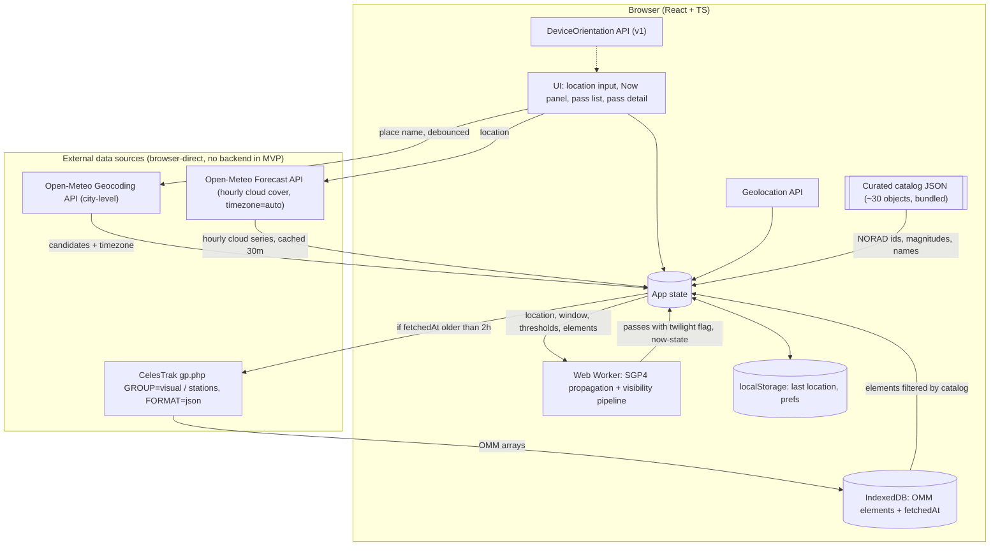

# What Is In Your Sky Right Now — Product Specification

| Field | Value |
|---|---|
| Status | Draft v0.4 — for review (OQ-1, OQ-3, OQ-4, OQ-11 resolved; UX-1 sky-dome and visual-identity decision added; see §12 Decision Log) |
| Date | 2026-09-01 |
| Owner | Ezequiel Baruf |
| Scope of this document | Product + technical specification only. No implementation plan or task breakdown (requested as a separate step). |

---

## 1. Summary

A web app that tells a person standing outside, with no equipment, **which satellites they can see with the naked eye, when, and where to look** — and whether clouds are likely to spoil the view.

The user supplies a location (city or place name, coordinates, or browser geolocation). The app predicts visible passes for the coming hours, ranks them by how good they will be, and for each pass gives plain-language viewing instructions (rise/peak/set direction, maximum elevation, times, duration, expected brightness) plus a cloud-cover warning drawn from a weather forecast.

---

## 2. Goals & Non-Goals

### 2.1 Goals (MVP)

- **G1. Zero-friction start.** A first-time visitor gets a useful answer in under 30 seconds with no sign-up and no API keys to configure.
- **G2. Correct visibility filtering.** Only show passes that are genuinely naked-eye visible: satellite sunlit, observer in darkness, pass high enough above the horizon, predicted brightness above a threshold.
- **G3. Actionable guidance.** Every pass answers "where do I look, when, and for how long?" in words a non-astronomer understands.
- **G4. Honest about weather.** Warn when clouds are likely to block the pass; never silently present a doomed pass as a good one.
- **G5. Cheap to run.** Free or generous-free-tier data sources; near-zero hosting cost; computation pushed to the client where practical.
- **G6. Works on a phone, outdoors, at night.** Mobile-first, dark UI, large tap targets, readable at arm's length.

### 2.2 Non-Goals (explicitly out of scope for MVP)

- Tracking every object in orbit (full catalog, debris, Starlink shells). MVP covers a hand-maintained catalog of ~30 well-known bright objects; the full CelesTrak `visual` group is v1.
- Street-address-precision geocoding. MVP geocodes to city/place level (Open-Meteo geocoding). A pass looks the same from anywhere within a few kilometres, so this costs nothing in accuracy; street addresses and reverse geocoding arrive with the v1 proxy.
- Any first-party backend. MVP is a static site; the browser talks to CelesTrak and Open-Meteo directly. A caching proxy is v1.
- Telescope / binocular targets (faint satellites, geostationary satellites, flares from specific antenna geometry).
- Iridium-style flare prediction (the original Iridium constellation is deorbited; flare prediction for other constellations is research-grade).
- Radio tracking, Doppler, amateur radio pass planning.
- Live 3D globe / orbit visualisation (Earth-centred, orbital view). The observer-centred sky dome in §4.4 is in scope; a view of the Earth from outside is not.
- User accounts, cloud sync, social features.
- Native mobile apps (a PWA is acceptable later; not in MVP).
- Historical passes ("what did I just see?") — see Roadmap, later phase.
- Guaranteed accuracy for launches < 48 h old or objects during manoeuvres (orbital elements lag reality).
- Commercial use of the free data tiers. If the project ever monetises, several dependencies (Open-Meteo; Nominatim once added in v1) require moving to paid/self-hosted tiers.

---

## 3. Personas & User Stories

### 3.1 Personas

- **Casual Stargazer (primary).** No astronomy background. Heard "you can see the ISS" and wants to try tonight from the back garden. Uses a phone.
- **Curious Parent / Teacher.** Wants a reliable "show the kids something" moment; needs advance notice and confidence it will actually be visible.
- **Hobbyist Observer (secondary).** Knows what azimuth means. Wants a fast, honest list and the ability to tune thresholds; will notice if predictions are wrong.

### 3.2 User Stories (MVP unless tagged)

Each story has acceptance criteria (AC). "Visible pass" is defined in §4.3.

**US-1 — Provide my location by place name**
As a user, I can type a city, town, or place name and have it converted to coordinates.
- AC1: A single free-text field accepts a place name; results appear as a short pick list (name, region, country) when ambiguous.
- AC2: The resolved place name and coordinates are shown so I can confirm they are right.
- AC3: If geocoding fails or returns nothing, I get a clear message and the option to enter coordinates instead.
- AC4: The UI makes clear that resolution is city-level ("Using the centre of Cipolletti, Rio Negro"); street addresses are not resolved to house precision in MVP.

**US-2 — Provide my location by coordinates**
As a user, I can paste or type latitude/longitude.
- AC1: Accepts decimal degrees (`-34.6037, -58.3816`) and common variants (space-separated, with N/S/E/W suffixes).
- AC2: Validates range (lat −90..90, lon −180..180) with inline errors.
- AC3: Optional altitude (metres) field, default 0.

**US-3 — Use my device's location**
As a user, I can press one button to use the browser's Geolocation API.
- AC1: Button is only shown when the API is available and the page is served over HTTPS.
- AC2: Permission denial shows a non-blocking message and leaves the manual inputs usable.
- AC3: Reported accuracy is displayed if worse than ~1 km; otherwise hidden.

**US-4 — See what is visible right now**
As a user, I see at a glance whether any satellite is visible **at this moment** from my location.
- AC1: A "Now" panel lists satellites currently above the elevation threshold, sunlit, with observer in darkness — or states plainly that none are visible and why (daylight / nothing up / all in shadow).
- AC2: The panel updates at least every 10 seconds without a page reload.
- AC3: For each currently-visible satellite: current azimuth (compass direction + degrees), current elevation, and time remaining until it sets or enters shadow.

**US-5 — See upcoming visible passes**
As a user, I see a list of upcoming visible passes for the next 24 hours (configurable up to 5 nights).
- AC1: Each list item shows: satellite name, start time (local to the *observer location*, not the browser), max elevation, peak compass direction, duration, predicted brightness, and a weather indicator.
- AC2: Passes are sorted chronologically by default; a toggle sorts by "best first" (brightness × elevation).
- AC3: Passes that fail the visibility criteria are not listed (no "hidden but listed" clutter).
- AC4: Time until the next pass is shown as a countdown.

**US-6 — Get step-by-step viewing guidance for a pass**
As a user, I open a pass and get instructions on where and when to look.
- AC1: Text summary in plain language, e.g. *"Appears low in the west-southwest at 21:14:32, climbs to 62° (two-thirds of the way up the sky) in the south at 21:17:50, disappears into Earth's shadow in the east-northeast at 21:20:05. Brighter than any star."*
- AC2: Numeric details: rise/peak/set azimuth (° and 16-point compass), max elevation, start/peak/end times to the second, duration, magnitude, range at peak.
- AC3: A **3D ASCII-rendered sky dome** centred on the observer, with cardinal points labelled on the horizon, the pass drawn as an arc with its peak marked, and rise/set points and direction of travel indicated. I can rotate and tilt the view so I am looking toward the horizon I will actually face.
- AC4: Distinguishes "sets below horizon" from "enters Earth's shadow" as the end condition.
- AC5: A 2D polar (all-sky) chart of the same pass is available as a fallback view, one tap away, built from the same data.

**US-7 — Know whether clouds will ruin the pass**
As a user, each pass tells me whether the forecast suggests clear or cloudy skies.
- AC1: Cloud cover (total, and low/mid/high where available) is fetched for the observer location for the pass time.
- AC2: A three-state indicator: *Clear* (< 30 % total cloud), *Partly cloudy* (30–70 %), *Likely obscured* (> 70 %). Thresholds are constants and appear in the UI tooltip.
- AC3: Forecast timestamp and provider are shown so the user knows how fresh the data is.
- AC4: If weather data is unavailable, the pass is still shown with a "weather unknown" state — weather never blocks pass display.

**US-8 — Remember my last location** *(MVP, minimal)*
As a returning user, the app pre-fills my last-used location.
- AC1: Stored in `localStorage` only; nothing sent to a server.
- AC2: A "clear" action removes it.

**US-9 — Tune visibility thresholds** *(v1)*
As a hobbyist, I can adjust minimum elevation, limiting magnitude, and twilight rule.

**US-10 — Point my phone at the sky** *(v1)*
As a user, I can hold my phone up and see an arrow guiding me toward where the satellite will appear / currently is.

**US-11 — Be notified before a pass** *(v1 / later)*
As a user, I can opt in to a reminder a few minutes before a selected pass.

**US-12 — Share a pass** *(v1)*
As a user, I can copy a link that reproduces this pass view (location + satellite + time) for someone else.

---

## 4. Functional Requirements

Requirements use MUST / SHOULD / MAY (RFC 2119 sense). IDs are stable for traceability into later plan/tasks.

### 4.1 Location

- **FR-LOC-1** The app MUST accept location via (a) free-text city/place name, (b) lat/lon text, (c) browser Geolocation.
- **FR-LOC-2** Place-name geocoding MUST use the Open-Meteo Geocoding API directly from the browser (no key, CORS-enabled), MUST be debounced (≥ 500 ms after typing stops), and MUST cache results per query string for the session, to respect the shared 10 000 calls/day non-commercial limit.
- **FR-LOC-3** The app MUST derive the IANA time zone for the chosen location and display all times in that zone, with the zone abbreviation shown. Open-Meteo returns the zone both in geocoding results and in forecast responses (`timezone=auto`), so no separate lookup library is required in MVP.
- **FR-LOC-4** *(v1)* The app SHOULD reverse-geocode coordinates to a human-readable label (city / region) for display. Open-Meteo has no reverse geocoding; this arrives with the v1 proxy (Nominatim). MVP shows rounded coordinates for coordinate/Geolocation inputs.
- **FR-LOC-5** The app MUST persist the last location locally and MUST NOT transmit it to any first-party server for storage.
- **FR-LOC-6** Geocoding precision in MVP is city/place level. The app MUST NOT imply street-level accuracy in the UI.

### 4.2 Satellite Data

- **FR-SAT-1** The MVP catalog is a **hand-maintained list of ~30 well-known bright objects** (ISS, Tiangong, Hubble, large rocket bodies, etc.) stored as a static JSON file in the repo, keyed by NORAD catalog number, with display name, intrinsic magnitude, category, and short description. The full CelesTrak `visual` group is v1.
- **FR-SAT-2** The browser MUST fetch current GP elements **directly from CelesTrak** (OMM JSON) for the `visual` and `stations` groups (two requests) and filter client-side to the curated catalog. Per-object `CATNR` requests MUST NOT be used (30 requests per client would violate CelesTrak's fair-use policy). If a curated object is absent from both groups it MUST be skipped with a console warning, not an error.
- **FR-SAT-6** Fetched elements MUST be cached in IndexedDB with a `fetchedAt` timestamp. The client MUST NOT re-request from CelesTrak more often than once every 2 hours (enforced against the stored timestamp, across tabs and reloads). On network failure the cached set MUST be used with the epoch-age warning of FR-SAT-4.
- **FR-SAT-3** The app MUST prefer the OMM/JSON representation over classic two-line TLE text. Rationale: the public catalog exceeded 5-digit numbers in July 2026; TLE lines now use Alpha-5 encoding for catalog numbers ≥ 100 000, which OMM avoids.
- **FR-SAT-4** The app MUST display the epoch age of the elements in use and MUST warn when elements are older than 5 days (accuracy degrades; ISS reboosts happen frequently).
- **FR-SAT-5** The curated catalog file (FR-SAT-1) MUST be the single source of per-object metadata and MUST record the provenance of each intrinsic magnitude (source + date) so values can be audited and updated.

### 4.3 Visibility Computation

A pass is **visible** when, for a contiguous interval of time, all of the following hold:

1. **Above horizon threshold.** Satellite elevation ≥ `MIN_ELEVATION` (default 10°; 0° is unusable in practice because of buildings, haze, and atmospheric extinction).
2. **Observer in darkness.** Sun altitude at the observer ≤ `SUN_ALT_MAX` = −6° (after end of civil twilight / before start of civil dawn). **Decided:** passes are listed from −6°; passes whose peak occurs with the sun between −6° and −12° carry a **"sky still bright"** label (only the brightest objects will be seen). User-configurable threshold is v1.
3. **Satellite sunlit.** Satellite is not inside Earth's umbra. Penumbra MAY be treated as lit with a "fading" flag.
4. **Bright enough.** Predicted visual magnitude at peak ≤ `MAG_LIMIT` (default +4.5; roughly what an average suburban sky allows). Every MVP catalog object has a known intrinsic magnitude (FR-SAT-1). When the full `visual` group is added in v1, objects with unknown intrinsic magnitude are shown with "brightness unknown" if the other conditions pass.

- **FR-VIS-1** The app MUST compute passes for a window of at least the next 24 h and at most 5 nights (user-selectable in v1).
- **FR-VIS-2** Pass boundaries (start, peak, end) MUST be refined to ≤ 1 s precision.
- **FR-VIS-3** For each pass the app MUST report: start time, start azimuth, peak time, peak azimuth, peak elevation, end time, end azimuth, end reason (`horizon` | `shadow` | `twilight`), duration, predicted peak magnitude, range at peak.
- **FR-VIS-4** The pipeline MUST run without blocking the UI thread (Web Worker) and SHOULD complete the 24 h computation for the ~30-object MVP catalog in under 1 s, and for ≈ 200 objects (v1) in under 3 s, on a mid-range 2022 phone.
- **FR-VIS-5** The app MUST recompute when location, window, or thresholds change; and MUST re-evaluate "now" state at least every 10 s using the cached propagation.
- **FR-VIS-6** All thresholds MUST be centralised constants with documented defaults and documented rationale.
- **FR-VIS-7** Each pass MUST carry a `twilight` flag set when the sun altitude at peak is between −6° and −12°; the UI MUST render it as a "sky still bright" label on the pass card and in the guide text.

### 4.4 Observation Guide

- **FR-GUIDE-1** For each pass the app MUST render a plain-language sentence (US-6 AC1) generated from a template, using 16-point compass names and an elevation-to-words mapping (e.g. 10–25° "low", 25–50° "mid-sky", 50–75° "high", > 75° "almost overhead").
- **FR-GUIDE-2** The app MUST render a **3D sky dome as ASCII text**, centred on the observer, showing: the horizon ring with cardinal points (at least N/E/S/W, ideally 8 points) labelled on it; each pass in view as an arc across the dome with its peak marked; rise and set points; direction of travel; and the shadow-entry point where applicable. The user MUST be able to rotate (azimuth) and tilt (pitch) the view, by touch drag and by keyboard, so the dome is seen from the direction they will face. The default view MUST face the pass's rise azimuth at a tilt that shows both horizon and peak.
- **FR-GUIDE-2b** The app MUST also provide a **2D polar (all-sky) chart** of the same pass — horizon as the outer circle, zenith at the centre, altitude rings at 30°/60°, cardinal labels, rise/peak/set and shadow-entry markers — as a fallback view reachable from the dome view. Both views MUST be driven by the same computed pass geometry.
- **FR-GUIDE-3** Brightness MUST be expressed both as a magnitude number and a comparison phrase: "brighter than Venus" (≤ −4), "brighter than any star" (−4 to −1.4), "like a bright star" (−1.4 to +1), "like an average star" (+1 to +3), "faint, needs dark sky" (> +3).
- **FR-GUIDE-4** The 2D polar chart MUST be orientation-aware: default "looking up" convention (east on the left, as when lying on your back looking up) with an explicit toggle to map convention (east on the right). The chosen convention MUST be labelled on the chart. The 3D dome needs no such toggle: the user's rotation is the orientation, and the current facing direction MUST be shown as text (e.g. "facing WSW, tilt 35°").
- **FR-GUIDE-5** Both chart views MUST be rendered in the DOM only — text nodes and ordinary elements (with SVG permitted for the 2D chart). **No WebGL and no `<canvas>`.** Rationale: the ASCII dome is the product's visual signature and must be selectable, zoomable, and styleable like the rest of the page; DOM rendering also keeps the CSP strict and testing simple.
- **FR-GUIDE-6** The dome MUST re-render smoothly enough for interactive rotation on a mid-range 2022 phone (target ≥ 30 updates/s while dragging) at the default grid size; grid size MAY reduce on small screens.
- **FR-GUIDE-7** Chart views MUST carry a text alternative (the FR-GUIDE-1 sentence and the numeric table) and the character grid MUST be hidden from assistive technology so screen readers are not read a wall of symbols.

### 4.5 Weather

- **FR-WX-1** The app MUST fetch an hourly cloud-cover forecast for the observer location covering the prediction window.
- **FR-WX-2** For each pass, cloud cover MUST be interpolated to the pass peak time from the two nearest hourly values.
- **FR-WX-3** The three-state indicator (US-7 AC2) MUST be shown per pass; the "Now" panel MUST show current cloud cover.
- **FR-WX-4** Where the provider supplies low/mid/high layer cloud, the indicator SHOULD weight low + mid cloud more heavily than high cloud (thin cirrus often still permits seeing bright satellites).
- **FR-WX-5** Weather fetch failure MUST degrade gracefully (US-7 AC4). Weather MUST be cached for 30 min per location cell (rounded to 0.1°).

### 4.6 Cross-Cutting

- **FR-X-1** Mobile-first responsive layout; dark theme by default; optional red-tint "night vision" mode (v1).
- **FR-X-6** **Visual identity: monospace / terminal aesthetic across the whole UI** — a monospace typeface everywhere, character-grid-aligned layout where practical, box-drawing or plain-character borders, restrained colour on a dark ground, no photographic imagery. The ASCII sky dome must read as a natural part of the interface, not a widget dropped into a conventional web page.
- **FR-X-2** Every external data source MUST be credited in a footer (CelesTrak; Open-Meteo for weather and geocoding, whose geocoding data derives from GeoNames) as their terms require. OpenStreetMap/Nominatim attribution is added in v1 when the proxy introduces it.
- **FR-X-3** No analytics or tracking in MVP beyond anonymous, aggregate error logging.
- **FR-X-4** The app MUST function offline for the already-computed pass list, and MUST be able to recompute from IndexedDB-cached elements for a new location without network (weather then shows "unknown"). PWA install is a later phase.
- **FR-X-5** Accessibility: WCAG 2.1 AA colour contrast; chart information duplicated in text; keyboard navigable.

---

## 5. Technical Architecture

> **Status: proposal.** The stack, data flow, and algorithm below reflect the v0.2 decisions (no backend in MVP, curated ~30-object catalog, −6° twilight rule) but are to be validated in the plan phase. The assumption that CelesTrak serves usable CORS headers to browsers has been verified (§12, OQ-11).

### 5.1 Stack Recommendation

| Layer | Choice | Rationale |
|---|---|---|
| Frontend | React 19 + TypeScript, Vite, Tailwind (or CSS modules) | Requested. Vite for fast dev/build, easy Web Worker bundling. |
| State | Small: Zustand or React context + `useReducer` | App state is a handful of slices (location, elements, passes, weather, prefs). No need for heavier tooling. |
| Orbit math | `satellite.js` (v7.x, TypeScript, supports TLE and OMM) | De-facto SGP4/SDP4 in JS; includes ECI→ECF, look angles, GMST. |
| Sun position / twilight | `astronomy-engine` (accurate, TS types) — or `suncalc` for lighter weight | Sun altitude at observer and sun vector for shadow test. |
| Time zone lookup | Open-Meteo's `timezone` field (geocoding results and `timezone=auto` forecasts) | Needed to show times in the observer's zone (FR-LOC-3). `tz-lookup` only if a pure-coordinate input needs a zone before weather loads. |
| Client storage | IndexedDB via `idb` (elements cache, FR-SAT-6); `localStorage` for last location and prefs | IndexedDB handles the ~100 KB element payload and works across tabs; `localStorage` is enough for small prefs. |
| Sky charts | **3D ASCII sky dome rendered as DOM text** (in-house projection: az/el → dome coordinates → character grid) with a **2D polar fallback** (SVG or text). No WebGL, no canvas (FR-GUIDE-5). | The dome is the visual signature; DOM text keeps it styleable, testable, and CSP-friendly. Geometry is simple enough to write without a charting or 3D library. |
| Backend | **None in MVP** (decided). v1: thin caching proxy on an edge runtime — Cloudflare Workers (Hono, TypeScript) or Vercel Edge Functions | See §5.2. Entire pass computation stays in the browser in every phase. |
| Hosting | Static site (Cloudflare Pages / Netlify / Vercel / GitHub Pages) | Free tiers comfortably cover hobby-scale traffic; the v1 worker adds no hosting cost on free tiers. |
| Testing | Vitest + fixtures with known passes; Playwright for smoke | Visibility math needs golden tests against a trusted predictor (see §7 open questions). |

### 5.2 Backend: none in MVP, caching proxy in v1

**Decision (OQ-1, 2026-09-01):** MVP ships with no first-party backend.

- **Orbital data:** the browser fetches CelesTrak OMM JSON for the `visual` + `stations` groups directly, stores it in IndexedDB, and refreshes at most every 2 hours (FR-SAT-2, FR-SAT-6). CelesTrak's fair-use limits are per IP, and one user fetching ~100 KB every 2 hours is far below the ~100 MB/day threshold. CelesTrak serves `access-control-allow-origin: *` on `gp.php` JSON responses (verified 2026-09-01 by curl with an Origin header and by a browser fetch; see §12). It is not a contractual promise, so the fallback order is documented in §12.
- **Geocoding:** Open-Meteo's Geocoding API (city/place level, no key, CORS-enabled, same 10 000 calls/day non-commercial budget as the forecast API). Street-address precision is a stated non-goal.
- **Weather:** Open-Meteo forecast API, browser-direct, as before.

**Why the proxy still arrives in v1:**

1. **Scaling the catalog** to the full `visual` group and adding Space-Track as a redundant source is cleaner behind one cached endpoint, and shields users from any CelesTrak CORS or availability change.
2. **Street-address geocoding and reverse geocoding** need Nominatim (or similar), whose policy caps *the whole application* at 1 request/second and requires an identifying User-Agent/Referer — only enforceable server-side.
3. **Later features** (push notifications, share links with server-rendered previews) need a place to live.

The v1 worker is stateless apart from cache and does no orbital computation.

### 5.3 Data Flow



*v1 change to this diagram:* an edge worker is inserted between the browser and CelesTrak / Nominatim (`/api/gp`, `/api/geocode`), and the catalog grows to the full `visual` group.

### 5.4 Visibility Pipeline (the core algorithm)

Inputs: OMM elements for N objects; observer geodetic position (lat, lon, alt); time window `[t0, t1]`; thresholds.

```
for each object:
  satrec = satellite.json2satrec(omm)            # or twoline2satrec for TLE
  coarse scan t = t0 .. t1 step 30 s:
    posEci = satellite.propagate(satrec, t)
    gmst   = satellite.gstime(t)
    posEcf = satellite.eciToEcf(posEci, gmst)
    look   = satellite.ecfToLookAngles(observerGd, posEcf)   # az, el, range
    if el >= 0: mark as "above horizon" segment
  for each above-horizon segment:
    refine rise/set crossings of el = MIN_ELEVATION by bisection to <= 1 s
    refine peak (max el) by golden-section / parabolic fit on el(t)
    sample every 1–5 s within [rise, set]:
      sunAlt      = sun altitude at observer(t)               # astronomy-engine
      lit         = !inUmbra(posEci, sunVectorEci(t))         # cylindrical shadow test, Earth radius 6371 km (+ optional 6378/atmosphere fudge)
      visibleNow  = el >= MIN_ELEVATION && sunAlt <= SUN_ALT_MAX && lit
    visible interval = longest contiguous visibleNow run
    if none: discard pass
    end reason = horizon | shadow | twilight, whichever cut the run
    phase angle at peak, range at peak -> magnitude estimate:
      m = m_std - 15.75 + 5*log10(range_km) - 2.5*log10( sin(b) + (π - b)*cos(b) )
      (diffuse-sphere phase law; m_std = magnitude at 1000 km, half phase)
    if m > MAG_LIMIT and m_std known: discard
emit passes sorted by start time
```

Notes:
- The shadow test: project the satellite's ECI position onto the anti-sun axis. If the projection is positive (satellite on the night side) **and** the perpendicular distance to the axis is less than Earth's radius, the satellite is in umbra. A conical model adds a few lines and gives a better penumbra edge; MVP uses cylindrical and flags the last ~20 s before shadow entry as "fading".
- The "Now" panel reuses the same functions at `t = now` for every object, no scan needed.
- Twilight label: after the visible interval is found, evaluate sun altitude at peak; if it is in (−12°, −6°] set `twilight = true` (FR-VIS-7).
- Deep-space objects (period > 225 min) trigger SDP4 automatically in `satellite.js`; none are expected in the curated catalog or the `visual` group.
- Performance envelope: MVP ≈ 30 objects × 2 880 coarse steps (24 h @ 30 s) ≈ 86 k propagations — well under a second. v1 ≈ 200 objects ≈ 0.6 M propagations; `satellite.js` handles several hundred thousand per second in a worker, so expect 1–3 s, then sub-second refinement. Extending to 5 nights ×5 cost — still fine in a worker, but the UI should stream results per object.

### 5.5 "Where to Look" UX Patterns

Ranked for MVP inclusion. All patterns must reuse the same computed pass geometry.

| Pattern | Description | Pros | Cons | Phase |
|---|---|---|---|---|
| **Plain-text instructions** | Generated sentence + numeric table (§4.4). | Universally understood; accessible; zero permissions. | Requires user to know roughly where WSW is. | **MVP** |
| **3D ASCII sky dome** (primary) | Observer-centred dome drawn as a character grid in the DOM: horizon ring with cardinal labels, pass arcs with peak markers, rotate/tilt to face the relevant horizon. | Matches how the user will actually stand and look ("turn to face WSW, look about a third of the way up"); no mirror-convention confusion; distinctive, on-brand with the terminal identity (FR-X-6). | Character resolution is coarse (angles read to ~5°); rotation needs a short affordance ("drag to look around"); more engineering than a static chart. | **MVP** |
| **2D polar all-sky chart** (fallback) | Circle = horizon, centre = zenith, track drawn with markers and arrow. Same data as the dome. | Shows the whole pass at once; standard in Heavens-Above and similar apps, so familiar; precise angles. | The "looking up" mirror convention confuses first-timers; needs the orientation toggle (FR-GUIDE-4). | **MVP** (secondary view) |
| **Compass overlay** | Live arrow / ring using `DeviceOrientationEvent` heading; highlights the rise point and, during the pass, the satellite's current position. | Turns "WSW" into "turn a bit more left". Huge usability win outdoors. | iOS requires `requestPermission()` and HTTPS; magnetometer heading errors of 10–20° are common; not available on desktop. Must degrade to static chart. | **v1** |
| **AR camera view** | Camera feed with satellite marker overlaid using full device orientation (alpha/beta/gamma). | Most intuitive: point and see. | Camera permission, sensor fusion drift, battery; night camera feed is mostly black so the value over compass mode is smaller than it looks. | later |
| **Landmark hint** | "Above the tall building to your south-west" using reverse-geocoded POIs. | Charming. | Requires POI data and user context; unreliable. | not planned |
| **Audio countdown** | Spoken "appears in 10 seconds, low in the west". | Hands-free while looking up. | Nice-to-have. | later |

Design principles: monospace / terminal aesthetic throughout (FR-X-6), dark background, high contrast, one pass per screen in detail view, times in large type, and a persistent live countdown to the next event (rise → peak → set).

### 5.6 Error and Edge Handling

- Observer at high latitude in summer (no darkness): show "no darkness tonight at this latitude" instead of an empty list.
- Element set missing an object the metadata table expects: skip silently, log.
- Clock skew: use `Date.now()` but display a warning if the device time differs from the server `Date` header by > 60 s.
- Location changes mid-computation: cancel the worker job (AbortController pattern with a job id).

---

## 6. External Dependencies

### 6.1 Orbital Data Sources — Comparison

| Source | Data | Coverage | Access / limits | Licence / terms | Browser-direct? | Verdict |
|---|---|---|---|---|---|---|
| **CelesTrak** (`celestrak.org/NORAD/elements/gp.php?GROUP=visual&FORMAT=json`) | GP elements as TLE, 3LE, OMM XML/JSON/CSV; curated groups (`visual`, `stations`, `starlink`, `active`, `last-30-days`…); supplemental operator ephemerides for ISS/Starlink | Full public catalog, refreshed ~every 2 h from Space-Track | No key. Fair-use: keep under ~100 MB/day per IP; repeated hammering gets IPs firewalled. No SLA. | Free for any use with attribution; no formal licence text, governed by usage policy. | Yes — `access-control-allow-origin: *` verified 2026-09-01 (§12). Not a formal commitment. | **Primary source for MVP, fetched browser-direct** with a 2 h IndexedDB cache; v1 adds the caching proxy. Curated groups are exactly the candidate set we need. |
| **Space-Track.org** (18th Space Defense Squadron) | Authoritative GP, GP_History, SATCAT, decay/launch data; JSON/XML/CSV/TLE | Full catalog, origin of CelesTrak's data | Free account required; cookie/session login; ≤ 30 req/min and ≤ 300 req/hour; server-side only. | User agreement permits redistribution with attribution; must not circumvent limits. | No (auth + no CORS). | **v1 fallback / redundancy** behind the v1 proxy. Not usable in MVP (no backend). |
| **N2YO REST API** | Pre-computed *visual passes* (with magnitude), radio passes, positions, TLE | Full catalog; `visualpasses` endpoint does exactly our job | API key; 1 000 transactions/hour; per-endpoint counters in every response. | Free for non-commercial; terms restrict redistribution. | Yes, but exposes key. | **Not for core path**: outsources our differentiator, non-commercial only, and key must be proxied. Useful as a **golden-test oracle** during development. |
| **Heavens-Above** | Best-in-class visible pass predictions | — | No public API; scraping prohibited. | — | — | **Reference only** for manual QA. |
| **Where The ISS At** (`wheretheiss.at`) | ISS position + TLE | ISS only | No key, ~1 req/s | Free | Yes | Not needed; ISS is in CelesTrak `stations`. |
| **Open Notify** | ISS position; pass-prediction endpoint was retired | ISS only | No key | Free | Yes | Not suitable. |
| **TLE API** (`tle.ivanstanojevic.me`) | Community wrapper over CelesTrak with search/pagination | Full catalog | No key, CORS-enabled | Unofficial, no SLA | Yes | **First fallback** if CelesTrak's CORS policy changes (§12); adds a third-party single point of failure. |
| **SatNOGS DB** | Satellite metadata, transmitters, TLEs | Mostly amateur/edu sats | Token required | CC-BY-SA | Via proxy | Not relevant for naked-eye set; maybe metadata later. |

**Intrinsic magnitude data (needed for brightness, FR-SAT-1/5):** GP data carries no brightness. **Decision (OQ-3):** the MVP catalog is a hand-maintained JSON of ~30 objects with intrinsic magnitudes seeded from public community values (e.g. Mike McCants' standard-magnitude list, checking current hosting and terms) and provenance recorded per entry. For v1's full `visual` group, the options are (a) ingest the McCants list wholesale, or (b) estimate from SATCAT radar cross-section, with `unknown` allowed — chosen in the v1 plan.

### 6.2 Geocoding

| Provider | Key | Limits | Notes | Verdict |
|---|---|---|---|---|
| **Open-Meteo Geocoding** (`geocoding-api.open-meteo.com/v1/search`) | No | Shares the 10 000 calls/day non-commercial budget; CORS-enabled | City/town/place level (GeoNames-derived); returns lat/lon, admin region, country, elevation, population, and IANA timezone. No street addresses, no reverse geocoding. | **MVP** (decided). Browser-direct, debounced + session-cached. |
| **OSM Nominatim** (public) | No | 1 req/s for the whole app; identifying UA/Referer required; must cache; no autocomplete-style hammering | ODbL attribution ("© OpenStreetMap contributors"); street-level forward and reverse geocoding | **v1**, via proxy with global rate limit + cache |
| Photon (komoot) | No | Undocumented fair use; supports type-ahead | OSM-based | Alternative if autocomplete is desired |
| OpenCage | Yes | 2 500/day free | Wraps OSM + others | v1 alternative if Nominatim limits bite |
| Mapbox / Google | Yes | Paid beyond free tier; Google forbids caching/displaying without Google map | — | Not aligned with "no-key" preference |

MVP geocodes to the centre of the chosen place. Satellite pass geometry changes negligibly over a few kilometres (a 5 km offset shifts azimuth by well under 1° for a 400 km-altitude pass), so city-level input costs nothing in prediction quality; it only affects the displayed place label.

### 6.3 Weather (Cloud Cover)

| Provider | Key | Cloud fields | Coverage | Limits | Verdict |
|---|---|---|---|---|---|
| **Open-Meteo** | No | `cloud_cover`, `cloud_cover_low`, `cloud_cover_mid`, `cloud_cover_high` hourly (15-minutely for some models); up to 16 days; `timezone=auto` returns the IANA zone | Global, multi-model (ICON, GFS, ECMWF, national models) | 10 000 calls/day non-commercial; requests with > 10 variables or > 2 weeks count as multiple calls; commercial use requires paid plan | **MVP choice.** No key, CORS-enabled, layered cloud, and the timezone echo solves FR-LOC-3. |
| 7Timer! ASTRO | No | Cloud cover bands, seeing, transparency — astronomy-oriented | Global (GFS-based) | Undocumented, hobby infra | Attractive **v1 secondary** for "sky transparency"; not robust enough as primary. |
| MET Norway Locationforecast | No (UA required) | `cloud_area_fraction` + low/medium/high | Global (best in Nordics) | Fair use, identifying UA | Solid fallback. |
| NWS `api.weather.gov` | No | `skyCover` in gridpoints | US only | Fair use | US-only fallback. |
| OpenWeatherMap | Yes | `clouds.all` (total only) | Global | 1 000/day free (One Call 3.0) | Weaker data, needs key. |

**Cloud → verdict rule (initial):** `effective = 0.6·low + 0.3·mid + 0.1·high` if layers present, else `total`. Clear < 30 %, Partly 30–70 %, Likely obscured > 70 %. Tune after real-world use (OQ-5).

### 6.4 Browser APIs

- Geolocation API (HTTPS only).
- Web Workers (propagation off main thread).
- `DeviceOrientationEvent` incl. `webkitCompassHeading` / `absolute` handling (v1).
- Notifications + Service Worker / Push (v1/later; iOS requires installed PWA).
- `navigator.share` for share links (v1).

### 6.5 Libraries

| Library | Purpose | Notes |
|---|---|---|
| `satellite.js` ^7 | SGP4/SDP4, coordinate frames, look angles | MIT. Supports OMM JSON input. |
| `astronomy-engine` | Sun position, twilight, moon (later: moon glare warnings) | MIT. Sub-arcminute accuracy. |
| `idb` | Promise wrapper over IndexedDB for the elements cache (FR-SAT-6) | Tiny, TS types. |
| `tz-lookup` | lat/lon → IANA zone offline | Optional; Open-Meteo supplies the zone in MVP. |
| `date-fns` / `date-fns-tz` or Temporal polyfill | Time formatting in observer zone | |
| `hono` | Edge worker routing | **v1 only** (no backend in MVP). |
| `vitest`, `@playwright/test` | Tests | |

---

## 7. Open Questions

| ID | Question | Why it matters | Proposed default if unanswered |
|---|---|---|---|
| OQ-2 | Exact membership of the ~30-object MVP catalog (which rocket bodies and payloads beyond ISS, Tiangong, Hubble), and who maintains it as objects decay or launch. | Drives the metadata file and whether users see enough passes on an average night. | Seed from the brightest entries of CelesTrak's `visual` group plus `stations`; review quarterly. |
| OQ-5 | Cloud thresholds and layer weighting. | Too strict hides good passes; too lax erodes trust. | Values in §6.3; revisit after 2 weeks of field use. |
| OQ-6 | Golden-test oracle: is it acceptable to compare against N2YO/Heavens-Above outputs during development (manually captured fixtures)? | We need ground truth to validate the pipeline to ±few seconds and ±1° azimuth. | Yes, captured manually as fixtures, not fetched at test time. |
| OQ-7 | Should the "Now" view list objects that are up but not visible (e.g. in shadow), greyed out, for educational value? | Clarity vs. clutter. | No in MVP; add as a toggle in v1. |
| OQ-8 | Elevation-mask / obstruction input (e.g. "trees to my north up to 25°")? | Hobbyists want it; casual users won't use it. | Later. |
| OQ-9 | Analytics/telemetry policy. | Privacy stance and what we can learn about accuracy. | None in MVP beyond error logging. |
| OQ-10 | Product name and domain. | Working title is long. | Keep repo name; decide before public launch. |

Resolved questions (OQ-1, OQ-3, OQ-4, OQ-11) are recorded in §12.

---

## 8. Additional Feature Ideas — Ranked by Value vs. Effort

Effort: S (≤ 1 day), M (2–4 days), L (1–2 weeks). Value: from casual-user perspective.

| Rank | Feature | Value | Effort | Phase | Notes |
|---|---|---|---|---|---|
| 1 | **ISS-first mode / "Next ISS pass" hero card** | Very high | S | MVP | The ISS is what 90 % of visitors actually want. Pin it at the top when a visible pass exists in the window. |
| 2 | **Compass-guided pointing** (US-10) | Very high | M | v1 | Biggest outdoor usability jump. |
| 3 | **Pre-pass notification** (US-11) | High | M–L | v1 (in-page alarm S) → later (push) | In-page audio/visual alarm while tab is open is cheap; true push needs service worker + backend + iOS PWA install. |
| 4 | **Share a pass link** (US-12) | High | S | v1 | URL encodes lat/lon/NORAD id/time; recipient recomputes locally. |
| 5 | **Save favourite locations** | Medium | S | v1 | `localStorage` list; no accounts. |
| 6 | **Multi-night window (up to 5 nights)** | Medium | S | v1 | Pipeline already supports it; UI grouping by night. |
| 7 | **Moon phase & glare warning** | Medium | S | v1 | `astronomy-engine` gives it nearly free; a full moon near the track hurts faint passes. |
| 8 | **Starlink trains** (recent launch chains) | High interest, medium value | L | later | Needs `starlink` group (thousands of objects → server-side precompute or very aggressive culling), plus supplemental TLEs; recently launched trains are the only visually interesting case. |
| 9 | **"What did I just see?"** — pick time + rough direction, get candidates | Medium | M | later | Reverse query over cached passes; fun and drives trust. |
| 10 | **Add to calendar (.ics)** | Medium | S | v1 | Trivial and useful for the parent/teacher persona. |
| 11 | **Sky transparency / seeing (7Timer)** | Low–medium | S | later | Mostly for hobbyists. |
| 12 | **PWA install + offline** | Medium | M | later | Prerequisite for iOS push. |
| 13 | **AR camera overlay** | Medium | L | later | See §5.5. |
| 14 | **Elevation mask / horizon obstructions** | Low (casual) / High (hobbyist) | M | later | See OQ-8. |
| 15 | **Historical accuracy feedback ("I saw it / didn't")** | Medium (for us) | M | later | Requires a backend store and a privacy story. |

---

## 9. Phased Roadmap

### Phase 0 — Spike (validate the physics)
Not a product release. Goals: prove the pipeline against a trusted oracle.
- Node script: fetch `visual` + `stations` OMM, filter to the curated catalog, run pipeline for 2–3 known locations, compare against manually captured Heavens-Above/N2YO passes for the same nights. Target: start/end within ±10 s, azimuths within ±2°, max elevation within ±1°.
- Draft the ~30-object catalog JSON with magnitudes and provenance (OQ-2).

### Phase 1 — MVP
Everything tagged MVP above. Definition of done:
- US-1..US-8 accepted; FR-LOC-1..3, FR-LOC-5..6, FR-SAT-1..6, FR-VIS-1..7, FR-GUIDE-1..7 (incl. 2b), FR-WX-1..5, FR-X-1..6 met.
- Curated ~30-object catalog; ISS hero card; "sky still bright" label on twilight passes.
- Text guide + 3D ASCII sky dome with rotate/tilt, 2D polar fallback view, both DOM-rendered; monospace/terminal visual identity; three-state weather indicator.
- No backend: browser-direct CelesTrak with 2 h IndexedDB cache; Open-Meteo geocoding (city-level) and forecast; static hosting only. Attributions in place.
- Golden tests from Phase 0 running in CI.
- Deployed at a public URL over HTTPS.

### Phase 2 — v1 ("outdoor-ready")
- Compass-guided pointing (US-10) with graceful fallback.
- Threshold tuning UI (US-9): min elevation, magnitude limit, twilight rule.
- Multi-night window, grouped by night; "best pass this week".
- Share link (US-12), favourite locations, add-to-calendar.
- In-page pre-pass alarm (audio + vibration) while tab is open.
- Moon phase/glare warning; night-vision red theme.
- **Caching proxy** (edge worker) in front of CelesTrak; catalog expands to the full `visual` group with "brightness unknown" handling.
- Street-address and reverse geocoding via Nominatim behind the proxy (FR-LOC-4).
- Space-Track as redundant elements source behind the proxy.

### Phase 3 — Later
- PWA install, offline, and push notifications (backend scheduler per subscribed location/pass).
- Starlink trains (server-side precompute for the `starlink` group; supplemental ephemerides).
- "What did I just see?" reverse lookup.
- AR camera overlay.
- Sky transparency (7Timer) and elevation mask.
- Observation feedback loop for accuracy metrics.

---

## 10. Glossary

- **GP / TLE / OMM** — General Perturbations orbital elements. TLE = classic two-line text format; OMM = Orbit Mean-elements Message, the CCSDS successor available as JSON/XML with no field-width limits.
- **SGP4 / SDP4** — The analytical propagators matched to GP elements (SDP4 for periods > 225 min).
- **ECI / ECF** — Earth-Centred Inertial / Earth-Centred Fixed frames; converted via GMST (Greenwich Mean Sidereal Time).
- **Azimuth / Elevation** — Compass bearing (0° N, 90° E…) and angle above the horizon.
- **Umbra / Penumbra** — Full / partial Earth shadow; a satellite in umbra is invisible.
- **Standard (intrinsic) magnitude** — Brightness normalised to 1 000 km range and 50 % illumination; used to predict apparent magnitude.
- **Civil / Nautical twilight** — Sun altitude −6° / −12°.
- **Alpha-5** — TLE encoding scheme for catalog numbers ≥ 100 000 using a letter in the first digit position.

---

## 11. Sources consulted while drafting

- CelesTrak GP data formats and usage policy — https://celestrak.org/NORAD/documentation/gp-data-formats.php , https://www.celestrak.org/usage-policy.php
- Space-Track API documentation and rate limits — https://www.space-track.org/documentation
- N2YO API (limits, `visualpasses`) — https://apis.io/apis/n2yo/n2yo-api/
- Open-Meteo docs, geocoding API, and pricing — https://open-meteo.com/en/docs , https://open-meteo.com/en/docs/geocoding-api , https://open-meteo.com/en/pricing
- satellite.js — https://github.com/shashwatak/satellite-js , https://www.npmjs.com/package/satellite.js
- Nominatim usage policy — https://operations.osmfoundation.org/policies/nominatim/

---

## 12. Decision Log

| Date | Ref | Decision | Consequences |
|---|---|---|---|
| 2026-09-01 | OQ-1 | **MVP has no backend.** Browser fetches CelesTrak OMM JSON directly, caches in IndexedDB, refreshes at most every 2 h. Geocoding uses Open-Meteo's free geocoding endpoint (city-level). Caching proxy moves to v1. | Street-address precision becomes a non-goal; FR-LOC-2/4/6 and FR-SAT-2/6 updated; Nominatim attribution deferred to v1; raised OQ-11 on CelesTrak CORS (resolved below). |
| 2026-09-01 | OQ-3 | **MVP catalog is a hand-maintained list of ~30 well-known bright objects** with intrinsic magnitudes. Full CelesTrak `visual` group moves to v1. | FR-SAT-1/5 rewritten; FR-VIS-4 performance target relaxed for MVP; OQ-2 narrowed to catalog membership. |
| 2026-09-01 | OQ-4 | **List passes when the sun is below −6°.** Passes with the sun between −6° and −12° get a "sky still bright" label. | §4.3 rule 2 fixed; new FR-VIS-7; pipeline emits a `twilight` flag. |
| 2026-09-01 | OQ-11 | **Browser-direct CelesTrak fetch confirmed for MVP.** CelesTrak serves `access-control-allow-origin: *` on `gp.php` JSON responses; verified 2026-09-01 via curl with an `Origin` header and via a browser fetch (22 objects returned for the `stations` group). | OQ-11 closed. Fallback order if this changes: (1) community TLE API (`tle.ivanstanojevic.me`), (2) pull the caching proxy forward from v1. Phase 0 no longer needs a CORS check. |
| 2026-09-01 | UX-1 | **MVP sky chart is a 3D ASCII-rendered sky dome** centred on the observer (cardinal points on the horizon, passes as arcs with peaks marked, user can rotate/tilt toward the horizon they will face), with a **2D polar all-sky chart kept as a fallback view** over the same data. **Both rendered in the DOM only — no WebGL, no canvas.** **Visual identity: monospace / terminal aesthetic across the whole UI.** | US-6 AC3/AC5 rewritten; FR-GUIDE-2 rewritten, FR-GUIDE-2b and FR-GUIDE-5..7 added; FR-GUIDE-4 scoped to the 2D fallback; FR-X-6 added; §5.1 chart row and §5.5 patterns table updated; non-goal on 3D globe clarified; Phase 1 definition of done updated. `PLAN.md` v0.1 still describes an SVG chart and must be revised to match. |
