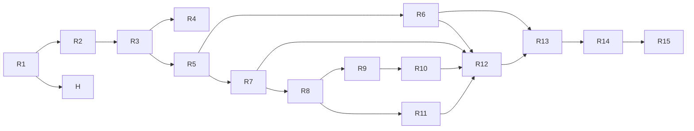

# What Is In Your Sky Right Now — Task Breakdown

| Field | Value |
|---|---|
| Status | Draft v0.2 — resliced as vertical slices, for review |
| Date | 2026-09-01 |
| Inputs | `SPEC.md` v0.4, `PLAN.md` v0.2 (Decisions D-1..D-17 and §8, §10 treated as fixed) |
| Scope | MVP (spec Phase 0 + Phase 1). v1 items are not broken down here. |
| Supersedes | v0.1 (T1–T22). Mapping from old task IDs is given per task under **Built from**. |

## Conventions

- Tasks are ordered; the order is a valid serial execution. Each task is sized for one pull request and touches at most three modules. R1 and R2 are the largest by design (a spike cannot run without the physics core it validates; the first visible slice cannot run without the scaffold).
- Every task after R1 delivers something a user can see on screen or run end-to-end. The three exceptions (R1, R14, H) carry a one-line **Why not a slice** justification.
- **Satisfies** lists the requirement IDs the task completes. **Advances** lists IDs the task contributes to but that are only fully met by a later task.
- **Depends on** lists task IDs that must be checked off first (the `sdd-task` skill refuses to start otherwise).
- **[P]** in the heading means the task has no dependency on its neighbouring [P] tasks; **Parallel with** names them explicitly.
- **Done when** items are the acceptance checks: a command whose output is stated, a test that passes, or a visual check with a stated expectation. "Tests pass" always means `npm test` (Vitest) unless a narrower command is given. From R2 on, every slice adds its own case to `tests/e2e/` rather than deferring to a separate e2e task.
- Fixtures are dated and immutable (PLAN §9.3). Nothing in `src/physics`, `src/worker`, or `src/lib` reads the wall clock (D-15).

---

## Tasks

- [x] **R1 — Physics validation spike (Task Zero): reproduce Heavens-Above ISS passes for Neuquén within 1 min / 5°**
  - **Done 2026-09-02:** as specified. Additions: `src/model/catalog.ts` holds the catalog *types* (needed by `pass.ts`/`elements.ts`; the JSON and schema stay in R3); `src/physics/reference.test.ts` enforces `reference-values.json`; comparison logic lives in `tests/support/heavensAbove.ts` so the script and the golden test share it. Only one visible pass existed in the window and it is horizon-bounded, so D-8 was checked against satellite.js's conical model instead of Heavens-Above (PLAN §2.1).
  - **Why not a slice:** It is the physics spike the slicing rule explicitly places before the first slice; it retires the riskiest unknown and is runnable end-to-end as a script.
  - **Built from:** T1, unchanged.
  - **Goal:** Prove the pure physics pipeline against Heavens-Above before any UI exists, and commit the comparison as an offline golden test.
  - **Satisfies:** spec §4.3 visibility rules, FR-VIS-2, FR-VIS-3, FR-VIS-6, FR-VIS-7, FR-SAT-3. **Advances:** FR-VIS-1. Validates PLAN D-1, D-2, D-7, D-8 and delivers PLAN §10.
  - **Depends on:** —
  - **Parallel with:** —
  - **Scope (PLAN §4, §6.3, §10):**
    - Minimal Node tooling only: `package.json` (`"type": "module"`), `tsconfig.json` (strict, `noUncheckedIndexedAccess`, `exactOptionalPropertyTypes`), Vitest, `tsx`. Runtime deps: `satellite.js` ^7, `astronomy-engine` ^2. No Vite, no React (R2).
    - `src/model/{observer,pass,thresholds,elements}.ts` exactly as PLAN §5 (`catalog.ts` and `weather.ts` come in R3 and R8).
    - `src/physics/`: `constants.ts`, `time.ts`, `sgp4.ts`, `frames.ts`, `sun.ts`, `shadow.ts`, `magnitude.ts` (D-1 form), `visibility.ts`, `passes.ts` (the §6.3 algorithm: 30 s coarse scan, bisection on the 10° crossings, 1 s dense sampling, longest visible run, parabolic peak, `twilight` flag, `track` every 10th sample), `index.ts`. Time enters every function as a parameter.
    - `scripts/validate-iss.ts`, the fixture pair, `tests/fixtures/heavens-above/README.md`, `src/physics/passes.golden.test.ts`, and `tests/fixtures/reference-values.json` (pinned intermediate values later tasks check against, see below).
  - **Heavens-Above comparison procedure (to be reproduced verbatim in the fixture README):**
    1. **Set the observer.** On heavens-above.com open *Change your observing location*. Enter latitude `-38.93`, longitude `-67.99`, elevation `0` m, name `Neuquen (spike)`. Set the time-zone selector to **UTC** (listed as UTC / GMT, no DST). Submit and confirm the page header shows the coordinates and "Time zone: UTC". All later pages read these settings from the site cookie.
    2. **Open the ISS visible-pass list.** Go to *Satellites → ISS → 10-day predictions for passes* (`PassSummary.aspx?satid=25544`). Leave **Visible only** selected (the default). Copy into the README the page's own wording on its filters (the altitude cutoff at 10° and any brightness cutoff) so extras can be explained against it later.
    3. **Record the capture time** `capturedAt` (UTC, to the minute) *before* transcribing anything. The comparison window is `[capturedAt, capturedAt + 10 days]`.
    4. **Transcribe every pass from its detail page, by hand.** Heavens-Above prohibits scraping. For each row of the summary table click through to `PassDetails.aspx` and record: the date, the brightness (mag), and, for every event row present, the time (HH:MM:SS UTC), altitude (°) and azimuth (° with compass letters). Event rows are: *Rises*, *Reaches altitude 10°*, *Maximum altitude*, *Drops below altitude 10°*, *Sets*, and *Enters shadow* or *Exits shadow* when they apply. **Azimuths must come from the detail page in degrees.** The summary table shows 16-point compass letters (±11.25°), which is too coarse for the 5° criterion.
    5. **Record the elements Heavens-Above is using.** Open *ISS → Orbit* (`orbit.aspx?satid=25544`) and note the element epoch shown there as `haEpoch`.
    6. **Save the fixture** as `tests/fixtures/heavens-above/<YYYY-MM-DD>-neuquen-iss.json` with the shape `{ capturedAt, observer: { lat, lon, altM }, timeZone: "UTC", haEpoch, filtersText, passes: [ { date, magnitude, events: { rises?, reaches10?, max, drops10?, sets?, entersShadow?, exitsShadow? } } ] }`, each event `{ t, altDeg, azDeg, compass }`. A re-capture is a new dated file, never an edit.
    7. **Capture elements within the same hour** as step 3:
       ```
       curl -sS 'https://celestrak.org/NORAD/elements/gp.php?GROUP=stations&FORMAT=json' -o tests/fixtures/omm/<YYYY-MM-DD>-stations.json
       curl -sS 'https://celestrak.org/NORAD/elements/gp.php?GROUP=visual&FORMAT=json'   -o tests/fixtures/omm/<YYYY-MM-DD>-visual.json
       ```
       Write `fetchedAt` and the `EPOCH` of NORAD 25544 into `tests/fixtures/omm/<YYYY-MM-DD>.meta.json` and into the README. If `haEpoch` and that `EPOCH` differ by more than one day, re-capture both sides together (PLAN §10.1 step 2).
    8. **Run the pipeline** with `npx tsx scripts/validate-iss.ts`: `findPasses` for NORAD 25544 over the window from step 3, observer from step 1, `minElevationDeg = 10`, `sunAltMaxDeg = -6`, `twilightLabelSunAltDeg = -12`, **no magnitude cut** (brightness is compared separately). The script reads only the committed fixtures; it never fetches.
    9. **Map the three comparison points.** Our `start` pairs with the Heavens-Above event that begins the visible pass: *Reaches altitude 10°*, or *Exits shadow* / *Rises* when the summary table's Start column matches that row instead. Our `peak` pairs with *Maximum altitude*. Our `end` pairs with *Drops below altitude 10°* or *Enters shadow*, whichever the summary's End column matches. The row used for `end` is Heavens-Above's implied end reason (`horizon` vs `shadow`) and is compared with our `endReason`.
    10. **Pair passes** by peak time, nearest within ±15 min. Print unpaired passes on both sides.
    11. **Compare** each pair: |Δt| at start / peak / end, |Δaz| (wrapped to ≤ 180°) and |Δel| at each. A pass **passes** when every |Δt| ≤ 60 s and every |Δaz|, |Δel| ≤ 5°. Print one table row and PASS/FAIL per pass, then `OVERALL: PASS` or `OVERALL: FAIL`.
    12. **Brightness (informational).** Print our `peakMagnitude` beside Heavens-Above's listed magnitude per pass, to sanity-check D-1 and the ISS `stdMag` seed value (use −1.8 as the seed pending R3's provenance work; record the value actually used).
    13. **Explain every extra.** Any pass we list that Heavens-Above omits is documented per pass in the README (e.g. `twilight = true` and Heavens-Above applies a stricter sun rule; or peak magnitude fainter than their cut). Unexplained extras fail the spike.
    14. **If it fails,** follow PLAN §10.3 in order: time base (single propagated ECI position against satellite.js's own test vector; ms↔JD; `EPOCH` parsed as UTC) → frames (GMST, east-positive longitude in radians) → sun-vector frame (declination check for the date) → shadow-entry offsets (revisit D-8 only with evidence) → element-epoch mismatch (re-capture together).
  - **Done when:**
    - `npx tsx scripts/validate-iss.ts` prints the per-pass table, no unpaired Heavens-Above passes, and `OVERALL: PASS`; every paired pass within 60 s / 5° / 5° at all three points; `endReason` matches Heavens-Above's implied end for every pass.
    - `npx vitest run src/physics/passes.golden.test.ts` passes offline and Vitest reports the file's duration under 2 s.
    - `npx tsc --noEmit` is clean.
    - `tests/fixtures/heavens-above/README.md` contains the procedure above, `capturedAt`, `fetchedAt`, both epochs, the filters text, and the per-pass explanation of any extras.
    - `tests/fixtures/reference-values.json` pins, for `capturedAt` exactly: ISS ECI position and velocity, GMST, look angles from the observer, sun altitude at the observer, sun unit vector, and the first golden pass's start / peak / end. Later physics tasks assert against this file (per `sdd-task`).
    - Findings appended to PLAN.md Decisions: whether `satellite.js` `json2satrec` accepts CelesTrak field names as-is (else the mapping layer in `sgp4.ts`); measured Node runtime for ISS × 10 days; any systematic shadow-entry offset observed against D-8.

- [x] **R2 — Type coordinates, see the next ISS pass as one line of text**
  - **Note (2026-09-02):** done as specified; components live at the PLAN §4 paths (`ui/components/location/CoordsInput.tsx`, `ui/components/passes/NextPassLine.tsx` + `nextPass.ts`); Vite pinned to 7.x with Vitest 3.2 and worker chunks set to ES format (PLAN D-18, D-19).
  - **Built from:** T2 (scaffold, CI, Playwright bootstrap), T12 (coordinates field only), T7 (plain `stations` fetch, no cache), T9 (UTC time formatting), T10 (`--font-mono` and dark ground only).
  - **Goal:** Turn the spike repo into the Vite + React 19 + TypeScript app of PLAN §4 and §11 and ship the thinnest possible product: a coordinates field and a single line naming the next visible ISS pass.
  - **Satisfies:** PLAN §11 build/CI (typecheck → test → build → Playwright). **Advances:** FR-LOC-1 (b), FR-LOC-3 (UTC formatting half, D-3), FR-SAT-2, FR-VIS-1, FR-X-1, FR-X-6 (font token).
  - **Depends on:** R1
  - **Parallel with:** H
  - **Scope:**
    - Vite + `@vitejs/plugin-react`, `build.target = 'es2022'`; `tsconfig.app.json` / `tsconfig.node.json`; ESLint flat config with `typescript-eslint` strict and `react-hooks` (module-boundary rules arrive in R5 when the boundaries exist); Vitest config with jsdom for `src/ui` and Node elsewhere; `tests/setup/` with MSW; `.github/workflows/ci.yml`; Playwright installed with `tests/e2e/` scaffolding and fixture routes for CelesTrak.
    - `src/ui/styles/tokens.css` with `--font-mono` and `--cell` (D-5) and a dark ground colour; `src/main.tsx`, `App.tsx`.
    - `data/celestrak.ts` (zod-validated fetch of the `stations` group, bad records dropped; no cache yet).
    - `ui/CoordsInput.tsx` accepting `lat, lon` text with range validation only (formats, altitude, and geolocation come in R10).
    - `lib/timeFormat.ts` (`Intl.DateTimeFormat` HH:MM:SS; UTC with an explicit "UTC" label when `timeZone` is null).
    - `ui/NextPassLine.tsx`: runs `findPasses` on the main thread for NORAD 25544 over the next 10 days and renders one line: name, start time (UTC), start compass azimuth in degrees, max elevation, end time.
  - **Done when:**
    - `npm run dev` serves the page; typing `-38.93, -67.99` renders the next ISS pass as one line of text.
    - One Playwright smoke test is green in CI: with `page.clock` fixed to the R1 `capturedAt` and CelesTrak routed to the R1 fixture, typing the Neuquén coordinates shows a line whose start time and max elevation match the first golden pass.
    - `npm run typecheck`, `npm run lint`, `npm test`, `npm run build` all exit 0 and R1's golden test still passes.

- [x] **R3 — Pass list for the full curated catalog**
  - **Note (2026-09-02):** done as specified, with one deliberate change: the list window is 24 h from "now" (FR-VIS-1's MVP window) instead of R2's 10-day ISS search, because ~30 objects × 10 days on the main thread would freeze the page for seconds; the Playwright clock is therefore pinned to `capturedAt + 9 d` so the golden pass stays in the window (PLAN D-20). `stdMag` values come from Mike McCants' `qs.mag` (2020-09-14), ISS = −2.5; Tiangong carries a documented estimate (PLAN D-22). Live check output (`present: 31, missing: 0`) is in PR #3.
  - **Built from:** T3, T7 (`visual` + `stations` fetch, dedupe, unavailable ids), T15 (plain cards, progressive rendering deferred to R5), T9 (16-point compass).
  - **Goal:** Replace the single ISS line with a list of every upcoming visible pass for the ~30-object MVP catalog, each card carrying the FR-VIS-3 fields in plain text.
  - **Satisfies:** FR-SAT-1, FR-SAT-5, FR-SAT-3 (catalog side), FR-VIS-1, US-5 (plain fields). **Advances:** FR-SAT-2, FR-SAT-4 (`epochMs` on every record), FR-SAT-6, FR-X-2 (README attributions), spec §8 rank 1 (ISS `featured`).
  - **Depends on:** R2
  - **Parallel with:** H
  - **Scope:** `src/model/catalog.ts`; `src/data/catalog/catalog.json` seeded from the brightest entries of the R1 `visual` + `stations` fixtures, each with `stdMag`, `stdMagSource { source, date, note }`, `category`, `description`, `featured: true` on the ISS; `schema.ts` (zod); `catalog.test.ts`; `scripts/check-catalog.ts` (live, manual). `data/elementsLoader.ts` (PLAN §7.1 without the cache branch: fetch both groups, dedupe with `stations` winning, missing catalog ids reported in `unavailable` and logged with `console.warn`; per-object `CATNR` URLs never requested). `lib/compass.ts` (16-point). `ui/PassCard.tsx` (name, start time, max elevation, peak compass + degrees, duration, magnitude number) and `ui/PassList.tsx` with an empty state; still computed on the main thread.
  - **Done when:**
    - `catalog.test.ts` passes: every entry validates, NORAD ids unique, exactly one `featured` entry, every `stdMagSource.source` non-empty and `date` ISO, 25–35 entries, every `noradId` present in the R1 OMM fixtures.
    - `npx tsx scripts/check-catalog.ts` (network) prints `present: N, missing: 0`; output pasted into the PR.
    - Loader tests pass: `stations` wins on duplicate ids; a catalog id absent from both groups appears in `unavailable`; a record failing the schema is dropped and the rest kept; the MSW handler asserts no `CATNR` request.
    - Playwright: the Neuquén flow now shows a list, the first golden pass is among the cards with the expected fields; compass boundary tests pass (11.24° → N, 11.25° → NNE, 359.9° → N).

- [x] **R4 [P] — Deploy the thin product to Cloudflare Pages with the strict CSP**
  - **Done 2026-09-02:** as specified, plus: `vite preview` serves `public/_headers` the way Pages does (PLAN D-25), so `tests/e2e/deploy-headers.spec.ts` checks the header values and zero CSP violations offline; that test caught zod's `new Function` probe, so zod now runs jitless through `src/data/zod.ts` (D-26); `tests/deploy/headers.test.ts` pins the file to the PLAN §11 block and checks `connect-src` covers every host the code references; `.node-version` pins Node 24 for the Pages build. The Pages project is created in the Cloudflare dashboard (steps in `README.md`); the live `curl -sI` and phone checks are done against it before this PR merges.
  - **Built from:** T22 (Pages project, `_headers`, README link). Bundle budgets, live-contract workflow, and the release checklist move to R11 and R15.
  - **Goal:** Put the R3 app on a public HTTPS URL with the PLAN §11 headers so every later slice ships as it merges.
  - **Satisfies:** FR-X-3 (headers, no third-party hosts), PLAN D-12, §11 CSP, spec Phase 1 DoD "public HTTPS URL". **Advances:** FR-X-2 (attributions in README).
  - **Depends on:** R3
  - **Parallel with:** R5, H
  - **Scope:** `public/_headers` exactly as PLAN §11; Cloudflare Pages project wired to the repo (preview per PR, production on main); `README.md` with the public URL and CelesTrak / Open-Meteo attributions.
  - **Done when:**
    - `curl -sI https://<site>/` shows the `Content-Security-Policy`, `Referrer-Policy`, and `Permissions-Policy` values from PLAN §11; `curl -sI https://<site>/assets/<any-file>` shows the immutable cache header.
    - The deployed site, opened on a phone over HTTPS, completes the R3 flow by hand; DevTools console shows zero CSP violations and the Network panel shows requests only to the site and CelesTrak.

- [x] **R5 [P] — Compute off the main thread: streaming cards, ISS first, cancel on location change**
  - **Done 2026-09-02:** as specified, with these differences: `eslint-plugin-import-x` (same `no-restricted-paths` rule) instead of `eslint-plugin-import`, which does not support ESLint 10 (PLAN D-28); `src/state` may import `src/physics/constants` for the thresholds the protocol carries (D-27); `hasDarkness` lives in `physics/darkness.ts` with its own reference test; `computeNow` answers `INTERNAL` until R7; the Playwright "throttled worker route" delays the worker script and progressive rendering is proven from a MutationObserver log of card ids (D-29). The Vitest browser project is part of `npm test`, so CI installs Chromium before the unit tests. Perf: 373–378 ms locally for 31 objects × 24 h, three runs; the CI log is linked from PR #6.
  - **Built from:** T6, T11 (store, worker client, cancellation, effects), T4 (performance budget test), T2 (module-boundary lint rules).
  - **Goal:** Move `findPasses` into the Web Worker behind the typed protocol, wire a Zustand store with cancellation, and make the list render progressively with the featured object first.
  - **Satisfies:** FR-VIS-4, spec §5.6 cancel-on-location-change, PLAN §3 dependency rules, §9.3 determinism rules. **Advances:** FR-GUIDE-5 (lint rule against `canvas`/WebGL imports), FR-X-3 (observer never leaves the allowed hosts), spec §5.6 `hasDarkness`.
  - **Depends on:** R3
  - **Parallel with:** R4, H
  - **Scope:** `src/worker/protocol.ts` exactly as PLAN §6.2 plus `jobDone.hasDarkness: boolean` (recorded in PLAN Decisions); `handlers.ts` (`createHandler(state)`; featured objects first; `MessageChannel` yield between objects; `BAD_OMM` per object in `elementsLoaded.rejected`; `PROPAGATION_FAILED` skips the object; `INTERNAL` aborts); `passes.worker.ts`; `handlers.test.ts` in Node; `worker.integration.test.ts` in Vitest browser mode. `state/store.ts` with `location`, `elements`, `passes` slices; `state/workerClient.ts` (owns the `Worker`, request/response correlation, ignores stale ids, auto-cancels the previous `computePasses`); `state/effects.ts` (observer change → load elements if needed → `computePasses`). `PassList` renders as `passes` messages stream in. `physics/passes.perf.test.ts` (30 records × 24 h under 1.5 s in Node). ESLint `no-restricted-paths` for every row of the PLAN §3 table, `no-restricted-globals` for `Date` in `src/physics`, `src/worker`, `src/lib`, and the app-wide rule against `canvas` / `webgl` imports.
  - **Done when:**
    - `handlers.test.ts` covers: one `passes` message per object with the featured object first; `cancel` mid-job yields `jobDone { cancelled: true }` with no further `passes`; a corrupt OMM appears in `rejected` and the rest load; `hasDarkness` is false for a high-latitude summer window.
    - Store tests with a fake worker: changing the observer twice quickly sends `cancel` for the first job and ignores its late `passes`; MSW asserts only CelesTrak is called.
    - `npx vitest run --project browser` boots the bundled worker and returns at least one ISS pass in the golden window.
    - `passes.perf.test.ts` passes under 1.5 s three runs in a row in CI (link the CI log).
    - Probe files `src/physics/_probe.ts` (`import 'react'`) and `src/lib/_probe.ts` (`Date.now()`) each fail `npm run lint`; both removed before merge.
    - Playwright: with a throttled worker route, cards appear one at a time with the ISS first; changing coordinates mid-stream leaves only the second location's cards.

- [ ] **R6 [P] — Pass detail screen with the plain-text observation guide and numeric table**
  - **Built from:** T9 (elevation words, brightness phrases, guide sentence), T16.
  - **Goal:** Open a pass into a full-screen detail sheet with the generated sentence, the numeric details, the end-condition wording, and a live countdown rise → peak → set. This working text guide must exist before any sky-chart work.
  - **Satisfies:** US-6 AC1, AC2, AC4; FR-GUIDE-1, FR-GUIDE-3, FR-VIS-7 (guide text and card label), FR-X-5 (chart information duplicated in text), PLAN D-13 (hash mirrors the selected pass).
  - **Depends on:** R5
  - **Parallel with:** R7, H
  - **Scope:** `lib/phrases.ts` (elevation words 10–25 low / 25–50 mid-sky / 50–75 high / > 75 almost overhead; brightness bands from FR-GUIDE-3; `guideSentence(pass, timeZone)` reproducing the US-6 AC1 template with the end condition worded as "disappears into Earth's shadow" vs "drops below the horizon" vs "fades into the brightening sky", and the "sky still bright" clause when `twilight`); `ui/Countdown.tsx` (pure display, takes `now` as a prop); `screens/PassDetail.tsx` (full-screen sheet, close returns to the list, `location.hash = #pass=<id>` on open and restored on reload), `GuideText.tsx`, `PassNumbers.tsx` (rise / peak / end azimuth in ° and 16-point, max elevation, times to the second, duration, magnitude, range at peak, start and end reasons); brightness phrase and "sky still bright" label added to `PassCard`. Leave a labelled placeholder slot where `SkyChart` will mount.
  - **Done when:**
    - Phrase tests: elevation words at 25 / 50 / 75 exactly; brightness phrase at −4, −1.4, +1, +3; golden strings for the guide sentence on the first R1 golden pass in UTC, one per end reason and one with `twilight = true`.
    - Component tests: the guide sentence for the first golden pass equals the golden string; every FR-VIS-3 field appears in the numeric table; opening sets the hash and reloading with `#pass=<id>` reopens the same pass; Escape and the close control return to the list; the twilight label is present only when `twilight`.
    - `jest-axe` passes; the sheet has `role="dialog"`, a labelled heading, and focus moves into it on open and back on close.
    - Playwright: Neuquén flow → open the golden pass → the sentence on screen equals the golden string. Visual check at 390 px: sentence and countdown readable at arm's length; screenshot in the PR.

- [ ] **R7 [P] — "Now" panel refreshing every 10 s**
  - **Built from:** T4 (`physics/now.ts`), T6 (`computeNow`), T11 (`now` slice and 10 s tick), T14.
  - **Goal:** Show at a glance which satellites are visible this instant, or state plainly why none are, updating every 10 s while the tab is visible.
  - **Satisfies:** FR-VIS-5, US-4, spec §5.6 "no darkness tonight". **Advances:** FR-WX-3 ("Now" half, cloud % arrives in R8).
  - **Depends on:** R5
  - **Parallel with:** R6, H
  - **Scope:** `physics/now.ts` + test (visible / in shadow / below horizon / daylight items, `SkyState`, `visibleUntil`; asserts against `reference-values.json`); `computeNow` handler in the worker; `now` store slice and the effect firing `computeNow` every 10 s while the tab is visible; `ui/NowPanel.tsx` (list of `visible` items with compass + degrees azimuth, elevation, time remaining with end reason; empty states keyed on `sky` and item flags; `hasDarkness === false` message).
  - **Done when:**
    - `now.test.ts` passes and `handlers.test.ts` gains: `computeNow` returns a `NowState` matching `physics/now.ts` on the R1 fixture.
    - Component tests pass for every state: one visible item (azimuth "WSW 247°", elevation, "sets in 3:12"), daylight, nothing above 10°, everything in shadow, no darkness tonight.
    - With fake timers, `computeNow` fires every 10 s, stops when `document.hidden`, and the panel re-renders without remount.
    - `jest-axe` passes; the panel is a labelled `region`. Playwright: at the fixed clock the panel shows the expected state for Neuquén.

- [ ] **R8 — Cloud verdict on every card and the Now panel, times in the observer's zone**
  - **Built from:** T8 (forecast fetch, per-cell cache, verdict rule), T15 (`CloudBadge`), T14 (current cloud %), T11 (`weather` slice, zone from forecast, weather never blocks passes), T9 (local-zone formatting).
  - **Goal:** Fetch the hourly cloud forecast, turn it into a three-state verdict per pass, badge the cards and the Now panel with it, and switch displayed times from UTC to the observer's zone taken from the forecast response.
  - **Satisfies:** FR-WX-1, FR-WX-2, FR-WX-3, FR-WX-4, FR-WX-5, FR-LOC-3 (zone from forecast, local-time display). **Advances:** FR-X-4 (weather failure leaves passes intact).
  - **Depends on:** R7
  - **Parallel with:** H
  - **Scope:** `src/model/weather.ts`; `data/openMeteo/{forecast,schemas}.ts` (exact URL from PLAN §7.3, `timeformat=unixtime`); `data/weatherCache.ts` (memory + `localStorage` `wiys:wx:v1`, 30 min eviction, `cellKey` rounded to 0.1°); `lib/cloudVerdict.ts` (linear interpolation per layer to peak time; `0.6·low + 0.3·mid + 0.1·high` else `total`; < 30 / 30–70 / > 70; `unknown` when no snapshot); recorded responses in `tests/fixtures/open-meteo/`; `weather` store slice and effect (fetched with `computePasses`, rejection leaves passes intact and verdicts `unknown`; `Observer.timeZone` filled from the forecast when null); `ui/CloudBadge.tsx` with tooltip stating the 30 / 70 % thresholds, forecast timestamp and provider; cloud % in `NowPanel`; `timeFormat` now shows zone abbreviation.
  - **Done when:**
    - Tests cover: forecast request has exactly four `hourly` variables and `forecast_days=3`; two locations in the same 0.1° cell share one fetch; a cache entry older than 30 min is refetched; verdict boundaries at 29.9 / 30 / 70 / 70.1 %; layered vs total formula; midpoint interpolation; missing snapshot → `unknown`; weather rejection leaves passes intact; formatting a fixed epoch in three zones gives the expected strings and abbreviations.
    - Component tests: badge three states plus unknown; tooltip includes "30", "70" and the forecast timestamp; Now panel shows the latest hourly value and "weather unknown" on failure.
    - Playwright: Neuquén flow shows badges from the recorded response and card times in `America/Argentina/Salta`; with the Open-Meteo route aborted, the list still renders and badges read unknown.

- [ ] **R9 — Place-name search with pick list**
  - **Built from:** T8 (geocode fetch, session cache), T13.
  - **Goal:** Debounced place-name search backed by Open-Meteo geocoding with an ambiguous-result pick list, confirmation of the chosen place, and a fallback to coordinates on failure.
  - **Satisfies:** FR-LOC-1 (a), FR-LOC-2, FR-LOC-3 (zone from geocode), FR-LOC-6 (place half), US-1.
  - **Depends on:** R8
  - **Parallel with:** R11, H
  - **Scope:** `data/openMeteo/geocode.ts` (exact URL from PLAN §7.2); session cache keyed on the normalised query; `ui/PlacePicker.tsx` (free-text field, 500 ms debounce, list of name / admin1 / country, keyboard-navigable listbox), empty and error states with a link to the coordinates input, "Using the centre of <place>" confirmation line.
  - **Done when:**
    - Tests cover: geocode result maps to `Place` with `timeZone`; identical normalised queries hit the network once; typing "Ros", "Rosa", "Rosar" within 400 ms results in one request; selecting a result sets an observer with `source: 'geocode'`, `label` "name, admin1, country" and the returned `timeZone`; zero results show the message and the coordinates link; a network error leaves the field usable.
    - Playwright: search → pick list → confirmation line → pass list for the picked place. Visual check at 390 px: font ≥ 16 px, row height ≥ 44 px; screenshot in the PR.

- [ ] **R10 — Device geolocation, saved location, clear action, precision note**
  - **Built from:** T12 (geolocation half, coordinate formats, altitude field), T11 (`prefs` slice, `localPrefs`).
  - **Goal:** Let the user use browser geolocation or richer coordinate forms, come back to the same location on reload, clear it, and see the precision honestly.
  - **Satisfies:** FR-LOC-1 (b, c), FR-LOC-5, FR-LOC-6 (coordinate half), US-2, US-3, US-8.
  - **Depends on:** R9
  - **Parallel with:** R11, H
  - **Scope:** `CoordsInput` extended to space-separated and `N/S/E/W` suffix forms plus an altitude field (default 0); `UseMyLocation.tsx` (shown only when `navigator.geolocation` exists and `isSecureContext`; denial shows a non-blocking message; accuracy shown only when worse than 1 km); `LocationInput.tsx` container showing the active observer as rounded coordinates plus a "clear saved location" action and the "city-level precision" note; `data/localPrefs.ts` (`wiys:prefs:v1`: last observer) and the `prefs` store slice.
  - **Done when:**
    - Component tests: each accepted coordinate format parses to the same observer; lat 91 and lon −181 show inline errors and do not update the store; geolocation denial renders the message and leaves inputs enabled; accuracy 2 000 m is displayed, 300 m is hidden; the button is absent when `navigator.geolocation` is undefined; reload restores the last observer; the clear action empties the observer in `wiys:prefs:v1`.
    - `jest-axe` passes on the container; all inputs reachable by Tab in order. Playwright: reload after entering coordinates restores the same pass list without re-typing.

- [ ] **R11 [P] — Offline recompute and stale-data banners**
  - **Built from:** T7 (IndexedDB cache, Web Locks single-flight, 2 h rule, stale-on-failure), T11 (15 min re-check), T15 (epoch-age and stale banners), T10 (`Banner.tsx`), T17 (offline e2e), T22 (live-contract workflow).
  - **Goal:** Cache elements raw in IndexedDB so a new location still yields passes offline, refresh them on a 2 h rule enforced across tabs, and warn honestly when elements are old or could not be refreshed.
  - **Satisfies:** FR-SAT-2, FR-SAT-4, FR-SAT-6, FR-X-4, spec §9.1 live-contract row.
  - **Depends on:** R8
  - **Parallel with:** R9, R10, H
  - **Scope:** `data/elementsCache.ts` (`idb`, DB `wiys`, store `elementGroups`, Web Locks single-flight with timestamp-only fallback, in-memory fallback when IndexedDB throws); loader gains the cache branch and `stale` flag; `tests/setup/` gains `fake-indexeddb`; effect re-checking elements every 15 min (loader enforces the 2 h rule); `ui/Banner.tsx` (info / warning variants) used when the newest element epoch is older than 5 days and when elements are `stale`; `.github/workflows/live-contract.yml` daily with `LIVE=1` (CelesTrak and Open-Meteo parse, catalog membership, CORS header is `*`, opens an issue on failure).
  - **Done when:**
    - Tests cover: no network call when `fetchedAt` is younger than 2 h; exactly one network call when two concurrent `loadElements()` run with a stale cache; network failure with a cache returns records flagged `stale`; network failure without a cache rejects; IndexedDB-throws path falls back to memory; the 15 min effect calls the loader without bypassing the 2 h rule; epoch-age banner appears at 5 days + 1 s and not at 5 days − 1 s; stale banner appears when the loader reports `stale`; `jest-axe` passes on each Banner variant.
    - Playwright: reload with all routes set to `abort` → cached passes still shown and weather badges read unknown.
    - `LIVE=1 npx vitest run tests/live` passes once manually and the scheduled workflow has one green run.

- [ ] **R12 — Visual identity, accessibility pass, sort toggle, ISS hero card**
  - **Built from:** T10 (colour tokens with contrast ratios, borders, focus styles, tap targets, footer attributions), T15 (sort toggle, hero card), T17 (tab-order e2e).
  - **Goal:** Apply the monospace dark terminal identity and the accessibility bar to every existing screen, add the footer attributions, and finish the pass list with the ISS hero card and sort toggle.
  - **Satisfies:** FR-X-1, FR-X-2, FR-X-5 (contrast, keyboard), FR-X-6 (interface), spec §8 rank 1 (ISS hero), US-5 (sorting). 
  - **Depends on:** R6, R7, R10, R11
  - **Parallel with:** H
  - **Scope:** `tokens.css` (colour tokens with documented contrast ratios, spacing in cell multiples), `global.css` (box-drawing or plain-character borders, focus-visible styles, 44 px minimum tap targets); `App.tsx` frame with header and `Footer.tsx` crediting CelesTrak and Open-Meteo (weather and geocoding, GeoNames-derived); `IssHeroCard.tsx`; `SortToggle.tsx` (chronological default, "best first" = brightness × elevation score; persisted in prefs); `jest-axe` on every screen.
  - **Done when:**
    - Every foreground/background token pair used for text is listed in a comment in `tokens.css` with its contrast ratio ≥ 4.5:1; ratios pasted into the PR.
    - Component tests: Footer contains the three attribution strings; hero card shown only when a featured object has a pass in the window; sort toggle reorders a three-pass fixture as expected and persists; `jest-axe` reports no violations on `App`, `PassList`, `PassDetail`, `NowPanel`, `LocationInput`.
    - Playwright: Tab order reaches every control on the Home screen. Visual check at 390 px on every screen: dark ground, monospace everywhere, no horizontal scroll, tap targets ≥ 44 px; screenshots in the PR.

- [ ] **R13 — Sky geometry library and the 2D polar chart in the detail screen**
  - **Built from:** T18, T20.
  - **Goal:** Implement the pure az/el projection helpers both chart views will share, create the single `SkyChart` boundary, and mount the SVG polar view with its orientation toggle in the pass detail screen.
  - **Satisfies:** US-6 AC5, FR-GUIDE-2b, FR-GUIDE-4 (polar toggle and label), FR-GUIDE-5 (SVG, no canvas), FR-GUIDE-7, PLAN §8.1 shared geometry. **Advances:** FR-GUIDE-2, FR-X-5.
  - **Depends on:** R6, R12
  - **Parallel with:** H
  - **Scope:** `lib/skyGeometry.ts` (`toDome(azDeg, elDeg): Vec3` with the PLAN §8.2 convention behind one function; `toPolar(azDeg, elDeg, orientation)` equidistant azimuthal; `resampleArc(track, stepDeg)` preserving start / peak / end; `interpolateTrack(track, t)`); `skychart/SkyChart.types.ts` (PLAN §8.1), `SkyChart.tsx` (`<figure>` with `<figcaption>` = guide sentence; view chosen from prefs with a dome/polar toggle; dome slot renders the polar view until R15 lands); `polar/SkyPolar.tsx` (horizon circle, 30°/60° rings, cardinal labels, track with rise / peak / set and shadow-entry markers and direction arrow, looking-up default with map toggle, convention labelled, `aria-hidden` on the drawing); `PassDetail` mounts `SkyChart`.
  - **Done when:**
    - Geometry tests: unit vectors for N/E/S/W and zenith (±1e−9); polar coordinates for the four cardinals in both orientations; resampling the first golden pass keeps start, peak, end and gives ~2° spacing; interpolation at the peak time returns the peak. No React imports in `src/lib` (lint passes).
    - `SkyChart.contract.test.tsx` runs against `SkyPolar` and asserts the caption text, the labelled anchors N/E/S/W, pass name and peak, `onSelectPass` with the pass id, and `aria-hidden` on the drawing; R15 adds the dome to the same test unchanged.
    - Polar tests: marker positions equal `toPolar` of start / peak / end in both orientations; the toggle flips east between left and right and changes the label; toggling persists in prefs.
    - `jest-axe` passes on `SkyChart` inside `PassDetail`. Playwright: `document.querySelector('canvas')` is null on every screen (kept valid by R15). Visual check at 390 px: chart fits without horizontal scroll; screenshot in the PR.

- [ ] **R14 — glyphcss feasibility spike for the ASCII dome (throwaway page + findings)**
  - **Why not a slice:** It is a bounded risk spike whose product is a decision (P-OQ-1..3 and the D-16 replacement trigger); its throwaway page is visible but deliberately unbundled.
  - **Built from:** T19, unchanged apart from dependencies.
  - **Goal:** Answer the six PLAN §8.5 questions with screenshots and measurements before the dome is built, and decide P-OQ-1..3.
  - **Satisfies:** PLAN §8.5. **Advances:** FR-GUIDE-5, FR-GUIDE-6, D-16 replacement triggers, D-17.
  - **Depends on:** R13
  - **Parallel with:** H
  - **Scope:** A dev-only route or `spike/` page (excluded from the production build) rendering the first golden pass with the PLAN §8.3 composition using `@glyphcss/react` pinned to an exact version; `docs/spike-glyphcss/` with screenshots and a `FINDINGS.md`. The page is deleted or left unbundled at the end; only findings and any `toDome` sign fix are kept.
  - **Done when:**
    - `docs/spike-glyphcss/FINDINGS.md` answers each item with evidence: (1) screenshot of N/E/S/W hotspots at `rotY = 0` and the resulting `toDome` convention (R13 updated if flipped, with its tests); (2) screenshots of the 1.5°-wide strip at 60×30 and 100×50 cells on a 390 px viewport with a statement of continuity; (3) Chrome performance-panel figure for a 5 s drag on a mid-range Android phone: rasterisations per second and longest main-thread frame, versus the ≥ 30/s and 33 ms targets; (4) whether an interior perspective camera can see the inside of the strips; (5) whether `useColors` emits inline `style` attributes; (6) gzipped size of the chart chunk from `rollup-plugin-visualizer`.
    - P-OQ-1, P-OQ-2, P-OQ-3 resolved and appended to PLAN Decisions; if item 3 fails without a configuration fix, the decision names the D-16 replacement path and R15 is re-scoped before it starts.
    - `npm run build` output contains no spike page (verified by listing `dist/`).

- [ ] **R15 — 3D ASCII sky dome as the default chart view, bundle budgets, release checklist**
  - **Built from:** T21, T22 (bundle budgets, `docs/RELEASE.md`).
  - **Goal:** Implement the observer-centred ASCII dome behind `SkyChartProps` using the composition and camera decided in R14, make it the default view, and close out the release with the bundle budgets and checklist.
  - **Satisfies:** US-6 AC3, FR-GUIDE-2, FR-GUIDE-4 (facing readout), FR-GUIDE-5, FR-GUIDE-6, FR-GUIDE-7, FR-X-6 (dome as part of the interface), PLAN §11 budgets, spec Phase 1 DoD.
  - **Depends on:** R14
  - **Parallel with:** H
  - **Scope:** `dome/domeGeometry.ts` (pure: horizon ring, dashed 30°/60° rings, eight meridians, pass strips with omitted quads near the end for direction, peak and shadow-entry and `now` markers at radius 1.02, compass and pass hotspot anchors), `dome/camera.ts` (`initialFor(pass)`: yaw = rise azimuth, pitch ≈ 25°, clamp 5°–80°), `dome/SkyDome.tsx` (`GlyphScene` wireframe, monochrome unless R14 allowed colour, `GlyphOrthographicCamera`, `GlyphOrbitControls` with pitch clamp, touch drag, arrow keys 15° yaw / 5° pitch, `facing SSW · tilt 25°` readout, grid `aria-hidden`), code-split behind `React.lazy` in `SkyChart.tsx`, `@glyphcss/react` imported only under `dome/` (lint rule); `rollup-plugin-visualizer` in CI as a warning with the three budgets (main ≤ 150 KB, chart chunk ≤ 60 KB or the R14 figure, worker ≤ 120 KB gzipped); `docs/RELEASE.md` checklist including the phone performance check and a manual pass against Heavens-Above for the deploy day.
  - **Done when:**
    - `domeGeometry.test.ts` passes: quad count for the golden pass, every vertex on the unit sphere (±1e−9) except markers at 1.02, anchors at the eight compass azimuths; `camera.test.ts`: yaw equals the rise azimuth, pitch inside the clamp.
    - The R13 contract test passes unchanged against `SkyDome`; `SkyDome.raster.test.tsx` snapshots the `<pre>` text for the golden pass at the initial camera, committed and reviewed in the PR.
    - Playwright: dragging changes the facing readout; ArrowLeft changes it by exactly 15°; ArrowUp cannot push tilt past 80° nor ArrowDown below 5°; toggling to polar keeps the same pass highlighted; the default facing equals the pass's rise compass point; `document.querySelector('canvas')` is still null.
    - `npm run lint` fails if `@glyphcss/react` is imported outside `dome/` (probe file, removed before merge).
    - CI build log prints the three gzipped chunk sizes and each is within budget (or the PR records the accepted overrun); `docs/RELEASE.md` exists and the deployed site passes its checklist once, including ≥ 30 rasterisations/s during a 5 s drag on a mid-range Android phone.

- [x] **H [P] — Physics hardening: unit reference tests and two more golden fixtures**
  - **Done 2026-09-02:** as specified. Observers: Paris (48.86° N) and Singapore (1.35° N), both OVERALL: PASS with the same element set on both sides (PLAN §2.4, D-23/D-24). Additions: `visibility.test.ts` (not listed, needed for coverage); `tests/support/reference.ts` typed loader; the sunset reference embeds NOAA's algorithm rather than a fetched value; `reference-values.json` regenerated with `inUmbra` and the full fixture name, numbers unchanged. Coverage is 100 % lines on every physics file (`npm run test:coverage:physics`).
  - **Why not a slice:** It is verification breadth with no new user capability, kept as its own task because spec Phase 1 DoD requires the golden suite in CI and the unit references guard every later physics change.
  - **Built from:** T4 (unit reference tests, coverage, threshold rationale), T5.
  - **Goal:** Cover every physics module with the PLAN §9.2 reference tests and repeat the R1 capture for a northern mid-latitude and a near-equator observer so the golden suite covers both hemispheres and the equator.
  - **Satisfies:** FR-VIS-1, FR-VIS-2, FR-VIS-3, FR-VIS-6, FR-VIS-7 (unit level and multi-site golden), spec Phase 1 DoD "golden tests from Phase 0 running in CI".
  - **Depends on:** R1
  - **Parallel with:** R2 through R15 (can be worked at any point after R1)
  - **Scope:** `time.test.ts` (J2000 and 2026-09-01T00:00Z Julian dates), `frames.test.ts` (published GMST; overhead → 90°; horizon distance → ≈ 0°), `sun.test.ts` (NOAA sunset altitude within 0.1°; vector norm 1; solstice declination), `shadow.test.ts` (three constructed geometries), `magnitude.test.ts` (D-1 anchors: `m(1000 km, 90°) = stdMag`, `m(2000 km, 90°) = stdMag + 1.505`, full phase brighter than half), `passes.test.ts` (synthetic polar orbit: symmetric rise/set, duration ordering, no pass in all-day window); every test also asserts the relevant value in `tests/fixtures/reference-values.json`; `constants.ts` with a documented rationale comment per threshold. One observer around 45–52° N and one within ±5° of the equator following the R1 README procedure step by step (new dated Heavens-Above and OMM fixtures captured within the same hour); `passes.golden.test.ts` parametrised over all fixture sets; `validate-iss.ts` accepts `--fixture <name>`.
  - **Done when:**
    - `npx vitest run src/physics` passes; coverage report shows every file in `src/physics` at ≥ 90 % lines; `constants.ts` has a rationale comment on every exported threshold.
    - `npx tsx scripts/validate-iss.ts --fixture <each>` prints `OVERALL: PASS` for all three fixture sets; outputs pasted into the PR.
    - `npx vitest run src/physics/passes.golden.test.ts` runs all three offline in under 2 s total; each new fixture has its README section with `capturedAt`, `fetchedAt`, epochs, and explained extras.

---

## Requirement coverage

| Requirement | Tasks |
|---|---|
| FR-LOC-1 | R2 (typed coords, thin), R9 (place name), R10 (coordinate forms, device) |
| FR-LOC-2 | R9 |
| FR-LOC-3 | R2 (UTC formatting), R8 (zone from forecast, local display), R9 (zone from geocode) |
| FR-LOC-4 | v1, not in MVP (SPEC §FR-LOC-4, needs the Nominatim proxy) |
| FR-LOC-5 | R10 |
| FR-LOC-6 | R9 (place), R10 (coordinates) |
| FR-SAT-1, FR-SAT-5 | R3 |
| FR-SAT-2, FR-SAT-6 | R3 (fetch, dedupe), R11 (cache, 2 h rule, single-flight) |
| FR-SAT-3 | R1, R3 |
| FR-SAT-4 | R3 (`epochMs`), R11 (epoch-age banner) |
| §4.3 rules, FR-VIS-1/2/3/6/7 | R1, H (FR-VIS-1 first visible in R2/R3; FR-VIS-7 label and guide wording in R6) |
| FR-VIS-4 | R5 |
| FR-VIS-5 | R7 |
| FR-GUIDE-1, FR-GUIDE-3 | R6 |
| FR-GUIDE-2 | R13 (geometry), R14 (spike), R15 (dome) |
| FR-GUIDE-2b | R13 |
| FR-GUIDE-4 | R13 (polar toggle), R15 (facing readout) |
| FR-GUIDE-5 | R5 (lint), R13 (SVG, no-canvas e2e), R15 |
| FR-GUIDE-6 | R14 (measured), R15 (phone check, release checklist) |
| FR-GUIDE-7 | R13, R15 |
| FR-WX-1/2/4/5 | R8 |
| FR-WX-3 | R8 (cards and Now panel) |
| FR-X-1, FR-X-6 | R2 (font token, dark ground), R12 (identity), R15 (dome) |
| FR-X-2 | R4 (README), R12 (footer) |
| FR-X-3 | R4 (headers), R5 (only allowed hosts asserted) |
| FR-X-4 | R8 (weather failure), R11 (offline recompute) |
| FR-X-5 | R6 (chart information in text), R12 (contrast, keyboard), R13 |
| Spec §5.6 high latitude, cancel | R5 (cancel, `hasDarkness`), R7 (message) |
| Spec §5.6 clock skew | Not in MVP (PLAN D-11) |

## Dependency graph


