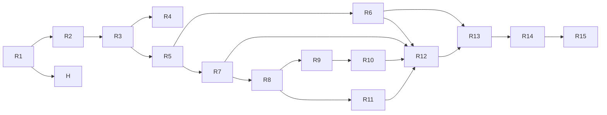
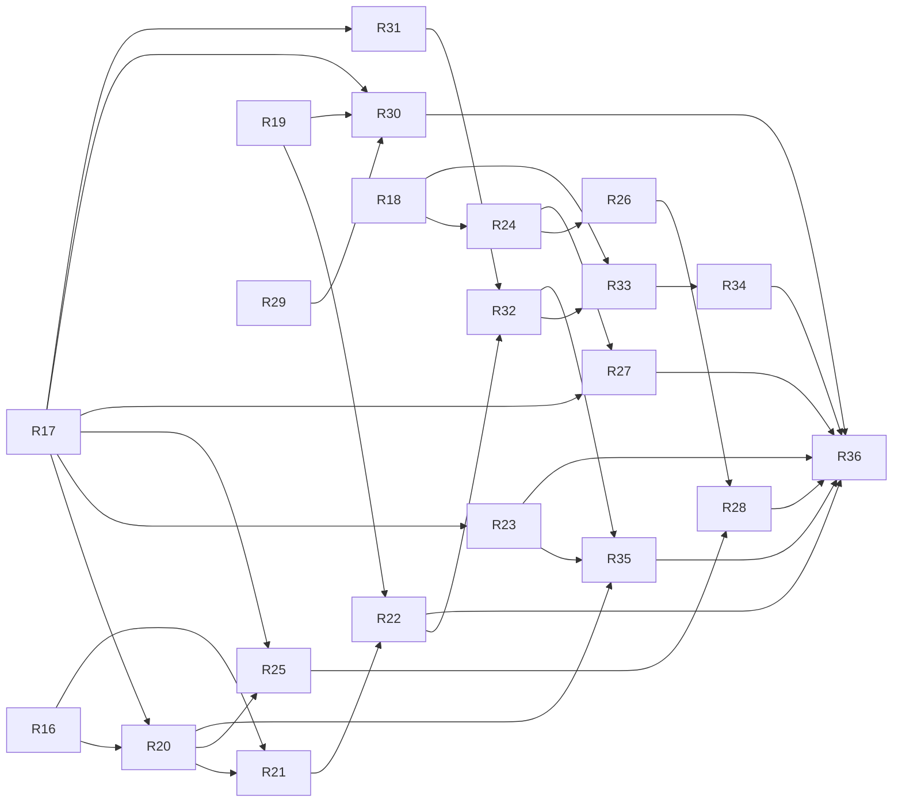

# What Is In Your Sky Right Now — Task Breakdown

| Field | Value |
|---|---|
| Status | Draft v0.2 — resliced as vertical slices, for review |
| Date | 2026-09-01 |
| Inputs | `SPEC.md` v0.4, `PLAN.md` v0.2 (Decisions D-1..D-17 and §8, §10 treated as fixed) |
| Scope | MVP (spec Phase 0 + Phase 1). v1 items are not broken down here. |
| Inputs (v1) | `SPEC.md` v1.0, `PLAN.md` v0.3 (Decision Log V1-1..V1-11 and Decisions D-69..D-87 with §16 treated as fixed) |
| Scope (v1) | Spec Phase 2 "outdoor-ready": R16–R36 in the `## v1 tasks` block below, delivered by lanes and waves (PLAN §16). |
| Supersedes | v0.1 (T1–T22). Mapping from old task IDs is given per task under **Built from**. |

## Conventions

- Tasks are ordered; the order is a valid serial execution. Each task is sized for one pull request and touches at most three modules. R1 and R2 are the largest by design (a spike cannot run without the physics core it validates; the first visible slice cannot run without the scaffold).
- Every task after R1 delivers something a user can see on screen or run end-to-end. The three exceptions (R1, R14, H) carry a one-line **Why not a slice** justification.
- **Satisfies** lists the requirement IDs the task completes. **Advances** lists IDs the task contributes to but that are only fully met by a later task.
- **Depends on** lists task IDs that must be checked off first (the `sdd-task` skill refuses to start otherwise).
- **[P]** in the heading means the task has no dependency on its neighbouring [P] tasks; **Parallel with** names them explicitly.
- **Done when** items are the acceptance checks: a command whose output is stated, a test that passes, or a visual check with a stated expectation. "Tests pass" always means `npm test` (Vitest) unless a narrower command is given. From R2 on, every slice adds its own case to `tests/e2e/` rather than deferring to a separate e2e task.
- Fixtures are dated and immutable (PLAN §9.3). Nothing in `src/physics`, `src/worker`, or `src/lib` reads the wall clock (D-15).

---

## Tasks

- [x] **R1 — Physics validation spike (Task Zero): reproduce Heavens-Above ISS passes for Neuquén within 1 min / 5°**
  - **Done 2026-09-02:** as specified. Additions: `src/model/catalog.ts` holds the catalog *types* (needed by `pass.ts`/`elements.ts`; the JSON and schema stay in R3); `src/physics/reference.test.ts` enforces `reference-values.json`; comparison logic lives in `tests/support/heavensAbove.ts` so the script and the golden test share it. Only one visible pass existed in the window and it is horizon-bounded, so D-8 was checked against satellite.js's conical model instead of Heavens-Above (PLAN §2.1).
  - **Why not a slice:** It is the physics spike the slicing rule explicitly places before the first slice; it retires the riskiest unknown and is runnable end-to-end as a script.
  - **Built from:** T1, unchanged.
  - **Goal:** Prove the pure physics pipeline against Heavens-Above before any UI exists, and commit the comparison as an offline golden test.
  - **Satisfies:** spec §4.3 visibility rules, FR-VIS-2, FR-VIS-3, FR-VIS-6, FR-VIS-7, FR-SAT-3. **Advances:** FR-VIS-1. Validates PLAN D-1, D-2, D-7, D-8 and delivers PLAN §10.
  - **Depends on:** —
  - **Parallel with:** —
  - **Scope (PLAN §4, §6.3, §10):**
    - Minimal Node tooling only: `package.json` (`"type": "module"`), `tsconfig.json` (strict, `noUncheckedIndexedAccess`, `exactOptionalPropertyTypes`), Vitest, `tsx`. Runtime deps: `satellite.js` ^7, `astronomy-engine` ^2. No Vite, no React (R2).
    - `src/model/{observer,pass,thresholds,elements}.ts` exactly as PLAN §5 (`catalog.ts` and `weather.ts` come in R3 and R8).
    - `src/physics/`: `constants.ts`, `time.ts`, `sgp4.ts`, `frames.ts`, `sun.ts`, `shadow.ts`, `magnitude.ts` (D-1 form), `visibility.ts`, `passes.ts` (the §6.3 algorithm: 30 s coarse scan, bisection on the 10° crossings, 1 s dense sampling, longest visible run, parabolic peak, `twilight` flag, `track` every 10th sample), `index.ts`. Time enters every function as a parameter.
    - `scripts/validate-iss.ts`, the fixture pair, `tests/fixtures/heavens-above/README.md`, `src/physics/passes.golden.test.ts`, and `tests/fixtures/reference-values.json` (pinned intermediate values later tasks check against, see below).
  - **Heavens-Above comparison procedure (to be reproduced verbatim in the fixture README):**
    1. **Set the observer.** On heavens-above.com open *Change your observing location*. Enter latitude `-38.93`, longitude `-67.99`, elevation `0` m, name `Neuquen (spike)`. Set the time-zone selector to **UTC** (listed as UTC / GMT, no DST). Submit and confirm the page header shows the coordinates and "Time zone: UTC". All later pages read these settings from the site cookie.
    2. **Open the ISS visible-pass list.** Go to *Satellites → ISS → 10-day predictions for passes* (`PassSummary.aspx?satid=25544`). Leave **Visible only** selected (the default). Copy into the README the page's own wording on its filters (the altitude cutoff at 10° and any brightness cutoff) so extras can be explained against it later.
    3. **Record the capture time** `capturedAt` (UTC, to the minute) *before* transcribing anything. The comparison window is `[capturedAt, capturedAt + 10 days]`.
    4. **Transcribe every pass from its detail page, by hand.** Heavens-Above prohibits scraping. For each row of the summary table click through to `PassDetails.aspx` and record: the date, the brightness (mag), and, for every event row present, the time (HH:MM:SS UTC), altitude (°) and azimuth (° with compass letters). Event rows are: *Rises*, *Reaches altitude 10°*, *Maximum altitude*, *Drops below altitude 10°*, *Sets*, and *Enters shadow* or *Exits shadow* when they apply. **Azimuths must come from the detail page in degrees.** The summary table shows 16-point compass letters (±11.25°), which is too coarse for the 5° criterion.
    5. **Record the elements Heavens-Above is using.** Open *ISS → Orbit* (`orbit.aspx?satid=25544`) and note the element epoch shown there as `haEpoch`.
    6. **Save the fixture** as `tests/fixtures/heavens-above/<YYYY-MM-DD>-neuquen-iss.json` with the shape `{ capturedAt, observer: { lat, lon, altM }, timeZone: "UTC", haEpoch, filtersText, passes: [ { date, magnitude, events: { rises?, reaches10?, max, drops10?, sets?, entersShadow?, exitsShadow? } } ] }`, each event `{ t, altDeg, azDeg, compass }`. A re-capture is a new dated file, never an edit.
    7. **Capture elements within the same hour** as step 3:
       ```
       curl -sS 'https://celestrak.org/NORAD/elements/gp.php?GROUP=stations&FORMAT=json' -o tests/fixtures/omm/<YYYY-MM-DD>-stations.json
       curl -sS 'https://celestrak.org/NORAD/elements/gp.php?GROUP=visual&FORMAT=json'   -o tests/fixtures/omm/<YYYY-MM-DD>-visual.json
       ```
       Write `fetchedAt` and the `EPOCH` of NORAD 25544 into `tests/fixtures/omm/<YYYY-MM-DD>.meta.json` and into the README. If `haEpoch` and that `EPOCH` differ by more than one day, re-capture both sides together (PLAN §10.1 step 2).
    8. **Run the pipeline** with `npx tsx scripts/validate-iss.ts`: `findPasses` for NORAD 25544 over the window from step 3, observer from step 1, `minElevationDeg = 10`, `sunAltMaxDeg = -6`, `twilightLabelSunAltDeg = -12`, **no magnitude cut** (brightness is compared separately). The script reads only the committed fixtures; it never fetches.
    9. **Map the three comparison points.** Our `start` pairs with the Heavens-Above event that begins the visible pass: *Reaches altitude 10°*, or *Exits shadow* / *Rises* when the summary table's Start column matches that row instead. Our `peak` pairs with *Maximum altitude*. Our `end` pairs with *Drops below altitude 10°* or *Enters shadow*, whichever the summary's End column matches. The row used for `end` is Heavens-Above's implied end reason (`horizon` vs `shadow`) and is compared with our `endReason`.
    10. **Pair passes** by peak time, nearest within ±15 min. Print unpaired passes on both sides.
    11. **Compare** each pair: |Δt| at start / peak / end, |Δaz| (wrapped to ≤ 180°) and |Δel| at each. A pass **passes** when every |Δt| ≤ 60 s and every |Δaz|, |Δel| ≤ 5°. Print one table row and PASS/FAIL per pass, then `OVERALL: PASS` or `OVERALL: FAIL`.
    12. **Brightness (informational).** Print our `peakMagnitude` beside Heavens-Above's listed magnitude per pass, to sanity-check D-1 and the ISS `stdMag` seed value (use −1.8 as the seed pending R3's provenance work; record the value actually used).
    13. **Explain every extra.** Any pass we list that Heavens-Above omits is documented per pass in the README (e.g. `twilight = true` and Heavens-Above applies a stricter sun rule; or peak magnitude fainter than their cut). Unexplained extras fail the spike.
    14. **If it fails,** follow PLAN §10.3 in order: time base (single propagated ECI position against satellite.js's own test vector; ms↔JD; `EPOCH` parsed as UTC) → frames (GMST, east-positive longitude in radians) → sun-vector frame (declination check for the date) → shadow-entry offsets (revisit D-8 only with evidence) → element-epoch mismatch (re-capture together).
  - **Done when:**
    - `npx tsx scripts/validate-iss.ts` prints the per-pass table, no unpaired Heavens-Above passes, and `OVERALL: PASS`; every paired pass within 60 s / 5° / 5° at all three points; `endReason` matches Heavens-Above's implied end for every pass.
    - `npx vitest run src/physics/passes.golden.test.ts` passes offline and Vitest reports the file's duration under 2 s.
    - `npx tsc --noEmit` is clean.
    - `tests/fixtures/heavens-above/README.md` contains the procedure above, `capturedAt`, `fetchedAt`, both epochs, the filters text, and the per-pass explanation of any extras.
    - `tests/fixtures/reference-values.json` pins, for `capturedAt` exactly: ISS ECI position and velocity, GMST, look angles from the observer, sun altitude at the observer, sun unit vector, and the first golden pass's start / peak / end. Later physics tasks assert against this file (per `sdd-task`).
    - Findings appended to PLAN.md Decisions: whether `satellite.js` `json2satrec` accepts CelesTrak field names as-is (else the mapping layer in `sgp4.ts`); measured Node runtime for ISS × 10 days; any systematic shadow-entry offset observed against D-8.

- [x] **R2 — Type coordinates, see the next ISS pass as one line of text**
  - **Note (2026-09-02):** done as specified; components live at the PLAN §4 paths (`ui/components/location/CoordsInput.tsx`, `ui/components/passes/NextPassLine.tsx` + `nextPass.ts`); Vite pinned to 7.x with Vitest 3.2 and worker chunks set to ES format (PLAN D-18, D-19).
  - **Built from:** T2 (scaffold, CI, Playwright bootstrap), T12 (coordinates field only), T7 (plain `stations` fetch, no cache), T9 (UTC time formatting), T10 (`--font-mono` and dark ground only).
  - **Goal:** Turn the spike repo into the Vite + React 19 + TypeScript app of PLAN §4 and §11 and ship the thinnest possible product: a coordinates field and a single line naming the next visible ISS pass.
  - **Satisfies:** PLAN §11 build/CI (typecheck → test → build → Playwright). **Advances:** FR-LOC-1 (b), FR-LOC-3 (UTC formatting half, D-3), FR-SAT-2, FR-VIS-1, FR-X-1, FR-X-6 (font token).
  - **Depends on:** R1
  - **Parallel with:** H
  - **Scope:**
    - Vite + `@vitejs/plugin-react`, `build.target = 'es2022'`; `tsconfig.app.json` / `tsconfig.node.json`; ESLint flat config with `typescript-eslint` strict and `react-hooks` (module-boundary rules arrive in R5 when the boundaries exist); Vitest config with jsdom for `src/ui` and Node elsewhere; `tests/setup/` with MSW; `.github/workflows/ci.yml`; Playwright installed with `tests/e2e/` scaffolding and fixture routes for CelesTrak.
    - `src/ui/styles/tokens.css` with `--font-mono` and `--cell` (D-5) and a dark ground colour; `src/main.tsx`, `App.tsx`.
    - `data/celestrak.ts` (zod-validated fetch of the `stations` group, bad records dropped; no cache yet).
    - `ui/CoordsInput.tsx` accepting `lat, lon` text with range validation only (formats, altitude, and geolocation come in R10).
    - `lib/timeFormat.ts` (`Intl.DateTimeFormat` HH:MM:SS; UTC with an explicit "UTC" label when `timeZone` is null).
    - `ui/NextPassLine.tsx`: runs `findPasses` on the main thread for NORAD 25544 over the next 10 days and renders one line: name, start time (UTC), start compass azimuth in degrees, max elevation, end time.
  - **Done when:**
    - `npm run dev` serves the page; typing `-38.93, -67.99` renders the next ISS pass as one line of text.
    - One Playwright smoke test is green in CI: with `page.clock` fixed to the R1 `capturedAt` and CelesTrak routed to the R1 fixture, typing the Neuquén coordinates shows a line whose start time and max elevation match the first golden pass.
    - `npm run typecheck`, `npm run lint`, `npm test`, `npm run build` all exit 0 and R1's golden test still passes.

- [x] **R3 — Pass list for the full curated catalog**
  - **Note (2026-09-02):** done as specified, with one deliberate change: the list window is 24 h from "now" (FR-VIS-1's MVP window) instead of R2's 10-day ISS search, because ~30 objects × 10 days on the main thread would freeze the page for seconds; the Playwright clock is therefore pinned to `capturedAt + 9 d` so the golden pass stays in the window (PLAN D-20). `stdMag` values come from Mike McCants' `qs.mag` (2020-09-14), ISS = −2.5; Tiangong carries a documented estimate (PLAN D-22). Live check output (`present: 31, missing: 0`) is in PR #3.
  - **Built from:** T3, T7 (`visual` + `stations` fetch, dedupe, unavailable ids), T15 (plain cards, progressive rendering deferred to R5), T9 (16-point compass).
  - **Goal:** Replace the single ISS line with a list of every upcoming visible pass for the ~30-object MVP catalog, each card carrying the FR-VIS-3 fields in plain text.
  - **Satisfies:** FR-SAT-1, FR-SAT-5, FR-SAT-3 (catalog side), FR-VIS-1, US-5 (plain fields). **Advances:** FR-SAT-2, FR-SAT-4 (`epochMs` on every record), FR-SAT-6, FR-X-2 (README attributions), spec §8 rank 1 (ISS `featured`).
  - **Depends on:** R2
  - **Parallel with:** H
  - **Scope:** `src/model/catalog.ts`; `src/data/catalog/catalog.json` seeded from the brightest entries of the R1 `visual` + `stations` fixtures, each with `stdMag`, `stdMagSource { source, date, note }`, `category`, `description`, `featured: true` on the ISS; `schema.ts` (zod); `catalog.test.ts`; `scripts/check-catalog.ts` (live, manual). `data/elementsLoader.ts` (PLAN §7.1 without the cache branch: fetch both groups, dedupe with `stations` winning, missing catalog ids reported in `unavailable` and logged with `console.warn`; per-object `CATNR` URLs never requested). `lib/compass.ts` (16-point). `ui/PassCard.tsx` (name, start time, max elevation, peak compass + degrees, duration, magnitude number) and `ui/PassList.tsx` with an empty state; still computed on the main thread.
  - **Done when:**
    - `catalog.test.ts` passes: every entry validates, NORAD ids unique, exactly one `featured` entry, every `stdMagSource.source` non-empty and `date` ISO, 25–35 entries, every `noradId` present in the R1 OMM fixtures.
    - `npx tsx scripts/check-catalog.ts` (network) prints `present: N, missing: 0`; output pasted into the PR.
    - Loader tests pass: `stations` wins on duplicate ids; a catalog id absent from both groups appears in `unavailable`; a record failing the schema is dropped and the rest kept; the MSW handler asserts no `CATNR` request.
    - Playwright: the Neuquén flow now shows a list, the first golden pass is among the cards with the expected fields; compass boundary tests pass (11.24° → N, 11.25° → NNE, 359.9° → N).

- [x] **R4 [P] — Deploy the thin product to Cloudflare Pages with the strict CSP**
  - **Done 2026-09-02:** as specified, plus: `vite preview` serves `public/_headers` the way Pages does (PLAN D-25), so `tests/e2e/deploy-headers.spec.ts` checks the header values and zero CSP violations offline; that test caught zod's `new Function` probe, so zod now runs jitless through `src/data/zod.ts` (D-26); `tests/deploy/headers.test.ts` pins the file to the PLAN §11 block and checks `connect-src` covers every host the code references; `.node-version` pins Node 24 for the Pages build. The Pages project is created in the Cloudflare dashboard (steps in `README.md`); the live `curl -sI` and phone checks are done against it before this PR merges.
  - **Built from:** T22 (Pages project, `_headers`, README link). Bundle budgets, live-contract workflow, and the release checklist move to R11 and R15.
  - **Goal:** Put the R3 app on a public HTTPS URL with the PLAN §11 headers so every later slice ships as it merges.
  - **Satisfies:** FR-X-3 (headers, no third-party hosts), PLAN D-12, §11 CSP, spec Phase 1 DoD "public HTTPS URL". **Advances:** FR-X-2 (attributions in README).
  - **Depends on:** R3
  - **Parallel with:** R5, H
  - **Scope:** `public/_headers` exactly as PLAN §11; Cloudflare Pages project wired to the repo (preview per PR, production on main); `README.md` with the public URL and CelesTrak / Open-Meteo attributions.
  - **Done when:**
    - `curl -sI https://<site>/` shows the `Content-Security-Policy`, `Referrer-Policy`, and `Permissions-Policy` values from PLAN §11; `curl -sI https://<site>/assets/<any-file>` shows the immutable cache header.
    - The deployed site, opened on a phone over HTTPS, completes the R3 flow by hand; DevTools console shows zero CSP violations and the Network panel shows requests only to the site and CelesTrak.

- [x] **R5 [P] — Compute off the main thread: streaming cards, ISS first, cancel on location change**
  - **Done 2026-09-02:** as specified, with these differences: `eslint-plugin-import-x` (same `no-restricted-paths` rule) instead of `eslint-plugin-import`, which does not support ESLint 10 (PLAN D-28); `src/state` may import `src/physics/constants` for the thresholds the protocol carries (D-27); `hasDarkness` lives in `physics/darkness.ts` with its own reference test; `computeNow` answers `INTERNAL` until R7; the Playwright "throttled worker route" delays the worker script and progressive rendering is proven from a MutationObserver log of card ids (D-29). The Vitest browser project is part of `npm test`, so CI installs Chromium before the unit tests. Perf: 373–378 ms locally for 31 objects × 24 h, three runs; the CI log is linked from PR #6.
  - **Built from:** T6, T11 (store, worker client, cancellation, effects), T4 (performance budget test), T2 (module-boundary lint rules).
  - **Goal:** Move `findPasses` into the Web Worker behind the typed protocol, wire a Zustand store with cancellation, and make the list render progressively with the featured object first.
  - **Satisfies:** FR-VIS-4, spec §5.6 cancel-on-location-change, PLAN §3 dependency rules, §9.3 determinism rules. **Advances:** FR-GUIDE-5 (lint rule against `canvas`/WebGL imports), FR-X-3 (observer never leaves the allowed hosts), spec §5.6 `hasDarkness`.
  - **Depends on:** R3
  - **Parallel with:** R4, H
  - **Scope:** `src/worker/protocol.ts` exactly as PLAN §6.2 plus `jobDone.hasDarkness: boolean` (recorded in PLAN Decisions); `handlers.ts` (`createHandler(state)`; featured objects first; `MessageChannel` yield between objects; `BAD_OMM` per object in `elementsLoaded.rejected`; `PROPAGATION_FAILED` skips the object; `INTERNAL` aborts); `passes.worker.ts`; `handlers.test.ts` in Node; `worker.integration.test.ts` in Vitest browser mode. `state/store.ts` with `location`, `elements`, `passes` slices; `state/workerClient.ts` (owns the `Worker`, request/response correlation, ignores stale ids, auto-cancels the previous `computePasses`); `state/effects.ts` (observer change → load elements if needed → `computePasses`). `PassList` renders as `passes` messages stream in. `physics/passes.perf.test.ts` (30 records × 24 h under 1.5 s in Node). ESLint `no-restricted-paths` for every row of the PLAN §3 table, `no-restricted-globals` for `Date` in `src/physics`, `src/worker`, `src/lib`, and the app-wide rule against `canvas` / `webgl` imports.
  - **Done when:**
    - `handlers.test.ts` covers: one `passes` message per object with the featured object first; `cancel` mid-job yields `jobDone { cancelled: true }` with no further `passes`; a corrupt OMM appears in `rejected` and the rest load; `hasDarkness` is false for a high-latitude summer window.
    - Store tests with a fake worker: changing the observer twice quickly sends `cancel` for the first job and ignores its late `passes`; MSW asserts only CelesTrak is called.
    - `npx vitest run --project browser` boots the bundled worker and returns at least one ISS pass in the golden window.
    - `passes.perf.test.ts` passes under 1.5 s three runs in a row in CI (link the CI log).
    - Probe files `src/physics/_probe.ts` (`import 'react'`) and `src/lib/_probe.ts` (`Date.now()`) each fail `npm run lint`; both removed before merge.
    - Playwright: with a throttled worker route, cards appear one at a time with the ISS first; changing coordinates mid-stream leaves only the second location's cards.

- [x] **R6 [P] — Pass detail screen with the plain-text observation guide and numeric table**
  - **Done 2026-09-02:** as specified, with these differences: the number formatting the card and the table share moved from `PassCard.tsx` to `lib/format.ts`; the golden guide strings (`tests/fixtures/guide-sentences.json`) use the catalog's ISS `stdMag`, so the golden pass reads "+0.5, like a bright star" rather than the reference file's +1.2 from the R1 seed (PLAN D-34); a hash id with no exact match falls back to the same object's pass starting within 2 min (D-33); a band boundary belongs to the higher elevation band and the brighter magnitude band (D-32); the list is `inert` while the sheet is open; "reload with `#pass=<id>`" is a component test that mounts `App` with the hash set and lets the pass arrive in the store, because the observer is not persisted until R10. Screenshot at 390 px: `docs/screenshots/r6-pass-detail-390.png`.
  - **Built from:** T9 (elevation words, brightness phrases, guide sentence), T16.
  - **Goal:** Open a pass into a full-screen detail sheet with the generated sentence, the numeric details, the end-condition wording, and a live countdown rise → peak → set. This working text guide must exist before any sky-chart work.
  - **Satisfies:** US-6 AC1, AC2, AC4; FR-GUIDE-1, FR-GUIDE-3, FR-VIS-7 (guide text and card label), FR-X-5 (chart information duplicated in text), PLAN D-13 (hash mirrors the selected pass).
  - **Depends on:** R5
  - **Parallel with:** R7, H
  - **Scope:** `lib/phrases.ts` (elevation words 10–25 low / 25–50 mid-sky / 50–75 high / > 75 almost overhead; brightness bands from FR-GUIDE-3; `guideSentence(pass, timeZone)` reproducing the US-6 AC1 template with the end condition worded as "disappears into Earth's shadow" vs "drops below the horizon" vs "fades into the brightening sky", and the "sky still bright" clause when `twilight`); `ui/Countdown.tsx` (pure display, takes `now` as a prop); `screens/PassDetail.tsx` (full-screen sheet, close returns to the list, `location.hash = #pass=<id>` on open and restored on reload), `GuideText.tsx`, `PassNumbers.tsx` (rise / peak / end azimuth in ° and 16-point, max elevation, times to the second, duration, magnitude, range at peak, start and end reasons); brightness phrase and "sky still bright" label added to `PassCard`. Leave a labelled placeholder slot where `SkyChart` will mount.
  - **Done when:**
    - Phrase tests: elevation words at 25 / 50 / 75 exactly; brightness phrase at −4, −1.4, +1, +3; golden strings for the guide sentence on the first R1 golden pass in UTC, one per end reason and one with `twilight = true`.
    - Component tests: the guide sentence for the first golden pass equals the golden string; every FR-VIS-3 field appears in the numeric table; opening sets the hash and reloading with `#pass=<id>` reopens the same pass; Escape and the close control return to the list; the twilight label is present only when `twilight`.
    - `jest-axe` passes; the sheet has `role="dialog"`, a labelled heading, and focus moves into it on open and back on close.
    - Playwright: Neuquén flow → open the golden pass → the sentence on screen equals the golden string. Visual check at 390 px: sentence and countdown readable at arm's length; screenshot in the PR.

- [x] **R7 [P] — "Now" panel refreshing every 10 s** — done as written; `jest-axe` added as a dev dependency (PLAN §11.1 listed it, nothing had installed it), and the Playwright test also advances the page clock 10 s to see the countdown move (US-4 AC2 end to end).
  - **Built from:** T4 (`physics/now.ts`), T6 (`computeNow`), T11 (`now` slice and 10 s tick), T14.
  - **Goal:** Show at a glance which satellites are visible this instant, or state plainly why none are, updating every 10 s while the tab is visible.
  - **Satisfies:** FR-VIS-5, US-4, spec §5.6 "no darkness tonight". **Advances:** FR-WX-3 ("Now" half, cloud % arrives in R8).
  - **Depends on:** R5
  - **Parallel with:** R6, H
  - **Scope:** `physics/now.ts` + test (visible / in shadow / below horizon / daylight items, `SkyState`, `visibleUntil`; asserts against `reference-values.json`); `computeNow` handler in the worker; `now` store slice and the effect firing `computeNow` every 10 s while the tab is visible; `ui/NowPanel.tsx` (list of `visible` items with compass + degrees azimuth, elevation, time remaining with end reason; empty states keyed on `sky` and item flags; `hasDarkness === false` message).
  - **Done when:**
    - `now.test.ts` passes and `handlers.test.ts` gains: `computeNow` returns a `NowState` matching `physics/now.ts` on the R1 fixture.
    - Component tests pass for every state: one visible item (azimuth "WSW 247°", elevation, "sets in 3:12"), daylight, nothing above 10°, everything in shadow, no darkness tonight.
    - With fake timers, `computeNow` fires every 10 s, stops when `document.hidden`, and the panel re-renders without remount.
    - `jest-axe` passes; the panel is a labelled `region`. Playwright: at the fixed clock the panel shows the expected state for Neuquén.

- [x] **R8 — Cloud verdict on every card and the Now panel, times in the observer's zone** — done as written; the Now panel's cloud figure is the forecast interpolated to the instant of the last sky check (FR-WX-2's rule, which is the hourly value on the hour); zone abbreviations are Intl's short names (`GMT-3` for Argentina, `BST` / `CEST` where CLDR has one), see D-36.
  - **Built from:** T8 (forecast fetch, per-cell cache, verdict rule), T15 (`CloudBadge`), T14 (current cloud %), T11 (`weather` slice, zone from forecast, weather never blocks passes), T9 (local-zone formatting).
  - **Goal:** Fetch the hourly cloud forecast, turn it into a three-state verdict per pass, badge the cards and the Now panel with it, and switch displayed times from UTC to the observer's zone taken from the forecast response.
  - **Satisfies:** FR-WX-1, FR-WX-2, FR-WX-3, FR-WX-4, FR-WX-5, FR-LOC-3 (zone from forecast, local-time display). **Advances:** FR-X-4 (weather failure leaves passes intact).
  - **Depends on:** R7
  - **Parallel with:** H
  - **Scope:** `src/model/weather.ts`; `data/openMeteo/{forecast,schemas}.ts` (exact URL from PLAN §7.3, `timeformat=unixtime`); `data/weatherCache.ts` (memory + `localStorage` `wiys:wx:v1`, 30 min eviction, `cellKey` rounded to 0.1°); `lib/cloudVerdict.ts` (linear interpolation per layer to peak time; `0.6·low + 0.3·mid + 0.1·high` else `total`; < 30 / 30–70 / > 70; `unknown` when no snapshot); recorded responses in `tests/fixtures/open-meteo/`; `weather` store slice and effect (fetched with `computePasses`, rejection leaves passes intact and verdicts `unknown`; `Observer.timeZone` filled from the forecast when null); `ui/CloudBadge.tsx` with tooltip stating the 30 / 70 % thresholds, forecast timestamp and provider; cloud % in `NowPanel`; `timeFormat` now shows zone abbreviation.
  - **Done when:**
    - Tests cover: forecast request has exactly four `hourly` variables and `forecast_days=3`; two locations in the same 0.1° cell share one fetch; a cache entry older than 30 min is refetched; verdict boundaries at 29.9 / 30 / 70 / 70.1 %; layered vs total formula; midpoint interpolation; missing snapshot → `unknown`; weather rejection leaves passes intact; formatting a fixed epoch in three zones gives the expected strings and abbreviations.
    - Component tests: badge three states plus unknown; tooltip includes "30", "70" and the forecast timestamp; Now panel shows the latest hourly value and "weather unknown" on failure.
    - Playwright: Neuquén flow shows badges from the recorded response and card times in `America/Argentina/Salta`; with the Open-Meteo route aborted, the list still renders and badges read unknown.

- [x] **R9 — Place-name search with pick list** — done as written; the search reaches the UI as a function through `src/state` (no store slice), Enter searches at once and picks the highlighted (else first) row, `Place.admin1` / `country` are optional and the label joins whatever is present, see D-38..D-40; the empty-state prompts of the pass list and the Now panel now say "Enter a place name or coordinates".
  - **Built from:** T8 (geocode fetch, session cache), T13.
  - **Goal:** Debounced place-name search backed by Open-Meteo geocoding with an ambiguous-result pick list, confirmation of the chosen place, and a fallback to coordinates on failure.
  - **Satisfies:** FR-LOC-1 (a), FR-LOC-2, FR-LOC-3 (zone from geocode), FR-LOC-6 (place half), US-1.
  - **Depends on:** R8
  - **Parallel with:** R11, H
  - **Scope:** `data/openMeteo/geocode.ts` (exact URL from PLAN §7.2); session cache keyed on the normalised query; `ui/PlacePicker.tsx` (free-text field, 500 ms debounce, list of name / admin1 / country, keyboard-navigable listbox), empty and error states with a link to the coordinates input, "Using the centre of <place>" confirmation line.
  - **Done when:**
    - Tests cover: geocode result maps to `Place` with `timeZone`; identical normalised queries hit the network once; typing "Ros", "Rosa", "Rosar" within 400 ms results in one request; selecting a result sets an observer with `source: 'geocode'`, `label` "name, admin1, country" and the returned `timeZone`; zero results show the message and the coordinates link; a network error leaves the field usable.
    - Playwright: search → pick list → confirmation line → pass list for the picked place. Visual check at 390 px: font ≥ 16 px, row height ≥ 44 px; screenshot in the PR.

- [x] **R10 — Device geolocation, saved location, clear action, precision note** — done as written; the clear action also drops the active observer so the screen visibly empties, the altitude field is limited to −500..9000 m, a device fix is always fresh (`maximumAge: 0`), and `StorageLike` moved to `src/data/storage.ts` for both caches, see D-41..D-44.
  - **Built from:** T12 (geolocation half, coordinate formats, altitude field), T11 (`prefs` slice, `localPrefs`).
  - **Goal:** Let the user use browser geolocation or richer coordinate forms, come back to the same location on reload, clear it, and see the precision honestly.
  - **Satisfies:** FR-LOC-1 (b, c), FR-LOC-5, FR-LOC-6 (coordinate half), US-2, US-3, US-8.
  - **Depends on:** R9
  - **Parallel with:** R11, H
  - **Scope:** `CoordsInput` extended to space-separated and `N/S/E/W` suffix forms plus an altitude field (default 0); `UseMyLocation.tsx` (shown only when `navigator.geolocation` exists and `isSecureContext`; denial shows a non-blocking message; accuracy shown only when worse than 1 km); `LocationInput.tsx` container showing the active observer as rounded coordinates plus a "clear saved location" action and the "city-level precision" note; `data/localPrefs.ts` (`wiys:prefs:v1`: last observer) and the `prefs` store slice.
  - **Done when:**
    - Component tests: each accepted coordinate format parses to the same observer; lat 91 and lon −181 show inline errors and do not update the store; geolocation denial renders the message and leaves inputs enabled; accuracy 2 000 m is displayed, 300 m is hidden; the button is absent when `navigator.geolocation` is undefined; reload restores the last observer; the clear action empties the observer in `wiys:prefs:v1`.
    - `jest-axe` passes on the container; all inputs reachable by Tab in order. Playwright: reload after entering coordinates restores the same pass list without re-typing.

- [x] **R11 [P] — Offline recompute and stale-data banners** — done as written, plus: the epoch age is always shown as a line above the banners (FR-SAT-4 "display the epoch age"), an info banner lists the catalog objects with no elements (the "unavailable" list R3 left unshown), and the Playwright offline test has two more cases (stale warning after a 3 h reload with CelesTrak unreachable; epoch warning five days on). The live suite passed once manually on 2026-09-02 (5 tests); GitHub only registers a workflow once it is on the default branch, so the workflow's first green run is dispatched (`gh workflow run live-contract.yml`) right after this PR merges (see PLAN §2.12).
  - **Built from:** T7 (IndexedDB cache, Web Locks single-flight, 2 h rule, stale-on-failure), T11 (15 min re-check), T15 (epoch-age and stale banners), T10 (`Banner.tsx`), T17 (offline e2e), T22 (live-contract workflow).
  - **Goal:** Cache elements raw in IndexedDB so a new location still yields passes offline, refresh them on a 2 h rule enforced across tabs, and warn honestly when elements are old or could not be refreshed.
  - **Satisfies:** FR-SAT-2, FR-SAT-4, FR-SAT-6, FR-X-4, spec §9.1 live-contract row.
  - **Depends on:** R8
  - **Parallel with:** R9, R10, H
  - **Scope:** `data/elementsCache.ts` (`idb`, DB `wiys`, store `elementGroups`, Web Locks single-flight with timestamp-only fallback, in-memory fallback when IndexedDB throws); loader gains the cache branch and `stale` flag; `tests/setup/` gains `fake-indexeddb`; effect re-checking elements every 15 min (loader enforces the 2 h rule); `ui/Banner.tsx` (info / warning variants) used when the newest element epoch is older than 5 days and when elements are `stale`; `.github/workflows/live-contract.yml` daily with `LIVE=1` (CelesTrak and Open-Meteo parse, catalog membership, CORS header is `*`, opens an issue on failure).
  - **Done when:**
    - Tests cover: no network call when `fetchedAt` is younger than 2 h; exactly one network call when two concurrent `loadElements()` run with a stale cache; network failure with a cache returns records flagged `stale`; network failure without a cache rejects; IndexedDB-throws path falls back to memory; the 15 min effect calls the loader without bypassing the 2 h rule; epoch-age banner appears at 5 days + 1 s and not at 5 days − 1 s; stale banner appears when the loader reports `stale`; `jest-axe` passes on each Banner variant.
    - Playwright: reload with all routes set to `abort` → cached passes still shown and weather badges read unknown.
    - `LIVE=1 npx vitest run tests/live` passes once manually and the scheduled workflow has one green run.

- [x] **R12 — Visual identity, accessibility pass, sort toggle, ISS hero card** — done as written, plus: the hero pass is pulled out of the list rather than repeated, the list re-checks which featured pass is next every 30 s, "best first" is `10^(−0.4·m) × peak elevation` (reference-magnitude independent), and the ratio table in `tokens.css` is pinned by a test (`tests/styles/tokens.test.ts`, `scripts/contrast.ts`); the ratios are in the PR. See D-49..D-53.
  - **Built from:** T10 (colour tokens with contrast ratios, borders, focus styles, tap targets, footer attributions), T15 (sort toggle, hero card), T17 (tab-order e2e).
  - **Goal:** Apply the monospace dark terminal identity and the accessibility bar to every existing screen, add the footer attributions, and finish the pass list with the ISS hero card and sort toggle.
  - **Satisfies:** FR-X-1, FR-X-2, FR-X-5 (contrast, keyboard), FR-X-6 (interface), spec §8 rank 1 (ISS hero), US-5 (sorting). 
  - **Depends on:** R6, R7, R10, R11
  - **Parallel with:** H
  - **Scope:** `tokens.css` (colour tokens with documented contrast ratios, spacing in cell multiples), `global.css` (box-drawing or plain-character borders, focus-visible styles, 44 px minimum tap targets); `App.tsx` frame with header and `Footer.tsx` crediting CelesTrak and Open-Meteo (weather and geocoding, GeoNames-derived); `IssHeroCard.tsx`; `SortToggle.tsx` (chronological default, "best first" = brightness × elevation score; persisted in prefs); `jest-axe` on every screen.
  - **Done when:**
    - Every foreground/background token pair used for text is listed in a comment in `tokens.css` with its contrast ratio ≥ 4.5:1; ratios pasted into the PR.
    - Component tests: Footer contains the three attribution strings; hero card shown only when a featured object has a pass in the window; sort toggle reorders a three-pass fixture as expected and persists; `jest-axe` reports no violations on `App`, `PassList`, `PassDetail`, `NowPanel`, `LocationInput`.
    - Playwright: Tab order reaches every control on the Home screen. Visual check at 390 px on every screen: dark ground, monospace everywhere, no horizontal scroll, tap targets ≥ 44 px; screenshots in the PR.

- [x] **R13 — Sky geometry library and the 2D polar chart in the detail screen** — done as written, plus: the dome/polar view toggle is rendered only once a second view is registered (until R15 the `dome` preference falls back to the polar view, so a toggle would switch between two identical drawings); `PassDetail` now takes the observer instead of the time zone, since the chart wants it (PLAN §8.1); the guide sentence is shown once, as the chart's caption; the polar view labels are placed beside the track, never on it, and flipped when they would leave the drawing; a bracketed `OptionToggle` in `common/` serves the chart's toggles (`SortToggle` keeps its own copy). Screenshots in `docs/screenshots/r13-polar-390.png`, `r13-polar-map-390.png`, `r13-polar-high-390.png`.
  - **Built from:** T18, T20.
  - **Goal:** Implement the pure az/el projection helpers both chart views will share, create the single `SkyChart` boundary, and mount the SVG polar view with its orientation toggle in the pass detail screen.
  - **Satisfies:** US-6 AC5, FR-GUIDE-2b, FR-GUIDE-4 (polar toggle and label), FR-GUIDE-5 (SVG, no canvas), FR-GUIDE-7, PLAN §8.1 shared geometry. **Advances:** FR-GUIDE-2, FR-X-5.
  - **Depends on:** R6, R12
  - **Parallel with:** H
  - **Scope:** `lib/skyGeometry.ts` (`toDome(azDeg, elDeg): Vec3` with the PLAN §8.2 convention behind one function; `toPolar(azDeg, elDeg, orientation)` equidistant azimuthal; `resampleArc(track, stepDeg)` preserving start / peak / end; `interpolateTrack(track, t)`); `skychart/SkyChart.types.ts` (PLAN §8.1), `SkyChart.tsx` (`<figure>` with `<figcaption>` = guide sentence; view chosen from prefs with a dome/polar toggle; dome slot renders the polar view until R15 lands); `polar/SkyPolar.tsx` (horizon circle, 30°/60° rings, cardinal labels, track with rise / peak / set and shadow-entry markers and direction arrow, looking-up default with map toggle, convention labelled, `aria-hidden` on the drawing); `PassDetail` mounts `SkyChart`.
  - **Done when:**
    - Geometry tests: unit vectors for N/E/S/W and zenith (±1e−9); polar coordinates for the four cardinals in both orientations; resampling the first golden pass keeps start, peak, end and gives ~2° spacing; interpolation at the peak time returns the peak. No React imports in `src/lib` (lint passes).
    - `SkyChart.contract.test.tsx` runs against `SkyPolar` and asserts the caption text, the labelled anchors N/E/S/W, pass name and peak, `onSelectPass` with the pass id, and `aria-hidden` on the drawing; R15 adds the dome to the same test unchanged.
    - Polar tests: marker positions equal `toPolar` of start / peak / end in both orientations; the toggle flips east between left and right and changes the label; toggling persists in prefs.
    - `jest-axe` passes on `SkyChart` inside `PassDetail`. Playwright: `document.querySelector('canvas')` is null on every screen (kept valid by R15). Visual check at 390 px: chart fits without horizontal scroll; screenshot in the PR.

- [x] **R14 — glyphcss feasibility spike for the ASCII dome (throwaway page + findings)** — done as written, plus the horizon panorama prototype agreed in the R13 review (PLAN §8.5 item 7). The spike page lives in `spike/` (typechecked, linted, never bundled) rather than being deleted, with a capture script that regenerates every screenshot and figure. `toDome` flipped to Z up (D-58). Item 3 was measured under Chrome CPU throttling in Playwright, not on a phone (D-62); the on-device check stays in R15. Chart chunk 97 KB gzipped, budget set to 100 KB (D-63). P-OQ-1..3 resolved (D-59..D-61); the primary-view pick (dome or panorama) is the owner's from the screenshots, and R15 is re-scoped after it.
  - **Why not a slice:** It is a bounded risk spike whose product is a decision (P-OQ-1..3 and the D-16 replacement trigger); its throwaway page is visible but deliberately unbundled.
  - **Built from:** T19, unchanged apart from dependencies.
  - **Goal:** Answer the six PLAN §8.5 questions with screenshots and measurements before the dome is built, and decide P-OQ-1..3.
  - **Satisfies:** PLAN §8.5. **Advances:** FR-GUIDE-5, FR-GUIDE-6, D-16 replacement triggers, D-17.
  - **Depends on:** R13
  - **Parallel with:** H
  - **Scope:** A dev-only route or `spike/` page (excluded from the production build) rendering the first golden pass with the PLAN §8.3 composition using `@glyphcss/react` pinned to an exact version; `docs/spike-glyphcss/` with screenshots and a `FINDINGS.md`. The page is deleted or left unbundled at the end; only findings and any `toDome` sign fix are kept.
  - **Done when:**
    - `docs/spike-glyphcss/FINDINGS.md` answers each item with evidence: (1) screenshot of N/E/S/W hotspots at `rotY = 0` and the resulting `toDome` convention (R13 updated if flipped, with its tests); (2) screenshots of the 1.5°-wide strip at 60×30 and 100×50 cells on a 390 px viewport with a statement of continuity; (3) Chrome performance-panel figure for a 5 s drag on a mid-range Android phone: rasterisations per second and longest main-thread frame, versus the ≥ 30/s and 33 ms targets; (4) whether an interior perspective camera can see the inside of the strips; (5) whether `useColors` emits inline `style` attributes; (6) gzipped size of the chart chunk from `rollup-plugin-visualizer`.
    - P-OQ-1, P-OQ-2, P-OQ-3 resolved and appended to PLAN Decisions; if item 3 fails without a configuration fix, the decision names the D-16 replacement path and R15 is re-scoped before it starts.
    - `npm run build` output contains no spike page (verified by listing `dist/`).

- [x] **R15 — 3D ASCII sky dome as the default chart view, bundle budgets, release checklist** — done as written, with the dome as the primary view (spec UX-1 unchanged; the R14 panorama stays in `spike/`), plus: the camera is component state driven through `GlyphOrthographicCamera` props rather than `GlyphOrbitControls`, whose clamp is fixed at ±90° and whose handle the React binding does not expose (PLAN D-64); the grid follows the host width through our own `ResizeObserver` (D-65); the R13 contract test gained one `beforeAll` per view to warm the lazy chunk, otherwise unchanged (D-66); the budgets are `scripts/bundle-budget.ts` (main 109.2, chart 92.9, worker 34.2 KB gzipped, all within budget) with the visualizer behind `BUNDLE_STATS=1` (D-67); the readout carries the azimuth in degrees (`Facing NE (46°) · tilt 25°`). **R15 review (owner):** the polar chart is the default for now and both views share one `ChartFrame` so the toggle moves nothing (D-68); the dome grid is fixed at 60 × 30 with the cell scaled to the box and drawn in a generated braille font so rows fit and labels sit on the ring (D-65 amended); the dome's future (improve or remove) is a follow-up task. Not done here: the on-device phone check and the deploy-day Heavens-Above pass in `docs/RELEASE.md` need a phone and a deploy (owner). Screenshots in `docs/screenshots/r15-dome-390.png`, `r15-dome-high-390.png`, `r15-dome-high-tilt-390.png`.
  - **Built from:** T21, T22 (bundle budgets, `docs/RELEASE.md`).
  - **Goal:** Implement the observer-centred ASCII dome behind `SkyChartProps` using the composition and camera decided in R14, make it the default view, and close out the release with the bundle budgets and checklist.
  - **Satisfies:** US-6 AC3, FR-GUIDE-2, FR-GUIDE-4 (facing readout), FR-GUIDE-5, FR-GUIDE-6, FR-GUIDE-7, FR-X-6 (dome as part of the interface), PLAN §11 budgets, spec Phase 1 DoD.
  - **Depends on:** R14
  - **Parallel with:** H
  - **Scope:** `dome/domeGeometry.ts` (pure: horizon ring, dashed 30°/60° rings, eight meridians, pass strips with omitted quads near the end for direction, peak and shadow-entry and `now` markers at radius 1.02, compass and pass hotspot anchors), `dome/camera.ts` (`initialFor(pass)`: yaw = rise azimuth, pitch ≈ 25°, clamp 5°–80°), `dome/SkyDome.tsx` (`GlyphScene` wireframe, monochrome unless R14 allowed colour, `GlyphOrthographicCamera`, `GlyphOrbitControls` with pitch clamp, touch drag, arrow keys 15° yaw / 5° pitch, `facing SSW · tilt 25°` readout, grid `aria-hidden`), code-split behind `React.lazy` in `SkyChart.tsx`, `@glyphcss/react` imported only under `dome/` (lint rule); `rollup-plugin-visualizer` in CI as a warning with the three budgets (main ≤ 150 KB, chart chunk ≤ 60 KB or the R14 figure, worker ≤ 120 KB gzipped); `docs/RELEASE.md` checklist including the phone performance check and a manual pass against Heavens-Above for the deploy day.
  - **Done when:**
    - `domeGeometry.test.ts` passes: quad count for the golden pass, every vertex on the unit sphere (±1e−9) except markers at 1.02, anchors at the eight compass azimuths; `camera.test.ts`: yaw equals the rise azimuth, pitch inside the clamp.
    - The R13 contract test passes unchanged against `SkyDome`; `SkyDome.raster.test.tsx` snapshots the `<pre>` text for the golden pass at the initial camera, committed and reviewed in the PR.
    - Playwright: dragging changes the facing readout; ArrowLeft changes it by exactly 15°; ArrowUp cannot push tilt past 80° nor ArrowDown below 5°; toggling to polar keeps the same pass highlighted; the default facing equals the pass's rise compass point; `document.querySelector('canvas')` is still null.
    - `npm run lint` fails if `@glyphcss/react` is imported outside `dome/` (probe file, removed before merge).
    - CI build log prints the three gzipped chunk sizes and each is within budget (or the PR records the accepted overrun); `docs/RELEASE.md` exists and the deployed site passes its checklist once, including ≥ 30 rasterisations/s during a 5 s drag on a mid-range Android phone.

- [x] **H [P] — Physics hardening: unit reference tests and two more golden fixtures**
  - **Done 2026-09-02:** as specified. Observers: Paris (48.86° N) and Singapore (1.35° N), both OVERALL: PASS with the same element set on both sides (PLAN §2.4, D-23/D-24). Additions: `visibility.test.ts` (not listed, needed for coverage); `tests/support/reference.ts` typed loader; the sunset reference embeds NOAA's algorithm rather than a fetched value; `reference-values.json` regenerated with `inUmbra` and the full fixture name, numbers unchanged. Coverage is 100 % lines on every physics file (`npm run test:coverage:physics`).
  - **Why not a slice:** It is verification breadth with no new user capability, kept as its own task because spec Phase 1 DoD requires the golden suite in CI and the unit references guard every later physics change.
  - **Built from:** T4 (unit reference tests, coverage, threshold rationale), T5.
  - **Goal:** Cover every physics module with the PLAN §9.2 reference tests and repeat the R1 capture for a northern mid-latitude and a near-equator observer so the golden suite covers both hemispheres and the equator.
  - **Satisfies:** FR-VIS-1, FR-VIS-2, FR-VIS-3, FR-VIS-6, FR-VIS-7 (unit level and multi-site golden), spec Phase 1 DoD "golden tests from Phase 0 running in CI".
  - **Depends on:** R1
  - **Parallel with:** R2 through R15 (can be worked at any point after R1)
  - **Scope:** `time.test.ts` (J2000 and 2026-09-01T00:00Z Julian dates), `frames.test.ts` (published GMST; overhead → 90°; horizon distance → ≈ 0°), `sun.test.ts` (NOAA sunset altitude within 0.1°; vector norm 1; solstice declination), `shadow.test.ts` (three constructed geometries), `magnitude.test.ts` (D-1 anchors: `m(1000 km, 90°) = stdMag`, `m(2000 km, 90°) = stdMag + 1.505`, full phase brighter than half), `passes.test.ts` (synthetic polar orbit: symmetric rise/set, duration ordering, no pass in all-day window); every test also asserts the relevant value in `tests/fixtures/reference-values.json`; `constants.ts` with a documented rationale comment per threshold. One observer around 45–52° N and one within ±5° of the equator following the R1 README procedure step by step (new dated Heavens-Above and OMM fixtures captured within the same hour); `passes.golden.test.ts` parametrised over all fixture sets; `validate-iss.ts` accepts `--fixture <name>`.
  - **Done when:**
    - `npx vitest run src/physics` passes; coverage report shows every file in `src/physics` at ≥ 90 % lines; `constants.ts` has a rationale comment on every exported threshold.
    - `npx tsx scripts/validate-iss.ts --fixture <each>` prints `OVERALL: PASS` for all three fixture sets; outputs pasted into the PR.
    - `npx vitest run src/physics/passes.golden.test.ts` runs all three offline in under 2 s total; each new fixture has its README section with `capturedAt`, `fetchedAt`, epochs, and explained extras.

---

## Requirement coverage

| Requirement | Tasks |
|---|---|
| FR-LOC-1 | R2 (typed coords, thin), R9 (place name), R10 (coordinate forms, device) |
| FR-LOC-2 | R9 |
| FR-LOC-3 | R2 (UTC formatting), R8 (zone from forecast, local display), R9 (zone from geocode) |
| FR-LOC-4 | v1, not in MVP (SPEC §FR-LOC-4, needs the Nominatim proxy) |
| FR-LOC-5 | R10 |
| FR-LOC-6 | R9 (place), R10 (coordinates) |
| FR-SAT-1, FR-SAT-5 | R3 |
| FR-SAT-2, FR-SAT-6 | R3 (fetch, dedupe), R11 (cache, 2 h rule, single-flight) |
| FR-SAT-3 | R1, R3 |
| FR-SAT-4 | R3 (`epochMs`), R11 (epoch-age banner) |
| §4.3 rules, FR-VIS-1/2/3/6/7 | R1, H (FR-VIS-1 first visible in R2/R3; FR-VIS-7 label and guide wording in R6) |
| FR-VIS-4 | R5 |
| FR-VIS-5 | R7 |
| FR-GUIDE-1, FR-GUIDE-3 | R6 |
| FR-GUIDE-2 | R13 (geometry), R14 (spike), R15 (dome) |
| FR-GUIDE-2b | R13 |
| FR-GUIDE-4 | R13 (polar toggle), R15 (facing readout) |
| FR-GUIDE-5 | R5 (lint), R13 (SVG, no-canvas e2e), R15 |
| FR-GUIDE-6 | R14 (measured), R15 (phone check, release checklist) |
| FR-GUIDE-7 | R13, R15 |
| FR-WX-1/2/4/5 | R8 |
| FR-WX-3 | R8 (cards and Now panel) |
| FR-X-1, FR-X-6 | R2 (font token, dark ground), R12 (identity), R15 (dome) |
| FR-X-2 | R4 (README), R12 (footer) |
| FR-X-3 | R4 (headers), R5 (only allowed hosts asserted) |
| FR-X-4 | R8 (weather failure), R11 (offline recompute) |
| FR-X-5 | R6 (chart information in text), R12 (contrast, keyboard), R13 |
| Spec §5.6 high latitude, cancel | R5 (cancel, `hasDarkness`), R7 (message) |
| Spec §5.6 clock skew | Not in MVP (PLAN D-11) |

## Dependency graph



---

## v1 tasks

Draft, cut 2026-09-03 from `SPEC.md` v1.0 and `PLAN.md` v0.3, for review. Spec Phase 2, "outdoor-ready": language, desktop, the layered dome, the live page, offline for three nights, the Moon, share links, night theme. Delivery is PLAN §16 — one lane per task, waves computed from `main`, run by `scripts/sdd-run.ts`.

### Conventions for this phase

- Every task carries **Lane**, **Model**, **Gate** and **Depends on** as sub-bullets, in the shape PLAN §16.3 fixes and `scripts/sdd/tasks.ts` parses. A task with no `Lane:` or no `Gate:` is a breakdown bug and the driver refuses to run it.
- **[P]** is gone: lanes and waves say what runs beside what. The driver runs at most one task per lane and at most two at once, from the graph, never from the printed wave list.
- **Lane** is the set of directories one task at a time may touch (PLAN §16.1):
  - `ui` — `src/ui/**` except `guide/skychart/**`, `src/i18n/**`, `src/lib/{layout,shortcuts,shareLinks,moonPhrases,readiness}.ts`, `src/ui/styles/**`
  - `chart` — `src/ui/components/guide/skychart/**`, `src/lib/skyGeometry.ts`, `src/lib/skyBodies.ts`, `spike/**`
  - `data` — `src/data/**`, `src/state/**`, `vite.config.ts`, `public/**`
  - `physics` — `src/physics/**`, `src/worker/**`, `src/model/**`
- **Touches outside the lane** names every file a task edits that its lane does not own, so two tasks in one wave can be checked for a collision. `package.json`, `README.md`, `TASKS.md`, `PLAN.md`, `docs/**` and `tests/e2e/**` are shared by everything, additively, and are resolved by the rebase the driver does before it opens the PR.
- **Gate:** `owner` wherever acceptance includes captures to compare, Spanish copy to read or a composition to choose; `auto` where tests carry the whole acceptance.
- Every UI task ships captures through the `visual-review` skill: 390 px always, 1280 px from R23 on, both languages from R17 on, both themes from R20 on.
- **Model** is `opus` on every task (PLAN §16.6 as amended by D-88, 2026-09-03): the account's Fable limit stopped R16 mid-run, and the six tasks that policy put on Fable were the whole dome and live-page line.

- [x] **R16 — Dome composition spike: every knob as a URL parameter, captures and drag rates**
  - **Done 2026-09-03:** as specified. `spike/dome-composition/` (page, geometry, palettes, candidates, capture script) with `npm run spike:dome-composition` regenerating every capture and figure in `docs/dome-composition/`; five candidates compared in `findings.md`. Differences from the task text: the highlighted pass is **not** recommended at a finer per-mesh density — the knob exists in glyphcss 0.1.6 but misplaces its `<pre>`, so FR-DOME-8c is dropped (D-90); and the fallback that saves the desktop grid is a column cap, not one of the three PLAN §8.7 fallbacks (D-91). P-OQ-4 answered in §2 of the findings; the recommendation is D-92.
  - **Lane:** chart
  - **Model:** opus
  - **Gate:** owner
  - **Depends on:** —
  - **Why not a slice:** FR-DOME-8 and PLAN §8.7 require the findings file before the dome task can be cut; it ships in `spike/`, never in the app.
  - **Goal:** Fix the layered dome's composition from measured candidates, so R20 has its colours and R21 has its parameters.
  - **Satisfies:** FR-DOME-8. **Advances:** FR-DOME-1..7. Answers P-OQ-4 / OQ-15.
  - **Scope:** `spike/dome-composition/` reusing the R14 harness (`spike/capture.ts`, `spike/perf.ts`): tilt (35–55°), which meridians are drawn, base-layer density and shading, line weights, per-mesh density on the highlighted pass, the FR-DOME-2 colour set, the pulse, `colorTolerance` and `interactiveDownscale`, each a URL parameter. The two fixture passes are the R1 golden grazing pass and R14's synthetic high pass. Outputs go to `docs/dome-composition/`.
  - **Done when:**
    - One script regenerates every capture and figure from scratch; nothing in `spike/` is imported by `src/` and the bundle budgets are unchanged.
    - `docs/dome-composition/findings.md` compares at least four candidates, each with its parameter string, captures at 390 px and 1280 px of both fixture passes, and its drag rate under the D-62 method (Playwright, 6× CPU throttle).
    - It answers P-OQ-4 in writing: whether per-mesh density exists in glyphcss 0.1.6, what the second scene costs, and which fallback (`colorTolerance` 24→128, `interactiveDownscale`, dropping the base layer while dragging) is needed, if any.
    - The recommendation names the tilt default, the meridian set, the weights, one colour per FR-DOME-2 meaning in both themes, and whether the pulse survives ≥ 30 updates/s.
    - `npx tsc -b` and `npm run lint` clean.

- [x] **R17 — Language: two typed catalogs and the header switch**
  - **Done 2026-09-04:** as specified. Differences: the switch is on the guide sheet as well as the header (D-94) — the sheet is a fixed overlay and makes the header inert, so without it the language cannot be changed on the one screen a share link opens onto; `camera.readout` became `readoutParams` so `Messages['chart']['readout']` words the dome's facing line, and the R16 spike page words it with `en`; the main budget moves to its PLAN §11 v1 figure of 170 KB and measures **114.9 KB** (chart 93.6, worker 34.2). Captures: `docs/screenshots/r17-{home,passes,detail,numbers}-390-{en,es}.png`.
  - **Lane:** ui
  - **Model:** opus
  - **Gate:** owner
  - **Depends on:** —
  - **Goal:** The whole app in English and Spanish, chosen from the browser and switchable in the header without a reload.
  - **Satisfies:** FR-I18N-1..6, US-13. **Advances:** FR-X-5.
  - **Scope:** `src/i18n/{messages,en,es,locale,useT}.ts` (D-69: `en` is the source of truth, `const es: Messages`, parameterised messages are functions). `LanguageToggle.tsx` in the header. `main.tsx` resolves the locale from the prefs then `navigator.languages` and applies it before `createRoot().render()` (D-70), setting `documentElement.lang` and the title (FR-I18N-5). Every string the app renders today moves into both catalogs: header and tagline, location inputs and the pick list, banners, the Now panel, the pass list, cards and the hero, the guide sentence and the numeric table, chart labels and captions, the footer, and every empty and error state. `lib/phrases.ts` returns message keys and parameters, never sentences; `lib/timeFormat.ts` takes the locale (FR-I18N-4).
  - **Touches outside the lane:** `src/main.tsx`, `index.html`, `src/lib/phrases.ts`, `src/model/prefs.ts` (adds `Locale`), `scripts/bundle-budget.ts` (the v1 main budget of PLAN §11).
  - **Done when:**
    - Removing a key from `es.ts` fails `npx tsc -b`, demonstrated by a `@ts-expect-error` fixture in the test file (FR-I18N-2); there is no runtime fallback path.
    - `src/i18n/messages.test.ts`: every parameterised message renders in both languages from a fixture parameter set, no message is empty, and no Spanish string contains `tú`, `vos`, `usted`, `tu ` or a banned imperative (FR-I18N-3).
    - `tests/e2e/language.spec.ts`: with `navigator.languages = ['es-AR']` the first load is Spanish; the toggle switches with no reload and keeps the observer and the open pass; the choice survives a reload; `<html lang>` and the title follow.
    - Times, dates and numbers render through `Intl` in the active language and the observer's zone in both languages (unit test over the golden pass).
    - `npm test`, `npm run lint`, `npx tsc -b`, `npm run e2e` green; main chunk within the v1 budget; 390 px captures of every screen in both languages.

- [x] **R18 — 72 h night-outer search and hidden objects in the worker**
  - **Done 2026-09-04:** as specified. Differences: the nights are derived from the request `window` in `worker/nights.ts` (the request still carries one window, §6.2) and each night searches 30 min past its own edges, keeping only the passes whose start it claims, so a pass on a boundary is found whole and emitted once — pinned by a test that the three nights together emit exactly what one search over the whole 72 h window finds (D-95). `includeHidden` adds `NowState.hidden` rather than widening `items`, which has always held every loaded object; its rule is "above the horizon and not worth looking for", magnitude limit included, because the live page's visible objects come from the magnitude-filtered `Pass.track` (D-96). An object whose search throws is reported once, not once per night. The §9.1 budgets moved into their own `perf` project so they stop measuring each other (D-96): 31 objects × 72 h in **1922 ms** (budget 4500), night 1 in **623 ms** (the MVP's 1500), and the MVP 24 h figure improved from ~1.0 s to **580 ms**. Worker chunk 34.5 KB gzipped against 120.
  - **Lane:** physics
  - **Model:** opus
  - **Gate:** auto
  - **Depends on:** —
  - **Why not a slice:** PLAN §16.1 — the window and the protocol change start in `src/worker` and `src/model`; R24 turns the window on and R33 uses the hidden objects.
  - **Goal:** The worker can answer for three nights and for everything above the horizon, without changing what MVP callers see.
  - **Satisfies:** FR-VIS-1 (amended, worker half), FR-LIVE-6 (worker half). **Advances:** FR-OFF-2.
  - **Scope:** `worker/handlers.ts` loops nights outer, objects inner (D-77); `passes` messages carry `nightIndex` (0, 1, 2) and `progress` counts object × night pairs; featured objects stay first within each night. `computeNow` gains `includeHidden?: boolean`, returning every object above the horizon at `t` with its `visible` flag and reason fields (D-76); no `computeAt` request is added. `worker/protocol.ts` types follow.
  - **Done when:**
    - Handler tests in Node: three nights emitted in order, night 1 complete (featured first) before night 2 begins, `progress` counting pairs.
    - `computeNow` without the flag returns exactly what MVP returned (a fixture comparison); with it, hidden objects arrive with their reasons.
    - A 72 h × 31-object run in Node stays within the §9.1 budget and night 1 within the MVP budget; the number is in the PR.
    - `passes.golden.test.ts` unchanged and green for all three fixtures; worker chunk within the v1 budget.

- [x] **R19 — The Moon in the worker: phase, illumination and glare**
  - **Done 2026-09-04:** as specified. Differences: `MoonPhaseName` takes the camelCase spelling of R29's `MoonPhaseKey` rather than §5's hyphenated one, so `phaseLore(moon.phase)` needs no translation table, and a test pins the two lists equal (D-103); the phase bands are the four cardinal names ±7.5° with crescent and gibbous filling the rest, so "gibbous" always means more than half lit; `separationDeg` is always a real angle: a Moon below the horizon still gets its separation measured, because the angle is a fact either way, and it is the altitude condition alone that keeps the warning off. *(Corrected in the review follow-up, D-109: as merged, `findPasses` passed `null` for a below-horizon Moon and the separation was in fact never measured in exactly that case. `Pass.moonAtPeak` is now always a `MoonState`, as US-18 AC1 needs it to be.)* The published reference is Meeus's worked examples 47.a / 48.a / 49.a with the frame conversion reimplemented in the test, `sun.test.ts`'s arrangement with the NOAA calculator (D-104); agreement is 0.002° against the 0.1° the acceptance asks for. Cost: 24 h search 597 ms against 580 before (budget 1500), 72 h 1988 ms against 1922 (budget 4500), night 1 640 ms; worker chunk 36.1 KB gzipped against 120, no new dependency. `MoonGlareThresholds` was added to `model/moon.ts` — the scope names the parameter but §5 did not type it.
  - **Lane:** physics
  - **Model:** opus
  - **Gate:** auto
  - **Depends on:** —
  - **Why not a slice:** the Moon is a model field before it is a line of text; R30 renders it, R22 draws it.
  - **Goal:** Every pass and every Now state carries the Moon, computed once, in the worker.
  - **Satisfies:** FR-MOON-1, FR-MOON-2 (computation). **Advances:** FR-MOON-3, FR-DOME-6, US-18.
  - **Scope:** `physics/moon.ts` wrapping `astronomy-engine` as `sun.ts` does (D-80): `moonAt(t, observer): MoonState` and `moonGlare(moon, peak, thresholds): MoonGlare`, both pure. Phase-band boundaries and the glare thresholds (altitude > 0°, illumination ≥ 50 %, separation < 30°) are constants in `physics/constants.ts` with rationale comments. `model/moon.ts`; `Pass.moonAtPeak` (null when the Moon is below the horizon) and `NowState.moon`; one Moon evaluation per pass, at peak (§6.3 step 8).
  - **Done when:**
    - `moon.test.ts` (§9.2): illuminated fraction and phase angle at a known new and a known full moon; altitude and azimuth at a fixed instant and place within 0.1° of a published value; ecliptic longitude → zodiac sign at two band edges.
    - Glare unit tests over all three conditions, including each one failing alone.
    - `passes.golden.test.ts` still passes for all three fixtures; the worker gains no dependency and stays within its budget; the recompute time is unchanged within noise.

- [x] **R29 — The Moon lore data file**  *(the CI half only: `check-catalog.ts`'s live membership check has no counterpart for a tradition, so validation is `lore.test.ts` — D-97)*
  - **Lane:** data
  - **Model:** opus
  - **Gate:** owner
  - **Depends on:** —
  - **Why not a slice:** FR-MOON-4 puts the tradition text in a hand-reviewed static file, like the catalog; R30 renders it.
  - **Goal:** One reviewed file with the zodiac lines, the folk full-moon names and the per-phase one-liners, in both languages.
  - **Satisfies:** FR-MOON-4 (data), FR-MOON-5.
  - **Scope:** `src/data/moon/lore.json` — the 12 tropical signs, the 12 folk full-moon names by calendar month (labelled as Northern-hemisphere tradition), and a one-liner per phase and per sign, each in English and Spanish, each with a provenance note in the style of the catalog (FR-SAT-5). `src/data/moon/schema.ts` (zod) validated in CI the way `check-catalog.ts` validates the catalog.
  - **Done when:**
    - The schema test passes and CI validates the file; every entry exists in both languages.
    - A wording test rejects prediction and advice phrasing (FR-MOON-5) and the Spanish `tú` / `vos` / `usted` forms (FR-I18N-3).
    - The file is the only source of tradition text: nothing in it is generated, and each entry names where the tradition comes from.

- [x] **R20 — Night theme and the chart colour tokens**
  - **Done 2026-09-04:** as specified, with three additions. The theme switch is on the guide sheet as well as the header, for D-94's reason (D-99). The page ground moved from `body` to `html[data-theme]`, because the stylesheet is a blocking `<link>` and the module script deferred, so without it a night reader gets one frame of the dark ground before `main.tsx` runs — `identity.spec.ts` follows the ground to `html` (D-99). The night UI tokens are taken from the colours R16 already measured against the night ground, and the header table pins three ratio columns rather than four (D-100). The session's own sandbox refused every `node`, `npx` and `npm` invocation, so it ran no check and took no capture; both were done from an interactive session afterwards. The eight captures are in `docs/screenshots/r20-{home,passes,detail}-390-{dark,night}-{en,es}.png`, and the first-frame assertion moved to what this task's acceptance actually asks — no frame in the *other* palette — because `main.tsx` is a module script and therefore deferred, so the attribute cannot be promised on the first composited frame (D-99).
  - **Lane:** ui
  - **Model:** opus
  - **Gate:** owner
  - **Depends on:** R16, R17
  - **Goal:** A red-on-black theme that holds AA contrast, and one token per chart meaning with a value in every theme.
  - **Satisfies:** FR-THEME-1..3, US-19. **Advances:** FR-DOME-2, FR-X-5.
  - **Scope:** `tokens.css` gains a `[data-theme="night"]` block for every existing token and, in both themes, the FR-DOME-2 meanings — highlighted pass, other passes, peak marker, shadow-entry marker, current position, flown arc, horizon ring, altitude rings, compass labels, Sun glow, Moon — using the colours R16 recommends (D-84). `ThemeToggle.tsx` in the header; `main.tsx` applies `data-theme` from the prefs before the first render (D-70); `model/prefs.ts` gains `Theme`. `scripts/contrast.ts` and `tests/styles/tokens.test.ts` iterate both themes over the same pair table.
  - **Touches outside the lane:** `src/main.tsx`, `src/model/prefs.ts`, `scripts/contrast.ts`.
  - **Done when:**
    - The contrast test is green for both themes (text ≥ 4.5 : 1, non-text ≥ 3 : 1) and the ratio table is in the PR.
    - A token test asserts every token has a value in both themes and that no night value carries a non-red hue.
    - e2e: the toggle switches the theme, `data-theme` is on the root, the choice survives a reload, and no dark-palette frame is painted first.
    - Captures at 390 px in both themes, both languages.

- [x] **R23 — Desktop: two columns and the guide beside the list**
  - **Done 2026-09-04:** as specified, against the mockup approved in PR #33, with three placements decided along the way. `useLayoutMode` is `ui/hooks/useLayoutMode.ts` and not `lib/layout.ts`: PLAN §3 forbids React in `src/lib` and the lint config enforces it, so the file as drawn in §5 could not have been written; `lib/layout.ts` keeps the breakpoint numbers, which the Node-side style test imports (D-116). `PassDetail` renders once, in the right column, and portals its compact sheet to the body, which is what lets one component pick both shells while the page around the sheet stays inert (D-117). The wide panel is a labelled region rather than a dialog, because the list beside it is still live (D-118). The scope line's `Home.tsx` is `App.tsx` in this codebase — there has never been a separate Home screen — and the Moon line's slot is R30's, so the left column holds location, banners and the Now panel today. Captures: `docs/screenshots/r23-{home,guide}-1280-{en,es}.png` and `r23-guide-390-en.png`.
  - **Lane:** ui
  - **Model:** opus
  - **Gate:** owner
  - **Depends on:** R17
  - **Goal:** At 100 cells and above the page is two columns and a pass opens beside the list instead of covering it.
  - **Satisfies:** FR-DESK-1, FR-DESK-2, FR-DESK-3, FR-DESK-5; US-14 AC1, AC2, AC5. **Advances:** FR-X-1.
  - **Precondition:** the owner-approved desktop mockup in `docs/mockups/` (FR-DESK-5). If it is absent the session writes `sdd-run/R23.blocked.md` and stops rather than inventing a layout.
  - **Scope:** `lib/layout.ts` exposes `useLayoutMode(): 'compact' | 'wide'` over `matchMedia` (D-72). `global.css` uses `@media (min-width: 960px)` with a `tests/styles/` test recomputing `100 × --cell` from `tokens.css` and asserting the literal (D-71). Left column fixed at 40 cells (location, banners, Now panel, the Moon line's slot); right column takes the rest (hero, sort, list); the header spans both and carries title, tagline and the right-hand controls (FR-DESK-2). `GuidePanel.tsx` is the wide shell around the same `PassDetail` content (D-72); the list stays scrollable, the selected card is highlighted, `Esc` and the close control close it, and the selection stays in the hash. Compact keeps the MVP sheet.
  - **Done when:**
    - The D-71 breakpoint test passes; every column and panel width in the wide layout is written in cells.
    - e2e at 1280 px: two columns, the guide beside the list, the list still scrollable with the selection highlighted, `Esc` closes, the hash follows. e2e at 390 px: the sheet behaves exactly as before.
    - Crossing the breakpoint with a pass open keeps the same pass open in the other shell.
    - Captures at 1280 px in both languages beside the mockup, and the 390 px set unchanged.

- [x] **R24 — Offline storage: the 72 h window, stored runs and a four-day forecast**
  - **Lane:** data
  - **Model:** opus
  - **Gate:** auto
  - **Depends on:** R18
  - **Goal:** Every successful compute is stored, and a cold start with no network shows the last three nights.
  - **Satisfies:** FR-OFF-2, FR-OFF-3, FR-OFF-5; FR-VIS-1 (amended, client half), FR-WX-1 (amended). **Advances:** FR-OFF-4, FR-X-4.
  - **Scope:** `state/passWindow.ts` becomes 72 h in three nights (D-20 amended, D-77). `data/passesCache.ts` owns the `passRuns` IndexedDB store keyed by the observer rounded to 0.01°, written on every `jobDone { cancelled: false }` with the observer, the window, `computedAt` and the oldest elements epoch, pruned to the two most recent runs (D-78). `forecast.ts` asks for `forecast_days=4`; offline, the stored snapshot stays in use past its 30 min TTL with `fetchedAt` kept, and hours past its end read `unknown` (FR-OFF-3, §7.6). Start-up order becomes prefs → stored run → render → network.
  - **Touches outside the lane:** `src/model/offline.ts` (new: `PassRun`, `Readiness`).
  - **Done when:**
    - `passesCache` tests over fake-indexeddb: write on job done, prune to two, cell rounding, an expired run read back as stored rather than dropped.
    - A store test proves the start-up order renders the stored passes before any fetch is made.
    - Forecast tests cover fresh, stale-but-offline and past-the-end; online behaviour and the 30 min TTL are unchanged.
    - e2e: a warm load, then a reload with the network blocked, shows the stored list and no request to either provider.
    - The night-1 recompute time is unchanged within noise; the number is in the PR.
  - **Note:** `loadForObserver` returns an expired run instead of `null` — PLAN §7.5's pseudocode contradicted its own comment, and the "Done when" line above; D-105 records the resolution. The tripled window also forced two test-wide changes: the e2e wait for a finished list (D-105) and the six specs that located the golden pass as the only ISS article.

- [x] **R30 — The Moon on the cards, the guide, the Now panel and the lore line**
  - **Done 2026-09-04:** as specified, with five decisions. `lib/moonPhrases.ts` cannot import the lore file — PLAN §3 bans `src/lib` → `src/data` for types as well — so the entries arrive as parameters and `MoonLore.tsx` looks them up through `src/state`, the way D-97 already routed them (D-121). The Moon's facts are the Now panel's last line and the tradition is a section of its own below it, which is what makes FR-MOON-5's "separate lines" checkable (D-122). The file has a one-liner per phase *and* per sign and the line carries one: the phase's at the four cardinal phases, the sign's in between, so both halves are read within a month (D-123). "Within a day of full" is measured in phase angle, ±12.19°, and the folk name's month is the observer's, not UTC (D-124). The label and the guide sentence are one component sharing one tooltip, with the thresholds read from `src/state` so an OQ-12 answer moves them (D-125). The e2e uses the Paris fixture at 2026-09-02T03:00Z: Neuquén has no glare pass anywhere in the fixture window, and Paris has an ISS pass whose peak the Moon stands 8° from, 60° up and 74 % lit. Main chunk 125.1 KB gzipped against a 170 KB budget with `lore.json` in it. Captures: `docs/screenshots/r30-{home-390,home-1280,glare-390,guide-390}-{dark,night}-{en,es}.png`.
  - **Lane:** ui
  - **Model:** opus
  - **Gate:** owner
  - **Depends on:** R17, R19, R29
  - **Goal:** The Moon's facts where they change a decision, and the lore clearly labelled as tradition.
  - **Satisfies:** FR-MOON-2 (UI), FR-MOON-3, FR-MOON-4 (UI), FR-MOON-5 (UI); US-18.
  - **Scope:** `lib/moonPhrases.ts` maps the Moon state and the lore file to message keys and parameters, never to sentences (FR-I18N-2). The `[moon glare]` label on the pass card and the one-sentence warning in the guide, with the thresholds in the tooltip. The Moon line in the Now panel: phase name, illumination, and direction and elevation when it is up (`MoonLine.tsx`). `MoonLore.tsx` renders the "Moon tonight" line — sign, the full-moon folk name within a day of full, and the one-liner — under a tradition label, as its own line that no observing fact depends on.
  - **Done when:**
    - Phrase unit tests in both languages, including the full-moon-name window and a sign at a band edge.
    - e2e: a fixture pass whose Moon is up, bright and within 30° shows the label and the guide sentence; a pass that fails one condition shows neither.
    - The lore line never appears inside the facts, and the tradition label is present in both languages.
    - Captures in both languages and both themes.

- [ ] **R31 — Share a pass**
  - **Lane:** ui
  - **Model:** opus
  - **Gate:** owner
  - **Depends on:** R17
  - **Goal:** A link that reproduces this pass on someone else's device, with no server in the path.
  - **Satisfies:** FR-SHARE-1 (pass form), FR-SHARE-2, FR-SHARE-3; US-12. **Advances:** FR-LIVE-9.
  - **Scope:** `lib/shareLinks.ts` builds and parses `#pass?lat=&lon=&alt=&norad=&start=` in both directions (D-83) and `screens/passSelection.ts` delegates to it (D-13/D-33). `ShareButton.tsx` on the pass detail: `navigator.share` with title, the guide sentence and the URL where it exists, otherwise the clipboard with an inline confirmation. FR-SHARE-3's fallback selects the nearest pass of that satellite in the window, or shows a message naming the satellite and the original time.
  - **Done when:**
    - Round-trip unit tests both ways, including malformed and partial hashes, which must not throw and must leave the app on the home screen.
    - Fallback tests for both branches of FR-SHARE-3.
    - e2e: the button copies the link with the clipboard permission granted, and loading that URL in a fresh context lands on the same pass with the observer set from it.
    - The recipient path makes no request to a first-party server (asserted by the route list in the e2e).
    - Captures in both languages.

- [x] **R21 — The layered dome: two scenes, colour, orientation cues and detail**
  - **Lane:** chart
  - **Model:** opus
  - **Gate:** owner
  - **Depends on:** R16, R20
  - **Goal:** The dome stops reading as a wire cage and becomes the default view again.
  - **Satisfies:** FR-DOME-1, FR-DOME-2, FR-DOME-3, FR-DOME-4, FR-DOME-8 (implementation); FR-DOME-7 (the default view). **Advances:** FR-GUIDE-6, FR-THEME-3.
  - **Scope:** `SkyDome.tsx` renders a base `GlyphScene mode="solid"` and the braille line scene in one grid cell, same grid and cell metrics, base behind and `pointer-events: none`, both driven by the camera state the component already holds (D-74). `domeLayers.ts` decides which meshes belong to which scene; `palette.ts` reads the FR-DOME-2 tokens through a hidden probe and re-reads on a `data-theme` change (D-75); the directional light follows the Sun's real direction. `camera.layoutFor(width, height)` drops the frame, fills the box and grows the column count with the width (FR-DOME-1). Ground disc, observer mark and label-collision resolution in the fixed order compass, peak, rise, end, in `domeGeometry.ts` (FR-DOME-3). Horizon ticks every 10° with degrees every 30°, the 30° and 60° rings labelled, clock times at rise, peak and end, an arrowhead for the direction of travel (FR-DOME-4). The composition is R16's recommendation, not a fresh choice. `DEFAULT_CHART_VIEW` returns to `dome`.
  - **Touches outside the lane:** `public/_headers` and PLAN §11 gain `style-src-attr 'unsafe-inline'` together, and nothing else (D-75).
  - **Done when:**
    - Raster snapshots of both layers for the golden pass, aligned cell for cell.
    - The deploy test pins the new `_headers` block verbatim and asserts `style-src-elem`, `script-src` and every other directive stay `'self'`.
    - The drag rate is ≥ 30 updates/s at 6× CPU throttle at both 390 px and 1280 px (the D-62 method); the number is in the PR, and any fallback used is the one R16 named.
    - Label-collision unit tests; the chart chunk stays within the v1 budget; the polar view is untouched.
    - Captures at 390 px and 1280 px in both themes, and the `dome` default asserted in e2e.
  - **Done 2026-09-04:** as specified, with three differences. The key light points at a fixed twilight direction rather than the real Sun: the prop carrying it is FR-DOME-6's and belongs to R22, so the glow mesh and `sunDirection` are built and tested here and R22 supplies the number (D-111). The drag rate clears the bar at the phone width and **misses it at the desktop width**: **43–44.5/s** at 390 px (longest frame 32–42 ms) against **27.2–27.5/s** at 1280 px (52–58 ms), three runs each at 6x CPU throttle. Both widths draw the *same* 60-column grid — `ChartFrame`'s shared `--chart-size` caps every view at 44 cells and R23's guide column is narrower still, so FR-DOME-1's finer desktop drawing never happens and the 120-column cap of D-91 never binds — which means the dome's own cost is identical at both widths and the missing 9 % is the wide page rendering the list beside the guide. No fallback of R16's addresses that, so none was applied; D-91 already rules this width a warning and not a gate, and the decision is the owner's (D-112). The rise label keeps the polar view's nested `data-anchor`, so one selector still reads both views (D-113). The measurement lives in `tests/e2e/dome-perf.spec.ts`, skipped unless `DOME_PERF=1`, since D-91 already found that a 1280 px panel need not clear 30/s under a phone's throttle. Chart chunk **96.3 KB** gzipped against 100; the base layer's ascii mode adds a 28.7 KB lazy font-atlas chunk fetched when the dome first draws. Captures: `docs/screenshots/r21-dome-{highest-390,highest-1280}-{dark,night}.png` and `r21-dome-golden-390-dark.png`.

- [ ] **R25 — Service worker, manifest and the offline shell**
  - **Lane:** data
  - **Model:** opus
  - **Gate:** auto
  - **Depends on:** R17, R20
  - **Goal:** The app itself loads with no network, and a new version waits instead of swapping underneath.
  - **Satisfies:** FR-OFF-1, FR-OFF-6 (manifest half); FR-X-4 (amended, shell half).
  - **Scope:** `vite-plugin-pwa` in `generateSW` mode with `runtimeCaching: []`, `navigateFallback: 'index.html'` and `registerType: 'prompt'` (D-79); the precache list is the build output plus the braille font, the manifest and the icons. `public/manifest.webmanifest` (one name, not localised, `display: standalone`, the dark theme colour) and icons at 192 and 512 px in the terminal identity. Registration in `main.tsx` after the first render, production builds only; a waiting worker sets a store flag for R28's banner.
  - **Touches outside the lane:** `src/main.tsx`.
  - **Done when:**
    - A test asserts the generated `sw.js` registers no route for CelesTrak or Open-Meteo, so data requests are never intercepted.
    - e2e: one warm load, then a reload with the network blocked, serves the shell from the cache and renders.
    - The service worker stays within its own budget and the main chunk is unchanged; a dev build registers nothing.
    - The manifest and both icons are precached and pass an install audit at 390 px.
  - **Blocked 2026-09-04, on `r25-service-worker-manifest-and`:** everything but the worker itself is done and green; the worker needs `vite-plugin-pwa` installed, and an implementation session cannot install it. Adding a dependency means writing `package-lock.json`, which needs the registry, and the session sandbox allows no network — while `scripts/sdd-run.ts` and CI both install with `npm ci`, so a `package.json` edit without a matching lock entry would break the install before anything ran. **To unblock: `npm install --save-dev vite-plugin-pwa` on the branch, commit both files, and re-run the task.** Landed meanwhile: `public/manifest.webmanifest` and the two icons drawn from the design tokens by `scripts/build-icons.ts` (D-127), with the install audit as a unit test (`tests/deploy/manifest.test.ts`) and against the served build at 390 px (`tests/e2e/pwa.spec.ts`); `manifest-src 'self'` added to the CSP in `public/_headers` and PLAN §11 together (D-75) with its assertion in the deploy test; `state/serviceWorker.ts` and the `appUpdate` slice — registration, the waiting-version flag and `applyUpdate` for R28's banner, nine unit tests over a scripted `ServiceWorkerContainer` including "a dev build registers nothing" (D-126); the 15 KB service-worker budget in `scripts/bundle-budget.ts`, which warns that no chunk matches it until the plugin is configured. Main chunk 125.4 KB gzipped against 125.2 without the registration. Still to do, all of it inside `vite.config.ts` plus its tests: the `VitePWA` block, the test that the generated `sw.js` names neither provider, and the offline-shell e2e.

- [ ] **R26 — Favourites in the prefs store**
  - **Lane:** data
  - **Model:** opus
  - **Gate:** auto
  - **Depends on:** R24
  - **Goal:** Up to eight saved observers, stored locally, with the offline data kept for the active one.
  - **Satisfies:** FR-OFF-7 (store half), FR-LOC-5 (amended). **Advances:** US-17.
  - **Scope:** `localPrefs` gains `favourites: Favourite[]` with `lastUsedAt`, read independently of the other preferences, evicting the least recently used at nine (D-85). A favourite carries the full `Observer`, including `timeZone`, so selecting one works offline with no geocode. The prefs slice gains add, select and remove; selecting triggers the FR-VIS-5 recompute and the `passRuns` prune keeps the active observer's run.
  - **Touches outside the lane:** `src/model/offline.ts` (adds `Favourite`).
  - **Done when:**
    - Prefs tests: LRU eviction at nine, a malformed favourite dropping only itself, the full observer round-tripping.
    - A store test proves select → recompute, and that the stored run for the active observer survives the prune.
    - Nothing renders yet; the UI arrives in R28.

- [ ] **R27 — Readiness line and the three nights in the list**
  - **Lane:** ui
  - **Model:** opus
  - **Gate:** owner
  - **Depends on:** R17, R24
  - **Goal:** The app says, in one line, how long it will keep working without a signal, and the list shows the three nights.
  - **Satisfies:** FR-OFF-4, FR-OFF-8; US-16 AC2, AC3, AC5. **Advances:** FR-X-4.
  - **Scope:** `lib/readiness.ts` turns the stored run and the stored forecast into `Readiness`: `offlineUntil = min(last pass end, forecast end)`, and `missing` naming whichever of elements, forecast or passes is absent. `ReadinessLine.tsx` under the location. `PassList.tsx` groups the passes under night headings with tonight expanded by default. The offline soft-fail copy in both languages: place search says it is offline, device location still works, the elements banner says the age of what is in use.
  - **Done when:**
    - Readiness unit tests over ready, no forecast, no passes and no elements.
    - e2e offline: the readiness line states a date and time, the three night groups are present with tonight open, and the place search shows its offline message while device location still works.
    - The line fits one line at 390 px in both languages.
    - Captures in both languages and both themes.

- [ ] **R22 — Live marker, Sun and Moon in both chart views**
  - **Lane:** chart
  - **Model:** opus
  - **Gate:** owner
  - **Depends on:** R19, R21
  - **Goal:** Both views show where the satellite is now, and where the Sun and Moon are, from the same geometry.
  - **Satisfies:** FR-DOME-5, FR-DOME-6, FR-DOME-7 (polar parity). **Advances:** FR-LIVE-2, FR-LIVE-10.
  - **Scope:** `lib/skyBodies.ts` evaluates the Sun and the Moon at an instant — the one `lib` file that imports physics at runtime (D-80). The live marker is interpolated from `Pass.track` with no worker call, and the flown part of the arc is drawn in the flown colour (FR-DOME-5). The Sun is a glow on the horizon ring at its azimuth while its altitude is between −18° and 0°, wider and brighter closer to 0°; the Moon is a marker with a phase glyph while it is up; both labelled (FR-DOME-6). `SkyPolar.tsx` gains the same markers and the FR-DOME-2 palette.
  - **Done when:**
    - Interpolation unit tests at sample boundaries and between them; a component test asserts no worker request is made while the marker moves.
    - Snapshots for both views; the 10 s tick moves the marker in e2e on the detail sheet.
    - The drag rate still holds ≥ 30 updates/s at 6× throttle; the chart chunk stays within budget.
    - Captures of both views at 390 px and 1280 px in both themes.

- [ ] **R28 — Install hint, update banner and the favourites list**
  - **Lane:** ui
  - **Model:** opus
  - **Gate:** owner
  - **Depends on:** R17, R25, R26
  - **Goal:** The app can be installed, updates are offered rather than imposed, and places can be saved and switched.
  - **Satisfies:** FR-OFF-6 (UI half), FR-OFF-1 (update banner); US-17 AC1, AC2, AC3.
  - **Scope:** `InstallHint.tsx` shows once when `beforeinstallprompt` fires and, on iOS where it never fires, shows the "Add to Home Screen" note keyed off `navigator.standalone` being defined and false; dismissal is remembered in the prefs. `UpdateBanner.tsx` offers "new version ready — reload", posts `SKIP_WAITING` and reloads, and is the only caller of it (OQ-14). The favourites control in the location panel: save under a label, pick one, remove with no confirmation dialog, and the limit of eight stated.
  - **Done when:**
    - Component tests for both banners, including the iOS branch and the remembered dismissal.
    - e2e: save two places, switch (the list recomputes for the new observer), remove one, reload and see the remaining favourite; the update banner appears from a faked waiting worker and reloads on click.
    - Nothing swaps under an open pass or the live page.
    - Captures in both languages.

- [ ] **R32 — The live page: full-screen dome, status strip and URL state**
  - **Lane:** ui
  - **Model:** opus
  - **Gate:** owner
  - **Depends on:** R17, R22, R31
  - **Goal:** A page that shows the whole sky now, with everything that is up drawn on it.
  - **Satisfies:** FR-LIVE-1, FR-LIVE-2, FR-LIVE-3, FR-LIVE-9, FR-LIVE-10; US-15 AC1, AC2, AC9.
  - **Scope:** `screens/Live.tsx` at `#live`, reachable from the header and the Now panel, `Esc` returns; inert with one line and the return control when there is no observer or no elements (FR-LIVE-1). The chart is the existing `SkyChartProps` with `now = t` and the passes whose interval overlaps `now … now + 24 h`, coloured per satellite from a palette of at least six distinguishable hues per theme, assigned in pass order; nothing on the page draws satellites by any other path (FR-LIVE-10). `StatusStrip.tsx` shows `t` in the observer's zone with its abbreviation, the sky state in words, cloud cover at `t` or "unknown", the count visible at `t`, and the Moon's phase and illumination. `lib/shareLinks.ts` gains `#live?lat=&lon=&alt=&t=` in both directions (FR-LIVE-9). The route is its own lazy chunk with its own budget.
  - **Done when:**
    - e2e: `#live` fills the viewport with the dome, the strip shows its five fields, and the count matches the Now panel at the same instant.
    - A `#live?…` URL sets the observer (label from the rounded coordinates, source `coords`) and the instant; a bad `t` falls back to real time.
    - Both inert states render one line and the return control.
    - The live chunk is within its budget and does not grow the main chunk beyond it.
    - Captures at 390 px and 1280 px in both themes.

- [ ] **R33 — The time stripe, playback and hidden objects**
  - **Lane:** ui
  - **Model:** opus
  - **Gate:** owner
  - **Depends on:** R18, R32
  - **Goal:** Run the coming 24 h forward and see what is up at any instant in it.
  - **Satisfies:** FR-LIVE-4, FR-LIVE-5, FR-LIVE-6; US-15 AC3, AC4, AC6.
  - **Scope:** `TimeStripe.tsx` in SVG (D-82): `now` at the left edge and `now + 24 h` at the right, hour ticks, night shading from the three sky states, a segment per pass in its arc's colour, a cursor with its clock time; drag, click and arrow keys (1 min, 10 min with Shift) set `t`, clamped to the span. `PlaybackControls.tsx`: play and pause at 1×, 60×, 600× and 3600×, a `now` action returning to real time and the 10 s tick, stopping at the end of the span; the loop is `requestAnimationFrame` advancing `t` by wall delta × speed (D-81). Hidden objects are off by default and remembered; on, they come from `computeNow { includeHidden: true }` throttled to one request per 250 ms of wall time, with a stale response dropped if `t` moved past it, drawn dimmed with the reason.
  - **Done when:**
    - Stripe geometry unit tests (tick positions, the night bands, a pass segment, the cursor) and scrubbing tests for the pointer and both key steps.
    - A playback test proves a dropped frame loses no simulated time.
    - ≥ 30 updates/s at 3600× under 6× CPU throttle, measured by the D-62 method; the number is in the PR, and the FR-DOME-8 fallback order is what is used if it is short.
    - The hash is written at most twice a second while scrubbing and never while playing (asserted).
    - e2e scrubs, plays, pauses and returns to now; the hidden-objects toggle shows dimmed objects with reasons and its state survives a reload.
    - Captures in both themes.

- [ ] **R34 — Landscape, wake lock and compass follow**
  - **Lane:** ui
  - **Model:** opus
  - **Gate:** owner
  - **Depends on:** R33
  - **Goal:** The live page is usable held up outdoors: it stays awake, works sideways, and turns with the phone.
  - **Satisfies:** FR-LIVE-7, FR-LIVE-8; US-10, US-15 AC7, AC8.
  - **Scope:** the landscape layout by media query — dome on the left, strip and stripe on the right — with portrait stacking unchanged; the Screen Wake Lock requested while the page is visible and released on hidden through `visibilitychange`, rendering nothing where the API is absent. `FollowPhone.tsx` requests `DeviceOrientationEvent` permission inside the click handler (iOS, HTTPS), maps `absolute` events or `webkitCompassHeading` to the dome's facing, shows a note on relative-only devices, turns itself off on the first drag, and is hidden entirely where the API does not exist.
  - **Done when:**
    - e2e in a landscape phone viewport shows the two-pane layout, and portrait is unchanged.
    - Tests with the wake lock and orientation APIs stubbed: requested on visible, released on hidden, heading turns the dome, a drag turns following off, the control turns it back on.
    - With the APIs absent nothing is rendered (desktop e2e asserts no control).
    - Captures in landscape at a phone size, both themes.

- [ ] **R35 — Keyboard shortcuts and the overlay**
  - **Lane:** ui
  - **Model:** opus
  - **Gate:** owner
  - **Depends on:** R20, R23, R32
  - **Goal:** The whole app is drivable from the keyboard, and the list of keys is generated from what is registered.
  - **Satisfies:** FR-DESK-4; US-14 AC4. **Advances:** FR-X-5.
  - **Scope:** `lib/shortcuts.ts` installs one `keydown` listener on `document` at the `App` level and holds the single guard: no modifier, not `isComposing`, and the target is not an `input`, `textarea`, `select` or `[contenteditable]` (D-73). One table registers the handlers and generates `ShortcutsOverlay.tsx`, so an undocumented shortcut cannot exist: `j` / `k` move the selection, `Enter` opens, `Esc` closes the guide or the overlay, `l` opens the live page, `v` toggles the chart view, `n` toggles the night theme, `?` opens the overlay.
  - **Done when:**
    - Guard unit tests, one per ignored case.
    - A test asserts every registered shortcut appears in the overlay and every overlay row is registered.
    - e2e at 1280 px drives the list with `j` / `k` / `Enter` / `Esc`, opens the live page with `l`, toggles view and theme, and opens and closes the overlay; e2e also proves typing in the location field triggers nothing.
    - Captures of the overlay in both languages.

- [ ] **R36 — v1 release preparation**
  - **Lane:** ui
  - **Model:** opus
  - **Gate:** owner
  - **Depends on:** R22, R23, R27, R28, R30, R34, R35
  - **Why not a slice:** it is the phase's definition of done (spec §9 Phase 2), collected once everything is merged; the tag, the deploy and the on-device run stay with the owner.
  - **Goal:** The repository states v1 truthfully: budgets from the real build, the full capture set, the checklist, the version.
  - **Satisfies:** spec §9 Phase 2 definition of done.
  - **Scope:** `scripts/bundle-budget.ts` re-set to what the build produces, within the PLAN §11 v1 ceilings (main, chart, live route, worker, service worker). The complete capture set in `docs/screenshots/`: every screen at 390 px and 1280 px, in both languages and both themes. `docs/RELEASE.md` extended with the v1 checks (the FR-GUIDE-6 phone run, the FR-LIVE-5 3600× run, the install check, the deploy-day Heavens-Above comparison). `package.json` to 1.0.0. The requirement coverage table below filled in from what actually shipped.
  - **Done when:**
    - `npm test`, `npm run e2e`, `npx tsc -b`, `npm run lint`, `npm run build` and the budget script are all green, with the measured sizes in the PR.
    - Every requirement in the spec's Phase 2 definition of done has a row in the coverage table naming the task that met it.
    - The capture set is complete: no screen is missing a language or a theme.
    - `package.json` is 1.0.0 and `docs/RELEASE.md` is current. Tagging and deploying are owner steps and are listed as such.

### Expected waves

Computed from the graph, ignoring the driver's concurrency caps (at most one task per lane, at most two at once), so a wave here may take more than one run of `npm run sdd -- --wave`. The driver recomputes this from `origin/main`; the list is a reading aid.

| Wave | Tasks | Lanes |
|---|---|---|
| 1 | R16, R17, R18, R19, R29 | chart, ui, physics, physics, data |
| 2 | R20, R23, R24, R30, R31 | ui ×4, data |
| 3 | R21, R25, R26, R27 | chart, data ×2, ui |
| 4 | R22, R28 | chart, ui |
| 5 | R32 | ui |
| 6 | R33, R35 | ui ×2 |
| 7 | R34 | ui |
| 8 | R36 | ui |

No two tasks in one wave name the same file outside their lanes: `src/main.tsx` is R17 (wave 1), R20 (wave 2) and R25 (wave 3); `src/model/prefs.ts` is R17 and R20; `src/model/offline.ts` is R24 (wave 2) and R26 (wave 3); `public/_headers` is R21's alone. The `ui` lane is the long pole — eleven tasks that can only run one at a time — which is what sets the phase's length, not the two-at-once cap.

### Requirement coverage (v1)

| Requirement | Tasks |
|---|---|
| FR-I18N-1..6 | R17 (every later UI task adds its strings to both catalogs) |
| FR-DESK-1, 2, 3, 5 | R23 |
| FR-DESK-4 | R35 |
| FR-DOME-1, 2, 3, 4, 8 | R16 (composition), R20 (tokens), R21 |
| FR-DOME-5, 6 | R22 |
| FR-DOME-7 | R21 (dome default), R22 (polar parity) |
| FR-LIVE-1, 2, 3, 9, 10 | R32 |
| FR-LIVE-4, 5, 6 | R33 (R18 for the worker half) |
| FR-LIVE-7, 8 | R34 |
| FR-OFF-1 | R25 (worker), R28 (banner) |
| FR-OFF-2, 3, 5 | R24 (R18 for the 72 h search) |
| FR-OFF-4, 8 | R27 |
| FR-OFF-6 | R25 (manifest), R28 (hint) |
| FR-OFF-7 | R26 (store), R28 (UI) |
| FR-MOON-1, 2 | R19 (computation), R30 (UI) |
| FR-MOON-3 | R30 |
| FR-MOON-4, 5 | R29 (data), R30 (UI) |
| FR-SHARE-1, 2, 3 | R31 (pass), R32 (live form) |
| FR-THEME-1, 2 | R20 |
| FR-THEME-3 | R20 (tokens), R21, R22 (chart), R33 (stripe) |
| FR-VIS-1 (amended) | R18 (worker), R24 (client) |
| FR-WX-1 (amended) | R24 |
| FR-GUIDE-5 (amended CSP) | R21 |
| FR-LOC-5 (amended) | R26 |
| FR-X-1 (amended) | R23 |
| FR-X-4 (amended) | R24, R25, R27 |
| Spec §9 Phase 2 done | R36 |

### Dependency graph (v1)


